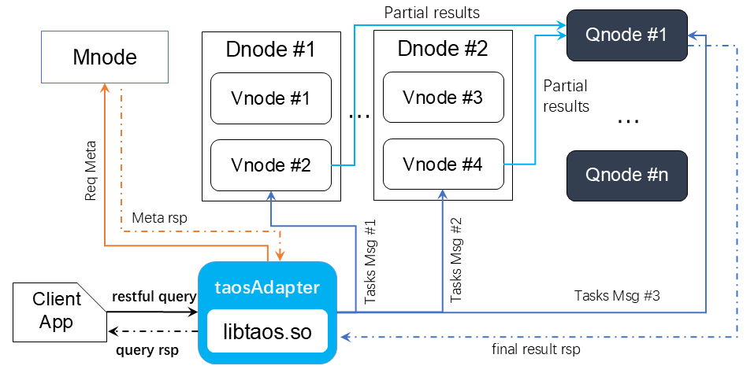
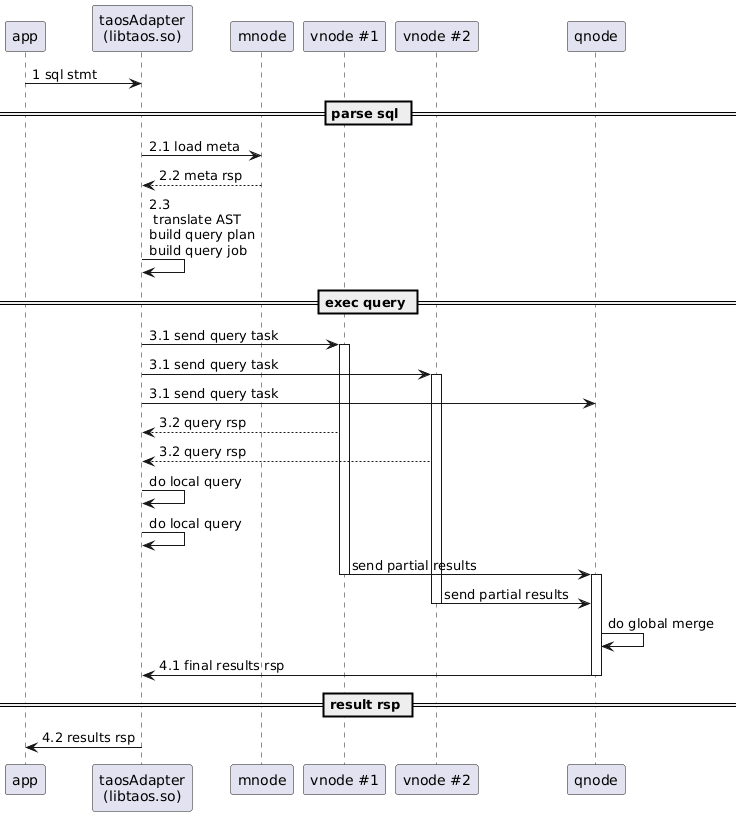
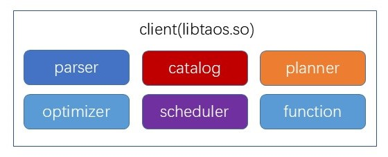
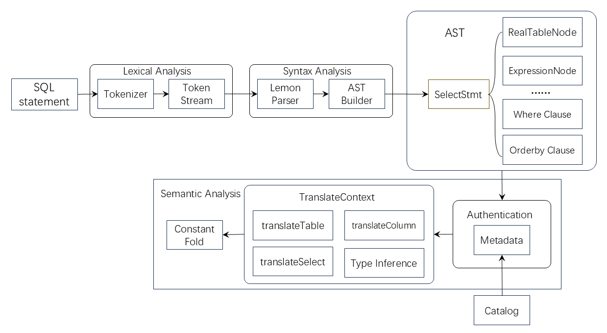
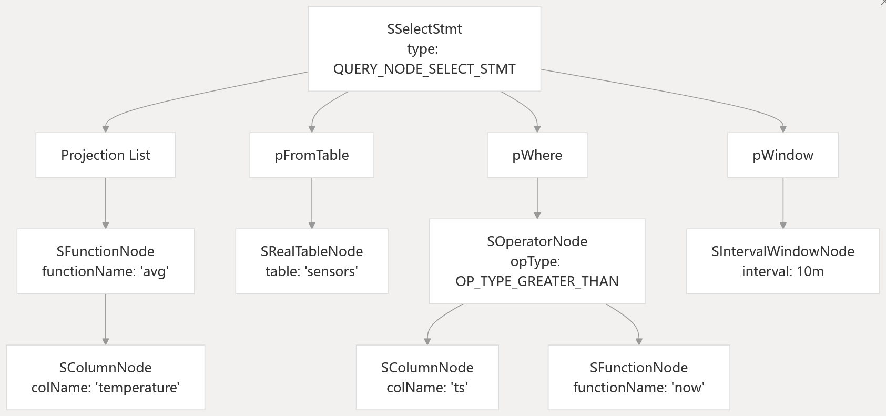
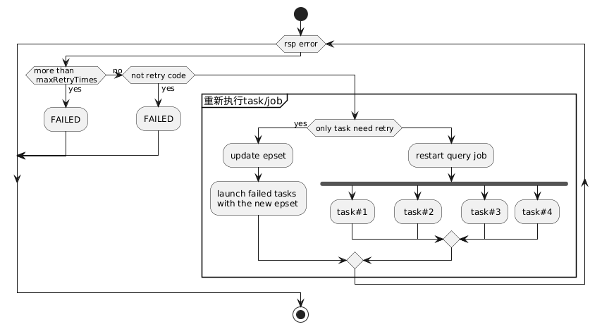

# 时序数据查询模块-Design Spec

## 1. 修订记录

| 编写日期 | 发布日期 | 版本 | 修订人 | 主要修改内容 |
| --- | --- | --- | --- | --- |
| 2025-01-15 | 2025-01-15 | 1.0 | 潘魏 | 第一次安可送测 |
| 2025-11-28 | 2025-11-28 | 1.1 | 廖浩均 | 重构文档 |

## 2. 引言

### 2.1 文档目的

本文档旨在系统性地阐述TDengine时序数据查询引擎的整体架构设计、核心实现原理与关键技术细节。编写本文档的目的有以下三个方面的原因：
第一，确保需求对齐。通过详尽的功能与接口描述，验证查询引擎的设计能够完全满足《时序数据查询引擎-Func Spec》中定义的所有功能性指标，包括但不限于：SQL-92标准兼容性、时序数据专用扩展语法、C/C++ API规范、以及在高并发场景下的实时处理性能要求。
第二，指导开发实践。为TDengine的开发团队、质量保证团队以及后续维护人员提供权威的技术参考。文档将深入解析从SQL语句解析、查询优化、到分布式执行的全链路流程，确保开发工作有章可循。
第三，定义用户体验。明确用户（包括应用开发者与系统运维者）如何通过该引擎获得功能丰富与性能优越的双重体验。这包括利用其完整的SQL支持简化开发，借助其深度优化享受高效率的数据处理能力。

### 2.2 文档范围

本设计文档聚焦于时序数据查询引擎本身，涵盖以下三个层面的内容：

#### 2.2.1 整体架构与模块

深入剖析引擎的层次结构，包括SQL层（语法解析、执行计划优化、执行调度）的构成和服务端执行器架构设计，以及这些关键组件如何构成时序数据查询引擎。文档定义查询引擎核心组件的职责、功能边界、交互协议与关键数据结构，阐明其如何协同工作以应对海量时序数据的挑战。

#### 2.2.2 关键设计考量

阐述在设计过程中为解决时序数据特有的问题（如高吞吐写入、时间窗口聚合、降采样查询等）所采用的技术方案与权衡依据，以及在确保高性能执行查询处理的过程中仍然具备较高的安全性和可靠性所采用的策略。在分布式环境下，高可靠性查询处理的策略和方案。

#### 2.2.3 查询流程详解

以典型查询为例，完整展示 SQL 请求从请求接收、语法解析、执行优化、调度执行到返回结果的完整周期执行细节，并阐明其中涉及的查询元数据缓存、集群容错处理与分布式环境的读写一致性控制机制。

### 2.3 目标读者

本文档目标读者包括以下几类：
1. 核心开发与维护人员：文档的主要受众，需要依据文档进行编码、调试、性能优化和故障排查。
2. 架构师与产品经理：可通过本文档深入理解查询引擎的技术边界与能力范围，为产品规划与技术选型提供决策支持。
3. 技术爱好者与合作伙伴：对于希望深入了解TDengine内核原理、或计划进行二次开发的工程师，本文档提供了完整的入门指南与理论依据。

## 3. 术语

1. **TDengine**：一种高性能、支持分布式架构的时间序列数据库。
2. **结构化查询语言（Structured Query Language，SQL）**：是一种用于管理和操作关系型数据库的标准编程语言。 它允许用户存储、更新、删除、搜索和检索数据库中的数据。 SQL 被广泛应用于各种数据中心应用程序中，是 ISO 和 ANSI 等标准化机构认可的国际标准。
3. **虚拟节点（virtual node，Vnode）**：TDengine 系统中一种逻辑单元，若干个虚拟节点构成一个数据节点。每个虚拟节点包含缓存空间、磁盘空间、负责管理存储在该虚拟节点的时序数据、具备执行查询处理的消息队列和线程池。每个虚拟节点包含若干个表（子表）的数据。
4. **查询节点（query node，Qnode）**：TDengine 集群中只负责运行查询任务的节点，qnode 具有无状态、快速横向扩展、动态部署等能力，是 TDengine 集群存算分离的重要部件。
5. **管理节点（Mnode）**：TDengine 集群中负责监控和维护集群的运行状态，负责分布式事务管理、集群元数据（包括用户、数据库、超级表等）的管理，集群权限控制和安全控制的节点。
6. **客户端（client）**：客户端是用户与TDengine时序数据库集群进行交互的核心入口，它以动态链接库 `libtaos.so`（Linux/Unix 系统）或 `taos.dll`（Windows 系统）的形式存在，为应用程序提供了访问数据库的标准化接口。核心库采用标准 C 语言开发，并在 C/C++ 接口基础上，通过语言绑定提供 Java、Python、Go、Rust等流行编程语言的SDK。客户端基于优化的 TCP 协议实现客户端与集群节点间的高速数据交换，并内置连接池机制，支持多线程环境下的高效并发连接。
7. **抽象语法树（Abstract Syntax Tree， AST）**：是源代码的树状表示，其中每个节点代表代码中的一个结构，如变量、表达式或函数调用，以树的形式展现了它们之间的关系。它是一种抽象的、简化的表示，移除了不必要的细节（如括号），并用于编译和解释器等程序中，以便进行语法检查、语义分析、代码优化和生成目标代码。
8. **无共享架构（Shared nothing Architecture）**：是一种分布式系统架构，其特点是每个处理节点拥有独立的CPU、内存和硬盘，没有共享资源，节点之间通过网络通信来交换数据和结果。这种架构通过将数据进行分割（如分片）并分发到多个独立的服务器上，可以实现近乎无限的扩展性，同时提高了系统的性能和可用性，避免单点故障。
9. **Lemon 语法分析器**：一个用 C 语言编写的 LALR(1) 解析器生成器，与 Bison 和 Yacc 功能类似，但采用了不同的语法设计，生成的解析器运行速度更快，同时具备可重入和线程安全的特性。
10. **多副本机制（Data Replication）**：指在分布式系统中，将同一份数据创建多个完全相同的副本，并将这些副本分布在不同物理节点上。该机制通常遵循主从备份模型（leader/follower model），其中一个副本被指定为主副本（leader），作为所有读写操作的主要入口点，负责验证操作的合法性并将其同步到其他副本（follower），其核心目标在于通过数据冗余来提升系统的可用性、容错能力以及数据访问性能。
11. **查询任务（Query Job）**：通常指在数据库系统针对每次 SQL 查询建立的一个独立、可管理的执行单元，该执行单元能够被查询调度系统追踪和管理，拥有独立的身份标识、完整的执行周期和状态监控。分布式环境中的一个查询任务通常包含若干个可在不同节点上独立执行的子任务（Query Task）构成。
12. **有向无环图（DAG）查询计划**：用于组织和优化查询任务执行的一种数据结构。查询操作被分解为一系列相互关联的计算任务，并通过图的形式明确表达这些任务间的依赖关系与执行顺序。“顶点”通常代表具体的数据操作或计算任务，例如“映射”、“过滤”等。“边“”则表示了数据流动的方向与任务间的依赖关系，一条从顶点A指向顶点B的边意味着任务B的执行依赖于任务A的输出结果。图结构之所以是“无环”的，是因为其依赖关系不允许形成任何循环，从而确保了任务序列的可执行性，避免了因循环依赖导致的任务无法启动的问题。
13. **内存池：**预先分配并管理一大块连续内存的技术，用于高效地处理大量、频繁的小内存请求。它通过一次性向操作系统申请大块内存，并在内部自行分割和回收，避免了频繁的系统调用和内存碎片问题。
14. **分配的内存大小（MS）**：在通过各种内存分配接口从系统分配内存时指定的要分配的内存大小，其值由应用具体指定。
15. **实际分配的内存大小（AMS）**：通过各种内存分配接口从系统分配的实际内存大小，因为内存管理器的实现原因，其值有可能会大于应用指定的分配大小。
16. **实际使用的内存大小（UMS）**：实际使用的内存大小是应用真正从系统获得的物理内存大小，因为物理内存的分配是在实际使用时才会分配，因此 UMS 会小于或等于 AMS，并且根据使用情况的不同其差值可能会存在显著差异。
17. **系统可用内存大小（SAMS）：**某一时刻系统中可以使用的物理内存大小（不含 SWAP）。

## 4. 整体架构设计

### 4.1 概述

TDengine 采用无共享（shared nothing）分布式架构，其查询引擎由客户端（client/driver）、管理节点（Mnode）、若干个虚拟节点（Vnode）和若干个查询节点（Qnode）等多个查询单元共同构成。本章节主要说明查询引擎的整体架构设计。
完整的查询过程如图1 所示。查询构成总体上包含SQL语句分析处理、执行计划的生成、分布式调度执行等关键阶段。首先，用户（Client App）发起 SQL 语句的查询动作，该请求被 taosAdapter 接收，并调用本地 SQL 层处理逻辑，将 SQL 语句经过逻辑执行计划/优化/物理执行计划的转换，然后查询调度器将查询任务发往相应的虚拟节点或查询节点执行。每个接收到任务的虚拟节点（Vnode）负责其本地数据的计算并生成部分结果；随后，这些中间结果（Partial results）被汇聚到调度器指定的节点进行聚合（图1 中  Qnode #1 负责进行聚合），以生成完整的结果。最后， Qnode 负责将查询结果返回 taosAdapter，并由 taosAdapter 将其返回给用户（Client App）。
由于TDengine 采用了无共享分布式架构，每个Vnode存储的数据互不重叠，在复杂查询场景下，查询调度器需要调度多个Vnode和Qnode共同承担计算职责，确保查询的准确性和高效性。


整体架构中涉及的主要组件包括：taosAdapter、虚拟节点（Vnode）、管理节点（Mnode）、查询节点（Qnode），下面分别概述各组件在查询处理过程中的角色和功能。

#### 4.1.1 taosAdapter

taosAdapter 负责接收用户应用 SQL 查询请求的无状态服务节点，并在获得查询结果后将其转换为 json 形式的结果返回给用户应用。taosAdapter 无状态，通过标准化接口将用户应用与数据库系统解耦合。数据库的升级和通讯协议的变更对用户应用完全透明，不会导致其他数据库系统版本更新的（客户端应用和服务器）级联升级问题。
taosAdapter 内置了 libtaos.so，在接收到查询请求以后，负责在本地解析和执行 SQL。客户端首先使用语法解析器将其分解为抽象语法树，并在解析过程中对 SQL 进行初步的语法校验。
在校验通过后，解析器将结合系统元数据依次执行权限验证、语义翻译及常量折叠等处理。完成解析的  AST  将进一步转换为逻辑查询计划，该计划在经过优化器基于代价模型的优化后，再结合虚拟节点（vnode）和查询节点（qnode）的分布状态，被进一步转化为可执行的物理查询计划。
随后，taosAdapter内置的查询调度器将物理计划转换为具体的查询任务，分发至选定的  vnode 或 qnode 执行。待查询结果产生以后，从相应节点取回数据，并最终将其转换为 JSON 格式返回给用户。

#### 4.1.2 管理节点

管理节点（Mnode）在 TDengine  分布式架构中承担元数据管理核心组件的职责，负责统一维护和管理包括数据库、用户、超级表在内的所有元数据信息。它对外提供元数据查询服务，当客户端在执行查询过程中需要获取相关元数据时，会向管理节点发起查询请求，管理节点在验证权限后返回相应的元数据信息。
此外，查询客户端（taosAdapter）通过心跳机制与管理节点保持通信，接收客户端发送的心跳信息并作记录在本地缓存中。通过心跳机制，客户端能够及时感知同步集群元数据的变更，确保元数据的一致性和查询的准确性。
管理节点的双重功能——元数据管理和心跳响应——共同确保了分布式系统元数据的一致性和集群状态的实时同步。

#### 4.1.3 虚拟节点

在分布式查询架构中，虚拟节点（vnode）承担着数据存储与并行计算的双重职责。作为数据存储的基本单元，每个vnode管理着特定时间范围内的时序数据分区；同时作为计算节点，它通过独立维护的任务队列接收并处理来自客户端及其他节点的查询请求。当vnode从队列中获取查询任务后，会执行包括数据读取、过滤、聚合在内的本地计算过程。
完成处理后，系统根据查询计划的执行路径进行结果传递：若查询涉及多级聚合，结果将返回至下游处于等待状态的查询线程；若为最终结果，则直接返回至请求的客户端。这种设计不仅实现了计算任务的分布式执行和负载均衡，还通过独立队列机制避免了资源竞争，从而保证了系统在高并发场景下的查询吞吐量和响应效率。整个处理流程体现了存储与计算紧密结合的设计理念，既充分利用了数据本地性优势，又通过并行处理机制显著提升了查询性能。

#### 4.1.4 查询节点

查询节点（Qnode）是集群中负责执行查询任务的无状态逻辑单元。其核心特征在于逻辑上与物理存储解耦——不直接绑定数据库，因而具备跨库并行处理能力，可同时响应来自多个数据库的查询请求。
客户端发起查询时，首先向管理节点请求获取可用的查询节点列表。若集群中暂无查询节点可用，系统将自动降级，由虚拟节点完成计算任务。当查询节点资源充足时，调度器将依据执行计划将任务智能分配给一个或多个查询节点协同执行。在执行过程中，查询节点可从虚拟节点获取中间结果（Partial Results），通过多级流水线完成复杂计算，最终将结果返回至客户端或传递给下一级处理节点。
这种架构设计实现了计算资源的弹性分配与高效复用，既保证了复杂查询场景下的计算能力，又通过资源解耦提升了集群的整体扩展性与稳定性。

### 4.2 查询处理时序流程



查询执行时序如 图2 所示，主要执行阶段可划分为三个部分，分别是SQL 解析阶段，查询执行阶段，结果返回阶段。对应于 图2 的主要流程，简要介绍各阶段的主要执行逻辑。
1. **SQL解析阶段**
应用（App）通过RESTful接口将SQL查询请求发送至 taosAdapter。taosAdapter 随即调用基于lemon构建的语法解析器，对 SQL 语句进行词法分析与语法解析，完成基础SQL语法规则检查，然后生成抽象语法树（AST）。
初始AST只包含语法结构信息，还不能完全准确地表达查询的真实含义。随后解析器调用元数据目录系统（Catalog）从管理节点获取本次查询相关的元数据信息，并在此基础上将初始抽象语法树转换为语义完整的绑定抽象语法树（bounded  AST）。在转换过程中，解析器将AST中的各种符号（如表名、列名、函数名）与存储在系统元数据目录中的元数据进行绑定。这个过程主要包括：表名解析、列名解析、函数验证、权限校验等，绑定后的AST包含了完整的语义信息，确保查询计划生成器和优化器能够准确理解查询意图。之后，计划生成器基于绑定抽象语法树生成逻辑执行计划，随后由优化器对逻辑计划进行优化和改写。优化后的逻辑计划被转换为包含具体执行步骤的分布式物理执行计划，物理计划是一个有向无环图（DAG），最后将物理计划分层，构建出可在不同数据节点执行的分布式查询任务（Query Job）。具体的解析细节和内容请参见详细设计客户端模块的章节。

1. **查询执行阶段**
查询调度器将分布式查询任务按照所属的虚拟节点（Vnode）分发到对应的虚拟节点执行，并等待查询执行完成后返回结果。各虚拟节点完成本地计算后，将生成的结果发送至下游任务所在的聚合计算节点进行全局聚合计算，最终结果生成后将直接返回给 taosAdapter。具体的执行细节和执行的计划技术细节请参见详细设计部分。

1. **结果返回阶段**
taosAdapter 接收到查询结果后，经由RESTful接口返回至用户应用，至此完成整个查询闭环。该流程通过模块化设计实现了查询任务的分布式处理与结果聚合，确保了系统在高并发场景下的查询性能与结果准确性。

## 5. 设计目标

### 5.1 功能设计目标

查询引擎需要支持以下关键查询类型和查询功能：
1. **关联查询**：因为时序数据库的使用特点，TDengine 只支持含主键时间戳作为关联条件的关联查询，结合时序数据存储有序的特点，因此当前版本优先考虑支持 sort merge join 算法。
2. **嵌套查询**：对于当前版本支持的子查询类型来说，子查询与父查询无需要变换即可以生成一个完整的可执行的查询计划，因此后续按照查询计划分层实现即可。
3. **窗口查询**：因为大多数窗口的划分都逻辑依赖输入数据的顺序，因此我们默认选择根据主键列的顺序来划分窗口。对于时间窗口来说，每个窗口的边界是固定的，因此可以把窗口当作一种分组来处理；而对于其他窗口来说，因为边界不固定，因此只能通过 PIPELINE 的方式进行处理。
4. **多级聚合**：为了充分利用本地计算和分布式计算的性能优势，聚合查询需要在多个层级进行，因此每个聚合函数都需要按照实现逻辑进行两级拆分，第一级按照需要输出中间结果，第二级汇聚多个节点的中间数据后进行聚合运算并得出最终计算结果。
5. **支持视图**：视图定义作为一种元数据存储在管理节点，查询视图时 客户端从管理节点获取其元数据，这些元数据将被缓存并保持更新。在后续的查询处理中，视图将被作为一个子查询进行查询嵌套处理。

### 5.2 技术特点和设计目标

查询引擎设计的技术特点和设计目标如下所示：

#### 5.2.1 查询可靠性

TDengine 分布式时序数据库系统采用多副本机制，来保证系统在面临灾难性故障时的持久性和高可用，采用分布式共识协议（Raft）来保证副本的一致性，多副本机制也是查询可靠性的基础保证。多副本机制的技术细节（可参见《时序数据存储模块-Design Spec》）与查询引擎关系不大，本文在此不赘述。
调度器在调度查询任务的时候，选取状态正常的虚拟节点和查询节点，并通过心跳信息持续获得当前集群内全部可用正常工作的节点。当调度器检测到查询执行节点彻底宕机或网络永久中断时，立即将该节点上所有未完成的任务标记为失败，并将其上的任务重新调度到健康节点上执行。
通过对查询执行节点的持续状态检测和重新调度执行，有效地确保查询可靠地在虚拟节点或查询节点执行。

#### 5.2.2 能力弹性扩展

查询引擎在两个层面上提供查询能力的弹性扩展，分别是：
**查询节点的独立扩展**
计算层查询节点的扩展是为了应对查询并发量的上升和计算延迟的问题，查询引擎允许构建无状态查询节点集群，将计算资源快速动态水平扩展。
由于节点不依赖本地状态，仅负责执行接收到的计算任务（如数据聚合、连接、过滤等），不存储任何持久化的用户数据或会话状态，可以快速启动和停止。当查询负载增加时，可以即时增加新的查询节点；当负载降低时，也可以安全地移除冗余节点，实现按需供给，最大化资源利用率。
**存储与计算的协同扩展**
此外，TDengine 还支持存储模块和计算引擎的协同扩展机制，解耦的设计确保了架构的灵活性和整体的线性伸缩能力。在存储层，可通过虚拟节点分裂机制动态增加虚拟节点数量，实现数据分片的再平衡与查询压力的有效分摊。虚拟节点分裂不仅能动态增加虚拟节点数量，从而实现数据分片的再平衡，有效分散查询热点数据的压力，也允许存储资源随着数据增长而线性扩展。由于查询数据读取或本地聚合可以在虚拟节点执行，因此，分裂虚拟节点也间接地扩展了可进行查询执行的能力。
上述两种扩展方式既可独立实施，也能协同运作，共同应对数据规模与查询并发量的持续增长。

#### 5.2.3 高性能架构

高性能的查询引擎架构依托于多层优化机制。查询任务支持跨节点并发执行，确保在高吞吐场景下仍能维持稳定的低延迟响应；调度执行又确保数据本地性。
查询优化器基于代价模型和时序数据特性生成最优执行计划；执行引擎采用多线程并行处理模式；
**跨节点并发执行**
- 任务分发与调度： 执行引擎通过分布式调度服务将查询任务（或子任务）分发到集群中的多个虚拟节点或查询节点上执行。每个节点独立并行地处理自己的数据分片（由于数据本地性保证，通常的数据分片是本地的数据）。
- 中间结果聚合： 虚拟节点查询任务完成后，查询引擎采用优化的分布式洗牌机制，在网络带宽允许的条件下，高效地收集和合并跨节点产生的中间结果，最终返回给用户。
**数据本地性**
- 最小化网络传输： 为了避免网络 I/O成为瓶颈，查询引擎严格遵循数据本地性原则。调度器会优先将计算任务调度到虚拟节点的 Leader 执行。通过最大化在本地磁盘上执行计算，系统可以有效避免数据在节点间的远距离传输，这是在高吞吐场景下高性能查询引擎执行的关键。
高性能架构的查询引擎是优化器、执行引擎和分布式架构协同作用的结果，通过在每个层次进行精细化优化，确保了在面对海量数据和高并发查询时，系统依然能够提供优异的性能。

#### 5.2.4 运维及可观测性

提升查询引擎可维护性的核心在于能够帮助运维人员快速获取系统当前的状态和近期的历史行为。通过引入专业的诊断命令，查询引擎可以向用户提供实时、精细的系统运行相关记录信息。
- `SHOW QUERIES` / `SHOW APPS`: 这是实时诊断正在运行的查询的关键工具。它允许运维人员查看当前所有活动（Active）和排队（Queued）的查询列表，包括：
  - 查询 ID、用户、来源 IP、查询SQL。
  - 查询开始时间及当前已持续时间，各子任务当前执行状态。
- `EXPLAIN` / `EXPLAIN ANALYZE`: 用于查询执行计划的分析：
  - `EXPLAIN` (逻辑计划): 用于展示查询优化器为给定语句生成的逻辑和物理执行计划（DAG）。运维人员可以借此判断优化器是否选择了最优的路径，例如是否进行了正确的分区剪枝或使用了高效的连接算法。
  - `EXPLAIN ANALYZE` (运行时分析): 实际执行查询并返回执行计划的运行时统计信息，包括每个算子的实际执行时间、处理的行数、读取数据规模、返回结果信息等。这能够精确地找出性能瓶颈所在的操作符，例如数据倾斜或机器负载过高导致的某个算子执行耗时过长。

#### 5.2.5 **查询负载分摊设计**

不同于常规数据库实现，为了充分利用客户端的资源，让客户端承担查询过程中更多的工作，包括查询语句校验与解析、计划的生成与优化、执行信息上报等，甚至可以通过策略配置允许在客户端进行部分执行器功能：1）降低服务器负载。将原本由集群服务器端查询引擎和执行引擎承担的部分计算迁移到客户端，显著减轻了核心服务器集群的压力，提高了服务器端处理高并发请求的能力。2）降低查询延迟，某些查询阶段在本地执行，可以降低或避免网络往返开销。
客户端不再仅仅是一个请求发起者和结果接收者，而是成为查询协作者，承担了查询执行周期中的早期阶段和部分执行功能。
1）查询语句校验与解析。检查查询语句的语法是否正确，以及引用的表名、列名等语义是否有效；将原始 SQL 或其他查询语言解析成抽象语法树。
2）计划的生成与优化。客户端从管理节点获取必要的表结构（schema）、UID、表类型等信息。基于查询计划优化器内置规则，优化查询逻辑计划。诸如谓词下推、常量折叠等。生成分布式执行计划生成，根据超级表数据在虚拟节点分布的信息，计划生成器确定所需访问的虚拟节点，并生成相应的物理执行计划。
3）执行信息上报与反馈。客户端作为查询发起者和计划生成者，同时承担了监控和反馈的责任。监控自己发出的子任务在不同服务器上的执行状态和进度。收集整个查询的端到端延迟、资源消耗、错误信息等，并将其上报给管理节点，为后续的优化和问题诊断提供数据。

#### 5.2.6 **多线程并行执行**

查询引擎采纳了多线程复用模型。在这种架构下，线程被视为一个可共享的、宝贵的计算资源，其分配和使用依据功能进行了精细划分。例如，系统设有专门负责网络通讯的线程池、用于计算密集型任务的查询执行线程池，以及用于返回数据的线程池。
这种模型的核心优势在于单个线程可以高效地处理多个用户的请求。当一个请求因等待 I/O 或网络通信而进入非阻塞等待状态时，该线程不会被闲置或阻塞，而是立即被回收并用于处理来自其他用户或连接的就绪请求。这种高效率的线程周转机制，极大地提升了系统处理并发请求的能力。更进一步，对于一个复杂的查询任务，查询引擎能够将其拆解为多个子任务，并允许这些子任务在多个不同的执行线程中并发处理。这种跨线程、跨核心的并行处理能力，显著加速了单个查询的整体处理速度。

#### 5.2.7 **同步与异步接口**

查询引擎在向客户端提供服务时，必须考虑兼容性和用户编程习惯。传统的应用和编程模式习惯于使用同步接口，为了保持对这部分用户的友好性，系统需要在对外提供的 API 中保留同步接口。
在内部，同步接口的实现是通过创建一个异步任务来处理实际工作，并使用信号量来阻塞并等待结果。同时，为了维持核心服务的吞吐量，系统需要隔离并优化内部的线程池，确保即使外部客户端线程因等待而阻塞，内部执行计算和 I/O 的线程仍然保持无阻塞的异步状态。通过这种设计，系统在保证了核心模块高性能、高并发的同时，也兼顾了不同客户端对于接口模型的需求。

#### 5.2.8 **多样化缓存策略**

在高性能分布式查询系统的设计中，缓存通常是加速数据访问、降低IO开销、提升查询性能的重要手段。但是在时序数据查询引擎中，并没有考虑使用数据缓存将读取的数据或查询结果进行缓存。因为查询过程中读取的时序数据具有高度的顺序性（FIFO）特点。查询集中在时间轴的末端或特定的历史时间窗口。数据一旦被读取和处理，其在短期内被再次访问的概率极低，这意味着数据访问的时间局部性和空间局部性严重缺失。因此LRU、MRU等缓存管理策略都无法很好地解决FIFO 特点的数据读取需求。
此外，由于时序数据的规模通常是巨大的，将有限的内存资源用于缓存这些“一次性”的顺序访问数据，其投入产出比极低，严重影响了系统的整体性能和内存使用效率。因此，我们通常依赖于操作系统的预读机制和磁盘页缓存（Page Cache）机制来提升性能，即将数据缓存的职责委托给操作系统内核。
操作系统的页缓存专为高效 I/O 设计，内置的预读机制（Read-Ahead）能够智能识别顺序访问模式，提前将后续数据块从磁盘加载到内存中。这种方式充分利用了内核对底层硬件和内存管理的优化，有效隐藏了磁盘延迟，是处理大规模顺序 I/O 的理想选择。
与“用后即弃”的顺序访问的时序数据不同，与查询执行相关的元数据，如表模式、虚拟节点信息、用户权限等信息，具有较高稳定性和极高访问频率。查询系统将有限的缓存资源用于保持元数据信息，可以实现查询过程的显著加速。由于几乎每一次查询的语句解析、校验、优化、生成查询任务等阶段，都需要快速访问保存在管理节点和虚拟节点的元数据信息。如果将其缓存在客户端的目录系统（Catalog）内存中，可以避免不必要的网络I/O 延迟。这使得查询优化器能够在短时间内完成复杂的查询优化遍历过程。鉴于元数据在一段时间内是稳定的，可以采用如版本号机制和生存周期结合的方式来维护缓存的一致性，确保了在保证准确性的前提下实现查询加速。

#### 5.2.9 兼容性演进

采用渐进式兼容方案：对早期版本中不符合SQL-92标准的查询语法进行重构，对存在缺陷的功能模块进行修正；同时通过可配置参数保持新旧版本间的平滑过渡，为用户提供可预期的升级路径。

### 5.3 安全设计目标

数据库查询引擎安全设计目标如下：

#### 5.3.1 核心安全理念与设计原则

查询引擎作为数据访问的通道，其安全设计需要超越单点防御概念，转向以“零信任”和“默认安全”为核心的纵深防护体系。确保查询功能高性能的同时，构建覆盖全部数据的安全防线，达到安全与效率的平衡。
安全系统设计需遵循以下原则：最小权限，确保用户和程序仅能访问其必需的数据；默认拒绝，对所有未经明确允许的操作一律禁止。

#### 5.3.2 多维度的安全防护目标

1. 身份认证与精细化访问控制。TDengine 的用户身份认证机制，能够确保用户身份的真实性。对于所有的查询操作，查询引擎在解析 SQL 的时候，内置基于角色的访问控制（RBAC），实现对数据库、表、行甚至字段级别的权限管控。确保其仅能执行被允许的查询类型（SELECT, SHOW）以及访问特定的数据库对象（表、视图、列）
2. 数据处理和传输过程中数据安全与隐私保障。对敏感字段（如个人信息等）进行静态加密或动态脱敏。对于查询结果，引擎应能根据策略自动掩码、哈希或泛化，确保敏感信息不泄露。同时，所有数据在网络传输中必须采用TLS/SSL等加密协议，防止中间人攻击。
3. 合规性与审计溯源为满足日益严格的法规要求，查询引擎记录所有查询操作的完整上下文——包括用户身份、执行时间、SQL语句、访问的数据对象及结果集大小。这些日志不仅用于事后追溯和安全事件分析，更是证明系统合规运行的关键证据。
4. 资源限制与拒绝服务保护。查询引擎针对每次查询提供精细的资源管理，包括单个查询的执行时间（Query Timeouts）、内存消耗控制、以及并发连接数控制。降低潜在的拒绝服务攻击成功的概率，确保系统稳定性。
5. 安全错误处理与信息泄露预防：以安全的方式处理和呈现错误信息。向最终用户返回的错误消息应当是通用的、非描述性的，不包含敏感的系统内部信息、数据库连接字符串、服务器路径或底层架构细节。

#### 5.3.3 实施路径考量

实现上述目标需采取分阶段、体系化的实施路径。首先，整合TDengine集群系统中内置的身份认证与基础访问控制系统；其次，支持数据脱敏与加密策略；最后，具备高级威胁检测与智能化审计功能。同时，需考虑安全措施引入的性能损耗，通过算法优化，构建一个透明、无损且坚韧的安全查询环境。

## 6. 详细设计

### 6.1 模块设计

#### 6.1.1 客户端（libtaos.so）

客户端内部除部分公共模块（如负责通信的 transport 模块）外，查询相关功能可以划分为如下几个模块：



客户端驱动功能模块，对外提供应用编程所需要的 API，内部实现上则串联所有功能以及集成：解析器（Parser）、计划生成器（Planner）、元数据目录（Catalog）、查询优化器（Optimizer）、查询调度器（Scheduler）、本地函数（Function）六个主要模块。

##### 6.1.1.1 核心 API

应用程序通过 Client 模块的对外接口来进行查询功能的触发与驱动，主要驱动接口包括：
1. 同步接口：
```c {wrap}
TAOS_RES *taos_query(TAOS *taos, const char *sql)
TAOS_RES *taos_query_with_reqid(TAOS *taos, const char *sql, int64_t reqid)
```

1. 异步接口：
```c {wrap}
void taos_query_a(TAOS *taos, const char *sql, __taos_async_fn_t fp, void *param)
void taos_query_a_with_reqid(TAOS *taos, const char *sql, __taos_async_fn_t fp, void *param, int64_t reqid)
```

1. 同步（异步）获取查询结果接口：
```c {wrap}
TAOS_ROW taos_fetch_row(TAOS_RES *res)
void taos_fetch_rows_a(TAOS_RES *res, __taos_async_fn_t fp, void *param)
```

##### 6.1.1.2 **解析器（Parser）**

解析器作为查询引擎的 SQL 语句处理核心模块，承担着 SQL 语句到语法树的结构化转换任务。解析器的工作可划分为以下几个主要阶段：


1. 词法分析（Lexical Analysis），调用分词器将 SQL 语句分解为若干个有序符号（Token）输入流；
2. 语法分析（Syntax Analysis），调用语法分析器（有限状态自动机）针对输入的有序符号流进行语法分析；该阶段检查输入的符号流是否满足约定的语法规则。如果输入符号流不满足预定义的语法规则，则解析失败并返回语法错误。
3. 构建抽象语法树（AST），通过语法分析器检查后的符号流，按照预先设置好的转换策略，通过回调的方式，构建AST。构建 AST 的回调过程也是定义在 sql.y 文件中。
4. 语义分析（Semantic Analysis）, 该过程需要与目录元数据服务交互，获得元数据信息，并针对 AST 中的列名、表名、数据库名等信息进行校验和元数据绑定。进行命名空间解析，类型检查，操作权限检查等操作。

###### 6.1.1.2.1 词法分析（Lexical Analysis）

词法分析的目标是将原始的 SQL 字符串转换为有意义的符号流（Token Stream）。
首先调用分词器（Tokenizer）对输入的 SQL 语句进行切分。切分操作主要依赖于识别和使用一系列预定义的分隔符，例如空格 `' '`、制表符 `\t`、换行符 `\n` 等字符，将完整的 SQL 字符串按照这些边界切分成若干独立的单词或潜在的词法单元。
在完成切分之后，系统会对每个独立的单词进行识别和标注。分词器会调用内部预先定义的符号表，尝试将切分出的单词映射、标注为查询引擎内部能够理解和处理的符号（Token）。这些符号代表了 SQL 语言中的基本元素，例如关键字（如 `SELECT`, `FROM`, `WHERE`）、操作符（如 `=`, `+`）、标识符（如表名、列名）以及字面量（如数字、字符串）。
如果分词器在符号映射表中无法找到与当前单词对应的内部符号，例如遇到了拼写错误的关键字或非法的特殊字符，那么分析器会报告词法分析错误（Lexical Error），终止后续的处理流程，并向报告出现词法分析错误的位置。
只有在所有单词都成功被识别和标注的前提下，词法分析阶段才算成功。最终，所有经过切分和识别后的单词流被完全转化成为对应的符号流（Token Stream），这个有序的符号序列将作为输入，送往 SQL 解析的下一阶段——语法分析，进行处理。

###### 6.1.1.2.2 **语法分析（Syntax Analysis）**

语法分析是编译SQL语句的一个重要阶段，其主要任务是检查 SQL语句是否符合语法规则，并将其转换为中间表示形式——抽象语法树（AST）。
**语法规则定义**
对于查询引擎支持的每一种 SQL 语句类型（例如 `SELECT`、`INSERT`、`UPDATE`、`CREATE TABLE` 等），都预先定义一个对应的语法规则，并定义了一个与之对应的抽象语法树节点（Abstract Syntax Tree Node）。同时，解析器还准备了一个用于创建和初始化该节点数据结构的回调函数。抽象语法树节点是解析器内部表达 SQL 语句逻辑结构的核心数据单元，代表了操作符、表达式、子句等逻辑概念。
解析器使用了 Lemon 语法分析器来定义语法规则。全部查询语法均定义在 sql.y 文件中，sql.y 文件内容如下所示：
```yaml {wrap}
cmd ::= query_or_subquery(A).                         { pCxt->pRootNode = A; }
query_or_subquery(A) ::= query_expression(B).         { A = B; }
query_or_subquery(A) ::= subquery(B).                 { A = releaseRawExprNode(pCxt, B); }
query_expression(A) ::= query_simple(B) order_by_clause_opt(C) slimit_clause_opt(D) limit_clause_opt(E).        {         A = addOrderByClause(pCxt, B, C);
                                      A = addSlimitClause(pCxt, A, D);
                                      A = addLimitClause(pCxt, A, E);   }
```

**解析与 AST 的同步构建**
在语法分析过程中，解析器会依据预先定义的语法规则，自上而下地解析输入的符号流。当解析器识别到符号流的序列满足某一特定的语法规则时，它会自动且同步地调用在该语法规则文件中设置的回调函数。这个回调函数负责创建并填充与之对应的抽象语法树节点，将解析得到的数据（例如表名、列名、操作数、条件表达式等）封装进该节点的数据结构中。因此，AST 的构建是与语法分析过程同步进行的，每当解析器成功识别一个有效的语法结构，相应的 AST 节点就会被立即创建并连接到抽象语法树上。



**错误处理与输出**
解析器持续地工作，通过这种递归且同步的机制，逐步将整个符号流转化为一个完整的树形结构。最终，当所有的符号都被成功解析并消耗完毕后，一个完整的 AST 便建立完成。这棵 AST 成为了原始 SQL 语句的精确、层次化的内部表示，随后将被送往绑定元数据的阶段。
如果输入的符号流在任何时刻不满足预定义的任何语法规则，即解析器无法识别出符合预期的结构，那么语法分析器将立即报告语法错误（Syntax Error），并精确指出发生错误的符号以及其在原始 SQL 字符串中的位置，确保用户能够快速定位和修正 SQL 语句中的结构性错误。

###### 6.1.1.2.3 **语义分析**

语义分析递归地遍历抽象语法树（AST）的每个节点，执行一系列检查与验证工作，并将 AST 中的节点绑定元数据信息，成为绑定 AST。主要的操作包含以下内容：

###### 6.1.1.2.4 元数据获取

语义分析需要先获取当前 AST 所涉及的元数据信息，包括：数据库信息、用户信息、表信息、列信息等。首先，遍历 AST 获取所有涉及的元数据目标对象，包括db、用户、函数、表等对象；然后调用 Catalog 模块提供的异步元数据获取接口进行批量元数据查询操作；最后元数据信息返回后回调语义分析接口继续语义分析。

###### 6.1.1.2.5 权限检查

在获取元数据以后，根据用户配置的权限信息，对查询涉及的数据库、表、视图的操作进行权限检查。当用户出现越权访问时返回错误信息。

###### 6.1.1.2.6 AST翻译

权限检查通过以后，首先对于某些特定类型的 AST 进行重写，例如将 `SHOW` 语句转换为元数据表的查询语句。`show tables` 转换为 `select table_name  from information_schema.ins_tables where db_name = current_db()` ；2）添加命名空间，AST中的表名、列名、数据库标识符与实际的表、列、数据库关联。确定每个列所属的表以及该列对应的数据类型；确认 `FROM` 子句中引用的表确实存在于数据库中，并验证 `SELECT` 列表中的所有列名是否属于这些表中，同时处理别名和命名空间冲突的问题。

###### 6.1.1.2.7 类型推演

对于涉及算术或逻辑操作的表达式，基于输入列类型推导出表达式返回类型；
处理 AST 表达式中的隐式数据类型转换；
解析表达式中的类型兼容检查，例如时间戳类型不能计算长度等。

###### 6.1.1.2.8 常量折叠

对常量表达式进行计算，避免在执行时按数据量进行反复计算。除此之外，在此模块还会做其余两件事：
1. 根据常量表达式的结果来推导语句是否没有返回结果集。例如语句中存在 `WHERE 1=2` 条件。
2. 无用列优化，即子查询中 SELECT 子句后的列在父查询中没有使用。

###### 6.1.1.2.9 关键数据结构

1. AST 节点结构定义主体内容如下：
```c {wrap}
typedef struct SSelectStmt {
  ENodeType     type;  // QUERY_NODE_SELECT_STMT
  bool          isDistinct;
  SNodeList*    pProjectionList;
  SNode*        pFromTable;
  SNode*        pWhere;
  SNodeList*    pPartitionByList;
  SNodeList*    pTags;      // for create stream
  SNode*        pSubtable;  // for create stream
  SNode*        pWindow;
  SNodeList*    pGroupByList;  // SGroupingSetNode
  SNode*        pHaving;
  SNode*        pRange;
  SNode*        pRangeAround;
  SNode*        pEvery;
  SNode*        pFill;
  SNodeList*    pOrderByList;  // SOrderByExprNode
  SLimitNode*   pLimit;
  SLimitNode*   pSlimit;
  STimeWindow   timeRange;
  SNodeList*    pHint;
  char          stmtName[TSDB_TABLE_NAME_LEN];
  uint8_t       precision;
  int32_t       selectFuncNum;
  int32_t       returnRows;  // EFuncReturnRows
  ETimeLineMode timeLineCurMode;
  ETimeLineMode timeLineResMode;
  int32_t       lastProcessByRowFuncId;
  //...
} SSelectStmt;
```

##### 6.1.1.3 **计划生成器（Planner）**

计划生成器（Planner/Optimizer）模块是分布式查询引擎的核心组件，其首要职责是将经过语义分析验证的 AST 转换为可供查询执行引擎高效执行的分布式物理执行计划。
转换过程是一个标准化的多阶段流程。首先基于绑定的 AST 生成初始逻辑查询计划（Logical Query Plan）。该初始计划随后进入逻辑优化阶段，通过应用优化规则（Optimization Rules）对其进行系统化重构。这些关键优化技术包括但不限于谓词下推（Predicate Pushdown），旨在尽早过滤数据，减少处理量；列裁剪（Column Pruning），仅保留查询所需的列，降低 I/O 开销；以及扫描顺序优化，结合查询函数调整对时序数据升序或降序的扫描顺序，以最小化查询I/O开销。
在逻辑优化完成后，物理计划生成器基于逻辑计划构建物理执行计划。该模块会根据虚拟节点在集群中的分布，将优化的逻辑计划拆分为多个可并行执行的子任务单元（Query Task）。然后将任务复制到所有的有数据分布的虚拟节点，并最终完成分布式物理执行计划的构建。

###### 6.1.1.3.1 逻辑计划生成器

该模块的核心功能是将抽象语法树转换为由逻辑计划节点构成的树形结构——逻辑计划。此转换过程本质上是依据SQL语义执行顺序，将各个子句逐一映射为对应的逻辑计划节点，例如FROM子句对应SCAN节点，GROUP BY子句对应AGG节点。
在逻辑计划生成中，需要考虑以下设计要点：
- 首先，查询语句生成的逻辑计划始终保持树形结构。这棵树本身构成一个完整的子计划，通过后序遍历确定各算子的执行顺序。
- 逻辑计划树遵循自底向上的处理原则：父节点的输入数据来源于其所有子节点的输出结果。每个逻辑计划节点都会输出一张具有唯一列名的 TargetNode 节点表，父节点通过列名引用这些数据列。
- 每个逻辑计划节点对输入数据都有明确的结构化要求，同时其输出数据也具备可预测的特征模式。例如，特定节点可能要求输入数据保持全局有序，同时确保输出数据实现组内有序。
- 值得注意的是，某些SQL子句并不对应独立的逻辑计划节点。具体而言，过滤子句（WHERE和HAVING）以及限制条目子句（LIMIT和SLIMIT）、过滤子句（FILTER）均作为通用属性集成在各类逻辑计划节点中，而非以独立节点形式存在。

###### 6.1.1.3.2 逻辑计划优化（Plan Optimizer）

该模块作为查询优化器的核心组件，专门负责对初始逻辑计划进行深度优化。其核心目标是通过系统性的改进策略，显著降低查询执行的复杂度，优化资源利用效率，从而提升整体查询性能，实现更低的执行耗时与资源开销。
在架构设计上，该模块采用规则驱动的迭代优化框架，包含以下关键特性：
1. 采用迭代式优化机制，持续应用优化规则直到逻辑计划达到最优状态
2. 每条优化规则具有明确的功能专一性，专注于解决特定类型的优化问题
3. 优化过程在节点层面进行精细化改造，确保最终输出的逻辑计划仍保持完整的树形结构，且作为一个逻辑完整的子计划单元
该优化器通过对逻辑计划节点的重构、替换与重组，在保持语义等价性的前提下，实现执行效率的最大化。
针对时序数据查询处理的过程优化，优化规则包括以下主要内容：

| 序号 | 优化策略名称 | 说明 |
| --- | --- | --- |
| 1 | ScanPath | 扫描顺序优化器（first 顺序扫描和 last 逆序扫描） |
| 2 | PushDownCondition | 过滤条件下推优化 |
| 3 | JoinCondOptimize | 联合查询的条件优化 |
| 4 | HashJoin | Hash join 优化 |
| 5 | StableJoin | 超级表连接优化 |
| 6 | GroupJoin | 分组连接优化 |
| 7 | SortPrimaryKey | ts 排序下推和无效 sort 删除优化 |
| 8 | SortForjoin | 排序后连接查询优化 |
| 9 | PushDownLimit | Limit 条件下推 |
| 10 | PartitionTags | 标签分组优化 |
| 11 | MergeProjects | 归并投影优化 |
| 12 | RewriteTail | Tail 查询重写优化 |
| 13 | RewriteUnique | Unique 查询重写优化 |
| 14 | splitCacheLastFunc | last_row 查询优化 |
| 15 | LastRowScan | 最后一条记录缓存扫描优化 |
| 16 | TagScan | 标签扫描优化 |
| 17 | TableCountScan | 表计数统计优化 |
| 18 | EliminateProject | 清除无用投影操作 |
| 19 | EliminateSetOperator | 清除无用集合操作 |
| 20 | PartitionCols | 按列分组优化 |
| 21 | Tsma | 启用 tsma 优化 |

###### 6.1.1.3.3 逻辑计划分拆

此模块对逻辑计划进行分布式拆分，分布式拆分是将逻辑计划中可以分布式并行执行的节点（及其子节点）拆分为两个或多个子计划。此模块包括：迭代拆分过程和拆分规则两部分。
拆分器的关键设计点包括：
- 拆分过程是迭代式执行，遍历所有的拆分规则直到没有任何拆分规则可以进行为止；
- 每条拆分规则的目的具有唯一性，也就是说每条规则只做一种拆分；
- 在子计划层面对逻辑计划进行拆分。拆分完成后输出的逻辑计划依然是一个包含了多个子计划的树形结构。
逻辑计划的分布式拆分是以下两个依据：
- 分布式存储的数据。因为存储是分布式的，所以和存储相关的逻辑计划（即逻辑计划中有 SCAN 节点）需要分布式执行，需要在这里拆分出来。
- 可并行的查询过程。逻辑计划中没有 SCAN 节点，且其中的节点都是可以进行并行运算的，则可以在这里拆分出来。对于我们来说，因为目前还没有基于 shuffle 的算子，所以这里只有一种情况，就是 查询节点。
拟支持的拆分规则包括：

| 序号 | 名称 | 说明 |
| --- | --- | --- |
| 1 | SuperTableSplit | 如果查询超级表，将其拆分到每个 vnode 中执行 |
| 2 | SingleTableJoinSplit | 单表连接查询分拆，将其分拆到两个单表所在的 vnode 中执行 |
| 3 | UnionAllSplit | Union all 分拆 |
| 4 | UnionDistinctSplit | Union 分拆 |
| 5 | InsertSelectSplit | 写入查询结果分拆，将查询然后写入到对应的 vnode |

###### 6.1.1.3.4 物理计划生成器

物理计划的具有典型的层次化执行结构上。整体上，物理计划是一个有向无环图，计划的构建遵循自底向上的原则，每个父节点（下游节点）的执行都依赖于其所有子节点（上游节点）的输出结果，这种结构保证了数据流的正确传递和处理逻辑的完整性。
在分布式环境中的物理计划由若干个相互关联的子计划（Subplans）构成。每个子计划本质上都是一棵物理操作符树（Physical Operator Tree），其中在子计划中封装了如下关键信息：
- 执行位置信息（Execution Location）：指定该子计划应该被调度到哪个节点（如数据节点 VNode 或查询节点 QNode）执行，以充分利用数据本地性的优势，最大程度地减少网络数据传输。
- 任务执行内容（Task Execution Content）：定义了该子计划包含的树形算子（Operators）及其执行顺序，形成了完整的数据处理流水线（Pipeline）。
- 算法实现策略（Algorithm Strategy）：为每个运算操作，如连接或聚合，选择最优的物理执行算法（如哈希连接或归并连接），充分考虑了当前的数据特征和底层硬件资源。
- 执行环境信息（Runtime Context）：包含任务执行所需的内存分配预留、并发控制、结果缓存等运行时参数。
在具体实现中，逻辑计划节点到物理计划节点的转换需要处理多种不同的场景。例如，一个SCAN逻辑计划节点可能根据查询条件和数据分布，转换为多种不同的物理执行方式，包括全表扫描（TABLE SCAN）、表合并扫描（TABLE MERGE SCAN）以及 LAST_ROW SCAN 等多种物理计划节点。
物理计划生成器的关键点如下：
1. 数据结构设计：物理计划采用有向无环图表示，具有清晰的层次关系。执行顺序严格按照从底层节点向上层节点推进的方式运作。
2. 数据流管理：在物理计划中，父节点的输入数据来源于其所有子节点的输出结果。每个物理计划节点都会输出一个列表 TargetNode，对输出各列通过唯一序号（SlotId）进行标识，父节点依据这些序号来引用所需的数据列。
3. 执行保证机制：每个物理计划节点都明确指定了执行算法，执行器必须确保该节点的输出完全符合所采用算法的规范要求。
这种设计确保了查询计划能够高效执行，同时为分布式环境下的任务调度和并行处理提供了良好的基础架构。最终生成的分布式物理执行计划 DAG 将由 Scheduler 接管并调度执行。调度器根据计划中指定的节点类型，将相应的子任务分发到对应的 Vnode（存储节点）、Qnode（查询计算节点）或 Mnode（管理节点）上执行。这种精细化的设计确保了查询任务能够在分布式环境中高效、可靠地执行，同时最大限度地利用了集群的计算资源。

###### 6.1.1.3.5 关键数据结构

1. 逻辑子计划结构：
```c {wrap}
typedef struct SLogicSubplan {
  ENodeType     type;
  SSubplanId    id;
  SNodeList*    pChildren;
  SNodeList*    pParents;
  SLogicNode*   pNode;
  ESubplanType  subplanType;
  SVgroupsInfo* pVgroupList;
  int32_t       level;
  int32_t       splitFlag;
  int32_t       numOfComputeNodes;
} SLogicSubplan;
```

1. 物理子计划结构：
```c {wrap}
typedef struct SSubplan {
  ENodeType      type;
  SSubplanId     id;  // unique id of the subplan
  ESubplanType   subplanType;
  int32_t        msgType;  // message type for subplan, used to denote the send message type to vnode.
  int32_t        level;    // the execution level of current subplan, starting from 0 in a top-down manner.
  char           dbFName[TSDB_DB_FNAME_LEN];
  char           user[TSDB_USER_LEN];
  SQueryNodeAddr execNode;      // for the scan/modify subplan, the optional execution node
  SQueryNodeStat execNodeStat;  // only for scan subplan
  SNodeList*     pChildren;     // the datasource subplan,from which to fetch the result
  SNodeList*     pParents;      // the data destination subplan, get data from current subplan
  SPhysiNode*    pNode;         // physical plan of current subplan
  SDataSinkNode* pDataSink;     // data of the subplan flow into the datasink
  SNode*         pTagCond;
  SNode*         pTagIndexCond;
  bool           showRewrite;
  bool           isView;
  bool           isAudit;
  bool           dynamicRowThreshold;
  int32_t        rowsThreshold;
} SSubplan;
```

1. 查询计划结构：
```c {wrap}
typedef struct SQueryPlan {
  ENodeType    type;
  uint64_t     queryId;
  int32_t      numOfSubplans;
  SNodeList*   pSubplans;  
  // Element is SNodeListNode. The execution level of subplan, starting from 0.
  SExplainInfo explainInfo;
  void*        pPostPlan;
} SQueryPlan;
```

##### 6.1.1.4 **数据目录（Catalog）模块**

元数据目录模块负责管理所有元数据相关的操作，具体功能包括：元数据的获取、缓存、更新、删除等。元数据可能从 管理节点 或 虚拟节点获取，提供事件驱动、错误驱动、定时更新等机制来保证缓存的一致性。

###### 6.1.1.4.1 接口

因为 数据目录模块负责维护所有类型的元数据，因此在不同的使用场景下需要提供不同的接口，这些接口可以分为以下几类：
1. 元数据获取类接口
```c {wrap}
int32_t catalogAsyncGetAllMeta(SCatalog* pCtg, SRequestConnInfo* pConn, const SCatalogReq* pReq, catalogCallback fp, void* param, int64_t* jobId);
int32_t catalogGetDBVgList(SCatalog* pCatalog, SRequestConnInfo* pConn, const char* pDBName, SArray** pVgroupList)；
int32_t catalogGetDBVgVersion(SCatalog* pCtg, const char* dbFName, int32_t* version, int64_t* dbId, int32_t* tableNum, int64_t* stateTs)；
int32_t catalogGetDBVgInfo(SCatalog* pCtg, SRequestConnInfo* pConn, const char* dbFName, TAOS_DB_ROUTE_INFO* pInfo)；
int32_t catalogGetTableMeta(SCatalog* pCatalog, SRequestConnInfo* pConn, const SName* pTableName, STableMeta** pTableMeta)；
int32_t catalogGetSTableMeta(SCatalog* pCatalog, SRequestConnInfo* pConn, const SName* pTableName, STableMeta** pTableMeta)；
int32_t catalogGetCachedTableMeta(SCatalog* pCtg, const SName* pTableName, STableMeta** pTableMeta)；
int32_t catalogGetCachedSTableMeta(SCatalog* pCtg, const SName* pTableName, STableMeta** pTableMeta)；
int32_t catalogGetTablesHashVgId(SCatalog* pCtg, SRequestConnInfo* pConn, int32_t acctId, const char* pDb, const char* pTableName[], int32_t tableNum, int32_t *vgId)；
int32_t catalogGetCachedTableHashVgroup(SCatalog* pCtg, const SName* pTableName, SVgroupInfo* pVgroup, bool* exists)；
int32_t catalogGetCachedTableVgMeta(SCatalog* pCtg, const SName* pTableName,          SVgroupInfo* pVgroup, STableMeta** pTableMeta)；
int32_t catalogGetTableHashVgroup(SCatalog* pCatalog, SRequestConnInfo* pConn, const SName* pName, SVgroupInfo* vgInfo)；
int32_t catalogGetQnodeList(SCatalog* pCatalog, SRequestConnInfo* pConn, SArray* pQnodeList)；
int32_t catalogGetDnodeList(SCatalog* pCatalog, SRequestConnInfo* pConn, SArray** pDnodeList)；
int32_t catalogGetDBCfg(SCatalog* pCtg, SRequestConnInfo* pConn, const char* dbFName, SDbCfgInfo* pDbCfg)；
int32_t catalogGetTableIndex(SCatalog* pCtg, SRequestConnInfo* pConn, const SName* pTableName, SArray** pRes)；
int32_t catalogGetUdfInfo(SCatalog* pCtg, SRequestConnInfo* pConn, const char* funcName, SFuncInfo* pInfo)；
int32_t catalogGetViewMeta(SCatalog* pCtg, SRequestConnInfo* pConn, const SName* pViewName, STableMeta** pTableMeta)；
int32_t catalogGetTableTsmas(SCatalog* pCtg, SRequestConnInfo* pConn, const SName* pTableName, SArray** pRes)；
int32_t catalogGetTsma(SCatalog* pCtg, SRequestConnInfo* pConn, const SName* pTsmaName, STableTSMAInfo** pTsma)；
```

1. 元数据更新类接口
```c {wrap}
int32_t catalogUpdateDBVgInfo(SCatalog* pCatalog, const char* dbName, uint64_t dbId, SDBVgInfo* dbInfo)；
int32_t catalogUpdateDbCfg(SCatalog* pCtg, const char* dbFName, uint64_t dbId, SDbCfgInfo* cfgInfo)；
int32_t catalogUpdateTableMeta(SCatalog* pCatalog, STableMetaRsp* rspMsg)；
int32_t catalogAsyncUpdateTableMeta(SCatalog* pCtg, STableMetaRsp* pMsg)；
int32_t catalogRefreshDBVgInfo(SCatalog* pCtg, SRequestConnInfo* pConn, const char* dbFName)；
int32_t catalogRefreshTableMeta(SCatalog* pCatalog, SRequestConnInfo* pConn, const SName* pTableName, int32_t isSTable)；
int32_t catalogRefreshGetTableMeta(SCatalog* pCatalog, SRequestConnInfo* pConn, const SName* pTableName, STableMeta** pTableMeta, int32_t isSTable)；
int32_t catalogUpdateTableIndex(SCatalog* pCtg, STableIndexRsp* pRsp)；
int32_t catalogUpdateUserAuthInfo(SCatalog* pCtg, SGetUserAuthRsp* pAuth)；
int32_t catalogUpdateVgEpSet(SCatalog* pCtg, const char* dbFName, int32_t vgId, SEpSet* epSet)；
int32_t catalogUpdateDynViewVer(SCatalog* pCtg, SDynViewVersion* pVer)；
int32_t catalogUpdateViewMeta(SCatalog* pCtg, SViewMetaRsp* pMsg)；
int32_t catalogUpdateTSMA(SCatalog* pCtg, STableTSMAInfo** ppTsma)；
```

1. 清除本地缓存接口
```c {wrap}
int32_t catalogRemoveDB(SCatalog* pCatalog, const char* dbName, uint64_t dbId);
int32_t catalogRemoveTableMeta(SCatalog* pCtg, SName* pTableName);
int32_t catalogRemoveStbMeta(SCatalog* pCtg, const char* dbFName, uint64_t dbId, const char* stbName, uint64_t suid);
int32_t catalogRemoveViewMeta(SCatalog* pCtg, const char* dbFName, uint64_t dbId, const char* viewName, uint64_t viewId)；
int32_t catalogRemoveTSMA(SCatalog* pCtg, const STableTSMAInfo* pTsma)；
```

当请求抵达元数据目录服务时，系统会优先在本地缓存中检索目标信息。若缓存命中，则直接返回已存储的元数据信息，此举可有效避免频繁的远程调用带来的网络开销。当本地缓存未命中时，系统会自动启动元数据获取流程。

###### 6.1.1.4.2 **依赖驱动的请求管理**

当需要从远端（管理节点或虚拟节点）读取元数据的时候，数据目录模块将不同类型的元数据请求拆分为独立的子请求单元，并建立完整的任务管理生命周期，处理流程包含三个阶段：
依赖树构建：根据元数据间的逻辑关联生成请求拓扑网络。例如在获取数据表元数据前，需先获得其所属数据库的虚拟分组信息，此时系统会自动将数据库虚拟分组查询设定为前置依赖子请求；
请求合并优化：识别任务队列中的相同类型请求，将其合并为单一批次操作。典型场景如多个数据表均需获取同一数据库信息时，系统会将这些请求聚合成一个子请求，避免重复查询操作；
顺序执行与递进处理：严格按照依赖关系定义的优先级顺序依次发送请求。系统会动态跟踪每个子请求的完成状态，在满足前置条件后立即触发后续子请求的执行，直至所有元数据获取任务完成。
通过实施多层缓存、批量合并与依赖排序等优化机制，系统在元数据密集型查询场景中可有效降低响应延迟，并大幅提升系统资源利用率。 
同时，为提升整体吞吐量，元数据目录服务会对请求进行合并，将同类操作合并为一个批次的任务统一处理，显著减少系统网络交互的开销。

###### 6.1.1.4.3 目录元数据缓存

1. **缓存管理**
目录元数据在目录系统中的缓存以分层哈希表形式在内存中临时存储，不进行持久化保存，并可配置可用的缓存空间大小。所有元数据信息按照集群、数据库、表的层级进行对应划分，按照归属关系在哈希表中保存。
缓存管理的关键设计点包括：
1. 考虑到在大多数使用场景下，缓存的使用规律都是读多写少，因此缓存设计为多线程读、单线程写的模型；
2. 大多数场景下缓存的更新都应该是异步操作，不阻塞业务线程后续处理；
3. 根据元数据信息存储的层级和对象进行异步访问控制，降低并发访问的冲突；
4. **一致性设计**
作为元数据的缓存模块，必然会面临的一个问题就是缓存的一致性问题。因为不同业务对缓存的使用在一致性方面的不同要求，例如查询允许缓存不一致的情况，而写入则要求缓存必须一致，考虑设计实现以下几种缓存更新策略并结合使用：
1. 定时更新。适用于数量较少更新不频繁的对象，例如数据库信息、超级表信息等，同时通过引入租期管理的方式避免集中更新引入新的问题。
2. 事件驱动更新。特定事件发生时触发缓存更新操作，例如修改表会、删除表会触发缓存的表元数据更新。
3. 错误驱动更新。当管理节点校验到目录系统缓存的数据内容与本地的元数据信息不一致时，通过返回错误码的方式触发目录系统更新本地临时缓存，同时通过请求重试的方式解决错误问题。

###### 6.1.1.4.4 关键数据结构

1. 集群级别缓存结构
```c {wrap}
typedef struct SCatalog {
  uint64_t        clusterId;
  bool            stopUpdate;
  SDynViewVersion dynViewVer;
  SHashObj*       userCache;  // key:user, value:SCtgUserAuth
  SHashObj*       dbCache;    // key:dbname, value:SCtgDBCache
  SCtgRentMgmt    dbRent;
  SCtgRentMgmt    stbRent;
  SCtgRentMgmt    viewRent;
  SCtgRentMgmt    tsmaRent;
  SCtgCacheStat   cacheStat;
} SCatalog;
```

1. 数据库级别缓存结构
```c {wrap}
typedef struct SCtgDBCache {
  SRWLatch     dbLock;  // RC between destroy tbCache/stbCache and all reads
  uint64_t     dbId;
  int8_t       deleted;
  SCtgVgCache  vgCache;
  SCtgCfgCache cfgCache;
  SHashObj*    viewCache; // key:viewname, value:SCtgViewCache
  SHashObj*    tbCache;   // key:tbname, value:SCtgTbCache
  SHashObj*    stbCache;  // key:suid, value:char*
  SHashObj*    tsmaCache;  // key:tbname, value: SCtgTSMACache
  int32_t      tsmaVersion;
  uint64_t     dbCacheNum[CTG_CI_MAX_VALUE];
  uint64_t     dbCacheSize;
} SCtgDBCache;
```

1. 表级别缓存结构
```c {wrap}
typedef struct SCtgTbCache {
  SRWLatch           metaLock;
  SRWLatch           indexLock;
  STableMeta*        pMeta;
  STableIndex*       pIndex;
} SCtgTbCache;
```

##### 6.1.1.5 **查询调度器（Scheduler）**

查询调度器模块基本功能为按照分布式执行计划进行任务调度，并确保最终执行计划得到完整的执行。调度器需要与服务端配合完成全局的任务调度管理工作，并针对执行错误进行相应的处理以及错误恢复等相关工作。

###### 6.1.1.5.1 分布式调度

查询调度模块在接收到执行计划后，按照如下步骤完成分布式任务的调度：
1. 首先需要按照执行计划进行任务的拆分与映射，整个计划被映射为一个任务，每个子计划被映射为子任务，按照子计划的父子依赖关系构建任务的层级及依赖关系。
2. 按照层级由低到高的顺序依次调度执行子任务，每个子任务执行成功后，调度其父任务启动执行，在底层所有子任务都执行成功后，调度其上一层所有还未启动的任务进行执行。
3. 在所有子任务都启动执行并成功后，由应用通过 API 驱动后续查询结果的获取工作。

###### 6.1.1.5.2 查询任务执行重试

为了提升查询可靠性，改善用户体验，需要对一些可以恢复的错误场景进行重试处理，例如网络闪断问题、缓存不一致问题、虚拟节点和管理节点主从切换、虚拟节点副本数量变换、数据节点宕机等场景。


###### 6.1.1.5.3 对外接口

1. 计划执行接口：
```c {wrap}
int32_t schedulerExecJob(SSchedulerReq* pReq, int64_t* pJob);
```

1. 查询结果获取接口：
```c {wrap}
int32_t schedulerFetchRows(int64_t jobId, SSchedulerReq* pReq);
```

###### 6.1.1.5.4 关键数据结构

1. 查询消息结构：
```c {wrap}
typedef struct SSubQueryMsg {
  SMsgHead header;
  uint64_t sId;
  uint64_t queryId;
  uint64_t clientId;
  uint64_t taskId;
  int64_t  refId;
  int32_t  execId;
  int32_t  msgMask;
  int8_t   taskType;
  int8_t   explain;
  int8_t   needFetch;
  int8_t   compress;
  uint32_t sqlLen;
  char*    sql;
  uint32_t msgLen;
  char*    msg;
} SSubQueryMsg;
```

1. 任务结构：
```c {wrap}
typedef struct SSchJob {
  int64_t          refId;
  uint64_t         queryId;
  SSchJobAttr      attr;
  int32_t          levelNum;
  int32_t          taskNum;
  SRequestConnInfo conn;
  SArray          *nodeList;  // qnode/vnode list, SArray<SQueryNodeLoad>
  SArray          *levels;    // starting from 0. SArray<SSchLevel>
  SQueryPlan      *pDag;
  int64_t          allocatorRefId;

  SArray   *dataSrcTasks;  // SArray<SQueryTask*>
  int32_t   levelIdx;
  SEpSet    dataSrcEps;
  SHashObj *taskList;
  SHashObj *execTasks;  // executing and executed tasks, key:taskid, value:SQueryTask*
  SHashObj *flowCtrl;   // key is ep, element is SSchFlowControl

  SExplainCtx         *explainCtx;
  int8_t               status;
  int8_t               inRetry;
  SQueryNodeAddr       resNode;
  tsem_t               rspSem;
  SSchOpStatus         opStatus;
  schedulerChkKillFp   chkKillFp;
  void                *chkKillParam;
  SSchTask            *fetchTask;
  int32_t              errCode;
  int32_t              redirectCode;
  SRWLatch             resLock;
  SExecResult          execRes;
  void                *fetchRes;  // TODO free it or not
  bool                 fetched;
  bool                 noMoreRetry;
  int64_t              resNumOfRows;  // from int32_t to int64_t
  SSchResInfo          userRes;
  char                *sql;
  SQueryProfileSummary summary;
  int8_t               source;
} SSchJob;
```

1. 子任务结构
```c {wrap}
typedef struct SSchTask {
  uint64_t        taskId;          // task id
  SRWLatch        lock;            // task reentrant lock
  int32_t         maxExecTimes;    // task max exec times
  int32_t         maxRetryTimes;   // task max retry times
  int32_t         retryTimes;      // task retry times
  int32_t         delayExecMs;     // task execution delay time
  tmr_h           delayTimer;      // task delay execution timer
  SSchRedirectCtx redirectCtx;     // task redirect context
  bool            waitRetry;       // wait for retry
  int32_t         execId;          // task current execute index
  int32_t         failedExecId;    // last failed task execute index
  SSchLevel      *level;           // level
  SRWLatch        planLock;        // task update plan lock
  SSubplan       *plan;            // subplan
  char           *msg;             // operator tree
  int32_t         msgLen;          // msg length
  int8_t          status;          // task status
  int32_t         lastMsgType;     // last sent msg type
  int64_t         timeoutUsec;     // task timeout useconds before reschedule
  SQueryNodeAddr  succeedAddr;     // task executed success node address
  int32_t         candidateIdx;    // current try condidation index
  SArray         *candidateAddrs;  // condidate node addresses, element is SQueryNodeAddr
  SHashObj       *execNodes;       // all tried node for current task, element is SSchNodeInfo
  SSchTaskProfile profile;         // task execution profile
  int32_t         childReady;      // child task ready number
  SArray         *children;        // the datasource tasks,from which to fetch the result, element is SQueryTask*
  SArray         *parents;         // the data destination tasks, get data from current task, element is SQueryTask*
  void           *handle;          // task send handle
  bool            registerdHb;     // registered in hb
} SSchTask;
```

#### 6.1.2 服务端模块

服务端内部除部分公共模块（如负责通信的 transporter 模块、消息队列模块 mqueue）外，查询相关功能的执行主要包括如下几个模块：

##### 6.1.2.1 **Query Worker 模块**

该模块主要功能包括：查询消息处理、查询子任务的调度与管理等，任务的调度执行采用广度优先的策略。

###### 6.1.2.1.1 任务调度

每个 vnode/qnode 有单独的查询消息与控制消息队列，查询线程按照子任务到达的先后顺序进行调度处理。当每个子任务产生了输出结果后，该任务会被暂停处理直至输出结果被下游获取，然后子任务会被重新放入查询消息队列中等待被调度执行。当查询线程数足够时，每个查询的子任务会被并发处理，从而加速整个查询的执行效率。

###### 6.1.2.1.2 关键数据结构

任务管理结构：
```c {wrap}
typedef struct SQWorker {
  int64_t     refId;
  SQWorkerCfg cfg;
  int8_t      nodeType;
  int32_t     nodeId;
  void       *timer;
  tmr_h       hbTimer;
  SRWLatch    schLock;
  SHashObj   *schHash;  // key: schedulerId,    value: SQWSchStatus
  SHashObj   *ctxHash;  // key: queryId+taskId, value: SQWTaskCtx
  SMsgCb      msgCb;
  SQWStat     stat;
  int32_t    *destroyed;

  int8_t      nodeStopped;
  int32_t     lastChkTs;
} SQWorker;
```

##### 6.1.2.2 **执行器**

该模块为查询引擎的执行模块，负责按照物理计划的指引进行具体的查询计算功能。
关键设计点包括：
1. 采用基于火山模型的数据拉取模式，同时增加了批量处理操作。
2. executor 模块按照功能划分为多个算子，每个算子负责完成特定功能的运算。
3. 每个算子的输入来自下游算子或子计划的输出，算子和节点间通过 PULL 的方式进行数据拉取操作，当需要跨节点获取数据时，通过 RPC 模块进行。
4. 算子或节点间传递的是按照列式存储的多行数据，每个算子批量处理所有数据后由其上游算子继续，直至完成所有处理。

| 序号 | 名称 | 说明 |
| --- | --- | --- |
| 1 | ExchangeOperator | 数据通讯交换算子 |
| 2 | TableScanOperator | 表扫描算子 |
| 4 | TableSeqScanOperator | 表顺序扫描算子 |
| 15 | TableMergeScanOperator | 表归并扫描算子 |
| 3 | MergeAlignedExternalWindowOperator | 对齐的外部窗口算子 |
| 5 | IntervalOperator | 时间窗口聚合算子 |
| 6 | CacherowsScanOperator | 缓存数据（last/last_row）扫描算子 |
| 7 | MultiwayMergeOperator | 多路归并算子 |
| 8 | SortOperator | 排序算子 |
| 9 | ProjectOperator | 投影算子 |
| 10 | IndefinitOutputOperator | 不定输出行算子 |
| 11 | AggregateOperator | 聚合计算算子 |
| 12 | TableCountScanOperator | 表统计算子 |
| 13 | SysTableScanOperator | 系统表扫描算子 |
| 14 | TagScanOperator | 标签扫描算子 |
| 16 | ExternalWindowOperator | 外部窗口算子 |
| 17 | VirtualTableMergeOperator | 虚拟表合并算子 |
| 18 | DynQueryCtrlOperator | 动态查询控制算子 |
| 19 | AnomalywindowOperator | 异常窗口聚合算子 |
| 20 | GroupCacheOperator | 分组缓存算子 |
| 21 | CountwindowOperator | 计数窗口算子 |
| 22 | EventwindowOperator | 时间窗口算子 |
| 23 | GroupSortOperator | 分组排序算子 |
| 24 | HashJoinOperator | 哈希连接查询算子 |
| 25 | MergeJoinOperator | 归并连接算子 |
| 26 | GenericAnalysisOperator | 通用分析算子 |
| 27 | ForecastOperator | 预测算子 |
| 28 | TimeSliceOperator | 时间断面算子 |
| 29 | PartitionOperator | 分组算子 |
| 30 | StatewindowOperator | 状态窗口算子 |
| 31 | FillOperator | 填充值算子 |
| 32 | TmqRawScanOperator | 订阅原始数据扫描算子 |
| 33 | TmqScanOperator | 订阅数据扫描算子 |
| 34 | DataBlockInfoScanOperator | 数据块分布信息算子 |
| 35 | GroupOperator | 分组算子 |
| 36 | SessionAggOperator | 会话窗口算子 |
| 37 | MergeAlignedIntervalOperator | 多路窗口聚合合并算子 |
| 38 | MergeIntervalOperator | 时间窗口合并算子 |

##### 6.1.2.3 **基础数据读取**

该模块负责时序数据的读取工作，读取的数据来源包括：数据文件、内存、stt 文件等，tsdb read 模块需要完成多路数据的合并操作。
按需读取: 时序数据读取模块默认情况下读取每个数据块的基础信息，包括：数据块时间戳范围、数据块包含记录行数，数据块中各列数据数值的min/max/sum的结果以及NULL数值的个数。
下游算子需要进一步计算结果的时候，再次调用基础数据读取模块，获取该数据块的具体数据，此时，基础数据读取模块才开始读取真实的时序数据，从而避免了无效的数据读取操作，降低无效 IO，提升查询处理的性能。

##### 6.1.2.4 **（超级）表元数据缓存**

该模块负责 vnode 上元数据的读取和管理工作，所有与元数据相关的查询操作需要 meta 模块的执行参与，为了加速元数据的查询内部采用 LRU cache 进行加速处理。

### 6.2 查询线程池

模块划分代表了产品功能在逻辑上的静态关系，线程划分则是产品功能实际运行时的动态运行组合，通过合理的线程划分可以有效提升执行效率，降低性能瓶颈的可能性。

#### 6.2.1 客户端线程

1. **用户线程**：用户调用 TDengine 对外接口的线程，根据接口的同步与异步特性的不同而有所差异，同步接口在用户线程内一直执行查询功能直至需要等待异步响应时进入阻塞状态，异步接口则不进入阻塞状态而是返回用户应用。
2. **Rpc 线程**：负责与服务端通信的消息收发处理，业务逻辑包括响应消息的处理等都不在 Rpc 线程处理。
3. **任务队列线程**：除用户线程和 Rpc 线程外的所有查询流程都在任务队列线程执行，因此当并发查询任务较多时，需要有足够的任务队列线程来处理。

#### 6.2.2 服务端线程

1. **Query 线程**：负责处理查询相关的任务执行，所有 vnode 共享查询线程组，因此可以保证较好的处理效能，在并发任务数较多时需要有足够的 query 线程。
2. **Fetch 线程**：查询任务的控制线程，负责处理查询任务的控制消息，例如任务删除等。所有 vnode 共享查询 fetch 线程，每个 vnode 只能有一个线程负责，所有任务的处理应当是高效无阻塞的。
3. **高优先级查询线程：**针对部分在管理节点执行的针对数据库元数据的查询，在高优先级队列中执行，可以快速返回给用户，避免了与普通查询一起排队所导致的高级查询延迟等待。高优先级查询的类型主要是： `show databases` 、 `show queries`等。

### 6.3 查询内存管控

查询内存管控针对全部查询使用的可用内存，不针对单一个查询进行使用内存控制。主动服务端查询内存管控可有效防止单一查询耗尽物理内存导致系统崩溃（OOM）。
- `minReservedMemorySize` 参数：系统会默认预留 20% 的物理内存（或至少 1GB）给操作系统和其他非查询任务。
查询模块接管查询内存分配策略，实现在查询过程中使用内存的动态统计。统计每次内存分配量，并针对每次的内存分配进行汇总，当最后汇总的查询使用量达到或超过配置的阈值，系统会立即返回 `Query memory exhausted` 错误，实现查询层面的“硬限流”，保护数据库内核的稳定。

### 6.4 查询优化设计

查询引擎的查询优化包含两部分。
1. **静态优化**
静态优化是针对查询计划的优化，通过执行计划优化器的介入，生成更优的逻辑执行计划，例如：在计划中调用更高效的算子、或者删除无效的执行算子等规则，从而优化执行计划，从而优化查询的性能。其具体功能设计及操作路程参见 《逻辑计划分拆》章节。
1. **动态优化**
查询处理过程中针对调用的函数及读入的时序数据，动态优化查询执行过程的核心是按需动态读取时序数据，避免读取不参与运算的时序数据，从而降低查询中的IO开销。例如：
1. 基于 SMA 的动态剪枝。存在数据过滤的机制，首先基于 SMA 提供数据块边界信息（min/max）判断该 block 是否满足过滤条件，如果不满足过滤条件，该 block 直接忽略，不用再读取具体的数据，避免无效的数据读取开销。
2. 函数查询的动态数据需求组合。针对每个函数，均确定其对于数据的需求，例如 count 函数不需要读取具体的数据，min/max 类型的聚合函数，读取每个数据库块的 SMA即可进行计算，而某些函数（例如：stddev等）需要读取全部的时序数据。根据每次查询语句中， Select 子句中所有函数的数据需求最高优先级作为本次查询数据需求信息。并根据需求信息决定是否需要读取真实的时序数据。

### 6.5 查询架构设计

为了方便用户进行查询资源的扩容、实现存算分离等目的，考虑引入查询策略配置，用户可以根据需要选择合适的策略：
1. 存算一体模式
存算一体模式是查询引擎的默认运行模式，采用数据与计算紧密耦合的架构设计。在此模式下，所有的查询计算任务，包括数据扫描、过滤、聚合等操作，均在存储数据的虚拟节点上本地执行，无需查询节点的参与。这种设计的核心优势在于充分利用了“数据本地性”原理，避免了不必要的数据网络传输，从而实现了最低的查询延迟。该模式特别适合中小规模的数据处理场景，能够以最简化的架构满足基本的时序数据分析需求。
1. 存算分离模式
存算分离模式代表了分布式数据库架构的重要演进方向。在该模式下，查询框架实现了存储职责与计算职责的清晰分离：虚拟节点只负责数据扫描功能，而所有其他的查询计算任务，包括聚合、连接、排序等操作，都统一由查询节点承担。这种架构使得计算资源可以独立于存储资源进行弹性扩展，特别适合计算需求与存储需求增长不匹配的场景。系统架构上，查询节点不持久化存储时序数据，而是作为无状态计算单元运行，这使得系统能够根据查询负载的变化，灵活地增加或减少查询节点实例，而无需重新分布数据。查询引擎支持的存算分离架构，为云原生环境下的系统资源调度和成本优化提供有力的支持。
1. 客户端本地聚合模式
客户端本地聚合模式是一种针对特定场景的优化方案。它在子计划拆分逻辑上与存算一体模式完全相同，确保查询逻辑的一致性；关键区别在于聚合任务的执行位置——该模式将聚合任务调度到客户端本地执行。这种设计特别适用于查询结果集不大但计算复杂度较高的分析场景。通过把最终的聚合计算放在客户端进行，不仅减轻了服务器端的计算压力，还减少了对查询节点的资源依赖。该模式特别适用于边缘计算场景，能够在网络条件受限或服务器资源有限的环境中保证查询功能的正常执行。

### 6.6 查询可观测性设计

1. 查询计划解析支持 (EXPLAIN)
该特性允许用户在执行查询前，通过EXPLAIN命令详细分析执行计划。系统将可视化展示查询涉及的虚拟节点与查询节点，并标注各阶段预估资源消耗。管理员可通过此功能识别执行路径中的潜在瓶颈，例如是否出现数据倾斜、节点负载不均等情况，为查询优化和集群调优提供直接依据。通过深入分析执行路径，可以有效识别资源瓶颈，为进一步的集群扩缩容和负载重分配提供直观的数据支撑。
1. 慢查询监控机制
系统持续追踪所有执行时间超过阈值的查询，自动记录其执行计划、资源使用情况与完整SQL文本，形成慢查询日志。这有助于发现频繁出现的低效查询模式，从而进行针对性优化。
1. 查询时间开销分析
引擎会精确统计查询在各环节的耗时，包括SQL解析、逻辑优化、物理计划生成与任务调度，有助于精准定位性能瓶颈，优化系统资源分配。通过细致的性能剖析，为系统调优和容量规划提供数据支撑。
1. 查询热点智能诊断
系统能够基于历史查询数据，自动识别频繁被访问的数据表、时间范围及查询模式。该诊断结果能为数据冷热分层以及查询重写提供关键的决策依据。
1. 客户端资源消耗监控
实时监测客户端在整个时间周期内执行查询时的关键资源指标，如发出的 SQL 数量、写入的数据规模等信息。为定位哪个客户端消耗更多资源数据基础。
1. 数据分布可视化设计
通过系统表与命令（如SHOW VGROUPS、SHOW TABLE DISTRIBUTED）来透视集群中的数据分布，并监控虚拟节点与查询节点的负载状态。这确保了系统资源的均衡利用和高效管理。

## 7. 接口规范

查询引擎对外使用各连接器 API，原生接口说明参考 [C/C++ 连接器设计文档](https://taosdata.feishu.cn/wiki/Hk2Swj9bdipmZCkK0NEcZCKankd)。

## 8. 安全设计

### 8.1 身份认证与访问控制

TDengine 的用户身份认证机制，能够确保用户身份的真实性。对于所有的查询操作，查询引擎在解析 SQL 的时候，内置基于角色的访问控制（RBAC），实现对数据库、表、行甚至字段级别的权限管控。确保其仅能执行被允许的查询类型（SELECT, SHOW）以及访问特定的数据库对象（表、视图、列）。

### 8.2 数据传输安全

对敏感字段（如个人信息等）进行静态加密或动态脱敏。对于查询结果，引擎应能根据策略自动掩码、哈希或泛化，确保敏感信息不泄露。同时，所有数据在网络传输中必须采用TLS/SSL等加密协议，防止中间人攻击。
合规性与审计溯源为满足日益严格的法规要求，查询引擎记录高开销、长时间执行的查询操作的完整上下文——包括用户身份、执行时间、SQL语句、访问的数据对象等信息。这些日志可用于事后追溯和安全事件分析。同时针对每个连接上的应用，记录其实时运行状态，包括：写入数据量、发起查询次数，总时间开销信息。

### 8.3 查询资源限制及管控

查询引擎针对每次查询提供精细的资源管理，包括单个查询的执行时间（Query Timeouts）、内存消耗控制、以及并发连接数控制。管理员能够检查到所有正在集群中执行的 SQL 查询信息，对于长时间执行并消耗大量资源的查询，可以主动杀死该查询，释放其占用资源，避免恶意的请求消耗集群资源的行为，降低潜在的拒绝服务（DoS）或分布式拒绝服务（DDoS）攻击成功的概率，确保系统稳定性。

### 8.4 错误信息安全保证

以安全的方式处理和呈现错误信息。向用户返回标准的错误消息，错误信息是通过定义的标准错误码返回给用户，错误信息中并不包含数据库系统的敏感内部信息、数据库连接信息、账户信息、服务路径或架构信息等敏感信息。

## 9. 查询引擎弹性伸缩

TDengine 查询引擎的弹性伸缩架构通过三个核心设计要点，构建了高度灵活和可扩展的分布式查询框架。
- 首先，通过将SQL语句的解析、计划生成与优化以及查询任务调度等计算密集型任务从数据库后端分离，引入独立的无状态服务。这种设计不仅避免了计算任务对数据存储节点资源的占用，更重要的是实现了计算能力的独立扩展。通过引入无状态查询节点，系统能够将复杂的聚合计算操作从数据节点中剥离，显著降低了对存储节点计算资源的消耗。
- 其次，系统引入了专门的无状态查询节点。这些节点不负责数据存储，而是专注于执行查询计算任务，特别是聚合操作。这种设计使得计算资源可以独立于存储资源进行弹性扩缩容，从而有效应对计算负载的波动。
- 最后，虚拟节点的动态分裂机制构成了存储层弹性的基础。系统能够根据数据量和访问压力，将单个虚拟节点智能地拆分为两个，并将它们迁移到集群中的其他数据节点上，从而实现存储容量的横向扩展和负载的均匀分布。
这三个设计要点相辅相成，共同构成了查询引擎的弹性伸缩能力，使其能够在不断变化的负载条件下保持高性能和稳定性。

## 10. 部署和配置

客户端支持的配置参数及其含义：

| 参数名称 | 动态修改 | 参数含义 |
| --- | --- | --- |
| countAlwaysReturnValue | 支持 | count/hyperloglog 函数在输入数据为空或者 NULL 的情况下是否返回值；0：返回空行，1：返回；默认值 1；该参数设置为 1 时，如果查询中含有 INTERVAL 子句或者该查询使用了 TSMA 时，且相应的组或窗口内数据为空或者 NULL，对应的组或窗口将不返回查询结果；注意此参数客户端和服务端值应保持一致 |
| keepColumnName | 支持 | Last、First、LastRow 函数查询且未指定别名时，自动设置别名为列名（不含函数名），因此 order by 子句如果引用了该列名将自动引用该列对应的函数；1：表示自动设置别名为列名(不包含函数名)，0：表示不自动设置别名；缺省值：0 |
| metaCacheMaxSize | 支持 | 指定单个客户端元数据缓存大小的最大值，单位 MB；缺省值 -1，表示无限制 |
| maxTsmaCalcDelay | 支持 | 查询时客户端可允许的 tsma 计算延迟，若 tsma 的计算延迟大于配置值，则该 TSMA 将不会被使用；取值范围 600s - 86400s，即 10 分钟 - 1 小时；缺省值：600 秒 |
| tsmaDataDeleteMark | 支持 | TSMA 计算的历史数据中间结果保存时间，单位为毫秒；取值范围 >= 3600000，即大于等于1h；缺省值：86400000，即 1d |
| queryPolicy | 支持 | 查询语句的执行策略，1：只使用 vnode，不使用 qnode；2：没有扫描算子的子任务在 qnode 执行，带扫描算子的子任务在 vnode 执行；3：vnode 只运行扫描算子，其余算子均在 qnode 执行；缺省值：1 |
| queryTableNotExistAsEmpty | 支持 | 查询表不存在时是否返回空结果集；false：返回错误；true：返回空结果集；缺省值 false |
| querySmaOptimize | 支持 | sma index 的优化策略，0：表示不使用 sma index，永远从原始数据进行查询；1：表示使用 sma index，对符合的语句，直接从预计算的结果进行查询；缺省值：0 |
| queryPlannerTrace | 支持 | 内部参数，查询计划是否输出详细日志 |
| queryNodeChunkSize | 支持 | 内部参数，查询计划的块大小 |
| queryUseNodeAllocator | 支持 | 内部参数，查询计划的分配方法 |
| queryMaxConcurrentTables | 不支持 | 内部参数，查询计划的并发数目 |
| enableQueryHb | 支持 | 内部参数，是否发送查询心跳消息 |
| minSlidingTime | 支持 | 内部参数，sliding 的最小允许值 |
| minIntervalTime | 支持 | 内部参数，interval 的最小允许值 |

配置参数及其含义：

| 参数名称 | 动态修改 | 参数含义 |
| --- | --- | --- |
| countAlwaysReturnValue | 支持 | count/hyperloglog 函数在输入数据为空或者 NULL 的情况下是否返回值；0：返回空行，1：返回；默认值 1；该参数设置为 1 时，如果查询中含有 INTERVAL 子句或者该查询使用了 TSMA 时，且相应的组或窗口内数据为空或者 NULL，对应的组或窗口将不返回查询结果；注意此参数客户端和服务端值应保持一致 |
| tagFilterCache | 不支持 | 是否缓存标签过滤结果 |
| queryBufferSize | 支持，重启生效 | 暂不生效 |
| queryRspPolicy | 支持 | 查询响应策略 |
| filterScalarMode | 不支持 | 强制使用标量过滤模式，0：关闭；1：开启，默认值 0 |
| queryRsmaTolerance | 不支持 | 内部参数，用于判定查询哪一级 rsma 数据时的容忍时间，单位为毫秒 |
| pqSortMemThreshold | 不支持 | 内部参数，排序使用的内存阈值 |

## 11. 监控和维护

可用的查询监控和维护手段包括：
1. show queries 命令：可以查询当前所有进行中的查询及其详细执行信息；
2. 慢查询日志：可以通过慢查询日志找到所有执行时间超过预期的查询；
3. 查询日志：可以在日志文件中搜索找到查询日志，根据日志信息进行问题定位等；
4. Explain 命令：可以通过 explain 命令来查看查询计划或执行过程分析从而确定性能瓶颈；

## 12. 参考资料

[时序数据查询模块 Function Spec](https://taosdata.feishu.cn/wiki/C1SnwKAoVitVM9kkcQycSomhnqe)
