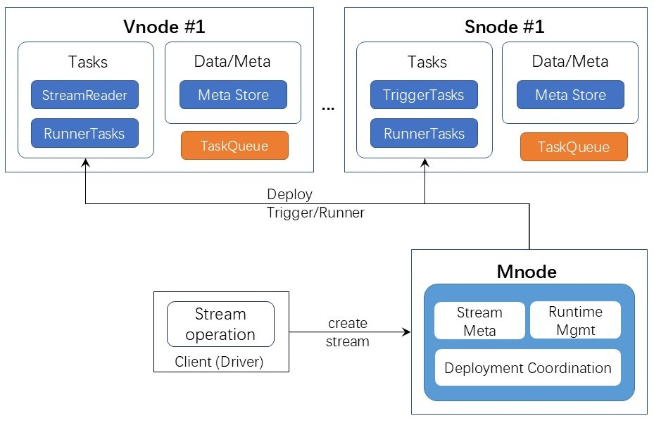
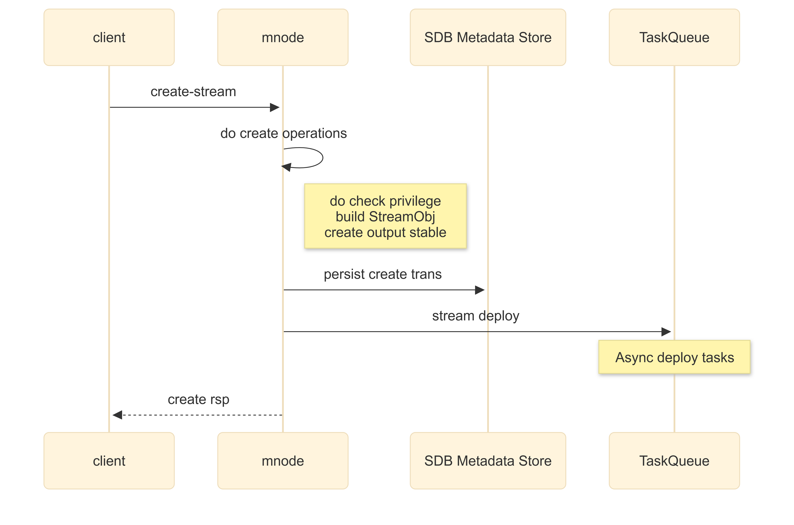
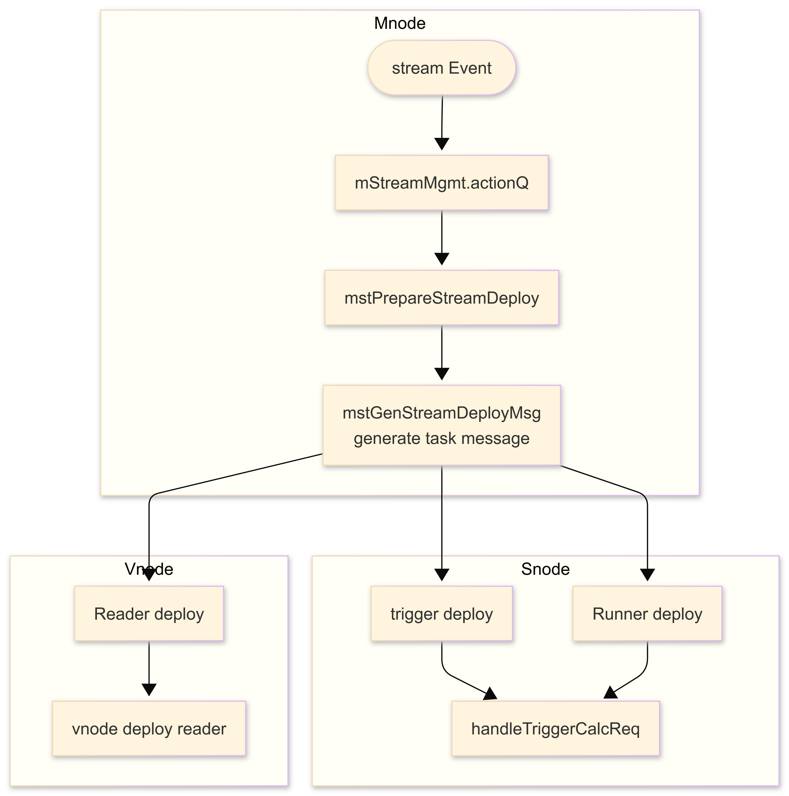

# 时序数据流计算模块-Design Spec

## 1. 修订记录

| 编写日期 | 发布日期 | 版本 | 修订人 | 主要修改内容 |
| --- | --- | --- | --- | --- |
| 2025-01-15 | 2025-01-15 | 1.0 | 潘魏 | 第一次安可送测 |
| 2025-12-10 | 2025-12-16 | 1.1 | 廖浩均 | 重构文档 |

## 2. 引言

### 2.1 文档目的

本文档旨在系统性地阐述TDengine 流计算模块的整体架构设计、核心实现原理与关键技术细节。

### 2.2 文档范围

#### 2.2.1 整体架构与模块构成

深入剖析引擎的整体层次结构，包括流计算引擎的整体架构设计和重要的组件，以及这些关键组件如何构成时序数据流计算引擎。文档定义流计算引擎核心组件的各部分职责、功能边界、交互协议与关键数据结构，阐明其如何协同工作以应对海量时序数据高性能流计算的挑战。

#### 2.2.2 技术特点和设计考量

阐述在设计过程中为解决时序数据特有的问题的流计算（如高吞吐写入、时间窗口聚合、乱序写入等）所采用的技术方案与设计依据，以及在确保高性能执行流计算的过程中仍然具备较高的安全性和可靠性所采用的策略。

#### 2.2.3 错误处理和安全处理

阐明流计算任务运行过程中反馈的错误信息以及导致该错误可能的原因，解决错误的应对策略。流计算任务在安全设计方面的策略。

### 2.3 目标读者

本文档目标读者包括以下几类：
1. 核心开发与维护人员：文档的主要受众，需要依据文档进行编码、调试、性能优化和故障排查。
2. 架构师与产品经理：可通过本文档深入理解流计算引擎的技术边界与能力范围，为产品规划与技术选型提供决策支持。
3. 技术爱好者与合作伙伴：对于希望深入了解TDengine内核原理、或计划进行二次开发的工程师，本文档提供了完整的入门指南与理论依据。

## 3. 术语

1. **触发表：**是用来决定事件触发的表,可以是任意表类型(包括虚拟表,不包括系统表),不支持视图,可以有分组。
2. **数据源表**：事件触发后计算的数据来源表，可以跟触发表相同，也可以不同，可以是单个或多个，可以是视图，可以跨库。
3. **乱序数据：**指触发表出现写入主键时间戳非单调选梯增的场景,同一个写入块中的数据会被客户端预先排序,因此这里考虑的是不同块中出现写入的乱序场景。乱序数据可以是新写入的数据,也可以是既有数据的更新。
4. **实时计算：**是流计算最主要的计算任务,它是根据从人创建流计算时刻起触发表最新写入的数据开始进行触发的计算。
5. **历史数据：**流计算创建时数据库中已经写入的数据，历史数据可选是否需要计算输出。
6. **实时数据：**流计算创建后数据库中新写入的数据。
7. **连续查询（Continuous query）：**数据库或流计算引擎中一种自动定期执行的查询机制，它按照用户定义的时间间隔和规则，对实时或历史数据进行计算，并将结果存储或推送给用户，主要用于数据降采样和高效分析。
8. **水位线（watermark）：**代表的是事件时间在流计算中的进展，体现了用户对于乱序数据的容忍程度。水位线的计算如下：`最新事件时间-水位线间隔`
9. **触发（Trigger）**：触发是流计算启动计算的事件条件，只有当事件产生且条件满足时才会触发计算。触发方式是指流计算支持的事件和条件的种类，触发发生后可以根据用户需求或实现优化进行的行为即为触发行为，例如立即计算、批量计算、通知等。
10. **输出表主键**：输出表主键时间戳需要用户在计算 SQL 中指定来源，既可以来自触发条件中产生的合法值，也可以来自计算语句生成的合法值。
11. **预写日志 (Write-Ahead Log, WAL)**: 写入数据到达  TDengine 的时候，首先持久化存储在预写日志中，每个Vnode拥有自己的预写日志，到达 Vnode 的数据按照到达的顺序追加在预写日志中。因此，预写日志中数据保留了数据到达的顺序，预写日志有自己单独的数据保留策略，通过数据库的配置参数来控制，超过保留时长的数据将会被从预写日志中清除。

## 4. 技术特点

### 4.1 触发对象与计算对象分离

流计算中的触发流计算事件的（超级）表与计算针对的对象（超级）表解耦，主要体现在以下几个方面的分离：
- 触发表与数据源表的分离：触发表的数据输入仅用于产生流计算的触发事件，而数据源表的数据则用于实际的计算和输出生成。
- 触发行为与计算行为的分离：计算操作仅在触发事件发生后执行，触发后可选择进行计算或不进行计算。
这种分离设计具有以下优势：
- 支持更多用户场景，例如触发通知而无需执行计算操作。
- 扩展计算种类，分离后的流计算语句不再受诸多限制，只要能生成合法表写入数据即可。
当然，这种分离设计提供灵活性，实际使用中用户可根据需求选择不分离，例如触发表与数据源表仍可相同，计算仍可基于触发窗口进行，输出仍可基于窗口关闭条件。

### 4.2 计算即输出

在流计算引擎中，只要产生了触发事件，就会立即开始计算，并且计算结果在生成后推送到下游任务。

### 4.3 约束与限制

- 计数窗口（count window）不支持乱序、更新、删除的自动处理（采取忽略处理的方式）。
- 对于超级表的窗口触发方式，只有 interval 和 session 窗口支持分组和不分组，其他窗口只支持按表分组。
- 每次真实计算的结果会直接覆盖写入到输出表中，暂不支持结果主键无法通过简单覆盖更新的场景。
- 不支持按列分组的场景。

### 4.4 整体架构设计

#### 4.4.1 概述

流计算引擎框架包含客户端（libtaos.so）、管理节点（Mnode）、虚拟节点（Vnode）、流计算节点（Snode）节点等关键组件，下面分别介绍各组件在流计算框架中的角色和作用。


#### 4.4.2 管理节点（Mnode）

管理节点用于保存流任务的基础元数据信息（包括但不限于流的详细设计和执行计划）、运行过程中维护参与计算的节点的状态。以及在执行过程中产生的重算信息。此外，管理节点负责维护所有流的动态状态信息。这些信息涵盖流当前的运行状态（如运行中、暂停、失败等）、进度指标以及最新的处理时间点等关键实时数据。用于支持支持实时监控和故障定位和排查。 虚拟节点通常是分布式流处理系统中基础工作单元，管理节点确保每个虚拟节点都能获取并保持其负责处理的流的最新元数据（例如分区配置、schema 信息等），以保证分布式处理的一致性和正确性。

#### 4.4.3 虚拟节点（Vnode）

在流计算架构中，数据来源节点与计算节点紧密协作，共同完成数据处理任务。这些节点首先会从其负责的 vnode (虚拟节点) 上读取 WAL 中的数据，并根据当前流处理的需求进行高效的过滤，仅保留所需的记录。在某些计算场景下，它们可能需要读取相关的数据源表中的历史或配置数据，并同时执行本地计算以准备数据或进行预聚合。随后，系统会执行核心的流计算逻辑，包括触发计算和最终的真实计算过程。在处理完成后，计算节点会及时上报自身的流状态给状态维护节点，并保存关键的检查点（Checkpoint）信息，以便在发生故障时能够准确地恢复计算，保证数据处理的连续性和准确性。

#### 4.4.4 客户端（libtaos.so）

用户可以通过客户端发出指令，创建、删除、启停流计算任务，查询检索流计算任务的运行状态，定义流任务运计算运行的逻辑等。所有对流计算任务的操作均通过 SQL 语句来完成。
SQL 语句的处理依赖于 libtaos.so 中的 SQL 层的处理机制。SQL 语句的处理逻辑，请参见《时序数据查询引擎-Design Spec》，本文在此不再赘述。

#### 4.4.5 流计算节点（Snode）

流计算节点（Snode）是流计算框架中处理计算执行任务的节点。流计算节点的主要职责是执行计算逻辑，包括触发计算以及随后的真实计算过程，并在完成后及时上报自身的流状态并保存关键的 Checkpoint 信息，以确保系统状态的可恢复性。
在一个集群中可以灵活部署任意数量（零个、一个或多个），但为了满足资源隔离的需求，每个数据节点最多只允许部署一个流计算节点。每个流计算节点内部拥有多个执行线程池来并行处理不同类型的计算任务。为了确保流计算的高可用，推荐在一个集群多个物理节点中部署多个流计算节点 。流计算系统会在所有的流计算节点之间自动负载均衡。为了防止单点故障，每两个流计算节点之间会互为存储副本，确保在任一节点失效时计算状态和数据不会丢失。

#### 4.4.6 运行策略

流计算系统根据流计算子任务的执行节点的不同，可以灵活地定义多种流计算运行策略。在不同的策略指导下，系统会根据子任务的类型以及查询计划的类型，来决定任务的部署与执行方式。
通过流计算的存算分离执行架构，计算密集型的流处理任务可以从底层数据库或存储节点中分离出来，从而最大限度地降低流计算对数据库功能和整体负载的影响。需要说明的是，运行策略通常被设置为集群的全局配置，并且在选择了某些特定策略（例如那些实现完全存算分离的策略）时，必须部署并启用上文提到的流计算节点，以承担独立的计算职责。

#### 4.4.7 线程池

为了有效地控制流计算框架中计算处理对物理节点计算资源的占用，对应流计算框架中不同的任务，设置了不同类型的线程池，通过控制线程池中所有可用线程的数量，能够有效地约束和调整流计算过程对于系统整体计算资源的消耗，从而避免其占用过多的资源，影响数据节点处理写入任务和相应查询请求。
- **Runner 线程池：**
部署在虚拟节点或流计算节点上，执行流任务运行（runner）任务。线程池中线程数量计算规则如下：<equation>Max(4, 2 \times num\_of\_CPU\_cores)
</equation>
- **触发线程池：**
部署在虚拟节点或流计算节点上，处理流任务的触发消息。线程池中线程数量计算规则如下：<equation>Max(2, num\_of\_CPU\_cores)
</equation>
- **读线程池：**
部署在虚拟节点和管理节点，处理流任务中的读数据请求。线程池中线程数量计算规则如下：<equation>Max(4, \frac{num\_of\_CPU\_cores}{2})
</equation>
- **虚拟节点/流计算节点流线程池：**
部署在虚拟节点和流计算节点，响应处理流的心跳消息，并进行虚拟节点和流计算节点上的任务管理工作。线程池中线程数量计算规则如下：<equation>Min(Max(2, \frac{num\_of\_CPU\_cores}{8}), 5)
</equation>
- **管理节点流线程池：**
部署在管理节点中，异步创建部署、暂停、删除、继续、心跳消息处理等操作。线程池中线程数量计算规则如下：<equation>Min(Max(2, \frac{num\_of\_CPU\_cores}{8}), 5)
</equation>
不同运行策略下的线程池部署：

| 策略 | 流线程部署 |
| --- | --- |
| 1. 只使用虚拟节点，默认策略 | 全都在虚拟节点部署 |
| 2. 混合使用虚拟节点和流计算节点 | Vnode: Vnode stream、Vnode reader、Runner（本地计算） Snode：Trigger、Runner（合并计算） |
| 3. 优先使用流计算节点 | Vnode: Vnode stream、Vnode reader、Runner（读表） Snode：Trigger、Runner（所有计算） |

## 5. 功能设计

### 5.1 创建流任务

#### 5.1.1 流程图



##### 5.1.1.1 客户端（Driver/libtaos.so）

客户端接收用户的创建流 SQL 语句的输入，其主要工作是 SQL 层的操作逻辑。对于 SQL 层的设计和工作逻辑在《时序数据查询引擎 - Design Spec》已经有介绍，在此不再赘述。下面简要说明客户端针对建流的 SQL 语句需要完成的处理流程。
用户输入建流语句以后，客户端（libtaos.so） 会对提交的 SQL 语句进行语法正确性、是否符合系统限制，以及输出表定义与查询结果的匹配性等一系列检查。校验通过后，SQL 解析器会请求并获取必需的元数据信息，涵盖触发表、数据源表和输出表的详细信息。
接下来，解析器根据查询语句的内容来确定实时计算的数据源类型，判断数据应来源于 WAL（Write-Ahead Log）缓存还是 TSDB（时序数据库）。随后，系统会按照标准的查询流程生成 SQL 语句的执行计划 ，但会根据上一步确定的数据源类型，选择不同类型和数量的 Table Scan 操作；同时，由于是建流操作，其 Sink（数据汇入）模式会被确定为 Data Inserter。
紧接着，解析器会根据触发表的元数据信息和触发定义，生成两个关键的配置信息：
1. 流对应的触发源信息列表： 列表中的每一项都详细定义了一个触发源，包括其源 Vnode、涉及的表 UID 列表、分组信息、所需的列列表以及过滤条件等。
2. 流对应的触发执行信息： 这包括了流的触发方式（如定时、数据量触发）、触发延迟、触发行为，以及源 虚拟节点列表信息等。
最后，SQL 执行器将所有这些经过检查和生成的信息（包括执行计划、触发源信息和触发执行信息）封装到一个完整的建流请求消息中，并发送给管理节点（Mnode），由管理节点继续后续的流任务创建工作。

##### 5.1.1.2 管理节点功能

管理节点接收创建流计算请求后，首先进行一系列前置检查，以确定流是否可以创建，包括验证流是否已经存在、创建者是否具备相应的授权和权限等。检查通过后，它会立即持久化保存建流消息以确保请求不丢失。随后，它会检查流的输出超级表是否已经存在，如果不存在，则负责创建该超级表。完成准备工作后，将建流消息转发到 Mnode 内部的 Stream 线程池负责的消息队列，并向用户客户端返回“建流成功”的响应。
Stream 线程负责后续元数据和部署计划。接收到建流消息后，会根据消息内容、当前的集群运行策略以及Vnode/Snode 的最新状态信息，生成一个详细的任务信息列表。这个列表包含了分发（dispatch）和触发（trigger）所需的任务信息。在此过程中，Stream 线程会根据负载均衡策略来选择 Vnode/Snode，并更新执行计划中的地址信息，最终建立流到其对应的 Vnode/Snode 任务信息的映射关系。在所有任务信息和映射关系确定后，Stream 线程会将流的状态更新为 `init`，并更新所有涉及到的 Vnode/Snode 上流的版本号，将这个新的版本号关联到流的创建信息上，为后续的部署和心跳同步做好准备。

#### 5.1.2 流版本号

在流计算系统中，管理节点（Mnode）与 虚拟节点/流计算节点（Vnode/Snode）之间的状态与操作同步是基于一个节点级别的流版本号来实现。Mnode 负责根据接收到的所有建流消息，动态生成每个虚拟节点/瑞计算节点所需的流元数据信息（这些信息本身无需持久化），并为每个虚拟节点/流计算节点生成一个从 1 开始的、非持久化的流版本号。当用户执行任何流操作（如创建、修改、删除）时，Mnode 会将对应 虚拟节点/流计算节点 上的流版本号进行单调递增，并且将这个新递增的版本号与本次流的更新操作关联起来。对于虚拟节点/流计算节点而言，它们需要在本地保存当前已经成功与 Mnode 同步的版本号。为了确保同步的准确性，在系统首次启动或重启后，节点的本地初始版本号被设置为 0。此外，当 虚拟节点 发生 Leader 切换时，新的 Leader 节点的版本号也会被重置为 0，以保证新 Leader 能够从 Mnode 完整地同步最新的状态和部署任务。

### 5.2 部署流任务



在流计算系统中，流的心跳与版本同步机制是确保分布式节点间状态一致性和流生命周期管理的关键。当虚拟节点被选为 Leader 或者流计算节点启动后，都会立即启动流的心跳计时器，每隔 2 秒定时触发向管理节点发送心跳消息。此心跳消息中包含当前节点所有异常流的信息、正常流的信息（为节省开销，正常流的信息每 10 秒发送一次），以及流任务的版本号。
管理节点根据接收到的版本号启动如下判断逻辑：
1. 上报的流版本号为 0，这通常意味着虚拟节点或流计算节点发生了重启或主备切换。管理节点会在心跳响应消息中发送完整的部署任务信息，指导节点恢复工作。
2. 上报的版本号非零，但低于管理节点当前维护的流版本号，Mnode 则会在心跳响应中按照顺序包含所有高于该节点版本号的新版本相关联的流更新信息。
虚拟节点或流计算节点响应心跳逻辑：
1. 如果发现有版本更新，会依次执行流的更新操作，随后更新本地维护的版本号为 Mnode 返回的最新版本号。对于部署任务，虚拟节点会更新本地的 Reader 任务。虚拟节点或流计算节点会创建流的 Trigger 任务，并根据执行计划创建相应的查询子任务。
管理节点确认所有 Vnode/Snode 的版本号均已达到或高于管理节点当前维护的版本信息时，它会删除该版本关联的流更新信息。此外，一旦 Mnode 通过心跳消息确认一个流的所有相关节点都已部署完成，它就会将该流的状态更新为 Running，同时更新全局的 Vnode 流版本号，并关联启动流的操作。最后，虚拟节点/流计算节点在收到启动流的消息后，会立即创建一个启动 trigger 的消息，从而启动 Trigger 任务，标志着该流正式开始运行。

### 5.3 运行流任务

完整的流计算运行工作按照执行的先后顺序可以分为：数据读取、事件触发、真实计算和结果写入四个步骤。

#### 5.3.1 类型定义

与执行线程对应，计算执行任务划分为三个子任务：Reader 任务、Trigger 任务、Runner 任务。

| 任务 | 部署任务 | 触发任务 | 任务描述 |
| --- | --- | --- | --- |
| Reader | Vnode stream 线程通过 mnode 心跳响应消息获取 vnode 上的作为触发表的每个表的信息，包含读取的数据消息类型、列、过滤条件等。 | Trigger 任务向 vnode reader 线程发送请求消息，包含流ID、起始wal版本号、ts范围信息等。 | Reader 线程从队列中取得一条消息后根据请求的 wal 版本号或当前进度继续依次读取 wal 中的所有消息并进行过滤、裁剪等操作，最终返回数据给 Trigger 任务，reader 需记录每个流的读取进度（不持久化）。具体根据 wal 中消息类型进行如下处理： 写入消息：根据 suid/uid 查询是否是流的触发表，如果否则丢弃；如果是则继续判断列、过滤条件是否满足。如果满足则返回数据给 trigger 任务，如果不满足则丢弃处理。 删除消息：同理根据 suid/uid 判断是否是流的触发表，如果否则丢弃；如果是且需要处理则返回响应给 trigger 任务，响应中包含当前删除的表 uid+时间戳范围。 定时触发方式不需要 Reader 任务。 |
| Trigger | Vnode/Snode stream 线程通过 mnode 心跳响应消息获取 vnode/snode 上的流的 trigger 任务信息并创建任务。 | Vnode/Snode stream 线程向 trigger 任务的队列中发送流的启动任务。 | Trigger 任务是整个流计算的驱动任务，每个流在整个集群中只有一个 trigger 任务，因此 trigger 任务需要支持实时与重算同时进行以及多分组场景。 trigger 任务从 reader 任务获取当前流的触发表数据后，根据触发条件进行数据处理，不满足的数据直接丢弃，满足且触发条件达成的根据触发行为设定进行处理，满足且触发条件暂未达成的待继续拉取后续数据时再行触发。 触发表的数据根据计算语句的需要可选使用，如确定需要使用，推送到 cache 算子进行缓存。 Trigger 任务作为流的驱动任务需要根据任务优先级、资源使用情况、实时任务进度等在 dnode 内进行任务调度管控。 Trigger 任务启动后，依次向所有源reader任务发送数据请求消息，然后任务退出。响应消息同样进入trigger 线程消息队列中，由trigger 线程拉起处理，trigger 任务处理一个响应消息后，可根据需要继续向同一个源的reader发送数据请求消息，然后继续退出。因此，trigger 任务完全是由消息驱动的处理，不会阻塞。runner 任务的响应消息同样进入消息队列。 |
| Runner | Vnode/Snode stream 线程通过 mnode 心跳响应消息获取 vnode/snode 上的查询计划时创建任务。 | Trigger 任务产生触发后向 runner 线程发送请求消息，包含可能的触发时间等动态参数。 | Runner 线程通过指定算子参数的方式从下游算子拉取数据（执行查询），最终通过任务的 sink(data inserter) 操作写输出表。数据源算子可能为 cache 算子或 table scan 算子，请求时消息中需要包含相关表 uid、分组信息以及时间范围等。 |

#### 5.3.2 整体流程

对于实时计算，整体执行流程如下：
1. Trigger 任务向 Reader 线程发送数据读取请求，Reader 任务解析 WAL，返回相关表的数据和版本信息。
2. Trigger 任务在收到 Reader 的解析结果后，判断是否满足用户指定的触发条件，如果满足根据触发行为可能产生外部应用的通知请求以及下游的结果计算请求。对于通知请求，由 Trigger 任务把通知内容同步发送给外部应用；对于计算请求，则是发送请求给 Runner 线程。如果当前需要执行 checkpoint，Trigger 会不再继续拉取数据，退出并等待 Runner 完成所有正在执行的计算请求。在收到 Runner 任务的响应之后生成 checkpoint，再继续执行步骤1；如果不需要进行 checkpoint，则直接继续执行步骤1。如果 Trigger 产生请求的速度远快于 Runner 实际计算的速度，则在生成新的请求时，将所有未处理的老的请求标记重算区间，并直接丢弃，后续由重算任务处理（即请求队列长度限制为1）。
3. Runner 线程在收到 Trigger 任务的计算请求后，调用查询算子得到计算结果后写入到对应的输出表，之后向 Trigger 任务返回执行是否成功的响应消息。


##### 5.3.2.1 按表分组（非虚拟表）

###### 5.3.2.1.1 实时计算（窗口触发）

执行步骤如下：
1. Trigger 按 VgroupId 顺序轮流选择一个 Reader ，向它发送 WAL 预取请求（WalSummaryRequest），同时获取所有分组的写入和删除记录的元信息 {gid, uid, skey, ekey, version} （如果是计数窗口触发，还要有记录行数 nrows）。
  补充：
   - 一个 Reader 如果已经扫描到最新提交记录了，则 Trigger 一定时间内（可配置）不会向它重新发送预取请求，防止所在 VNode 上没有数据写入时，对该 Reader 反复预取。此时 Trigger 会选择其他 Reader 进行预取。
   - 如果所有 Reader 都扫描到最新提交记录，Trigger 会暂停实时计算流程。后续向管理节点发送心跳时，发现超过了配置的预取时间间隔，再恢复执行步骤 1。
1. Trigger 在收到 Reader 返回的元信息后，找到对应的分组进行处理：
   - 对小于分组 watermark 的元信息，直接标记重算区间（如果超过了用户指定的 expired_time 则直接丢弃）；
   - 和之前缓存未处理的元信息混合，根据它们最大的 ekey，更新该分组的 watermark；
   - 对小于新 watermark 的元信息进行窗口判断，等到可以发送计算请求时，再产生一定数量（可配置）的计算请求批量发送给 Runner，剩余的元信息缓存起来，留待下次处理。如果要缓存数据用于计算，在发送计算请求之前，要根据该窗口内的元信息读取提交记录的计算列数据，添加到 Cache Sink。不同窗口类型的判断逻辑不同：
      - 对于滑动窗口，可以通过时间范围直接判断是否触发窗口关闭；
      - 对于会话窗口：
         - 如果一个元信息的时间跨度小于 session_val，可以直接忽略；
         - 如果有一个元信息的时间跨度大于 session_val，读取对应提交记录的 ts 列（向 Reader 发送 WalTriggerDataRequest），再进一步判断是否触发窗口关闭；
         - 如果两个元信息的时间间隔大于 session_val，直接生成计算请求；
      - 对于状态/事件窗口：
         - 读取新旧 watermark 之间的提交记录的触发列数据（向 Reader 发送 WalTriggerDataRequest），再进一步判断是否有窗口关闭（事件窗口还要判断窗口开启）；
      - 对于计数窗口，根据元信息的时间范围和删除记录相关信息可以判断有没有乱序/删除：
         - 对于没有乱序/删除的数据，可以根据元信息的数据行数，判断是否有窗口关闭（如果最后一个元信息跨窗口，就要读取它对应提交记录的 ts 列，得到新窗口的起始时间）；
         - 对于更新/乱序，需要读取时间范围有重合的元信息对应的提交记录的 ts 列，合并后判断窗口关闭，并得到新窗口的起始时间；
2. Trigger 在收到 Runner 计算结果后：
   - 如果计算失败，通过心跳把错误上报给 MNode ，等到后续通知再采取处理措施；
   - 如果计算成功，判断当前分组 watermark 之前是否还有元信息没有处理：如果有，继续进行窗口判断，产生下一批计算请求发送给 Runner；否则跳转执行步骤 1；

###### 5.3.2.1.2 历史计算

如果用户指定先进行实时计算，那么在实时计算所有 Reader 的 WAL 预取的版本号和最新版本号差距小于一定限制（可配置）后，说明所有 Reader 的实时计算都差不多追上了写入进度，就开始执行历史计算。
如果用户指定先进行历史计算，那么直接开始历史计算，等历史计算完成后，再开始实时计算。
历史计算的执行步骤如下：
1. Trigger 向所有 Reader 发送请求，获取所有子表的 last(ts)，作为历史计算的结束时间；以用户指定的 start_time 作为历史计算的开始时间；
2. 对于滑动窗口，根据历史计算的时间范围可以直接划分出所有分组的所有计算窗口，在可以发送计算请求时，再逐个发送计算请求。如果要缓存数据用于计算，需要在发送计算请求前，把该窗口的数据从 tsdb 读出来，写入到 Cache Sink。
3. 对于会话/状态/事件/计数窗口，如果需要缓存数据用于计算，只能逐个分组进行历史计算。一个分组进行一部分历史计算后，再选择另一个分组进行计算，以这种方式交错执行。具体流程为：
   - 等到可以发送计算请求后，Trigger 选择一个进度最落后的分组进行历史计算，进度以该分组已计算的时间戳表示。
   - Trigger 向选定分组相关的 Reader 发送 Tsdb 读取请求 (TsdbDataRequest)，读取这个分组的 ts>= skey && ts <= ekey  的所有触发列和计算列数据，用于该分组下的窗口判断，并同步写入 Cache Sink（事件窗口如果未开启，就不用写入）。
      - Trigger 会多次发送 NEXT 请求，Reader 按顺序每次返回一个数据块。Trigger 会一直读到产生了一定数量的计算请求或者没有数据为止。如果有产生了计算请求，就批量发送给 Runner；如果没有计算请求产生，就结束当前分组的历史计算。
      - 如果在产生一定数量的计算请求后，已读取的数据还有剩余，就直接丢弃，之后跳转执行步骤 a，选择下一个分组进行处理。
      - 如果没有更多历史数据，说明该分组历史计算完成，跳转执行步骤 a，选择下一个分组进行处理。
   - 如果所有分组的历史计算都完成了，整个历史计算结束。
4. 对于会话/状态/事件/计数窗口，如果不需要缓存数据用于计算，可以所有分组同时进行历史计算的判断：
   - Trigger 按 VgroupId 顺序轮流选择一个 Reader 发送 Tsdb 读取请求（TsdbTriggerDataRequest)，读取所有分组的 ts>= skey && ts <= ekey 的所有触发列数据。
   - Trigger 在收到 Reader 返回的数据后，找到相关的分组，进行窗口的判断。后续步骤与实时计算相似：等到可以发送计算请求时，再产生一批计算请求发送给 Runner。如果没有产生计算请求，就跳转执行步骤 a，读取下一个 Reader 的 Tsdb 数据。
   - 如果一个 Reader 没有历史数据了，就跳转执行步骤 a，选择下一个 Reader 进行读取；如果所有 Reader 都没有历史数据了，整个历史计算结束。

###### 5.3.2.1.3 重算流程

1. 重算请求一定是分组级别的，包含了分组 gid 和大致时间范围 `[start, end]`。
2. 对于滑动窗口，可以根据时间范围直接划分出所有计算窗口，在可以发送计算请求时，再逐个发送计算请求。如果要缓存数据用于计算，需要在发送计算请求前，把该窗口的数据从 tsdb 读出来，写入到 Cache Sink。
3. 对于会话/状态/事件窗口，需要先找到 start 前一个窗口的关闭时间：Trigger 向包含该分组数据的 Reader 发送 Tsdb 读取请求，Reader 根据 start 进行逆序扫描，读取这个分组的触发列数据，返回下一个数据块。Trigger 收到数据后判断是否满足窗口关闭条件：如果有数据满足，则以它的时间戳+1作为重算的准确起始时间；如果没有数据满足，就向 Reader 获取下一个数据块，如果所有数据都没有满足，说明该分组数据已经读到尽头，以第一行数据作为重算的准确起始时间。后续的处理步骤与历史计算的处理步骤相同，直到有窗口的结束时间超过 end，重算结束。
4. 对于计数窗口，不支持重算。

##### 5.3.2.2 标签分组（非虚拟表）

###### 5.3.2.2.1 实时计算（窗口触发）

执行流程绝大部分和按表分组相同，区别在于：
1. 仅支持滑动窗口和会话窗口；
2. Trigger  的每个分组都记录了来自每个虚拟节点的元信息的最大结束时间，作为该分组在每个 虚拟节点上的数据拉取进度。分组的 watermark 是根据以下两者的最大值进行计算：
   - 进度最慢的 虚拟节点的结束时间
   - 进度最快的虚拟节点的结束时间-时间限制（可配置）
  以此避免拉取进度不一致而触发大量重算，也避免一个 虚拟节点没有数据写入而阻塞其他 虚拟节点的数据消费；
1. 如果要缓存数据用于计算，Trigger 在发送计算请求前，会读取提交记录的计算列数据，对于乱序/删除进行的是表级别数据合并，而不是分组级别合并；

###### 5.3.2.2.2 历史计算

执行流程绝大部分和按表分组相同，区别在于：
1. 仅支持滑动窗口和会话窗口；
2. 对于会话窗口，无论是否需要缓存数据用于计算，都先从每个 Reader 的 Tsdb 读取所有分组的 ts 列，对所有分组同时进行历史计算的判断，这里窗口的判断是分组下的每个子表各自产生自己的表级别窗口，再通过窗口合并得到分组的窗口。
  补充：这是因为按表分组时，每个分组只有一张表，所以窗口判断和写入缓存可以扫描一轮 Tsdb 同步完成；而Tag 分组时，每个分组可能有多张表，所以窗口判断时，可能有部分表的数据已经属于新的窗口，但暂时不能确定，在不确定数据所属的窗口起始时间的情况下，无法同步写入 Cache Sink。所以对于 Tag 分组，始终要扫描两轮 Tsdb。
1. 等到在发送计算请求之前，如果需要缓存数据，再从对应 Reader 的 Tsdb 读取该分组下各子表的计算列数据。

##### 5.3.2.3 按表分组（虚拟表）

###### 5.3.2.3.1 实时计算（窗口触发）

执行步骤和非虚拟表的基本相同，区别在于：
1. Trigger  的每个分组都记录了来自每个虚拟节点的元信息的最大结束时间，作为该分组在每个 VNode 上的数据拉取进度。分组的 watermark 是根据以下两者的最大值进行计算：
   - 进度最慢的 虚拟节点的结束时间
   - 进度最快的虚拟节点的结束时间-时间限制（可配置）
2. 窗口的判断逻辑不同：
   - 对于滑动窗口，可以通过原始表的元信息时间范围直接判断是否触发窗口关闭；
   - 对于会话窗口，处理逻辑和 Tag 分组（非虚拟表）相同，也可以通过原始表的元信息进行判断，并跳过一些没有时间重合且跨度小于 session_val 的元信息；
   - 对于状态/事件窗口，只读取触发列对应的原始表数据：
      - 如果触发列只来自一张原始表（比如状态窗口和部分事件窗口），可以直接用原始表数据判断是否有窗口关闭（事件窗口还要判断窗口开启）；
      - 如果触发列来自多张原始表，就只能通过合并，得到虚拟表数据，再进行判断窗口关闭；
   - 对于计数窗口，需要读取所有原始表的 ts 列，进行合并，进行窗口判断；
    补充：实际上这里也可以做一定优化，如果一个时间范围内只有一个原始表的元信息，那可以通过该元信息的数据行数进行粗略判断，如果明确判断数据行数没达到窗口关闭条件，就可以跳过读取这部分数据的 ts 列。但这个场景在实际应用中不一定常见，所以这个优化的优先级不高。
1. 如果要缓存数据用于计算，那么在发送计算请求之前，对于计算列相关的原始表，需要读取 ts 列和计算列，而其他原始表，也要读取 ts 列，之后合并成虚拟表数据，写入 Cache Sink；

###### 5.3.2.3.2 历史计算

执行步骤和非虚拟表的基本相同，区别在于：
1. 对于滑动窗口，可以直接通过时间范围，得到所有分组的所有窗口；
2. 对于会话/状态/条件/计数窗口，只能每次选择一个分组读取触发列对应原始表的数据，合并成虚拟表数据，再判断窗口和产生计算请求。在一个分组上产生一小批计算请求后，再选择另一个分组，以此交错处理。如果需要缓存数据用于计算，那么把计算列对应原始表的数据也一起读出来，合并成虚拟表数据后，在窗口判断过程中，同步写入 Cache Sink。

##### 5.3.2.4 标签分组（虚拟表）

虚拟表按 Tag 分组时，仅支持滑动窗口和会话窗口，无论实时计算还是历史计算，和 “标签分组（非虚拟表）”的处理步骤和判断逻辑是完全相同的，仅在需要缓存数据用于计算时，多了一步将原始表数据合并成虚拟表数据，再写入 Cache Sink。

##### 5.3.2.5 Trigger  的子任务协作

Trigger 任务内部有三种子任务：实时、历史和重算，每个子任务会有自己的 ID。这三种子任务在启动之后，都是由 Reader 和 Runner 的回复消息驱动，在 Trigger 线程上执行。这些子任务有不同的消息队列：
1. 每个 Trigger 线程有自己的实时消息队列，实时计算的相关消息都是通过流 ID 分发到不同线程的消息队列，所以一个 Trigger 任务的实时子任务，只会在一个 Trigger 线程上串行执行。
2. 一个 SNode 上的所有 Trigger 线程还有一个共享的历史/重算消息队列，历史和重算的相关消息直接放到这个队列，所以一个 Trigger 任务的历史和重算子任务，可能在不同的 Trigger 线程上并行执行。但 Trigger 线程在处理历史/重算消息之前，会检查该子任务ID是否正在被其他线程处理，如果是，就跳过这个子任务ID 的消息，以此保证一个子任务的处理是串行的。
3. Trigger 线程在工作时优先处理自己的实时消息队列中的消息：每次取出一个消息并找到对应 Trigger 任务继续实时计算流程。当实时消息队列为空时，才会处理历史/重算消息队列中的消息，并且在处理之前，要检查该子任务 ID 是否正在被其他线程处理，如果是就要跳过这个消息，如果不是才找到对应 Trigger 任务继续历史/重算流程。
一个 Trigger 任务的子任务之间，可以直接通过共享的状态信息同步进度。它们的启动顺序如下：
1. 如果用户指定了优先进行历史计算，就先启动历史计算任务，即：向 Reader 发送 Tsdb 读取请求。当历史计算完成之后，再启动实时计算任务，即：向 Reader 发送 WAL 预取请求。
2. 如果用户指定了先进行实时计算后执行历史计算，就先启动实时任务，当实时任务差不多追上写入进度后（判断标准见历史计算流程），再启动历史计算。
3. 重算任务则完全来自实时任务。实时任务会在处理过程中标记重算区间，当实时任务的进度超过重算区间之后，它才会启动这个重算任务。而实时任务的处理过程中可能产生很多重算区间，区间间隔小于一定限制（可配置）的重算区间会被融合成一个大的重算区间，融合后的多个重算区间会根据标记时的处理时间顺序，被串行重算。如果有用户发起了手动重算请求，通过 MNode 下发到 Trigger 任务之后，手动重算区间的优先级将高于所有未处理的自动重算区间，被优先重算。

#### 5.3.3 数据读取

每个 虚拟节点上所有流共享一个数据读取任务（Reader），支持按照流、表、列级别进行读取和过滤 WAL 的提交记录。
对于实时计算，并且触发方式是“写入触发”或者“窗口触发”，Trigger 会在负载不饱和时向所有相关的 Reader 发送数据拉取请求，内容包含：流的 ID，需要拉取的 wal 版本号等。
Reader 在收到拉取请求后，处理过程如下：
1. 根据请求中的版本号，依次读取 WAL 中的提交信息，根据 Trigger 所需要的表进行过滤。
2. 如果提交记录是写入，则裁减出 Trigger 所需要的列数据，并根据过滤条件进行筛选；如果是删除且需要处理，则提取删除数据的时间戳范围。
3. 重复步骤2的解析，直到提取数据超过 1MB (可配置），或者解析完 WAL 中的所有提交信息。
4. 如果结果不为空，就把结果返回给 Trigger，返回的结果中包含：每个相关块的版本号和表id、表数据；如果结果为空，则在有数据写入时触发过滤，直到有相关结果再返回。
补充：负载不饱和，指的是当前 Trigger 正在处理中的计算请求数量小于最大并行处理限制。不同流的 Trigger 最大并行处理限制并不相同，详细可见”计算控制“一节。

#### 5.3.4 事件触发

##### 5.3.4.1 触发方式

###### 5.3.4.1.1 定时触发

定时触发方式是采用类似于 continuous query 的方式，通过固定的系统时间间隔启动计算。Trigger 每隔固定的时间，就会被调度执行，执行过程如下：
1. 如果需要，产生通知请求，内容包括：触发方式、触发时间。
2. 如果需要，产生计算请求，参数包括：当前的触发时间。
补充：Trigger 在触发计算请求之前，会获取每个虚拟节点的 WAL 最新版本号；如果两次触发执行的版本号相同，说明这段时间内没有发生数据写入，就会跳过这次执行。

###### 5.3.4.1.2 写入触发

Trigger 在收到 Reader 返回的数据后，会被调度执行，执行过程如下：
1. 写入消息不区分数据是插入还是更新。
2. 如果需要，产生通知请求，内容包括：触发方式、触发时间、写入数据（按需提供部分信息）。
3. 如果需要，产生计算请求，参数包括：写入数据（按需提供部分信息）。
补充：
1. 按需提供部分信息，是指根据计算语句和通知格式的需要，提供写入数据的时间戳、部分列的数据。
2. 收到的消息可能包含多条数据，通知和计算请求按照用户指定的数据条目触发一次（即每 N 条数据触发一次，N >= 1）。

###### 5.3.4.1.3 窗口触发

Trigger 在收到 Reader 返回的数据后，会被调度执行，执行过程如下：
1. 如果触发表是虚拟表，那么收到的数据是来自它的原始表，先合并得到触发表的数据。（部分数据可能需要等待其他原始表的数据进行合并，就保留在内存中）
2. 如果用户指定了分组，就把触发表的数据划分到不同的分组进行处理；如果没有指定，可以视为只有一个分组。
3. 如果需要，各个分组产生自己的通知请求，内容包括：触发方式、触发时间。如果是开窗触发，内容可以包括该窗口的第一条数据（按需提供部分信息）；如果是关窗触发，内容可以包括该窗口的所有数据（按需提供部分信息）。
4. 如果需要，各个分组产生自己的计算请求，如果是开窗触发，参数可以包括该窗口的第一条数据（按需提供部分信息）；如果是关窗触发，参数可以包括该窗口的所有数据（按需提供部分信息）。
每个分组处理的数据不一定是按主键时间戳严格递增的。分组在处理数据时，会记录自己处理过数据的最大时间戳。每次处理一行数据，如果它的时间戳更小，说明遇到了数据乱序，直接丢弃该数据，根据 expired_time 决定是否标记重算区间；否则更新这个最大时间戳。
按照上述处理方式，更新会被视为数据乱序，统一处理。数据删除的处理也是根据 expired_time 决定是否标记重算区间。

##### 5.3.4.2 触发行为

一次触发产生后可以根据用户需要使用不同的触发行为：
- 只通知不计算 - 通知由 trigger 任务发送
- 只计算不通知 - 计算由 runner 任务执行
- 既通知又计算 - 计算和通知由 runner 任务执行

###### 5.3.4.2.1 通知行为

可以将单次或多次需要通知的内容汇总成一个通知消息，再使用 websocket 同步发送给指定的外部应用。通知内容包括：触发方式、触发时间；如果是窗口触发，通知内容还要包括：窗口打开还是关闭、窗口时间范围等等。

###### 5.3.4.2.2 计算行为

当触发需要产生计算时，可以根据需求和策略进行选择：
- 立即计算 - 触发产生后立即发送给 runner 线程执行，直至当前 Trigger 正在处理的计算请求数量达到最大并行处理限制。达到限制之后，新产生的请求都存放到待处理队列，直到前面有计算请求完成。
- 批量计算 - 计算请求先统一存放到待处理队列，直到请求数量达到要求（可配置），或当前 Trigger 正在处理的计算请求数量达到最大并行处理限制，再一次性发送一批计算请求。如果待处理队列中的数量一直没达到要求，在一定延迟之后（可配置），也要被发送处理。

##### 5.3.4.3 Trigger 任务部署

Trigger 任务的部署根据触发表类型和部署节点类型的不同而不同，具体部署规则如下：

|  | Vnode 部署 | Snode 部署 |
| --- | --- | --- |
| 子表/普通表 | 表所在虚拟节点部署 | 轮询部署 |
| 超级表 | 所有 dnode 依次部署 | 轮询部署 |
| 虚拟表 | 任一原始表所在虚拟节点部署 | 轮询部署 |

因为 Trigger 任务是有状态的，所以 Trigger 任务只能在部署节点及其副本间进行切换。当所有副本都停止运行时，流会被暂停运行，如需重新运行，需人为强制流重新运行，整个流需要重新部署运行。

#### 5.3.5 真实计算

真实计算与普通查询过程基本相同，实现也与普通查询共用同一套代码，区别在于每次查询根据需要可能要传递动态参数。计算产生的结果可以只用来发送通知（不写入）、也可以写入输出表，也可以两种同时使用。

##### 5.3.5.1 计算数据来源

默认情况下，Runner 的计算是从 Tsdb 读取数据。但在以下场景下，Trigger 中读取的 WAL 数据可以被 Runner 直接使用：
1. 当触发方式是“写入触发”时，且计算语句是只针对该条数据的计算。
2. 当触发方式是“窗口触发”时，且计算语句是对同一分组、同一时间范围、同一窗口类型的聚合计算，且触发表是普通表，或者超级表带 partition by tbname。
在以上两种场景中，Trigger 在判断事件触发时，会把从 Reader 读取的数据传递给 cache 算子，cache 算子中的数据在一次读取后需要被自动清理。

##### 5.3.5.2 计算执行流程

Runner 任务在收到 Trigger 的计算请求后被调度执行，执行过程如下：
1. 解析计算请求中的动态参数，并使用这些参数调用最顶层的算子。
2. 顶层算子会递归调用底层算子，最终得到计算结果，并写入输出表。
3. 向 Trigger 返回计算完成的信息；如果计算过程发生错误，也需要返回错误信息。
4. Trigger 在收到 Runner 的响应之后，会继续发送待处理的请求。

##### 5.3.5.3 计算任务部署

同一个流的多个计算任务可以并行运行，因此计算任务可以同时被部署在多个节点中，mnode 可以根据trigger任务上报的流的计算压力情况进行动态扩展。
Trigger 任务在产生计算请求时，可以根据均衡策略在多个计算任务中进行选择，同一个计算任务只能串行执行任务，不能同时执行多个计算任务。

#### 5.3.6 结果写入

- 采用 data inserter sink 模块进行写入，其支持超级表写入，不支持自动建表写入，需要扩展支持自动建表写入。
- 每个子表在当前运行的第一次写入时需要通过自动建表写入，确保表能够生成，后续写入不需要自动建表方式。
- 需要支持复合主键写入功能，支持按分组进行划分写入，每个组可以输出到同一个表、每个组一个表、多个组一个表。

##### 5.3.6.1 结果缓存管理

- 接口调用规则：输入及读取规则重点
  - 写入数据是组内单表按照时间窗口顺序写入
  - 同一个时间窗口会多次写入，追加数据。但对同一个组而言，同一个窗口的数据写完之后，才会对下一个窗口开始写入，同一个组有多个子表，多个子表在该窗口的数据写完后才会开始写下一个窗口。
  - 同一个组内同一个时间窗口中，不同子表的数据可能交叉写入，不保证一个子表当前窗口的数据写完再写下一个子表的数据。
  - 同一个时间窗口的数据开始写入时，无法知道该窗口数据的大小。
  - 不同 group 的数据写入，窗口数据的开始时间不保证有序写入。
  - 写入是逐个时间窗口写入，获取可能是多个时间窗口数据一起获取；获取数据的起始时间不一定是写入时的时间窗口开始时间，可能会是时间窗口范围内的某一个时间点。
  - 读取数据时按组读取，不会单表读取；输出数据和写入顺序一致
      - 对同一个 group 的数据，写入顺序可以完全作为读取顺序输出。
         - 不同时间窗口间数据有序
         - 同一个时间窗口内，单个子表的数据时间有序
         - 同一个时间窗口内，不同子表的数据时间不保证有序
      - 对同一个 streamID + taskID, 不同 runner 可能并发读不同 group 的数据
      - 对同一个 group，** **只在一个 runner 上单线程串行读取
- 设计要点
  - 获取数据时需要根据 groupid, 定位到存储文件的 Offset, 对于单个 group ，如果需要读取文件在文件内一定是顺序读写，减少文件指针移动。
  - 文件内的数据需要分块管理，每个存储块对应一个 groupid，文件块内支持同一个 group 的数据追加写入
  - 分块可能碰到数据过大，无法完整写入的情况，需要能链接到下一个块继续写入，读取时也需要能链接到下一个块读取。每个group 在文件中占据的大小怎么计算？可以比实际需要的空间大，实际写入的时候，如果数据较少，会出现文件空洞，不设计占用磁盘空间，该特性需要测试一下。
  - 读取数据之前，优先清除内存中的失效数据，防止文件中数据读取到内存造成内存使用过大。
  - 文件数据被读取后，如果允许多次读取，这些数据是否应该作为热点数据计入内存缓存，以备下次读取。预留一定的内存作为该场景的缓冲池，新写入数据不能占用这个预留空间。当内存使用会超过限制时，读取文件不写入内存缓存。
- 内存维护策略：
  - Data sink 模块收到 put 请求时，根据当前 data sink 已经占用内存占用情况决定写入内存还是写入文件；以下规则顺序判断，按照第一个满足的规则进行存储。
    - 规则1： 如果当前 task 已经开始在文件中写入数据，则继续写入文件，保证文件中数据时间总是大于内存中数据，并且数据连续。（为防止某个 task 一直在文件中写入数据，当内存使用小于 50% 时，读取这个任务所有文件数据迁入内存，并清空文件）
    - 规则2：内存使用大于 70% ，新任务，从未写过数据，则写入文件；
    - 规则3：内存使用小于 90%，已经写入过数据还未写入过文件，继续写入内存；
    - 规则4：内存使用大于 90%， 全部写入文件，10% 空间留作读取时缓冲
  - Data sink 模块对自己使用的内存进行管理，每次被调用时，会同步更新流的内存使用情况，以及最近一次的调用时间
  - Data sink 提供接口可以查询当前 datasink 对内存的使用情况，vnode stream 线程可以定时获取到 data sink 内存使用情况，管理负载均衡
  - 全局的内存大小管理，每次写入内存成功或者释放内存时，同步增加/减少占用量（原子变量）。
- 内存淘汰：内存中数据在每次读取前，清除已经过期的数据，每次读取文件时，数据读取后文件中的相应存储位置标记为 free, 可以再次写入新的内容。
  - 读取前清除的是内存中的过期数据，按照接口约定，当要读取一个时间窗口数据时，表示之前的时间窗口数据失效，此时可以回收内存；
  - 每次读取文件，实际上会将文件内容读入内存，读入内存后，文件中的内容就不再需要，可以标记为free。无论是只读一次还是可以读多次的模式，都可以标记free, 区别在于，可以读多次的模式下，从文件读出的内容进入内存管理，以备下次直接从内存读取，全局内存占用增加。这里可能突破内存限制，因此每次读取前根据时间窗口释放过期内存，有助于从文件读取内容的时候有充足内存可用。
  - 根据缓存清除规则，当需要多次读取时：内存数据读取后不删除数据，从文件读取的数据需要进入内存中管理（不能超过内存限制），在时间窗口过期后再删除；不需要多次读取时：每次内存读取数据后立即删除，并且文件中读取的数据不进入内存管理，读取后可立即删除。
1. 文件存储策略
   - 文件对应 streamID + taskID ，每个流任务对应一个存储文件，每个节点的文件数量和 trigger 数量相等。在程序退出前需要能够清理文件。
   - 文件内按照 groupID 分区存储，每个 group 的数据存储在同一个区，
   - 对同一个 streamID + taskID , 写入不会并发进行，不同 group 的数据也是写完一个 group 才会开始下一个 group。
   - 对同一个 streamID + taskID， dataSink 中同时存在的 group 数目可控制，由 trigger 控制,最多有两个未完成的计算任务同时存在。

#### 5.3.7 checkpoint 生成与恢复

- 每个流的 checkpoint 信息由 trigger 任务负责生成，在生成 checkpoint 前需确认所有乱序标记已经更新到 mnode。
- 每个流为每个 vnode 生成一个 checkpoint 信息，checkpoint 信息的内容根据触发方式的不同而不同，checkpoint 信息保存在 trigger 运行的 vnode/snode 副本间。
- checkpoint 信息需要有单调递增的版本号，mnode 根据版本号确定不同副本间的计算进度。
- 为了尽量减少checkpoint 数据量，trigger 任务需要在做 checkpoint 前完成流的所有计算任务，同时暂停拉取触发表数据。
- 每个流的 Checkpoint 生成的时机可以根据定时与负载结合的方式选择，避免所有流同时生成 checkpoint。
Checkpoint 保存的信息包括：
1. 每个 虚拟节点上的已读取的 wal 中最后一个块的版本号 ver_last 和已全部处理完成的最后一个块的版本号 ver_done;
2. 每个分组的 ID 和分组已计算完成的最后一个窗口的结束时间 end_time；
恢复过程：
1. 先恢复每个分组的中间状态：每个 VNode 的 WAL 从 ver_done + 1 扫描到 ver_last，trigger task 拿到满足流需要的每个块后，将数据分组(对于虚拟表，在分组前先 merge)，再根据对应分组的 end_time，确定是否进行丢弃，有计算请求就正常生成。
2. 继续实时计算扫描：从 ver_last + 1 继续扫描 WAL，恢复完成。

##### 5.3.7.1 Checkpoint 同步保存与恢复

- checkpoint 信息需要通过可靠传输的方式在副本间传递与保存，保存需要采取乒乓的方式进行文件写入，需要有条件保证节点上至少有一个可用checkpoint。
- Checkpoint 恢复时可以进行副本间的 checkpoint 版本比对，必要时重新同步最新的checkpoint。

#### 5.3.8 重算功能

重算是解决一段时间区间内触发缺失或可能不正确导致的计算结果可能不正确问题的解决手段，也是我们解决乱序问题的主要解决方式。对于触发表的乱序数据处理，按照下面的设计实现：
- 乱序只依靠写入提供块级别乱序重整，其他一律重算处理；
- 乱序以小时（可配置）为单位进行标记，用户可查看，可手动重算，时间区间可合并；
- 用户可以提供最大允许重算间隔时间，以处理时间为计量对象，同一区间数据重算间隔不超过最大允许重算间隔时间；
- 重算信息包含流、分组、时间范围等信息，由 trigger 任务负责生成，通过心跳同步到 mnode，mnode 负责重算任务的调度执行；

##### 5.3.8.1 重算方式

重算按照启动方式和时机的不同，可以划分为以下几种形式：

| 分类 | 适用场景 |
| --- | --- |
| 用户主动计算功能 | 历史数据计算； 乱序需要重算； 触发计算时数据源表数据未ready问题； 因为 BUG 等原因导致计算结果不正确等； |
| 不自动重算 | 需要计算的时效性，或重算结果无效场景； |
| 立即重算 | 乱序需要立即处理的场景； |
| 定时重算 | 对重算实时性要求不高的场景； 历史数据计算； |
| 批量重算 | 对重算实时性要求不高的场景； 历史数据计算； |

其中，不自动重算、立即重算、定时重算、批量重算都属于自动重算的类型，自动重算和用户主动计算均由 mnode 根据用户配置进行调度执行，mnode 需要确保同一区间同一时间只有一种重算可以运行。

##### 5.3.8.2 重算执行流程

从“事件触发”一节中，可以看到，仅“窗口触发”可能触发数据重算。Trigger 从 MNode 收到重算区间后，执行流程如下：
1. 如果不是 interval 窗口，使用 Tsdb 扫描触发表的数据（如果是虚拟表则还要进行合并），找到重算区间前一个窗口的起始时间，以及重算区间后一个窗口的结束时间。如果是 interval 窗口，可以直接计算出前后窗口的时间范围，不需要扫描 Tsdb。
2. 以这两个时间点为范围，向 Runner 发送计算请求。如果目前在执行的重算任务达到了并行处理下限制，则先放在待处理队列中。
3. Runner 处理完成，会给 Trigger 发送处理是否成功。Trigger 在收到反馈后继续发送待处理请求。
补充：
1. 重算任务可能较多，在待处理队列中的重算任务如果时间区间有交集，可以合并成一个重算任务。
2. 重算区间可能较大，会触发很多个计算请求，需要注意并行处理限制，不能一次性触发大量计算。
3. 对于按 tag 列分组的场景（仅支持 Interal 和 Session 分组），一个分组包含多张表，可以依据 duration 判断是否一个时间点之前的相关表数据都已经拿到。

#### 5.3.9 历史计算

如果用户指定了历史计算，建流时确定每个 VNode 上 WAL 的最新提交记录版本号。
1. 对于“定时触发”，没有触发表的概念，能向真实计算提供的只有触发时间点。所以，“定时触发”逻辑上不存在历史计算。
2. 对于“写入触发”，在该版本号之前的数据由历史计算处理，之后的数据由实时计算处理。
3. 对于“窗口触发”，用户可以指定先执行历史计算还是实时计算：
   - 如果先执行历史计算，那么完成后，以各分组的最后一个窗口起始时间点，开始执行实时计算。
   - 如果先执行实时计算，那么完成后，对各分组的第一个窗口结束时间点之前所有数据，执行历史计算。

#### 5.3.10 计算控制

触发是整个流的驱动任务，因此触发需要能提供管控功能需同时达到资源可控和处理效率提升的目的。触发管控的主要手段是调整计算的时机、定时、批量处理，判断管控的条件主要是触发任务的优先级和其他任务属性。
实时任务主要需求是能满足实时性要求，因此在满足实时性指标的前提下，需要提升处理效率，缩小处理频次，高优先级处理。
重算任务满足重算间隔需要即可，中等优先级处理。
历史任务主要满足资源可控，低优先级处理。
从实现上说，Trigger 不会无限制地发送计算请求。而是由两个可配置参数（可以通过语句进行运行时修改）来限制并行执行的计算请求数量：
1. 实时计算数量限制：可以并行处理的实时计算请求的最大值；
2. 重算和历史计算数量限制：重算和历史计算共用一个限制，即它们并行处理的总和不能超过该限制。并且重算任务的优先级总是高于历史计算。
补充：这两个可配置参数，可以由 MNode 根据全局的资源消耗情况，动态地通过心跳信息发送给 Trigger，自动进行调整。

#### 5.3.11 库表操作

1. 新建子表（非虚拟表）：trigger 能够自动处理，不需要额外操作。
2. 删除子表：用户可以指定在删除一个分组内的所有子表后，自动删除该分组对应的结果表。此时，Reader 在检查到“表删除”的提交后，要把该信息发送到 Trigger，由 Trigger 判断并删除相关结果表。

### 5.4 流任务删除

客户端解析用户发出的 SQL 语句，随后向管理节点发出删流消息。管理节点收到请求后，会首先进行必要的检查，确认流是否存在以及用户的权限是否足够，检查无误后，删除流元数据信息。然后，将删除消息发送给流线程池继续后续处理。
在流线程池后续处理中，根据流的映射信息确定并删除流所涉及的 Vnode 和 Snode 上的目标流任务，并从 Mnode 的元数据中删除该流的所有信息。随后，它会更新所有受影响的 Vnode/Snode 的流版本号，并将删除操作关联到这个新的流版本号上。
Vnode 和 Snode 通过周期性的心跳消息接收到包含这个新版本号的删流信息后，会立即在本地停止并删除对应的流任务，同时同步删除 Vnode 上保存的所有 Checkpoint 信息，从而彻底完成流的清理和资源的释放。

### 5.5 流任务暂停

客户端解析用户发送的 SQL 语句，随后向管理节点发送暂停流消息。管理节点接收请求后，首先进行必要的检查，确认流是否存在以及用户的权限。检查无误后，更新持久化存储的建流信息，将流的状态标记为 `Suspended`；随后将暂停流消息转发给 Mnode 内部的 Stream 线程的消息队列。
在管理节点流线程池中，根据流的映射信息，更新所有涉及到的 Vnode/Snode 的流版本号，并将暂停操作关联到这个新的流版本号上。最后，Vnode 和 Snode 通过周期性的心跳消息接收到包含这个新版本号的暂停流信息。收到信息后，它们会立即为该流生成并保存最新的 Checkpoint 信息，以便后续可以从该点恢复；完成 Checkpoint 后，节点会停止并删除本地的流任务，从而使流进入完全暂停状态。

### 5.6 流任务恢复

客户端解析用户发送的 SQL 语句，随后向管理节点发送恢复流消息。管理节点接收到请求后，会首先进行必要的检查，确认流是否存在以及用户的权限是否足够。检查无误后，Write 线程的关键步骤是更新持久化存储的建流信息，将流的状态标记为 `Init`（初始化状态，准备重新部署）；随后，将恢复流消息转发给 Mnode 内部的流线程池。
在流线程池中，根据流的映射信息，更新所有涉及到的 Vnode/Snode 的流版本号，并将恢复操作连同完整的建流任务信息（指导节点如何重新部署）关联到这个新的流版本号上。最后，Vnode 和 Snode 通过周期性的心跳消息接收到包含这个新版本号的恢复流信息后，会立即执行部署任务，重新创建和启动本地的流任务，从而使流从检查点开始，恢复正常的运行状态。

### 5.7 虚拟表触发与计算

虚拟表触发与普通表（超级表）触发的处理逻辑类似，唯一的区别触发流计算事件前，需要列的合并操作；
涉及虚拟表的计算流程与虚拟表查询完全相同；此处不再赘述。

### 5.8 流的管理

#### 5.8.1 流状态信息

流的状态信息如下列表，流任务的状态与流状态相同。

| 名称 | 说明 |
| --- | --- |
| init | 初始化状态 |
| ready |  |
| running | 流处于运行中 |
| suspended | 流处于暂停状态，还可以恢复 |
| stopped | 流处于停止状态，不再运行 |

#### 5.8.2 状态管理

所有虚拟节点的 Leader 和流计算节点都必须与管理节点通过心跳保持流状态的持续同步，心跳机制承担着如下职责：
1. 启动同步与 Checkpoint 上报： 当 taosd（节点）启动后，首次发送的心跳消息至关重要，它必须上报本地节点保存的 Checkpoint 信息，同时还需要确保收到 Mnode 的回复，以完成初次握手和状态对齐。
2. 错误处理与操作指导： 当任一节点内部遇到无法自行恢复的严重错误时，它会立即通过心跳消息上报详细的错误信息。Mnode 接收后，会相应地更新流的运行状态（此状态更新无需持久化），并根据错误的类型在心跳的响应消息中给出后续所需执行的操作指令，指导节点进行恢复或清理。
3. 进度信息同步： 为了支持监控和追踪，每个流的 Trigger 任务所在的节点（无论是 Vnode 还是 Snode）都会定期通过心跳机制向 Mnode 上报该流的实时进度信息 ，确保 Mnode 始终掌握流的最新处理状态。

#### 5.8.3 任务管理要求

Mnode 需要保证任务管理的时序性、一致性；
节点提供的接口需要保证接口的幂等性；

### 5.9 异常场景

| 编号 | 场景描述 | 影响与处理 |
| --- | --- | --- |
| 1 | Mnode leader节点下线（未重启） | 新的leader节点读取所有流的持久化信息，在mnode stream线程恢复重建内存中的流和节点信息，与vnode/snode节点的心跳信息进行状态对比更新，恢复版本号至各节点中最高的一个。 |
| 2 | Vnode leader节点下线（未重启） | 新的leader节点在回调中启动心跳timer，通过心跳从mnode获取流的部署任务后进行部署。 若未产生新的leader，则mnode检测到vnode无心跳后删流并定期重试。 |
| 3 | Snode 节点下线（未重启） | Mnode 通过心跳发现 snode 下线后，如果存在副本 snode，则根据需要部署受影响流的runner 任务，在其副本 snode 上部署执行受影响的流的trigger任务；如果不存在副本 snode，则停止所有流的执行。 |
| 4 | Mnode 节点重启 | 根据新的角色进行处理，follower 不动作，leader 执行 *场景1* 处理。 |
| 5 | Vnode 节点重启 | 根据新的角色进行处理，follower 不动作，leader 执行 *场景2* 处理。 |
| 6 | Snode 节点重启 | 通过心跳上报 Mnode 当前状态，等待 mnode 的任务部署。 |
| 7 | Vnode 切主(不含trigger任务) | 新的vnode leader 通过心跳进行任务部署，trigger 任务遇到切主错误后暂停任务，在mnode通知可以继续运行时继续执行（依赖 RPC 自动重试机制）。 |
| 8 | Mnode 切主 | 新的leader在收到切主回调后，执行 *场景1* 处理。原来的leader 销毁本地动态信息。各执行节点心跳信息自动转到新的mnode leader（依赖 RPC 自动重试机制）。 |
| 9 | Vnode 切分 | 暂不支持。 |
| 10 | 心跳超时 | 执行节点忽略，待下次定时到达后重发。mnode 节点根据超时时间确定节点下线，根据是否有新的leader进行处理。 |

## 6. 接口和消息定义

### 6.1 Cache Sink

（以下接口由 Trigger Task 调用）
```c
// @brief 创建一个数据缓存
// @param cleanMode 清理模式，具体含义如下:
//        1. 一行数据只会被读取一次，所以读取结束后可以立刻被清理
//        2. 一行数据可能被读取多次，所以等到下次读取时，才清理时间范围之前的数据
int32_t initStreamDataCache(int64_t streamId, int64_t taskId, int32_t cleanMode,  void** ppCache);


// @brief 清理数据缓存，包括缓存的数据文件和内存
void destroyStreamDataCache(void *pCache);


// @brief 向数据缓存中添加数据
// @param pCache 数据缓存,使用 StreamDataCacheInit 创建
// @param wstart 当前数据集的起始时间戳
// @param wend 当前数据集的结束时间戳
// @param pBlock 数据块
// @param startIndex 数据块的起始索引
// @param endIndex 数据块的结束索引
// @note 
//      1. 起始索引和结束索引是数据块数据的索引范围,从0开始计数
//      2. 可能会对同一个 {groupId, tableId, wstart} 进行多次调用,添加多个数据块,调用者保证这些数据是严格时间有序的
//      3. put 的数据量可能很小，可能要由 Cache Sink 合并成大一点的数据块 【低优先级优化】
int32_t putStreamDataCache(void *pCache, int64_t groupId, TSKEY wstart, TSKEY wend, SSDataBlock *pBlock, int32_t startIndex, int32_t endIndex);
// @brief 向数据缓存中添加数据
// @note 和 putStreamDataCache 区别是：
//        1. 会移交 pBlock 的所有权
//        2. 仅允许 cleanMode 为 2 时使用
//        3. 如果返回 success，pBlock 的内存释放由 Cache Sink 负责；
//        4. 如果返回 error，pBlock 的内存释放由调用者负责；
int32_t moveStreamDataCache(void *pCache, int64_t groupId, TSKEY wstart, TSKEY wend, SSDataBlock *pBlock);

// @brief 从数据缓存中读取数据
// @param pCache 数据缓存,使用 StreamDataCacheInit 创建
// @param start 读取数据的起始时间戳
// @param end 读取数据的结束时间戳
// @param pIter 迭代器,用于遍历数据块
// @note
//      1. 没有数据时，把 pIter 置为 NULL
//      2. 符合筛选条件的数据可能包含多个数据块,由 pIter 负责迭代遍历
//      3. 这里没有区分 tableId,后续对 pIter 遍历的结果应该是按照 tableId 有序,内部再以时间戳有序
//      4. start, end 一定是对齐到数据集边界的，即 [start, end] 包含若干个数据集，但不会包含任意数据集的一部分
int32_t getStreamDataCache(void *pCache, int64_t groupId, TSKEY start, TSKEY end, void **pIter);


// @brief 遍历获取所有符合条件的数据块
// @param pIter 迭代器,用于遍历数据块
// @param ppBlock 用于指向结果数据块，调用者不会释放指向的内存
// @note
//      1. 需要把 pIter 指向迭代器的下一位，如果没有数据了，返回 NULL
//      2. 由调用者负责清理 dataBlock
int32_t getNextStreamDataCache(void **pIter, SSDataBlock **ppBlock);

// @brief 取消对读取结果的遍历
// @note
//      1. 调用者在使用 pIter 遍历数据时，可以用这个接口提前结束遍历，通常用于异常情况
//      2. 取消数据遍历意味着读取操作结束，可能触发底层 Cache Sink 的数据清理
void cancelStreamDataCacheIterate(void **pIter);
```

### 6.2 Reader

（以下请求消息由 Trigger Task 发起）
```c
typedef enum SStreamTriggerRequestType {
  TRIGGER_REQUEST_NONE = 0,
  TRIGGER_REQUEST_LAST_TS,
  TRIGGER_REQUEST_FIRST_TS,
  TRIGGER_REQUEST_TSDB_META,
  TRIGGER_REQUEST_TSDB_META_NEXT,
  TRIGGER_REQUEST_TSDB_TS_DATA,
  TRIGGER_REQUEST_TSDB_TRIGGER_DATA,
  TRIGGER_REQUEST_TSDB_TRIGGER_DATA_NEXT,
  TRIGGER_REQUEST_TSDB_CALC_DATA,
  TRIGGER_REQUEST_TSDB_CALC_DATA_NEXT,
  TRIGGER_REQUEST_WAL_META,
  TRIGGER_REQUEST_WAL_TS_DATA,
  TRIGGER_REQUEST_WAL_TRIGGER_DATA,
  TRIGGER_REQUEST_WAL_CALC_DATA,
  TRIGGER_REQUEST_MAX
} SStreamTriggerRequestType;

typedef struct SStreamTriggerRequest {
  SStreamTriggerRequestType type;
  int64_t                   streamId;
  int64_t                   sessionId;
} SStreamTriggerRequest;

typedef struct SStreamLastTsRequest {
  SStreamTriggerRequest base;
} SStTriggerLastTsRequest;

typedef struct SStreamFirstTsRequest {
  SStreamTriggerRequest base;
  int64_t               startTime;
} SStreamFirstTsRequest;

typedef struct SStreamTsdbMetaRequest {
  SStreamTriggerRequest base;
  int64_t               startTime;
} SStreamTsdbMetaRequest;

typedef struct SStreamTsdbMetaNextRequest {
  SStreamTriggerRequest base;
} SStreamTsdbMetaNextRequest;

typedef struct SStreamTsdbTsDataRequest {
  SStreamTriggerRequest base;
  int64_t               uid;
  int64_t               skey;
  int64_t               ekey;
} SStreamTsdbTsDataRequest;

typedef struct SStreamTsdbTriggerDataRequest {
  SStreamTriggerRequest base;
  int64_t               startTime;
} SStreamTsdbTriggerDataRequest;

typedef struct SStreamTsdbTriggerDataNextRequest {
  SStreamTriggerRequest base;
} SStreamTsdbTriggerDataNextRequest;

typedef struct SStreamTsdbCalcDataRequest {
  SStreamTriggerRequest base;
  int64_t               gid;
  int64_t               skey;
  int64_t               ekey;
} SStreamTsdbCalcDataRequest;

typedef struct SStreamTsdbCalcDataNextRequest {
  SStreamTriggerRequest base;
} SStreamTsdbCalcDataNextRequest;

typedef struct SStreamWalMetaRequest {
  SStreamTriggerRequest base;
  int64_t               lastVer;
} SStreamWalMetaRequest;

typedef struct SStreamWalTsDataRequest {
  SStreamTriggerRequest base;
  int64_t               ver;
} SStreamWalTsDataRequest;

typedef struct SStreamWalTriggerDataRequest {
  SStreamTriggerRequest base;
  int64_t               ver;
} SStreamWalTriggerDataRequest;

typedef struct SStreamWalCalcDataRequest {
  SStreamTriggerRequest base;
  int64_t               ver;
  int64_t               skey;
  int64_t               ekey;
} SStreamWalCalcDataRequest;
```

Reader 需要对外提供的接口（除Execute所有接口不能长时间占用线程，除RetrieveStatus外都可选异步处理）：
```c {wrap}
int32_t stReaderTaskDeploy(SStreamReaderTask* pTask, const SStreamReaderDeployMsg* pMsg);
int32_t stReaderTaskUndeploy(SStreamReaderTask* pTask, const SStreamUndeployTaskMsg* pMsg, taskUndeplyCallback cb);
int32_t stReaderTaskExecute(SStreamReaderTask* pTask, SStreamMsg* pMsg);
```

### 6.3 客户端

(以下信息是 Mnode 依赖)
```plaintext {wrap}
typedef struct SStreamOutCol {
  int16_t            slotId;
  col_id_t           colId;
  EStreamPlaceholder placeholder;
  int8_t             type;
} SStreamOutCol;


typedef struct SVgroupVer {
  int32_t vgId;
  int64_t ver;
} SVgroupVer;

typedef struct SSessionTrigger {
  int16_t slotId;
  int64_t sessionVal;
} SSessionTrigger;

typedef struct SStateWinTrigger {
  int16_t slotId;
  int64_t trueForDuration;
} SStateWinTrigger;

typedef struct SSlidingTrigger {
  int64_t interval;
  int64_t sliding;
  int64_t offset;
} SSlidingTrigger;

typedef struct SEventTrigger {
  SNode*  startCond;
  SNode*  endCond;
  int64_t trueForDuration;
} SEventTrigger;

typedef struct SCountTrigger {
  int64_t    countVal;
  int64_t    sliding;
  SNodeList* condCols;
} SCountTrigger;

typedef struct SPeriodTrigger {
  int64_t period;
  int64_t offset;
} SPeriodTrigger;

typedef union {
  SSessionTrigger  session;
  SStateWinTrigger stateWin;
  SSlidingTrigger  sliding;
  SEventTrigger    event;
  SCountTrigger    count;
  SPeriodTrigger   period;
} SStreamTrigger;

typedef struct {
  SArray* vgList;
  void*   scanPlan;
} SStreamCalcScan;

typedef struct {
  char*    name;
  int64_t  streamId;
  char*    sql;
  
  char*   streamDB;
  char*   triggerDB;
  char*   outDB;
  
  char*   triggerTblName;  // table name
  char*   outTblName;      // table name
  
  int8_t  igExists;
  int8_t  triggerType;
  int8_t  igDisorder;
  int8_t  deleteReCalc;
  int8_t  deleteOutTbl;
  int8_t  fillHistory;
  int8_t  fillHistoryFirst;
  int8_t  calcNotifyOnly;
  int8_t  lowLatencyCalc;
  int8_t  forceOutput;
  
  SArray* pNotifyAddrUrls;
  int32_t notifyEventTypes;
  int32_t notifyErrorHandle;
  int8_t  notifyHistory;

  SArray*        outCols;  // array of TAOS_FIELD_E
  SArray*        outTags;  // array of TAOS_FIELD_E
  SArray*        partitionCols; // array of TAOS_FIELD_E
  int64_t        maxDelay;    //precision is ms
  int64_t        fillHistoryStartTime; // precision same with triggerDB, INT64_MIN for no value specified
  int64_t        watermark;   // precision same with triggerDB
  int64_t        expiredTime; // precision same with triggerDB
  SStreamTrigger trigger;

  int8_t   triggerTblType;
  int8_t   outTblType;
  int8_t   outStbExists;
  uint64_t outStbUid;
  int64_t  eventTypes;
  int64_t  flags;
  int64_t  tsmaId;

  // only for child table and normal table
  int32_t  triggerTblVgId;
  int32_t  outTblVgId;

  // reader part
  void*     triggerPrevFilter;
  void*     triggerWalScanPlan;
  void*     triggerTsdbScanPlan;  // for trigger action
  SArray*   calcScanPlanList;     // for calc action, SArray<SStreamCalcScan>

  // trigger part
  SArray*   pVSubTables; // array of SVSubTablesRsp
  
  // runner part
  void*     calcPlan;      // for calc action
  void*     subTblNameExpr;
  void*     tagValueExpr;
  SArray*   forceOutCols;  // array of SStreamOutCol, only available when forceOutput is true
} SCMCreateStreamReq;
```

### 6.4 Runner

Runner 需要对外提供的接口（除Execute所有接口不能长时间占用线程，除RetrieveStatus外都可选异步处理）：
```c {wrap}
int32_t stRunnerTaskDeploy(SStreamRunnerTask* pTask, const SStreamRunnerDeployMsg* pMsg);
int32_t stRunnerTaskUndeploy(SStreamRunnerTask* pTask, const SStreamUndeployTaskMsg* pMsg, taskUndeplyCallback cb);
int32_t stRunnerTaskExecute(SStreamRunnerTask* pTask, SStreamMsg* pMsg);
```

### 6.5 Trigger

Trigger 需要对外提供的接口（除Execute所有接口不能长时间占用线程，除RetrieveStatus外都可选异步处理）：
```plaintext {wrap}
int32_t stTriggerTaskDeploy(SStreamTriggerTask* pTask, const SStreamTriggerDeployMsg* pMsg);
int32_t stTriggerTaskUndeploy(SStreamTriggerTask* pTask, const SStreamUndeployTaskMsg* pMsg, taskUndeplyCallback cb);
int32_t stTriggerTaskExecute(SStreamTriggerTask* pTask, SStreamMsg* pMsg);
```

## 7. 错误处理

### 7.1 任务出错处理

所有任务（reader、trigger、runner）遇到错误时按照如下顺序依次判断处理：
1. 忽略 - 如果错误是预期内可以忽略的，直接忽略处理，例如写入发现 NULL 值的主键；
2. 重试 - 如果错误是可以直接通过重试解决的，直接进行重试，例如trigger发现某个runner任务无法连接，直接重试该流的其它runner任务；
3. 上报 - 对于无法通过忽略和重试解决的错误，设置任务的错误状态和信息，后续由 mnode 根据错误类型进行处理，mnode 可选的处理策略包括：
  - 任务重新部署与恢复 - 适用于临时错误，可以通过任务重新部署等方式实现恢复，例如vnode切主，trigger或runner遇到切主报错；
  - 暂停流与定期重试 - 所有无法通过前述策略恢复的错误都将被暂停，后续会定期重试启动；

### 7.2 错误码汇总

| 错误码及说明 | 产生者 | 处理者 | 错误传递和处理方式 |
| --- | --- | --- | --- |
| TSDB_CODE_STREAM_INSERT_SCHEMA_NOT_MATCH
计算结果和目标表 schema 不匹配 | DataInserter | 用户 | 1. Runner 把错误码返回给 Trigger
1. Trigger 收到后把错误码上报给 Mnode
2. Mnode 更新流计算状态，等待用户干预解决 |
| TSDB_CODE_TDB_INVALID_TABLE_SCHEMA_VER
目标表的 schema version 有变化 | DataInserter | Trigger | 1. Runner 把错误码返回给 Trigger
1. Trigger 收到后在计算请求中添加建表信息，再重新发送该请求；如果需要，还会从 Reader 拉取分区列的值 |
| 写入表所在的 vnode 被拆分的场景：
datainsert 返回错误为 TSDB_CODE_STREAM_INSERT_TBINFO_NOT_FOUND | DataInserter | Trigger | 1. Runner 把错误码返回给 Trigger
1. Trigger 收到后在计算请求中添加建表信息，再重新发送该请求；如果需要，还会从 Reader 拉取分区列的值 |

## 8. 安全设计

查询引擎的安全性功能需求，作为查询引擎运行的整体保障和支撑，其操作过程对用户透明。安全性功能说明涵盖以下内容：
1. 登录身份确认后，授权模块（基于角色的访问控制 RBAC ）根据预定义的策略检查用户权限，确保其仅能执行被允许的流计算相关操作。关于身份认证的详细信息请参见《身份鉴别模块 - Design Spec》
2. 数据库流计算引擎及其关联的服务账户必须严格遵循最小权限原则。引擎在操作系统层面或数据库内部，应仅被授予执行其基本功能所需的最低限度权限。关于控制权限的设计相关内容请参见《访问控制模块 - Design Spec》。
3. 传输过程数据加密，参见《传输安全模块 - Design Spec》。
4. 流计算引擎记录详尽的审计日志（Audit  Logs），涵盖所有数据库连接尝试、敏感数据访问以及潜在的安全异常事件（如大量异常的创建行为和操作流任务事件等）。
5. 安全错误处理与信息泄露预防：以安全的方式处理和呈现错误信息。不包含敏感的系统内部信息、数据库连接字符串、服务器路径或底层架构细节。

## 9. 设计总结

### 9.1 设计要点总结

#### 9.1.1 状态信息

- 流有持久化状态，所有状态信息都在 Mnode 保存，所有checkpoint信息都保存在 Vnode/Snode；
- 所有任务无持久化状态；

#### 9.1.2 支持更多流

有望通过任务复用、精简checkpoint信息、存算分离、支持snode扩展等系列优化扩展设计后能够同时支持更多流运行；

#### 9.1.3 低资源消耗

通过使用触发与计算分离的方式、精简checkpoint信息，希望可以降低计算频次、降低 IO 使用，从而达到更好的资源消耗；

#### 9.1.4 高可用

通过引入更多snode和snode的副本设计可以保证流计算没有单点设计，进一步提升可用性；

#### 9.1.5 自动负载均衡

Mnode 可以根据每个节点的负载信息，自动调整任务部署，trigger任务可以通过负载均衡策略保证计算任务在多个计算节点的负载均衡；

#### 9.1.6 资源可控

所有资源全局分配与控制，没有单个流的资源限制，可以通过snode数目、线程数控制总的资源消耗。

#### 9.1.7 资源隔离

通过引入 snode 和使用存算分离设计，流的计算可以运行在单独的节点上，与数据库实现资源上的隔离。

#### 9.1.8 可维护性好

增加流的重算区间展示，用户可根据需要手动重算。

#### 9.1.9 消息可靠性

每个消息需要有响应确认，无响应或出错可以重试操作，每个操作和接口需要确保幂等性。

#### 9.1.10 异常处理

Taosc：遇到错误直接返回应用；
Vnode/Snode: 容错、上报、暂停、恢复、停止；
Mnode：更新、恢复、暂停流；

### 9.2 实现变更总结

| 问题、场景、功能 | 实现变更描述 |
| --- | --- |
| Vnode 切主 | 只需要切换触发源任务、计算数据源，重新执行计算任务即可 |
| 计算触发 | 只有满足条件的触发条件达成才计算 |
| 结果推送 | 计算后立即推送结果 |
| 乱序 | 通过重算处理 |
| 更新 | 通过重算处理 |
| 删除 | 通过重算处理 |
| 历史与实时边界 | 通过首次触发任务计算得出 |
| 历史数据计算 | 通过重算处理 |
| 中间结果保存 | 不需要保存 |
| 重算区间 | 不需要读取结果表，根据时间区间由触发计算得出 |
| 事务 | 不需要，通过最终一致性保证 |
| Checkpoint | 大幅精简保存的内容，可以轻量级同步与保存 |
| 任务管理 | 轻量级实现，任务可以复用 |
| Watermark | 取消 watermark |
| 算子 | 算子与流的实现彻底分离，完全复用查询的算子 |

## 10. 接口规范

### 10.1 身份认证与访问控制

TDengine 的用户身份认证机制，能够确保用户身份的真实性。对于所有的查询操作，查询引擎在解析 SQL 的时候，内置基于角色的访问控制（RBAC），实现对数据库、表、行甚至字段级别的权限管控。确保其仅能执行被允许的查询类型（SELECT, SHOW）以及访问特定的数据库对象（表、视图、列）。

### 10.2 数据传输安全

对敏感字段（如个人信息等）进行静态加密或动态脱敏。对于查询结果，引擎应能根据策略自动掩码、哈希或泛化，确保敏感信息不泄露。同时，所有数据在网络传输中必须采用TLS/SSL等加密协议，防止中间人攻击。
合规性与审计溯源为满足日益严格的法规要求，查询引擎记录高开销、长时间执行的查询操作的完整上下文——包括用户身份、执行时间、SQL语句、访问的数据对象等信息。这些日志可用于事后追溯和安全事件分析。同时针对每个连接上的应用，记录其实时运行状态，包括：写入数据量、发起查询次数，总时间开销信息。

### 10.3 查询资源限制及管控

查询引擎针对每次查询提供精细的资源管理，包括单个查询的执行时间（Query Timeouts）、内存消耗控制、以及并发连接数控制。管理员能够检查到所有正在集群中执行的 SQL 查询信息，对于长时间执行并消耗大量资源的查询，可以主动杀死该查询，释放其占用资源，避免恶意的请求消耗集群资源的行为，降低潜在的拒绝服务（DoS）或分布式拒绝服务（DDoS）攻击成功的概率，确保系统稳定性。

### 10.4 错误信息安全保证

以安全的方式处理和呈现错误信息。向用户返回标准的错误消息，错误信息是通过定义的标准错误码返回给用户，错误信息中并不包含数据库系统的敏感内部信息、数据库连接信息、账户信息、服务路径或架构信息等敏感信息。

## 11. 查询引擎弹性伸缩

TDengine 查询引擎的弹性伸缩架构通过三个核心设计要点，构建了高度灵活和可扩展的分布式查询框架。
- 首先，通过将SQL语句的解析、计划生成与优化以及查询任务调度等计算密集型任务从数据库后端分离，引入独立的无状态服务。这种设计不仅避免了计算任务对数据存储节点资源的占用，更重要的是实现了计算能力的独立扩展。通过引入无状态查询节点，系统能够将复杂的聚合计算操作从数据节点中剥离，显著降低了对存储节点计算资源的消耗。
- 其次，系统引入了专门的无状态查询节点。这些节点不负责数据存储，而是专注于执行查询计算任务，特别是聚合操作。这种设计使得计算资源可以独立于存储资源进行弹性扩缩容，从而有效应对计算负载的波动。
- 最后，虚拟节点的动态分裂机制构成了存储层弹性的基础。系统能够根据数据量和访问压力，将单个虚拟节点智能地拆分为两个，并将它们迁移到集群中的其他数据节点上，从而实现存储容量的横向扩展和负载的均匀分布。
这三个设计要点相辅相成，共同构成了查询引擎的弹性伸缩能力，使其能够在不断变化的负载条件下保持高性能和稳定性。

## 12. 部署和配置

客户端支持的配置参数及其含义：

配置参数及其含义：

## 13. 监控和维护

通过元数据表 `ins_streams` 和  `ins_stream_tasks` 获取并监控流任务运行的实时状态信息。

## 14. 参考资料

无
