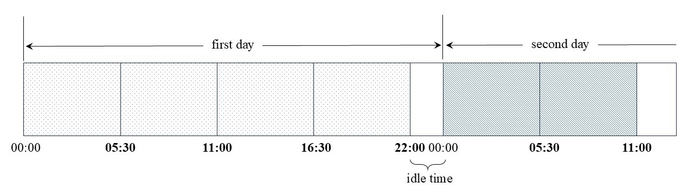
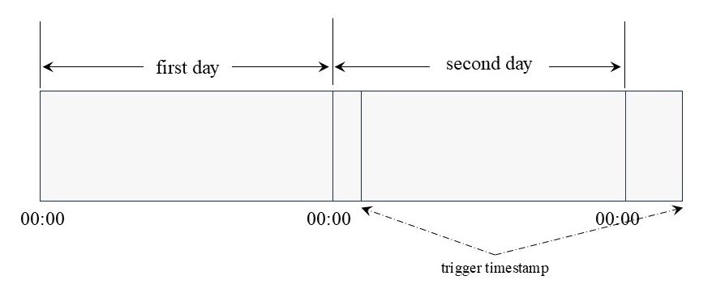

# 时序数据流计算模块-Function Spec

## 1. 修订记录

| 编写日期 | 发布日期 | 版本 | 修订人 | 主要修改内容 |
| --- | --- | --- | --- | --- |
| 2025-01-10 | 2025-01-10 | 1.0 | 潘魏 | 第一次安可送测 |
| 2025-12-13 | 2025-12-13 | 1.1 | 廖浩均 | 重构文档 |

## 2. 背景

在 TDengine  的数据模型中，流计算引擎将写入到 TDengine  中的时序数据视作为一个无截止时间、持续更新的数据流（stream）。因此任何写入到TDengine  数据库中的时序数据均可以作为流计算的输入。同时，流计算的结果能够继续写回 TDengine 数据库。
流计算引擎不提供针对流计算的高级语言接口（Domain Specific Language,  DSL）进行应用开发，流计算引擎使用 SQL 来作为用户界面，即可以通过 SQL  语句来定义、操纵流计算引擎提供计算服务，并能够通过用户定义函数（UDF/UDAF）的方式拓展支持的语义。
流计算的结果回写到时序数据库，用户可以订阅流计算的结果（超级）表，从而能够获得推送结果。

## 3. 术语

1. **触发表**：是用来决定事件触发的表,可以是任意表类型(包括虚拟表,不包括系统表),不支持视图,可以有分组。
2. **乱序数据**:指触发表出现写入主键时间戳非单调选梯增的场景,同一个写入块中的数据会被客户端预先排序,因此这里考虑的是不同块中出现写入的乱序场景。乱序数据可以是新写入的数据,也可以是既有数据的更新。
3. **实时计算**:是流计算最主要的计算任务,它是根据从人创建流计算时刻起触发表最新写入的数据开始进行触发的计算。
4. **历史数据**:流计算创建时数据库中已经写入的数据，历史数据可选是否需要计算输出。
5. **实时数据**:流计算创建后数据库中新写入的数据。
6. **连续查询(Continuous query)：**数据库或流计算引擎中一种自动定期执行的查询机制，它按照用户定义的时间间隔和规则，对实时或历史数据进行计算，并将结果存储或推送给用户，主要用于数据降采样和高效分析。
7. **水位线（watermark）**：代表的是事件时间在流计算中的进展，体现了用户对于乱序数据的容忍程度。水位线的计算如下：`最新事件时间-水位线间隔`

## 4. 行为说明

### 4.1 概述

流计算引擎采用触发与计算分离的架构体系，并在以下几个层面，对普通意义上的流计算进行如下拓展：
- 处理对象扩展。传统的流计算的事件驱动对象与计算对象是同一对象，即写入的数据触发了计算事件，计算事件启动针对写入数据的计算。在本流计算引擎中，触发事件与计算对象松耦合，触发计算的数据与计算数据对象可以不相同。此外，流计算引擎还可以仅依靠时间驱动运行。
- 触发方式扩展。除了标准的数据写入触发计算以外，流计算引擎还允许定义多种其他的计算触发方式。比如在各种时间窗口相关的计算触发模式中，用户可以灵活地定义和使用各种时间窗口来产生触发事件，并且可以选择在创建时间窗口、关闭时间窗口或创建和关闭时刻均触发计算行为。此外，TDengine还支持对触发数据进行预过滤，只有符合预过滤条件的数据才会触发流计算引擎的计算。
- 计算行为扩展。流计算引擎的计算类型不受限制，TDengine 查询引擎能够支持的查询语句和函数均可在流计算引擎中正常执行。计算结果的应用也可以根据需要选择仅发送通知或持久化存储，也可以既发送通知也持久化存储。
- 允许用户设置参数，在计算结果生成的时效性与计算资源消耗量之间达到平衡。针对不同用户对非正常顺序写入场景的不同需求,可以支持用户灵活选择适合的处理方式与策略。

### 4.2 事件触发

事件触发是流计算的核心驱动机制，流计算仅在事件触发后才启动计算行为。当流计算引擎识别出符合用户定义的触发条件时，会生成一次触发事件。在流处理过程中，每满足一次触发条件，就会触发一次计算。因此，流计算的结果由所有触发事件的累积效应决定。事件触发支持多种触发方式和时机选择，还可以进行分组处理，触发后可执行不同的操作。

#### 4.2.1 触发方式

触发事件产生的来源多种多样，可以来自于某个表的时序数据写入事件，也可以来自于对某个（子）表的计算分析结果，还可以不依赖于任何写入行为，仅仅是因为到某个特定的时刻。流计算引擎提供的触发方式包括:

##### 4.2.1.1 定时触发(PERIOD)

定时触发采用与连续查询 (Continuous Query) 类似的方式运行，即使用运行服务器系统时间的固定间隔来驱动计算。用户可以指定触发的表与分组，也可以不指定触发表。定时触发本质上就是我们常说的定时任务。
定时触发以建流时当天的系统时间零点作为定时触发的基准时间点，然后根据指定的时间间隔来确定下次触发的时间点。可以通过指定时间偏移的方式来改变基准时间点。
根据时间间隔的不同，定时触发的时间点也有所不同，具体的规则如下：
1. **时间间隔小于1天**
在时间间隔小于 1 天的场景中，触发时间表现为相对于每日零点的偏移。定时触发在每日基准时间点重置，以前后两日的基准时间点为一个周期。周期内按固定间隔定时触发，但最后一次触发时间与下一日基准时间点的间隔可能不足一个完整周期。例如，定时间隔为 5 小时 30 分钟时，每天的触发时刻如图所示，后续每天触发时刻保持一致。


如上图所示，每天激活的时刻是 05:30, 11:00, 16:30, 22:00。22:00 到第二天 00:00 不计入有效时间。
1. **时间间隔大于 1 天**
在这种使用场景下，时间偏移只在第一次是相对于每日零点的的偏移,定时触发是连续进行的触发,过程中没有重
置。例如，定时间隔为1天加1小时,建流时当前系统时间为22:00:00,那么在当天及随后几天的触发时刻将如下
图所示,后续将延续当前触发继续按照固定间隔触发。



##### 4.2.1.2 滑动触发(SLIDING)

滑动触发是基于事件时间的固定间隔触发机制 。它需要指定触发表且不支持 INTERVAL 窗口。触发时刻与定时触发 (PERIOD) 规则一致，但使用事件时间而非系统时间。触发表允许按照超级表按标签或子表分组或不分组。支持对写入数据进行条件过滤后触发。
适用于需要按事件时间连续定时计算的场景，如每小时生成当天统计数据或定时发送统计报告。

##### 4.2.1.3 固定时间窗口触发(INTERVAL)

固定时间窗口触发是基于事件时间和固定窗口大小的触发机制 。它必须指定 INTERVAL 窗口且必须指定触发表。窗口起始点为 Epoch Time 的 0 时刻开始（1970-01-01 00:00:00 UTC），可通过时间偏移调整起始点。触发表支持超级表按 tag 或子表分组。支持对写入数据进行条件过滤后触发。适用于需要按事件时间定时窗口计算的场景，例如每小时生成统计数据或计算最后 5 分钟窗口数据。

##### 4.2.1.4 会话窗口触发(SESSION)

会话窗口触发是基于会话窗口划分的触发机制 。它需要指定触发表。在窗口启动和关闭时触发，支持数据处理过滤。适用于需要通过会话窗口驱动计算或通知的场景。

##### 4.2.1.5 状态窗口触发(STATE_WINDOW)

状态窗口触发是针对触发表数据按状态窗口划分的触发机制，当窗口启动或关闭时触发，属于窗口触发类型，需指定触发表。若触发表为超级表，仅支持按子表分组。支持对写入数据进行条件过滤后触发。适用于需通过状态窗口驱动计算或通知的场景。

##### 4.2.1.6 事件窗口触发(EVENT_WINDOW)

事件窗口触发是基于事件窗口划分的触发机制，需指定触发表。窗口启动或关闭时触发，支持数据处理过滤。适用于需通过事件窗口驱动计算或通知的场景。

##### 4.2.1.7 计数窗口触发（COUNT_WINDOW）

计数窗口触发是基于计数窗口划分的触发机制。它需要指定触发表。在窗口启动或关闭时触发。支持列级触发（仅当指定列有数据写入时触发）。若触发表为超级表，仅支持按子表分组。支持对写入数据进行条件过滤后触发。适用于以下场景：处理每条数据（如故障数据写入）；根据列特定值处理（如异常值写入）；批量处理数据（如每写入 1000 条电压数据求平均值）。

#### 4.2.2 触发动作

事件触发后可执行不同动作：发送通知、执行计算或两者结合。
- 仅通知‌：通过WebSocket向外部应用发送事件通知。
- 仅计算‌：执行查询并将结果保存到流计算输出表。
- 通知+计算‌：执行查询后，发送计算结果或通知给外部应用。

#### 4.2.3 触发表与分组

通常情况下，一个流计算对应一种类型的计算任务，例如根据某个子表触发计算并将结果保存到一张表中。基于 TDengine “一个设备一张表”的设计理念，若需要对所有设备分别进行计算，传统的做法是为每个子表创建独立的流计算任务，这会显著增加使用的复杂性和处理的开销。
为解决此问题，流计算框架支持分组触发 ，其中每个分组被视为最小执行单元，逻辑上相当于一个独立的流计算任务，对应一个输出表和一套事件通知。若未指定分组或触发表（部分触发方式允许），流计算将生成单一计算任务，逻辑上视为单一分组，最终只对应一个输出表和通知。需要注意的是，所有触发方式均支持指定触发表与分组。由于每个分组独立执行，其计算进度和输出频率互不影响，因此各分组流计算是完全独立的。总结而言，流计算输出表的数量（子表或普通表）与触发表的分组数量保持一致；未分组时，则仅生成一个普通输出表。
目前支持的触发方式与分组组合如下:

| 触发方式 | 分组类型 |
| --- | --- |
| PERIOD、SLIDING、INTERVAL、SESSION | 按表分组、按标签分组、不分组 |
| 其他类型窗口触发 | 按表分组 |

### 4.3 事件通知

事件通知是流计算在触发后可选的执行动作，目前支持通过WebSocket协议发送事件通知到应用。通知类型需用户指定，可包含触发信息和计算结果，无结果时仅通知事件信息。

### 4.4 计算任务

计算任务在触发后执行任意查询（SQL语句），可查询触发表或外部库表数据。支持关联触发数据（如窗口内数据）或无关数据。结果默认写入流计算输出表，用户可选择不保存结果或仅发送通知。
注意事项：
查询输出第一列需为合法主键（时间戳列，不含NULL值），否则建流报错或结果被丢弃。
分组计算结果写入同一输出表（子表或普通表），若查询含分组子句，需使用复合主键避免数据覆盖。
触发结果覆盖写入同一表，主键时间戳相同则覆盖，不同则保留。用户需合理设计主键时间戳。
仅通知模式无输出限制，需保存结果时需遵循上述设计原则。

### 4.5 重新计算

流计算引擎支持的窗口类型都与主键列（时间列）关联。例如，事件窗口需要对按主键列排序的数据进行窗口计算。因此，为了兼顾流计算的效率和准确性，应尽可能保证触发表数据的有序性。乱序写入、数据更新或删除等操作可能会影响已触发窗口的计算结果。流计算引擎通过引入水位线 (Watermark) 机制来解决这些乱序、更新和删除引发的问题 。具体而言，事件时间早于水位线的数据会被认为是已处理的数据，进入触发判断；当窗口或触发条件的时间早于水位线时，系统将启动触发。水位线机制对定时触发 (PERIOD) 无效，因为定时触发不涉及基于事件时间的重新计算。
在流计算引擎中，当出现事件时间超出水位线范围的乱序数据，或者发生更新或删除操作时，系统会采用重新计算机制来确保最终结果的准确性。重新计算会对受影响的乱序、更新和删除数据所覆盖的时间区间重新进行聚合运算。在重算过程中，输出表已有的计算结果不会被删除，而是直接写入新的计算结果。
为保证重新计算的有效性，用户需要确保计算语句和数据源表与处理时间无关，即同一触发条件多次执行仍能产生相同且幂等的结果。
重新计算支持两种模式：
1. 自动重新计算： 系统自动处理，可通过配置选项关闭。
2. 手动重新计算： 用户通过 SQL 命令在需要时手动启动。

### 4.6 非典型场景

#### 4.6.1 数据乱序

数据乱序指的是触发表的乱序写入行为,计算不关心数据源表是是否乱序,但是用户需要从业务的角度确保在触发发
生时数据源表的数据已经写入完成。根据触发方式的不同,数据居乱序的影响和处理也不相同:

| 触发方式 | 处理行为 |
| --- | --- |
| 计数窗口 | 忽略 |
| 定时触发 | 忽略 |
| 滑动窗口触发 | 忽略 |
| 其他类型触发 | 通过重算处理，用户可强制忽略 |

#### 4.6.2 数据更新

数据更新是指同一个时戳的数据被重复写入多次,其他列可以更新或不更新,数据更新操作也只针对触发表和触发
操作有影响,对计算过程本身无影响。根据触发方式的不同,数据更新的影响和处理也不相同:

| 触发方式 | 处理行为 |
| --- | --- |
| 计数窗口 | 忽略 |
| 定时触发 | 忽略 |
| 滑动窗口触发 | 忽略 |
| 其他类型触发 | 通过重算处理，用户可强制忽略 |

#### 4.6.3 数据删除

数据删除也只针对触发表和触发操作有影响,对计算过程本身无影响。根据触发方式的不同,数据删除的影响和处
理也不相同:

| 触发方式 | 处理行为 |
| --- | --- |
| 计数窗口 | 忽略 |
| 定时触发 | 忽略 |
| 滑动窗口触发 | 忽略 |
| 其他类型触发 | 默认忽略 |

#### 4.6.4 过期数据

流计算引擎通过`expired_time`参数设置数据过期时间。在流计算触发时，每个分组根据最新数据的事件时间计算过期临界点（最新事件时间 - `expired_time`），早于该临界点的数据被视为过期数据。
过期数据特性：‌
- 适用范围‌：仅针对触发表的实时数据，历史数据和其他表数据不涉及过期概念
- 触发时机‌：仅在流触发时判断数据是否过期
- 数据写入影响‌：按事件时间顺序写入的数据不会过期，只有乱序写入的数据才可能成为过期数据
处理机制：‌
- 过期数据不会触发自动计算和重新计算，在所有触发方式下均被忽略
- 若无需要忽略的时间区间，可不设置 `expired_time`
- 如需对过期数据进行计算，可通过手动重算实现
过期数据仅影响自动触发行为，不影响计算数据范围。当计算范围包含过期数据时，这些数据仍会被正常使用。

#### 4.6.5 DML操作

| **操作** | **影响与流的处理** |
| --- | --- |
| 用户在触发超级表下新建子表并写入 | 新的子表自动加入当前流计算,可能加入某个分组或新产生一个分组 |
| 用户删除触发超级表的子表 | 默认忽略处理,对于某些触发方式如果需要可指定自动重算，可指定是否否删除子表对应的结果表(只适用按表分组的流) |
| 用户删除触发表 | 忽略 |
| 用户在触发表上新增列(TAG) | 忽略 |
| 用户删除触发表的列(TAG) | 忽略 |
| 用户修改触发超级表的子表tag值 | 如果该tag列被流作为触发分组列使用则不允许操作，报错处理。非分组列更改后立即生效 |
| 用户修改触发表的列schema | 忽略 (读取时发现schema不一致报错) |
| 用户修改、删除数据源表 | 忽略 |
| 用户修改、删除输出表 | 忽略不额外处理(输出子表和普通表如果写入时发现schema不一致报错,发现表不存在里新建表,输出超级表被删除不处理) |
| 用户拆分vnode | 当被拆分vnode所在库为数据源库或触发表库时不允许 当存在虚拟表触发或虚拟表计算时不允许,用户在确认无影响后可指定强制执行(SPLIT VGROUP FORCE) |
| 用户删除数据库 | 当被删库为某个流的数据源库或触发表库且不是该流的所在库时不允许 当存在非目标数据库的虚拟表触发或点拟表计算流时不允许,用户在确认无影响后可指定强制执行(DROP DATABASE name FORCE) |

### 4.7 结果输出

流计算的计算结果默认会保存到输出表 ，其中保存的结果是当前时刻已经触发和计算完成的输出。用户可以选择只发送结果通知给外部应用，也可以选择既写入输出表又发送通知。对于结果的保存，有以下几点说明：
- 输出表类型： 输出表可以为超级表或普通表。当存在触发分组时，输出表为超级表；当不存在触发分组时，输出表为普通表。
- 写入规则： 每个触发分组对应的计算结果会写入到一个子表中；未指定触发分组时，所有计算结果写入到同一个普通表中。
- 创建时机： 输出表在建流时会自动创建，用户无需自行创建。如果需要写入到已经存在的输出表中，需要保证表的 schema 完全匹配。
- 子表创建： 每个分组输出的子表不需要提前创建，流计算在运算过程中输出计算结果时会自动创建所需子表。
- 子表命名： 默认情况下，每个分组的输出子表名由系统按照默认规则生成，用户也可以自行指定子表名的命名规则。
- 命名冲突： 如果不同分组指定生成的子表名相同，那么不同分组的计算结果将保存到同一个子表中。用户需要自行确认这是否是预期的行为，否则应确保每个分组生成的子表名都是唯一的。
- 标签指定： 用户除了可以指定子表名外，也可以根据需要指定输出超级表的标签列及其对应标签列的值。
- 主键约束： 输出表写入数据时，遵循主键（`ts` 列或 `ts` + 复合主键列）唯一的约定。如果生成的数据主键不唯一，则只保留一条数据。在使用 `_twstart` 或各个子表 `ts` 列作为输出表 `ts` 写入一张表时，请务必确认是否符合预期。

### 4.8 权限控制

流计算的权限控制只与数据库的权限相关联,每个流计算可能与多个数据库相关,权限要求如下:

| 关联数据库 | 个数 | 权鉴 | 权限要求 |
| --- | --- | --- | --- |
| 流所属数据库 | 1 | 创建、删除、启停、重算 | 写入 |
| 触发表所属数据库 | 1 | 建流 | 读取 |
| 输出表所属数据库 | 1 | 建流 | 写入 |
| 数据源表所属数据库 | 多个 | 建流 | 读取 |

## 5. 操作与使用说明

### 5.1 使用说明

流计算引擎使用上的限制和说明如下:
1. 数据库关联与命名： 每个流计算任务属于一个特定的数据库，因此建流前系统中必须已经存在对应的数据库。同一个数据库中的流计算任务不允许重名。
2. 表的使用限制：
  - 触发表与数据源表： 流计算的触发表可以与数据源表相同，也可以不同，且可以跨库使用。
  - 输出表： 流的输出表可以与流、触发表、数据源表位于不同的数据库中，但不能与触发表或数据源表相同。
1. 输出表管理：
  - 自动创建： 用户无需提前创建输出结果表，引擎在需要写入结果时会自动创建。
  - Schema 匹配： 如果建流时指定的输出表已经存在，需要确保流计算生成的结果模式 (Schema) 与输出表完全匹配。
1. 级联计算 (Pipeline)： 流计算可以采用流水线 (Pipeline) 方式使用 ，即可以基于一个流计算任务的输出表再创建一个新的流计算任务。
2. 集群要求： 创建流计算任务前，集群中必须部署流计算节点。建流时，必须存在处于正常运行状态的 Snode (即流计算节点)。
3. 计数窗口 (COUNT_WINDOW) 的限制： 计数窗口触发不支持乱序、更新、删除的自动处理（系统将采取忽略处理的方式）。此外，在非 `FILL_HISTORY_FIRST` 模式下，历史数据窗口与实时数据窗口的对齐可能无法得到保证。
4. 超级表窗口分组限制： 对于超级表的窗口触发方式，只有 Interval (固定时间窗口) 和 Session (会话窗口) 支持按照标签、子表分组和不分组。其他类型的窗口聚合（如状态窗口、事件窗口）只支持按子表分组。
5. 分组限制： 暂不支持按普通列进行分组的计算。

### 5.2 部署说明

#### 5.2.1 部署要求

流计算从架构上支持存算分离。在部署时，系统中必须部署 Snode 节点 ，除数据读取外，所有流计算功能都只在 Snode 上运行。
Snode 可以与其他节点（如 Vnode、Mnode 等）在相同的 Dnode 上部署。但是，从资源隔离的角度考虑，强烈推荐 Snode 部署在单独的 Dnode 节点上。这样可以保证资源隔离，确保流计算任务不会对数据写入、查询等核心业务造成过大干扰。
Snode 节点专门负责运行流计算任务。在一个集群中，可以部署一个或多个 Snode 节点（至少 1 个），但每个 Dnode 中最多只能部署一个 Snode 节点。每个 Snode 节点都拥有多个执行线程。
为了保证流计算的高可用性，推荐在集群的多个物理节点中部署多个 Snode 节点 。流计算会在这些 Snode 节点间进行负载均衡。同时，每两个 Snode 节点之间互为存储副本，负责存储流计算的状态和进度等信息。如果集群中只部署了一个 Snode 节点，系统将无法提供高可用保证。

#### 5.2.2 操纵流计算节点

```sql {wrap}
--- 创建 snode
CREATE SNODE on DNODE dnode_id

--- 删除 snode
DROP SNODE ON DNODE dnode_id

--- 查看 snode
SHOW SNODES
SELECT * FROM INFORMATION_SCHEMA.INS_SNODES
```

### 5.3 配置说明

流计算相关配置参数

| 配置项 | 类型 | 说明 |
| --- | --- | --- |
| numOfMnodeStreamMgmtThreads | int | Mnode 启动的流计算管理线程数量 |
| numOfStreamMgmtThreads | int | Vnode/Snode 用于管理流计算的线程数量 |
| numOfVnodeStreamReaderThreads | int | Vnode 启动的流计算中用于数据读取线程 |
| numOfStreamTriggerThreads | int | 触发线程数 |
| numOfStreamRunnerThreads | int | 执行线程数 |
| streamBufferSize | int | 可用缓存大小，适用于 `%%trows` 结果缓存 |
| streamNotifyMessageSize | int | 事件通知的最大允许大小（KiB） |
| streamNotifyFrameSize | int | 事件通知消息发送的帧最大值（KiB） |

### 5.4 建流操作

#### 5.4.1 语法定义

```sql
CREATE STREAM [IF NOT EXISTS] [db_name.]stream_name coptions [INTO [db_name.]table_name]
[OUTPUT_SUBTABLE(tbname_expr)] [(column_name1, columnn_name2 [PRIMARY KEY][, ...])] [TAGS
(tag_definition [, ...]] [AS subquery]

options: {
    trigger_type [FROM [db_name.]table_name] [PARTITIONBY col1 [, ...]]
    [STREAM_OPTIONS(stream_option [|...])] [notification_definition]
}

trigger_type:{
    SESSION(ts_col, session_val)
    | STATE_WINDOW(col) [TRUE_FOR(duration_time)]
    | [INTERVAL(interval_val[, interval_offset])] SLIDING(ssliding_val[, offset_time])
    | EVENT_WINDOW(START WITH start_condition END WITH end_condition)
[TRUE_FOR(duration_time)]
    | COUNT_WINDOW(count_val[, sliding_val][, col1[, ...]])
    | PERIOD(period_time[, offset_time])
}

event_types:
    event_type [|event_type]
    
event_type: {WINDOW_OPEN | WINDOW_CLOSE}

stream_option: {
    WATERMARK(duration_time) | EXPIRED_TIME(exp_time) | IGNORE_DISORDER |
    DELETE_RECALC | DELETE_OUTPUT_TABLE | FILL_HISTORY[(Sstart_time)] |
    FILL_HISTORY_FIRST[(start_time)] | CALC_NOTIFY_ONLY |LOW_LATENCY_CALC | PRE_FILTER(expr) |
    FORCE_OUTPUT | MAX_DELAY(delay_time) | EVENT_TYPE(event_tyypes) |
    IGNORE_NODATA_TRIGGER
}

notification definition:
    NOTIFY(url [, ...]) [ON (event_types)] [WHERE condition]
    [NOTIFY_OPTIONS(notify_option[|notify_option])]
    
notify_option: [NOTIFY_HISTORY | ON_FAILURE_PAUSE]

tag_definition:
    tag_name type_name [COMMENT 'string_value'] AS expr
```

#### 5.4.2 建流介绍

##### 5.4.2.1 触发介绍

**触发类型**
- `trigger_type`:用来指定触发类型,目前支持的触发类型包括:
  - `SESSION(ts_col,session_val)`:会话窗口触发,参数含义如下:
    - `ts_col`:主键列名。
    - `session_val`:属于同一个会话的最大时间间隔，小于等于`fsession_val`的记录都属于同一个会话。
- `STATE_WINDOW(col)[TRUE_FOR(duration_time)]`:状态窗口触发,参数含义如下:
  - `col`:状态列的列名。
  - `[TRUE_FOR(duration_time)]`:指定窗口的最小持续时长,如果某个管窗口的时长低于该设定值,则会自动丢弃，不触发事件。
- `[INTERVAL(interval_val[, interval_offset])] SLIDING(sliding_val[,offset_time])`:滑动触发,参数含义如下:
  - `[INTERVAL(interval_val[,interval_offset])]`:可选。指定滑动窗口触发的事件类型和窗口时长,不指定时触发不产生窗口,指定时滑动触发变为滑动窗口触发。其中:
    - `interval_val`:窗口的时长,与滑动时长大小sliding_val间没有大小关系限制。
    - `[,interval_offset]`:可选,指定INTERVAL窗口的偏移。
  - `sliding_val`:事件时间的滑动时长。
  - `[,offset_time]`:可选,指定滑动触发的时间偏移,不适用于滑动窗口触发,支持的时间单位包括:毫秒(a)、秒(s)、分(m)、小时(h)。
- `EVENT_WINDOW(START WITH start_condition ENDWITH end_condition)[TRUE_FOR(duration_time)]`:事件窗口触发,参数含义如下:
  - `START WITH start_condition END WITH end_condition`:事事件起止条件的定义。
  - `[TRUE_FOR(duration_time)]`:指定窗口的最小持续时长,如果某个窗口的时长低于该设定值,则会自动舍弃,不产生触发。
- `COUNT_WINDOW(count_val[, sliding_val][, col1[, ...]])`:计数窗口触发,参数含义如下:
  - `count_val`:计数条数,当写入数据条目数达到 count_val时触发,最小值为1。
  - `sliding_val`:可选,窗口滑动的条数。
  - `[,col1[,...]`:可选,按列触发模式时的数据列列表,具体参数信息含义如下:
    - `col1[,...]`:触发列列表,只支持普通列,列表中任一列有非空数据写入时才为有效条目,NULL值视为无效值。
- PERIOD(period_time[,offset_time]):定时触发,参数名含义如下
  - `period_time`:定时触发的系统时间间隔,支持的时间单位包括:毫秒(a)、秒(s)、分(m)、小时(h)、天(d),支持的时间范围为[10a,3650d]。
  - `[,offset_time]`:可选,指定定时触发的时间偏移,支持的时间单位包括:毫秒(a)、秒(s)、分(m)、小时(h),偏移大小应该小于1天。
**触发表**
`[FROM[db_name.]table_name]`:用来指定触发表,触发表可以为任意表类型,不支持系统表,不支持视图,不支持子查询,但支持虚拟表。除了定时触发可以不指定触发表表外(也可以指定),其他触发方式必须指定触发表。
**触发分组**
`[PARTITION BY coll[,...]`:指定触发的分组列,支持多列,目前只支持按照`tbname`(表)和标签进行分组。

##### 5.4.2.2 控制介绍

`[STREAM_OPTIONS(stream_option[|...]]`:指定流的控制刷选项用于控制触发和计算行为,可以多选,同
一个选项不可以多次指定,目前支持的控制选项包括:
- `WATERMARK(duration_time)`:指定数据乱序的容忍时长,超过该时长的数据会被当做乱序数据,根据不同触发方式的乱序数据处理策略和用户配置进行处理,未指定时默认duration_time值为0。
- `EXPIRED_TIME(exp_time)`:指定过期数据间隔并忽略过期数据,未指定时无过期数据,如果业务不需要感知超过一定时间范围的数据写入或更新时可以指定。exp_time为过期时间间隔,支持的时间单位包括:毫秒(a)、秒(s)、分(m)、小时(h)、天(d)。
- `IGNORE_DISORDER`:指定忽略触发表的乱序数据,未指定时不忽略乱序数据,对于业务非常注重计算或通知的时效性、触发表乱序数据不影响计算结果等场景可以指定。乱序数据既包括新的乱序数据的写入,也包括对已写入数据的更新操作。
- `DELETE_RECALC`:指定触发表的数据删除(包含触发子表被删除除场景)需要自动重新计算,只有触发方式支持数据删除的自动重算才可以指定。未指定时忽略数据删除,只有触发表数据删除会影响计算结果的场景才需要指定。
- `DELETE_OUTPUT_TABLE`:指定触发子表被删除时具对应的输出子表也需要被删除,只适用于按表分组的场景,未指定时触发子表被删除不会删除其输出子表。
- `FILL_HISTORY[(start_time)]`:指定需要从start_time (事件时时间)开始触发历史数据计算,[(start_time)]可选,未指定时从最早的记录开始触发计算。如果未指定FILL_HISTORY和FILL_HISTORY_FIRST则不进行历史数据的触发计算,该选项不能与FILL_HISTORY_FIRST同时指定。定时触发(PERIOD)模式下不支持历史计算。
- `CALC_NOTIFY_ONLY`:指定计算结果只发送通知,不保存到输出出表,未指定时默认会保存到输出表。
- `LOW_LATENCY_CALC`:指定触发后需要低延迟的计算或通知,单单次触发发生后会立即启动计算或通知。低延迟的计算或通知会保证实时流计算任务的时效性,但是也会造成处理效率的降低,有可能需要更多的处理资源才能满足需求,因此只推荐在业务有强时效性要求时使用。未指定时单次触发发生后有可能不会立即进行计算,采用批量计算与通知的方式来达到较好的资源利用效率。
- `PRE_FILTER(expr)`:指定在触发进行前对触发表进行数据过滤处理,只有符合条件的数据才会进入触发判断,expr中可以包含列、tag、常量及其标量与逻辑运算,列如:col1>0则只有col1为正数的数据行可以进行触发,未指定时无触发表数据过滤。
- `FORCE_OUTPUT`:指定计算结果强制输出选项,当某次触发没有计算结果时将强制输出一行数据,除常量外(含常量对待列)其他列的值都为NULL。
- `MAX_DELAY(delay_time)`:指定窗口未关闭时的最长触发等待寺时长(处理时间),从窗口开启时每经过该时间段且窗口仍未关闭时产生触发,适用于所有窗口触发方式C,SLIDING触发(不带 INTERVAL)和PERIOD触发不适用(自动忽略)。当窗口触发存在TRUE_FOR 条件目TRUE_FOR 时长大于`MAX_DELAY`时,MAX_DELAY仍然生效,即使最终当前窗口未满足TRUE_FOOR条件。delay_time为等待时长,支持的时间单位包括:秒(s)、分(m)、小时(h)、天(d),最小允许的值为3秒,误差范围在1秒以内,特别的是当计算时长超过 delay_time时忽略期间的MAX_DELAY触发。
- `EVENT_TYPE(event_types)`:指定窗口触发的事件类型,可以多选,未指定时默认值为`WINDOW_CLOSE`,选项含义如下:
  - `WINDOW_OPEN`:窗口启动事件。
  - `WINDOW CLOSE`:窗口关闭事件。
    `SLIDING`触发(不带 INTERVAL)和PERIOD触发不适用(自动忽略)。
- `IGNORE_NODATA_TRIGGER`:指定忽略触发表无输入数据时的触发,适用于滑动触发(SLIDING)、滑动窗口触发(INTERVAL)、定时触发(PERIOD)。对于滑动触发与定时触发来说,如果两次触发时刻中间触发表没有数据则忽略该次触发。对于滑动窗口触发来说,如果窗口内触发表没有数据则忽略该次触发。未指定时不忽略无输入数据时的触发。

##### 5.4.2.3 通知介绍

`NOTIFY(url [, ...]) [ON (event_types)] [WHERE condition][NOTIFY_OPTIONS(notify_option[...]]`:可选,当需要发送事件通知时需要指定,详细说明如下:
`url[,...]`:指定通知的目标地址,必须包括协议、IP或域名、端口号,并允许包含路径、参数,整个url需要包含在引号内。目前仅支持websocket协议。例如: `"ws://``localhost:8080``"`、`"ws://``localhost:8080/notify``"`、`"ws://``localhost:8080/noti``fy?key=foo"`。
`[ON (event_types)]`:指定需要通知的事件类型,可多选,对于SLIIDING(不带INTERVAL窗口)和`PERIOD`触发不需要指定,其他触发必须指定,支持的事件类型有有:
- `WINDOW_OPEN`:窗口打开事件,在触发表分组窗口打开时发送通知
- `WINDOW_CLOSE`:窗口关闭事件,在触发表分组窗口关闭时发送通知。
`[WHERE condition]`:指定通知需要满足的条件,condition中只能指定含计算结果列和(或)常量的条件。
`[NOTIFY_OPTIONS(notify_option[|notify_option)]]`:可选,报指定通知选项用于控制通知的行为,可以多选,目前支持的通知选项包括:
`NOTIFY_HISTORY`:指定计算历史数据时是否发送通知,未指定时默认不发送。
`ON_FAILURE_PAUSE`:指定在向通知地址发送通知失败时暂停流计算任务,循环重试发送通知,直至发送成功才恢复流计算运行,未指定时默认直接丢失事件通知(不影响流计算继续运行)。

##### 5.4.2.4 输出表介绍

`[INTO [db_name.]table_name] [OUTPUT_SUBTABLE(tbname_exxpr)] (column_name1, column_name2 [PRIMARY KEY][, ...])] [TAGS (tag_definition[,...])]`：建流语句的这一部分用于指定**输出表的定义**以及输出子表的 **Tag 值**（存在分组时）。详细说明如下：
**1. INTO [db_name.]table_name**
`INTO [db_name.]table_name`：可选。用于指定输出表的表名 `table_name`，也可以指定数据库名 `db_name`。
- 表类型： 存在触发分组时，该表为超级表；不存在触发分组时，该表为普通表。
- 指定要求： 对于只触发通知不计算或计算结果只通知不保存的场景，不需要指定；否则，必须预先指定输出表名。
**2. OUTPUT_SUBTABLE(tbname_expr)**
`[OUTPUT_SUBTABLE(tbname_expr)]`：可选。用于指定每个触发分组的计算输出表（子表）名。
- 使用限制： 没有触发分组时不可指定。
- 默认行为： 未指定时，系统会根据规则为每个分组自动生成唯一的子表名。
- 表达式 `tbname_expr`： 它可以是任意输出字符串的表达式，可根据需要选择任意触发表分组列（来自 `[PARTITION BY col1[,...]]`）进行使用。
- 长度限制与唯一性： 输出长度不能超过表名最大长度，超过时会截断处理。如果不希望不同分组输出到同一个子表中，用户必须确保每个分组输出的表名都是唯一的。
**3. 列定义 (column_name, ...)**
`[(column_name1, column_name2 [PRIMARY KEY][, ...])]`：可选。用于指定输出表的每列列名。
- 默认行为： 未指定时，每列列名与计算结果的每列列名相同。
- 主键指定： 可以通过 `[PRIMARY KEY]` 关键字将第二列指定为主键列，与第一列共同组成复合主键。
**4. TAGS (tag_definition, ...)**
`[TAGS(tag_definition[,...])]`：可选。用于指定输出超级表的标签列定义与值的列表。
- 使用限制： 只有存在触发分组时才可以指定。
- 默认标签： 未指定时，默认标签列的定义和值均来自于所有分组列。此时要求分组列中不可以存在相同的列名。特别是当按表分组时，生成的标签列名为 `tag_tbname`。
- `tag_definition` 参数说明：
- `tag_name type_name [COMMENT 'string_value'] AS expr`：指定单个 Tag 列的定义与值。
  - `tag_name`：Tag 列名。
  - `type_name`：Tag 列类型。
  - `expr`：自定义的 Tag 值计算表达式，可根据需要选择任意触发表分组列（来自 `[PARTITION BY col1[,...]]`）进行使用。

##### 5.4.2.5 计算介绍

`[AS subquery]`:可选，指定流计算任务语句，可以是任意类型的查询语句，查询的对象是数据源表，可以与触发表相同或不同。未指定时触发后不产生计算,只相根据需要进行事件触发。

###### 5.4.2.5.1 占位符

计算时可能需要使用触发时的一些关联信息,这些信息在SQL语句中以占位符的形式出现,在每次真实计数时会被作为常量替换到SQL语句中。这里定义和列举了计算SQL语可中可以使用的触发相关的一些占位符:

| 触发方式 | 占位符 | 说明 |
| --- | --- | --- |
| _tprev_ts | 上一次触发事件的时间 |
| _tcurrent_ts | 本次触发事件的时间 |
| _tnext_ts | 下一次触发事件的时间 |
| _twstart | 本次触发窗口起始时间 |
| _twend | 本次触发窗口的结束时间，只用于`window_close` 触发模式 |
| _twduration | 本次触发窗口的结束时间，只用于`window_close` 触发模式 |
| _twrownum | 本次触发窗口的结束时间，只用于`window_close` 触发模式 |
| _tprev_localtime | 上一次触发事件的时间（纳秒精度） |
| _tnext_localtime | 下一次触发事件的时间（纳秒进度） |
| _tgrpid | 触发分组id |
| _tlocaltime | 本次触发事件产生时刻的系统时间（纳秒精度） |
| %%n | 触发分组列的引用，n 为分组列（来自`[partition by col1[, ...]`）的下标 |
| %%tbname | 触发表每个分组表名的引用，触发分组包含 tbname 时候可用，可作为查询表名使用（`from %%tbname`） |
| %%trows | 触发表每个分组的触发数据集（满足本次触发的数据集）的引用。在定时触发模式中，表示上次触发以后本次触发之间写入触发表的数据，只作为查询的表名使用，例如 `from %%trows`，只适用于 `window-close` 触发使用，推荐小规模数据场景下使用 |

###### 5.4.2.5.2 占位符使用限制

`%trows`:行关联查询。只能用于`FROM`子句,在使用 `%trows`的语句中不支持`where` 条件过滤,不支持对`%trows`进`%%tbname` 只能用于 `FROM` `SELECT` 和 `WHERE` 子句。其他占位符只能用于 `SELECT` 和 `WHERE`子句。

#### 5.4.3 建流示例

**计数窗口触发**
需求1:表tb1每写入1行数据时,计算表 tb2中在同一时刻前5分钟内 col1的平均值,计算结果写入表 tb3。
语句1: 
```sql {wrap}
create stream sm1 count_window(1)from tb1into tb3 as select_twstart, avg(col1) from tb2 where_c0 >= _twend - 5m and_c0 <=_twend
```

需求2:表tb1每写入10行大于0的col1列数据时,计算这10多条数据col1列的平均值,计算结果不需要保存,需要通知到 `ws://``localhost:8080/notify`。
```sql {wrap}
create stream sm2 count_window(10,10, 10, 10, col11) from tb1 STREAM_OPTIONS(CALC_ONTIFY_ONLY|pre_filter(col1 >0) notify("ws://localhost:8080/notify") on (WINDOW_CLOSE) as select avg(col1) from %trows
```

**滑动窗口触发**
需求1:超级表 stb1的每个子表在每5分钟的时间窗口结束后,计算这5分钟的col1的平均值(如果没有数据则忽略),每个子表的计算结果分别写入超级表 stb2的不同子表中"。
```sql {wrap}
create stream sm1 INTERVAL(5m) SLIDING(5m) 
from stb1 PARTITION BY tbname STREAM_OPTIONS(IGNORE_NODATA_TRIGGER) into stb2 
as select_twstart, avg(coll)from %tbname where _c0 >= _twstart and_c0 <= _twend;
```

说明:这里语句中的`from %tbname where_c0>=_twstart and_c0<=_twend` 与 `from %trows` 的含义是不完全相同的,前者表示计算使用触发分组对应的表中在E触发窗口时间段内的数据,窗口内的数据在计算时与 `%trows` 相比较是有可能有变化的,后者则表示只使用触力发时读取到的窗口数据。
需求2:超级表 stb1的每个子表从最早的数据开始,在每!5分钟的时间窗口结束后或从窗口启动1分钟后窗口仍然未关闭时,计算窗口内的col1的平均值,每个子表的计算结果分别写入超级表 stb2的不同子表中。
```sql {wrap}
create stream sm2 INTERVAL(5m)SLIDING(5m) MAX_DELAY(1m) from stb1 PARTITION BY (tbname STREAM_OPTIONS(FILL_HISTORY_FIRST) intostb2 as select_twstart, avg(coll) from %tbname where_c0>=_twstart and_c0<=_twend;
```

**定时触发**
需求1:每过1小时计算表tb1中总的数据量,计算结果写入表tb2(毫秒库)。
```sql {wrap}
create stream sm1 PERIOD(1h) into tb2 as seelect cast(_tlocaltime/1000000 as timestamp), count(*) from tb1 ;
```

需求2:每过1小时通知`ws://``localhost:8080/notify` 一次当前系统时间。
语句2:
```sql {wrap}
create stream sm1 PERIOD(1h) notify("ws://localhost:8080/notify")
```

### 5.5 流的查看

代码块
```sql {wrap}
SHOW [db_name.]STREAMS;
```

`SHOW STREAMS`会显示当前数据库或指定数据库所属的流计算,若要展示所有流计算的信息或者流计算的更详细的信息,可以使用:
```sql {wrap}
SELECT * from information_schema. ins_streams
```

一个流计算在执行时由多个任务组成,用户或维护人员可以从系统转
`information_schema.ins_stream_tasks`查询更详细的流的具体本的任务信息。
```sql {wrap}
SELECT * from information_schema. ins_stream_tasks`;
```

### 5.6 手动重算

```sql {wrap}
RECALCULATE STREAM [db_name.]stream_name FROM start_time [TO end_time];
```

说明:
用户可以根据需要来指定需要重算流的一段时间区间(事件时间)内的数据,如果未指定结束时间 (`end_time`),重算区间将从指定的开始时间(`start_time`)-直到用户启动手动重算时刻流的当前计算进度截至。
不适用于定时触发(`PERIOD`),适用于其他所有触发类型。
计数窗口触发的手动重算必须同时指定开始时间与结束时间,只适用于当前流进度已经完成部分的时间区间的触发重算,如果指定的重算区间包含流当前还未启动计算的区间将自动忽略该重算请求。流计算会在该时间区间内重新划分触发窗口并进行重算,在这种情况下重新划分的窗口与重算前已经完成计算的窗口可能存在不对齐的情况,因此用户可能需要先手动删除结果表中重算区间内的结果,这样才能保证结果表中不会同时存在多次计算的结果。同理,如果未指定重算结束时间,该重算请求将自动被忽略。对于这种需要从某一时刻开始而没有结束时间的重算需求,可以通过先删流,再重建并指定`FILL_HISTORY_FIRST` 含开始时间的方式来满足。

### 5.7 停止操作

```sql {wrap}
STOP STREAM [IF EXISTS] [db_name.]stream_name;
```

说明:
- 如果没有指定`IF EXISTS`,如果该stream不存在,则报错;如果存在,则停止流计算。指定了`IF EXISTS`,如果该stream不存在,则返回成功;如果存在,则停止流计算。
- 停止操作是持久有效的,在用户重启流运行之前不会重新运行。

### 5.8 启动操作

```sql {wrap}
START STREAM [IF EXISTS] [db_name.]stream_name;
```

说明:
没有指定`IF EXISTS`，如果该stream不存在,则报错,如果存在,则启动流计算;指定了`IF EXISTS`，如果stream不存在,则返回成功;如果存在,则启动流计算。
建流后流自动启动运行,不需要用户启动,只有在停止操作后才需要通过启动操作恢复流的运行。启动流计算时,流计算停止期间写入的数据会被当做历史数据处理。

### 5.9 删流操作

```sql {wrap}
DROP STREAM [IF EXISTS] [db_name.]stream_name;
```

说明:
仅删除流式计算任务,由流式计算写入的数据不会被删除。

### 5.10 最佳实践

因为新的流计算提供了功能上更大的灵活性,取消了很多限制,在提升了用户可用性的同时,也对用户用好用对流计算提出了更高的要求。本节是根据流计算支持的功能结合实现的特点,总结列举一些需要用户或交付人员注意的使用方面的一些最佳实践。

#### 5.10.1 部署方面

用户有条件时或使用多个流时或不希望流计算影响数据库时,推荐在单独的机器和dnode部署snode,不推荐与其他节点(vnode/mnode/qnode等)部署在一起;
推荐在集群内部署多个snode节点以保证高可用;
推荐在建流前先预先完成多个snode节点的创建以便更好的达到负载均衡;
流计算负载高时可以通过增加snode的方式来实现负载均衡;

#### 5.10.2 配置方面

根据部署方式和负载情况合理配置流相关的线程个数,线程数越大可能占用的CPU资源越高,反之则越低;
根据部署方式合理配置流最大的缓存大小,负载越大,并发流越多,单独部署时都可以调大配置;

#### 5.10.3 流创建策略

| 检查列表 | 策略 |
| --- | --- |
| 根据业务特点选择触发方式 | 如果是需要每写入一条或多条数据进行处理则选择计数触发,如果是需要满足足窗口条件则选择窗口触发,如果是需要根据事件时间定时运算则选择滑动触发,如果是需要根据处理时间定时运算则选择定时触发。 |
| 根据业务计算的时效性要求选择窗口触发的可选项 | 窗口触发除了要选择窗口类型外,还需要选择是开窗触发、关窗触发还是两者者都触发,除此之外还可以选择在窗口未关闭时是否需要及时计算{MAX_DELAAY(delay_time)} |
| 根据事件来源选择触发表 | 事件触发的来源表选做触发表,对于定时触发可以没有触发表,但但是如果需要分组输出或使用定时期间触发表数据集(%trows)则必须指定触发表。 |
| 确保数据来源表与触发表的时序关系 | 如果数据来源表与触发表不相同,那么需要确保在触发表事件触发时数据来源表中数据已经可用,否则将可能影响计算结果的正确性。 |
| 根据业务最终计算的需求决定分组 | 以超级表计算为例,如果业务最终的需求是全局聚合则不需要分组,如果需要要某些表聚合则选择按tag分组,如果需要单个子表的计算结果则可以选择按表分组。 |
| 根据流计算结果的应用方式选择分组输出子表 | 每个分组都可以有自己独立的输出子表,如果分组过多可能导致结结果表过多,因此可以根据后续流计算结果的应用方式和系统资源是制选择是否每个分组需要单独的输出子表 |
| 使用最优的数据写入方式 | 当可以多个分组合并输出到一个子表时,可以通过设定多个分组使用相同的转输出表名([OUTPUT_SUBTABLE(tbname_expr)])和输出表的复合主键设计十实现分组结果合并每个分组的数据都能顺序写入是流计算最佳的写入方式,如果存在大量的乱户序写入、更新写入、数据删除操作,将可能造成大量的重算处理,因此如果有条件能够保证写入顺序将可以有效提升流计算的计算效能。 |
| 确认写入数据的乱序情况 | 根据每个子表的写入乱序情况确定是否需要指定 WATERMARK以及确定合适的WATERMARK时长。 |
| 确认乱序数据写入对流计算的影响 | 如果存在乱序写入数据,需要确认这些乱序写入的数据的计算结果的影响,又对于业务非常注重计算或通知的时效性、触发表乱序数据不影响计算结果等场景可以指定 STREAM OPTIONS(IGNORE DISORDER)忽略这些乱序数据。 如果存在严重的过去时间的乱序写入数据(写入数据的事件时间与当前已经处理的事件时间相差太大)且这些数据不影响计算结果或我时效性已经丧失,则可以通过 STREAM_OPTIONS(EXPIRED_TIME(exp_time))指定其为过期数据且忽略处理 |
| 确认重算对流计算结果的有效性 | 乱序、更新、删除场景主要是通过重算方式来解决,如果重算结果不具有幂等性或有效性,则可能会影响结果的正确性,可结合业务特点进行判断 |
| 确认删除数据对流计算的影响 | 如果存在数据删除且需要根据删除的数据重新计算结果时则可以通通过STREAM OPTIONS(DELETE RECALC)进行指定 |
| 确认历史数据是否需要计算和计算方式 | 如果在建流时数据库中已经写入的数据需要进行计算,则需要根据业务特点和口处理逻辑进一步确认是优先计算历史数据还是实时数据,例如COUNT_WINDOW触发只能优先历史数据计算,否则可能造成窗口无法衔接。如果优先历史数据计算则可以指定 STREAM OPTIONS(FILL HISTORY FIRST),否则指定STREAM OPTIONS(FILL HISTORY) |
| 确认业务对流计算实时性要求程度 | 如果业务对流计算通知或计算的实时性要求很高,则可以指定STREAM_OPTIONS(LOW_LATENCY_CALC),在这种模式下会对计算资源有更高的要求。 |
| 确认使用流计算的用途 | 如果用户只需要一个事件触发通知,而不需要做计算,那可以使用只通知不计算模式(不指定计算语句)。 |
| 确认计算后结果的应用方式 | 如果用户只需要结果通知而不需要保存,可以使用结果只通过不保存方式 `STREAM_OPTIONS(CALC_NOTIFY_ONLY)` |
| 确认结果写入的可靠性 | 运算过程中如果出现结果主键为NULL值则对应的计算结果可能会被丢弃。 如果查询语句也包含了分组子语且分组的结果写入到同一个子表时,当不同的分组产生相同的时间戳时可能出现数据覆盖。 如果同一个分组多次触发计算产生的主键时间戳相同,那么它们会互相覆盖写入。 如果同一个分组多次触发(重算)产生的主键时间戳不相同,那么它们就不会被更新。 |

#### 5.10.4 流的维护

在流的状态展示中(查询表information_schema.`ins_streams`),会列举流的一些具体的状态信息,例
如:流的实时计算是否能保持进度一致,流的重算次数多少(1比例),流的错误信息等等,需要用户或运维人员关
注展示的信息,判断流计算业务是否正常并据此进行分析优化处理。

## 6. 性能

希望能够通过精简设计达到更好的资源利用效率,同等条件下比之前的效率更好,能够支持更多的流计算。

## 7. 安全

查询引擎的安全性功能需求，作为查询引擎运行的整体保障和支撑，其操作过程对用户透明。安全性功能说明涵盖以下内容：
1. **身份验证与授权 (Authentication and Authorization)**：登录身份确认后，授权模块（基于角色的访问控制 RBAC ）根据预定义的策略检查用户权限，确保其仅能执行被允许的流计算相关操作。
2. **最小权限原则 (Principle of Least Privilege, POLP)**：数据库流计算引擎及其关联的服务账户必须严格遵循最小权限原则。引擎在操作系统层面或数据库内部，应仅被授予执行其基本功能所需的最低限度权限。
3. **传输过程数据加密(Data Encryption In Transit)**：见通信部分。
4. **安全会话管理 (Secure Session Management)**：见通信部分。
5. **日志记录、监控与审计追踪 (Logging, Monitoring, and Audit Trails)**：流计算引擎记录详尽的审计日志（Audit  Logs），涵盖所有数据库连接尝试、敏感数据访问以及潜在的安全异常事件（如大量异常的创建行为和操作流任务事件等）。
6. **安全错误处理与信息泄露预防 (Secure Error Handling and Information Leakage Prevention)**：以安全的方式处理和呈现错误信息。不包含敏感的系统内部信息、数据库连接字符串、服务器路径或底层架构细节。

## 8. 兼容性

不考虑流的兼容性,如果老用户需要升级,那么他们的TSMA、流计算任务和snode都需要先通过SQL命令的方
式删除(含结果表),然后正常关闭taosd,snode存储目录高需要手动删除,然后在新的流计算版本上进行重建。
暂时新的流计算在功能上也不能覆盖全部旧的流计算功能。

## 9. 运维

升级前需删除旧的TSMA、流计算任务和流计算节点。
部署上需要配置刘计算节点。
使用上需要详细了解新的流的用法与行为,合理正确使用新的流计算。

## 10. 使用场景

通过事件触发对表的持续写入数据进行通知或计算的场景。

## 11. 约束和限制

参见《最佳实践》章节

## 12. 常见错误和排查

1. 语法错误
   - 常见提示：syntax error near xxx
   - 错误排查：检查提示位置的语法拼写错误
2. 表不存在错误
   - 常见提示：Table does not exist: xxx
   - 错误排查：检查流计算触发表在对应的库中是否存在
3. 系统底层错误
   - 常见提示：System error
   - 错误排查：检查系统资源是否出现不可用情况

## 13. 可观测性

通过 SQL 语句检查查询的执行计划，并在记录查询中关键算子的执行时间开销信息。
```sql
show streams;
```

通过该语句能够获得当前正在执行的全部流信息，以及流运行的状态等信息。

```sql {wrap}
select * from information_schema.ins_tasks;
```

查看所有流的全部任务的信息，包括任务id， 状态，类型、启动时间、更新时间、消息等内容，便于管理员获得关于当前流任务的全面信息。

## 14. 安装和卸载

无。

## 15. 文档

需要在官网文档中增加流计算相关章节内容。

## 16. 参考文档

无

## 17. 附录

无
