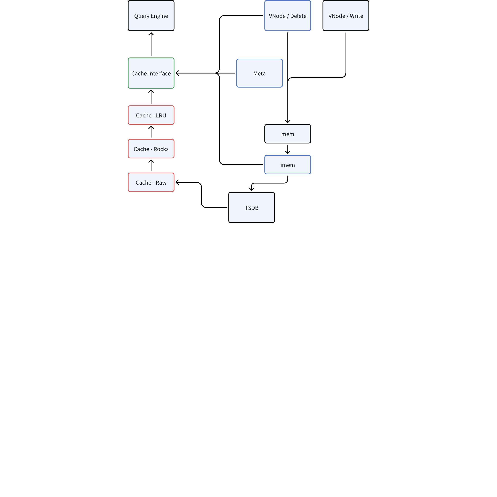
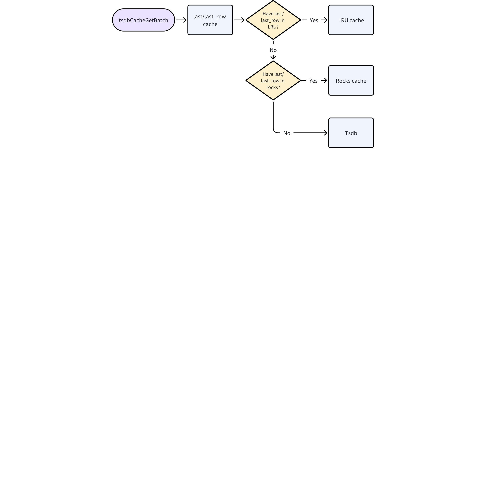

# 时序数据缓存模块-Design Spec

## 1. 修订记录

| 编写日期 | 发布日期 | 版本 | 修订人 | 主要修改内容 |
| --- | --- | --- | --- | --- |
| 2025-01-19 | 2025-01-19 | 1.0 | 金明磊 | 安可送测第一版 |
| 2025-12-03 | 2025-12-03 | 1.1 | 程洪泽 | 1. 按照新模板重构文档 1. 对内容添加补充 |

## 2. 引言

### 2.1 目的

本文档旨在详细说明 TDengine 存储引擎中时序数据缓存（Last Cache）特性的详细设计。
在物联网、实时监控等时序数据库应用场景中，获取时间序列的最新状态（即 `last` 或 `last_row` 查询）是极高频的操作。当前的存储引擎在处理此类查询时，往往需要扫描 MemTable 或磁盘文件，导致较高的 I/O 和 CPU 开销。
本设计的目的是引入一种专用的内存缓存机制，用于实时维护每张表的最新行数据或特定列的最新非空值。通过该机制，系统可以直接从内存中返回最新值查询结果，从而：
1. 显著降低 `last` 和 `last_row` 查询的延迟（Latency）。
2. 大幅提升系统在高并发查询下的吞吐量（QPS）。
3. 减少对底层存储的 I/O 压力和 CPU 资源消耗。
本文档将详细阐述该特性的架构设计、关键数据结构、缓存更新与淘汰策略、以及与现有写入和查询流程的交互逻辑，为开发和测试提供明确的指导。

### 2.2 范围

本文档的范围涵盖了时序数据缓存（Last Cache）特性的后端存储引擎设计与实现。具体包括：
1. **缓存管理**：
  - 定义缓存的核心数据结构，支持 `LAST_ROW`（最新行）和 `LAST_VALUE`（最新值）两种模型。
  - 实现基于 `CACHESIZE` 的内存管理机制。
  - 处理数据库级别的配置参数（`CACHEMODEL`, `CACHESIZE`）。
1. **写入路径集成**：
  - 在数据写入 WAL 和 MemTable 的流程中，同步更新缓存的逻辑。
  - 处理乱序数据写入和数据删除时的缓存更新或失效策略。
1. **查询路径集成**：
  - 查询优化器的修改，识别可利用缓存的 `last` 和 `last_row` 查询。
  - 实现直接从缓存读取数据的执行计划，以及缓存未命中时的回退机制。
1. **持久化与恢复**：
  - 系统启动或重启时，重建缓存的流程。
**不包含在范围内的内容**：
- 客户端驱动或 API 的修改（本特性对客户端透明）。
- 针对非 `last`/`last_row` 聚合函数的缓存优化。
- 复杂过滤条件下的缓存加速（仅支持基础的时间序列最新值查询）。

### 2.3 受众

本文档的主要受众包括：
1. **核心开发人员**：负责实现存储引擎缓存机制、修改写入和查询路径的工程师。
2. **测试工程师**：负责设计单元测试、集成测试和性能测试用例，验证缓存功能正确性及性能指标的 QA 人员。
3. **系统架构师**：负责审查设计方案的可行性、系统影响及与其他模块兼容性的技术负责人。
4. **运维与技术支持人员**：需要了解缓存机制原理、配置参数及故障排查方法的后端支持团队。

## 3. 术语

| **术语** | **定义** |
| --- | --- |
| **Last Cache** | 针对时序数据表最新状态的缓存机制，专门用于加速 `last` 和 `last_row` 函数的查询。 |
| **MemTable** | 内存表，TDengine 存储引擎中用于暂存新写入数据的内存结构，数据在落盘前存储于此。 |
| **Last/Last_row** | TDengine 中的聚合函数。`last` 返回某列的最新非空值，`last_row` 返回时间戳最大的那一行数据。 |
| **VNode** | 虚拟节点（Virtual Node），TDengine 中存储和计算的基本单元，负责管理一部分表的数据。 |
| **VGroup** | 虚拟组（Virtual Group），由一个或多个 VNode 组成，用于保证数据的高可用性。 |
| **WAL** | Write Ahead Log，预写日志，用于保证数据在系统崩溃后的持久性和一致性。 |
| **TSDB** | Time-Series Database，时序数据库，专门用于存储和处理随时间变化的数据的数据库系统。 |
| **QPS** | Queries Per Second，每秒查询率，衡量系统吞吐量的指标。 |
| **Latency** | 延迟，指从发送请求到接收到响应所需的时间，衡量系统响应速度的指标。 |
| **OOM** | Out of Memory，内存溢出，指系统内存不足以满足分配请求的状态。 |
| **Warm-up** | 预热，指系统启动后，将数据加载到缓存中以达到最佳性能状态的过程。 |

## 4. 概述

### 4.1 架构

#### 4.1.1 总体架构

Last Cache 是嵌入在 TDengine 存储引擎（VNode）内部的一个独立子模块，旨在为高频的最新值查询（`last`/`last_row`）提供极低延迟的响应。它采用分层存储架构，结合了高性能的内存缓存和持久化的 K-V 存储（RocksDB），与 MemTable 并行工作。
- **分层存储**：
  - **L1 内存缓存 (Memory Cache)**：基于内存池管理的 LRU 缓存，存储最热的最新数据，提供微秒级查询响应。
  - **L2 持久化缓存 (RocksDB)**：作为二级缓存和持久化层。当内存缓存未命中时，查询 RocksDB。同时，RocksDB 保证了系统重启后缓存数据的快速恢复，避免了漫长的预热过程。
- **写入路径**：数据写入 WAL 和 MemTable 后，异步更新 Last Cache。首先更新 L1 内存缓存，随后异步刷入 L2 RocksDB。
- **查询路径**：查询执行器优先检查 L1 内存缓存；若未命中（Miss），则查询 L2 RocksDB；若仍未命中，最后回退到标准的存储引擎扫描流程（MemTable + Disk）。

#### 4.1.2 核心组件

Last Cache 模块主要由以下组件构成：
1. **Cache Manager (缓存管理器)**：负责协调 L1 和 L2 缓存的交互，管理 VNode 级别的 RocksDB 实例生命周期，以及处理配置参数（`CACHEMODEL`, `CACHESIZE`）。
2. **Memory Cache (L1 内存层)**：
  - Memory Pool (内存池)：受限的内存分配器，严格控制内存使用上限，防止 OOM。
  - LRU Evictor：基于 LRU（最近最少使用）策略管理内存数据，当内存不足时淘汰冷数据。
1. **Persistent Storage (L2 RocksDB 层)**：
  - 每个 VNode 拥有独立的 RocksDB 实例，实现数据隔离和独立迁移。
  - 负责数据的持久化存储，支持系统快速重启恢复。
1. **Key-Value Schema**：
  - Key: `(Flag, Table UID, Column ID)` 元组。`Flag` 区分 `LAST_ROW` 或 `LAST_VALUE` 模式。
  - Value: 序列化后的缓存数据（行数据或列值）。

#### 4.1.3 关键流程逻辑

- **异步写入与一致性**：写入操作在更新内存缓存后即返回，后台异步写入 RocksDB。系统崩溃恢复时，依赖 WAL 的重放（Replay）机制来修补 RocksDB 中可能丢失的最新数据，确保最终一致性。
- **查询穿透**：查询请求 -> L1 Memory (Hit? Return) -> L2 RocksDB (Hit? Return & Promote to L1) -> Storage Engine (Fallback)。
- **启动恢复**：系统启动时，直接打开 RocksDB 实例即可提供服务，无需扫描全量数据文件进行预热。

### 4.2 技术

- **编程语言**：C/C++ (遵循 TDengine 现有代码规范)。
- **数据结构**：
  - **哈希表（Hash Map）**：用于索引。
  - **双向链表（Doubly Linked List）**：用于实现 LRU 淘汰算法。
- **并发控制**：使用读写锁（Read-Write Lock）或互斥锁（Mutex）保证线程安全。

### 4.3 依赖项

本模块依赖于 TDengine 存储引擎的以下现有组件：
1. **VNode 模块**：Last Cache 依附于 VNode 存在，依赖 VNode 的生命周期管理。
2. **WAL (Write Ahead Log)**：依赖 WAL 保证数据的持久性，并作为系统重启时恢复缓存的数据源。
3. **Schema 管理模块**：需要获取表的 Schema 信息（列类型、长度等）以正确解析和存储数据。
4. **配置模块**：依赖系统配置参数（`CACHEMODEL`, `CACHESIZE`）。


## 5. 设计考虑

### 5.1 假设和限制

1. **内存限制**：假设系统内存资源有限，必须严格控制 L1 缓存的大小（`CACHESIZE`），避免因缓存膨胀导致系统 OOM。
2. **RocksDB 性能**：假设 RocksDB 的写入性能足以支撑后台异步刷盘的需求，不会因积压导致内存队列溢出。
3. **一致性模型**：系统接受“最终一致性”。在极端宕机情况下，RocksDB 可能丢失少量最新数据，但可以通过重放 WAL 恢复，保证数据不丢失。
4. **查询模式**：假设 `last`/`last_row` 查询主要集中在活跃表（Active Tables）上，符合 LRU 缓存的局部性原理。

### 5.2 设计模式和原则

1. **分层架构 (Tiered Architecture)**：采用 L1 Memory + L2 RocksDB 的分层设计，平衡性能与持久化需求。
2. **RAII (Resource Acquisition Is Initialization)**：使用 RAII 模式管理 RocksDB 实例和内存池资源的生命周期，防止资源泄漏。
3. **单一职责原则 (SRP)**：Cache Manager 负责协调，Evictor 负责淘汰，Storage Layer 负责存取，各模块职责单一清晰。
4. **策略模式 (Strategy Pattern)**：针对 `LAST_ROW` 和 `LAST_VALUE` 两种不同的缓存模型，采用策略模式实现不同的存储和更新逻辑。

### 5.3 风险和缓解措施

| **风险** | **描述** | **缓解措施** |
| --- | --- | --- |
| **内存溢出 (OOM)** | 缓存数据量过大耗尽系统内存。 | 1. 引入严格的内存池（Memory Pool）管理。 1. 强制执行 LRU 淘汰策略。 1. 配置 `CACHESIZE` 硬限制。 |
| **RocksDB 写入瓶颈** | 高并发写入导致 RocksDB 写入延迟增加，阻塞后台线程。 | 1. 采用异步写入机制，不阻塞主写入路径。 1. 优化 RocksDB 配置（如 Write Buffer Size, Compaction Style）。 |
| **数据不一致** | 系统崩溃导致 RocksDB 数据陈旧。 | 1. 依赖 WAL 重放机制，在系统启动时回放最后一段日志以修补 RocksDB。 1. 写入时先写 WAL，再写 Cache。 |
| **缓存穿透** | 大量查询冷数据导致频繁访问 RocksDB 甚至底层存储。 | 1. 优化 Bloom Filter 配置。 1. 即使 RocksDB 未命中，也考虑将“空结果”短暂缓存（Negative Cache）。 |

## 6. 详细设计

### 6.1 核心数据结构

#### 6.1.1 L1 内存缓存结构

L1 缓存采用哈希表（Hash Map）结合双向链表（Doubly Linked List）的方式实现 LRU 策略。
```cpp {wrap}
/**
 * @brief SLRUCache 结构体定义
 *
 * 该结构体表示一个分片的 LRU (Least Recently Used) 缓存。
 * 通过将缓存分片，可以减少多线程环境下的锁竞争，从而提高并发性能。
 *
 * @var SLRUCache::shardedCache
 *      基础的分片缓存管理结构，包含通用的分片逻辑和元数据。
 *
 * @var SLRUCache::shards
 *      指向具体分片数组的指针。每个分片 (SLRUCacheShard) 维护其独立的 LRU 链表和哈希表。
 *
 * @var SLRUCache::numShards
 *      缓存被划分的分片总数。通常根据系统的 CPU 核心数或预期的并发量进行配置。
 */struct SLRUCache {
  SShardedCache   shardedCache;
  SLRUCacheShard *shards;
  int             numShards;
};

/**
 * @brief 表示专为并发访问设计的分片缓存结构。
 *
 * 此结构管理分片缓存的配置和状态，
 * 包括容量限制和唯一标识符的生成。
 *
 * @struct SShardedCache
 * @var SShardedCache::shardMask
 *      用于确定特定键所属分片的位掩码。
 * @var SShardedCache::capacityMutex
 *      用于保护缓存容量修改操作的互斥锁。
 * @var SShardedCache::capacity
 *      缓存的最大总容量（涵盖所有分片）。
 * @var SShardedCache::strictCapacity
 *      指示是否应严格执行容量限制的标志。
 * @var SShardedCache::lastId
 *      用于为缓存条目生成唯一标识符的原子变量。
 */struct SShardedCache {
  uint32_t      shardMask;
  TdThreadMutex capacityMutex;
  size_t        capacity;
  bool          strictCapacity;
  uint64_t      lastId;  // atomic var for last id
};

/**
 * @brief SLRU (Segmented Least Recently Used) 缓存分片结构体
 *
 * 该结构体定义了 SLRU 缓存的一个分片（Shard）。为了提高并发性能，
 * 缓存通常被划分为多个分片，每个分片拥有独立的锁和 LRU 链表。
 *
 * @struct SLRUCacheShard
 *
 * @var SLRUCacheShard::capacity
 *      该分片的总容量限制（通常以字节为单位）。
 *
 * @var SLRUCacheShard::highPriPoolUsage
 *      当前高优先级池（High Priority Pool）已使用的内存大小。
 *
 * @var SLRUCacheShard::strictCapacity
 *      是否严格执行容量限制。如果为 true，当缓存满时必须驱逐条目；
 *      如果为 false，可能允许暂时超出容量。
 *
 * @var SLRUCacheShard::highPriPoolRatio
 *      高优先级池占总容量的比例（0.0 到 1.0 之间）。
 *      用于计算 highPriPoolCapacity。
 *
 * @var SLRUCacheShard::highPriPoolCapacity
 *      高优先级池的计算容量（capacity * highPriPoolRatio）。
 *      处于高优先级池中的条目更不容易被驱逐。
 *
 * @var SLRUCacheShard::lru
 *      LRU 链表的哨兵节点（头节点/尾节点）。
 *      整个 LRU 链表（包括高优先级和低优先级）都链接在此节点上。
 *
 * @var SLRUCacheShard::lruLowPri
 *      指向 LRU 链表中低优先级部分（Probationary segment）起始位置的指针。
 *      用于快速定位低优先级区域的头部，以便进行晋升或驱逐操作。
 *
 * @var SLRUCacheShard::table
 *      哈希表，用于通过键（Key）快速查找缓存条目。
 *
 * @var SLRUCacheShard::usage
 *      当前该分片中所有条目占用的总内存大小。
 *
 * @var SLRUCacheShard::lruUsage
 *      仅驻留在 LRU 链表中的条目所占用的内存大小。
 *      （某些实现中，条目可能在哈希表中但不在 LRU 中，或者此字段用于特定统计）。
 *
 * @var SLRUCacheShard::mutex
 *      互斥锁，用于保护该分片的并发访问，确保线程安全。
 */struct SLRUCacheShard {
  size_t         capacity;
  size_t         highPriPoolUsage;
  bool           strictCapacity;
  double         highPriPoolRatio;
  double         highPriPoolCapacity;
  SLRUEntry      lru;
  SLRUEntry     *lruLowPri;
  SLRUEntryTable table;
  size_t         usage;     // Memory size for entries residing in the cache.size_t         lruUsage;  // Memory size for entries residing only in the LRU list.
  TdThreadMutex  mutex;
};

/**
 * @brief LRU 缓存条目结构体
 *
 * 该结构体表示 LRU (Least Recently Used) 缓存中的一个单独条目。
 * 它包含了缓存的值、键、哈希信息以及用于维护双向链表和哈希表的指针。
 *
 * @struct SLRUEntry
 *
 * @var SLRUEntry::value
 *      指向缓存实际数据的指针。
 *
 * @var SLRUEntry::deleter
 *      当该条目被移除或销毁时调用的回调函数，用于释放 value 占用的资源。
 *
 * @var SLRUEntry::overwriter
 *      当该条目的值被更新时调用的回调函数。
 *
 * @var SLRUEntry::ud
 *      用户自定义数据 (User Data)，通常传递给 deleter 或 overwriter 回调。
 *
 * @var SLRUEntry::nextHash
 *      指向哈希桶中下一个条目的指针（用于解决哈希冲突）。
 *
 * @var SLRUEntry::next
 *      指向 LRU 链表中下一个条目的指针（较新的条目）。
 *
 * @var SLRUEntry::prev
 *      指向 LRU 链表中上一个条目的指针（较旧的条目）。
 *
 * @var SLRUEntry::totalCharge
 *      该条目占用的总资源量（例如内存大小），用于缓存容量控制。
 *
 * @var SLRUEntry::keyLength
 *      键数据的长度（字节数）。
 *
 * @var SLRUEntry::hash
 *      键的哈希值，预先计算以加速查找。
 *
 * @var SLRUEntry::refs
 *      引用计数，用于管理并发访问下的生命周期，防止在使用时被释放。
 *
 * @var SLRUEntry::flags
 *      条目的状态标志位（例如是否正在被删除、是否脏数据等）。
 *
 * @var SLRUEntry::keyData
 *      柔性数组（Flexible Array Member），用于存储变长的键数据。
 *      实际分配内存时会根据 keyLength 扩展此数组的大小。
 */struct SLRUEntry {
  void                  *value;
  _taos_lru_deleter_t    deleter;
  _taos_lru_overwriter_t overwriter;
  void                  *ud;
  SLRUEntry             *nextHash;
  SLRUEntry             *next;
  SLRUEntry             *prev;
  size_t                 totalCharge;
  size_t                 keyLength;
  uint32_t               hash;
  uint32_t               refs;
  uint8_t                flags;
  char                   keyData[1];
};
```

#### 6.1.2 L2 RocksDB Schema

```cpp {wrap}
/**
 * @brief RocksDB 缓存结构体
 *
 * 该结构体用于管理与 RocksDB 交互所需的各种句柄和选项，以及相关的元数据信息。
 * 如果定义了 USE_ROCKSDB 宏，它将包含 RocksDB 的数据库实例、比较器、读写选项等。
 *
 * @field db              RocksDB 数据库实例句柄 (仅在 USE_ROCKSDB 下有效)
 * @field my_comparator   自定义的 RocksDB 比较器 (仅在 USE_ROCKSDB 下有效)
 * @field tableoptions    基于块的表选项 (仅在 USE_ROCKSDB 下有效)
 * @field options         RocksDB 通用选项 (仅在 USE_ROCKSDB 下有效)
 * @field flushoptions    RocksDB 刷盘选项 (仅在 USE_ROCKSDB 下有效)
 * @field writeoptions    RocksDB 写入选项 (仅在 USE_ROCKSDB 下有效)
 * @field readoptions     RocksDB 读取选项 (仅在 USE_ROCKSDB 下有效)
 * @field writebatch      RocksDB 批量写入句柄 (仅在 USE_ROCKSDB 下有效)
 * @field writeBatchMutex 用于保护 writebatch 操作的互斥锁 (仅在 USE_ROCKSDB 下有效)
 * @field sver            Schema 版本号
 * @field suid            超级表唯一标识符 (Super Table UID)
 * @field uid             表唯一标识符 (Table UID)
 * @field pTSchema        指向表 Schema 结构的指针
 * @field ctxArray        上下文数组，用于存储相关的上下文信息
 */typedef struct {
#ifdef USE_ROCKSDBrocksdb_t                           *db;
  rocksdb_comparator_t                *my_comparator;
  rocksdb_block_based_table_options_t *tableoptions;
  rocksdb_options_t                   *options;
  rocksdb_flushoptions_t              *flushoptions;
  rocksdb_writeoptions_t              *writeoptions;
  rocksdb_readoptions_t               *readoptions;
  rocksdb_writebatch_t                *writebatch;
  TdThreadMutex                        writeBatchMutex;
#endifint32_t                              sver;
  tb_uid_t                             suid;
  tb_uid_t                             uid;
  STSchema                            *pTSchema;
  SArray                              *ctxArray;
} SRocksCache;
```

1. RocksDB 句柄 (RocksDB Handle) `SRocksCache` 结构体封装了 RocksDB 的实例句柄 (`db`) 以及读写选项。每个 VNode 对应一个 `SRocksCache` 实例，负责管理该 VNode 下所有表的 Last Cache 持久化数据。
2. Key-Value 存储模型 (Schema) L2 RocksDB 采用 Key-Value 模型存储数据，Key 和 Value 的设计与 L1 缓存保持一致，以减少序列化/反序列化的开销。
  - **Key**: 组合键，唯一标识一个缓存项。
    - **格式**: `[Flag (1 byte)] + [Table UID (8 bytes)] + [Column ID (2 bytes)]`
    - `Flag`: 用于区分 `LAST_ROW` (最新行) 和 `LAST_VALUE` (最新值) 模式。
    - `Table UID`: 表的唯一标识符。
    - `Column ID`: 列 ID（对于 `LAST_ROW` 模式，此字段可能为特定值或忽略）。
  - **Value**: 序列化的数据值。
    - **格式**: `[Timestamp (8 bytes)] + [Flags (1 byte)] + [Data Length (4 bytes)] + [Data Bytes]`
    - 包含数据的时间戳（用于版本控制和乱序检查）、状态标记（如是否已删除）以及实际的数据内容。

### 6.2 关键流程详解

#### 6.2.1 写入与更新流程 (Write Path)

当新数据写入 WAL 和 MemTable 后，触发 Last Cache 更新：
1. 构建 CacheEntry: 根据写入的行数据，构建临时的缓存条目对象。
2. **L1 更新**:
  - 加锁。
  - 在 Hash 表中查找是否存在旧值。
  - **时间戳检查**: 若 `new_ts < old_ts`，则丢弃（乱序忽略）；否则继续。
  - **内存检查**: 若内存不足，触发 `evict()` 淘汰 LRU 尾部节点。
  - 更新 L1 缓存数据，并将节点移至 LRU 头部。
  - 解锁。
1. **L2 异步写入**:
  - 将更新操作封装为 Task，推入后台异步队列。
  - 后台线程从队列取出 Task，序列化 Key/Value，调用 `RocksDB::Put` 写入磁盘

#### 6.2.2 查询与穿透流程 (Query Path)



当执行 `last`/`last_row` 查询时：
1. **Check L1**: 查询 L1 内存缓存。
  - **Hit**: 直接反序列化并返回结果。
  - **Miss**: 进入下一步。
1. **Check L2**: 查询 L2 RocksDB。
  - **Hit**:
    - 反序列化数据返回给用户。
    - Promote: 将该数据插入 L1 缓存（可能触发淘汰），以便下次快速访问。
  - **Miss**: 返回“未找到”，查询引擎回退到扫描 MemTable/Disk。

#### 6.2.3 启动与恢复 (Startup & Recovery)

1. **打开 RocksDB**: 系统启动时，VNode 初始化 `LastCacheMgr`，打开对应的 RocksDB 实例。此时 L2 数据立即可用。
2. **WAL 重放**:
  - VNode 启动时会重放 WAL 以恢复 MemTable。
  - 在重放过程中，Last Cache 也会接收到写入请求。
  - 通过比较时间戳，Last Cache 会更新 RocksDB 中可能陈旧的数据，确保与 WAL 最终一致。

## 7. 接口规范

以下是模块内部的关键 C 接口定义：
```c {wrap}
/**
 * @brief 初始化 Last Cache 模块
 * @param pTsdb TSDB 实例指针，Last Cache 所需要的配置参数由 TSDB 接口返回
 * @return 0 成功, 失败返回错误码
 */int32_t tsdbOpenCache(STsdb *pTsdb);

/**
 * @brief 关闭 Last Cache 模块并释放资源
 * @param pTsdb TSDB 实例指针
 */void tsdbCloseCache(STsdb *pTsdb);

/**
 * @brief 使用行格式的新行数据更新缓存。
 *
 * 此函数处理 TSDB 实例中属于超级表（由 suid 标识）的特定表（由 uid 标识）的一批行数据。
 * 它处理向缓存中插入或更新数据，管理版本控制以确保数据一致性。
 *
 * @param pTsdb   指向 TSDB 实例结构的指针。
 * @param suid    超级表的唯一标识符。
 * @param uid     特定表（子表）的唯一标识符。
 * @param version 与此更新操作关联的数据版本。
 * @param nRow    `aRow` 数组中包含的行数。
 * @param aRow    指向包含要缓存数据的行结构的指针数组。
 *
 * @return int32_t 成功时返回 0，失败时返回错误码
 */int32_t tsdbCacheRowFormatUpdate(STsdb *pTsdb, tb_uid_t suid, tb_uid_t uid, int64_t version, int32_t nRow, SRow **aRow);

/**
 * @brief 更新列存格式的缓存数据
 *
 * 该函数用于处理并更新 TSDB 缓存中的列存格式数据。它主要完成以下任务：
 * 1. 获取表结构（Schema）信息。
 * 2. 初始化用于存储更新上下文的数组。
 * 3. 准备最后一行的时间戳信息（Primary Key）。
 * 4. 遍历数据块中的每一列，从后向前查找每列的最后一个有效值（非 NULL 值），并将其加入更新上下文。
 * 5. 遍历数据块的最后一行，将该行所有列的数据作为 "Last Row" 更新信息加入上下文。
 * 6. 调用 `tsdbCacheUpdate` 将收集到的所有更新上下文应用到缓存中。
 *
 * @param pTsdb      TSDB 对象指针，包含数据库实例的上下文信息
 * @param suid       超级表唯一标识符 (Super Table UID)
 * @param uid        子表唯一标识符 (Table UID)
 * @param pBlockData 指向包含待更新数据的列存数据块 (SBlockData) 的指针
 *
 * @return int32_t   执行结果代码。成功返回 0，失败返回错误码。
 */int32_t tsdbCacheColFormatUpdate(STsdb *pTsdb, tb_uid_t suid, tb_uid_t uid, SBlockData *pBlockData);

/**
 * @brief 从缓存（LRU 和 RocksDB）中删除指定时间范围内的最后一行数据缓存。
 *
 * 该函数用于清理指定表（uid）在特定时间范围 [sKey, eKey] 内的缓存数据。
 * 它首先尝试从内存 LRU 缓存中查找并标记删除，如果 LRU 中不存在，则记录下来以便后续从 RocksDB 中批量读取并处理。
 *
 * @param pTsdb    TSDB 实例指针，包含 LRU 缓存和 RocksDB 句柄。
 * @param suid     超级表 UID（用于获取 Schema）。
 * @param uid      子表 UID，即需要删除缓存的目标表。
 * @param sKey     删除范围的起始时间戳（包含）。
 * @param eKey     删除范围的结束时间戳（包含）。
 *
 * @return int32_t 执行结果代码。0 表示成功，非 0 表示失败。
 *
 * @note
 * 1. 函数首先获取表的 Schema 信息。
 * 2. 遍历表的所有列以及相关的标志位（LFLAG_LAST_ROW 到 LFLAG_LAST）。
 * 3. **LRU 处理**：
 *    - 如果数据在 LRU 缓存中存在且时间戳在范围内，将其状态更新为 `TSDB_LAST_CACHE_NO_CACHE`（标记为无缓存/已删除）并写回 LRU。
 * 4. **RocksDB 处理**：
 *    - 如果数据不在 LRU 中，将其 Key 加入待处理列表。
 *    - 批量从 RocksDB 读取这些 Key 对应的值。
 *    - 反序列化读取到的值，检查时间戳是否在范围内。
 *    - 如果在范围内，构造一个表示“无缓存”的新值，写入 RocksDB 并更新到 LRU 中，以确保缓存一致性。
 * 5. 函数全程持有 `lruMutex` 锁以保证线程安全。
 * 6. 最后释放所有临时分配的内存资源（键列表、值列表、Schema 等）。
 */int32_t tsdbCacheDel(STsdb *pTsdb, tb_uid_t suid, tb_uid_t uid, TSKEY sKey, TSKEY eKey);

/**
 * @brief 从缓存中批量获取数据
 *
 * 该函数尝试从 LRU 缓存和内存表（如果启用了 tsUpdateCacheBatch）中批量读取指定 UID 的数据。
 * 它首先初始化一个用于存储键值的数组，然后依次尝试从 LRU 和内存中获取数据。
 *
 * @param pTsdb      指向 TSDB 结构的指针，包含数据库实例的上下文信息
 * @param uid        表的唯一标识符 (Unique ID)
 * @param pLastArray 指向 SArray 的指针，用于存储最后获取的数据结果
 * @param pr         指向 SCacheRowsReader 的指针，用于读取缓存行的上下文或迭代器
 * @param ltype      加载类型 (load type)，指示数据加载的具体策略或标志
 *
 * @return int32_t   执行结果代码。
 *                   - 0: 成功
 *                   - 非0: 失败，返回具体的错误码 (terrno)
 *
 * @note
 * - 函数内部会分配一个临时的 keyArray，并在退出前释放。
 * - 如果发生错误，会记录包含 vgId、函数名、文件名和行号的错误日志。
 * - 依赖宏 TAOS_CHECK_EXIT 进行错误检查和跳转。
 */int32_t tsdbCacheGetBatch(STsdb *pTsdb, tb_uid_t uid, SArray *pLastArray, SCacheRowsReader *pr, int8_t ltype);

/**
 * @brief 提交 TSDB 缓存数据
 *
 * 该函数负责将 TSDB 的缓存数据持久化或同步。具体流程如下：
 * 1. 如果启用了批量更新缓存 (`tsUpdateCacheBatch`)，则首先从 IMem 更新缓存 (`tsdbCacheUpdateFromIMem`)。
 * 2. 获取 LRU 缓存锁。
 * 3. 遍历 LRU 缓存，将脏数据刷新到底层存储（如 RocksDB），通过 `tsdbCacheFlushDirty` 回调实现。
 * 4. 如果定义了 `USE_ROCKSDB`，则强制执行 RocksDB 的写入和刷新操作。
 * 5. 释放 LRU 缓存锁。
 * 6. 检查 RocksDB 操作是否有错误，如果有则记录错误日志并返回失败代码。
 *
 * @param pTsdb 指向 TSDB 结构体的指针，包含缓存和存储引擎的上下文信息。
 * @return int32_t 执行结果代码。成功返回 0，失败返回相应的错误码（如 TSDB_CODE_FAILED）。
 */int32_t tsdbCacheCommit(STsdb *pTsdb);
```

## 8. 安全考虑

不涉及安全相关的设计，缓存数据与底层数据保持一致性。

## 9. 性能和可扩展性

### 9.1 性能要求

1. **查询延迟 (Latency)**：
  - **L1 命中**：微秒级 (< 10us)。
  - **L2 命中**：毫秒级 (< 5ms, 依赖 RocksDB 磁盘性能)。
  - 相比未开启缓存的全表扫描，`last`/`last_row` 查询延迟应降低 90% 以上。
1. **写入开销**：
  - L1 更新为纯内存操作，开销极低。
  - L2 写入为异步操作，不阻塞主写入路径，对系统整体写入吞吐量（Ingestion Rate）的影响应小于 5%。
1. **吞吐量 (QPS)**：
  - 在高并发场景下，单核支持的 `last` 查询 QPS 应达到 10万+ (L1 命中场景)。
1. **系统启停性能**：
  - **启动时间**：由于采用 RocksDB 持久化，系统启动时无需扫描全量数据预热，Last Cache 模块的初始化时间应在秒级（< 5s），不显著拖慢 VNode 的启动速度。
  - **停止时间**：系统正常退出时，需等待异步写入队列清空并关闭 RocksDB，额外耗时应控制在秒级（< 10s）。

### 9.2 可扩展性

1. **水平扩展**：
  - Last Cache 绑定于 VNode。随着 VNode 在集群中的迁移或扩容，对应的 RocksDB 实例也会随之迁移（作为 VNode 数据目录的一部分）。
  - 系统支持线性扩展，增加节点即可增加总缓存容量和查询吞吐量。
1. **垂直扩展**：
  - 支持通过配置 `CACHESIZE` 动态调整内存使用量，以利用更大内存的服务器资源。
  - RocksDB 支持多线程 Compaction，可利用多核 CPU 提升后台维护性能。

## 10. 部署和配置

### 10.1 部署流程

1. **集成部署**：Last Cache 模块（包含 RocksDB 库）已静态链接至 `taosd` 二进制文件中。用户只需安装标准的 TDengine Server 安装包即可，无需部署额外的组件或服务。
2. **目录结构**：
  - RocksDB 的数据文件将存储在 VNode 数据目录下的子目录中。
  - 例如：`/var/lib/taos/vnode/vnode2/tsdb/cache.rdb/`。
  - 运维人员需确保该目录所在磁盘有足够的 I/O 能力（建议 SSD）。

### 10.2 配置管理

本特性主要通过数据库级别的参数进行配置，同时也支持部分系统级的高级调优参数。
1. **数据库级配置 (SQL)**：
  - `CACHEMODEL`: 控制缓存策略 (`NONE`, `LAST_ROW`, `LAST_VALUE`, `BOTH`)。
  - `CACHESIZE`: 控制 L1 内存缓存的大小上限 (单位: MB)。

### 10.3 版本控制

1. **向后兼容性**：本特性完全向后兼容。升级到新版本后，旧有的数据文件无需转换即可正常使用。
2. **默认行为**：升级后，现有数据库的 `CACHEMODEL` 默认为 `NONE`，确保不会意外改变系统行为或增加资源消耗。
3. **回滚策略**：
  - 若需回退到不支持 Last Cache 的旧版本，直接替换二进制文件即可。
  - 旧版本会忽略缓存目录中的 RocksDB 文件。建议在降级后手动清理该目录以释放磁盘空间。

## 11. 监控和维护

### 11.1 监控指标

1. 系统提供查看缓存空间使用大小的命令。

### 11.2 日志记录和诊断

系统日志 (taosd.log) 中应包含以下关键信息：
1. **生命周期事件**：Last Cache 模块的初始化、RocksDB 打开/关闭、参数变更等事件。
2. **异常警告**：
  - RocksDB 写入失败或后台任务积压警告。
  - 内存分配失败（OOM 预警）。
  - 数据校验错误（Checksum Error）。
1. **慢查询日志**：当 `last` 查询耗时超过阈值时，记录是否命中了缓存，辅助排查性能问题。

### 11.3 维护操作

1. **参数热调整**：支持通过 `ALTER DATABASE` 动态调整 `CACHESIZE`，无需重启服务。系统应能自动触发 LRU 淘汰以适应新的内存限制。

## 12. 参考资料

1. [时序数据缓存模块 Requirement Spec](https://taosdata.feishu.cn/wiki/RG6mwquT3igwcGkbKuecHr6Fnyf)
2. [时序数据缓存模块 Function Spec](https://taosdata.feishu.cn/wiki/IfAZwaGfpip5mFkptiLcatnpnfg)
