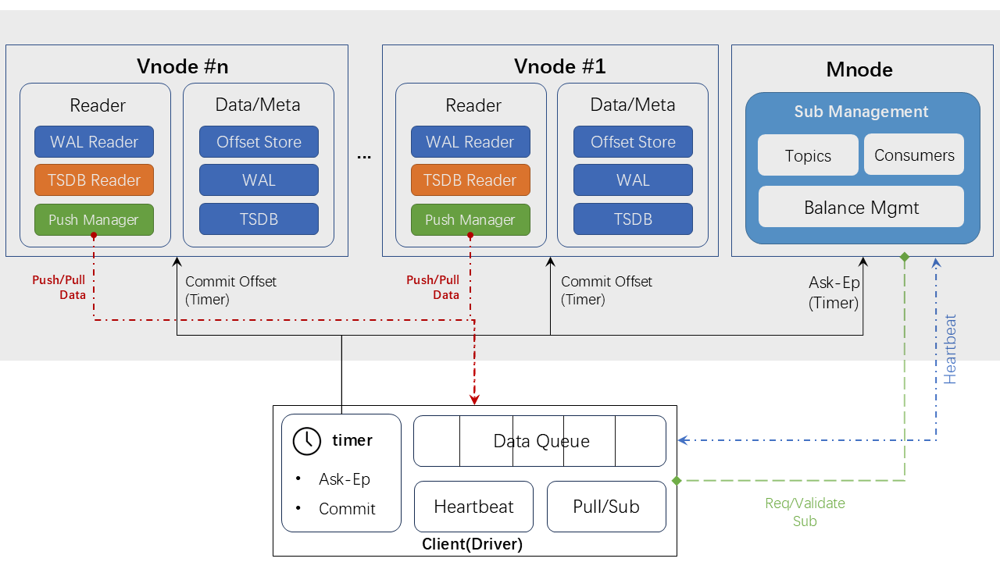
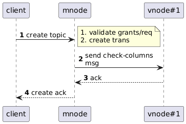
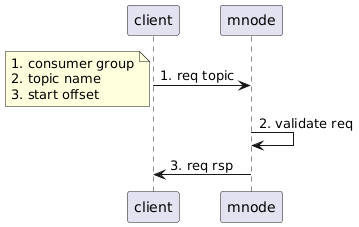
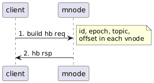
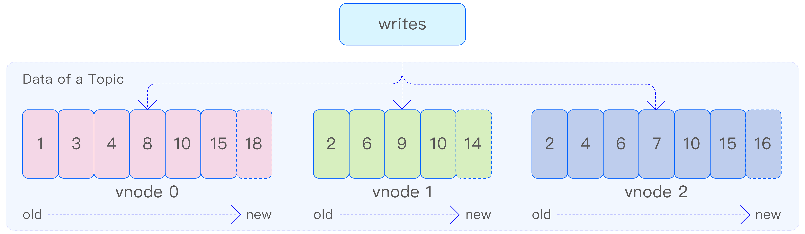
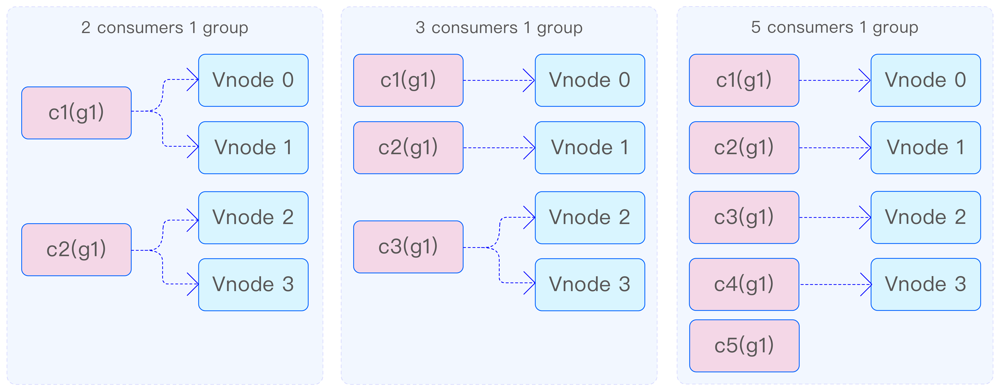
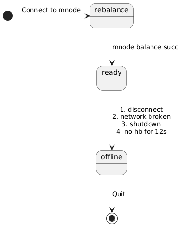
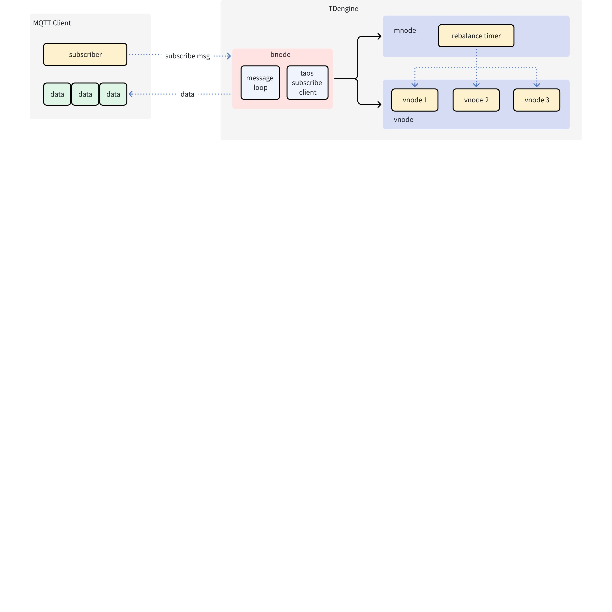
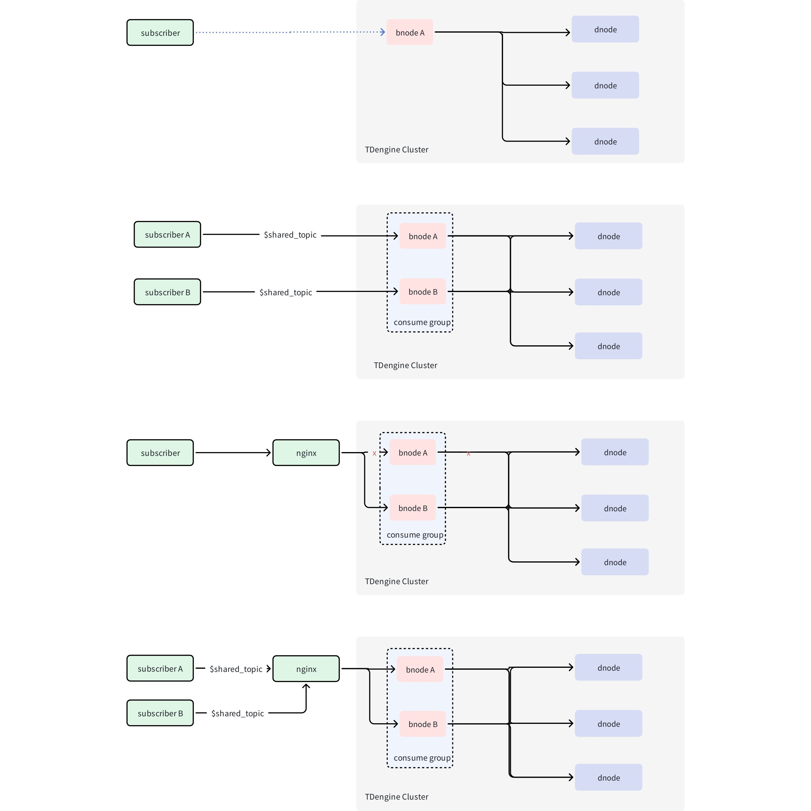

# 时序数据订阅模块-Design Spec

## 1. 修订记录

| 编写日期 | 发布日期 | 版本 | 修订人 | 主要修改内容 |
| --- | --- | --- | --- | --- |
| 2025-01-15 | 2025-01-15 | 1.0 | 王明明、金明磊 | 创建文档 |
| 2026-01-20 | 2026-01-20 | 1.1 | 廖浩均 | 细化部分内容，增补关于权限、安全、MQTT 方面的内容 |

## 2. 引言

### 2.1 目的

本文档旨在详细描述 TDengine 数据订阅引擎的设计、实现和使用方法，确保用户能够高效、可靠地获取实时数据流。通过数据订阅引擎，用户可以及时接收到感兴趣的数据更新，从而支持实时分析、监控和其他基于时序数据的应用场景。

### 2.2 范围

本文档涵盖以下内容：
1. 数据订阅的基本概念
2. 数据订阅引擎整体架构设计和数据流程交付
3. 数据订阅引擎的设计目标，以及引擎在设计上保证服务的实时性、可靠性、安全性、可扩展性
4. 消费者消费进度提交机制设计，可靠的消费进度提交机制能够确保处理消息的准确性和一致性
5. 订阅引擎服务 API 接口说明，帮助开发者快速集成和使用数据订阅引擎提供的功能

### 2.3 受众

本文档适用于以下读者：
1. 开发人员：负责集成和使用 TDengine 数据订阅引擎的软件工程师，需要了解 API 接口和实现细节。
2. 系统架构师：设计和规划基于 TDengine 的系统架构，关注订阅机制的性能和可靠性。
3. 运维人员：负责 TDengine 系统的部署和维护，需要理解如何配置和优化数据订阅引擎。
4. 业务分析师：利用 TDengine 数据订阅进行实时数据分析和决策支持，关注数据的准确性和时效性。
通过本文档，读者将能够全面了解 TDengine 数据订阅的功能和优势，并根据自身需求合理应用该功能，提升系统的整体性能和用户体验。

## 3. 术语

1. **TDengine：**一种高性能、支持分布式架构的时间序列数据库。
2. **订阅话题（Topic）：**消息队列中同一类型数据的集合。
3. **消费者（Consumer）：**消息队列服务中接收消费数据。
4. **Kafka: **一个开源的分布式消息队列中间件。
5. **虚拟节点（Virtual Node, Vnode）：**一个相对独立的工作单元，负责存储和管理一部分时序数据。
6. **Rebalance: **平衡过程，消费者分配消费哪些 vnode 的过程。
7. **管理节点（Management Node， Mnode）：**监控集群的运行状态，存储元数据，集群的管理中心。
8. **预写日志（ Write Ahead Logging，WAL）：**数据库中一种高效的日志算法，对于非内存数据库而言，磁盘I/O操作是数据库效率的一大瓶颈。在相同的数据量下，采用WAL日志的数据库系统在事务提交时，磁盘写操作只有传统的回滚日志的一半左右，大大提高了数据库磁盘I/O操作的效率。
9. **消费进度（Offset）**: 消费者消费的进度，采用 WAL 中版本号来进行技术。对于每次数据变更，时序数据库系统会生成为唯一一个单调递增数字作为变更的序列 ID，通过消费者读取数据 ID，能够标识其接收到的数据进度。
10. **提交消费进度（Commit）**：提交消费进度，消费者将最近接收到的一条时序数据记录的进度发回给服务端的操作，并在服务端可靠地持久化的过程。
11. **MQTT Broker**：接收客户端发布的消息，根据主题对消息进行过滤，并分发给订阅者
12. **MQTT Publisher**：发布者向 MQTT Broker 发送消息
13. **MQTT Subscriber**：订阅者从 MQTT Broker 接收消息
14. **MQTT Topic**：消息主题，用于标识消息的类型或内容，客户端可以发布或订阅一个或多个主题
15. **MQTT QoS**：发送者与接收者之间消息传递的保证级别（并非发布者和订阅者之间）
16. **MQTT 遗嘱消息**：WillMessage，在客户端连接时指定的消息，它将在客户端断开连接时自动发布到代理服务器
17. **MQTT 保留消息**：RetainHandling，当一个客户端向一个主题发布消息时，该消息可以被设置为保留消息。这意味着该消息将被保留在代理服务器上，并在新的订阅者连接到主题时被发送给它们。
18. **MQTT 共享订阅**：MQTT 5.0 引入了共享订阅特性，它使得 MQTT 服务端可以在使用特定订阅的客户端之间均衡地分配消息负载
19. **MQTT 消息持久化**：Mosquitto、EMQ 等 Broker 会缓存一些历史消息，订阅者可以获取历史消息
20. **MQTT 会话状态**
   - 持久化会话：消费者重新上线时，消费离线消息，支持清理会话标志
   - 非持久化会话：消费重新上线时，消费当前消息

## 4. 设计考虑及要点

1. **实时性：**为确保订阅者能以最低延迟获取最新数据，消费端直接读取数据写入的预写日志（WAL）文件。通过采用顺序读取与批量读取机制，显著提升了数据消费的吞吐量与效率。
2. **可靠性：**消费过程内置消费进度自动（commit）机制，严格保证每条消息至少被处理一次，有效避免了数据丢失。该系统支持自动定时提交与应用手动提交两种模式，兼顾了自动化运维与业务逻辑的精细控制需求。
3. **扩展性：**得益于TDengine的水平扩展架构，可通过增加虚拟节点（vnode）的数量，线性提升系统的写入性能与数据规模承载能力。订阅服务以vnode为基本单位，天然支持海量消费者并发接入。在同一消费组内，所有vnode由消费者平均分担，确保系统性能不会因消费者数量增长而出现显著下降。
4. **灵活性：**提供主题（Topic）过滤能力。订阅者可根据业务需求，自定义包括时间范围、数据标签在内的多种过滤条件，从而精准筛选和订阅所需的数据子集。
5. **安全性：**实行严格的订阅访问认证。客户端在发起消费请求时，必须提供有效的用户名与密码，确保仅有经过授权的用户才能访问特定的数据流，保障了数据的安全性与隐私性。客户端与服务器端提供（SSL 等）端到端的通信加密，防止通信数据被窃取。提供订阅关键操作的日志审计功能。
6. **多租户支持：**采用消费者组模式实现多租户隔离。不同消费组之间的订阅操作互不影响，而同一组内的消费者则以协作方式共同消费数据，既实现了资源隔离，又提升了整体消费效率。
7. **便捷的操作接口：**面向开发者提供了一套功能丰富、语言多样的应用程序接口（API），赋能订阅者根据自身业务特点，灵活定制与集成数据消费逻辑，最大化满足个性化需求。 

## 5. 概述

### 5.1 系统架构说明

数据订阅引擎的整体架构设计如下图所示:


数据订阅系统在整体架构上采用客户端-服务器模型。客户端模块核心职能包括以下关键功能：
1. **消费者实例构建**：根据业务需求创建对应的消费者对象
2. **数据检索交互**：向服务器发起数据订阅请求并获取返回结果
3. **心跳信息维护**：持续管理消费者的运行时状态及会话数据
客户端（driver）包含以下关键模块：
1. 定时器：1）定时从管理节点读取能够获取订阅数据所属 vnodes 的信息（Ask Ep）的请求。为了获得正确的分片数据（data partition），客户端周期性地向管理节点读取其分配获得的 vnodes 信息，并从 vnode 中按照数据到达顺序读取数据；2）客户端定期向读取数据的虚拟节点（vnodes）自动提交在该 vnode 上的数据消费进度。
2. 心跳管理：定时发送心跳信息给管理节点（mnode），心跳信息中包括：客户端订阅的所有订阅主题，每个订阅主题其下的（所属 vnode 中）的消费数据偏移信息。
3. 内部数据队列：用于缓存通过异步返回到客户端的订阅数据，并按照先进先出（FIFO）的方式确保数据按照顺序返回给应用。
4. 订阅拉取模块：通过发起拉取（Pull）指令，向所属虚拟节点（vnode）读取属于该订阅主题的时序数据。
服务端模块是订阅系统的协调中枢，并向客户端模块提供订阅数据，管理节点的核心功能如下：
1. **订阅相关请求处理**：1）接收创建订阅主题的请求；进行请求的合法性校验和发起请求的用户权限校验；2）接收并处理客户端发起的主题订阅请求，进行请求者来源 IP 地址校验、请求消息合法性校验，用户读写权限，并将该请求进行审计日志记录。该模块是订阅引擎安全性设计的第一入口。
2. **元数据管理**：保存订阅主题信息，不同主题下的消费者信息，并维护主题与消费者、消费者与虚拟数据节点关联关系信息
3. **资源分配及负载均衡管理**：获取每个消费者专属的虚拟节点(vnode)列表，建立资源映射关系。当消费者组内成员发生变动时，调用再平衡算法重新分配消费虚拟数据节点资源。并将该映射关系通过分布式事务推送到对应的虚拟数据节点
虚拟数据节点的核心功能如下：
1. **消费数据流推送**：接收客户端来的数据读取请求，在读取合法性检查通过的情况下，按照数据写入的顺序，将时序数据推送到客户端
2. **消费进度管理**：记录并可靠持久化（消费者提交的）消费进度并持久化处理进度状态。断开的客户端再次连接上以后，从上次记录的位置开始继续推送数据
服务端包括：管理节点 （mnode）和虚拟数据节点（vnode）。管理节点负责存储客户端的基础元信息，包括：订阅主题信息、消费者信息、每个消费者读取数据的虚拟数据节点以及在对应虚拟数据节点上的消费进度。虚拟数据节点负责将数据推送或返回给客户端，并负责保存在该vnode 上消费者的消费进度。
此外，管理节点会在完成消费者平衡以后，将 vnode 的归属通过两阶段事务下发到所有的 vnode，供 vnode 校验客户端的数据消费请求是否合法。

### 5.2 关键路程说明

#### 5.2.1 创建订阅话题



#### 5.2.2 客户端订阅话题




1. 在客户端设置消费组和订阅主题、用户名、密码等信息，然后将消息发送给管理节点。
2. 管理节点对于客户端登录信息、授权信息、订阅主题信息检查成功后，消费者的状态被标记为 rebalancing 状态，然后将消费者信息保存在元数据库中（rebalance 状态下无法进行订阅数据读取动作）。
3. 设置完成后，管理节点将确认订阅成功的信息发送回客户端，完成请求。

#### 5.2.3 客户端订阅数据

1. 管理节点定期对消费组中的所有消费者以及相关联的虚拟节点进行检查，对于处于需要动态均衡的消费者和消费组，自动重新均衡分配（虚拟节点-订阅者）配对，并启动事务将分配信息发送到所有涉及的虚拟节点，以确保后续客户端向相应的虚拟节点请求数据的时候，虚拟节点能够确认客户端的合法性（及管理节点将该虚拟节点的数据消费分配给该客户端）。
2. 消费者定期通过（ask-ep请求）从管理节点获得虚拟节点读取列表，并根据最新的配对列表，会不断地向每个分配到的 vnode 发送请求，以尝试获取新的数据。一旦收到数据，消费者在完成消费后会继续向该 vnode 发送请求，以便持续消费。若在预设时间内未收到任何数据，消费者便会在 vnode 上注册一个消费 handle。这样一来，一旦 vnode 上有新数据产生，便会立即推送给消费者，从而确保数据消费的即时性，并有效减少消费者频繁主动拉取数据所导致的性能损耗。因此，可以看出，消费者从 vnode 获取数据的方式是一种拉取（pull）与推送（push）相结合的高效模式。
3. 消费者在收到数据时，会同时收到数据的版本号，并将其记录为当前在每个 vnode 上的消费进度。这一进度仅在消费者内部以内存形式存储，确保仅对该消费者有效。这种设计保证了消费者在每次启动时能够从上次的消费中断处继续，避免了数据的重复处理。然而，若消费者需要退出并希望在之后恢复上次的消费进度，就必须在退出前将消费进度提交至服务器，执行所谓的 commit 操作。这一操作会将消费进度在服务器进行持久化存储，支持自动提交或手动提交两种方式。

#### 5.2.4 客户端心跳



1. 订阅客户端使用心跳机制来保活。通过定期（`heartBeatIntervalMs` 参数控制）向服务器发送心跳信号，消费者能够向服务器证明自己仍然在线。
   - 若服务器在一定时间内未收到消费者的心跳，便会认为消费者已离线。
   - 一定时间（可通过参数控制）不拉取数据的消费者，服务器也会标记为离线，并从消费组中删除该消费者。
     服务器依赖心跳机制来监控所有消费者的状态，进而有效地管理整个消费者群体。
1. 此外，上报的心跳消息还包含了当前消费者在每个虚拟节点上的消费进度，便于用户查询管理节点上的信息以获得各消费者的最新消费进度和状态。

#### 5.2.5 客户端获取虚拟节点分配信息

消费者会定期通过异步请求向管理节点发送请求（ask-ep请求），以检索并获取待消费的 vnode 列表，直至服务器为其分配相应的 vnode。一旦分配完成，消费者的状态便更新为 ready，标志着消费者动态平衡完成。此后，客户端便可正式启动向 vnode 发送消费数据请求的过程。

## 6. 主要功能模块

### 6.1 订阅主题模块

数据订阅引擎中，主题的创建来源具有灵活性，可以是某个数据库、一张超级表，或一条自定义的查询语句。
1. **数据库与超级表订阅**：此两种模式主要服务于数据迁移场景。通过订阅整个数据库或超级表，用户能够将对应范围内的全部数据在另一个集群中完整地还原出来，为数据备份、容灾或多活部署提供了便利。
2. **查询语句订阅**：数据订阅功能的亮点。允许用户在创建主题时即通过 SQL 查询语句（例如，包含过滤条件、标签筛选或轻量计算）来定义所需的数据子集。这种方式的核心优势在于，数据的过滤与预处理工作由 TDengine 数据库服务端完成，而非依赖消费端的应用程序。因此，它能够从源头上有效减少网络传输的数据量，并显著降低应用程序的逻辑复杂度和资源消耗。
在具体实现上，每个主题所关联的数据表，会根据其数据分布规则散列在多个虚拟节点上。每个虚拟节点在数据消费层面，其角色可类比于 Kafka 中的分区（Partition），是并行处理的基本单位。
每个虚拟节点内的数据，首先被顺序写入其预写日志（WAL）文件中。顺序写入机制为数据订阅服务的高吞吐、低延迟消费提供可靠的基础。
需要注意的是，WAL 文件并非仅存储纯粹的数据行，其中还交织着元数据信息、各种类型的控制消息等。也正因为这些混合写入的多种信息条目，导致在消费视角下，数据的版本号序列通常是不连续的。消费客户端需能够理解并正确处理此种日志结构，从而准确解析出所需的数据变更。


1. TDengine 会为 WAL 文件自动创建索引以支持快速随机访问。通过灵活可配置的文件切换与保留机制，用户可以按需指定 WAL 文件保留的时间以及大小。通过以上方式，WAL 被改造成一个保留事件到达顺序的、可持久化的存储引擎。
2. 对于查询语句订阅，在消费时，TDengine 根据当前消费进度从 WAL 文件直接读取数据，并使用统一的查询引擎实现过滤、变换等操作，然后将数据推送给消费者。

### 6.2 生产者

生产者是与订阅主题相关联的数据表的数据写入应用程序。生产者可以通过多种方式产生数据，并将数据写入数据表所在的 vnode 的 WAL 文件中。这些方式包括 SQL、Stmt、Schemaless、CSV、流计算等，具体参见各个写入模块，本文档不再赘述。

### 6.3 消费者

在TDengine的数据订阅架构中，消费者是数据流的最终接收与处理端。其核心职责是从所订阅的主题中持续获取数据。消费者成功订阅主题后，便可消费分配给它的一组虚拟节点内的全部数据。为实现高效且有序的数据获取，消费者采用了推送与拉取相结合（Push-And-Pull）的工作机制。
具体而言，该机制根据数据积压情况分为两种工作模式：
1. **主动拉取模式**‌：当某个vnode中积攒了大量未被消费的数据时，消费者会主动向该vnode发起顺序拉取请求，从而一次性批量获取数据，极大提升了消费吞吐率。
2. **事件驱动推送模式**‌：当vnode中没有待消费数据时，消费者会进入等待状态。一旦vnode中有新数据写入，系统会立刻触发事件，将新数据主动推送给消费者，以此保证数据消费的极低延迟。
此外，为了确保数据传递的绝对有序性与状态可追溯，消费者会在本地持久化记录每个vnode上的消费进度。这个关键的消费位置信息，是系统在任何情况下都能实现数据顺序交付的基础保障。

#### 6.3.1 消费者组

1. 在创建消费者时，需要为其指定一个消费组。同一消费组内的消费者将共享消费进度，确保数据在消费者之间均匀分配。正如前面所述，一个主题的数据会被分布在多个vnode 中。为了提高消费速度和实现多线程、分布式地消费数据，可以在同一消费组中添加多个消费者。这些消费者首先会均分 vnode，然后分别对分配给自己的 vnode 进行消费。例如，假设数据分布在 4 个 vnode 上：
   - 当有 2 个消费者时，每个消费者将消费 2 个 vnode；
   - 当有 3 个消费者时，其中 2 个消费者各消费 1 个 vnode，而剩下的 1 个消费者将消费剩余的 2 个 vnode；
   - 当有 5 个消费者时，其中 4 个消费者各分配 1 个 vnode，而剩下的 1 个消费者则不参与消费。


1. 在一个消费组中新增一个消费者后，系统会通过再平衡（rebalance）机制自动完成消费者的重新分配。这一过程对用户来说是透明的，无须手动干预。再平衡机制能够确保数据在消费者之间重新分配，从而实现负载均衡。
2. 此外，一个消费者可以订阅多个主题，以满足不同场景下的数据处理需求。TDengine 的数据订阅功能在面临宕机、重启等复杂环境时，依然能够保证至少一次消费，确保数据的完整性和可靠性。

#### 6.3.2 消费者状态处理

1. 消费者的状态转换过程如下图所示。初始状态下，刚发起订阅的消费者处于 rebalancing 状态，表明消费者尚未准备好进行数据消费。一旦 mnode 检测到处于 rebalancing 状态的消费者，便会启动 rebalance 过程，成功后，消费者的状态将转变为 ready，表示消费者已准备就绪。随后，当消费者通过定时的查询 endpoint 消息获取自身的 ready 状态以及分配的 vnode 列表后，便能正式开始消费数据。



1. 若消费者的心跳丢失时间超过 12s，经过 rebalance 过程，其状态将被更新为 clear，然后消费者将被系统删除。
2. 当消费者主动退出时，会发送 unsubscribe 消息。该消息将清除消费者订阅的所有主题，并将消费者的状态设置为 rebalancing。随后，检测到处于 rebalancing 状态的消费者，便会启动 rebalance 过程，成功后，其状态将被更新为 clear，然后消费者将被系统删除。这一系列措施确保了消费者退出的有序性和系统的稳定性。

### 6.4 消费进度

1. 消费组在 vnode 中记录消费进度，以便在消费者重启或故障恢复时能够准确地恢复消费位置。消费者在消费数据的同时，可以提交消费进度，即 vnode 上 WAL 的版本号（对应于 Kafka 中的 offset）。消费进度的提交既可以通过手动方式进行，也可以通过参数设置实现周期性自动提交。
2. 当消费者首次消费数据时，可以通过订阅参数来确定消费位置，也就是消费最新的数据还是最旧的数据。对于同一个主题及其任意一个消费组，每个 vnode 的消费进度都是唯一的。因此，当某个 vnode 的消费者提交消费进度并退出后，该消费组中的其他消费者将继续消费这个 vnode，并从之前消费者提交的进度开始继续消费。若之前的消费者未提交消费进度，新消费者将根据订阅参数设置值来确定起始消费位置。
3. 值得注意的是，不同消费组中的消费者即使消费同一个主题，它们之间也不会共享消费进度。这种设计确保了各个消费组之间的独立性，使得它们可以独立地处理数据，而不会相互干扰。下图清晰地展示了这一过程。


### 6.5 再平衡过程

1. 每个主题的数据可能分散在多个 vnode 上。服务器通过执行 rebalance 过程，将这些 vnode 合理地分配给各个消费者，确保数据的均匀分布和高效消费。
2. 如下图所示，c1 表示消费者 1，c2 表示消费者 2，g1 表示消费组 1。起初 g1 中只有 c1 消费数据，c1 发送订阅信息到 mnode，mnode 把数据所在的所有 4 个vnode 分配给 c1。当 c2 增加到 g1 后，c2 将订阅信息发送给 mnode，mnode 检测到这个 g1 需要重新分配，就会启动 rebalance 过程，随后 c2 分得其中两个 vnode 消费。分配信息还会通过 mnode 发送给 vnode，同时 c1 和 c2 也会获取自己消费的 vnode 信息并开始消费。


1. 再平衡计时器每 2s 检测一次是否需要再平衡。在再平衡过程中，如果消费者获取的状态是 not ready，则不能进行消费。只有再平衡正常结束后，消费者获取分配 vnode 的offset 后才可正常消费，否则消费者会重试指定次数后报错。

### 6.6 消费数据

1. 时序数据都存储在 vnode 上，消费的本质就是从 vnode 上的 WAL 文件中读取数据。WAL 文件相当于一个消息队列，消费者通过记录 WAL 数据的版本号，实际上就是记录消费的进度。WAL 文件中的数据包含 data 数据和 meta 数据（如建表、改表操作），订阅根据主题的类型和参数获取相应的数据。如果订阅涉及带有过滤条件的查询，订阅逻辑会通过通用的查询引擎过滤不符合条件的数据。
2. 如下图所示，vnode 可以通过设置参数自动提交消费进度，也可以在客户端确定处理数据后手动提交消费进度。如果消费进度被存储在 vnode 中，那么在相同消费组的不同消费者发生更换时，仍然会继续之前的进度消费。否则，根据配置参数，消费者可以选择消费最旧的数据或最新的数据。


1. earliest 参数表示消费者从 WAL 文件中最旧的数据开始消费，而 latest 参数表示从WAL 文件中最新的数据（即新写入的数据）开始消费。这两个参数仅在消费者首次消费数据时或者没有提交消费进度时生效。如果在消费过程中提交了消费进度，例如在消费到 WAL 文件中的第 3 条数据时提交一次进度（即 commit offset=3），那么下次在相同的 vnode 上，相同的消费组和主题的新消费者将从第 4 条数据开始消费。这种设计确保了消费者能够根据需求灵活地选择消费数据的起始位置，同时保持了消费进度的持久化和消费者之间的同步。

### 6.7 MQTT 协议订阅的架构设计

由 bnode 提供 MQTT 数据订阅功能，与原有数据订阅采用相同的主题管理模式，用户需预先创建订阅主题。与标准 MQTT Broker 的发布时创建主题不同，bnode 不支持发布客户端（Publisher），因此无法通过发布消息动态创建主题，所有主题必须预先定义。
下图展示了其基本工作原理：


工作流程如下：
1. **连接建立**：MQTT 订阅客户端与 bnode 建立连接
2. **订阅请求**：客户端发送 SUBSCRIBE 请求，指定目标主题
3. **主题验证**：bnode 根据订阅的主题名称向 TMQ 校验主题是否存在
4. **订阅结果**：若主题存在，返回成功的 SUBACK；若主题不存在，则在返回的 SUBACK 中指定失败原因
5. **数据推送**：当有新数据到达时，xnode 主动将数据推送至订阅客户端

### 6.8 bnode 高可用设计

通过共享订阅和消费组功能的结合，bnode 实现了以下关键优势：
1. **服务连续性**：
   - 单个物理节点宕机不会导致推送服务中断
   - 客户端可自动切换至其他可用物理节点
2. **消费端高可用**：
   - 共享组内单个客户端宕机不影响其他客户端的消费
   - 消息会重新分配给组内其他客户端
3. **弹性扩展**：
   - 通过增加订阅客户端，可轻松扩展消费能力
   - 系统自动处理负载均衡和故障转移


bnode 的共享订阅和消费组功能为 MQTT 数据订阅提供了强大的高可用性和负载均衡能力，能够有效应对节点故障和高并发场景，确保服务的稳定性和可靠性。

## 7. 安全设计

### 7.1 身份认证机制

身份认证是整个安全链条的第一道关口。订阅引擎采用了与数据库内核统一的用户鉴权体系。任何订阅客户端在发起连接时，都必须提供有效的用户名与密码进行登录。系统会凭此信息与数据库内存储的凭据进行校验，只有通过验证的合法用户才能获准接入。确保了只有经过授权的实体才能访问特定的数据流，有效防止了未授权访问和数据泄露。

### 7.2 全流程的数据传输保护

为了防止数据在传输过程中被窃听或篡改，订阅引擎支持在生产环境中启用 SSL/TLS 加密。该协议为客户端与服务器之间的所有网络通信提供端到端的加密通道，保障了数据即便在公共网络上传输也是安全的。
此外，在消息层面，通过引入确认（Acknowledgment）机制，系统能够确保每一条消息都已成功送达并被消费者正确接收，从而实现了数据传输的可靠性与完整性。

### 7.3 访问控制策略

在身份认证的基础上，订阅系统还提供多层次的访问控制以进一步提升安全性。
1. **网络层控制**：系统支持基于IP地址的访问规则，可以设置白名单或黑名单，直接限制来自非受信网络的连接尝试。
2. **凭据策略**：可强制实施强密码策略，例如要求密码具备足够的长度、复杂度并定期更换，从源头提升账户安全性。
3. **权限管理**：结合数据库自身的权限体系，可以精细控制用户对特定数据库、超级表或Topic的订阅权限，实现最小权限原则。

### 7.4 行为审计与监控

为满足合规性要求并提供事中事后追溯能力，订阅系统提供了覆盖订阅行为全流程的行为监控与日志记录功能。
系统能够实时记录下用户的订阅连接时间、消费的主题、数据访问量等关键活动信息。这些详尽的日志为安全审计提供了原始依据，一旦出现异常数据访问或安全事件，管理员可以通过日志系统快速定位问题源头，明晰操作行为，从而实现对安全风险的及时发现与响应。 

## 8. 接口设计及关键数据结构

订阅引擎向应用开发提供以下 API 接口。用户可以调用接口来完成数据订阅相关的一系列工作。本接口采用 C 语言描述，因为订阅系统采用 C 语言开发。接口分为订阅设置相关、订阅操作相关、订阅结果相关的 API。具体内容如下：

### 8.1 订阅设置相关

```c {wrap}
/**
* 用于将数据订阅的错误码转换为错误信息
* code：[入参] 数据订阅的错误码。
* 返回值：返回一个指向包含错误信息字符串的指针，返回值非NULL，但是错误信息可能为空字符串。
*/
const char *tmq_err2str(int32_t code);

/**
*  创建一个新的 TMQ 配置对象。
*  返回值：非 NULL：成功，返回一个指向 tmq_conf_t 结构体的指针，该结构体用于配置 TMQ 的行为和特性。
*  NULL：失败，可调用函数 taos_errstr(NULL) 获取更详细的错误信息。
*/
tmq_conf_t *tmq_conf_new()

/**
*  提交消费 offset 后的用户设定回调函数
*/
typedef void(tmq_commit_cb(tmq_t *tmq, int32_t code, void *param));

/**
*  设置 TMQ 配置对象中的配置项，用于配置消费参数。
*  conf：[入参] 指向一个有效的 tmq_conf_t 结构体指针，该结构体代表一个 TMQ 配置对象。
*  key：[入参] 数配置项的键名。
*  value：[入参] 配置项的值。
*  返回值：返回一个 tmq_conf_res_t 枚举值，表示配置设置的结果。
*  TMQ_CONF_OK：成功设置配置项。
*  TMQ_CONF_INVALID_KEY：键值无效。
*  TMQ_CONF_UNKNOWN：键名无效。
*/
tmq_conf_res_t tmq_conf_set(tmq_conf_t *conf, const char *key, const char *value)

/** 
*  设置 TMQ 配置对象中的自动提交回调函数。
*  conf：[入参] 指向一个有效的 tmq_conf_t 结构体指针，该结构体代表一个 TMQ 配置对象。
*  cb：  [入参] 指向一个有效的 tmq_commit_cb 回调函数指针，该函数将在消息被消费后调用
*        以确认消息处理状态。
*  param：[入参] 传递给回调函数的用户自定义参数。
*  设置自动提交回调函数的定义如下：
*  typedef void(tmq_commit_cb(tmq_t *tmq, int32_t code, void *param))
*/
void tmq_conf_set_auto_commit_cb(tmq_conf_t *conf, tmq_commit_cb *cb, void *param)

/**
*  销毁一个 TMQ 配置对象并释放相关资源。
*  conf：[入参] 指向一个有效的 tmq_conf_t 结构体指针，该结构体代表一个 TMQ 配置对象。
*/
void tmq_conf_destroy(tmq_conf_t *conf)

/**
*  用于创建一个 tmq_list_t 结构体，用于存储订阅的 topic。
*  非 NULL：成功，返回一个指向 tmq_list_t 结构体的指针。
*  NULL：失败，可调用函数 taos_errstr(NULL) 获取更详细的错误信息。
*/
tmq_list_t *tmq_list_new()

/**
*  用于向 tmq_list_t 结构体中添加一个 topic。
*  list：[入参] 指向一个有效的 tmq_list_t 结构体指针，该结构体代表一个 TMQ 列表对象。
*  topic：[入参] topic 名称。
*  返回值：0：成功。非 0：失败，可调用函数 char *tmq_err2str(int32_t code) 获取更详细的错误信息。
*/
int32_t tmq_list_append(tmq_list_t list, const char topic)

/**
*  用于销毁 tmq_list_t 结构体，tmq_list_new 的结果需要通过该接口销毁。
*  list：[入参] 指向一个有效的 tmq_list_t 结构体指针，该结构体代表一个 TMQ 列表对象。
*/
void tmq_list_destroy(tmq_list_t *list)

/**
*  用于获取 tmq_list_t 结构体中 topic 的个数。
*  list：[入参] 指向一个有效的 tmq_list_t 结构体指针，该结构体代表一个 TMQ 列表对象。
*  返回值：>=0：成功，返回 tmq_list_t 结构体中 topic 的个数。
*  -1：失败，表示输入参数 list 为 NULL 。
*/
int32_t tmq_list_get_size(const tmq_list_t *list)

/**
*  用于将 tmq_list_t 结构体转换为 C 数组，数组每个元素为字符串指针
*  list：[入参] 指向一个有效的 tmq_list_t 结构体指针，该结构体代表一个 TMQ 列表对象。
*  返回值：非 NULL：成功，返回 c 数组, 每个元素是字符串指针，代表一个 topic 名称。
*  NULL：失败，表示输入参数 list 为 NULL 。
*/
char **tmq_list_to_c_array(const tmq_list_t *list)
```

### 8.2 订阅操作相关

```cpp {wrap}
/**
*  用于创建一个 tmq_t 结构体，用于消费数据，消费完数据后需调用 tmq_consumer_close 关闭消费者。
*  conf：[入参] 指向一个有效的 tmq_conf_t 结构体指针，该结构体代表一个 TMQ 配置对象。
*  errstr：[出参] 指向一个有效的字符缓冲区指针，用于接收创建过程中可能产生的错误信息。内存的申请/释放由调用者负责。
*  errstrLen：[入参] 指定 errstr 缓冲区的大小（以字节为单位）
*  返回值：非 NULL：成功，返回一个指向 tmq_t 结构体的指针，该结构体代表一个 TMQ 消费者对象。
*  NULL：失败，错误信息存储在参数 errstr 中 。
*/
tmq_t *tmq_consumer_new(tmq_conf_t *conf, char *errstr, int32_t errstrLen)

/**
*  用于订阅 topic 列表，消费完数据后，需调用 tmq_subscribe 取消订阅。
*  tmq：[入参] 指向一个有效的 tmq_t 结构体指针，该结构体代表一个 TMQ 消费者对象。
*  topic_list：[入参] 指向一个有效的 tmq_list_t 结构体指针，该结构体包含一个或多个主题名称。
*  返回值：0：成功。非 0：失败，可调用函数 char *tmq_err2str(int32_t code) 获取更详细的错误信息
*/
int32_t tmq_subscribe(tmq_t *tmq, const tmq_list_t *topic_list)

/**
*  用于取消订阅的 topic 列表。需与 tmq_subscribe 配合使用
*  tmq：[入参] 指向一个有效的 tmq_t 结构体指针，该结构体代表一个 TMQ 消费者对象。
*  返回值：0：成功。非 0：失败，可调用函数 char *tmq_err2str(int32_t code) 获取更详细的错误信息
*/
int32_t tmq_unsubscribe(tmq_t *tmq)

/**
*  用于获取订阅的 topic 列表。
*  tmq：[入参] 指向一个有效的 tmq_t 结构体指针，该结构体代表一个 TMQ 消费者对象。
*  topic_list：[出参] 指向一个 tmq_list_t 结构体指针的指针，用于接收当前订阅的主题列表。
*  返回值：0：成功。非 0：失败，可调用函数 char *tmq_err2str(int32_t code) 获取更详细的错误信息。
*/
int32_t tmq_subscription(tmq_t *tmq, tmq_list_t **topic_list)

/**
*  用于轮询消费数据，每一个消费者，只能单线程调用该接口。
*  tmq：[入参] 指向一个有效的 tmq_t 结构体指针，该结构体代表一个 TMQ 消费者对象。
*  timeout：[入参] 轮询的超时时间，单位为毫秒，负数表示默认超时1秒。
*  返回值：非 NULL：成功，返回一个指向 TAOS_RES 结构体的指针，该结构体包含了接收到的消息。
*  NULL：失败，表示没有数据。TAOS_RES 结果和 taos_query 返回结果一致.
*  可通过查询的各种接口获取 TAOS_RES 里的信息，比如 schema 等。
*/
TAOS_RES *tmq_consumer_poll(tmq_t *tmq, int64_t timeout)

/**
*  用于关闭 tmq_t 结构体。需与 tmq_consumer_new 配合使用。
*  tmq：[入参] 指向一个有效的 tmq_t 结构体指针，该结构体代表一个 TMQ 消费者对象。
*  返回值：0：成功。非 0：失败，可调用函数 char *tmq_err2str(int32_t code) 获取更详细的错误信息
*/
int32_t tmq_consumer_close(tmq_t *tmq)

/**
*  返回当前 consumer 分配的 vgroup 的信息，每个 vgroup 的信息包括 vgId，wal 的最大最小 offset，以及当前消费到的 offset。
*  tmq：[入参] 指向一个有效的 tmq_t 结构体指针，该结构体代表一个 TMQ 消费者对象。
*  pTopicName：[入参] 要查询分配信息的主题名称。
*  assignment：[出参] 指向一个 tmq_topic_assignment 结构体指针的指针，用于接收分配信息。数据大小为 numOfAssignment，需要通过 tmq_free_assignment 接口释放。
*  numOfAssignment：[出参] 指向一个整数指针，用于接收分配给该 consumer 有效的 vgroup 个数。
*  返回值：0：成功。非 0：失败，可调用函数 char *tmq_err2str(int32_t code) 获取更详细的错误信息。
*/
int32_t tmq_get_topic_assignment(tmq_t *tmq, const char *pTopicName, tmq_topic_assignment **assignment, int32_t *numOfAssignment)

/**
*  返回当前consumer分配的vgroup的信息，每个vgroup的信息包括vgId，wal的最大最小offset，
*  以及当前消费到的offset。
*  pAssignment：[入参] 指向一个有效的 tmq_topic_assignment 结构体数组的指针，
*  该数组包含了 vgroup 分配信息。
*/
void tmq_free_assignment(tmq_topic_assignment* pAssignment)

/**
*  获取 TMQ 消费者对象对特定 topic 和 vgroup 的已提交偏移量。
*  tmq：[入参] 指向一个有效的 tmq_t 结构体指针，该结构体代表一个 TMQ 消费者对象。
*  pTopicName：[入参] 要查询已提交偏移量的主题名称。
*  vgId：[入参] vgroup 的 ID。
*  返回值：>=0：成功，返回一个 int64_t 类型的值，表示已提交的偏移量。<0：失败，返回值就是错误码，
*  可调用函数 char *tmq_err2str(int32_t code) 获取更详细的错误信息。
*/
int64_t tmq_committed(tmq_t *tmq, const char *pTopicName, int32_t vgId)

/**
*  同步提交 TMQ 消费者对象处理的消息偏移量。
*  tmq：[入参] 指向一个有效的 tmq_t 结构体指针，该结构体代表一个 TMQ 消费者对象。
*  msg：[入参] 指向一个有效的 TAOS_RES 结构体指针，该结构体包含了已处理的消息。如果为 NULL，提交当前 consumer 所有消费的 vgroup 的当前进度。
*  返回值：0：成功，已经成功提交偏移量。非 0：失败。
*         可调用函数 char *tmq_err2str(int32_t code) 获取更详细的错误信息。
*/
int32_t tmq_commit_sync(tmq_t *tmq, const TAOS_RES *msg)

/**
*  异步提交 TMQ 消费者对象处理的消息偏移量。
*  tmq：[入参] 指向一个有效的 tmq_t 结构体指针，该结构体代表一个 TMQ 消费者对象。
*  msg：[入参] 指向一个有效的 TAOS_RES 结构体指针，该结构体包含了已处理的消息。如果为 NULL，提交当前 consumer 所有消费的 vgroup 的当前进度。
*  cb：[入参] 一个回调函数指针，当提交完成时会被调用。
*  param：[入参] 一个用户自定义的参数，将在回调函数中传递给 cb。
*/
void tmq_commit_async(tmq_t *tmq, const TAOS_RES *msg, tmq_commit_cb *cb, void *param)

/**
*  同步提交 TMQ 消费者对象的特定主题和 vgroup 的偏移量。
*  tmq：[入参] 指向一个有效的 tmq_t 结构体指针，该结构体代表一个 TMQ 消费者对象。
*  pTopicName：[入参] 要提交偏移量的主题名称。
*  vgId：[入参] 虚拟组 vgroup 的 ID。
*  offset：[入参] 要提交的偏移量。
*  返回值：0：成功，已经成功提交偏移量，非 0：失败。
*  可调用函数 char *tmq_err2str(int32_t code) 获取更详细的错误信息。
*/
int32_t tmq_commit_offset_sync(tmq_t *tmq, const char *pTopicName, int32_t vgId, int64_t offset)

/**
*  异步提交 TMQ 消费者对象的特定主题和 vgroup 的偏移量。
*  tmq：[入参] 指向一个有效的 tmq_t 结构体指针，该结构体代表一个 TMQ 消费者对象。
*  pTopicName：[入参] 要提交偏移量的主题名称。
*  vgId：[入参] 虚拟组 vgroup 的 ID。
*  offset：[入参] 要提交的偏移量。
*  cb：[入参] 一个回调函数指针，当提交完成时会被调用。
*  param：[入参] 一个用户自定义的参数，将在回调函数中传递给 cb。
*/
void tmq_commit_offset_async(tmq_t *tmq, const char *pTopicName, int32_t vgId, int64_t offset, tmq_commit_cb *cb, void *param)

/**
*  获取当前消费位置，即已消费到的数据位置的下一个位置.
*  tmq：[入参] 指向一个有效的 tmq_t 结构体指针，该结构体代表一个 TMQ 消费者对象。
*  pTopicName：[入参] 要查询当前位置的主题名称。
*  vgId：[入参] 虚拟组 vgroup 的 ID。
*  返回值：>=0：成功，返回一个 int64_t 类型的值，表示当前位置的偏移量。<0：失败，返回值就是错误码，可调用函数 char *tmq_err2str(int32_t code) 获取更详细的错误信息。
*/
int64_t tmq_position(tmq_t *tmq, const char *pTopicName, int32_t vgId)

/**
*  将 TMQ 消费者对象在某个特定 topic 和 vgroup 的偏移量设置到指定的位置。
*  tmq：[入参] 指向一个有效的 tmq_t 结构体指针，该结构体代表一个 TMQ 消费者对象。
*  pTopicName：[入参] 要查询当前位置的主题名称。
*  vgId：[入参] 虚拟组 vgroup 的 ID。
*  offset：[入参] 虚拟组 vgroup 的 ID。
*  返回值：0：成功，非 0：失败，可调用函数 char *tmq_err2str(int32_t code) 获取更详细的错误信息。
*/
int32_t tmq_offset_seek(tmq_t *tmq, const char *pTopicName, int32_t vgId, int64_t offset)


```

### 8.3 订阅结果相关

```c
/**
*  从 TMQ 消费者获取的消息结果中提取虚拟组（vgroup）的当前消费数据位置的偏移量。
*  res：[入参] 指向一个有效的 TAOS_RES 结构体指针，该结构体包含了从 TMQ 消费者轮询得到的消息。
*  返回值：>=0：成功，返回一个 int64_t 类型的值，表示当前消费位置的偏移量。<0：失败，返回值就是错误码，可调用函数 char *tmq_err2str(int32_t code) 获取更详细的错误信息。
*/
int64_t tmq_get_vgroup_offset(TAOS_RES* res)

/**
*  从 TMQ 消费者获取的消息结果中提取所属虚拟组（vgroup）的 ID。
*  res：[入参] 指向一个有效的 TAOS_RES 结构体指针，该结构体包含了从 TMQ 消费者轮询得到的消息。
*  返回值：>=0：成功，返回一个 int32_t 类型的值，表示虚拟组（vgroup）的 ID。<0：失败，返回值就是错误码，可调用函数 char *tmq_err2str(int32_t code) 获取更详细的错误信息。
*/
int32_t tmq_get_vgroup_id(TAOS_RES *res)

/**
*  从 TMQ 消费者对象中获取与 TDengine 数据库的连接句柄。
*  tmq：[入参] 指向一个有效的 tmq_t 结构体指针，该结构体代表一个 TMQ 消费者对象。
*  返回值：非 NULL：成功，返回一个 TAOS * 类型的指针，指向与 TDengine 数据库的连接句柄。NULL：失败，非法的输入参数。
*/
TAOS *tmq_get_connect(tmq_t *tmq)

/**
*  从 TMQ 消费者获取的消息结果中获取所属的表名。
*  res：[入参] 指向一个有效的 TAOS_RES 结构体指针，该结构体包含了从 TMQ 消费者轮询得到的消息。
*  返回值：非 NULL：成功，返回一个 const char * 类型的指针，指向表名字符串。NULL：失败，非法的输入参数。
*/
const char *tmq_get_table_name(TAOS_RES *res)

/**
*  从 TMQ 消费者获取的消息结果中获取消息类型。
*  res：[入参] 指向一个有效的 TAOS_RES 结构体指针，该结构体包含了从 TMQ 消费者轮询得到的消息。
*  返回值：返回一个 tmq_res_t 类型的枚举值，表示消息类型。
*/
tmq_res_t tmq_get_res_type(TAOS_RES *res)

/**
*  从 TMQ 消费者获取的消息结果中获取所属的 topic 名称。
*  res：[入参] 指向一个有效的 TAOS_RES 结构体指针，该结构体包含了从 TMQ 消费者轮询得到的消息。
*  返回值：非 NULL：成功，返回一个 const char * 类型的指针，指向 topic 名称字符串。NULL：失败，非法的输入参数。
*/
const char *tmq_get_topic_name(TAOS_RES *res)

/**
*  从 TMQ 消费者获取的消息结果中获取所属的数据库名称。
*  res：[入参] 指向一个有效的 TAOS_RES 结构体指针，该结构体包含了从 TMQ 消费者轮询得到的消息。
*  返回值：非 NULL：成功，返回一个 const char * 类型的指针，指向数据库名称字符串。NULL：失败，非法的输入参数。
*/
const char *tmq_get_db_name(TAOS_RES *res)

```

### 8.4 关键数据结构

```cpp
// tmq_res_t 表示消费到的数据类型，定义如下：
typedef enum tmq_res_t {
  TMQ_RES_INVALID = -1,   // 无效
  TMQ_RES_DATA = 1,       // 数据类型
  TMQ_RES_TABLE_META = 2, // 元数据类型
  TMQ_RES_METADATA = 3    // 既有元数据类型又有数据类型，即自动建表
} tmq_res_t;

// 配置成功或失败的返回值
typedef enum tmq_conf_res_t {
  TMQ_CONF_UNKNOWN = -2,
  TMQ_CONF_INVALID = -1,
  TMQ_CONF_OK = 0,
} tmq_conf_res_t;

typedef struct tmq_t      tmq_t;
typedef struct tmq_conf_t tmq_conf_t;
typedef struct tmq_list_t tmq_list_t;
```

## 9. 性能和可扩展性

1. 性能要求
   - 单个 vnode 上消费吞吐量大于2万条/秒，单个 vnode 消费时间控制在5ms 内。
   - 通过每个 vnode 上顺序批量的读取 wal 日志文件来实现高性能。
2. 可扩展性
   - 支持通过增加 vnode 个数和 consumer 个数提升性能。
   - 消费数据的最小单位是 vnode，通过增加 vnode 个数来实现水平扩展数据规模，提高数据写入的能力，同时可以通过增加 consumer 来并行消费多个 vnode 来提高性能。可以通过多副本来提高数据可靠性和容错性。具体参见集群管理模块。

## 10. 部署和配置设计

无

## 11. 监控和维护

1. 监控
  通过一些简单的 sql 操作命令来查询数据订阅的运行状况，主要包括
  SHOW TOPICS 查看系统目前所有主题。
  SHOW CONSUMERS 查看系统消费者的状态。 
  SHOW SUBSCRIPTIONS 查看每个消费者的消费情况。
1. 日志记录和诊断
  系统运行过程中，难免出现一些问题，系统添加了详细的日志来分析排查问题，通过设置日志开关 tqDebugFlag = 135来打开订阅相关日志。

## 12. 参考资料

1. Kafka 文档：https://kafka.apache.org/documentation/
