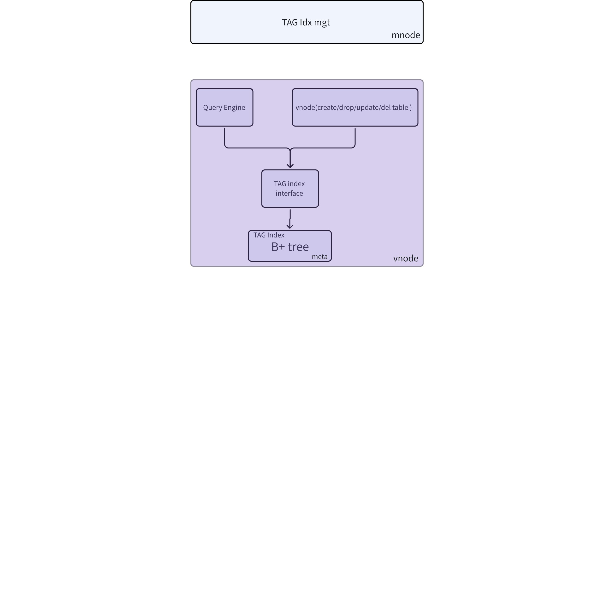
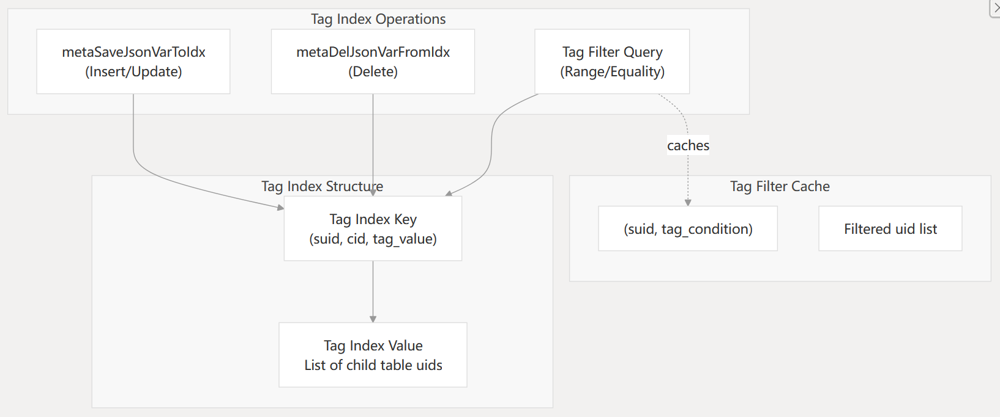
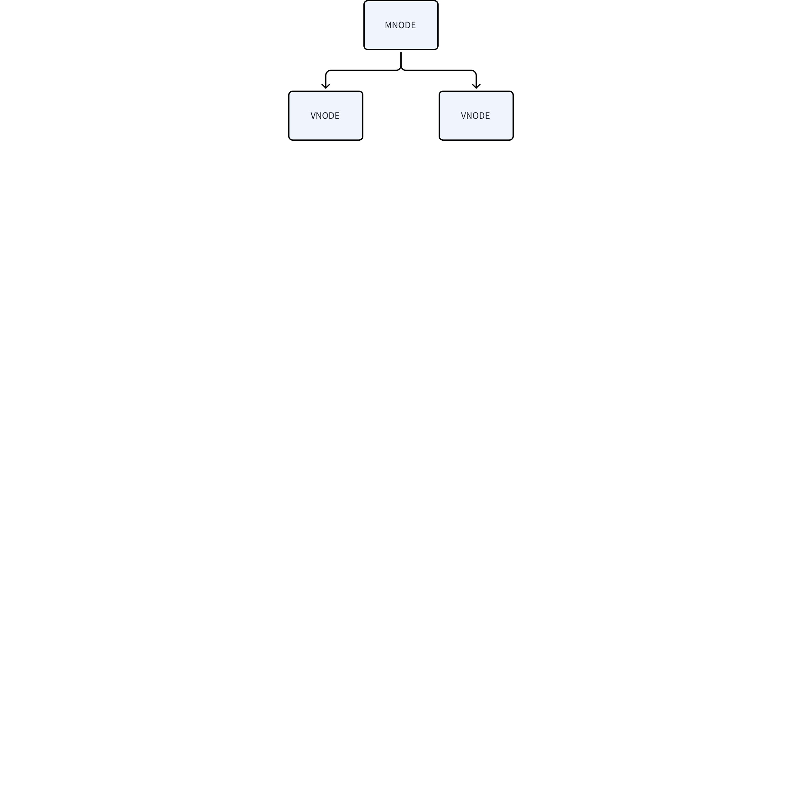
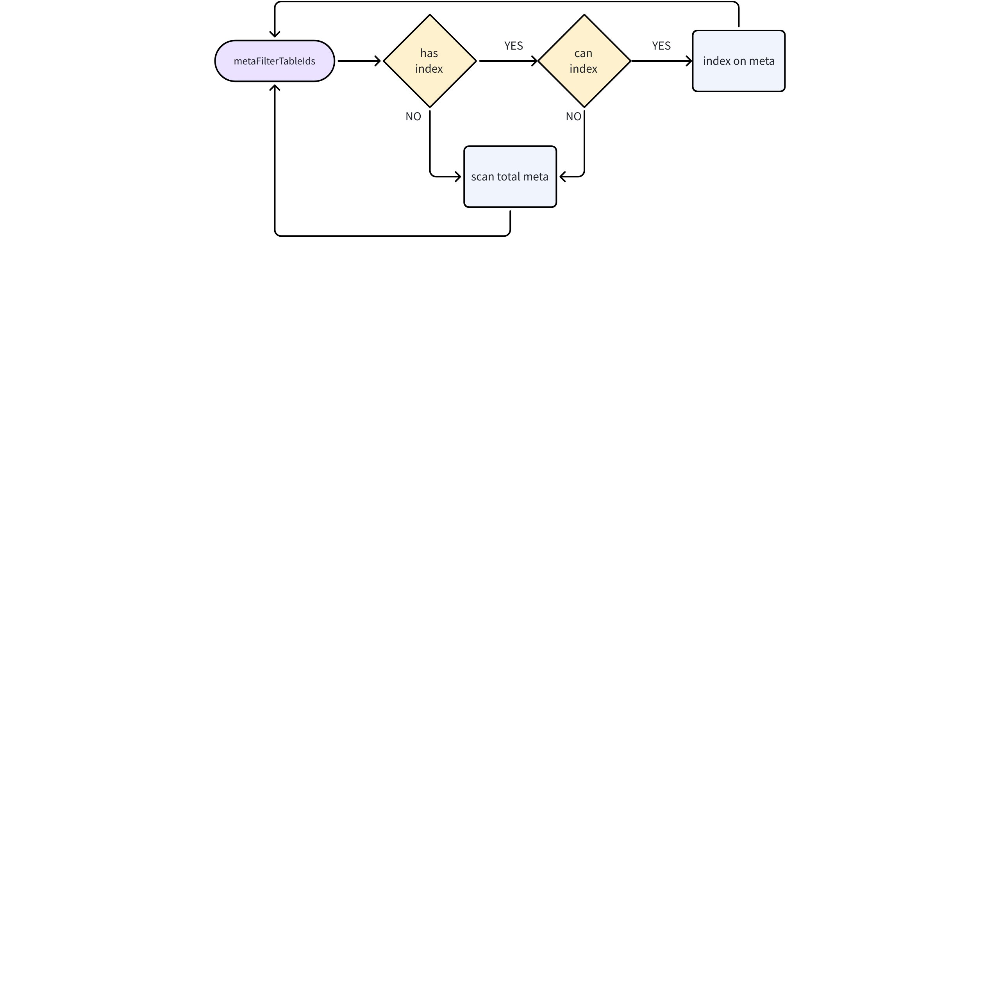
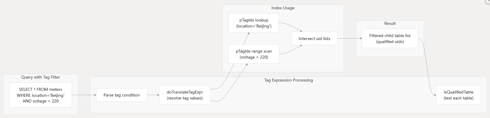

# 标签索引-Design Spec

## 1. 修订记录

| 编写日期 | 发布日期 | 版本 | 负责人 | 主要修改内容 |
| --- | --- | --- | --- | --- |
| 2025-01-10 | 2025-01-10 | 1.0 | 邓怡豪 | 初稿 |
| 2026-01-09 | 2026-01-09 | 1.1 | 廖浩均 | 重构文档 |

## 2. 引言

### 2.1 目的

本文档旨在描述 TDengine 数据库中基于 B+Tree 的 标签 索引设计方案，以支持高效的多维数据查询和过滤。通过设计合理的 标签 索引机制，提升查询性能，降低系统资源消耗，并为开发和运维提供技术参考

### 2.2 范围

本文档覆盖 TDengine 数据库中基于 B+Tree 的 标签 索引设计，包括索引的创建、更新、删除、查询优化以及存储结构。不涉及其他类型的索引（如主键索引、时间戳索引等）

### 2.3 受众

本文档面向 TDengine 的开发和维护人员，以及对 TDengine 索引功能感兴趣的技术人员。

## 3. 术语

1. **TDengine**：一种高性能、支持分布式架构的时间序列数据库。
2. **超级表（Super Table）**：在TDengine中"一个设备一张表" 的建模设计思路情况下，针对同一类型的每种设备的表，用来标识该类型的全部表集合称为“超级表”。超级表用来代表一组相同类型的数据采集点在数据库中表的集合。由于同一类型的设备拥有完全相同的数据模式，可以像操作普通表一样针对超级表进行写入、查询等操作。
3. **标签（Tag）**：用于描述每个设备的相对稳定的属性信息，每个子表一条标签信息。标签信息也具有模式（schema）的定义，归属于同一个超级表的表的标签具有相同的模式。
4. **结构化查询语言（Structured Query Language，SQL）：**是一种用于管理和操作关系型数据库的标准编程语言。 它允许用户存储、更新、删除、搜索和检索数据库中的数据。 SQL 被广泛应用于各种数据中心应用程序中，是 ISO 和 ANSI 等标准化机构认可的国际标准。
5. **索引（Index）: **针对数据库中数据进行位置定位和组织的一种数据结构，可以快速定位搜索的数据的位置从而提升查询性能。

## 4. 概述

1. 系统整体架构如下图所示
      


管理节点存储和系统内全部的索引元数据信息，包括索引名称、创建时间、关联超级表、索引列信息、所在数据库等信息。所有针对索引的操作请求都发送到管理节点，验证通过以后发送给虚拟节点予以执行，具体的索引信息存储在虚拟节点（Vnode）中。
标签的索引在虚拟节点中使用`B+Tree` 结构组织，默认情况下对标签的第一列创建索引。在虚拟节点索引的组织结构如下所示：


在虚拟节点中的标签索引结构主要包含以下三部分主要内容，分别是：
1. 索引结构。包含（suid，cid，tag_value）三元组结构构成的索引 `key`。其中的 `suid` 是超级表的 id，`cid` 是索引列的 `id`，`tag_value` 是索引标签列的值，对应于每个索引`key` 的 值（`value`）是具有该值的子表的 `uid`列表。索引数据的组织使用了存储模块提供的`B+Tree`。本文中不涉及`B+Tree`的技术细节，关于其具体的技术内容可参见存储设计相关文档。
2. 标签索引操作API。API 包括针对 JSON 格式标签索引针对每个输入项（子表）写入/更新（Upsert），删除操作`API`。每次一个新的子表创建的时候，调用API 插入（更新）一个索引项。删除子表以后，更新对应的索引项。
3. 标签过滤缓存。针对特定条件的标签过滤，缓存与标签过滤条件相关联的子表的`uid` 列表。缓存中 `key`是超级表的ID `suid` + 标签过滤条件（`tag_condition`），`value`是与该标签过滤条件相关联的 `uid` 列表。标签过滤缓存只缓存等值查询和范围查询两种类型的查询。

## 5. 设计考虑

1. 假设和限制
  - 标签索引仅用于加速基于 标签的（等值查询和范围查询）查询，不适用于时间戳或主键查询。
  - 索引数据存储在本地文件系统中。 
1. 设计模式和原则
  - **一致性原则**: 索引数据需与底层存储数据保持一致。
  - **高效性原则**: 索引设计需支持高效的插入、删除和查询操作。
1. 风险和缓解措施：

| **#** | **风险** | **缓解措施** |
| --- | --- | --- |
| 1 | 高频写入导致索引频繁更新，影响性能 | 采用批量更新策略，减少索引更新频率 |
| 2 | 索引文件过大，导致存储和查询性能下降 | 数据建模的时候，单个虚拟节点 不会分配大量的子表 |

## 6. 详细设计

### 6.1 组件设计

#### 6.1.1 **索引管理**

 管理节点上存储索引的管理信息，主要负责索引的创建、更新、删除和查询：
 


 管理节点  上存储超级表的信息，超级表上含有标签的索引标志
- 当需要在标签 列创建/删除索引时，消息先发送到管理节点上，管理节点 获取超级表的vgroup list, 并且发起事务， 虚拟节点 存储了超级表的完整信息（包含标签 列是否存在索引）整个事务执行完毕之后，索引创建完毕。 
- 当新建子表时候，消息直接发送到虚拟节点上，虚拟节点根据本地存储的超级表信息，来判断是否需要为子表的标签 值更新索引。
- 查询的时候，过滤条件下发到各个虚拟节点, 虚拟节点 根据过滤条件筛选符合条件的table ID，并把table ID 传递给上一级的算子。

#### 6.1.2 **标签存储**

将索引数据存储在B+tree中，其中B+tree 索引结构归属于虚拟节点管理，具体见《存储模块》文档。

#### 6.1.3 查询处理

在生成执行计划的时候，根据超级表的标签列是否含有索引，来生成对应的物理计划，物理计划发送到executor节点执行。

### 6.2 系统中的关键数据结构

```c
 typedef struct {
  char    name[TSDB_INDEX_FNAME_LEN];
  char    stb[TSDB_TABLE_FNAME_LEN];
  char    db[TSDB_DB_FNAME_LEN];
  char    dstTbName[TSDB_TABLE_FNAME_LEN];
  char    colName[TSDB_COL_NAME_LEN];
  int64_t createdTime;
  int64_t uid;
  int64_t stbUid;
  int64_t dbUid;
} SIdxObj;


typedef struct {
  tb_uid_t suid;
  int32_t  cid;
  uint8_t  isNull : 1;
  uint8_t  type : 7;
  uint8_t  data[];  // val + uid
} STagIdxKey;
```

### 6.3 索引文件结构

索引文件采用TDengine 存储模块内置提供的 B+Tree 索引结构，索引文件结构设计及其实现方式请参见存储相关文档部分，本文档不描述这部分内容。

### 6.4 一致性设计

索引结构与标签数据的一致性源于（超级）表操作的事务机制和存储引擎系统的保障，以此来s确保本地的索引数据与标签数据的实时同步，该同步过程在内部（超级）表相关的标签数据的修改、变动等操作时候，自动原子地完成。
1. 事务原子性与预写日志
当执行插入、更新或删除操作时，数据库会在一个事务内，将对数据行的修改和对所有相关索引条目的修改作为一个不可分割的原子单元来处理。这意味着，要么数据和索引的修改全部成功提交，要么在遇到失败或错误时回滚，不存在“数据改了但索引没改”的中间状态。
在内存中修改数据页和索引页之前，首先将变更记录写入预写日志中。在管理节点提交该变更事务时，优先确保重做日志被持久化到磁盘。之后即使系统崩溃，重启后也能根据日志重新执行（重做）所有已提交的修改，确保数据和索引同步恢复。
1. 检查点
虚拟节点通过预写日志和检查点机制来完成崩溃或重启后的恢复过程。虚拟节点会定期将内存中已修改的数据页和索引页刷到磁盘，并记录一个检查点位置。在崩溃恢复时，只需要从最近的检查点开始重放后续的重做日志即可，无需处理全部日志，从而保证了恢复后数据与索引的最终一致。
数据库通过事务的原子性和基于预写日志的崩溃恢复机制，在系统内部自动、强制地保证了索引与数据的实时同步与强一致性。

### 6.5 标签过滤流程




1. `在metaFilterTablelds`函数中，首先检查过滤条件指向的标签列是否有索引，如果有索引，再检查索引是否可直接使用（如有效性、完整性）。如果条件不满足，触发`scan total meta`全量扫描，遍历查询的超级表的所有子表，获得对应的标签数据，然后返回`metaFilterTableIds` 函数继续过滤处理。
2. 判断索引是否可用。如果可用，基于现有的索引进行标签数据过滤，如果索引不可用，则使用全量扫描的全部标签的方式进行过滤。通过条件分支实现流程控制，采用“索引优先+全量兜底”的策略，平衡标签过滤的性能和正确性。

### 6.6 整体查询流程



查询解析与表达式转换：输入一个SQL 语句，包含 `WHERE` 子句。`location` 和 `voltage` 是标签（Tag）。解析器提取标签过滤条件，构建抽象语法树 (AST)，`doTranslateTagExpr `将高级查询语言中的逻辑条件转换为底层索引能够理解的布尔表达式或内部 ID。
索引查找与布尔运算：`pTagIdx lookup (location='Beijing')`对“位置”标签进行点查询，返回所有标记为“北京”的唯一标识符（子表 ID）列表。`pTagIdx range scan (voltage > 220)` 对“电压”标签进行范围扫描，上述两个检索均是在 B+Tree 索引上完成。然后是将上述两个操作返回的子表 ID 列表进行 `AND` 逻辑运算仅保留同时满足两个条件的子表 ID。
结果过滤与验证：得到初步筛选后的候选子表清单，然后进行最后的剪枝阶段。系统会根据查询的其他约束（如时间范围或分区规则）对这些子表进行最终确认，确保只有合规的物理表参与实际的数据扫描。

## 7. 接口规范

### 7.1 创建接口

```c
 int metaAddIndexToSTable(SMeta *pMeta, int64_t version, SVCreateStbReq *pReq)
```

**参数 **
   pMeta:  元信息管理模块
   version: 版本号
   pReq:  
**返回值：**
- 如果执行成功，返回 `TSDB_CODE_SUCCESS (0)`，如果失败，返回对应的错误码。
**描述：**
- 为指定的 标签 键创建索引

### 7.2 更新接口

```c
 int  metaUpdateTagIdx(SMeta *pMeta, const SMetaEntry *pCtbEntry);
```

**参数**：
  pMeta:  元信息管理模块
 pCtbEntry: 待更新的索引值
**返回值**：
 如果执行成功，返回 TSDB_CODE_SUCCESS (0)，如果失败，返回对应的错误码。
**描述： **
更新标签 索引值。

### 7.3 删除接口

```c
int metaDropIndexFromSTable(SMeta *pMeta, int64_t version, SDropIndexReq *pReq)
```

**参数：**
 pMeta:  元信息管理模块
 Version:  版本号
 pRequest：待删除的索引
**返回值**：
 如果执行成功，返回 TSDB_CODE_SUCCESS (0)，如果失败，返回对应的错误码。
**描述： **
 删除超级表上的索引

### 7.4 查询接口

```c
int32_t metaFilterTableIds(void *pVnode, SMetaFltParam *arg, SArray *pUids)
```

**参数：**
 pVnode:  虚拟节点 对象
 arg:  索引过滤条件
 pUids: 符合条件的table list 
**返回值**：
 如果执行成功，返回 TSDB_CODE_SUCCESS (0)，如果失败，返回对应的错误码。
**描述： **
 根据条件筛选符合条件的table list。 

## 8. 安全设计

1. 索引文件完整性校验与防篡改。为索引文件或索引结构的关键部分（如B+树的根节点）计算并存储密码学哈希值或附加数字签名。在加载和使用索引时进行验证，确保索引数据在存储或传输过程中未被恶意篡改，防止因索引损坏导致的数据错误或系统崩溃。这部分功能依托于 `B+Tree` 结构安全性设计功能。
2. 强制存取控制。在索引系统的过滤查询处理中，集成强制存取控制或基于角色的访问控制逻辑。查询过程中，系统在利用索引定位到数据行（Row ID）后，在返回数据给用户前，必须验证该用户是否有权访问该行数据，防止通过索引“绕过”表级权限直接访问到未授权数据。对于行级安全，索引查询的结果集在返回前自动过滤掉用户无权查看的行。
3. 标签索引模块对外提供的API不含解析或参数化查询逻辑，因此无需强制参数化查询或预编译支持，不存在针对标签索引模块注入攻击问题。
4. 标签索引操作审计跟踪。记录调用索引的时间和调用缘由、发起调用的用户、调用索引的查询对象，特别是高频率的索引扫描。后续审计员可以利用这些日志监控数据库中的各种行为，追踪非法存取数据的人员和时间，实现追溯和责任认定。

## 9. 性能和可扩展性

1. 性能要求
   - 查询请求的平均响应时间不超过 10 毫秒。
   - 支持每秒数千次的索引更新操作。
2. 可扩展性
   - 支持索引分片，避免单个索引文件过大。

## 10. 部署和配置

1. 配置管理
- 无
1. 版本控制
- **支持向后兼容性**: 新版本索引组件应能兼容旧版本的索引数据。
- **支持回滚策略**: 支持将索引组件回滚到上一个版本。

## 11. 监控和维护

### 11.1 监控

系统提供查看索引文件大小和使用情况的命令。

### 11.2 日志记录和诊断

系统异常记录到日志中，供运维人员排查问题。

### 11.3 维护

1. 按需发布新版本，发布时需要考虑向后兼容性，确保旧版本索引数据可以平滑迁移。
2. 对索引组件进行相应的扩展和改造，确保能够满足新的需求。
3. 漏洞修复时需要评估对现有索引数据的影响，确保兼容性。

## 12. 参考资料

1. https://www.taosdata.com/
2. https://www.geeksforgeeks.org/introduction-of-b-tree/
