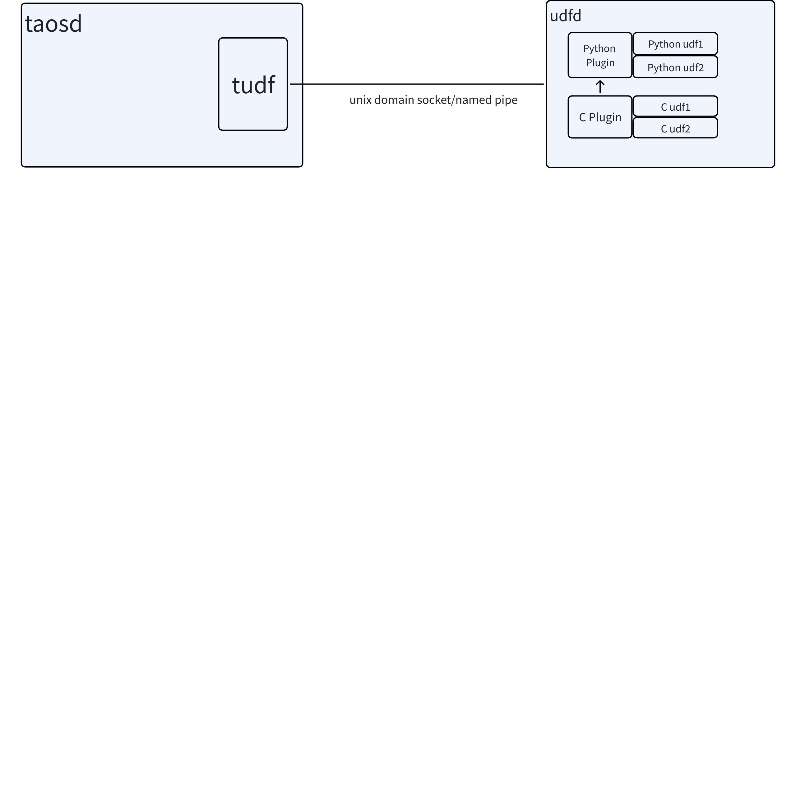
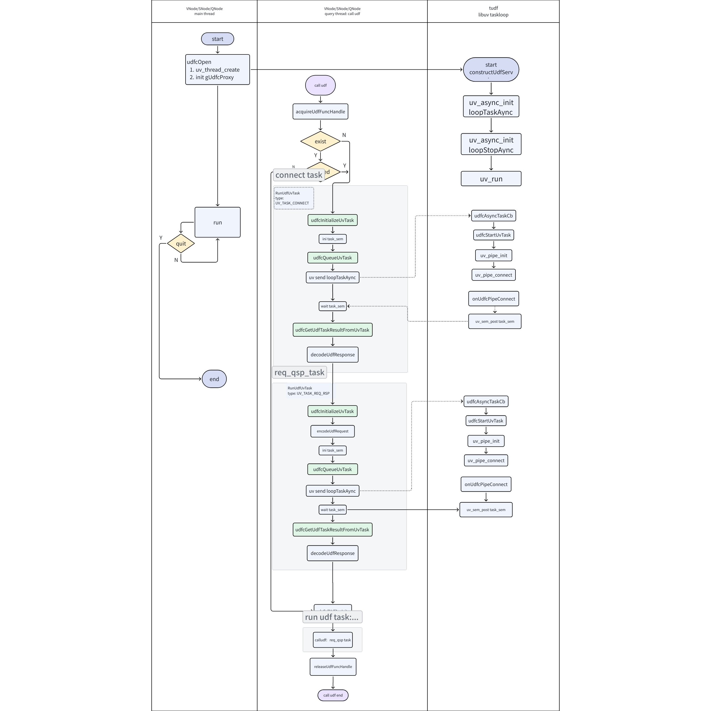
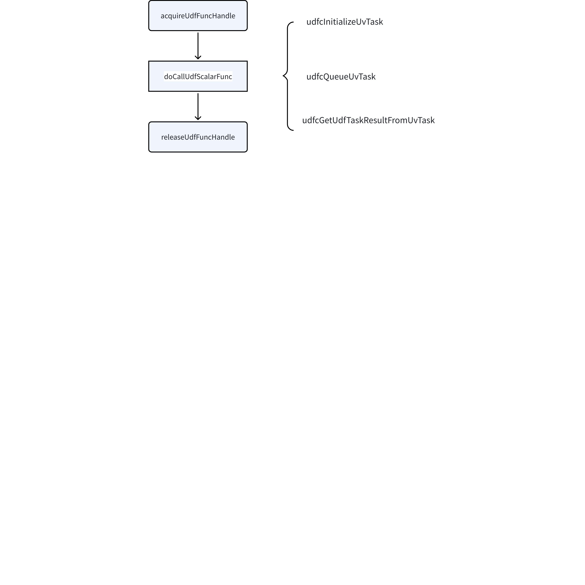

# 自定义函数-Design Spec

## 1. 修订记录

| 编写日期 | 发布日期 | 版本 | 负责人 | 主要修改内容 |
| --- | --- | --- | --- | --- |
| 2025-01-21 | 2025-01-21 | 1.0 | 任新胜 | 初稿 |
| 2026-01-21 | 2026-01-21 | 1.1 | 廖浩均 | 重构文档 |

## 2. 引言

1. 目的
本文档旨在详细描述 TDengine 自定义函数（下文简写 UDF）的设计和实现方式，以保证各项需求都能得到满足，用户可以方便高效的使用 UDF。研发人员可以根据文档了解 UDF 的实现，能进行高质量的开发和维护工作。
1. 范围
本文档主要包含的内容和范围如下：
1. UDF 的模块设计，udfd 单独进程的功能以及与 taosd 的关系
2. 各模板之间的通信设计
3. UDF 任务的调度与执行
4. C 语言编写的 UDF 插件的加载与调用
5. Python 语言编写的 UDF 插件的加载与调用
6. 用户接口的约定与实现
7. 受众
   - UDF 的开发维护人员
   - 对 UDF 感兴趣的开发者

## 3. 术语

定义本文档中使用的术语和概念
1. **TDengine**：一种高性能、支持分布式架构的时间序列数据库。
2. **结构化查询语言（Structured Query Language，SQL）：**是一种用于管理和操作关系型数据库的标准编程语言。 它允许用户存储、更新、删除、搜索和检索数据库中的数据。 SQL 被广泛应用于各种数据中心应用程序中，是 ISO 和 ANSI 等标准化机构认可的国际标准。
3. **Taosc**：应用驱动，负责处理应用程序与集群之间的接口交互。
4. **dnode**： dnode 是 TDengine 服务器侧执行代码 taosd 在物理节点上的一个运行实例。在一个 TDengine 系统中，至少需要一个 dnode 来确保系统的正常运行。每个 dnode 包含零到多个逻辑的虚拟节点（vnode），但管理节点、弹性计算节点和流计算节点各有 0 个或 1 个逻辑实例
5. **虚拟节点（virtual node，Vnode）：**TDengine 系统中一种逻辑单元，若干个虚拟节点构成一个数据节点。每个虚拟节点包含缓存空间、磁盘空间、负责管理存储在该虚拟节点的时序数据、具备执行查询处理的消息队列和线程池。每个虚拟节点包含若干个表（子表）的数据。
6. **管理节点（Mnode）：**TDengine 集群中负责监控和维护集群的运行状态，负责分布式事务管理、集群元数据（包括用户、数据库、超级表等）的管理，集群权限控制和安全控制的节点。
7. **UDF**：用户自定义函数，由用户实现，完成特定功能，可以在 sql 中像内置函数一样使用。
8. **udfd：**实现 UDF 功能的独立进程，由 taosd 管理 udfd 的启动停止。
9. **tudf：**内置于与 taosd 的一个模块，用于管理 udfd，并负责 taosd 和 udfd 的任务交互。
10. **udfd python plugin：** udfd 的一个模块，用于加载 Python UDF module, 调用其中定义的函数。
11. **udfd C plugin：** udfd 的一个模块，加载 C UDF 动态链接库, 调用其中定义的函数。
12. **libuv**: 一个跨平台的异步I/O库，用于构建高性能网络应用。
13. **标量函数: **是一种将输入数据转换为输出数据的函数，通常用于对单个数据值进行计算和转换。
14. **聚合函数: **是一种特殊的函数，用于对数据进行分组和计算，从而生成汇总信息。

## 4. 概述

### 4.1 架构

UDF 支持 用 C 和 Python 编写 标量函数和聚合函数, 并且通过SQL查询调用. 
UDF 由一个专门的叫 udfd（UDF daemon）的进程执行。udfd 进程由 dnode 进程启动，执行这个 dnode 管理的功能节点（qnode/vnode/snode）的 udf 函数调用。dnode 进程停止时，udfd 进程停止。udfd 异常退出，dnode 进程会自动重新启动 udfd。udfd 和 dnode 进程在 linux 上通过 unix domain socket 通信，在 windows 上通过 windows named pipe 通信.
在 taosd 中程序中嵌入 tudf 用于初始化 udf, 启动和停止 udfd, 发送udf调用请求. 


- tudf 用于和 taosd 其它组件进行交互.
  -  初始化 udf, 启动和停止 udfd
  - 建立到udfd 到 uv pipe
  - 通过 uv pipe 发送udf调用请求到 udfd , 接收udfd 发送到调用响应
- udfd执行udf调用
  -  接收 pipe 连接请求, 建立和tudf的 pipe 连接
  - 从 mnode 通过 RPC 获取function 定义信息.
  - 加载编程语言特定的plugin. c plugin内置, 其它语言 plugin 动态加载 动态链接库. 目前只支持python
  - 接收 udf 调用请求.  通过语言特定plugin 调用具体的 udf, 把输出发送给tudf
- udfd python plugin 加载 Python UDF module, 调用其中定义的函数.
- udfd C plugin 加载 C UDF 动态链接库, 调用其中定义的函数.

### 4.2 使用技术

- 编程语言：C，C++， pyhton
- 异步I/O库：libuv
- 通信方式：udfd 和 dnode 进程在 linux 上通过 unix domain socket 通信，在 windows 上通过 windows named pipe 通信

## 5. 设计考虑

1. 假设和限制：
   - 用户是 C / python 的开发者，能够部署 C / python 的开发环境并阅读示例文档。
   - UDF 函数执行效率和内置函数相比，会慢一个数量级，用户不在追求极限性能的场景使用。
2. 风险和缓解措施：
   - 用户代码异常引起 crash: 进程隔离，用户代码在 tudf 进程运行，异常不影响 taosd 运行。
   - 客户端环境 python 软件版本不一样：libtaospyudf 不随安装包一起发布，在用户机器上通过安装 taospy，同时安装 libtaospyudf，可避免用户机器python 版本不一致导致的 pybind11 调用失败。

## 6. 详细设计

### 6.1 工作流程

tudf 部分简要工作流程图如下。对于标量函数和聚合函数而言，请求 udfd 执行一个用户函数的过程并无不同，差别只在于标量函数执行过程只有一个用户函数 process， 而聚合函数有多个用户函数需要调用，只是调用次数的差别。下图是一个用户函数的的调用示例，只是 tudf 的处理过程，udfd 处理部分见下文文字描述。


#### 6.1.1 tudf 工作流程

##### 6.1.1.1 标量函数

触发：在 sclExecFunction 处理时，如果发现是 UDF 函数，则调用 callUdfScalarFunc， 进入  UDF  函数处理流程。
UDF ScalarFunc 处理分三步：
1. acquireUdfFuncHandle
2. doCallUdfScalarFunc
3. releaseUdfFuncHandle

##### 6.1.1.2 聚合函数

和内置聚合函数一样，UDF 聚合函数执行需要 init, process 和 finalize 三步，也对应用户自定义的三个函数实现。区别在于不能像内置函数一样直接运行，需要先通过 acquireUdfFuncHandle 获取到 UDF 函数句柄，完成后还要释放句柄资源。
1. udfAggInit
   - acquireUdfFuncHandle
   - doCallUdfAggInit ( callUdf )
   - releaseUdfFuncHandle
2. udfAggProcess
   - acquireUdfFuncHandle
   - doCallUdfAggProcess（ callUdf ）
   - releaseUdfFuncHandle
3. udfAggFinalize
   - acquireUdfFuncHandle
   - doCallUdfAggFinalize （ callUdf ）
   - releaseUdfFuncHandle

##### 6.1.1.3 callUdf 流程



**udfcInitializeUvTask**
**udfcQueueUvTask： ** 设置消息发送状态，触发 libuv 事件并等待 udfd 执行结果返回的信号。
```c
  int32_t code = uv_async_send(&udfc->loopTaskAync);
  if (code != 0) {
    fnError("udfc queue uv task to event loop failed. code: %s", uv_strerror(code));
    return TSDB_CODE_UDF_UV_EXEC_FAILURE;
  }

  uv_sem_wait(&uvTask->taskSem)
```

消息的实际发送在 udfcStartUvTask 完成，如果是 UV_TASK_CONNECT 任务，会通过 uv_pipe_connect 和 udfd 进行连接并设置连接成功回调。
```c
uv_pipe_connect(connReq, pipe, uvTask->udfc->udfdPipeName, onUdfcPipeConnect);
```

连接成功回调中，设置读取消息的处理函数
```c
int32_t code = uv_read_start((uv_stream_t *)uvTask->pipe, udfcAllocateBuffer, onUdfcPipeRead);
```

**udfcGetUdfTaskResultFromUvTask**

##### 6.1.1.4 UDF 版本管理

`acquireUdfFuncHandle` 检查 UDF 的版本，并针对过期的 UDF 函数进行处理，禁止调用。

##### 6.1.1.5 结果处理流程

在回调函数 `onUdfcPipeRead` 中接收到 libuv 的返回消息后，设置 sem 信号，`udfcQueueUvTask` 调用处结束等待，从缓存中读取结果并返回。

#### 6.1.2 udfd 工作流程

##### 6.1.2.1 基本流程

1. 初始化 libuv, 启动监听
```c
uv_listen((uv_stream_t *)&global.listeningPipe, 128, udfdOnNewConnection)
```

1. 监听成功后，启动 uv_read
```c
v_read_start((uv_stream_t *)client, udfdAllocBuffer, udfdPipeRead);
```

1. 读取请求，并放入work
```c
 udfdHandleRequest(conn);
 
 uv_queue_work(global.loop, work, udfdProcessRequest, udfdSendResponse)
```

1. 调用用户实现并处理
```c
  switch (request.type) {
    case UDF_TASK_SETUP: {
      udfdProcessSetupRequest(uvUdf, &request);
      break;
    }

    case UDF_TASK_CALL: {
      udfdProcessCallRequest(uvUdf, &request);
      break;
    }
    case UDF_TASK_TEARDOWN: {
      udfdProcessTeardownRequest(uvUdf, &request);
      break;
    }
    default: {
      break;
    }
  }
```

##### 6.1.2.2 创建环境

udfd 进程启动后首次使用 udf ，会触发 `udfdInitializePythonPlugin`，分为 `c plugin` 和 `python plugin`, 加载可执行文件。`c plugin` 直接加载用户生成的动态链接库，`python plugin` 加载 `taospyudf` 的动态库。`taospyudf` 是通过 C 语言调用用户 python 文件的解释器， 6.1.2.4 中详细介绍其设计和使用。
```c
int32_t udfdInitScriptPlugin(int8_t scriptType) {
  SUdfScriptPlugin *plugin = taosMemoryCalloc(1, sizeof(SUdfScriptPlugin));
  if (plugin == NULL) {
    return terrno;
  }
  
  int32_t err = 0;
  switch (scriptType) {
    case TSDB_FUNC_SCRIPT_BIN_LIB:
      err = udfdInitializeCPlugin(plugin);
      if (err != 0) {
        fnError("udf script c plugin init failed. error: %d", err);
        taosMemoryFree(plugin);
        return err;
      }
      break;
    case TSDB_FUNC_SCRIPT_PYTHON: {
      err = udfdInitializePythonPlugin(plugin);
      if (err != 0) {
        fnError("udf script python plugin init failed. error: %d", err);
        taosMemoryFree(plugin);
        return err;
      }
      break;
    }
    default:
      fnError("udf script type %d not supported", scriptType);
      taosMemoryFree(plugin);
      return TSDB_CODE_UDF_SCRIPT_NOT_SUPPORTED;
  }

  global.scriptPlugins[scriptType] = plugin;
  return TSDB_CODE_SUCCESS;
}
```

1. **C plugin 加载流程**
C Plugin 调用简单，通过 uv_dlopen、uv_dlsym 两个函数从动态链接库加载导出函数，之后直接调用, 无线程切换, 无输入/输出转换。
1. **Python plugin 加载流程**
2. udfd 进程启动后首次使用 python udf ，会触发 `udfdInitializePythonPlugin`，并加载 libtaospyudf 动态库。
```c
  snprintf(plugin->libPath, PATH_MAX, "%s", "libtaospyudf.so");
  plugin->libLoaded = false;
  const char *funcName[UDFD_MAX_PLUGIN_FUNCS] = {"pyOpen",         "pyClose",         "pyUdfInit",
                                                 "pyUdfDestroy",   "pyUdfScalarProc", "pyUdfAggStart",
                                                 "pyUdfAggFinish", "pyUdfAggProc",    "pyUdfAggMerge"};
  void      **funcs[UDFD_MAX_PLUGIN_FUNCS] = {
           (void **)&plugin->openFunc,         (void **)&plugin->closeFunc,         (void **)&plugin->udfInitFunc,
           (void **)&plugin->udfDestroyFunc,   (void **)&plugin->udfScalarProcFunc, (void **)&plugin->udfAggStartFunc,
           (void **)&plugin->udfAggFinishFunc, (void **)&plugin->udfAggProcFunc,    (void **)&plugin->udfAggMergeFunc};
  int32_t err = udfdLoadSharedLib(plugin->libPath, &plugin->lib, funcName, funcs, UDFD_MAX_PLUGIN_FUNCS);
  if (err != 0) {
    fnError("can not load python plugin. lib path %s", plugin->libPath);
    return err;
  }
```

以下函数是该动态库的导出函数，实际调用用户 python 脚本的工作在这些接口的实现中完成。
```c
DLL_PUBLIC int32_t pyUdfInit(SScriptUdfInfo *udf, void **pUdfCtx);

DLL_PUBLIC int32_t pyUdfDestroy(void *udfCtx);

DLL_PUBLIC int32_t pyUdfScalarProc(SUdfDataBlock *block, SUdfColumn *resultCol, void *udfCtx); 

DLL_PUBLIC int32_t pyUdfAggStart(SUdfInterBuf *buf, void *udfCtx);

DLL_PUBLIC int32_t pyUdfAggProc(SUdfDataBlock *block, SUdfInterBuf *interBuf, SUdfInterBuf *newInterBuf, void *udfCtx);

DLL_PUBLIC int32_t pyUdfAggMerge(SUdfInterBuf *inputBuf1, SUdfInterBuf *inputBuf2, SUdfInterBuf *outputBuf, void *udfCtx);

DLL_PUBLIC int32_t pyUdfAggFinish(SUdfInterBuf *buf, SUdfInterBuf *resultData, void *udfCtx);

DLL_PUBLIC int32_t pyOpen(SScriptUdfEnvItem *items, int numItems);

DLL_PUBLIC int32_t pyClose();
```

#### 6.1.3 libtaospyudf

##### 6.1.3.1 简介

libtaospyudf 是针对 python udf 的 c 语言解释器，是一个独立的动态链接库模块。之所以没有随 udfd 一起发布，是因为 libtaospyudf 需要使用 pybind11 来调用 python 代码，需要考虑兼容性：
1. **编译器兼容性**：确保使用支持 C++11 或更高版本的编译器。
2. **Python 版本兼容性**：确保目标系统上安装的 Python 版本与编译时使用的 Python 版本兼容。
3. **ABI 兼容性**：确保在相同的 ABI（应用二进制接口）下编译和运行。不同的编译器版本或编译选项可能导致 ABI 不兼容。
4. **依赖库**：确保所有依赖库在目标系统上可用，并且版本兼容。
在不同的机器上编译和调用，可能会有兼容性问题，因此我们把 libtaospyudf 的生成放在了用户使用时，用户通过安装 taospy ，即可同时安装 libtaospyudf。
下文详细介绍 libtaospyudf 的工作流程。

##### 6.1.3.2 工作流程

libtaospyudf 对外暴露了 pyOpen 接口，调用后启动启动了一个 python 执行线程进行 python 调用。这里只有一个线程，后期待优化。
下边是是 libtaospyudf 任务管理的核心代码，通过 c++ 标准库的 packaged_task 对象来完成任务的异步执行和结果返回。
```c
  template <typename F, typename... Args>
  auto enqueue(F &&f, Args &&...args) {
    using return_type = std::invoke_result_t<F, Args...>;
    auto task =
        std::make_shared<std::packaged_task<return_type()>>(std::bind(std::forward<F>(f), std::forward<Args>(args)...));
    auto res = task->get_future();

    {
      std::lock_guard<std::mutex> lock(task_mutex_);
      tasks_.emplace([task]() { (*task)(); });
    }
    task_cond_.notify_one();

    return res;
  }

 private:
  void push_stop_task() {
    std::lock_guard<std::mutex> lock(task_mutex_);
    tasks_.push(task_type{});
    tas
```

1. `**std::invoke_result_t**`：
  - using return_type = std::invoke_result_t<F, Args...>：这是一个类型别名，用于获取可调用对象 F 和参数 Args 的返回类型。
1. `**std::packaged_task**`：
  - `std::packaged_task<return_type()>`：这是一个包装任务的类模板，用于将可调用对象包装成一个任务，并允许获取任务的结果。
1. `**std::future**`：
  - task->get_future()：获取与 `std::packaged_task` 关联的 `std::future` 对象，用于异步获取任务的结果。

### 6.2 线程设计

#### 6.2.1 线程结构

tudf 对于每一个使用者(qnode/vnode/snode), 有一个对应的 libuv eventloop，调用 udfcOpen 完成 eventloop 的启动。当有 udf 请求时，事件触发，处理函数被调用，将任务写入 task queue, 在写入回调线程进行实际的通信。
```c
void udfcAsyncTaskCb(uv_async_t *async) {
  SUdfcProxy *udfc = async->data;
  QUEUE       wq;

  uv_mutex_lock(&udfc->taskQueueMutex);
  QUEUE_MOVE(&udfc->taskQueue, &wq);
  uv_mutex_unlock(&udfc->taskQueueMutex);

  while (!QUEUE_EMPTY(&wq)) {
    QUEUE *h = QUEUE_HEAD(&wq);
    QUEUE_REMOVE(h);
    SClientUvTaskNode *task = QUEUE_DATA(h, SClientUvTaskNode, recvTaskQueue);
    int32_t            code = udfcStartUvTask(task);
    if (code == 0) {
      QUEUE_INSERT_TAIL(&udfc->uvProcTaskQueue, &task->procTaskQueue);
    } else {
      task->errCode = code;
      uv_sem_post(&task->taskSem);
    }
  }
}
```

#### 6.2.2 线程结构

udfd 使用 一个libuv event loop 监听处理连接请求, 使用 libuv thread pool 工作队列多线程处理udf调用请求

#### 6.2.3 c plugin 线程结构

没有单独的线程, 使用 udfd 的 libuv 线程池

#### 6.2.4 python plugin 线程结构

使用一个线程执行调用python程序. 请求和结果在 udfd 线程池中线程 和 python执行线程间进行转换

### 6.3 数据结构

#### 6.3.1 udfd 相关数据结构

SUdfdContext: udfd 全局上下文
SUdfScriptPlugin: 语言特定 plugin, 目前只有两个 C plugin 和 Python plugin
SUdf: 每一个用户定义的具体UDF
```c
// for c, the function pointer are filled directly and libloaded = true;
// for others, dlopen/dlsym to find function pointers
typedef struct SUdfScriptPlugin {
  int8_t scriptType;

  char     libPath[PATH_MAX];
  bool     libLoaded;
  uv_lib_t lib;

  TScriptUdfScalarProcFunc udfScalarProcFunc;
  TScriptUdfAggStartFunc   udfAggStartFunc;
  TScriptUdfAggProcessFunc udfAggProcFunc;
  TScriptUdfAggMergeFunc   udfAggMergeFunc;
  TScriptUdfAggFinishFunc  udfAggFinishFunc;

  TScriptUdfInitFunc    udfInitFunc;
  TScriptUdfDestoryFunc udfDestroyFunc;

  TScriptOpenFunc  openFunc;
  TScriptCloseFunc closeFunc;
} SUdfScriptPlugin;

typedef struct SUdfdContext {
  uv_loop_t  *loop;
  uv_pipe_t   ctrlPipe;
  uv_signal_t intrSignal;
  char        listenPipeName[PATH_MAX + UDF_LISTEN_PIPE_NAME_LEN + 2];
  uv_pipe_t   listeningPipe;

  void     *clientRpc;
  SCorEpSet mgmtEp;

  uv_mutex_t udfsMutex;
  SHashObj  *udfsHash;

  uv_mutex_t        scriptPluginsMutex;
  SUdfScriptPlugin *scriptPlugins[UDFD_MAX_SCRIPT_PLUGINS];

  SArray *residentFuncs;

  char udfDataDir[PATH_MAX];
  bool printVersion;
} SUdfdContext;

typedef enum { UDF_STATE_INIT = 0, UDF_STATE_LOADING, UDF_STATE_READY } EUdfState;

typedef struct SUdf {
  char    name[TSDB_FUNC_NAME_LEN + 1];
  int32_t version;
  int64_t createdTime;

  int8_t  funcType;
  int8_t  scriptType;
  int8_t  outputType;
  int32_t outputLen;
  int32_t bufSize;

  char path[PATH_MAX];

  int32_t    refCount;
  EUdfState  state;
  uv_mutex_t lock;
  uv_cond_t  condReady;
  bool       resident;

  SUdfScriptPlugin *scriptPlugin;
  void             *scriptUdfCtx;

  int64_t lastFetchTime;  // last fetch time in milliseconds
  bool    expired;
} SUdf;

typedef struct SUdfcFuncHandle {
  SUdf *udf;
} SUdfcFuncHandle;
```

#### 6.3.2 关键数据结构

SUdfcProxy: 每一个使用 udf 的模块, 都有一个 udf 上下文. 
SUdfcFuncStub: 对应一个 udf
SClientUdfTask: 对于一次udf任务, 如udf建立, udf 清除, 调用 udf
SClientUvTaskNode: 对应一个libuv task, 如建立连接, 请求/应答, 断连
```c
typedef struct SUdfcFuncStub {
  char           udfName[TSDB_FUNC_NAME_LEN + 1];
  UdfcFuncHandle handle;
  int32_t        refCount;
  int64_t        createTime;
} SUdfcFuncStub;

typedef struct SUdfcProxy {
  char         udfdPipeName[PATH_MAX + UDF_LISTEN_PIPE_NAME_LEN + 2];
  uv_barrier_t initBarrier;

  uv_loop_t   uvLoop;
  uv_thread_t loopThread;
  uv_async_t  loopTaskAync;

  uv_async_t loopStopAsync;

  uv_mutex_t taskQueueMutex;
  int8_t     udfcState;
  QUEUE      taskQueue;
  QUEUE      uvProcTaskQueue;

  uv_mutex_t udfStubsMutex;
  SArray    *udfStubs;  // SUdfcFuncStub
  SArray    *expiredUdfStubs; //SUdfcFuncStub

  uv_mutex_t udfcUvMutex;
  int8_t     initialized;
} SUdfcProxy;

typedef struct SUdfcUvSession {
  SUdfcProxy *udfc;
  int64_t     severHandle;
  uv_pipe_t  *udfUvPipe;

  int8_t  outputType;
  int32_t bytes;
  int32_t bufSize;

  char udfName[TSDB_FUNC_NAME_LEN + 1];
} SUdfcUvSession;


typedef struct SClientUdfTask {
  int8_t type;

  SUdfcUvSession *session;

  int32_t errCode;

  union {
    struct {
      SUdfSetupRequest  req;
      SUdfSetupResponse rsp;
    } _setup;
    struct {
      SUdfCallRequest  req;
      SUdfCallResponse rsp;
    } _call;
    struct {
      SUdfTeardownRequest  req;
      SUdfTeardownResponse rsp;
    } _teardown;
  };

} SClientUdfTask;

typedef struct SClientUvTaskNode {
  SUdfcProxy *udfc;
  int8_t      type;
  int         errCode;

  uv_pipe_t *pipe;

  int64_t  seqNum;
  uv_buf_t reqBuf;

  uv_sem_t taskSem;
  uv_buf_t rspBuf;

  QUEUE recvTaskQueue;
  QUEUE procTaskQueue;
  QUEUE connTaskQueue;
} SClientUvTaskNode;
```

## 7. 接口规范

### 7.1 内部接口定义

#### 7.1.1 tudf和taosd接口

定义在include/libs/function/tudf.h
- udfAggGetEnv, udfAggInit, udfAggProcess, udfAggFinalize 是 聚合函数相关接口
- callUdfScalarFunc 是 标量函数相关接口
- 查询执行完毕, 调用cleanUpUdfs, 清除 udf 相关状态信息
- 使用 udf 的模块, 如 vnode/qnode/snode, 调用 udfcOpen 初始化 tudf 模块, 调用 udfcClose 关闭 tudf 模块
- dnode 调用 udfStartUdfd 启动 udfd 进程, 调用 udfStopUdfd 停止 udfd 进程
```c
// high level APIs
bool    udfAggGetEnv(struct SFunctionNode *pFunc, SFuncExecEnv *pEnv);
bool    udfAggInit(struct SqlFunctionCtx *pCtx, struct SResultRowEntryInfo *pResultCellInfo);
int32_t udfAggProcess(struct SqlFunctionCtx *pCtx);
int32_t udfAggFinalize(struct SqlFunctionCtx *pCtx, SSDataBlock *pBlock);

int32_t callUdfScalarFunc(char *udfName, SScalarParam *input, int32_t numOfCols, SScalarParam *output);

int32_t cleanUpUdfs();

///////////////////////////////////////////////////////////////////////////////////////////////////////////////////////
// udf api
/**
 * create udfd proxy, called once in process that call doSetupUdf/callUdfxxx/doTeardownUdf
 * @return error code
 */
int32_t udfcOpen();

/**
 * destroy udfd proxy
 * @return error code
 */
int32_t udfcClose();

/**
 * start udfd that serves udf function invocation under dnode startDnodeId
 * @param startDnodeId
 * @return
 */
int32_t udfStartUdfd(int32_t startDnodeId);
/**
 * stop udfd
 * @return
 */
int32_t udfStopUdfd();

```

#### 7.1.2 语言 plugin 接口

定义在include/libs/function/taosudf.h
- TScriptOpenFunc/TScriptCloseFunc 用于打开/关闭语言plugin
- TScriptUdfInitFunc/TScriptUdfDestoryFunc, 用于具体udf init/Destory 调用. 
  - init时, 函数参数void **pUdfCtx用于获得plugin的内部具体udf句柄.
- TScriptUdfScalarProcFunc 用于某个具体标量 udf 的函数调用
- TScriptUdfAggStartFunc/TScriptUdfAggProcessFunc/TScriptUdfAggFinishFunc 用于某个具体聚合 udf 的函数调用
```c
typedef struct SScriptUdfEnvItem {
  const char *name;
  const char *value;
} SScriptUdfEnvItem;

typedef enum EUdfFuncType { UDF_FUNC_TYPE_SCALAR = 1, UDF_FUNC_TYPE_AGG = 2 } EUdfFuncType;

typedef struct SScriptUdfInfo {
  const char *name;
  int32_t version;
  int64_t createdTime;

  EUdfFuncType funcType;
  int8_t       scriptType;
  int8_t       outputType;
  int32_t      outputLen;
  int32_t      bufSize;

  const char *path;
} SScriptUdfInfo;

typedef int32_t (*TScriptUdfScalarProcFunc)(SUdfDataBlock *block, SUdfColumn *resultCol, void *udfCtx);

typedef int32_t (*TScriptUdfAggStartFunc)(SUdfInterBuf *buf, void *udfCtx);
typedef int32_t (*TScriptUdfAggProcessFunc)(SUdfDataBlock *block, SUdfInterBuf *interBuf, SUdfInterBuf *newInterBuf,
                                            void *udfCtx);
typedef int32_t (*TScriptUdfAggFinishFunc)(SUdfInterBuf *buf, SUdfInterBuf *resultData, void *udfCtx);
typedef int32_t (*TScriptUdfInitFunc)(SScriptUdfInfo *info, void **pUdfCtx);
typedef int32_t (*TScriptUdfDestoryFunc)(void *udfCtx);

// the following function is for open/close script plugin.
typedef int32_t (*TScriptOpenFunc)(SScriptUdfEnvItem *items, int numItems);
typedef int32_t (*TScriptCloseFunc)();
```

### 7.2 用户接口

#### 7.2.1 C 接口

定义在libs/function/taosudf.h
```c
typedef int32_t (*TUdfInitFunc)();
typedef int32_t (*TUdfDestroyFunc)();

typedef int32_t (*TUdfScalarProcFunc)(SUdfDataBlock *block, SUdfColumn *resultCol);

typedef int32_t (*TUdfAggStartFunc)(SUdfInterBuf *buf);
typedef int32_t (*TUdfAggProcessFunc)(SUdfDataBlock *block, SUdfInterBuf *interBuf, SUdfInterBuf *newInterBuf);
typedef int32_t (*TUdfAggFinishFunc)(SUdfInterBuf *buf, SUdfInterBuf *resultData);
```

#### 7.2.2 Python接口

在 https://github.com/taosdata/taos-udf/blob/main/python/src/taospyudf.cpp 通过 Pybind11 调用
```python
def init()
def destroy()

def process(input: datablock) -> tuple[output_type]

def start() -> bytes
def reduce(inputs: datablock, buf: bytes) -> bytes
def finish(buf: bytes) -> output_type

PYBIND11_EMBEDDED_MODULE(taospyudf, m) {
  py::class_<UdfDataBlock>(m, "UdfDataBlock")
      .def("shape", &UdfDataBlock::shape)
      .def("data", &UdfDataBlock::data)
      .def("meta", &UdfDataBlock::meta);
}
```

#### 7.2.3 接口模板

C 语言和 python 语言分别有标量函数、聚合函数两个模板，共计四个模板提供给用户，详细说明可参考：《自定义函数 - Requirement Spec》

## 8. 安全设计

udfd 新进程处理用户 udf 过程，进程隔离，不影响主进程运行。
自定义函数运行的进程空间与主进程相互分割，互不影响，通过 IPC 机制进行交流和沟通。
**在受控环境下运行**
自定义函数模块运行在独立的、资源受限的沙箱环境中运行，即一个独立的进程空间中运行。每个模块明确定义并强制执行最小权限集，模块仅能访问其功能所必需的系统资源。所有传递给自定义函数模块的输入参数经过严格的验证和检查，包括类型检查、长度限制（防止缓冲区溢出）、内容过滤（如SQL注入、XSS脚本检查）。
系统提供的API或模块内部若涉及内存操作，应强制使用安全版本函数（如memcpy_s, memset_s），确保进行边界检查，防止缓冲区溢出。单个模块的崩溃或异常不得导致整个宿主系统或其他模块失效。系统应具备快速重启失败模块或切换到安全状态的能力。
安全机制（如系统调用拦截、内存检查）引入的性能开销应在设计可接受范围内，不影响系统核心功能。
**安全审计日志**
所有安全相关事件，包括模块加载、权限检查结果等，都必须记录到不可篡改的审计日志中，日志应包含时间戳、模块标识、操作详情和结果。

## 9. 性能和可扩展性

1. 性能要求：c 语言版本增加了通信和任务管理复杂度，有部分性能损耗；python 在此基础上增加 c 语言解释器的调用工作，该部分目前单线程工作，是当前的性能瓶颈，后期优化。
2. 可扩展性：udfd 由 dnode 管理启动和停止，和 dnode 有相同的节点数，可水平扩展。

## 10. 部署和配置

1. 配置管理：和 taosc 一样使用默认的 taos.cfg 文件，不支持动态更新配置。
2. 版本控制：接口保持稳定，当前判断不应受内部实现影响，版本兼容。

## 11. 监控和维护

1. 日志记录和诊断：udfd 运行期间会生成单独的日志文件，供运行状态和错误分析。

## 12. 参考资料

无
