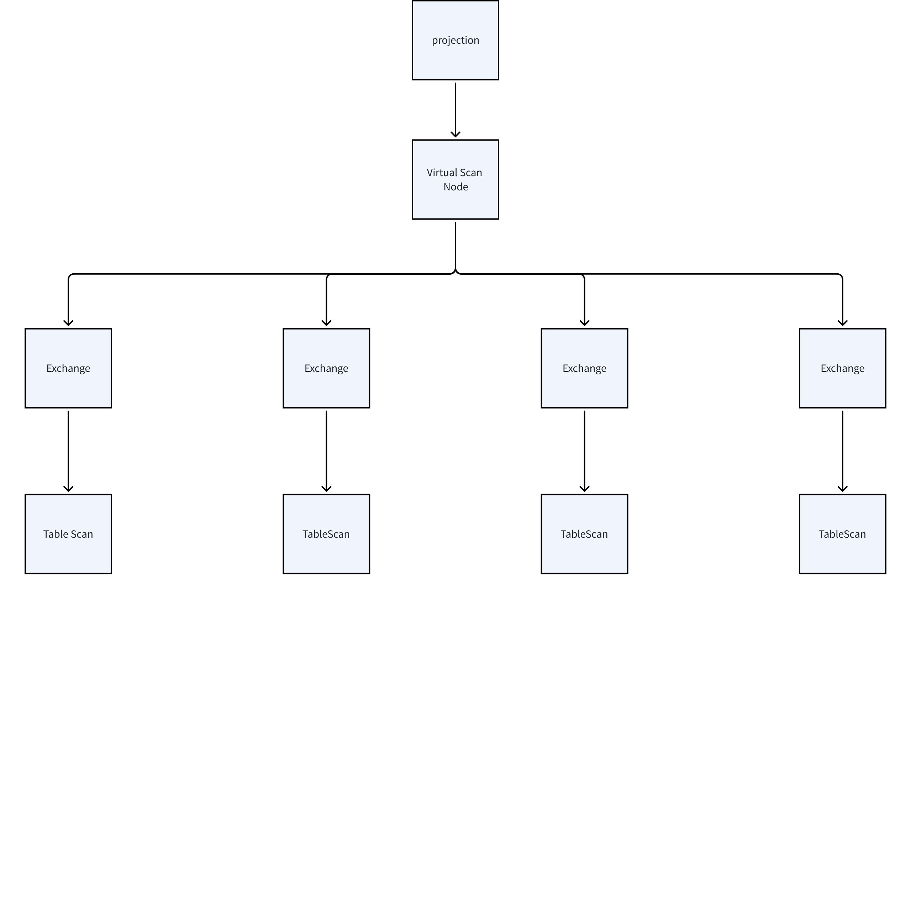
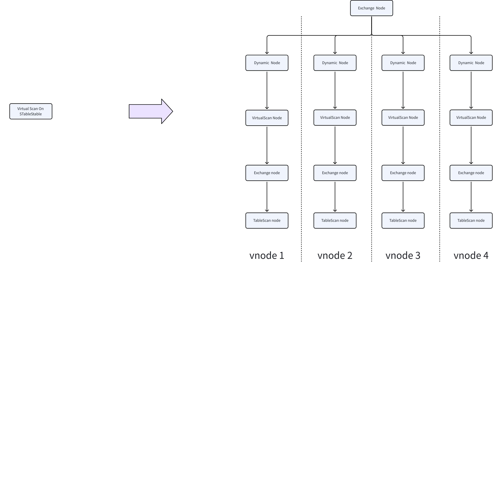
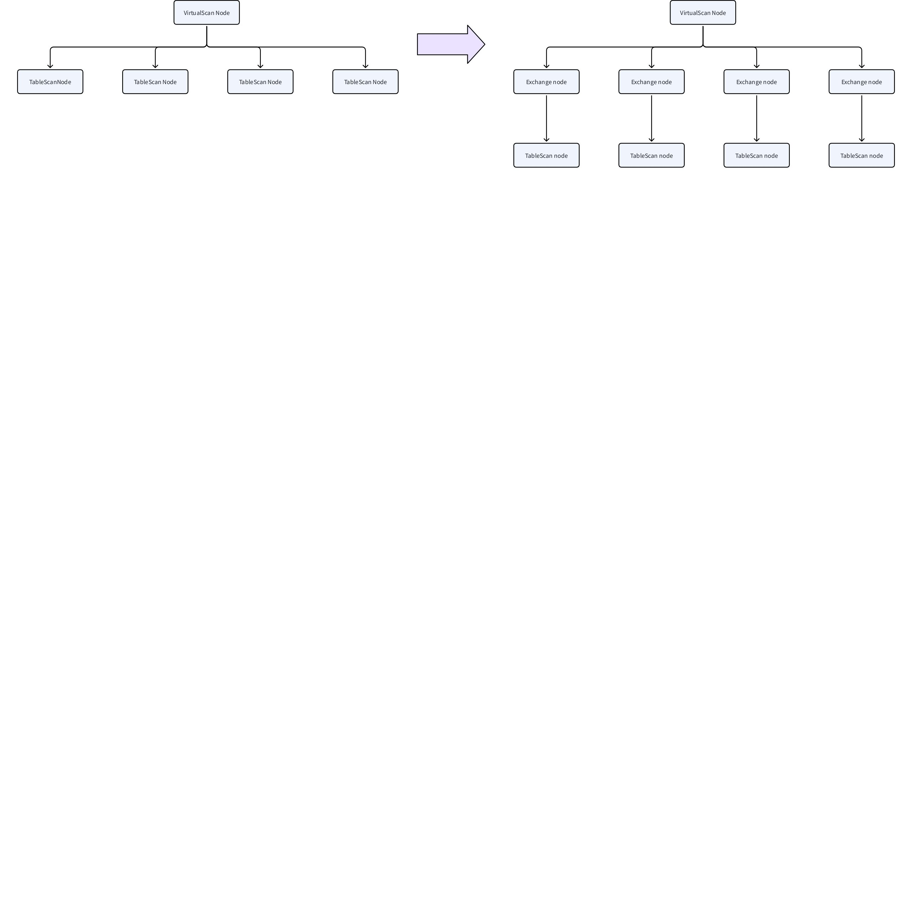
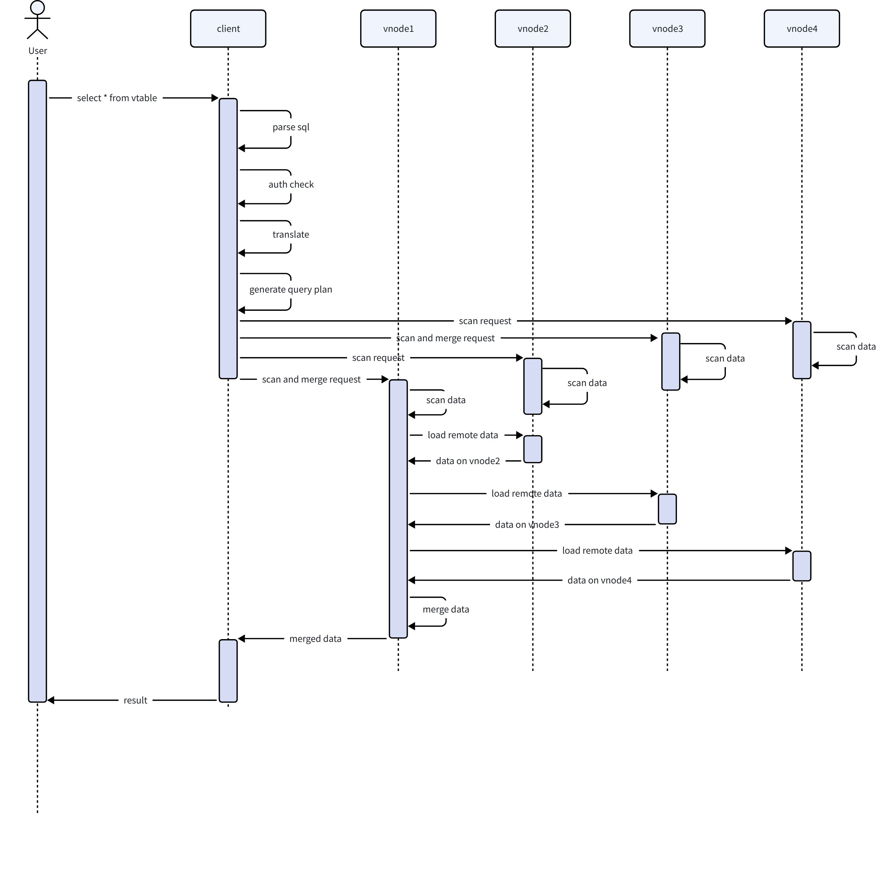

# 虚拟表-Design Spec

## 1. 修订记录

| 编写日期 | 发布日期 | 版本 | 修订人 | 主要修改内容 |
| --- | --- | --- | --- | --- |
| 2025-01-20 | 2025-01-20 | 1.0 | 司马靖 | 初稿 |
| 2026-01-22 | 2026-01-22 | 1.1 | 廖浩均 | 重构文档 |

## 2. 引言

### 2.1 文档目的

本文档旨在系统性地阐述TDengine 虚拟表模块的整体架构设计、核心实现原理与关键技术细节。

### 2.2 文档范围

本设计文档聚焦于时序数据虚拟表模块的整体架构设计和功能设计等方面的内容，主要包括：

#### 2.2.1 整体架构与模块

深入剖析虚拟表模块的层次结构，以及如何快速对齐形成一个表进行查询处理。文档定义相关组件的职责、功能边界、交互协议与关键数据结构，阐明其如何协同工作以应对海量时序数据的挑战。

#### 2.2.2 关键设计考量

阐述在设计过程中为解决虚拟表快速时序数据点对齐所采用的技术方案与权衡依据，以及在确保高性能执行查询处理的过程中仍然具备较高的安全性和可靠性所采用的策略。

### 2.3 目标读者

本文档目标读者包括以下几类：
1. 核心开发与维护人员：文档的主要受众，需要依据文档进行编码、调试、性能优化和故障排查。
2. 架构师与产品经理：可通过本文档深入理解虚拟表功能的技术边界与能力范围，为产品规划与技术选型提供决策支持。
3. 技术爱好者与合作伙伴：对于希望深入了解TDengine内核原理、或计划进行二次开发的工程师，本文档提供了完整的入门指南与理论依据。

## 3. 术语

**虚拟表 (Virtual table)**：是一种动态数据结构，允许从多个表中选择列，将数据按照时间戳排序，并根据对齐规则生成一张新的逻辑表。包含如下显著的技术特点：
1. **列选择与拼接**
用户可以从多个原始表中选择指定的列，按需组合到一张虚拟表中，形成统一的数据视图。
1. **时间戳对齐**
  以时间戳为依据对数据进行对齐，如果多个表在相同时间戳下存在数据，则对应列的值组合成同一行；若部分表在该时间戳下无数据，则对应列填充为 NULL。
1. **动态更新**
虚拟表根据原始表的数据变化自动更新，确保数据的实时性。虚拟表不需实际存储，计算在生成时动态完成。
**原始表 (Base table)：**是虚拟表数据的来源，通常包括时间戳列及其他属性列。

## 4. 整体架构

### 4.1 虚拟表的扫描计划

假设查询虚拟普通表的四个列，对应四张不同的原始表，计划如下所示：


## 5. 设计考虑

- 列条件过滤性能（过滤条件的下推操作）：用户在书写 SQL 语句的时候，可能会使用非常复杂的列过滤条件。同时，过滤条件使用`and` 或 `or` 来进行关联。这种复杂的列条件过滤需要进行改写后才能下推到各原始表进行过滤操作。当前暂不具备查询条件的改写机制，因此针对虚拟表各列的过滤操作暂无法推送到各原始表中进行。因此，针对列数值的过滤，是将所有数据都合并后再进行过滤，性能可能会受到不利的影响。

## 6. 详细设计

### 6.1 定义

```cpp {wrap}
#define TSDB_ALTER_TABLE_ADD_TAG                         1
#define TSDB_ALTER_TABLE_DROP_TAG                        2
#define TSDB_ALTER_TABLE_UPDATE_TAG_NAME                 3
#define TSDB_ALTER_TABLE_UPDATE_TAG_VAL                  4
#define TSDB_ALTER_TABLE_ADD_COLUMN                      5
#define TSDB_ALTER_TABLE_DROP_COLUMN                     6
#define TSDB_ALTER_TABLE_UPDATE_COLUMN_BYTES             7
#define TSDB_ALTER_TABLE_UPDATE_TAG_BYTES                8
#define TSDB_ALTER_TABLE_UPDATE_OPTIONS                  9
#define TSDB_ALTER_TABLE_UPDATE_COLUMN_NAME              10
#define TSDB_ALTER_TABLE_ADD_TAG_INDEX                   11
#define TSDB_ALTER_TABLE_DROP_TAG_INDEX                  12
#define TSDB_ALTER_TABLE_UPDATE_COLUMN_COMPRESS          13
#define TSDB_ALTER_TABLE_ADD_COLUMN_WITH_COMPRESS_OPTION 14
// 新增加的 alter table 信息，面向虚拟表操作
#define TSDB_ALTER_TABLE_UPDATE_COL_REF                  15     
```

### 6.2 枚举体变更

#### 6.2.1 **表类型枚举体变更**

增加了两种表类型，分别是 虚拟子表 `TSDB_VIRTUAL_CHILD_TABLE` 和虚拟普通表 `TSDB_VIRTUAL_NORMAL_TABLE` 
```c
typedef enum {
  TSDB_SUPER_TABLE = 1,   // super table
  TSDB_CHILD_TABLE = 2,   // table created from super table
  TSDB_NORMAL_TABLE = 3,  // ordinary table
  TSDB_TEMP_TABLE = 4,    // temp table created by nest query
  TSDB_SYSTEM_TABLE = 5,
  TSDB_TSMA_TABLE = 6,    // time-range-wise sma
  TSDB_VIEW_TABLE = 7,
  TSDB_VIRTUAL_CHILD_TABLE = 8,
  TSDB_VIRTUAL_NORMAL_TABLE = 9,
  TSDB_TABLE_MAX = 10
} ETableType;
```

#### 6.2.2 **查询节点类型**

```sql
typedef enum ENodeType {
    ···
    QUERY_NODE_CREATE_TABLE_STMT,
    QUERY_NODE_CREATE_SUBTABLE_CLAUSE,
    QUERY_NODE_CREATE_MULTI_TABLES_STMT,
    QUERY_NODE_CREATE_VIRTUAL_TABLE_STMT,
    QUERY_NODE_CREATE_VIRTUAL_SUBTABLE_STMT,
    QUERY_NODE_DROP_TABLE_CLAUSE,
    QUERY_NODE_DROP_TABLE_STMT,
    QUERY_NODE_DROP_SUPER_TABLE_STMT,
    QUERY_NODE_ALTER_TABLE_STMT,
    QUERY_NODE_ALTER_SUPER_TABLE_STMT,
    ···
}
```

### 6.3 关键数据结构

#### 6.3.1 **创建超级表结构体扩展**

```c
typedef struct {
  char     name[TSDB_TABLE_FNAME_LEN];
  ...
  int32_t  sqlLen;
  char*    sql;
  bool     isVirtual; // indicate whether supertable only has virtual child table.
} SMCreateStbReq;
```

#### 6.3.2 **表元数据结构扩展**

```c
typedef struct {
  bool hasRef;
  char refTableName[TSDB_TABLE_NAME_LEN];
  char refColName[TSDB_COL_NAME_LEN];
} SColRef;

typedef struct {
  int32_t   nCols;
  int32_t   version;
  SColRef*  pColRef;
} SColRefWrapper;

typedef struct SMetaEntry {
  int64_t  version;
  int8_t   type;
  ...
  uint8_t* pBuf;

  SColCmprWrapper colCmpr;  // col compress alg
  SColRefWrapper  colRef; // col reference for virtual table
} SMetaEntry;
```

#### 6.3.3 **建表消息体变更**

```c
typedef struct SVCreateTbReq {
  int32_t  flags;
  ...
  SColCmprWrapper colCmpr;
  SColRefWrapper  colRef; // col reference for virtual table
} SVCreateTbReq;
```

#### 6.3.4 **虚拟表节点**

```c
typedef struct SVitualTableNode {
    STableNode         table;  // QUERY_NODE_REAL_TABLE
    struct STableMeta* pMeta;
    SVgroupsInfo*      pVgroupList;
    SNodeList*         orgTableList; // store SRealTableNodes of origin tables
} SVitualTableNode;
```

#### 6.3.5 **虚拟表扫描逻辑节点**

```c
typedef struct SVirtualScanLogicNode {
  SLogicNode     node;
  EJoinType      joinType;
  EJoinSubType   subType;
  SNode*         pWindowOffset;
} SVirtualScanLogicNode;
```

#### 6.3.6 **虚拟表变更请求消息体**

```c
typedef struct {
  char*   tbName;
  ...
  int64_t  ctimeMs;   // fill by vnode
  int8_t   source;    // TD_REQ_FROM_TAOX-taosX or TD_REQ_FROM_APP-taosClient
  uint32_t compress;  // TSDB_ALTER_TABLE_UPDATE_COLUMN_COMPRESS
  SColRef  colRef;
} SVAlterTbReq;
```

#### 6.3.7 **（列）模式扩展信息结构体**

```c
struct SSchemaExt {
  col_id_t colId;
  uint32_t compress;
  SColRef  colRef;
};
```

### 6.4 虚拟表关键操作流程

#### 6.4.1 查看虚拟表信息

与现有的 SHOW TABLES/ SHOW CREATE TABLES/ DESCRIBE 的流程相同，DESCRIBE 的时候需要输出虚拟表每一列对应的原始表表名和列名。本文档不再赘述。

#### 6.4.2 创建流程

与现有 create table/subtable 流程基本相同。SVCreateTbReq 结构体增加 colRef，也就是虚拟表中每一列对应的原表的表名和列名，创建虚拟表时如果制定了某一列的数据来源，需要在 colRef 属性里存储原始表的表名以及对应的列名。
如果创建的虚拟表和已有的虚拟表/子表/普通表/超级表重名，在 vnode metaCreateTable 的时候会检测到，然后返回错误。

#### 6.4.3 删除流程

同现有 drop table/subtable 的流程。本文档不再赘述。

#### 6.4.4 表结构变更流程

与现有 alter table 流程基本相同，但是 alterType 增加 TSDB_ALTER_TABLE_UPDATE_COL_REF， 并且SVAlterTbReq 结构体增加 colRef，也就是虚拟表中每一列对应的原表的表名和列名，如果涉及到修改/新增/删除某一列对应的原始表，需要给 colRef 赋值。并且虚拟节点中的 SMetaEntry 的 colRef 属性也要相应的修改。
SMetaEntry 中需要增加一个属性，`colDepend`，表示原始表中的某一列是否被某个虚拟表当作数据源。

##### 6.4.4.1 变更虚拟普通表

1. 增加/删除列
  直接修改 SMetaEntry 中普通表的 schema 即可，同时修改 colRef，将该列对应的 colRef 修改。也需要同时修改原始表中该列的 colDepend 属性。
1. 修改数据源
  直接修改 SMetaEntry 中的 colRef。同时也要修改原始表中该列的 colDepend 属性。
1. 修改列宽
  如果发现该列已经有 colRef，报错。没有 colRef 可以直接修改。
1. 修改列名
  直接修改 SMetaEntry 中的 schema 即可。

##### 6.4.4.2 变更虚拟子表

1. 修改数据源
  直接修改 SMetaEntry 中的 colRef。同时也要修改原始表中该列的 colDepend 属性。
1. 修改列名
  直接修改 SMetaEntry 中的 schema 即可。

##### 6.4.4.3 变更虚拟超级表

1. 增加/删除列
  类似 增加/删除 tag 列的做法，先在 mnode 修改超级表的 schema, 然后发起事务，将新的 schema 发给每个 vnode, 虚拟节点根据新的 schema 去修改相应的子表的 schema。子表修改 schema 后再根据新的 schema 决定是否需要修改 colRef.
1. 修改列宽
  类似增加/删除列的做法，先在管理节点修改，然后发起事务让每个 虚拟节点去修改，如果发现某个子表该列已经有 colRef，报错。没有 colRef 可以直接修改。
1. 修改列名
  直接修改管理节点保存的超级表对应的元数据信息即可。
对于虚拟子表，支持修改某列的数据源以及修改子表标签值，增加/减少普通列的操作会报错。
如果是给超级表增加/减少列，因为 SMetaEntry 中只有 stbEntry 和 ntbEntry 才存在相关的模式（schema）信息, 所以只需要修改 stbEntry 的 schema 即可，子表不单独存 schema, 在拿元数据信息的时候查到对应超级表的 schema 即可。
修改数据源时，虚拟表侧在 metaAlterTable 处理的时候会检查数据源的类型是否和该列定义的数据类型相同，不同则报错。

#### 6.4.5 虚拟超级表扫描设计

虚拟超级表扫描逻辑计划如下：


#### 6.4.6 扫描流程

以查询虚拟子表和虚拟普通表为例：
1. 应用通过 JDBC 或其他 API 接口发起查询数据的请求
2. 将 sql 通过 parser 转换为 AST。
3. 获取 db info, vgroup info, auth info, table meta-data(如果缓存没有则向 mnode/vnode 发出请求查询).
4. 检查是否有虚拟表的查询权限.
5. 虚拟表在 STableMeta 结构体中的 tableType 属性为 TSDB_VIRTUAL_NORMAL(CHILD)_TABLE translateFrom->translateTable 的时候会将其按照 QUERY_NODE_VIRTUAL_TABLE 进行 translate，translate 的结果为 SVirtualTableNode，并且会将所有涉及到的原始表都 translate，存到 orgTableList 中。
6. createLogicPlan 的时候，会根据 collectColumns 收集到的需要读的列，决定需要去读哪些原始表，并生成 type 为 QUERY_NODE_LOGIC_PLAN_VITRUAL_SCAN 的 SVirtualScanLogicNode，并且此时该 node 的所有子节点都是对原始表的 SScanLogicNode.
7. optimizeLogicPlan 没有变化。
8. splitLogicPlan 时，自顶向下的遍历，如果遇到 SVirtualScanLogicNode，会在所有的子节点的上游加一个 exchange node，然后将这些 exchange node 作为 virtual scan node 的子节点。


1. scaleOut 时，pSubplan->subplanType 为 SUBPLAN_TYPE_VIRTUAL_SCAN 时，和 SUBPLAN_TYPE_MERGE 处理方式相同，直接 singleCloneSubLogicPlan 然后处理 subplan
2. createPhysiPlan 时，doCreatePhysiNode 判断 type 为 QUERY_NODE_LOGIC_PLAN_VIRTUAL_SCAN, 调用 createVirtualScanPhysiNode，创建 type 为 QUERY_NODE_PHYSICAL_PLAN_VIRTUAL_SCAN 的 SVirtualScanPhysiNode。
3. 发给每个虚拟节点执行后，SVirtualScanPhysiNode 会创建 virtualscan 算子，将两个下游算子的数据进行合并，返回给上游算子。合并规则类似于归并排序，时间戳相同则合并为一条放在结果中，时间戳不同则将时间戳较小的一条单独作为一条放在结果中，然后继续处理下一条数据。


## 7. 接口说明

### 7.1 创建虚拟表

#### 7.1.1 **创建超级表**

创建超级表的语法增加一个 `table_option`，用 `VIRTUAL` 字段来表示是否创建虚拟超级表。
创建虚拟超级表时，`column_definition` 中只支持 `type_name`选项，不支持定义额外主键列以及压缩选项。
```sql
CREATE STABLE [IF NOT EXISTS] stb_name (create_definition [, create_definition] ...) TAGS (create_definition [, create_definition] ...) [table_options]
 
create_definition:
    col_name column_definition
 
column_definition:
    type_name [PRIMARY KEY] [ENCODE 'encode_type'] [COMPRESS 'compress_type'] [LEVEL 'level_type']

table_options:
    table_option ...

table_option: {
    COMMENT 'string_value'
  | SMA(col_name [, col_name] ...) 
  | VIRTUAL {0 | 1} 
}
```

#### 7.1.2 **创建虚拟子表**

```sql
CREATE VTABLE [IF NOT EXISTS] [db_name].vtb_name 
    (create_defination[ ,create_defination] ...) 
    USING [db_name.]stb_name 
    [(tag_name [, tag_name] ...)] 
    TAGS (tag_value [, tag_value] ...)
     
 create_definition:
    [stb_col_name FROM] table_name.col_name
 tag_value:
     const_value | table_name.tag_name
```

#### 7.1.3 **创建虚拟普通表**

```sql
CREATE VTABLE [IF NOT EXISTS] [db_name].vtb_name 
    ts_col_name timestamp, 
    (create_defination[ ,create_defination] ...) 
     
 create_definition:
    vtb_col_name column_definition
    
column_definition:
    type_name [FROM table_name.col_name]
```

### 7.2 查询虚拟表

查询虚拟表与普通表相同，无需特殊处理与语法

### 7.3 删除虚拟表

```sql
DROP VTABLE [IF EXISTS] [dbname].vtb_name;
```

### 7.4 修改虚拟表

#### 7.4.1 修改虚拟普通表

```sql
ALTER VTABLE [db_name.]vtb_name alter_table_clause

alter_table_clause: {
  ADD COLUMN vtb_col_name vtb_column_type [FROM table_name.col_name]
  | DROP COLUMN vtb_col_name
  | ALTER COLUMN vtb_col_name SET {table_name.col_name | NULL }
  | MODIFY COLUMN col_name column_type
  | RENAME COLUMN old_col_name new_col_name
}
```

##### 7.4.1.1 增加列

```sql
ALTER VTABLE vtb_name ADD COLUMN vtb_col_name vtb_col_type [FROM table_name.col_name]
```

##### 7.4.1.2 删除列

```sql
ALTER VTABLE vtb_name DROP COLUMN vtb_col_name
```

##### 7.4.1.3 修改列的数据源

```sql
ALTER VTABLE vtb_name ALTER COLUMN vtb_col_name SET table_name.col_name
```

##### 7.4.1.4 修改列宽

```sql
ALTER VTABLE vtb_name MODIFY COLUMN vtb_col_name data_type(length);
```

如果虚拟表该列已指定数据源，那么修改列宽会因为修改后的列宽和数据源的列宽不匹配而报错，可以先将数据源置为空后再修改列宽。

##### 7.4.1.5 修改列名

```sql
ALTER VTABLE vtb_name RENAME COLUMN old_col_name new_col_name
```

#### 7.4.2 **修改虚拟子表**

```sql
ALTER VTABLE [db_name.]vtb_name alter_table_clause

alter_table_clause: {
  ALTER COLUMN vtb_col_name SET table_name.col_name
  | SET TAG tag_name = new_tag_value
}
```

##### 7.4.2.1 修改某列的数据源

```sql
ALTER VTABLE vtb_name ALTER COLUMN vtb_col_name SET table_name.col_name
```

##### 7.4.2.2 修改子表标签值

```plaintext
ALTER VTABLE vtb_name SET TAG tag_name=new_tag_value;
```

## 8. 安全设计

1. 虚拟表读写权限控制，用户需要具有创建虚拟表的原始表具有相应的访问权限才能够具有虚拟表的访问权限。
2. 对于数据表的访问权限，本模块不针对其进行具体的控制，其控制逻辑与《查询 - Requirement Spec》文档中对于表访问的安全控制需求一致。具体的控制处理逻辑和实现机制请参见《访问控制 - Design Spec》

## 9. 性能和扩展性设计

涉及到 n 个原始表的虚拟表查询，性能与 n 个表 join 的性能相近。

## 10. 部署与配置

无需额外的配置即可使用虚拟表功能。

## 11. 监控与维护

1. 增加 virtual scan node 相应的 explain 信息，方便查看执行计划。
2. `validateQueryPlan` 时检查 virtual scan node 

## 12. 参考资料

暂无
