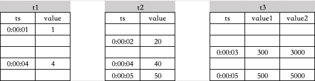
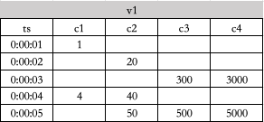
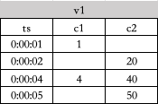

# 虚拟表-Function Spec

## 1. 修订记录

| **编写日期** | **发布日期** | **版本** | **修订人** | **主要修改内容** |
| --- | --- | --- | --- | --- |
| 2025-02-12 | 2025-02-12 | 1.0 | 司马靖 | 第一次安可送测 |
| 2025-12-29 | 2025-12-29 | 1.1 | 廖浩均 | 重构文档 |

## 2. 背景

在工厂、车间、SCADA 等场景，测点数据通过工控协议进入 TDengine，或者通过实时数据库同步进入 TDengine。各个测点是独立采集、上传的，一般采用单列模式的超级表。
1. 某钢铁项目中，机械动力室用 kepware 采集模拟值和开关量，为上层某 BI 软件及其他监控平台提供数据。售前阶段提供的技术方案中，使用 taosX 通过 OPC 协议采集数据，在写入到 TDengine 时创建三个超级表，分别为布尔类型超级表、浮点类型超级表、整数类型超级表，每个超级表都是单列。
2. 某水电院项目中，用户自己编写 EC104 协议解析程序，从集控软件和其他系统中接入时序数据。在写入时序数据库的时候，也同样创建三个超级表。
在汽车、风机等场景，每台设备有上千测点，这些测点按照数据来源或者采集频率可以分为几十个组，对应几十个超级表。
数据成功接入到 TDengine 后，产生了共性的查询需求。进行数据分析时，需把同一设备的多个测点按时间对齐，也就是常说的断面查询。除断面查询外，用户还需要在一个时间轴上，按时间窗口对齐多个测点的数据。interp 函数、窗口函数，都只处理同一表中的不同数据列；处理不同表的数据列时，必须采用 JOIN 语法。JOIN 语法编写较为复杂，使用麻烦且容易出错，不符合易用性的要求。

## 3. 定义

**虚拟表（Virtual Table）：**是一种动态数据结构，允许从多个表中选择列，将数据按照时间戳排序，并根据对齐规则生成一张新的逻辑表。它的主要功能如下：
1. **列选择与拼接**
用户可以从多个原始表中选择指定的列，按需组合到一张虚拟表中，形成统一的数据视图。
1. **基于时间戳对齐**
  以时间戳为依据对数据进行对齐，如果多个表在相同时间戳下存在数据，则对应列的值组合成同一行；若部分表在该时间戳下无数据，则对应列填充为 NULL。
1. **动态更新**
虚拟表根据原始表的数据变化自动更新，确保数据的实时性。虚拟表不需实际存储，计算在生成时动态完成。
**原始表 (Base table)：**是虚拟表数据的来源，通常包括时间戳列及其他属性列。

## 4. 行为说明

### 4.1 数据模型

以需求文档中的数据模型为例。首先采用单列模型建模。共创建三个超级表，标签列包括设备 ID、采集点类型、点号。
```sql {wrap}
create table bool_stb  (ts timestamp, val bool)   tags(device varchar(20), type varchar(20), point int);
create table int_stb   (ts timestamp, val int)    tags(device varchar(20), type varchar(20), point int);
create table double_stb(ts timestamp, val double) tags(device varchar(20), type varchar(20), point int);
```

水电院需监控水力发电机组的状态，以该类型设备的 10 个采集点为例，包括开关、电压、电流、温度、湿度、转速、振幅、压力、密度、风速，下面以 create table 语句描述了这 10 个采集点的属性以及对应子表的当前标签值。
```sql
create table p10 using bool_stb tags   ('d1', 'switch',         10);
create table p11 using double_stb tags ('d1', 'voltage',        11);
create table p12 using double_stb tags ('d1', 'current',        12);
create table p13 using double_stb tags ('d1', 'temperature',    13);
create table p14 using double_stb tags ('d1', 'humidity',       14);
create table p15 using int_stb tags    ('d1', 'rotation_speed', 15);
create table p16 using double_stb tags ('d1', 'amplitude',      16);
create table p17 using double_stb tags ('d1', 'pressure',       17);
create table p18 using double_stb tags ('d1', 'density',        18);
create table p19 using double_stb tags ('d1', 'wind_speed',     19);
```

如果想要创建虚拟子表，需要先创建一张包含十个采集点属性的虚拟超级表，标签列定义为设备名。
```sql
create stable devices (
  ts             timestamp,
  switch         bool,
  voltage        double,
  current        double,
  temperature    double,
  humidity       double,
  rotation_speed int,
  amplitude      double,
  pressure       double,
  density        double,
  wind_speed     double
) 
tags(
    device varchar(20)
)
VIRTUAL 1;
```

### 4.2 创建虚拟表

#### 4.2.1 语法

创建虚拟表时不显式的指定 `ts` 列的数据源，`ts` 列的取值是查询虚拟表时 `select_list` 中涉及到的原始表的主键时间戳合并的结果。
创建虚拟表时需要保证虚拟表中的列、标签和指定的数据来源列、标签的数据类型相同，否则会报错。
创建虚拟表时支持跨库指定数据源。
虚拟超级表下只支持创建虚拟子表，虚拟子表也只能依托于虚拟超级表来创建。
在同一个数据库内，虚拟表名称不允许重名，虚拟表名和表名也不允许重名。虚拟表名和视图名允许重名（不推荐）当出现视图与虚拟表名重名时，写入、查询、授权、回收权限等操作优先使用同名表。

##### 4.2.1.1 **创建超级表**

创建超级表的语法`table_option` 字段中，用 `VIRTUAL` 字段来表示是否创建虚拟超级表。
创建虚拟超级表时，`column_definition` 中只支持 `type_name`选项，不支持定义额外主键列以及压缩选项。
```sql
CREATE STABLE [IF NOT EXISTS] stb_name (create_definition [, create_definition] ...) TAGS (create_definition [, create_definition] ...) [table_options]
 
create_definition:
    col_name column_definition
 
column_definition:
    type_name [PRIMARY KEY] [ENCODE 'encode_type'] [COMPRESS 'compress_type'] [LEVEL 'level_type']

table_options:
    table_option ...

table_option: {
    COMMENT 'string_value'
  | SMA(col_name [, col_name] ...) 
  | VIRTUAL {0 | 1} 
}
```

创建虚拟子表和虚拟普通表时，使用 `FROM` 指定某一列的数据来源时，该列只能来源于普通子表或普通表，不支持来源于超级表、视图或其他虚拟表，不支持来源于有复合主键的表。

##### 4.2.1.2 **创建虚拟子表**

```sql
CREATE VTABLE [IF NOT EXISTS] [db_name].vtb_name 
    (create_defination[ ,create_defination] ...) 
    USING [db_name.]stb_name 
    [(tag_name [, tag_name] ...)] 
    TAGS (tag_value [, tag_value] ...)
     
 create_definition:
    [stb_col_name FROM] table_name.col_name
 tag_value:
     const_value | table_name.tag_name
```

##### 4.2.1.3 **创建虚拟普通表**

```sql
CREATE VTABLE [IF NOT EXISTS] [db_name].vtb_name 
    ts_col_name timestamp, 
    (create_defination[ ,create_defination] ...) 
     
 create_definition:
    vtb_col_name column_definition
    
column_definition:
    type_name [FROM table_name.col_name]
```

#### 4.2.2 示例

##### 4.2.2.1 创建虚拟子表

创建虚拟子表时，无需指定主键时间戳列的数据来源，因为主键时间戳列的值是在查询时决定的。
```sql
create vtable d1 (
    p10.val,
    p11.val,
    p12.val,
    p13.val,
    p14.val,
    p15.val,
    p16.val,
    p17.val,
    p18.val,
    p19.val)
    USING devices tags ('d1');
```

```sql
create vtable d1 (
    switch from p10.val,
    voltage from p11.val,
    current from p12.val,
    temperature from p13.val,
    humidity from p14.val,
    rotation_speed from p15.val,
    amplitude from p16.val,
    pressure from p17.val,
    density from p18.val,
    wind_speed from p19.val)
    USING devices tags ('d1');    
```

使用 `[stb_col_name FROM] table_name.col_name` 方式指定列和直接指定 `table_name.col_name` 的方式不可以混用，也就是说要么都使用 `table_name.col_name` 的方式，要么都使用 `[stb_col_name FROM] table_name.col_name` 的方式。
若在创建虚拟表时，只想指定其中某几列，可以使用以下方法创建，其他列可以在在创建之后通过 `ALTER VTABLE ... ALTER` 的方式手动指定：
```sql
create vtable d1 (
    switch from p10.val,
    wind_speed from p19.val)
    USING devices tags ('d1');    
```

也可以使用如下方法：
```sql
create vtable d1 (
    p10.val,
    p11.val)
    USING devices tags ('d1'); 
```

使用 `[stb_col_name FROM] table_name.col_name` 方式可以指定任意列的定义，但是使用 `table_name.col_name` 的方式只能按顺序指定列的定义，比如只写了两列的定义，那么就表示只定义了虚拟表前两列的来源，剩余列均为 NULL。
若在创建虚拟表时想使用某些子表的 `tag` 值作为该虚拟表的某个 `tag` 值，可以使用以下方法创建：
```sql
create vtable d1 (
    switch from p10.val,
    wind_speed from p19.val)
    USING devices tags (p10.device);  
```

该虚拟表 `d1` 对外的表现和使用如下方式创建的子表相同：
```sql
create table d1 using devices TAGS ('d1');
```

##### 4.2.2.2 创建虚拟普通表

创建虚拟普通表时，需要额外指定主键时间戳列的定义。
```sql
create vtable d1 (
    ts timestamp,
    switch bool from p10.val,
    voltage double from p11.val,
    current double from p12.val,
    temperature double from p13.val,
    humidity double from p14.val,
    rotation_speed int from p15.val,
    amplitude double from p16.val,
    pressure double from p17.val,
    density double from p18.val,
    wind_speed double from p19.val)
```

如果创建时没有决定某些列的数据来源，也可以不指定 `from` 选项，后续通过 ALTER 的方式指定。例如在创建时只想指定 `switch` 列和 `current` 列的来源：
```sql
create vtable d1 (
    ts timestamp,
    switch bool from p10.val,
    voltage double,
    current double from p12.val,
    temperature double,
    humidity double,
    rotation_speed int,
    amplitude double,
    pressure double,
    density double,
    wind_speed double)
```

### 4.3 查询虚拟表

用户在查询时，虚拟表的查询与正常表的查询是相同的，没有区别。

#### 4.3.1 虚拟表合并原始表数据的规则

虚拟表通过以下规则将不同原始表的列组合起来：
1. 虚拟表以时间戳为基准，对多个原始表的数据进行对齐。
2. 如果多个原始表在相同时间戳下有数据，则这些列的值组合成同一行；否则，对于缺失的列，填充 `NULL`。
3. 虚拟表的时间戳的值是查询中包含的所有列所在的原始表的时间戳的并集，因此当不同查询选择列不同时可能出现结果集行数不一样的情况。
4. 用户可以从多个表中选择任意列进行组合，未选择的列不会出现在虚拟表中。
**示例：**
假设有表 `t1`, `t2`, `t3` 结构和数据如下：


并且有虚拟普通表 `v1` ，创建方式如下：
```sql
create vtable v1 (
    ts timestamp,
    c1 int from t1.value,
    c2 int from t2.value,
    c3 int from t3.value1,
    c4 int from t3.value2)
```

那么根据虚拟表对于多表数据的整合规则，执行如下查询时：
```sql
select * from v1;
```

得到的结果如下图所示：


如果没有选择全部列，只是选择了部分列，查询的结果只会包含选择的列的原始表的时间戳，例如执行如下查询：
```sql
select c1, c2 from v1;
```

得到的结果如下图所示：


因为 `c1`, `c2` 列对应的原始表 `t1`, `t2` 中没有 `0:00:03` 这个时间戳，所以最后的结果也不会包含这个时间戳。

### 4.4 删除虚拟表

```sql
DROP VTABLE [IF EXISTS] [dbname].vtb_name;
```

### 4.5 修改虚拟表

#### 4.5.1 修改虚拟普通表

```sql
ALTER VTABLE [db_name.]vtb_name alter_table_clause

alter_table_clause: {
  ADD COLUMN vtb_col_name vtb_column_type [FROM table_name.col_name]
  | DROP COLUMN vtb_col_name
  | ALTER COLUMN vtb_col_name SET {table_name.col_name | NULL }
  | MODIFY COLUMN col_name column_type
  | RENAME COLUMN old_col_name new_col_name
}
```

##### 4.5.1.1 增加列

```sql
ALTER VTABLE vtb_name ADD COLUMN vtb_col_name vtb_col_type [FROM table_name.col_name]
```

##### 4.5.1.2 删除列

```sql
ALTER VTABLE vtb_name DROP COLUMN vtb_col_name
```

##### 4.5.1.3 修改某列的数据源

```sql
ALTER VTABLE vtb_name ALTER COLUMN vtb_col_name SET table_name.col_name
```

##### 4.5.1.4 修改列宽

```sql
ALTER VTABLE vtb_name MODIFY COLUMN vtb_col_name data_type(length);
```

如果虚拟表该列已指定数据源，那么修改列宽会因为修改后的列宽和数据源的列宽不匹配而报错，可以先将数据源置为空后再修改列宽。

##### 4.5.1.5 修改列名

```sql
ALTER VTABLE vtb_name RENAME COLUMN old_col_name new_col_name
```

#### 4.5.2 **修改虚拟子表**

```sql
ALTER VTABLE [db_name.]vtb_name alter_table_clause

alter_table_clause: {
  ALTER COLUMN vtb_col_name SET table_name.col_name
  | SET TAG tag_name = new_tag_value
}
```

##### 4.5.2.1 修改某列的数据源

```sql
ALTER VTABLE vtb_name ALTER COLUMN vtb_col_name SET table_name.col_name
```

##### 4.5.2.2 修改子表标签值

```sql
ALTER VTABLE vtb_name SET TAG tag_name=new_tag_value;
```

只有虚拟普通表才可以使用 `ALTER VTABLE ... ADD/DROP...`来增加/删除列，虚拟子表不可以使用。
如果想给虚拟子表增加/删除列，可以通过在虚拟子表对应的虚拟超级表上增加/删除列来实现。
使用 `ALTER VTABLE ... ALTER...` 修改虚拟表时，可以修改已有列的数据来源，比如 `switch` 列本来的来源是 `p10.val`, 可以使用如下语句将其来源改为 `p20.val`:
```sql
ALTER VTABLE d1 ALTER COLUMN switch SET p20.val;
```

也可以使用如下语句将其来源改为空：
```sql
ALTER VTABLE d1 ALTER COLUMN switch SET NULL;
```

如果创建虚拟表时未指定 `switch` 列的数据来源，上述语句等于指定 `switch` 列的数据来源为 `p20.val`。

#### 4.5.3 **修改虚拟子表对应的超级表**

##### 4.5.3.1 修改列宽

```sql
ALTER STABLE stb_name MODIFY COLUMN col_name data_type(length);
```

与修改虚拟普通表的列宽不同，如果修改了虚拟子表对应的超级表的某一列的列宽，并且虚拟子表的该列有数据源，并不会在修改的时候报错，而是会在查询到虚拟子表的该列的时候检测到数据源和列定义不同而报错。

##### 4.5.3.2 剩余操作

其他修改虚拟子表对应的超级表的行为和修改正常的超级表的行为一致。

### 4.6 查看虚拟表

#### 4.6.1 查看数据库下的所有虚拟表

```sql
SHOW [NORMAL | CHILD] [db_name.]VTABLES [LIKE 'pattern'];
```

如果没有指定 db_name, 显示当前数据库下的所有虚拟普通表和虚拟子表的信息。若没有使用数据库并且没有指定 db_name, 则会报错 `database not specified`。可以使用 LIKE 对表名进行模糊匹配。NORMAL 指定只显示虚拟普通表信息， CHILD 指定只显示虚拟子表信息。

#### 4.6.2 查看数据库下的所有超级表

```sql
SHOW [NORMAL | VIRTUAL] [db_name.]STABLES [LIKE 'pattern'];
```

NORMAL 指定只显示只能创建普通子表的超级表信息，VIRTUAL 指定只显示只能创建虚拟子表的超级表信息。

#### 4.6.3 查看虚拟表的创建语句

```sql
SHOW CREATE VTABLE [db_name.]vtable_name;
```

显示 vtable_name 指定的虚拟表的创建语句。支持虚拟普通表和虚拟子表。

#### 4.6.4 查看虚拟表列信息

```sql
DESCRIBE [db_name].vtable_name;
```

#### 4.6.5 查看所有虚拟表信息

```sql
SELECT ... FROM information_schema.ins_tables where type = 'VIRTUAL_NORMAL_TABLE' or type = 'VIRTUAL_CHILD_TABLE';
```

### 4.7 写入虚拟表

不支持向虚拟表中写入数据，以及不支持删除虚拟表中的数据。虚拟表只是对原始表进行运算后的计算结果，是一张逻辑表，因此只能对其进行查询，不可以写入或删除数据。

### 4.8 系统表

#### 4.8.1 INS_STABLES

新增一列 `virtual`

| # | **列名** | **数据类型** | **说明** |
| --- | --- | --- | --- |
| 1 | stable_name | VARCHAR(192) | 超级表表名 |
| 2 | db_name | VARCHAR(64) | 超级表所在的数据库的名称 |
| 3 | create_time | TIMESTAMP | 创建时间 |
| 4 | columns | INT | 列数目 |
| 5 | tags | INT | 标签数目。需要注意，`tags` 为 TDengine 关键字，作为列名使用时需要使用 ` 进行转义。 |
| 6 | last_update | TIMESTAMP | 最后更新时间 |
| 7 | table_comment | VARCHAR(1024) | 表注释 |
| 8 | watermark | VARCHAR(64) | 窗口的关闭时间。需要注意，`watermark` 为 TDengine 关键字，作为列名使用时需要使用 ` 进行转义。 |
| 9 | max_delay | VARCHAR(64) | 推送计算结果的最大延迟。需要注意，`max_delay` 为 TDengine 关键字，作为列名使用时需要使用 ` 进行转义。 |
| 10 | rollup | VARCHAR(128) | rollup 聚合函数。需要注意，`rollup` 为 TDengine 关键字，作为列名使用时需要使用 ` 进行转义。 |
| 11 | virtual | BOOL | 表示该超级表是否是虚拟超级表 |

#### 4.8.2 INS_TABLES

表类型 `type` 新增 `V_NORMAL_TABLE` 和 `V_CHILD_TABLE`

#### 4.8.3 INS_TAGS

没有变化

#### 4.8.4 INS_COLUMNS

新增一列 `col_source`，表示虚拟表的列的数据来源。只有表类型为 `V_NORMAL_TABLE` 和 `V_CHILD_TABLE` 时该列才有值，为 `table_name.col_name`。

| # | **列名** | **数据类型** | **说明** |
| --- | --- | --- | --- |
| 1 | table_name | VARCHAR(192) | 表名 |
| 2 | db_name | VARCHAR(64) | 该表所在的数据库的名称 |
| 3 | table_type | VARCHAR(21) | 表类型 |
| 4 | col_name | VARCHAR(64) | 列 的名称 |
| 5 | col_type | VARCHAR(32) | 列 的类型 |
| 6 | col_length | INT | 列 的长度 |
| 7 | col_precision | INT | 列 的精度 |
| 8 | col_scale | INT | 列 的比例 |
| 9 | col_nullable | INT | 列 是否可以为空 |
| 10 | col_source | VARCHAR(322) | 列 的数据来源 |

#### 4.8.5 其他系统表

没有变化。

### 4.9 虚拟表与视图

虚拟表与视图看起来相似，但是有很多不同点：
| 属性 | 虚拟表 (Virtual Table) | 视图 (View) |
| --- | --- | --- |
| 定义 | 虚拟表是一种动态数据结构，根据多表的列和时间戳组合规则生成逻辑表。 | 视图是一种基于 SQL 查询的虚拟化表结构，用于保存查询逻辑的定义。 |
| 数据来源 | 来自多个原始表，可以动态选择列，并通过时间戳对齐数据。 | 来自单个或多个表的查询结果，通常是一个复杂的 SQL 查询。 |
| 数据存储 | 不实际存储数据，所有数据在查询时动态生成。 | 不实际存储数据，仅保存 SQL 查询逻辑。 |
| 时间戳处理 | 通过时间戳对齐将不同表的列整合到统一的时间轴上。 | 不支持时间戳对齐，数据由查询逻辑直接决定。 |
| 更新机制 | 动态更新，原始表数据变更时，虚拟表数据实时反映变化。 | 动态更新，但依赖于视图定义的查询逻辑，不涉及对齐或数据整合。 |
| 功能特性 | 支持空值填充和插值（如 prev、next、linear）。 | 不支持内置填充和插值功能，需通过查询逻辑自行实现。 |
| 应用场景 | 时间序列对齐、跨表数据整合、多源数据对比分析等场景。 | 简化复杂查询逻辑、限制用户访问、封装业务逻辑等场景。 |
| 性能 | 由于多表对齐和空值处理，查询复杂度可能较高，尤其在数据量大时。 | 性能通常取决于视图的查询语句复杂度，与单表查询性能相似。 |

不支持虚拟表和视图之间的相互转化，如根据虚拟表建立视图或者根据视图建立虚拟表。

### 4.10 权限

#### 4.10.1 说明

虚拟表的权限分为 READ、WRITE 两种，查询操作需要具备 READ 权限，对虚拟表本身的删除和修改操作需要具备 WRITE 权限。

#### 4.10.2 规则

1. 虚拟表的创建者和 root 用户默认具备所有权限。
2. 用户可以通过 dbname.vtbname 来为指定的虚拟表表（包括虚拟超级表和虚拟普通表）授予或回收其读写权限，不支持直接对虚拟子表授予或回收权限。
3. 虚拟子表和虚拟超级表不支持基于标签的授权（表级授权），虚拟子表继承虚拟超级表的权限。
4. 对其他用户进行授权与回收权限可以通过 GRANT 和 REVOKE 语句进行，该操作只能由 root 用户进行。
5. 具体相关权限控制细则总结如下：

| 序号 | 操作 | 权限要求 |
| --- | --- | --- |
| 1 | CREATE VTABLE | 用户对虚拟表所属数据库有 WRITE 权限 **且** 用户对虚拟表的数据源对应的原始表有 READ 权限。 |
| 2 | DROP/ALTER VTABLE | 用户对虚拟表有 WRITE 权限，若要指定某一列的数据源，需要同时对数据源对应的原始表有 READ 权限。 |
| 3 | SHOW VTABLES | 无 |
| 4 | SHOW CREATE VTABLE | 无 |
| 5 | DESCRIBE VTABLE | 无 |
| 6 | 系统表查询 | 无 |
| 7 | SELECT FROM VTABLE | 操作用户对虚拟表有 READ 权限 |
| 8 | GRANT/REVOKE | 只有 root 用户有权限 |

#### 4.10.3 语法

##### 4.10.3.1 授权

```sql
GRANT privileges ON [db_name.]vtable_name TO user_name
privileges: {
    ALL,
  | priv_type [, priv_type] ...
}
priv_type: {
    READ
  | WRITE
}
```

##### 4.10.3.2 回收权限

```sql
REVOKE privileges ON [db_name.]vtable_name FROM user_name
privileges: {
    ALL,
  | priv_type [, priv_type] ...
}
priv_type: {
    READ
  | WRITE
}
```

## 5. 性能

1. **对于虚拟表查询：**虽然虚拟表对外的表现和普通表没有差别，但是查询虚拟表时相当于查询所有选择的列所在的原始表，并且要根据规则将结果合并，所以性能是比查询正常表要差的，具体的差距需要决定设计后才能对比。
2. **对于非虚拟表查询：**无影响

## 6. 安全性

1. 身份验证与授权 (Authentication and Authorization)：见查询模块章节。
2. 最小权限原则 (Principle of Least Privilege, POLP)：见查询模块章节。
3. 传输过程数据加密(Data Encryption In Transit)：见通信章节。
4. 安全会话管理 (Secure Session Management)：见通信章节。
5. 日志记录、监控与审计追踪 (Logging, Monitoring, and Audit Trails)：见查询模块章节，此外针对虚拟表创建的操作，增加其行为的日志记录动作。
6. 安全错误处理与信息泄露预防 (Secure Error Handling and Information Leakage Prevention)：见查询模块章节。
7. 资源限制与拒绝服务保护 (Resource Limiting and DoS Protection)：见查询模块章节。

## 7. 兼容性

无。

## 8. 运维

无。

## 9. 使用场景

| SQL 查询 | SQL 写入 | STMT 查询 | STMT 写入 | 订阅 | 流计算 |
| --- | --- | --- | --- | --- | --- |
| 支持 | 不支持 | 不支持 | 不支持 | 不支持 | 支持 |

## 10. 约束和限制

暂无。

## 11. 常见错误和排查

无

## 12. 可观测性

无

## 13. 安装和卸载

无

## 14. 文档

需要修改企业版文档和官网文档。

## 15. 参考文档

无
