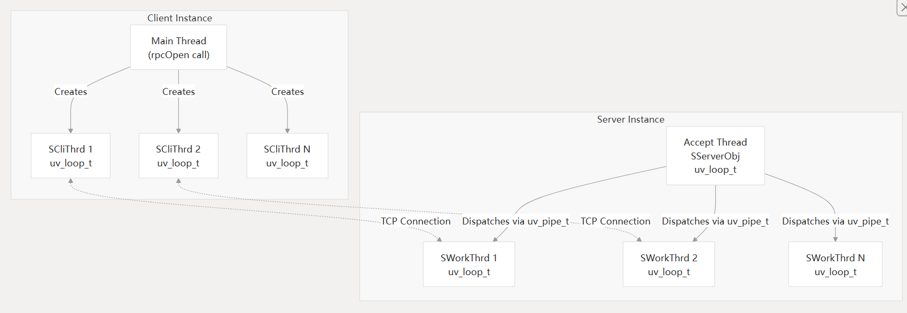
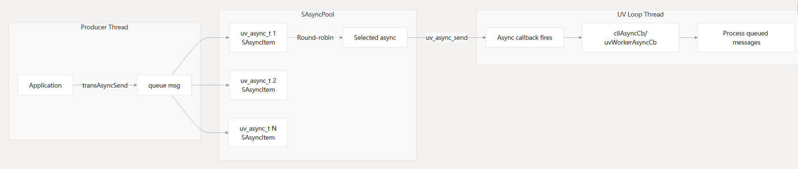
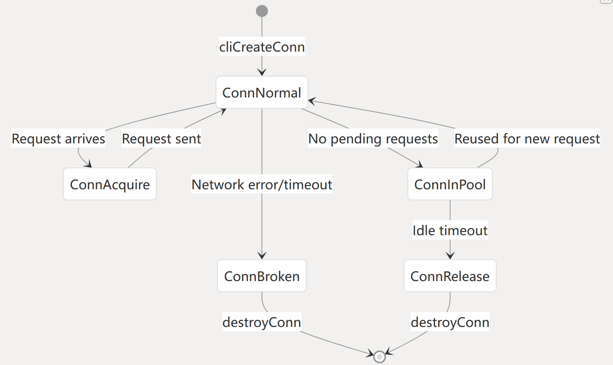
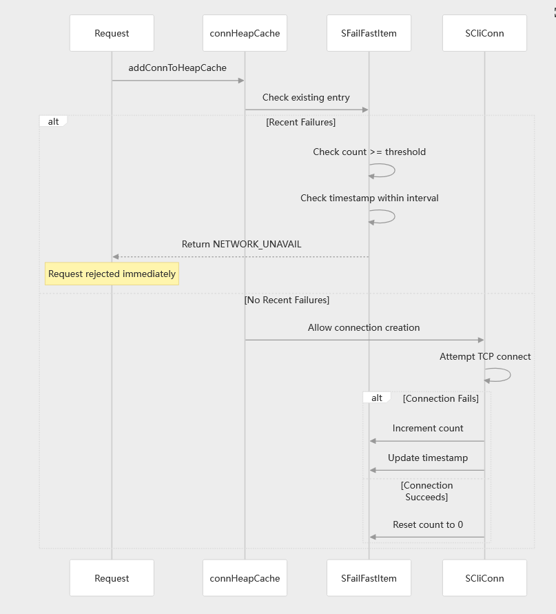
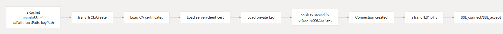
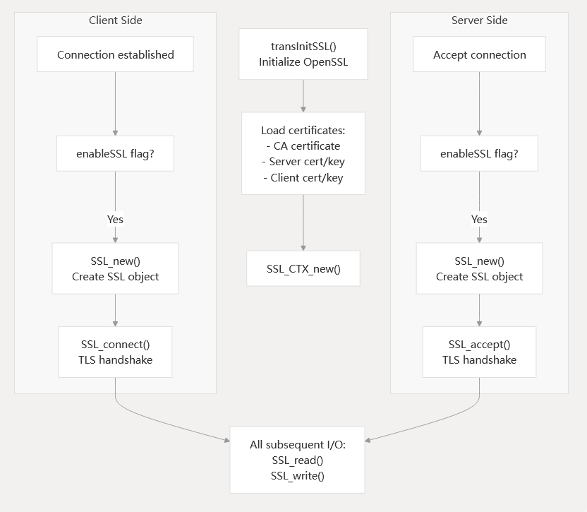
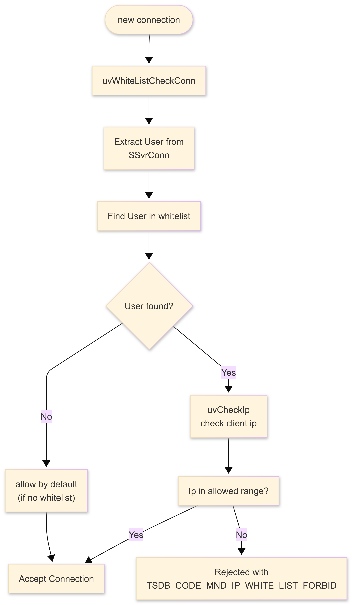
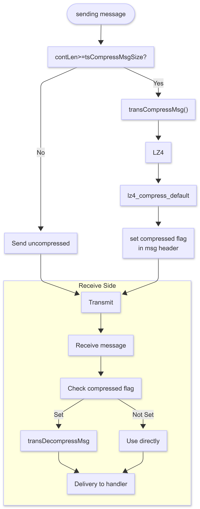
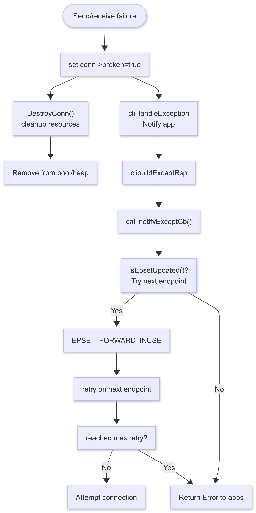
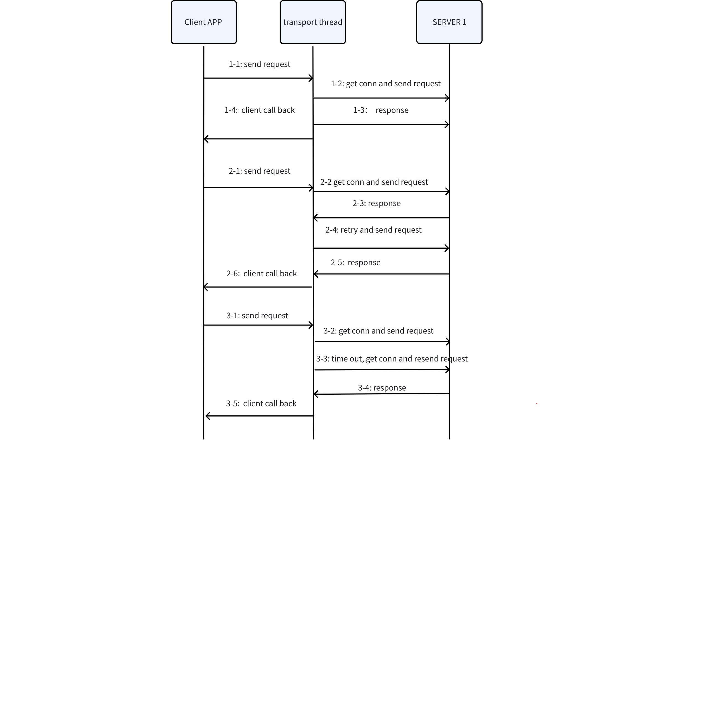

# 通信模块-Design Spec

## 1. 修订记录

| 编写日期 | 发布日期 | 版本 | 修订人 | 主要修改内容 |
| --- | --- | --- | --- | --- |
| 2025-01-19 | 2025-01-19 | 1.0 | 邓怡豪 | 第一次安可送测 |
| 2025-12-22 | 2025-12-24 | 1.1 | 廖浩均 | 重构文档 |

## 2. 引言

### 2.1 文档目的

本文档旨在定义和描述一个高性能网络传输系统的设计与实现，该系统主要用于并发访问数据、数据库集群数据传输。系统需要确保高效、可靠、安全的数据传输，以支持大规模数据处理和实时数据同步。

### 2.2 文档范围

本文档涵盖了高性能网络模块的整体架构设计、技术选型、协议设计、接口规范、安全措施、性能优化、部署流程以及监控和维护策略。适用于网络模块的开发、测试、部署和维护阶段。

### 2.3 目标读者

1. 开发人员：负责网络模块的实现和编码。
2. 测试人员：负责网络模块的测试和验证。
3. 运维人员：负责网络模块的部署、监控和维护。
4. 项目经理：负责项目的整体管理和协调。
5. 其他利益相关者：如产品经理、架构师等。

## 3. 术语

1. **TDengine**：一种高性能、支持分布式架构的时间序列数据库。
2. **FQDN**: 即完全限定域名，是互联网中用于唯一标识一台特定主机或服务的完整、绝对域名。它能够明确指出主机在DNS层次结构中的确切位置，确保信息准确无误地送达。
3. **IP**:  指网际互连协议，Internet Protocol的缩写，是TCP/IP体系中的网络层协议。
4. **Latency**：从发出请求到接收到响应所花费的时间。
5. **EpSet**：集群内各个节点（主副本）地址所组成的集合。
6. **TCP**：是一种面向连接的、可靠的、基于字节流的传输层通信协议。
7. **异步事件驱动架构‌（Async Event-Driven Architecture, AEDA）**:是一种通过事件的异步产生、传递和响应来组织系统的架构模式，核心特征是组件间通过事件松耦合通信，且事件处理过程不阻塞发送方。
8. **连接池（Connection Pool）‌**：预创建并管理连接的缓存池，通过复用连接减少创建/销毁开销，提升性能。
9. **状态机（State Machine）‌**：通过有限状态和状态转移规则，确保生命周期的确定性和安全性。
10. **领导者（Leader）**： 是指在一组副本（Replica）中被选举出来的核心节点，负责处理客户端请求、协调数据同步，并维护副本集群的一致性。负责将写入的数据同步至追随者，通过一致性共识协议确保数据一致性。

## 4. 概述




通信模块的客户端-服务端通信模型如上图所示，该模型整体上采用了基于事件循环的多线程异步通信机制。这一机制的核心在于通过结合多线程与事件循环模型，有效地规避了单线程环境下的阻塞问题，从而能够支持海量的TCP连接，满足高并发场景下的通信需求。从架构层面来看，通信模块划分为客户端和服务端两部分。两部分之间通过TCP连接进行异步通信，确保了数据的高效传输与交互。客户端负责发起请求，而服务端则负责接收并处理这些请求，然后将响应结果返回给客户端。
为了实现非阻塞交互，模型采用了事件驱动的架构，即所有的操作都是基于事件触发，而非传统的轮询方式。这种设计不仅提高了系统的响应速度，还显著降低了资源消耗。此外，通信模块还依赖了一个轻量级的事件循环库——libuv。libuv是一个跨平台的异步I/O库，它提供了事件循环、线程池、信号处理等功能，能够更加高效地管理事件循环和多线程资源，从而实现高性能的异步通信。
客户端在主线程中调用`rpcOpen` 创建并初始化客户端逻辑，然后初始化完成`SCIThread`线程池， 线程池中的每个线程绑定独立 `uv_loop_t`事件循环，每个线程负责处理客户端侧的异步任务。
服务端创建 一个`Accept`线程和若干工作线程，在Accept线程上绑定`uv_loop_t`， 并绑定pipe 到uv_loop_t, 同时监听连接请求，在工作线程上绑定uv_loop_t和pipe信号， Accept 线程收到新连接请求后，通过pipe 信号把已建立的连接分发到工作线程，并在工作线程的uv_loop_t上注册，后续的收发请求都在工作线程上处理, 这样就实现了实现请求的异步分发与处理。

## 5. 设计考虑

1. 假设和限制
   - 假设网络环境稳定，延迟较低。
   - 限制：单节点支持的并发连接数不超过5万。
2. 设计模式和原则
   - 事件驱动模式: 基于libuv的事件循环机制实现高性能网络通信。
   - 反应器模式: 用于处理高并发连接。
3. 风险和缓解措施
   - 风险: 网络延迟导致通信性能下降。
      - 缓解措施: 使用负载均衡和边缘计算优化网络路径。
   - 风险: 单点故障导致服务不可用。
      - 缓解措施: 使用集群和负载均衡实现高可用性。

## 6. 详细设计

### 6.1 组件设计

1. **事件循环**: 使用libuv的`uv_loop_t`实现事件循环，处理所有异步事件。
2. **TCP服务器**: 使用libuv的`uv_tcp_t`实现TCP服务器，支持高并发连接。
3. **连接管理**: 使用哈希表管理已经建立的链接支持快速查找和删除。
4. **协议解析器**: 解析和处理网络协议数据，支持自定义协议。
5. **定时器机制：**使用libuv的uv_timer_t 来做定时器，处理重试、超时等事件。

### 6.2 异步发送消息



通信组件采用了异步事件驱动架构‌（Async Event-Driven Architecture, AEDA）来处理消息的发送，确保了生产者线程与异步处理线程之间的高效通信与任务调度。

##### 6.2.0.1 核心组件与处理流程

生产者线程（Producer Thread）：应用层（Application）的业务逻辑执行单元，负责生成异步任务或事件。通过`async_send`接口将任务消息（如`task_1`、`task_2`、`task_N`）发送至消息队列‌，实现消息生产者与异步处理线程（消费者）的解耦。
消息队列（Message Queue）用于暂存生产者线程发送的任务消息，采用轮询调度（Round-robin） 策略将任务分发给多个异步处理线程（Async Thread）‌，每个消息使用如下方式计算应该分发给的线程`idx = pool->index % pool->nAsync` 平衡负载并避免单一线程过载。
异步处理线程（Async Thread）：独立于生产者线程的工作者线程，负责异步执行任务（如I/O操作、耗时计算等）。通过`async_callback`接口接收消息队列分发的任务，执行完成后将结果存入结果队列（Result Queue）‌，或直接触发后续处理逻辑。
UV Loop Thread（事件循环线程）：基于事件循环（Event Loop） 模型运行，通过`libuv`库（跨平台异步I/O框架）管理异步任务的生命周期，包括事件监听、回调调度和资源释放。
结果队列（Result Queue）：暂存异步处理线程执行后的结果，供应用层（Application） 或后续流程消费，实现任务执行与结果处理的解耦。

##### 6.2.0.2 技术特点

- 通过`async_send`和`async_callback`实现生产者与异步线程的非阻塞通信，避免阻塞主线程。
- 轮询调度策略将任务均匀分配给多个异步线程，提升系统吞吐量。
- UV Loop Thread基于事件触发机制（如I/O就绪、定时器超时），高效调度任务，减少线程上下文切换开销。
- 各组件通过队列和接口通信，降低耦合度，便于扩展和维护。
异步发送消息的架构设计，通过生产者-消费者模式、异步事件驱动和轮询调度的结合，实现了高并发任务的高效处理，核心依赖异步通信接口、事件循环框架和队列中间件。

### 6.3 连接状态管理设计

通信模块针对连接生命周期状态管理，以及不同状态下的触发和流转逻辑如下图所示。连接状态管理模块的设计，通过连接复用机制和连接池机制，减少创建/销毁连接的开销，降低了服务器负载。识别状态异常的连接（Network error/timeout），并对其进行销毁。通过状态转移规则确保连接生命周期的确定性和安全性。
连接状态机机制通过状态流转与接口调用的结合，实现了连接从创建到释放的全生命周期管理，是网络通信框架中连接池设计的核心逻辑。




调用`cliCreateConn` 将首次创建连接，此时连接是初始的正常状态。连接处于可复用的正常状态，无未处理请求（`No pending requests`），则直接将其放入连接池中等待复用。
对于连接池中的连接，若连接空闲超时则触发连接释放流程。连接释放以后，调用`destroyConn`接口销毁损坏连接，释放相关资源。如果有等待的请求需要响应，则将连接池中的连接置于 `ConnNormal` 状态等待连接使用。
当新请求到达（Request arrives）时，检查是否有处于 `ConnNormal` 状态的连接，如果存在该状态的连接，将其转换为 `ConnAcquire` 状态（连接获取状态）。然后客户端通过该连接发送请求，请求发送完成以后，将该连接变换为`ConnNormal`状态，等待后续请求复用。
异常状态：ConnBroken（连接损坏状态）‌。网络错误（Network error）或超时（timeout）时，连接状态从`ConnNormal`切换至该状态。然后调用`destroyConn`接口销毁损坏连接，释放相关资源。

### 6.4 快速失败（Fast-Failed ）设计




快速失败处理流程时序图如上所示。整个处理流程涉及连接缓存管理、失败状态跟踪及TCP连接控制机制，通过失败阈值控制和状态缓存，优化连接请求的处理效率与可靠性。
连接请求到达以后， 首先在connHeapCache 获取正在处理请求最少的 conn, 如果拿不到，则从conn pool 获取没有进行收发请求的 conn,如依然取不到连接，则创建新的连接，进行后续的收发请求。 

### 6.5 SSL/TLS 支持



通信模块内置对 SSL/TLS 的支持，推荐默认使用TLS 1.3 版本。通过加密通道防止数据在传输过程中被窃听或篡改，通过证书验证确保通信双方身份真实。基于SSL 3.0 和 TLS（Transport Layer Security）1.3 加密协议，通过非对称加密（RSA）协商对称密钥，再用对称加密（如AES）传输数据，兼顾安全性与效率。适配不同网络环境和安全要求，实现了传输层安全。此外，可靠的通信支持，还要求使用 CA 证书，验证服务器证书合法性，客户端的 CA 证书用于双向认证。
客户端与数据库服务端之间通过通信模块建立加密连接的流程如下图所示。


使用 SSL/TLS 进行加密通信的总体流程如下：
1. 客户端
首先客户端与服务器通过 TCP 握手建立初始网络连接，此时的网络连接处于未加密状态，然后检查是否设置了 SSL标记。如果没有设置 SSL flag 直接进入后续网络 I/O 操作（未加密通信）。如果设置了 SSL 标记，调用`SSL_new()`创建SSL对象，SSL 对象代表单个连接的 SSL 会话状态，然后执行`SSL_connect()`触发TLS握手流程。
1. 服务器端
服务器接受客户端的 TCP 连接请求，检查是否启用SSL加密。如果设置了使用加密通信标记，调用`SSL_CTX_new()`创建SSL上下文，并执行`SSL_accept()`响应TLS握手流程。服务器端创建的 `SSL`上下文，用于存储协议配置、证书信息等全局参数，支持多个 SSL 连接复用，提升性能。
1. 中间层
初始化OpenSSL库，加载必要证书文件，包括 CA 证书验证服务器证书合法性、服务器证书与私钥、客户端证书与私钥等证书文件，客户端通过`SSL_connect()`与服务器通过`SSL_accept()`完成双向身份验证、加密套件协商及密钥交换，最终建立加密通道。加密通道建立后，所有数据嗯传输均通过 `SSL_read()`和`SSL_write()`进行，确保通信内容机密性和完整性。

### 6.6 白名单设计



通信模块提供了连接白名单机制增强安全级别的连接访问控制。白名单机制用于过滤非法连接请求，仅允许授权用户或IP访问。如上图所示，基于白名单（WhiteList）和IP地址校验的连接请求处理内置于通信模块，并作为通信的安全访问控制模块部署于数据库服务端。
1. **连接建立**
客户端发起连接请求，触发服务器端安全校验流程。调用`uvWhiteListCheckConn()`函数，检查连接是否符合白名单基础校验规则（如协议类型、端口合法性等前置条件）。从服务器连接对象中解析用户标识（如用户名、客户端ID等），然后在白名单数据库中检索该用户标识是否存在，判断用户是否在白名单中。若未找到，进入默认策略处理；若找到，进入IP地址校验环节。
1. **地址校验与连接决策**
调用uvCheckIp函数，验证客户端IP是否在白名单允许的IP范围（如CIDR网段、IP列表）内，如果允许连接，执行Accept Connection；拒绝连接，返回错误码`TSDB_CODE_MND_IP_WHITE_LIST_FORBID`（IP被白名单禁止）。
1. **默认策略**
若系统未配置白名单，直接执行默认允许策略，跳过用户和IP校验，执行 `Accept Connection`。先验证用户身份，再校验IP合法性，提升安全性。实现了双层校验机制，拒绝连接时返回具体错误码，便于客户端定位问题。通过“用户+IP”双维度校验，实现精细化访问控制，平衡安全性与灵活性。

### 6.7 自适应压缩设计



通信模块为了降低传输数据规模，提升传输性能，引入了自适应数据动态压缩技术，其处理流程如上图所示。
1. 发送端：消息发送触发（sending message）‌：流程起点，由应用层（Application）或业务逻辑层发起消息发送请求。压缩阈值判断（contentLen >= tsCompressMsgSize?）‌：通过比较消息内容长度与预设压缩阈值决定是否压缩。若长度小于阈值，直接进入消息发送状态，以原始格式发送消息；若长度大于等于阈值，触发transCompressMsg()函数执行压缩操作。
支持使用压缩算法 LZ4 压缩消息体（payload），LZ4 通过 lz4_compress_default 接口执行默认压缩策略；压缩后的消息在消息头中设置压缩标志（compressed flag），用于接收端识别消息是否经过压缩。
1. 传输层：消息通过网络传输层发送至接收端，传输过程遵循底层网络协议规范。
2. 接收端：接收端从网络层接收消息，进入解码处理阶段。解析消息头中的压缩标志，判断消息是否经过压缩。若标志未设置，直接进入`Use directly`状态，将消息原样交付给处理程序；若标志已设置，触发函数执行解码操作。解码后的消息最终通过接口交付给应用层处理程序，完成消息的全链路流转。
通过阈值判断实现“按需压缩”，通过动态压缩减少大消息的网络带宽占用，降低传输延迟，达到传输效率优化的目的。平衡压缩开销与传输效率，避免小消息因压缩导致性能损耗。通过消息头标志明确压缩状态，确保接收端正确处理压缩/未压缩消息，提升系统兼容性。

### 6.8 多副本连接重试



通信模块内置支持了多副本场景下的通信错误的重定向机制。由于通信模块服务多副本场景，同时在TDengine集群中，只有主节点（leader）才能处理写入和查询消息。但是，由于负载均衡、用户操作、节点宕机等多种原因导致主节点切换，原有的发送的消息到达节点时候，该节点已经切换成为了从节点（follower）。该消息将被拒绝接收。为了解决该问题，通信模块内置了重试支持逻辑。整体的操作设计如上图所示，连接异常检测到最终结果反馈的完整逻辑链路，涉及状态标记、资源管理、异常通知及重试机制等环节。
当检测到发送失败的状态，标记当前连接对象为连接已损坏状态，然后将损坏的连接从连接池（Connection Pool）或堆内存（heap）中移除，确保连接池资源可用性。调用DestroyConn()方法，释放连接占用的系统资源（如内存、文件描述符等），避免资源泄漏。
通过`cliHandleException`机制捕获错误，调用cliBuildExceptRsp构建错误响应消息，然后回调预先注册的回调函数 `notifyExceptCb()`，将错误信息传递给上层应用。
Leader/follower 重试机制：首先判断 epset 是否已经更新，若已经更新了则执行 `EPSET_FORWARD_INUSE`（端点集转发占用标记），并尝试切换至下一个可用 endpoint。若已达到最大重试次数，则返回通信失败的错误给应用。

### 6.9 关键数据结构

1. STransMsgHead:  消息体主要结构
```c {wrap}
 typedef struct {
  char version : 4;
  char comp : 2;    
  char noResp : 2;  
  char persist : 2;  
  char release : 2;
  char secured : 2;
  char spi : 2;
  char hasEpSet : 2; 

  uint64_t timestamp;
  char     user[TSDB_UNI_LEN];
  int32_t  compatibilityVer;
  uint32_t magicNum;
  STraceId traceId;
  uint64_t ahandle;
  uint32_t code;   
  uint32_t msgType;
  int32_t  msgLen;
  uint8_t  content[0];  
} STransMsgHead;
```

1. **SCliConnObj**: 表示客户端连接对象，包含连接ID、IP地址、协议类型等信息。
```c
typedef struct SCliConn {
  int32_t      ref;
  uv_connect_t connReq;
  uv_stream_t* stream;

  uv_timer_t* timer;  // read timer, forbidden

  void* hostThrd;

  SConnBuffer readBuf;
  STransQueue reqsToSend;
  STransQueue reqsSentOut;

  queue      q;
  SConnList* list;

  STransCtx  ctx;
  bool       broken;  // link broken or not
  ConnStatus status;  //

  SCliBatch* pBatch;

  SDelayTask* task;

  HeapNode node;  // for heap
  int8_t   inHeap;
  int32_t  reqRefCnt;
  uint32_t clientIp;
  uint32_t serverIp;

  char* dstAddr;
  char  src[32];
  char  dst[32];

  char*   ipStr;
  int32_t port;

  int64_t seq;

  int8_t    registered;
  int8_t    connnected;
  SHashObj* pQTable;
  int8_t    userInited;
  void*     pInitUserReq;

  void*   heap;  // point to req conn heap
  int32_t heapMissHit;
  int64_t lastAddHeapTime;
  int8_t  forceDelFromHeap;

  uv_buf_t* buf;
  int32_t   bufSize;
  int32_t   readerStart;

  queue wq;  // uv_write_t queue

  queue  batchSendq;
  int8_t inThreadSendq;

} SCliConn;
```

1. **SsvrConn**:  表示服务端的conn对象, 包含已经建立链接的相关信息
```c
typedef struct SSvrConn {
  int32_t    ref;
  uv_tcp_t*  pTcp;
  uv_timer_t pTimer;

  queue       queue;
  SConnBuffer readBuf;  // read buf,
  int         inType;
  void*       pInst;    // rpc init
  void*       ahandle;  //
  void*       hostThrd;
  STransQueue resps;

  // SSvrRegArg regArg;
  bool broken;  // conn broken;

  ConnStatus status;

  uint32_t serverIp;
  uint32_t clientIp;
  uint16_t port;

  char src[32];
  char dst[32];

  int64_t refId;
  int     spi;
  char    info[64];
  char    user[TSDB_UNI_LEN];  // user ID for the link
  int8_t  userInited;
  char    secret[TSDB_PASSWORD_LEN];
  char    ckey[TSDB_PASSWORD_LEN];  // ciphering key

  int64_t whiteListVer;

  // state req dict
  SHashObj* pQTable;
  uv_buf_t* buf;
  int32_t   bufSize;
  queue     wq;  // uv_write_t queue
} SSvrConn;
```

### 6.10 协议设计

自定义协议


**字段解释**
  f1:  消息版本号, 占位4bit
  f2:  是否带压缩, 占位2bit 
  f3:  是否需要回应回来, 占位2bit
  f4:  为当前查询是否需要持久化链接， 占位2bit
  f5:  为当前查询是否释放链接，占位2bit 
  f6:  是否被认证， 占位2bit 
  f7:  废弃，占位2bit
  f8:  消息中是否额外带了epset 回来， 占位2bit 
  ts: 事件戳，8个字节
  user: 用户信息，24 字节
  comVer: 兼容的版本号，4个字节
  magic:  crc校验值，做简单的校验，4个字节
  tracId:  追踪消息的ID，16个字节
  ahandle: 客户端用来标志消息ID，8个字节
  code: 返回码，4个字节
  type: 消息类型，4个字节
  len:  消息长度，4个字节
  body: 消息体，长度由len 决定

### 6.11 通信时序图



通信模块中客户端-服务器交互时序图如上所示，该时序图说明了客户端与服务端之间的请求-响应通信流程，包含正常交互、重试机制及超时重连三种场景，涉及请求发送、连接管理、响应处理及回调逻辑等一系列逻辑。
**总体交互流程如下：**
- 客户端（client App）发出通信请求（1-1），通信模块的传输线程获取连接并转发请求（1-2），服务端接收到请求后，处理并返回响应（1-3），客户端执行发送请求成功的回调（1-4）。
- 重试机制（2-1至2-6）‌：首次请求后服务端未及时响应，通信线程触发重试并重新发送请求（2-4），服务端返回响应（2-5），客户端执行回调（2-6）。
- 超时重连与重发（3-1至3-5）‌：通信线程获取连接超时（3-3），重新建立连接并重发请求（3-3），服务端返回响应（3-4），客户端执行回调（3-5）。
通信层作为中间层，负责请求转发、连接管理及错误处理，实现应用层与网络层解耦。通过重试机制应对临时网络波动，超时重连确保连接稳定性，提升系统容错能力。客户端通过回调函数处理响应结果，避免阻塞主线程，提升应用响应效率。

## 7. 接口规范

### 7.1 API 文档

列出网络模块的API
-  int32_t rpcInit();
 初始化RPC的全局信息，refID的初始化信息
- void    rpcCleanup();
 清理RPC全局信息，refID等
- void rpcClose(void *pRpc);
该函数关闭对外链接服务，输入参数就是rpcOpen的返回值。该函数一般在系统退出时调用。
- void *rpcOpen(const SRpcInit *pRpc);
应用在启动RPC（无论是服务器，还是客户端），都需要调用该函数。一个应用可以调用该函数多次，以提供不同的对外接口服务。比如管理节点，应该提供对shell的接口，也提供对dnode的接口，因此管理节点初始化时，就需要调用两次。其中SRpcInit提供了建立链接的各种参数，比如自己使用的IP地址、端口、连接数、连接类型，对于收到的消息处理的回调函数cfp等。label是用于debug目的，在每行日志前可以打印出这个连接的名字。对于客户端应用，初始化时，需要提供secret, ckey等安全认证需要的参数, 还需要提供更新ipSet的回调函数。对于服务器，则需要提供回调函数afp以获取客户端的安全认证参数。链接类型分为TAOS_CONN_SERVER以及TAOS_CONN_CLIENT，决定是否运行于服务器还是客户端模式。
该函数关闭对外链接服务，输入参数就是rpcOpen的返回值。该函数一般在系统退出时调用
- void *rpcMallocCont(int64_t contLen);
特别要说明的是，无论是客户端发送request, 还是服务器发送response, 都需要构建应用自身的消息体，这个消息体的内存必须调用该函数进行分配，否则系统会crash，其中contLen是消息体长度。但分配的内存不需要应用来释放，RPC模块会释放，这么设计的目的是减少内存拷贝。
- void  rpcFreeCont(void *pCont);
该函数用于释放RPC模块收到的incoming消息。比如对服务器应用而言，用于释放收到的request消息；对于客户端应用而言，用于释放收到的response消息。
这么设计的目的是为减少内存拷贝。当RPC收到对方的消息时，将自动分配内存，然后传递给应用。应用在处理完收到的消息后，必须调用该函数，否则将引起内存泄露。
- void *rpcReallocCont(void *ptr, int64_t contLen)
与系统的realloc类似，RPC模块重新为应用分配消息体内存。如果ptr为NULL，该API就如果rpcMallocCont, 如果contLen为零，而ptr不为NULL，就是释放消息体内存。当contLen与已经分配的内存空间不一致时，RPC将重新分配
- int32_t rpcSendRequest(void *thandle, const SEpSet *pEpSet, SRpcMsg *pMsg, int64_t *rid);
该函数专门提供给客户端应用发送消息给服务器，其中shandle是rpcOpen的返回值，ipSet参数包含有多个IP地址，其中SRpcMsg里的msgType是消息类型，pCont, contLen是指向应用的消息指针和长度，handle是应用需要提供的handle, 当RPC模块收到response后，调用应用提供的回调函数时，将返回给应用。
- int32_t rpcSendResponse(const SRpcMsg *pMsg);
该函数提供给服务器应用发送response给客户端，其中SRpcMsg里的code是应用提供的错误代码，0表示成功，pCont, contLen是应用提供的消息体的指针与长度，而handle是RPC收到来自客户端request消息，回调服务器程序时提供的handle(实为内部链接的指针）。
- int32_t rpcRegisterBrokenLinkArg(SRpcMsg *msg);
  服务端在链接上注册的回调函数， 当链接断开的时候，需要通知到查询侧
- int32_t rpcReleaseHandle(void *handle, int8_t type, int32_t code);  // just release conn to rpc instance, no close sock
  释放查询占用的链接，归还给连接池
- int32_t rpcSendRequestWithCtx(void *thandle, const SEpSet *pEpSet, SRpcMsg *pMsg, int64_t *rid, SRpcCtx *ctx);
    查询引擎专用的接口，用来在为查询注册上下文信息，当查询结束的时候，需要主动释放，通过rpcFreeConnById 释放
- int32_t rpcSendRecv(void *shandle, SEpSet *pEpSet, SRpcMsg *pReq, SRpcMsg *pRsp);
    该函数是一同步API，客户端调用它发送消息(pReq)到服务器，然后阻塞，一直等服务器发回Response或系统出错，返回的消息保存在应用提供的pRsp里。应用可以检查pRsp里的code, 检查处理结果是否成功。。
- int32_t rpcSendRecvWithTimeout(void *shandle, SEpSet *pEpSet, SRpcMsg *pMsg, SRpcMsg *pRsp, int8_t *epUpdated, int32_t timeoutMs);
    带超时机制的同步接口. 
- int32_t rpcFreeConnById(void *shandle, int64_t connId);
     释放为查询注册的上下文信息，同时也归还链接到链接池。 

### 7.2 用户界面

本模块不涉及用户界面。

## 8. 安全考虑

通信模块设计的时候充分考虑了通信的安全性、可靠性要求。在实现上，引入了 SSL/TLS 1.3 对通信过程进行加密，确保通信链路的安全性、完整性。引入 CA 证书机制，确保客户端和服务器端的身份真实性。与多副本的分布式数据库系统兼容，内置错误重试机制，避免由于主/从节点切换导致的消息被拒绝，从而出现通信错

## 9. 性能和可扩展性

### 9.1 性能要求

1. 响应时间：平均响应时间不超过50ms。
2. 吞吐量：支持每秒5万条消息处理。

### 9.2 可扩展性

1. 水平扩展：通过负载均衡和多节点部署实现扩展。
2. 垂直扩展：增加服务器资源以提高性能。
---

## 10. 部署和配置

### 10.1 部署流程

开发环境：使用本地编译和调试。

### 10.2 配置管理

1. 配置文件：使用taos.cfg文件管理配置。
2. 版本控制：使用Git进行版本控制。

### 10.3 版本控制

1. 向后兼容性：确保新版本兼容旧版本。
2. 发布说明：每次发布时提供详细的发布说明。
3. 回滚策略：在出现问题时能够快速回滚到上一个稳定版本。
---

## 11. 监控和维护

### 11.1 监控

1. 使用Prometheus和Grafana进行系统监控。
2. 监控指标包括连接数、消息处理速率、响应时间等。

### 11.2 日志记录和诊断

1. syslog、自定义日志库记录日志。
2. 关键操作和错误信息，记录日志。并记录审计信息，便于诊断问题、审计用户关键操作。

### 11.3 维护

1. 定期更新系统依赖项。
2. 修复已知漏洞。
3. 支持新需求的功能扩展。

## 12. 参考

 libuv 官方文档 [https://libuv.org/](https://libuv.org/)
