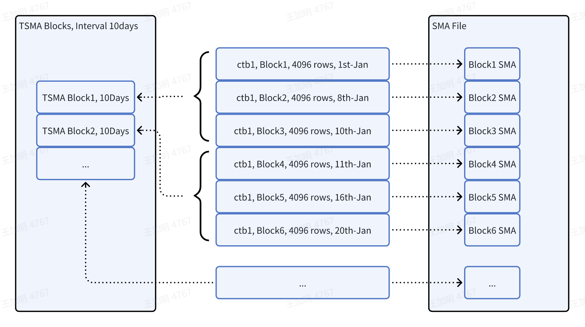
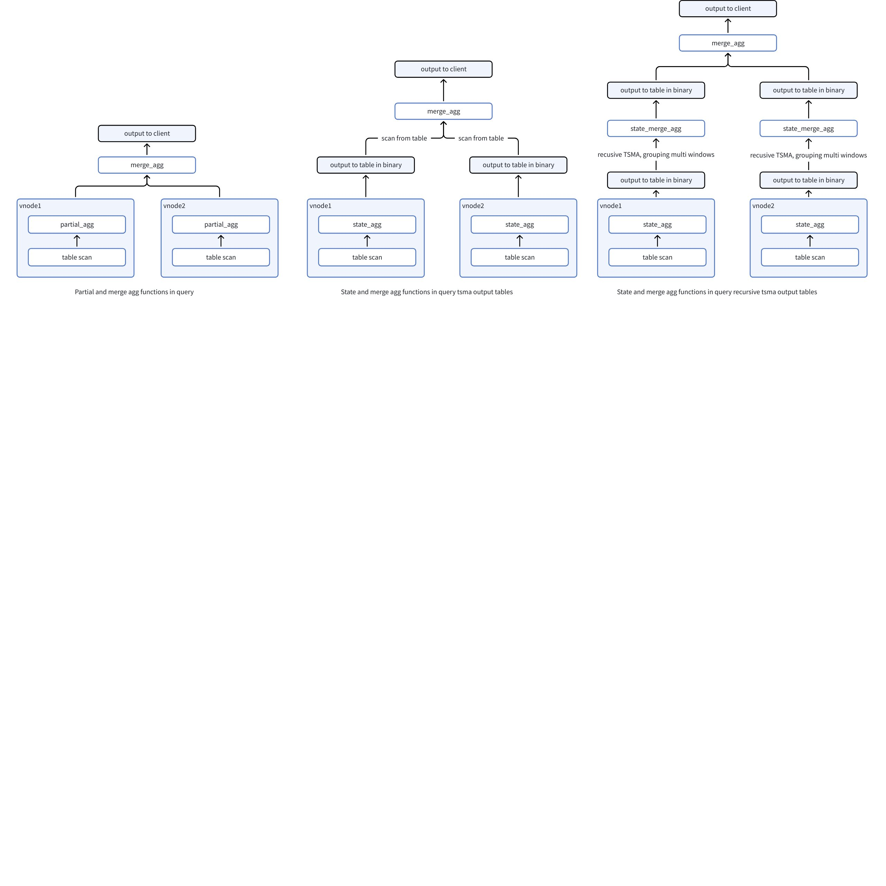
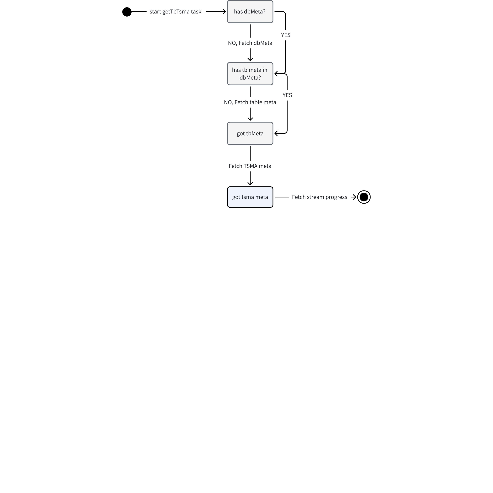
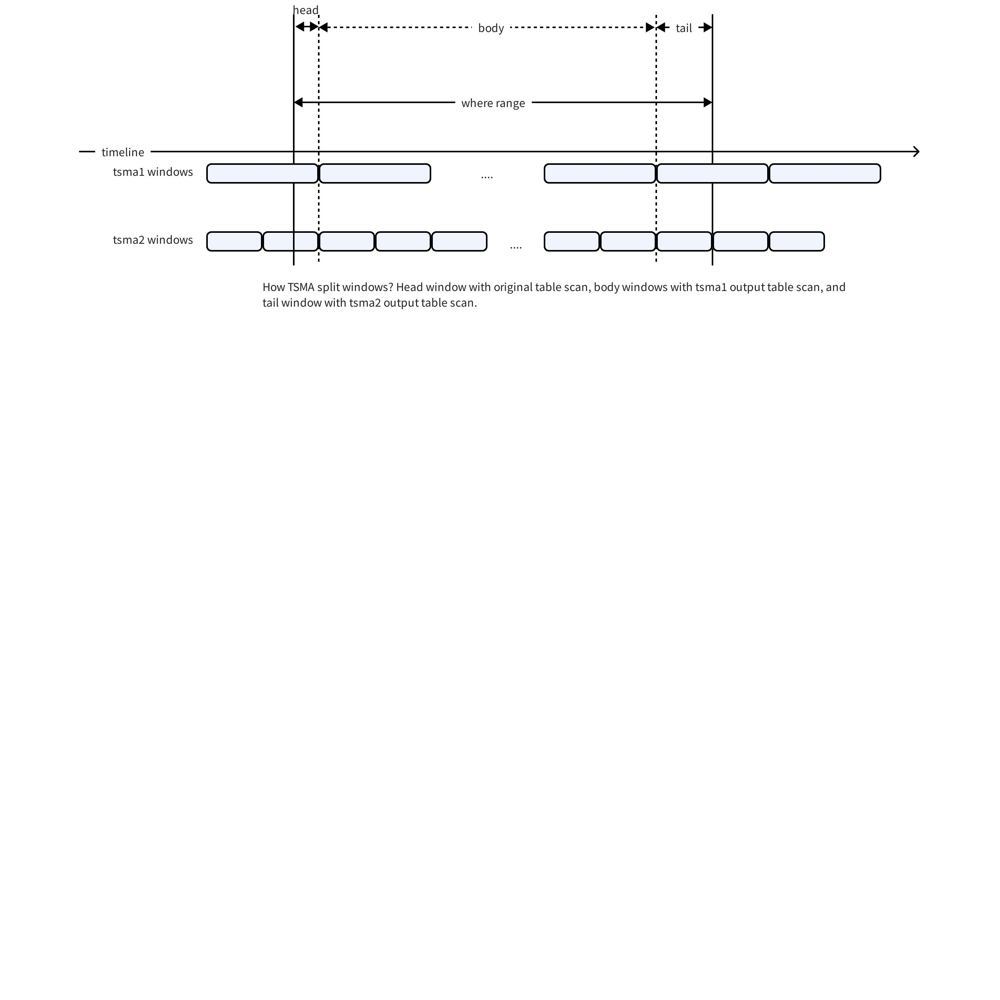
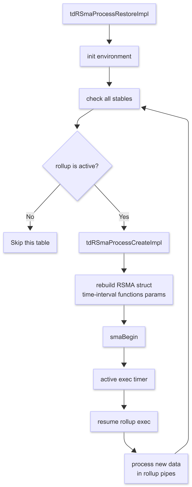

# 预聚集-Design Spec

## 1. 修订记录

| 编写日期 | 发布日期 | 版本 | 负责人 | 主要修改内容 |
| --- | --- | --- | --- | --- |
| 2024-01-10 | 2024-01-10 | 1.0 | 王加明、徐开礼 | 安可第一次送审 |
| 2026-01-05 | 2026-01-05 | 1.1 | 廖浩均 | 重构文档 |

## 2. 引言

### 2.1 目的

本文档旨在系统性地阐述TDengine预聚集模块的整体架构设计、核心实现原理与关键技术细节。编写本规格说明书有如下目的：
第一，通过详尽的功能与接口描述，验证预聚集模块的设计能够完全满足《预聚集 - Function Spec》中定义的所有功能性指标，包括但不限于：预聚集的创建、运行、查询中调用以及在高性能写入场景中性能要求等方面的内容。
第二，指导开发实践。为TDengine的开发团队、质量保证团队以及后续维护人员提供权威的技术参考。文档将深入解析从预聚集执行的全链路流程，确保开发工作有章可循。

### 2.2 范围

根据功能描述说明预聚集模块的整体设计和实现逻辑。系统如何处理创建删除预聚集请求, 如何进行数据计算并保存结果, 在查询时获取与查询相关的可用预聚集信息, 改写查询执行计划优化查询性能的相关技术细节内容。

### 2.3 受众

1. 核心开发与维护人员：文档的主要受众，需要依据文档进行编码、调试、性能优化和故障排查。
2. 架构师与产品经理：可通过本文档深入理解查询引擎的技术边界与能力范围，为产品规划与技术选型提供决策支持。
3. 技术爱好者与合作伙伴：对于希望深入了解TDengine内核原理、或计划进行二次开发的工程师，本文档提供了完整的入门指南与理论依据。

## 3. 术语

1. **SMA: **Small Materialized Aggregates, 即物化的聚集或者预聚集。包含了一个数据块的预聚集的结果，通常包含最小值、最大值、和、NULL值等信息。
2. **TSMA: **Time-range Small Materialized Aggregates, 即基于时间范围的预聚集。包含了按照时间段范围切分的数据的预聚集结果，也包含诸如最小值、最大值、和、NULL值信息。与 SMA 的区别是包含的数据是按照时间段划分，不是按照数据块为单位生成聚合结果。
3. **源数据表**: 是指创建TSMA时指定的需要计算的超级表或者普通表。
4. **输出表**: 是指TSMA计算的结果存储的表, 与源数据表相对应。
5. **管理节点（Mnode）**：TDengine 集群中负责监控和维护集群的运行状态，负责分布式事务管理、集群元数据（包括用户、数据库、超级表等）的管理，集群权限控制和安全控制的节点。
6. **虚拟节点（virtual node，Vnode）**：TDengine 系统中一种逻辑单元，若干个虚拟节点构成一个数据节点。每个虚拟节点包含缓存空间、磁盘空间、负责管理存储在该虚拟节点的时序数据、具备执行查询处理的消息队列和线程池。每个虚拟节点包含若干个表（子表）的数据。

## 4. 概述

#### 4.0.1 整体架构设计

1. 预聚集元数据模块
描述（超级）表的元数据信息集中存储在管理节点（Mnode）, 当查询优化器确定是否需要调用预聚集结果来优化查询性能的时候，需要首先获取与查询目标表相关的预聚集元数据信息。此时通过访问Mnode获取. 管理节点同时提供创建预聚集, 删除已经创建的预聚集信息, 获取信息的接口。在预聚集信息的接口中, 包括了根据表名获取该表所有相关的预聚集信息以及根据预聚集名字获取信息两种方式。
1. 预聚集生成及实时计算（更新）处理
预聚集 依托于流计算引擎提供的计算能力来生成， 在创建预聚集时会创建一个内部流计算任务, 根据用户指定的函数列表和计算窗口生成流计算的对应请求, 创建用于计算预聚集结果的流计算任务之后, 该任务会常驻后台自动计算。
流计算的历史数据任务和新写入数据计算任务是独立的, 在创建时, 首先获取当前最新数据的时间戳, 以此为分割线, 并行的处理历史数据计算和新写入数据计算。
针对目标（超级）表的流计算的结果会写入一个（包含若干子表的）超级表中, 超级表表名根据预聚集信息生成, 带固定后缀`_tsma_res_stb_`。 若`源数据表`是一张超级表, 那么其下的每张子表都会对应到`输出超级表`的一张子表。 这是为了在查询子表时也能够使用预聚集的计算结果， `输出子表`的名字同样是内部生成的一个 32位的md5字符串。
1. 预聚集查询调用
用户如果发起针对源表的时间创建聚合查询。`Catalog` 模块首先会从管理节点获取当前查询表的所有预聚集元信息, 除去预聚集元数据信息外, 还需要获取流计算的进度信息, 由于流计算信息存储在虚拟节点中, 因此此部分逻辑需要从虚拟节点中获取。在获取到信息之后, 会过滤掉那些历史数据还未计算完成的预聚集。
获取到可用的预聚集信息之后, 查询优化器将对查询计划进行改写, 简单来说就是将原本扫描`源数据表`的执行计划改写成扫描`输出表`的执行计划。

#### 4.0.2 依赖项

**流计算引擎**
预聚集功能强依赖流计算引擎, 创建预聚集时, 会创建对应的流计算, 删除预聚集时, 会一并删除所创建的流,  历史数据, 新写入数据, 过期数据写入, 删除数据等所需的计算都是由流计算完成的。

#### 4.0.3 与SMA的区别

SMA以数据块为单位生成, 即存储在数据文件（data file）中的每个数据块会对数值列生成几个函数的聚集结果, 存储下来, 行数一般为几千行, 而预聚集的粒度取决于用户指定的窗口大小, 可以是几千行, 也可以更多.
<reference-synced source-block-id="EYOAdckF1sE7jOb40accWxbCnne" source-document-id="M39zdynWQoEf7yxKzy0cp9KSnHg">

  

  
</reference-synced>

## 5. 设计考虑

#### 5.0.1 假设和限制

1. 流计算结果是有滞后性的, 预聚集的计算结果不保证实时性, 即刚写入的数据有可能不在使用预聚集查询的结果中包含, 若总是需要查询实时的数据, 那么预聚集不适用于此场景。
2. 由于流计算引擎和TSMA功能限制, 当前支持10个聚集函数(详见[TSMA 功能](https://taosdata.feishu.cn/wiki/WpVfwsKjeilOtckp3U2cIaz0nef))。
3. 流计算创建之后对原始表的DDL操作的限制也适用于TSMA功能, 如无法删除原始表(子表可以删除), 删列, 删tag, 修改tag值等。
4. 首先查询时只有聚集查询才能使用TSMA, 如group/partition by, interval查询等, 其次 由于TSMA计算的特性, 当查询中存在一些特殊条件时无法使用TSMA(详见[TSMA 功能](https://taosdata.feishu.cn/wiki/WpVfwsKjeilOtckp3U2cIaz0nef))。

#### 5.0.2 风险和缓解措施

1. 考虑到TSMA计算之后的查询效率, 并且创建窗口过小时将完全失去预聚集的优势, 因此屏蔽创建较小的时间窗口, 最小时间窗口为 1分钟。
2. 由于流计算任务有较高的机器负载, 因此除了集群内对流计算条数的创建限制之外, 对可创建的TSMA条数也有限制, 当前最大可配置个数位12。

## 6. 详细设计

### 6.1 语法及基本操作处理

客户端通过语法解析, 生成创建或者删除TSMA 请求, 发送给Mnode完成操作。
创建`tsma`的语句示例如下：
```sql {wrap}
CREATE TSMA tsma4 
ON test.meters 
FUNCTION(avg(c1), avg(c2), max(c1), max(c2), min(c1), min(c2)) 
INTERVAL(7m); 
```

创建`tsma`需要指定名称，源（超级）表、针对每个列上运行的聚合函数以及时间窗口长度，共四个信息。

#### 6.1.1 语法解析和检查

客户端（`libtaos.so`）接收创建/删除SQL语句之后。调用 SQL 层的解析器，分析输入的 SQL 语句，提取创建 `tsma` 的关键信息：例如函数列表, 列信息，聚合窗口, 源数据表名称等。在生成创建/删除请求之前, 还需要通过`Catalog`模块从`Mnode`获取与 `tsma`相关元数据信息, 如原始表的模式信息。
然后对创建的`TSMA`信息做基本检查, 包括窗口大小检查, 支持函数检查。 对不支持场景做出明确报错, 报错信息出指出原因，检查通过以后，构造创建 `tsma`的信息。

#### 6.1.2 请求消息构建

接下来开始创建TSMA Reques，建TSMA请求中主要包括TSMA的基本信息, 如名称, 源数据表, 输出超级表,窗口大小, 函数列表等。
若为删除请求，则只需要database名字和tsma名字.

#### 6.1.3 流计算subtable规则

TSMA需要自定义输出超级表及其子表的命名规则, 以便在查询优化时快速获取原始子表对应的输出子表。
规则为一个函数: `md5(concat('1.dbname.tsma_name_', ctb_name))`. 
md5生成的结果完全不可预测, 输出表按照内部hash方法具体分配到哪个vnode上是未知的, 并且完全有可能和原始子表不在一个vnode上。

#### 6.1.4 聚合函数重写

函数列表需要重写, 若使用原聚集函数如`avg`, 一个窗口在聚集函数计算出结果之后, 将无法与其他窗口再次聚集, 因为丢失了中间状态, 如`avg`函数的`sum`和`count`, 因此需要将这些函数都rewrite成其对应的`_state`函数, 使得流计算的结果中保存当前窗口的聚集中间状态, 以方便之后使用该中间结果再次做聚集. 之后进行函数列表整理, 排序去重。
`state`函数`state_merge`是TSMA特有的函数, 每个agg函数在支持TSMA功能时都需要实现这两个函数。
`state`函数作用和`partial`函数有点相似, 在单个vnode上执行时, 计算聚集函数的中间结果。 输出到TSMA输出子表中, 当查询时, 扫描中间结果, 之后调用`merge`函数, 得到聚集结果。
`state_merge`函数在使用Recursive TSMA时被使用, recursive TSMA需要将聚集的中间结果作为输入(二进制结果), 汇聚多个窗口之后输出到另一张表中(二进制结果)。
下图解释什么是`partial`, `merge`, `state`以及`state_merge`函数的意义。


TSMA所创建查询语句一定是一个`INTERVAL`查询, 窗口大小即对应用户指定的窗口, 除用户指定的函数之外, 另外添加了3列普通列: `_wstart`, `_wend`, `_wduration`。 并将原始子表的所有tag列和原始表名输出到`输出子表`中。 以方便对子表的tag/tbname过滤查询。 这些都是通过流计算的TAGS定义来实现的。 参见流计算。
TSMA所创建的查询语句一定是`PARTITION BY tbname`的, 因为需要保证每个子表的计算结果不能输出到一张子表中, 使得单独查询子表也可以使用TSMA优化。 由于流计算在输出所有tags时需要将所有tags也放在 `PARTITION BY`中, 因此实际上是`PARTITION BY tbname, tag1, tag...`。

#### 6.1.5 lastTs获取

由于流计算需要查询当前源数据表的 `lastTs`信息, 因此需要先从每个Vnode查询`lastTs`信息, 通过`prevQuery`实现。 将结果放在创建TSMA的请求中发送给`Mnode`。

### 6.2 TSMA DDL 处理

TSMA相关的DDL操作都是由管理节点负责, 创建删除,元数据获取等。

#### 6.2.1 创建 `tsma`

管理节点（Mnode）接收到`tsma`的创建请求之后, 开启`tsma`创建流程。
首先进行必要的检查, 包括：创建权限、是否重名、流是否已经存在等，检查通过后开始生成`SmaObj`, 并初始化相关字段, 创建建流请求。
管理节点中存储的TSMA对象包括以下信息。
```c
  typedef struct {
    char           name[TSDB_TABLE_FNAME_LEN];
    char           stb[TSDB_TABLE_FNAME_LEN];
    char           db[TSDB_DB_FNAME_LEN];
    char           dstTbName[TSDB_TABLE_FNAME_LEN];
    int64_t        createdTime;
    int64_t        uid;
    int64_t        stbUid;
    int64_t        dbUid;
    int64_t        dstTbUid;
    int8_t         intervalUnit;
    int8_t         slidingUnit;
    int8_t         timezone;  // int8_t is not enough, timezone is unit of second
    int32_t        dstVgId;   // for stream
    int64_t        interval;
    int64_t        offset;
    int64_t        sliding;
    int32_t        exprLen;  // strlen + 1
    int32_t        tagsFilterLen;
    int32_t        sqlLen;
    int32_t        astLen;
    int32_t        version;
    char*          expr;
    char*          tagsFilter;
    char*          sql;
    char*          ast;
    SSchemaWrapper schemaRow;  // for dstVgroup
    SSchemaWrapper schemaTag;  // for dstVgroup
    char           baseSmaName[TSDB_TABLE_FNAME_LEN];
  } SSmaObj;
```

TSMA创建以及流计算创建在一个事务中完成, 保证原子性, 若中途创建失败, 全部回滚。

#### 6.2.2 删除`tsma`

删除TSMA流程和创建类似, 开始时进行必要的检查, 如TSMA是否存在等。 之后创建删除事务, 将删除流计算和删除TSMA原子删除。

#### 6.2.3 元数据获取

管理节点还需要处理`Catalog`模块的Meta信息获取请求, 包括以下四个接口:
- 获取某张表下的所有TSMA：查询时, 需要获取当前查询表的所有的TSMA, 使用此接口。
- 通过名字获取TSMA：删除TSMA或者创建`RECRUSIVE TSMA`时需要获取某个TSMA的meta。
- 获取DB下所有TSMA：`SHOW db.tsmas`查询时使用此接口。
- TSMA meta校验：用于客户端heart beat请求校验TSMA meta的有效性。 若TSMA信息已无效则客户端会删除该meta, 重新从Mnode获取。

### 6.3 TSMA 元数据获取

对应管理节点提供的接口: 通过表名字获取TSMA以及通过TSMA名字获取, Catalog内需新增两个Task, `GetTbTSMATask`和`GetTSMATask`。 分别用于获取表下的所有TSMA和获取某个TSMA。 `CtgCache`中存储获取到TSMA信息。 主要数据结构是: 
```c
// 客户端存储的TSMA信息。
typedef struct {
    char     name[TSDB_TABLE_NAME_LEN];
    uint64_t tsmaId;
    char     targetTb[TSDB_TABLE_NAME_LEN];
    char     targetDbFName[TSDB_DB_FNAME_LEN];
    char     tb[TSDB_TABLE_NAME_LEN];
    char     dbFName[TSDB_DB_FNAME_LEN];
    uint64_t suid;
    uint64_t destTbUid;
    uint64_t dbId;
    int32_t  version;
    int64_t  interval;
    int8_t   unit;
    SArray*  pFuncs;     // SArray<STableTSMAFuncInfo>
    SArray*  pTags;      // SArray<SSchema>
    SArray*  pUsedCols;  // SArray<SSchema>
    char*    ast;

    int64_t streamUid;
    int64_t reqTs;
    int64_t rspTs;
    int64_t delayDuration;  // ms
    bool    fillHistoryFinished;
} STableTSMAInfo;

typedef struct SCtgTSMACache {
    SRWLatch tsmaLock;
    SArray* pTsmas; // SArray<STSMACache*>
    bool retryFetch;
} SCtgTSMACache;

typedef struct SCtgDBCache {
    ...
    SHashObj* stbCache;
    SHashObj* tsmaCache; // key:tbname, value: SCtgTSMACache
    ...
} SCtgDBCache;
```

#### 6.3.1 `GetTbTSMATask`

此Task在正常查询时执行, 使用查询中所引用的表, Catalog首先会从CtgCache中查找, 若不存在则从管理节点获取. 若当前查询的是子表, 那么需要先获取其超级表名, 然后再从超级表名获取TSMA信息(TSMA只能建在超级表或者普通表上), 当然如果Table Meta还没由缓存在`CtgCache`中, 则需要先获取表元数据（`Table Meta`）信息. 此Task对应6.2.3节的第一个接口。
根据当前CtgCache中存储的状态需要分别进行以下操作:


这里还需要区分超级表和普通表, 因为超级表meta是从管理节点获取的, 而普通表是从虚拟节点获取的。 `流计算进度`信息需要从虚拟节点获取, 这里需要在虚拟节点提供获取流进度的接口, 该接口的输入是`streamId`, 输出是: `历史数据是否计算完成`和`最新计算进度的时间延迟`(单位ms)。
若从Cache中查找到了TSMA, 当存在历史数据未计算结束或者自上次获取到该TSMA的meta到本次查找Cache的时间已经超过阈值时, 也会再次尝试获取TSMA meta, 以防止使用计算滞后的TSMA结果。

#### 6.3.2 `GetTSMATask`

`GetTSMATask`相对简单一些, 只需要先获取Table Meta, 然后获取TSMA Meta就可以了, 这里获取TSMA meta也只是某一个TSMA, 不需要获取所有TSMA, 对应6.2.3节的第二个接口。 

#### 6.3.3 Rent Management

TSMA rent与db rent, stb rent类似, 默认是10s, 当10s内TSMA信息未update, 则heart beat线程会发送请求到Mnode, 重新校验当前TSMA信息还有效, 若无效则客户端会尝试删除该meta, 重新获取。 对应6.2.3节的第四个接口。

### 6.4 使用 TSMA 优化查询

#### 6.4.1 场景

TSMA优化场景限定于INTERVAL 查询和Agg查询, 当查询表创建了TSMA时, 窗口查询中限定时间窗口查询支持优化, 状态窗口, 事件窗口等不支持。Agg查询中, 若group by中带有普通列时不支持, 仅限group by tbname, 或者tag列。
若查询中的聚集函数带有TSMA不支持的函数, 则不使用TSMA优化。
当客户端参数`querySmaOptimize`为1时, 才会尝试使用TSMA优化。
查询中可以使用hint来避免使用TSMA优化, `/*+ skip_tsma() */`。

#### 6.4.2 TSMA 过滤

- 过滤掉历史数据未计算完成或者流计算进度延迟过高的TSMA。
- 在窗口查询中, 若当前查询窗口的`INTERVAL`或者 `SLIDING`或者 `OFFSET`与创建TSMA时指定的窗口大小不兼容时, 此TSMA不可使用。
- 查询聚集函数检查, 若存在TSMA中未定义的聚集函数, 此TSMA不可用。
- 若当前查询中使用了创建TSMA时还未在表中创建的tag列, 此TSMA不可用。

#### 6.4.3 窗口拆分

窗口拆分是根据Where条件中的事件范围进行拆分, 将事件范围划分为3段, head, body和tail, 3部分的具体划分方式，取决于查询时间范围与所使用的TSMA的窗口之间的相对关系动态确定。
如果查询范围的开始时间或者结束时间正好与当前最大窗口大小的TSMA对齐, 那么就不需要head或者tail窗口, 直接使用当前最大窗口大小的TSMA查询。
当需要head或者tail窗口时, 需要从剩下的TSMA中查找是否和那些窗口稍小的TSMA对齐, 若可用则使用该TSMA, 若都不可用, 则head或tail尝试从原始数据扫描结果。


#### 6.4.4 计划重写

计划重写主要是对`Scan`和`Scan`之上的`Agg`/`Interval`重写。 直观上看, `Scan`需要重写成扫描TSMA输出表, 而不是原始表, 并且需要根据窗口拆分情况修改扫表时间范围, `Agg`/`Interval`需要重写聚集函数。
在窗口拆分时, head, body, tail 不一定都使用TSMA, 重写`Agg`/`Interval`只针对使用了TSMA的窗口部分。 

##### 6.4.4.1 Rewrite `Scan`

- 扫描TSMA输出表
需要将扫描原始表的列映射到扫描TSMA输出表中的列, 若原始查询中使用了tag列或者tbname伪列, 也需要重写, tag列重写成输出表的tag列, tbname列重写成输出表的tag列(创建TSMA时将原始子表的子表明输出到了名称为`tbname`的tag列中)。
修改Scan扫描的超级表和子表ID, 修改Scan的对应Vgroup 信息, 因为输出子表和原始子表完全有可能不在一个vnode上。
- 扫描原始表
若还是扫描原始表, 为了避免在group by tbname时使用子表uid作为group id, 这里需要将tbname重写成`concat('', tbname)`。 
为什么要避免使用 table uid? 由于计划会同时扫描原始表和TSMA输出表, 若使用table uid作为group id, 如`t1`的数据同时分布在原始表`t1`和`t1`对应的TSMA输出子表中, 而这两张表的uid是不同的, 会导致在计算时被分配到了不同的group id中, 导致结果错误。

##### 6.4.4.2 Rewrite `agg functions`

查询的Agg函数如`avg`需要重写成其对应的`Merge`函数: `avg_merge`。 其中的`group_key`函数若使用的是tag列或者tbname, 也需要重写成输出表中对应的tag列。

##### 6.4.4.3 计划生成

假设重写后计划包含了head, body, tail三部分, 此时需要`LogicalSubplan`, 在`planSpliter`时, 生成对应的subplan。
如在split Agg时, subplan分别是agg+扫描head, body, tail三部分, 上层生成一个Agg, 聚集下层三部分的结果。 Window查询中的Interval逻辑类似。

### 6.5 RSMA 执行与状态管理

RSMA (Roll-up SMA)需要定期处理时间序列数据的降采样聚合，但不能阻塞正常的数据写入。系统采用定时器触发机制来异步执行聚合任务，确保在合适的时机处理数据，同时避免影响实时写入性能。这种设计解决了高并发场景下数据聚合与写入的竞争问题。

#### 6.5.1 定时器管理

系统使用全局定时器句柄 `smaMgmt.tmrHandle`  来管理所有RSMA任务的调度。当需要触发聚合时，通过 `taosTmrReset()` 重置定时器，设置下次触发的时间间隔为 `pItem->maxDelay` 。

#### 6.5.2 状态验证机制

每次定时器触发时，系统会进行多重验证：
1. 检查RSMA引用是否存在于 `refHash` 中
2. 获取RSMA统计信息的引用
3. 验证触发状态是否为 `ACTIVE` 
只有当所有验证通过时，才会设置 `fetchLevel` 标志为1 ，标记该RSMA项需要在下一个处理周期中进行数据获取。

#### 6.5.3 状态机控制

RSMA采用状态机模式控制处理流程：
- `ACTIVE`：正常处理状态，允许执行聚合
- `PAUSED`：暂停状态，通常在commit期间设置
- `INACTIVE`：非活动状态，等待下次激活
这种设计确保了RSMA处理的可靠性和一致性，避免了数据丢失或重复处理的问题。

### 6.6 RSMA 恢复与执行

当TDengine的vnode重启时，所有内存中的RSMA（Roll-up  SMA）状态都会丢失。系统必须从持久化元数据中重建完整的RSMA处理环境，以确保持续的降采样操作。若没有正确的恢复，降采样任务将停止处理新数据，从而中断数据聚合流水线，这会增加存储成本并降低查询性能。
恢复过程从`tdRSmaProcessRestoreImpl()`开始，它首先初始化RSMA环境，然后为所有超级表恢复QTaskInfo。系统遍历vnode中的所有超级表，使用`metaReaderGetTableEntryByUidCache()`获取元数据。对于每个表，系统检查rollup标志以识别启用RSMA的表。
当发现启用了rollup的表时，系统调用`tdRSmaProcessCreateImpl()`，使用存储的参数（如时间间隔、聚合函数等）重建RSMA处理结构，从而重建降采样所需的内部数据结构。
最后，在正常操作启动期间，`smaBegin()`会将触发状态设置为激活，重新启用基于定时器的数据获取机制，驱动降采样聚合过程。恢复的RSMA随即恢复处理新提交的数据，维持连续的降采样流水线，确保无数据丢失或中断。



### 6.7 使用RSMA 查询

查询引擎发现该超级表启动了 RSMA， 自动切换到降采样后的数据上进行计算，该过程对用户透明。查询处理过程与查询原始时序数据完全一样。

## 7. 接口规范

对外除SQL外无接口定义。

## 8. 安全设计

构建完整有效的机制保护数据库`tsma`系统的机密性、完整性和可用性。
1. 访问控制与权限隔离
  `tsma`操作（如创建、重建、删除）具备独立的权限控制，仅授予必要的用户或角色，普通账户不能直接删除`tsma`的权限。
  基于角色的访问控制（RBAC）‌：将索引管理权限封装到管理角色，与数据读写角色分离。
  
1. 数据加密
  静态数据加密：对存储索引数据的文件或表空间进行加密，防止通过直接访问存储介质窃取索引结构。该部分功能依托于存储模块提供的安全机制，详细请参见《存储 - Requirement》 文档中内容。
  传输中加密：确保`tsma`相关的元数据查询、管理命令在客户端与数据库服务器之间的传输通道（如TLS/SSL）是加密。对于传输中加密，参见《通信 - Requirement》文档中的具体内容。
  
1. 审计与行为监控
  全量操作审计：记录所有`tsma`的创建、修改、删除操作，以及执行这些操作的用户、时间和上下文（如关联的SQL语句）。
  异常行为检测：监控异常`tsma`操作模式，例如短时间内大量删除`tsma`、在非业务高峰时段创建大型`tsma`等，并触发告警。

1. 备份
  将`tsma`定义（DDL语句）纳入数据库架构备份流程，确保灾难恢复时能重建一致的`tsma`。

## 9. 性能和可扩展性

1. 性能要求
在正确创建TSMA时, 查询效率高于不使用TSMA 1倍
1. 扩展性要求
无要求

## 10. 部署和配置

#### 10.0.1 部署流程

无特殊部署流程。

#### 10.0.2 配置管理

客户端配置`querySmaOptimize`默认值为0, 需要开启才会使用`TSMA`查询。
taosd配置参数`maxTsmaNum`, 配置当前集群内可以创建的`TSMA`个数, 范围`0-12`。
客户端参数`maxTsmaCalcDelay`, 单位 s， 用户可以接受的 `TSMA` 计算延迟， 若 TSMA 的计算进度与最新时间差距在此范围内， 则该 TSMA 将会被使用， 若超出该范围， 则不可用， 默认值： 600（10 分钟）， 最小值： 600（10 分钟）， 最大值： 86400（1 天）。

#### 10.0.3 版本控制

升级后若创建TSMA不可回退。

## 11. 监控和维护

1. 监控
可通过查看流状态跟踪TSMA计算进度, 首先通过`SHOW TSMAS`查看创建的TSMA, 使用结果中的流信息, 查看流进度。
通过`explain verbose true`查看查询计划是否使用了TSMA。 使用了TSMA时table scan为长度为32的md5结果串。
1. 日志记录和诊断
若在查询时发现一直无法使用TSMA, 则可开启客户端`qDebugFlag`, 查找`histroy finished`, 查看是否由于历史数据未计算完成导致的TSMA无法使用。 或者查看流状态, 是否都为Ready。

## 12. 参考资料

无
