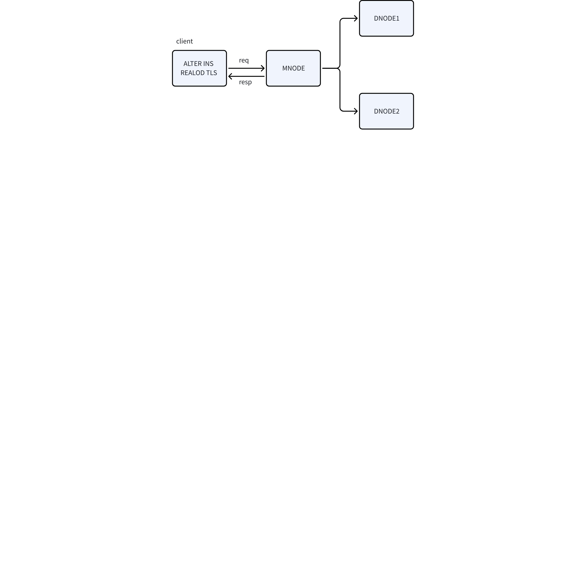
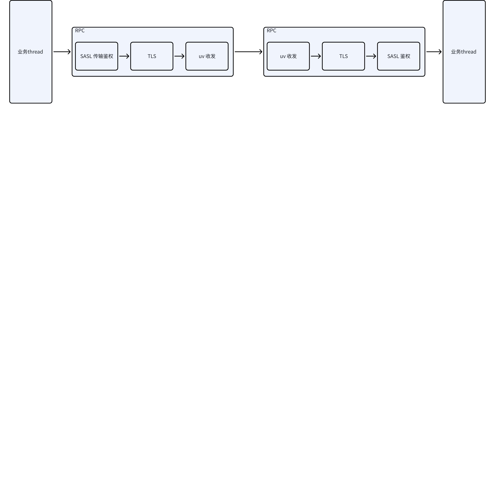
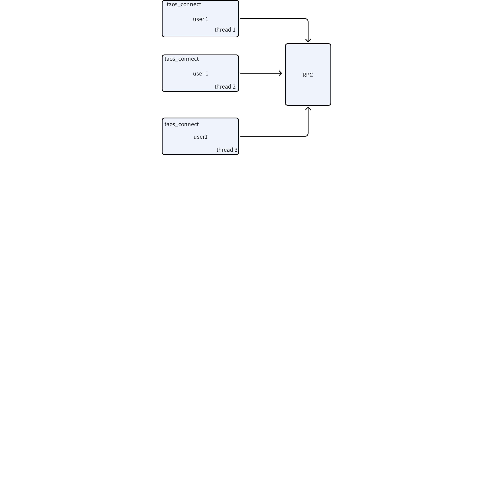
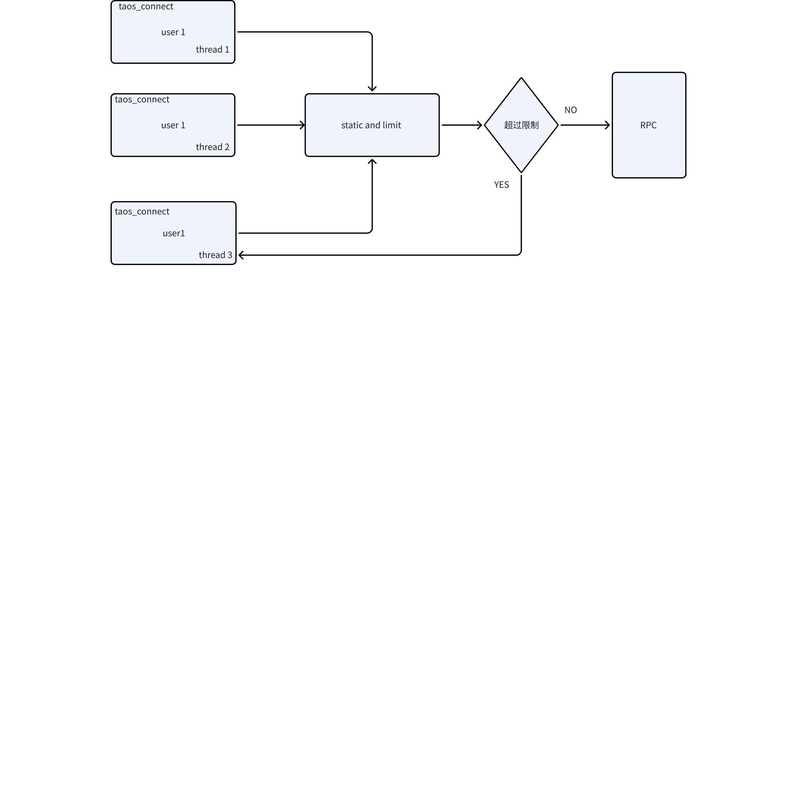
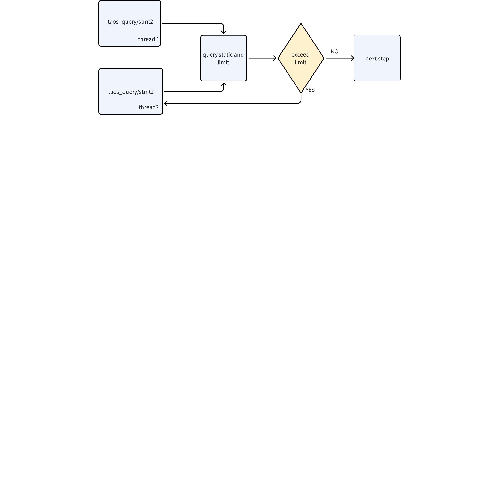

# 传输安全模块-Function Spec

## 1. 修订记录

| 编写日期 | 发布日期 | 版本 | 修订人 | 主要修改内容 |
| --- | --- | --- | --- | --- |
| 2025-10-29 | 2025-11-28 | 1.0 | 邓怡豪 | 新建 |
| 2025-12-08 | 2025-12-15 | 1.1 | 程洪泽 | 修订及完善内容 |

## 2. 背景

[TS-7229](https://jira.taosdata.com:18080/browse/TS-7229) 对重要数据的传输提出了新的要求，主要涉及
1. **白名单增强**：加强客户端 IP 地址和主机名的访问控制，支持 CIDR 表示法和通配符匹配
2. **登录用户 session 管理**：实现细粒度的会话控制，包括并发连接数、会话时长和空闲超时
3. **用 SASL 增强传输安全**：在 TLS 基础上增加 SASL 身份验证，提供更强的身份验证机制
4. **资源限制**：防止资源滥用，包括连接数、查询并发度和涉及节点数限制
5. **动态更新 TLS 证书**：支持不停机更新 TLS 证书，提高运维灵活性

## 3. 定义

### 3.1 Libsasl

**Libsasl**：Simple Authentication and Security Layer，简单认证和安全层。结合 TLS，通过验证机制（如 SCRAM-SHA-256）可以有效抵御中间人攻击、数据篡改、重放攻击等安全威胁。

### 3.2 关键术语

- **TLS**：Transport Layer Security，传输层安全协议
- **SASL**：Simple Authentication and Security Layer，简单认证和安全层
- **SCRAM**：Salted Challenge Response Authentication Mechanism，加盐挑战响应认证机制
- **Session**：用户通过`taos_connect`建立的数据库会话
- **Connection**：底层的 TCP/TLS 连接，一个Session 可能对应多个 Connection

## 4. 功能

### 4.1 防 SQL 注入

详细参考[防 SQL 注入 - FS](https://taosdata.feishu.cn/wiki/Kdl0wPYLKismFtk2AE7cklVnnJd)。

### 4.2 防溢出攻击

详细参考[taos/taosd 防止溢出攻击和拒绝服务FS ](https://taosdata.feishu.cn/wiki/Cgylw0WkFiCGgwky6tIccUiUnSc)。

### 4.3 动态更新 TLS 证书

#### 4.3.1 功能说明

在集群运行过程中，无需重启服务即可动态更新 TLS 证书。该功能适用于证书到期、证书泄露或安全策略变更等场景。

#### 4.3.2 SQL 

```sql
-- 重新加载TLS证书
ALTER DNODES RELOAD TLS;
```

#### 4.3.3 实现说明 

下图为动态更新 TLS 证书的流程：


1. **命令流程**：
  - 客户端发送 `ALTER INSTANCE RELOAD TLS` 命令到 mnode
  - mnode 进行基本验证（版本检查、权限验证等）
  - 验证通过后立即返回成功响应给客户端
  - mnode 通过 heartbeat 机制异步通知所有 dnode 更新证书
1. **证书更新机制**：
  - 各dnode收到通知后，从预设目录加载新的证书文件
  - 新证书加载后，不会影响已建立的连接
  - 新连接将使用新证书进行TLS握手
  - 旧连接在关闭后重新建立时才会使用新证书
1. **回滚机制**：
  - 如果新证书加载失败，节点会继续使用旧证书
  - 系统会记录错误日志并告警

#### 4.3.4 其他限制

1. **版本要求**：仅企业版本支持
2. **前置条件**：实例必须已开启 enableTLS，否则命令直接报错
3. **证书准备**：更新前需手动在各个节点生成新证书，并放置在原有目录下（建议先备份原有证书）
4. **兼容性考虑**：更新证书后，已建立的连接不受影响，只有新建立的连接使用新证书
5. **无状态设计**：TSDB 本身不存储证书信息，完全依赖文件系统

### 4.4 传输层身份验证和加密服务

#### 4.4.1 功能说明

在TLS加密传输的基础上，增加 SASL 身份验证层，实现双重安全保障：
1. **传输加密**：TLS 保证数据传输的机密性和完整性
2. **身份验证**：SASL 验证客户端身份的真实性

#### 4.4.2 行为说明

1. **连接建立流程**：
<add-ons component-id="" component-type-id="blk_631fefbbae02400430b8f9f4" record="{"data":"sequenceDiagram\n    participant Client as 客户端\n    participant Server as 服务器\n    \n    Note over Client,Server: 阶段1: TCP连接建立\n    Client-\u003e\u003eServer: SYN\n    Server-\u003e\u003eClient: SYN-ACK\n    Client-\u003e\u003eServer: ACK\n    \n    Note over Client,Server: 阶段2: TLS握手\n    Client-\u003e\u003eServer: ClientHello (TLS版本、密码套件、随机数)\n    Server-\u003e\u003eClient: ServerHello (选择参数、随机数)\u003cbr/\u003eCertificate (服务器证书)\u003cbr/\u003eServerHelloDone\n    Client-\u003e\u003eServer: ClientKeyExchange (预主密钥)\u003cbr/\u003eChangeCipherSpec\u003cbr/\u003eFinished\n    Server-\u003e\u003eClient: ChangeCipherSpec\u003cbr/\u003eFinished\n    \n    Note over Client,Server: 阶段3: SASL身份验证\n    Client-\u003e\u003eServer: 认证请求 (用户名, 机制=SCRAM-SHA-256)\n    Server-\u003e\u003eClient: 挑战 (随机数, 盐值, 迭代次数)\n    Client-\u003e\u003eServer: 响应 (客户端证明)\n    Server-\u003e\u003eClient: 认证结果 (成功/失败)\n    \n    Note over Client,Server: 阶段4: 正常数据通信\n    Client-\u003e\u003eServer: 加密数据请求\n    Server-\u003e\u003eClient: 加密数据响应\n","theme":"default","view":"chart"}"/>

1. **SASL机制支持**：
   - **SCRAM-SHA-256**：推荐机制，支持盐值化和迭代哈希
   - **PLAIN**：简单明文机制，仅用于测试环境
   - 可扩展支持其他SASL机制
2. **身份验证流程**：
  - 客户端发送认证请求，包含用户名和认证机制
  - 服务器返回挑战（challenge），包含随机数和盐值
  - 客户端计算响应（response），包含哈希结果
  - 服务器验证响应，返回认证结果
1. **错误处理**：
  - 认证失败：连接立即关闭，记录安全日志
  - 机制不支持：返回支持的机制列表
  - 超时处理：默认 30 秒超时
  


### 4.5 资源限制 session 控制

#### 4.5.1 功能说明

为防止资源滥用和保证系统稳定性，对用户会话和查询操作进行细粒度限制：

| 序号 | 名称 | Cfg 名称 | 含义 | 取值 | 备注 |
| --- | --- | --- | --- | --- | --- |
| 1 | SESSION_PER_USER | sessionPerUser | 每个用户的最大并发会话数，限制单个用户同时建立的数据库连接数量，防止资源独占 | 默认 `32`，最小 `1`，`-1` 代表 `UNLIMITED` | 超过限制时，新连接返回错误码 0x0375 "Too many connections" |
| 2 | CONNECT_TIME | sessionConnectTime | 单次会话最大持续时间（分钟），超时后自动断开连接，避免长期空闲会话占用资源 | `480`分钟，最小 `1` 分钟，`-1` 代表 `UNLIMITED` | 超时后连接自动关闭，返回错误码 0x0376 "Connection timeout" |
| 3 | CONNECT_IDLE_TIME | sessionConnIdleTime | 会话最大空闲时间（分钟），连接无活动超过该时间后自动断开 | 默认 `30` 分钟，最小 `1` 分钟，`-1` 代表 `UNLIMITED` | 空闲超时后连接自动关闭 |
| 4 | CALL_PER_SESSION | sessionMaxConcurrency | 单会话最大并发子调用数量 | 默认 `10`，最小 `1`，`-1` 代表 `UNLIMITED` | 超过限制时，新查询排队等待或返回错误 |
| 5 | VNODE_PER_CALL | sessionMaxCallVnodeNum | 单次调用最大涉及 vnode 数量 | 默认 `10`，`-1` 代表 `UNLIMITED` | 此项为可选功能，开发过程中根据进度和实现难度决定是否实现 |

#### 4.5.2 行为说明

1. **连接层限制（参数**** ****1-3）**：
  - 限制对象：`taos_connect`接口建立的会话
  - 限制时机：连接建立时和连接存活期间
  - 新增接口：`taos_connect_is_alive(void *taos)`，用于检查连接状态
  - 状态检查：包括连接是否关闭、是否超时、是否空闲超时
1. **查询层限制（参数**** ****4-5）**：
  - 限制对象：`taos_query`等写入查询接口
  - 限制时机：查询执行前
  - 统计维度：按会话统计并发查询数，按查询统计涉及 vnode 数
1. **配置管理**：
  - 参数与 user 绑定，持久化到 mnode
  - 支持通过`ALTER USER`语句动态修改
  - 修改立即生效，不影响已建立的连接

#### 4.5.3 实现说明

##### 4.5.3.1 连接层限制实现

当前 taos-c-driver 中，同一个用户 use 如果多线程打开多个 taos_connect，内部实际上共享了同一个 RPC 实例   


加了限制之后，大概如下所示， 即加一个 static and limit 模块，如果超过以上限制则直接打开失败，CONNECT_TIME 和 CONNECT_IDLE_TIME 也基于该模块限制


##### 4.5.3.2 查询层限制实现

流程如下图所示，即在 query 和写入加一层统计和限制模块，如果超过配置，则直接返回失败，如果没有超过，则按之前的流程继续进行。 


#### 4.5.4 功能备注

 不涉及

### 4.6 白名单功能增强

 具体语法见[身份鉴别 FS](https://taosdata.feishu.cn/wiki/CXXqwV3Fai36rQkby6zcmBWwnMd)，传输层做具体的连接接入验证，即是否符合在白名单内，或者在黑名单内。

### 4.7 其他

  结合 JIRA: [[产品] 传输安全](https%3A%2F%2Fjira.taosdata.com%3A18080%2Fbrowse%2FTS-7229) 中的需求列表，剩余两个需求 
1. 数据包含数据大小限制。
2. 传输层做消息校验，防止恶意消息耗尽内存。
 这两个需求，传输层早已实现，不需要再额外考虑 

## 5. 性能

### 5.1 性能影响分析

传输安全引入的额外操作会带来一定性能开销，总体性能下降控制在 10% 以内：

| 操作类型 | 性能影响 | 优化措施 |
| --- | --- | --- |
| TLS 握手 | 3-5% | 会话复用、TLS False Start |
| SASL 认证 | 1-2% | 缓存认证结果、优化哈希计算 |
| 限制检查 | <1% | 高效数据结构、原子操作 |
| 消息校验 | <1% | 硬件加速CRC、批量校验 |
| 访问控制检查 | <1% | 前缀树匹配、缓存最近结果 |

### 5.2 性能测试场景

1. 基准测试：纯 TLS vs TLS+SASL 的性能对比
2. 压力测试：高并发连接下的资源限制表现
3. 长连接测试：长时间运行的连接稳定性
4. 证书更新测试：证书更新期间的性能表现

### 5.3 性能优化

1. 连接复用：支持 TLS 会话复用，减少握手开销
2. 批量处理：多个小消息合并传输，减少协议开销
3. 异步操作：证书更新、限制检查等异步执行
4. 缓存优化：频繁访问的数据结构缓存优化

## 6. 安全

 已在正文中描述

## 7. 兼容性

### 7.1 向后兼容

1. 协议兼容：支持旧版本客户端连接，自动降级到兼容模式
2. 配置兼容：旧版本配置自动迁移到新版本格式
3. 数据兼容：安全增强不影响已有数据访问

### 7.2 升级路径

1. 从 3.3.8 升级：无需手工干预，自动启用兼容模式
2. 逐步启用：支持按用户或按连接启用新功能
3. 回滚限制：一旦启用新安全功能，不能退回到完全旧版本模式

### 7.3 客户端兼容性

1. taos-c-driver：需要 3.3.8 及以上版本支持全部功能
2. JDBC/ODBC：相应版本支持
3. 第三方工具：通过兼容模式支持

## 8. 运维

### 8.1 日志管理

1. **安全日志**：
  - 认证失败详细日志（不含密码）
  - 证书更新操作日志
  - 访问控制拒绝日志
1. **审计日志**：
  - 关键安全配置变更
  - 用户权限变更
  - 系统安全状态变更

## 9. 约束和限制

### 9.1 功能限制

1. 企业版专属：所有传输安全增强功能仅企业版本支持
2. TLS依赖：动态更新证书功能需要先启用 TLS
3. 操作系统：依赖系统提供的 TLS 库和随机数生成器

### 9.2 性能限制

1. 硬件要求：TLS 加密需要一定的 CPU 资源
2. 内存占用：每个 TLS 连接需要额外的内存
3. 网络延迟：TLS 握手增加连接建立延迟

### 9.3 配置限制

1. 证书格式：仅支持 PEM 格式证书
2. 密钥长度：RSA 密钥至少 2048 位，ECC 密钥至少 256 位
3. 密码套件：仅支持安全密码套件

## 10. 常见错误和排查

### 10.1 错误代码和描述

| 错误码 | 错误描述 | 可能原因 | 解决方案 |
| --- | --- | --- | --- |
| 0x0375 | Too many connections | 用户并发连接数超过 SESSION_PER_USER 限制 | 1. 关闭不必要的连接 2. 增加 SESSION_PER_USER 配置值 3. 检查是否有连接泄漏 |
| 0x0376 | Connection timeout | 连接持续时间超过 CONNECT_TIME 限制 | 1. 重新建立连接 2. 增加 CONNECT_TIME 配置值 3. 优化长时间查询 |
| 0x0377 | Connection idle timeout | 连接空闲时间超过 CONNECT_IDLE_TIME 限制 | 1. 重新建立连接 2. 增加 CONNECT_IDLE_TIME 配置值 3. 定期发送心跳保持连接 |
| 0x0378 | Too many concurrent calls | 并发查询数超过 CALL_PER_SESSION 限制 | 1. 减少并发查询数 2. 增加 CALL_PER_SESSION 配置值 3. 使用连接池管理查询 |
| 0x0379 | Too many vnodes in call | 查询涉及 vnode 数超过 VNODE_PER_CALL 限制 | 1. 优化查询条件，减少涉及 vnode 数 2. 增加 VNODE_PER_CALL 配置值 3. 分批次执行查询 |
| 0x0380 | TLS handshake failed | TLS 握手失败 | 1. 检查证书有效性和格式 2. 验证证书信任链 3. 检查 TLS 版本和密码套件兼容性 |
| 0x0381 | SASL authentication failed | SASL 身份验证失败 | 1. 检查用户名和密码 2. 验证 SASL 机制支持 3. 检查认证服务器状态 |
| 0x0382 | Access denied by ACL | 访问控制拒绝连接 | 1. 检查客户端 IP/主机名是否在白名单 2. 检查是否在黑名单中 3. 更新访问控制列表 |
| 0x0383 | Certificate reload failed | 证书重新加载失败 | 1. 检查证书文件权限和路径 2. 验证证书格式和内容 3. 检查磁盘空间和 IO 状态 |

## 11. 可观测性

无

## 12. 安装和卸载

本功能随 TDengine TSDB 一同发布，安装卸载随 TDengine TSDB。

## 13. 版本要求

  仅企业版本支持支持以上功能

## 14. 文档

  需要更新官网文档

## 15. 参考文档

-  [传输安全 RS](https://taosdata.feishu.cn/wiki/ACKtwrzpbi4T62kXk79cC3Ixndb)
-   [传输安全](https://jira.taosdata.com:18080/browse/TS-7229)

## 16. 附录

无。
