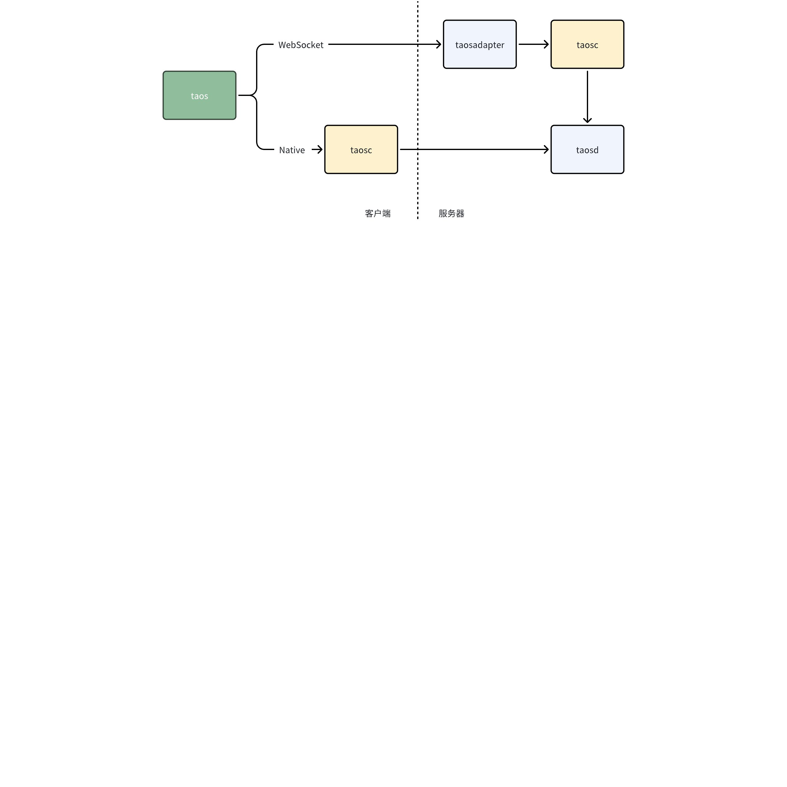
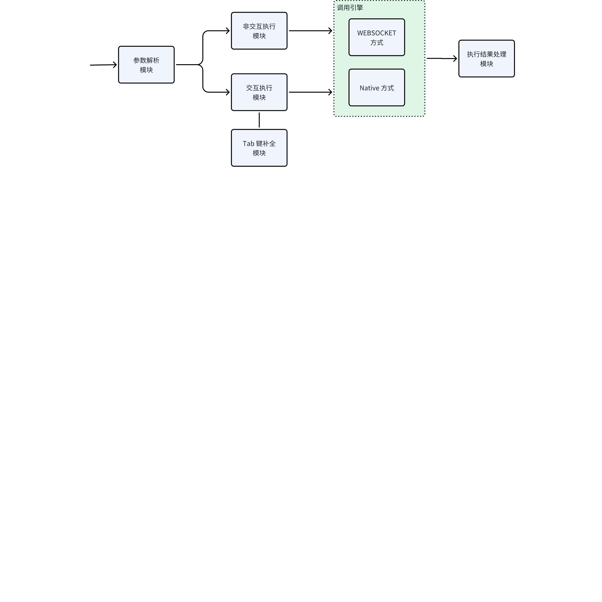
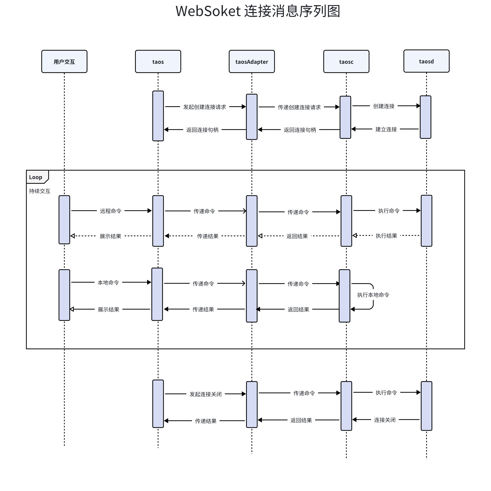
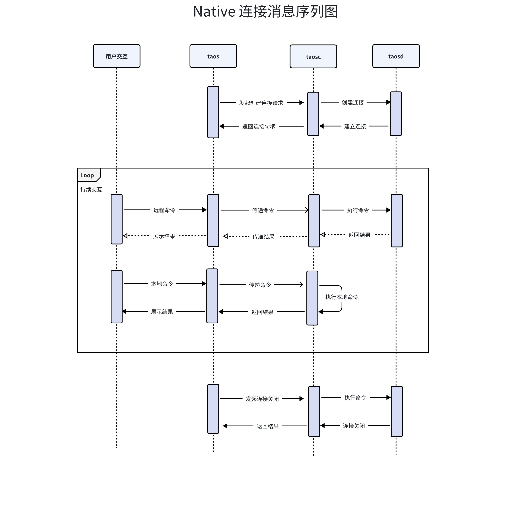

# 命令行工具-Design Spec

## 1. 修订记录

| 日期 | 版本 | 负责人 | 主要修改内容 |
| --- | --- | --- | --- |
| 2025/01/08 | 1.0 | 段宽军 | 第一次安可送测 |
| 2025/12/26 | 1.2 | 佘彦杰 | 重构 |

## 2. 引言

1. 目的： 为开发工作提供实施方案
2. 范围： 基于[taos-需求说明 - 段宽军](https://taosdata.feishu.cn/wiki/ObtNwW3vvivshWkb85GckmtHnHf) 确定需求范围设计
3. 受众：开发、设计、运维

## 3. 术语

定义本文档中使用的术语和概念

## 4. 概述

1. 整体架构：



1. 技术及框架
   - 开发语言： C 语言
   - 线程管理： POSIX Threads
   - 参数管理： GNU C Libaray 中 argp (https://www.gnu.org/software/libc)
   - json 格式解析器:  cJson (https://github.com/DaveGamble/cJSON)
   - WebSocket 框架：WebSocket（github.com/gorilla/websocket）
   - TAB 键补全：使用 Tired 树（又称字典树或前缀树）
2. 依赖项:
   - TDengine Native 客户端动态库（libtaos.so）
   - TDengine WebSocket 连接器（libtaosws.so）
   - TDengine taosAdapter 
   - TDengine taosd 

## 5. 设计考虑 {folded="true"}

1. 假设和限制
  - 假设
    - 用户数据规模大部分在正常范围内
    - 大部分使用者对数据库产品及工具有一些使用经验
    - 大部分使用者习惯使用命令行参数
    - 大部分情况下网络环境稳定
  - 限制
    - TDengine 3.0 及以上版本
    - TAB 键补全表名会限定表最大数量
1. 设计模式和原则
  模式：
  - 单例模式
  - 构建器模式
  - 工厂方法
  原则：
  - 简单性原则：力求软件结构简单，避免不必要的复杂化
  - 灵活性和适应性原则：所设计的系统应具有对外界环境条件变化的适应性，保证软件良好的生存力
  - 模块化原则：将软件划分为独立的模块，每个模块完成特定的功能，模块之间的耦合度最小化，便于软件的开发、维护和扩展
1. 风险和缓解措施
  - 风险一：
    - 风险内容：用户在交互操作期间和服务器连接被断开
    - 缓解措施：执行命令前检查连接状态，断开情况下尝试重新连接
  - 风险二
    - 风险内容：用户数据库子表名数量巨大，缓存子表占用巨量内存
    - 缓解措施：限定 TAB 键补全的子表名数量，超过忽略

## 6. 详细设计

### 6.1 组件设计

- 组件整体图


- WebSocket 连接消息序列图


- Native 连接消息序列图


### 6.2 关键数据结构

#### 6.2.1 参数解析模块

- 参数值存储结构
```c

typedef struct {
  const char* host;
  const char* user;
  const char* auth;
  const char* database;
  const char* cfgdir;
  const char* commands;
  const char* netrole;
  char        file[PATH_MAX];
  char        password[TSDB_USER_PASSWORD_LONGLEN];
  bool        is_gen_auth;
  bool        is_bi_mode;
  bool        is_raw_time;
  bool        is_version;
  bool        is_dump_config;
  bool        is_check;
  bool        is_startup;
  bool        is_help;
  int32_t     port;
  int32_t     pktLen;
  int32_t     pktNum;
  int32_t     displayWidth;
  int32_t     abort;
  char*       dsn;
  int32_t     timeout;
  int8_t      connMode;
  bool        port_inputted;
} SShellArgs;
```

- 支持命令行参数存储结构
```c

static struct argp_option shellOptions[] = {
    {"host", 'h', "HOST", 0, SHELL_HOST},
    {"port", 'P', "PORT", 0, SHELL_PORT},
    {"user", 'u', "USER", 0, SHELL_USER},
    {0, 'p', 0, 0, SHELL_PASSWORD},
    {"auth", 'a', "AUTH", 0, SHELL_AUTH},
    {"generate-auth", 'A', 0, 0, SHELL_GEN_AUTH},
    {"config-dir", 'c', "DIR", 0, SHELL_CFG_DIR},
    {"dump-config", 'C', 0, 0, SHELL_DMP_CFG},
    {"commands", 's', "COMMANDS", 0, SHELL_CMD},
    {"raw-time", 'r', 0, 0, SHELL_RAW_TIME},
    {"file", 'f', "FILE", 0, SHELL_FILE},
    {"database", 'd', "DATABASE", 0, SHELL_DB},
    {"check", 'k', 0, 0, SHELL_CHECK},
    {"startup", 't', 0, 0, SHELL_STARTUP},
    {"display-width", 'w', "WIDTH", 0, SHELL_WIDTH},
    {"netrole", 'n', "NETROLE", 0, SHELL_NET_ROLE},
    {"pktlen", 'l', "PKTLEN", 0, SHELL_PKT_LEN},
    {"cloud-dsn", 'E', "DSN", 0, OLD_DSN_DESC},
    {"timeout", 'T', "SECONDS", 0, SHELL_TIMEOUT},
    {"pktnum", 'N', "PKTNUM", 0, SHELL_PKT_NUM},
    {"bimode", 'B', 0, 0, SHELL_BI_MODE},
    {"log-output", 'o', "OUTPUT", 0, SHELL_LOG_OUTPUT},
    {"dsn", 'X', "DSN", 0, DSN_DESC},
    {DRIVER_OPT, 'Z', "DRIVER", 0, DRIVER_DESC},
    {0},
};
```

#### 6.2.2 交互执行模块

- 交互操作屏幕显示
```c
typedef struct {
  char    *buffer;
  char    *command;
  uint32_t commandSize;
  uint32_t bufferSize;
  uint32_t cursorOffset;
  uint32_t screenOffset;
  uint32_t endOffset;
} SShellCmd;
```

- 翻看历史记录
```c
typedef struct {
  char*   hist[SHELL_MAX_HISTORY_SIZE];
  char    file[TSDB_FILENAME_LEN];
  int32_t hstart;
  int32_t hend;
} SShellHistory;
```

#### 6.2.3 Tab 键补全模块

- 字典树存储
```c
// Tire
typedef struct STire {
  char      type;  // see define TIRE_
  STireNode root;

  StrName* head;
  StrName* tail;

  int count;  // all count
  int ref;
} STire;

// Tire Node
typedef struct STireNode {
  struct STireNode** d;
  bool               end;  // record end flag
} STireNode;

// STire Smart Pointer
typedef struct SAutoPtr {
  STire* p;
  int    ref;
} SAutoPtr;
```

- 关键词匹配存储结构
```c
// Word
typedef struct SWord {
  int           type;  // word type , see WT_ define
  char*         word;
  int32_t       len;
  struct SWord* next;
  bool          free;  // if true need free
  bool          end;   // if true is last keyword
} SWord;

// SWords (single linked list)
typedef struct {
  char*   source;
  int32_t source_len;  // valid data length in source
  int32_t count;
  SWord*  head;
  // matched information
  int32_t matchIndex;  // matched word index in words
  int32_t matchLen;    // matched length at matched word
} SWords;
```

- 匹配实现支持结构
```c
// Match
typedef struct SMatch {
  SMatchNode* head;
  SMatchNode* tail;  // append node to tail
  int         count;
  char        pre[MAX_WORD_LEN];
} SMatch;

// Match Node
typedef struct SMatchNode {
  char*              word;
  struct SMatchNode* next;
} SMatchNode;
```

- 支持匹配具体函数定义
```c

char* functions[] = {
    "count(",         "sum(",
    "avg(",           "last(",
    "last_row(",      "top(",
    "interp(",        "max(",
    "min(",           "now()",
    "today()",        "percentile(",
    "tail(",          "pow(",
    "abs(",           "atan(",
    "acos(",          "asin(",
    "apercentile(",   "bottom(",
    "cast(",          "ceil(",
    "char_length(",   "cos(",
    "concat(",        "concat_ws(",
    "csum(",          "diff(",
    "derivative(",    "elapsed(",
    "first(",         "floor(",
    "hyperloglog(",   "histogram(",
    "irate(",         "leastsquares(",
    "length(",        "log(",
    "lower(",         "ltrim(",
    "mavg(",          "mode(",
    "tan(",           "round(",
    "rtrim(",         "sample(",
    "sin(",           "spread(",
    "substr(",        "statecount(",
    "stateduration(", "stddev(",
    "sqrt(",          "timediff(",
    "timezone(",      "timetruncate(",
    "twa(",           "to_unixtimestamp(",
    "unique(",        "upper(",
    "pi(",            "round(",
    "truncate(",      "exp(",
    "ln(",            "mod(",
    "rand(",          "sign(",
    "degrees(",       "radians(",
    "greatest(",      "least(",
    "char_length(",   "char(",
    "ascii(",         "position(",
    "trim(",           "replace(",
    "repeat(",         "substring(",
    "substring_index(","timediff(",
    "week(",           "weekday(",
    "weekofyear(",     "dayofweek(",
    "stddev_pop(",     "var_pop(",
    "forecast(",       "imputation(",
    "std(",            "variance(",
    "stddev_samp(",    "var_samp(",
    "group_concat(",   "if(",
    "ifnull(",         "nvl(",
    "nvl2(",           "isnull(",
    "isnotnull(",      "coalesce(",
    "date(",           "corr(",
    "cols(",           "find_in_set(",
    "like_in_set(",    "regexp_in_set(",
    "case ",           "when "
};

```

- 支持匹配 SQL 关键词具体定义
```c
char* keywords[] = {
    "where ",       "and ",      "asc ",      "desc ",    "from ",         "fill(",     "limit ",
    "interval(",    "order by ", "order by ", "offset ",  "or ",           "group by ", "now()",
    "session(",     "sliding ",  "slimit ",   "soffset ", "state_window(", "today() ",  "union all select ",
    "partition by ", "match",    "nmatch ",    "between ",  "like ",           "is null ",   "is not null ",
    "event_window ",  "count_window(", "anomaly_window("
};
```

- 支持匹配的模型具体定义
```c

SWords shellCommands[] = {
    {"alter database <db_name> <alter_db_options> <anyword> <alter_db_options> <anyword> <alter_db_options> <anyword> "
     "<alter_db_options> <anyword> <alter_db_options> <anyword> ;",
     0, 0, NULL},
    {"alter dnode <dnode_id> \"resetlog\";", 0, 0, NULL},
    {"alter dnode <dnode_id> \"debugFlag\" \"141\";", 0, 0, NULL},
    {"alter dnode <dnode_id> \"monitor\" \"0\";", 0, 0, NULL},
    {"alter dnode <dnode_id> \"monitor\" \"1\";", 0, 0, NULL},
    {"alter dnode <dnode_id> \"asynclog\" \"0\";", 0, 0, NULL},
    {"alter dnode <dnode_id> \"asynclog\" \"1\";", 0, 0, NULL},
    {"alter all dnodes \"resetlog\";", 0, 0, NULL},
    {"alter all dnodes \"debugFlag\" \"141\";", 0, 0, NULL},
    {"alter all dnodes \"monitor\" \"0\";", 0, 0, NULL},
    {"alter all dnodes \"monitor\" \"1\";", 0, 0, NULL},
    {"alter table <tb_name> <tb_actions> <anyword> ;", 0, 0, NULL},
    {"alter local \"resetlog\";", 0, 0, NULL},
    {"alter local \"DebugFlag\" \"143\";", 0, 0, NULL},
    {"alter local \"cDebugFlag\" \"143\";", 0, 0, NULL},
    {"alter local \"uDebugFlag\" \"143\";", 0, 0, NULL},
    {"alter local \"rpcDebugFlag\" \"143\";", 0, 0, NULL},
    {"alter local \"tmrDebugFlag\" \"143\";", 0, 0, NULL},
    {"alter local \"asynclog\" \"0\";", 0, 0, NULL},
    {"alter local \"asynclog\" \"1\";", 0, 0, NULL},
    {"alter topic", 0, 0, NULL},
    {"alter user <user_name> <user_actions> <anyword> ;", 0, 0, NULL},
#ifdef TD_ENTERPRISE
    {"balance vgroup ;", 0, 0, NULL},
    {"balance vgroup leader on <vgroup_id>", 0, 0, NULL},
#endif

    // 20
    {"create table <anyword> using <stb_name> tags(", 0, 0, NULL},
    {"create vtable <anyword> using <stb_name> tags(", 0, 0, NULL},
    {"create database <anyword> <db_options> <anyword> <db_options> <anyword> <db_options> <anyword> <db_options> "
     "<anyword> <db_options> <anyword> <db_options> <anyword> <db_options> <anyword> <db_options> <anyword> "
     "<db_options> <anyword> <db_options> <anyword> ;", 0, 0, NULL},
    {"create dnode <anyword>", 0, 0, NULL},
    {"create index <anyword> on <stb_name> ()", 0, 0, NULL},
    {"create mnode on dnode <dnode_id>;", 0, 0, NULL},
    {"create qnode on dnode <dnode_id>;", 0, 0, NULL},
    {"create bnode on dnode <dnode_id>;", 0, 0, NULL},
    {"create anode <anyword>", 0, 0, NULL},
    {"create stream <anyword> into <anyword> as select", 0, 0, NULL},  // 26 append sub sql
    {"create topic <anyword> as select", 0, 0, NULL},                  // 27 append sub sql
    {"create rsma <anyword> on <all_table> function interval <anyword>", 0, 0, NULL},
    {"create tsma <anyword> on <all_table> function", 0, 0, NULL},
    {"create recursive tsma <anyword> on <tsma_name> interval(", 0, 0, NULL},
    {"create function <anyword> as <anyword> outputtype <data_types> language <udf_language>;", 0, 0, NULL},
    {"create or replace <anyword> as <anyword> outputtype <data_types> language <udf_language>;", 0, 0, NULL},
    {"create aggregate function  <anyword> as <anyword> outputtype <data_types> bufsize <anyword> language <udf_language>;", 0, 0, NULL},
    {"create or replace aggregate function  <anyword> as <anyword> outputtype <data_types> bufsize <anyword> language <udf_language>;", 0, 0, NULL},
    {"create user <anyword> pass <anyword> createdb 1;", 0, 0, NULL},
    {"create user <anyword> pass <anyword> createdb 0;", 0, 0, NULL},
    {"create user <anyword> pass <anyword> sysinfo 1;", 0, 0, NULL},
    {"create user <anyword> pass <anyword> sysinfo 0;", 0, 0, NULL},
#ifdef TD_ENTERPRISE    
    {"create view <anyword> as select", 0, 0, NULL},
    {"compact database <db_name>", 0, 0, NULL},
    {"compact vgroups in( <anyword>", 0, 0, NULL},
    {"create mount <mount_name> on dnode <dnode_id> from <path>;", 0, 0, NULL},
#endif
    {"scan database <db_name>", 0, 0, NULL},
    {"desc <all_table>;", 0, 0, NULL},
    {"describe <all_table>;", 0, 0, NULL},
    {"delete from <all_table> where ", 0, 0, NULL},
    {"drop database <db_name>;", 0, 0, NULL},
    {"drop index <anyword>;", 0, 0, NULL},
    {"drop table <all_table>;", 0, 0, NULL},
    {"drop dnode <dnode_id>;", 0, 0, NULL},
    {"drop mnode on dnode <dnode_id>;", 0, 0, NULL},
    {"drop qnode on dnode <dnode_id>;", 0, 0, NULL},
    {"drop bnode on dnode <dnode_id>;", 0, 0, NULL},
    {"drop anode <anode_id>;", 0, 0, NULL},
    {"drop user <user_name>;", 0, 0, NULL},
    // 40
    {"drop function <udf_name>;", 0, 0, NULL},
    {"drop consumer group <anyword> on ", 0, 0, NULL},
    {"drop topic <topic_name>;", 0, 0, NULL},
    {"drop stream <stream_name>;", 0, 0, NULL},
    {"drop tsma <tsma_name>;", 0, 0, NULL},
    {"drop rsma <rsma_name>;", 0, 0, NULL},
    {"explain select ", 0, 0, NULL},  // 44 append sub sql
    {"flush database <db_name>;", 0, 0, NULL},
    {"help;", 0, 0, NULL},
    {"grant all on <anyword> to <user_name>;", 0, 0, NULL},
    {"grant read on <anyword> to <user_name>;", 0, 0, NULL},
    {"grant write on <anyword> to <user_name>;", 0, 0, NULL},
    {"kill connection <anyword>;", 0, 0, NULL},
    {"kill retention ", 0, 0, NULL},
    {"kill query ", 0, 0, NULL},
    {"kill transaction ", 0, 0, NULL},
#ifdef TD_ENTERPRISE
    {"merge vgroup <vgroup_id> <vgroup_id>;", 0, 0, NULL},
    {"drop mount <mount_name>;", 0, 0, NULL},
#endif
    {"pause stream <stream_name>;", 0, 0, NULL},
#ifdef TD_ENTERPRISE
    {"redistribute vgroup <vgroup_id> dnode <dnode_id>;", 0, 0, NULL},
#endif
    {"resume stream <stream_name>;", 0, 0, NULL},
    {"reset query cache;", 0, 0, NULL},
    {"restore dnode <dnode_id>;", 0, 0, NULL},
    {"restore vnode on dnode <dnode_id>;", 0, 0, NULL},
    {"restore mnode on dnode <dnode_id>;", 0, 0, NULL},
    {"restore qnode on dnode <dnode_id>;", 0, 0, NULL},
    {"revoke all on <anyword> from <user_name>;", 0, 0, NULL},
    {"revoke read on <anyword> from <user_name>;", 0, 0, NULL},
    {"revoke write on <anyword> from <user_name>;", 0, 0, NULL},
    {"rollup database <db_name>;", 0, 0, NULL},
    {"rollup database <db_name> vgroups in( <anyword>", 0, 0, NULL},
    {"select * from <all_table>", 0, 0, NULL},
    {"select client_version();", 0, 0, NULL},
    // 60
    {"select current_user();", 0, 0, NULL},
    {"select database();", 0, 0, NULL},
    {"select server_version();", 0, 0, NULL},
    {"select server_status();", 0, 0, NULL},
    {"select now();", 0, 0, NULL},
    {"select today();", 0, 0, NULL},
    {"select timezone();", 0, 0, NULL},
    {"set max_binary_display_width ", 0, 0, NULL},
    {"show apps;", 0, 0, NULL},
    {"show alive;", 0, 0, NULL},
    {"show anodes;", 0, 0, NULL},
    {"show anodes full;", 0, 0, NULL},
    {"show create database <db_name> \\G;", 0, 0, NULL},
    {"show create stable <stb_name> \\G;", 0, 0, NULL},
    {"show create table <tb_name> \\G;", 0, 0, NULL},
#ifdef TD_ENTERPRISE    
    {"show create view <all_table> \\G;", 0, 0, NULL},
    {"show compact", 0, 0, NULL},
    {"show compacts;", 0, 0, NULL},
    {"show ssmigrates;", 0, 0, NULL},

#endif
    {"show connections;", 0, 0, NULL},
    {"show cluster;", 0, 0, NULL},
    {"show cluster alive;", 0, 0, NULL},
    {"show cluster machines;", 0, 0, NULL},
    {"show databases;", 0, 0, NULL},
    {"show dnodes;", 0, 0, NULL},
    {"show dnode <dnode_id> variables;", 0, 0, NULL},
    {"show disk_info;", 0, 0, NULL},
    {"show functions;", 0, 0, NULL},
    {"show licences;", 0, 0, NULL},
    {"show mnodes;", 0, 0, NULL},
    {"show queries;", 0, 0, NULL},
    // 80
    {"show query <anyword> ;", 0, 0, NULL},
    {"show qnodes;", 0, 0, NULL},
    {"show bnodes;", 0, 0, NULL},
    {"show retentions;", 0, 0, NULL},
    {"show retention <retention_id>;", 0, 0, NULL},
    {"show scans;", 0, 0, NULL},
    {"show scan <scan_id>;", 0, 0, NULL},
    {"show stables;", 0, 0, NULL},
    {"show stables like ", 0, 0, NULL},
    {"show streams;", 0, 0, NULL},
    {"show scores;", 0, 0, NULL},
    {"show snodes;", 0, 0, NULL},
    {"show subscriptions;", 0, 0, NULL},
    {"show tables;", 0, 0, NULL},
    {"show tables like", 0, 0, NULL},
    {"show table distributed <all_table>;", 0, 0, NULL},
    {"show tags from <tb_name>;", 0, 0, NULL},
    {"show table tags from <all_table>;", 0, 0, NULL},
    {"show topics;", 0, 0, NULL},
    {"show transactions;", 0, 0, NULL},
    {"show tsmas;", 0, 0, NULL},
    {"show rsmas;", 0, 0, NULL},
    {"show users;", 0, 0, NULL},
    {"show variables;", 0, 0, NULL},
    {"show local variables;", 0, 0, NULL},
    {"show vnodes;", 0, 0, NULL},
    {"show vnodes on dnode <dnode_id>;", 0, 0, NULL},
    {"show vgroups;", 0, 0, NULL},
    {"show consumers;", 0, 0, NULL},
    {"show grants;", 0, 0, NULL},
    {"show grants full;", 0, 0, NULL},
    {"show grants logs;", 0, 0, NULL},
#ifdef TD_ENTERPRISE
    {"show views;", 0, 0, NULL},
    {"show arbgroups;", 0, 0, NULL},
    {"split vgroup <vgroup_id>;", 0, 0, NULL},
    {"ssmigrate database <db_name>;", 0, 0, NULL},
    {"show mounts;", 0, 0, NULL},
#endif
    {"insert into <tb_name> values(", 0, 0, NULL},
    {"insert into <tb_name> using <stb_name> tags(", 0, 0, NULL},
    {"insert into <tb_name> using <stb_name> <anyword> values(", 0, 0, NULL},
    {"insert into <tb_name> file ", 0, 0, NULL},
    {"trim database <db_name>;", 0, 0, NULL},
    {"use <db_name>;", 0, 0, NULL},
    {"update all anodes;", 0, 0, NULL},
    {"update anode <anyword>;", 0, 0, NULL},
    {"quit", 0, 0, NULL}};
```

#### 6.2.4 引擎调用模块

- 存储引擎连接相关数据结构
```c
typedef struct {
  SShellArgs      args;
  SShellHistory   history;
  SShellOsDetails info;
  TAOS*           conn;
  TdThread        pid;
  tsem_t          cancelSem;
  bool            exit;
} SShellObj;
```

#### 6.2.5 执行结果处理

- 执行结果获取相关变量存储关键结构
```c
typedef struct {
  const char *sql;
  bool        vertical;
  tsem_t      sem;
  int64_t     numOfRows;  // the num of this batch
  int64_t     numOfAllRows;

  int32_t     numFields;
  TAOS_FIELD *fields;
  int32_t     precision;

  int32_t maxColNameLen;            // for vertical print
  int32_t width[TSDB_MAX_COLUMNS];  // for horizontal print

  uint64_t resShowMaxNum;
} tsDumpInfo;
```

### 6.3 组件详细设计

#### 6.3.1 参数解析模块

- 设置 argp 框架解析参数
```c
// main use argp frame
shellParseArgsUseArgp(argc, argv);

// struct for argp
static struct argp shellArgp = {shellOptions, shellParseOpt, "", ""};

// arpg set 
static void shellParseArgsUseArgp(int argc, char *argv[]) {
  argp_program_version = shell.info.programVersion;
  argp_parse(&shellArgp, argc, argv, 0, 0, &shell.args);
}
```

- struct argp_option 结构用于定义支持的所有命令行参数
```c
static struct argp_option shellOptions[] = {
    {"host", 'h', "HOST", 0, SHELL_HOST},
    {"port", 'P', "PORT", 0, SHELL_PORT},
    ...
   }
```

- 在 shellParseSingleOpt 函数中处理响应命令行的行为
```c
static int32_t shellParseSingleOpt(int32_t key, char *arg);
```

#### 6.3.2 非交互执行模块

- 检测是否是为非交互模式
```c
bool runOnce = pArgs->commands != NULL || pArgs->file[0] != 0;
```

- 是非交互模式，执行完命令返回，不进入交互模式
```c
  if (runOnce) {
    if (pArgs->commands != NULL) {
      printf("%s%s\r\n", shell.info.promptHeader, pArgs->commands);
      char *cmd = taosStrdup(pArgs->commands);
      shellRunCommand(cmd, true);
      taosMemoryFree(cmd);
    }

    if (pArgs->file[0] != 0) {
      shellSourceFile(pArgs->file);
    }

    taos_close(shell.conn);

    shellWriteHistory();
    shellCleanupHistory();
    return 0;
  }
```

#### 6.3.3 交互执行模块

- 初始化 TAB 键补全功能
```c
// init shell auto function , shell start call once
bool shellAutoInit();
```

- While 循环中启动另一线程处理界面输入及执行 SQL, 当执行 SQL 卡死后方便 KILL 重新启动新界面
```c
  while (1) {
    taosThreadCreate(&shell.pid, NULL, shellThreadLoop, NULL);
    taosThreadJoin(shell.pid, NULL);
    taosThreadClear(&shell.pid);
    if (shell.exit) {
      tsem_post(&shell.cancelSem);
      break;
    }
  }
```

- 界面输入线程循环执行用户输入 SQL 命令
```c
void *shellThreadLoop(void *arg) {
  ...
  do {
    //1 prepare
    char *command = taosMemoryMalloc(SHELL_MAX_COMMAND_SIZE);
    if (command == NULL) {
      printf("failed to malloc command\r\n");
      break;
    }

    do {
      memset(command, 0, SHELL_MAX_COMMAND_SIZE);
      ...

      //2 read sql 
      if (shellReadCommand(command) != 0) {
        break;
      }

      ...
      //3 execute sql
    } while (shellRunCommand(command, true) == 0);

    ...
  } while (0);

  ...
  return NULL;
}
```


#### 6.3.4 Tab 键补全模块

- 设计初始化及退出函数
```c
// init shell auto function , shell start call once
bool shellAutoInit();

// exit shell auto function, shell exit call once
void shellAutoExit();

```

- 设计外部按键调用接口函数，触发 TAB 补全
```c
// press tab key
void pressTabKey(SShellCmd* cmd);

// press othr key
void pressOtherKey(char c);
```

- 设计外部执行过 SQL 命令通知接口，方便模块获取新建数据库名、表名等
```c
// callback autotab module
void callbackAutoTab(char* sqlstr, TAOS* pSql, bool usedb);

```

- 设计模型解析函数，完成对具体定义的模型解析识别工作
```c
// callback autotab module
void parseCommand(SWords* command, bool pattern) 

```

- 设计从数据库获取已有库名表名等函数，异步获取方式
```c
void* varObtainThread(void* param)
```

- 核心函数，搜索匹配前缀
```c
char* tireSearchWord(int type, char* pre)
```

-  比较用户输入的 WORD 与 模型中的一致性 
```c
// compare pattern and input words
int32_t compareCommand(SWords* cmdPattern, SWords* cmdInput) 

```

#### 6.3.5 引擎调用模块

调用引擎设计唯一的对外接口函数：
int32_t shellRunSingleCommand(char *command);
在此函数中再具体判断是由 native 完成还是 websocket 方式完成

- WebSocket 方式接口调用
   - 判断 WebSocket 方式通过调用 setConnMode 方法
  ```plaintext
    if (setConnMode(shell.args.connMode, shell.args.dsn, false)) {
      return -1;
    }
  ```

   - setConnMode 方法内会根据命令行参数，调用 taos_options 来设置驱动方式
  ```c
   // set conn mode
  int32_t setConnMode(int8_t connMode, char *dsn, bool show) {
      // check default
      if (connMode == CONN_MODE_INVALID) {
        if (dsn && dsn[0] != 0) {
          connMode = CONN_MODE_WEBSOCKET;
        } else {
          // default
          connMode = CONN_MODE_DEFAULT;
        }    
      }
    
      // set conn mode
      char * strMode = connMode == CONN_MODE_NATIVE ? STR_NATIVE : STR_WEBSOCKET;
      int32_t code = taos_options(TSDB_OPTION_DRIVER, strMode);
      if (code != 0) {
        fprintf(stderr, "failed to load driver. since %s [0x%08X]\r\n", taos_errstr(NULL), taos_errno(NULL));
        return code;
      }
  
      if (show) {
          fprintf(stdout, "\nConnect mode is : %s\n\n", strMode);
      }
  
      return 0;
  }
  ```

- Native 引擎调用，在此函数中实现 native 的引擎函数调用实现
```c
// call native interlace
void shellRunSingleCommandImp(char *command)
```

#### 6.3.6 执行结果处理

- 获取执行结果函数
```c
int64_t shellDumpResult(TAOS_RES *tres, char *fname, int32_t *error_no, bool vertical, const char *sql)
```

- 执行结果获取到文件函数
```c
int64_t shellDumpResultToFile(const char *fname, TAOS_RES *tres)
```

- 执行结果异步回调函数
```c
void shellDumpResultCallback(void *param, TAOS_RES *tres, int num_of_rows)
```

- 横向格式输出结果
```c
void shellHorizontalPrintResult(TAOS_RES *tres, tsDumpInfo *dump_info)
```

- 纵向格式输出结果
```c
void shellVerticalPrintResult(TAOS_RES *tres, tsDumpInfo *dump_info)
```


## 7. 接口规范

1. 本工具不对外提供 API
2. 用户界面：
   - 主操作界面由三部分组成：

    | 第一部分 欢迎文字 及版本信息 |
| --- |
| 第二部分 TAB 键补全简介及快捷键支持 |
| 第三部分 交互部分 taos> 提示符开始 |

   - 历史记录通过操作上下箭头键翻看

## 8. 安全考虑

1. 凭据保护（T-CLI-01）：密码/DSN token 禁止明文出现在日志、历史、错误输出；支持交互/环境变量读取；展示时掩码（仅保留前后少量字符）；翻看命令历史记录功能中不提供带密码的命令回翻。
2. 传输加固（T-CLI-02）：支持启用 TLS，建议生产系统强制使用 TLS 传输加密并记录配置。
3. 路径与权限校验（T-CLI-03）：导入/导出、日志输出路径需在允许目录内，拒绝路径穿越；输出文件权限设为 0600，禁止覆盖系统关键文件。
4. 输入校验与注入防护（T-CLI-04）：命令行/文件 SQL 做格式与长度校验；拒绝空密码远程连接；导入与文件执行配置大小、行数上限，异常时中断。
5. 缓存与信息最小化（T-CLI-05）：TAB 补全缓存设上限（子表约 100k，可配置/可关闭）；补全/错误输出去敏感化元数据。
6. 速率与配额（T-CLI-06）：网络检测与批量执行限制频率/并发，长耗时可中断，必要时二次确认。
7. 日志脱敏（T-CLI-07）：默认最小化输出；token 仅显示部分；调试/错误日志不含完整路径与凭据。
8. 审计可追溯（T-CLI-08）：连接/执行生成请求 ID，关键操作可选审计日志（无敏感内容）并与引擎日志关联。

## 9. 性能和可扩展性（如适用）

无

## 10. 部署和配置

1. 部署流程：TDengine 客户端及服务器端安装包中均带有此模块，随 TDengine 安装过程部署在用户机器上
2. 配置管理：需要有本地或远程能够正常连接的 TDengine 服务在运行，提供主机名及端口号连接成功后方可使用
3. 版本控制：本模拟不存在存储文件及配置文，完全向下兼容。客户端与服务器版本号前三位相同时可以连接远程服务器，否则版本不兼容，拒绝连接。

## 11. 监控和维护

无

## 12. 参考资料

1. [taos-需求说明 - 段宽军](https://taosdata.feishu.cn/wiki/ObtNwW3vvivshWkb85GckmtHnHf)
2. [taos-Function Spec - 段宽军](https://taosdata.feishu.cn/wiki/ZIxJwlcGUiJh2pk5YBdccSjvnCh)
