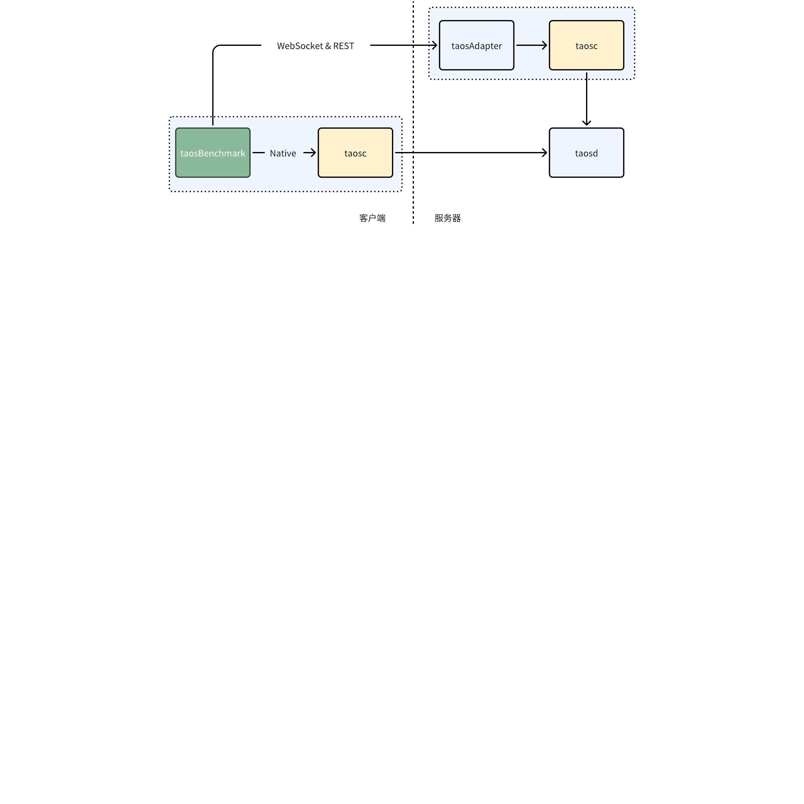
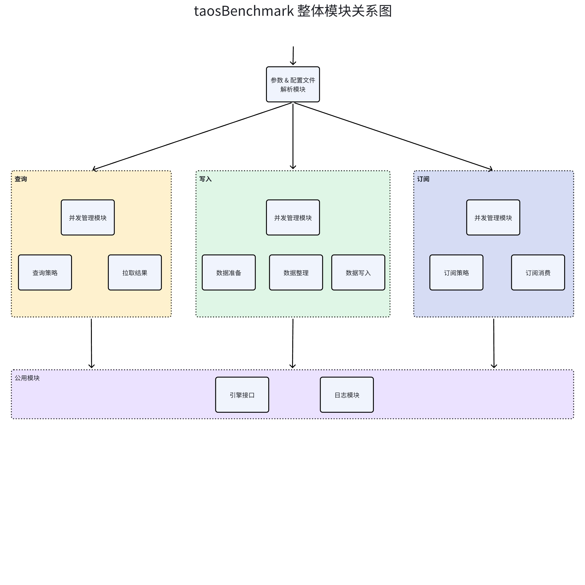
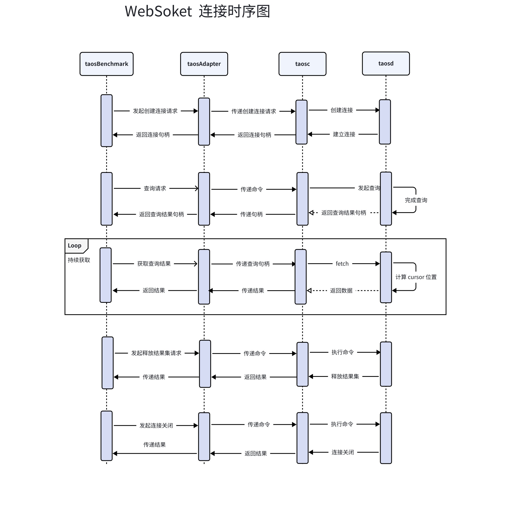
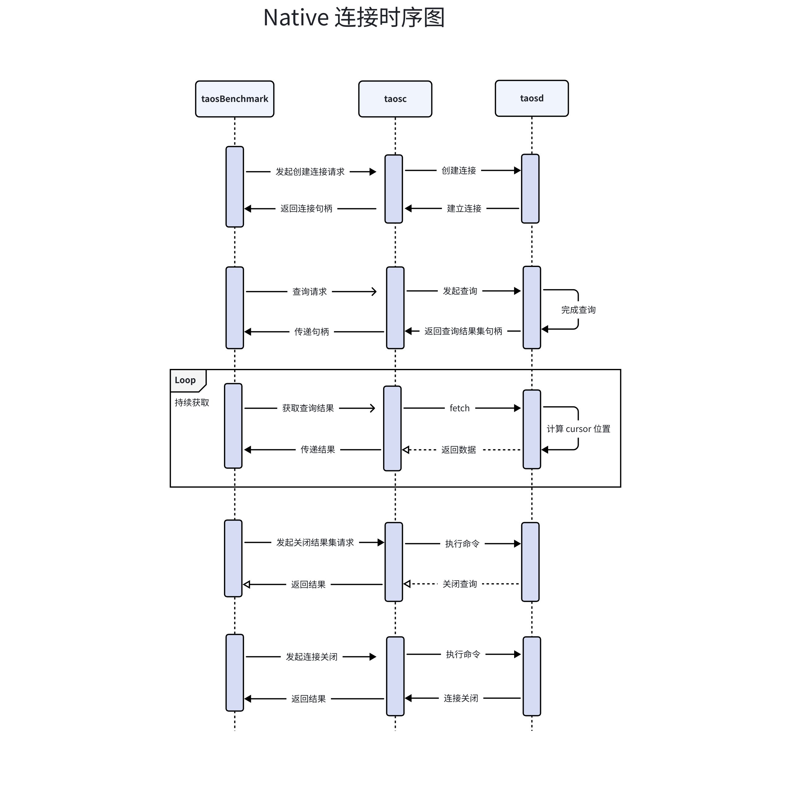

# 基准测试工具-Design Spec

## 1. 修订记录

| 日期 | 版本 | 负责人 | 主要修改内容 |
| --- | --- | --- | --- |
| 2025/01/18 | 0.1 | 段宽军 | 创建 |
| 2025/01/19 | 1.0 | 段宽军 | 修改文档格式 |
| 2026/01/12 | 1.1 | 佘彦杰 | 根据新需求修改 |

## 2. 引言

1. 目的： 对 [taosBenchmark-Requirement Spec](https://taosdata.feishu.cn/wiki/XnnywyidriNKBGk9efBcJwkmnEd) 中需求项进行技术实现方案设计
2. 范围： 基于[taosBenchmark-Requirement Spec- 段宽军](https://taosdata.feishu.cn/wiki/XnnywyidriNKBGk9efBcJwkmnEd) 文档约定
3. 受众：开发、设计、运维

## 3. 术语

1. **无模式写入：**是指在写入数据时无需预先定义表结构，系统会根据数据自动创建或调整表结构的特性。
2. **数据订阅：**允许客户端实时接收数据库中的数据变化，适用于实时监控场景。
3. **参数绑定：**是在 SQL 语句中使用占位符替代具体值的技术，可以防止 SQL 注入并提高性能。
4. **WebSocket：** 是一种在单个 TCP 连接上提供全双工通信的协议。它允许客户端和服务器之间的双向实时通信，避免了 HTTP 请求-响应模型的限制。WebSocket 协议的定义和规范是由 IETF（Internet Engineering Task Force）标准化的，其主要文档是 [RFC 6455](https://datatracker.ietf.org/doc/html/rfc6455)。
5. **REST（Representational State Transfer）**：一种基于 HTTP 的软件架构风格，提供简单统一接口规范。
6. **taosd：**TDengine 数据库引擎的核心服务，提供数据访问，多副本，高可用，数据压缩等功能。
7. **taosAdapter：**一个 TDengine 的配套工具，是 TDengine 集群和应用程序之间的桥梁和适配器。提供了 REST/WebSocket 接口来访问 TDengine。
8. **taosc：**taosc（应用驱动）是 TDengine 为应用程序提供的驱动程序，负责处理应用程序与集群之间的接口交互。taosc 提供了 C/C++ 语言的原生接口，并被内嵌于 JDBC、C#、Python、Go 等多种编程语言的连接库中，从而支持这些编程语言与数据库交互。

## 4. 概述

1. 整体架构：



1. 技术及框架
   - 开发语言： C 语言
   - 线程管理： POSIX Threads
   - 参数管理： GNU C Libaray 中 argp (https://www.gnu.org/software/libc)
   - json 格式解析器:  cJson (https://github.com/DaveGamble/cJSON)
   - WebSocket 框架：WebSocket（github.com/gorilla/websocket）
2. 依赖项:
   - TDengine Native 客户端动态库（libtaos.so）
   - TDengine WebSocket 连接器（libtaosws.so）
   - TDengine taosAdapter 
   - TDengine taosd 

## 5. 设计考虑

1. 假设和限制
  - 假设
    - 模拟设备产生的数据在一定区间内
  - 限制
    - TDengine 3.0 及以上版本
    - 创建库及表规模受内存大小限制
1. 设计模式和原则
  模式：
  - 单例模式
  原则：
  - 模块化原则：将软件划分为独立的模块，每个模块完成特定的功能，模块之间的耦合度最小化，便于软件的开发、维护和扩展
  - 可扩展原则：所设计的系统应具有对外界环境条件变化的适应性，保证软件良好的生存力
  - 简单性原则：力求软件结构简单，避免不必要的复杂化
1. 风险和缓解措施
  - 风险一：
    - 风险内容：用户在使用期间和服务器连接被断开
    - 缓解措施：执行命令前检查连接状态，断开情况下尝试重新连接

## 6. 详细设计

### 6.1 组件设计

- 组件整体图


- WebSocket 连接消息序列图


- Native 连接消息序列图


### 6.2 关键数据结构

#### 6.2.1 参数 & 配置文件解析模块

- 参数值存储结构
```c

typedef struct SArguments_S {
    uint8_t             taosc_version;
    char *              metaFile;
    int32_t             test_mode;
    char *              host;
    uint16_t            port;
    uint16_t            telnet_tcp_port;
    bool                port_inputted;
    bool                cfg_inputted;
    char *              user;
    char *              password;
    bool                answer_yes;
    bool                debug_print;
    bool                performance_print;
    bool                chinese;
    char *              output_file;
    char *              output_json_file;
    uint32_t            binwidth;
    uint32_t            intColumnCount;
    uint32_t            nthreads;
    uint32_t            table_threads;
    uint64_t            prepared_rand;
    uint32_t            reqPerReq;
    uint64_t            insert_interval;
    bool                demo_mode;
    bool                aggr_func;
    struct sockaddr_in  serv_addr;
    uint64_t            totalChildTables;
    uint64_t            actualChildTables;
    uint64_t            autoCreatedChildTables;
    uint64_t            existedChildTables;
    FILE *              fpOfInsertResult;
    BArray *            databases;
    BArray*             streams;
    char                base64_buf[INPUT_BUF_LEN];
#ifdef LINUX
    sem_t               cancelSem;
#endif
    bool                terminate;
    bool                in_prompt;
    
    // websocket
    char*               dsn;

    bool                supplementInsert;
    int64_t             startTimestamp;
    int32_t             partialColNum;
    int32_t             keep_trying;
    uint32_t            trying_interval;
    int                 iface;
    int                 rest_server_ver_major;
    bool                check_sql;
    int                 suit;  // see define SUIT_
    int16_t             inputted_vgroups;
    enum CONTINUE_IF_FAIL_MODE continueIfFail;
    bool                mistMode;
    bool                escape_character;
    bool                pre_load_tb_meta;
    bool                bind_vgroup;
    int8_t              connMode; // see define CONN_MODE_
    char*               output_path;
    char                output_path_buf[MAX_PATH_LEN];
} SArguments;
```

- 支持命令行参数存储结构
```c

static struct argp_option bench_options[] = {
    {"file", 'f', "FILE", 0, BENCH_FILE, 0},
    {"config-dir", 'c', "CONFIG_DIR", 0, BENCH_CFG_DIR, 1},
    {"host", 'h', "HOST", 0, BENCH_HOST},
    {"port", 'P', "PORT", 0, BENCH_PORT},
    {"interface", 'I', "IFACE", 0, BENCH_MODE},
    {"user", 'u', "USER", 0, BENCH_USER},
    {"password", 'p', "PASSWORD", 0, BENCH_PASS},
    {"output", 'o', "FILE", 0, BENCH_OUTPUT},
    {"output-json-file", 'j', "FILE", 0, BENCH_OUTPUT_JSON},
    {"threads", 'T', "NUMBER", 0, BENCH_THREAD},
    {"insert-interval", 'i', "NUMBER", 0, BENCH_INTERVAL},
    {"time-step", 'S', "NUMBER", 0, BENCH_STEP},
    {"angle-step", 'H', "NUMBER", 0, ANGLE_STEP},
    {"start-timestamp", 's', "NUMBER", 0, BENCH_START_TIMESTAMP},
    {"supplement-insert", 'U', 0, 0, BENCH_SUPPLEMENT},
    {"interlace-rows", 'B', "NUMBER", 0, BENCH_INTERLACE},
    {"rec-per-req", 'r', "NUMBER", 0, BENCH_BATCH},
    {"tables", 't', "NUMBER", 0, BENCH_TABLE},
    {"records", 'n', "NUMBER", 0, BENCH_ROWS},
    {"database", 'd', "DATABASE", 0, BENCH_DATABASE},
    {"columns", 'l', "NUMBER", 0, BENCH_COLS_NUM},
    {"partial-col-num", 'L', "NUMBER", 0, BENCH_PARTIAL_COL_NUM},
    {"tag-type", 'A', "TAG_TYPE", 0, BENCH_TAGS},
    {"data-type", 'b', "COL_TYPE", 0, BENCH_COLS},
    {"binwidth", 'w', "NUMBER", 0, BENCH_WIDTH},
    {"table-prefix", 'm', "TABLE_PREFIX", 0, BENCH_PREFIX},
    {"escape-character", 'E', 0, 0, BENCH_ESCAPE},
    {"chinese", 'C', 0, 0, BENCH_CHINESE},
    {"normal-table", 'N', 0, 0, BENCH_NORMAL},
    {"random", 'M', 0, 0, BENCH_RANDOM},
    {"aggr-func", 'x', 0, 0, BENCH_AGGR},
    {"answer-yes", 'y', 0, 0, BENCH_YES},
    {"disorder-range", 'R', "NUMBER", 0, BENCH_RANGE},
    {"disorder", 'O', "NUMBER", 0, BENCH_DISORDER},
    {"replica", 'a', "NUMBER", 0, BENCH_REPLICA},
    {"debug", 'g', 0, 0, BENCH_DEBUG},
    {"performance", 'G', 0, 0, BENCH_PERFORMANCE},
    {"prepared_rand", 'F', "NUMBER", 0, BENCH_PREPARE},
    {"cloud_dsn", 'W', "DSN", 0, OLD_DSN_DESC},
    {"keep-trying", 'k', "NUMBER", 0, BENCH_KEEPTRYING},
    {"trying-interval", 'z', "NUMBER", 0, BENCH_TRYING_INTERVAL},
    {"vgroups", 'v', "NUMBER", 0, BENCH_VGROUPS},
    {"version", 'V', 0, 0, BENCH_VERSION},
    {"nodrop", 'Q', 0, 0, BENCH_NODROP},
    {"dsn", 'X', "DSN", 0, DSN_DESC},
    {DRIVER_OPT, 'Z', "DRIVER", 0, DRIVER_DESC},
    {0}
};
```

- 解析 json 配置文件结构
```bash {wrap}
/* The tools_cJSON structure: */
typedef struct tools_cJSON
{
    /* next/prev allow you to walk array/object chains. Alternatively, use GetArraySize/GetArrayItem/GetObjectItem */
    struct tools_cJSON *next;
    struct tools_cJSON *prev;
    /* An array or object item will have a child pointer pointing to a chain of the items in the array/object. */
    struct tools_cJSON *child;

    /* The type of the item, as above. */
    int type;

    /* The item's string, if type==tools_cJSON_String  and type == tools_cJSON_Raw */
    char *valuestring;
    /* writing to valueint is DEPRECATED, use tools_cJSON_SetNumberValue instead */
    int64_t valueint;
    /* The item's number, if type==tools_cJSON_Number */
    double valuedouble;

    /* The item's name string, if this item is the child of, or is in the list of subitems of an object. */
    char *string;

    //Keep the original string of number
    char numberstring[64];
} tools_cJSON;
```

#### 6.2.2 写入

- “并发管理模块”关键数据结构
```c {wrap}
typedef struct SThreadInfo_S {
    SBenchConn  *conn;
    uint64_t    *bind_ts;
    uint64_t    *bind_ts_array;
    char        *bindParams;
    char        *is_null;
    int32_t     **lengths;
    uint32_t    threadID;
    uint64_t    start_table_from;
    uint64_t    end_table_to;
    uint64_t    ntables;
    uint64_t    tables_created;
    char *      buffer;
    uint64_t    counter;
    uint64_t    st;
    uint64_t    et;
    uint64_t    samplePos;
    uint64_t    totalInsertRows;
    uint64_t    totalQueried;
    int64_t     totalDelay;
    int64_t     totalDelay1;
    int64_t     totalDelay2;
    int64_t     totalDelay3;
    uint64_t    querySeq;
    TAOS_SUB    *tsub;
    char **     lines;
    uint32_t    line_buf_len;
    int32_t     sockfd;
    SDataBase   *dbInfo;
    SSuperTable *stbInfo;
    char        **sml_tags;
    tools_cJSON *json_array;
    tools_cJSON *sml_json_tags;
    char        **sml_tags_json_array;
    char        **sml_json_value_array;
    uint64_t    start_time;
    uint64_t    pos; // point for sampleDataBuff
    uint64_t    max_sql_len;
    FILE        *fp;
    char        filePath[MAX_PATH_LEN];
    BArray*     delayList;
    uint64_t    *query_delay_list;
    double      avg_delay;
    SVGroup     *vg;

    int         posOfTblCreatingBatch;
    int         posOfTblCreatingInterval;
    // new
    uint16_t    batCols[MAX_BATCOLS];
    uint16_t    nBatCols;  // valid count for array batCols

    // check sql result
    char        *csql;
    int32_t     clen;  // csql current write position
    bool        stmtBind;
    char **     childNames;
    int32_t     childTblCount;
    // stmt2
    BArray      *tagsStmt;
} threadInfo;
```

- “数据准备模块”关键数据结构
```c {wrap}
// generate data with SField struct
typedef struct SField {
    uint8_t  type;
    char     name[TSDB_COL_NAME_LEN + 1];
    uint32_t length;
    bool     none;
    bool     null;
    StmtData stmtData;
    int64_t  max;
    int64_t  min;
    double   maxInDbl;
    double   minInDbl;
    uint8_t precision;
    uint8_t scale;
    uint32_t scalingFactor;
    tools_cJSON *  values;

    BDecimal decMax;
    BDecimal decMin;

    // fun
    uint8_t  funType;
    float    multiple;
    float    addend;
    float    base;
    int32_t  random;

    int32_t    period;
    int32_t    offset;
    int32_t    step;

    bool     sma;
    bool     fillNull;
    uint8_t   gen; // see GEN_ define

    // compress
    char     encode[COMP_NAME_LEN];
    char     compress[COMP_NAME_LEN];
    char     level[COMP_NAME_LEN];

} Field;

// stmt struct
typedef struct SStmtData {
    void    *data;
    char    *is_null;
    int32_t *lengths;
} StmtData;

// child field struct
typedef struct SChildField {
    StmtData stmtData;
} ChildField;
```

- “数据整理模块”关键数据结构 
```c {wrap}
// child table data organize struct
typedef struct SChildTable_S {
    char*     name;
    bool      useOwnSample;
    char      *sampleDataBuf;
    uint64_t  insertRows;
    BArray    *childCols;
    int64_t   ts;  // record child table ts
    int32_t   pkCur;
    int32_t   pkCnt;
} SChildTable;

// super table data organize struct
#define PRIMARY_KEY "PRIMARY KEY"
typedef struct SSuperTable_S {
    char      *stbName;
    bool      random_data_source;  // rand_gen or sample
    bool      use_metric;
    char      *childTblPrefix;
    char      *childTblSample;
    bool      childTblExists;
    uint64_t  childTblCount;
    uint64_t  batchTblCreatingNum;  // 0: no batch,  > 0: batch table number in
    char     *batchTblCreatingNumbers;  // NULL: no numbers
    BArray   *batchTblCreatingNumbersArray;
    char     *batchTblCreatingIntervals;  // NULL: no interval
    BArray   *batchTblCreatingIntervalsArray;
                                   // one sql
    bool      autoTblCreating;
    uint16_t  iface;  // 0: taosc, 1: rest, 2: stmt
    uint16_t  lineProtocol;
    int64_t   childTblLimit;
    int64_t   childTblOffset;
    int64_t   childTblFrom;
    int64_t   childTblTo;
    enum CONTINUE_IF_FAIL_MODE continueIfFail;

    //  int          multiThreadWriteOneTbl;  // 0: no, 1: yes
    uint32_t  interlaceRows;  //
    int       disorderRatio;  // 0: no disorder, >0: x%
    int       disorderRange;  // ms, us or ns. according to database precision

    // ratio
    uint8_t   disRatio;   // disorder ratio 0 ~ 100 %
    uint8_t   updRatio;   // update ratio   0 ~ 100 %
    uint8_t   delRatio;   // delete ratio   0 ~ 100 %

    // range
    uint64_t  disRange;  // disorder range
    uint64_t  updRange;  // update range
    uint64_t  delRange;  // delete range

    // generate row value rule see pre RULE_ define
    uint8_t   genRowRule;

    // data position
    uint8_t   dataPos;  //  see define DATAPOS_

    uint32_t  fillIntervalUpd;  // fill Upd interval rows cnt
    uint32_t  fillIntervalDis;  // fill Dis interval rows cnt

    // binary prefix
    char      *binaryPrefex;
    // nchar prefix
    char      *ncharPrefex;

    // random write future time
    bool      useNow;
    bool      writeFuture;
    int32_t   durMinute;  // passed database->durMinute
    int32_t   checkInterval;  // check correct interval

    int64_t   max_sql_len;
    uint64_t  insert_interval;
    uint64_t  insertRows;
    uint64_t  timestamp_step;
    uint64_t  angle_step;
    int64_t   startTimestamp;
    int64_t   startFillbackTime;
    int64_t   specifiedColumns;
    char      sampleFile[MAX_FILE_NAME_LEN];
    char      tagsFile[MAX_FILE_NAME_LEN];
    char      primaryKeyName[TSDB_COL_NAME_LEN + 1];
    uint32_t  partialColNum;
    uint32_t  partialColFrom;
    char      *partialColNameBuf;
    BArray    *cols;
    BArray    *tags;
    BArray    *tsmas;
    SChildTable   **childTblArray;
    char      *colsOfCreateChildTable;
    uint32_t  lenOfTags;
    uint32_t  lenOfCols;

    char      *sampleDataBuf;
    bool      useSampleTs;
    bool      useTagTableName;
    bool      tcpTransfer;
    bool      non_stop;
    bool      autoFillback; // "start_fillback_time" item set "auto"
    char      *calcNow;      // need calculate now timestamp expression
    char      *comment;
    int       delay;
    int       file_factor;
    char      *rollup;
    char      *max_delay;
    char      *watermark;
    int       ttl;
    int32_t   keep_trying;
    uint32_t  trying_interval;
    // primary key
    bool primary_key;
    int  repeat_ts_min;
    int  repeat_ts_max;

    // execute sqls after create super table
    char **sqls;

    char*     csv_file_prefix;
    char*     csv_ts_format;
    char*     csv_ts_interval;
    char*     csv_tbname_alias;
    long      csv_ts_intv_secs;
    bool      csv_output_header;
    CsvCompressionLevel csv_compress_level;

} SSuperTable;


// organize data array
typedef struct BArray {
    size_t   size;
    uint64_t capacity;
    uint64_t elemSize;
    void*    pData;
} BArray;
```

- “数据写入模块”关键数据结构
```c {wrap}
// type of interface for write
enum enum_TAOS_INTERFACE {
    TAOSC_IFACE,
    REST_IFACE,
    STMT_IFACE,
    STMT2_IFACE,
    SML_IFACE,
    SML_REST_IFACE,    
    INTERFACE_BUT
};

// record delay 
typedef struct SSQL_S {
    char *command;
    char result[MAX_FILE_NAME_LEN];
    int64_t* delay_list;
} SSQL;
```


#### 6.2.3 查询

- “并发管理模块”关键数据结构
```c
 // query thread passed struct with arg
typedef struct SQueryThreadInfo_S {
    SBenchConn* conn;
    int32_t   start_sql;
    int32_t   end_sql;
    int32_t   threadID;
    BArray*   query_delay_list;
    int32_t   sockfd;
    double   total_delay;
    char*    dbName;
    char      filePath[MAX_PATH_LEN];
    uint64_t  start_table_from;
    uint64_t  end_table_to;
    uint64_t  ntables;
    uint64_t  querySeq;

    // error rate
    uint64_t  nSucc;
    uint64_t  nFail;
} qThreadInfo;

```

- “查询策略模块”关键数据结构
```c
// specified query mode stategy
typedef struct SpecifiedQueryInfo_S {
    uint64_t  queryInterval;  // 0: unlimited  > 0   loop/s
    uint64_t  queryTimes;
    uint32_t  concurrent;
    uint32_t  asyncMode;          // 0: sync, 1: async
    uint64_t  subscribeInterval;  // ms
    uint64_t  subscribeTimes;  // ms
    bool      subscribeRestart;
    int       subscribeKeepProgress;
    BArray*   sqls;
    int       resubAfterConsume[MAX_QUERY_SQL_COUNT];
    int       endAfterConsume[MAX_QUERY_SQL_COUNT];
    TAOS_SUB *tsub[MAX_QUERY_SQL_COUNT];
    char      topic[MAX_QUERY_SQL_COUNT][32];
    int       consumed[MAX_QUERY_SQL_COUNT];
    TAOS_RES *res[MAX_QUERY_SQL_COUNT];
    uint64_t  totalQueried;
    bool      mixed_query;
    bool      batchQuery; // mixed query have batch and no batch query
    // error rate
    uint64_t  totalFail;
} SpecifiedQueryInfo;

// super table query mode stategy
typedef struct SuperQueryInfo_S {
    char      stbName[TSDB_TABLE_NAME_LEN];
    uint64_t  queryInterval;  // 0: unlimited  > 0   loop/s
    uint64_t  queryTimes;
    uint32_t  threadCnt;
    uint32_t  asyncMode;          // 0: sync, 1: async
    uint64_t  subscribeInterval;  // ms
    uint64_t  subscribeTimes;  // ms
    bool      subscribeRestart;
    int       subscribeKeepProgress;
    int64_t   childTblCount;
    int       sqlCount;
    char      sql[MAX_QUERY_SQL_COUNT][TSDB_MAX_ALLOWED_SQL_LEN + 1];
    char      result[MAX_QUERY_SQL_COUNT][MAX_FILE_NAME_LEN];
    int       resubAfterConsume;
    int       endAfterConsume;
    TAOS_SUB *tsub[MAX_QUERY_SQL_COUNT];
    char **   childTblName;
    uint64_t  totalQueried;
    // error rate
    uint64_t  totalFail;
} SuperQueryInfo;

// query meta manager
typedef struct SQueryMetaInfo_S {
    SpecifiedQueryInfo  specifiedQueryInfo;
    SuperQueryInfo      superQueryInfo;
    uint64_t            totalQueried;
    uint64_t            query_times;
    uint64_t            killQueryThreshold;
    int32_t             killQueryInterval;
    uint64_t            response_buffer;
    bool                reset_query_cache;
    uint16_t            iface;
    char*               dbName;
} SQueryMetaInfo;
```


#### 6.2.4 订阅

- 并发管理模块关键数据结构
```c
// tmq thread struct passed with arg
typedef struct {
    tmq_t* tmq;
    int64_t  totalMsgs;
    int64_t  totalRows;

    int      id;
    FILE*    fpOfRowsFile;
} tmqThreadInfo;
```

- 订阅策略模块关键数据结构
```c
// table describe
typedef struct STmqMetaInfo_S {
    SConsumerInfo      consumerInfo;
    uint16_t           iface;
} STmqMetaInfo;

// table info include TableDes
enum TEST_MODE {
    ...
    SUBSCRIBE_TEST,  // 2 
};
```

- 订阅消费模块关键数据结构
```c
// consumer information for subscribe
typedef struct SConsumerInfo_S {
    uint32_t    concurrent;
    uint32_t    pollDelay;  // ms
    char*       groupId;
    char*       clientId;
    char*       autoOffsetReset;

    char*       createMode;
    char*       groupMode;

    char*       enableManualCommit;
    char*       enableAutoCommit;
    uint32_t    autoCommitIntervalMs;  // ms
    char*       snapshotEnable;
    char*       msgWithTableName;
    char*       rowsFile;
    int32_t     expectRows;

    char        topicName[MAX_QUERY_SQL_COUNT][256];
    char        topicSql[MAX_QUERY_SQL_COUNT][256];
    int         topicCount;
} SConsumerInfo;
```

#### 6.2.5 引擎接口

```c
// connect encapsulation
typedef struct SBenchConn {
    TAOS* taos;
    TAOS* ctaos;  // check taos
    TAOS_STMT* stmt;
    TAOS_STMT2* stmt2;
} SBenchConn;
```

#### 6.2.6 日志模块

```c
#ifdef WINDOWS
typedef CRITICAL_SECTION     TdThreadMutex;      // windows api
typedef HANDLE               TdThreadMutexAttr;  // windows api
#else
typedef pthread_mutex_t      TdThreadMutex;
typedef pthread_mutexattr_t  TdThreadMutexAttr;
#endif
```

### 6.3 组件详细设计

#### 6.3.1 参数 & 配置文件解析模块

- 设置 argp 框架解析参数
```c
// main use argp frame
void benchParseArgsByArgp(int argc, char *argv[])

// struct for argp
static struct argp bench_argp = {bench_options, benchParseOpt, "", ""};

```

- struct argp_option 结构用于定义支持的所有命令行参数
```c
// support command line options
static struct argp_option bench_options[] = {
    {"file", 'f', "FILE", 0, BENCH_FILE, 0},
    {"config-dir", 'c', "CONFIG_DIR", 0, BENCH_CFG_DIR, 1},
    {"host", 'h', "HOST", 0, BENCH_HOST},
    {"port", 'P', "PORT", 0, BENCH_PORT},
     ...
}
```

- 设计命令行默认参数赋值函数，集中设置默认值
```c
// define default value 
#define INPUT_BUF_LEN         512
#define EXTRA_SQL_LEN         256
#define DATATYPE_BUFF_LEN     (TINY_BUFF_LEN * 3)
#define SML_MAX_BATCH          65536 * 32
#define DEFAULT_NTHREADS       8

#define DEFAULT_CHILDTABLES    10000
#define DEFAULT_PORT           6030
#define DEFAULT_REST_PORT      6041
#define DEFAULT_DATABASE       "test"
#define DEFAULT_TB_PREFIX      "d"
#define DEFAULT_OUTPUT         "./output.txt"
#define DEFAULT_BINWIDTH       64
#define DEFAULT_REPLICA        1
#define DEFAULT_CFGNAME_LEN    10
#define DEFAULT_PREPARED_RAND  20000
#define DEFAULT_REQ_PER_REQ    10000
#define DEFAULT_INSERT_ROWS    10000
#define DEFAULT_DISORDER_RANGE 1000
#define DEFAULT_CREATE_BATCH   10
#define DEFAULT_SUB_INTERVAL   10000
#define DEFAULT_QUERY_INTERVAL 10000
#define BARRAY_MIN_SIZE             8
#define SML_LINE_SQL_SYNTAX_OFFSET  7

// set default value
void initArgument() {
    g_arguments = benchCalloc(1, sizeof(SArguments), true);
    if (taos_get_client_info()[0] == '3') {
        g_arguments->taosc_version = 3;
    } else {
        g_arguments->taosc_version = 2;
    }
    g_arguments->test_mode = INSERT_TEST;
    g_arguments->demo_mode = true;
    g_arguments->host = NULL;
    g_arguments->port = 0;
    g_arguments->port_inputted = false;
    g_arguments->telnet_tcp_port = TELNET_TCP_PORT;
    g_arguments->user     = NULL;
    g_arguments->password = NULL;
    g_arguments->answer_yes = 0;
    g_arguments->debug_print = 0;
    g_arguments->binwidth = DEFAULT_BINWIDTH;
    g_arguments->performance_print = 0;
    g_arguments->output_file = DEFAULT_OUTPUT;
    g_arguments->nthreads = DEFAULT_NTHREADS;
    g_arguments->table_threads = DEFAULT_NTHREADS;
    g_arguments->prepared_rand = DEFAULT_PREPARED_RAND;
    g_arguments->reqPerReq = DEFAULT_REQ_PER_REQ;
    g_arguments->totalChildTables = DEFAULT_CHILDTABLES;
    g_arguments->actualChildTables = 0;
    g_arguments->autoCreatedChildTables = 0;
    g_arguments->existedChildTables = 0;
    g_arguments->chinese = false;
    g_arguments->aggr_func = 0;
    g_arguments->terminate = false;

    g_arguments->supplementInsert = false;
    g_arguments->startTimestamp = DEFAULT_START_TIME;
    g_arguments->partialColNum = 0;

    g_arguments->keep_trying = 0;
    g_arguments->trying_interval = 0;
    g_arguments->iface = TAOSC_IFACE;
    g_arguments->rest_server_ver_major = -1;
    g_arguments->inputted_vgroups = -1;

    g_arguments->mistMode = false;
    g_arguments->connMode = CONN_MODE_INVALID;

    initDatabase();
    initStable();
    g_arguments->streams = benchArrayInit(1, sizeof(SSTREAM));
}

```

- 设计 json 配置文件统一读取入口函数，分别读取写入、查询或订阅的配置项, 保存至 g_arguments 中
```c
/* 
   read config from json file
   params:
     @ fp    file handle
  return value:
     0: success 
     other: error
*/
int readJsonConfig(char * file) {
    int32_t code = -1;
    FILE *  fp = fopen(file, "r");
    ...

    int   maxLen = MAX_JSON_BUFF;
    char *content = benchCalloc(1, maxLen + 1, false);
    int   len = (int)fread(content, 1, maxLen, fp);
    ...
    
    content[len] = 0;
    root = tools_cJSON_Parse(content);
    ...
    
    char *pstr = tools_cJSON_Print(root);
    infoPrint("%s\n%s\n", file, pstr);
    tmfree(pstr);

    tools_cJSON *filetype = tools_cJSON_GetObjectItem(root, "filetype");
    if (tools_cJSON_IsString(filetype)) {
        if (0 == strcasecmp("insert", filetype->valuestring)) {
            g_arguments->test_mode = INSERT_TEST;
        } else if (0 == strcasecmp("query", filetype->valuestring)) {
            g_arguments->test_mode = QUERY_TEST;
        } else if (0 == strcasecmp("subscribe", filetype->valuestring)) {
            g_arguments->test_mode = SUBSCRIBE_TEST;
        } else if (0 == strcasecmp("csvfile", filetype->valuestring)) {
            g_arguments->test_mode = CSVFILE_TEST;
        } else {
            errorPrint("%s",
                       "failed to read json, filetype not support\n");
            goto PARSE_OVER;
        }
    } else {
        g_arguments->test_mode = INSERT_TEST;
    }
    ,,,
```

#### 6.3.2 写入

- 并发管理模块
```c
/* 
   init insert threads  
   params:
     @ database  database for insert
     @ stbInfo   super table for insert
     @ nthreads  start thread count
     @ infos     malloc threads information
     @ div       = ntable / nthread
     @ mod       = ntable % nthread
  return value:
     0: success 
     other: error
*/
int32_t initInsertThread(SDataBase* database, SSuperTable* stbInfo, 
          int32_t nthreads, threadInfo *infos, int64_t div, int64_t mod);

/* 
   running insert threads 
   params:
     @ database  database for insert
     @ stbInfo   super table for insert
     @ nthreads  start thread count
     @ infos     malloc threads information
     @ pids      receive p_thread handle array
  return value:
     0: success 
     other: error
*/

int32_t runInsertThread(SDataBase* database, SSuperTable* stbInfo, 
            int32_t nthreads, threadInfo *infos, pthread_t *pids);

/* 
   exit and clear insert threads 
   params:
     @ database  database for insert
     @ stbInfo   super table for insert
     @ nthreads  start thread count
     @ infos     malloc threads information
     @ pids      receive p_thread handle array
     @ spend     pass runing thread spend time
  return value:
     0: success 
     other: error
*/
int32_t exitInsertThread(SDataBase* database, SSuperTable* stbInfo, 
            int32_t nthreads, threadInfo *infos, pthread_t *pids, int64_t spend);
```

- 数据准备模块
根据用户设置的各配置生成规则生成准备数据
```c
/* 
   prepare data for super table of database 
   params:
     @ database  database for prepare
     @ stbInfo   super table for prepare
  return value:
     0: success 
     other: error
*/
int prepareSampleData(SDataBase* database, SSuperTable* stbInfo)

/* 
   generate random data for super table
   params:
     @ stbInfo        generate to super table
     @ sampleDataBuf  generate data save buffer
     @ bufLen         sampleDataBuf length for byte
     @ lenOfOneRow    one row length for byte
     @ fields         fields of super table 
     @ loop           batch data size 
     @ tag            fields type , True is tag  False is columns
     @ childCols      child columns
     @ loopBegin      row index
    
  return value:
     0: success 
     other: error
*/
int generateRandData(SSuperTable *stbInfo, char *sampleDataBuf,
                     int64_t bufLen,
                     int lenOfOneRow, BArray *fields,
                     int64_t loop,
                     bool tag, BArray *childCols, int64_t loopBegin)
```

- 数据整理模块
设计根据写入模式及不同写入接口，按用户设置规则组织数据，规划写入逻辑
```c
// insert interface type
enum enum_TAOS_INTERFACE {
    TAOSC_IFACE,
    REST_IFACE,
    STMT_IFACE,
    STMT2_IFACE,
    SML_IFACE,
    SML_REST_IFACE,    
    INTERFACE_BUT
};
/*
   arrange write flow and data with batch mode
   params:
     @ sarg    pointer to struct threadInfo , bring all information for writing
  return value:
     0: success 
     other: error
*/

void *syncWriteProgressive(void *sarg) {
    ...
    //
    // first loop write each child table
    //
    for (uint64_t tableSeq = pThreadInfo->start_table_from;
            tableSeq <= pThreadInfo->end_table_to; tableSeq++) {
        ...
        // 
        // second loop for each rows
        //
        for (uint64_t i = 0; i < stbInfo->insertRows;) {
              ...    
            switch (stbInfo->iface) {
                case TAOSC_IFACE:
                case REST_IFACE:
                    generated = prepareProgressDataSql(
                            pThreadInfo,
                            childTbl,
                            tagData,
                            w,
                            sampleDataBuf,
                            &timestamp, i, ttl, &pos, &len, &pkCur, &pkCnt);
                    break;
                case STMT_IFACE: {
                    generated = prepareProgressDataStmt(
                            pThreadInfo,
                            childTbl, &timestamp, i, ttl, &pkCur, &pkCnt, &delay1, &delay2, &delay3);
                    break;
                }
                case STMT2_IFACE: {
                    generated = stmt2BindAndSubmit(
                            pThreadInfo,
                            childTbl, &timestamp, i, ttl, &pkCur, &pkCnt, &delay1,
                            &delay3, &startTs, &endTs, w);
                    break;
                }
                case SML_REST_IFACE:
                case SML_IFACE:
                    generated = prepareProgressDataSml(
                            pThreadInfo,
                            childTbl,
                            tableSeq, &timestamp, i, ttl, &pkCur, &pkCnt);
                    break;
                default:
                    break;
            }
             ...
             // one step rows
            if (!stbInfo->non_stop) {
                i += generated;
            }
            }
             ...
        }
        ...
        
        //
        // insert data to engine
        //
        ...
    }
    ...
}


/*
   arrange write flow and data with interlace mode
   params:
     @ sarg    pointer to struct threadInfo , bring all information for writing
  return value:
     0: success 
     other: error
*/

static void *syncWriteInterlace(void *sarg) {
    ...
    int64_t insertRows = stbInfo->insertRows;
    int32_t interlaceRows = stbInfo->interlaceRows;
    uint32_t nBatchTable  = g_arguments->reqPerReq / interlaceRows;
    ...
    
    // 
    // first loop for insert rows for each table
    //
    while (insertRows > 0) {
        ...
        //
        // second loop need insert batch count
        //
        for (i = 0; i < nBatchTable; i++) {
            ...
            switch (stbInfo->iface) {
                case REST_IFACE:
                case TAOSC_IFACE:  
                    //
                    // third loop for interlace rows
                    //
                    for (int64_t j = 0; j < interlaceRows; j++) {
                        ds_add_strs(&pThreadInfo->buffer, 2,
                                 escapedTbName, " VALUES ");
                                 
                     ...   
                case STMT_IFACE: 
                     ...
                     taos_stmt_set_tbname(pThreadInfo->conn->stmt,
                                             escapedTbName))                     
                     ...
                     generated += bindParamBatch(...)
                     ...
                case STMT2_IFACE: {
                    // tbnames
                    bindv->tbnames[i] = childTbl->name;

                    // tags
                    if (stbInfo->autoTblCreating && firstInsertTb) {
                        ...
                        bindVTags(bindv, i, w, pThreadInfo->tagsStmt);
                    }

                    // cols
                    ...
                    generated += bindVColsInterlace(bindv, i, pThreadInfo, interlaceRows, childTbl->ts, pos,
                                                    childTbl, &childTbl->pkCur, &childTbl->pkCnt, &n);
                    ...
                }                     
                case SML_REST_IFACE:
                case SML_IFACE: 
                    //
                    // third loop for interlace rows
                    //
                    for (int64_t j = 0; j < interlaceRows; j++) {
                          ...
                          if (TSDB_SML_JSON_PROTOCOL == protocol) {
                              ...
                              generateSmlJsonCols(...)
                           } else if (SML_JSON_TAOS_FORMAT == protocol) {
                              ...
                              generateSmlTaosJsonCols()
                           }
                    ...
                   }
             }

            ...
            //
            // insert data to engine
            //
            ...
        }    
    }
}
```

- 数据写入模块
通过调用用户配置的不同引擎接口，把整理好的数据写入数据库引擎
```c
/*
   export child or normal tables for Native 
   params:
     @ pThreadInfo  current write thread
     @ k            last write position in buffer
     @ delay3       calcute spend time with us
  return value:
     0: success 
     other: error
*/

int32_t execInsert(threadInfo *pThreadInfo, uint32_t k, int64_t *delay3) {
    SDataBase *  database = pThreadInfo->dbInfo;
    SSuperTable *stbInfo = pThreadInfo->stbInfo;
    ...
    uint16_t     iface = stbInfo->iface;
    ...
    switch (iface) {
        case TAOSC_IFACE:
            code = queryDbExecCall(pThreadInfo->conn, pThreadInfo->buffer);
            ...
            break;
        case REST_IFACE:
            ...
            code = postProcessSql(pThreadInfo->buffer,
                                database->dbName,
                                database->precision,
                                stbInfo->iface,
                                stbInfo->lineProtocol,
                                g_arguments->port,
                                stbInfo->tcpTransfer,
                                pThreadInfo->sockfd,
                                pThreadInfo->filePath);
                                
            ...
            break;

        case STMT_IFACE:
            // add batch
            if (taos_stmt_add_batch(pThreadInfo->conn->stmt) != 0) {
                ...
                return -1;
            }

            // execute 
            code = taos_stmt_execute(pThreadInfo->conn->stmt);
            break;
        case STMT2_IFACE:
            // execute
            code = taos_stmt2_exec(pThreadInfo->conn->stmt2, &affectRows);
            ...
            break;

        case SML_IFACE:
            res = taos_schemaless_insert(...)            
            break;
        ...    
        } 
    }
    return code;
}

/*
   export child or normal tables for Native 
   params:
     @ conn         current database connection
     @ command      execute sql command
  return value:
     0: success 
     other: error
*/
int32_t queryDbExecCall(SBenchConn *conn, char *command);

```

#### 6.3.3 查询

- 并发管理策略模块
       查询分两种并发管理类型：
1. 每个 SQL 执行一组并发测试模式，此类主要测试单个 SQL 的并发能力表现，流程设计如下：
```c
    int      nConcurrent = g_queryInfo.specifiedQueryInfo.concurrent;
    uint64_t nSqlCount = g_queryInfo.specifiedQueryInfo.sqls->size;
    ...

    // malloc funciton global memory
    pids  = benchCalloc(1, nConcurrent * sizeof(pthread_t),  false);
    infos = benchCalloc(1, nConcurrent * sizeof(threadInfo), false);
    ...


    for (uint64_t i = 0; i < nSqlCount; i++) {
        ...
        // get execute sql
        SSQL *sql = benchArrayGet(g_queryInfo.specifiedQueryInfo.sqls, i);

        // create threads
        int threadCnt = 0;
        for (int j = 0; j < nConcurrent; j++) {
           threadInfo *pThreadInfo = infos + j;
           pThreadInfo->threadID = i * nConcurrent + j;
           pThreadInfo->querySeq = i;
           if (iface == REST_IFACE) {
                int sockfd = createSockFd();
                ...
                pThreadInfo->sockfd = sockfd;
           } else {
                pThreadInfo->conn = initBenchConn();
                ...
           }

           pthread_create(pids + j, NULL, specifiedTableQuery, pThreadInfo);
           threadCnt++;
        }


        // wait threads execute finished one by one
        for (int j = 0; j < threadCnt ; j++) {
           pthread_join(pids[j], NULL);
           qThreadInfo *pThreadInfo = infos + j;
           closeQueryConn(pThreadInfo, iface);

           // need exit in loop
           if (needExit) {
                // free BArray
                benchArrayDestroy(pThreadInfo->query_delay_list);
                pThreadInfo->query_delay_list = NULL;
           }
        }
        // output single sql test result
        ...
    }

    //
    // output total test result
    //
    ...
```

1. 把要测试的 SQL 分成为并发数相同的组，每个组由一个并发线程去执行，此类测试的是混合 SQL 的并发能力，流程设计如下:
```c
    // init
    int ret            = -1;
    int nConcurrent    = g_queryInfo.specifiedQueryInfo.concurrent;
    pthread_t * pids   = benchCalloc(nConcurrent, sizeof(pthread_t), true);
    qThreadInfo *infos = benchCalloc(nConcurrent, sizeof(qThreadInfo), true);

    // concurent calc
    int total_sql_num = g_queryInfo.specifiedQueryInfo.sqls->size;
    int start_sql     = 0;
    int a             = total_sql_num / nConcurrent;
    if (a < 1) {
        warnPrint("sqls num:%d < concurent:%d, so set concurrent to %d\n", total_sql_num, nConcurrent, nConcurrent);
        nConcurrent = total_sql_num;
        a = 1;
    }
    int b = 0;
    if (nConcurrent != 0) {
        b = total_sql_num % nConcurrent;
    }

    //
    // running
    //
    int threadCnt = 0;
    for (int i = 0; i < nConcurrent; ++i) {
        qThreadInfo *pThreadInfo = infos + i;
        pThreadInfo->threadID    = i;
        pThreadInfo->start_sql   = start_sql;
        pThreadInfo->end_sql     = i < b ? start_sql + a : start_sql + a - 1;
        start_sql = pThreadInfo->end_sql + 1;
        pThreadInfo->total_delay = 0;
        pThreadInfo->dbName = dbName;

        // create conn
        if (initQueryConn(pThreadInfo, iface)){
            break;
        }
        // main run
        int code = pthread_create(pids + i, NULL, specQueryMixThread, pThreadInfo);
        if (code != 0) {
            errorPrint("failed specQueryMixThread create. error code =%d \n", code);
            break;
        }

        threadCnt ++;
    }

    bool needExit = false;
    // if failed, set termainte flag true like ctrl+c exit
    if (threadCnt != nConcurrent) {
        needExit = true;
        g_arguments->terminate = true;
    }

    // reset total
    g_queryInfo.specifiedQueryInfo.totalQueried = 0;
    g_queryInfo.specifiedQueryInfo.totalFail    = 0;

    int64_t start = toolsGetTimestampUs();
    for (int i = 0; i < threadCnt; ++i) {
        pthread_join(pids[i], NULL);
        ...
    }
    int64_t end = toolsGetTimestampUs();
  
  
    // statistic total
    ...
    
    // output test result
    ...
```

- 查询策略模块
      查询测试的策略主要有两种:
1. 指定 SQL 查询,  通过参数 mixed_query 可配置两种模式
```c
/*
   specified query with no mixed mode
   params:
     @ iface       interface type, see enum_TAOS_INTERFACE
     @ dbName      query on database
   return value:
     0: success 
     other: error
*/
static int specQuery(uint16_t iface, char* dbName)


/*
   specified query with mixed mode
   params:
     @ iface       interface type, see enum_TAOS_INTERFACE
     @ dbName      query on database
   return value:
     0: success 
     other: error
*/
static int specQueryMix(uint16_t iface, char* dbName)
```

1. 超级表查询，测试超级表下各子表的并发能力
```c
/*
   specified query with mixed mode
   params:
     @ iface       interface type, see enum_TAOS_INTERFACE
     @ dbName      query on database
   return value:
     0: success 
     other: error
*/
static int stbQuery(uint16_t iface, char* dbName)

```

- 拉取结果模块
```c
/*
   query sql and fetch query result 
   params:
     @ pThreadInfo  current query thread
     @ command      query sql clause

   return value:
     0: success 
     other: error
*/

  int64_t int selectAndGetResult(threadInfo *pThreadInfo, char *command) {
    ...
        // query
        TAOS *taos = pThreadInfo->conn->taos;
        int64_t rows  = 0;
        TAOS_RES *res = taos_query(taos, command);
        int code = taos_errno(res);
        if (res == NULL || code) {
            // failed query
            errorPrint("failed to execute sql:%s, "
                        "code: 0x%08x, reason:%s\n",
                        command, code, taos_errstr(res));
            ret = -1;
        } else {
            // succ query
            if (record)
                rows = fetchResult(res, pThreadInfo->filePath);
        }
    ...

    return ret;
}

/*
   fetch result fo file or nothing
   params:
     @ res          query result
     @ pThreadInfo  current query thread
   return value:
     fetch rows count
*/

int64_t fetchResult(TAOS_RES *res, threadInfo *pThreadInfo) {
    TAOS_ROW    row        = NULL;
    int         num_fields = 0;
    int64_t     totalLen   = 0;
    TAOS_FIELD *fields     = 0;
    int64_t     rows       = 0;
    char       *databuf    = NULL;
    bool        toFile     = strlen(pThreadInfo->filePath) > 0;
    

    if(toFile) {
        num_fields = taos_field_count(res);
        fields     = taos_fetch_fields(res);
        databuf    = (char *)benchCalloc(1, FETCH_BUFFER_SIZE, true);
    }

    // fetch the records row by row
    while ((row = taos_fetch_row(res))) {
        if (toFile) {
            if (totalLen >= (FETCH_BUFFER_SIZE - HEAD_BUFF_LEN * 2)) {
                // buff is full
                appendResultBufToFile(databuf, pThreadInfo->filePath);
                totalLen = 0;
                memset(databuf, 0, FETCH_BUFFER_SIZE);
            }
            ...

            // format row
            char temp[HEAD_BUFF_LEN] = {0};
            int  len = taos_print_row(temp, row, fields, num_fields);
            len += snprintf(temp + len, HEAD_BUFF_LEN - len, "\n");
            //debugPrint("query result:%s\n", temp);
            memcpy(databuf + totalLen, temp, len);
            totalLen += len;
            ...
        }
        rows ++;
        //if not toFile , only loop call taos_fetch_row
    }

    // end
    if (toFile) {
        appendResultBufToFile(databuf, pThreadInfo->filePath);
        ...
    }
    return rows;
}
```

#### 6.3.4 订阅

- 并发管理模块
订阅的并发是指消费者的并发数，可以对同一 topic 配置不同的消息者数量，加大并发数，并发的启动及控制流程设计如下：
```c
SConsumerInfo*  pConsumerInfo = &g_tmqInfo.consumerInfo;
 
pthread_t * pids = benchCalloc(pConsumerInfo->concurrent, 
                       sizeof(pthread_t), true);
tmqThreadInfo *infos = benchCalloc(pConsumerInfo->concurrent, 
                       sizeof(tmqThreadInfo), true);
                       
//
// create thread with concurrent 
//
for (int i = 0; i < pConsumerInfo->concurrent; ++i) {
     ...
     pthread_create(pids + i, NULL, tmqConsume, pThreadInfo);
     ...
}

// wait for consumer finished
for (int i = 0; i < pConsumerInfo->concurrent; i++) {
    pthread_join(pids[i], NULL);
}


```

- 订阅策略
订阅策略设计是通过 SConsumerInfo 中的各项配置项来组合实现，在创建订阅及消费者过程中实现策略
```c {wrap}
  /*
    dump tags to taos_v connect db from avro fileName
   params:
     @ pThreadInfo   current consumer thread
     @ groupId       current consumer groupId
   return value:
     0: success 
     other: error
*/
int buildConsumerAndSubscribe(tmqThreadInfo * pThreadInfo, char* groupId) 
```

- 订阅消费模块
订阅消费是循环实现消费消息拉取的全过程，设计由 tmqConsumer 线程函数实现，主要逻辑如下：
```c {wrap}
  /*
    loop pull consumer message from topic
   params:
     @ arg       tmqThreadInfo pointer for full tmq thread information
   return value:
     0: success 
     other: error
*/
static void* tmqConsume(void* arg) {
    tmqThreadInfo* pThreadInfo = (tmqThreadInfo*)arg;
    SConsumerInfo* pConsumerInfo = &g_tmqInfo.consumerInfo;
    char groupId[16] = {0};
    
    ...
    int64_t totalMsgs = 0;
    int64_t totalRows = 0;
    int32_t manualCommit = 0;

    int64_t  lastTotalMsgs = 0;
    int64_t  lastTotalRows = 0;
    ...
    
    // loop fetch
    while (running) {
      TAOS_RES* tmqMsg = tmq_consumer_poll(pThreadInfo->tmq, consumeDelay);
      if (tmqMsg) {
        tmq_res_t msgType = tmq_get_res_type(tmqMsg);
        if (msgType == TMQ_RES_DATA) {
          totalRows += data_msg_process(tmqMsg, pThreadInfo, totalMsgs);
        } else {
          ...
          break;
        }

        if (0 != manualCommit) {
            tmq_commit_sync(pThreadInfo->tmq, tmqMsg);
        }
        
        taos_free_result(tmqMsg);
        totalMsgs++;
        ...
    }

    pThreadInfo->totalMsgs = totalMsgs;
    pThreadInfo->totalRows = totalRows;
    ...

    code = tmq_consumer_close(pThreadInfo->tmq);
    ...

    return NULL;
}
```


#### 6.3.5 引擎接口

引擎接口是对调用引擎的函数进行了封装，更方便上层应用调用
- 引擎连接的封装
设计 SBenchConn 结构集成了 native rest websocket 连接的封装
```c
typedef struct SBenchConn {
    TAOS* taos;
    TAOS* ctaos;  // check taos
    TAOS_STMT* stmt;
    TAOS_STMT2* stmt2;
} SBenchConn;
```

- 命令执行接口封装(websocket & native and REST)
```c
/*
   execute for websocket & native
   params:
     @ conn        connector for engine
     @ command     execute sql or command for engine
  return value:
     error code from engine
*/

int32_t queryDbExecCall(SBenchConn *conn, char *command)

/*
   execute for REST
   params:
     @ command     execute sql or command for engine
     @ dbName      sql on database 
     @ precison    database precision
     @ iface       protocol for interface
     @ tcp         is tcp 
     @ sockfd       socket file id
  return value:
     0: success 
     other: error
*/
int32_t queryDbExecRest(char *command, char* dbName, int precision,
                    int iface, int protocol, bool tcp, int sockfd)
```

#### 6.3.6 日志模块

- 日志类别
共设计四类日志类别，分别为：
1. Information 级别 ，默认开启，函数定义 infoPrint(fmt, ...)
2. Waring 级别，        默认开启，函数名称 warnPrint(fmt, ...)
3. Error 级别，           默认开启， 函数名称 errorPrint(fmt, ...)
4. Debug 级别 ，       默认关闭， 函数名称 debugPrint(fmt, ...)
同时对不同线程写入相同输出设备的冲突使用同步锁来控制
```c
//
// suport thread safe log module
//

enum LOG_LOCK {
    LOG_STDOUT,  // 0
    LOG_STDERR,  // 1
    LOG_RESULT,  // 2 g_arguments->fpOfInsertResult file lock
    LOG_COUNT    // 3
};

// init log
bool initLog();
// lock
void lockLog(int8_t idx);
// unlock
void unlockLog(int8_t idx);
// exit log
void exitLog();
```

## 7. 接口规范

1. 本工具以命令行参数及配置文件两种方式对外提供功能使用，不对外提供 API，详细见：[taosBenchmark-Function Spec- 段宽军](https://taosdata.feishu.cn/wiki/NdoxwJyF9iGNwlkxjXAcA3jangg)
2. 用户界面：
  主操作界面由四部分组成：
  - 第一部分   欢迎文字及版本信息
  - 第二部分   输出当前使用的配置信息
  - 第三部分   进度信息  输出正在执行的进度情况
  - 第四部分   结束完成信息 输出性能统计结果等汇总信息

## 8. 安全考虑

1. 连接远程服务器使用的 token 展示及日志中只显示前6位用于识别 token 后面内容使用 * 号代替

## 9. 性能和可扩展性

1. 性能要求：写入性能测试中测试框架时间占用控制在 30% 以内
     构架设计上采用数据预生产技术，在测试前尽可能把要生成的数据准备及组织好，进入测试后直接使用已生成的数据，减少测试数据准备及组织花费的时间。
1. 可扩展性：可通过配置扩展使用更多CPU及内存
      通过配置文件及命令行参数来调整来及控制执行测试的并发线程数，实现灵活扩展测试资源

## 10. 部署和配置

1. 部署流程：本工具随 TDengine 安装包一起安装部署，不单独部署，部署流程请参考 TDengine 安装包
2. 配置管理： 本工具运行环境与 TDengine 产品一致，请参考 TDengine 产品配置管理 
3. 版本控制：
  产品随 TDengine 版本一起发布，版本号与 TDengine 产品版本号保持一致

## 11. 监控和维护

1. **监控：**
通过编写导入及导出主要功能及性能测试用例，定期及不定期运行，以监控工具的功能及性能健康状况
1. **日志记录和诊断：**
设计四个日志类别，分别为 info warning error 和 debug ，默认 info warning error 会输出，debug 日志内容非常多，默认不输出，需在运行时使用 -g 选项打开后输出
1. **维护**：
产品发布后需要不断对产品进行 BUG 修复及功能完善，推出新版本，推出版本节奏与 TDengine 发版节奏一致。
BUG 及漏洞修复使用 JIRA 工单中的缺陷类型跟踪修复进度及状态，新功能使用 JIRA 工单中 Feature 类型跟踪新功能开发进度及完成时间等信息。

## 12. 参考资料

1. [taosBenchmark-Requirement Spec- 段宽军](https://taosdata.feishu.cn/wiki/XnnywyidriNKBGk9efBcJwkmnEd)
2. [taosBenchmark-Function Spec- 段宽军](https://taosdata.feishu.cn/wiki/NdoxwJyF9iGNwlkxjXAcA3jangg)
