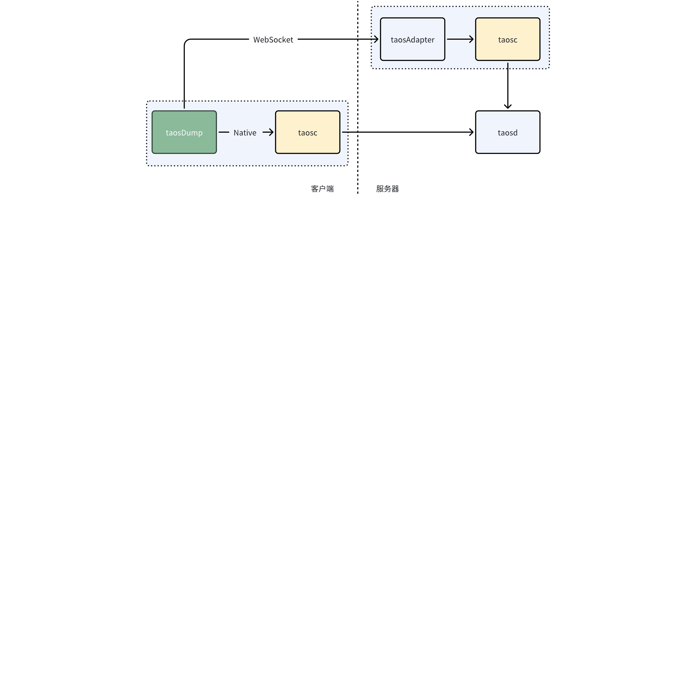
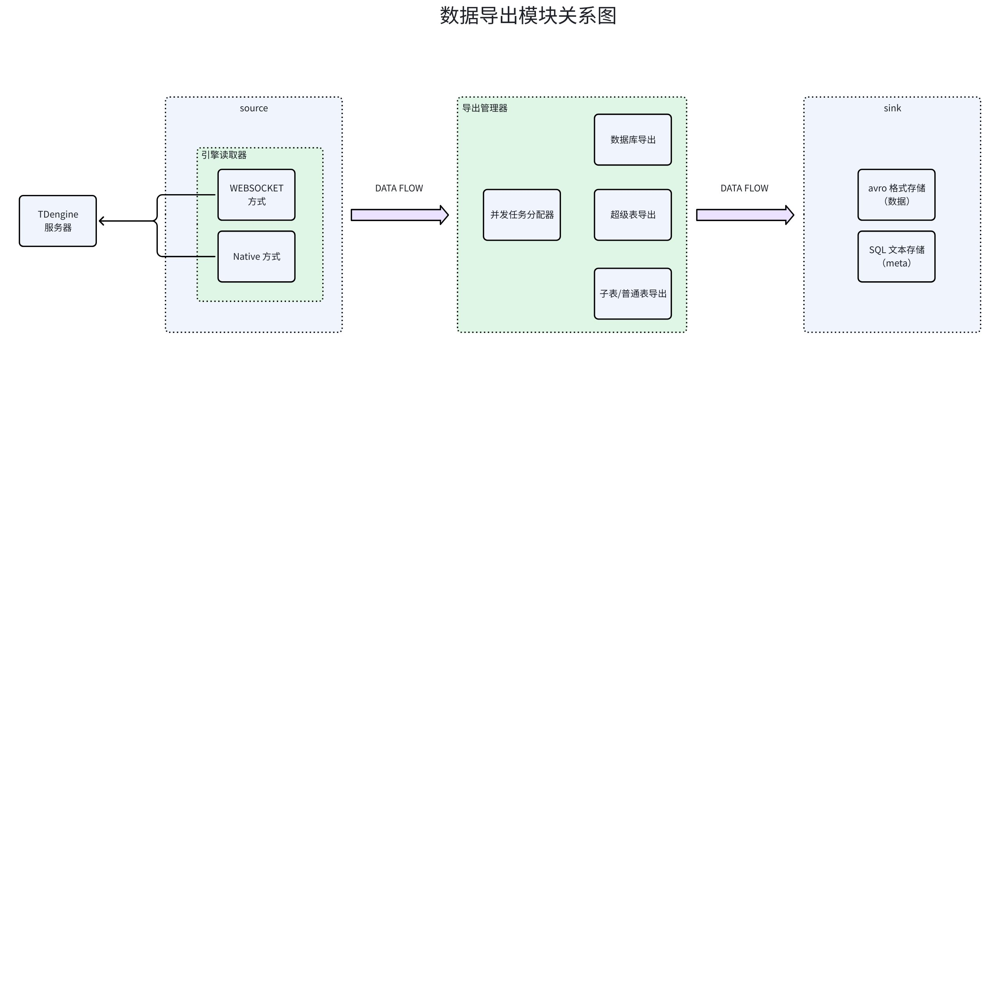
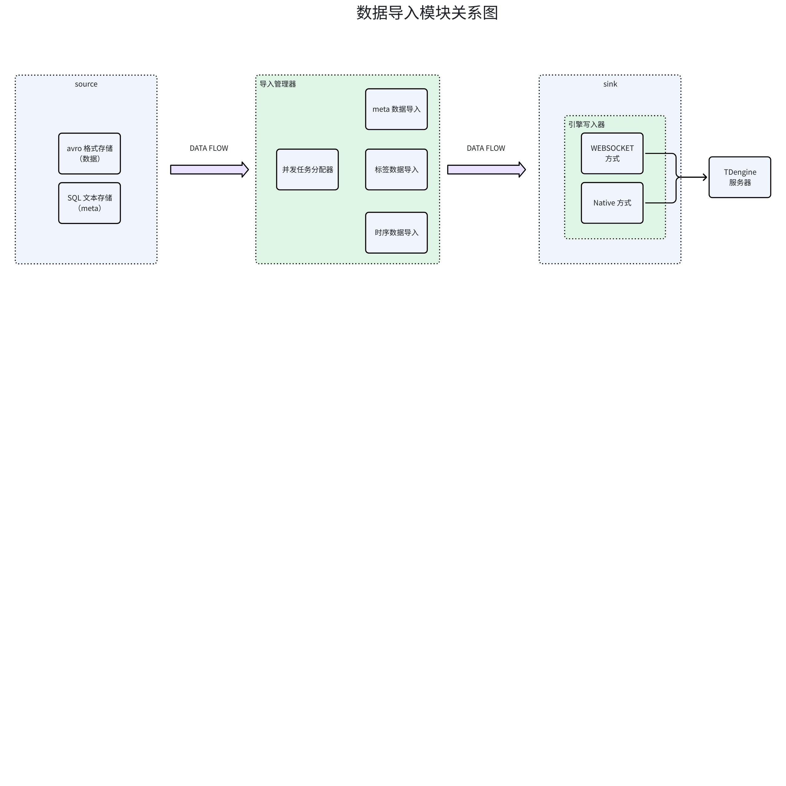
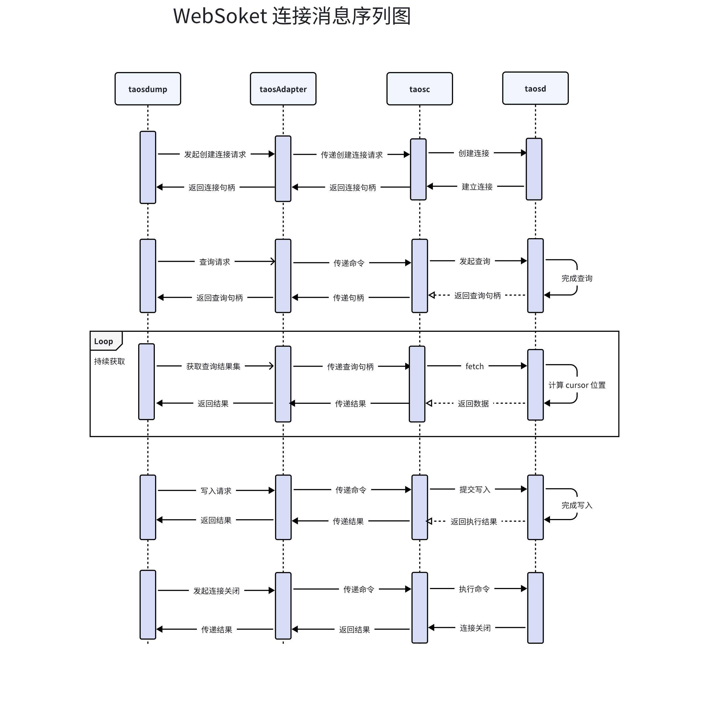
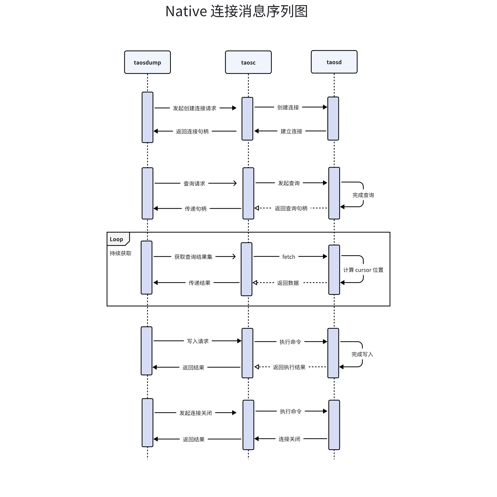

# 数据备份工具-Design Spec

## 1. 修订记录

| 日期 | 版本 | 负责人 | 主要修改内容 |
| --- | --- | --- | --- |
| 2025/01/13 | 1.0 | 段宽军 | 完成初稿 |
| 2026/01/05 | 1.1 | 佘彦杰 | 根据新需求修改 |

## 2. 引言

1. 目的： 对 [taosDump-Requirement Spec](https://taosdata.feishu.cn/wiki/UtWOw8H5HiEBG5kiYKVc5AIfnVb) 中需求项进行技术实现方案设计
2. 范围： 基于[taosDump-需求说明- 段宽军](https://taosdata.feishu.cn/wiki/UtWOw8H5HiEBG5kiYKVc5AIfnVb) 确定需求范围设计
3. 受众：开发、设计、运维

## 3. 术语

1. **无模式写入：**是指在写入数据时无需预先定义表结构，系统会根据数据自动创建或调整表结构的特性。
2. **数据订阅：**允许客户端实时接收数据库中的数据变化，适用于实时监控场景。
3. **参数绑定：**是在 SQL 语句中使用占位符替代具体值的技术，可以防止 SQL 注入并提高性能。
4. **WebSocket：** 是一种在单个 TCP 连接上提供全双工通信的协议。它允许客户端和服务器之间的双向实时通信，避免了 HTTP 请求-响应模型的限制。WebSocket 协议的定义和规范是由 IETF（Internet Engineering Task Force）标准化的，其主要文档是 [RFC 6455](https://datatracker.ietf.org/doc/html/rfc6455)。
5. **taosd：**TDengine 数据库引擎的核心服务，提供数据访问，多副本，高可用，数据压缩等功能。
6. **taosAdapter：**一个 TDengine 的配套工具，是 TDengine 集群和应用程序之间的桥梁和适配器。提供了 REST/WebSocket 接口来访问 TDengine。
7. **taosc：**taosc（应用驱动）是 TDengine 为应用程序提供的驱动程序，负责处理应用程序与集群之间的接口交互。taosc 提供了 C/C++ 语言的原生接口，并被内嵌于 JDBC、C#、Python、Go 等多种编程语言的连接库中，从而支持这些编程语言与数据库交互。

## 4. 概述

1. 整体架构：



1. 技术及框架
   - 开发语言： C 语言
   - 线程管理： POSIX Threads
   - 参数管理： GNU C Libaray 中 argp (https://www.gnu.org/software/libc)
   - json 格式解析器:  cJson (https://github.com/DaveGamble/cJSON)
2. 依赖项:
   - TDengine 客户端动态库（libtaos.so）

## 5. 设计考虑

1. 假设和限制
  - 假设
    - 使用者对数据库产品及工具有一些使用经验
  - 限制
    - TDengine 3.0 及以上版本
1. 设计模式和原则
  模式：单例模式
  原则：
  - 模块化原则：将软件划分为独立的模块，每个模块完成特定的功能，模块之间的耦合度最小化，便于软件的开发、维护和扩展
  - 可扩展原则：所设计的系统应具有对外界环境条件变化的适应性，保证软件良好的生存力
  - 简单性原则：力求软件结构简单，避免不必要的复杂化

## 6. 详细设计

### 6.1 组件设计

- 组件整体图




- WebSocket 连接消息序列图


- Native 连接消息序列图


### 6.2 关键数据结构

#### 6.2.1 参数解析模块

- 命令行参数存储结构
```c

/* Used by main to communicate with parse_opt. */
typedef struct arguments {
    // connection option
    char    *host;
    char    *user;
    char     password[TSDB_USER_PASSWORD_LONGLEN];
    uint16_t port;
    // strlen(taosdump.) +1 is 10
    char     outpath[DUMP_DIR_LEN];
    char     inpath[DUMP_DIR_LEN];
    // result file
    char    *resultFile;
    // dump unit option
    bool     all_databases;
    bool     databases;
    char    *databasesSeq;
    // dump format option
    bool     schemaonly;
    bool     with_property;
    bool     avro;
    int      avro_codec;
    int64_t  start_time;
    char     humanStartTime[HUMAN_TIME_LEN];
    int64_t  end_time;
    char     humanEndTime[HUMAN_TIME_LEN];
    char     precision[8];

    int32_t  data_batch;
    bool     data_batch_input;
    int32_t  max_sql_len;
    bool     allow_sys;
    bool     escape_char;
    bool     db_escape_char;
    bool     loose_mode;
    bool     inspect;
    // other options
    int32_t  thread_num;
    int      abort;
    char   **arg_list;
    int      arg_list_len;
    bool     isDumpIn;
    bool     debug_print;
    bool     verbose_print;
    bool     performance_print;
    bool     dotReplace;
    int      dumpDbCount;

    int8_t   connMode;
    bool     port_inputted;
    char    *dsn;

    // put rename db string
    char      * renameBuf;
    SRenameDB * renameHead;
    // retry for call engine api
    int32_t     retryCount;
    int32_t     retrySleepMs;  
        
} SArguments;
```

- 命令行参数显示结构
```c
static struct argp_option options[] = {
    // connection option
    {"host", 'h', "HOST",    0,
        "Server host from which to dump data. Default is localhost.", 0},
    {"user", 'u', "USER",    0,
        "User name used to connect to server. Default is root.", 0},
    {"password", 'p', 0, 0,
        "User password to connect to server. Default is taosdata.", 0},
    {"port", 'P', "PORT",        0,  "Port to connect.", 0},
    // input/output file
    {"outpath", 'o', "OUTPATH",     0,  "Output file path.", 1},
    {"inpath", 'i', "INPATH",      0,  "Input file path.", 1},
    {"resultFile", 'r', "RESULTFILE",  0,
        "DumpOut/In Result file path and name.", 1},
    {"config-dir", 'c', "CONFIG_DIR",  0,
        "Configure directory. Default is /etc/"CUS_PROMPT".", 1},
    // dump unit options
    {"all-databases", 'A', 0, 0,  "Dump all databases.", 2},
    {"databases", 'D', "DATABASES", 0,
        "Dump listed databases. Use comma to separate databases names.", 2},
    {"escape-character",   'e', 0, 0,  "Use escaped character for database name.", 2},
    {"allow-sys",   'a', 0, 0,  "Allow to dump system database (2.0 only).", 2},
    // dump format options
    {"schemaonly", 's', 0, 0,  "Only dump table schemas.", 2},
    {"without-property", 'N', 0, 0,
        "Dump database without its properties.", 2},
    {"avro-codec", 'd', "snappy", 0,
        "Choose an avro codec among null, deflate, snappy, and lzma(Windows is not currently supported).", 4},
    {"start-time",    'S', "START_TIME",  0,
        "Start time to dump. Either epoch or ISO8601/RFC3339 format is "
            "acceptable. ISO8601 format example: 2017-10-01T00:00:00.000+0800 "
            "or 2017-10-0100:00:00:000+0800 or '2017-10-01 00:00:00.000+0800'.",
        8},
    {"end-time",      'E', "END_TIME",    0,
        "End time to dump. Either epoch or ISO8601/RFC3339 format is "
            "acceptable. ISO8601 format example: 2017-10-01T00:00:00.000+0800 "
            "or 2017-10-0100:00:00.000+0800 or '2017-10-01 00:00:00.000+0800'.",
        9},
    {"data-batch",  'B', "DATA_BATCH",  0,  "Number of data per query/insert "
        "statement when backup/restore. Default value is 16384. If you see "
            "'error actual dump .. batch ..' when backup or if you see "
            "'WAL size exceeds limit' error when restore, "
                 "please adjust the value to a "
            "smaller one and try. The workable value is related to the length "
            "of the row and type of table schema.", 10},
    {"thread-num",  'T', "THREAD_NUM",  0,
// DEFAULT_THREAD_NUM
        "Number of threads for dump in/out data. Default is 8.", 10},
    {"loose-mode",  'L', 0,  0,
        "Use loose mode if the table name and column name use letter and "
            "number only. Default is NOT.", 10},
    {"inspect",  'I', 0,  0,
        "inspect avro file content and print on screen.", 10},
    {"no-escape",  'n', 0,  0,  "No escape char '`'. Default is using it.", 10},
    {"restful",  'R', 0,  0,  "Use RESTful interface to connect server.", 11},
    {"cloud",  'C', "CLOUD_DSN",  0, OLD_DSN_DESC, 11},
    {"timeout", 't', "SECONDS", 0, "The timeout seconds for "
                 "websocket to interact."},
    {"debug",   'g', 0, 0,  "Print debug info.", 15},
    {"dot-replace", 'Q', 0, 0,  "Replace dot character with underline character in the table name.", 10},
    {"rename", 'W', "RENAME-LIST", 0, "Rename database name with new name during importing data. \
        RENAME-LIST: \"db1=newDB1|db2=newDB2\" means rename db1 to newDB1 and rename db2 to newDB2.", 10},
    {"retry-count", 'k', "VALUE", 0, "Set the number of retry attempts for connection or query failures.", 11},
    {"retry-sleep-ms", 'z', "VALUE", 0, "Sleep interval between retries, in milliseconds.", 11},
    {"dsn",  'X', "DSN",  0, DSN_DESC, 11},
    {DRIVER_OPT, 'Z', "DRIVER", 0, DRIVER_DESC},
    {"version", 'V', 0, 0, "Print program version."},
    {0}
};
```

- 默认参数
```bash {wrap}
struct arguments g_args = {
    // connection option
    NULL,
    "root",
    "taosdata",
    0,          // port
    // outpath and inpath
    "",
    "",
    "./dump_result.txt",  // resultFile
    // dump unit option
    false,      // all_databases
    false,      // databases
    NULL,       // databasesSeq
    // dump format option
    false,      // schemaonly
    true,       // with_property
    true,       // avro
    AVRO_CODEC_SNAPPY,    // avro_codec
    DEFAULT_START_TIME,   // start_time
    {0},        // humanStartTime
    DEFAULT_END_TIME,   // end_time
    {0},        // humanEndTime
    "ms",       // precision
    MAX_RECORDS_PER_REQ / 2,    // data_batch
    false,      // data_batch_input
    TSDB_DEFAULT_PKT_SIZE,   // max_sql_len
    false,      // allow_sys
    true,       // escape_char
    false,      // db_escape_char
    false,      // loose_mode
    false,      // inspect
    // other options
    DEFAULT_THREAD_NUM,   // thread_num
    0,          // abort
    NULL,       // arg_list
    0,          // arg_list_len
    false,      // isDumpIn
    false,      // debug_print
    false,      // verbose_print
    false,      // performance_print
    false,      // dotRepalce
        0,      // dumpDbCount

    CONN_MODE_INVALID, // connMode
    NULL,       // dsn
    false,      // port_inputted

    NULL,       // renameBuf
    NULL,       // renameHead
    3,          // retryCount
    1000        // retrySleepMs
};
```

#### 6.2.2 导出管理器

- 数据库导出
```c {wrap}
typedef struct {
    char     name[TSDB_DB_NAME_LEN];
    char     create_time[32];
    int64_t  ntables;
    int32_t  vgroups;
    int16_t  replica;
    char     strict[STRICT_LEN];
    int16_t  quorum;
    int16_t  days;
    char     duration[DURATION_LEN];
    char     keeplist[KEEPLIST_LEN];
    int32_t  cache;   // MB
    int32_t  blocks;
    int32_t  minrows;
    int32_t  maxrows;
    int8_t   wallevel;
    int8_t   wal;     // 3.0 only
    int32_t  fsync;
    int8_t   comp;
    int8_t   cachelast;
    bool     cache_model;
    char     precision[DB_PRECISION_LEN];   // time resolution
    bool     single_stable_model;
    int8_t   update;
    char     status[DB_STATUS_LEN];
    int64_t  dumpTbCount;
    uint64_t uniqueID;
    char     dirForDbDump[MAX_DIR_LEN];
} SDbInfo;
```

- 超级表导出
```c {wrap}
// DESCRIBE STABLE CONFIGURE ------------------------------
enum _describe_table_index {
    TSDB_DESCRIBE_METRIC_FIELD_INDEX,
    TSDB_DESCRIBE_METRIC_TYPE_INDEX,
    TSDB_DESCRIBE_METRIC_LENGTH_INDEX,
    TSDB_DESCRIBE_METRIC_NOTE_INDEX,
    TSDB_MAX_DESCRIBE_METRIC
};
// super table fields describe
typedef struct {
    char name[TSDB_TABLE_NAME_LEN+1];
    int columns;
    int tags;
    ColDes cols[];
} TableDes;
```

- 子表/普通表导出 
```c {wrap}
// column infomation
typedef struct {
    int16_t bytes;
    int8_t  type;
} SOColInfo;

#define COL_NOTE_LEN        32
#define COL_TYPEBUF_LEN     16
#define COL_VALUEBUF_LEN    32

// columns des
typedef struct {
    char field[TSDB_COL_NAME_LEN];
    int type;
    int length;
    char note[COL_NOTE_LEN];
    char value[COL_VALUEBUF_LEN];
    char *var_value;
    int16_t idx;
} ColDes;

// fields 
typedef struct FieldStruct_S {
    char name[TSDB_COL_NAME_LEN];
    int type;
    bool nullable;
    bool is_array;
    int array_type;
} FieldStruct;
```

- 并发任务分配器
```c {wrap}
typedef struct {
    pthread_t threadID;
    int32_t   threadIndex;
    SDbInfo   *dbInfo;
    char      stbName[TSDB_TABLE_NAME_LEN];
    TableDes  *stbDes;
    char      **tbNameArr;
    int       precision;
    void      *taos;
    uint64_t  count;
    int64_t   from;
    int64_t   stbSuccess;
    int64_t   stbFailed;
    int64_t   ntbSuccess;
    int64_t   ntbFailed;
    int64_t   recSuccess;
    int64_t   recFailed;
    enAVROTYPE  avroType;
    char      dbPath[MAX_DIR_LEN];
    DBChange  *pDbChange;
} threadInfo;
```

#### 6.2.3 导出 Source

- 连接数据结构
```c
typedef struct arguments {
    // connection option
    char    *host;
    char    *user;
    char     password[SHELL_MAX_PASSWORD_LEN];
    uint16_t port;
    char    *dsn;
    ...
}
```

#### 6.2.4 导出 Sink

- Avro 格式存储
```c
// avro value
typedef struct avro_value {
    avro_value_iface_t  *iface;
    void  *self;
} avro_value_t;

// avro format
enum AVRO_CODEC {
    AVRO_CODEC_START = 0,
    AVRO_CODEC_NULL = AVRO_CODEC_START,
    AVRO_CODEC_DEFLATE,
    AVRO_CODEC_SNAPPY,
    AVRO_CODEC_LZMA,
    AVRO_CODEC_UNKNOWN,
    AVRO_CODEC_INVALID
};

// avro object 
struct avro_obj_t {
    avro_type_t type;
    avro_class_t class_type;
    volatile int  refcount;
};

// avro type
enum avro_type_t {
    AVRO_STRING,
    AVRO_BYTES,
    AVRO_INT32,
    AVRO_INT64,
    AVRO_FLOAT,
    AVRO_DOUBLE,
    AVRO_BOOLEAN,
    AVRO_NULL,
    AVRO_RECORD,
    AVRO_ENUM,
    AVRO_FIXED,
    AVRO_MAP,
    AVRO_ARRAY,
    AVRO_UNION,
    AVRO_LINK
};
typedef enum avro_type_t avro_type_t;

// avro class
enum avro_class_t {
    AVRO_SCHEMA,
    AVRO_DATUM
};
```

- 表信息管理数据结构
```c
// table describe
typedef struct {
    char name[TSDB_TABLE_NAME_LEN+1];
    int columns;
    int tags;
    ColDes cols[];
} TableDes;

// table info include TableDes
typedef struct {
    char name[TSDB_TABLE_NAME_LEN];
    bool belongStb;
    char stable[TSDB_TABLE_NAME_LEN];
    TableDes *stbTableDes;
} TableInfo;

// table record for stable
typedef struct {
    char name[TSDB_TABLE_NAME_LEN];
    char stable[TSDB_TABLE_NAME_LEN];
} TableRecord;
```

#### 6.2.5 导入管理器

- 标签数据导入
```c {wrap}
enum enAVROTYPE {
    AVRO_TBTAGS = 0,
    AVRO_NTB,
    AVRO_DATA,
    AVRO_UNKNOWN,
    AVRO_INVALID
};

typedef enum enAVROTYPE AVROTYPE;
```

- 时序数据导入
```c {wrap}
typedef struct RecordSchema_S {
    int version;
    char name[RECORD_NAME_LEN];
    char *fields;
    int  num_fields;

    // read stb_schema_for_db
    char stbName[TSDB_TABLE_NAME_LEN]; 
    TableDes *tableDes;    
} RecordSchema;

```

- 并发任务分配器
```c {wrap}
typedef struct {
    pthread_t threadID;
    int32_t   threadIndex;
    SDbInfo   *dbInfo;
    char      stbName[TSDB_TABLE_NAME_LEN];
    TableDes  *stbDes;
    char      **tbNameArr;
    int       precision;
    void      *taos;
    uint64_t  count;
    int64_t   from;
    int64_t   stbSuccess;
    int64_t   stbFailed;
    int64_t   ntbSuccess;
    int64_t   ntbFailed;
    int64_t   recSuccess;
    int64_t   recFailed;
    enAVROTYPE  avroType;
    char      dbPath[MAX_DIR_LEN];
    DBChange  *pDbChange;
} threadInfo;
```

#### 6.2.6 导入 Source

- avro 数据格式
```c
// avro value
typedef struct avro_value {
    avro_value_iface_t  *iface;
    void  *self;
} avro_value_t;

// avro format
enum AVRO_CODEC {
    AVRO_CODEC_START = 0,
    AVRO_CODEC_NULL = AVRO_CODEC_START,
    AVRO_CODEC_DEFLATE,
    AVRO_CODEC_SNAPPY,
    AVRO_CODEC_LZMA,
    AVRO_CODEC_UNKNOWN,
    AVRO_CODEC_INVALID
};

// avro object 
struct avro_obj_t {
    avro_type_t type;
    avro_class_t class_type;
    volatile int  refcount;
};

// avro type
enum avro_type_t {
    AVRO_STRING,
    AVRO_BYTES,
    AVRO_INT32,
    AVRO_INT64,
    AVRO_FLOAT,
    AVRO_DOUBLE,
    AVRO_BOOLEAN,
    AVRO_NULL,
    AVRO_RECORD,
    AVRO_ENUM,
    AVRO_FIXED,
    AVRO_MAP,
    AVRO_ARRAY,
    AVRO_UNION,
    AVRO_LINK
};
typedef enum avro_type_t avro_type_t;

// avro class
enum avro_class_t {
    AVRO_SCHEMA,
    AVRO_DATUM
};
```

- 表信息管理数据结构
```c
// table describe
typedef struct {
    char name[TSDB_TABLE_NAME_LEN+1];
    int columns;
    int tags;
    ColDes cols[];
} TableDes;

// table info include TableDes
typedef struct {
    char name[TSDB_TABLE_NAME_LEN];
    bool belongStb;
    char stable[TSDB_TABLE_NAME_LEN];
    TableDes *stbTableDes;
} TableInfo;

// table record for stable
typedef struct {
    char name[TSDB_TABLE_NAME_LEN];
    char stable[TSDB_TABLE_NAME_LEN];
} TableRecord;
```

#### 6.2.7 导入 Sink

- 接口连接数据结构
```c
typedef struct arguments {
    // connection option
    char    *host;
    char    *user;
    char     password[SHELL_MAX_PASSWORD_LEN];
    uint16_t port;
    char    *dsn;
    ...
}
```


### 6.3 组件详细设计

#### 6.3.1 参数解析模块

参数解析使用 argp 完成
- 设置 argp 框架解析参数
```c
// main use argp frame
static void parse_args(
        int argc, char *argv[], SArguments *arguments) 

// struct for argp
static struct argp argp = {options, parse_opt, args_doc, doc};

// argp docs
static char args_doc[] = "dbname [tbname ...]\n--databases db1,db2,... \n"
    "--all-databases\n-i inpath\n-o outpath";

```

- struct argp_option 定义支持的命令行参数
```c
static struct argp_option options[] = {
    // connection option
    {"host", 'h', "HOST", 0, "Server host from which to dump data. Default is localhost.", 0},
    {"user", 'u', "USER", 0, "User name used to connect to server. Default is root.", 0},
      ...
}
```

- 在 parse_opt 函数中处理响应命令行为
```c
static error_t parse_opt(int key, char *arg, struct argp_state *state);
```

#### 6.3.2 导出管理器

导出管理器是导出功能核心，控制 source 至 sink 数据实现
- 数据库导出
数据库导出模块实现对整个数据库数据导出行为，具体实现仍然是由导出超级表及超出子表/普通表实现，但他设计为一个组织者的身份
```c
/* main interfalce
   export whole database 
   params:
     @ taos_v connect handle
     @ dbInfo include database information
     @ fp     dbs.sql file handle
  return value:
     0: success 
     other: error
*/
static int64_t dumpWholeDatabase(void **taos_v, SDbInfo *dbInfo, FILE *fp) 

/* 
   export whole database for meta
   params:
     @ taos_v connect handle
     @ dbInfo include database information
     @ fp     dbs.sql file handle
  return value:
     0: success 
     other: error
*/
static void dumpCreateDbClause(
        void **taos_v,
        SDbInfo *dbInfo, bool isDumpProperty, FILE *fp) 
```

- 超级表导出
```c
/*
   export super table and childs talbes 
   params:
     @ taos_v connect handle
     @ dbInfo include database information
     @ fp     dbs.sql file handle
  return value:
     0: success 
     other: error
*/

static int64_t dumpStbAndChildTbOfDb(
        TAOS **taos_v, SDbInfo *dbInfo, FILE *fpDbs)
```

- 子表/普通表导出
```c
/*
   export child or normal tables 
   params:
     @ index   index for child table list on thread
     @ stable    stable name
     @ belongStb True is child table else normal table
     @ dbInfo include database information     
     @ precision  database precision
     @ colCount  data cols + tags cols number
     @ stbDes    table struct describe
  return value:
     0: success 
     other: error
*/
static int64_t dumpTableDataAvro(
        const int64_t index,
        const char *stable,
        const bool belongStb,
        const SDbInfo *dbInfo,
        const int precision,
        const int colCount,
        TableDes *tableDes
        )
```

- 并发任务分配器
下面内容设计了并发任务发生分配逻辑放到了超级表数据导出函数中，以并发任务数为循环次数，设计了线程创建、执行及等待和完成的逻辑及主要调用函数的调用参数。
```c
/*
   export super table data 
   params:
     @ dbInfo      include database information
     @ stbDes      table struct describe     
     @ tbnameArr   for all child table name list
     @ tbCount     child table name count

  return value:
     0: success 
     other: error
*/

int dumpSTableData(SDbInfo* dbInfo, TableDes* stbDes, char** tbNameArr, int64_t tbCount) {
    int threads = g_args.thread_num;
    int64_t batch = tbCount / threads;
    if (batch < 1) {
        threads = tbCount;
        batch = 1;
    }

    TOOLS_ASSERT(threads);
    int64_t mod = tbCount % threads;

    pthread_t *pids = calloc(1, threads * sizeof(pthread_t));
    threadInfo *infos = calloc(1, threads * sizeof(threadInfo));
    TOOLS_ASSERT(pids);
    TOOLS_ASSERT(infos);

    infoPrint("create %d thread(s) to export data ...\n", threads);
    threadInfo *pThreadInfo;
    for (int32_t i = 0; i < threads; i++) {
        pThreadInfo = infos + i;
        if (NULL == (pThreadInfo->taos = taosConnect(dbInfo->name))) {
            free(pids);
            free(infos);
            return -1;
        }

        pThreadInfo->threadIndex = i;
        pThreadInfo->count = (i < mod) ? batch+1 : batch;
        pThreadInfo->from = (i == 0)?0:
            ((threadInfo *)(infos + i - 1))->from +
            ((threadInfo *)(infos + i - 1))->count;
        pThreadInfo->dbInfo = dbInfo;
        pThreadInfo->precision = getPrecisionByString(dbInfo->precision);
        if (-1 == pThreadInfo->precision) {
            errorPrint("%s() LN%d, get precision error\n", __func__, __LINE__);
            exit(EXIT_FAILURE);
        }

        strcpy(pThreadInfo->stbName, stbDes->name);
        pThreadInfo->stbDes = stbDes;
        pThreadInfo->tbNameArr   = tbNameArr;
        if (pthread_create(pids + i, NULL,
                    dumpTablesOfStbThread, pThreadInfo) != 0) {
            errorPrint("%s() LN%d, thread[%d] failed to start. "
                    "The errno is %d. Reason: %s\n",
                    __func__, __LINE__,
                    pThreadInfo->threadIndex, errno, strerror(errno));
            exit(EXIT_FAILURE);
        }
    }

    for (int32_t i = 0; i < threads; i++) {
        if (pthread_join(pids[i], NULL) != 0) {
            errorPrint("%s() LN%d, thread[%d] failed to join. "
                    "The errno is %d. Reason: %s\n",
                    __func__, __LINE__,
                    i, errno, strerror(errno));
            exit(EXIT_FAILURE);
        }
    }

    infoPrint("super table (%s) dump %"PRId64" child data ok. close taos connections...\n",
            stbDes->name, tbCount);
    for (int32_t i = 0; i < threads; i++) {
        pThreadInfo = infos + i;
        taos_close(pThreadInfo->taos);
    }

    free(pids);
    free(infos);
    return 0;
}

/*
   start thread to execute dump out super table data 
   params:
     @ arg      threadInfo struct for thread arg
  return value:
     0: success 
     other: error
*/
static void *dumpTablesOfStbThread(void *arg)

```

#### 6.3.3 导出 Source

- 查询数据接口
```c
/*
   start thread to execute dump out child tables data 
   params:
     @ taos        native connect handle
     @ sql         query sql clause
     @ code        error code return

  return value:
     if successful return result for query
     else return NULL
*/

TAOS_RES *taosQuery(TAOS *taos, const char *sql, int32_t *code)
```

#### 6.3.4 导入管理器

导入管理器是导入功能核心，控制 source 至 sink 数据实现
- Meta 数据导入
```c
  /*
    dump in dbs.sql in dbPath
   params:
     @ dbPath      dump in path

   return value:
     0: success 
     other: error
*/
static int dumpInDbs(const char *dbPath) 
```

- 标签数据导入
```c {wrap}
  /*
    dump tags to taos_v connect db from avro fileName
   params:
     @ taos_v      sink db connect handle
     @ namespace   current avro namespace
     @ schema      avro_schema
     @ reader      avro reader
     @ fileName    avro file name for dump in
     @ pDbChange    record db table schema changed
     @ recordSchema avro record schema
   return value:
     >=0: dump in rows count
     < 0: error
*/
static int64_t dumpInAvroTbTagsImpl(
        void **taos_v,
        const char *namespace,
        avro_schema_t schema,
        avro_file_reader_t reader,
        char *fileName,
        DBChange *pDbChange,
        RecordSchema *recordSchema) 
```

- 时序数据导入
```c
  /*
    dump data to taos_v connect db from avro fileName
   params:
     @ taos_v      sink db connect handle
     @ namespace   current avro namespace
     @ schema      avro_schema
     @ reader      avro reader
     @ recordSchema avro record schema
     @ pDbChange    All super tables in the database where SCHEMA changes have occurred
     @ stbChange    Detailed information about SCHEMA changes in the target super table
     @ dbPath       Directory path for importing the database   
     @ fileName    avro file name for dump in
   return value:
     >=0: dump in rows count
     < 0: error
*/
static int64_t dumpInAvroDataImpl(
        void **taos_v,
        char *namespace,
        avro_schema_t schema,
        avro_file_reader_t reader,
        RecordSchema *recordSchema,
        DBChange     *pDbChange,
        StbChange    *stbChange,
        const char   *dbPath,
        char *fileName)
```

- 导入并发任务分配器
导入并发任务分配器对导入目录中的文件进行分析汇总后，把需要导入的文件数分组，每个组由一个线程去完成，整体分配策略如下设计了主要逻辑及重要代码片断：
```c
  /*
    dump in all data in dbPath filter is typeExt
   params:
     @ dbPath      input dump in path
     @ typeExt     filter file ext , only this file ext data file dump in
     @ pDbChange    All super tables in the database where SCHEMA changes have occurred
  return value:
     0: success
     other: error
*/

static int dumpInAvroWorkThreads(const char* dbPath, const char *typeExt, DBChange *pDbChange) {
    infoPrint("%s() dump in %s files ...\n", __func__, typeExt);
    int64_t fileCount = getFilesNum(dbPath, typeExt);

     ...

    int32_t threads = g_args.thread_num;

    int64_t a = fileCount / threads;
    if (a < 1) {
        threads = fileCount;
        a = 1;
    }

    int64_t b = 0;
    if (threads != 0) {
        b = fileCount % threads;
    }

    enAVROTYPE avroType = createDumpinList(dbPath, typeExt, fileCount);

    threadInfo *pThreadInfo;

    pthread_t *pids = calloc(1, threads * sizeof(pthread_t));
    threadInfo *infos = (threadInfo *)calloc(
            threads, sizeof(threadInfo));
    ...


    int64_t from = 0;

    for (int32_t t = 0; t < threads; ++t) {
        pThreadInfo = infos + t;
        pThreadInfo->threadIndex = t;
        pThreadInfo->avroType = avroType;
        pThreadInfo->pDbChange = pDbChange;

        pThreadInfo->from = from;
        pThreadInfo->count = (t < b)?a+1:a;
        from += pThreadInfo->count;
        ...

        if (pthread_create(pids + t, NULL,
                    dumpInAvroWorkThreadFp, (void*)pThreadInfo) != 0) {
           ...
        }
    }

    for (int32_t i = 0; i < threads; i++) {
        if (pthread_join(pids[i], NULL) !=0) {
            ...
        }
    }

    ...
}


/*
   start thread to execute dump out child tables data 
   params:
     @ arg      threadInfo struct for thread arg
  return value:
     0: success 
     other: error
*/

static void* dumpInAvroWorkThreadFp(void *arg)

```

#### 6.3.5 导入 Source

- Avro 存储格式
```c
/*
   get data from avro file
   params:
     @ avroType    avro type , see AVROTYPE define
     @ avroFile    avro file name
     @ schema      avro schema
     @ reader      avro reader
  return value:
     RecordSchema pointer
     return NULL if failed
*/

static RecordSchema *getSchemaAndReaderFromFile(
        AVROTYPE avroType, char *avroFile,
        avro_schema_t *schema,
        avro_file_reader_t *reader) 
```

- SQL 文本存储
```c
/*
   sql text file dump in database
   params:
     @ taos_v     dump in database connect handle
     @ fp         file handle for sql file
     @ fileName   filename for fp, using log
  return value:
     >= 0  : total rows for dump out
     == -1 :  failed 
*/

static int64_t dumpInOneDebugFile(
        void** taos_v, FILE* fp,
        char* fcharset,
        char* fileName) 
```

#### 6.3.6 导入 Sink

- WebSocket & Native 导入逻辑设计及接口调用示例（绿色 WEBSOCKET 红色 Native 蓝色重要调用逻辑）
```c
 /*
    dump data to taos_v connect db from avro fileName
   params:
     @ taos_v      sink db connect handle
     @ namespace   current avro namespace
     @ schema      avro_schema
     @ reader      avro reader
     @ recordSchema avro record schema
     @ pDbChange    All super tables in the database where SCHEMA changes have occurred
     @ stbChange    Detailed information about SCHEMA changes in the target super table
     @ dbPath       Directory path for importing the database          
     @ fileName    avro file name for dump in
   return value:
     >=0: dump in rows count
     < 0: error
*/

static int64_t dumpInAvroDataImpl(
        void **taos_v,
        char *namespace,
        avro_schema_t schema,
        avro_file_reader_t reader,
        RecordSchema *recordSchema,
        DBChange     *pDbChange,
        StbChange    *stbChange,
        const char   *dbPath,
        char *fileName) {

    // init stmt
    int32_t    code = 0;
    TAOS_STMT *stmt = NULL;
    stmt = taos_stmt_init(*taos_v);
    ...

    // table des
    TableDes  *tableDes   = NULL;
    TableDes  *mallocDes  = NULL;

    if(stbChange) {
        // use super table des
        tableDes = stbChange->tableDes;
    }

    // calc bind cols count
    int32_t colAdj    = g_dumpInLooseModeFlag ? 0 : 1;
    int32_t nBindCols = recordSchema->num_fields - colAdj;
    if (stbChange && stbChange->schemaChanged) {
        // need part columns bind
        infoPrint("Full fields:%d bind part fields:%d stb:%s\n", nBindCols, stbChange->tableDes->columns, stbChange->tableDes->name);
        nBindCols = stbChange->tableDes->columns;
    }

    char *bindArray = calloc(1, sizeof(TAOS_MULTI_BIND) * nBindCols);
   ...

    avro_value_iface_t *value_class = avro_generic_class_from_schema(schema);
    avro_value_t value;
    avro_generic_value_new(value_class, &value);

    int64_t success = 0;
    int64_t failed = 0;
    int64_t count = 0;
    int64_t countTSOutOfRange = 0;
    char    *tbName = NULL;

    bool printDot = true;
    while (!avro_file_reader_read_value(reader, &value)) {
        //
        // get tbName from avro
        //
        if(tbName == NULL) {
            // get tb name
            avro_value_t tbname_value, tbname_branch;
            if (!g_dumpInLooseModeFlag) {
                avro_value_get_by_name(&value, "tbname", &tbname_value, NULL);
                avro_value_get_current_branch(&tbname_value, &tbname_branch);

                size_t tbname_size;
                char * avroName = NULL;
                avro_value_get_string(&tbname_branch,
                        (const char **)&avroName, &tbname_size);
                tbName = strdup(avroName);
            } else {
                tbName = malloc(TSDB_TABLE_NAME_LEN+1);
                TOOLS_ASSERT(tbName);

                char *dupSeq = strdup(fileName);
                char *running = dupSeq;
                strsep(&running, ".");
                char *tb = strsep(&running, ".");

                strcpy(tbName, tb);
                free(dupSeq);
            }
            ...

            // read normal table stbChange
            if (stbChange == NULL) {
                if (normalTableFolder(dbPath)) {
                    stbChange = findStbChange(pDbChange, tbName);
                    if (stbChange) {
                        // bind
                        nBindCols = stbChange->tableDes->columns;
                        // tableDes
                        tableDes = stbChange->tableDes;
                    }
                }
            }

            // malloc table des
            if(tableDes == NULL) {
                // old data format no super table des
                mallocDes = (TableDes *)calloc(1, sizeof(TableDes) + sizeof(ColDes) * TSDB_MAX_COLUMNS);
                ...

                // set
                tableDes = mallocDes;
            }

            // escapedTbName
            const int escapedTbNameLen = TSDB_DB_NAME_LEN + TSDB_TABLE_NAME_LEN + 10;
            char *escapedTbName = calloc(1, escapedTbNameLen);
           ...

            // prepare
            if (stmtPrepare(stmt, escapedTbName, stbChange, recordSchema, nBindCols)) {
                // failed
                tfree(escapedTbName);
                FREE_DATAIMPL();
                return -1;
            }
            free(escapedTbName);
            escapedTbName = NULL;

            // get table des
            if ((0 == strlen(tableDes->name))
                    || (0 != strcmp(tableDes->name, tbName))) {

                if (mallocDes) {
                    // only old data format can get des from server
                    if (getTableDes(*taos_v, namespace, tbName, mallocDes, true) < 0) {
                        FREE_DATAIMPL();
                        return -1;
                    }
                }
            }
        } // tbName

        ...

        count++;

        TAOS_MULTI_BIND *bind;

        char is_null = 1;
        int64_t ts_debug = -1;
        int32_t n = 0; // tableDes index

        // cols loop
        for (int i = 0; i < recordSchema->num_fields - colAdj; i++) {

            bind = (TAOS_MULTI_BIND *)((char *)bindArray + (sizeof(TAOS_MULTI_BIND) * n));
            avro_value_t field_value;

            FieldStruct *field = (FieldStruct *)(recordSchema->fields + sizeof(FieldStruct)*(i + colAdj));

            //
            //  check  avro fields need filter
            //
            if (stbChange && stbChange->schemaChanged) {
                if(!idxInBindCols(i, stbChange->tableDes)) {
                    // remove col not exist on server
                    debugPrint("col idx:%d field:%s not in server, ignore.\n", i, field->name);
                    continue;
                } else {
                    debugPrint("col idx:%d field:%s in server.\n", i, field->name);
                }
            }

            bind->is_null = NULL;
            bind->num = 1;
            if (0 == i) {
                avro_value_get_by_name(&value,
                        field->name, &field_value, NULL);
                if (field->nullable) {
                    avro_value_t ts_branch;
                    avro_value_get_current_branch(&field_value, &ts_branch);
                    if (0 == avro_value_get_null(&ts_branch)) {
                        errorPrint("%s() LN%d, first column timestamp "
                                "should never be a NULL!\n",
                                __func__, __LINE__);
                    } else {
                        int64_t *ts = malloc(sizeof(int64_t));
                        TOOLS_ASSERT(ts);

                        avro_value_get_long(&ts_branch, ts);

                        ts_debug = *ts;
                        debugPrint2("%"PRId64" | ", *ts);
                        bind->buffer_type = TSDB_DATA_TYPE_TIMESTAMP;
                        bind->buffer_length = sizeof(int64_t);
                        bind->buffer = ts;
                        bind->length = (int32_t*)&bind->buffer_length;
                    }
                } else {
                    int64_t *ts = malloc(sizeof(int64_t));
                    TOOLS_ASSERT(ts);

                    avro_value_get_long(&field_value, ts);

                    ts_debug = *ts;
                    debugPrint2("%"PRId64" | ", *ts);
                    bind->buffer_type = TSDB_DATA_TYPE_TIMESTAMP;
                    bind->buffer_length = sizeof(int64_t);
                    bind->buffer = ts;
                }
            } else if (0 == avro_value_get_by_name(
                        &value, field->name, &field_value, NULL)) {

                // switch type read col value
                switch (tableDes->cols[n].type) {
                    case TSDB_DATA_TYPE_INT:
                        if (field->type != TSDB_DATA_TYPE_INT) {
                            warnPrint("field[%d] type is not int!\n", i);
                            bind->is_null = &is_null;
                        } else {
                            dumpInAvroDataInt(field, &field_value,
                                    bind, &is_null);
                        }
                        break;
                    ...

                }
                bind->buffer_type = tableDes->cols[n].type;
                bind->length = (int32_t *)&bind->buffer_length;
            }
            bind->num = 1;

            // tableDes index
            n ++;
        } // cols loop end
        debugPrint2("%s", "\n");
        assert (n == nBindCols);

        // bind batch
        if (0 != (code = taos_stmt_bind_param_batch(stmt,
                (TAOS_MULTI_BIND *)bindArray))) {
           ...
        }

        // add batch
        if (0 != (code = taos_stmt_add_batch(stmt))) {
           ...
        }

        // batch execute
        if ( 0 == (count % g_args.data_batch) ) {
            if( 0 != (code = taos_stmt_execute(stmt)) ){
                if (code == TSDB_CODE_TDB_TIMESTAMP_OUT_OF_RANGE) {
                    countTSOutOfRange++;
                } else {
                    ...
                }
                countFailureAndFree(bindArray, nBindCols, &failed, tbName);
                continue;
            } else {
                success += g_args.data_batch;
                debugPrint("ok call taos_stmt_execute count=%"PRId64" success=%"PRId64" failed=%"PRId64"\n",
                            count, success, failed);
            }
        }
        freeBindArray(bindArray, nBindCols);
    }

    // last batch execute
    ...

    return success;
}
```

## 7. 接口规范

1. 本工具以命令行参数形式对外提供功能使用，不对外提供 API
2. 用户界面：
   - 主操作界面由四部分组成：
    - 第一部分   欢迎及版本信息
    - 第二部分   参数展示：  用户设置参数及其它参数展示
    - 第三部分   进度信息：  输出正在导入/导出的库及表名，完成进度
    - 第四部分   结束统计：  导入/导出记录数
   - 历史记录通过操作上下箭头键翻看

## 8. 安全考虑

1. 连接远程服务器使用 token 展示及日志中只显示前6位用于识别 token 后面内容使用 * 号代替
2. ~~凭据保护（T-CLI-01）：密码/DSN token 禁止明文出现在日志、历史、错误输出；支持交互/环境变量读取；展示时掩码（仅保留前后少量字符）；翻看命令历史记录功能中不提供带密码的命令回翻。~~
3. ~~传输加固（T-CLI-02）：支持启用 TLS，建议生产系统强制使用 TLS 传输加密并记录配置。~~
4. ~~路径与权限校验（T-CLI-03）：导入/导出、日志输出路径需在允许目录内，拒绝路径穿越；输出文件权限设为 0600，禁止覆盖系统关键文件。~~
5. ~~输入校验与注入防护（T-CLI-04）：命令行/文件 SQL 做格式与长度校验；拒绝空密码远程连接；导入与文件执行配置大小、行数上限，异常时中断。~~
6. ~~缓存与信息最小化（T-CLI-05）：TAB 补全缓存设上限（子表约 100k，可配置/可关闭）；补全/错误输出去敏感化元数据。~~
7. ~~速率与配额（T-CLI-06）：网络检测与批量执行限制频率/并发，长耗时可中断，必要时二次确认。~~
8. ~~日志脱敏（T-CLI-07）：默认最小化输出；token 仅显示部分；调试/错误日志不含完整路径与凭据。~~
9. ~~审计可追溯（T-CLI-08）：连接/执行生成请求 ID，关键操作可选审计日志（无敏感内容）并与引擎日志关联。~~

## 9. 性能和可扩展性

性能：
- 支持最快的参数绑定写入方式
- 支持可配置并发度提升性能
- 支持配置压缩算法，提升传输性能
可扩展性：设计 Source 和 Sink 构架, 可扩展更多接入数据源及输出目标

## 10. 部署和配置

1. 部署流程：随 TDengine 安装包一起安装部署，不单独部署，部署流程请参考 TDengine 安装包
2. 配置管理： 与 TDengine 产品一致，请参考 TDengine 产品配置管理 
3. 版本控制：与 TDengine 产品版本号保持一致

## 11. 监控和维护

1. 命令行工具，不需要监控。
2. **日志记录和诊断：**
设计三个日志类别，分别为 info warning 和 debug，默认 info warning 会输出，debug 日志内容非常多，默认不输出，需在运行时使用 -g 选项打开后输出
1. **维护**：
       BUG 及漏洞修复使用飞书项目工单记录跟踪。

## 12. 参考资料

1. [taosDump-需求说明- 段宽军](https://taosdata.feishu.cn/wiki/UtWOw8H5HiEBG5kiYKVc5AIfnVb)
2. [taosDump-Function Spec- 段宽军](https://taosdata.feishu.cn/wiki/DWonwyeb7isZeYkSauccXEzWnkf)
