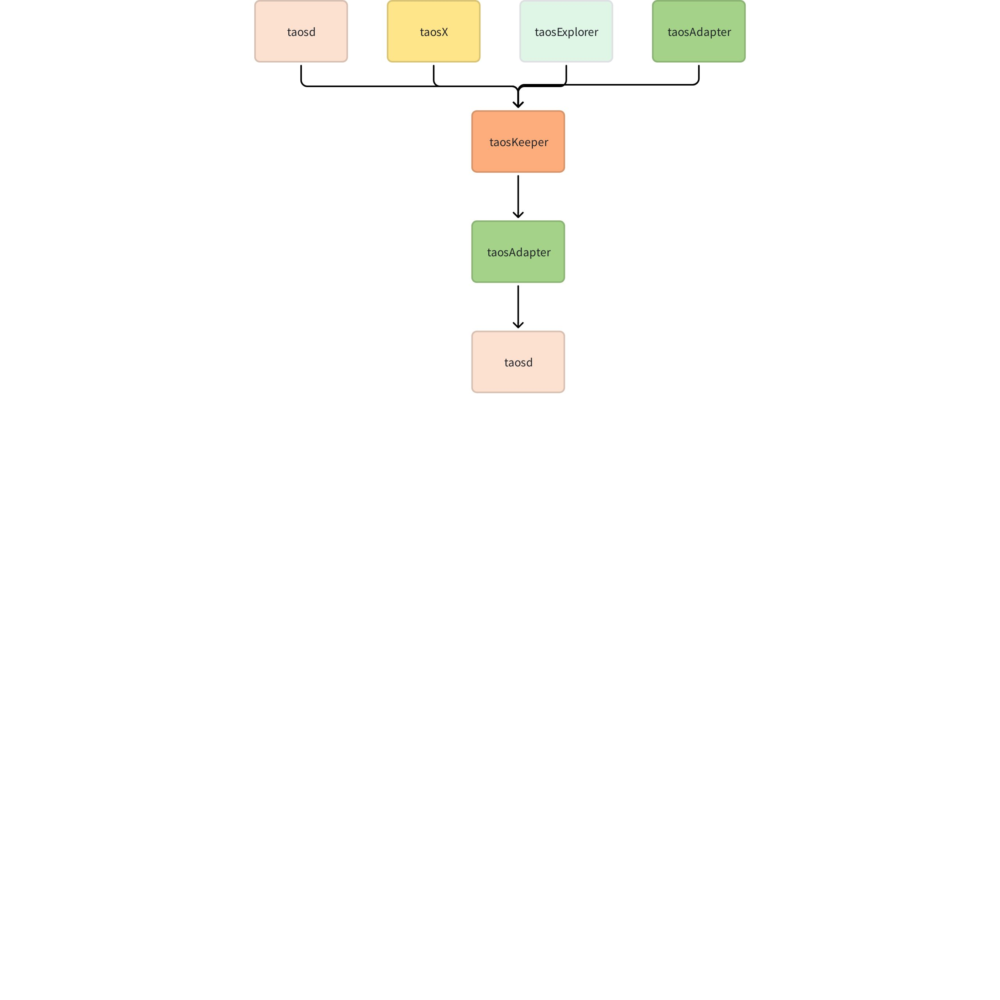
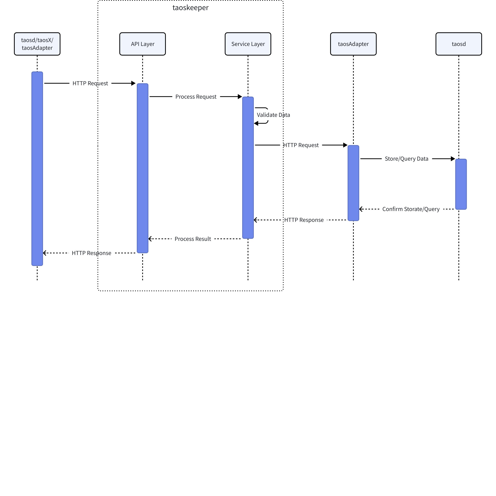

# 监控指标导出工具-Design Spec

## 1. 修订记录

| 日期 | 版本 | 负责人 | 主要修改内容 |
| --- | --- | --- | --- |
| 2025/01/06 | 1.0 | 郭振伟 | 编写文档。 |
| 2026/01/07 | 1.1 | 佘彦杰 | 根据需求修改文档 |

## 2. 引言

1. 目的
  本设计文档旨在详细描述 taosKeeper 的设计目标、技术架构和实现细节，为 taosKeeper 的开发、部署和维护提供指导。同时，本文档将作为后续功能扩展与性能优化的设计依据，确保 taosKeeper 能持续高效地支持 TDengine 生态系统。
1. 范围
  taosKeeper 是 TDengine 官方提供的监控方案，用于实时监控 taosd、taosAdapter 和 taosX 的运行状态和性能指标。
1. 受众
  本设计文档的目标读者包括：
   - 开发人员：负责实现和优化 taosKeeper 的工程师。
   - 系统架构师：需要了解 taosKeeper 的整体架构与技术决策。
   - 运维工程师：负责部署与维护 taosKeeper 的相关人员。

## 3. 术语

1. **TDengine**：一个高性能、分布式的时序数据库。
2. **taosd**：TDengine 数据库引擎的核心服务。
3. **taosAdapter**：一个 TDengine 的配套工具，是 TDengine 集群和应用程序之间的桥梁和适配器。
4. **taosX**：TDengine Enterprise 的数据管道功能组件，旨在为用户提供一种无需编写代码即可轻松对接第三方数据源的方法，实现数据的便捷导入。

## 4. 概述

1. 架构
  

1. 技术
  - 开发语言：Go
  - HTTP 框架：Gin
  - 日志库：logrus、file-rotatelogs
  - 配置解析：viper
1. 依赖项
  - taosAdapter：提供 RESTful 接口，来访问 TDengine 的服务。
  - taosd：TDengine 的核心服务，提供数据存储与查询功能。

## 5. 设计考虑

1. 假设和限制
  - 假设：
    - taosAdapter 和 taosd 已正确配置，并能够稳定运行。
    - taosKeeper 运行在高可靠性的网络环境中。
  - 限制：
    - taosKeeper 需要 TDengine 3.0 及以上版本支持。
1. 设计模式和原则
  - 设计模式：
    - 单例模式
  - 设计原则：
    - 模块化设计：各模块相互独立，便于扩展与维护。
    - 接口隔离原则：各模块通过明确的接口进行交互，降低耦合度。
    - 高内聚低耦合：各模块专注于自身功能，尽量减少对其它模块的依赖。
1. 风险和缓解措施
  - 风险：当 taosKeeper 处理大量并发请求时，协程池的大小和并发限制可能成为瓶颈。
  - 缓解措施：对于高并发场景，建议调整协程池的配置，适当增加协程数量以满足需求。

## 6. 详细设计

### 6.1 组件设计

接收 taosd、taosAdapter 和 taosX 上报的监控数据，对 HTTP 请求进行解析并转换为 SQL，通过 taosAdapter 的 REST 接口将数据存储到 TDengine 的 log 和 audit 数据库中。

### 6.2 列出系统中的关键数据结构

#### 6.2.1 配置

##### 6.2.1.1 taoskeeper 配置

```go
type Config struct {
    InstanceID       uint8
    Cors             web.CorsConfig  `toml:"cors"`
    // 监听的 host
    Host             string          `toml:"host"`
    // 监听的 port
    Port             int             `toml:"port"`
    // 日志级别
    LogLevel         string          `toml:"loglevel"`
    // 程序中使用协程池的大小
    GoPoolSize       int             `toml:"gopoolsize"`
     // 查询 TDengine 监控数据轮询间隔
    RotationInterval string          `toml:"RotationInterval"`
    / TDengine 数据库 REST 接口配置
    TDengine         TDengineRestful `toml:"tdengine"`
    // 监控指标配置
    Metrics          Metrics         `toml:"metrics"`
     // 环境配置
    Env              Environment     `toml:"environment"`
    // 审计配置
    Audit            Audit           `toml:"audit"`
    SSL              SSL             `toml:"ssl"`
    // 日志配置
    Log              Log             `mapstructure:"-"`

    // 数据迁移相关字段
    Transfer string // 传输配置
    FromTime string // 起始时间
    Drop     string // 删除配置
}

type TDengineRestful struct {
    // TDengine REST 接口地址
    Host     string `toml:"host"`
    // TDengine REST 接口端口号
    Port     int    `toml:"port"`
    // 连接 TDengine 的用户名
    Username string `toml:"username"`
    // 连接 TDengine 的密码
    Password string `toml:"password"`
    // 是否使用 SSL
    Usessl   bool   `toml:"usessl"`
}

type Environment struct {
    // 是否在容器 incgroup 环境中运行
    InCGroup bool `toml:"incgroup"`
}

type Audit struct {
    // 是否启用审计，默认为 true
    Enable   bool     `toml:"enable"`
    // 审计数据库的配置信息
    Database Database `toml:"database"`
}

type Database struct {
    // 数据库名称
    Name    string                 `toml:"name"`
    // 数据库配置选项
    Options map[string]interface{} `toml:"options"`
}

type Log struct {
    // 日志级别
    Level            string
    // 日志路径
    Path             string
    // 日志文件保留个数
    RotationCount    uint
    // 日志轮转的时间间隔
    RotationTime     time.Duration
    // 单个日志文件大小
    RotationSize     uint
    // 日志文件保留天数
    KeepDays         uint
    // 是否压缩
    Compress         bool
    // 磁盘预留大小，方式磁盘写满
    ReservedDiskSize uint
}
```

#### 6.2.2 adapter_report 接口请求

```go
type AdapterReport struct {
    // 时间戳
    Timestamp int64 `json:"ts"`
    // taosAdapter 指标信息
    Metric AdapterMetrics `json:"metrics"`
    // taosAdapter 端点
    Endpoint string `json:"endpoint"`
}

type AdapterMetrics struct {
    // REST 请求数量
    RestTotal int `json:"rest_total"`
    // REST 查询请求数量
    RestQuery int `json:"rest_query"`
    // REST 写入请求数量
    RestWrite int `json:"rest_write"`
    // REST 其它请求数量
    RestOther int `json:"rest_other"`
    // REST 执行中数量
    RestInProcess int `json:"rest_in_process"`
    // REST 请求成功数量
    RestSuccess int `json:"rest_success"`
    // REST 请求失败数量
    RestFail int `json:"rest_fail"`
    // REST 查询成功数量
    RestQuerySuccess int `json:"rest_query_success"`
    // REST 查询失败数量
    RestQueryFail int `json:"rest_query_fail"`
    // REST 写入成功数量
    RestWriteSuccess int `json:"rest_write_success"`
    // REST 写入失败数量
    RestWriteFail int `json:"rest_write_fail"`
    // REST 其它请求成功数量
    RestOtherSuccess int `json:"rest_other_success"`
    // REST 其它请求失败数量
    RestOtherFail int `json:"rest_other_fail"`
    // REST 执行中查询数量
    RestQueryInProcess int `json:"rest_query_in_process"`
    // REST 执行中写入数量
    RestWriteInProcess int `json:"rest_write_in_process"`
    // WebSocket 请求数量
    WSTotal int `json:"ws_total"`
    // WebSocket 查询请求数量
    WSQuery int `json:"ws_query"`
    // WebSocket 写入请求数量
    WSWrite int `json:"ws_write"`
    // WebSocket 其它请求数量
    WSOther int `json:"ws_other"`
    // WebSocket 执行中数量
    WSInProcess int `json:"ws_in_process"`
    // WebSocket 请求成功数量
    WSSuccess int `json:"ws_success"`
    // WebSocket 请求失败数量
    WSFail int `json:"ws_fail"`
    // WebSocket 查询成功数量
    WSQuerySuccess int `json:"ws_query_success"`
    // WebSocket 查询失败数量
    WSQueryFail int `json:"ws_query_fail"`
    // WebSocket 写入成功数量
    WSWriteSuccess int `json:"ws_write_success"`
    // WebSocket 写入失败数量
    WSWriteFail int `json:"ws_write_fail"`
    // WebSocket 其它请求成功数量
    WSOtherSuccess int `json:"ws_other_success"`
    // WebSocket 其它请求失败数量
    WSOtherFail int `json:"ws_other_fail"`
    // WebSocket 执行中查询数量
    WSQueryInProcess int `json:"ws_query_in_process"`
    // WebSocket 执行中写入数量
    WSWriteInProcess int `json:"ws_write_in_process"`
}
```

#### 6.2.3 taosd-cluster-basic 接口请求

```go
type ClusterBasic struct {
    // 时间戳
    Ts string `json:"ts"`
    // 集群 ID
    ClusterId string `json:"cluster_id"`
    // 第一个端点
    FirstEp string `json:"first_ep"`
    // 第一个端点的 dnode ID
    FirstEpDnodeId int32 `json:"first_ep_dnode_id"`
    // 集群版本
    ClusterVersion string `json:"cluster_version"`
}
```

#### 6.2.4 audit 接口请求

```go
type AuditInfoOld struct {
    // 时间戳
    Timestamp int64 `json:"timestamp"`
    // 集群 ID
    ClusterID string `json:"cluster_id"`
    // 用户名
    User string `json:"user"`
    // 操作类型
    Operation string `json:"operation"`
    // 数据库名称
    Db string `json:"db"`
    // 访问资源
    Resource string `json:"resource"`
    // 客户端地址
    ClientAdd string `json:"client_add"`
    // 操作详情
    Details string `json:"details"`
}
```

#### 6.2.5 audit_v2 接口请求

```go
type AuditInfo struct {
    // 时间戳
    Timestamp string `json:"timestamp"`
    // 集群 ID
    ClusterID string `json:"cluster_id"`
    // 用户名
    User string `json:"user"`
    // 操作类型
    Operation string `json:"operation"`
    // 数据库名称
    Db string `json:"db"`
    // 访问资源
    Resource string `json:"resource"`
    // 客户端地址
    ClientAdd string `json:"client_add"`
    // 操作详情
    Details string `json:"details"`
    // 影响行数
    AffectedRows uint64  `json:"affected_rows"`
   // 持续时间
     Duration     float64 `json:"duration"`
}
```

#### 6.2.6 audit-batch 接口请求

```go
type AuditArrayInfo struct {
    // 审批记录数组
    Records []AuditInfo `json:"records"`
}
```

#### 6.2.7 report 接口请求

```go
type Report struct {
    // 时间戳
    Ts string `json:"ts"`
    // dnode ID
    DnodeID int `json:"dnode_id"`
    // dnode ep
    DnodeEp string `json:"dnode_ep"`
    // 集群 ID
    ClusterID string `json:"cluster_id"`
    // 协议类型
    Protocol int `json:"protocol"`
    // 集群信息，仅由主节点报告。
    ClusterInfo *ClusterInfo `json:"cluster_info"`
    // 超级表信息数组
    StbInfos []StbInfo `json:"stb_infos"`
    // vgroup 信息数组，仅由主节点报告。
    VgroupInfos []VgroupInfo `json:"vgroup_infos"`
    // 授权信息，仅由主节点报告。
    GrantInfo *GrantInfo `json:"grant_info"`
    // dnode 信息
    DnodeInfo DnodeInfo `json:"dnode_info"`
    // 磁盘信息
    DiskInfos DiskInfo `json:"disk_infos"`
    // 日志信息
    LogInfos LogInfo `json:"log_infos"`
}

type ClusterInfo struct {
    // 集群 first ep
    FirstEp string `json:"first_ep"`
    // 集群 first ep 的 dnode ID
    FirstEpDnodeID int `json:"first_ep_dnode_id"`
    // TDengine 版本
    Version string `json:"version"`
    // 主节点运行时间
    MasterUptime float32 `json:"master_uptime"`
    // 监控间隔时间
    MonitorInterval int `json:"monitor_interval"`
    // 数据库总数
    DbsTotal int `json:"dbs_total"`
    // 表总数
    TbsTotal int64 `json:"tbs_total"`
    // 超级表总数
    StbsTotal int `json:"stbs_total"`
    // 虚拟组总数
    VgroupsTotal int `json:"vgroups_total"`
    // 存活的虚拟组数量
    VgroupsAlive int `json:"vgroups_alive"`
    // 虚拟节点总数
    VnodesTotal int `json:"vnodes_total"`
    // 存活的虚拟节点数量
    VnodesAlive int `json:"vnodes_alive"`
    // 总连接数
    ConnectionsTotal int `json:"connections_total"`
    // 主题总数
    TopicsTotal int `json:"topics_total"`
    // 流总数
    StreamsTotal int `json:"streams_total"`
    // 数据节点数组
    Dnodes []Dnode `json:"dnodes"`
    // 管理节点数组
    Mnodes []Mnode `json:"mnodes"`
}

type Dnode struct {
    // dnode ID
    DnodeID int `json:"dnode_id"`
    // dnode ep
    DnodeEp string `json:"dnode_ep"`
    // dnode 状态
    Status string `json:"status"`
}

type Mnode struct {
    // mnode ID
    MnodeID int `json:"mnode_id"`
    // mnode ep
    MnodeEp string `json:"mnode_ep"`
    // mnode 角色
    Role string `json:"role"`
}

type StbInfo struct {
    // 超级表名称
    StbName string `json:"stb_name"`
    // 数据库名称
    DataBaseName string `json:"database_name"`
}

type VgroupInfo struct {
    // vgroup ID
    VgroupID int `json:"vgroup_id"`
    // 数据库名称
    DatabaseName string `json:"database_name"`
    // vgroup 表数量
    TablesNum int64 `json:"tables_num"`
    // vgroup 状态
    Status string `json:"status"`
    // vnode 数组
    Vnodes []Vnode `json:"vnodes"`
}

type Vnode struct {
    // dnode ID
    DnodeID int `json:"dnode_id"`
    // vnode 角色
    VnodeRole string `json:"vnode_role"`
}

type GrantInfo struct {
    // 集群授权过期剩余时间（单位 秒）
    ExpireTime int64 `json:"expire_time"`
    // 集群已拥有的 time series 的数量
    TimeseriesUsed int64 `json:"timeseries_used"`
    // 集群授权允许使用 time series 的总数量
    TimeseriesTotal int64 `json:"timeseries_total"`
}

type DnodeInfo struct {
    // dnode 的启动时间（单位 秒）
    Uptime float32 `json:"uptime"`
    // dnode 的进程所使用的 CPU 百分比（取值范围 0~100）
    CPUEngine float32 `json:"cpu_engine"`
    // dnode 所在节点的系统使用的 CPU 百分比（取值范围 0~100）
    CPUSystem float32 `json:"cpu_system"`
    // CPU 核心数
    CPUCores float32 `json:"cpu_cores"`
    // dnode 的进程所使用的内存（单位 KB）
    MemEngine int `json:"mem_engine"`
    // dnode 所在节点的系统所使用的内存（单位 KB）
    MemSystem int `json:"mem_system"`
    // dnode 所在节点的总内存（单位 KB）
    MemTotal int `json:"mem_total"`
    // dnode 的进程使用的磁盘容量（单位 Byte）
    DiskEngine int64 `json:"disk_engine"`
    // dnode 所在节点的磁盘已使用的容量（单位 Byte）
    DiskUsed int64 `json:"disk_used"`
    // dnode 所在节点的磁盘总容量（单位 Byte）
    DiskTotal int64 `json:"disk_total"`
    // dnode 所在节点的网络传入速率（单位 Byte/s）
    NetIn float32 `json:"net_in"`
    // dnode 所在节点的网络传出速率（单位 Byte/s）
    NetOut float32 `json:"net_out"`
    // dnode 所在节点的 io 读取速率（单位 Byte/s）
    IoRead float32 `json:"io_read"`
    // dnode 所在节点的 io 写入速率（单位 Byte/s）
    IoWrite float32 `json:"io_write"`
    // dnode 所在节点的磁盘 io 写入速率（单位 Byte/s）
    IoReadDisk float32 `json:"io_read_disk"`
    // dnode 所在节点的磁盘 io 写入速率（单位 Byte/s）
    IoWriteDisk float32 `json:"io_write_disk"`
    // 查询请求总数
    ReqSelect int `json:"req_select"`
    // 查询请求成功率
    ReqSelectRate float32 `json:"req_select_rate"`
    // 插入请求总数
    ReqInsert int `json:"req_insert"`
    // 插入请求成功数
    ReqInsertSuccess int `json:"req_insert_success"`
    // 插入请求成功率
    ReqInsertRate float32 `json:"req_insert_rate"`
    // 批量插入请求总数
    ReqInsertBatch int `json:"req_insert_batch"`
    // 批量插入请求成功数
    ReqInsertBatchSuccess int `json:"req_insert_batch_success"`
    // 批量插入请求成功率
    ReqInsertBatchRate float32 `json:"req_insert_batch_rate"`
    // 错误总数
    Errors int `json:"errors"`
    // dnode 所在节点的 vnode 数量
    VnodesNum int `json:"vnodes_num"`
    // 主节点数量
    Masters int `json:"masters"`
    // 是否有 mnode
    HasMnode int8 `json:"has_mnode"`
    // 是否有 qnode
    HasQnode int8 `json:"has_qnode"`
    // 是否有 snode
    HasSnode int8 `json:"has_snode"`
    // 是否有 bnode
    HasBnode int8 `json:"has_bnode"`
}

type DiskInfo struct {
    // 数据目录数组
    Datadir []DataDir `json:"datadir"`
    // 日志目录
    Logdir LogDir `json:"logdir"`
    // 临时目录
    Tempdir TempDir `json:"tempdir"`
}

type DataDir struct {
    // 数据目录名称
    Name string `json:"name"`
    // 数据目录级别
    Level int `json:"level"`
    // 数据目录可用空间
    Avail decimal.Decimal `json:"avail"`
    // 数据目录已用空间
    Used decimal.Decimal `json:"used"`
    // 数据目录总空间
    Total decimal.Decimal `json:"total"`
}

type LogDir struct {
    // 日志目录名称
    Name string `json:"name"`
    // 日志目录可用空间
    Avail decimal.Decimal `json:"avail"`
    // 日志目录已用空间
    Used decimal.Decimal `json:"used"`
    // 日志目录总空间
    Total decimal.Decimal `json:"total"`
}

type TempDir struct {
    // 临时目录名称
    Name string `json:"name"`
    // 临时目录可用空间
    Avail decimal.Decimal `json:"avail"`
    // 临时目录已用空间
    Used decimal.Decimal `json:"used"`
    // 临时目录总空间
    Total decimal.Decimal `json:"total"`
}

type LogInfo struct {
    // 日志级别汇总信息数组
    Summary []Summary `json:"summary"`
}

type Summary struct {
    // 日志级别
    Level string `json:"level"`
    // 对应级别的日志总数
    Total int `json:"total"`
}
```

#### 6.2.8 general-metric 接口请求

```go
type StableArrayInfo struct {
    // 时间戳
    Ts string `json:"ts"`
    // 协议类型
    Protocol int `json:"protocol"`
    // 超级表信息数组
    Tables []StableInfo `json:"tables"`
}

type StableInfo struct {
    // 超级表名称
    Name string `json:"name"`
    // 指标组数组
    MetricGroups []MetricGroup `json:"metric_groups"`
}

type MetricGroup struct {
    // 标签数组
    Tags []Tag `json:"tags"`
    // 指标数组
    Metrics []Metric `json:"metrics"`
}

type Tag struct {
    // 标签名称
    Name string `json:"name"`
    // 标签值
    Value string `json:"value"`
}

type Metric struct {
    // 指标名称
    Name string `json:"name"`
    // 指标值
    Value float64 `json:"value"`
}
```

#### 6.2.9 slow-sql-detail-batch 接口请求

```go
type SlowSqlDetailInfo struct {
    // 语句开始执行的时间，单位ms，主键
    StartTs     string `json:"start_ts"`
    // 本次请求的request id，为hash生产的随机值
    RequestId   string `json:"request_id"`
    // 执行该语句花费的时间, 单位ms
    QueryTime   int32  `json:"query_time"`
    // 语句执行返回码，0表示成功
    Code        int32  `json:"code"`
    // 当语句执行失败时，记录错误信息
    ErrorInfo   string `json:"error_info"`
    // 该 SQL 语句的类型（1-查询，2-写入，4-其他）
    Type        int8   `json:"type"`
    // 结果集中的记录数目
    RowsNum     int64  `json:"rows_num"`
    // 该 SQL 语句的字符串
    Sql         string `json:"sql"`
    // 进程名称
    ProcessName string `json:"process_name"`
    // 进程 ID
    ProcessId   string `json:"process_id"`
    // 所属数据库
    Db          string `json:"db"`
    // 执行 SQL 语句的用户名
    User        string `json:"user"`
    // 发送 SQL 语句的 IP 地址
    Ip          string `json:"ip"`
    // 集群 id
    ClusterId   string `json:"cluster_id"`
}
```

### 6.3 数据库设计

#### 6.3.1 数据模型

##### 6.3.1.1 log 数据库

1. adapter_requests 超级表
  ```sql
  create stable if not exists `adapter_requests` (
      `ts` timestamp,
      `total` int unsigned,
      `query` int unsigned,
      `write` int unsigned,
      `other` int unsigned,
      `in_process` int unsigned,
      `success` int unsigned,
      `fail` int unsigned,
      `query_success` int unsigned,
      `query_fail` int unsigned,
      `write_success` int unsigned,
      `write_fail` int unsigned,
      `other_success` int unsigned,
      `other_fail` int unsigned,
      `query_in_process` int unsigned,
      `write_in_process` int unsigned
  ) tags (`endpoint` varchar(32), `req_type` tinyint unsigned)
  ```

1. keeper_monitor 超级表
  ```sql
  create stable if not exists `keeper_monitor` (
      `ts` timestamp,
      `cpu` float,
      `mem` float,
      `total_reports` int
  ) tags (`identify` nchar(50))
  ```

1. taosd_cluster_basic 超级表
  ```sql
  create stable if not exists `taosd_cluster_basic` (
      `ts` timestamp,
      `first_ep` varchar(100),
      `first_ep_dnode_id` int,
      `cluster_version` varchar(20)
  ) tags (`cluster_id` varchar(50))
  ```

1. taos_slow_sql_detail 超级表
  ```sql
  CREATE STABLE `taos_slow_sql_detail` (
      `start_ts` TIMESTAMP, 
      `request_id` BIGINT UNSIGNED COMPOSITE KEY, 
      `query_time` INT, 
      `code` INT, 
      `error_info` VARCHAR(128), 
      `type` TINYINT, 
      `rows_num` BIGINT, 
      `sql` VARCHAR(16384), 
      `process_name` VARCHAR(32), 
      `process_id` VARCHAR(32)
  ) TAGS (
      `db` VARCHAR(1024), 
      `user` VARCHAR(32), 
      `ip` VARCHAR(32), 
      `cluster_id` VARCHAR(32)
  )
  ```

##### 6.3.1.2 audit 数据库

1. operations 超级表
  ```sql
  create stable if not exists `operations` (
      `ts` timestamp,
      `user_name` varchar(25),
      `operation` varchar(20),
      `db` varchar(65),
      `resource` varchar(193),
      `client_address` varchar(25),
      `details` varchar(50000)
  ) tags (`cluster_id` varchar(64))
  ```

#### 6.3.2 数据访问层

通过 HTTP 请求接收上报的监控数据后，对数据进行解析并转换为 SQL，再通过 taosAdapter 的 REST 接口，将监控数据存储到 TDengine 的 log 和 audit 数据库中。

### 6.4 taosKeeper 请求响应时序图



## 7. 接口规范

### 7.1 日志 API

```go
// 获取日志实例
func GetLogger(model string) *logrus.Entry

// debug 日志获取当前时间。当 isDebug 为 true 时返回当前时间，false 时返回 0 时间。
func GetLogNow(isDebug bool) time.Time

// debug 日志计算时间间隔。当 isDebug 为 true 时计算时间间隔，false 时返回 0。
func GetLogDuration(isDebug bool, s time.Time) time.Duration

// 设置日志级别
func SetLevel(level string) error

// 判断当前日志级别是否显示 debug
func IsDebug() bool
```

### 7.2 数据库 API

```go
// 创建一个新的数据库连接实例
func NewConnector(username, password, host string, port int, usessl bool) (*Connector, error)

// 创建一个新的数据库连接实例，并指定默认数据库。
func NewConnectorWithDb(username, password, host string, port int, dbname string, usessl bool) (*Connector, error)

// 创建一个新的数据库连接实例，使用 token'
func NewConnectorWithDbAndToken(username, password, token, host string, port int, dbname string, usessl bool) (*Connector, error)
// 执行一条 SQL 语句
func (c *Connector) Exec(ctx context.Context, sql string, qid uint64) (int64, error)

// 执行一条查询 SQL 语句，并返回查询结果。
func (c *Connector) Query(ctx context.Context, sql string, qid uint64) (*Data, error)

// 关闭数据库连接
func (c *Connector) Close() error
```

### 7.3 系统监控 API

```go
// 创建一个新的收集器实例
func NewNormalCollector() (*NormalCollector, error)

// 获取 taoskeeper 的 CPU 使用率（取值范围 0~1）
func (n *NormalCollector) CpuPercent() (float64, error)

// 获取 taoskeeper 的内存使用率（取值范围 0~1）
func (n *NormalCollector) MemPercent() (float64, error)
```

## 8. 安全考虑

无。

## 9. 性能和可扩展性

1. 性能要求：无。
2. 可扩展性：支持多实例部署。

## 10. 部署和配置

1. 部署流程：taosKeeper 可随 TDengine 安装包一同部署，也支持单独部署。
2. 配置管理：使用 taoskeeper.toml 文件进行配置。
3. 版本控制：保持对外接口的兼容性。在引入破坏性更改时，通过新增接口的方式实现，确保原有接口功能正常运行，不影响现有用户。

## 11. 监控和维护

1. 监控：提供健康检查接口，实时监测系统运行状态，确保服务稳定性。
2. 日志记录和诊断：提供多级日志记录功能，支持不同日志级别的输出，便于快速定位和排查问题。
3. 维护：对废弃接口，仅进行必要的维护，不再新增功能。新功能开发优先保证接口的向后兼容性，以最大程度减少对现有用户的影响。

## 12. 参考资料

1. [taosKeeper-Function Spec](https://taosdata.feishu.cn/wiki/Wr3VwzlWxiZs7nkZKuicC891nTh) 4. 行为说明
