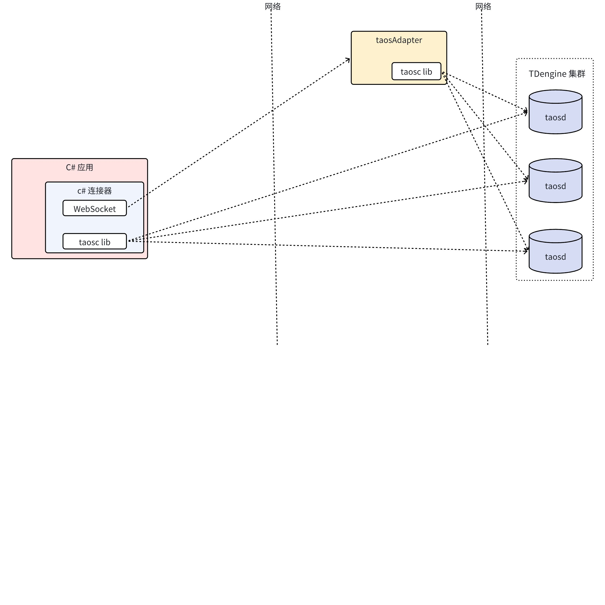

# C# 连接器-Design Spec

## 1. 修订记录

| 修改日期 | 发布日期 | 版本 | 负责人 | 主要修改内容 |
| --- | --- | --- | --- | --- |
| 2025-01-11 | 2025-01-11 | 1.0 | 谭雪峰 |  |
| 2025-12-09 | 2025-12-09 | 2.0 | 谭雪峰 | 更新参数绑定实现为 STMT2 |
| 2026-01-26 | 2026-01-27 | 2.1 | 霍琳贺 | 更新安全部分 |

## 2. 引言

1. 目的
  本文档旨在为 C# 连接器的设计提供详细的指导和说明。C# 连接器是 TDengine 数据库的官方 .NET 客户端驱动库，旨在为 C# 开发者提供一套功能完备、易于使用的接口，支持与 TDengine 数据库的高效交互。通过本文档，开发团队可以清晰地了解连接器的设计思路、架构、接口定义以及实现细节，确保开发过程的高效性和一致性。
1. 范围
  - **数据库连接**：支持通过原生协议和 WebSocket 协议连接 TDengine 数据库。
  - **SQL 执行**：支持执行标准的 SQL 语句，包括查询、插入、更新、删除等操作。
  - **参数绑定**：支持 SQL 参数绑定，避免 SQL 注入风险，并提高查询性能。
  - **查询结果读取**：支持逐行读取查询结果，并提供多种数据类型的读取方法。
  - **无模式写入**：支持通过 InfluxDB 行协议、OpenTSDB 行协议和 OpenTSDB JSON 协议进行无模式写入。
  - **TMQ 订阅**：支持通过 TMQ 订阅 TDengine 的数据，提供与 Kafka 类似的接口。
1. 受众
  需要使用 C# 程序来访问 TDengine 数据库的开发者。

## 3. 术语

1. **ADO.NET****： **ADO.NET 是 .NET 框架中用于访问和操作数据的一组类库，提供了一套标准接口（如 `IDbConnection`、`IDbCommand`、`IDataReader` 等）来连接和操作各种数据源。`taos-connector-dotnet` 实现了 ADO.NET 接口，使开发者能够以统一的方式访问 TDengine 数据库。
2. **DSN (Data Source Name)： **数据源名称，用于指定连接到数据库所需的信息。在 `taos-connector-dotnet` 中，DSN 的格式通常包括用户名、密码、协议、主机地址、端口号和数据库名等信息。
3. **WebSocket： **一种在单个 TCP 连接上进行全双工通信的协议。`taos-connector-dotnet` 支持通过 WebSocket 接口与 TDengine 数据库进行实时数据交互。
4. **TMQ： **TDengine 消息队列，支持订阅数据。`taos-connector-dotnet` 中的 TMQ 接口允许开发者通过 WebSocket 或原生接口订阅 TDengine 的数据，适用于实时数据推送场景。
5. **无模式写入： **一种数据写入方式，允许在不预先定义表结构的情况下直接将数据写入数据库。`taos-connector-dotnet` 支持无模式写入，适用于数据结构动态变化的场景。

## 4. 概述

1. 架构：


1. C# 连接器支持两种连接方式：WebSocket 和 Naive。其区别为：
   - 使用原生连接，需要保证客户端的驱动程序 taosc 和服务端的 TDengine 版本保持一致。
   - 使用 WebSocket 连接，用户无需安装客户端驱动程序 taosc。
   - 连接云服务实例，必须使用 WebSocket 连接。
2. C# 连接器通过 WebSocket 库与 taosAdapter 交互，通过 taosc 动态库与 TDengine 集群直接交互。
3. 技术：
  - 开发语言：C#。
  - 调用动态库：DllImport。
  - WebSocket 框架：WebSockets（System.Net.WebSockets）。
  - JSON 库：Newtonsoft.Json（https://www.nuget.org/packages/Newtonsoft.Json）。
1. 依赖项：列出所有依赖项
   - .NET Framework 4.6 及以上版本。
   - .NET 5.0 及以上版本。

## 5. 设计考虑

1. 假设和限制：
   - taosAdapter 和 TDengine 实例已正确配置并能够稳定运行。
2. 设计模式和原则：
   - 适配器模式: 使不兼容的接口能够协同工作，提高代码的复用性.
   - 工厂模式：将对象的创建与使用分离，提高代码的灵活性和可维护性。
3. 风险和缓解措施：
   - 资源管理：使用 `IDisposable` 接口确保资源（如连接、命令对象）的正确释放。
   - 加密传输：支持 WSS ，确保通过 WebSocket 传输的数据安全。

## 6. 详细设计

### 6.1 类型

TDengine 类型与 C# 类型对应如下

| TDengine 类型 | C# 类型 |
| --- | --- |
| TIMESTAMP | DateTime |
| TINYINT | sbyte |
| SMALLINT | short |
| INT | int |
| BIGINT | long |
| TINYINT UNSIGNED | byte |
| SMALLINT UNSIGNED | ushort |
| INT UNSIGNED | uint |
| BIGINT UNSIGNED | ulong |
| FLOAT | float |
| DOUBLE | double |
| BOOL | bool |
| BINARY | byte[] |
| NCHAR | string (utf-8编码) |
| JSON | byte[] |
| VARBINARY | byte[] |
| GEOMETRY | byte[] |
| DECIMAL | decimal |

类型名称对应如下

| TDengine 类型 | 名称 |
| --- | --- |
| TIMESTAMP | TIMESTAMP |
| TINYINT | TINYINT |
| SMALLINT | SMALLINT |
| INT | INT |
| BIGINT | BIGINT |
| TINYINT UNSIGNED | TINYINT UNSIGNED |
| SMALLINT UNSIGNED | SMALLINT UNSIGNED |
| INT UNSIGNED | INT UNSIGNED |
| BIGINT UNSIGNED | BIGINT UNSIGNED |
| FLOAT | FLOAT |
| DOUBLE | DOUBLE |
| BOOL | BOOL |
| BINARY | BINARY |
| NCHAR | NCHAR |
| JSON | JSON |
| VARBINARY | VARBINARY |
| GEOMETRY | GEOMETRY |
| DECIMAL | DECIMAL |

### 6.2 连接字符串管理

`ConnectionStringBuilder` 继承 `DbConnectionStringBuilder`提供以下参数：
```csharp {wrap}
// 连接地址
private const string HostKey = "host";
// 连接端口
private const string PortKey = "port";
// 连接数据库
private const string DatabaseKey = "db";
// 连接用户名
private const string UsernameKey = "username";
// 连接密码
private const string PasswordKey = "password";
// 使用的协议
private const string ProtocolKey = "protocol";
// 解析结果使用的时区
private const string TimezoneKey = "timezone";
// WebSocket 连接超时
private const string ConnTimeoutKey = "connTimeout";
// WebSocket 读取超时
private const string ReadTimeoutKey = "readTimeout";
// WebSocket 写入超时
private const string WriteTimeoutKey = "writeTimeout";
// WebSocket 连接云服务使用的 token
private const string TokenKey = "token";
// WebSocket 连接是否使用 ssl
private const string UseSSLKey = "useSSL";
// WebSocket 连接传输是否压缩
private const string EnableCompressionKey = "enableCompression";
// WebSocket 连接是否自动连接
private const string AutoReconnectKey = "autoReconnect";
// WebSocket 连接自动连接尝试次数
private const string ReconnectRetryCountKey = "reconnectRetryCount";
// WebSocket 连接自动连接间隔（毫秒）
private const string ReconnectIntervalMsKey = "reconnectIntervalMs";
// 连接时区
private const string ConnectionTimezoneKey = "connectionTimezone";
```

### 6.3 客户端统一接口

原生连接和 WebSocket 连接对外提供相同的接口
1. 统一实现 SQL 执行 STMT 写入和 Schemaless 写入
```csharp {wrap}
public interface ITDengineClient : IDisposable
{
    // stmt 初始化
    IStmt StmtInit();
    // stmt 携带 reqId 初始化
    IStmt StmtInit(long reqId);
    // 执行查询 SQL
    IRows Query(string query);
    // 执行带 reqId 的查询 SQL
    IRows Query(string query, long reqId);
    // 执行非查询 SQL 返回影响行数
    long Exec(string query);
    // 执行带 reqId 的非查询 SQL 返回影响行数
    long Exec(string query, long reqId);
    // 执行 Schemaless 写入
    void SchemalessInsert(string[] lines, TDengineSchemalessProtocol protocol,
        TDengineSchemalessPrecision precision, int ttl, long reqId);
    // 连接可用
    bool ConnectionAvailable();
}
```

1. 统一参数绑定接口
```csharp {wrap}
public interface IStmt : IDisposable
{
    // 准备语句
    void Prepare(string query);
    // 语句是否为非查询
    bool IsInsert();
    // 设置表名
    void SetTableName(string tableName);
    // 设置标签
    void SetTags(object[] tags);
    // 获取需要绑定的标签信息
    TaosFieldE[] GetTagFields();
    // 获取需要绑定的列信息
    TaosFieldE[] GetColFields();
    // 绑定单行数据
    void BindRow(object[] row);
    // 绑定多行数据（ fields 为类型信息，arrays 是二维数组，每个元素是一列数据）
    void BindColumn( TaosFieldE[] fields,params Array[] arrays);
    // 添加批量
    void AddBatch();
    // 执行
    void Exec();
    // 返回影响行数
    long Affected();
    // 获取查询结果
    IRows Result();
}
```

1. 统一查询结果
```csharp {wrap}
public interface IRows : IDisposable
{
    // 是否有行数据
    bool HasRows { get; }
    // 获取影响行数
    int AffectRows { get; }
    // 获取列数量
    int FieldCount { get; }
    // 获取指定列的字节值
    long GetBytes(int ordinal, long dataOffset, byte[] buffer, int bufferOffset, int length);
    // 获取指定列的字符值
    char GetChar(int ordinal);
    // 获取指定列的字符数组值
    long GetChars(int ordinal, long dataOffset, char[] buffer, int bufferOffset, int length);
    // 获取指定列的数据类型名称
    string GetDataTypeName(int ordinal);
    // 获取结果值
    object GetValue(int ordinal);
    // 获取结果列属性
    Type GetFieldType(int ordinal);
    // 获取列大小
    int GetFieldSize(int ordinal);
    // 获取列名
    string GetName(int ordinal);
    // 通过列名获取列序号
    int GetOrdinal(string name);
    // 读取下一行（返回是否有下一行）
    bool Read();
    // 获取 decimal 精度
    int GetFieldPrecision(int ordinal);
    // 获取 decimal 小数位
    int GetFieldScale(int ordinal);
    // 是否为 null
    bool IsDBNull(int ordinal);
    // 获取 uint8
    byte GetByte(int ordinal);
    // 获取 int16
    short GetInt16(int ordinal);
    // 获取 int32
    int GetInt32(int ordinal);
    // 获取 int64
    long GetInt64(int ordinal);
    // 获取 bool
    bool GetBoolean(int ordinal);
    // 获取 DateTime
    DateTime GetDateTime(int ordinal);
    // 获取 decimal
    decimal GetDecimal(int ordinal);
    // 获取 double
    double GetDouble(int ordinal);
    // 获取 float
    float GetFloat(int ordinal);
    // 获取字符串
    string GetString(int ordinal);
    // 获取当前行值
    int GetValues(object[] values);
    // 获取 DateTimeOffset
    DateTimeOffset GetDateTimeOffset(int ordinal);
}
```

#### 6.3.1 原生客户端

1. 连接
`TDengine.Driver.Client.Native` 创建原生客户端：
```csharp {wrap}
public NativeClient(ConnectionStringBuilder builder)
```

调用 C 接口 taos_connect 创建连接。
1. 执行非查询语句
   - 调用 taos_query_with_reqid 执行 sql。
   - 调用 taos_errno 获取错误码。
   - 调用 taos_affected_rows 获取影响行数。
   - 调用 taos_free_result 释放结果。
2. 执行查询语句
   - 调用 taos_query_with_reqid 执行 sql。
   - 调用 taos_errno 获取错误码。
   - 调用 taos_is_update_query 判断是否非查询语句。
   - 如果是查询语句返回 NativeRows。
   - 如果非查询语句调用 taos_affected_rows 获取影响行数，调用 taos_free_result 释放结果，返回 NativeRows 只设置影响行数。
3. 初始化参数绑定
   - 调用 taos_stmt_init_with_reqid 初始化 stmt。
   - 返回 NativeStmt。
4. schemaless 写入
   - 调用 taos_schemaless_insert_raw_ttl_with_reqid 写入 schemaless 数据。

#### 6.3.2 WebSocket 客户端

1. 连接
`TDengine.Driver.Client.Websocket` 创建 WebSocket 客户端
```csharp {wrap}
public WSClient(ConnectionStringBuilder builder)
```

1. `TDengine.Driver.Impl.WebSocketMethods` 创建 WebSocket 连接。
2. 向 taosAdapter 发送 conn 消息，验证身份信息。
3. 等待 conn 响应。
4. 执行非查询语句
   - 尝试向 taosAdapter 发送 query 消息
      - 等待 query 响应。
      - 如果是查询语句，发送 free_result 请求释放结果。
      - 将 query 响应中的影响行数返回。
   - 如果发生异常，如果连接正常则抛出异常，如果连接不可用则进行重连。
   - 重连成功再次发送 query 消息，并等待响应。
5. 执行查询语句
   - 尝试向 taosAdapter 发送 query 消息
      - 等待 query 响应。
      - 如果是非查询语句，返回 WSRows 仅设置影响行数。
      - 返回 WSRows。
   - 如果发生异常，如果连接正常则抛出异常，如果连接不可用则尝试进行重连。
   - 重连成功再次发送 query 消息，并等待响应。
6. 初始化参数绑定
   - 尝试向 taosAdapter 发送 init 消息。
      - 等待 init 响应。
      - 返回 WSStmt。
   - 如果发生异常，如果连接正常则抛出异常，如果连接不可用则尝试进行重连。
   - 重连成功再次发送 init 消息，并等待响应。
7. schemaless 写入
   - 将多行协议使用 '\n' 拼接成一个字符串。
   - 尝试向 taosAdapter 发送 insert 消息进行 schemaless 写入。
   - 等待 insert 响应。
   - 如果发生异常，如果连接正常则抛出异常，如果连接不可用则尝试进行重连。
   - 重连成功再次发送 insert 消息。
8. 重连
   - 如果没设置自动重连则返回。
   - 循环自动重连次数
      - sleep 重连间隔。
      - 创建 WebSocket 连接，并发送 conn 请求。
      - 如果失败，如果 WebSocket 已连接，关闭连接。
      - 如果成功退出循环。
   - 如果连接创建失败则返回错误。
   - 如果老连接不为空则关闭老连接。
   - 将新连接替代老连接。

#### 6.3.3 原生参数绑定

1. 准备语句
   - 调用 taos_stmt2_prepare 准备语句。
2. 获取 schema
   - 调用 taos_stmt2_is_insert 获取是否为非查询语句。
   - 调用 taos_stmt2_get_fields 获取schema
3. 设置表名
   - 内部缓存
4. 设置标签
   - 内部缓存
5. 获取绑定标签信息
   - 返回 taos_stmt2_get_fields 获取的 schema
6. 获取绑定列信息
   - 返回 taos_stmt2_get_fields 获取的 schema
7. 绑定单行
   - 内部缓存
8. 按列绑定多行
   - 内部缓存
9. 添加批量
   - 内部缓存切换绑定表
10. 执行
   - 序列化成二进制协议
   - 生成 TAOS_STMT2_BINDV 结构
   - 调用 taos_stmt2_bind_param 进行绑定
   - 调用 taos_stmt2_exec 执行，缓存影响行数
11. 获取影响行数
   - 返回缓存的影响行数
12. 获取结果
   - 调用 taos_stmt2_result 获取结果指针。
   - 返回 NativeRows。
13. Dispose
   - 如果 stmt2 C 指针不为空则调用 taos_stmt2_close 关闭 stmt2 并将 C 指针设置为空。

#### 6.3.4 WebSocket参数绑定

1. 准备语句
   - 发送 stmt2_prepare 请求。
   - 等待响应。
   - 将响应中的 IsInsert 和 schema 保存。
2. 是否非查询语句
   - 返回保存的 IsInsert。
3. 设置表名
   - 内部缓存
4. 设置标签
   - 内部缓存
5. 获取绑定标签信息
   - 返回缓存的 schema
6. 获取绑定列信息
   - 返回缓存的 schema
7. 绑定单行
   - 内部缓存
8. 按列绑定多行
   - 内部缓存
9. 添加批量
   - 内部缓存切换绑定表
10. 执行
   - 序列化成二进制协议
   - 发送 stmt2 bind 请求
   - 等待响应
   - 发送 stmt2 exec 请求
   - 等待响应
   - 将响应中 Affected 缓存。
11. 获取影响行数
   - 返回缓存的 Affected。
12. 获取结果
   - 发送 stmt2_result 请求。
   - 等待响应。
   - 返回 WSRows。
13. Dispose
   - 如果已标记关闭则返回。
   - 发送 stmt2_close 请求不等待响应。
   - 标记已关闭。

#### 6.3.5 原生查询结果

1. 是否有行数据
   - 判断 _isUpdate == false。
2. 影响行数
   - 查询返回 -1。
   - 非查询返回对应 AffectRows。
3. 获取列数量
   - 构造函数调用 taos_field_count 设置。
4. 获取指定列的字节值
   - 判断是否为变长类型，如果不是抛出异常。
   - 解析结果对应值。
   - 按照偏移和长度复制到 buffer。
   - 返回复制长度。
5. 获取指定列的字符值
   - 判断是否为变长类型，如果不是抛出异常。
   - 解析结果对应值。
   - 返回第一个字符。
6. 获取指定列的字符数组值
   - 判断是否为变长类型，如果不是抛出异常。
   - 解析结果对应值。
   - 按照偏移和长度复制到 buffer。
   - 返回复制长度。
7. 获取指定列的数据类型名称
   - 构造函数调用 taos_field_count 和 taos_fetch_fields 获取元信息。
   - 根据元信息的列类型获取名称。
8. 获取结果值
   - 根据传入的行数和内部保存的列数解析 raw block 对应值返回。
9. 获取结果列属性
   - 根据 TDengine 类型获取 C# 类型，对应关系见类型章节。
10. 获取列大小
   - 从元数据中获取列大小。
11. 获取列名
   - 从元数据中获取列名。
12. 通过列名获取列序号
   - 使用 FindIndex 在元数据中匹配列名。
13. 读取下一行
   - 如果_completed 为 true 则返回 false。
   - 如果结果块为空，则拉取数据并返回 !_completed。
   - 当前行数加一。
   - 如果当前行与块总行数不相等则返回 true。
   - 拉取数据并返回 !_completed。
14. 拉取数据
   - 调用 taos_fetch_raw_block 拉取结果块。
   - 如果失败抛出异常。
   - 如果返回行数为 0：设置 _completed = true。
   - 如果返回行数小于 0：则获取错误并抛出异常。
   - 如果返回行数大于 0：
      - 设置块总行数为返回结果。
      - 当前读取行设置为 0。
      - 设置结果块。
      - 设置解析器解析新结果块。
15. Dispose
   - 如果设置标志 _disableFreeResult 则直接返回（stmt 查询结果不能释放）。
   - 如果 _result 指针不为空则调用 taos_free_result 并将  _result 指针设置为空。

#### 6.3.6 WebSocket 查询结果

1. 是否有行数据
   - 判断 _isUpdate == false。
2. 影响行数
   - 查询返回 -1。
   - 非查询返回对应 AffectRows。
3. 获取列数量
   - 构造函数从查询响应中获取设置。
4. 获取指定列的字节值
   - 判断是否为变长类型，如果不是抛出异常。
   - 解析结果对应值。
   - 按照偏移和长度复制到 buffer。
   - 返回复制长度。
5. 获取指定列的字符值
   - 判断是否为变长类型，如果不是抛出异常。
   - 解析结果对应值。
   - 返回第一个字符。
6. 获取指定列的字符数组值
   - 判断是否为变长类型，如果不是抛出异常。
   - 解析结果对应值。
   - 按照偏移和长度复制到 buffer。
   - 返回复制长度。
7. 获取指定列的数据类型名称
   - 构造函数从查询响应中获取元信息。
   - 根据元信息的列类型获取名称。
8. 获取结果值
   - 根据传入的行数和内部保存的列数解析 raw block 对应值返回。
9. 获取结果列属性
   - 根据 TDengine 类型获取 C# 类型，对应关系见类型章节。
10. 获取列大小
   - 从元数据中获取列大小。
11. 获取列名
   - 从元数据中获取列名。
12. 通过列名获取列序号
   - 使用 FindIndex 在元数据中匹配列名。
13. 读取下一行
   - 如果_completed 为 true 则返回 false。
   - 如果结果块为空，则拉取数据并返回 !_completed。
   - 当前行数加一。
   - 如果当前行与块总行数不相等则返回 true。
   - 拉取数据并返回 !_completed。
14. 拉取数据
   - 发送 fetch 获取是否还有数据。
   - 等待响应。
   - 响应中 Completed 赋给 _completed。
   - Rows 赋给块总行数。
   - 当前读取行设置为 0。
   - 如果 _completed 为 true 则返回。
   - 发送 fetch_block 请求获取数据块。
   - 等待响应。
   - 将结果块传入解析器。
15. Dispose
   - 如果已经释放则返回。
   - 设置已释放标志。
   - 如果连接存在并且连接可用则发送 free_result 请求不等待响应。

### 6.4 ADO.NET

以下列出主要接口

#### 6.4.1 TDengineConnectionStringBuilder

继承 `TDengine.Driver.ConnectionStringBuilder`，见连接字符串管理

#### 6.4.2 TDengineConnection

1. BeginDbTransaction 
   - 抛出 NotSupportedException。
2. ChangeDatabase
   - 执行 use db SQL。
3. CreateDbCommand
   - 创建 TDengineCommand 对象。
4. Open 
   - 如果当前状态已经是打开则返回。
   - 调用 `TDengine.Driver.Client.DbDriver.Open` 根据协议创建连接。
   - 设置当前状态为打开。
5. ConnectionString
   - get 返回保存的连接字符串。
   - set 
      - 如果连接已打开抛出 InvalidOperationException。
      - 保存字符串。使用连接字符串创建 TDengineConnectionStringBuilder 对象。

#### 6.4.3 TDengineCommand

1. TDengineCommand(TDengineConnection connection) 构造函数
   - 设置连接。
   - 初始化 stmt。
2. ExecuteNonQuery 执行非查询 SQL
   - 如果连接未打开抛出 InvalidOperationException。
   - 如果 sql 未设置抛出 InvalidOperationException。
   - 调用 Statement 执行 sql 。
   - 返回影响行数。
3. ExecuteScalar 执行查询并返回结果集中第一行的第一列的值
   - 如果连接未打开抛出 InvalidOperationException。
   - 如果 sql 未设置抛出 InvalidOperationException。
   - 调用 Statement 执行 sql 。
   - 返回结果集中第一行的第一列的值。
4. CommandText
   - get：返回缓存的 _commandText
   - set：
      - 尝试进行 stmt prepare。
      - finally 缓存到 _commandText。
5. CreateDbParameter 创建一个与当前命令关联的 DbParameter 对象
   - 创建 TDengineParameter 对象并返回。
6. Parameters 绑定的参数
   - Lazy<TDengineParameterCollection> 对象。
7. ExecuteDbDataReader 执行查询
   - 调用 Statement 执行 SQL。
   - 返回 TDengineDataReader 对象。
8. Statement 内部执行 sql 方法
   - 没有绑定参数，调用 Query 执行 SQL 并返回。
   - 调用 IsInsert 获取语句类型。
   - 按顺序遍历参数
      - 如果参数名以 $ 开头则将 value 放到标签数组。
      - 如果参数名以 @ 开头则将 value 放到绑定数据数组。
      - 如果参数名以 # 开头则将 value 当做表名。
      - 否则抛出 ArgumentException。
   - 如果是插入语句
      - 表名不为空，调用 SetTableName 设置表名。
      - 标签数组长度大于 0，调用 SetTags 设置标签。
      - 绑定数据数组大于 0，调用 BindRow 绑定数据。
   - 否则是查询语句，如果绑定数据数组大于 0，调用 BindRow 绑定数据。
   - 调用 AddBatch 添加批量。
   - 调用 Exec 执行。
   - 调用 Result 返回结果。
   - 返回结果。

#### 6.4.4 TDengineParameterCollection

内部结构为TDengineParameter数组 `List<TDengineParameter> _parameters`
1. `int Add(object value) `添加参数
   - _parameters 数组添加 value `_parameters.Add((TDengineParameter)value)`。
   - 返回 `_parameters.Count - 1`。
2. `void Clear()` 清空数组。
3. `bool Contains(object value)` 检查 value 是否存在。

#### 6.4.5 TDengineParameter

1. `TDengineParameter(string name, object value) ` 创建 TDengine 参数
   - 检查 name 不为空，否则抛出 ArgumentNullException。
   - 设置属性名和值。
2. ParameterName
   - get：返回 _parameterName。
   - set：
      - 检查不为空，否则抛出 ArgumentNullException。
      - 设置_parameterName。

#### 6.4.6 TDengineDataReader

内部包含一个 IRows 对象 `private IRows _rows;`
1. GetBoolean
   - 调用 GetValue 转为 bool。
2. GetByte
   - 调用 GetValue。
   - 判断 value 类型
      - byte 类型：直接返回。
      - sbyte 类型：转成 byte 返回。
      - 其他：抛出 NotSupportedException。
3. GetBytes
   - 调用 _rows.GetBytes。
4. GetChar
   - 调用 _rows.GetChar。
5. GetChars
   - 调用 _rows.GetChars。
6. GetDataTypeName
   - 调用 _rows.GetDataTypeName。
7. GetDateTime
   - 调用 GetValue。
   - 转为 DateTime 类型。
8. GetDouble
   - 调用 GetValue。
   - 转为 double。
9. GetFieldType
   - 调用 _rows.GetFieldType。
10. GetFloat
   - 调用 GetValue。
   - 转为 float 类型。
11. GetInt16
   - 调用 GetValue
   - 判断 value 类型
      - short 类型：直接返回。
      - ushort 类型：转为 short 类型返回。
      - 其他：抛出 NotSupportedException。
12. GetInt32
   - 调用 GetValue
   - 判断 value 类型
      - long 类型：直接返回。
      - ulong 类型：转为 long类型返回。
      - 其他：抛出 NotSupportedException。
13. GetInt64
   - 调用 GetValue。
   - 判断 value 类型
      - int 类型：直接返回。
      - uint 类型：转为 int 类型返回。
      - 其他：抛出 NotSupportedException。
14. GetName
   - 调用 _rows.GetName。
15. GetFieldSize
   - 调用 _rows.GetFieldSize。
16. GetOrdinal
   - 调用 _rows.GetOrdinal。
17. GetString
   - 调用 GetValue
   - 判断 value 类型
      - byte[] 类型：调用 `System.Text.Encoding.UTF8.GetString`。
      - string 类型：直接返回。
      - char[] 类型：转为 string 类型返回。
18. GetValue
   - 调用 _rows.GetValue 获取 value。
19. GetValues
   - 遍历列数。
   - 调用 GetValue 赋值给 values。
   - 返回列数。
20. FieldCount
   - 返回列数。
21. RecordsAffected
   - 返回 _rows.AffectRows。
22. HasRows
   - 返回 _rows.HasRows。
23. Read
   - 调用 _rows.Read()。
24. Dispose
   - 如果 _rows 为空则返回。
   - 调用 _rows.Dispose()。
   - _rows 设置为 nil。

### 6.5 订阅

#### 6.5.1 ConsumerBuilder

传入订阅参数返回消费者，根据 td.connect.type 参数判断创建 WebSocket 还是原生连接。
1. 设置反序列化器
`ConsumerBuilder<TValue> SetValueDeserializer(IDeserializer<TValue> deserializer)`
设置实现反序列化接口的反序列化器，将订阅的结果进行反序列化到指定类型。
1. 创建消费者
根据 td.connect.type 参数创建不同消费者，默认创建原生连接消费者。

#### 6.5.2 IConsumer

统一消费者接口，原生连接和 WebSocket 连接都实现此接口
```csharp {wrap}
public interface IConsumer<TValue>
{
    // 拉取数据
    ConsumeResult<TValue> Consume(int millisecondsTimeout);
    // 获取分区分配信息
    List<TopicPartition> Assignment { get; }
    // 获取订阅主题
    List<string> Subscription();
    // 订阅主题
    void Subscribe(IEnumerable<string> topic);
    void Subscribe(string topic);
    // 取消订阅
    void Unsubscribe();
    // 提交消费数据
    void Commit(ConsumeResult<TValue> consumerResult);
    // 提交全部
    List<TopicPartitionOffset> Commit();
    // 提交指定偏移量
    void Commit(IEnumerable<TopicPartitionOffset> offsets);
    // 跳转到分区偏移量
    void Seek(TopicPartitionOffset tpo);
    // 获取全部已提交信息
    List<TopicPartitionOffset> Committed(TimeSpan timeout);
    // 获取指定分区已提交信息
    List<TopicPartitionOffset> Committed(IEnumerable<TopicPartition> partitions, TimeSpan timeout);
    // 获取消费位置
    Offset Position(TopicPartition partition);
    // 关闭消费者
    void Close();
}
```

##### 6.5.2.1 原生实现

1. 订阅主题
   - 调用 tmq_list_append 创建容器。
   - 调用 tmq_subscribe 订阅主题。
   - 调用 tmq_list_destroy 删除容器。
2. 获取分区分配信息
   - 调用 Subscription 获取全部主题。
   - 遍历主题调用 tmq_get_topic_assignment 获取分配信息。
3. 拉取数据
   - 调用 tmq_consumer_poll 拉取数据。
   - 调用 tmq_get_res_type 获取消息类型。
   - 调用 tmq_get_topic_name 获取主题。
   - 调用 tmq_get_vgroup_id 获取分区。
   - 调用 tmq_get_vgroup_offset 获取偏移量。
   - 如果消息类型为不需要拉取数据的类型则返回 null。
   - 创建 TMQNativeRows 解析器，解析时调用 tmq_get_raw 获取订阅消息数据。
   - 遍历每行数据调用反序列化器的 Deserialize 方法，将反序列化后的结果添加到订阅结果的 Message 里。
   - 返回订阅结果。
4. 获取订阅主题
   - 调用 tmq_subscription 获取订阅主题。
   - 解析 C 数组到 C# List。
5. 取消订阅
   - 调用 tmq_unsubscribe 取消订阅。
6. 提交消费数据
   - 获取消费数据的主题，分区和偏移量。
   - 调用 tmq_commit_offset_sync 提交分区偏移量。
7. 提交全部
   - 调用 tmq_commit_sync 提交全部。
8. 提交指定偏移量
   - 遍历传入的分区偏移量。
   - 调用 tmq_commit_offset_sync 提交分区偏移量。
9. 跳转到分区偏移量
   - 使用传入的分区偏移量调用 tmq_offset_seek 跳转到指定偏移量。
10. 获取全部已提交信息（Committed(TimeSpan timeout)）
   - 通过 Assignment 获取分配信息。
   - 调用`Committed(IEnumerable<TopicPartition> partitions, TimeSpan timeout)` 获取已提交信息。
11. 获取指定分区已提交信息`Committed(IEnumerable<TopicPartition> partitions, TimeSpan timeout)`
   - 遍历分区信息调用 tmq_committed 获取已提交信息。
   - 组装成 `List<TopicPartitionOffset>`返回。
12. 获取消费位置
   - 调用 tmq_position 获取消费位置。
   - 返回 获取的消费位置。
13. 关闭消费者
   - 如果 _consumer 指针为空则退出。
   - 调用 tmq_consumer_close 关闭消费者。
   - 设置 _consumer 指针为空。

##### 6.5.2.2 WebSocket 实现

1. 订阅主题
   - 检查 autocommit 参数，发送给 taosAdapter 永远 false，在连接器内部做自动提交。
   - 向 taosAdapter 发送 subscribe 消息。
   - 等待响应。
2. 获取分区分配信息
   - 调用 Subscription 获取订阅主题。
   - 对每个主题发送 assignment 给 taosAdapter。
   - 等待响应。
3. 拉取数据
   - 如果自动提交并且达到时间则发送 commit 给 taosAdapter 并等待响应。
   - 发送 poll 消息给 taosAdapter。
   - 等待响应。
   - 如果没有消息则返回 null。
   - 如果不是需要获取数据的消息类型返回 null。
   - 发送 fetch_raw 给 taosAdapter 获取二进制结果。
   - 遍历每行数据调用反序列化器的 Deserialize 方法，将反序列化后的结果添加到订阅结果的 Message 里。
   - 返回订阅结果。
4. 获取订阅主题
   - 发送 list_topics 消息给 taosAdapter 获取订阅主题。
   - 等待响应。
   - 返回订阅主题。
5. 取消订阅
   - 发送 unsubscribe 消息给 taosAdapter 取消订阅。
   - 等待响应。
6. 提交消费数据
   - 获取消费数据的主题，分区和偏移量。
   - 发送 commit_offset 消息给 taosAdapter 提交分区偏移量。
   - 等待响应。
7. 提交全部
   - 发送 commit 消息给 taosAdapter 提交全部偏移。
   - 等待响应。
8. 提交指定偏移量
   - 遍历传入的分区偏移量。
   - 对每个分区偏移量发送 commit_offset 消息给 taosAdapter 提交分区偏移量，并等待响应。
9. 跳转到分区偏移量
   - 使用传入的分区偏移量向 taosAdapter 发送 seek 请求跳转到指定偏移量。
   - 等待响应。
10. 获取全部已提交信息（Committed(TimeSpan timeout)）
   - 通过 Assignment 获取分配信息。
   - 向 taosAdapter 发送 committed 获取已提交信息。
   - 等待响应。
   - 组装成 `List<TopicPartitionOffset>`返回。
11. 获取指定分区已提交信息`Committed(IEnumerable<TopicPartition> partitions, TimeSpan timeout)`
   - 向 taosAdapter 发送 committed 获取已提交信息。
   - 等待响应。
   - 组装成 `List<TopicPartitionOffset>`返回。
12. 获取消费位置
   - 向 taosAdapter 发送 position 获取消费位置。
   - 等待响应。
   - 返回获取的消费位置。
13. 关闭消费者
   - 如果连接可用则关闭连接。

#### 6.5.3 TopicPartitionOffset

`TopicPartitionOffset` 为消费主题（Topic）的某个分区（Partition）中的消息偏移量（Offset）。
`TopicPartitionOffset` 是一个组合结构，包含以下三个部分：
1. **Topic**：消息所属的主题名称。
2. **Partition**：消息所在的分区编号（vgroup id）。
3. **Offset**：消息在分区中的偏移量。
它用于唯一标识主题中某条消息的位置。

#### 6.5.4 TopicPartition

`TopicPartition` 用于表示主题（Topic）的某个分区（Partition）
`TopicPartition` 通常以下两个部分组成：
1. **Topic**：消息所属的主题名称。
2. **Partition**：消息所在的分区编号。

## 7. 安全考虑

### 7.1 身份认证设计

1. **认证机制**：
  - 原生连接：通过 C 接口 `taos_connect` 传递用户名和密码进行认证。
  - WebSocket 连接：通过 `conn` 消息发送用户名、密码或 Token 到 taosAdapter 进行认证。
1. **Token 认证**：
  - WebSocket 连接支持通过 `token` 参数进行 TDengine 云服务认证。
  - Token 作为 URL 查询参数传递：`ws://host:port/ws?token={token}`。
1. **凭证存储**：
  - 密码和 Token 在 `ConnectionStringBuilder` 中以字符串形式存储。
  - **设计准则**：凭证仅在连接建立时传递，不应记录到日志或包含在异常消息中。

### 7.2 传输安全设计

1. **WSS 协议实现**：
  - 当 `useSSL=true` 时，WebSocket URL schema 设置为 `wss://`，默认端口为 443。
  - 代码位置：`WSClient.GetUrl()` 方法根据 `useSSL` 参数构建 URL。
1. **证书验证**：
  - 使用 `System.Net.WebSockets.ClientWebSocket`，.NET 框架默认启用 TLS 证书验证。
  - 如需自定义证书验证逻辑，应用程序可配置 `ServicePointManager.ServerCertificateValidationCallback`。
1. **数据压缩**：
  - .NET 6.0+ 支持 WebSocket 压缩扩展（Deflate）。
  - 通过 `ClientWebSocket.Options.DangerousDeflateOptions` 配置压缩参数。
  - 代码位置：`BaseConnection` 构造函数中根据 `enableCompression` 参数设置。

### 7.3 SQL 注入防护设计

1. **参数绑定机制**：
  - ADO.NET 接口通过 `TDengineParameter` 支持参数绑定。
  - 客户端接口通过 `IStmt.BindRow()` 和 `IStmt.BindColumn()` 支持参数绑定。
1. **参数名称验证**：
  - `TDengineCommand.Statement()` 方法验证参数名称必须以 `$`、`@` 或 `#` 开头。
  - 违反规则抛出 `ArgumentException`，代码位置：`TDengineCommand.cs` 第 198-221 行。
1. **二进制协议绑定**：
  - 原生连接：使用 STMT2 接口，通过 `taos_stmt2_bind_param` 传递二进制序列化数据。
  - WebSocket 连接：通过 `stmt2_bind` 消息传递二进制数据到 taosAdapter。
  - 二进制协议确保数据类型安全，防止类型混淆和注入。

### 7.4 资源管理设计

1. **IDisposable 模式**：
  - 所有主要类均实现 `IDisposable` 接口：
    - `NativeClient` / `WSClient`：关闭数据库连接。
    - `NativeStmt` / `WSStmt`：调用 `taos_stmt2_close` 或发送 `stmt2_close` 消息释放 Stmt 资源。
    - `NativeRows` / `WSRows`：调用 `taos_free_result` 或发送 `free_result` 消息释放结果集。
    - `TDengineConnection` / `TDengineCommand` / `TDengineDataReader`：ADO.NET 封装类级联释放底层资源。
1. **结果集释放**：
  - 原生连接：`NativeRows.Dispose()` 调用 `taos_free_result` 释放 C 结果集指针。
  - WebSocket 连接：`WSRows.Dispose()` 发送 `free_result` 消息通知 taosAdapter 释放服务端资源。
  - **特殊情况**：Stmt 查询结果设置 `_disableFreeResult` 标志，由 Stmt 对象统一释放。
1. **连接池安全**：
  - C# 连接器本身不提供连接池，但支持与 .NET 连接池框架集成。
  - 建议为不同用户/应用使用独立连接池，避免凭证混淆。

### 7.5 超时与并发控制设计

1. **连接超时**：
  - WebSocket 连接使用 `CancellationTokenSource` 实现超时控制。
  - 代码位置：`BaseConnection` 构造函数中 `_client.ConnectAsync(..., cts.Token)`。
  - 默认超时：1 分钟，可通过 `connTimeout` 参数配置。
1. **读写超时**：
  - 读取超时：`WaitForResponseWithTimeout()` 方法使用 `Task.WhenAny` 实现异步超时。
  - 写入超时：`SendAsync()` 方法使用 `CancellationTokenSource` 实现超时。
  - 超时后抛出 `TimeoutException` 或 `TDengineError.WS_WRITE_TIMEOUT`。
1. **并发控制**：
  - WebSocket 发送使用 `SemaphoreSlim` 信号量保证串行化，防止并发发送导致数据混乱。
  - 代码位置：`BaseConnection.AsyncSendText()` 和 `AsyncSendBinary()` 中 `_sendSemaphore.WaitAsync()`。
1. **重连锁保护**：
  - WebSocket 重连过程使用 `lock (_reconnectLock)` 保护，防止多线程并发重连。
  - 代码位置：`WSClient.Reconnect()` 方法。
  - 重连成功后重新发送 `conn` 请求进行身份认证。

### 7.6 数据安全设计

1. **参数绑定实现**：
  - **原生连接**：
    - 使用 STMT2 接口，通过 `BlockWriter` 将 C# 对象序列化为二进制数据。
    - 调用 `taos_stmt2_bind_param` 传递二进制数据到 TDengine。
    - 代码位置：`NativeStmt.DoExec()` 方法。
  - **WebSocket 连接**：
    - 通过 `BlockWriter` 序列化数据为二进制格式。
    - 发送 `stmt2_bind` 消息到 taosAdapter，消息体为二进制数据。
    - 代码位置：`WSStmt.DoExec()` 方法。
1. **参数类型验证**：
  - `BlockWriter` 在序列化时验证 C# 类型与 TDengine 类型的对应关系。
  - 类型不匹配时抛出 `ArgumentException` 或 `InvalidCastException`。
1. **SQL 语句分离**：
  - `Stmt.Prepare()` 接收 SQL 模板（包含占位符 `?`）。
  - `BindRow()` / `BindColumn()` 接收实际数据值。
  - SQL 模板与数据完全分离，数据不会被解释为 SQL 代码。

### 7.7 错误处理与日志设计

1. **异常类型**：
  - `TDengineError`：封装 TDengine 错误码和错误消息。
  - 内部错误码：`InternalErrorCode` 枚举定义 WebSocket 特有错误（如 `WS_RECONNECT_FAILED`、`WS_WRITE_TIMEOUT`）。
1. **凭证脱敏**：
  - **设计原则**：`TDengineError` 异常消息不应包含密码、Token 等敏感信息。
  - **实现**：异常构造时仅传递错误码和通用错误消息，不传递连接字符串。
  - **注意**：开发者不应在日志中输出完整连接字符串，应对密码进行脱敏处理。
1. **连接状态管理**：
  - `BaseConnection` 使用 `ReaderWriterLockSlim` 保护 `_exit` 标志，防止竞态条件。
  - `IsAvailable()` 方法检查连接状态，防止在已关闭连接上执行操作。

### 7.8 链路追踪设计

1. **请求 ID 传递**：
  - 所有主要接口支持可选的 `reqId` 参数。
  - 原生连接：通过 C 接口的 `_with_reqid` 版本传递（如 `taos_query_with_reqid`）。
  - WebSocket 连接：在消息体的 `req_id` 字段中传递。
1. **请求 ID 生成**：
  - `ReqId.GetReqId()` 使用原子操作生成递增的唯一 ID。
  - 用于关联客户端和服务端日志，实现端到端链路追踪。
1. **请求响应匹配**：
  - WebSocket 使用 `ConcurrentDictionary<ulong, TaskCompletionSource<WsMessage>>` 存储待处理请求。
  - 根据响应中的 `req_id` 匹配对应的请求，防止响应混淆。

## 8. 接口规范

见 [C# 连接器-Function Spec - 谭雪峰](https://taosdata.feishu.cn/wiki/YFmywGm77iwhLdkAHx2cOz2jnIb)。

## 9. 安全考虑

1. 客户端和数据库交互时， 必须确保用户名密码或 Token 正确。
2. 支持加密通道（WSS）进行通信，防止明文数据传输带来的安全风险。

## 10. 部署和配置

可以在当前 .NET 项目的路径下，通过 dotnet CLI 添加 Nuget package `TDengine.Connector` 到当前项目。
```bash
dotnet add package TDengine.Connector
```

也可以修改当前项目的 `.csproj` 文件，添加如下 ItemGroup。
```xml
  <ItemGroup><PackageReference Include="TDengine.Connector" Version="3.1.*" /></ItemGroup>
```

## 11. 监控和维护

维护：持续维护 Go 连接器，有需求或者问题修复都会发布新版本。

## 12. 参考资料

1. [C# 连接器-Function Spec - 谭雪峰](https://taosdata.feishu.cn/wiki/YFmywGm77iwhLdkAHx2cOz2jnIb)
2. [C/C++ 连接器-Function Spec](https://taosdata.feishu.cn/wiki/Hk2Swj9bdipmZCkK0NEcZCKankd) 4. 行为说明
3. [taosAdapter-Function Spec](https://taosdata.feishu.cn/wiki/Xf3zweDQRiFhwNkBSWScVj01nVc) 4. 行为说明
4. .NET Framework 文档：https://learn.microsoft.com/zh-cn/dotnet/framework/
5. ADO.NET 文档：https://learn.microsoft.com/zh-cn/dotnet/framework/data/adonet/
