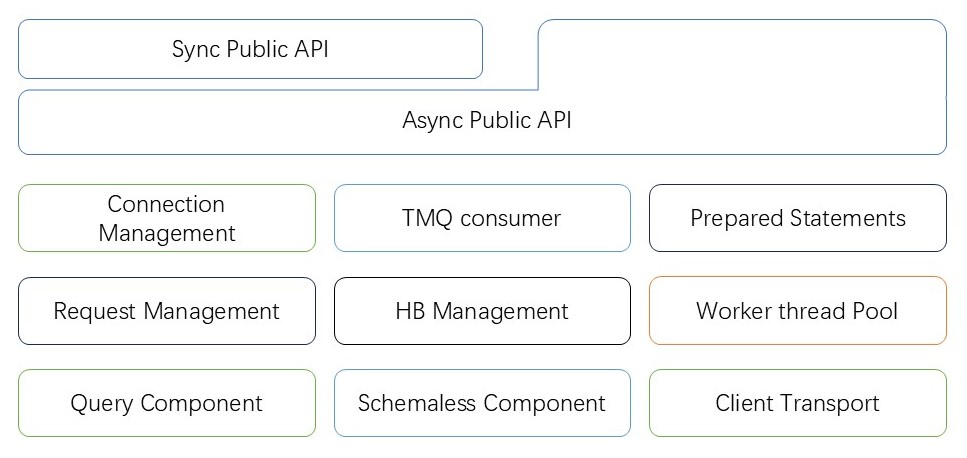
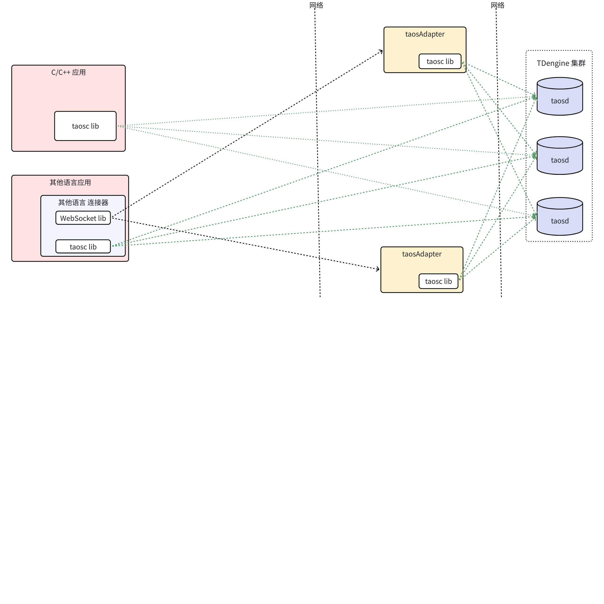
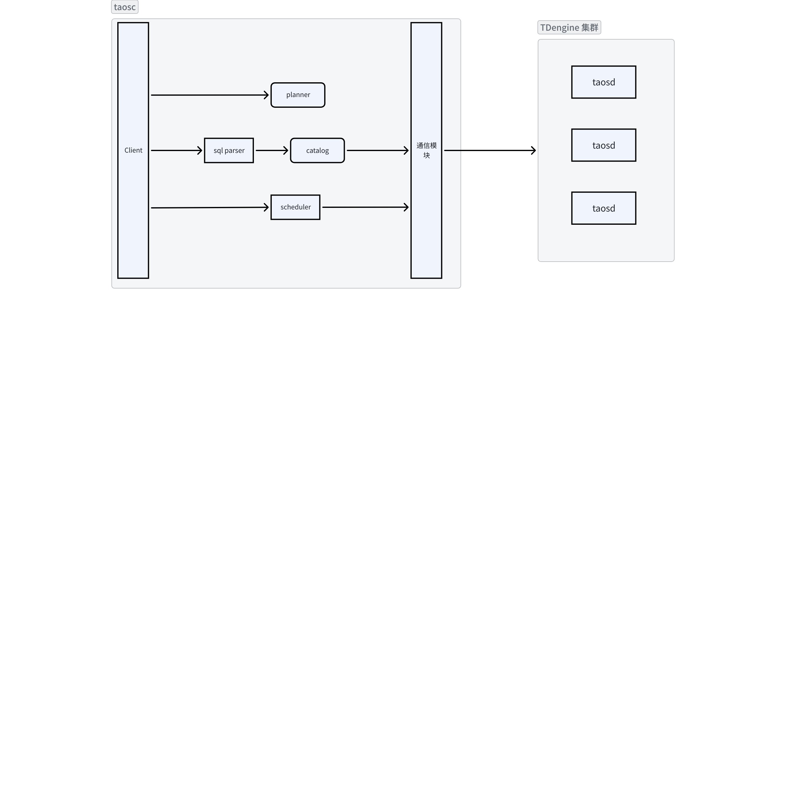
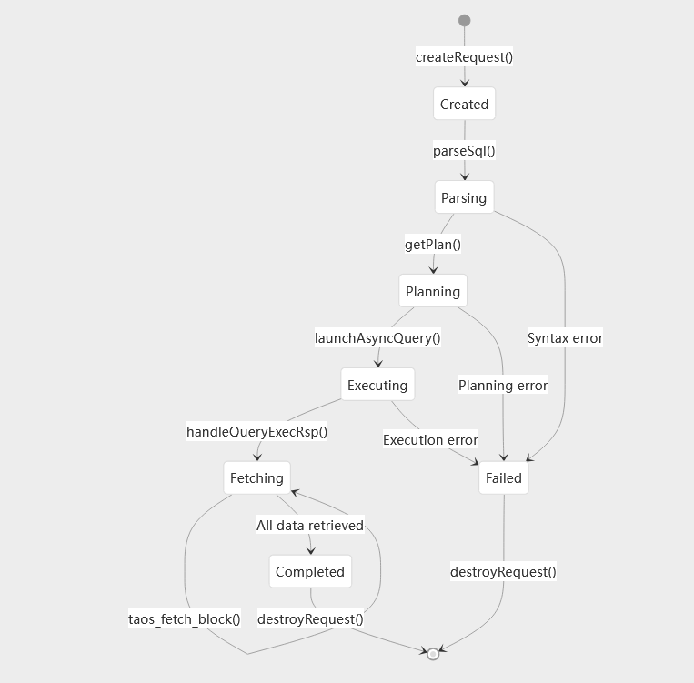
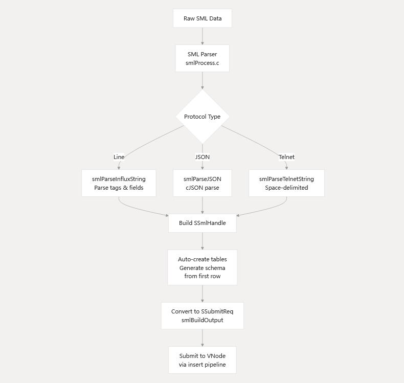
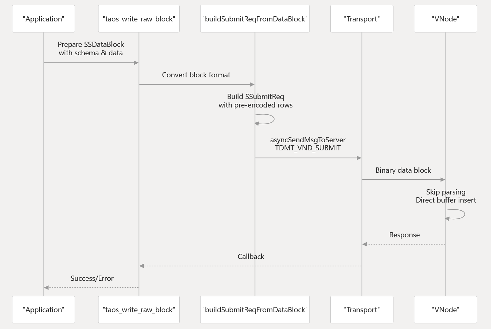

# C/C++ 连接器-Design Spec

## 1. 修订记录

| 编写日期 | 发布日期 | 版本 | 修订人 | 主要修改内容 |
| --- | --- | --- | --- | --- |
| 2025-01-20 | 2025-01-20 | 1.0 | 任新胜 | 新建 |
| 2026-01-13 | 2026-01-13 | 1.1 | 廖浩均 | 重构文档 |

## 2. 引言

### 2.1 文档目的

C/C++ 连接器（Connector）是 TDengine 为 C/C++ 开发者提供的高性能时序数据库连接器。它旨在帮助开发者使用 C/C++ 语言访问 TDengine 数据库，充分利用其高性能的时序数据处理能力。该连接器支持时序数据库的全部操作功能，包括写入、查询、订阅等，便于和用户应用集成，提升开发效率和应用性能。

### 2.2 范围

C/C++ 连接器是 TDengine 客户端必不可少的组成部分，除了应用程序，也被其他语言的连接器调用，来访问 TDengine 数据库。它提供 TDengine 数据库的所有客户端功能接口，通过丰富的 sql 语法，结合 sql 执行接口，C/C++ 连接器可以完成 taos client 的绝大多数工作，其他接口作为补充完善客户端的特定能力，比如无模式写入，参数绑定和数据订阅。
- 提供通过 SQL 执行的相关接口，包括读写操作，集群管理，授权管理等。
- 提供无模式写入的相关接口。
- 提供参数绑定写入和查询的相关接口。
- 提供数据订阅功能相关接口。

### 2.3 受众

本文档目标读者包括以下几类：
1. 核心开发与维护人员：文档的主要受众，需要依据文档进行编码、调试、性能优化和故障排查。
2. 架构师与产品经理：可通过本文档深入理解连接器构建技术，为产品规划与技术选型提供决策支持。
3. 技术爱好者与合作伙伴：对于希望深入了解TDengine内核原理、或计划进行二次开发的工程师，本文档提供了入门指南与理论依据。

## 3. 术语

**TDengine**：一个高性能的时序数据库，专为海量时序数据的存储与处理设计。
**结构化查询语言（Structured Query Language，SQL）：**是一种用于管理和操作关系型数据库的标准编程语言。 它允许用户存储、更新、删除、搜索和检索数据库中的数据。 SQL 被广泛应用于各种数据中心应用程序中，是 ISO 和 ANSI 等标准化机构认可的国际标准。
**C/C++ 语言连接器**：是针对客户端（ `libtaos.so` ）的封装，提供面向用户的应用程序开发的一系列`API`接口，包含连接、查询、读取数据、写入、数据订阅等一系列与 TDengine 服务端交互的通过 `C/C++` 语言调用的接口。该连接器也是其他高级语言连接器的基础 `API`。
**TAOS**：命令行客户端（Command Line Interface，CLI），是提供给数据库管理员和用户通过命令或 SQL 语句与数据库服务端交互的应用程序。
**TAOS_RES**：调用 `taos_query` 函数执行 SQL 语句以后，返回给用户应用程序的句柄（Handle）。
**TAOS_ROW**：调用 `taos_fetch` 函数获得的返回给用户的应用程序的一行数据结果。

## 4. 概述

所有和 TDengine 集群的交互最终都由 taosc，也就是 libtaos.so 来完成。


客户端整体是一个层次化结构的系统，下层包含了分布在客户端的其他功能组件的模块，包括通信模块（客户端部分）、查询引擎的 SQL 层、订阅模块（客户端部分）。此外还包括了部署于客户端的功能组件：连接管理器、心跳管理器、请求管理器、预编译模块、客户端线程池、无模式写入模块等。以及在上述模块基础上封装的异步调用 `API`，在异步接口基础上封装的同步接口。
**Query component**：中包含了查询的模块部署在客户端的组件，包括parser、planner、optimizer、catalog、scheduler等。相关模块的设计及功能已在《查询引擎 - Design Spec》中介绍了，本文不再赘述。
**Client Transport**：客户端传输层。通信层部署在客户端的组件，相关功能设计在《通信 - Design Spec》介绍，本文不再赘述。
**TMQ Consumer**：订阅功能模块部署于客户端的组件，相关设计及功能介绍在《订阅 - Design Spec》中进行了介绍，本文不再赘述。
**Connection Management**: 负责客户端与服务端的TCP/IP连接建立、认证、断开重连，维护连接池以优化资源复用。
**HB Management**: 通过周期性发送心跳包监测连接活性，并上报当前正在执行的`SQL` 语句信息，超时未响应则触发重连机制，保障通信链路稳定性。
**Worker Thread Pool**: 管理线程资源，支持`libtaos.so` 异步执行逻辑的线程池。通过线程池具备的线程复用减少创建销毁开销，支持动态调整线程数以适配任务负载。
**Schemaless Component**：支持无模式写入功能的模块，提供包括 Line Protocol 或 JSON 格式的无模式写入支持。支持动态字段扩展，无需预定义表结构，适用于数据格式灵活的场景。
**Prepared Statements**：预编译高频SQL模板（如批量插入、查询），减少重复解析开销，防止SQL注入攻击，提升数据库操作性能。
**Sync Public API（同步接口）‌**：提供同步请求-响应模式的接口，客户端阻塞等待处理结果，逻辑简单直接，符合编程习惯。
**Async Public API（异步接口）‌**：支持非阻塞式请求处理，客户端发送请求后无需等待，通过回调或消息通知获取结果，避免客户程序长时间占用阻塞执行线程， 具备高吞吐量。



taosc 的一系列能力是由多个模块合作完成，包括 client、parser、planner、catalog、scheduler 以及通信模块，调用关系如下。



## 5. 详细设计

### 5.1 查询执行流程




查询请求创建到完成或失败的全生命周期状态转换逻辑，涉及状态节点、转换条件等操作。请求创建完成以后，通过`parseSql()`进行`SQL`语法解析，语法解析无误后，调用`getPlan()`生成查询执行计划。查询计划生成成功后，执行`launchAsyncQuery()`异步启动查询执行。查询执行完成后，通过`handleQueryExecRsp()`处理执行结果，进入数据提取阶段。通过`taos_fetch_block()`提取数据块，当所有数据检索完成后，状态转为`Completed`。
失败处理：在`Parsing`阶段若出现语法错误（Syntax error）、`Planning`阶段出现计划错误（Planning error）、`Executing`阶段出现执行错误（Execution error），均会进入Failed状态，最终通过destroyRequest()释放资源。

### 5.2 无模式写入流程




无模式写入处理的流程图，展示从原始数据输入到结构化存储的完整生命周期，涉及数据解析、协议适配、表结构生成及提交存储等几个步骤。
原始数据以`Raw SML Data`为起点，通过`SML Parser`进行初步语法检查和分词，为后续解析提供标准化输入。
协议类型分支：根据数据传输协议类型（Protocol Type）分为三种处理路径：
- Line协议：调用`smlParseInfluxString`解析标签与字段，适用于行分隔格式数据。
- JSON协议：通过`smlParseJSON使用cJSON`库解析键值对结构。
- Telnet协议：通过`smlParseTelnetString`处理空格分隔的字符串数据。
数据结构化与存储：解析后的数据通过`Build SSmIHandle`构建内部数据结构，自动创建表结构并生成模式，转换为`SSubmitReq`格式后，通过`insert pipeline`提交至虚拟节点。

### 5.3 写原始数据流程




应用准备数据， 构造`SSDataBlock`结构体，包含两部分核心信息：元数据，定义表结构（字段名、数据类型、精度等） 和时序数据：按顺序排列的二进制数据块。然后调用同步接口`taos_write_raw_block`函数触发写入流程，传入`SSDataBlock`指针及回调函数。
在`taos_write_raw_block` 函数中进行格式转换和校验，验证SSDataBlock的合法性，并进行 数据块格式转换，将原始数据块转换为预编码格式，减少传输冗余。然后调用 `buildSubmitReqFromDataBlock` 函数，生成`SSubmitReq`对象，之后是调用异步通信接口 `asyncSendMsgToServer`，发送TDMT_VND_SUBMIT类型消息，采用非阻塞I/O模型（如epoll/kqueue），避免线程阻塞。
在 vnode 写入完成以后，将返回消息通过传输层，调用用户设置的写入回调函数，完成写入过程。

## 6. 接口规范

在功能说明文档中，行为部分描述了重要的对外接口，这里统一分类总结，已经描述过的接口不在详细描述和举例。

### 6.1 用户接口

用户接口在 taos.h 中定义。

#### 6.1.1 初始化与退出

1. taos_init
`int  taos_init(void);` 初始化 taosc 资源，可以省略，在初次 connect 时会默认调用。
1. taos_cleanup
`void       taos_cleanup(void);` 提出时或者不再使用时释放资源。

#### 6.1.2 连接与释放

1. taos_connect 连接 TDengine 集群
`TAOS      *taos_connect(const char *host, const char *user, const char *pass, const char *db, uint16_t port);`
1. `taos_connect_auth` 使用密码加密方式 TDengine 集群
`TAOS      *taos_connect_auth(const char *ip, const char *user, const char *auth, const char *db, uint16_t port);`
1. taos_close 释放资源
`void       taos_close(TAOS *taos);`

#### 6.1.3 配置管理

taos_options 支持 locale 和 shellActivityTimer 参数，以及 taos.cfg 的默认路径配置，然后通过 taos.cfg 可以修改所有可配置参数。修改配置文件，需要重新调用初始化接口。
`taos_options(TSDB_OPTION option, const void *arg, ...)`

#### 6.1.4 SQL 执行与结果获取

1. taos_query 同步查询
`TAOS_RES *taos_query(TAOS *taos, const char *sql);`
1. `taos_query_a` 异步查询
`taos_query_a(TAOS *taos, const char *sql, __taos_async_fn_t fp, void *param);`
1. taos_fetch_row 从结果集获取行
`TAOS_ROW taos_fetch_row(TAOS_RES *res);`
1. taos_fetch_fields 获取结果的列描述
`TAOS_FIELD *taos_fetch_fields(TAOS_RES *res);`
1. `taos_fetch_rows_a` 异步获取结果集中的行
`taos_fetch_rows_a(TAOS_RES *res, __taos_async_fn_t fp, void *param);`
1. taos_field_count 结果集中的列数
`int  taos_field_count(TAOS_RES *res);`
1. taos_affected_rows64 影响的行数
`int  taos_affected_rows64(TAOS_RES *res);`
1. taos_result_precision 获取结果集中的时间精度
`int  taos_result_precision(TAOS_RES *res);`
1. taos_free_result 使用完毕后释放结果集
`void     taos_free_result(TAOS_RES *res);`

#### 6.1.5 参数绑定写入

`TAOS_STMT` 系列函数用于处理 TAOS 数据库的预编译 SQL 语句。以下是这些函数的详细说明：

##### 6.1.5.1 初始化和关闭

1. `TAOS_STMT *taos_stmt_init(TAOS *taos)` 初始化一个新的 `TAOS_STMT` 对象。
2. `TAOS_STMT *taos_stmt_init_with_reqid(TAOS *taos, int64_t reqid)` 使用指定的请求 ID 初始化一个新的 `TAOS_STMT` 对象。
3. `TAOS_STMT *taos_stmt_init_with_options(TAOS *taos, TAOS_STMT_OPTIONS *options)` 使用指定的选项初始化一个新的 `TAOS_STMT` 对象。
4. `int taos_stmt_close(TAOS_STMT *stmt)` 关闭并释放 `TAOS_STMT` 对象。

##### 6.1.5.2 预编译和设置

1. `int taos_stmt_prepare(TAOS_STMT *stmt, const char *sql, unsigned long length)` 预编译 SQL 语句。
2. `int taos_stmt_set_tbname_tags(TAOS_STMT *stmt, const char *name, TAOS_MULTI_BIND *tags)` 设置表名和标签。
3. `int taos_stmt_set_tbname(TAOS_STMT *stmt, const char *name)` 设置表名。
4. `int taos_stmt_set_tags(TAOS_STMT *stmt, TAOS_MULTI_BIND *tags)` 设置标签。
5. `int taos_stmt_set_sub_tbname(TAOS_STMT *stmt, const char *name)` 设置子表名。

##### 6.1.5.3 获取字段信息

1. `int taos_stmt_get_tag_fields(TAOS_STMT *stmt, int *fieldNum, TAOS_FIELD_E **fields)` 获取标签字段信息。
2. `int taos_stmt_get_col_fields(TAOS_STMT *stmt, int *fieldNum, TAOS_FIELD_E **fields)` 获取列字段信息。
3. `void taos_stmt_reclaim_fields(TAOS_STMT *stmt, TAOS_FIELD_E *fields)` 回收由 `taos_stmt_get_tag_fields` 或 `taos_stmt_get_col_fields` 分配的字段。

##### 6.1.5.4 参数绑定

1. `int taos_stmt_bind_param(TAOS_STMT *stmt, TAOS_MULTI_BIND *bind) `绑定参数。
2. `int taos_stmt_bind_param_batch(TAOS_STMT *stmt, TAOS_MULTI_BIND *bind)` 批量绑定参数。
3. `int taos_stmt_bind_single_param_batch(TAOS_STMT *stmt, TAOS_MULTI_BIND *bind, int colIdx)` 批量绑定单个参数。

#### 6.1.6 辅助函数

1. `获取数据类型：const char *taos_data_type(int type)`
2. 选择数据库：`int  taos_select_db(TAOS *taos, const char *db);`
3. 格式化输出数据到终端：`int   taos_print_row(char *str, TAOS_ROW row, TAOS_FIELD *fields, int num_fields);`
4. 格式化输出数据到终端（带长度控制）：`int  taos_print_row_with_size(char *str, uint32_t size, TAOS_ROW row, TAOS_FIELD *fields, int num_fields);`
5. 终止查询：void taos_stop_query(TAOS_RES *res);
6. 结果数据是否为空判断：`bool taos_is_null(TAOS_RES *res, int32_t row, int32_t col);`
7. 获取一列数据的 null 状态到 result 数组： `int  taos_is_null_by_column(TAOS_RES *res, int columnIndex, bool result[], int *rows);`
8. SQL 是否在更新数据(写入或者删除)： bool taos_is_update_query(TAOS_RES *res);
9. 按行方式整块获取执行结果： int  taos_fetch_block(TAOS_RES *res, TAOS_ROW *rows);
10. 按行方式整块获取取执行结果（返回错误信息）：`taos_fetch_block_s int  taos_fetch_block_s(TAOS_RES *res, int *numOfRows, TAOS_ROW *rows);`
11. 获取原始数据块结果（未经 decode ）：`int  taos_fetch_raw_block(TAOS_RES *res, int *numOfRows, void **pData);`
12. 获取某列数据在结果中的偏移位置： int *taos_get_column_data_offset(TAOS_RES *res, int columnIndex);
13. Sql 合法性判断：`int  taos_validate_sql(TAOS *taos, const char *sql);`
14. reset 当前db: void taos_reset_current_db(TAOS *taos);
15. 获取结果中每列数据需要的字节数：int      *taos_fetch_lengths(TAOS_RES *res);
16. TAOS_ROW *taos_result_block(TAOS_RES *res);
17. 获取服务器信息： const char *taos_get_server_info(TAOS *taos);
18. 获取客户端信息：const char *taos_get_client_info();
19. 获取当前 db： int   taos_get_current_db(TAOS *taos, char *database, int len, int *required);

#### 6.1.7 错误处理

1. 获取错误描述：`const char *taos_errstr(TAOS_RES *res);`
2. 获取错误码：` int   taos_errno(TAOS_RES *res);`

### 6.2 内部消息

这里内部消息主要指不对用户暴露的，libtaos.so 与 服务端交互的消息。

#### 6.2.1 通信接口

taosc 调用通信模块和 TDengine 集群交互：
- `int32_t rpcSendRequest(void *thandle, const SEpSet *pEpSet, SRpcMsg *pMsg, int64_t *rid);`
- `int32_t rpcSendRequestWithCtx(void* pInit, const SEpSet* pEpSet, SRpcMsg* pMsg, int64_t* pRid, SRpcCtx* pCtx)`
该函数专门提供给客户端应用发送消息给服务器，其中shandle是rpcOpen的返回值，ipSet参数包含有多个IP地址，其中SRpcMsg里的msgType是消息类型，pCont, contLen是指向应用的消息指针和长度，handle是应用需要提供的handle, 当RPC模块收到response后，调用应用提供的回调函数时，将返回给应用。
- `int32_t rpcSendResponse(const SRpcMsg *pMsg);`
该函数提供给服务器应用发送response给客户端，其中SRpcMsg里的code是应用提供的错误代码，0表示成功，pCont, contLen是应用提供的消息体的指针与长度，而handle是RPC收到来自客户端request消息，回调服务器程序时提供的handle(实为内部链接的指针）。

#### 6.2.2 数据结构

##### 6.2.2.1 数据发送

1. 所有任务的处理入口：
`int32_t schLaunchRemoteTask(SSchJob *pJob, SSchTask *pTask)`
1. 调用 `qSubPlanToMsg(plan, &pTask->msg, &pTask->msgLen);`执行计划的树结构顺序成为一个字符串，准备发送给服务端，服务端会调用相反过程换位   为计划再执行。
2. 调用 `schBuildAndSendMsg(SSchJob *pJob, SSchTask *pTask, SQueryNodeAddr ``*addr, int32_t msgType, void*`` param) `
   - 序列化不同的的消息，将所有要发送的内容打包为二进制结构
   - 打包完成发送
`int32_t schBuildAndSendMsg(SSchJob *pJob, SSchTask *pTask, SQueryNodeAddr ``*addr, int32_t msgType, void*`` param)`
```c
typedef struct SMsgSendInfo {
  __async_send_cb_fn_t fp;      // async callback function
  STargetInfo          target;  // for update epset
  __freeFunc           paramFreeFp;
  void*                param;
  uint64_t             requestId;
  uint64_t             requestObjRefId;
  int32_t              msgType;
  SDataBuf             msgInfo;
} SMsgSendInfo;
```

```c
typedef struct SRpcMsg {
  tmsg_t         msgType;
  void          *pCont;
  int32_t        contLen;
  int32_t        code;
  SRpcHandleInfo info;
} SRpcMsg;
```

##### 6.2.2.2 数据接收

回调消息的处理入口
`int32_t ctgProcessRspMsg(void* out, int32_t reqType, char* msg, int32_t msgSize, int32_t rspCode, char* target)`
不同的消息会根据消息类型不同，调用不同的处理过程，处理过程在初始化时已注册：
```c
void initQueryModuleMsgHandle() {
  queryBuildMsg[TMSG_INDEX(TDMT_VND_TABLE_META)] = queryBuildTableMetaReqMsg;
  queryBuildMsg[TMSG_INDEX(TDMT_VND_TABLE_NAME)] = queryBuildTableMetaReqMsg;
  queryBuildMsg[TMSG_INDEX(TDMT_MND_TABLE_META)] = queryBuildTableMetaReqMsg;
  queryBuildMsg[TMSG_INDEX(TDMT_MND_USE_DB)] = queryBuildUseDbMsg;
  queryBuildMsg[TMSG_INDEX(TDMT_MND_QNODE_LIST)] = queryBuildQnodeListMsg;
  queryBuildMsg[TMSG_INDEX(TDMT_MND_DNODE_LIST)] = queryBuildDnodeListMsg;
  queryBuildMsg[TMSG_INDEX(TDMT_MND_GET_DB_CFG)] = queryBuildGetDBCfgMsg;
  queryBuildMsg[TMSG_INDEX(TDMT_MND_GET_INDEX)] = queryBuildGetIndexMsg;
  queryBuildMsg[TMSG_INDEX(TDMT_MND_RETRIEVE_FUNC)] = queryBuildRetrieveFuncMsg;
  queryBuildMsg[TMSG_INDEX(TDMT_MND_GET_USER_AUTH)] = queryBuildGetUserAuthMsg;
  queryBuildMsg[TMSG_INDEX(TDMT_MND_GET_TABLE_INDEX)] = queryBuildGetTbIndexMsg;
  queryBuildMsg[TMSG_INDEX(TDMT_VND_TABLE_CFG)] = queryBuildGetTbCfgMsg;
  queryBuildMsg[TMSG_INDEX(TDMT_MND_TABLE_CFG)] = queryBuildGetTbCfgMsg;
  queryBuildMsg[TMSG_INDEX(TDMT_MND_SERVER_VERSION)] = queryBuildGetSerVerMsg;
  queryBuildMsg[TMSG_INDEX(TDMT_MND_VIEW_META)] = queryBuildGetViewMetaMsg;
  queryBuildMsg[TMSG_INDEX(TDMT_MND_GET_TABLE_TSMA)] = queryBuildGetTableTSMAMsg;
  queryBuildMsg[TMSG_INDEX(TDMT_MND_GET_TSMA)] = queryBuildGetTSMAMsg;
  queryBuildMsg[TMSG_INDEX(TDMT_VND_GET_STREAM_PROGRESS)] = queryBuildGetStreamProgressMsg;

  queryProcessMsgRsp[TMSG_INDEX(TDMT_VND_TABLE_META)] = queryProcessTableMetaRsp;
  queryProcessMsgRsp[TMSG_INDEX(TDMT_VND_TABLE_NAME)] = queryProcessTableNameRsp;
  queryProcessMsgRsp[TMSG_INDEX(TDMT_MND_TABLE_META)] = queryProcessTableMetaRsp;
  queryProcessMsgRsp[TMSG_INDEX(TDMT_MND_USE_DB)] = queryProcessUseDBRsp;
  queryProcessMsgRsp[TMSG_INDEX(TDMT_MND_QNODE_LIST)] = queryProcessQnodeListRsp;
  queryProcessMsgRsp[TMSG_INDEX(TDMT_MND_DNODE_LIST)] = queryProcessDnodeListRsp;
  queryProcessMsgRsp[TMSG_INDEX(TDMT_MND_GET_DB_CFG)] = queryProcessGetDbCfgRsp;
  queryProcessMsgRsp[TMSG_INDEX(TDMT_MND_GET_INDEX)] = queryProcessGetIndexRsp;
  queryProcessMsgRsp[TMSG_INDEX(TDMT_MND_RETRIEVE_FUNC)] = queryProcessRetrieveFuncRsp;
  queryProcessMsgRsp[TMSG_INDEX(TDMT_MND_GET_USER_AUTH)] = queryProcessGetUserAuthRsp;
  queryProcessMsgRsp[TMSG_INDEX(TDMT_MND_GET_TABLE_INDEX)] = queryProcessGetTbIndexRsp;
  queryProcessMsgRsp[TMSG_INDEX(TDMT_VND_TABLE_CFG)] = queryProcessGetTbCfgRsp;
  queryProcessMsgRsp[TMSG_INDEX(TDMT_MND_TABLE_CFG)] = queryProcessGetTbCfgRsp;
  queryProcessMsgRsp[TMSG_INDEX(TDMT_MND_SERVER_VERSION)] = queryProcessGetSerVerRsp;
  queryProcessMsgRsp[TMSG_INDEX(TDMT_MND_VIEW_META)] = queryProcessGetViewMetaRsp;
  queryProcessMsgRsp[TMSG_INDEX(TDMT_MND_GET_TABLE_TSMA)] = queryProcessGetTbTSMARsp;
  queryProcessMsgRsp[TMSG_INDEX(TDMT_MND_GET_TSMA)] = queryProcessGetTbTSMARsp;
  queryProcessMsgRsp[TMSG_INDEX(TDMT_VND_GET_STREAM_PROGRESS)] = queryProcessStreamProgressRsp;
}
```

##### 6.2.2.3 消息序列化

最终消息要转为字符串发送，但是因为执行计划树状结构，因此要按照一定的规则现将执行计划展开为字符串以方便传输，服务器对端也需要用相同逻辑将字符串转为执行计划。
1. 执行计划转字符串
`int32_t specificNodeToMsg(const void* pObj, STlvEncoder* pEncoder);`
将执行计划中的节点展开为字符串。不同类型节点会有不同的具体实现。
`static int32_t msgToSpecificNode(STlvDecoder* pDecoder, void* pObj) ;`
是服务器端实现的逆过程，将字符串转为执行计划，然后执行；
示例：physiNode / msg 的 encode 与 decoder 如下
```c

static int32_t physiNodeToMsg(const void* pObj, STlvEncoder* pEncoder) {
  const SPhysiNode* pNode = (const SPhysiNode*)pObj;

  int32_t code = tlvEncodeObj(pEncoder, PHY_NODE_CODE_OUTPUT_DESC, nodeToMsg, pNode->pOutputDataBlockDesc);
  if (TSDB_CODE_SUCCESS == code) {
    code = tlvEncodeObj(pEncoder, PHY_NODE_CODE_CONDITIONS, nodeToMsg, pNode->pConditions);
  }
  if (TSDB_CODE_SUCCESS == code) {
    code = tlvEncodeObj(pEncoder, PHY_NODE_CODE_CHILDREN, nodeListToMsg, pNode->pChildren);
  }
  if (TSDB_CODE_SUCCESS == code) {
    code = tlvEncodeObj(pEncoder, PHY_NODE_CODE_LIMIT, nodeToMsg, pNode->pLimit);
  }
  if (TSDB_CODE_SUCCESS == code) {
    code = tlvEncodeObj(pEncoder, PHY_NODE_CODE_SLIMIT, nodeToMsg, pNode->pSlimit);
  }
  if (TSDB_CODE_SUCCESS == code) {
    code = tlvEncodeEnum(pEncoder, PHY_NODE_CODE_INPUT_TS_ORDER, pNode->inputTsOrder);
  }
  if (TSDB_CODE_SUCCESS == code) {
    code = tlvEncodeEnum(pEncoder, PHY_NODE_CODE_OUTPUT_TS_ORDER, pNode->outputTsOrder);
  }
  if (TSDB_CODE_SUCCESS == code) {
    code = tlvEncodeBool(pEncoder, PHY_NODE_CODE_DYNAMIC_OP, pNode->dynamicOp);
  }
  if (TSDB_CODE_SUCCESS == code) { 
    code = tlvEncodeBool(pEncoder, PHY_NODE_CODE_FORCE_NONBLOCKING_OPTR, pNode->forceCreateNonBlockingOptr);
  }

  return code;
}

static int32_t msgToPhysiNode(STlvDecoder* pDecoder, void* pObj) {
  SPhysiNode* pNode = (SPhysiNode*)pObj;

  int32_t code = TSDB_CODE_SUCCESS;
  STlv*   pTlv = NULL;
  tlvForEach(pDecoder, pTlv, code) {
    switch (pTlv->type) {
      case PHY_NODE_CODE_OUTPUT_DESC:
        code = msgToNodeFromTlv(pTlv, (void**)&pNode->pOutputDataBlockDesc);
        break;
      case PHY_NODE_CODE_CONDITIONS:
        code = msgToNodeFromTlv(pTlv, (void**)&pNode->pConditions);
        break;
      case PHY_NODE_CODE_CHILDREN:
        code = msgToNodeListFromTlv(pTlv, (void**)&pNode->pChildren);
        break;
      case PHY_NODE_CODE_LIMIT:
        code = msgToNodeFromTlv(pTlv, (void**)&pNode->pLimit);
        break;
      case PHY_NODE_CODE_SLIMIT:
        code = msgToNodeFromTlv(pTlv, (void**)&pNode->pSlimit);
        break;
      case PHY_NODE_CODE_INPUT_TS_ORDER:
        code = tlvDecodeEnum(pTlv, &pNode->inputTsOrder, sizeof(pNode->inputTsOrder));
        break;
      case PHY_NODE_CODE_OUTPUT_TS_ORDER:
        code = tlvDecodeEnum(pTlv, &pNode->outputTsOrder, sizeof(pNode->outputTsOrder));
        break;
      case PHY_NODE_CODE_DYNAMIC_OP:
        code = tlvDecodeBool(pTlv, &pNode->dynamicOp);
        break;
      case PHY_NODE_CODE_FORCE_NONBLOCKING_OPTR:
        code = tlvDecodeBool(pTlv, &pNode->forceCreateNonBlockingOptr);
        break;
      default:
        break;
    }
  }

  return code;
}
```

1. 请求消息序列化为二进制
消息序列化，是将结构化的消息转为二进制数据发送，序列化和反序列化同时发生在客户端和服务器：
1. 客户端将请求消息序列化发送
2. 服务器反序列化请求消息，开始执行
3. 服务端执行完成后将执行结果序列化发送
4. 客户端接收到服务端返回，反序列化结果后输出
以下是一个典型事例：请求超级表结构的消息定义以及序列化反序列化函数入口
```c
typedef struct {
  SMsgHead header;
  char     dbFName[TSDB_DB_FNAME_LEN];
  char     tbName[TSDB_TABLE_NAME_LEN];
} STableCfgReq;

typedef struct {
  char        tbName[TSDB_TABLE_NAME_LEN];
  char        stbName[TSDB_TABLE_NAME_LEN];
  char        dbFName[TSDB_DB_FNAME_LEN];
  int32_t     numOfTags;
  int32_t     numOfColumns;
  int8_t      tableType;
  int64_t     delay1;
  int64_t     delay2;
  int64_t     watermark1;
  int64_t     watermark2;
  int32_t     ttl;
  SArray*     pFuncs;
  int32_t     commentLen;
  char*       pComment;
  SSchema*    pSchemas;
  int32_t     tagsLen;
  char*       pTags;
  SSchemaExt* pSchemaExt;
} STableCfg;

typedef STableCfg STableCfgRsp;

int32_t tSerializeSTableCfgReq(void* buf, int32_t bufLen, STableCfgReq* pReq);
int32_t tDeserializeSTableCfgReq(void* buf, int32_t bufLen, STableCfgReq* pReq);

int32_t tSerializeSTableCfgRsp(void* buf, int32_t bufLen, STableCfgRsp* pRsp);
int32_t tDeserializeSTableCfgRsp(void* buf, int32_t bufLen, STableCfgRsp* pRsp);
void    tFreeSTableCfgRsp(STableCfgRsp* pRsp);
```

## 7. 安全设计

在 C/C++ 语言中，没有自动内存管理和运行时保护，内存安全漏洞（如缓冲区溢出）是最大的安全威胁。
为了最大限度地保证 C/C++ 连接器的安全，需要以下的设计关键：
**内存安全防御：**
- 禁止使用危险函数：在库内部严禁使用 `strcpy`, `strcat`, `gets`, `sprintf` 等不检查边界的函数。必须强制使用安全版本，如 `strncpy`, `strncat`, `snprintf`。
- 显式长度限制：所有接收 Buffer 指针的 API 必须同时接收一个 `size_t` 类型的长度参数。
- 外部内存管理策略：
  - 由调用者（用户）分配内存并传入指针和大小，API 仅负责填充。这样可以避免库内部动态分配导致的内存泄漏或 Use-after-free 漏洞。
- 不透明指针（Opaque Pointers）：
  - 在头文件中只声明 `typedef struct my_context_t my_context_t;`，在 .c 文件中才定义具体成员。这样用户无法直接修改库的内部状态，只能通过你提供的函数操作，防止内部状态篡改。
**严格的参数校验与错误处理：**
- 空指针检查（NULL Check）：在每个公开函数的入口处，必须检查传入指针是否为 `NULL`。
- 返回值统一化：定义一套严格的错误码枚举（如 `LIB_SUCCESS`, `LIB_ERR_AUTH_FAILED`, `LIB_ERR_BUFFER_TOO_SMALL`）。禁止直接返回内部逻辑产生的随机整数。
- 状态机保护：如果 API 是有状态的（如先 Init 再 Call），必须在内部检查状态位。如果用户未初始化就调用功能函数，应安全返回错误码，而不是触发未定义行为。
**敏感数据处理：**
安全清理敏感内存：在敏感数据使用完毕后，使用 `memset_s()`（C11 标准）或平台相关的函数来擦除内存。普通的 `memset` 可能会被编译器优化掉，导致密钥残留在内存中。
避免明文存储串：不应以字符串常量形式存在（容易被 `strings` 命令扫描），而应以加盐混淆后的字节数组形式存储。
**线程安全与并发防御：**
重入性（Reentrancy）：确保 API 库是重入安全的。尽量避免使用 `static` 或全局变量。如果必须使用，必须配合锁（Mutex）机制。
线程本地存储（TLS）：对于需要保存上下文的情况，使用 `__thread` 或 `_Thread_local` 关键字，确保不同线程的数据相互隔离，防止数据竞争导致的逻辑绕过。
**编译与链接层级的加固：**
安全不只是代码，还包括你如何交付这个 `.so` 或 `.dll` 文件。
- 开启安全编译选项：
  - Stack Canaries (-fstack-protector-all)：检测栈溢出。
  - ASLR/PIE (-fPIE -pie)：地址空间随机化，增加攻击者定位代码段的难度。
  - NX (No-Execute)：确保数据段不可执行，防止 shellcode 运行。
- 符号导出限制：使用链接脚本（Linker Script）或 `attribute`，只导出必要的公开接口，隐藏所有内部辅助函数。

## 8. 性能和可扩展性

1. 对用户而言，包括 taosc 的内部使用者 taosadapter、taosBenchmark，对外接口尽量保持稳定，当 TDengine 版本更新时，用户程序不用改动；
2. taosc 和 TDengine 通信属于内部通信，消息结构会因业务需要发生变化，因此 taosc 和 TDengine 要求版本一致，不保证不同版本的兼容性；当版本不一致时，taosc 会报错。

## 9. 部署和配置

1. 配置管理：和 taosd 一样使用 taos.cfg 文件作为配置文件，可通过配置接口修改文件路径。
Taosc 支持的配置参数及其含义：
| 参数名称 | 支持版本 | 动态修改 | 参数含义 |
| --- | --- | --- | --- |
| countAlwaysReturnValue |  | 支持动态修改 立即生效 | count/hyperloglog 函数在输入数据为空或者 NULL 的情况下是否返回值；0：返回空行，1：返回；默认值 1；该参数设置为 1 时，如果查询中含有 INTERVAL 子句或者该查询使用了 TSMA 时，且相应的组或窗口内数据为空或者 NULL，对应的组或窗口将不返回查询结果；注意此参数客户端和服务端值应保持一致 |
| keepColumnName |  | 支持动态修改 立即生效 | Last、First、LastRow 函数查询且未指定别名时，自动设置别名为列名（不含函数名），因此 order by 子句如果引用了该列名将自动引用该列对应的函数；1：表示自动设置别名为列名(不包含函数名)，0：表示不自动设置别名；缺省值：0 |
| metaCacheMaxSize |  | 支持动态修改 立即生效 | 指定单个客户端元数据缓存大小的最大值，单位 MB；缺省值 -1，表示无限制 |
| maxTsmaCalcDelay |  | 支持动态修改 立即生效 | 查询时客户端可允许的 tsma 计算延迟，若 tsma 的计算延迟大于配置值，则该 TSMA 将不会被使用；取值范围 600s - 86400s，即 10 分钟 - 1 小时；缺省值：600 秒 |
| tsmaDataDeleteMark |  | 支持动态修改 立即生效 | TSMA 计算的历史数据中间结果保存时间，单位为毫秒；取值范围 >= 3600000，即大于等于1h；缺省值：86400000，即 1d |
| queryPolicy |  | 支持动态修改 立即生效 | 查询语句的执行策略，1：只使用 vnode，不使用 qnode；2：没有扫描算子的子任务在 qnode 执行，带扫描算子的子任务在 vnode 执行；3：vnode 只运行扫描算子，其余算子均在 qnode 执行；缺省值：1 |
| queryTableNotExistAsEmpty |  | 支持动态修改 立即生效 | 查询表不存在时是否返回空结果集；false：返回错误；true：返回空结果集；缺省值 false |
| querySmaOptimize |  | 支持动态修改 立即生效 | sma index 的优化策略，0：表示不使用 sma index，永远从原始数据进行查询；1：表示使用 sma index，对符合的语句，直接从预计算的结果进行查询；缺省值：0 |
| queryPlannerTrace |  | 支持动态修改 立即生效 | 内部参数，查询计划是否输出详细日志 |
| queryNodeChunkSize |  | 支持动态修改 立即生效 | 内部参数，查询计划的块大小 |
| queryUseNodeAllocator |  | 支持动态修改 立即生效 | 内部参数，查询计划的分配方法 |
| queryMaxConcurrentTables |  | 不支持动态修改 | 内部参数，查询计划的并发数目 |
| enableQueryHb |  | 支持动态修改 立即生效 | 内部参数，是否发送查询心跳消息 |
| minSlidingTime |  | 支持动态修改 立即生效 | 内部参数，sliding 的最小允许值 |
| minIntervalTime |  | 支持动态修改 立即生效 | 内部参数，interval 的最小允许值 |

Taosd 支持的配置参数及其含义：
| 参数名称 | 支持版本 | 动态修改 | 参数含义 |
| --- | --- | --- | --- |
| countAlwaysReturnValue |  | 支持动态修改 立即生效 | count/hyperloglog 函数在输入数据为空或者 NULL 的情况下是否返回值；0：返回空行，1：返回；默认值 1；该参数设置为 1 时，如果查询中含有 INTERVAL 子句或者该查询使用了 TSMA 时，且相应的组或窗口内数据为空或者 NULL，对应的组或窗口将不返回查询结果；注意此参数客户端和服务端值应保持一致 |
| tagFilterCache |  | 不支持动态修改 | 是否缓存标签过滤结果 |
| queryBufferSize |  | 支持动态修改 重启生效 | 暂不生效 |
| queryRspPolicy |  | 支持动态修改 立即生效 | 查询响应策略 |
| filterScalarMode |  | 不支持动态修改 | 强制使用标量过滤模式，0：关闭；1：开启，默认值 0 |
| queryRsmaTolerance |  | 不支持动态修改 | 内部参数，用于判定查询哪一级 rsma 数据时的容忍时间，单位为毫秒 |
| pqSortMemThreshold |  | 不支持动态修改 | 内部参数，排序使用的内存阈值 |

1. 版本控制：
   - 对用户而言，包括 taosc 的内部使用者 taosadapter、taosBenchmark，对外接口尽量保持稳定，当 TDengine 版本更新时，用户程序不用改动；
   - taosc 和 TDengine 通信属于内部通信，消息结构会因业务需要发生变化，因此 taosc 和 TDengine 要求版本一致，不保证不同版本的兼容性；当版本不一致时，taosc 会报错。

## 10. 监控和维护

可用的查询监控和维护手段包括：
A. show queries 命令：可以查询当前所有进行中的查询及其详细执行信息；
B. 慢查询日志：可以通过慢查询日志找到所有执行时间超过预期的查询；
C. 查询日志：可以在日志文件中搜索找到查询日志，根据日志信息进行问题定位等；
D. Explain 命令：可以通过 explain 命令来查看查询计划或执行过程分析从而确定性能瓶颈；

## 11. 参考资料

无
