# GO 连接器-Design Spec

## 1. 修订记录

| 编写日期 | 发布日期 | 版本 | 负责人 | 主要修改内容 |
| --- | --- | --- | --- | --- |
| 2025-01-09 | 2025-01-09 | 1.0 | 谭雪峰 |  |
| 2025-12-20 | 2025-12-20 | 2.0 | 谭雪峰 | 新增 STMT2 绑定、decimal 与 blob 类型 |
| 2026-01-20 | 2026-01-20 | 2.0 | 谭雪峰 | 增加 STMT2 绑定和 TDengine 兼容版本 |

## 2. 引言

1. 目的
  `taosdata/driver-go` 是涛思数据（Taos Data）为 Go 语言开发者提供的高效、标准化的 TDengine 数据库连接器。它旨在帮助开发者通过 Go 语言轻松访问 TDengine 数据库，充分利用其高性能的时序数据处理能力。该驱动支持数据的快速写入、查询和订阅，同时提供了丰富的接口，便于与 Go 生态中的工具和框架集成，从而提升开发效率和应用性能。
1. 范围
  `taosdata/driver-go` 是一个为 Go 开发者设计的数据库连接工具，主要用于以下场景：
  - **SQL 写入和查询**：提供标准的 SQL 接口，支持数据的插入、查询、更新和删除操作。
  - **无模式写入**：支持无需预先定义表结构的快速数据写入，适用于动态数据场景。
  - **参数绑定写入和查询**：支持参数化查询和写入，提升数据操作的效率和安全性。
  - **数据订阅功能**：提供数据订阅接口，支持实时数据流的监听和处理。
1. 受众
需要使用 go 程序来访问 TDengine 数据库的开发者。

## 3. 术语

1. **无模式写入：**是指在写入数据时无需预先定义表结构，系统会根据数据自动创建或调整表结构的特性。
2. **数据订阅：**允许客户端实时接收数据库中的数据变化，适用于实时监控场景。
3. **参数绑定：**是在 SQL 语句中使用占位符替代具体值的技术，可以防止 SQL 注入并提高性能。
4. **WebSocket：** 是一种在单个 TCP 连接上提供全双工通信的协议。它允许客户端和服务器之间的双向实时通信，避免了 HTTP 请求-响应模型的限制。WebSocket 协议的定义和规范是由 IETF（Internet Engineering Task Force）标准化的，其主要文档是 [RFC 6455](https://datatracker.ietf.org/doc/html/rfc6455)。
5. **FQDN：**全限定域名是互联网域名系统（DNS）中的一种完整的、唯一的域名表示形式，用于明确标识互联网上的特定主机或服务器。
6. **RFC3339：**RFC 3339 是一种时间和日期格式的标准，旨在规范化地表示时间和日期，以便在计算机系统之间传递和处理。
7. **REST （Representational State Transfer）**： 是一种基于 HTTP 的软件架构风格，提供了简单统一的接口规范。
8. **CGO** ：CGO 是 Go 语言的一个工具，它允许 Go 程序调用 C 语言代码
9. **taosd：**TDengine 数据库引擎的核心服务，提供数据访问，多副本，高可用，数据压缩等功能。
10. **taosAdapter：**一个 TDengine 的配套工具，是 TDengine 集群和应用程序之间的桥梁和适配器。提供了 REST/WebSocket 接口来访问 TDengine。
11. **taosc：**taosc（应用驱动）是 TDengine 为应用程序提供的驱动程序，负责处理应用程序与集群之间的接口交互。taosc 提供了 C/C++ 语言的原生接口，并被内嵌于 JDBC、C#、Python、Go 等多种编程语言的连接库中，从而支持这些编程语言与数据库交互。

## 4. 概述

1. 架构：描述整体架，可能包括类图、组件图或系统的其他结构表示
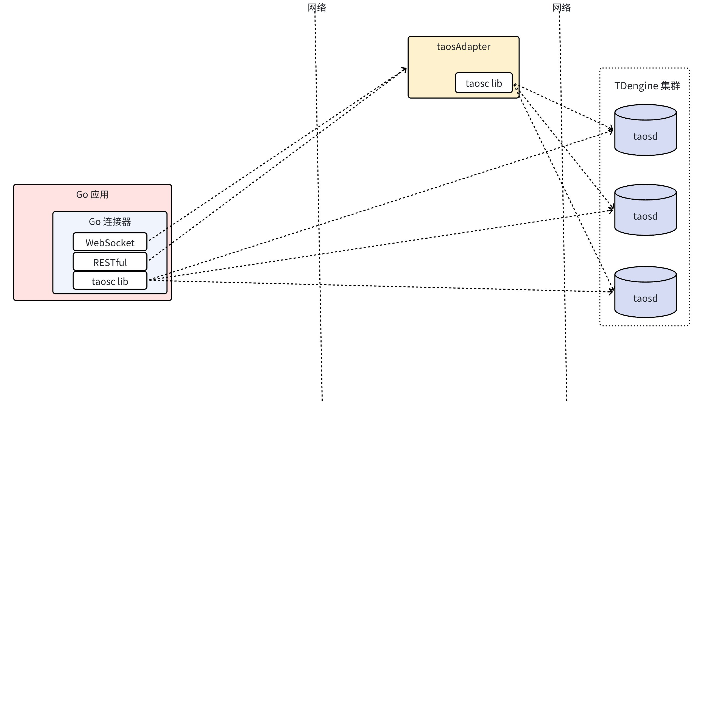

1. Go 连接器支持三种连接方式：WebSocket、REST 和 Naive。其区别为：
   - 使用原生连接，需要保证客户端的驱动程序 taosc 和服务端的 TDengine 版本保持一致。
   - 使用 REST 连接，用户无需安装客户端驱动程序 taosc，具有跨平台易用的优势，但是只有执行 SQL 的功能。REST 接口是无状态的。在使用 REST 连接时，需要在 SQL 中指定表、超级表的数据库名称。
   - 使用 WebSocket 连接，用户也无需安装客户端驱动程序 taosc。
   - 连接云服务实例，必须使用 REST 连接 或 WebSocket 连接。
2. 技术：列出所使用的技术和框架
  - 开发语言：Go。
  - 调用动态库：CGO。
  - HTTP 客户端: 标准库。
  - WebSocket 客户端：websocket（github.com/gorilla/websocket）。
  - JSON 库：标准库（json）、json-iterator（github.com/json-iterator/go）。
1. 依赖项：列出所有依赖项
  - 原生连接需要安装 TDengine 客户端动态库。
  - 原生连接使用 cgo 需要 gcc （Windows 上使用 msys2 和 mingw）。
  - Go 版本 1.14 及以上。

## 5. 设计考虑

1. 假设和限制
  - **假设**:
    - 使用原生连接时 TDengine 已经部署且可以正常连接
    - 使用 RESTful 或 WebSocket 连接时 TDengine 和 taosAdapter 已经部署且可以正常连接到 taosAdapter。
  - **限制**:
    - 部署的 taosAdapter 版本与 TDengine 版本相对应。
    - Go 连接器版本与 TDengine 版本兼容
1. 设计模式和原则（例如 MVC、单例、工厂）
  - **适配器模式：**尽量兼容不同的数据库接口
  - **单一职责原则**：每个模块只负责一个功能
  - **接口隔离原则：**分隔原生、RESTful 和 WebSocket 接口 
1. 风险和缓解措施：识别潜在风险和缓解策略
  - 风险：C 函数执行时间长导致 go 创建大量线程。
    - 缓解措施：使用 channel 来模拟信号量控制 C 函数并发度，对于执行时间短的 C 函数不进行控制。

## 6. 详细设计

### 6.1 C 接口封装

`wrapper` 使用 CGO 封装了 TDengine 客户端的 C 方法。
1. 对于同步方法使用 CGO 直接封装进行调用，比如创建连接 `TAOS *taos_connect(const char *ip, const char *user, const char *pass, const char *db, uint16_t port);`
```go {wrap}
// TaosConnect TAOS *taos_connect(const char *ip, const char *user, const char *pass, const char *db, uint16_t port);
func TaosConnect(host, user, pass, db string, port int) (taos unsafe.Pointer, err error) {
    cUser := C.CString(user)
    defer C.free(unsafe.Pointer(cUser))
    cPass := C.CString(pass)
    defer C.free(unsafe.Pointer(cPass))
    cdb := (*C.char)(nil)
    if len(db) > 0 {
       cdb = C.CString(db)
       defer C.free(unsafe.Pointer(cdb))
    }
    var taosObj unsafe.Pointer
    if len(host) == 0 {
       taosObj = C.taos_connect(nil, cUser, cPass, cdb, (C.ushort)(0))
    } else {
       cHost := C.CString(host)
       defer C.free(unsafe.Pointer(cHost))
       taosObj = C.taos_connect(cHost, cUser, cPass, cdb, (C.ushort)(port))
    }

    if taosObj == nil {
       errCode := TaosError(nil)
       return nil, errors.NewError(errCode, TaosErrorStr(nil))
    }
    return taosObj, nil
}
```

使用 `C.CString` 将 Go 字符串转换为 C char* ，使用 defer 保证申请的内存被释放。
调用 taos_connect 方法进行连接。
`C.taos_connect(nil, cUser, cPass, cdb, (C.ushort)(0))`
- `C.taos_connect` 表示调用`taos_connect` 这个 C 方法。
- host 传空指针让动态库获取配置文件中地址进行连接。
- `cUser` `cPass` `cdb` 是转成 char * 的用户名密码和数据库名，使用 defer 进行手动 free。
1. 异步方法封装先编写 Go 回调方法使用 export 导出为 C 方法，使用 C 封装一层异步方法调用将回调方法传进去，上下文使用 cgo.Handle 。handler 原理是使用 sync.Map key 为自增 id value 为上下文，返回自增 id ，由于上下文有可能被 gc 回收因此使用另一个 sync.Map 将上下文指针存下来。例如异步执行 SQL 的封装 `void taos_query_a_with_reqid(TAOS *taos, const char *sql, __taos_async_fn_t fp, void *param, int64_t reqid);`。
   - 创建回调函数
  ```go {wrap}
  // 回调上下文
  type Caller interface {
      QueryCall(res unsafe.Pointer, code int)
      FetchCall(res unsafe.Pointer, numOfRows int)
  }
  
  // 回调函数
  //export QueryCallback
  func QueryCallback(p unsafe.Pointer, res *C.TAOS_RES, code C.int) {
      caller := (*(*cgo.Handle)(p)).Value().(Caller)
      caller.QueryCall(unsafe.Pointer(res), int(code))
  }
  ```

   - 封装异步调用，传递回调函数 QueryCallback
  ```go {wrap}
  void taos_query_a_with_req_id_wrapper(TAOS *taos,const char *sql, void *param, int64_t reqID){
      return taos_query_a_with_reqid(taos, sql, QueryCallback, param, reqID);
  };
  ```

   - 封装 Go 调用
  ```go {wrap}
  func TaosQueryAWithReqID(taosConn unsafe.Pointer, sql string, caller cgo.Handle, reqID int64) {
      cSql := C.CString(sql)
      defer C.free(unsafe.Pointer(cSql))
      C.taos_query_a_with_req_id_wrapper(taosConn, cSql, caller.Pointer(), (C.int64_t)(reqID))
  }
  ```

### 6.2 DSN 解析

数据源名称具有通用格式，例如 [PEAR DB](http://pear.php.net/manual/en/package.database.db.intro-dsn.php)，但没有类型前缀（方括号表示可选）：
```plaintext
[username[:password]@][protocol[(address)]]/[dbname][?param1=value1&...&paramN=valueN]
```

完整形式的 DSN：
```plaintext
username:password@protocol(address)/dbname?param=value
```

解析逻辑：
1. **查找最后一个 **`/`：
  - 用于分隔地址部分和数据库名称部分。
  - 如果未找到 `/`，则返回错误。
1. **解析用户名和密码**：
  - 查找 `@` 符号，分隔用户名和密码。
  - 查找 `:` 符号，分隔用户名和密码。
1. **解析网络协议和地址**：
  - 查找 `(` 和 `)`，提取地址和端口。
  - 原生连接如果协议为 `cfg`，则解析配置文件路径。
1. **解析数据库名称和参数**：
  - 查找 `?` 符号，分隔数据库名称和参数。
  - 调用 `parseDSNParams` 解析参数。

### 6.3 基础信息

#### 6.3.1 类型名称

TDengine 类型与名称对应关系如下
```go {wrap}
const (
    TSDB_DATA_TYPE_NULL       = 0  // 1 bytes
    TSDB_DATA_TYPE_BOOL       = 1  // 1 bytes
    TSDB_DATA_TYPE_TINYINT    = 2  // 1 byte
    TSDB_DATA_TYPE_SMALLINT   = 3  // 2 bytes
    TSDB_DATA_TYPE_INT        = 4  // 4 bytes
    TSDB_DATA_TYPE_BIGINT     = 5  // 8 bytes
    TSDB_DATA_TYPE_FLOAT      = 6  // 4 bytes
    TSDB_DATA_TYPE_DOUBLE     = 7  // 8 bytes
    TSDB_DATA_TYPE_BINARY     = 8  // string
    TSDB_DATA_TYPE_TIMESTAMP  = 9  // 8 bytes
    TSDB_DATA_TYPE_NCHAR      = 10 // unicode string
    TSDB_DATA_TYPE_UTINYINT   = 11 // 1 byte
    TSDB_DATA_TYPE_USMALLINT  = 12 // 2 bytes
    TSDB_DATA_TYPE_UINT       = 13 // 4 bytes
    TSDB_DATA_TYPE_UBIGINT    = 14 // 8 bytes
    TSDB_DATA_TYPE_JSON       = 15
    TSDB_DATA_TYPE_VARBINARY  = 16
    TSDB_DATA_TYPE_DECIMAL    = 17
    TSDB_DATA_TYPE_BLOB       = 18
    TSDB_DATA_TYPE_MEDIUMBLOB = 19
    TSDB_DATA_TYPE_GEOMETRY   = 20
    TSDB_DATA_TYPE_DECIMAL64  = 21
)

const (
    TSDB_DATA_TYPE_NULL_Str      = "NULL"
    TSDB_DATA_TYPE_BOOL_Str      = "BOOL"
    TSDB_DATA_TYPE_TINYINT_Str   = "TINYINT"
    TSDB_DATA_TYPE_SMALLINT_Str  = "SMALLINT"
    TSDB_DATA_TYPE_INT_Str       = "INT"
    TSDB_DATA_TYPE_BIGINT_Str    = "BIGINT"
    TSDB_DATA_TYPE_FLOAT_Str     = "FLOAT"
    TSDB_DATA_TYPE_DOUBLE_Str    = "DOUBLE"
    TSDB_DATA_TYPE_BINARY_Str    = "VARCHAR"
    TSDB_DATA_TYPE_TIMESTAMP_Str = "TIMESTAMP"
    TSDB_DATA_TYPE_NCHAR_Str     = "NCHAR"
    TSDB_DATA_TYPE_UTINYINT_Str  = "TINYINT UNSIGNED"
    TSDB_DATA_TYPE_USMALLINT_Str = "SMALLINT UNSIGNED"
    TSDB_DATA_TYPE_UINT_Str      = "INT UNSIGNED"
    TSDB_DATA_TYPE_UBIGINT_Str   = "BIGINT UNSIGNED"
    TSDB_DATA_TYPE_JSON_Str      = "JSON"
    TSDB_DATA_TYPE_VARBINARY_Str = "VARBINARY"
    TSDB_DATA_TYPE_GEOMETRY_Str  = "GEOMETRY"
    TSDB_DATA_TYPE_DECIMAL_Str   = "DECIMAL"
    TSDB_DATA_TYPE_BLOB_STR      = "BLOB"
)

var TypeNameMap = map[int]string{
    TSDB_DATA_TYPE_NULL:      TSDB_DATA_TYPE_NULL_Str,
    TSDB_DATA_TYPE_BOOL:      TSDB_DATA_TYPE_BOOL_Str,
    TSDB_DATA_TYPE_TINYINT:   TSDB_DATA_TYPE_TINYINT_Str,
    TSDB_DATA_TYPE_SMALLINT:  TSDB_DATA_TYPE_SMALLINT_Str,
    TSDB_DATA_TYPE_INT:       TSDB_DATA_TYPE_INT_Str,
    TSDB_DATA_TYPE_BIGINT:    TSDB_DATA_TYPE_BIGINT_Str,
    TSDB_DATA_TYPE_FLOAT:     TSDB_DATA_TYPE_FLOAT_Str,
    TSDB_DATA_TYPE_DOUBLE:    TSDB_DATA_TYPE_DOUBLE_Str,
    TSDB_DATA_TYPE_BINARY:    TSDB_DATA_TYPE_BINARY_Str,
    TSDB_DATA_TYPE_TIMESTAMP: TSDB_DATA_TYPE_TIMESTAMP_Str,
    TSDB_DATA_TYPE_NCHAR:     TSDB_DATA_TYPE_NCHAR_Str,
    TSDB_DATA_TYPE_UTINYINT:  TSDB_DATA_TYPE_UTINYINT_Str,
    TSDB_DATA_TYPE_USMALLINT: TSDB_DATA_TYPE_USMALLINT_Str,
    TSDB_DATA_TYPE_UINT:      TSDB_DATA_TYPE_UINT_Str,
    TSDB_DATA_TYPE_UBIGINT:   TSDB_DATA_TYPE_UBIGINT_Str,
    TSDB_DATA_TYPE_JSON:      TSDB_DATA_TYPE_JSON_Str,
    TSDB_DATA_TYPE_VARBINARY: TSDB_DATA_TYPE_VARBINARY_Str,
    TSDB_DATA_TYPE_GEOMETRY:  TSDB_DATA_TYPE_GEOMETRY_Str,
    TSDB_DATA_TYPE_DECIMAL:   TSDB_DATA_TYPE_DECIMAL_Str,
    TSDB_DATA_TYPE_DECIMAL64: TSDB_DATA_TYPE_DECIMAL_Str,
    TSDB_DATA_TYPE_BLOB:      TSDB_DATA_TYPE_BLOB_STR,
}

var NameTypeMap = map[string]int{
    TSDB_DATA_TYPE_NULL_Str:      TSDB_DATA_TYPE_NULL,
    TSDB_DATA_TYPE_BOOL_Str:      TSDB_DATA_TYPE_BOOL,
    TSDB_DATA_TYPE_TINYINT_Str:   TSDB_DATA_TYPE_TINYINT,
    TSDB_DATA_TYPE_SMALLINT_Str:  TSDB_DATA_TYPE_SMALLINT,
    TSDB_DATA_TYPE_INT_Str:       TSDB_DATA_TYPE_INT,
    TSDB_DATA_TYPE_BIGINT_Str:    TSDB_DATA_TYPE_BIGINT,
    TSDB_DATA_TYPE_FLOAT_Str:     TSDB_DATA_TYPE_FLOAT,
    TSDB_DATA_TYPE_DOUBLE_Str:    TSDB_DATA_TYPE_DOUBLE,
    TSDB_DATA_TYPE_BINARY_Str:    TSDB_DATA_TYPE_BINARY,
    TSDB_DATA_TYPE_TIMESTAMP_Str: TSDB_DATA_TYPE_TIMESTAMP,
    TSDB_DATA_TYPE_NCHAR_Str:     TSDB_DATA_TYPE_NCHAR,
    TSDB_DATA_TYPE_UTINYINT_Str:  TSDB_DATA_TYPE_UTINYINT,
    TSDB_DATA_TYPE_USMALLINT_Str: TSDB_DATA_TYPE_USMALLINT,
    TSDB_DATA_TYPE_UINT_Str:      TSDB_DATA_TYPE_UINT,
    TSDB_DATA_TYPE_UBIGINT_Str:   TSDB_DATA_TYPE_UBIGINT,
    TSDB_DATA_TYPE_JSON_Str:      TSDB_DATA_TYPE_JSON,
    TSDB_DATA_TYPE_VARBINARY_Str: TSDB_DATA_TYPE_VARBINARY,
    TSDB_DATA_TYPE_GEOMETRY_Str:  TSDB_DATA_TYPE_GEOMETRY,
    TSDB_DATA_TYPE_BLOB_STR:      TSDB_DATA_TYPE_BLOB,
}
```

#### 6.3.2 反射类型

TDengine 类型与 Go 类型反射对应关系如下
```go {wrap}
var (
    NullInt8    = reflect.TypeOf(types.NullInt8{})
    NullInt16   = reflect.TypeOf(types.NullInt16{})
    NullInt32   = reflect.TypeOf(types.NullInt32{})
    NullInt64   = reflect.TypeOf(types.NullInt64{})
    NullUInt8   = reflect.TypeOf(types.NullUInt8{})
    NullUInt16  = reflect.TypeOf(types.NullUInt16{})
    NullUInt32  = reflect.TypeOf(types.NullUInt32{})
    NullUInt64  = reflect.TypeOf(types.NullUInt64{})
    NullFloat32 = reflect.TypeOf(types.NullFloat32{})
    NullFloat64 = reflect.TypeOf(types.NullFloat64{})
    NullTime    = reflect.TypeOf(types.NullTime{})
    NullBool    = reflect.TypeOf(types.NullBool{})
    NullString  = reflect.TypeOf(types.NullString{})
    Bytes       = reflect.TypeOf([]byte{})
    NullJson    = reflect.TypeOf(types.NullJson{})
    UnknownType = reflect.TypeOf(new(interface{})).Elem()
)

var ColumnTypeMap = map[int]reflect.Type{
    TSDB_DATA_TYPE_BOOL:      NullBool,
    TSDB_DATA_TYPE_TINYINT:   NullInt8,
    TSDB_DATA_TYPE_SMALLINT:  NullInt16,
    TSDB_DATA_TYPE_INT:       NullInt32,
    TSDB_DATA_TYPE_BIGINT:    NullInt64,
    TSDB_DATA_TYPE_UTINYINT:  NullUInt8,
    TSDB_DATA_TYPE_USMALLINT: NullUInt16,
    TSDB_DATA_TYPE_UINT:      NullUInt32,
    TSDB_DATA_TYPE_UBIGINT:   NullUInt64,
    TSDB_DATA_TYPE_FLOAT:     NullFloat32,
    TSDB_DATA_TYPE_DOUBLE:    NullFloat64,
    TSDB_DATA_TYPE_BINARY:    NullString,
    TSDB_DATA_TYPE_NCHAR:     NullString,
    TSDB_DATA_TYPE_TIMESTAMP: NullTime,
    TSDB_DATA_TYPE_JSON:      NullJson,
    TSDB_DATA_TYPE_VARBINARY: Bytes,
    TSDB_DATA_TYPE_GEOMETRY:  Bytes,
    TSDB_DATA_TYPE_DECIMAL:   NullString,
    TSDB_DATA_TYPE_DECIMAL64: NullString,
    TSDB_DATA_TYPE_BLOB:      Bytes,
}
```


### 6.4 database/sql 驱动

`database/sql` 是 Go 语言标准库中提供的数据库操作包，它定义了通用的数据库操作接口，通过驱动注册机制来支持不同的数据库类型。

#### 6.4.1 原生连接驱动

引入` ``github.com/taosdata/driver-go/v3/taosSql` 驱动后，应用可以通过 `database/sql` 提供的接口进行数据写入和查询操作。
原生连接通过 TDengine 客户端（libtaos.so、taos.dll）与 TDengine 进行交互，并且实现了`database/sql/driver` 规定的以下接口。

##### 6.4.1.1 Driver

接口定义如下
```go {wrap}
type Driver interface {
    Open(name string) (Conn, error)
}
```

`TDengineDriver` 实现了此接口，实现如下
```go {wrap}
func (d TDengineDriver) Open(dsn string) (driver.Conn, error) {
    cfg, err := parseDSN(dsn)
    if err != nil {
       return nil, err
    }
    c := &connector{
       cfg: cfg,
    }
    onceInitLock.Do(func() {
       threads := cfg.cgoThread
       if threads <= 0 {
          threads = runtime.NumCPU()
       }
       locker = thread.NewLocker(threads)
    })
    onceInitHandlerPool.Do(func() {
       poolSize := cfg.cgoAsyncHandlerPoolSize
       if poolSize <= 0 {
          poolSize = 10000
       }
       asyncHandlerPool = handler.NewHandlerPool(poolSize)
    })
    return c.Connect(context.Background())
}
```

1. 解析 DSN 字符串，生成配置对象（`cfg`）。
2. 初始化 C 并发限制，默认 cpu 核数，可用过 DSN 配置
3. 初始化异步查询和获取结果上下文，默认 10000 个，可通过 DSN 配置。
4. 创建并返回一个连接器（`connector`），用于后续的数据库操作。

##### 6.4.1.2 Connector

接口定义如下
```go {wrap}
type Connector interface {
    Connect(context.Context) (Conn, error)
    Driver() Driver
}
```

`connector` 实现了此接口
```go {wrap}
type connector struct {
    cfg *config
}

var once = sync.Once{}

func (c *connector) Connect(ctx context.Context) (driver.Conn, error) {
    var err error
    tc := &taosConn{
       cfg: c.cfg,
    }
    if c.cfg.net == "cfg" && len(c.cfg.configPath) > 0 {
       once.Do(func() {
          locker.Lock()
          code := wrapper.TaosOptions(common.TSDB_OPTION_CONFIGDIR, c.cfg.configPath)
          locker.Unlock()
          if code != 0 {
             err = errors.NewError(code, wrapper.TaosErrorStr(nil))
          }
       })
    }
    if err != nil {
       return nil, err
    }
    // Connect to Server
    if len(tc.cfg.user) == 0 {
       tc.cfg.user = common.DefaultUser
    }
    if len(tc.cfg.passwd) == 0 {
       tc.cfg.passwd = common.DefaultPassword
    }
    locker.Lock()
    err = wrapper.TaosSetConfig(tc.cfg.params)
    locker.Unlock()
    if err != nil {
       return nil, err
    }
    locker.Lock()
    tc.taos, err = wrapper.TaosConnect(tc.cfg.addr, tc.cfg.user, tc.cfg.passwd, tc.cfg.dbName, tc.cfg.port)
    locker.Unlock()
    if err != nil {
       return nil, err
    }

    return tc, nil
}

func (c *connector) Driver() driver.Driver {
    return &TDengineDriver{}
}
```

Connect 流程如下：
1. 根据配置对象（`cfg`）初始化连接参数。
2. 设置全局配置。
3. 调用 TDengine 的 CGO 接口建立数据库连接。
4. 返回一个 `taosConn` 对象，用于后续的数据库操作。

##### 6.4.1.3 Conn

taosConn 实现了 Conn 接口
```go {wrap}
type Conn interface {
    Prepare(query string) (Stmt, error)
    Close() error
    Begin() (Tx, error)
}
```

1. Prepare 流程为
   - 调用 taos_stmt_init 创建 C stmt 对象。
   - 调用 taos_stmt_prepare 准备 sql 语句。
   - 调用 taos_stmt_is_insert 判断是查询还是其他。
   - 以上流程如果失败则调用 taos_stmt_errstr 获取错误原因并调用taos_stmt_close关闭连接。
   - 成功返回 Stmt 对象（实现了 Stmt 接口）。
2. Close 流程为
   - 如果 TDengine C 连接不为空则调用 taos_close 关闭连接。
   - 将 C 连接设置为空指针。
3. TDengine 不支持事务，Begin 会直接返回错误。

##### 6.4.1.4 Pinger

taosConn 实现了 Pinger 接口
```go {wrap}
type Pinger interface {
    Ping(ctx context.Context) error
}
```

只校验 TDengine C 连接是否为空，如果为空则返回 Invalid connection 错误。

##### 6.4.1.5 Execer

taosConn 实现了 Execer 接口
```go {wrap}
type Execer interface {
    Exec(query string, args []Value) (Result, error)
}
```

Exec 为执行非查询语句使用，内部实现为调用 ExecContext, ctx 传入 `context.Background()`。

##### 6.4.1.6 ExecerContext

taosConn 实现了 ExecerContext 接口
```go {wrap}
type ExecerContext interface {
    ExecContext(ctx context.Context, query string, args []NamedValue) (Result, error)
}
```

Exec 为执行非查询语句使用,执行流程为
1. 从 ctx 获取请求 id。
2. 如果 args 不为空并且 interpolateParams 参数为 true 则调用 InterpolateParams 方法将 query 中的 '?' 替换为 args 参数，生成 sql 。注意：如果参数为字符串或字节数组则原样拼接，不会添加单引号或双引号并且不会进行转义，需要用户自行做转换传入。
3. 如果请求 id 存在则调用 taos_query_a_with_req_id_wrapper 进行异步 SQL 执行，如果不存在则调用 taos_query_a_with_req_id_wrapper 进行异步 SQL 执行。
4. 获取查询结果，如果失败则返回失败内容。
5. 获取受影响行数。
6. 释放查询结果。
7. 返回受影响行数。
执行流程图


##### 6.4.1.7 Queryer

taosConn 实现了 Queryer 接口
```go {wrap}
type Queryer interface {
    Query(query string, args []Value) (Rows, error)
}
```

Query 为执行查询语句使用，内部实现为调用 QueryContext, ctx 传入 `context.Background()`。

##### 6.4.1.8 QueryerContext

taosConn 实现了 QueryerContext 接口
```go {wrap}
type QueryerContext interface {
    QueryContext(ctx context.Context, query string, args []NamedValue) (Rows, error)
}
```

Exec 为执行查询语句使用,执行流程为
1. 从 ctx 获取请求 id。
2. 如果 args 不为空并且 interpolateParams 参数为 true 则调用 InterpolateParams 方法将 query 中的 '?' 替换为 args 参数，生成 sql 。注意：如果参数为字符串或字节数组则原样拼接，不会添加单引号或双引号并且不会进行转义，需要用户自行做转换传入。
3. 如果请求 id 存在则调用 taos_query_a_with_req_id_wrapper 进行异步 SQL 执行，如果不存在则调用 taos_query_a_with_req_id_wrapper 进行异步 SQL 执行。
4. 获取查询结果，如果失败则返回失败内容。
5. 获取查询结果 schema,获取查询结果时间精度。
6. 返回 rows 对象（实现Rows接口）。
执行流程图
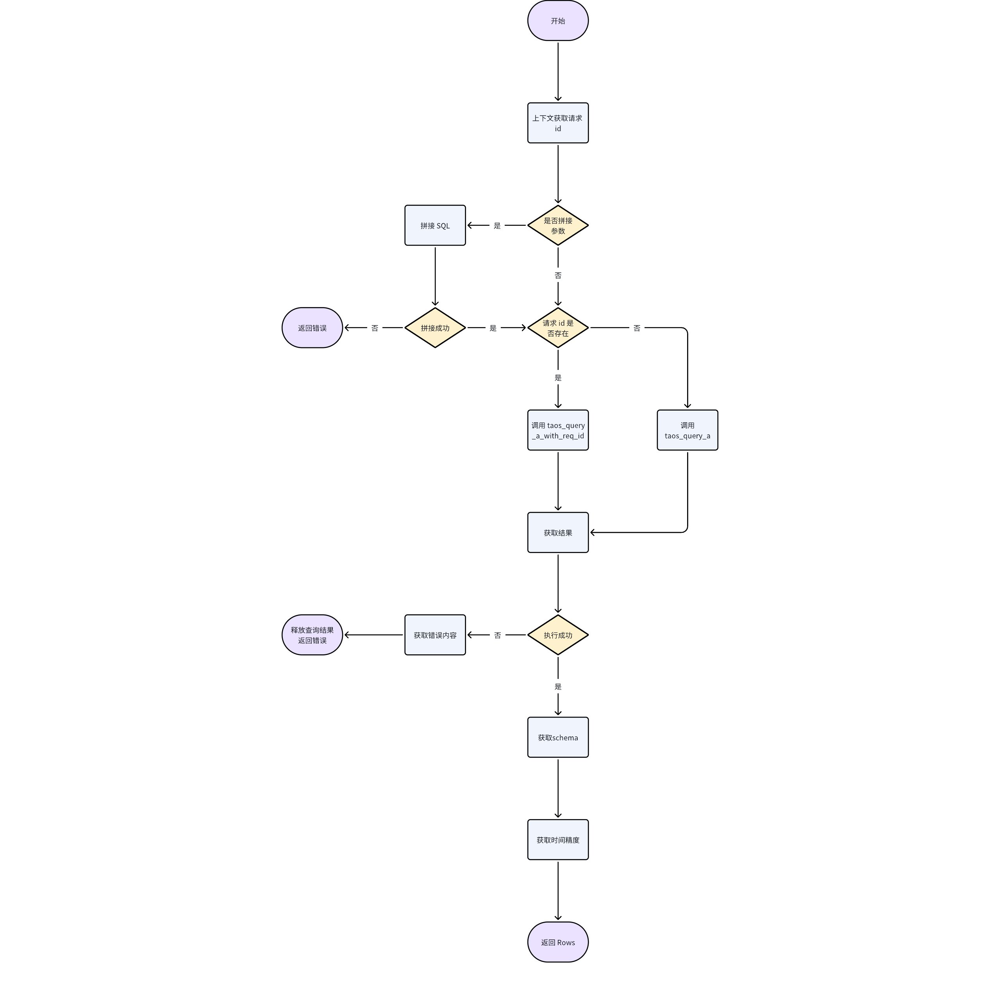

##### 6.4.1.9 Stmt

Stmt 实现了 Stmt 接口
```go {wrap}
type Stmt interface {
    Close() error
    NumInput() int
    Exec(args []Value) (Result, error)
    Query(args []Value) (Rows, error)
}
```


Stmt 对象如下
```go {wrap}
type Stmt struct {
    // C stmt
    stmt     unsafe.Pointer
    // 连接
    tc       *taosConn
    // 准备的 sql
    pSql     string
    // 是否非查询语句
    isInsert bool
    // 绑定信息
    cols     []*stmtCommon.StmtField
}
```

1. Close 关闭 Stmt 对象，流程如下
   - 判断 C stmt 是否为空。
   - 如果不为空则调用 taos_stmt_close 关闭 stmt 并赋值空指针。
2. NumInput 返回输入个数，流程如下
   - 如果 cols 不为空返回 cols 长度（cols 在 CheckNamedValue 时初始化）。
   - 如果为空返回 -1。
3. Exec 绑定参数并执行非查询
   - 判断 tc 和 stmt 不为空，如果为空返回 driver.ErrBadConn。
   - 检查参数长度和 cols 长度是否相等，不相等返回参数数量不相同错误。
   - 调用 taos_stmt_bind_param 绑定单行数据，如果失败返回错误。
   - 调用 taos_stmt_add_batch 添加到批量，如果失败返回错误。
   - 调用 taos_stmt_execute 执行，如果失败返回错误。
   - 调用 taos_stmt_affected_rows_once 获取影响行数并返回。
4. Query 绑定参数并执行查询
   - 判断 tc 和 stmt 不为空，如果为空返回 driver.ErrBadConn。
   - 检查参数长度和 cols 长度是否相等，不相等返回参数数量不相同错误。
   - 调用 taos_stmt_bind_param 绑定单行数据，如果失败返回错误。
   - 调用 taos_stmt_add_batch 添加到批量，如果失败返回错误。
   - 调用 taos_stmt_execute 执行，如果失败返回错误。
   - 调用 taos_stmt_use_result 获取查询结果。
   - 调用 taos_num_fields 获取列数。
   - 调用 taos_fetch_fields_e 获取结果 schema。
   - 调用 taos_result_precision 获取结果时间精度。
   - 返回查询结果 rows。

##### 6.4.1.10 Rows

rows 实现 Rows 接口
```go {wrap}

type Rows interface {
    Columns() []string
    Close() error
    Next(dest []Value) error
}
```

1. Columns() 获取列名,从查询结果 schema 中获取 
2. Close() 关闭查询结果
   - 将异步上下文放回池
   - 如果不是 stmt 查询结果并且结果不为空指针则调用 taos_free_result 释放结果
   - 设置结果为空指针
   - 设置查询结果块为空指针
3. Next(dest []Value) 获取下一行结果，如果返回 io.EOF 表示获取完成
  执行流程图如下
  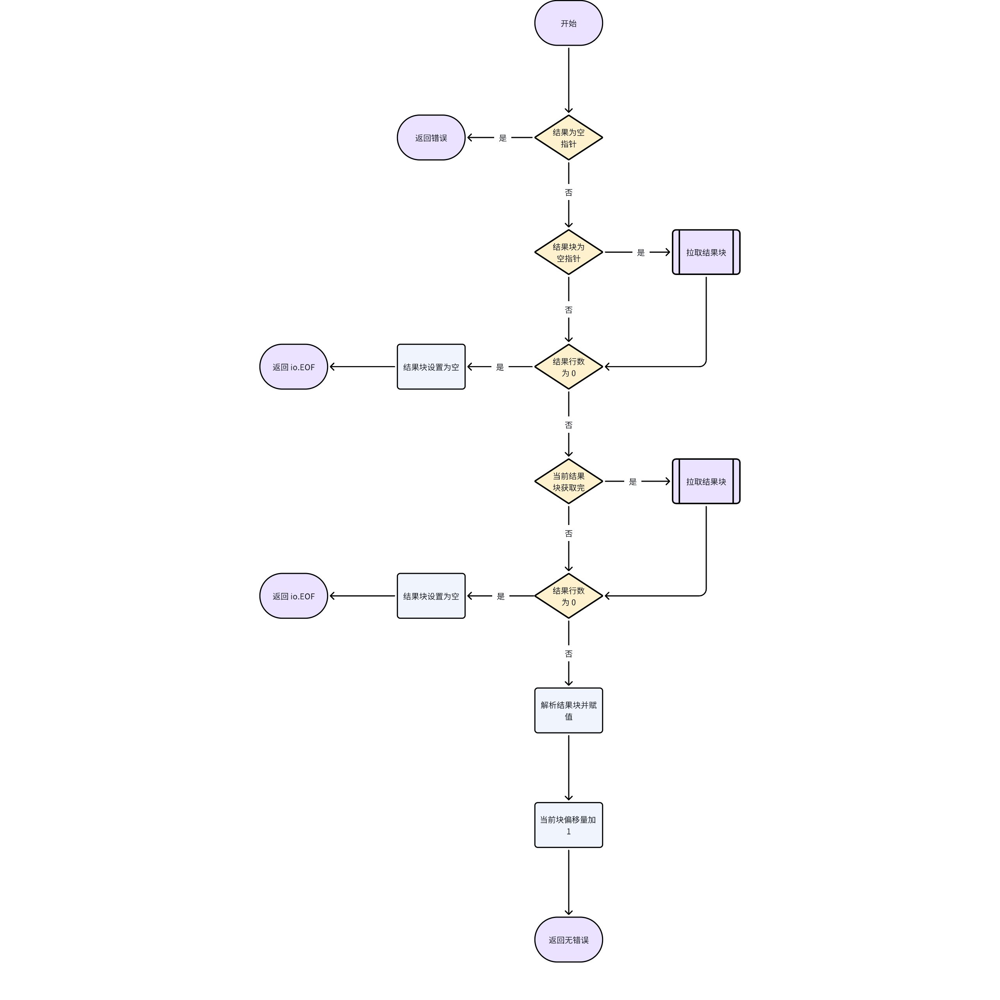

  拉取结果块流程如下
  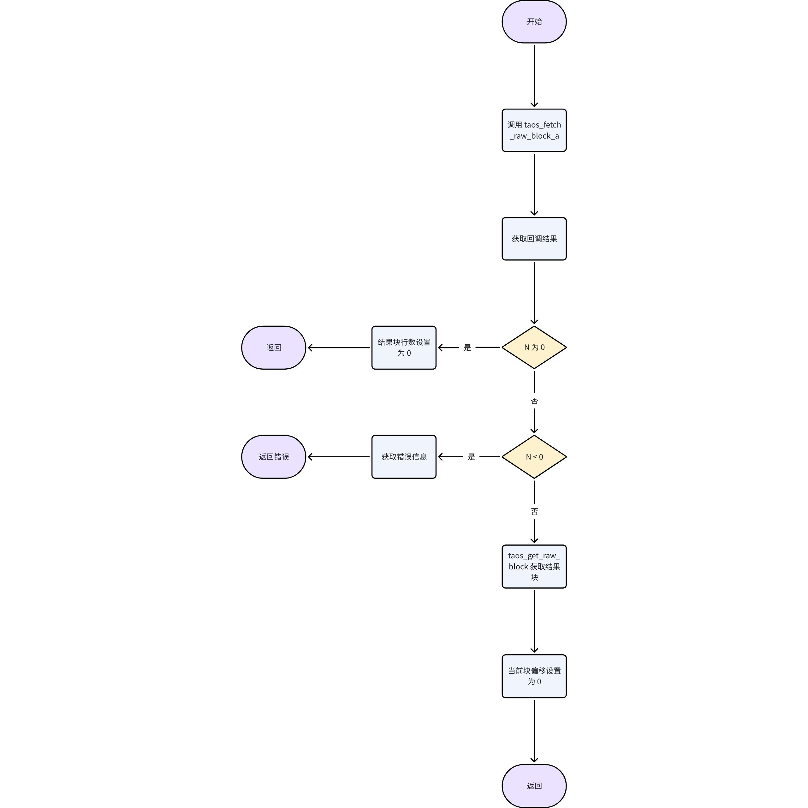

##### 6.4.1.11 RowsColumnTypeScanType

rows 实现了RowsColumnTypeScanType 接口
```go {wrap}
type RowsColumnTypeScanType interface {
    Rows
    ColumnTypeScanType(index int) reflect.Type
}
```

获取扫描类型，通过 `ColumnTypeMap` 获取对应类型。

##### 6.4.1.12 RowsColumnTypeDatabaseTypeName

rows 实现了 RowsColumnTypeDatabaseTypeName 接口
```go {wrap}
type RowsColumnTypeDatabaseTypeName interface {
    Rows
    ColumnTypeDatabaseTypeName(index int) string
}
```

通过 index 获取列类型，通过列类型从 TypeNameMap 获取名称返回。

##### 6.4.1.13 RowsColumnTypeLength

rows 实现了 RowsColumnTypeLength 接口
```go {wrap}
type RowsColumnTypeLength interface {
    Rows
    ColumnTypeLength(index int) (length int64, ok bool)
}
```

直接从 schema 中获取列长度进行返回。

##### 6.4.1.14 NamedValueChecker

stmt 实现了 `NamedValueChecker` 接口
```go {wrap}
type NamedValueChecker interface {
    CheckNamedValue(*NamedValue) error
}
```

CheckNamedValue 的流程图如下
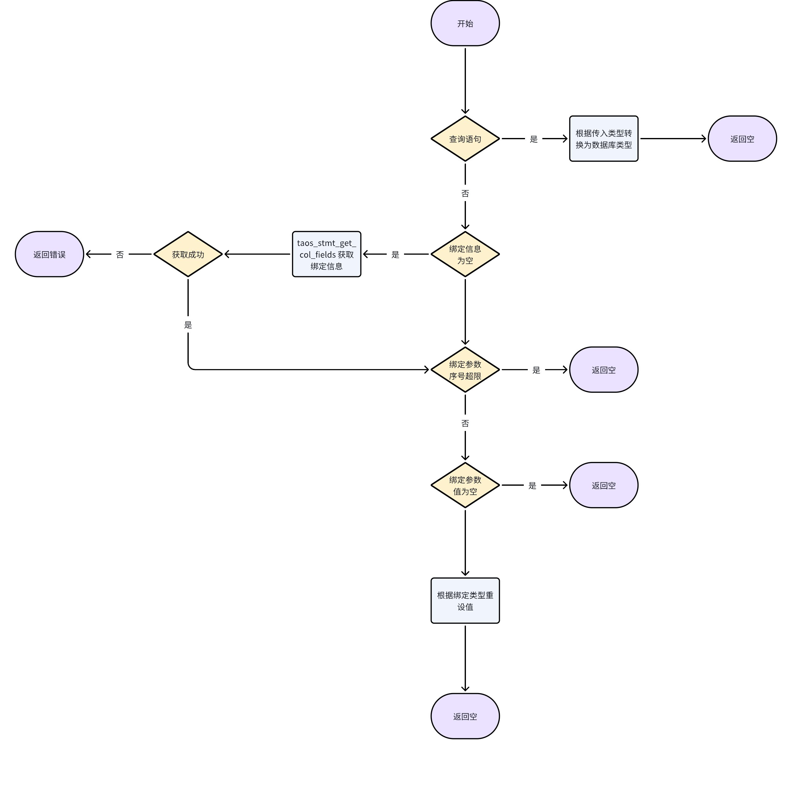

#### 6.4.2 WebSocket 连接驱动

引入`github.com/taosdata/driver-go/v3/taosWS` 驱动后，应用可以通过 `database/sql` 提供的接口进行数据写入和查询操作。
WebSocket 连接通过 WebSocket 协议与 taosAdapter 进行交互。

##### 6.4.2.1 Driver

接口定义如下
```go {wrap}
type Driver interface {
    Open(name string) (Conn, error)
}
```

`TDengineDriver` 实现了此接口，实现如下
```go {wrap}
type TDengineDriver struct{}

func (d TDengineDriver) Open(dsn string) (driver.Conn, error) {
    cfg, err := parseDSN(dsn)
    if err != nil {
       return nil, err
    }
    c := &connector{
       cfg: cfg,
    }
    return c.Connect(context.Background())
}
```

1. 解析 DSN 字符串，生成配置对象（`cfg`）。
2. 创建并返回一个连接器（`connector`），用于后续的数据库操作。

##### 6.4.2.2 Connector

接口定义如下
```go {wrap}
type Connector interface {
    Connect(context.Context) (Conn, error)
    Driver() Driver
}
```

`connector` 实现了此接口
```go {wrap}

type connector struct {
    cfg *config
}

func (c *connector) Connect(ctx context.Context) (driver.Conn, error) {
    // Connect to Server
    if len(c.cfg.user) == 0 {
       c.cfg.user = common.DefaultUser
    }
    if len(c.cfg.passwd) == 0 {
       c.cfg.passwd = common.DefaultPassword
    }
    if c.cfg.port == 0 {
       c.cfg.port = common.DefaultHttpPort
    }
    if len(c.cfg.net) == 0 {
       c.cfg.net = "ws"
    }
    if len(c.cfg.addr) == 0 {
       c.cfg.addr = "127.0.0.1"
    }
    if c.cfg.readTimeout == 0 {
       c.cfg.readTimeout = common.DefaultMessageTimeout
    }
    if c.cfg.writeTimeout == 0 {
       c.cfg.writeTimeout = common.DefaultWriteWait
    }
    tc, err := newTaosConn(c.cfg)
    return tc, err
}

func (c *connector) Driver() driver.Driver {
    return &TDengineDriver{}
}
```

Connect 流程如下：
1. 根据配置对象（`cfg`）初始化连接参数。
2. 未提供配置的配置项给默认配置。
3. 调用 newTaosConn 方法创建连接并设置后台 ping 和读取消息协程。
4. 返回一个 `taosConn` 对象，用于后续的数据库操作。
创建连接（newTaosConn）流程图如下
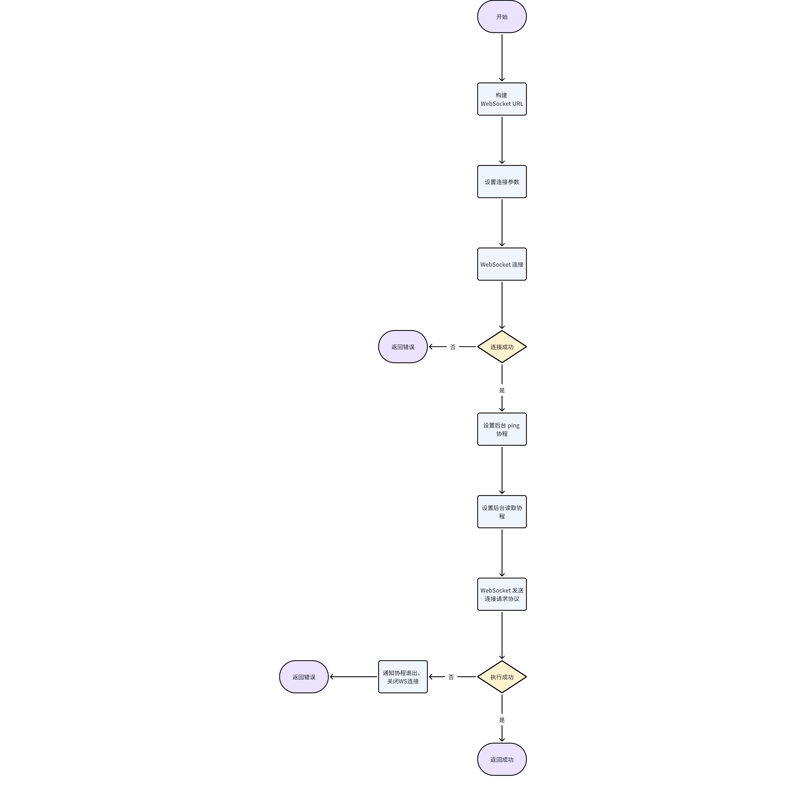

##### 6.4.2.3 Conn

taosConn 实现了 Conn 接口
```go {wrap}
type Conn interface {
    Prepare(query string) (Stmt, error)
    Close() error
    Begin() (Tx, error)
}
```

1. Prepare 流程为
   - 发送 stmt init 请求，如果出错返回错误。
   - 调用 stmt prepare 请求，如果出错发送 stmt close 消息，返回错误。
   - 成功返回 Stmt 对象（实现了 Stmt 接口）。
2. Close 流程为
   - 设置退出标志。
   - 发送信号关闭读取循环和等待返回的请求。
   - 如果 WS 已连接则关闭。
   - 连接、配置、endpoint 设置为 nil。
   - 返回关闭时错误。
3. TDengine 不支持事务， Begin 会直接返回错误。

##### 6.4.2.4 Pinger

taosConn 实现了 Pinger 接口
```go {wrap}
type Pinger interface {
    Ping(ctx context.Context) error
}
```

流程：
1. 如果 WS 已关闭则返回 driver.ErrBadConn 错误。
2. 发送 WS ping 指令将结果返回。

##### 6.4.2.5 Execer

taosConn 实现了 Execer 接口。
```go {wrap}
type Execer interface {
    Exec(query string, args []Value) (Result, error)
}
```

Exec 为执行非查询语句使用，内部实现为调用 execCtx, ctx 传入 `context.Background()`，流程见ExecerContext。

##### 6.4.2.6 ExecerContext

taosConn 实现了 ExecerContext 接口
```go {wrap}
type ExecerContext interface {
    ExecContext(ctx context.Context, query string, args []NamedValue) (Result, error)
}
```

Exec 为执行非查询语句使用,执行流程为
1. 如果 WS 连接已关闭，返回 driver.ErrBadConn 错误。
2. 如果 args 不为空并且 interpolateParams 参数为 true 则调用 InterpolateParams 方法将 query 中的 '?' 替换为 args 参数，生成 sql 。注意：如果参数为字符串或字节数组则原样拼接，不会添加单引号或双引号并且不会进行转义，需要用户自行做转换传入。
3. 调用 generateReqID 获取 id。
4. 发送 query 请求给 taosAdapter。
5. 等待响应。
6. 检查响应是否有错，如果有错返回错误。
7. 返回影响行数。
执行流程图
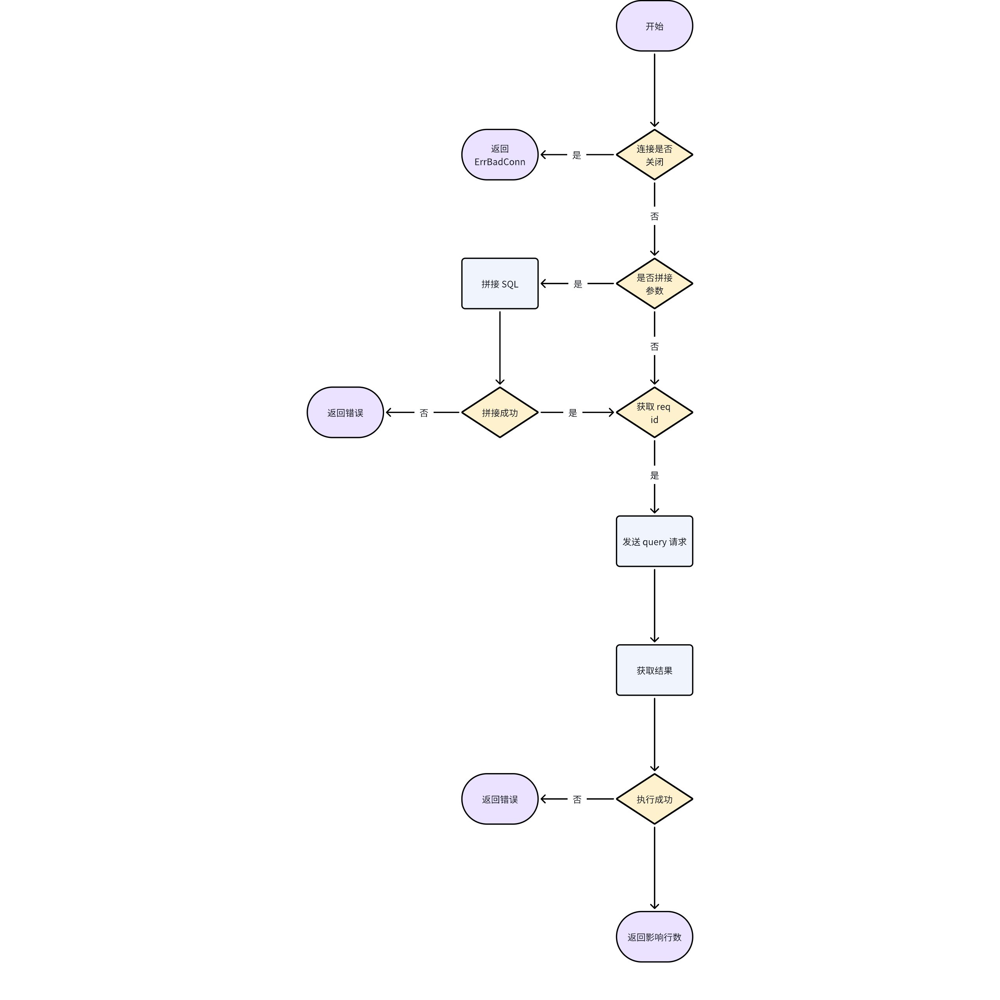

##### 6.4.2.7 Queryer

taosConn 实现了 Queryer 接口
```go {wrap}
type Queryer interface {
    Query(query string, args []Value) (Rows, error)
}
```

Query 为执行查询语句使用，内部实现为调用 QueryContext, ctx 传入 `context.Background()`。

##### 6.4.2.8 QueryerContext

taosConn 实现了 QueryerContext 接口
```go {wrap}
type QueryerContext interface {
    QueryContext(ctx context.Context, query string, args []NamedValue) (Rows, error)
}
```

Exec 为执行查询语句使用,执行流程为
1. 如果 WS 连接已关闭，返回 driver.ErrBadConn 错误。
2. 如果 args 不为空并且 interpolateParams 参数为 true 则调用 InterpolateParams 方法将 query 中的 '?' 替换为 args 参数，生成 sql 。注意：如果参数为字符串或字节数组则原样拼接，不会添加单引号或双引号并且不会进行转义，需要用户自行做转换传入。
3. 调用 generateReqID 获取 id。
4. 发送 query 请求给 taosAdapter。
5. 等待响应。
6. 检查响应是否有错，如果有错返回错误。
7. 检查是否是查询语句，如果不是返回 NotQueryError。
8. 返回 rows 对象（实现Rows接口）。
执行流程图
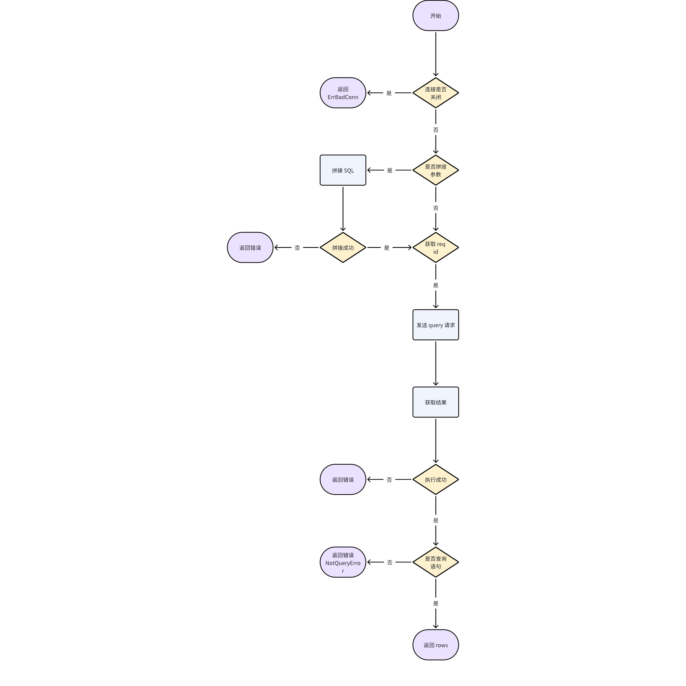

##### 6.4.2.9 Stmt

Stmt 实现了 Stmt 接口
```go {wrap}
type Stmt interface {
    Close() error
    NumInput() int
    Exec(args []Value) (Result, error)
    Query(args []Value) (Rows, error)
}
```

1. Close 关闭 Stmt 对象，流程如下
   - 判断 WS 连接是否关闭，如果关闭返回 driver.ErrBadConn。
   - 发送 stmt close 请求给 taosAdapter。
   - 清空 buffer 缓存，连接设置为空。
2. NumInput 返回输入个数，流程如下
   - 如果列类型不为空返回 cols 长度（cols 在 CheckNamedValue 时初始化）。
   - 如果为空返回 -1。
3. Exec 绑定参数并执行非查询
   - 判断 WS 连接是否关闭，如果关闭返回 driver.ErrBadConn。
   - 绑定数据序列化成 raw block。
   - 发送 stmt bind 请求给 taosAdapter，等待响应，如果失败返回错误。
   - 发送 stmt add_batch 请求给 taosAdapter，等待响应，如果失败返回错误。
   - 发送 stmt exec 请求给 taosAdapter，等待响应，如果失败返回错误。
   - 返回影响行数并返回。
4. Query 绑定参数并执行查询
   - 判断 WS 连接是否关闭，如果关闭返回 driver.ErrBadConn。
   - 绑定数据序列化成 raw block。
   - 发送 stmt bind 请求给 taosAdapter，等待响应，如果失败返回错误。
   - 发送 stmt add_batch 请求给 taosAdapter，等待响应，如果失败返回错误。
   - 发送 stmt exec 请求给 taosAdapter，等待响应，如果失败返回错误。
   - 发送 stmt use_result 请求给 taosAdapter，等待响应，如果失败返回错误。
   - 返回查询结果 rows。

##### 6.4.2.10 Rows

rows 实现 Rows 接口
```go {wrap}

type Rows interface {
    Columns() []string
    Close() error
    Next(dest []Value) error
}
```

1. Columns() 获取列名,从查询结果 schema 中获取 。
2. Close() 关闭查询结果
   - 设置结果为空指针。
   - 设置查询结果块为空指针。
   - 获取 req id。
   - 发送 free_result 请求给 taosAdapter，等待响应，如果失败返回错误。
3. Next(dest []Value) 获取下一行结果，如果返回 io.EOF 表示获取完成
  执行流程图如下
  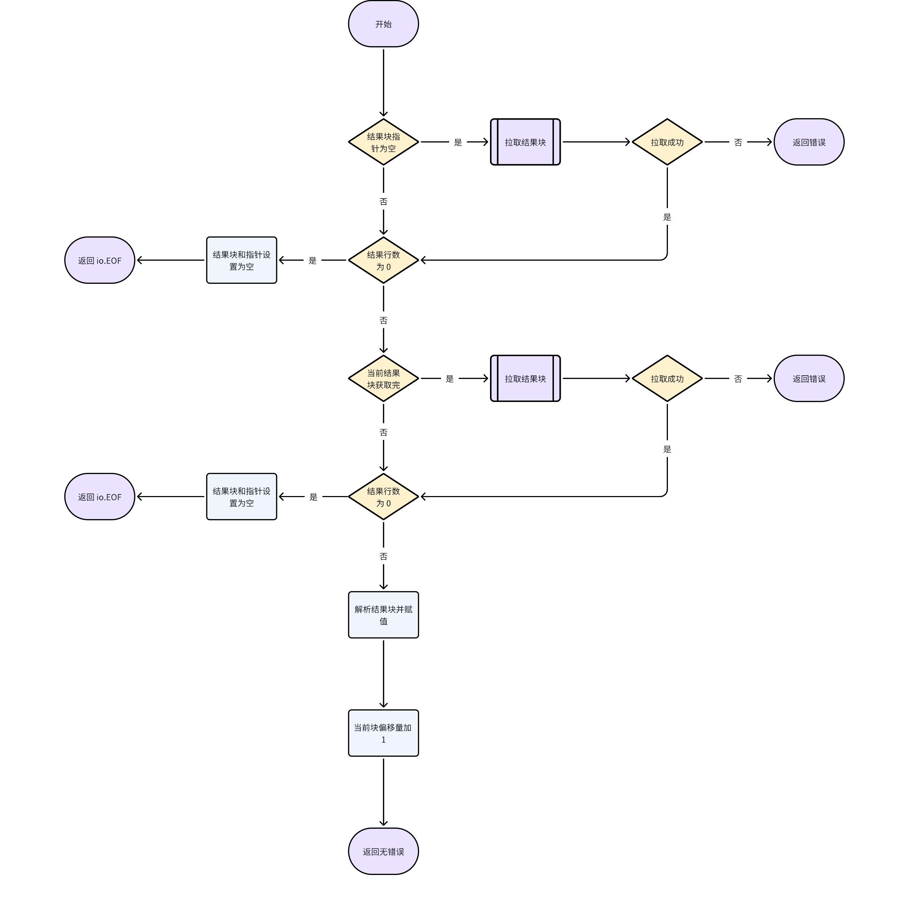

  拉取结果流程如下
  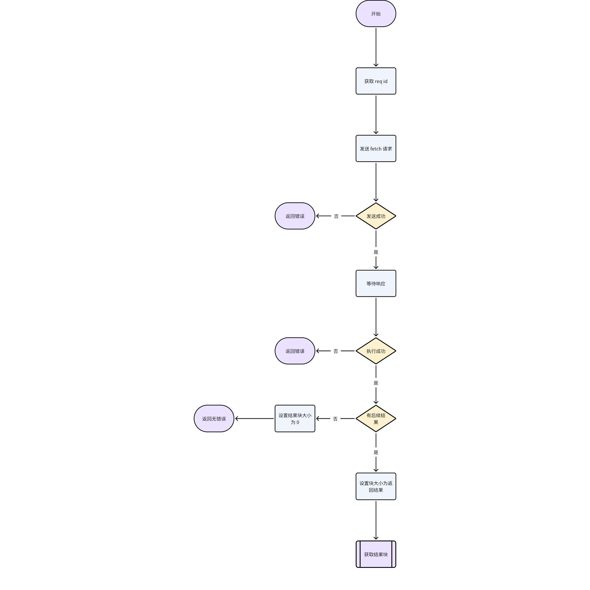

获取结果块流程如下
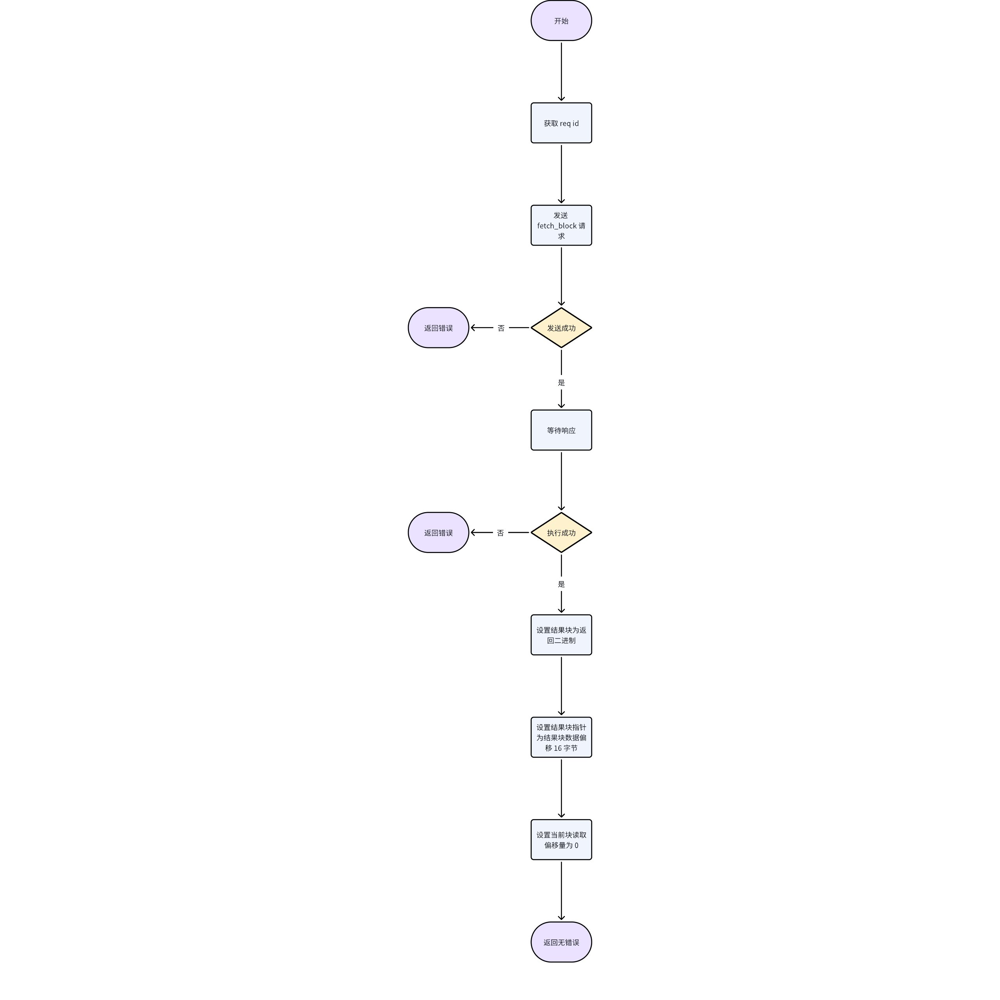

##### 6.4.2.11 RowsColumnTypeScanType

rows 实现了RowsColumnTypeScanType 接口
```go {wrap}
type RowsColumnTypeScanType interface {
    Rows
    ColumnTypeScanType(index int) reflect.Type
}
```

获取扫描类型，通过 `ColumnTypeMap` 获取对应类型。

##### 6.4.2.12 RowsColumnTypeDatabaseTypeName

rows 实现了 RowsColumnTypeDatabaseTypeName 接口
```go {wrap}
type RowsColumnTypeDatabaseTypeName interface {
    Rows
    ColumnTypeDatabaseTypeName(index int) string
}
```

通过 index 获取列类型，通过列类型从 TypeNameMap 获取名称返回。

##### 6.4.2.13 RowsColumnTypeLength

rows 实现了 RowsColumnTypeLength 接口
```go {wrap}
type RowsColumnTypeLength interface {
    Rows
    ColumnTypeLength(index int) (length int64, ok bool)
}
```

直接从 schema 中获取列长度进行返回。

##### 6.4.2.14 NamedValueChecker

stmt 实现了 `NamedValueChecker` 接口
```go {wrap}
type NamedValueChecker interface {
    CheckNamedValue(*NamedValue) error
}
```

CheckNamedValue 的流程图如下
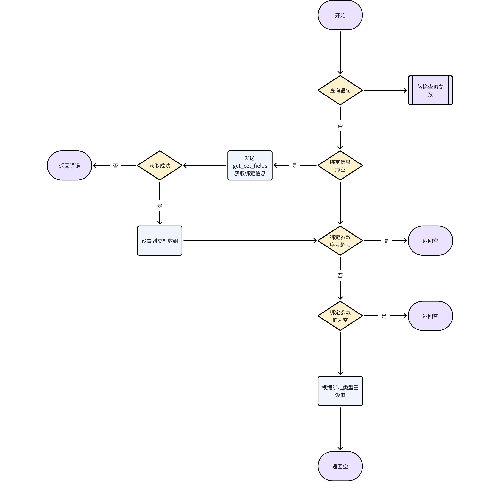

转换查询参数流程图如下
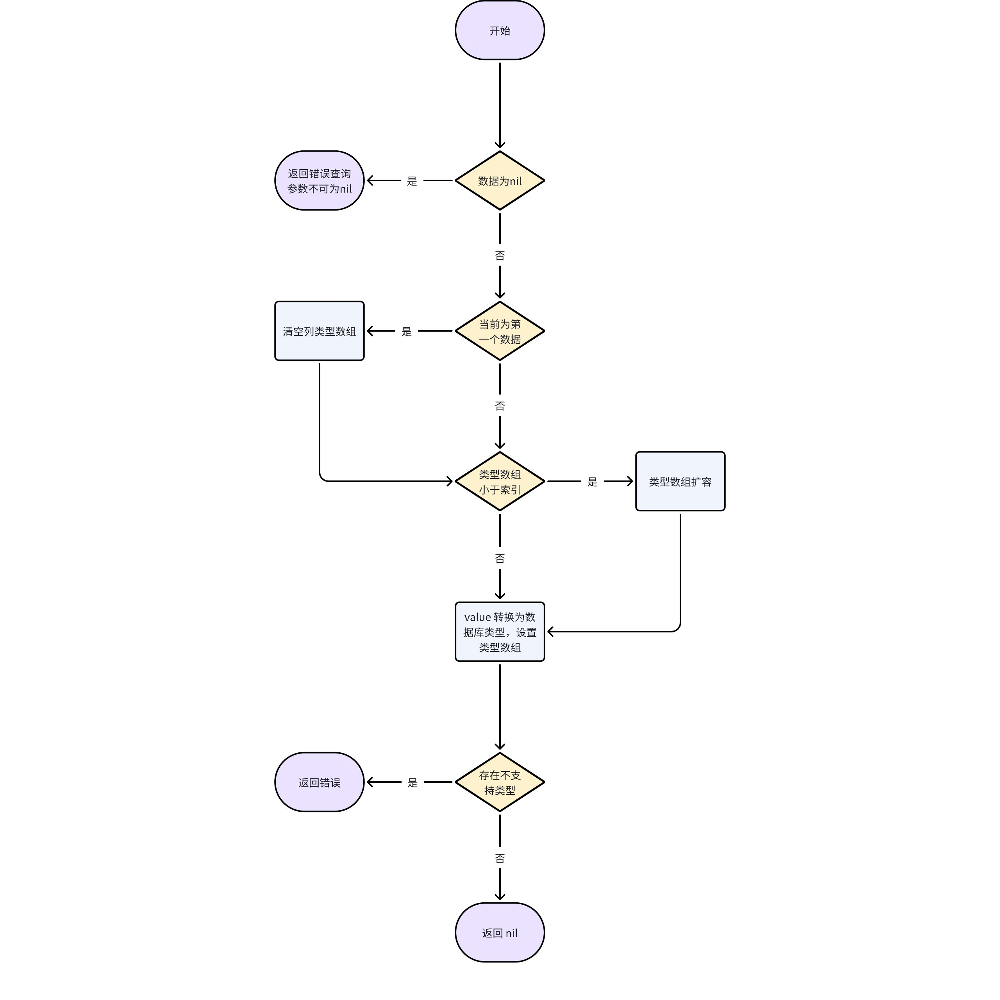

#### 6.4.3 RESTful 连接驱动

引入`github.com/taosdata/driver-go/v3/``taosRestful` 驱动后，应用可以通过 `database/sql` 提供的接口进行数据写入和查询操作。
RESTful 连接通过 HTTP 协议与 taosAdapter 进行交互。

##### 6.4.3.1 Driver

接口定义如下
```go {wrap}
type Driver interface {
    Open(name string) (Conn, error)
}
```

`TDengineDriver` 实现了此接口，实现如下
```go {wrap}
type TDengineDriver struct{}

func (d TDengineDriver) Open(dsn string) (driver.Conn, error) {
    cfg, err := parseDSN(dsn)
    if err != nil {
       return nil, err
    }
    c := &connector{
       cfg: cfg,
    }
    return c.Connect(context.Background())
}
```

1. 解析 DSN 字符串，生成配置对象（`cfg`）。
2. 创建并返回一个连接器（`connector`），用于后续的数据库操作。

##### 6.4.3.2 Connector

接口定义如下
```go {wrap}
type Connector interface {
    Connect(context.Context) (Conn, error)
    Driver() Driver
}
```

`connector` 实现了此接口
```go {wrap}
type connector struct {
    cfg *config
}

func (c *connector) Connect(ctx context.Context) (driver.Conn, error) {
    if len(c.cfg.user) == 0 {
       c.cfg.user = common.DefaultUser
    }
    if len(c.cfg.passwd) == 0 {
       c.cfg.passwd = common.DefaultPassword
    }
    if c.cfg.port == 0 {
       c.cfg.port = common.DefaultHttpPort
    }
    if len(c.cfg.net) == 0 {
       c.cfg.net = "http"
    }
    if len(c.cfg.addr) == 0 {
       c.cfg.addr = "127.0.0.1"
    }
    tc, err := newTaosConn(c.cfg)
    return tc, err
}

func (c *connector) Driver() driver.Driver {
    return &TDengineDriver{}
}
```

Connect 流程如下：
1. 根据配置对象（`cfg`）初始化连接参数。
2. 未提供配置的配置项给默认配置。
3. 调用 newTaosConn 方法初始化请求。
4. 返回一个 `taosConn` 对象，用于后续的数据库操作。

##### 6.4.3.3 Conn

taosConn 实现了 Conn 接口
```go {wrap}
type Conn interface {
    Prepare(query string) (Stmt, error)
    Close() error
    Begin() (Tx, error)
}
```

1. RESTful 连接不支持参数绑定，Prepare 返回错误 。
2. Close 流程为
   - Http 客户端设置为空。
   - Url 设置为空。
   - 配置设置为空。
   - 请求头设置为空。
3. TDengine 不支持事务 Begin 会直接返回错误

##### 6.4.3.4 Pinger

taosConn 实现了 Pinger 接口
```go {wrap}
type Pinger interface {
    Ping(ctx context.Context) error
}
```

会直接返回 nil。

##### 6.4.3.5 Execer

taosConn 实现了 Execer 接口
```go {wrap}
type Execer interface {
    Exec(query string, args []Value) (Result, error)
}
```

Exec 为执行非查询语句使用，内部实现为调用 ExecContext , ctx 传入 `context.Background()`，流程见ExecerContext。

##### 6.4.3.6 ExecerContext

taosConn 实现了 ExecerContext 接口
```go {wrap}
type ExecerContext interface {
    ExecContext(ctx context.Context, query string, args []NamedValue) (Result, error)
}
```

Exec 为执行非查询语句使用,执行流程为
1. 如果 args 不为空并且 interpolateParams 参数为 true 则调用 InterpolateParams 方法将 query 中的 '?' 替换为 args 参数，生成 sql 。注意：如果参数为字符串或字节数组则原样拼接，不会添加单引号或双引号并且不会进行转义，需要用户自行做转换传入。
2. 发送执行 SQL http 请求给 taosAdapter。
3. 等待响应。
4. 如果响应非 200 返回错误。
5. 将 body 使用 JSON 解析成 `TDEngineRestfulResp` 结构，如果出错返回错误。
```go {wrap}
type TDEngineRestfulResp struct {
    Code      int
    Rows      int
    Desc      string
    ColNames  []string
    ColTypes  []int
    ColLength []int64
    Data      [][]driver.Value
}
```

1. 检查 code 是否为 0，如果不为 0 返回 Code 和 Desc 错误。
2. 检查 Data 长度为 1 且 Data[0] 长度为 1。
3. Data[0][0] 为影响行数，类型为 int32。
4. 返回影响行数。

##### 6.4.3.7 Queryer

taosConn 实现了 Queryer 接口
```go {wrap}
type Queryer interface {
    Query(query string, args []Value) (Rows, error)
}
```

Query 为执行查询语句使用，实现与 QueryContext 相同, ctx 为 `context.TODO()`。

##### 6.4.3.8 QueryerContext

taosConn 实现了 QueryerContext 接口
```go {wrap}
type QueryerContext interface {
    QueryContext(ctx context.Context, query string, args []NamedValue) (Rows, error)
}
```

Exec 为执行查询语句使用,执行流程为
1. 如果 args 不为空并且 interpolateParams 参数为 true 则调用 InterpolateParams 方法将 query 中的 '?' 替换为 args 参数，生成 sql 。注意：如果参数为字符串或字节数组则原样拼接，不会添加单引号或双引号并且不会进行转义，需要用户自行做转换传入。
2. 如果请求 id 存在则调用 taos_query_a_with_req_id_wrapper 进行异步 SQL 执行，如果不存在则调用 taos_query_a_with_req_id_wrapper 进行异步 SQL 执行。
3. 发送执行 SQL http 请求给 taosAdapter。
4. 等待响应。
5. 如果响应非 200 返回错误。
6. 将 body 使用 JSON 解析成 `TDEngineRestfulResp` 结构，如果出错返回错误。
7. 返回 rows 对象（实现Rows接口）。

##### 6.4.3.9 Rows

rows 实现 Rows 接口
```go {wrap}

type Rows interface {
    Columns() []string
    Close() error
    Next(dest []Value) error
}
```

1. Columns() 获取列名,从查询结果 `TDEngineRestfulResp` ColNames 中获取。
2. Close() 关闭查询结果，返回空。
3. Next(dest []Value) 获取下一行结果，如果返回 io.EOF 表示获取完成。
   - 如果读取行数超过 `TDEngineRestfulResp` Data 的长度返回 io.EOF。
   - 将 Data[rowIndex] 复制给 dest。
   - rowIndex 加一。
   - 返回 nil。

##### 6.4.3.10 RowsColumnTypeScanType

rows 实现了RowsColumnTypeScanType 接口
```go {wrap}
type RowsColumnTypeScanType interface {
    Rows
    ColumnTypeScanType(index int) reflect.Type
}
```

获取扫描类型，通过 `ColumnTypeMap` 获取对应类型。

##### 6.4.3.11 RowsColumnTypeDatabaseTypeName

rows 实现了 RowsColumnTypeDatabaseTypeName 接口
```go {wrap}
type RowsColumnTypeDatabaseTypeName interface {
    Rows
    ColumnTypeDatabaseTypeName(index int) string
}
```

通过 index 获取列类型，通过列类型从 TypeNameMap 获取名称返回。

##### 6.4.3.12 RowsColumnTypeLength

rows 实现了 RowsColumnTypeLength 接口
```go {wrap}
type RowsColumnTypeLength interface {
    Rows
    ColumnTypeLength(index int) (length int64, ok bool)
}
```

直接从 `TDEngineRestfulResp` ColLength 获取列长度进行返回。

### 6.5 TMQ 订阅

#### 6.5.1 原生连接

原生订阅功能实现在 `github.com/taosdata/driver-go/v3/af/tmq`

##### 6.5.1.1 配置项

采用 kv 对形式进行配置，结构如下
```go {wrap}
type ConfigValue interface{}
type ConfigMap map[string]ConfigValue
```

##### 6.5.1.2 创建订阅

通过配置项创建订阅者
```go {wrap}
func NewConsumer(conf *tmq.ConfigMap) (*Consumer, error)
```

流程如下：
1. 调用 tmq_conf_new 创建配置项容器。
2. 将配置项复制。
3. 循环调用 tmq_conf_set 设置配置项，出错时返回错误并调用 tmq_conf_destroy 销毁配置项容器。
4. 调用 tmq_consumer_new 创建订阅者，出错时返回错误并调用 tmq_conf_destroy 销毁配置项容器。
5. 创建成功调用 tmq_conf_destroy 销毁配置项容器，返回订阅者。
订阅者结构如下：
```go {wrap}
type Consumer struct {
    // c 订阅者指针
    cConsumer  unsafe.Pointer
    // 订阅结果解析器
    dataParser *parser.TMQRawDataParser
}
```

##### 6.5.1.3 订阅主题

支持一个或多个主题进行订阅
```go {wrap}
func (c *Consumer) Subscribe(topic string, rebalanceCb RebalanceCb) error
func (c *Consumer) SubscribeTopics(topics []string, rebalanceCb RebalanceCb) error
```

rebalanceCb 参数为无效参数，Subscribe 内部实现为调用 SubscribeTopics。
SubscribeTopics 流程如下：
1. 调用 tmq_list_new 创建主题容器。
2. 循环调用 tmq_list_append 向容器内添加主题。
3. 如果失败调用 tmq_list_destroy 销毁容器，调用 tmq_err2str 获取错误内容并返回。
4. 调用 tmq_subscribe 订阅主题。
5. 如果失败调用 tmq_list_destroy 销毁容器，调用 tmq_err2str 获取错误内容并返回。
6. 成功，调用 tmq_list_destroy 销毁容器，返回 nil。

##### 6.5.1.4 取消订阅

取消之前订阅的主题
```go {wrap}
func (c *Consumer) Unsubscribe() error 
```

流程如下：
1. 调用 tmq_unsubscribe 取消订阅。
2. 如果失败调用 tmq_err2str 获取错误内容并返回。
3. 成功返回 nil。

##### 6.5.1.5 拉取数据

订阅者拉取数据
```go {wrap}
func (c *Consumer) Poll(timeoutMs int) tmq.Event
```

timeoutMs 表示最多等待时间。
tmq.Event 是一个接口，有5个可能（tmq.ERROR、tmq.DataMessage、tmq.MetaMessage、tmq.MetaDataMessage、nil)。
执行流程如下：
1. 调用 tmq_consumer_poll 获取消息。
2. 返回的消息为空则返回 nil。
3. 调用 tmq_get_topic_name 获取主题。
4. 调用 tmq_get_db_name 获取数据库。
5. 调用 tmq_get_res_type 获取消息类型。
6. 调用 tmq_get_vgroup_offset 获取偏移量。
7. 调用 tmq_get_vgroup_id 获取 vgroup id。
8. 判断消息类型
   - 纯数据类型（TMQ_RES_DATA）
      - 返回结果为 tmq.DataMessage。
      - 调用 tmq_get_raw 获取数据内容。
      - 解析数据，设置数据。
      - 释放消息。
   - 元数据类型（TMQ_RES_TABLE_META）
      - 返回结果为 tmq.MetaMessage 。
      - 调用 tmq_get_json_meta 获取元数据。
      - 解析为 tmq.Meta 结构。
      - 释放消息。
   - 数据和元数据类型（TMQ_RES_METADATA）
      - 返回结果为 tmq.MetaDataMessage。
      - 调用 tmq_get_raw 获取数据内容。
      - 调用 tmq_get_json_meta 获取元数据。
      - 解析为 tmq.Meta 结构。
      - 设置数据和 meta 。
      - 释放消息。
   - 其他类型
      - 返回 tmq.ERROR。

##### 6.5.1.6 提交

支持提交全部和提交指定偏移
```go {wrap}
func (c *Consumer) Commit() ([]tmq.TopicPartition, error)
func (c *Consumer) CommitOffsets(offsets []tmq.TopicPartition) ([]tmq.TopicPartition, error)
```

1. 提交全部消息 `Commit` 返回已提交信息
   - 调用 tmq_commit_sync 提交全部消息。
   - 调用 Assignment 获取分配信息。
   - 用全部分配的分区调用 Committed 获取已提交信息。
2. 提交指定偏移量
   - 遍历 offsets 调用 tmq_commit_offset_sync 提交偏移量。
   - 用 offsets 分区调用  Committed 获取已提交信息。

##### 6.5.1.7 获取分配信息

获取订阅分配信息
```go {wrap}
func (c *Consumer) Assignment() (partitions []tmq.TopicPartition, err error)
```

获取当前消费者分配的分区信息
1. 调用 tmq_subscription 获取全部主题。
2. 遍历主题调用 tmq_get_topic_assignment 获取分配信息。

##### 6.5.1.8 设置偏移量

设置分区偏移量
```go {wrap}
func (c *Consumer) Seek(partition tmq.TopicPartition, ignoredTimeoutMs int) error
```

传入指定分区和偏移量，将当前消费者在该分区的偏移量设置到对应位置，ignoredTimeoutMs 参数无效。
1. 调用 tmq_offset_seek 设置偏移量。

##### 6.5.1.9 获取已提交偏移量

获取指定分区已提交的偏移量
```go {wrap}
func (c *Consumer) Committed(partitions []tmq.TopicPartition, timeoutMs int) (offsets []tmq.TopicPartition, err error) 
```

流程为：
1. 遍历 partitions 调用 tmq_committed 获取已提交偏移量。
2. 将结果按顺序返回。

##### 6.5.1.10 获取消费位置

获取指定分区的消费位置
```go {wrap}
func (c *Consumer) Position(partitions []tmq.TopicPartition) (offsets []tmq.TopicPartition, err error)
```

传入要获取的分区信息，返回消费位置。
1. 遍历 partitions 调用 tmq_position 获取消费位置。
2. 将结果按顺序返回。

##### 6.5.1.11 关闭

关闭当前消费者
```go {wrap}
func (c *Consumer) Close() error
```

调用 tmq_consumer_close 关闭消费者。

#### 6.5.2 WebSocket 连接

原生订阅功能实现在 `github.com/taosdata/driver-go/v3/ws/tmq`

##### 6.5.2.1 配置项

采用 kv 对形式进行配置，结构如下
```go {wrap}
type ConfigValue interface{}
type ConfigMap map[string]ConfigValue
```

##### 6.5.2.2 创建订阅

通过配置项创建订阅者
```go {wrap}
func NewConsumer(conf *tmq.ConfigMap) (*Consumer, error)
```

流程如下：
1. 将配置项复制，转换配置项到配置结构体，拦截自动提交和自动提交时间设置（避免由于网络原因导致错误的自动提交，在连接器内部做自动提交）。
2. 创建 WebSocket 连接。
3. 创建协程同步发送消息。
4. 创建协程接收消息。

##### 6.5.2.3 订阅主题

支持一个或多个主题进行订阅
```go {wrap}
func (c *Consumer) Subscribe(topic string, rebalanceCb RebalanceCb) error
func (c *Consumer) SubscribeTopics(topics []string, rebalanceCb RebalanceCb) error
```

rebalanceCb 参数为无效参数，Subscribe 内部实现为调用 SubscribeTopics。
SubscribeTopics 流程如下：
1. 使用配置参数和主题构建 subscribe 请求。
2. 发送请求给 taosAdapter。
3. 等待响应。
4. 执行成功缓存下来订阅的主题，执行失败返回错误。

##### 6.5.2.4 取消订阅

取消之前订阅的主题
```go {wrap}
func (c *Consumer) Unsubscribe() error 
```

流程如下：
1. 发送 unsubscribe 请求给 taosAdapter。
2. 等待响应。
3. 执行成功返回nil,执行失败返回错误。

##### 6.5.2.5 拉取数据

订阅者拉取数据
```go {wrap}
func (c *Consumer) Poll(timeoutMs int) tmq.Event
```

timeoutMs 表示最多等待时间
tmq.Event 是一个接口，有5个可能（tmq.ERROR、tmq.DataMessage、tmq.MetaMessage、tmq.MetaDataMessage、nil)。
执行流程如下：
1. 如果当前消费者产生连接错误将直接返回 tmq.ERROR。
2. 如果自动提交并且已经达到超时时间将发送 commit 消息给 taosAdapter。
3. 发送 poll 消息给 taosAdapter。
4. 如果返回协议 have_message 为 false 表示无消息返回 nil。
5. 判断消息类型
   - 纯数据类型（TMQ_RES_DATA）
      - 返回结果为 tmq.DataMessage。
      - 发送 fetch_raw 消息给 taosAdapter。
      - 解析响应数据，设置数据。
   - 元数据类型（TMQ_RES_TABLE_META）
      - 返回结果为 tmq.MetaMessage 。
      - 发送 fetch_json_meta 消息给 taosAdapter。
      - 将响应的 data 字段解析为 tmq.Meta 结构。
   - 数据和元数据类型（TMQ_RES_METADATA）
      - 返回结果为 tmq.MetaDataMessage。
      - 发送 fetch_raw 消息给 taosAdapter。
      - 解析响应数据，设置数据。
      - 发送 fetch_json_meta 消息给 taosAdapter。
      - 解析为 tmq.Meta 结构。
      - 设置数据和 meta。
   - 其他类型
      - 返回 tmq.ERROR。

##### 6.5.2.6 提交

支持提交全部和提交指定偏移
```go {wrap}
func (c *Consumer) Commit() ([]tmq.TopicPartition, error)
func (c *Consumer) CommitOffsets(offsets []tmq.TopicPartition) ([]tmq.TopicPartition, error)
```

1. 提交全部消息 `Commit` 返回已提交信息
   - 发送 commit 消息给 taosAdapter 提交全部消息。
   - 调用 Assignment 获取分配信息。
   - 用全部分配的分区调用 Committed 获取已提交信息。
2. 提交指定偏移量
   - 遍历 offsets 发送 commit_offset 消息给 taosAdapte 提交指定分区的偏移量。
   - 用 offsets 分区调用  Committed 获取已提交信息。

##### 6.5.2.7 获取分配信息

获取订阅分配信息
```go {wrap}
func (c *Consumer) Assignment() (partitions []tmq.TopicPartition, err error)
```

获取当前消费者分配的分区信息
1. 使用缓存的主题遍历发送 assignment 消息给 taosAdapter 获取分配信息。

##### 6.5.2.8 设置偏移量

设置分区偏移量
```go {wrap}
func (c *Consumer) Seek(partition tmq.TopicPartition, ignoredTimeoutMs int) error
```

传入指定分区和偏移量，将当前消费者在该分区的偏移量设置到对应位置，ignoredTimeoutMs 参数无效
1. 发送 seek 消息到 taosAdapter 设置分区偏移。

##### 6.5.2.9 获取已提交偏移量

获取指定分区已提交的偏移量
```go {wrap}
func (c *Consumer) Committed(partitions []tmq.TopicPartition, timeoutMs int) (offsets []tmq.TopicPartition, err error) 
```

流程为：
1. 发送 committed 消息给 taosAdapter 获取已提交偏移量。
2. 将返回协议 committed 组装成 []tmq.TopicPartition 返回。

##### 6.5.2.10 获取消费位置

获取指定分区的消费位置
```go {wrap}
func (c *Consumer) Position(partitions []tmq.TopicPartition) (offsets []tmq.TopicPartition, err error)
```

传入要获取的分区信息，返回消费位置
1. 发送 position 消息给 taosAdapter。
2. 将返回协议 Position 组装成 []tmq.TopicPartition 返回。

##### 6.5.2.11 关闭

关闭当前消费者
```go {wrap}
func (c *Consumer) Close() error
```

1. 发送协程退出信号。
2. 关闭 WebSocket 连接。

### 6.6 无模式写入

#### 6.6.1 原生连接

功能实现在 `github.com/taosdata/driver-go/v3/af`
1. 创建连接
  ```go {wrap}
  func Open(host, user, pass, db string, port int) (*Connector, error)
  ```

  传入 host、用户名、密码、数据库、端口调用 taos_connect** **进行原生连接。
1. 执行 InfluxDB 行协议写入
  ```go {wrap}
  func (conn *Connector) InfluxDBInsertLines(lines []string, precision string) error
  ```

  传入多行 InfluxDB 行协议数据并指定时间精度调用 C 接口 taos_schemaless_insert 进行写入。
1. 执行 OpenTSDB 行协议写入
  ```go {wrap}
  func (conn *Connector) OpenTSDBInsertTelnetLines(lines []string) error
  ```

  传入多行 OpenTSDB 行协议数据调用 C 接口 taos_schemaless_insert 进行写入。
1. 执行 OpenTSDB JSON 协议写入
  ```go {wrap}
  func (conn *Connector) OpenTSDBInsertJsonPayload(payload string) error
  ```

  传入 OpenTSDB JSON 协议数据调用 C 接口 taos_schemaless_insert 进行写入。

#### 6.6.2 WebSocket 连接

功能实现在`github.com/taosdata/driver-go/v3``/ws/schemaless`
1. 创建连接
  ```go {wrap}
  func NewConfig(url string, chanLength uint, opts ...func(*Config)) *Config
  func SetUser(user string) func(*Config)
  func SetPassword(password string) func(*Config)
  func SetDb(db string) func(*Config)
  func SetReadTimeout(readTimeout time.Duration) func(*Config)
  func SetWriteTimeout(writeTimeout time.Duration) func(*Config)
  func SetErrorHandler(errorHandler func(error)) func(*Config)
  func SetEnableCompression(enableCompression bool) func(*Config)
  
  func NewSchemaless(config *Config) (*Schemaless, error) 
  ```

   - 使用 NewConfig 传入 url 和发送消息缓冲长度以及其他设置方法创建 WebScoekt 连接设置
      - SetUser 设置用户名。
      - SetPassword 设置密码。
      - SetDb 设置连接数据库。
      - SetReadTimeout 设置读取超时。
      - SetWriteTimeout 设置写超时。
      - SetErrorHandler 设置当连接出现错误时候的回调。
      - SetEnableCompression 设置是否启用 WS 压缩。
   - NewSchemaless 创建 WebSocket 连接并发送 conn 消息给 taosAdapter。
1. 无模式写入
  ```go {wrap}
  func (s *Schemaless) Insert(lines string, protocol int, precision string, ttl int, reqID int64) error
  ```

  传入消息内容（多行协议用 `\n` 分割），使用的协议，时间精度（InfluxDB 有效），ttl （表存活时间，0表示不设置）请求 ID 组装成 insert 协议发送给 taosAdapter 进行无模式写入。

### 6.7 参数绑定

#### 6.7.1 原生连接

功能实现在 `github.com/taosdata/driver-go/v3/af`
1. 创建连接
  ```go {wrap}
  func Open(host, user, pass, db string, port int) (*Connector, error)
  ```

  传入 host、用户名、密码、数据库、端口调用 taos_connect** **进行原生连接。
1. 单行绑定
   - 创建 stmt 
    ```go {wrap}
    func (conn *Connector) Stmt() *Stmt
    ```

    调用 NewStmt 返回 stmt 实例。
    ```go {wrap}
    func NewStmt(taosConn unsafe.Pointer) *Stmt
    ```

    NewStmt 调用 taos_stmt_init 生成 C stmt 实例。
   - 准备语句
    ```go {wrap}
    func (s *Stmt) Prepare(sql string) error
    ```

      - 调用 taos_stmt_prepare 准备语句。
      - 调用 taos_stmt_is_insert 获取绑定语句类型。
   - 获取绑定参数个数
    ```csharp {wrap}
    func (s *Stmt) NumParams() (int, error)
    ```

    调用 taos_stmt_num_params 获取个数。
   - 设置表名
    ```csharp {wrap}
    func (s *Stmt) SetTableName(tableName string) error 
    ```

    调用 taos_stmt_set_tbname 设置表名。
   - 设置表名和标签
    ```csharp {wrap}
    func (s *Stmt) SetTableNameWithTags(tableName string, tags *param.Param) error
    ```

  调用 taos_stmt_set_tbname_tags 进行设置。
   - 绑定数据
    绑定一行数据
    ```csharp {wrap}
    func (s *Stmt) BindRow(row *param.Param) error
    ```

    调用 taos_stmt_bind_param 绑定数据。
   - 添加批量
    ```csharp {wrap}
    func (s *Stmt) AddBatch() error 
    ```

    调用 taos_stmt_add_batch。
   - 执行
    ```csharp {wrap}
    func (s *Stmt) Execute() error
    ```

  调用 taos_stmt_execute。
   - 获取影响行数
    ```csharp {wrap}
    func (s *Stmt) GetAffectedRows() int
    ```

      - 如果查询语句返回 0。
      - 调用 taos_stmt_affected_rows_once 获取影响行数。
   - 获取结果
    ```csharp {wrap}
    func (s *Stmt) UseResult() (driver.Rows, error) 
    ```

      - 调用 taos_stmt_use_result 获取 C 结果。
      - 调用 taos_num_fields 获取结果列数。
      - 调用 taos_fetch_fields_e 获取结果 schema。
      - 调用 taos_result_precision 获取结果时间精度。
      - 返回 rows。
   - 关闭
    ```csharp {wrap}
    func (s *Stmt) Close() error
    ```

    调用 taos_stmt_close 关闭 C stmt 实例。
1. 多行写入
   - 创建 stmt 
    ```csharp {wrap}
    func (conn *Connector) InsertStmt() *insertstmt.InsertStmt
    func (conn *Connector) InsertStmtWithReqID(reqID int64) *insertstmt.InsertStmt
    ```

    InsertStmt 调用 taos_stmt_init 创建 C stmt 实例。
    InsertStmtWithReqID 调用 taos_stmt_init_with_reqid 创建 C stmt 实例。
   - 准备语句
    ```go {wrap}
    func (stmt *InsertStmt) Prepare(sql string) error
    ```

      - 调用 taos_stmt_prepare 准备语句。
      - 调用 taos_stmt_is_insert 获取绑定语句类型。
      - 如果是查询语句则返回错误。
   - 设置表名
    ```csharp {wrap}
    func (stmt *InsertStmt) SetTableName(name string) error
    func (stmt *InsertStmt) SetSubTableName(name string) error
    ```

    SetTableName 和 SetSubTableName 作用相同
    - SetTableName 调用 taos_stmt_set_tbname 设置表名。
    - SetSubTableName 调用 taos_stmt_set_tbname 设置子表名。
   - 设置表名和tag
    ```csharp {wrap}
    func (stmt *InsertStmt) SetTableNameWithTags(tableName string, tags *param.Param) error
    ```

    调用 taos_stmt_set_tbname_tags 设置表名和 tag。
   - 绑定多行数据
    ```csharp {wrap}
    func (stmt *InsertStmt) BindParam(params []*param.Param, bindType *param.ColumnType) error
    ```

      - params 数组内每个元素为一列数据，bindType 为每列元素的数据库类型，因为有可能绑定数据全部为 null 会无法确定列类型。
      - 构建 C 绑定结构。
      - 调用 taos_stmt_bind_param_batch 绑定多行数据。
   - 添加批量
    ```csharp {wrap}
    func (stmt *InsertStmt) AddBatch() error
    ```

    调用 taos_stmt_add_batch 添加批量。
   - 执行
    ```csharp {wrap}
    func (stmt *InsertStmt) Execute() error
    ```

    调用 taos_stmt_execute 执行语句。
   - 获取影响行数
    ```csharp {wrap}
    func (stmt *InsertStmt) GetAffectedRows() int
    ```

    调用 taos_stmt_affected_rows_once 获取影响行数。

#### 6.7.2 WebSocket 连接

功能实现在 `github.com/taosdata/driver-go/v3/ws/stmt`
1. 创建连接
  ```csharp {wrap}
  func NewConfig(url string, chanLength uint) *Config
  func (c *Config) SetConnectUser(user string) error
  func (c *Config) SetConnectPass(pass string) error
  func (c *Config) SetConnectDB(db string) error
  func (c *Config) SetMessageTimeout(timeout time.Duration) error
  func (c *Config) SetWriteWait(writeWait time.Duration) error
  func (c *Config) SetErrorHandler(f func(connector *Connector, err error))
  func (c *Config) SetCloseHandler(f func())
  func (c *Config) SetEnableCompression(enableCompression bool)
  
  func NewConnector(config *Config) (*Connector, error)
  ```

   - 使用 NewConfig 传入 url 和发送消息缓冲长度以及其他设置方法创建 WebScoekt 连接设置
      - SetConnectUser 设置用户名。
      - SetConnectPass 设置密码。
      - SetConnectDB 设置连接数据库。
      - SetMessageTimeout 设置读取超时。
      - SetWriteWait 设置写超时。
      - SetErrorHandler 设置当连接出现错误时候的回调。
      - SetCloseHandler 设置当前连接断开时候的回调。
      - SetEnableCompression 设置是否启用 WS 压缩。
   - NewConnector 创建 WebSocket 连接并发送 conn 消息给 taosAdapter。
1. 创建 stmt
  ```csharp {wrap}
  func (c *Connector) Init() (*Stmt, error)
  ```

   - 发送 init** **请求给 taosAdapter。
   - 使用返回的 stmt id 创建 Stmt 对象。
1. 准备语句
  ```csharp {wrap}
  func (s *Stmt) Prepare(sql string) error
  ```

  发送 prepare 请求给 taosAdapter。
1. 设置表名
  ```csharp {wrap}
  func (s *Stmt) SetTableName(name string) error
  ```

  发送 set_table_name 请求给 taosAdapter。
1. 设置 tag
  ```csharp {wrap}
  func (s *Stmt) SetTags(tags *param.Param, bindType *param.ColumnType) error
  ```

   - tags 是行格式转置成列格式。
   - 构造 raw block 数据。
   - 发送 SetTagsMessage（1）的二进制请求给 taosAdapter。
1. 绑定数据
  ```csharp {wrap}
  func (s *Stmt) BindParam(params []*param.Param, bindType *param.ColumnType) error
  ```

   - 使用 params 和 bindType 构造 raw block 数据。
   - 发送 BindMessage（2）的二进制请求给 taosAdapter。
1. 添加批量
  ```csharp {wrap}
  func (s *Stmt) AddBatch() error
  ```

  发送 add_batch 请求给 taosAdapter。
1. 执行
  ```csharp {wrap}
  func (s *Stmt) Exec() error
  ```

   - 发送 exec 请求给 taosAdapter。
   - 将返回的影响行数保存下来。
1. 获取影响行数
  ```csharp {wrap}
  func (s *Stmt) GetAffectedRows() int
  ```

  返回保存下来影响行数。
1. 关闭
  ```csharp {wrap}
  func (s *Stmt) Close() error
  ```

  发送 close 请求给 taosAdapter

#### 6.7.3 原生连接 STMT2

功能实现在 `github.com/taosdata/driver-go/v3/af`
1. 创建 stmt2
  ```go
  func NewStmt2(taosConn unsafe.Pointer, reqID int64, singleTableBindOnce bool) *Stmt2
  ```

  调用 C 原生接口 `taos_stmt2_init`，默认异步模式，固定参数 singleStbInsert 为 true
1. 准备语句
  ```go
  func (s *Stmt2) Prepare(sql string) error
  ```

   - 通过 C 原生接口 `taos_stmt2_prepare` 设置语句
   - `taos_stmt2_is_insert` 获取是否为写入语句
   - `taos_stmt2_get_fields` 获取绑定元信息
1. 绑定数据
  ```go
  func (s *Stmt2) Bind(params []*stmt.TaosStmt2BindData) error
  type TaosStmt2BindData struct {
      TableName string
      Tags      []driver.Value   // row format
      Cols      [][]driver.Value // column format
  }
  ```

   - 校验参数合法性
   - 将每个表的数据序列化成 C 接口需要的 TAOS_STMT2_BINDV 绑定结构
   - 调用 `taos_stmt2_bind_param` 接口绑定数据
1. 执行语句
  ```go
  func (s *Stmt2) Execute() error
  ```

   - 通过 C 接口 `taos_stmt2_exec` 异步执行
   - 等待回调结果，缓存结果指针和影响行数
1. 获取影响行数
```go
func (s *Stmt2) UseResult()
```

返回缓存的影响行数
1. 获取查询结果
  ```go
  func (s *Stmt2) UseResult() (driver.Rows, error)
  ```

   - `taos_num_fields `获取结果列数
   - `taos_fetch_fields_e `获取结果列信息
   - `taos_result_precision `获取结果时间精度
   - 返回查询结果
1. 关闭
  ```go
  func (s *Stmt2) Close() error
  ```

   - 调用`taos_stmt2_close` 关闭 stmt2

### 6.8 原生高级功能

`github.com/taosdata/driver-go/v3/af` 除了封装了无模式写入和参数绑定的功能外还提供了一些其他功能
1. 执行 SQL
   - 执行查询 SQL
    ```csharp {wrap}
    func (conn *Connector) Query(query string, args ...driver.Value) (driver.Rows, error) 
    func (conn *Connector) QueryWithReqID(query string, reqID int64, args ...driver.Value) (driver.Rows, error)
    ```

      - 如果未连接或已关闭返回 driver.ErrBadConn。
      - 如果 args 不为空则调用 InterpolateParams 方法将 query 中的 '?' 替换为 args 参数。
      - QueryWithReqID 调用 taos_query_a_with_req_id_wrapper 进行异步 SQL 执行，Query 调用 taos_query_a_with_req_id_wrapper 进行异步 SQL 执行。
      - 获取查询结果，如果失败则返回失败内容。
      - 获取查询结果 schema,获取查询结果时间精度。
      - 返回 driver.Rows 接口。
   - 执行非查询 SQL
    ```csharp {wrap}
    func (conn *Connector) Exec(query string, args ...driver.Value) (driver.Result, error)
    func (conn *Connector) ExecWithReqID(query string, reqID int64, args ...driver.Value) (driver.Result, error)
    ```

      - 如果未连接或已关闭返回 driver.ErrBadConn。
      - 如果 args 不为空则调用 InterpolateParams 方法将 query 中的 '?' 替换为 args 参数。
      - Exec 调用 taos_query_a_with_req_id_wrapper 进行异步 SQL 执行，ExecWithReqID 调用 taos_query_a_with_req_id_wrapper 进行异步 SQL 执行。
      - 获取查询结果，如果失败则返回失败内容。
      - 获取影响行数。
      - 释放结果。
      - 返回影响行数。
1. 直接执行 STMT 绑定单行写入
  ```csharp {wrap}
  func (conn *Connector) StmtExecute(sql string, params *param.Param) (res driver.Result, err error)
  func (conn *Connector) StmtExecuteWithReqID(sql string, params *param.Param, reqID int64) (res driver.Result, err error)
  ```

   - StmtExecute 调用 taos_stmt_init 初始化，StmtExecuteWithReqID 调用 taos_stmt_init_with_reqid 初始化。
   - 调用 taos_stmt_prepare 准备 sql。
   - 调用 taos_stmt_is_insert 获取 sql 类型。
   - 调用 taos_stmt_bind_param 绑定数据。
   - 调用 taos_stmt_add_batch 添加批量。
   - 调用 taos_stmt_execute 执行。
   - 调用 taos_stmt_affected_rows_once 获取影响行数。
   - 调用 taos_stmt_close 关闭 stmt。
   - 返回影响行数。
1. 切换 DB
  ```csharp {wrap}
  func (conn *Connector) SelectDB(db string) error
  ```

  调用 taos_select_db 切换 DB。
1. 获取表的 VgroupID
  ```csharp {wrap}
  func (conn *Connector) GetTableVGroupID(db, table string) (vgID int, err error)
  ```

  调用 taos_get_table_vgId 获取 vgroup id。
1. 查询结果
  ```csharp {wrap}
  func (rs *rows) Columns() []string
  func (rs *rows) Close() error
  func (rs *rows) Next(dest []driver.Value) error
  ```

  af.rows 实现了 driver.Rows 接口，af 包内的查询结果返回的是 af.rows
   - Columns 从创建 rows 的 schema 中获取列名返回。
   - Close
      - 如果 C 结果指针不为 nil 并且非 stmt 查询结果则调用 taos_free_result。
      - C 结果指针设置为 nil。
      - 如果保存的异步上下文不为 nil 则将异步上下文放回池中,保存的异步上下文设置为 nil。
      - C 结果块指针设置为 nil。
   - Next 
      - 如果结果已经获取完成返回 io.EOF。
      - 如果 C 结果指针为 nil 返回错误。
      - 如果 C 结果块指针为 nil 或当前块已经读完则获取下一个数据块
         - 调用 taos_fetch_raw_block_a_wrapper 异步获取结果块。
         - 如果返回 0 则表示已经获取完成,设置完成标志并将结果块行数设置为 0，返回无错误。
         - 如果返回小于 0 则表示出错返回错误。
         - 返回大于 0 表示当前数据块的行数，调用 taos_get_raw_block 获取数据块指针。
         - 设置当前块行数，当前已读取行数设置为 0。
      - 如果当前块行数为 0 则释放结果返回 io.EOF。
      - 解析数据块并将结果复制到 dest。
      - 已读行数加一。

## 7. 接口规范

对外接口见 Function Spec。

## 8. 安全考虑

#### 8.0.1 身份认证安全

##### 8.0.1.1 DSN 密码处理

在 DSN 解析过程中，密码通过 URL 编码进行处理。关键实现在 DSN 解析器中：
```go
// taosWS/dsn.go, taosRestful/dsn.go, taosSql/dsn.go
func tryUnescape(s string) string {
    if res, err := url.QueryUnescape(s); err == nil {
        return res
    }
    return s
}

// 在解析 DSN 时用于密码解码
cfg.Passwd = tryUnescape(dsn[k+1 : j])
cfg.User = tryUnescape(dsn[:k])
```

这确保了包含特殊字符的密码能够被正确解析，同时避免了安全漏洞。

##### 8.0.1.2 多种认证方式支持

**1. 用户名密码认证**
- 所有连接类型均支持
- 在 DSN 中通过 `username:password` 格式配置
- 密码会进行 URL 解码处理
**2. Token 认证**
- WebSocket 和 RESTful 连接支持
- 用于云服务连接
- 优先级最高，当同时存在用户名密码和 Token 时优先使用 Token
实现位置：
```go
// taosRestful/connection.go
if cfg.Token != "" {
    baseRawQueryBuilder.WriteString("&token=")
    baseRawQueryBuilder.WriteString(cfg.Token)
} else if cfg.BearerToken != "" {
    tc.header["Authorization"] = []string{fmt.Sprintf("Bearer %s", cfg.BearerToken)}
} else {
    basic := base64.StdEncoding.EncodeToString([]byte(cfg.User + ":" + cfg.Passwd))
    tc.header["Authorization"] = []string{fmt.Sprintf("Basic %s", basic)}
}
```

**3. Bearer Token 认证**
- WebSocket 和 RESTful 连接支持
- 用于 TSDB 企业版鉴权
- 使用标准 HTTP Authorization 头
**4. TOTP 双因子认证**
- WebSocket 连接支持
- 提供额外的安全层
- 基于 HMAC-SHA1 算法实现
  
关键实现在 `common/totp.go`：
```go
func GenerateTOTPCode(key []byte, counter uint64, digits int) int {
    h := hmac.New(sha1.New, key)
    counterBytes := make([]byte, 8)
    binary.BigEndian.PutUint64(counterBytes, counter)
    h.Write(counterBytes)
    sum := h.Sum(nil)
    offset := sum[len(sum)-1] & 0x0F
    v := binary.BigEndian.Uint32(sum[offset:]) & 0x7FFFFFFF
    d := uint32(1)
    for i := 0; i < digits && i < 8; i++ {
        d *= 10
    }
    return int(v % d)
}
```

#### 8.0.2 传输层安全

##### 8.0.2.1 TLS/SSL 加密

**WebSocket Secure (WSS)**
- 通过 gorilla/websocket 库实现
- 支持 `wss://` 协议
- 使用标准 TLS 连接
**HTTPS**
- 通过 Go 标准库 `net/http` 实现
- 支持 `https://` 协议
- 可配置 TLS 参数

##### 8.0.2.2 TLS 证书验证

RESTful 连接默认启用 TLS 证书验证，实现在 `taosRestful/connection.go`：
```go
transport := &http.Transport{
    Proxy: http.ProxyFromEnvironment,
    DialContext: (&net.Dialer{
        Timeout:   30 * time.Second,
        KeepAlive: 30 * time.Second,
    }).DialContext,
    IdleConnTimeout:       90 * time.Second,
    TLSHandshakeTimeout:   10 * time.Second,
    ExpectContinueTimeout: 1 * time.Second,
    DisableCompression:    cfg.DisableCompression,
}
if cfg.SkipVerify {
    transport.TLSClientConfig = &tls.Config{
        InsecureSkipVerify: true,
    }
}
```

只有在显式设置 `skipVerify=true` 时才会跳过证书验证，默认情况下保障了连接安全性。

##### 8.0.2.3 数据压缩

**WebSocket 压缩**
- 通过 gorilla/websocket 库的 `EnableCompression` 功能实现
- 支持 permessage-deflate 扩展
- 可减少网络传输数据量
**RESTful 压缩**
- 支持 gzip 压缩
- 自动处理 Content-Encoding 头
- 默认禁用压缩，通过 `disableCompression` 参数控制

#### 8.0.3 连接安全

##### 8.0.3.1 超时控制

**WebSocket 超时**
- `readTimeout`：读取数据超时，默认 5 分钟
- `writeTimeout`：写入数据超时，默认 10 秒
- Ping/Pong 机制：心跳检测，默认 60 秒
  
实现在 `taosWS/connection.go`：
```go
func (tc *taosConn) write(messageType int, data []byte) error {
    tc.writeLock.Lock()
    defer tc.writeLock.Unlock()
    if tc.isClosed() {
        return driver.ErrBadConn
    }
    if tc.messageError != nil {
        return tc.messageError
    }
    err := tc.client.SetWriteDeadline(time.Now().Add(tc.writeTimeout))
    if err != nil {
        return NewBadConnError(err)
    }
    err = tc.client.WriteMessage(messageType, data)
    if err != nil {
        return NewBadConnErrorWithCtx(err, string(data))
    }
    return nil
}
```


**RESTful 超时**
- TLS Handshake 超时：10 秒
- Idle 连接超时：90 秒
- 全局 Dial 超时：30 秒
  
##### 8.0.3.2 请求追踪 (req_id)

请求 ID 机制用于链路追踪和审计日志，实现在 `common` 包中：
```go
// 生成请求 ID
func GetReqID() int64 {
    return time.Now().UnixNano()
}

// 从 context 中获取请求 ID
func GetReqIDFromCtx(ctx context.Context) (int64, error) {
    if ctx == nil {
        return 0, nil
    }
    reqID := ctx.Value("taos_req_id")
    if reqID == nil {
        return 0, nil
    }
    // 类型断言和验证
    ...
}
```


每个请求都会携带唯一的 req_id，可以在客户端、网络层和服务端日志中进行关联分析。

##### 8.0.3.3 连接状态管理

**WebSocket 连接状态**
- 使用原子操作管理关闭状态
- `closeOnce` 确保连接只关闭一次
- `isClosed()` 方法在操作前检查连接状态
  
```go
func (tc *taosConn) Close() (err error) {
    tc.closeOnce.Do(func() {
        atomic.StoreUint32(&tc.closed, 1)
        close(tc.closeCh)
        if tc.client != nil {
            err = tc.client.Close()
        }
    })
    return err
}

func (tc *taosConn) isClosed() bool {
    return atomic.LoadUint32(&tc.closed) != 0
}
```


**连接池管理**
- 使用 `database/sql` 包的内置连接池
- 支持最大连接数、空闲连接数和连接生命周期配置
- 自动回收失效连接
  
**原生连接并发控制**
- 通过 channel 信号量控制 CGO 调用并发度
- 防止 C 函数执行时间长导致创建大量线程
- 通过 `cgoThread` 参数配置
  
#### 8.0.4 SQL 注入防护

##### 8.0.4.1 参数化查询

所有连接类型都支持参数化查询，实现在 `common` 包的 `InterpolateParams` 函数：

```go
func InterpolateParams(query string, args []driver.NamedValue) (string, error) {
    // 1. 验证参数数量
    // 2. 替换占位符
    // 3. 对特殊字符进行转义
    // 4. 防止 SQL 注入
}
```


所有的参数值都会被正确地转义和格式化，防止 SQL 注入攻击。

##### 8.0.4.2 Prepared Statement

原生连接和 WebSocket 连接支持真正的 Prepared Statement：
- 服务端预编译 SQL
- 参数和 SQL 分离传输
- 更高的安全性和性能
  
#### 8.0.5 输入验证

##### 8.0.5.1 DSN 参数验证

DSN 解析器对所有参数进行严格验证：

```go
// 端口号验证
if len(port) != 0 {
    cfg.Port, err = strconv.Atoi(port)
    if err != nil {
        return nil, ErrInvalidDSNPort
    }
}

// 布尔类型验证
case "interpolateParams":
    cfg.InterpolateParams, err = strconv.ParseBool(value)
    if err != nil {
        return &errors.TaosError{Code: 0xffff, ErrStr: "invalid bool value: " + value}
    }

// 时间参数验证
case "readTimeout":
    cfg.ReadTimeout, err = time.ParseDuration(value)
    if err != nil {
        return &errors.TaosError{Code: 0xffff, ErrStr: "invalid duration value: " + value}
    }
```

非法参数会导致连接失败，从源头防止配置错误导致的安全问题。

##### 8.0.5.2 数据类型验证

在参数绑定时，会验证数据类型的匹配性：
- 时间类型必须为 time.Time 或 int64
- 数值类型必须在范围内
- 字符串长度必须符合定义

#### 8.0.6 内存安全

##### 8.0.6.1 CGO 内存管理

在使用 CGO 调用 C 函数时，严格管理内存：

```go
func TaosConnect(host, user, pass, db string, port int) (taos unsafe.Pointer, err error) {
    cUser := C.CString(user)
    defer C.free(unsafe.Pointer(cUser))  // 确保释放
    cPass := C.CString(pass)
    defer C.free(unsafe.Pointer(cPass))  // 确保释放
    // ...
}
```

所有 CGO 分配的内存都使用 `defer` 确保释放，防止内存泄露。

##### 8.0.6.2 并发安全

WebSocket 连接使用锁保证并发安全：
```go
type taosConn struct {
    buf          *bytes.Buffer
    client       *websocket.Conn
    writeLock    sync.Mutex     // 写入锁
    closed       uint32          // 原子操作
    closeOnce    sync.Once       // 确保只关闭一次
}
```

#### 8.0.7 安全配置默认值

为了确保安全，连接器设置了合理的默认值：

| 配置项 | 默认值 | 说明 |
| --- | --- | --- |
| interpolateParams | true | 启用参数化查询，防止 SQL 注入 |
| skipVerify (RESTful) | false | 默认启用 TLS 证书验证 |
| readTimeout (WebSocket) | 5m | 防止读取挂起 |
| writeTimeout (WebSocket) | 10s | 防止写入挂起 |
| cgoThread (原生) | 系统核数 | 控制并发度 |
| disableCompression (RESTful) | true | 默认不启用压缩，避免压缩炸弹攻击 |

## 9. 性能和可扩展性

无。

## 10. 部署和配置

编辑 `go.mod` 添加 `driver-go` 依赖即可。
```plaintext
module goexample

require github.com/taosdata/driver-go/v3 v3.7.6
```

## 11. 监控和维护

维护：持续维护 Go 连接器，有需求或者问题修复都会发布新版本。

## 12. 参考资料

1. [GO 连接器-Function Spec - 谭雪峰](https://taosdata.feishu.cn/wiki/BAWlwbbRFiwTWvk5eKscT0J5nlb)
2. [C/C++ 连接器-Function Spec](https://taosdata.feishu.cn/wiki/Hk2Swj9bdipmZCkK0NEcZCKankd) 4. 行为说明
3. [taosAdapter-Function Spec](https://taosdata.feishu.cn/wiki/Xf3zweDQRiFhwNkBSWScVj01nVc) 4. 行为说明
4. Go 数据库操作包 database/sql 文档：https://golang.org/pkg/database/sql/
