# JDBC 连接器-Design Spec

## 1. 修订记录

| 编写日期 | 发布日期 | 版本 | 修订人 | 主要修改内容 |
| --- | --- | --- | --- | --- |
| 2025-01-09 | 2025-01-09 | 1.0 | 佘彦杰 | 创建文档 |
| 2025-12-17 | 2025-12-17 | 1.1 | 佘彦杰 | 完善设计内容，补充安全设计内容 |
| 2025-12-26 | 2025-12-26 | 1.2 | 霍琳贺 | 补充安全设计部分 |

## 2. 引言

### 2.1 目的

TDengine JDBC 连接器为 Java 开发者提供了一个高效、标准化的接口来访问 TDengine 数据库，支持高性能的数据写入和查询，充分利用 TDengine 的时序数据特性，并且能够与广泛的工具和框架集成，极大地提升了开发效率和应用性能。

### 2.2 范围

JDBC 连接器是一个为 Java 开发者轻松与 TDengine 进行交互的桥接工具，主要用于：
- 提供通过 SQL 写入和查询的相关接口。
- 提供无模式写入的相关接口。
- 提供参数绑定写入和查询的相关接口。
- 提供数据订阅功能相关接口。

### 2.3 受众

需要使用 Java 程序来访问 TDengine 数据库的开发者。

## 3. 术语

1. **无模式写入： **是指在写入数据时无需预先定义表结构，系统会根据数据自动创建或调整表结构的特性。
2. **数据订阅： **允许客户端实时接收数据库中的数据变化，适用于实时监控场景。
3. **参数绑定： **是在 SQL 语句中使用占位符替代具体值的技术，可以防止 SQL 注入并提高性能。
4. **WebSocket：** 是一种在单个 TCP 连接上提供全双工通信的协议。它允许客户端和服务器之间的双向实时通信，避免了 HTTP 请求-响应模型的限制。WebSocket 协议的定义和规范是由 IETF（Internet Engineering Task Force）标准化的，其主要文档是 [RFC 6455](https://datatracker.ietf.org/doc/html/rfc6455)。
5. **FQDN： **全限定域名是互联网域名系统（DNS）中的一种完整的、唯一的域名表示形式，用于明确标识互联网上的特定主机或服务器。
6. **RFC3339： **RFC 3339 是一种时间和日期格式的标准，旨在规范化地表示时间和日期，以便在计算机系统之间传递和处理。
7. **JNI （Java Native Interface）**： 是 Java 提供的本地接口机制，允许 Java 代码调用用 C/C++ 等语言编写的本地代码，常用于性能优化。
8. **taosd： **TDengine 数据库引擎的核心服务，提供数据访问，多副本，高可用，数据压缩等功能。
9. **taosAdapter： **一个 TDengine 的配套工具，是 TDengine 集群和应用程序之间的桥梁和适配器。提供了WebSocket 接口来访问 TDengine。
10. **taosc： **taosc（应用驱动）是 TDengine 为应用程序提供的驱动程序，负责处理应用程序与集群之间的接口交互。taosc 提供了 C/C++ 语言的原生接口，并被内嵌于 JDBC、C#、Python、Go 等多种编程语言的连接库中，从而支持这些编程语言与数据库交互。
11. **高效写入：**JDBC 连接器提供的一个特性，可以使单线程写入达到多线程写入吞吐量的方式。启动高效写入特性后，JDBC 连接器将自动创建写入线程与专属队列，将数据按子表切分缓存，在达到数据量阈值或超时条件时批量发送，以此减少网络请求、提升吞吐量，让用户无需掌握多线程编程知识和数据切分技巧即可实现高性能写入。
12. **负载均衡：**将客户端请求合理分配到多台服务器的技术，避免单台服务器过载。它能提升系统可用性、响应速度和扩展性，是高并发架构的核心组件之一。
13. **端点列表：**驱动配置的多个数据库节点地址（如JDBC:TAOS-WS://node1:port,node2:port/db），**多个地址必须属于同一集群。**
14. 连接重平衡：当故障节点恢复时，JDBC 驱动自动调整连接在各节点间的分配比例，实现流量均匀。
15. **节点健康检查：**JDBC 驱动通过轻量探测（SHOW CLUSTER ALIVE）确认节点是否存活且可用，是故障识别与恢复感知的核心。
16. **故障转移（failover）：**当某节点下线时，JDBC 驱动自动将该节点的连接切换到其他可用节点，保障业务不中断。
17. **重平衡触发条件：**触发连接重平衡的场景，包括节点恢复。

## 4. 概述

1. JDBC 连接器在应用中的位置，以及如何与其他组件交互：
  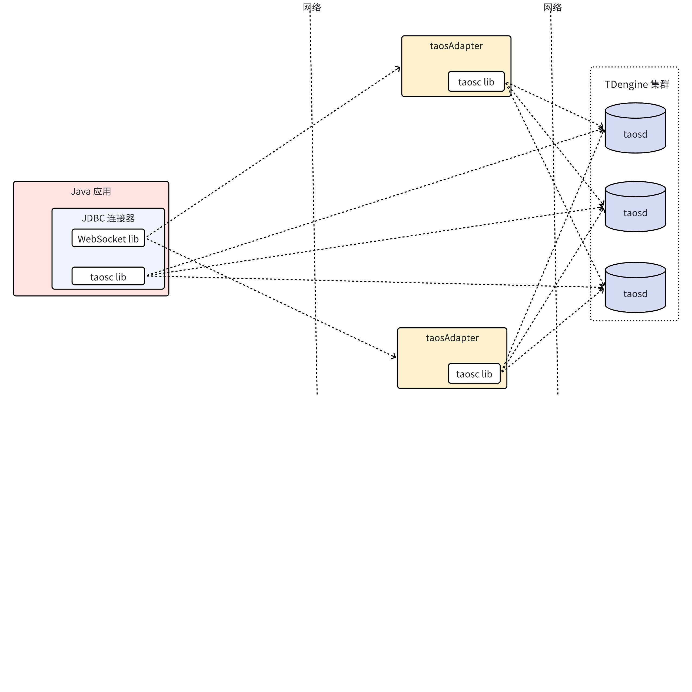

   - JDBC 连接器支持三种连接方式：WebSocket 和 Naive。其区别为：
      - 使用 原生连接，需要保证客户端的驱动程序 taosc 和服务端的 TDengine 版本保持一致。
      - 使用 WebSocket 连接，用户无需安装客户端驱动程序 taosc，其性能与原生连接接近。
      - 连接云服务实例，必须使用 WebSocket 连接。
   - JDBC 连接器支持负载均衡，因此可以连接多个 taosAdapter 实现高可用。
   - JDBC 通过 WebSocket 库与 taosAdapter 交互，通过 taosc 库与 TDengine 集群直接交互。
1. 技术：列出所使用的技术和框架
  - 开发语言：Java
  - 基础库：Guava （https://github.com/google/guava）
  - WebSocket 框架：netty（https://github.com/netty/netty）
  - 日志库：sl4j（https://slf4j.org/）
  - JSON 库：jackson（https://github.com/FasterXML/jackson）
  - HTTP 客户端库：apache httpclient （https://hc.apache.org/httpcomponents-client-4.5.x/index.html）
1. 依赖项：列出所有依赖项
  - JDK 1.8+ 

## 5. 设计考虑

### 5.1 核心模块以及其关系

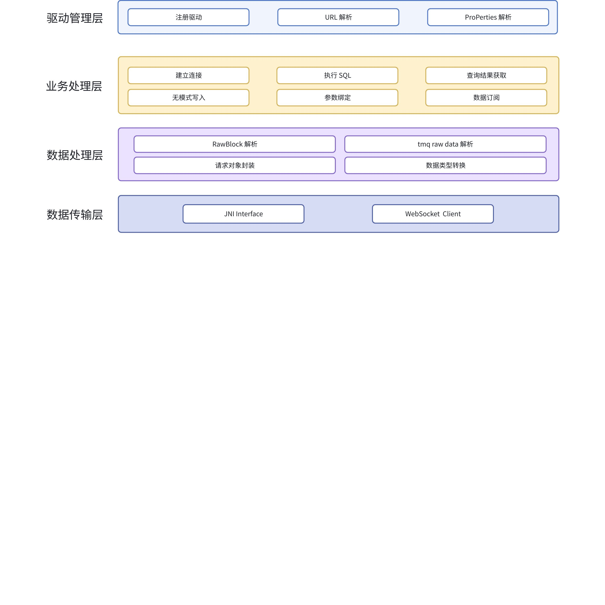

### 5.2 核心类图以及其关系

#### 5.2.1 驱动类

WebSocketDriver 类实现了 WebSocket 连接的驱动，TSDBDriver 实现了 Native 连接的驱动。
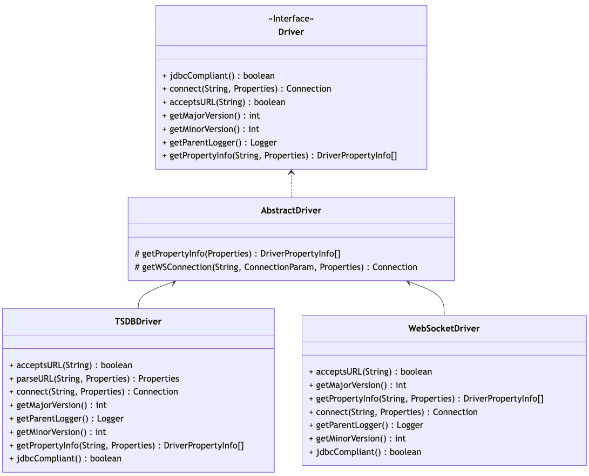

#### 5.2.2 连接类继承关系图和核心方法

两种连接方式对应的连接类都继承自 AbstractConnection 类。
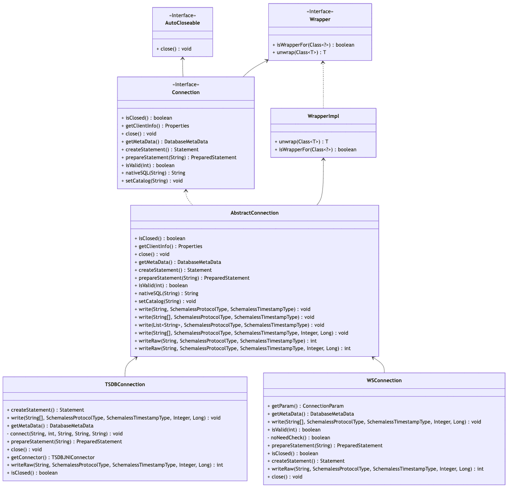

#### 5.2.3 Statement 类继承关系以及其核心方法

两种连接方式对应的 Statement 类都继承自 AbstractStatement 类。
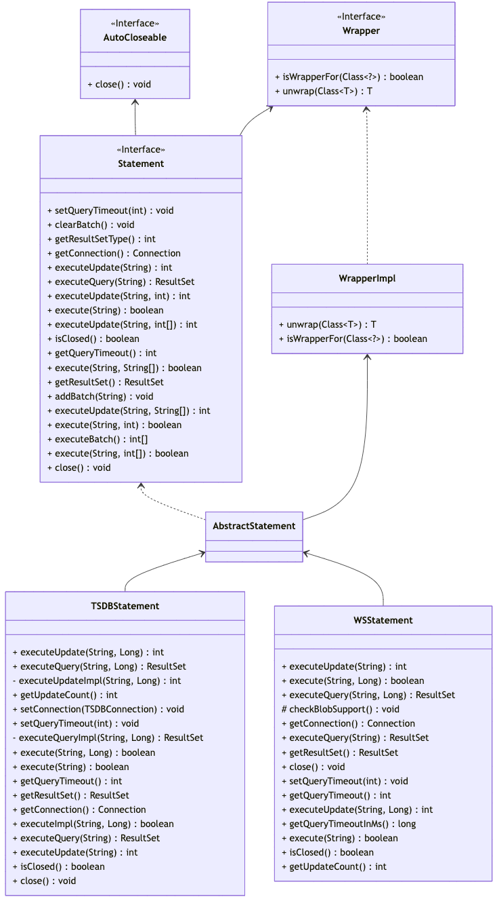

#### 5.2.4 PreparedStatement 类继承关系及其核心方法

下图省略了相同功能的不同类型接口，如 setTimestamp 和 setLong 等。TSWSPreparedStatement 类和 TSDBPreparedStatement 类提供了一些扩展接口，如 setTableName，setTagBoolean 等。
WSEWPreparedStatement 提供了高效写入的实现。
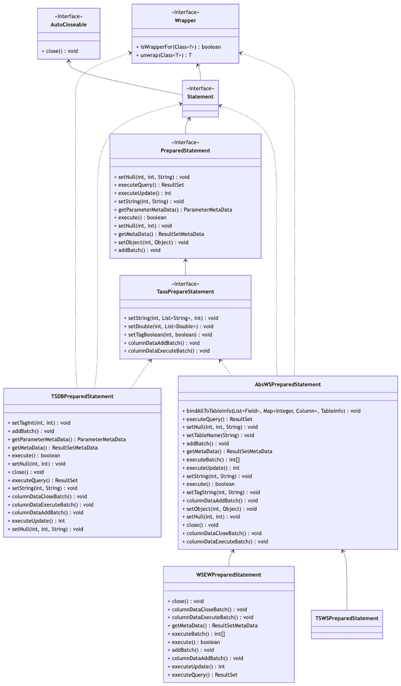

#### 5.2.5 ResultSet 相关类和其核心方法

我们省略了相同功能的不同类型接口，如 getTimestamp 和 getLong 等。所有查询结果集和数据订阅内部使用的结果集，都继承自 AbstractResultSet。
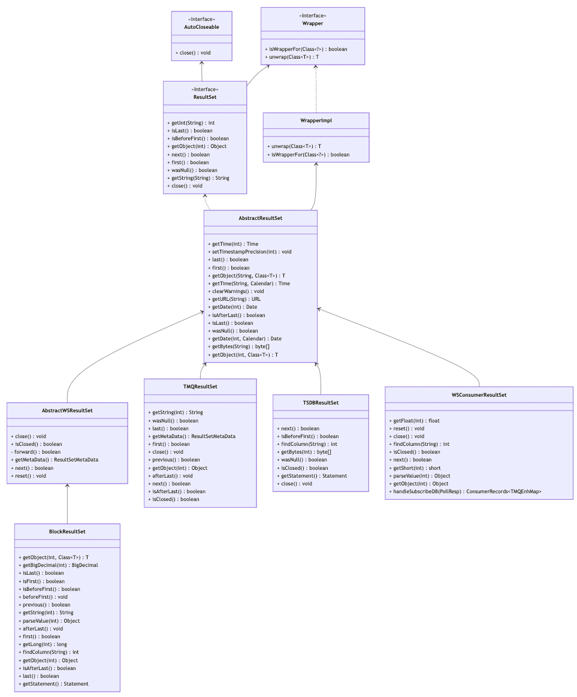

#### 5.2.6 Consumer 相关类和其核心方法

只有 WebSocket 和 Native 连接方式支持数据订阅，WSConsumer 和 JNIConsumer 都继承自 Consumer 类。
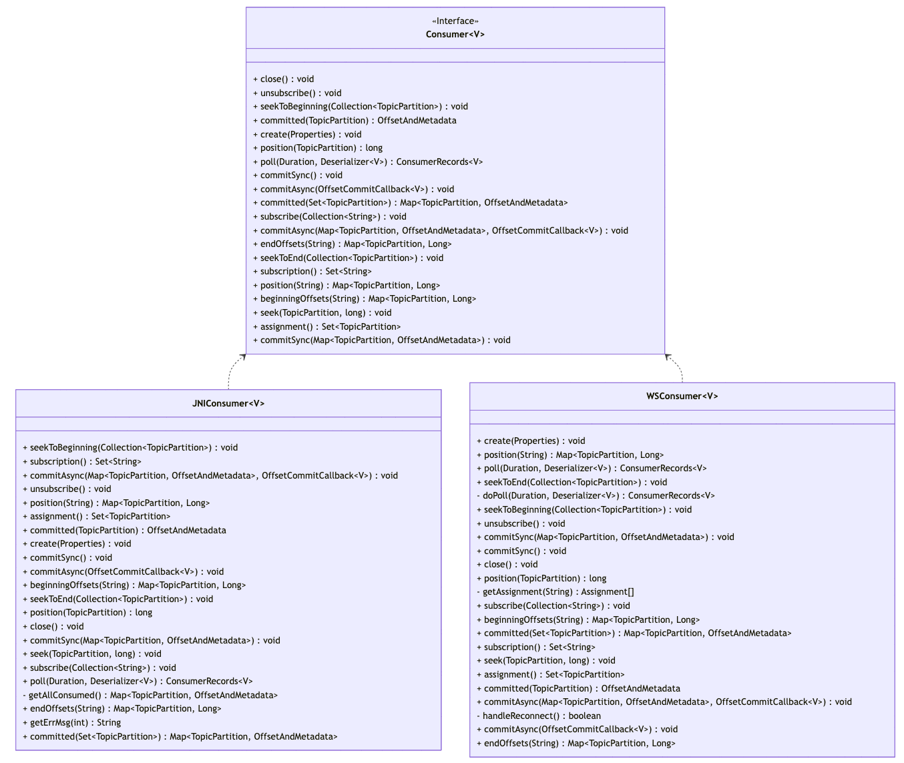

### 5.3 设计模式和原则

#### 5.3.1 整体设计

1. 依赖倒置原则（Dependency Inversion Principle，DIP）
   - 定义：高层模块不应该依赖低层模块，两者都应该依赖其抽象；抽象不应该依赖细节，细节应该依赖抽象。
   - 在 JDBC 驱动实现时，除了连接 URL 区别，两种连接（WebSocket 和 Native）的使用方式是一模一样，它们依赖于相同的 JDBC 标准接口。这种设计方式极大方便了用户使用，使得用户切换连接方式往往只需要修改配置即可，无需修改代码。
2. 开闭原则（Open - Closed Principle，OCP）
   - 定义：软件实体（类、模块、函数等）应该对扩展开放，对修改关闭。
   - 在 JDBC 驱动实现时，连接方式通过新增类来实现的，不会影响到现有的连接方式，遵循开闭原则。
3. 工厂模式：生成 WebSocket 请求使用工厂模式，如 RequestFactory。

#### 5.3.2 高效写入

1. 设计约束
   - 写入线程数配置在 PreparedStatement 中，但是开启高效写入需要连接中参数指定 async_write 或者在绑定 sql 中使用 ASYNC_INSERT 开头。
   - 不建议一个连接创建多个 PreparedStatement 用于高效写入，如果实在要用也能支持，只是可能会造成线程数较多影响性能。
   - 当缓存满时，客户写入线程也会阻塞，此时 lingerMs 也不生效了。
   - 会忽略写入中的可忽略错误，数据错误等，错误信息会写入日志。然后继续写入其他数据。超时自动重试，次数为连接上 retryTimes 参数控制。
   - 数据倾斜，当少数子表数据量很大时，可能会导致写入线程负载不均，后续版本可通过支持定制 hash 算法等来缓解。
2. 风险和应对
   - 高效写入模式下，用户写入无法立即获得真实写入结果，只能通过 executeUpdate 来获取之前一批数据的成功写入条数。
   - 如果连接异常等不可恢复错误，用户无法立即收到异常。

#### 5.3.3 负载均衡

##### 5.3.3.1 可靠性

- 连接异常后快速切换至其他正常节点，保证业务不中断。
- 在底层做连接 `failover`，除了获取结果集外，上层应用无感知。

##### 5.3.3.2 均衡性

- 采用**最小连接数算法**来保证连接数的均衡性。目前客户端没有好的办法来判断每个服务端节点的负载，后续可以通过 Adapter 提供接口来查询服务端节点负载情况，根据负载决定连接的建立和迁移。
- 故障节点探活处理：用后台线程来探测故障节点，避免新连接继续访问故障节点影响连接速度以及快速探活进行负载重平衡。
- 通过连接迁移，保证在长时间没有新连接建立的情况下，依然能达到负载均衡。

##### 5.3.3.3 性能

- 事件触发：探活采用事件触发加异步调用方式，降低资源消耗。
- 所有同步的数据结构采用原子变量，避免锁的使用造成性能下降。

## 6. 详细设计 

限于篇幅，我们详细设计主要是用 WebSocket 连接的相关实现来举例。

### 6.1 核心数据结构

#### 6.1.1 连接类

```java
public class WSConnection extends AbstractConnection {

    // 数据传输对象，负责收发报文
    private final Transport transport;
    // 存储数据库 meta 信息
    private final DatabaseMetaData metaData;
    // 存储当前选择的 database
    private String database;
    // 存储创建的参数
    private final ConnectionParam param;
    // 存储创建的 Statement，关闭时会释放
    CopyOnWriteArrayList<Statement> statementList = new CopyOnWriteArrayList<>();
    ......
}
```

#### 6.1.2 Statement 类

```java
public class WSStatement extends AbstractStatement {
    // 数据传输对象，负责收发报文
    protected Transport transport;
    // 存储当前选择的 database
    private String database;
    // 存储当前的连接对象
    private final Connection connection;
    // 是否关闭
    private boolean closed;
    // 存储结果集
    private ResultSet resultSet;
    ......
}
```

```java
public abstract class AbstractStatement extends WrapperImpl implements Statement {

    // 存储批量执行的 sql
    protected List<String> batchedArgs;
    // 写入影响行数
    protected int affectedRows = -1;
    ......
}
```

#### 6.1.3 PreparedStatement 类

```java
public class TSWSPreparedStatement extends WSStatement implements PreparedStatement {
   // 用来提取写入 sql 中的 db
   public static final Pattern INSERT_PATTERN = Pattern.compile(
             "insert\\s+into\\s+([.\\w]+|\\?)\\s+(using\\s+([.\\w]+)(\\s*\\(.*\\)\\s*|\\s+)tags\\s*\\(.*\\))?\\s*(\\(.*\\))?\\s*values\\s*\\(.*\\)"
   );
   
    // 存储连接信息
    private final ConnectionParam param;
    // reqid，在一个 stmt 对象生命周期不变
    private long reqId;
    // stmtId，在一个 stmt 对象生命周期不变
    private long stmtId;
    // 绑定 sql
    private final String rawSql;

    private int queryTimeout = 0;
    private int precision = TimestampPrecision.MS;

    // 存储一行中各列元素
    private final Map<Integer, Column> column = new HashMap<>();
    // 存储各 tag 元素
    private final Map<Integer, Column> tag = new HashMap<>();
    
    // 存储多列信息，每列多行数据
    private final List<ColumnInfo> data = new ArrayList<>();

    // 存储多列信息，每列多行数据，用来保证不按 index 设置列值也可以
    private final PriorityQueue<ColumnInfo> queue = new PriorityQueue<>();
    ......
}
```

```java
static class Column {
    private final Object data;
    // taos data type
    private final int type;
    private final int index;
}

public class ColumnInfo implements Comparable<ColumnInfo> {
    private List<Object> dataList = new ArrayList<>();
    // taos data type
    private final int type;
    private final int index;
}
```

#### 6.1.4 ResultSet 类

```java
public abstract class AbstractWSResultSet extends AbstractResultSet {
    // 存储 Statement
    protected final Statement statement;
    // 传输对象，负责收发报文
    protected final Transport transport;
    // queryId， 结果集生命周期唯一    
    protected final long queryId;
    
    protected final long reqId;

    protected volatile boolean isClosed;
    // 结果集元数据
    protected final ResultSetMetaData metaData;
    // 结果集列信息
    protected final List<RestfulResultSet.Field> fields = new ArrayList<>();
    // 列名称
    protected final List<String> columnNames;
    // 列数据最大长度
    protected List<Integer> fieldLength;
    // 结果集数据
    protected List<List<Object>> result = new ArrayList<>();

    // 结果集当前块有多少行
    protected int numOfRows = 0;
    // 行标
    protected int rowIndex = 0;
    // 结果集是否拉取完毕
    private boolean isCompleted;
}
```

#### 6.1.5 Consumer 类

```java
public class WSConsumer<V> implements Consumer<V> {
    // 数据传输对象，负责收发报文
    private Transport transport;
    // 连接参数
    private ConsumerParam param;
    // 请求生成工厂
    private TMQRequestFactory factory;
    // 上次提交时间，用来计算自动提交间隔是否够
    private long lastCommitTime = 0;
    // 缓存的消息 id，用于提交
    private long messageId = 0L;
    // 订阅的 topic 列表
    private Collection<String> topics;
}
```

### 6.2 基础场景时序图  

#### 6.2.1 建立连接

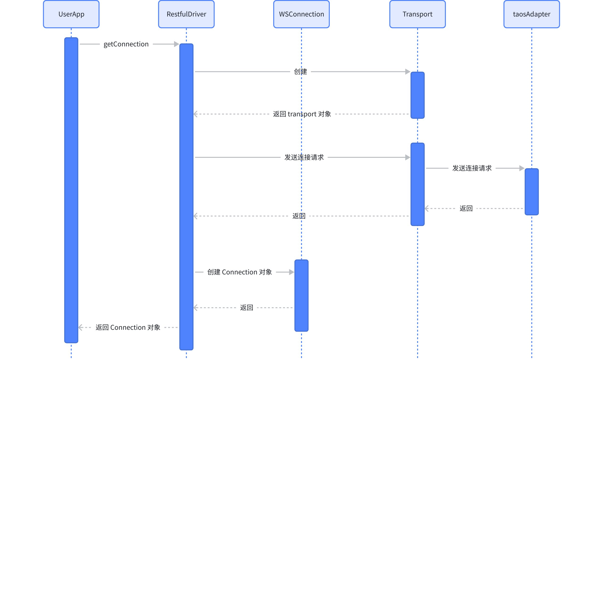

#### 6.2.2 执行 SQL 写入

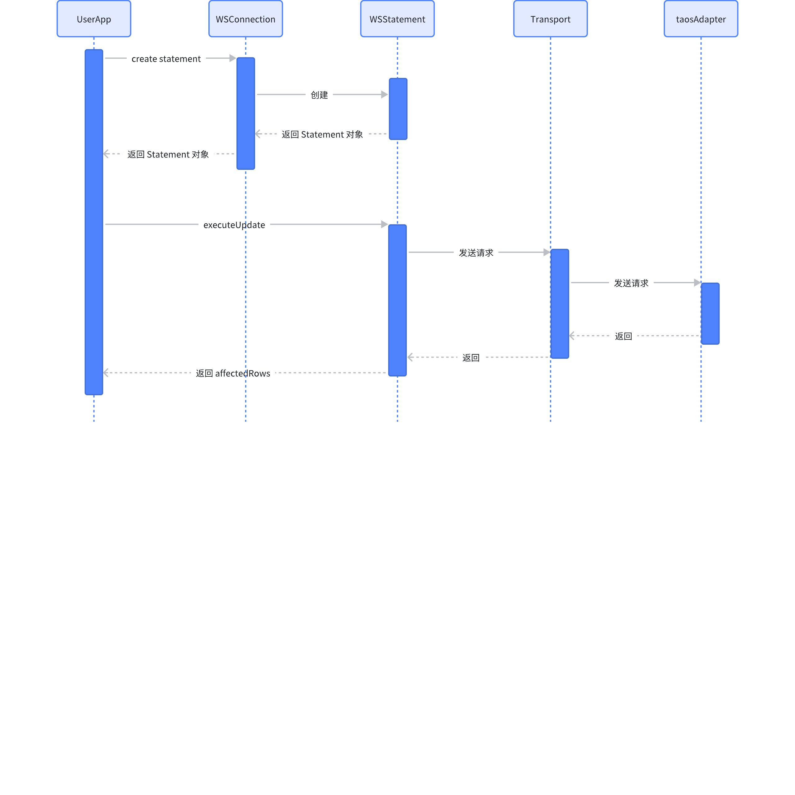

#### 6.2.3 执行 SQL 查询

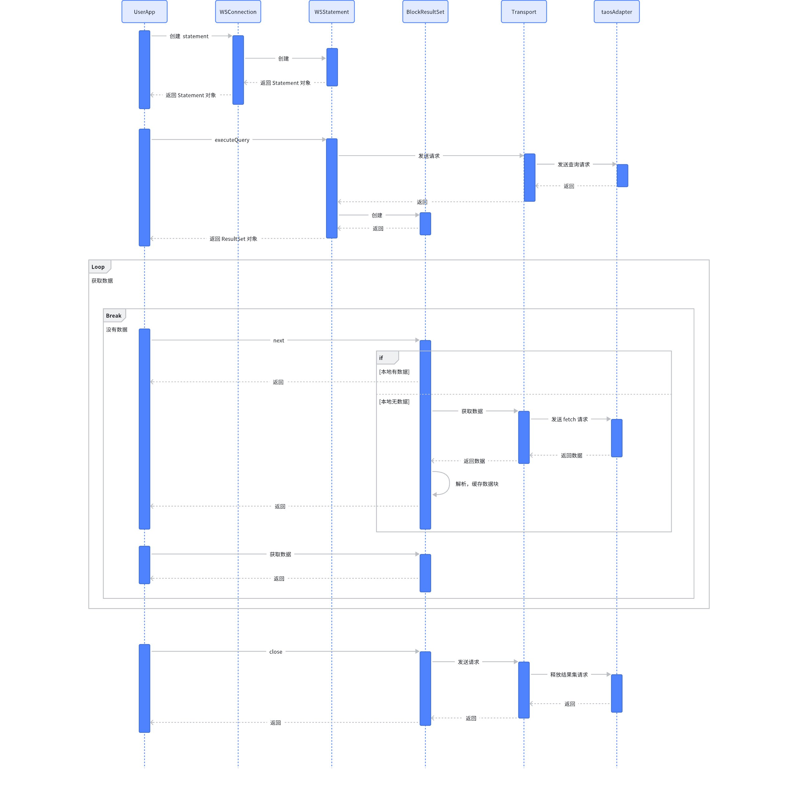

#### 6.2.4 执行参数绑定写入

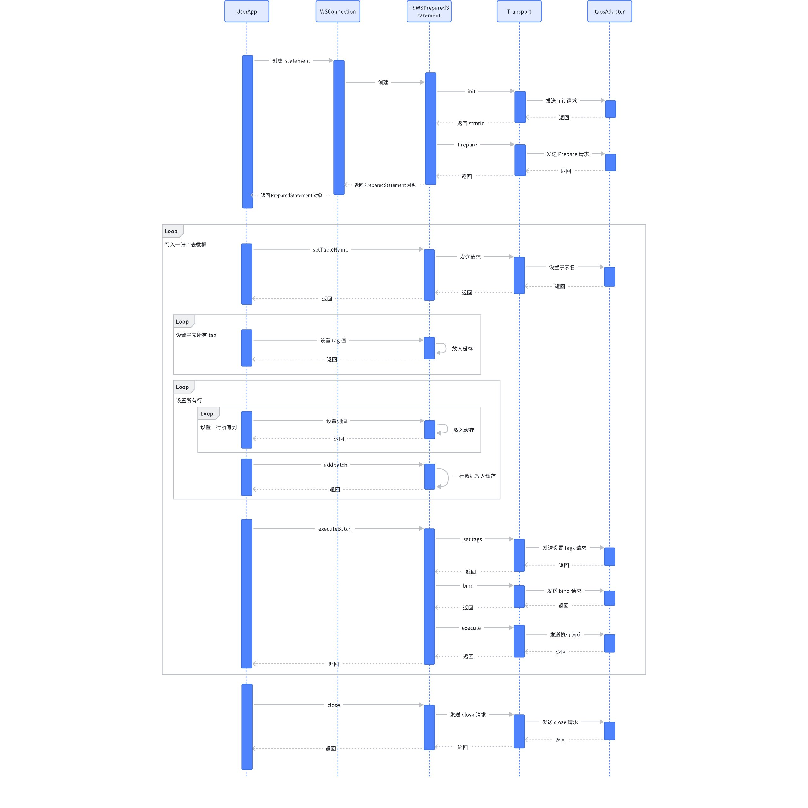

#### 6.2.5 数据订阅

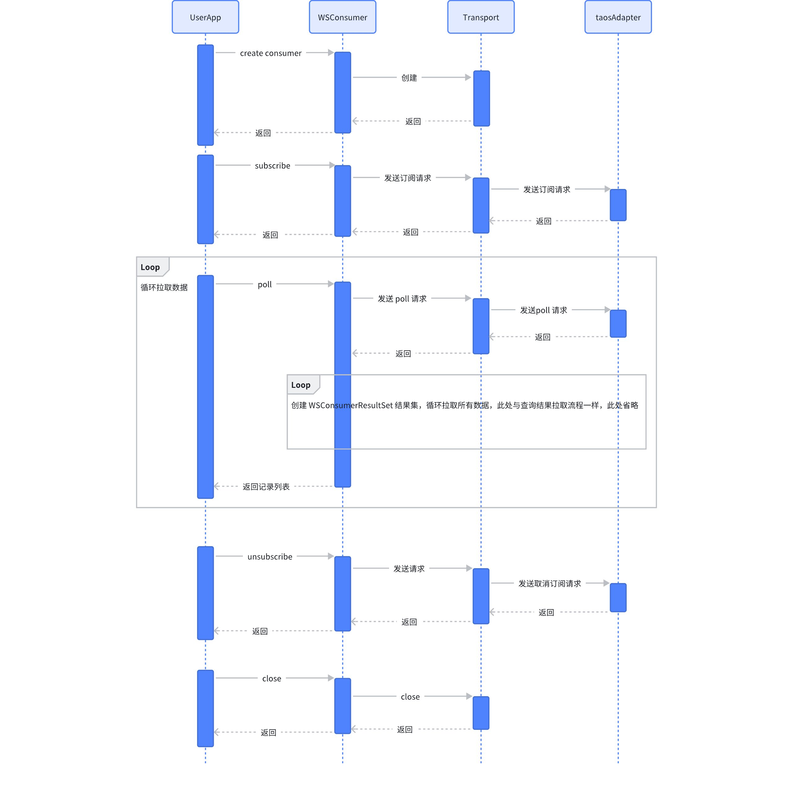

### 6.3 高效写入

#### 6.3.1 数据处理流程

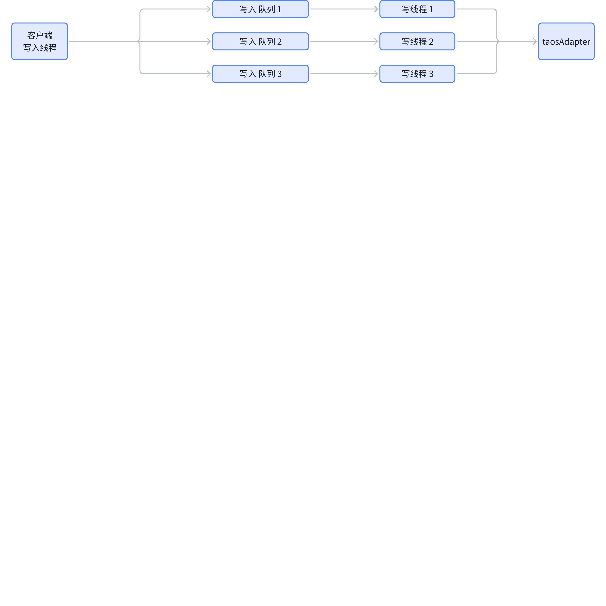

上图描述了主要的数据处理流程：
1. 客户端线程写入数据，会根据每条数据中的子表名做 hash，然后放入对应的写入队列，这样保证相同子表的数据放入相同队列，保证写入有序。
   - 目前 hash 算法使用 jdbc 默认的，自测子表名由字符串和递增整数组成，是可以均匀分布到写入队列。
   - 当某些少量子表数据较多时，可能会导致写入线程负载不均，后续版本可以通过支持定制 hash 算法来缓解。
2. 写入线程会尽最大努力写入。下图为写入逻辑的流程图。
  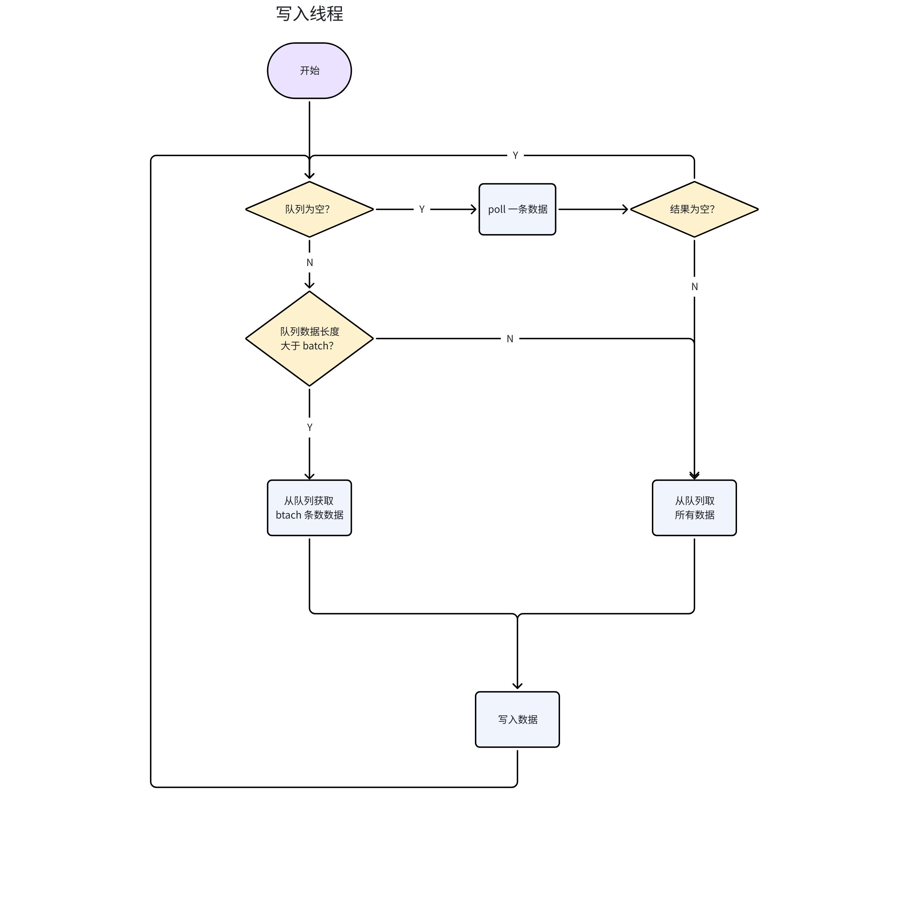

   - 如果写入队列中数据条数大于 batch，则立刻取出 batch 条数数据，组成一个 package，调用 adapter 接口写入。
   - 如果队列中数据小于 batch，则会将队列所有数据组成 batch 写入。
   - 写入线程在 PreparedStatement 对象关闭时，直接写入所有数据。
1. PreparedStatement 对象关闭时，会等待写入线程退出后再关闭。

#### 6.3.2 时序图

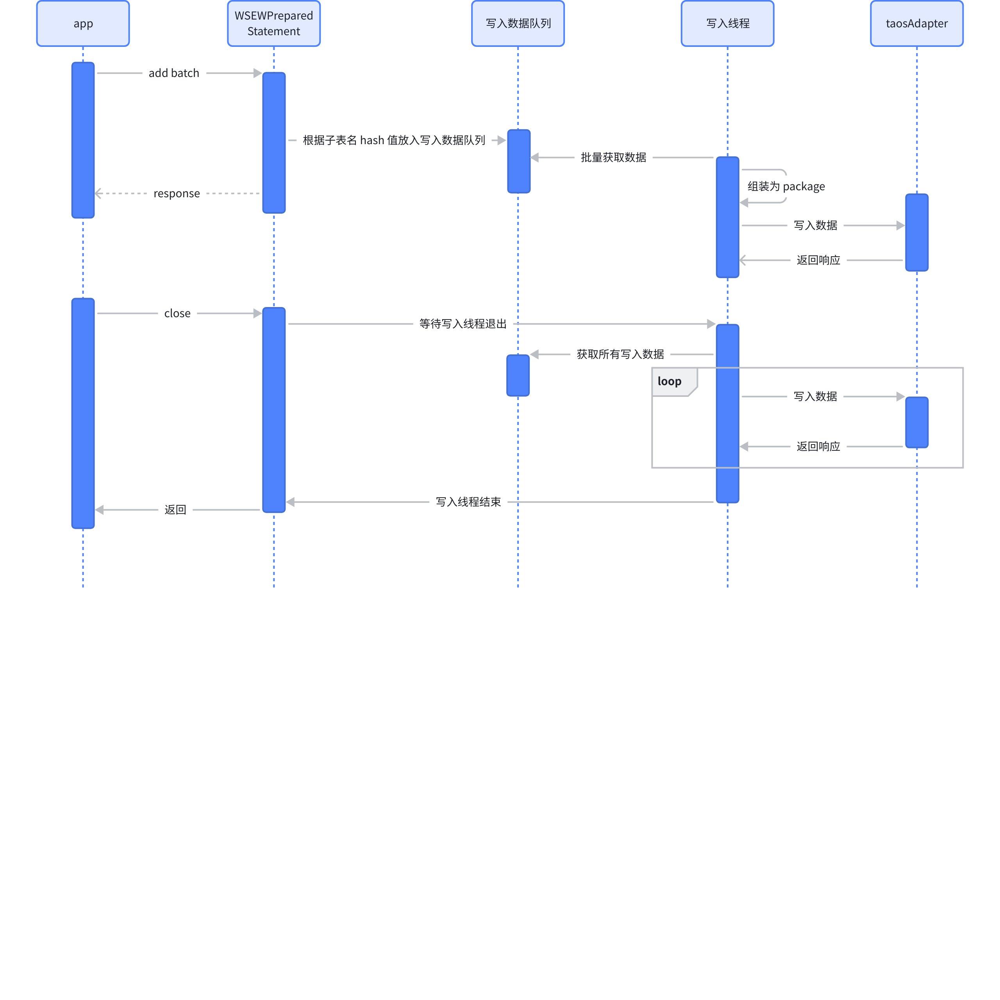

1. 写入数据队列存在的必要性：因为写入耗时较高，需要一个缓冲区存放待写入数据。
2. 写入线程是跟随 WSEWPreparedStatement 生命周期存在的。
3. 反压实现：当前要写入数据对应的写入数据队列满，则应用写入线程阻塞。

#### 6.3.3 executeUpdate 实现 flush

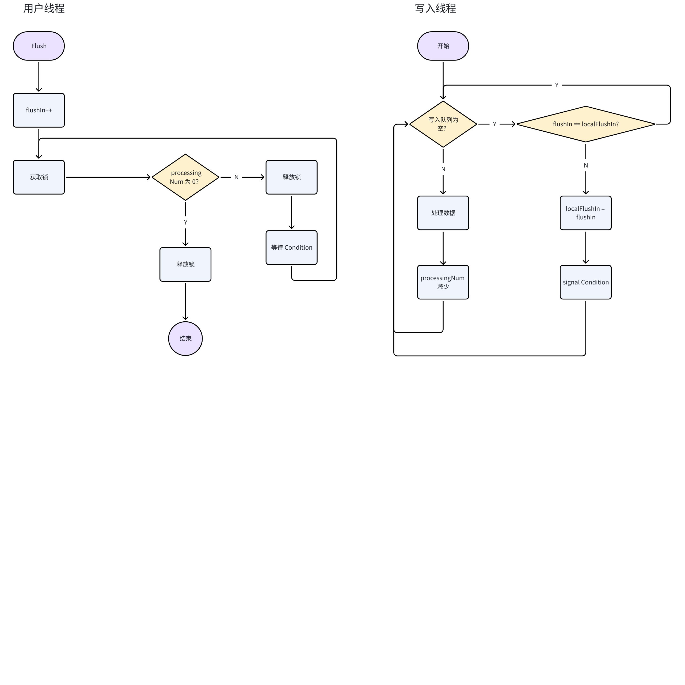

1. 通过 processingNum 计数，放入队列时增加，写入成功或者失败都会减少。若 processingNum 为 0 则写入完成。
2. 通过 flushIn 控制是否需要发送 signal。为了避免 ABA 问题，flushIn 会递增。这样保证会收到 signal，不会死锁。

#### 6.3.4 异常处理

JDBC 驱动目前有连接断开重连，但是考虑到队列中缓存的数据较多，一旦连接断开，会导致数据丢失。在连接断开重连时，重建 stmt 对象，并尝试重新写入之前失败的数据。由 TDengine 写入幂等性来保证重试不会产生脏数据。这样可以保证在连接断开重连成功后依然能够正常写数据。

### 6.4 负载均衡和 failover

#### 6.4.1 负载均衡算法（Load Balancing Algorithm）

驱动目前仅支持**最小连接数（Least Connections）**算法。
- **适用场景**：节点性能相近，需按实时连接数分配，避免单节点连接过载。
- **算法逻辑**：
   - 驱动为每个节点维护`activeConnCount`（活跃连接数，原子计数），每次分配连接时，选择`activeConnCount`最小的 “在线” 节点。
   - 连接关闭时，`activeConnCount`减 1，确保计数实时更新。

#### 6.4.2 **探活流程图**

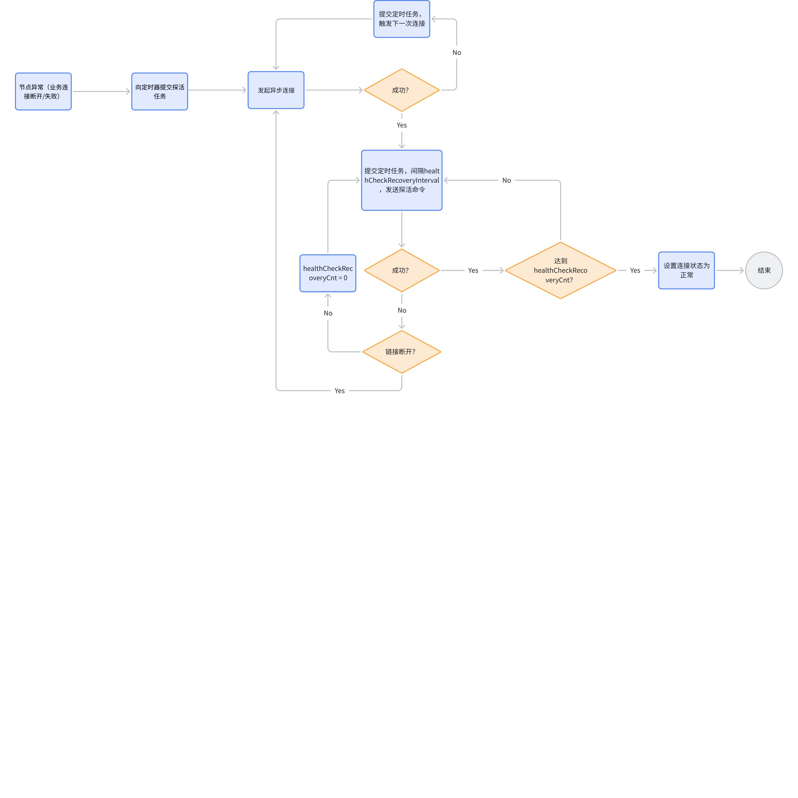

JDBC 连接器探活设计有以下考虑：
1. 采用后台探活，不影响当前连接的 failover。
2. 同样的节点即使多个连接失效，也只会有一个探活流程。
3. 采用异步事件驱动探活，不存在探活线程，降低资源占用。

#### 6.4.3 重平衡

连接重平衡是节点恢复后流量均匀分配的核心，驱动考虑了连接池场景适配，确保平滑无感知。

##### 6.4.3.1 重平衡触发条件

- **节点恢复触发**：探活线程检测到 `断开` 节点转为 `正常` 时，且符合重平衡条件触发重平衡。
- **重平衡条件，需要都满足**：
  - 连接总数大于阈值（`rebalanceConBaseCount`）
  - 当 “当前连接数比最小连接数多的部分” 占 “最小连接数” 的比例超过 `rebalanceThreshold` 时，触发重平衡。即：当前节点连接数 ≥ 节点最小连接数 × (1 + rebalanceThreshold/100)

##### 6.4.3.2 连接迁移

为了解决连接池场景，故障节点的连接都 failover 到正常节点后，长时间没有新连接建立，导致故障节点恢复后流量不均衡，所以要进行连接迁移，来实现重平衡。
连接进行迁移的条件：
1. 正在重平衡过程。且本次触发重平衡的故障恢复节点在连接的端点列表内。
2. 连接是空闲的。
   - 连接上没有未完成的查询。
   - 连接上没有结果集未释放。
   - 连接上没有未关闭的 STMT 对象。
3. 对于数据订阅，不进行迁移。

##### 6.4.3.3 重平衡流程图

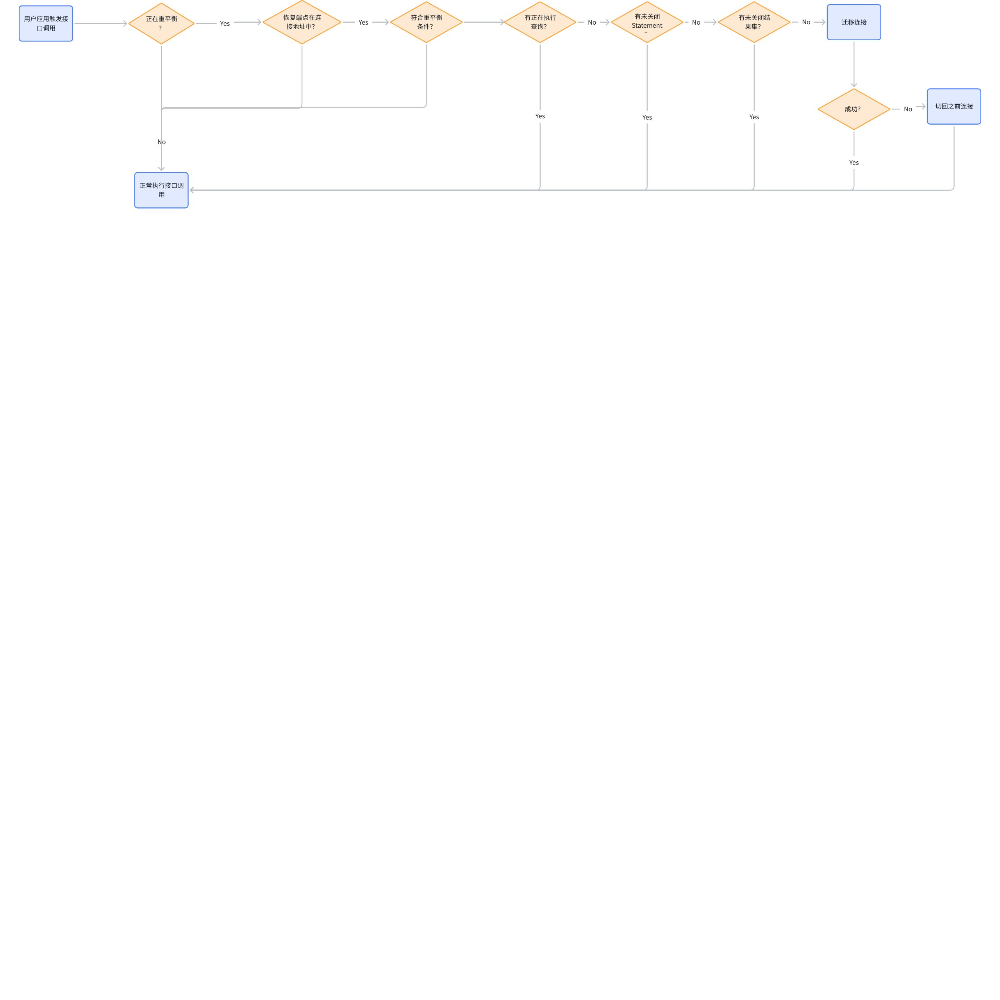

## 7. 接口规范

请参考 [JDBC 连接器-Function Spec - 佘彦杰](https://taosdata.feishu.cn/wiki/NRWqws1PYihirCkVJgrcjBxVnQh) 中第 4 节行为说明。

## 8. 安全考虑

1. 客户端和数据库交互时， 必须确保用户名密码或 Token 正确。
2. TLS 加密
   - 支持加密通道（HTTPS/WSS）进行通信，防止明文数据传输带来的安全风险。
   - 原生连接加密由 TDengine 客户端文件进行配置。
3. 重平衡安全防护
   - **并发安全**：采用原子变量，避免计数并发问题。
   - **迁移失败回滚**：若恢复节点在重平衡过程中再次下线，驱动立即终止迁移，避免无效连接占用资源。
4. 日志与错误输出脱敏
   - **凭据保护**：密码、DSN token、API token 等敏感凭据禁止在日志、异常堆栈、调试信息中出现。
      - 日志记录前需脱敏处理：仅保留前后少量字符（如 token 显示为 `xxxxx...xxxxx`）。
      - 异常信息（SQLException）中若包含连接参数，需去除敏感内容。
      - 应用日志框架（如 SLF4J）集成脱敏过滤器，对 JDBC 驱动日志进行掩码。
   - **路径与系统信息保护**：错误消息中禁止暴露文件路径、配置文件位置、系统命令等内部细节。
      - 数据库驱动抛出的异常应使用通用错误描述，转发前端时去除内部技术栈信息。
      - 日志输出不应包含客户端配置目录、临时文件路径等。
5. SQL 防注入
   - **优先使用 PreparedStatement 参数绑定**：
      - 文档、示例、最佳实践必须优先使用 `PreparedStatement` 及其参数绑定方法（`setString()`、`setInt()` 等）。
      - 反面示例应明确标注为"不安全"或"禁用"，说明 SQL 注入风险。
6. 请求超时与资源耗尽保护
   - **连接超时与消息超时**：
      - WebSocket 连接属性：`httpConnectTimeout`（默认 60000ms）、`messageWaitTimeout`（默认 60000ms）均应有合理默认值且可配置。
      - 原生连接应通过客户端配置或驱动参数支持连接超时与命令超时设置。
      - 文档应说明超时机制可防止恶意或异常的长连接占用服务端资源。
   - **查询执行超时**：
      - Statement 对象应支持 `setQueryTimeout(seconds)` 方法（JDBC 标准），驱动需落实此方法。
      - 超时触发后应抛出 `SQLTimeoutException`，应用应捕获并妥善处理。
   - **批量操作超时与限制**：
      - `executeBatch()` 操作应综合考虑批量大小与超时时间，避免单次批量操作占用过多资源。
      - 无模式写入 `insertStmt` 的缓存与后台线程应设置合理的大小上限与超时清理机制。
7. 访问控制与最小权限
   - **凭据管理**：
      - 支持从环境变量或配置文件安全读取密码（而非硬编码），文档应提示此最佳实践。
      - 连接池应隔离不同用户的凭据，避免跨用户信息泄露。
   - **权限校验**：
      - 文档建议指定用户权限范围（如限制数据库访问、表操作权限）。
      - 避免超级用户权限的默认使用，鼓励最小权限配置。
8. 审计与可观测性
   - **请求链路追溯**：
      - 驱动应支持应用传递 `reqId`（请求 ID），用于与后端日志关联，便于审计。
      - 关键操作（连接建立、SQL 执行、异常）应记录链路 ID，便于事件溯源。
   - **日志记录策略**：
      - 驱动日志级别应可配置（DEBUG、INFO、WARN、ERROR），默认不输出敏感信息。
      - 可选提供审计日志输出，记录连接用户、操作类型、执行时间等（不含 SQL 与凭据内容）。

## 9. 性能和可扩展性

性能要求，在 vm98（16核心 Intel(R) Core(TM) i7-10700 CPU @ 2.90GHz， 64G内存）机器上测试：
- 查询：单线程拉取 meters 表，Native 连接性能不低于 100W/s
- SQL 写入：单线程写入 meters 表，Native 连接性能不低于10 W/s
- 参数绑定写入：单线程写入 meters 表，Native 连接性能不低于100 W/s
- 数据订阅：单线程拉取数据，Native 连接不低于  10W/s

## 10. 部署和配置

1. 如果是用 maven 管理项目，在 用户应用的 java 工程中的 pom.xml 中增加依赖项：
```java
<dependency>
  <groupId>com.taosdata.jdbc</groupId>
  <artifactId>taos-jdbcdriver</artifactId>
  <version>3.2.11</version>
</dependency>
```

1. 如果是 gradle 管理项目，请在`build.gradle` 文件的 `dependencies` 代码块中添加：
```java
implementation 'com.taosdata.jdbc:taos-jdbcdriver:3.2.11'
```

## 11. 监控和维护

1. 日志记录和诊断：提供 slf4j 的门面日志接口，如果用户应用依赖实现了同样门面接口的日志，则可以正常记录 JDBC 驱动日志到应用日志中。方便问题定位和排查。
2. 维护：持续维护 JDBC 驱动，有需求或者问题修复都会发布新版本。

## 12. 参考资料

1. [JDBC 连接器-Requirement Spec - 佘彦杰](https://taosdata.feishu.cn/wiki/ULDgwxWoViUuOCkNSpKca6Twnfe)
2. [JDBC 连接器-Function Spec - 佘彦杰](https://taosdata.feishu.cn/wiki/NRWqws1PYihirCkVJgrcjBxVnQh)
