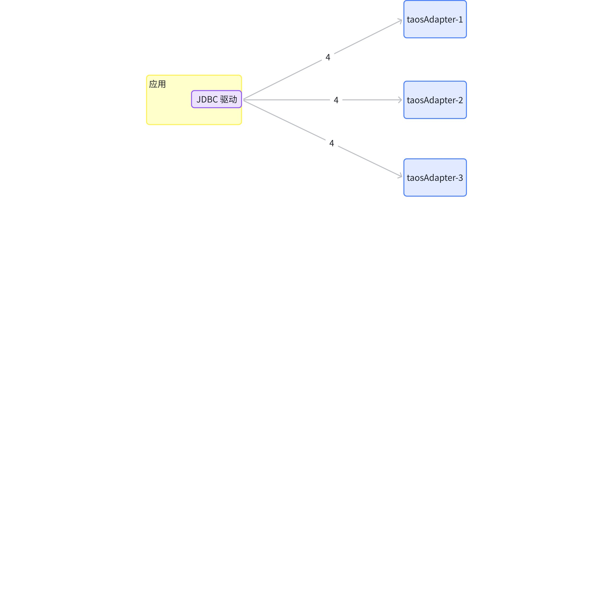
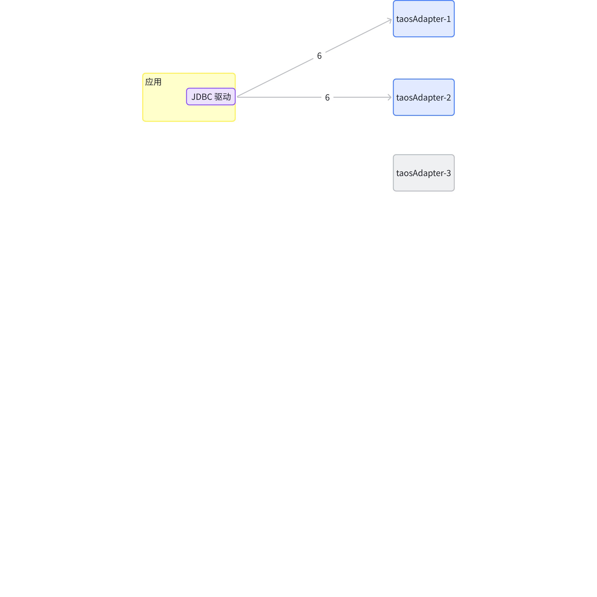

# JDBC 连接器-Function Spec

## 1. 修订记录

| 编写日期 | 发布日期 | 版本 | 修订人 | 主要修改内容 |
| --- | --- | --- | --- | --- |
| 2025-01-03 | 2025-01-03 | 1.0 | 佘彦杰 | 创建 |
| 2025-12-12 | 2025-12-12 | 1.1 | 佘彦杰 | 更新到最新版本设计 |
| 2025-12-26 | 2025-12-26 | 1.2 | 霍琳贺 | 补充安全设计部分 |

## 2. 背景

在物联网和工业互联网快速发展的背景下，时序数据的存储和分析变得越来越重要。TDengine 作为一款专门针对物联网场景优化的开源时序数据库，需要一个符合标准的 JDBC 驱动来支持 Java 生态系统的应用开发。
驱动的实现需要严格遵循 JDBC 规范，提供标准的接口实现，对于 JDBC 标准无法支持的功能如数据订阅，无模式写入等可以用扩展接口实现。
我们的目标是提供一个功能完备、性能优异、使用友好的 JDBC 驱动，支持完整的 TDengine 核心功能（执行 SQL，参数绑定，无模式写入和数据订阅），优化批量写入和查询性能，提供详细的文档和示例，并确保驱动的可靠性和可维护性。这需要通过完善的测试覆盖、压力测试验证和实际生产环境的实践来保证。

## 3. 定义

1. **JDBC**：JDBC（Java Database Connectivity） 是 Java 平台提供的数据库访问标准接口，它让 Java 应用能够统一地访问不同的数据库系统。
2. **无模式写入**：是指在写入数据时无需预先定义表结构，系统会根据数据自动创建或调整表结构的特性。
3. **数据订阅**：允许客户端实时接收数据库中的数据变化，适用于实时监控场景。
4. **参数绑定**：是在 SQL 语句中使用占位符替代具体值的技术，可以防止 SQL 注入并提高性能。
5. **WebSocket**：是一种基于 TCP 的全双工通信协议，支持服务器和客户端之间的实时数据传输。
6. **JNI （Java Native Interface）**：是 Java 提供的本地接口机制，允许 Java 代码调用用 C/C++ 等语言编写的本地代码，常用于性能优化。
7. **高效写入：**JDBC 连接器提供的一个特性，可以使单线程写入达到多线程写入吞吐量的方式。启动高效写入特性后，JDBC 连接器将自动创建写入线程与专属队列，将数据按子表切分缓存，在达到数据量阈值或超时条件时批量发送，以此减少网络请求、提升吞吐量，让用户无需掌握多线程编程知识和数据切分技巧即可实现高性能写入。
8. **负载均衡：**将客户端请求合理分配到多台服务器的技术，避免单台服务器过载。它能提升系统可用性、响应速度和扩展性，是高并发架构的核心组件之一。

## 4. 行为说明

### 4.1 支持的 JDBC 版本

支持 JDBC 4.2 及以上版本，下文所有描述，都针对 JDBC 4.2 版本接口。

### 4.2 JDBC 规范的核心类

| 序号 | 类名 | 备注 |
| --- | --- | --- |
| 1 | Driver | 驱动，参考：[https://docs.oracle.com/javase/8/docs/api/java/sql/Driver.html](https://docs.oracle.com/javase/8/docs/api/java/sql/Driver.html) |
| 2 | Connection | 连接，参考：[https://docs.oracle.com/javase/8/docs/api/java/sql/Connection.html](https://docs.oracle.com/javase/8/docs/api/java/sql/Connection.html) |
| 3 | Statement | 语句 SQL，参考：[https://docs.oracle.com/javase/8/docs/api/java/sql/Statement.html](https://docs.oracle.com/javase/8/docs/api/java/sql/Statement.html) |
| 4 | DatabaseMetaData | 数据库相关的元数据，参考：[https://docs.oracle.com/javase/8/docs/api/java/sql/DatabaseMetaData.html](https://docs.oracle.com/javase/8/docs/api/java/sql/DatabaseMetaData.html) |
| 5 | ResultSet | 结果集，参考：[https://docs.oracle.com/javase/8/docs/api/java/sql/ResultSet.html](https://docs.oracle.com/javase/8/docs/api/java/sql/ResultSet.html) |
| 6 | ResultSetMetaData | 结果集的元数据，参考：[https://docs.oracle.com/javase/8/docs/api/java/sql/ResultSetMetaData.html](https://docs.oracle.com/javase/8/docs/api/java/sql/ResultSetMetaData.html) |
| 7 | PreparedStatement | 可以传参的 Statement，参考：[https://docs.oracle.com/javase/8/docs/api/java/sql/PreparedStatement.html](https://docs.oracle.com/javase/8/docs/api/java/sql/PreparedStatement.html) |
| 8 | ParameterMetaData | 参数的元数据（使用 PreparedStatement 时），参考：[https://docs.oracle.com/javase/8/docs/api/java/sql/ParameterMetaData.html](https://docs.oracle.com/javase/8/docs/api/java/sql/ParameterMetaData.html) |

### 4.3 Driver 类

TDengine JDBC 驱动提供了两种连接方式的驱动类，主要包括：
- 原生连接驱动类，基于 JNI 方式实现，直接调用 TDengine 客户端库，提供最佳性能，但需要安装 TDengine 客户端。
  - 驱动类名：com.taosdata.jdbc.TSDBDriver
  - URL格式：jdbc:TAOS://host:port/database
- WebSocket 连接驱动类，基于  WebSocket 协议接口实现，不依赖本地库，跨平台性好，性能接近于原生连接。
  - 驱动类名：com.taosdata.jdbc.ws.WebSocketDriver
  - URL格式：jdbc:TAOS-WS://host:port/database

#### 4.3.1 URL 规范

TDengine TSDB 的 JDBC URL 规范格式为： `jdbc:[TAOS|TAOS-WS]://[host1:port1,host2:port2,...,hostN:portN]/[database_name]?[user={user}|&password={password}|&charset={charset}|&cfgdir={config_dir}|&locale={locale}|&timezone={timezone}|&batchfetch={batchfetch}]`
- `host` 参数支持合法的域名或 IP 地址。taos-jdbcdriver 同时支持 IPv4 和 IPv6 格式。对于 IPv6 地址，必须使用中括号括起来（例如 `[::1]` 或 `[2001:db8:1234:5678::1]`），以避免端口号解析冲突。
- **仅 WebSocket 连接方式支持多个端点地址**，使用时用英文逗号隔开。多个端点地址在连接时会随机使用，以实现负载均衡。
- JDBC URL 中支持设置 Properties 中所有属性，具体请参考下文 **Properties** 章节。

##### 4.3.1.1 **原生连接**

`jdbc:TAOS://``taosdemo.com:6030/power?user=root&password=taosdata`，使用了 JDBC 原生连接的 TSDBDriver，建立了到 host 为 taosdemo.com，端口为 6030（TDengine TSDB 的默认端口），数据库名为 power 的连接。这个 URL 中指定用户名（user）为 root，密码（password）为 taosdata。
**注意**：使用 JDBC 原生连接，taos-jdbcdriver 需要依赖客户端驱动（Linux 下是 libtaos.so；Windows 下是 taos.dll；macOS 下是 libtaos.dylib）。
对于原生连接 url 中支持的常见配置参数如下（所有参数请参考 Properties 一节）：
- user：登录 TDengine TSDB 用户名，默认值 'root'。
- password：用户登录密码，默认值 'taosdata'。
- cfgdir：客户端配置文件目录路径，Linux OS 上默认值 `/etc/taos`，Windows OS 上默认值 `C:/TDengine/cfg`。
- charset：客户端使用的字符集，默认值为系统字符集。
- locale：客户端语言环境，默认值系统当前 locale。
- timezone：客户端使用的时区，默认值为系统当前时区。
- batchErrorIgnore：true：在执行 Statement 的 executeBatch 时，如果中间有一条 SQL 执行失败将继续执行下面的 SQL。false：不再执行失败 SQL 后的任何语句。默认值为：false。
**使用 TDengine TSDB 客户端驱动配置文件建立连接**
当使用 JDBC 原生连接连接 TDengine TSDB 集群时，可以使用 TDengine TSDB 客户端驱动配置文件，在配置文件中指定集群的 firstEp、secondEp 等参数。此时在 JDBC url 中不指定 `host` 和 `port`。 配置如 `jdbc:TAOS://:/power?user=root&password=taosdata`。
在 TDengine TSDB 客户端驱动配置文件中指定 firstEp 和 secondEp，jdbc 会使用客户端的配置文件，建立连接。当集群中 firstEp 节点失效时，JDBC 会尝试使用 secondEp 连接集群。 TDengine TSDB 中，只要保证 firstEp 和 secondEp 中一个节点有效，就可以正常建立到集群的连接。
<quote-container>
**注意**：这里的配置文件指的是调用 JDBC Connector 的应用程序所在机器上的配置文件，Linux OS 上默认值 /etc/taos/taos.cfg，Windows OS 上默认值 C://TDengine/cfg/taos.cfg。
</quote-container>

#### 4.3.2 **WebSocket 连接**

使用 JDBC WebSocket 连接，不需要依赖客户端驱动。这是一个示例： `jdbc:TAOS-WS://taosdemo.com:6041,taosdemo2.com:6041/power?user=root&password=taosdata&varcharAsString=true`。与 JDBC 原生连接相比，仅需要：
1. driverClass 指定为“com.taosdata.jdbc.ws.WebSocketDriver”；
2. jdbcUrl 以“jdbc:TAOS-WS://”开头；
3. 使用 6041 作为连接端口。
4. 支持配置多个端点，连接时随机选择实现负载均衡。
对于 WebSocket 连接，url 中的常见配置参数如下（所有参数请参考 Properties 一节）：
- user：登录 TDengine TSDB 用户名，默认值 'root'。
- password：用户登录密码，默认值 'taosdata'。
- batchErrorIgnore：true：在执行 Statement 的 executeBatch 时，如果中间有一条 SQL 执行失败，继续执行下面的 SQL 了。false：不再执行失败 SQL 后的任何语句。默认值为：false。
- httpConnectTimeout：连接超时时间，单位 ms，默认值为 60000。
- messageWaitTimeout：消息超时时间，单位 ms，默认值为 60000。
- useSSL：连接中是否使用 SSL。
- timezone：客户端使用的时区，连接上生效，默认值为系统时区。推荐不设置，使用系统时区性能更好。
- varcharAsString：将 VARCHAR/BINARY 类型映射为 String，仅在使用 WebSocket 连接时生效。默认值为 false。
- connmode：BI 模式，仅在 WebSocket 连接时生效，默认 0，可设置为 1。为 1 代表开启 BI 模式，元数据信息不统计子表，主要用在 BI 工具对接场景。
**注意**：部分配置项（比如：locale、charset）在 WebSocket 连接中不生效。WebSocket 连接仅支持 UTF-8 字符集。
Properties
除了通过指定的 URL 获取连接，还可以使用 Properties 指定建立连接时的参数。
所有 Properties 配置参数同样可以在 JDBC URL 中指定，方括号中的参数名可以用于 JDBC URL(如 TSDBDriver.PROPERTY_KEY_USER[`user`]，可以在 JDBC URL 中使用 `user=root` 来设置用户名)。
<quote-container>
**注意**：应用中设置的 client parameter 为进程级别的，即如果要更新 client 的参数，需要重启应用。这是因为 client parameter 是全局参数，仅在应用程序的第一次设置生效。
</quote-container>

properties 中的配置参数如下：
---

##### 4.3.2.1 基础配置

**配置描述**：用于配置基础信息，部分参数仅对 JDBC 原生连接生效。
- TSDBDriver.PROPERTY_KEY_USER [`user`]：登录 TDengine TSDB 用户名，默认值 'root'。
- TSDBDriver.PROPERTY_KEY_PASSWORD [`password`]：用户登录密码，默认值 'taosdata'。
- TSDBDriver.PROPERTY_KEY_CONFIG_DIR [`cfgdir`]：仅在使用 JDBC 原生连接时生效。客户端配置文件目录路径，Linux OS 上默认值 `/etc/taos`，Windows OS 上默认值 `C:/TDengine/cfg`。
- TSDBDriver.PROPERTY_KEY_CHARSET [`charset`]：客户端使用的字符集，默认值为系统字符集。
- TSDBDriver.PROPERTY_KEY_LOCALE [`locale`]：仅在使用 JDBC 原生连接时生效。客户端语言环境，默认值系统当前 locale。
- TSDBDriver.PROPERTY_KEY_TIME_ZONE [`timezone`]：
  - 原生连接：客户端使用的时区，默认值为系统当前时区，全局生效。因为历史的原因，我们只支持 POSIX 标准的部分规范，如 UTC-8(代表中国上海), GMT-8，Asia/Shanghai 这几种形式。
  - WebSocket 连接：客户端使用的时区，连接上生效，默认值为系统时区。仅支持 IANA 时区，即 Asia/Shanghai 这种形式。推荐不设置，使用系统时区性能更好。
- TSDBDriver.PROPERTY_KEY_BATCH_ERROR_IGNORE [`batchErrorIgnore`]：true：在执行 Statement 的 executeBatch 时，如果中间有一条 SQL 执行失败，继续执行下面的 SQL。false：不再执行失败 SQL 后的任何语句。默认值为：false。
---

##### 4.3.2.2 WebSocket 连接属性配置

**配置描述**：定义 WebSocket 连接超时、加密、压缩和重连等配置。
- TSDBDriver.PROPERTY_KEY_MESSAGE_WAIT_TIMEOUT [`messageWaitTimeout`]：消息超时时间，单位 ms，默认值为 60000。仅 WebSocket 连接下有效。
- TSDBDriver.PROPERTY_KEY_WS_KEEP_ALIVE_SECONDS [`wsKeepAlive`]：WebSocket 连接有效时间，单位秒，有效时间内调用 isValid 会直接返回上次结果。默认值为 300。
- TSDBDriver.PROPERTY_KEY_USE_SSL [`useSSL`]：连接中是否使用 SSL。仅在 WebSocket 连接时生效。
- TSDBDriver.PROPERTY_KEY_DISABLE_SSL_CERT_VALIDATION [`disableSSLCertValidation`]：关闭 SSL 证书验证。仅在使用 WebSocket 连接时生效。true：启用，false：不启用。默认为 false。
- TSDBDriver.PROPERTY_KEY_ENABLE_COMPRESSION [`enableCompression`]：传输过程是否启用压缩。仅在使用 WebSocket 连接时生效。true：启用，false：不启用。默认为 false。
- TSDBDriver.PROPERTY_KEY_ENABLE_AUTO_RECONNECT [`enableAutoReconnect`]：是否启用自动重连。仅在使用 WebSocket 连接时生效。true：启用，false：不启用。默认为 false。
<quote-container>
- **注意**：启用自动重连对获取结果集无效。自动重连仅对连接建立时通过参数指定数据库有效，对后面的 `use db` 语句切换数据库无效。
</quote-container>

- TSDBDriver.PROPERTY_KEY_RECONNECT_INTERVAL_MS [`reconnectIntervalMs`]：自动重连重试间隔，单位毫秒，默认值 2000。仅在 PROPERTY_KEY_ENABLE_AUTO_RECONNECT 为 true 时生效。
- TSDBDriver.PROPERTY_KEY_RECONNECT_RETRY_COUNT [`reconnectRetryCount`]：自动重连重试次数，默认值 3，仅在 PROPERTY_KEY_ENABLE_AUTO_RECONNECT 为 true 时生效。
---

##### 4.3.2.3 WebSocket 连接扩展配置

**配置描述**：仅对 WebSocket 连接生效的扩展参数，提升易用性。
- TSDBDriver.PROPERTY_KEY_CONNECT_MODE [`conmode`]：BI 模式，仅在 WebSocket 连接时生效，默认 0，可设置为 1。为 1 代表开启 BI 模式，元数据信息不统计子表，主要用在 BI 工具对接场景。
- TSDBDriver.PROPERTY_KEY_VARCHAR_AS_STRING [`varcharAsString`]：将 VARCHAR/BINARY 类型映射为 String，仅在使用 WebSocket 连接时生效。默认值为 false。
- TSDBDriver.PROPERTY_KEY_APP_NAME [`app_name`]：App 名称，可用于 `show connections` 查询结果显示。仅在使用 WebSocket 连接时生效。默认值为 java。
- TSDBDriver.PROPERTY_KEY_APP_IP [`app_ip`]：App IP，可用于 `show connections` 查询结果显示。仅在使用 WebSocket 连接时生效。默认值为空。
---

##### 4.3.2.4 高效写入模式配置

**配置描述**：控制 WebSocket 连接的高效写入模式的核心参数。
- TSDBDriver.PROPERTY_KEY_ASYNC_WRITE [`asyncWrite`]：高效写入模式，目前仅支持 `stmt` 方式。仅在使用 WebSocket 连接时生效。默认值为空，即不启用高效写入模式。
- TSDBDriver.PROPERTY_KEY_BACKEND_WRITE_THREAD_NUM [`backendWriteThreadNum`]：高效写入模式下，后台写入线程数。仅在使用 WebSocket 连接时生效。默认值为 10。
- TSDBDriver.PROPERTY_KEY_BATCH_SIZE_BY_ROW [`batchSizeByRow`]：高效写入模式下，写入数据的批大小，单位是行。仅在使用 WebSocket 连接时生效。默认值为 1000。
- TSDBDriver.PROPERTY_KEY_CACHE_SIZE_BY_ROW [`cacheSizeByRow`]：高效写入模式下，缓存的大小，单位是行。仅在使用 WebSocket 连接时生效。默认值为 10000。
- TSDBDriver.PROPERTY_KEY_COPY_DATA [`copyData`]：高效写入模式下，是否拷贝应用通过 addBatch 传入的二进制类型数据。仅在使用 WebSocket 连接时生效。默认值为 false。
- TSDBDriver.PROPERTY_KEY_STRICT_CHECK [`strictCheck`]：高效写入模式下，是否校验表名长度和变长数据类型长度。仅在使用 WebSocket 连接时生效。默认值为 false。
- TSDBDriver.PROPERTY_KEY_RETRY_TIMES [`retryTimes`]：高效写入模式下，写入失败重试次数。仅在使用 WebSocket 连接时生效。默认值为 3。
---

##### 4.3.2.5 参数绑定序列化配置

**配置描述**：实验性的参数绑定序列化模式配置，仅对 WebSocket 连接生效且不支持高效写入模式，用于优化特定场景下的参数绑定性能。
- TSDBDriver.PROPERTY_KEY_PBS_MODE [`pbsMode`]：参数绑定序列化模式，目前是实验特性，仅支持 `line` 模式，在参数绑定一批绑定的数据中每个子表仅一条数据时可以提升性能。仅在使用 WebSocket 连接时生效，不支持高效写入模式。默认值为空。
---

##### 4.3.2.6 节点后台探活和重平衡配置

**配置描述**：控制驱动对故障节点的主动探活策略，以及连接重平衡触发条件等。仅在 WebSocket 连接有效，且需要开启自动重连。
- TSDBDriver.PROPERTY_KEY_HEALTH_CHECK_INIT_INTERVAL [`healthCheckInitInterval`]：主动探活初始间隔（秒），达到初始间隔后按指数倍增。默认值为 10。
- TSDBDriver.PROPERTY_KEY_HEALTH_CHECK_MAX_INTERVAL [`healthCheckMaxInterval`]：主动探活最大间隔（秒）。当指数倍增的间隔时间达到此最大值后，后续的探活将使用该最大间隔。默认值为 300。
- TSDBDriver.PROPERTY_KEY_HEALTH_CHECK_CON_TIMEOUT [`healthCheckConTimeout`]：探活连接超时时间（秒）。默认值为 1。
- TSDBDriver.PROPERTY_KEY_HEALTH_CHECK_CMD_TIMEOUT [`healthCheckCmdTimeout`]：探活命令超时时间（秒）。默认值为 5。
- TSDBDriver.PROPERTY_KEY_HEALTH_CHECK_RECOVERY_COUNT [`healthCheckRecoveryCount`]：确认节点恢复所需的连续成功探活命令次数。默认值为 3。可选值为≥1。
- TSDBDriver.PROPERTY_KEY_HEALTH_CHECK_RECOVERY_INTERVAL [`healthCheckRecoveryInterval`]：多次探活命令之间的间隔时间（秒）。默认值为 60。可选值为≥0。
- TSDBDriver.PROPERTY_KEY_REBALANCE_THRESHOLD [`rebalanceThreshold`]：重平衡触发阈值（“当前连接数比最小连接数多的部分”占“最小连接数”的比例），达到或超过则触发重平衡。举例：若 rebalanceThreshold=20（20%），则当 current ≥ min × 1.2 时触发（比如最小 100 连接，当前≥120 时触发）。默认值为 20。可选值为 10-50。
- TSDBDriver.PROPERTY_KEY_REBALANCE_CON_BASE_COUNT [`rebalanceConBaseCount`]：触发重平衡所需的最小连接总数。如果连接总数小于此值，则不进行重平衡。默认值为 30。

#### 4.3.3 **配置参数的优先级**

通过前面三种方式获取连接，如果配置参数在 url、Properties、客户端配置文件中有重复，则参数的`优先级由高到低`分别如下：
1. JDBC URL 参数，如上所述，可以在 JDBC URL 的参数中指定。
2. Properties connProps
3. 使用原生连接时，TDengine 客户端驱动的配置文件 taos.cfg
例如：在 url 中指定了 password 为 taosdata，在 Properties 中指定了 password 为 taosdemo，那么，JDBC 会使用 url 中的 password 建立连接。

#### 4.3.4 提供的接口

- Connection connect(String url, java.util.Properties info)  throws SQLException
  - 接口说明：连接 TDengine 数据库
  - 参数说明：
    - url：连接地址 url，对于 TSDBDriver，参考样例：`jdbc:TAOS://``localhost:6030/?user=XXX&password=XXX`。对于 WebSocketDriver， 参考样例 `jdbc:TAOS-RS://``localhost:6041/?user=XXX&password=``XX``X&batchfetch=true`
    - info：连接属性
  - 返回值：连接对象
  - 异常：连接失败抛出 SQLException 异常。
- boolean acceptsURL(String url) throws SQLException
  - 接口说明：判断驱动是否支持 url
  - 参数说明：
    - `url`：连接地址 url
  - 返回值：true：支持， false：不支持。
  - 异常：url 非法抛出 SQLException 异常
- `DriverPropertyInfo[] getPropertyInfo(String url, java.util.Properties info) throws SQLException`
  - 接口说明：获取尝试连接数据库时可能需要的所有属性的详细信息。这些属性信息被封装在 `DriverPropertyInfo` 对象数组中返回。每个 `DriverPropertyInfo` 对象包含了一个数据库连接属性的详细信息，比如属性名、属性值、描述等。
  - 参数说明：
    - `url`：一个 `String` 类型的参数，表示数据库的 URL。
    - `info`：一个 `java.util.Properties` 类型的参数，包含了尝试连接时用户可能提供的属性列表。
  - 返回值：返回值类型为 `DriverPropertyInfo[]`，即 `DriverPropertyInfo` 对象的数组。每个 `DriverPropertyInfo` 对象包含了一个特定的数据库连接属性的详细信息。
  - 异常：如果在获取属性信息的过程中发生数据库访问错误或其他错误，将抛出 `SQLException` 异常。
- `int getMajorVersion()` 获取 JDBC 驱动程序的主版本号
- `int getMinorVersion()`获取 JDBC 驱动程序的次版本号
下面以 WebSocketDriver 连接为例，给出代码样例：
```java
package com.taosdata.jdbc.ws;

import com.taosdata.jdbc.utils.SpecifyAddress;
import org.junit.Assert;
import org.junit.Test;

import java.sql.Driver;
import java.sql.DriverPropertyInfo;
import java.sql.SQLException;
import java.sql.SQLFeatureNotSupportedException;

public class WebSocketDriverTest {
    private static final String HOST = "127.0.0.1";

    @Test
    public void acceptsURL() throws SQLException {
        Driver driver = new WebSocketDriver();
        String url = SpecifyAddress.getInstance().getWebSocketWithoutUrl();
        if (url == null) {
            url = "jdbc:TAOS-WS://" + HOST + ":6041";
        }
        boolean isAccept = driver.acceptsURL(url);
        Assert.assertTrue(isAccept);
        String specifyHost = SpecifyAddress.getInstance().getHost();
        if (specifyHost == null) {
            url = "jdbc:TAOS://" + HOST + ":6041";
        } else {
            url = "jdbc:TAOS://" + specifyHost + ":6041";
        }
        isAccept = driver.acceptsURL(url);
        Assert.assertFalse(isAccept);
    }

    @Test
    public void getPropertyInfo() throws SQLException {
        Driver driver = new WebSocketDriver();
        final String url = "";
        DriverPropertyInfo[] propertyInfo = driver.getPropertyInfo(url, null);
        Assert.assertNotNull(propertyInfo);
    }

    @Test
    public void getMajorVersion() {
        Assert.assertEquals(3, new WebSocketDriver().getMajorVersion());
    }

    @Test
    public void getMinorVersion() {
        Assert.assertEquals(0, new WebSocketDriver().getMinorVersion());
    }

    @Test
    public void jdbcCompliant() {
        Assert.assertFalse(new WebSocketDriver().jdbcCompliant());
    }

    @Test(expected = SQLFeatureNotSupportedException.class)
    public void getParentLogger() throws SQLFeatureNotSupportedException {
        new WebSocketDriver().getParentLogger();
    }
}
```

### 4.4 数据库元数据 DatabaseMetaData 类

`DatabaseMetaData` 是 JDBC API 的一部分，它提供了关于数据库的元数据的详细信息，元数据意味着关于数据库数据的数据。通过 `DatabaseMetaData` 接口，可以查询数据库服务器的详细信息，比如数据库产品名称、版本、已安装的功能、表、视图、存储过程的列表等。这对于了解和适应不同数据库的特性非常有用。
- `String getURL() throws SQLException`
  - 接口说明：获取用于连接数据库的 URL。
  - 返回值：连接数据库的 URL。
  - 异常：获取失败将抛出 `SQLException` 异常。
- `String getUserName() throws SQLException`
  - 接口说明：获取用于连接获取数据库的用户名。
  - 返回值：连接数据库的用户名。
  - 异常：获取失败将抛出 `SQLException` 异常。
- `String getDriverName() throws SQLException`
  - 接口说明：获取 JDBC 驱动程序的名称。
  - 返回值：驱动名称字符串。
  - 异常：获取失败将抛出 `SQLException` 异常。
- `String getDriverVersion() throws SQLException`
  - 接口说明：获取 JDBC 驱动版本
  - 返回值：驱动版本字符串
  - 异常：获取失败将抛出 `SQLException` 异常。
- `int getDriverMajorVersion()`
  - 接口说明：获取 JDBC 驱动主版本号。
- `int getDriverMinorVersion()`
  - 接口说明：获取 JDBC 驱动次版本号。
- `String getDatabaseProductName() throws SQLException`
  - 接口说明：获取数据库产品的名称。
- `String getDatabaseProductVersion() throws SQLException`
  - 接口说明：获取数据库产品的版本号。
- `String getIdentifierQuoteString() throws SQLException`
  - 接口说明：获取用于引用 SQL 标识符的字符串。
- `String getSQLKeywords() throws SQLException`
  - 接口说明：获取数据库特有的 SQL 关键字列表。
- `String getNumericFunctions() throws SQLException`
  - 接口说明：获取数据库支持的数值函数名称列表。
- `String getStringFunctions() throws SQLException`
  - 接口说明：获取数据库支持的字符串函数名称列表。
- `String getSystemFunctions() throws SQLException`
  - 接口说明：获取数据库支持的系统函数名称列表。
- `String getTimeDateFunctions() throws SQLException`
  - 接口说明：获取数据库支持的时间日期函数名称列表。
- `String getCatalogTerm() throws SQLException`
  - 接口说明：获取数据库中目录的术语。
- `String getCatalogSeparator() throws SQLException`
  - 接口说明：获取用于分隔目录和表名的分隔符。
- `int getDefaultTransactionIsolation() throws SQLException`
  - 接口说明：获取数据库的默认事务隔离级别。
- `boolean supportsTransactionIsolationLevel(int level) throws SQLException`
  - 接口说明：判断数据库是否支持给定的事务隔离级别。
  - 参数说明：
    - level：事务隔离级别。
  - 返回值：true：支持，false：不支持。
  - 异常：操作失败抛出 SQLException 异常。
- `ResultSet getTables(String catalog, String schemaPattern, String tableNamePattern, String[] types) throws SQLException`
  - 接口说明：获取数据库中匹配指定模式的表信息。
  - 参数说明：
    - catalog：目录名称；null 表示不指定目录。
    - schemaPattern：模式名称的模式；null 表示不指定模式。
    - tableNamePattern：表名称的模式。
    - types：表类型列表，返回指定类型的表。
  - 返回值：包含表信息的 ResultSet。
  - 异常：操作失败抛出 SQLException 异常。
- `ResultSet getCatalogs() throws SQLException`
  - 接口说明：获取数据库中所有目录的信息。
  - 返回值：包含目录信息的 ResultSet。
  - 异常：操作失败抛出 SQLException 异常。
- `ResultSet getTableTypes() throws SQLException`
  - 接口说明：获取数据库支持的表类型。
  - 返回值：包含表类型的 ResultSet。
  - 异常：操作失败抛出 SQLException 异常。
- `ResultSet getColumns(String catalog, String schemaPattern, String tableNamePattern, String columnNamePattern) throws SQLException`
  - 接口说明：获取指定表中匹配指定模式的列信息。
  - 参数说明：
    - catalog：目录名称；null 表示不指定目录。
    - schemaPattern：模式名称的模式；null 表示不指定模式。
    - tableNamePattern：表名称的模式。
    - columnNamePattern：列名称的模式。
  - 返回值：包含列信息的 ResultSet。
  - 异常：操作失败抛出 SQLException 异常。
- `ResultSet getPrimaryKeys(String catalog, String schema, String table) throws SQLException`
  - 接口说明：获取指定表的主键信息。
  - 参数说明：
    - catalog：目录名称；null 表示不指定目录。
    - schema：模式名称；null 表示不指定模式。
    - table：表名称。
  - 返回值：包含主键信息的 ResultSet。
  - 异常：操作失败抛出 SQLException 异常。
- `Connection getConnection() throws SQLException`
  - 接口说明：获取数据库连接。
  - 返回值：数据库连接 Connection 对象。
  - 异常：获取连接失败抛出 SQLException 异常。
- `ResultSet getSuperTables(String catalog, String schemaPattern, String tableNamePattern) throws SQLException`
  - 接口说明：获取指定表的父表信息。
  - 参数说明：
    - catalog：目录名称；null 表示不指定目录。
    - schemaPattern：模式名称的模式；null 表示不指定模式。
    - tableNamePattern：表名称的模式。
  - 返回值：包含父表信息的 ResultSet。
  - 异常：操作失败抛出 SQLException 异常。
- `boolean supportsResultSetHoldability(int holdability) throws SQLException`
  - 接口说明：判断数据库是否支持给定的 ResultSet 持有性。
  - 参数说明：
    - holdability：ResultSet 的持有性。
  - 返回值：true：支持，false：不支持。
  - 异常：操作失败抛出 SQLException 异常。
- `int getSQLStateType() throws SQLException`
  - 接口说明：获取数据库使用的 SQLSTATE 类型。
  - 返回值：SQLSTATE 类型代码。
  - 异常：操作失败抛出 SQLException 异常。
支持类接口返回 true 的接口列表，其余返回 false 的接口不再赘述。

| 接口定义 | 接口说明 |
| --- | --- |
| boolean nullsAreSortedAtStart() throws SQLException; | 判断 NULL 值是否被排序在前 |
| boolean storesLowerCaseIdentifiers() throws SQLException; | 判断数据库是否将标识符存储为小写 |
| boolean supportsAlterTableWithAddColumn() throws SQLException; | 判断数据库是否支持使用 ALTER TABLE 添加列 |
| boolean supportsAlterTableWithDropColumn() throws SQLException; | 判断数据库是否支持使用 ALTER TABLE 删除列 |
| boolean supportsColumnAliasing() throws SQLException; | 判断数据库是否支持列别名 |
| boolean supportsGroupBy() throws SQLException; | 判断数据库是否支持 GROUP BY 语句 |
| boolean isCatalogAtStart() throws SQLException; | 判断在数据库中目录名是否出现在完全限定名的开头 |
| boolean supportsCatalogsInDataManipulation() throws SQLException | 判断数据库在数据操作语句中是否支持目录名 |

下面以 WebSocket 连接为例，给出代码样例：
```java
package com.taosdata.jdbc.ws;

import com.taosdata.jdbc.AbstractDatabaseMetaData;
import com.taosdata.jdbc.TSDBDriver;
import com.taosdata.jdbc.utils.SpecifyAddress;
import com.taosdata.jdbc.utils.TestUtils;
import org.junit.AfterClass;
import org.junit.Assert;
import org.junit.BeforeClass;
import org.junit.Test;

import java.sql.*;
import java.util.Properties;

public class WSDatabaseMetaDataTest {

    private static final String host = "127.0.0.1";
    private static String url;
    private static Connection connection;
    private static WSDatabaseMetaData metaData;
    private static final String DB_NAME = "1" + TestUtils.camelToSnake(WSDatabaseMetaDataTest.class) + "";


    @Test
    public void unwrap() throws SQLException {
        WSDatabaseMetaData unwrap = metaData.unwrap(WSDatabaseMetaData.class);
        Assert.assertNotNull(unwrap);
    }

    @Test
    public void isWrapperFor() throws SQLException {
        Assert.assertTrue(metaData.isWrapperFor(WSDatabaseMetaData.class));
    }

    @Test
    public void allProceduresAreCallable() throws SQLException {
        Assert.assertFalse(metaData.allProceduresAreCallable());
    }

    @Test
    public void allTablesAreSelectable() throws SQLException {
        Assert.assertFalse(metaData.allTablesAreSelectable());
    }

    @Test
    public void getURL() throws SQLException {
        Assert.assertEquals(url, metaData.getURL());
    }

    @Test
    public void getUserName() throws SQLException {
        Assert.assertEquals("root", metaData.getUserName());
    }

    @Test
    public void isReadOnly() throws SQLException {
        Assert.assertFalse(metaData.isReadOnly());
    }

    @Test
    public void nullsAreSortedHigh() throws SQLException {
        Assert.assertFalse(metaData.nullsAreSortedHigh());
    }

    @Test
    public void nullsAreSortedLow() throws SQLException {
        Assert.assertTrue(metaData.nullsAreSortedLow());
    }

    @Test
    public void nullsAreSortedAtStart() throws SQLException {
        Assert.assertTrue(metaData.nullsAreSortedAtStart());
    }

    @Test
    public void nullsAreSortedAtEnd() throws SQLException {
        Assert.assertFalse(metaData.nullsAreSortedAtEnd());
    }

    @Test
    public void getDatabaseProductName() throws SQLException {
        Assert.assertEquals("TDengine", metaData.getDatabaseProductName());
    }

    /**
     * don't have other method to obtain server version，so just check patterns
     *
     * @throws SQLException
     */
    @Test
    public void getDatabaseProductVersion() throws SQLException {
        String version = metaData.getDatabaseProductVersion();

        Assert.assertNotNull(version);
        String[] array = version.split("\\.");

        Assert.assertNotNull(array);
        Assert.assertTrue(array.length == 5 || array.length == 4);
    }

    @Test
    public void getDriverName() throws SQLException {
        Assert.assertEquals("com.taosdata.jdbc.ws.WebSocketDriver", metaData.getDriverName());
    }

    @Test
    public void usesLocalFiles() throws SQLException {
        Assert.assertFalse(metaData.usesLocalFiles());
    }

    @Test
    public void usesLocalFilePerTable() throws SQLException {
        Assert.assertFalse(metaData.usesLocalFilePerTable());
    }

    @Test
    public void supportsMixedCaseIdentifiers() throws SQLException {
        Assert.assertFalse(metaData.supportsMixedCaseIdentifiers());
    }

    @Test
    public void storesUpperCaseIdentifiers() throws SQLException {
        Assert.assertFalse(metaData.storesUpperCaseIdentifiers());
    }

    @Test
    public void storesLowerCaseIdentifiers() throws SQLException {
        Assert.assertTrue(metaData.storesLowerCaseIdentifiers());
    }

    @Test
    public void storesMixedCaseIdentifiers() throws SQLException {
        Assert.assertFalse(metaData.storesMixedCaseIdentifiers());
    }

    @Test
    public void supportsMixedCaseQuotedIdentifiers() throws SQLException {
        Assert.assertFalse(metaData.supportsMixedCaseQuotedIdentifiers());
    }

    @Test
    public void storesUpperCaseQuotedIdentifiers() throws SQLException {
        Assert.assertFalse(metaData.storesUpperCaseQuotedIdentifiers());
    }

    @Test
    public void storesLowerCaseQuotedIdentifiers() throws SQLException {
        Assert.assertFalse(metaData.storesLowerCaseQuotedIdentifiers());
    }

    @Test
    public void storesMixedCaseQuotedIdentifiers() throws SQLException {
        Assert.assertFalse(metaData.storesMixedCaseQuotedIdentifiers());
    }

    @Test
    public void getIdentifierQuoteString() throws SQLException {
        Assert.assertEquals("`", metaData.getIdentifierQuoteString());
    }

    @Test
    public void getSQLKeywords() throws SQLException {
        Assert.assertEquals(null, metaData.getSQLKeywords());
    }

    @Test
    public void getNumericFunctions() throws SQLException {
        Assert.assertEquals(AbstractDatabaseMetaData.NUMERIC_FUNCTIONS, metaData.getNumericFunctions());
    }

    @Test
    public void getStringFunctions() throws SQLException {
        Assert.assertEquals(AbstractDatabaseMetaData.STRING_FUNCTIONS, metaData.getStringFunctions());
    }

    @Test
    public void getSystemFunctions() throws SQLException {
        Assert.assertEquals(AbstractDatabaseMetaData.SYSTEM_FUNCTIONS, metaData.getSystemFunctions());
    }

    @Test
    public void getTimeDateFunctions() throws SQLException {
        Assert.assertEquals(AbstractDatabaseMetaData.TIME_DATE_FUNCTIONS, metaData.getTimeDateFunctions());
    }

    @Test
    public void getSearchStringEscape() throws SQLException {
        Assert.assertEquals(null, metaData.getSearchStringEscape());
    }

    @Test
    public void getExtraNameCharacters() throws SQLException {
        Assert.assertEquals(null, metaData.getExtraNameCharacters());
    }

    @Test
    public void supportsAlterTableWithAddColumn() throws SQLException {
        Assert.assertTrue(metaData.supportsAlterTableWithAddColumn());
    }

    @Test
    public void supportsAlterTableWithDropColumn() throws SQLException {
        Assert.assertTrue(metaData.supportsAlterTableWithDropColumn());
    }

    @Test
    public void supportsColumnAliasing() throws SQLException {
        Assert.assertTrue(metaData.supportsColumnAliasing());
    }

    @Test
    public void nullPlusNonNullIsNull() throws SQLException {
        Assert.assertFalse(metaData.nullPlusNonNullIsNull());
    }

    @Test
    public void supportsConvert() throws SQLException {
        Assert.assertFalse(metaData.supportsConvert());
    }

    @Test
    public void testSupportsConvert() throws SQLException {
        Assert.assertFalse(metaData.supportsConvert(1, 1));
    }

    @Test
    public void supportsTableCorrelationNames() throws SQLException {
        Assert.assertFalse(metaData.supportsTableCorrelationNames());
    }

    @Test
    public void supportsDifferentTableCorrelationNames() throws SQLException {
        Assert.assertFalse(metaData.supportsDifferentTableCorrelationNames());
    }

    @Test
    public void supportsExpressionsInOrderBy() throws SQLException {
        Assert.assertFalse(metaData.supportsExpressionsInOrderBy());
    }

    @Test
    public void supportsOrderByUnrelated() throws SQLException {
        Assert.assertFalse(metaData.supportsOrderByUnrelated());
    }

    @Test
    public void supportsGroupBy() throws SQLException {
        Assert.assertTrue(metaData.supportsGroupBy());
    }

    @Test
    public void supportsGroupByUnrelated() throws SQLException {
        Assert.assertFalse(metaData.supportsGroupByUnrelated());
    }

    @Test
    public void supportsGroupByBeyondSelect() throws SQLException {
        Assert.assertFalse(metaData.supportsGroupByBeyondSelect());
    }

    @Test
    public void supportsLikeEscapeClause() throws SQLException {
        Assert.assertFalse(metaData.supportsLikeEscapeClause());
    }

    @Test
    public void supportsMultipleResultSets() throws SQLException {
        Assert.assertFalse(metaData.supportsMultipleResultSets());
    }

    @Test
    public void supportsMultipleTransactions() throws SQLException {
        Assert.assertFalse(metaData.supportsMultipleTransactions());
    }

    @Test
    public void supportsNonNullableColumns() throws SQLException {
        Assert.assertFalse(metaData.supportsNonNullableColumns());
    }

    @Test
    public void supportsMinimumSQLGrammar() throws SQLException {
        Assert.assertFalse(metaData.supportsMinimumSQLGrammar());
    }

    @Test
    public void supportsCoreSQLGrammar() throws SQLException {
        Assert.assertFalse(metaData.supportsCoreSQLGrammar());
    }

    @Test
    public void supportsExtendedSQLGrammar() throws SQLException {
        Assert.assertFalse(metaData.supportsExtendedSQLGrammar());
    }

    @Test
    public void supportsANSI92EntryLevelSQL() throws SQLException {
        Assert.assertFalse(metaData.supportsANSI92EntryLevelSQL());
    }

    @Test
    public void supportsANSI92IntermediateSQL() throws SQLException {
        Assert.assertFalse(metaData.supportsANSI92IntermediateSQL());
    }

    @Test
    public void supportsANSI92FullSQL() throws SQLException {
        Assert.assertFalse(metaData.supportsANSI92FullSQL());
    }

    @Test
    public void supportsIntegrityEnhancementFacility() throws SQLException {
        Assert.assertFalse(metaData.supportsIntegrityEnhancementFacility());
    }

    @Test
    public void supportsOuterJoins() throws SQLException {
        Assert.assertFalse(metaData.supportsOuterJoins());
    }

    @Test
    public void supportsFullOuterJoins() throws SQLException {
        Assert.assertFalse(metaData.supportsFullOuterJoins());
    }

    @Test
    public void supportsLimitedOuterJoins() throws SQLException {
        Assert.assertFalse(metaData.supportsLimitedOuterJoins());
    }

    @Test
    public void getSchemaTerm() throws SQLException {
        Assert.assertNull(metaData.getSchemaTerm());
    }

    @Test
    public void getProcedureTerm() throws SQLException {
        Assert.assertNull(metaData.getProcedureTerm());
    }

    @Test
    public void getCatalogTerm() throws SQLException {
        Assert.assertEquals("database", metaData.getCatalogTerm());
    }

    @Test
    public void isCatalogAtStart() throws SQLException {
        Assert.assertTrue(metaData.isCatalogAtStart());
    }

    @Test
    public void getCatalogSeparator() throws SQLException {
        Assert.assertEquals(".", metaData.getCatalogSeparator());
    }

    @Test
    public void supportsSchemasInDataManipulation() throws SQLException {
        Assert.assertFalse(metaData.supportsSchemasInDataManipulation());
    }

    @Test
    public void supportsSchemasInProcedureCalls() throws SQLException {
        Assert.assertFalse(metaData.supportsSchemasInProcedureCalls());
    }

    @Test
    public void supportsSchemasInTableDefinitions() throws SQLException {
        Assert.assertFalse(metaData.supportsSchemasInTableDefinitions());
    }

    @Test
    public void supportsSchemasInIndexDefinitions() throws SQLException {
        Assert.assertFalse(metaData.supportsSchemasInIndexDefinitions());
    }

    @Test
    public void supportsSchemasInPrivilegeDefinitions() throws SQLException {
        Assert.assertFalse(metaData.supportsSchemasInPrivilegeDefinitions());
    }

    @Test
    public void supportsCatalogsInDataManipulation() throws SQLException {
        Assert.assertTrue(metaData.supportsCatalogsInDataManipulation());
    }

    @Test
    public void supportsCatalogsInProcedureCalls() throws SQLException {
        Assert.assertFalse(metaData.supportsCatalogsInProcedureCalls());
    }

    @Test
    public void supportsCatalogsInTableDefinitions() throws SQLException {
        Assert.assertFalse(metaData.supportsCatalogsInTableDefinitions());
    }

    @Test
    public void supportsCatalogsInIndexDefinitions() throws SQLException {
        Assert.assertFalse(metaData.supportsCatalogsInIndexDefinitions());
    }

    @Test
    public void supportsCatalogsInPrivilegeDefinitions() throws SQLException {
        Assert.assertFalse(metaData.supportsCatalogsInPrivilegeDefinitions());
    }

    @Test
    public void supportsPositionedDelete() throws SQLException {
        Assert.assertFalse(metaData.supportsPositionedDelete());
    }

    @Test
    public void supportsPositionedUpdate() throws SQLException {
        Assert.assertFalse(metaData.supportsPositionedUpdate());
    }

    @Test
    public void supportsSelectForUpdate() throws SQLException {
        Assert.assertFalse(metaData.supportsSelectForUpdate());
    }

    @Test
    public void supportsStoredProcedures() throws SQLException {
        Assert.assertFalse(metaData.supportsStoredProcedures());
    }

    @Test
    public void supportsSubqueriesInComparisons() throws SQLException {
        Assert.assertFalse(metaData.supportsSubqueriesInComparisons());
    }

    @Test
    public void supportsSubqueriesInExists() throws SQLException {
        Assert.assertFalse(metaData.supportsSubqueriesInExists());
    }

    @Test
    public void supportsSubqueriesInIns() throws SQLException {
        Assert.assertFalse(metaData.supportsSubqueriesInIns());
    }

    @Test
    public void supportsSubqueriesInQuantifieds() throws SQLException {
        Assert.assertFalse(metaData.supportsSubqueriesInQuantifieds());
    }

    @Test
    public void supportsCorrelatedSubqueries() throws SQLException {
        Assert.assertFalse(metaData.supportsCorrelatedSubqueries());
    }

    @Test
    public void supportsUnion() throws SQLException {
        Assert.assertFalse(metaData.supportsUnion());
    }

    @Test
    public void supportsUnionAll() throws SQLException {
        Assert.assertFalse(metaData.supportsUnionAll());
    }

    @Test
    public void supportsOpenCursorsAcrossCommit() throws SQLException {
        Assert.assertFalse(metaData.supportsOpenCursorsAcrossCommit());
    }

    @Test
    public void supportsOpenCursorsAcrossRollback() throws SQLException {
        Assert.assertFalse(metaData.supportsOpenCursorsAcrossRollback());
    }

    @Test
    public void supportsOpenStatementsAcrossCommit() throws SQLException {
        Assert.assertFalse(metaData.supportsOpenStatementsAcrossCommit());
    }

    @Test
    public void supportsOpenStatementsAcrossRollback() throws SQLException {
        Assert.assertFalse(metaData.supportsOpenStatementsAcrossRollback());
    }

    @Test
    public void getMaxBinaryLiteralLength() throws SQLException {
        Assert.assertEquals(0, metaData.getMaxBinaryLiteralLength());
    }

    @Test
    public void getMaxCharLiteralLength() throws SQLException {
        Assert.assertEquals(0, metaData.getMaxCharLiteralLength());
    }

    @Test
    public void getMaxColumnNameLength() throws SQLException {
        Assert.assertEquals(0, metaData.getMaxColumnNameLength());
    }

    @Test
    public void getMaxColumnsInGroupBy() throws SQLException {
        Assert.assertEquals(0, metaData.getMaxColumnsInGroupBy());
    }

    @Test
    public void getMaxColumnsInIndex() throws SQLException {
        Assert.assertEquals(0, metaData.getMaxColumnsInIndex());
    }

    @Test
    public void getMaxColumnsInOrderBy() throws SQLException {
        Assert.assertEquals(0, metaData.getMaxColumnsInOrderBy());
    }

    @Test
    public void getMaxColumnsInSelect() throws SQLException {
        Assert.assertEquals(0, metaData.getMaxColumnsInSelect());
    }

    @Test
    public void getMaxColumnsInTable() throws SQLException {
        Assert.assertEquals(0, metaData.getMaxColumnsInTable());
    }

    @Test
    public void getMaxConnections() throws SQLException {
        Assert.assertEquals(0, metaData.getMaxConnections());
    }

    @Test
    public void getMaxCursorNameLength() throws SQLException {
        Assert.assertEquals(0, metaData.getMaxCursorNameLength());
    }

    @Test
    public void getMaxIndexLength() throws SQLException {
        Assert.assertEquals(0, metaData.getMaxIndexLength());
    }

    @Test
    public void getMaxSchemaNameLength() throws SQLException {
        Assert.assertEquals(0, metaData.getMaxSchemaNameLength());
    }

    @Test
    public void getMaxProcedureNameLength() throws SQLException {
        Assert.assertEquals(0, metaData.getMaxProcedureNameLength());
    }

    @Test
    public void getMaxCatalogNameLength() throws SQLException {
        Assert.assertEquals(0, metaData.getMaxCatalogNameLength());
    }

    @Test
    public void getMaxRowSize() throws SQLException {
        Assert.assertEquals(0, metaData.getMaxRowSize());
    }

    @Test
    public void doesMaxRowSizeIncludeBlobs() throws SQLException {
        Assert.assertFalse(metaData.doesMaxRowSizeIncludeBlobs());
    }

    @Test
    public void getMaxStatementLength() throws SQLException {
        Assert.assertEquals(0, metaData.getMaxStatementLength());
    }

    @Test
    public void getMaxStatements() throws SQLException {
        Assert.assertEquals(0, metaData.getMaxStatements());
    }

    @Test
    public void getMaxTableNameLength() throws SQLException {
        Assert.assertEquals(0, metaData.getMaxTableNameLength());
    }

    @Test
    public void getMaxTablesInSelect() throws SQLException {
        Assert.assertEquals(0, metaData.getMaxTablesInSelect());
    }

    @Test
    public void getMaxUserNameLength() throws SQLException {
        Assert.assertEquals(0, metaData.getMaxUserNameLength());
    }

    @Test
    public void getDefaultTransactionIsolation() throws SQLException {
        Assert.assertEquals(Connection.TRANSACTION_NONE, metaData.getDefaultTransactionIsolation());
    }

    @Test
    public void supportsTransactions() throws SQLException {
        Assert.assertFalse(metaData.supportsTransactions());
    }

    @Test
    public void supportsTransactionIsolationLevel() throws SQLException {
        Assert.assertTrue(metaData.supportsTransactionIsolationLevel(Connection.TRANSACTION_NONE));
        Assert.assertFalse(metaData.supportsTransactionIsolationLevel(Connection.TRANSACTION_READ_COMMITTED));
        Assert.assertFalse(metaData.supportsTransactionIsolationLevel(Connection.TRANSACTION_READ_UNCOMMITTED));
        Assert.assertFalse(metaData.supportsTransactionIsolationLevel(Connection.TRANSACTION_REPEATABLE_READ));
        Assert.assertFalse(metaData.supportsTransactionIsolationLevel(Connection.TRANSACTION_SERIALIZABLE));
    }

    @Test
    public void supportsDataDefinitionAndDataManipulationTransactions() throws SQLException {
        Assert.assertFalse(metaData.supportsDataDefinitionAndDataManipulationTransactions());
    }

    @Test
    public void supportsDataManipulationTransactionsOnly() throws SQLException {
        Assert.assertFalse(metaData.supportsDataManipulationTransactionsOnly());
    }

    @Test
    public void dataDefinitionCausesTransactionCommit() throws SQLException {
        Assert.assertFalse(metaData.dataDefinitionCausesTransactionCommit());
    }

    @Test
    public void dataDefinitionIgnoredInTransactions() throws SQLException {
        Assert.assertFalse(metaData.dataDefinitionIgnoredInTransactions());
    }

    @Test
    public void getProcedures() throws SQLException {
        Assert.assertNull(metaData.getProcedures("*", "*", "*"));
    }

    @Test
    public void getProcedureColumns() throws SQLException {
        Assert.assertNull(metaData.getProcedureColumns("*", "*", "*", "*"));
    }

    @Test
    public void getTables2() throws SQLException {
        ResultSet rs = metaData.getTables(DB_NAME, "", null, null);
        ResultSetMetaData meta = rs.getMetaData();
        Assert.assertNotNull(rs);
        rs.next();
        {
            // TABLE_CAT
            Assert.assertEquals("TABLE_CAT", meta.getColumnLabel(1));
            Assert.assertEquals(DB_NAME, rs.getString(1));
            Assert.assertEquals(DB_NAME, rs.getString("TABLE_CAT"));
            // TABLE_SCHEM
            Assert.assertEquals("TABLE_SCHEM", meta.getColumnLabel(2));
            Assert.assertEquals(null, rs.getString(2));
            Assert.assertEquals(null, rs.getString("TABLE_SCHEM"));
            // TABLE_NAME
            Assert.assertEquals("TABLE_NAME", meta.getColumnLabel(3));
            Assert.assertNotNull(rs.getString(3));
            Assert.assertNotNull(rs.getString("TABLE_NAME"));
            // TABLE_TYPE
            Assert.assertEquals("TABLE_TYPE", meta.getColumnLabel(4));
            Assert.assertEquals("TABLE", rs.getString(4));
            Assert.assertEquals("TABLE", rs.getString("TABLE_TYPE"));
            // REMARKS
            Assert.assertEquals("REMARKS", meta.getColumnLabel(5));
            Assert.assertEquals("STABLE", rs.getString(5));
            Assert.assertEquals("STABLE", rs.getString("REMARKS"));
        }
    }

    @Test
    public void getSchemas() throws SQLException {
        Assert.assertNotNull(metaData.getSchemas());
    }

    @Test
    public void getCatalogs() throws SQLException {
        ResultSet rs = metaData.getCatalogs();
        ResultSetMetaData meta = rs.getMetaData();
        rs.next();
        {
            // TABLE_CAT
            Assert.assertEquals("TABLE_CAT", meta.getColumnLabel(1));
            Assert.assertNotNull(rs.getString(1));
            Assert.assertNotNull(rs.getString("TABLE_CAT"));
        }
    }

    @Test
    public void getTableTypes() throws SQLException {
        ResultSet tableTypes = metaData.getTableTypes();
        tableTypes.next();
        // tableTypes: table
        {
            Assert.assertEquals("TABLE", tableTypes.getString(1));
            Assert.assertEquals("TABLE", tableTypes.getString("TABLE_TYPE"));
        }
        tableTypes.next();
        // tableTypes: stable
        {
            Assert.assertEquals("STABLE", tableTypes.getString(1));
            Assert.assertEquals("STABLE", tableTypes.getString("TABLE_TYPE"));
        }
    }

    @Test
    public void getColumns() throws SQLException {
        // when
        ResultSet columns = metaData.getColumns(DB_NAME, "", "123dn", null);
        // then
        ResultSetMetaData meta = columns.getMetaData();
        columns.next();
        // column: 1
        {
            // TABLE_CAT
            Assert.assertEquals("TABLE_CAT", meta.getColumnLabel(1));
            Assert.assertEquals(DB_NAME, columns.getString(1));
            Assert.assertEquals(DB_NAME, columns.getString("TABLE_CAT"));
            // TABLE_NAME
            Assert.assertEquals("TABLE_NAME", meta.getColumnLabel(3));
            Assert.assertEquals("123dn", columns.getString(3));
            Assert.assertEquals("123dn", columns.getString("TABLE_NAME"));
            // COLUMN_NAME
            Assert.assertEquals("COLUMN_NAME", meta.getColumnLabel(4));
            Assert.assertEquals("ts", columns.getString(4));
            Assert.assertEquals("ts", columns.getString("COLUMN_NAME"));
            // DATA_TYPE
            Assert.assertEquals("DATA_TYPE", meta.getColumnLabel(5));
            Assert.assertEquals(Types.TIMESTAMP, columns.getInt(5));
            Assert.assertEquals(Types.TIMESTAMP, columns.getInt("DATA_TYPE"));
            // TYPE_NAME
            Assert.assertEquals("TYPE_NAME", meta.getColumnLabel(6));
            Assert.assertEquals("TIMESTAMP", columns.getString(6));
            Assert.assertEquals("TIMESTAMP", columns.getString("TYPE_NAME"));
            // COLUMN_SIZE
            Assert.assertEquals("COLUMN_SIZE", meta.getColumnLabel(7));
            Assert.assertEquals(26, columns.getInt(7));
            Assert.assertEquals(26, columns.getInt("COLUMN_SIZE"));
            // DECIMAL_DIGITS
            Assert.assertEquals("DECIMAL_DIGITS", meta.getColumnLabel(9));
            Assert.assertEquals(0, columns.getInt(9));
            Assert.assertEquals(0, columns.getInt("DECIMAL_DIGITS"));
            Assert.assertEquals(null, columns.getString(9));
            Assert.assertEquals(null, columns.getString("DECIMAL_DIGITS"));
            // NUM_PREC_RADIX
            Assert.assertEquals("NUM_PREC_RADIX", meta.getColumnLabel(10));
            Assert.assertEquals(10, columns.getInt(10));
            Assert.assertEquals(10, columns.getInt("NUM_PREC_RADIX"));
            // NULLABLE
            Assert.assertEquals("NULLABLE", meta.getColumnLabel(11));
            Assert.assertEquals(DatabaseMetaData.columnNoNulls, columns.getInt(11));
            Assert.assertEquals(DatabaseMetaData.columnNoNulls, columns.getInt("NULLABLE"));
            // REMARKS
            Assert.assertEquals("REMARKS", meta.getColumnLabel(12));
            Assert.assertEquals(null, columns.getString(12));
            Assert.assertEquals(null, columns.getString("REMARKS"));
        }
        columns.next();
        // column: 2
        {
            // TABLE_CAT
            Assert.assertEquals("TABLE_CAT", meta.getColumnLabel(1));
            Assert.assertEquals(DB_NAME, columns.getString(1));
            Assert.assertEquals(DB_NAME, columns.getString("TABLE_CAT"));
            // TABLE_NAME
            Assert.assertEquals("TABLE_NAME", meta.getColumnLabel(3));
            Assert.assertEquals("123dn", columns.getString(3));
            Assert.assertEquals("123dn", columns.getString("TABLE_NAME"));
            // COLUMN_NAME
            Assert.assertEquals("COLUMN_NAME", meta.getColumnLabel(4));
            Assert.assertEquals("cpu_taosd", columns.getString(4));
            Assert.assertEquals("cpu_taosd", columns.getString("COLUMN_NAME"));
            // DATA_TYPE
            Assert.assertEquals("DATA_TYPE", meta.getColumnLabel(5));
            Assert.assertEquals(Types.FLOAT, columns.getInt(5));
            Assert.assertEquals(Types.FLOAT, columns.getInt("DATA_TYPE"));
            // TYPE_NAME
            Assert.assertEquals("TYPE_NAME", meta.getColumnLabel(6));
            Assert.assertEquals("FLOAT", columns.getString(6));
            Assert.assertEquals("FLOAT", columns.getString("TYPE_NAME"));
            // COLUMN_SIZE
            Assert.assertEquals("COLUMN_SIZE", meta.getColumnLabel(7));
            Assert.assertEquals(12, columns.getInt(7));
            Assert.assertEquals(12, columns.getInt("COLUMN_SIZE"));
            // DECIMAL_DIGITS
            Assert.assertEquals("DECIMAL_DIGITS", meta.getColumnLabel(9));
            Assert.assertEquals(5, columns.getInt(9));
            Assert.assertEquals(5, columns.getInt("DECIMAL_DIGITS"));
            // NUM_PREC_RADIX
            Assert.assertEquals("NUM_PREC_RADIX", meta.getColumnLabel(10));
            Assert.assertEquals(10, columns.getInt(10));
            Assert.assertEquals(10, columns.getInt("NUM_PREC_RADIX"));
            // NULLABLE
            Assert.assertEquals("NULLABLE", meta.getColumnLabel(11));
            Assert.assertEquals(DatabaseMetaData.columnNullable, columns.getInt(11));
            Assert.assertEquals(DatabaseMetaData.columnNullable, columns.getInt("NULLABLE"));
            // REMARKS
            Assert.assertEquals("REMARKS", meta.getColumnLabel(12));
            Assert.assertEquals(null, columns.getString(12));
        }
    }

    @Test
    public void getColumnPrivileges() throws SQLException {
        Assert.assertNotNull(metaData.getColumnPrivileges("", "", "", ""));
    }

    @Test
    public void getTablePrivileges() throws SQLException {
        Assert.assertNotNull(metaData.getTablePrivileges("", "", ""));
    }

    @Test
    public void getBestRowIdentifier() throws SQLException {
        Assert.assertNotNull(metaData.getBestRowIdentifier("", "", "", 0, false));
    }

    @Test
    public void getVersionColumns() throws SQLException {
        Assert.assertNotNull(metaData.getVersionColumns("", "", ""));
    }

    @Test
    public void getPrimaryKeys() throws SQLException {
        Assert.assertNotNull(metaData.getPrimaryKeys("", "", ""));

        ResultSet rs = metaData.getPrimaryKeys(DB_NAME, "", "123dn1");
        ResultSetMetaData meta = rs.getMetaData();
        rs.next();
        {
            // TABLE_CAT
            Assert.assertEquals("TABLE_CAT", meta.getColumnLabel(1));
            Assert.assertEquals(DB_NAME, rs.getString(1));
            Assert.assertEquals(DB_NAME, rs.getString("TABLE_CAT"));
            // TABLE_SCHEM
            Assert.assertEquals("TABLE_SCHEM", meta.getColumnLabel(2));
            Assert.assertEquals(null, rs.getString(2));
            Assert.assertEquals(null, rs.getString("TABLE_SCHEM"));
            // TABLE_NAME
            Assert.assertEquals("TABLE_NAME", meta.getColumnLabel(3));
            Assert.assertEquals("123dn1", rs.getString(3));
            Assert.assertEquals("123dn1", rs.getString("TABLE_NAME"));
            // COLUMN_NAME
            Assert.assertEquals("COLUMN_NAME", meta.getColumnLabel(4));
            Assert.assertEquals("ts", rs.getString(4));
            Assert.assertEquals("ts", rs.getString("COLUMN_NAME"));
            // KEY_SEQ
            Assert.assertEquals("KEY_SEQ", meta.getColumnLabel(5));
            Assert.assertEquals(1, rs.getShort(5));
            Assert.assertEquals(1, rs.getShort("KEY_SEQ"));
            // DATA_TYPE
            Assert.assertEquals("PK_NAME", meta.getColumnLabel(6));
            Assert.assertEquals("ts", rs.getString(6));
            Assert.assertEquals("ts", rs.getString("PK_NAME"));
        }
    }

    @Test
    public void getImportedKeys() throws SQLException {
        Assert.assertNotNull(metaData.getImportedKeys("", "", ""));
    }

    @Test
    public void getExportedKeys() throws SQLException {
        Assert.assertNotNull(metaData.getExportedKeys("", "", ""));
    }

    @Test
    public void getCrossReference() throws SQLException {
        Assert.assertNotNull(metaData.getCrossReference("", "", "", "", "", ""));
    }

    @Test
    public void getTypeInfo() throws SQLException {
        Assert.assertNotNull(metaData.getTypeInfo());
    }

    @Test
    public void getIndexInfo() throws SQLException {
        Assert.assertNotNull(metaData.getIndexInfo("", "", "", false, false));
    }

    @Test
    public void supportsResultSetType() throws SQLException {
        Assert.assertFalse(metaData.supportsResultSetType(0));
    }

    @Test
    public void supportsResultSetConcurrency() throws SQLException {
        Assert.assertFalse(metaData.supportsResultSetConcurrency(0, 0));
    }

    @Test
    public void ownUpdatesAreVisible() throws SQLException {
        Assert.assertFalse(metaData.ownUpdatesAreVisible(0));
    }

    @Test
    public void ownDeletesAreVisible() throws SQLException {
        Assert.assertFalse(metaData.ownDeletesAreVisible(0));
    }

    @Test
    public void ownInsertsAreVisible() throws SQLException {
        Assert.assertFalse(metaData.ownInsertsAreVisible(0));
    }

    @Test
    public void othersUpdatesAreVisible() throws SQLException {
        Assert.assertFalse(metaData.othersUpdatesAreVisible(0));
    }

    @Test
    public void othersDeletesAreVisible() throws SQLException {
        Assert.assertFalse(metaData.othersDeletesAreVisible(0));
    }

    @Test
    public void othersInsertsAreVisible() throws SQLException {
        Assert.assertFalse(metaData.othersInsertsAreVisible(0));
    }

    @Test
    public void updatesAreDetected() throws SQLException {
        Assert.assertFalse(metaData.updatesAreDetected(0));
    }

    @Test
    public void deletesAreDetected() throws SQLException {
        Assert.assertFalse(metaData.deletesAreDetected(0));
    }

    @Test
    public void insertsAreDetected() throws SQLException {
        Assert.assertFalse(metaData.insertsAreDetected(0));
    }

    @Test
    public void getUDTs() throws SQLException {
        Assert.assertNotNull(metaData.getUDTs("", "", "", null));
    }

    @Test
    public void getConnection() throws SQLException {
        Assert.assertNotNull(metaData.getConnection());
    }

    @Test
    public void supportsSavepoints() throws SQLException {
        Assert.assertFalse(metaData.supportsSavepoints());
    }

    @Test
    public void supportsNamedParameters() throws SQLException {
        Assert.assertFalse(metaData.supportsNamedParameters());
    }

    @Test
    public void supportsMultipleOpenResults() throws SQLException {
        Assert.assertFalse(metaData.supportsMultipleOpenResults());
    }

    @Test
    public void supportsGetGeneratedKeys() throws SQLException {
        Assert.assertFalse(metaData.supportsGetGeneratedKeys());
    }

    @Test
    public void getSuperTypes() throws SQLException {
        Assert.assertNotNull(metaData.getSuperTypes("", "", ""));
    }

    @Test
    public void getSuperTables() throws SQLException {
        ResultSet rs = metaData.getSuperTables(DB_NAME, "", "dn1");
        Assert.assertFalse(rs.next());

    }

    @Test
    public void getAttributes() throws SQLException {
        Assert.assertNotNull(metaData.getAttributes("", "", "", ""));
    }

    @Test
    public void supportsResultSetHoldability() throws SQLException {
        Assert.assertTrue(metaData.supportsResultSetHoldability(ResultSet.HOLD_CURSORS_OVER_COMMIT));
        Assert.assertFalse(metaData.supportsResultSetHoldability(ResultSet.CLOSE_CURSORS_AT_COMMIT));
    }

    @Test
    public void getResultSetHoldability() throws SQLException {
        Assert.assertEquals(1, metaData.getResultSetHoldability());
    }

    @Test
    public void getDatabaseMajorVersion() throws SQLException {
        Assert.assertEquals(3, metaData.getDatabaseMajorVersion());
    }

    @Test
    public void getDatabaseMinorVersion() throws SQLException {
        Assert.assertEquals(0, metaData.getDatabaseMinorVersion());
    }

    @Test
    public void getJDBCMajorVersion() throws SQLException {
        Assert.assertEquals(3, metaData.getJDBCMajorVersion());
    }

    @Test
    public void getJDBCMinorVersion() throws SQLException {
        Assert.assertEquals(0, metaData.getJDBCMinorVersion());
    }

    @Test
    public void getSQLStateType() throws SQLException {
        Assert.assertEquals(DatabaseMetaData.sqlStateSQL99, metaData.getSQLStateType());
    }

    @Test
    public void locatorsUpdateCopy() throws SQLException {
        Assert.assertFalse(metaData.locatorsUpdateCopy());
    }

    @Test
    public void supportsStatementPooling() throws SQLException {
        Assert.assertFalse(metaData.supportsStatementPooling());
    }

    @Test
    public void getRowIdLifetime() throws SQLException {
        Assert.assertNull(metaData.getRowIdLifetime());
    }

    @Test
    public void supportsStoredFunctionsUsingCallSyntax() throws SQLException {
        Assert.assertFalse(metaData.supportsStoredFunctionsUsingCallSyntax());
    }

    @Test
    public void autoCommitFailureClosesAllResultSets() throws SQLException {
        Assert.assertFalse(metaData.autoCommitFailureClosesAllResultSets());
    }

    @Test
    public void getClientInfoProperties() throws SQLException {
        Assert.assertNotNull(metaData.getClientInfoProperties());
    }

    @Test
    public void getFunctions() throws SQLException {
        Assert.assertNotNull(metaData.getFunctions("", "", ""));
    }

    @Test
    public void getFunctionColumns() throws SQLException {
        Assert.assertNotNull(metaData.getFunctionColumns("", "", "", ""));
    }

    @Test
    public void getPseudoColumns() throws SQLException {
        Assert.assertNotNull(metaData.getPseudoColumns("", "", "", ""));
    }

    @Test
    public void generatedKeyAlwaysReturned() throws SQLException {
        Assert.assertFalse(metaData.generatedKeyAlwaysReturned());
    }
    @Test
    public void getTablesView() throws SQLException {
        //BI 模式下，VIEW返回空
        String[] types = new String[]{"VIEW"};
        ResultSet rs = metaData.getTables(DB_NAME, "", null, types);

        Assert.assertFalse(rs.next());
    }

    @Test
    public void getTables() throws SQLException {
        String[] types = new String[]{"TABLE"};
        ResultSet rs = metaData.getTables(DB_NAME, "", null, types);

        Assert.assertTrue(rs.next());
    }

    @Test
    public void testShowDatabase() throws SQLException {

        Statement stmt = connection.createStatement();
        ResultSet resultSet = stmt.executeQuery("show user databases");
        while (resultSet.next()) {
            System.out.println(resultSet.getString(1));
        }
    }

    @Test
    public void supportsBatchUpdates() throws SQLException {
        Assert.assertTrue(metaData.supportsBatchUpdates());
    }
    @Test
    public void testShowTables() throws SQLException {

        Statement stmt = connection.createStatement();
        ResultSet resultSet = stmt.executeQuery("show  `"+ DB_NAME +"`.tables");
        while (resultSet.next()) {
            System.out.println(resultSet.getString(1));
        }
    }


    @BeforeClass
    public static void beforeClass() throws SQLException {
        Properties properties = new Properties();
        properties.setProperty(TSDBDriver.PROPERTY_KEY_CHARSET, "UTF-8");
        properties.setProperty(TSDBDriver.PROPERTY_KEY_LOCALE, "en_US.UTF-8");
        properties.setProperty(TSDBDriver.PROPERTY_KEY_TIME_ZONE, "UTC+8");
        url = SpecifyAddress.getInstance().getRestUrl();
        if (url == null) {
            url = "jdbc:TAOS-WS://" + host + ":6041/?user=root&password=taosdata&conmode=1";
        }

        connection = DriverManager.getConnection(url, properties);
        Statement stmt = connection.createStatement();
        stmt.execute("drop database if exists `" + DB_NAME + "`");
        stmt.execute("create database if not exists `" + DB_NAME + "` precision 'us'");
        stmt.execute("use `" + DB_NAME + "`");
        stmt.execute("create table `123dn` (ts TIMESTAMP,cpu_taosd FLOAT,cpu_system FLOAT,cpu_cores INT,mem_taosd FLOAT,mem_system FLOAT,mem_total INT,disk_used FLOAT,disk_total INT,band_speed FLOAT,io_read FLOAT,io_write FLOAT,req_http INT,req_select INT,req_insert INT) TAGS (dnodeid INT,fqdn BINARY(128))");
        stmt.execute("insert into `123dn1` using `123dn` tags(1,'a') (ts) values(now)");

        metaData = connection.getMetaData().unwrap(WSDatabaseMetaData.class);
    }

    @AfterClass
    public static void afterClass() throws SQLException {
        if (connection != null) {
            try (Statement statement = connection.createStatement()) {
                statement.executeUpdate("drop database if exists `" + DB_NAME + "`");
            }
            connection.close();
        }
    }

}
```

### 4.5 连接功能  Connection 类

JDBC 驱动支持创建连接，返回支持 JDBC 标准的 Connection 接口的对象，还提供了 AbstractConnection 接口，扩充了一些无模式写入接口。

#### 4.5.1 Connection 类

- `Statement createStatement() throws SQLException`
  - 接口说明：创建一个 Statement 对象来执行 SQL 语句。Statement 接口详细说明见下文 执行SQL
  - 返回值：创建的 Statement 对象。
  - 异常：操作失败抛出 SQLException 异常。
- `PreparedStatement prepareStatement(String sql) throws SQLException`
  - 接口说明：创建一个 `PreparedStatement` 对象来执行给定的 SQL 语句， `PreparedStatement` 接口详细说明见下文 执行SQL。
  - 参数说明：
    - sql：预编译的 SQL 语句。
  - 返回值：创建的 PreparedStatement 对象。
  - 异常：操作失败抛出 SQLException 异常。
- `String nativeSQL(String sql) throws SQLException`
  - 接口说明：将 SQL 语句转换为数据库特定的 SQL 语法。
  - 参数说明：
    - sql：要转换的 SQL 语句。
  - 返回值：转换后的 SQL 语句。
  - 异常：操作失败抛出 SQLException 异常。
- void close() throws SQLException
  - 接口说明：关闭数据库连接。
  - 异常：操作失败抛出 SQLException 异常。
- boolean isClosed() throws SQLException
  - 接口说明：判断数据库连接是否已关闭。
  - 返回值：true：已关闭，false：未关闭。
  - 异常：操作失败抛出 SQLException 异常。
- DatabaseMetaData getMetaData() throws SQLException
  - 接口说明：获取数据库的元数据。
  - 返回值：数据库的元数据。
  - 异常：操作失败抛出 SQLException 异常。
- void setCatalog(String catalog) throws SQLException
  - 接口说明：设置当前连接的默认数据库。
  - 参数说明：
    - catalog：要设置的数据库名称。
  - 异常：操作失败抛出 SQLException 异常。
- String getCatalog() throws SQLException
  - 接口说明：获取当前连接的默认数据库。
  - 返回值：当前连接的目录名称。
  - 异常：操作失败抛出 SQLException 异常。
- Statement createStatement(int resultSetType, int resultSetConcurrency) throws SQLException
  - 接口说明：创建一个 Statement 对象，指定 ResultSet 类型和并发模式。
  - 参数说明：
    - resultSetType：ResultSet 类型。
    - resultSetConcurrency：并发模式。
  - 返回值：创建的 Statement 对象。
  - 异常：操作失败抛出 SQLException 异常。
- Statement createStatement(int resultSetType, int resultSetConcurrency, int resultSetHoldability) throws SQLException
  - 接口说明：创建一个 Statement 对象，指定 ResultSet 类型、并发模式和持有性。
  - 参数说明：
    - resultSetType：ResultSet 类型。
    - resultSetConcurrency：并发模式。
    - resultSetHoldability：持有性。
  - 返回值：创建的 Statement 对象。
  - 异常：操作失败抛出 SQLException 异常。
- PreparedStatement prepareStatement(String sql, int resultSetType, int resultSetConcurrency) throws SQLException
  - 接口说明：创建一个 PreparedStatement 对象，指定 SQL、ResultSet 类型和并发模式。
  - 参数说明：
    - sql：预编译的 SQL 语句。
    - resultSetType：ResultSet 类型。
    - resultSetConcurrency：并发模式。
  - 返回值：创建的 PreparedStatement 对象。
  - 异常：操作失败抛出 SQLException 异常。
- PreparedStatement prepareStatement(String sql, int resultSetType, int resultSetConcurrency, int resultSetHoldability) throws SQLException
  - 接口说明：创建一个 PreparedStatement 对象，指定 SQL、ResultSet 类型、并发模式和持有性。
  - 参数说明：
    - sql：预编译的 SQL 语句。
    - resultSetType：ResultSet 类型。
    - resultSetConcurrency：并发模式。
    - resultSetHoldability：持有性。
  - 返回值：创建的 PreparedStatement 对象。
  - 异常：操作失败抛出 SQLException 异常。
- PreparedStatement prepareStatement(String sql, int autoGeneratedKeys) throws SQLException
  - 接口说明：创建一个 PreparedStatement 对象，指定 SQL 语句和自动生成键的标志。
  - 参数说明：
    - sql：预编译的 SQL 语句。
    - autoGeneratedKeys：指示是否应生成自动键的标志。
  - 返回值：创建的 PreparedStatement 对象。
  - 异常：操作失败抛出 SQLException 异常。
- void setHoldability(int holdability) throws SQLException
  - 接口说明：设置 ResultSet 对象的默认持有性。
  - 参数说明：
    - holdability：ResultSet 的持有性。
  - 异常：操作失败抛出 SQLException 异常。
- int getHoldability() throws SQLException
  - 接口说明：获取 ResultSet 对象的默认持有性。
  - 返回值：ResultSet 的持有性。
  - 异常：操作失败抛出 SQLException 异常。
- boolean isValid(int timeout) throws SQLException
  - 接口说明：检测数据库连接是否有效。
  - 参数说明：
    - timeout：等待有效性检查的超时时间，单位秒。
  - 返回值：true：连接有效，false：连接无效。
  - 异常：操作失败抛出 SQLException 异常。
- void setClientInfo(String name, String value) throws SQLClientInfoException
  - 接口说明：设置客户端信息属性。
  - 参数说明：
    - name：属性名。
    - value：属性值。
  - 异常：设置失败抛出 SQLClientInfoException 异常。
- void setClientInfo(Properties properties) throws SQLClientInfoException
  - 接口说明：设置一组客户端信息属性。
  - 参数说明：
    - properties：属性集合。
  - 异常：设置失败抛出 SQLClientInfoException 异常。
- String getClientInfo(String name) throws SQLException
  - 接口说明：获取指定的客户端信息属性值。
  - 参数说明：
    - name：属性名。
  - 返回值：属性值。
  - 异常：操作失败抛出 SQLException 异常。
- Properties getClientInfo() throws SQLException
  - 接口说明：获取所有客户端信息属性。
  - 返回值：包含所有客户端信息属性的 Properties 对象。
  - 异常：操作失败抛出 SQLException 异常。
下面以 WebSocket 连接为例，给出代码样例：
```java
package com.taosdata.jdbc.ws;

import com.taosdata.jdbc.TSDBDriver;
import com.taosdata.jdbc.TSDBErrorNumbers;
import com.taosdata.jdbc.enums.SchemalessProtocolType;
import com.taosdata.jdbc.enums.SchemalessTimestampType;
import com.taosdata.jdbc.utils.SpecifyAddress;
import com.taosdata.jdbc.utils.TestUtils;
import org.junit.AfterClass;
import org.junit.Assert;
import org.junit.BeforeClass;
import org.junit.Test;

import java.sql.*;
import java.util.Properties;

import static org.junit.Assert.*;

public class WebSocketConnectionTest {

    private static final String HOST = "127.0.0.1";
    private static final String DB_NAME = TestUtils.camelToSnake(WebSocketConnectionTest.class) + "";

    private static Connection conn;

    @Test
    public void createStatement() throws SQLException {
        try (Statement stmt = conn.createStatement()) {
            ResultSet rs = stmt.executeQuery("show cluster alive");
            rs.next();
            int status = rs.getInt("status");
            System.out.println("status = " + status);

            assertTrue(status > 0);
        }
    }

    @Test
    public void prepareStatement() throws SQLException {
        PreparedStatement pstmt = conn.prepareStatement("show cluster alive");
        ResultSet rs = pstmt.executeQuery();
        rs.next();
        int status = rs.getInt("status");
        System.out.println("status = " + status);

        assertTrue(status > 0);
    }

    @Test(expected = SQLFeatureNotSupportedException.class)
    public void prepareCall() throws SQLException {
        conn.prepareCall("show cluster alive");
    }

    @Test
    public void nativeSQL() throws SQLException {
        String nativeSQL = conn.nativeSQL("select * from test_db");
        Assert.assertEquals("select * from test_db", nativeSQL);
    }

    @Test
    public void setAutoCommit() throws SQLException {
        conn.setAutoCommit(true);
        conn.setAutoCommit(false);
    }

    @Test
    public void getAutoCommit() throws SQLException {
        Assert.assertTrue(conn.getAutoCommit());
    }

    @Test
    public void commit() throws SQLException {
        conn.commit();
    }

    @Test
    public void rollback() throws SQLException {
        conn.rollback();
    }

    @Test
    public void close() {
        // connection will close in afterClass method
    }

    @Test
    public void isClosed() throws SQLException {
        assertFalse(conn.isClosed());
    }

    @Test
    public void getMetaData() throws SQLException {
        DatabaseMetaData meta = conn.getMetaData();
        Assert.assertNotNull(meta);
        assertEquals("com.taosdata.jdbc.ws.WebSocketDriver", meta.getDriverName());
    }

    @Test
    public void setReadOnly() throws SQLException {
        conn.setReadOnly(true);
    }

    @Test
    public void isReadOnly() throws SQLException {
        Assert.assertTrue(conn.isReadOnly());
    }

    @Test
    public void setCatalog() throws SQLException {
        conn.setCatalog("test");
        assertEquals("test", conn.getCatalog());
    }

    @Test
    public void getCatalog() throws SQLException {
        conn.setCatalog("log");
        assertEquals("log", conn.getCatalog());
    }

    @Test(expected = SQLFeatureNotSupportedException.class)
    public void setTransactionIsolation() throws SQLException {
        conn.setTransactionIsolation(Connection.TRANSACTION_NONE);
        assertEquals(Connection.TRANSACTION_NONE, conn.getTransactionIsolation());
        conn.setTransactionIsolation(Connection.TRANSACTION_READ_UNCOMMITTED);
    }

    @Test
    public void getTransactionIsolation() throws SQLException {
        assertEquals(Connection.TRANSACTION_NONE, conn.getTransactionIsolation());
    }

    @Test
    public void getWarnings() throws SQLException {
        Assert.assertNull(conn.getWarnings());
    }

    @Test
    public void clearWarnings() throws SQLException {
        conn.clearWarnings();
    }

    @Test(expected = SQLFeatureNotSupportedException.class)
    public void testCreateStatement() throws SQLException {
        Statement stmt = conn.createStatement(ResultSet.TYPE_FORWARD_ONLY, ResultSet.CONCUR_READ_ONLY);
        ResultSet rs = stmt.executeQuery("show cluster alive");
        rs.next();
        int status = rs.getInt("status");
        System.out.println("status = " + status);
        assertTrue(status > 0);

        conn.createStatement(ResultSet.TYPE_SCROLL_INSENSITIVE, ResultSet.CONCUR_READ_ONLY);
    }

    @Test(expected = SQLFeatureNotSupportedException.class)
    public void testPrepareStatement() throws SQLException {
        PreparedStatement pstmt = conn.prepareStatement("show cluster alive",
                ResultSet.TYPE_FORWARD_ONLY, ResultSet.CONCUR_READ_ONLY);
        ResultSet rs = pstmt.executeQuery();
        rs.next();
        int status = rs.getInt("status");
        System.out.println("status = " + status);

        assertTrue(status > 0);

        conn.prepareStatement("select 1", ResultSet.TYPE_SCROLL_INSENSITIVE, ResultSet.CONCUR_READ_ONLY);
    }

    @Test(expected = SQLFeatureNotSupportedException.class)
    public void testPrepareCall() throws SQLException {
        conn.prepareCall("", ResultSet.TYPE_FORWARD_ONLY, ResultSet.CONCUR_READ_ONLY, ResultSet.HOLD_CURSORS_OVER_COMMIT);
    }

    @Test(expected = SQLFeatureNotSupportedException.class)
    public void getTypeMap() throws SQLException {
        conn.getTypeMap();
    }

    @Test(expected = SQLFeatureNotSupportedException.class)
    public void setTypeMap() throws SQLException {
        conn.setTypeMap(null);
    }

    @Test(expected = SQLFeatureNotSupportedException.class)
    public void setHoldability() throws SQLException {
        conn.setHoldability(ResultSet.HOLD_CURSORS_OVER_COMMIT);
        assertEquals(ResultSet.HOLD_CURSORS_OVER_COMMIT, conn.getHoldability());
        conn.setHoldability(ResultSet.CLOSE_CURSORS_AT_COMMIT);
    }

    @Test
    public void getHoldability() throws SQLException {
        assertEquals(ResultSet.HOLD_CURSORS_OVER_COMMIT, conn.getHoldability());
    }

    @Test(expected = SQLFeatureNotSupportedException.class)
    public void setSavepoint() throws SQLException {
        conn.setSavepoint();
    }

    @Test(expected = SQLFeatureNotSupportedException.class)
    public void testSetSavepoint() throws SQLException {
        conn.setSavepoint(null);
    }

    @Test(expected = SQLFeatureNotSupportedException.class)
    public void testRollback() throws SQLException {
        conn.rollback(null);
    }

    @Test(expected = SQLFeatureNotSupportedException.class)
    public void releaseSavepoint() throws SQLException {
        conn.releaseSavepoint(null);
    }

    @Test(expected = SQLFeatureNotSupportedException.class)
    public void testCreateStatement1() throws SQLException {
        Statement stmt = conn.createStatement(ResultSet.TYPE_FORWARD_ONLY, ResultSet.CONCUR_READ_ONLY, ResultSet.HOLD_CURSORS_OVER_COMMIT);
        ResultSet rs = stmt.executeQuery("show cluster alive");
        rs.next();
        int status = rs.getInt("status");
        System.out.println("status = " + status);

        assertTrue(status > 0);

        conn.createStatement(ResultSet.TYPE_SCROLL_INSENSITIVE, ResultSet.CONCUR_READ_ONLY, ResultSet.HOLD_CURSORS_OVER_COMMIT);
    }

    @Test(expected = SQLFeatureNotSupportedException.class)
    public void testPrepareStatement1() throws SQLException {
        PreparedStatement pstmt = conn.prepareStatement("show cluster alive",
                ResultSet.TYPE_FORWARD_ONLY, ResultSet.CONCUR_READ_ONLY, ResultSet.HOLD_CURSORS_OVER_COMMIT);
        ResultSet rs = pstmt.executeQuery();
        rs.next();
        int status = rs.getInt("status");
        System.out.println("status = " + status);

        assertTrue(status > 0);

        conn.prepareStatement("select 1", ResultSet.TYPE_SCROLL_INSENSITIVE, ResultSet.CONCUR_READ_ONLY, ResultSet.HOLD_CURSORS_OVER_COMMIT);
    }

    @Test(expected = SQLFeatureNotSupportedException.class)
    public void testPrepareCall1() throws SQLException {
        conn.prepareCall("", ResultSet.TYPE_FORWARD_ONLY, ResultSet.CONCUR_READ_ONLY, ResultSet.HOLD_CURSORS_OVER_COMMIT);
    }

    @Test(expected = SQLFeatureNotSupportedException.class)
    public void testPrepareStatement2() throws SQLException {
        conn.prepareStatement("", Statement.RETURN_GENERATED_KEYS);
    }

    @Test(expected = SQLFeatureNotSupportedException.class)
    public void testPrepareStatement3() throws SQLException {
        conn.prepareStatement("", new int[]{});
    }

    @Test(expected = SQLFeatureNotSupportedException.class)
    public void testPrepareStatement4() throws SQLException {
        conn.prepareStatement("", new String[]{});
    }

    @Test(expected = SQLFeatureNotSupportedException.class)
    public void createClob() throws SQLException {
        conn.createClob();
    }

    @Test(expected = SQLFeatureNotSupportedException.class)
    public void createBlob() throws SQLException {
        conn.createBlob();
    }

    @Test(expected = SQLFeatureNotSupportedException.class)
    public void createNClob() throws SQLException {
        conn.createNClob();
    }

    @Test(expected = SQLFeatureNotSupportedException.class)
    public void createSQLXML() throws SQLException {
        conn.createSQLXML();
    }

    @Test(expected = SQLException.class)
    public void isValid() throws SQLException {
        Assert.assertTrue(conn.isValid(10));
        Assert.assertTrue(conn.isValid(0));
        conn.isValid(-1);
    }

    @Test
    public void setClientInfo() throws SQLClientInfoException {
        conn.setClientInfo(TSDBDriver.PROPERTY_KEY_CHARSET, "UTF-8");
        conn.setClientInfo(TSDBDriver.PROPERTY_KEY_CHARSET, "en_US.UTF-8");
        conn.setClientInfo(TSDBDriver.PROPERTY_KEY_CHARSET, "UTC-8");
    }

    @Test
    public void testSetClientInfo() throws SQLClientInfoException {
        Properties properties = new Properties();
        properties.setProperty(TSDBDriver.PROPERTY_KEY_CHARSET, "UTF-8");
        properties.setProperty(TSDBDriver.PROPERTY_KEY_LOCALE, "en_US.UTF-8");
        properties.setProperty(TSDBDriver.PROPERTY_KEY_TIME_ZONE, "UTC-8");
        conn.setClientInfo(properties);
    }

    @Test
    public void getClientInfo() throws SQLException {
        conn.setClientInfo(TSDBDriver.PROPERTY_KEY_CHARSET, "UTF-8");
        conn.setClientInfo(TSDBDriver.PROPERTY_KEY_LOCALE, "en_US.UTF-8");
        conn.setClientInfo(TSDBDriver.PROPERTY_KEY_TIME_ZONE, "UTC-8");

        Properties info = conn.getClientInfo();
        String charset = info.getProperty(TSDBDriver.PROPERTY_KEY_CHARSET);
        assertEquals("UTF-8", charset);
        String locale = info.getProperty(TSDBDriver.PROPERTY_KEY_LOCALE);
        assertEquals("en_US.UTF-8", locale);
        String timezone = info.getProperty(TSDBDriver.PROPERTY_KEY_TIME_ZONE);
        assertEquals("UTC-8", timezone);
    }

    @Test
    public void testGetClientInfo() throws SQLException {
        conn.setClientInfo(TSDBDriver.PROPERTY_KEY_CHARSET, "UTF-8");
        conn.setClientInfo(TSDBDriver.PROPERTY_KEY_LOCALE, "en_US.UTF-8");
        conn.setClientInfo(TSDBDriver.PROPERTY_KEY_TIME_ZONE, "UTC-8");

        String charset = conn.getClientInfo(TSDBDriver.PROPERTY_KEY_CHARSET);
        assertEquals("UTF-8", charset);
        String locale = conn.getClientInfo(TSDBDriver.PROPERTY_KEY_LOCALE);
        assertEquals("en_US.UTF-8", locale);
        String timezone = conn.getClientInfo(TSDBDriver.PROPERTY_KEY_TIME_ZONE);
        assertEquals("UTC-8", timezone);
    }

    @Test(expected = SQLFeatureNotSupportedException.class)
    public void createArrayOf() throws SQLException {
        conn.createArrayOf("", null);
    }

    @Test(expected = SQLFeatureNotSupportedException.class)
    public void createStruct() throws SQLException {
        conn.createStruct("", null);
    }

    @Test
    public void setSchema() throws SQLException {
        conn.setSchema("test");
    }

    @Test
    public void getSchema() throws SQLException {
        Assert.assertNull(conn.getSchema());
    }

    @Test
    public void abort() throws SQLException {
        conn.abort(null);
    }

    @Test
    public void setNetworkTimeout() throws SQLException {
        conn.setNetworkTimeout(null, 1000);
    }

    @Test
    public void getNetworkTimeout() throws SQLException {
        int timeout = conn.getNetworkTimeout();
        assertEquals(0, timeout);
    }

    @Test
    public void unwrap() throws SQLException {
        WSConnection connection = conn.unwrap(WSConnection.class);
        Assert.assertNotNull(connection);
    }

    @Test
    public void isWrapperFor() throws SQLException {
        Assert.assertTrue(conn.isWrapperFor(WSConnection.class));
    }

    // Test write method throws unsupported exception
    @Test(expected = SQLException.class)
    public void testWriteMethodUnsupported() throws SQLException {
        String[] lines = {"test line"};
        ((WSConnection)conn).write(lines, SchemalessProtocolType.LINE, SchemalessTimestampType.NOT_CONFIGURED, 0, 1L);
    }

    // Test writeRaw method throws unsupported exception
    @Test(expected = SQLException.class)
    public void testWriteRawMethodUnsupported() throws SQLException {
        String line = "test raw line";
        ((WSConnection)conn).writeRaw(line, SchemalessProtocolType.LINE, SchemalessTimestampType.NOT_CONFIGURED, 0, 1L);
    }

    @Test
    public void testWsConnectionGetters() throws SQLException {
        WSConnection wsConn = conn.unwrap(WSConnection.class);

        // Verify basic getters (values depend on actual connection config)
        assertNotNull("Host should not be null", wsConn.getParam().getEndpoints().get(0).getHost());
    }

    // Test createStatement when connection is closed
    @Test(expected = SQLException.class)
    public void testCreateStatementAfterClose() throws SQLException {
        Connection tempConn = DriverManager.getConnection(conn.getMetaData().getURL());
        tempConn.close();
        tempConn.createStatement();
    }

    // Test prepareStatement when connection is closed
    @Test(expected = SQLException.class)
    public void testPrepareStatementAfterClose() throws SQLException {
        Connection tempConn = DriverManager.getConnection(conn.getMetaData().getURL());
        tempConn.close();
        tempConn.prepareStatement("show databases");
    }

    // Test getMetaData when connection is closed
    @Test(expected = SQLException.class)
    public void testGetMetaDataAfterClose() throws SQLException {
        Connection tempConn = DriverManager.getConnection(conn.getMetaData().getURL());
        tempConn.close();
        tempConn.getMetaData();
    }

    // Test close method called multiple times (no exception)
    @Test
    public void testCloseMultipleTimes() throws SQLException {
        Connection tempConn = DriverManager.getConnection(conn.getMetaData().getURL());
        assertFalse("Connection should be open initially", tempConn.isClosed());

        tempConn.close();
        assertTrue("Connection should be closed after first close", tempConn.isClosed());

        // Second close should not throw exception
        tempConn.close();
        assertTrue("Connection should remain closed after second close", tempConn.isClosed());
    }

    // Test isClosed returns correct status
    @Test
    public void testIsClosedStatus() throws SQLException {
        Connection tempConn = DriverManager.getConnection(conn.getMetaData().getURL());

        // Initial state: open
        assertFalse("New connection should not be closed", tempConn.isClosed());

        // After close: closed
        tempConn.close();
        assertTrue("Connection should be closed after close()", tempConn.isClosed());
    }

    // Test error code for closed connection operations
    @Test
    public void testClosedConnectionErrorCode() throws SQLException {
        Connection tempConn = DriverManager.getConnection(conn.getMetaData().getURL());
        tempConn.close();

        try {
            tempConn.createStatement();
            fail("Should throw SQLException for closed connection");
        } catch (SQLException e) {
            assertEquals("Incorrect error code for closed connection",
                    TSDBErrorNumbers.ERROR_CONNECTION_CLOSED, e.getErrorCode());
        }
    }

    @BeforeClass
    public static void beforeClass() throws Exception {
        Properties properties = new Properties();
        properties.setProperty(TSDBDriver.PROPERTY_KEY_CHARSET, "UTF-8");
        properties.setProperty(TSDBDriver.PROPERTY_KEY_LOCALE, "en_US.UTF-8");
        properties.setProperty(TSDBDriver.PROPERTY_KEY_TIME_ZONE, "UTC-8");
        String url = SpecifyAddress.getInstance().getRestUrl();
        if (url == null) {
            url = "jdbc:TAOS-WS://" + HOST + ":6041/?user=root&password=taosdata";
        }
        conn = DriverManager.getConnection(url, properties);
        // create test database for test cases
        try (Statement stmt = conn.createStatement()) {
            stmt.execute("create database if not exists " + DB_NAME);
            Thread.sleep(3000);
        }

    }

    @AfterClass
    public static void afterClass() throws SQLException {
        if (conn != null) {
            Statement statement = conn.createStatement();
            statement.execute("drop database if exists " + DB_NAME);
            statement.close();
            conn.close();
        }
    }
}
```

下面是建立连接的几种场景样例：
1. 建立原生连接：
  ```java
  public static void main(String[] args) throws Exception {
      // use
      // String jdbcUrl =
      // "jdbc:TAOS://localhost:6030/dbName?user=root&password=taosdata";
      // if you want to connect a specified database named "dbName".
      String jdbcUrl = "jdbc:TAOS://localhost:6030?user=root&password=taosdata";
      Properties connProps = new Properties();
      connProps.setProperty(TSDBDriver.PROPERTY_KEY_CHARSET, "UTF-8");
      connProps.setProperty(TSDBDriver.PROPERTY_KEY_LOCALE, "en_US.UTF-8");
      connProps.setProperty(TSDBDriver.PROPERTY_KEY_TIME_ZONE, "UTC-8");
  
      try (Connection conn = DriverManager.getConnection(jdbcUrl, connProps)) {
          System.out.println("Connected to " + jdbcUrl + " successfully.");
  
          // you can use the connection for execute SQL here
  
      } catch (Exception ex) {
          // please refer to the JDBC specifications for detailed exceptions info
          System.out.printf("Failed to connect to %s, %sErrMessage: %s%n",
                  jdbcUrl,
                  ex instanceof SQLException ? "ErrCode: " + ((SQLException) ex).getErrorCode() + ", " : "",
                  ex.getMessage());
          // Print stack trace for context in examples. Use logging in production.
          ex.printStackTrace();
          throw ex;
      }
  }
  ```

1. 建立 WebSocket 连接：
  ```java
  public static void main(String[] args) throws Exception {
      // use
      // String jdbcUrl =
      // "jdbc:TAOS-WS://localhost:6041/dbName?user=root&password=taosdata";
      // if you want to connect a specified database named "dbName".
      String jdbcUrl = "jdbc:TAOS-WS://localhost:6041?user=root&password=taosdata";
      Properties connProps = new Properties();
      connProps.setProperty(TSDBDriver.PROPERTY_KEY_ENABLE_AUTO_RECONNECT, "true");
      connProps.setProperty(TSDBDriver.PROPERTY_KEY_CHARSET, "UTF-8");
      connProps.setProperty(TSDBDriver.PROPERTY_KEY_TIME_ZONE, "UTC-8");
  
      try (Connection conn = DriverManager.getConnection(jdbcUrl, connProps)) {
          System.out.println("Connected to " + jdbcUrl + " successfully.");
  
          // you can use the connection for execute SQL here
  
      } catch (Exception ex) {
          // please refer to the JDBC specifications for detailed exceptions info
          System.out.printf("Failed to connect to %s, %sErrMessage: %s%n",
                  jdbcUrl,
                  ex instanceof SQLException ? "ErrCode: " + ((SQLException) ex).getErrorCode() + ", " : "",
                  ex.getMessage());
          // Print stack trace for context in examples. Use logging in production.
          ex.printStackTrace();
          throw ex;
      }
  }
  ```

1. 建立 SSL 连接：
  ```java
  public static void main(String[] args) throws Exception {
      String jdbcUrl = "jdbc:TAOS-WS://localhost:6041?user=root&password=taosdata&useSSL=true&batchfetch=true";
      Properties connProps = new Properties();
      connProps.setProperty(TSDBDriver.PROPERTY_KEY_ENABLE_AUTO_RECONNECT, "true");
      connProps.setProperty(TSDBDriver.PROPERTY_KEY_CHARSET, "UTF-8");
      connProps.setProperty(TSDBDriver.PROPERTY_KEY_TIME_ZONE, "UTC-8");
  
      try (Connection conn = DriverManager.getConnection(jdbcUrl, connProps)) {
          System.out.println("Connected to " + jdbcUrl + " successfully.");
  
          // you can use the connection for execute SQL here
  
      } catch (Exception ex) {
          // please refer to the JDBC specifications for detailed exceptions info
          System.out.printf("Failed to connect to %s, %sErrMessage: %s%n",
                  jdbcUrl,
                  ex instanceof SQLException ? "ErrCode: " + ((SQLException) ex).getErrorCode() + ", " : "",
                  ex.getMessage());
          // Print stack trace for context in examples. Use logging in production.
          ex.printStackTrace();
          throw ex;
      }
  }
  ```

1. 建立云服务连接：
  ```java
  public static void main(String[] args) throws Exception {
      String jdbcUrl = "jdbc:TAOS-WS://gw.us-west-2.aws.cloud.tdengine.com?useSSL=true&token=your_cloud_token";
      Properties connProps = new Properties();
      connProps.setProperty(TSDBDriver.PROPERTY_KEY_ENABLE_AUTO_RECONNECT, "true");
      connProps.setProperty(TSDBDriver.PROPERTY_KEY_CHARSET, "UTF-8");
      connProps.setProperty(TSDBDriver.PROPERTY_KEY_TIME_ZONE, "UTC-8");
  
      try (Connection conn = DriverManager.getConnection(jdbcUrl, connProps)) {
          System.out.println("Connected to " + jdbcUrl + " successfully.");
  
          // you can use the connection for execute SQL here
  
      } catch (Exception ex) {
          // please refer to the JDBC specifications for detailed exceptions info
          System.out.printf("Failed to connect to %s, %sErrMessage: %s%n",
                  jdbcUrl,
                  ex instanceof SQLException ? "ErrCode: " + ((SQLException) ex).getErrorCode() + ", " : "",
                  ex.getMessage());
          // Print stack trace for context in examples. Use logging in production.
          ex.printStackTrace();
          throw ex;
      }
  }
  ```

#### 4.5.2 AbstractConnection 类

注：下面 `abstract` 类型接口会被具体实现类实现，因此建立连接后得到连接对象可以直接调用。
- `public abstract void write(String[] lines, SchemalessProtocolType protocolType, SchemalessTimestampType timestampType, Integer ttl, Long reqId) throws SQLException`
  - 接口说明：以指定的协议类型、时间戳类型、TTL（生存时间）和请求 ID 写入多行数据。
  - 参数说明：
    - lines：待写入的数据行数组。
    - protocolType：协议类型：支持 LINE， TELNET， JSON 三种。
    - timestampType：时间戳类型，支持 HOURS，MINUTES，SECONDS，MILLI_SECONDS，MICRO_SECONDS 和 NANO_SECONDS。
    - ttl：数据的生存时间，单位天。
    - reqId：请求 ID。
  - 异常：操作失败抛出 SQLException 异常。
- `public void write(String[] lines, SchemalessProtocolType protocolType, SchemalessTimestampType timestampType) throws SQLException`
  - 接口说明：以指定的协议类型和时间戳类型写入多行数据。
  - 参数说明：
    - lines：待写入的数据行数组。
    - protocolType：协议类型：支持 LINE， TELNET， JSON 三种。
    - timestampType：时间戳类型，支持 HOURS，MINUTES，SECONDS，MILLI_SECONDS，MICRO_SECONDS 和 NANO_SECONDS。
  - 异常：操作失败抛出 SQLException 异常。
- `public void write(String line, SchemalessProtocolType protocolType, SchemalessTimestampType timestampType) throws SQLException`
  - 接口说明：以指定的协议类型和时间戳类型写入单行数据。
  - 参数说明：
    - line：待写入的数据行。
    - protocolType：协议类型：支持 LINE， TELNET， JSON 三种。
    - timestampType：时间戳类型，支持 HOURS，MINUTES，SECONDS，MILLI_SECONDS，MICRO_SECONDS 和 NANO_SECONDS。
  - 异常：操作失败抛出 SQLException 异常。
- `public void write(List<String> lines, SchemalessProtocolType protocolType, SchemalessTimestampType timestampType) throws SQLException`
  - 接口说明：以指定的协议类型和时间戳类型写入多行数据（使用列表）。
  - 参数说明：
    - lines：待写入的数据行列表。
    - protocolType：协议类型：支持 LINE， TELNET， JSON 三种。
    - timestampType：时间戳类型，支持 HOURS，MINUTES，SECONDS，MILLI_SECONDS，MICRO_SECONDS 和 NANO_SECONDS。
  - 异常：操作失败抛出 SQLException 异常。
- `public int writeRaw(String line, SchemalessProtocolType protocolType, SchemalessTimestampType timestampType) throws SQLException`
  - 接口说明：以指定的协议类型和时间戳类型写入多行回车符分割的原始数据，回车符分割，并返回操作结果。
  - 参数说明：
    - line：待写入的原始数据。
    - protocolType：协议类型：支持 LINE， TELNET， JSON 三种。
    - timestampType：时间戳类型，支持 HOURS，MINUTES，SECONDS，MILLI_SECONDS，MICRO_SECONDS 和 NANO_SECONDS。
  - 返回值：操作结果。
  - 异常：操作失败抛出 SQLException 异常。
- `public abstract int writeRaw(String line, SchemalessProtocolType protocolType, SchemalessTimestampType timestampType, Integer ttl, Long reqId) throws SQLException`
  - 接口说明：以指定的协议类型、时间戳类型、TTL（生存时间）和请求 ID 写入多行回车符分割的原始数据，并返回操作结果。
  - 参数说明：
    - line：待写入的原始数据。
    - protocolType：协议类型：支持 LINE， TELNET， JSON 三种。
    - timestampType：时间戳类型，支持 HOURS，MINUTES，SECONDS，MILLI_SECONDS，MICRO_SECONDS 和 NANO_SECONDS。
    - ttl：数据的生存时间，单位天。
    - reqId：请求 ID。
  - 返回值：操作结果。
  - 异常：操作失败抛出 SQLException 异常。
下面以 WebSocket 连接为例，给出无模式写入的代码样例：
```java
public class SchemalessWsTest {
    private static final String host = "127.0.0.1";
    private static final String lineDemo = "meters,groupid=2,location=California.SanFrancisco current=10.3000002f64,voltage=219i32,phase=0.31f64 1626006833639";
    private static final String telnetDemo = "metric_telnet 1707095283260 4 host=host0 interface=eth0";
    private static final String jsonDemo = "{\"metric\": \"metric_json\",\"timestamp\": 1626846400,\"value\": 10.3, \"tags\": {\"groupid\": 2, \"location\": \"California.SanFrancisco\", \"id\": \"d1001\"}}";

    public static void main(String[] args) throws SQLException {
        final String url = "jdbc:TAOS-WS://" + host + ":6041?user=root&password=taosdata";
        try (Connection connection = DriverManager.getConnection(url)) {
            init(connection);
            AbstractConnection conn = connection.unwrap(AbstractConnection.class);

            conn.write(lineDemo, SchemalessProtocolType.LINE, SchemalessTimestampType.MILLI_SECONDS);
            conn.write(telnetDemo, SchemalessProtocolType.TELNET, SchemalessTimestampType.MILLI_SECONDS);
            conn.write(jsonDemo, SchemalessProtocolType.JSON, SchemalessTimestampType.SECONDS);
            System.out.println("Inserted data with schemaless successfully.");
        } catch (Exception ex) {
            // please refer to the JDBC specifications for detailed exceptions info
            System.out.printf("Failed to insert data with schemaless, %sErrMessage: %s%n",
                    ex instanceof SQLException ? "ErrCode: " + ((SQLException) ex).getErrorCode() + ", " : "",
                    ex.getMessage());
            // Print stack trace for context in examples. Use logging in production.
            ex.printStackTrace();
            throw ex;
        }
    }

    private static void init(Connection connection) throws SQLException {
        try (Statement stmt = connection.createStatement()) {
            stmt.execute("CREATE DATABASE IF NOT EXISTS power");
            stmt.execute("USE power");
        }
    }
}
```

### 4.6 执行 SQL

JDBC 驱动提供了符合 JDBC 标准的 Statement 接口，支持了下列功能：
1. **执行 SQL 语句**：Statement 接口主要用于执行静态 SQL 语句，并返回它所生成结果的对象。
2. **查询执行**：可以执行返回数据集的查询（SELECT 语句）。
3. **更新执行**：可以执行影响行数的 SQL 语句，如 INSERT、UPDATE、DELETE 等。
4. **批量执行**：支持批量执行多个 SQL 语句，以提高应用程序运行效率。
5. **获取结果**：可以获取查询执行后返回的结果集（ResultSet 对象），通过该结果集可以遍历查询返回的数据。
6. **获取更新计数**：对于非查询 SQL 语句，可以获取执行后影响的行数。
7. **关闭资源**：提供了关闭 Statement 对象的方法，以释放数据库资源。

- ResultSet executeQuery(String sql) throws SQLException
  - **接口说明**：执行给定的 SQL 语句，该语句返回单个 ResultSet 对象。
  - **参数说明**：
    - `sql`：一个 String 类型的参数，表示要执行的 SQL 查询语句。
  - **返回值**：返回值类型为 ResultSet，即查询结果集。
  - **异常**：如果执行查询过程中发生数据库访问错误或其他错误，将抛出 SQLException 异常。
- int executeUpdate(String sql) throws SQLException
  - **接口说明**：执行给定的 SQL 语句，可以是 INSERT 或 DELETE 语句，或者不返回任何内容的 SQL 语句。
  - **参数说明**：
    - `sql`：一个 String 类型的参数，表示要执行的 SQL 更新语句。
  - **返回值**：返回值类型为 int，表示受影响的行数。
  - **异常**：如果执行更新过程中发生数据库访问错误或其他错误，将抛出 SQLException 异常。
- void close() throws SQLException
  - **接口说明**：立即释放此 Statement 对象的数据库和 JDBC 资源，而不是等待该对象自动关闭时的资源释放。
  - **异常**：如果关闭过程中发生数据库访问错误或其他错误，将抛出 SQLException 异常。
- int getMaxFieldSize() throws SQLException
  - **接口说明**：获取可以在 ResultSet 对象中读取的最大字符和二进制列值的字节数。
  - **返回值**：返回值类型为 int，表示最大列大小。
  - **异常**：如果获取过程中发生数据库访问错误或其他错误，将抛出 SQLException 异常。
- int getQueryTimeout() throws SQLException
  - **接口说明**：获取当前 Statement 对象的查询超时时间。
  - **返回值**：返回值类型为 int，表示当前的查询超时时间（以秒为单位）。
  - **异常**：如果获取过程中发生数据库访问错误或其他错误，将抛出 SQLException 异常。
- void setQueryTimeout(int seconds) throws SQLException
  - **接口说明**：设置当前 Statement 对象的查询超时时间。
  - **参数说明**：
    - `seconds`：一个 int 类型的参数，表示要设置的查询超时时间（以秒为单位）。
  - **异常**：如果设置过程中发生数据库访问错误或其他错误，将抛出 SQLException 异常。
- boolean execute(String sql) throws SQLException
  - **接口说明**：执行给定的 SQL 语句，该语句可能返回多个结果。
  - **参数说明**：
    - `sql`：一个 String 类型的参数，表示要执行的 SQL 语句。
  - **返回值**：返回值类型为 boolean，`true` 表示返回的是 ResultSet 对象；`false` 表示返回的是更新计数或没有结果。
  - **异常**：如果执行过程中发生数据库访问错误或其他错误，将抛出 SQLException 异常。
- ResultSet getResultSet() throws SQLException
  - **接口说明**：获取当前 Statement 对象生成的 ResultSet 对象。
  - **返回值**：返回值类型为 ResultSet，表示当前 Statement 对象生成的结果集。
  - **异常**：如果获取过程中发生数据库访问错误或其他错误，将抛出 SQLException 异常。
- int getUpdateCount() throws SQLException
  - **接口说明**：获取当前 Statement 对象执行的更新计数。
  - **返回值**：返回值类型为 int，表示受影响的行数；如果当前结果是 ResultSet 对象或没有结果，则返回 -1。
  - **异常**：如果获取过程中发生数据库访问错误或其他错误，将抛出 SQLException 异常。
- boolean getMoreResults() throws SQLException
  - **接口说明**：移动到当前 Statement 对象的下一个结果，检查它是否为 ResultSet 对象。
  - **返回值**：返回值类型为 boolean，`true` 表示下一个结果是 ResultSet 对象；`false` 表示下一个结果是更新计数或没有更多结果。
  - **异常**：如果移动过程中发生数据库访问错误或其他错误，将抛出 SQLException 异常。
- int getFetchDirection() throws SQLException
  - **接口说明**：获取 Statement 对象从数据库中获取行的方向。
  - **返回值**：返回值类型为 int，表示获取行的方向，TDengine 只只支持 FETCH_FORWARD 方向。
  - **异常**：如果获取过程中发生数据库访问错误或其他错误，将抛出 SQLException 异常。
- void setFetchSize(int rows) throws SQLException
  - **接口说明**：给 JDBC 驱动程序提示每次从数据库中获取多少行时最好的行数。
  - **参数说明**：
    - `rows`：一个 int 类型的参数，表示每次获取的行数。
  - **异常**：如果设置过程中发生数据库访问错误或其他错误，将抛出 SQLException 异常。
- int getFetchSize() throws SQLException
  - **接口说明**：获取 Statement 对象的默认获取大小。
  - **返回值**：返回值类型为 int，表示默认的获取大小。
  - **异常**：如果获取过程中发生数据库访问错误或其他错误，将抛出 SQLException 异常。
- int getResultSetConcurrency() throws SQLException
  - **接口说明**：获取 ResultSet 对象的并发模式。
  - **返回值**：返回值类型为 int，表示 ResultSet 对象的并发模式。
  - **异常**：如果获取过程中发生数据库访问错误或其他错误，将抛出 SQLException 异常。
- int getResultSetType() throws SQLException
  - **接口说明**：获取 ResultSet 对象的类型。
  - **返回值**：返回值类型为 int，表示 ResultSet 对象的类型。
  - **异常**：如果获取过程中发生数据库访问错误或其他错误，将抛出 SQLException 异常。
- void addBatch(String sql) throws SQLException
  - **接口说明**：将给定的 SQL 语句添加到当前 Statement 对象的批处理中。
  - **参数说明**：
    - `sql`：一个 String 类型的参数，表示要添加到批处理中的 SQL 语句。
  - **异常**：如果添加过程中发生数据库访问错误或其他错误，将抛出 SQLException 异常。
- void clearBatch() throws SQLException
  - **接口说明**：清空当前 Statement 对象的批处理。
  - **异常**：如果清空过程中发生数据库访问错误或其他错误，将抛出 SQLException 异常。
- int[] executeBatch() throws SQLException
  - **接口说明**：执行批处理中的所有 SQL 语句。
  - **返回值**：返回值类型为 int[]，表示批处理中每个 SQL 语句影响的行数。
  - **异常**：如果执行过程中发生数据库访问错误或其他错误，将抛出 SQLException 异常。
- Connection getConnection() throws SQLException
  - **接口说明**：获取产生此 Statement 对象的 Connection 对象。
  - **返回值**：返回值类型为 Connection，表示产生此 Statement 对象的数据库连接。
  - **异常**：如果获取过程中发生数据库访问错误或其他错误，将抛出 SQLException 异常。
- int getResultSetHoldability() throws SQLException
  - **接口说明**：获取 ResultSet 对象的可保持性。
  - **返回值**：返回值类型为 int，表示 ResultSet 对象的可保持性。
  - **异常**：如果获取过程中发生数据库访问错误或其他错误，将抛出 SQLException 异常。
- boolean isClosed() throws SQLException
  - **接口说明**：检查此 Statement 对象是否已关闭。
  - **返回值**：返回值类型为 boolean，`true` 表示此 Statement 对象已关闭；`false` 表示未关闭。
  - **异常**：如果检查过程中发生数据库访问错误或其他错误，将抛出 SQLException 异常。
API 接口使用代码样例：
```java
package com.taosdata.jdbc.ws;

import com.taosdata.jdbc.TSDBDriver;
import com.taosdata.jdbc.utils.SpecifyAddress;
import org.junit.AfterClass;
import org.junit.Assert;
import org.junit.BeforeClass;
import org.junit.Test;

import java.sql.*;
import java.util.Properties;
import java.util.UUID;

public class WsStatementTest {
    private static final String HOST = "127.0.0.1";

    private static Connection conn;
    private static Statement stmt;

    @Test
    public void executeQuery() throws SQLException {
        ResultSet rs = stmt.executeQuery("show databases");
        Assert.assertNotNull(rs);
        ResultSetMetaData meta = rs.getMetaData();
        while (rs.next()) {
            Assert.assertEquals("name", meta.getColumnLabel(1));
            Assert.assertNotNull(rs.getString("name"));
        }
        rs.close();
    }

    @Test
    public void executeUpdate() throws SQLException {
        final String dbName = ("test_" + UUID.randomUUID()).replace("-", "_").substring(0, 32);
        int affectRows = stmt.executeUpdate("create database " + dbName);
        Assert.assertEquals(0, affectRows);
        affectRows = stmt.executeUpdate("create table " + dbName + ".weather(ts timestamp, temperature float) tags(loc nchar(64))");
        Assert.assertEquals(0, affectRows);

        try (ResultSet resultSet = stmt.executeQuery("desc " + dbName + ".weather")) {
            ResultSetMetaData metaData = resultSet.getMetaData();
            Assert.assertTrue(metaData.getColumnCount() >= 4);
        }

        affectRows = stmt.executeUpdate("insert into " + dbName + ".t1 using " + dbName + ".weather tags('北京') values(now, 22.33)");
        Assert.assertEquals(1, affectRows);
        affectRows = stmt.executeUpdate("drop database " + dbName);
        Assert.assertEquals(0, affectRows);
    }

    @Test
    public void getMaxFieldSize() throws SQLException {
        Assert.assertEquals(16 * 1024, stmt.getMaxFieldSize());
    }

    @Test(expected = SQLException.class)
    public void setMaxFieldSize() throws SQLException {
        stmt.setMaxFieldSize(0);
        stmt.setMaxFieldSize(-1);
    }

    @Test
    public void getMaxRows() throws SQLException {
        Assert.assertEquals(0, stmt.getMaxRows());
    }

    @Test(expected = SQLException.class)
    public void setMaxRows() throws SQLException {
        stmt.setMaxRows(0);
        stmt.setMaxRows(-1);
    }

    @Test
    public void setEscapeProcessing() throws SQLException {
        stmt.setEscapeProcessing(true);
        stmt.setEscapeProcessing(false);
        Assert.assertNotNull(stmt);
    }

    @Test
    public void getQueryTimeout() throws SQLException {
        stmt.setQueryTimeout(60);
        Assert.assertEquals(60, stmt.getQueryTimeout());
    }

    @Test(expected = SQLException.class)
    public void setQueryTimeout() throws SQLException {
        stmt.setQueryTimeout(0);
        stmt.setQueryTimeout(-1);
    }

    @Test(expected = SQLFeatureNotSupportedException.class)
    public void cancel() throws SQLException {
        stmt.cancel();
    }

    @Test
    public void getWarnings() throws SQLException {
        Assert.assertNull(stmt.getWarnings());
    }

    @Test
    public void clearWarnings() throws SQLException {
        stmt.clearWarnings();
        Assert.assertNotNull(stmt);
    }

    @Test(expected = SQLFeatureNotSupportedException.class)
    public void setCursorName() throws SQLException {
        stmt.setCursorName("");
    }

    @Test
    public void execute() throws SQLException {
        final String dbName = ("test_" + UUID.randomUUID()).replace("-", "_").substring(0, 32);
        boolean isSelect = stmt.execute("create database if not exists " + dbName);
        Assert.assertEquals(false, isSelect);
        int affectedRows = stmt.getUpdateCount();
        Assert.assertEquals(0, affectedRows);

        isSelect = stmt.execute("create table if not exists " + dbName + ".weather(ts timestamp, temperature float) tags(loc nchar(64))");
        Assert.assertEquals(false, isSelect);
        affectedRows = stmt.getUpdateCount();
        Assert.assertEquals(0, affectedRows);

        isSelect = stmt.execute("insert into " + dbName + ".t1 using " + dbName + ".weather tags('北京') values(now, 22.33)");
        Assert.assertEquals(false, isSelect);
        affectedRows = stmt.getUpdateCount();
        Assert.assertEquals(1, affectedRows);

        isSelect = stmt.execute("select * from " + dbName + ".weather");
        Assert.assertEquals(true, isSelect);

        isSelect = stmt.execute("drop database " + dbName);
        Assert.assertEquals(false, isSelect);
        affectedRows = stmt.getUpdateCount();
        Assert.assertEquals(0, affectedRows);
    }

    @Test
    public void getResultSet() throws SQLException {
        final String dbName = ("test_" + UUID.randomUUID()).replace("-", "_").substring(0, 32);
        boolean isSelect = stmt.execute("create database if not exists " + dbName);
        Assert.assertEquals(false, isSelect);
        int affectedRows = stmt.getUpdateCount();
        Assert.assertEquals(0, affectedRows);

        isSelect = stmt.execute("create table if not exists " + dbName + ".weather(ts timestamp, temperature float) tags(loc nchar(64))");
        Assert.assertEquals(false, isSelect);
        affectedRows = stmt.getUpdateCount();
        Assert.assertEquals(0, affectedRows);

        isSelect = stmt.execute("insert into " + dbName + ".t1 using " + dbName + ".weather tags('北京') values(now, 22.33)");
        Assert.assertEquals(false, isSelect);
        affectedRows = stmt.getUpdateCount();
        Assert.assertEquals(1, affectedRows);

        isSelect = stmt.execute("select * from " + dbName + ".weather");
        Assert.assertEquals(true, isSelect);
        ResultSet rs = stmt.getResultSet();
        Assert.assertNotNull(rs);
        ResultSetMetaData meta = rs.getMetaData();
        Assert.assertEquals(3, meta.getColumnCount());
        int count = 0;
        while (rs.next()) {
            Assert.assertEquals("ts", meta.getColumnLabel(1));
            Assert.assertNotNull(rs.getTimestamp(1));
            Assert.assertEquals("temperature", meta.getColumnLabel(2));
            Assert.assertEquals(22.33, rs.getFloat(2), 0.001f);
            count++;
        }
        Assert.assertEquals(1, count);

        isSelect = stmt.execute("drop database " + dbName);
        Assert.assertEquals(false, isSelect);
        affectedRows = stmt.getUpdateCount();
        Assert.assertEquals(0, affectedRows);
    }

    @Test
    public void getMoreResults() throws SQLException {
        Assert.assertEquals(false, stmt.getMoreResults());
    }

    @Test(expected = SQLException.class)
    public void setFetchDirection() throws SQLException {
        stmt.setFetchDirection(ResultSet.FETCH_FORWARD);
        stmt.setFetchDirection(ResultSet.FETCH_REVERSE);
        stmt.setFetchDirection(ResultSet.FETCH_UNKNOWN);
        stmt.setFetchDirection(-1);
    }

    @Test
    public void getFetchDirection() throws SQLException {
        Assert.assertEquals(ResultSet.FETCH_FORWARD, stmt.getFetchDirection());
    }

    @Test(expected = SQLException.class)
    public void setFetchSize() throws SQLException {
        stmt.setFetchSize(0);
        stmt.setFetchSize(-1);
    }

    @Test
    public void getFetchSize() throws SQLException {
        stmt.setFetchSize(0);
        Assert.assertEquals(0, stmt.getFetchSize());
        stmt.setFetchSize(0);
    }

    @Test
    public void getResultSetConcurrency() throws SQLException {
        Assert.assertEquals(ResultSet.CONCUR_READ_ONLY, stmt.getResultSetConcurrency());
    }

    @Test
    public void getResultSetType() throws SQLException {
        Assert.assertEquals(ResultSet.TYPE_FORWARD_ONLY, stmt.getResultSetType());
    }

    @Test
    public void addBatch() throws SQLException {
        final String dbName = ("test_" + UUID.randomUUID()).replace("-", "_").substring(0, 32);
        stmt.addBatch("create database " + dbName);
        stmt.addBatch("create table " + dbName + ".weather(ts timestamp, temperature float) tags(loc nchar(64))");
        stmt.addBatch("insert into " + dbName + ".t1 using " + dbName + ".weather tags('北京') values(now, 22.33)");
        stmt.addBatch("select * from " + dbName + ".weather");
        stmt.addBatch("drop database " + dbName);
        Assert.assertNotNull(stmt);
    }

    @Test
    public void clearBatch() throws SQLException {
        final String dbName = ("test_" + UUID.randomUUID()).replace("-", "_").substring(0, 32);
        stmt.clearBatch();
        stmt.addBatch("create database " + dbName);
        stmt.addBatch("create table " + dbName + ".weather(ts timestamp, temperature float) tags(loc nchar(64))");
        stmt.addBatch("insert into " + dbName + ".t1 using " + dbName + ".weather tags('北京') values(now, 22.33)");
        stmt.addBatch("select * from " + dbName + ".weather");
        stmt.addBatch("drop database " + dbName);
        stmt.clearBatch();
        Assert.assertNotNull(stmt);
    }

    @Test
    public void executeBatch() throws SQLException {
        final String dbName = ("test_" + UUID.randomUUID()).replace("-", "_").substring(0, 32);
        stmt.addBatch("create database " + dbName);
        stmt.addBatch("create table " + dbName + ".weather(ts timestamp, temperature float) tags(loc nchar(64))");
        stmt.addBatch("insert into " + dbName + ".t1 using " + dbName + ".weather tags('北京') values(now, 22.33)");
        stmt.addBatch("select * from " + dbName + ".weather");
        stmt.addBatch("drop database " + dbName);
        int[] results = stmt.executeBatch();
        Assert.assertEquals(0, results[0]);
        Assert.assertEquals(0, results[1]);
        Assert.assertEquals(1, results[2]);
        Assert.assertEquals(Statement.SUCCESS_NO_INFO, results[3]);
        Assert.assertEquals(0, results[4]);
    }

    @Test
    public void getConnection() throws SQLException {
        Connection connection = stmt.getConnection();
        Assert.assertNotNull(connection);
        Assert.assertTrue(this.conn == connection);
    }

    @Test(expected = SQLFeatureNotSupportedException.class)
    public void testGetMoreResults() throws SQLException {
        Assert.assertEquals(false, stmt.getMoreResults(Statement.CLOSE_CURRENT_RESULT));
        stmt.getMoreResults(Statement.KEEP_CURRENT_RESULT);
    }

    @Test(expected = SQLFeatureNotSupportedException.class)
    public void getGeneratedKeys() throws SQLException {
        stmt.getGeneratedKeys();
    }

    @Test(expected = SQLFeatureNotSupportedException.class)
    public void testExecuteUpdate() throws SQLException {
        stmt.executeUpdate("", 1);
    }

    @Test(expected = SQLFeatureNotSupportedException.class)
    public void testExecuteUpdate1() throws SQLException {
        stmt.executeUpdate("", new int[]{});
    }

    @Test(expected = SQLFeatureNotSupportedException.class)
    public void testExecuteUpdate2() throws SQLException {
        stmt.executeUpdate("", new String[]{});
    }

    @Test(expected = SQLFeatureNotSupportedException.class)
    public void testExecute() throws SQLException {
        stmt.execute("", 1);
    }

    @Test(expected = SQLFeatureNotSupportedException.class)
    public void testExecute1() throws SQLException {
        stmt.execute("", new int[]{});
    }

    @Test(expected = SQLFeatureNotSupportedException.class)
    public void testExecute2() throws SQLException {
        stmt.execute("", new String[]{});
    }

    @Test
    public void getResultSetHoldability() throws SQLException {
        Assert.assertEquals(ResultSet.HOLD_CURSORS_OVER_COMMIT, stmt.getResultSetHoldability());
    }

    @Test
    public void isClosed() throws SQLException {
        Assert.assertEquals(false, stmt.isClosed());
    }

    @Test
    public void setPoolable() throws SQLException {
        stmt.setPoolable(true);
        stmt.setPoolable(false);
        Assert.assertNotNull(stmt);
    }

    @Test
    public void isPoolable() throws SQLException {
        Assert.assertEquals(false, stmt.isPoolable());
    }

    @Test
    public void closeOnCompletion() throws SQLException {
        stmt.closeOnCompletion();
        Assert.assertNotNull(stmt);
    }

    @Test
    public void isCloseOnCompletion() throws SQLException {
        Assert.assertFalse(stmt.isCloseOnCompletion());
    }

    @Test
    public void unwrap() throws SQLException {
        WSStatement unwrap = stmt.unwrap(WSStatement.class);
        Assert.assertNotNull(unwrap);
    }

    @Test
    public void isWrapperFor() throws SQLException {
        Assert.assertTrue(stmt.isWrapperFor(WSStatement.class));
    }

    @BeforeClass
    public static void beforeClass() throws SQLException {
        Properties properties = new Properties();
        properties.setProperty(TSDBDriver.PROPERTY_KEY_CHARSET, "UTF-8");
        properties.setProperty(TSDBDriver.PROPERTY_KEY_LOCALE, "en_US.UTF-8");
        properties.setProperty(TSDBDriver.PROPERTY_KEY_TIME_ZONE, "UTC-8");
        String url = SpecifyAddress.getInstance().getRestUrl();
        if (url == null) {
            url = "jdbc:TAOS-WS://" + HOST + ":6041/?user=root&password=taosdata";
        }
        conn = DriverManager.getConnection(url, properties);
        stmt = conn.createStatement();
    }

    @AfterClass
    public static void afterClass() throws SQLException {
        if (stmt != null)
            stmt.close();
        if (conn != null)
            conn.close();
    }

}
```

### 4.7 结果获取

JDBC 驱动支持标准的 ResultSet 接口，以及对应的结果集元数据 ResultSetMetaData 接口，提供了用于读取结果集中元数据和数据的方法。

#### 4.7.1 结果集

JDBC 驱动支持标准的 ResultSet 接口，提供了用于读取结果集中元数据和数据的方法。
- ResultSetMetaData getMetaData() throws SQLException
  - 接口说明：获取此 ResultSet 对象的列的数量、类型和属性。
  - 返回值：此 ResultSet 对象的数据的 ResultSetMetaData 对象。
  - 异常：如果发生数据库访问错误，将抛出 SQLException 异常。
- boolean next() throws SQLException
  - 接口说明：将光标从当前位置向前移动一行。用于遍历查询结果集。
  - 返回值：如果新的当前行有效，则返回 true；如果结果集中没有更多行，则返回 false。
  - 异常：如果发生数据库访问错误，将抛出 SQLException 异常。
- void close() throws SQLException
  - 接口说明：立即释放此 ResultSet 对象的数据库和 JDBC 资源，而不是等待该对象自动关闭时的资源释放。
  - 异常：如果发生数据库访问错误，将抛出 SQLException 异常。
- boolean wasNull() throws SQLException
  - 接口说明：报告上一次读取的列值是否为 NULL。
  - 返回值：如果上一次读取的列值是 NULL，则返回 true；否则返回 false。
  - 异常：如果发生数据库访问错误，将抛出 SQLException 异常。
- String getString(int columnIndex) throws SQLException
  - 接口说明：以 Java String 的形式获取指定列的值。
  - 参数说明：
    - columnIndex：列的编号，第一列是 1，第二列是 2，以此类推。
  - 返回值：返回指定列的值；如果值是 NULL，则返回 null。
  - 异常：如果发生数据库访问错误，将抛出 SQLException 异常。
- boolean getBoolean(int columnIndex) throws SQLException
  - 接口说明：获取指定列的值作为 Java boolean。
  - 参数说明：
    - columnIndex：列的编号。
  - 返回值：如果指定列的值为 true，则返回 true；如果值为 false 或 NULL，则返回 false。
  - 异常：如果发生数据库访问错误，将抛出 SQLException 异常。
- byte getByte(int columnIndex) throws SQLException
  - 接口说明：以 Java byte 的形式获取指定列的值。
  - 参数说明：
    - columnIndex：列的编号。
  - 返回值：返回指定列的值；如果值是 NULL，则返回 0。
  - 异常：如果发生数据库访问错误，将抛出 SQLException 异常。
- short getShort(int columnIndex) throws SQLException
  - 接口说明：以 Java short 的形式获取指定列的值。
  - 参数说明：
    - columnIndex：列的编号。
  - 返回值：返回指定列的值；如果值是 NULL，则返回 0。
  - 异常：如果发生数据库访问错误，将抛出 SQLException 异常。
- int getInt(int columnIndex) throws SQLException
  - 接口说明：以 Java int 的形式获取指定列的值。
  - 参数说明：
    - columnIndex：列的编号。
  - 返回值：返回指定列的值；如果值是 NULL，则返回 0。
  - 异常：如果发生数据库访问错误，将抛出 SQLException 异常。
- long getLong(int columnIndex) throws SQLException
  - 接口说明：以 Java long 的形式获取指定列的值。
  - 参数说明：
    - columnIndex：列的编号。
  - 返回值：返回指定列的值；如果值是 NULL，则返回 0L。
  - 异常：如果发生数据库访问错误，将抛出 SQLException 异常。
- float getFloat(int columnIndex) throws SQLException
  - 接口说明：以 Java float 的形式获取指定列的值。
  - 参数说明：
    - columnIndex：列的编号。
  - 返回值：返回指定列的值；如果值是 NULL，则返回 0.0f。
  - 异常：如果发生数据库访问错误，将抛出 SQLException 异常。
- double getDouble(int columnIndex) throws SQLException
  - 接口说明：以 Java double 的形式获取指定列的值。
  - 参数说明：
    - columnIndex：列的编号。
  - 返回值：返回指定列的值；如果值是 NULL，则返回 0.0d。
  - 异常：如果发生数据库访问错误，将抛出 SQLException 异常。
- byte[] getBytes(int columnIndex) throws SQLException
  - 接口说明：以字节数组的形式获取指定列的值。
  - 参数说明：
    - columnIndex：列的编号。
  - 返回值：返回指定列的值作为字节数组；如果值是 NULL，则返回 null。
  - 异常：如果发生数据库访问错误，将抛出 SQLException 异常。
- Date getDate(int columnIndex) throws SQLException
  - 接口说明：获取指定列的值作为 java.sql.Date 对象。
  - 参数说明：
    - columnIndex：列的编号。
  - 返回值：返回指定列的日期值；如果值是 NULL，则返回 null。
  - 异常：如果发生数据库访问错误，将抛出 SQLException 异常。
- Time getTime(int columnIndex) throws SQLException
  - 接口说明：获取指定列的值作为 java.sql.Time 对象。
  - 参数说明：
    - columnIndex：列的编号。
  - 返回值：返回指定列的时间值；如果值是 NULL，则返回 null。
  - 异常：如果发生数据库访问错误，将抛出 SQLException 异常。
- Timestamp getTimestamp(int columnIndex) throws SQLException
  - 接口说明：以 java.sql.Timestamp 的形式获取指定列的值。
  - 参数说明：
    - columnIndex：列的编号。
  - 返回值：返回指定列的时间戳值；如果值是 NULL，则返回 null。
  - 异常：如果发生数据库访问错误，将抛出 SQLException 异常。
- String getNString(int columnIndex) throws SQLException
  - 接口说明：获取指定列的值作为 Java String。此方法用于读取 NCHAR、NVARCHAR 和 LONGNVARCHAR 类型的列，以支持国际化字符集。
  - 参数说明：
    - columnIndex：要获取其值的列的编号（从 1 开始）。
  - 返回值：指定列的值；如果值是 NULL，则返回 null。
  - 异常：如果发生数据库访问错误，将抛出 SQLException 异常。
- Object getObject(int columnIndex) throws SQLException
  - 接口说明：以 Java Object 的形式获取指定列的值。
  - 参数说明：
    - columnIndex：列的编号。
  - 返回值：返回指定列的值；如果值是 NULL，则返回 null。
  - 异常：如果发生数据库访问错误，将抛出 SQLException 异常。
- String getString(String columnLabel) throws SQLException
  - 接口说明：以 Java String 的形式获取指定列名的值。
  - 参数说明：
    - columnLabel：列的标签名。
  - 返回值：返回指定列名的值；如果值是 NULL，则返回 null。
  - 异常：如果发生数据库访问错误，将抛出 SQLException 异常。
- boolean getBoolean(String columnLabel) throws SQLException
  - 接口说明：获取指定列名的值作为 Java boolean。
  - 参数说明：
    - columnLabel：列的标签名。
  - 返回值：如果指定列名的值为 true，则返回 true；如果值为 false 或 NULL，则返回 false。
  - 异常：如果发生数据库访问错误，将抛出 SQLException 异常。
- byte getByte(String columnLabel) throws SQLException
  - 接口说明：以 Java byte 的形式获取指定列名的值。
  - 参数说明：
    - columnLabel：列的标签名。
  - 返回值：返回指定列名的值；如果值是 NULL，则返回 0。
  - 异常：如果发生数据库访问错误，将抛出 SQLException 异常。
- short getShort(String columnLabel) throws SQLException
  - 接口说明：以 Java short 的形式获取指定列名的值。
  - 参数说明：
    - columnLabel：列的标签名。
  - 返回值：返回指定列名的值；如果值是 NULL，则返回 0。
  - 异常：如果发生数据库访问错误，将抛出 SQLException 异常。
- int getInt(String columnLabel) throws SQLException
  - 接口说明：以 Java int 的形式获取指定列名的值。
  - 参数说明：
    - columnLabel：列的标签名。
  - 返回值：返回指定列名的值；如果值是 NULL，则返回 0。
  - 异常：如果发生数据库访问错误，将抛出 SQLException 异常。
- long getLong(String columnLabel) throws SQLException
  - 接口说明：以 Java long 的形式获取指定列名的值。
  - 参数说明：
    - columnLabel：列的标签名。
  - 返回值：返回指定列名的值；如果值是 NULL，则返回 0L。
  - 异常：如果发生数据库访问错误，将抛出 SQLException 异常。
- float getFloat(String columnLabel) throws SQLException
  - 接口说明：以 Java float 的形式获取指定列名的值。
  - 参数说明：
    - columnLabel：列的标签名。
  - 返回值：返回指定列名的值；如果值是 NULL，则返回 0.0f。
  - 异常：如果发生数据库访问错误，将抛出 SQLException 异常。
- double getDouble(String columnLabel) throws SQLException
  - 接口说明：以 Java double 的形式获取指定列名的值。
  - 参数说明：
    - columnLabel：列的标签名。
  - 返回值：返回指定列名的值；如果值是 NULL，则返回 0.0d。
  - 异常：如果发生数据库访问错误，将抛出 SQLException 异常。
- byte[] getBytes(String columnLabel) throws SQLException
  - 接口说明：以字节数组的形式获取指定列名的值。
  - 参数说明：
    - columnLabel：列的标签名。
  - 返回值：返回指定列名的值作为字节数组；如果值是 NULL，则返回 null。
  - 异常：如果发生数据库访问错误，将抛出 SQLException 异常。
- Date getDate(String columnLabel) throws SQLException
  - 接口说明：获取指定列名的值作为 java.sql.Date 对象。
  - 参数说明：
    - columnLabel：列的标签名。
  - 返回值：返回指定列名的日期值；如果值是 NULL，则返回 null。
  - 异常：如果发生数据库访问错误，将抛出 SQLException 异常。
- Time getTime(String columnLabel) throws SQLException
  - 接口说明：获取指定列名的值作为 java.sql.Time 对象。
  - 参数说明：
    - columnLabel：列的标签名。
  - 返回值：返回指定列名的时间值；如果值是 NULL，则返回 null。
  - 异常：如果发生数据库访问错误，将抛出 SQLException 异常。
- Timestamp getTimestamp(String columnLabel) throws SQLException
  - 接口说明：以 java.sql.Timestamp 的形式获取指定列名的值。
  - 参数说明：
    - columnLabel：列的标签名。
  - 返回值：返回指定列名的时间戳值；如果值是 NULL，则返回 null。
  - 异常：如果发生数据库访问错误，将抛出 SQLException 异常。
- String getNString(String columnLabel) throws SQLException
  - 接口说明：获取指定列名的值作为 Java String。此方法用于读取 NCHAR、NVARCHAR 和 LONGNVARCHAR 类型的列，以支持国际化字符集。
  - 参数说明：
    - columnLabel：要获取其值的列的标签名。
  - 返回值：指定列名的值；如果值是 NULL，则返回 null。
  - 异常：如果发生数据库访问错误，将抛出 SQLException 异常。
- Object getObject(String columnLabel) throws SQLException
  - 接口说明：以 Java Object 的形式获取指定列名的值。
  - 参数说明：
    - columnLabel：列的标签名。
  - 返回值：返回指定列名的值；如果值是 NULL，则返回 null。
  - 异常：如果发生数据库访问错误，将抛出 SQLException 异常。
- int findColumn(String columnLabel) throws SQLException
  - 接口说明：获取给定列名的列编号。
  - 参数说明：
    - columnLabel：列的标签名。
  - 返回值：给定列名的列编号。
  - 异常：如果列名不存在或发生数据库访问错误，将抛出 SQLException 异常。
- boolean isBeforeFirst() throws SQLException
  - 接口说明：判断光标是否在第一行之前。
  - 返回值：如果光标在第一行之前，则返回 true；否则返回 false。
  - 异常：如果发生数据库访问错误，将抛出 SQLException 异常。
- boolean isAfterLast() throws SQLException
  - 接口说明：判断光标是否在最后一行之后。
  - 返回值：如果光标在最后一行之后，则返回 true；否则返回 false。
  - 异常：如果发生数据库访问错误，将抛出 SQLException 异常。
- boolean isFirst() throws SQLException
  - 接口说明：判断光标是否在第一行。
  - 返回值：如果光标在第一行，则返回 true；否则返回 false。
  - 异常：如果发生数据库访问错误，将抛出 SQLException 异常。
- boolean isLast() throws SQLException
  - 接口说明：判断光标是否在最后一行。
  - 返回值：如果光标在最后一行，则返回 true；否则返回 false。
  - 异常：如果发生数据库访问错误，将抛出 SQLException 异常。
- int getRow() throws SQLException
  - 接口说明：获取当前光标所在行的行号。
  - 返回值：当前光标所在行的行号；如果光标在结果集外，则返回 0。
  - 异常：如果发生数据库访问错误，将抛出 SQLException 异常。
- void setFetchSize(int rows) throws SQLException
  - 接口说明：设置数据库返回结果集的行数大小。此方法用于指导数据库驱动程序每次从数据库服务器获取的行数，以减少通信次数或限制内存使用。
  - 参数说明：
    - rows：指定的获取行数大小。如果设置为 0，则表示使用驱动程序的默认值。
  - 异常：如果结果集已关闭 或 rows 参数小于 0，将抛出 SQLException 异常。
- int getFetchSize() throws SQLException
  - 接口说明：获取当前结果集的 fetch size。
  - 返回值：当前结果集的 fetch size。
  - 异常：如果结果集已关闭，将抛出 SQLException 异常。
- int getType() throws SQLException
  - 接口说明：获取 ResultSet 的类型。
  - 返回值：ResultSet 的类型。总是返回 `ResultSet.TYPE_FORWARD_ONLY`，表示结果集的游标只能向前移动。
  - 异常：如果结果集已关闭，将抛出 SQLException 异常。
- int getConcurrency() throws SQLException
  - 接口说明：获取 ResultSet 的并发模式。
  - 返回值：ResultSet 的并发模式。总是返回 `ResultSet.CONCUR_READ_ONLY`，表示结果集不能被更新。
  - 异常：如果结果集已关闭，将抛出 SQLException 异常。
- <T> T getObject(String columnLabel, Class<T> type) throws SQLException
  - 接口说明：根据列标签和返回类型的 Class 对象，获取指定列的值。这允许用户以更灵活的方式，根据需要将列值直接转换为相应的类型。
  - 参数说明：
    - columnLabel：要获取其值的列的标签名。
    - type：期望返回值的 Java 类型的 Class 对象。
  - 返回值：指定列的值，以指定的类型返回；如果值是 NULL，则返回 null。
  - 异常：如果发生数据库访问错误，或者指定的类型转换不支持，将抛出 SQLException 异常。
API 接口使用代码样例：
```java
package com.taosdata.jdbc.ws;

import com.google.common.primitives.Ints;
import com.google.common.primitives.Longs;
import com.google.common.primitives.Shorts;
import com.taosdata.jdbc.utils.SpecifyAddress;
import com.taosdata.jdbc.utils.TestUtils;
import org.junit.AfterClass;
import org.junit.Assert;
import org.junit.BeforeClass;
import org.junit.Test;

import java.io.InputStream;
import java.io.Reader;
import java.math.BigDecimal;
import java.sql.*;
import java.text.ParseException;
import java.text.SimpleDateFormat;

public class WSResultSetTest {

    private static final String HOST = "127.0.0.1";
    private static Connection conn;
    private static Statement stmt;
    private static ResultSet rs;
    private static final String DBNAME = TestUtils.camelToSnake(WSResultSetTest.class);


    @BeforeClass
    public static void beforeClass() throws SQLException {
        String url = SpecifyAddress.getInstance().getRestUrl();
        if (url == null) {
            url = "jdbc:TAOS-WS://" + HOST + ":6041/?user=root&password=taosdata";
        }
        conn = DriverManager.getConnection(url);
        stmt = conn.createStatement();
        stmt.execute("drop database if exists " + DBNAME);
        stmt.execute("create database if not exists " + DBNAME);
        stmt.execute("use " + DBNAME);
        stmt.execute("drop table if exists weather");
        stmt.execute("create table if not exists weather(f1 timestamp, f2 int, f3 bigint, f4 float, f5 double, f6 binary(64), f7 smallint, f8 tinyint, f9 bool, f10 nchar(64))");
        stmt.execute("insert into weather values('2021-01-01 00:00:00.000', 1, 100, 3.1415, 3.1415926, 'abc', 10, 10, true, '涛思数据')");
        rs = stmt.executeQuery("select * from weather");
        rs.next();
    }

    @Test
    public void wasNull() throws SQLException {
        Assert.assertFalse(rs.wasNull());
    }

    @Test
    public void getString() throws SQLException {
        String f10 = rs.getString("f10");
        Assert.assertEquals("涛思数据", f10);
        f10 = rs.getString(10);
        Assert.assertEquals("涛思数据", f10);
    }

    @Test
    public void getBoolean() throws SQLException {
        Boolean f9 = rs.getBoolean("f9");
        Assert.assertEquals(true, f9);
        f9 = rs.getBoolean(9);
        Assert.assertEquals(true, f9);
    }

    @Test
    public void getByte() throws SQLException {
        byte f8 = rs.getByte("f8");
        Assert.assertEquals(10, f8);
        f8 = rs.getByte(8);
        Assert.assertEquals(10, f8);
    }

    @Test
    public void getShort() throws SQLException {
        short f7 = rs.getShort("f7");
        Assert.assertEquals(10, f7);
        f7 = rs.getShort(7);
        Assert.assertEquals(10, f7);
    }

    @Test
    public void getInt() throws SQLException {
        int f2 = rs.getInt("f2");
        Assert.assertEquals(1, f2);
        f2 = rs.getInt(2);
        Assert.assertEquals(1, f2);
    }

    @Test
    public void getLong() throws SQLException {
        long f3 = rs.getLong("f3");
        Assert.assertEquals(100, f3);
        f3 = rs.getLong(3);
        Assert.assertEquals(100, f3);
    }

    @Test
    public void getFloat() throws SQLException {
        float f4 = rs.getFloat("f4");
        Assert.assertEquals(3.1415f, f4, 0f);
        f4 = rs.getFloat(4);
        Assert.assertEquals(3.1415f, f4, 0f);
    }

    @Test
    public void getDouble() throws SQLException {
        double f5 = rs.getDouble("f5");
        Assert.assertEquals(3.1415926, f5, 0.0);
        f5 = rs.getDouble(5);
        Assert.assertEquals(3.1415926, f5, 0.0);
    }

    @Test
    public void getBigDecimal() throws SQLException {
        BigDecimal f1 = rs.getBigDecimal("f1");
        long actual = (f1 == null) ? 0 : f1.longValue();

        SimpleDateFormat format = new SimpleDateFormat("yyyy-MM-dd HH:mm:ss.SSS");
        Assert.assertTrue("2021-01-01 00:00:00.000".equals(format.format(new java.util.Date(actual))));

        BigDecimal f2 = rs.getBigDecimal("f2");
        Assert.assertEquals(1, f2.intValue());

        BigDecimal f3 = rs.getBigDecimal("f3");
        Assert.assertEquals(100L, f3.longValue());

        BigDecimal f4 = rs.getBigDecimal("f4");
        Assert.assertEquals(3.1415f, f4.floatValue(), 0.00000f);

        BigDecimal f5 = rs.getBigDecimal("f5");
        Assert.assertEquals(3.1415926, f5.doubleValue(), 0.0000000);

        BigDecimal f7 = rs.getBigDecimal("f7");
        Assert.assertEquals(10, f7.intValue());

        BigDecimal f8 = rs.getBigDecimal("f8");
        Assert.assertEquals(10, f8.intValue());
    }

    @Test
    public void getBytes() throws SQLException {
        byte[] f1 = rs.getBytes("f1");
        Assert.assertEquals("2021-01-01 00:00:00.0", new String(f1));

        byte[] f2 = rs.getBytes("f2");
        Assert.assertEquals(1, Ints.fromByteArray(f2));

        byte[] f3 = rs.getBytes("f3");
        Assert.assertEquals(100L, Longs.fromByteArray(f3));

        byte[] f4 = rs.getBytes("f4");
        Assert.assertEquals(3.1415f, Float.parseFloat(new String(f4)), 0.000000f);

        byte[] f5 = rs.getBytes("f5");
        Assert.assertEquals(3.1415926, Double.parseDouble(new String(f5)), 0.000000f);

        byte[] f6 = rs.getBytes("f6");
        Assert.assertEquals("abc", new String(f6));

        byte[] f7 = rs.getBytes("f7");
        Assert.assertEquals((short) 10, Shorts.fromByteArray(f7));

        byte[] f8 = rs.getBytes("f8");
        Assert.assertEquals(1, f8.length);
        Assert.assertEquals((byte) 10, f8[0]);

        byte[] f9 = rs.getBytes("f9");
        Assert.assertEquals("true", new String(f9));

        byte[] f10 = rs.getBytes("f10");
        Assert.assertEquals("涛思数据", new String(f10));
    }

    @Test
    public void getDate() throws SQLException, ParseException {
        Date f1 = rs.getDate("f1");
        SimpleDateFormat sdf = new SimpleDateFormat("yyyy-MM-dd");
        Assert.assertEquals(sdf.parse("2021-01-01"), f1);
    }

    @Test
    public void getTime() throws SQLException {
        Time f1 = rs.getTime("f1");
        Assert.assertNotNull(f1);
        Assert.assertEquals("00:00:00", f1.toString());
    }

    @Test
    public void getTimestamp() throws SQLException {
        Timestamp f1 = rs.getTimestamp("f1");
        Assert.assertEquals("2021-01-01 00:00:00.0", f1.toString());
        f1 = rs.getTimestamp(1);
        Assert.assertEquals("2021-01-01 00:00:00.0", f1.toString());
    }

    @Test(expected = SQLFeatureNotSupportedException.class)
    public void getAsciiStream() throws SQLException {
        rs.getAsciiStream("f1");
    }

    @Test(expected = SQLFeatureNotSupportedException.class)
    public void getUnicodeStream() throws SQLException {
        rs.getUnicodeStream("f1");
    }

    @Test(expected = SQLFeatureNotSupportedException.class)
    public void getBinaryStream() throws SQLException {
        rs.getBinaryStream("f1");
    }

    @Test
    public void getWarnings() throws SQLException {
        Assert.assertNull(rs.getWarnings());
    }

    @Test
    public void clearWarnings() throws SQLException {
        rs.clearWarnings();
    }

    @Test(expected = SQLFeatureNotSupportedException.class)
    public void getCursorName() throws SQLException {
        rs.getCursorName();
    }

    @Test
    public void getMetaData() throws SQLException {
        ResultSetMetaData meta = rs.getMetaData();
        Assert.assertNotNull(meta);
    }

    @Test
    public void getObject() throws SQLException, ParseException {
        Object f1 = rs.getObject("f1");
        Assert.assertEquals(Timestamp.class, f1.getClass());
        SimpleDateFormat sdf = new SimpleDateFormat("yyyy-MM-dd hh:mm:ss.sss");
        java.util.Date date = sdf.parse("2021-01-01 00:00:00.000");
        Assert.assertEquals(new Timestamp(date.getTime()), f1);

        Object f2 = rs.getObject("f2");
        Assert.assertEquals(Integer.class, f2.getClass());
        Assert.assertEquals(1, f2);

        Object f3 = rs.getObject("f3");
        Assert.assertEquals(Long.class, f3.getClass());
        Assert.assertEquals(100L, f3);

        Object f4 = rs.getObject("f4");
        Assert.assertEquals(Float.class, f4.getClass());
        Assert.assertEquals(3.1415f, f4);

        Object f5 = rs.getObject("f5");
        Assert.assertEquals(Double.class, f5.getClass());
        Assert.assertEquals(3.1415926, f5);

        Object f6 = rs.getObject("f6");
        // taosAdapter return binary -> varchar
        Assert.assertEquals(byte [].class, f6.getClass());
        Assert.assertArrayEquals("abc".getBytes(), (byte[]) f6);

        Object f7 = rs.getObject("f7");
        Assert.assertEquals(Short.class, f7.getClass());
        Assert.assertEquals((short) 10, f7);

        Object f8 = rs.getObject("f8");
        Assert.assertEquals(Byte.class, f8.getClass());
        Assert.assertEquals((byte) 10, f8);

        Object f9 = rs.getObject("f9");
        Assert.assertEquals(Boolean.class, f9.getClass());
        Assert.assertEquals(true, f9);

        Object f10 = rs.getObject("f10");
        Assert.assertEquals(String.class, f10.getClass());
        Assert.assertEquals("涛思数据", f10);
    }

    @Test(expected = SQLException.class)
    public void findColumn() throws SQLException {
        int columnIndex = rs.findColumn("f1");
        Assert.assertEquals(1, columnIndex);
        columnIndex = rs.findColumn("f2");
        Assert.assertEquals(2, columnIndex);
        columnIndex = rs.findColumn("f3");
        Assert.assertEquals(3, columnIndex);
        columnIndex = rs.findColumn("f4");
        Assert.assertEquals(4, columnIndex);
        columnIndex = rs.findColumn("f5");
        Assert.assertEquals(5, columnIndex);
        columnIndex = rs.findColumn("f6");
        Assert.assertEquals(6, columnIndex);
        columnIndex = rs.findColumn("f7");
        Assert.assertEquals(7, columnIndex);
        columnIndex = rs.findColumn("f8");
        Assert.assertEquals(8, columnIndex);
        columnIndex = rs.findColumn("f9");
        Assert.assertEquals(9, columnIndex);
        columnIndex = rs.findColumn("f10");
        Assert.assertEquals(10, columnIndex);

        rs.findColumn("f11");
    }

    @Test(expected = SQLFeatureNotSupportedException.class)
    public void getCharacterStream() throws SQLException {
        rs.getCharacterStream(1);
    }

    @Test
    public void isBeforeFirst() throws SQLException {
        Assert.assertFalse(rs.isBeforeFirst());
        rs.beforeFirst();
        Assert.assertTrue(rs.isBeforeFirst());
        rs.next();
    }

    @Test
    public void isAfterLast() throws SQLException {
        Assert.assertFalse(rs.isAfterLast());
    }

    @Test
    public void isFirst() throws SQLException {
        Assert.assertTrue(rs.isFirst());
    }

    @Test
    public void isLast() throws SQLException {
        Assert.assertTrue(rs.isLast());
    }

    @Test
    public void beforeFirst() throws SQLException {
        rs.beforeFirst();
        Assert.assertTrue(rs.isBeforeFirst());
        rs.next();
    }

    @Test
    public void afterLast() throws SQLException {
        rs.afterLast();
        Assert.assertTrue(rs.isAfterLast());
        rs.first();
    }

    @Test
    public void first() throws SQLException {
        rs.first();
        Assert.assertEquals("2021-01-01 00:00:00.0", rs.getTimestamp("f1").toString());
    }

    @Test
    public void last() throws SQLException {
        rs.last();
        Assert.assertEquals("2021-01-01 00:00:00.0", rs.getTimestamp("f1").toString());
    }

    @Test
    public void getRow() throws SQLException {
        int row = rs.getRow();
        Assert.assertEquals(1, row);
        rs.beforeFirst();
        row = rs.getRow();
        Assert.assertEquals(0, row);
        rs.first();
    }

    @Test(expected = SQLFeatureNotSupportedException.class)
    public void absolute() throws SQLException {
        rs.absolute(-1);
    }

    @Test(expected = SQLFeatureNotSupportedException.class)
    public void relative() throws SQLException {
        rs.relative(-1);
    }

    @Test(expected = SQLFeatureNotSupportedException.class)
    public void previous() throws SQLException {
        rs.previous();
    }

    @Test
    public void setFetchDirection() throws SQLException {
        rs.setFetchDirection(ResultSet.FETCH_FORWARD);
        Assert.assertEquals(ResultSet.FETCH_FORWARD, rs.getFetchDirection());
        rs.setFetchDirection(ResultSet.FETCH_UNKNOWN);
        Assert.assertEquals(ResultSet.FETCH_FORWARD, rs.getFetchDirection());
    }

    @Test
    public void getFetchDirection() throws SQLException {
        Assert.assertEquals(ResultSet.FETCH_FORWARD, rs.getFetchDirection());
    }

    @Test
    public void setFetchSize() throws SQLException {
        rs.setFetchSize(0);
        Assert.assertEquals(0, rs.getFetchSize());
    }

    @Test
    public void getFetchSize() throws SQLException {
        Assert.assertEquals(0, rs.getFetchSize());
    }

    @Test
    public void getType() throws SQLException {
        Assert.assertEquals(ResultSet.TYPE_FORWARD_ONLY, rs.getType());
    }

    @Test
    public void getConcurrency() throws SQLException {
        Assert.assertEquals(ResultSet.CONCUR_READ_ONLY, rs.getConcurrency());
    }

    @Test(expected = SQLFeatureNotSupportedException.class)
    public void rowUpdated() throws SQLException {
        rs.rowUpdated();
    }

    @Test(expected = SQLFeatureNotSupportedException.class)
    public void rowInserted() throws SQLException {
        rs.rowInserted();
    }

    @Test(expected = SQLFeatureNotSupportedException.class)
    public void rowDeleted() throws SQLException {
        rs.rowDeleted();
    }

    @Test(expected = SQLFeatureNotSupportedException.class)
    public void updateNull() throws SQLException {
        rs.updateNull("f1");
    }

    @Test(expected = SQLFeatureNotSupportedException.class)
    public void updateBoolean() throws SQLException {
        rs.updateBoolean(1, false);
    }

    @Test(expected = SQLFeatureNotSupportedException.class)
    public void updateByte() throws SQLException {
        rs.updateByte(1, new Byte("0"));
    }

    @Test(expected = SQLFeatureNotSupportedException.class)
    public void updateShort() throws SQLException {
        rs.updateShort(1, new Short("0"));
    }

    @Test(expected = SQLFeatureNotSupportedException.class)
    public void updateInt() throws SQLException {
        rs.updateInt(1, 1);
    }

    @Test(expected = SQLFeatureNotSupportedException.class)
    public void updateLong() throws SQLException {
        rs.updateLong(1, 1L);
    }

    @Test(expected = SQLFeatureNotSupportedException.class)
    public void updateFloat() throws SQLException {
        rs.updateFloat(1, 1f);
    }

    @Test(expected = SQLFeatureNotSupportedException.class)
    public void updateDouble() throws SQLException {
        rs.updateDouble(1, 1.0);
    }

    @Test(expected = SQLFeatureNotSupportedException.class)
    public void updateBigDecimal() throws SQLException {
        rs.updateBigDecimal(1, new BigDecimal(1));
    }

    @Test(expected = SQLFeatureNotSupportedException.class)
    public void updateString() throws SQLException {
        rs.updateString(1, "abc");
    }

    @Test(expected = SQLFeatureNotSupportedException.class)
    public void updateBytes() throws SQLException {
        rs.updateBytes(1, new byte[]{});
    }

    @Test(expected = SQLFeatureNotSupportedException.class)
    public void updateDate() throws SQLException {
        rs.updateDate(1, new Date(System.currentTimeMillis()));
    }

    @Test(expected = SQLFeatureNotSupportedException.class)
    public void updateTime() throws SQLException {
        rs.updateTime(1, new Time(System.currentTimeMillis()));
    }

    @Test(expected = SQLFeatureNotSupportedException.class)
    public void updateTimestamp() throws SQLException {
        rs.updateTimestamp(1, new Timestamp(System.currentTimeMillis()));
    }

    @Test(expected = SQLFeatureNotSupportedException.class)
    public void updateAsciiStream() throws SQLException {
        rs.updateAsciiStream(1, null);
    }

    @Test(expected = SQLFeatureNotSupportedException.class)
    public void updateBinaryStream() throws SQLException {
        rs.updateBinaryStream(1, null);
    }

    @Test(expected = SQLFeatureNotSupportedException.class)
    public void updateCharacterStream() throws SQLException {
        rs.updateCharacterStream(1, null);
    }

    @Test(expected = SQLFeatureNotSupportedException.class)
    public void updateObject() throws SQLException {
        rs.updateObject(1, null);
    }

    @Test(expected = SQLFeatureNotSupportedException.class)
    public void insertRow() throws SQLException {
        rs.insertRow();
    }

    @Test(expected = SQLFeatureNotSupportedException.class)
    public void updateRow() throws SQLException {
        rs.updateRow();
    }

    @Test(expected = SQLFeatureNotSupportedException.class)
    public void deleteRow() throws SQLException {
        rs.deleteRow();
    }

    @Test(expected = SQLFeatureNotSupportedException.class)
    public void refreshRow() throws SQLException {
        rs.refreshRow();
    }

    @Test(expected = SQLFeatureNotSupportedException.class)
    public void cancelRowUpdates() throws SQLException {
        rs.cancelRowUpdates();
    }

    @Test(expected = SQLFeatureNotSupportedException.class)
    public void moveToInsertRow() throws SQLException {
        rs.moveToInsertRow();
    }

    @Test
    public void getStatement() throws SQLException {
        Statement stmt = rs.getStatement();
        Assert.assertNotNull(stmt);
    }

    @Test(expected = SQLFeatureNotSupportedException.class)
    public void moveToCurrentRow() throws SQLException {
        rs.moveToCurrentRow();
    }

    @Test(expected = SQLFeatureNotSupportedException.class)
    public void getRef() throws SQLException {
        rs.getRef(1);
    }

    @Test(expected = SQLFeatureNotSupportedException.class)
    public void getBlob() throws SQLException {
        rs.getBlob("f1");
    }

    @Test(expected = SQLFeatureNotSupportedException.class)
    public void getClob() throws SQLException {
        rs.getClob("f1");
    }

    @Test(expected = SQLFeatureNotSupportedException.class)
    public void getArray() throws SQLException {
        rs.getArray("f1");
    }

    @Test(expected = SQLFeatureNotSupportedException.class)
    public void getURL() throws SQLException {
        rs.getURL("f1");
    }

    @Test(expected = SQLFeatureNotSupportedException.class)
    public void updateRef() throws SQLException {
        rs.updateRef("f1", null);
    }

    @Test(expected = SQLFeatureNotSupportedException.class)
    public void updateBlob() throws SQLException {
        rs.updateBlob(1, (InputStream) null);
    }

    @Test(expected = SQLFeatureNotSupportedException.class)
    public void updateClob() throws SQLException {
        rs.updateClob(1, (Reader) null);
    }

    @Test(expected = SQLFeatureNotSupportedException.class)
    public void updateArray() throws SQLException {
        rs.updateArray(1, null);
    }

    @Test(expected = SQLFeatureNotSupportedException.class)
    public void getRowId() throws SQLException {
        rs.getRowId("f1");
    }

    @Test(expected = SQLFeatureNotSupportedException.class)
    public void updateRowId() throws SQLException {
        rs.updateRowId(1, null);
    }

    @Test
    public void getHoldability() throws SQLException {
        Assert.assertEquals(ResultSet.HOLD_CURSORS_OVER_COMMIT, rs.getHoldability());
    }

    @Test
    public void isClosed() throws SQLException {
        Assert.assertFalse(rs.isClosed());
    }

    @Test(expected = SQLFeatureNotSupportedException.class)
    public void updateNString() throws SQLException {
        rs.updateNString(1, null);
    }

    @Test(expected = SQLFeatureNotSupportedException.class)
    public void updateNClob() throws SQLException {
        rs.updateNClob(1, (Reader) null);
    }

    @Test(expected = SQLFeatureNotSupportedException.class)
    public void getNClob() throws SQLException {
        rs.getNClob("f1");
    }

    @Test(expected = SQLFeatureNotSupportedException.class)
    public void getSQLXML() throws SQLException {
        rs.getSQLXML("f1");
    }

    @Test(expected = SQLFeatureNotSupportedException.class)
    public void updateSQLXML() throws SQLException {
        rs.updateSQLXML(1, null);
    }

    @Test
    public void getNString() throws SQLException {
        String f10 = rs.getNString("f10");
        Assert.assertEquals("涛思数据", f10);
        f10 = rs.getNString(10);
        Assert.assertEquals("涛思数据", f10);
    }

    @Test(expected = SQLFeatureNotSupportedException.class)
    public void getNCharacterStream() throws SQLException {
        rs.getNCharacterStream("f1");
    }

    @Test(expected = SQLFeatureNotSupportedException.class)
    public void updateNCharacterStream() throws SQLException {
        rs.updateNCharacterStream(1, null);
    }

    @Test
    public void unwrap() throws SQLException {
        BlockResultSet unwrap = rs.unwrap(BlockResultSet.class);
        Assert.assertNotNull(unwrap);
    }

    @Test
    public void isWrapperFor() throws SQLException {
        Assert.assertTrue(rs.isWrapperFor(BlockResultSet.class));
    }

    @AfterClass
    public static void afterClass() throws SQLException {
        if (rs != null)
            rs.close();
        if (stmt != null) {
            stmt.execute("drop database if exists " + DBNAME);
            stmt.close();
        }
        if (conn != null)
            conn.close();
    }

}
```

#### 4.7.2 结果集元数据

ResultSetMetaData 提供了获取结果集元数据的接口。ResultSetMetaData 类型的对象通过 ResultSet 类型对象的 getMetaData 接口获取。
- int getColumnCount() throws SQLException
  - 接口说明：获取结果集中列的总数。
  - 返回值：结果集中列的数量。
- boolean isSearchable(int column) throws SQLException
  - 接口说明：判断指定列是否可以用于 WHERE 子句中。
  - 参数说明：
    - column：列的编号（从 1 开始）。
  - 返回值：如果指定列可以用于搜索，则返回 true；否则返回 false。
- int isNullable(int column) throws SQLException
  - 接口说明：判断指定列的值是否可以为 null。
  - 参数说明：
    - column：列的编号（从 1 开始）。
  - 返回值：列值是否可为 null 的情况，会返回 ResultSetMetaData.columnNoNulls、ResultSetMetaData.columnNullable 或 ResultSetMetaData.columnNullableUnknown。
- boolean isSigned(int column) throws SQLException
  - 接口说明：判断指定列的值是否为有符号数。
  - 参数说明：
    - column：列的编号（从 1 开始）。
  - 返回值：如果列值为有符号数，则返回 true；否则返回 false。
- int getColumnDisplaySize(int column) throws SQLException
  - 接口说明：获取指定列的最大标准宽度，以字符为单位。
  - 参数说明：
    - column：列的编号（从 1 开始）。
  - 返回值：列的最大宽度。
  - 异常：如果列索引超出范围，将抛出 SQLException 异常。
- String getColumnLabel(int column) throws SQLException
  - 接口说明：获取指定列的建议标题，用于打印输出和显示用途。
  - 参数说明：
    - column：列的编号（从 1 开始）。
  - 返回值：列的建议标题。
  - 异常：如果列索引超出范围，将抛出 SQLException 异常。
- String getColumnName(int column) throws SQLException
  - 接口说明：获取指定列的名称。
  - 参数说明：
    - column：列的编号（从 1 开始）。
  - 返回值：列的名称。
  - 异常：如果列索引超出范围，将抛出 SQLException 异常。
- int getPrecision(int column) throws SQLException
  - 接口说明：获取指定列的最大精度。
  - 参数说明：
    - column：列的编号（从 1 开始）。
  - 返回值：列的最大精度，。
  - 异常：如果列索引超出范围，将抛出 SQLException 异常。
- int getScale(int column) throws SQLException
  - 接口说明：获取指定列的小数点右侧的位数。
  - 参数说明：
    - column：列的编号（从 1 开始）。
  - 返回值：列的小数位数。
  - 异常：如果列索引超出范围，将抛出 SQLException 异常。
- String getTableName(int column) throws SQLException
  - 接口说明：获取指定列所在的表名。
  - 参数说明：
    - column：列的编号（从 1 开始）。
  - 返回值：列所在的表名。
- String getCatalogName(int column) throws SQLException
  - 接口说明：获取指定列所在的数据库名。
  - 参数说明：
    - column：列的编号（从 1 开始）。
  - 返回值：列所在数据库名。
- int getColumnType(int column) throws SQLException
  - 接口说明：获取指定列的 SQL 类型。
  - 参数说明：
    - column：列的编号（从 1 开始）。
  - 返回值：SQL 类型，来自 java.sql.Types。
- String getColumnTypeName(int column) throws SQLException
  - 接口说明：获取指定列的数据库特定的类型名称。
  - 参数说明：
    - column：列的编号（从 1 开始）。
  - 返回值：数据库特定的类型名称。
- boolean isReadOnly(int column) throws SQLException
  - 接口说明：判断指定列是否为只读。
  - 参数说明：
    - column：列的编号（从 1 开始）。
  - 返回值：如果列为只读，则返回 true；否则返回 false。
- String getColumnClassName(int column) throws SQLException
  - 接口说明：获取指定列的 Java 类名。
  - 参数说明：
    - column：列的编号（从 1 开始）。
  - 返回值：列值在 Java 中对应的类名。
API 接口使用代码样例： {folded="true"}
```java
package com.taosdata.jdbc.ws;

import com.taosdata.jdbc.rs.RestfulResultSetMetaData;
import com.taosdata.jdbc.utils.SpecifyAddress;
import com.taosdata.jdbc.utils.TestUtils;
import org.junit.AfterClass;
import org.junit.Assert;
import org.junit.BeforeClass;
import org.junit.Test;

import java.sql.*;

public class WSResultSetMetaDataTest {

    private static final String host = "127.0.0.1";

    private static Connection conn;
    private static Statement stmt;
    private static ResultSet rs;
    private static ResultSetMetaData meta;
    private static final String DBNAME = TestUtils.camelToSnake(WSResultSetMetaDataTest.class);

    @Test
    public void getColumnCount() throws SQLException {
        Assert.assertEquals(10, meta.getColumnCount());
    }

    @Test
    public void isAutoIncrement() throws SQLException {
        Assert.assertFalse(meta.isAutoIncrement(1));
        Assert.assertFalse(meta.isAutoIncrement(2));
        Assert.assertFalse(meta.isAutoIncrement(3));
        Assert.assertFalse(meta.isAutoIncrement(4));
        Assert.assertFalse(meta.isAutoIncrement(5));
        Assert.assertFalse(meta.isAutoIncrement(6));
        Assert.assertFalse(meta.isAutoIncrement(7));
        Assert.assertFalse(meta.isAutoIncrement(8));
        Assert.assertFalse(meta.isAutoIncrement(9));
        Assert.assertFalse(meta.isAutoIncrement(10));
    }

    @Test
    public void isCaseSensitive() throws SQLException {
        Assert.assertFalse(meta.isCaseSensitive(1));
    }

    @Test
    public void isSearchable() throws SQLException {
        Assert.assertTrue(meta.isSearchable(1));
    }

    @Test
    public void isCurrency() throws SQLException {
        Assert.assertFalse(meta.isCurrency(1));
    }

    @Test
    public void isNullable() throws SQLException {
        Assert.assertEquals(ResultSetMetaData.columnNoNulls, meta.isNullable(1));
        Assert.assertEquals(ResultSetMetaData.columnNullable, meta.isNullable(2));
        Assert.assertEquals(ResultSetMetaData.columnNullable, meta.isNullable(3));
        Assert.assertEquals(ResultSetMetaData.columnNullable, meta.isNullable(4));
        Assert.assertEquals(ResultSetMetaData.columnNullable, meta.isNullable(5));
        Assert.assertEquals(ResultSetMetaData.columnNullable, meta.isNullable(6));
        Assert.assertEquals(ResultSetMetaData.columnNullable, meta.isNullable(7));
        Assert.assertEquals(ResultSetMetaData.columnNullable, meta.isNullable(8));
        Assert.assertEquals(ResultSetMetaData.columnNullable, meta.isNullable(9));
        Assert.assertEquals(ResultSetMetaData.columnNullable, meta.isNullable(10));
    }

    @Test
    public void isSigned() throws SQLException {
        Assert.assertFalse(meta.isSigned(1));
    }

    @Test
    public void getColumnDisplaySize() throws SQLException {
        Assert.assertEquals(64, meta.getColumnDisplaySize(10));
    }

    @Test
    public void getColumnLabel() throws SQLException {
        Assert.assertEquals("f1", meta.getColumnLabel(1));
    }

    @Test
    public void getColumnName() throws SQLException {
        Assert.assertEquals("f1", meta.getColumnName(1));
    }

    @Test
    public void getSchemaName() throws SQLException {
        Assert.assertEquals("", meta.getSchemaName(1));
    }

    @Test
    public void getPrecision() throws SQLException {
        Assert.assertEquals(0, meta.getPrecision(1));
    }

    @Test
    public void getScale() throws SQLException {
        Assert.assertEquals(0, meta.getScale(1));
    }

    @Test
    public void getTableName() throws SQLException {
        Assert.assertEquals("", meta.getTableName(1));
    }

    @Test
    public void getCatalogName() throws SQLException {
        Assert.assertEquals(DBNAME, meta.getCatalogName(1));
        Assert.assertEquals(DBNAME, meta.getCatalogName(2));
        Assert.assertEquals(DBNAME, meta.getCatalogName(3));
        Assert.assertEquals(DBNAME, meta.getCatalogName(4));
        Assert.assertEquals(DBNAME, meta.getCatalogName(5));
        Assert.assertEquals(DBNAME, meta.getCatalogName(6));
        Assert.assertEquals(DBNAME, meta.getCatalogName(7));
        Assert.assertEquals(DBNAME, meta.getCatalogName(8));
        Assert.assertEquals(DBNAME, meta.getCatalogName(9));
        Assert.assertEquals(DBNAME, meta.getCatalogName(10));
    }

    @Test
    public void getColumnType() throws SQLException {
        Assert.assertEquals(Types.TIMESTAMP, meta.getColumnType(1));
        Assert.assertEquals(Types.INTEGER, meta.getColumnType(2));
        Assert.assertEquals(Types.BIGINT, meta.getColumnType(3));
        Assert.assertEquals(Types.FLOAT, meta.getColumnType(4));
        Assert.assertEquals(Types.DOUBLE, meta.getColumnType(5));
        Assert.assertEquals(Types.VARCHAR, meta.getColumnType(6));
        Assert.assertEquals(Types.SMALLINT, meta.getColumnType(7));
        Assert.assertEquals(Types.TINYINT, meta.getColumnType(8));
        Assert.assertEquals(Types.BOOLEAN, meta.getColumnType(9));
        Assert.assertEquals(Types.NCHAR, meta.getColumnType(10));
    }

    @Test
    public void getColumnTypeName() throws SQLException {
        Assert.assertEquals("TIMESTAMP", meta.getColumnTypeName(1));
        Assert.assertEquals("INT", meta.getColumnTypeName(2));
        Assert.assertEquals("BIGINT", meta.getColumnTypeName(3));
        Assert.assertEquals("FLOAT", meta.getColumnTypeName(4));
        Assert.assertEquals("DOUBLE", meta.getColumnTypeName(5));
        Assert.assertEquals("BINARY", meta.getColumnTypeName(6));
        Assert.assertEquals("SMALLINT", meta.getColumnTypeName(7));
        Assert.assertEquals("TINYINT", meta.getColumnTypeName(8));
        Assert.assertEquals("BOOL", meta.getColumnTypeName(9));
        Assert.assertEquals("NCHAR", meta.getColumnTypeName(10));
    }

    @Test
    public void isReadOnly() throws SQLException {
        Assert.assertTrue(meta.isReadOnly(1));
    }

    @Test
    public void isWritable() throws SQLException {
        Assert.assertFalse(meta.isWritable(1));
    }

    @Test
    public void isDefinitelyWritable() throws SQLException {
        Assert.assertFalse(meta.isDefinitelyWritable(1));
    }

    @Test
    public void getColumnClassName() throws SQLException {
        Assert.assertEquals(Timestamp.class.getName(), meta.getColumnClassName(1));
        Assert.assertEquals(Integer.class.getName(), meta.getColumnClassName(2));
        Assert.assertEquals(Long.class.getName(), meta.getColumnClassName(3));
        Assert.assertEquals(Float.class.getName(), meta.getColumnClassName(4));
        Assert.assertEquals(Double.class.getName(), meta.getColumnClassName(5));
        Assert.assertEquals("[B", meta.getColumnClassName(6));
        Assert.assertEquals(Short.class.getName(), meta.getColumnClassName(7));
        Assert.assertEquals(Byte.class.getName(), meta.getColumnClassName(8));
        Assert.assertEquals(Boolean.class.getName(), meta.getColumnClassName(9));
        Assert.assertEquals(String.class.getName(), meta.getColumnClassName(10));
    }

    @Test
    public void unwrap() throws SQLException {
        Assert.assertNotNull(meta.unwrap(RestfulResultSetMetaData.class));
    }

    @Test
    public void isWrapperFor() throws SQLException {
        Assert.assertTrue(meta.isWrapperFor(RestfulResultSetMetaData.class));
    }

    @BeforeClass
    public static void beforeClass() throws SQLException {
        String url = SpecifyAddress.getInstance().getRestUrl();
        if (url == null) {
            url = "jdbc:TAOS-WS://" + host + ":6041/?user=root&password=taosdata";
        }
        conn = DriverManager.getConnection(url);
        stmt = conn.createStatement();
        stmt.execute("create database if not exists " + DBNAME);
        stmt.execute("use " + DBNAME);
        stmt.execute("drop table if exists weather");
        stmt.execute("create table if not exists weather(f1 timestamp, f2 int, f3 bigint, f4 float, f5 double, f6 binary(64), f7 smallint, f8 tinyint, f9 bool, f10 nchar(64))");
        stmt.execute("insert into weather values('2021-01-01 00:00:00.000', 1, 100, 3.1415, 3.1415926, 'abc', 10, 10, true, '涛思数据')");
        rs = stmt.executeQuery("select * from weather");
        rs.next();
        meta = rs.getMetaData();
    }

    @AfterClass
    public static void afterClass() {
        try {
            if (rs != null)
                rs.close();
            if (stmt != null)
                stmt.close();
            if (conn != null) {
                Statement statement = conn.createStatement();
                statement.execute("drop database if exists " + DBNAME);
                statement.close();
                conn.close();
            }
        } catch (SQLException e) {
            e.printStackTrace();
        }
    }
}
```

查询场景接口使用样例：
```java
String sql = "SELECT ts, current, location FROM power.meters limit 100";
try (Connection connection = DriverManager.getConnection(jdbcUrl, properties);
     Statement stmt = connection.createStatement();
     // query data, make sure the database and table are created before
     ResultSet resultSet = stmt.executeQuery(sql)) {

    Timestamp ts;
    float current;
    String location;
    while (resultSet.next()) {
        ts = resultSet.getTimestamp(1);
        current = resultSet.getFloat(2);
        // we recommend using the column name to get the value
        location = resultSet.getString("location");

        // you can check data here
        System.out.printf("ts: %s, current: %f, location: %s %n", ts, current, location);
    }
} catch (Exception ex) {
    // please refer to the JDBC specifications for detailed exceptions info
    System.out.printf("Failed to query data from power.meters, sql: %s, %sErrMessage: %s%n",
            sql,
            ex instanceof SQLException ? "ErrCode: " + ((SQLException) ex).getErrorCode() + ", " : "",
            ex.getMessage());
    // Print stack trace for context in examples. Use logging in production.
    ex.printStackTrace();
    throw ex;
}
```

### 4.8 参数绑定

`PreparedStatement` 允许使用预编译的 SQL 语句，这可以提高性能并提供参数化查询的能力，从而增加安全性。
JDBC 驱动提供了实现 `PreparedStatement` 接口的两个类：（1）对应原生连接的 TSDBPreparedStatement；（2）对应 Websocket 连接的 TSWSPreparedStatement。因 JDBC 标准没有高性能绑定数据的接口，TSDBPreparedStatement 和 TSWSPreparedStatement 都新增了一些方法，用来扩展参数绑定能力。
由于`PreparedStatement`继承了 Statement 接口，因此对于这部分重复的接口不再赘述，请参考 Statement 接口中对应描述。

#### 4.8.1 标准接口

- `void setNull(int parameterIndex, int sqlType) throws SQLException`
  - 接口说明：设置指定参数的 SQL 类型为 NULL。
  - 参数说明：
    - parameterIndex：一个 int 类型的参数，表示预编译语句中的参数索引位置。
    - sqlType：一个 int 类型的参数，表示要设置为 NULL 的 SQL 类型。
  - 异常：如果发生数据库访问错误，将抛出 SQLException 异常。
- `void setBoolean(int parameterIndex, boolean x) throws SQLException`
  - 接口说明：设置指定参数的值为一个 Java boolean。
  - 参数说明：
    - parameterIndex：一个 int 类型的参数，表示预编译语句中的参数索引位置。
    - x：一个 boolean 类型的参数，表示要设置的值。
  - 异常：如果发生数据库访问错误，将抛出 SQLException 异常。
- 下面接口除了要设置的值类型不同外，其余同 `setBoolean`，不再赘述：
  - `void setByte(int parameterIndex, byte x) throws SQLException`
  - `void setShort(int parameterIndex, short x) throws SQLException`
  - `void setInt(int parameterIndex, int x) throws SQLException`
  - `void setLong(int parameterIndex, long x) throws SQLException`
  - `void setFloat(int parameterIndex, float x) throws SQLException`
  - `void setDouble(int parameterIndex, double x) throws SQLException`
  - `void setBigDecimal(int parameterIndex, BigDecimal x) throws SQLException`
  - `void setString(int parameterIndex, String x) throws SQLException`
  - `void setBytes(int parameterIndex, byte[] x) throws SQLException`
  - `void setDate(int parameterIndex, Date x) throws SQLException`
  - `void setTime(int parameterIndex, Time x) throws SQLException`
  - `void setTimestamp(int parameterIndex, Timestamp x) throws SQLException`
- `void clearParameters() throws SQLException`
  - 接口说明：清除当前所有已设置的参数值。
  - 异常：如果预编译语句已关闭，将抛出 SQLException 异常。
- `void setObject(int parameterIndex, Object x, int targetSqlType) throws SQLException`
  - 接口说明：使用给定对象设置指定参数的值，对象的类型由 targetSqlType 指定。
  - 参数说明：
    - parameterIndex：一个 int 类型的参数，表示预编译语句中的参数索引位置。
    - x：一个 Object 类型的参数，表示要设置的值。
    - targetSqlType：一个 int 类型的参数，表示 x 参数的 SQL 类型。
  - 异常：如果预编译语句已关闭，将抛出 SQLException 异常。
- `void setObject(int parameterIndex, Object x) throws SQLException`
  - 接口说明：使用给定对象设置指定参数的值，对象的类型由对象本身决定。
  - 参数说明：
    - parameterIndex：一个 int 类型的参数，表示预编译语句中的参数索引位置。
    - x：一个 Object 类型的参数，表示要设置的值。
  - 异常：如果预编译语句已关闭或者参数索引超出范围，将抛出 SQLException 异常。
- `ResultSetMetaData getMetaData() throws SQLException`
  - 接口说明：获取与此 PreparedStatement 对象生成的 ResultSet 对象相关的元数据。
  - 返回值：如果此 PreparedStatement 对象尚未执行任何生成 ResultSet 对象的操作，则返回 null；否则，返回此 ResultSet 对象的元数据。
  - 异常：如果发生数据库访问错误，将抛出 SQLException 异常。
- `ParameterMetaData getParameterMetaData() throws SQLException`
  - 接口说明：获取此 PreparedStatement 对象中每个参数的类型和属性信息。`ParameterMetaData` 说明见下文 参数元数据 章节。
  - 返回值：此 PreparedStatement 对象的参数的元数据。
  - 异常：如果预编译语句已关闭，将抛出 SQLException 异常。
代码样例：
```java
public class WSParameterBindingStdInterfaceDemo {

    // modify host to your own
    private static final String host = "127.0.0.1";
    private static final Random random = new Random(System.currentTimeMillis());
    private static final int NUM_OF_SUB_TABLE = 10, NUM_OF_ROW = 10;

    public static void main(String[] args) throws SQLException {

        String jdbcUrl = "jdbc:TAOS-WS://" + host + ":6041";
        try (Connection conn = DriverManager.getConnection(jdbcUrl, "root", "taosdata")) {
            init(conn);

            // If you are certain that the child table exists, you can avoid binding the tag column to improve performance.
            String sql = "INSERT INTO power.meters (tbname, groupid, location, ts, current, voltage, phase) VALUES (?,?,?,?,?,?,?)";

            try (PreparedStatement pstmt = conn.prepareStatement(sql)) {
                long current = System.currentTimeMillis();

                for (int i = 1; i <= NUM_OF_SUB_TABLE; i++) {
                    for (int j = 0; j < NUM_OF_ROW; j++) {
                        pstmt.setString(1, "d_bind_" + i);

                        pstmt.setInt(2, i);
                        pstmt.setString(3, "location_" + i);

                        pstmt.setTimestamp(4, new Timestamp(current + j));
                        pstmt.setFloat(5, random.nextFloat() * 30);
                        pstmt.setInt(6, random.nextInt(300));
                        pstmt.setFloat(7, random.nextFloat());
                        pstmt.addBatch();
                    }
                }
                int[] exeResult = pstmt.executeBatch();
                // you can check exeResult here
                System.out.println("Successfully inserted " + exeResult.length + " rows to power.meters.");
            }
        } catch (Exception ex) {
            // please refer to the JDBC specifications for detailed exceptions info
            System.out.printf("Failed to insert to table meters using stmt, %sErrMessage: %s%n",
                    ex instanceof SQLException ? "ErrCode: " + ((SQLException) ex).getErrorCode() + ", " : "",
                    ex.getMessage());
            // Print stack trace for context in examples. Use logging in production.
            ex.printStackTrace();
            throw ex;
        }
    }

    private static void init(Connection conn) throws SQLException {
        try (Statement stmt = conn.createStatement()) {
            stmt.execute("CREATE DATABASE IF NOT EXISTS power");
            stmt.execute("USE power");
            stmt.execute(
                    "CREATE STABLE IF NOT EXISTS power.meters (ts TIMESTAMP, current FLOAT, voltage INT, phase FLOAT) TAGS (groupId INT, location BINARY(24))");
        }
    }
}
```

#### 4.8.2 参数元数据

`ParameterMetaData` 提供了参数元数据接口：
- public int getParameterCount() throws SQLException
  - 接口说明：获取预编译语句中参数的数量。
  - 返回值：返回值类型为 int，表示参数的数量。
  - 异常：如果在获取参数数量的过程中发生错误，将抛出 SQLException 异常。
- public boolean isSigned(int param) throws SQLException
  - 接口说明：判断指定参数是否为有符号数。
  - 参数说明：
    - param：一个 int 类型的参数，表示要检查的参数的索引。
  - 返回值：返回值类型为 boolean，表示参数是否为有符号数。
  - 异常：如果在判断过程中发生错误，将抛出 SQLException 异常。
- public int getPrecision(int param) throws SQLException
  - 接口说明：获取指定参数的精度。
  - 参数说明：
    - param：一个 int 类型的参数，表示要获取精度的参数的索引。
  - 返回值：返回值类型为 int，表示参数的精度。
  - 异常：如果在获取精度的过程中发生错误，将抛出 SQLException 异常。
- public int getScale(int param) throws SQLException
  - 接口说明：获取指定参数的小数位数。
  - 参数说明：
    - param：一个 int 类型的参数，表示要获取小数位数的参数的索引。
  - 返回值：返回值类型为 int，表示参数的小数位数。
  - 异常：如果在获取小数位数的过程中发生错误，将抛出 SQLException 异常。
- public int getParameterType(int param) throws SQLException
  - 接口说明：获取指定参数的 SQL 类型。
  - 参数说明：
    - param：一个 int 类型的参数，表示要获取 SQL 类型的参数的索引。
  - 返回值：返回值类型为 int，表示参数的 SQL 类型。
  - 异常：如果在获取 SQL 类型的过程中发生错误，将抛出 SQLException 异常。
- public String getParameterTypeName(int param) throws SQLException
  - 接口说明：获取指定参数的 SQL 类型名称。
  - 参数说明：
    - param：一个 int 类型的参数，表示要获取 SQL 类型名称的参数的索引。
  - 返回值：返回值类型为 String，表示参数的 SQL 类型名称。
  - 异常：如果在获取 SQL 类型名称的过程中发生错误，将抛出 SQLException 异常。
- public String getParameterClassName(int param) throws SQLException
  - 接口说明：获取指定参数的 Java 类型名称。
  - 参数说明：
    - param：一个 int 类型的参数，表示要获取 Java 类型名称的参数的索引。
  - 返回值：返回值类型为 String，表示参数的 Java 类型名称。
  - 异常：如果在获取 Java 类型名称的过程中发生错误，将抛出 SQLException 异常。
- public int getParameterMode(int param) throws SQLException
  - 接口说明：获取指定参数的模式（例如，IN、OUT、INOUT）。
  - 参数说明：
    - param：一个 int 类型的参数，表示要获取模式的参数的索引。
  - 返回值：返回值类型为 int，表示参数的模式。
  - 异常：如果在获取参数模式的过程中发生错误，将抛出 SQLException 异常。
API 接口使用代码样例：
```java
package com.taosdata.jdbc.ws;

import com.taosdata.jdbc.TSDBErrorNumbers;
import com.taosdata.jdbc.enums.DataType;
import com.taosdata.jdbc.enums.FieldBindType;
import com.taosdata.jdbc.ws.stmt2.entity.Field;
import org.junit.Before;
import org.junit.Test;

import java.sql.ParameterMetaData;
import java.sql.SQLException;
import java.sql.Types;
import java.util.ArrayList;
import java.util.List;

import static org.junit.Assert.*;

public class WSParameterMetaDataTest {

    private WSParameterMetaData parameterMetaData;
    private List<Field> fields;
    private ArrayList<Byte> colTypeList;

    @Before
    public void setUp() {
        // create test data
        fields = new ArrayList<>();

        // first field is table name field
        Field field1 = new Field();
        field1.setBindType((byte)FieldBindType.TAOS_FIELD_TBNAME.getValue());
        field1.setPrecision((byte) 10);
        field1.setScale((byte) 2);
        fields.add(field1);

        // second field is TINYINT type
        Field field2 = new Field();
        field2.setBindType((byte)DataType.TINYINT.getTaosTypeValue());
        field2.setPrecision((byte) 5);
        field2.setScale((byte) 0);
        fields.add(field2);

        // third field is DOUBLE type
        Field field3 = new Field();
        field3.setBindType((byte)DataType.DOUBLE.getTaosTypeValue());
        field3.setPrecision((byte) 15);
        field3.setScale((byte) 5);
        fields.add(field3);

        colTypeList = new ArrayList<>();
        colTypeList.add((byte)DataType.TINYINT.getTaosTypeValue());
        colTypeList.add((byte)DataType.DOUBLE.getTaosTypeValue());
        colTypeList.add((byte)DataType.VARCHAR.getTaosTypeValue());

        // create test object (insert mode)
        parameterMetaData = new WSParameterMetaData(true, fields, colTypeList);
    }

    @Test
    public void testGetParameterCount() throws SQLException {
        assertEquals(3, parameterMetaData.getParameterCount());
    }

    @Test
    public void testGetParameterCountWithNullList() throws SQLException {
        WSParameterMetaData metaData = new WSParameterMetaData(true, fields, null);
        assertEquals(0, metaData.getParameterCount());
    }

    @Test
    public void testIsNullableForInsert() throws SQLException {
        // first field is table name field, should not allow null
        assertEquals(ParameterMetaData.parameterNoNulls, parameterMetaData.isNullable(1));

        // other fields should return unknown
        assertEquals(ParameterMetaData.parameterNullableUnknown, parameterMetaData.isNullable(2));
        assertEquals(ParameterMetaData.parameterNullableUnknown, parameterMetaData.isNullable(3));
    }

    @Test
    public void testIsNullableForNonInsert() throws SQLException {
        WSParameterMetaData metaData = new WSParameterMetaData(false, fields, colTypeList);
        // non-insert mode, all parameters should be nullable
        assertEquals(ParameterMetaData.parameterNullable, metaData.isNullable(1));
        assertEquals(ParameterMetaData.parameterNullable, metaData.isNullable(2));
        assertEquals(ParameterMetaData.parameterNullable, metaData.isNullable(3));
    }

    @Test(expected = SQLException.class)
    public void testIsNullableWithInvalidIndexLow() throws SQLException {
        parameterMetaData.isNullable(0);
    }

    @Test(expected = SQLException.class)
    public void testIsNullableWithInvalidIndexHigh() throws SQLException {
        parameterMetaData.isNullable(4);
    }

    @Test
    public void testIsSignedForInsert() throws SQLException {
        assertTrue(parameterMetaData.isSigned(1));
        assertTrue(parameterMetaData.isSigned(2));

        assertFalse(parameterMetaData.isSigned(3));
    }

    @Test
    public void testIsSignedForNonInsert() throws SQLException {
        WSParameterMetaData metaData = new WSParameterMetaData(false, fields, colTypeList);
        // non-insert mode, all parameters should be unsigned
        assertFalse(metaData.isSigned(1));
        assertFalse(metaData.isSigned(2));
        assertFalse(metaData.isSigned(3));
    }

    @Test(expected = SQLException.class)
    public void testIsSignedWithInvalidIndexLow() throws SQLException {
        parameterMetaData.isSigned(0);
    }

    @Test(expected = SQLException.class)
    public void testIsSignedWithInvalidIndexHigh() throws SQLException {
        parameterMetaData.isSigned(4);
    }

    @Test
    public void testGetPrecisionForInsert() throws SQLException {
        assertEquals(10, parameterMetaData.getPrecision(1));
        assertEquals(5, parameterMetaData.getPrecision(2));
        assertEquals(15, parameterMetaData.getPrecision(3));
    }

    @Test
    public void testGetPrecisionForNonInsert() throws SQLException {
        WSParameterMetaData metaData = new WSParameterMetaData(false, fields, colTypeList);
        // non-insert mode, precision should return 0
        assertEquals(0, metaData.getPrecision(1));
        assertEquals(0, metaData.getPrecision(2));
        assertEquals(0, metaData.getPrecision(3));
    }

    @Test(expected = SQLException.class)
    public void testGetPrecisionWithInvalidIndexLow() throws SQLException {
        parameterMetaData.getPrecision(0);
    }

    @Test(expected = SQLException.class)
    public void testGetPrecisionWithInvalidIndexHigh() throws SQLException {
        parameterMetaData.getPrecision(4);
    }

    @Test
    public void testGetScaleForInsert() throws SQLException {
        assertEquals(2, parameterMetaData.getScale(1));
        assertEquals(0, parameterMetaData.getScale(2));
        assertEquals(5, parameterMetaData.getScale(3));
    }

    @Test
    public void testGetScaleForNonInsert() throws SQLException {
        WSParameterMetaData metaData = new WSParameterMetaData(false, fields, colTypeList);
        // non-insert mode, scale should return 0
        assertEquals(0, metaData.getScale(1));
        assertEquals(0, metaData.getScale(2));
        assertEquals(0, metaData.getScale(3));
    }

    @Test(expected = SQLException.class)
    public void testGetScaleWithInvalidIndexLow() throws SQLException {
        parameterMetaData.getScale(0);
    }

    @Test(expected = SQLException.class)
    public void testGetScaleWithInvalidIndexHigh() throws SQLException {
        parameterMetaData.getScale(4);
    }

    @Test
    public void testGetParameterTypeForInsert() throws SQLException {
        assertEquals(DataType.TINYINT.getJdbcTypeValue(), parameterMetaData.getParameterType(1));
        assertEquals(DataType.DOUBLE.getJdbcTypeValue(), parameterMetaData.getParameterType(2));
        assertEquals(DataType.VARCHAR.getJdbcTypeValue(), parameterMetaData.getParameterType(3));
    }

    @Test
    public void testGetParameterTypeForNonInsert() throws SQLException {
        WSParameterMetaData metaData = new WSParameterMetaData(false, fields, colTypeList);
        // non-insert mode, should return Types.OTHER
        assertEquals(Types.OTHER, metaData.getParameterType(1));
        assertEquals(Types.OTHER, metaData.getParameterType(2));
        assertEquals(Types.OTHER, metaData.getParameterType(3));
    }

    @Test(expected = SQLException.class)
    public void testGetParameterTypeWithInvalidIndexLow() throws SQLException {
        parameterMetaData.getParameterType(0);
    }

    @Test(expected = SQLException.class)
    public void testGetParameterTypeWithInvalidIndexHigh() throws SQLException {
        parameterMetaData.getParameterType(4);
    }

    @Test
    public void testGetParameterTypeNameForInsert() throws SQLException {
        assertEquals(DataType.TINYINT.getTypeName(), parameterMetaData.getParameterTypeName(1));
        assertEquals(DataType.DOUBLE.getTypeName(), parameterMetaData.getParameterTypeName(2));
        assertEquals(DataType.BINARY.getTypeName(), parameterMetaData.getParameterTypeName(3));
    }

    @Test
    public void testGetParameterTypeNameForNonInsert() throws SQLException {
        WSParameterMetaData metaData = new WSParameterMetaData(false, fields, colTypeList);
        // non-insert mode, should return empty string
        assertEquals("", metaData.getParameterTypeName(1));
        assertEquals("", metaData.getParameterTypeName(2));
        assertEquals("", metaData.getParameterTypeName(3));
    }

    @Test(expected = SQLException.class)
    public void testGetParameterTypeNameWithInvalidIndexLow() throws SQLException {
        parameterMetaData.getParameterTypeName(0);
    }

    @Test(expected = SQLException.class)
    public void testGetParameterTypeNameWithInvalidIndexHigh() throws SQLException {
        parameterMetaData.getParameterTypeName(4);
    }

    @Test
    public void testGetParameterClassNameForInsert() throws SQLException {
        assertEquals(DataType.TINYINT.getClassName(), parameterMetaData.getParameterClassName(1));
        assertEquals(DataType.DOUBLE.getClassName(), parameterMetaData.getParameterClassName(2));
        assertEquals(DataType.VARCHAR.getClassName(), parameterMetaData.getParameterClassName(3));
    }

    @Test
    public void testGetParameterClassNameForNonInsert() throws SQLException {
        WSParameterMetaData metaData = new WSParameterMetaData(false, fields, colTypeList);
        // non-insert mode, should return empty string
        assertEquals("", metaData.getParameterClassName(1));
        assertEquals("", metaData.getParameterClassName(2));
        assertEquals("", metaData.getParameterClassName(3));
    }

    @Test(expected = SQLException.class)
    public void testGetParameterClassNameWithInvalidIndexLow() throws SQLException {
        parameterMetaData.getParameterClassName(0);
    }

    @Test(expected = SQLException.class)
    public void testGetParameterClassNameWithInvalidIndexHigh() throws SQLException {
        parameterMetaData.getParameterClassName(4);
    }

    @Test
    public void testGetParameterMode() throws SQLException {
        // all parameters should be in mode
        assertEquals(ParameterMetaData.parameterModeIn, parameterMetaData.getParameterMode(1));
        assertEquals(ParameterMetaData.parameterModeIn, parameterMetaData.getParameterMode(2));
        assertEquals(ParameterMetaData.parameterModeIn, parameterMetaData.getParameterMode(3));
    }

    @Test(expected = SQLException.class)
    public void testGetParameterModeWithInvalidIndexLow() throws SQLException {
        parameterMetaData.getParameterMode(0);
    }

    @Test(expected = SQLException.class)
    public void testGetParameterModeWithInvalidIndexHigh() throws SQLException {
        parameterMetaData.getParameterMode(4);
    }

    @Test
    public void testErrorNumbers() {
        // verify error code constants
        assertTrue(TSDBErrorNumbers.ERROR_PARAMETER_INDEX_OUT_RANGE > 0);
    }

    @Test
    public void testFieldProperties() {
        Field field = new Field();
        field.setName("test_field");
        field.setFieldType((byte) 1);
        field.setPrecision((byte) 10);
        field.setScale((byte) 2);
        field.setBytes(20);
        field.setBindType((byte) 3);

        assertEquals("test_field", field.getName());
        assertEquals(1, field.getFieldType());
        assertEquals(10, field.getPrecision());
        assertEquals(2, field.getScale());
        assertEquals(20, field.getBytes());
        assertEquals(3, field.getBindType());
    }
}
```

#### 4.8.3 扩展接口

- public void setTableName(String name) throws SQLException
  - 接口说明：设置当前操作的表名。
  - 参数说明：
    - name：一个 String 类型的参数，表示要绑定的表名。
- public void setTagNull(int index, int type)
  - 接口说明：为指定索引的标签设置 null 值。
  - 参数说明：
    - index：标签的索引位置。
    - type：标签的数据类型。
- public void setTagBoolean(int index, boolean value)
  - 接口说明：为指定索引的标签设置布尔值。
  - 参数说明：
    - index：标签的索引位置。
    - value：要设置的布尔值。
下面接口除了要设置的值类型不同外，其余同 setTagBoolean，不再赘述：
- public void setTagInt(int index, int value)
- public void setTagByte(int index, byte value)
- public void setTagShort(int index, short value)
- public void setTagLong(int index, long value)
- public void setTagTimestamp(int index, long value)
- public void setTagFloat(int index, float value)
- public void setTagDouble(int index, double value)
- public void setTagString(int index, String value)
- public void setTagNString(int index, String value)
- public void setTagJson(int index, String value)
- public void setTagVarbinary(int index, byte[] value)
- public void setTagGeometry(int index, byte[] value)
- public void setInt(int columnIndex, ArrayList<Integer> list) throws SQLException
  - 接口说明：为指定列索引设置批量整型值。
  - 参数说明：
    - columnIndex：列的索引位置。
    - list：包含整型值的列表。
  - 异常：
    - 如果操作过程中发生错误，将抛出 SQLException 异常。
下面接口除了要设置的值类型不同外，其余同 setInt：
- public void setFloat(int columnIndex, ArrayList<Float> list) throws SQLException
- public void setTimestamp(int columnIndex, ArrayList<Long> list) throws SQLException
- public void setLong(int columnIndex, ArrayList<Long> list) throws SQLException
- public void setDouble(int columnIndex, ArrayList<Double> list) throws SQLException
- public void setBoolean(int columnIndex, ArrayList<Boolean> list) throws SQLException
- public void setByte(int columnIndex, ArrayList<Byte> list) throws SQLException
- public void setShort(int columnIndex, ArrayList<Short> list) throws SQLException
- public void setString(int columnIndex, ArrayList<String> list, int size) throws SQLException
  - 接口说明：为指定列索引设置字符串值列表。
  - 参数说明：
    - columnIndex：列的索引位置。
    - list：包含字符串值的列表。
    - size：所有字符串的最大长度，一般为建表语句的限制值。
  - 异常：
    - 如果操作过程中发生错误，将抛出 SQLException 异常。
- 下面接口除了要设置的值类型不同外，其余同 setString：
  - public void setVarbinary(int columnIndex, ArrayList<byte[]> list, int size) throws SQLException
  - public void setGeometry(int columnIndex, ArrayList<byte[]> list, int size) throws SQLException
  - public void setNString(int columnIndex, ArrayList<String> list, int size) throws SQLException
- void columnDataAddBatch() throws SQLException
  - 接口说明：将 setInt（int columnIndex， ArrayList<Integer> list） 等数组形式接口设置的数据添加到当前 PrepareStatement 对象的批处理中。
  - 异常：
    - 如果操作过程中发生错误，将抛出 SQLException 异常。
- void columnDataExecuteBatch() throws SQLException
  - 接口说明：执行当前 PrepareStatement 对象的批处理操作。
  - 异常：如果操作过程中发生错误，将抛出 SQLException 异常。columnDataExecuteBatch
扩展接口使用样例：
```java
@Test
public void testJni() throws SQLException {
    String sql = "insert into ? using " + db_name + ".wpt_jni"
            + " tags (?, ?, ?, ?, ?, ?, ?) values( ?, ?, ?, ?, ?, ?, ?, ?, ?, ?, ?)";
    String url = SpecifyAddress.getInstance().getJniWithoutUrl();
    if (url == null) {
        url = "jdbc:TAOS://" + host + ":6030/?user=root&password=taosdata";
    } else {
        url += "?user=root&password=taosdata";
    }
    Properties properties = new Properties();
    Connection connection = DriverManager.getConnection(url, properties);
    Statement statement = connection.createStatement();
//        statement.execute("drop database if exists " + db_name);
//        statement.execute("create database " + db_name + " keep 36500");
    statement.execute("use " + db_name);
    statement.execute("create table if not exists " + db_name + ".wpt_jni" +
            "(ts timestamp, c1 tinyint, c2 smallint, c3 int, c4 bigint, c5 float, c6 double , c7 bool, c8 varchar(20), c9 nchar(20), c10 binary(20)) " +
            "tags (t1 tinyint, t2 smallint, t3 int, t4 bigint, t5 float, t6 double, t7 bool)");
    statement.close();

    TSDBPreparedStatement preparedStatement = (TSDBPreparedStatement) connection.prepareStatement(sql);
    long start = System.currentTimeMillis();
    long timeout = 0;
    for (int i = 0; i < 100; i++) {
        preparedStatement.setTableName("prepare_bench" + ".jni" + i);
        preparedStatement.setTagByte(0, (byte) i);
        preparedStatement.setTagShort(1, (short) (i * 10));
        preparedStatement.setTagInt(2, i * 100);
        preparedStatement.setTagLong(3, i * 1000L);
        preparedStatement.setTagFloat(4, i * 1.0f);
        preparedStatement.setTagDouble(5, i * 1000.0);
        preparedStatement.setTagBoolean(6, true);

        int times = 1000;
        long time = System.currentTimeMillis();
        ArrayList<Long> list = new ArrayList<>();
        for (int i1 = 0; i1 < times; i1++) {
            list.add(time + i * 1000 + i1);
        }
        preparedStatement.setTimestamp(0, list);

        ArrayList<Byte> bytes = new ArrayList<>();
        for (int i1 = 0; i1 < times; i1++) {
            bytes.add((byte) i1);
        }
        preparedStatement.setByte(1, bytes);

        ArrayList<Short> shorts = new ArrayList<>();
        for (int i1 = 0; i1 < times; i1++) {
            shorts.add((short) (i1 * 10));
        }
        preparedStatement.setShort(2, shorts);

        ArrayList<Integer> ints = new ArrayList<>();
        for (int i1 = 0; i1 < times; i1++) {
            ints.add(i1 * 100);
        }
        preparedStatement.setInt(3, ints);

        ArrayList<Long> longs = new ArrayList<>();
        for (int i1 = 0; i1 < times; i1++) {
            longs.add(i1 * 1000L);
        }
        preparedStatement.setLong(4, longs);

        ArrayList<Float> floats = new ArrayList<>();
        for (int i1 = 0; i1 < times; i1++) {
            floats.add(i1 * 1.0f);
        }
        preparedStatement.setFloat(5, floats);

        ArrayList<Double> doubles = new ArrayList<>();
        for (int i1 = 0; i1 < times; i1++) {
            doubles.add(i1 * 1000.0);
        }
        preparedStatement.setDouble(6, doubles);

        ArrayList<Boolean> bools = new ArrayList<>();
        for (int i1 = 0; i1 < times; i1++) {
            bools.add(true);
        }
        preparedStatement.setBoolean(7, bools);

        ArrayList<String> strings = new ArrayList<>();
        for (int i1 = 0; i1 < times; i1++) {
            strings.add("abc");
        }
        preparedStatement.setString(8, strings, 20);

        ArrayList<String> nchars = new ArrayList<>();
        for (int i1 = 0; i1 < times; i1++) {
            nchars.add("世界" + i1);
        }
        preparedStatement.setNString(9, nchars, 20);

        ArrayList<String> list1 = new ArrayList<>();
        for (int i1 = 0; i1 < times; i1++) {
            list1.add("你好" + i1);
        }
        preparedStatement.setString(10, list1, 20);

        long a = System.currentTimeMillis();
        preparedStatement.columnDataAddBatch();
        preparedStatement.columnDataExecuteBatch();
        timeout += System.currentTimeMillis() - a;

    }
    long end = System.currentTimeMillis();
    System.out.println("100次总耗时：" + (end - start) + "ms" + "，每1000条平均耗时：" + (end - start) / 100 + "ms");
    System.out.println("executeBatch 执行耗时" + timeout + "ms");
    preparedStatement.close();
    connection.close();
}
```

### 4.9 数据订阅

JDBC 标准不支持数据订阅，因此本章所有接口都是扩展接口。TaosConsumer 类提供了消费者相关接口，ConsumerRecord 提供了消费记录相关接口，TopicPartition 和 OffsetAndMetadata 提供了分区信息以及偏移量元数据接口。最后ReferenceDeserializer 和 MapDeserializer 提供了反序列化的支持。

#### 4.9.1 消费者

- TaosConsumer(Properties properties) throws SQLException
  - 接口说明：消费者构造函数
  - 参数说明：
    - properties：一组属性
  - 返回值：消费者对象
  - 异常：如果创建失败，抛出 SQLException 异常。
- public void subscribe(Collection<String> topics) throws SQLException
  - 接口说明：订阅一组主题。
  - 参数说明：
    - topics：一个 Collection<String> 类型的参数，表示要订阅的主题列表。
  - 异常：如果在订阅过程中发生错误，将抛出 SQLException 异常。
- public void unsubscribe() throws SQLException
  - 接口说明：取消订阅所有主题。
  - 异常：如果在取消订阅过程中发生错误，将抛出 SQLException 异常。
- public Set<String> subscription() throws SQLException
  - 接口说明：获取当前订阅的所有主题。
  - 返回值：返回值类型为 Set<String>，即当前订阅的所有主题集合。
  - 异常：如果在获取订阅信息过程中发生错误，将抛出 SQLException 异常。
- public ConsumerRecords<V> poll(Duration timeout) throws SQLException
  - 接口说明：轮询消息。
  - 参数说明：
    - timeout：一个 Duration 类型的参数，表示轮询的超时时间。
  - 返回值：返回值类型为 ConsumerRecords<V>，即轮询到的消息记录。
  - 异常：如果在轮询过程中发生错误，将抛出 SQLException 异常。
- public void commitAsync() throws SQLException
  - 接口说明：异步提交当前处理的消息的偏移量。
  - 异常：如果在提交过程中发生错误，将抛出 SQLException 异常。
- public void commitSync() throws SQLException
  - 接口说明：同步提交当前处理的消息的偏移量。
  - 异常：如果在提交过程中发生错误，将抛出 SQLException 异常。
- public void close() throws SQLException
  - 接口说明：关闭消费者，释放资源。
  - 异常：如果在关闭过程中发生错误，将抛出 SQLException 异常。
- public void seek(TopicPartition partition, long offset) throws SQLException
  - 接口说明：将给定分区的偏移量设置到指定的位置。
  - 参数说明：
    - partition：一个 TopicPartition 类型的参数，表示要操作的分区。
    - offset：一个 long 类型的参数，表示要设置的偏移量。
  - 异常：如果在设置偏移量过程中发生错误，将抛出 SQLException 异常。
- public long position(TopicPartition tp) throws SQLException
  - 接口说明：获取给定分区当前的偏移量。
  - 参数说明：
    - tp：一个 TopicPartition 类型的参数，表示要查询的分区。
  - 返回值：返回值类型为 long，即给定分区当前的偏移量。
  - 异常：如果在获取偏移量过程中发生错误，将抛出 SQLException 异常。
- public Map<TopicPartition, Long> beginningOffsets(String topic) throws SQLException
  - 接口说明：获取指定主题的每个分区的最早偏移量。
  - 参数说明：
    - topic：一个 String 类型的参数，表示要查询的主题。
  - 返回值：返回值类型为 Map<TopicPartition， Long>，即指定主题的每个分区的最早偏移量。
  - 异常：如果在获取最早偏移量过程中发生错误，将抛出 SQLException 异常。
- public Map<TopicPartition, Long> endOffsets(String topic) throws SQLException
  - 接口说明：获取指定主题的每个分区的最新偏移量。
  - 参数说明：
    - topic：一个 String 类型的参数，表示要查询的主题。
  - 返回值：返回值类型为 Map<TopicPartition， Long>，即指定主题的每个分区的最新偏移量。
  - 异常：如果在获取最新偏移量过程中发生错误，将抛出 SQLException 异常。
- public void seekToBeginning(Collection<TopicPartition> partitions) throws SQLException
  - 接口说明：将一组分区的偏移量设置到最早的偏移量。
  - 参数说明：
    - partitions：一个 Collection<TopicPartition> 类型的参数，表示要操作的分区集合。
  - 异常：如果在设置偏移量过程中发生错误，将抛出 SQLException 异常。
- public void seekToEnd(Collection<TopicPartition> partitions) throws SQLException
  - 接口说明：将一组分区的偏移量设置到最新的偏移量。
  - 参数说明：
    - partitions：一个 Collection<TopicPartition> 类型的参数，表示要操作的分区集合。
  - 异常：如果在设置偏移量过程中发生错误，将抛出 SQLException 异常。
- public Set<TopicPartition> assignment() throws SQLException
  - 接口说明：获取消费者当前分配的所有分区。
  - 返回值：返回值类型为 Set<TopicPartition>，即消费者当前分配的所有分区。
  - 异常：如果在获取分配的分区过程中发生错误，将抛出 SQLException 异常。
- public OffsetAndMetadata committed(TopicPartition partition) throws SQLException
  - 接口说明：获取指定分区最后提交的偏移量。
  - 参数说明：
    - partition：一个 TopicPartition 类型的参数，表示要查询的分区。
  - 返回值：返回值类型为 OffsetAndMetadata，即指定分区最后提交的偏移量。
  - 异常：如果在获取提交的偏移量过程中发生错误，将抛出 SQLException 异常。
- public Map<TopicPartition, OffsetAndMetadata> committed(Set<TopicPartition> partitions) throws SQLException
  - 接口说明：获取一组分区最后提交的偏移量。
  - 参数说明：
    - partitions：一个 Set<TopicPartition> 类型的参数，表示要查询的分区集合。
  - 返回值：返回值类型为 Map<TopicPartition， OffsetAndMetadata>，即一组分区最后提交的偏移量。
  - 异常：如果在获取提交的偏移量过程中发生错误，将抛出 SQLException 异常。

#### 4.9.2 消费记录

ConsumerRecords 类提供了消费记录信息，可以迭代 ConsumerRecord 对象。
ConsumerRecord 提供的接口：
- public String getTopic()
  - 接口说明：获取消息的主题。
  - 返回值：返回值类型为 String，即消息的主题。
- public String getDbName()
  - 接口说明：获取数据库名称。
  - 返回值：返回值类型为 String，即数据库名称。
- public int getVGroupId()
  - 接口说明：获取虚拟组 ID。
  - 返回值：返回值类型为 int，即虚拟组 ID。
- public V value()
  - 接口说明：获取消息的值。
  - 返回值：返回值类型为 V，即消息的值。
- public long getOffset()
  - 接口说明：获取消息的偏移量。
  - 返回值：返回值类型为 long，即消息的偏移量。

#### 4.9.3 分区信息 

TopicPartition 类提供了分区信息，包含消息主题和虚拟组 id。
- public TopicPartition(String topic, int vGroupId)
  - 接口说明：构造一个新的 TopicPartition 实例，用于表示一个特定的主题和虚拟组 ID。
  - 参数说明：
    - topic：一个 String 类型的参数，表示消息的主题。
    - vGroupId：一个 int 类型的参数，表示虚拟组 ID。
- public String getTopic()
  - 接口说明：获取此 TopicPartition 实例的主题。
  - 返回值：返回值类型为 String，即此 TopicPartition 实例的主题。
- public int getVGroupId()
  - 接口说明：获取此 TopicPartition 实例的虚拟组 ID。
  - 返回值：返回值类型为 int，即此 TopicPartition 实例的虚拟组 ID。

#### 4.9.4 偏移量元数据

OffsetAndMetadata 类提供了偏移量元数据信息。
- public long offset()
  - 接口说明：获取此 OffsetAndMetadata 实例中的偏移量。
  - 返回值：返回值类型为 long，即此 OffsetAndMetadata 实例中的偏移量。
- public String metadata()
  - 接口说明：获取此 OffsetAndMetadata 实例中的元数据。
  - 返回值：返回值类型为 String，即此 OffsetAndMetadata 实例中的元数据。

#### 4.9.5 反序列化

JDBC 驱动提供了两个反序列化类：ReferenceDeserializer 和 MapDeserializer。它们都实现了 Deserializer 接口。
ReferenceDeserializer 用来将消费到的一条记录反序列化为一个对象，需要保证对象类的属性名与消费到的数据的列名能够对应，且类型能够匹配。
MapDeserializer 则会将消费到的一行数据反序列化为一个 Map<String， Object> 对象，其 key 为 类名，值为 java 对象。
ReferenceDeserializer 和 MapDeserializer 的接口不会被用户直接调用，请参考使用样例。

#### 4.9.6 总代码样例 {folded="true"}

```java
public class WsConsumerLoopFull {
    static private Connection connection;
    static private Statement statement;
    static private volatile boolean stopThread = false;
    static private String groupId = "group1";
    static private String clientId = "clinet1";

    public static TaosConsumer<ResultBean> getConsumer() throws Exception {
        Properties config = new Properties();
        config.setProperty("td.connect.type", "ws");
        config.setProperty("bootstrap.servers", "localhost:6041");
        config.setProperty("auto.offset.reset", "latest");
        config.setProperty("msg.with.table.name", "true");
        config.setProperty("enable.auto.commit", "true");
        config.setProperty("auto.commit.interval.ms", "1000");
        config.setProperty("group.id", "group1");
        config.setProperty("client.id", "clinet1");
        config.setProperty("td.connect.user", "root");
        config.setProperty("td.connect.pass", "taosdata");
        config.setProperty("value.deserializer", "com.taos.example.WsConsumerLoopFull$ResultDeserializer");
        config.setProperty("value.deserializer.encoding", "UTF-8");

        try {
            TaosConsumer<ResultBean> consumer= new TaosConsumer<>(config);
            System.out.printf("Create consumer successfully, host: %s, groupId: %s, clientId: %s%n",
                    config.getProperty("bootstrap.servers"),
                    config.getProperty("group.id"),
                    config.getProperty("client.id"));
            return consumer;
        } catch (Exception ex) {
            // please refer to the JDBC specifications for detailed exceptions info
            System.out.printf("Failed to create websocket consumer, host: %s, groupId: %s, clientId: %s, %sErrMessage: %s%n",
                    config.getProperty("bootstrap.servers"),
                    config.getProperty("group.id"),
                    config.getProperty("client.id"),
                    ex instanceof SQLException ? "ErrCode: " + ((SQLException) ex).getErrorCode() + ", " : "",
                    ex.getMessage());
            // Print stack trace for context in examples. Use logging in production.
            ex.printStackTrace();
            throw ex;
        }
    }

    public static void pollExample(TaosConsumer<ResultBean> consumer) throws SQLException, JsonProcessingException {
        List<String> topics = Collections.singletonList("topic_meters");
        try {
            // subscribe to the topics
            consumer.subscribe(topics);
            System.out.println("Subscribe topics successfully.");
            for (int i = 0; i < 50; i++) {
                // poll data
                ConsumerRecords<ResultBean> records = consumer.poll(Duration.ofMillis(100));
                for (ConsumerRecord<ResultBean> record : records) {
                    ResultBean bean = record.value();
                    // Add your data processing logic here
                    System.out.println("data: " + JsonUtil.getObjectMapper().writeValueAsString(bean));
                }
            }
        } catch (Exception ex) {
            // please refer to the JDBC specifications for detailed exceptions info
            System.out.printf("Failed to poll data, topic: %s, groupId: %s, clientId: %s, %sErrMessage: %s%n",
                    topics.get(0),
                    groupId,
                    clientId,
                    ex instanceof SQLException ? "ErrCode: " + ((SQLException) ex).getErrorCode() + ", " : "",
                    ex.getMessage());
            // Print stack trace for context in examples. Use logging in production.
            ex.printStackTrace();
            throw ex;
        }
    }

    public static void seekExample(TaosConsumer<ResultBean> consumer) throws SQLException, JsonProcessingException {
        List<String> topics = Collections.singletonList("topic_meters");
        try {
            // subscribe to the topics
            consumer.subscribe(topics);
            System.out.println("Subscribe topics successfully.");
            Set<TopicPartition> assignment = consumer.assignment();
            System.out.println("Now assignment: " + JsonUtil.getObjectMapper().writeValueAsString(assignment));

            ConsumerRecords<ResultBean> records = ConsumerRecords.emptyRecord();
            // make sure we have got some data
            while (records.isEmpty()) {
                records = consumer.poll(Duration.ofMillis(100));
            }

            consumer.seekToBeginning(assignment);
            System.out.println("Assignment seek to beginning successfully.");
        } catch (Exception ex) {
            // please refer to the JDBC specifications for detailed exceptions info
            System.out.printf("Failed to seek offset, topic: %s, groupId: %s, clientId: %s, %sErrMessage: %s%n",
                    topics.get(0),
                    groupId,
                    clientId,
                    ex instanceof SQLException ? "ErrCode: " + ((SQLException) ex).getErrorCode() + ", " : "",
                    ex.getMessage());
            // Print stack trace for context in examples. Use logging in production.
            ex.printStackTrace();
            throw ex;
        }
    }


    public static void commitExample(TaosConsumer<ResultBean> consumer) throws SQLException, JsonProcessingException {
        List<String> topics = Collections.singletonList("topic_meters");
        try {
            consumer.subscribe(topics);
            for (int i = 0; i < 50; i++) {
                ConsumerRecords<ResultBean> records = consumer.poll(Duration.ofMillis(100));
                for (ConsumerRecord<ResultBean> record : records) {
                    ResultBean bean = record.value();
                    // Add your data processing logic here
                    System.out.println("data: " + JsonUtil.getObjectMapper().writeValueAsString(bean));
                }
                if (!records.isEmpty()) {
                    // after processing the data, commit the offset manually
                    consumer.commitSync();
                    System.out.println("Commit offset manually successfully.");
                }
            }
        } catch (Exception ex) {
            // please refer to the JDBC specifications for detailed exceptions info
            System.out.printf("Failed to commit offset, topic: %s, groupId: %s, clientId: %s, %sErrMessage: %s%n",
                    topics.get(0),
                    groupId,
                    clientId,
                    ex instanceof SQLException ? "ErrCode: " + ((SQLException) ex).getErrorCode() + ", " : "",
                    ex.getMessage());
            // Print stack trace for context in examples. Use logging in production.
            ex.printStackTrace();
            throw ex;
        }
    }

    public static void unsubscribeExample(TaosConsumer<ResultBean> consumer) throws SQLException {
        List<String> topics = Collections.singletonList("topic_meters");
        consumer.subscribe(topics);
        try {
            // unsubscribe the consumer
            consumer.unsubscribe();
            System.out.println("Consumer unsubscribed successfully.");
        } catch (Exception ex) {
            // please refer to the JDBC specifications for detailed exceptions info
            System.out.printf("Failed to unsubscribe consumer, topic: %s, groupId: %s, clientId: %s, %sErrMessage: %s%n",
                    topics.get(0),
                    groupId,
                    clientId,
                    ex instanceof SQLException ? "ErrCode: " + ((SQLException) ex).getErrorCode() + ", " : "",
                    ex.getMessage());
            // Print stack trace for context in examples. Use logging in production.
            ex.printStackTrace();
            throw ex;
        }
        finally {
            // close the consumer
            consumer.close();
            System.out.println("Consumer closed successfully.");
        }
    }

    public static class ResultDeserializer extends ReferenceDeserializer<ResultBean> {

    }

    // use this class to define the data structure of the result record
    public static class ResultBean {
        private Timestamp ts;
        private double current;
        private int voltage;
        private double phase;
        private int groupid;
        private String location;

        public Timestamp getTs() {
            return ts;
        }

        public void setTs(Timestamp ts) {
            this.ts = ts;
        }

        public double getCurrent() {
            return current;
        }

        public void setCurrent(double current) {
            this.current = current;
        }

        public int getVoltage() {
            return voltage;
        }

        public void setVoltage(int voltage) {
            this.voltage = voltage;
        }

        public double getPhase() {
            return phase;
        }

        public void setPhase(double phase) {
            this.phase = phase;
        }

        public int getGroupid() {
            return groupid;
        }

        public void setGroupid(int groupid) {
            this.groupid = groupid;
        }

        public String getLocation() {
            return location;
        }

        public void setLocation(String location) {
            this.location = location;
        }
    }

    public static void prepareData() throws SQLException, InterruptedException {
        try {
            int i = 0;
            while (!stopThread) {
                String insertQuery = "INSERT INTO power.d1001 USING power.meters TAGS(2,'California.SanFrancisco') VALUES (NOW + " + i + "a, 10.30000, 219, 0.31000) ";
                int affectedRows = statement.executeUpdate(insertQuery);
                assert affectedRows == 1;
                i++;
                Thread.sleep(1);
            }
        } catch (Exception ex) {
            // please refer to the JDBC specifications for detailed exceptions info
            System.out.printf("Failed to insert data to power.meters, %sErrMessage: %s%n",
                    ex instanceof SQLException ? "ErrCode: " + ((SQLException) ex).getErrorCode() + ", " : "",
                    ex.getMessage());
            // Print stack trace for context in examples. Use logging in production.
            ex.printStackTrace();
            throw ex;
        }
    }

    public static void prepareMeta() throws SQLException {
        try {
            statement.executeUpdate("CREATE DATABASE IF NOT EXISTS power");
            statement.executeUpdate("USE power");
            statement.executeUpdate("CREATE STABLE IF NOT EXISTS meters (ts TIMESTAMP, current FLOAT, voltage INT, phase FLOAT) TAGS (groupId INT, location BINARY(24))");
            statement.executeUpdate("CREATE TOPIC IF NOT EXISTS topic_meters AS SELECT ts, current, voltage, phase, groupid, location FROM meters");
        } catch (Exception ex) {
            // please refer to the JDBC specifications for detailed exceptions info
            System.out.printf("Failed to create db and table, %sErrMessage: %s%n",
                    ex instanceof SQLException ? "ErrCode: " + ((SQLException) ex).getErrorCode() + ", " : "",
                    ex.getMessage());
            // Print stack trace for context in examples. Use logging in production.
            ex.printStackTrace();
            throw ex;
        }
    }

    public static void initConnection() throws SQLException {
        String url = "jdbc:TAOS://localhost:6030?user=root&password=taosdata";
        Properties properties = new Properties();
        properties.setProperty(TSDBDriver.PROPERTY_KEY_LOCALE, "C");
        properties.setProperty(TSDBDriver.PROPERTY_KEY_CHARSET, "UTF-8");

        try {
            connection = DriverManager.getConnection(url, properties);
        } catch (SQLException ex) {
            System.out.println("Failed to create connection, url:" + url + "; ErrCode:" + ex.getErrorCode() + "; ErrMessage: " + ex.getMessage());
            throw new SQLException("Failed to create connection", ex);
        }
        try {
            statement = connection.createStatement();
        } catch (SQLException ex) {
            System.out.println("Failed to create statement, ErrCode:" + ex.getErrorCode() + "; ErrMessage: " + ex.getMessage());
            throw new SQLException("Failed to create statement", ex);
        }
        System.out.println("Connection created successfully.");
    }

    public static void closeConnection() throws SQLException {
        try {
            if (statement != null) {
                statement.close();
            }
        } catch (SQLException ex) {
            System.out.println("Failed to close statement, ErrCode:" + ex.getErrorCode() + "; ErrMessage: " + ex.getMessage());
            throw new SQLException("Failed to close statement", ex);
        }

        try {
            if (connection != null) {
                connection.close();
            }
        } catch (SQLException ex) {
            System.out.println("Failed to close connection, ErrCode:" + ex.getErrorCode() + "; ErrMessage: " + ex.getMessage());
            throw new SQLException("Failed to close connection", ex);
        }
        System.out.println("Connection closed Successfully.");
    }


    public static void main(String[] args) throws SQLException, InterruptedException {
        initConnection();
        prepareMeta();

        // create a single thread executor
        ExecutorService executor = Executors.newSingleThreadExecutor();

        // submit a task
        executor.submit(() -> {
            try {
                prepareData();
            } catch (SQLException ex) {
                System.out.println("Failed to prepare data, ErrCode:" + ex.getErrorCode() + ", ErrMessage: " + ex.getMessage());
                return;
            } catch (Exception ex) {
                System.out.println("Failed to prepare data, ErrMessage: " + ex.getMessage());
                return;
            }
            System.out.println("pollDataExample executed successfully.");
        });

        try {
            TaosConsumer<ResultBean> consumer = getConsumer();

            pollExample(consumer);
            System.out.println("pollExample executed successfully.");
            consumer.unsubscribe();

            seekExample(consumer);
            System.out.println("seekExample executed successfully.");
            consumer.unsubscribe();

            commitExample(consumer);
            System.out.println("commitExample executed successfully.");
            consumer.unsubscribe();

            unsubscribeExample(consumer);
            System.out.println("unsubscribeExample executed successfully");
        } catch (SQLException ex) {
            System.out.println("Failed to poll data from topic_meters, ErrCode:" + ex.getErrorCode() + "; ErrMessage: " + ex.getMessage());
            return;
        } catch (Exception ex) {
            System.out.println("Failed to poll data from topic_meters, ErrMessage: " + ex.getMessage());
            return;
        }

        stopThread = true;
        // close the executor, which will make the executor reject new tasks
        executor.shutdown();

        try {
            // wait for the executor to terminate
            boolean result = executor.awaitTermination(Long.MAX_VALUE, TimeUnit.NANOSECONDS);
            assert result;
        } catch (InterruptedException e) {
            Thread.currentThread().interrupt();
        } catch (Exception e) {
            e.printStackTrace();
            System.out.println("Wait executor termination failed.");
        }

        closeConnection();
        System.out.println("program end.");
    }
}
```

### 4.10 高效写入

参考 Kafka 有消息缓存模型，提供消息累加器（RecordAccumulator），将消息暂时缓存起来，等到满足一定的条件，再进行批量发送，这样可以减少网络请求,提高吞吐量。另外我们提供一个单线程的接口，更加方便用户使用，让用户在使用 TDengine 强大的写入能力同时，又可以不需要掌握多线程编程知识和数据切分处理。

#### 4.10.1 如何使用高效写入

1. 写入 SQL 以 ASYNC_INSERT（不区分大小写）开头，则在此 PreparedStatement 上开启异步高效写入，此时 addBatch/columnDataAddBatch 会把数据放入队列，executeBatch/columnDataExecuteBatch 也不会真正提交，所以 executeBatch 的返回数组元素都是SUCCESS_NO_INFO。如果想使用类似于 kafka flush 效果的方法来获取到底插入了多少行，需要调用 executeUpdate 方法，此方法会将所有缓存写入完毕，并返回上次调用 executeUpdate 到本次中间写入成功的总行数。
2. 在连接上增加参数 async_write。如果 async_write 设置为 stmt（方便后续扩展支持 sql ），则在此连接上启用异步高效写入，此连接创建的 PreparedStatement 的 sql 无论是否使用 ASYNC_INSERT 开头，都会开启异步高效写入。

#### 4.10.2 连接增加参数

```java
private boolean copyData = false; // copy data when data write to cache

private int batchSizeByRow = 1000; // batch size by row in one package
private int cacheSizeByRow = 10000; // cache size by row, if cache size is full, then write call by app will be blocked
private int backendWriteThreadNum = 10; // write thread num
private boolean strictCheck = false; // strict check for data
private int retryTimes = 3; // retry times when write failed reason could be retried
private String asyncWrite = null; // async write mode, support "stmt", default is null. 
```

1. copyData 变量用来控制是否对高效写入的数据做深拷贝缓存处理，是因为我们使用的两种 java 数据类型是可变的：
   - java.sql.Timestamp
   - byte[]
2. 当参数 strictCheck 配置为 true 时，会做如下检查：
   - 表名长度检查。
   - 时间戳溢出，主键或复合主键空值过滤。（**需要引擎支持写入列是否是主键或者复合主键**）
   - 变长数据长度检查。

#### 4.10.3 高效写入整体行为说明

1. 写入方式为单线程，背后使用多线程处理数据和写入，所以可以达到接近多线程写入的性能。
2. 对 PrepareStatement 写入相关的方法 addBatch executeBatch 采用缓存处理，后台写入线程去写入。
3. executeUpdate 语义默认是写入一条，但是在异步高效写入模式下，变为 flush 语义，此方法会等待 PrepareStatement 所有缓存数据写入完毕，并返回上次调用 executeUpdate 到本次中间写入成功的总行数。
4. PrepareStatement 在关闭时会等待所有数据写入完成，然后释放 stmt 对象和相关资源。
5. 一般写入不会阻塞，放入缓冲队列就会返回，但是当缓冲队列满时会阻塞，直到有空间可放入才会返回。
6. 异常处理方式：忽略写入中的可忽略错误，数据错误等，继续写入其他数据。超时自动重试，次数为连接上 retryTimes 参数控制。

#### 4.10.4 使用样例

```java
Random random = new Random();
String sql = "insert into meters (tbname, ts, groupid, location, current, voltage, phase) values(?, ?, ?, ?, ?, ?, ?)";

try (PreparedStatement statement = connection.prepareStatement(sql)) {
    for (int j = 0; j < 10000; j++){
        for (int i = 0; i < 100; i++) {
            statement.setBytes(1, ("tb_" + i).getBytes());
            statement.setTimestamp(2, new Timestamp(System.currentTimeMillis() + i));
            statement.setInt(3, i);
            statement.setBytes(4, ("location_" + i).getBytes());
            statement.setFloat(5, random.nextFloat());
            statement.setInt(6, random.nextInt());
            statement.setFloat(7, random.nextFloat());
            statement.addBatch();
        }
        int[] updateCounts = statement.executeBatch();
    }
    int affectedRows = statement.executeUpdate();
}
```

### 4.11 负载均衡和 Failover

#### 4.11.1 核心流程

1. **连接分配阶段**：应用获取连接时，驱动根据 JDBC URL 中的`Endpoint List`，通过**最小连接数算法**，将连接分配到可用节点。下图说明了集群正常时，连接平均分布的情况。
  

1. **故障转移阶段**：若某节点异常断开时，驱动标记该节点为 “下线”，驱动自动重连至其他节点，同样根据最小连接数算法。同时启动后台线程进行探测，探测间隔时间可配置。连续`healthCheckRecoveryCnt`次执行 `SHOW CLUSTER ALIVE`成功，认为是节点可用，重新标记节点状态为“正常”。下图说明了当节点3 故障后，之前跟节点3建立的连接 failover 到其他节点后的情况，此时节点1和节点2平分总连接数。
  

1. **连接重平衡阶段**：当 “下线节点” 恢复（连续 3 次探活成功），驱动触发重平衡：
  - 新连接会根据**最小连接数算法**优先选择刚恢复的节点。
  - 为了避免应用使用连接池，基本上不再触发连接新建，驱动需要在下线节点恢复时，设置 `rebalance` 标记。有新命令执行时，判断 `rebalance` 标记，触发连接的迁移。
  - 当 `rebalance` 标记为 `true`，并且发现连接数基本平衡时，清除该标记。后面继续由**最小连接数算法**来保证连接数平衡。
  - 驱动需要跟踪连接中是否有没有获取完的结果集和正在执行的 Statement，如有则不进行连接迁移。
  下图说明了当节点3恢复后，连接迁移后，重新达到平衡状态。
  

#### 4.11.2 端点管理（Endpoint Management）

端点是负载均衡的基础，驱动需支持端点列表维护以及状态更新，确保连接分配的准确性。
JDBC 驱动维护一个所有端点的哈希表，key 是端点信息，value 包含连接数和连接状态。
在建立连接时，只会尝试连接状态是`正常`的端点。

#### 4.11.3 负载均衡算法（Load Balancing Algorithm）

驱动目前仅支持**最小连接数（Least Connections）**算法。
- **适用场景**：节点性能相近，需按实时连接数分配，避免单节点连接过载。
- **算法逻辑**：每次选择连接数最小的可用节点。

#### 4.11.4 节点状态

节点状态有两种：`正常`，`断开`。
节点状态更新采用两种方式：
1. 节点下线状态的触发：
   - 连接建立失败。
   - 连接异常断开。
2. 节点正常状态的设置：
   - 初始连接建立成功。
   - 探活间隔 `healthCheckRecoveryInterval`连续 `healthCheckRecoveryCnt` 次成功。

#### 4.11.5 探活机制

1. **触发探活**
   - 节点异常断开或者连接建立失败，会触发该节点的探活。
2. **探活内容**
   - 连接正常建立，数据库校验：执行 `SHOW CLUSTER ALIVE ` 返回结果大于 0。
   - 连续 `healthCheckRecoveryCnt`次探活成功后，设置节点状态为`正常`，并将该节点从待探活列表中删除。

#### 4.11.6 故障转移（Failover）

故障转移是节点下线后业务连续性的保障，驱动确保故障节点的连接快速切换到可用节点，减少业务中断。当检测到连接断开时，JDBC 驱动会用最小连接数算法自动尝试与其他正常节点重建连接。
对于下面场景，应用无感知连接的切换：sql 写入，参数绑定写入，无模式写入，sql 查询执行时。
对于下面场景，应用仍需处理异常：查询获取结果集时。
无论如何，应用都需要处理超时异常，因为驱动无法区别超时是否是因为连接断开导致还是命令执行太久导致。

#### 4.11.7 连接重平衡（Connection Rebalance）

连接重平衡是节点恢复后流量均匀分配的核心，驱动考虑了连接池场景适配，确保平滑无感知。

##### 4.11.7.1 重平衡触发条件

- **节点恢复触发**：探活线程检测到 `断开` 节点转为 `正常` 时，且符合重平衡条件触发重平衡。
- **重平衡条件，需要都满足**：
  - 连接总数大于阈值（`rebalanceConBaseCount`）
  - 当 “当前连接数比最小连接数多的部分” 占 “最小连接数” 的比例超过 `rebalanceThreshold` 时，触发重平衡。即：当前节点连接数 ≥ 节点最小连接数 × (1 + rebalanceThreshold/100)

##### 4.11.7.2 连接迁移

为了解决连接池场景，故障节点的连接都 failover 到正常节点后，长时间没有新连接建立，导致故障节点恢复后流量不均衡，所以要进行连接迁移，来实现重平衡。
连接进行迁移的条件：
1. 正在重平衡过程。且本次触发重平衡的故障恢复节点在连接的端点列表内。
2. 连接是空闲的。
   - 连接上没有未完成的查询。
   - 连接上没有结果集未释放。
   - 连接上没有未关闭的 STMT 对象。
3. 对于数据订阅，不进行迁移。

## 5. 安全

1. 日志/错误输出需脱敏（隐藏密码、token、路径）
2. 支持 TLS 认证
3. SQL 防注入：文档与示例必须优先使用 `PreparedStatement` 参数绑定，明确其为防 SQL 注入的要求。
4. 支持请求超时，避免资源耗尽。

## 6. 性能

1. 以二进制数据块的方式与 TDengine 交互，提高传输性能。
2. 提供扩展的数组类型参数绑定接口，提升参数绑定性能。
3. 支持 WebSocket 数据压缩，优化公网数据传输性能。

## 7. 兼容性

兼容性保证规则：
1. 对于原生连接，客户端驱动要求与 TDengine 版本一致。
2. 对于 WebSocket 连接：
   - 已发布的 JDBC 驱动，可以正常连接其支持版本之后的新版本 TDengine。
   - 新发布的 JDBC 驱动，可以要求必须至少工作的 TDengine 版本。
   - 从 TDengine 3.3.6.0 版本开始，要求 JDBC 必须保持兼容性。
3. 版本历史：
  | taos-jdbcdriver 版本 | 主要变化 | TDengine 版本 |
| --- | --- | --- |
| 3.7.8 | 解决了 getTables 方法中需要使用转义符的问题。 | - |
| 3.7.7 | 1. 解决了 windows 平台加载配置文件问题
1. 解决了 WebSocket 连接 Statement 超时设置互相影响问题。 | - |
| 3.7.6 | 优化了 WebSocket 连接负载均衡实现和参数绑定 setObject 接口 | - |
| 3.7.5 | 1. WebSocket 连接支持负载均衡
1. 自动重连支持参数绑定
2. 优化了高效写入序列化性能
3. 优化了 WebSocket 连接 isValid 性能 | - |
| 3.7.3 | 优化了 WebSocket 和 Native 查询实现 | - |
| 3.7.2 | 解决了 supportsBatchUpdates 问题，提升 Spring JdbcTemplate 参数绑定写入性能 | - |
| 3.7.1 | 1. 使用 Netty 替换 Java-WebSocket 库，提升小查询性能
1. 兼容 IPv6 网络协议
2. 支持 BLOB 二进制数据类型
3. 实现 TDengine 版本兼容性检查
4. 支持 varcharAsString 配置属性
5. 优化 WebSocket 查询内存使用效率
6. 修复 WebSocket 连接的时区问题 | - |
| 3.6.3 | 解决了订阅数据库和超级表时的数据类型转换 bug | - |
| 3.6.2 | 1. 支持订阅数据库和超级表（不支持订阅元数据）
1. 解决了云服务订阅 bug
2. 优化了 setQueryTimeout 参数为 0 的实现 | - |
| 3.6.1 | 解决 WebSocket 连接在小查询上的性能 bug | - |
| 3.6.0 | 在 WebSocket 连接上支持高效写入和 Decimal 数据类型 | 3.3.6.0 及更高版本 |
| 3.5.3 | 在 WebSocket 连接上支持无符号数据类型 | - |
| 3.5.2 | 解决了 WebSocket 查询结果集释放 bug | - |
| 3.5.1 | 解决了数据订阅获取时间戳对象类型问题 | - |
| 3.5.0 | 1. 优化了 WebSocket 连接参数绑定性能，支持参数绑定查询使用二进制数据
1. 优化了 WebSocket 连接在小查询上的性能
2. WebSocket 连接上支持设置时区和应用信息 | 3.3.5.0 及更高版本 |
| 3.4.0 | 1. 使用 jackson 库替换 fastjson 库
1. WebSocket 采用独立协议标识
2. 优化后台拉取线程使用，避免用户误用导致超时 | - |
| 3.3.4 | 解决了 getInt 在数据类型为 float 报错 | - |
| 3.3.3 | 解决了 WebSocket statement 关闭导致的内存泄漏 | - |
| 3.3.2 | 1. 优化 WebSocket 连接下的参数绑定性能
1. 优化了对 mybatis 的支持 | - |
| 3.3.0 | 1. 优化 WebSocket 连接下的数据传输性能
1. 支持跳过 SSL 验证，默认关闭 | 3.3.2.0 及更高版本 |
| 3.2.11 | 解决了 Native 连接关闭结果集 bug | - |
| 3.2.10 | 1. REST/WebSocket 连接支持传输中的数据压缩
1. WebSocket 自动重连机制，默认关闭
2. Connection 类提供无模式写入的方法
3. 优化了原生连接的数据拉取性能
4. 修复了一些已知问题
6.元数据获取函数可以返回支持的函数列表 | - |
| 3.2.9 | 解决了 WebSocket prepareStatement 关闭 bug | - |
| 3.2.8 | 1. 优化了自动提交
1. 解决了 WebSocket 手动提交 bug
3.优化 WebSocket prepareStatement 使用一个连接
4.元数据支持视图 | - |
| 3.2.7 | 1. 支持 VARBINARY 和 GEOMETRY 类型
1. 增加 native 连接的时区设置支持
2. 增加 WebSocket 自动重连功能 | 3.2.0.0 及更高版本 |
| 3.2.5 | 数据订阅增加 committed()、assignment() 方法 | 3.1.0.3 及更高版本 |
| 3.2.4 | 数据订阅在 WebSocket 连接下增加 enable.auto.commit 参数，以及 unsubscribe 方法 | - |
| 3.2.3 | 修复 ResultSet 在一些情况数据解析失败 | - |
| 3.2.2 | 数据订阅支持 seek 功能 | 3.0.5.0 及更高版本 |
| 3.2.1 | 1. WebSocket 连接支持 schemaless 与 prepareStatement 写入
1. consumer poll 返回结果集为 ConsumerRecord，可通过 value() 获取指定结果集数据 | 3.0.3.0 及更高版本 |
| 3.2.0 | 存在连接问题，不推荐使用 | - |
| 3.1.0 | WebSocket 连接支持订阅功能 | - |
| 3.0.1 - 3.0.4 | 修复一些情况下结果集数据解析错误的问题。3.0.1 在 JDK 11 环境编译，JDK 8 环境下建议使用其他版本 | - |
| 3.0.0 | 支持 TDengine 3.0 | 3.0.0.0 及更高版本 |
| 2.0.42 | 修复 WebSocket 连接中 wasNull 接口返回值 | - |
| 2.0.41 | 修复 REST 连接中用户名和密码转码方式 | - |
| 2.0.39 - 2.0.40 | 增加 REST 连接/请求 超时设置 | - |
| 2.0.38 | JDBC REST 连接增加批量拉取功能 | - |
| 2.0.37 | 增加对 json tag 支持 | - |
| 2.0.36 | 增加对 schemaless 写入支持 | - |

## 8. 运维

无

## 9. 使用场景

1. 在 Java 应用中使用 JDBC 驱动连接 TDengine，实现数据的读写和订阅。
2. 在 BI 工具中，使用 JDBC 驱动来访问 TDengine 数据源。
3. 在 Kafka 和 Flink 插件中，使用 JDBC 驱动，来访问 TDengine 数据源。

## 10. 约束和限制

1. 仅支持 JDK 1.8 及以上版本开发的 java 应用。
2. 原生连接方式，必须安装 TDengine 客户端，且保证与 TDengine 服务端版本一致。
3. 不支持针对单条数据记录的删除操作。
4. 不支持事务操作。
5. 高效写入约束和限制
   - 仅支持 WebSocket 连接 JDBC 标准接口使用高效写入特性。
   - 仅支持超级表写入，如果写入普通表或者子表，因为多线程写入会造成乱序。判断不是写入超级表，则不启用高效写入模式。
   - 目前是在 PreparedStatement 级别启用异步高效写入特性，由于 ORM 框架写入时会频繁创建和关闭 PreparedStatement，因此无法使用异步高效写入的特性。
   - 如果应用异常重启，缓存中没有写入的数据会丢失。
   - 如果写入过程中有失败，捕获的异常会暂存最近一次，待客户应用调用 executeUpdate 方法时抛出。
6. 负载均衡约束和限制：
  1. 

## 11. 常见错误和排查

JDBC 连接器可能报错的错误码包括 4 种：
- JDBC driver 本身的报错（错误码在 0x2301 到 0x2350 之间）
- 原生连接方法的报错（错误码在 0x2351 到 0x2360 之间）
- 数据订阅的报错（错误码在 0x2371 到 0x2380 之间）
- TDengine 其他功能模块的报错，请参考 [错误码](https://docs.taosdata.com/reference/error-code/)
具体的错误码请参考：
| 错误码 | 错误描述 | 可能的出错场景或者可能的原因 | 建议用户采取的措施 |
| --- | --- | --- | --- |
| 0x2301 | connection already closed | 连接已经关闭 | 检查连接情况，或重新创建连接去执行相关指令 |
| 0x2302 | this operation is NOT supported currently! | 调用了不支持的接口 | 当前使用接口不支持，可以更换其他连接方式 |
| 0x2303 | invalid variables | 参数不合法 | 请检查相应接口规范，调整参数类型及大小 |
| 0x2304 | statement is closed | statement 已经关闭 | 请检查 statement 是否关闭后再次使用，或是连接是否正常 |
| 0x2305 | resultSet is closed | resultSet 结果集已经释放 | 请检查 resultSet 是否释放后再次使用 |
| 0x2306 | Batch is empty! | prepareStatement 没有绑定参数 | prepareStatement 添加参数后再执行 executeBatch |
| 0x2307 | Can not issue data manipulation statements with executeQuery() | api 调用错误 | 更新操作应该使用 executeUpdate()，而不是 executeQuery() |
| 0x2308 | Can not issue SELECT via executeUpdate() | api 调用错误 | 查询操作应该使用 executeQuery()，而不是 executeUpdate() |
| 0x230D | parameter index out of range | 参数越界 | 请检查参数的合理范围 |
| 0x230E | connection already closed | 连接已经关闭 | 请检查 Connection 是否关闭后再次使用，或是连接是否正常 |
| 0x230F | unknown sql type in tdengine | 不支持的数据类型 | 请检查 TDengine TSDB 支持的 Data Type 类型 |
| 0x2310 | can't register JDBC-JNI driver | 不能注册 JNI 驱动 | 请检查 url 是否填写正确 |
| 0x2314 | numeric value out of range | 数字类型超出范围 | 请检查获取结果集中数值类型是否使用了正确的接口 |
| 0x2315 | unknown taos type in tdengine | 参数传递错误 | 在 TDengine TSDB 数据类型与 JDBC 数据类型转换时，是否指定了正确的 TDengine TSDB 数据类型 |
| 0x2319 | user is required | 参数缺少用户名 | 创建连接时缺少用户名信息 |
| 0x231A | password is required | 参数缺少密码 | 创建连接时缺少密码信息 |
| 0x231D | can't create connection with server within | 连接失败 | 请检查与 taosAdapter 之间的连接情况 |
| 0x231E | failed to complete the task within the specified time | 请求处理超时 | 通过增加参数 messageWaitTimeout 增加执行耗时，或是请检查与 taosAdapter 之间的连接情况 |
| 0x2320 | type convert exception | 类型转换错误 | 检查是否没有使用正确的类型 |
| 0x2321 | TDengine TSDB version incompatible | 使用了原生连接，且客户端驱动版本与服务端不一致 | TDengine TSDB 版本不匹配，请升级至对应版本。或者采用 WebSocket 连接方式 |
| 0x2322 | resource has been freed | 资源已经释放 | 资源已经释放，请确认操作正确 |
| 0x2323 | BLOB is unsupported on the server | 服务端版本低 | 服务端不支持 BLOB 类型，需要升级 |
| 0x2324 | line bind mode is unsupported on the server | 服务端版本低 | 服务端不支持行绑定模式，需要升级 |
| 0x2350 | unknown error | 未知异常 | 未知异常，请在 github 反馈给开发人员 |
| 0x2352 | Unsupported encoding | 不支持的字符集 | 本地连接下指定了不支持的字符编码集 |
| 0x2353 | internal error of database, please see taoslog for more details | 本地连接执行 prepareStatement 时出现错误 | 请检查 taos log 进行问题定位 |
| 0x2354 | JNI connection is NULL | 连接已经关闭 | 本地连接执行命令时，Connection 已经关闭。请检查与 TDengine TSDB 的连接情况 |
| 0x2355 | JNI result set is NULL | 结果集已经关闭 | 本地连接获取结果集，结果集异常，请检查连接情况，并重试 |
| 0x2356 | invalid num of fields | 结果集列不匹配 | 本地连接获取结果集的 meta 信息不匹配 |
| 0x2357 | empty sql string | sql 为空 | 填写正确的 SQL 进行执行 |
| 0x2359 | JNI alloc memory failed, please see taoslog for more details | 内存不足 | 本地连接分配内存错误，请检查 taos log 进行问题定位 |
| 0x2371 | consumer properties must not be null! | 订阅参数为空 | 创建订阅时参数为空，请填写正确的参数 |
| 0x2372 | configs contain empty key, failed to set consumer property | 订阅参数 key 中包含空值 | 参数 key 中包含空值，请填写正确的参数 |
| 0x2373 | failed to set consumer property, | 订阅参数 value 中包含空值 | 参数 value 中包含空值，请填写正确的参数 |
| 0x2375 | topic reference has been destroyed | topic 引用失效 | 创建数据订阅过程中，topic 引用被释放，请检查与 TDengine TSDB 的连接情况 |
| 0x2376 | failed to set consumer topic, topic name is empty | topic 为空 | 创建数据订阅过程中，订阅 topic 名称为空，请检查指定的 topic 名称是否填写正确 |
| 0x2377 | consumer reference has been destroyed | 消费者引用已失效 | 订阅数据传输通道已经关闭，请检查与 TDengine TSDB 的连接情况 |
| 0x2378 | consumer create error | 创建数据订阅失败 | 请根据错误信息检查 taos log 进行问题定位 |
| 0x2379 | seek offset must not be a negative number | 参数错误 | seek 接口参数不能为负值，请使用正确的参数 |
| 0x237A | vGroup not found in result set | vGroup 没有分配给当前 consumer | 由于 Rebalance 机制导致 consumer 与 vGroup 不是绑定的关系 |
| 0x2390 | background thread write error in Efficient Writing | 高效写入后台线程写入错误 | 可以停止写入，重建连接 |

其他常见错误排查：
1. 使用 Statement 的 `addBatch()` 和 `executeBatch()` 来执行“批量写入/更新”，为什么没有带来性能上的提升？
  **原因**：TDengine 的 JDBC 实现中，通过 `addBatch` 方法提交的 SQL 语句，会按照添加的顺序，依次执行，这种方式没有减少与服务端的交互次数，不会带来性能上的提升。
  **解决方法**：1. 在一条 insert 语句中拼接多个 values 值；2. 使用多线程的方式并发插入；3. 使用参数绑定的写入方式
1. java.lang.UnsatisfiedLinkError: no taos in java.library.path
  **原因**：程序没有找到依赖的本地函数库 taos。
  **解决方法**：Windows 下可以将 C:\TDengine\driver\taos.dll 拷贝到 C:\Windows\System32\ 目录下，Linux 下将建立如下软链 `ln -s /usr/local/taos/driver/libtaos.so.x.x.x.x /usr/lib/libtaos.so` 即可，macOS 下需要建立软链 `ln -s /usr/local/lib/libtaos.dylib /usr/lib/libtaos.dylib`。
1. java.lang.UnsatisfiedLinkError: taos.dll Can't load AMD 64 bit on a IA 32-bit platform
  **原因**：目前 TDengine 只支持 64 位 JDK。
  **解决方法**：重新安装 64 位 JDK。
1. java.lang.NoSuchMethodError: setByteArray
  **原因**：taos-jdbcdriver 3.* 版本仅支持 TDengine 3.0 及以上版本。
  **解决方法**： 使用 taos-jdbcdriver 2.* 版本连接 TDengine 2.* 版本。
1. java.lang.NoSuchMethodError: java.nio.ByteBuffer.position(I)Ljava/nio/ByteBuffer; ... taos-jdbcdriver-3.0.1.jar
  **原因**：taos-jdbcdriver 3.0.1 版本需要在 JDK 11+ 环境使用。
  **解决方法**： 更换 taos-jdbcdriver 3.0.2+ 版本。

## 12. 可观测性

1. 如果应用使用 slfj 的门面模式日志框架，可以打印 JDBC 驱动的日志，用来协助定位。
2. 如果应用使用扩展接口传递 reqId，则可以在后续模块如 taosc、taosAdapter 等日志中进行分析。

## 13. 安装和卸载

驱动本身不需要安装
1. 如果是用 maven 管理项目，在 用户应用的 java 工程中的 pom.xml 中增加依赖项：
  ```xml
  <dependency>
    <groupId>com.taosdata.jdbc</groupId>
    <artifactId>taos-jdbcdriver</artifactId>
    <version>3.7.8</version>
  </dependency>
  ```

1. 如果是 gradle 管理项目，请在`build.gradle` 文件的 `dependencies` 代码块中添加：
  ```java
  implementation 'com.taosdata.jdbc:taos-jdbcdriver:3.7.8'
  ```

## 14. 文档

需要在官方文档中添加/修改章节 10.4.3 **TDengine Java Connector**。

## 15. 参考文档

JDBC 标准规范： https://docs.oracle.com/javase/8/docs/technotes/guides/jdbc/
Kafka 配置参数：
- https://docs.confluent.io/platform/current/installation/configuration/producer-configs.html#
- https://kafka.apache.org/31/javadoc/org/apache/kafka/clients/producer/KafkaProducer.html
MySQL Connector/J 故障转移文档：https://dev.mysql.com/doc/connector-j/en/connector-j-config-failover.html

## 16. 附录

无
