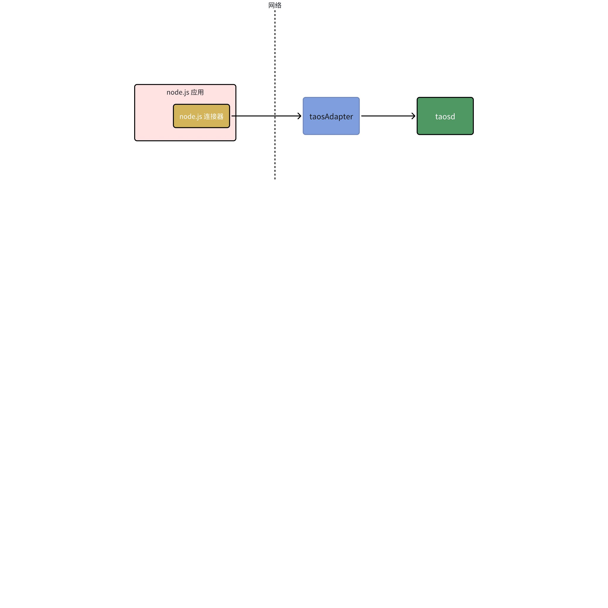
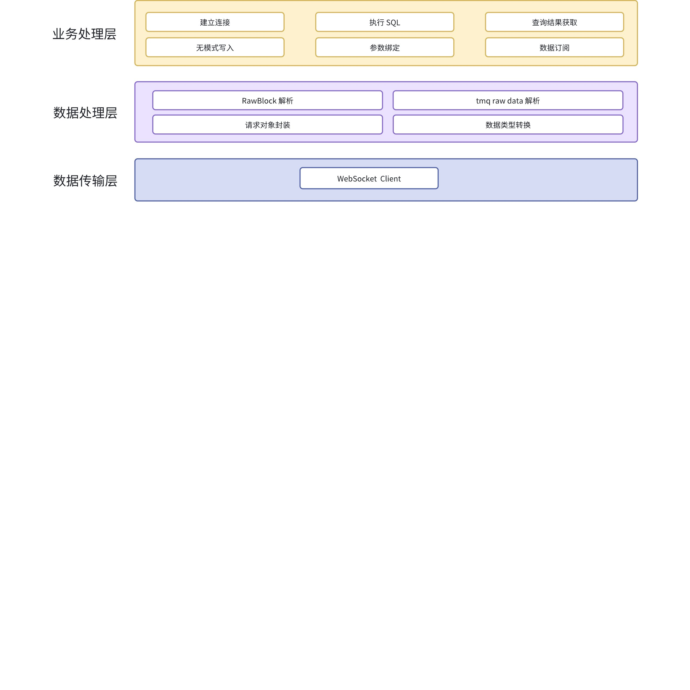
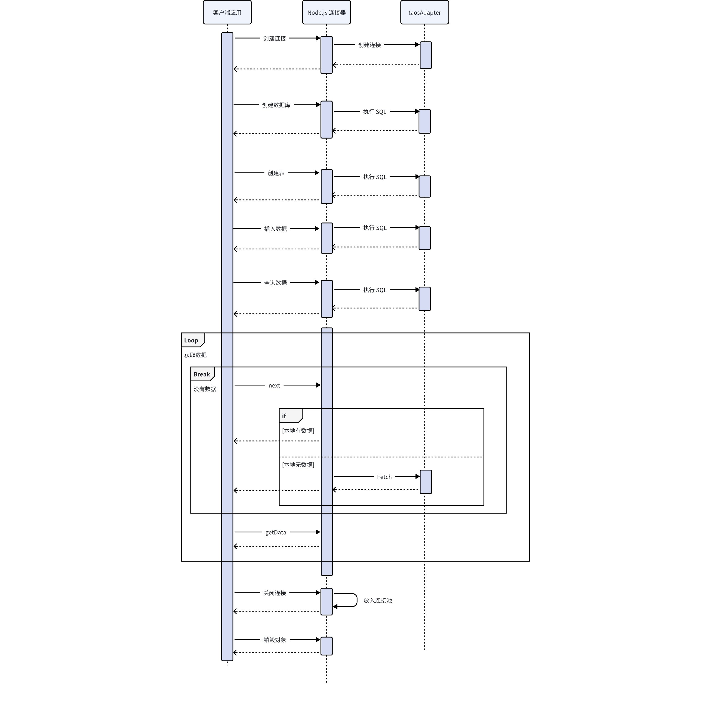
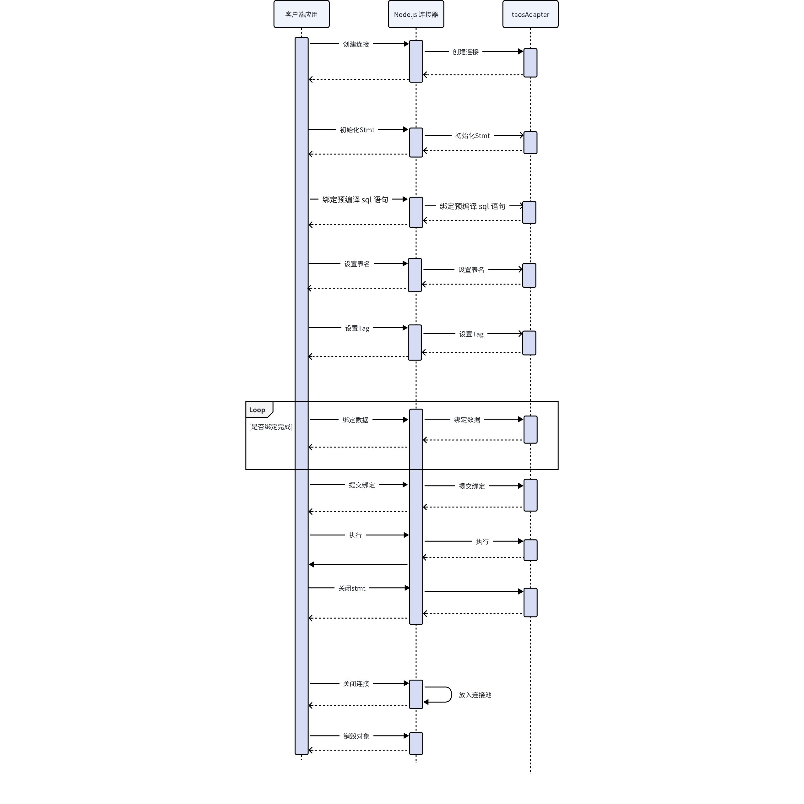
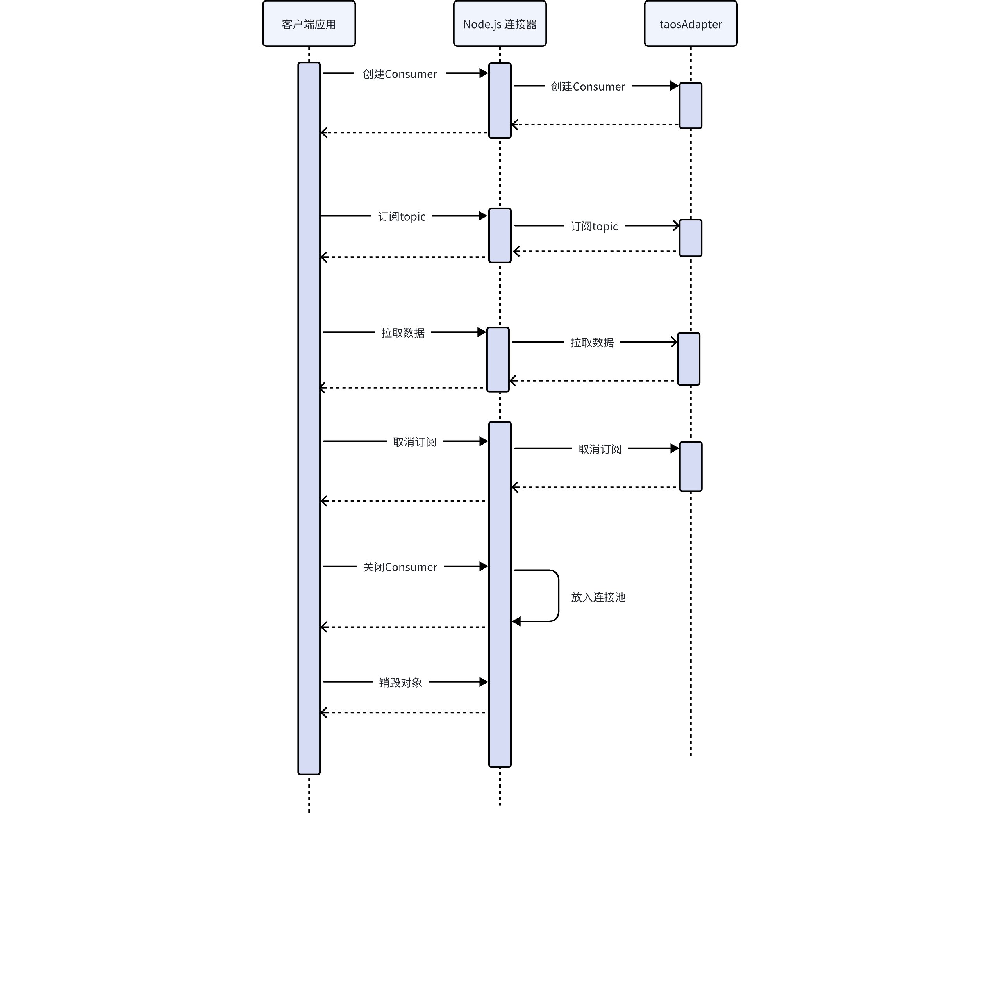

# Nodejs 连接器-Design Spec

## 1. 修订记录

| 编写日期 | 发布日期 | 版本 | 负责人 | 主要修改内容 |
| --- | --- | --- | --- | --- |
| 2025-01-06 | 2025-01-09 | 1.0 | 门世斌 | 创建 |
| 2026-01-20 | 2026-01-20 | 1.1 | 郭振伟 | 更新文档至 TDengine v3.4.0.0 版本。 |
| 2026-01-23 | 2026-01-23 | 1.2 | 霍琳贺 | 添加安全部分 |

## 2. 引言

1. 目的
  使用 Node.js 实现 TDengine 连接器，可以让 JavaScript 开发者轻松与 TDengine 进行交互。
1. 范围
  Node.js 连接器是一个为 JavaScript 开发者轻松与 TDengine 进行交互的桥接工具，主要用于：
  - 提供通过 SQL 写入和查询的相关接口。
  - 提供无模式写入的相关接口。
  - 提供参数绑定写入的相关接口
  - 提供数据订阅功能相关接口。
1. 受众
Node.js 前端开发者。

## 3. 术语

**无模式写入：**是指在写入数据时无需预先定义表结构，系统会根据数据自动创建或调整表结构的特性
**数据订阅：**允许客户端实时接收数据库中的数据变化，适用于实时监控场景；
**参数绑定：**是在 SQL 语句中使用占位符替代具体值的技术，可以防止 SQL 注入并提高性能
**WebSocket：** 是一种在单个 TCP 连接上提供全双工通信的协议。它允许客户端和服务器之间的双向实时通信，避免了 HTTP 请求-响应模型的限制。WebSocket协议的定义和规范是由 IETF（Internet Engineering Task Force）标准化的，其主要文档是 [RFC 6455](https://datatracker.ietf.org/doc/html/rfc6455)。
**FQDN：**全限定域名是互联网域名系统（DNS）中的一种完整的、唯一的域名表示形式，用于明确标识互联网上的特定主机或服务器。
**RFC3339：**RFC 3339 是一种时间和日期格式的标准，旨在规范化地表示时间和日期，以便在计算机系统之间传递和处理。

## 4. 概述

1. 架构：描述整体架，可能包括类图、组件图或系统的其他结构表示、


1. 技术：列出所使用的技术和框架
  - 开发语言：[TypeScript](https://www.typescriptlang.org/)
  - WebSocket 框架：websocket（https://www.npmjs.com/package/websocket?activeTab=readme）
  - 日志库：winston（https://www.npmjs.com/package/winston?activeTab=readme）
  - JSON 库：json-bigint（https://www.npmjs.com/package/json-bigint）
1. 依赖项：列出所有依赖项
  - Node.js 14 以上版本

## 5. 设计考虑



1. 假设和限制
  - **假设**：
    - taosAdapter 和 TDengine 实例已正确配置并能够稳定运行。
    - Node.js 应用系统运行在高可靠性的网络环境中。
  - **限制：**
      - TDengine 3.3.0.0 版本
      - Node.js 14.x.x 及以上版本
      - 浏览器支持 ES2020
      - Chrome：51 版起便可以支持 97% 的 ES2020 新特性。
      - Firefox：53 版起便可以支持 97% 的 ES2020 新特性。
      - Safari：10 版起便可以支持 99% 的 ES2020 新特性。
      - IE：Edge 15 可以支持 96% 的 ES2020 新特性。
      - Edge 14 可以支持 93% 的 ES2020 新特性。（IE7～11 基本不支持 ES6）
1. 设计模式和原则（例如 MVC、单例、工厂）
  模式：
  - 单例模式
  - 观察者模式
  - 回调模式
  原则：
  - **模块化设计**： 各功能模块分离，便于扩展和维护。
  - **接口隔离原则**： 各模块之间通过明确的接口交互，减少耦合。
  - **高内聚低耦合**： 各模块专注于自身的功能，减少对其他模块的依赖。
1. 风险和缓解措施：识别潜在风险和缓解策略。
  - 风险：由于查询结果大查询结果在内存缓存。
    - 缓解措施：使用分块传输分块返回结果，当前块的数据已被用户处理完成后，再获取下一块。
  - 风险：客户端创建连接过多，频繁创建和释放。
    - 缓解措施：
      使用连接池来管理连接数量，避免频繁创建和释放。

## 6. 详细设计 

### 6.1 执行 SQL

1. 组件设计：提供组件的详细描述
   - WsSql 组件：
      - 使用 WSConfig 配置参数调用 open 方法，进行初始化 WsSql 对象并创建连接。
      - 执行非查询 SQL 语句调用 exec 方法。
      - 调用 schemalessInsert 方法可以通过无模式协议进行数据写入。
      - 执行查询 SQL 语句调用 query 方法，并返回 WsRow 对象。
      - 使用完毕后需要调用 close 方法来关闭连接。
      - 程序退出后需要调用 *destroy 方法来释放资源。*
   - WsRow 组件：
      - 对于查询后的结果返回的 WsRow 对象可以调用 getMeta 方法获取 Meta 信息。
      - 通过循环调用 next 和 getData 方法可以遍历获取全部数据。
2. 列出系统中的关键数据结构
WSConfig：初始化配置信息
```typescript {wrap}
export class WSConfig {
    // 数据库用户名
    private _user: string | undefined | null;
    // 数据库密码
    private _password: string | undefined | null;
    // 数据库名称
    private _db: string | undefined | null;
    // 设置 taosAdapter 连接地址 url
    private _url: string;
    // 连接超时，单位毫秒
    private _timeout:number| undefined | null;
    // taosAdapter 认证token
    private _token:string | undefined | null;
}

```

无模式协议类型：
```typescript
export enum SchemalessProto {
    InfluxDBLineProtocol       = 1,
    OpenTSDBTelnetLineProtocol = 2,
    OpenTSDBJsonFormatProtocol = 3
}
```

时间精度：
```typescript
export enum Precision {
    NOT_CONFIGURED = '',
    // 小时
    HOURS = 'h',
    // 分钟
    MINUTES = 'm',
    // 秒
    SECONDS = 's',
    // 毫秒
    MILLI_SECONDS = 'ms',
    // 微秒
    MICRO_SECONDS = 'u',
    // 纳秒
    NANO_SECONDS = 'ns',
}
```


TDengineMeta：Meta 数据结构
```typescript {wrap}
export interface TDengineMeta {
    // 字段名
    name: string, 
    // 字段类型 
    type: string,
    // 字段长度
    length: number,
}
```

TaosResult：查询返回数据集
```typescript {wrap}
export class TaosResult {
    // 返回的meta信息
    private _meta: Array<ResponseMeta> | null;
    // 返回的数据
    private _data: Array<Array<any>> | null;
    // 时间精度
    private _precision: number | null | undefined;
    // 影响的条数
    protected _affectRows: number | null | undefined;
    // 总耗时
    private _totalTime = 0;
 }
```

1. 使用几种类型的图表来解释设计
  

  ## STMT
   - 组件设计：提供组件的详细描述
      - WsStmt 组件：
         - 调用 WsSql 对象的 initStmt 方法创建 stmt 对象。
         - 调用 prepare 方法绑定预编译 sql 语句。
         - 调用 setTableName 方法设置要写入的表。
         - 如果是自动建表需要调用 setTag 方法设置 Tag 的值。
         - 调用 bind 方法来对数据进行绑定。
         - 调用 addbatch 方法进行提交。
         - 调用 exec 方法执行写入。
         - 写入完成后调用 close 方法关闭 WsStmt 对象。
      - 列出系统中的关键数据结构
      请求参数：
      ```typescript
      export interface StmtMessageInfo {
          // action: init, prepare, set_table_name, set_tags, bind, add_batch, exec, close
          action: string;
          // 根据不同的 action 组装不同的请求体，以json 的方式发送
          args: StmtParamsInfo;
      }
      
      interface StmtParamsInfo {
          // 请求 request id
          req_id: number;
          // 此参数为action 为 prepare是必填
          sql?: string | undefined | null;
          // 此参数为 stmt 对象的id，除 init 外，其他为必填
          stmt_id?: number | undefined | null;
          // 此参数为action 为 set_table_name 是必填
          name?: string | undefined | null;
          // 此参数为action 为 set_tags 是必填
          tags?: Array<any> | undefined | null;
          // 此参数为action 为 bind 是必填
          paramArray?: Array<Array<any>> | undefined | null;
      }
      
      ```

      响应：
      ```typescript
      {
          req_id: number;
          stmt_id?: number | undefined | null;
      }
      ```

      绑定参数：
      ```sql
      export class StmtBindParams {
          setTinyInt(params :any[])
          setUTinyInt(params :any[])
          setSmallInt(params :any[])
          setUSmallInt(params :any[])
          setInt(params :any[])
          setUInt(params :any[])
          setBigint(params :any[])
          setUBigint(params :any[])
          setFloat(params :any[])
          setDouble(params :any[])
          setVarchar(params :any[])
          setBinary(params :any[])
          setNchar(params :any[])
          setJson(params :any[])
          setVarBinary(params :any[])
          setGeometry(params :any[])
          setTimestamp(params :any[])
       }
      ```

      - 使用几种类型的图表来解释设计
      

  ## TMQ
   - 组件设计：提供组件的详细描述
      - 调用 newConsumer 方法创建 WsConsumer 对象。
      - 调用 subscribe 方法订阅主题。
      - 调用 `poll` 方法进行数据拉取。
      - 拉取到的数据处理完成后，可以调用 `commit` 方法进行手工提交。
      - 订阅完成后 调用`unsubscribe`方法取消订阅。
      - 最后调用 close 方法关闭 consumer。
   - 列出系统中的关键数据结构
    TmqConfig: 初始化 Tmq 订阅的配置信息
    ```typescript {wrap}
    import { TMQConstants } from "./constant";
    
    export class TmqConfig {
        
        url: URL;
        // 数据库用户名
        user: string;
        // 数据库密码
        password: string;
        // 所在的 group
        group_id: string;
        // 客户端id
        client_id: string;
        // 来确定消费位置为最新数据（latest）还是包含旧数据（earliest）。
        offset_rest: string;
        // 订阅的主题
        topics?: Array<string>;
        // 是否自动提交
        auto_commit: boolean;
        // 自动提交间隔单位毫秒
        auto_commit_interval_ms: number;
        // 超时时间
        timeout:number;    
      
    }
    ```

    订阅支持的消息类型：
    ```typescript
    export class TMQMessageType {
        public static Subscribe: string = 'subscribe';
        public static Poll: string = 'poll';
        public static FetchRaw: string = 'fetch_raw';
        public static FetchJsonMeta: string = 'fetch_json_meta';
        public static Commit: string = 'commit';
        public static Unsubscribe: string = 'unsubscribe';
        public static GetTopicAssignment: string = 'assignment';
        public static Seek: string = 'seek';
        public static CommitOffset: string = 'commit_offset';
        public static Committed: string = 'committed';
        public static Position: string = 'position';
        public static ListTopics: string = "list_topics";
        public static ResDataType: number = 1;
    }
    ```

  TopicPartition: 
  ```typescript
  export class TopicPartition {
      // 订阅主题
      topic       :string;  
      // 消费组 ID，同一消费组共享消费进度
      vgroup_id   :number;
      // 消费偏移
      offset      ?:number;
      // 消息开始的偏移
      begin       ?:number;
      // 当前消息结束的偏移
      end         ?:number;
  }
  ```

   - 使用几种类型的图表来解释设计
    


## 7. 接口规范

请参考[Nodejs 连接器-Function Spec - 门世斌](https://taosdata.feishu.cn/wiki/N7qQwyKDViKVfokO0ZMcuPOunmf)

## 8. 安全考虑

1. 客户端和数据库交互时， 必须确保用户名密码或 Token 正确。
2. 可采用加密通道（WSS）进行通信，防止明文数据传输带来的安全风险。
3. 进行资源限制，防止资源用尽。
   - 支持请求超时（timeout 参数）。

## 9. 性能和可扩展性

无。

## 10. 部署和配置

使用 npm 安装 Node.js 连接器。
```plaintext
npm install @tdengine/websocket
```

## 11. 监控和维护

维护：持续维护 Node.js 连接器，有需求或者问题修复都会发布新版本。

## 12. 参考资料

1. [Nodejs 连接器-Requirement Spec](https://taosdata.feishu.cn/wiki/QGjRwhzlPislLfkgW4dcjL0Nn9e)
2. [Nodejs 连接器-Function Spec](https://taosdata.feishu.cn/wiki/N7qQwyKDViKVfokO0ZMcuPOunmf)
