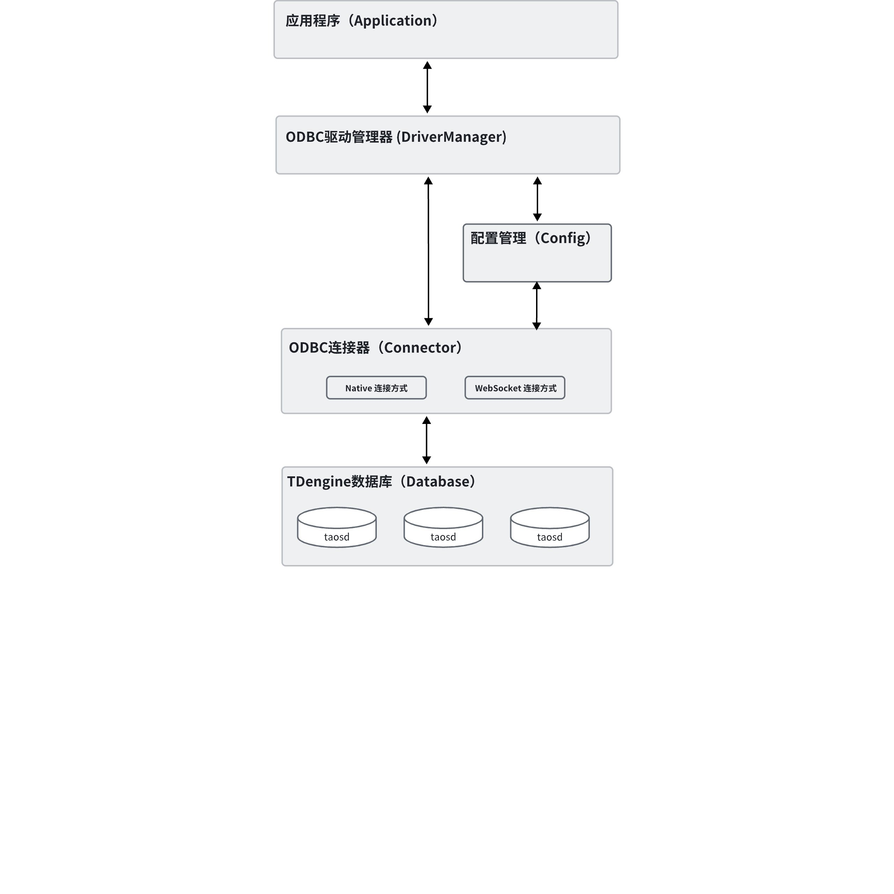
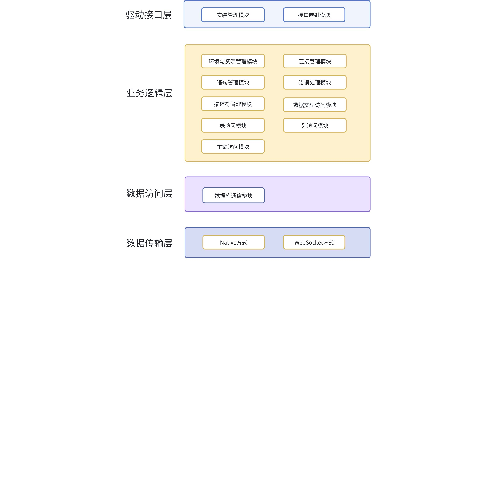
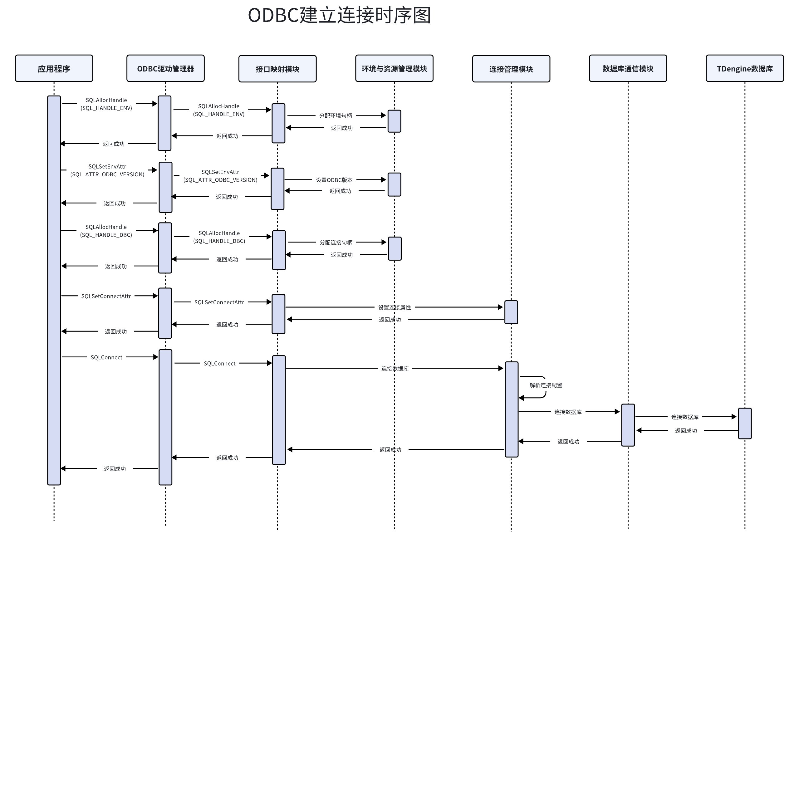
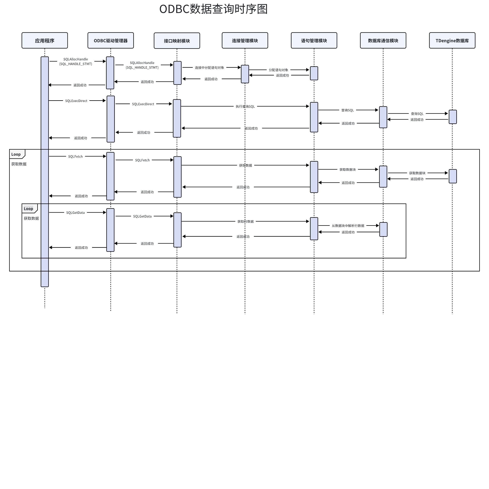
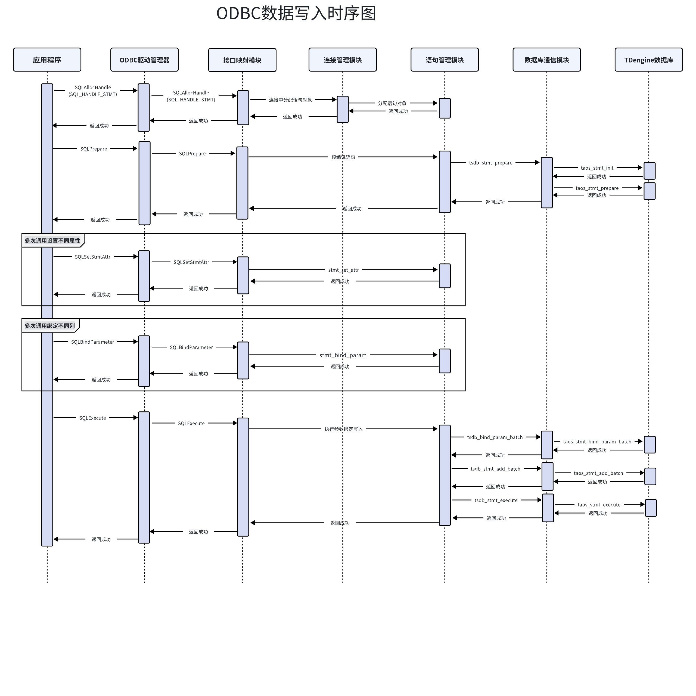

# ODBC 连接器-Design Spec

## 1. 修订记录

| 编写日期 | 发布日期 | 版本 | 修订人 | 主要修改内容 |
| --- | --- | --- | --- | --- |
| 2025-01-16 | 2025-01-16 | 1.0 | 裴亚明 | 创建文档 |
| 2025-12-18 | 2025-12-18 | 1.1 | 裴亚明 | 完善设计内容，补充安全设计内容 |
| 2025-12-19 | 2025-12-19 | 1.2 | 霍琳贺 | 完善安全考虑部分 |

## 2. 引言

### 2.1 目的

本设计文档的目的是详细描述TDengine数据库ODBC连接器的设计理念、架构和技术实现细节，以确保开发团队在实现过程中有明确的指导方针。文档将作为开发人员、测试人员和维护团队的技术参考手册，帮助他们理解如何构建一个既符合ODBC标准又充分利用TDengine特性的连接器。此外，它还将为潜在用户和合作伙伴提供透明度，以便他们评估该连接器是否满足其应用需求。
请注意：除非另有特别说明，本文中提及的ODBC连接器将统一视为ODBC驱动，这是遵循ODBC标准中的术语（即Driver）。例如，DM代表驱动管理器。然而，在涛思内部，我们更倾向于使用“连接器”这一称呼。

### 2.2 范围

本设计文档涵盖以下范围：
1. **ODBC规范兼容性**：定义了连接器如何遵循ODBC 3.x规范，包括但不限于数据库连接、SQL语句执行、结果集处理等方面。
2. **TDengine特性支持**：描述了哪些TDengine特有的功能（如数据库连接的多种方式、批量插入优化等）将通过ODBC接口暴露给应用程序。
3. **性能优化**：讨论了为保证最佳性能所采取的措施，比如参数绑定的使用、查询优化建议等。
4. **易用性设计**：强调了连接器的安装配置过程以及API的友好性，旨在降低开发者的学习曲线。
5. **安全性考量**：涵盖了安全编码实践、数据传输加密机制等内容，以保护敏感信息。
6. **测试与验证**：概述了测试策略、自动化测试框架的使用以及如何确保连接器的质量。

### 2.3 受众

本设计文档的目标受众包括但不限于以下几类人员：
1. **开发人员**：参与ODBC连接器开发的工程师，需要深入理解系统内部工作原理和具体实现方法。
2. **测试工程师**：负责对ODBC驱动进行全面测试的专业人士，需要了解测试的重点领域和预期行为。
3. **技术支持团队**：为使用ODBC驱动的客户提供问题解答和技术支持的成员，需要掌握常见问题及其解决方案。
4. **最终用户**：计划在其应用程序中集成TDengine ODBC驱动的企业级用户或个人开发者，他们关心的是驱动的功能完整性、稳定性和性能表现。
5. **合作伙伴**：考虑将TDengine ODBC驱动整合进自己产品的第三方厂商，他们希望评估该驱动能否满足自身产品的需求。

## 3. 术语

1. **ODBC (Open Database Connectivity)：** 是一种开放式的标准应用程序编程接口（API），它为程序、脚本和商务智能工具提供了一种访问各种数据库管理系统（DBMS）的方法。ODBC 的设计是为了让 SQL 语句可以通过几乎任何编程语言在多个平台上执行，从而使得开发者可以编写不依赖于特定数据库的应用程序。
2. **DSN (Data Source Name)：**数据源名称是一个标识符，用来指代一个特定的数据库配置，其中包括了连接到该数据库所需的全部信息，例如服务器地址、数据库名称、认证凭据等。DSN 可以是系统 DSN（供所有用户使用）或用户 DSN（仅限当前用户），或者是文件 DSN（保存在文件中）。
3. **ARD (Application Row Description)：**是 ODBC 中描述应用程序绑定缓冲区中行的数据类型和其他属性的信息集合。当应用程序使用列绑定来检索数据时，ARD 包含了关于每一列的信息，例如数据类型、大小和精度等。这些信息帮助应用程序正确地解释从数据库返回的数据。
4. **IRD (Implementation Row Description)：** 包含了由驱动程序提供的关于结果集中每一列的元数据信息。与 ARD 相比，IRD 更侧重于反映实际数据库中的数据格式和结构。
5. **APD (Application Parameter Description)：**描述了应用程序用于准备和执行 SQL 语句时所使用的参数。APD 包含了每个参数的数据类型、大小和其他相关信息，这对于确保 SQL 语句正确地传递给数据库是必要的。
6. **IPD (Implementation Parameter Description)：**提供了由驱动程序定义的有关 SQL 语句参数的信息。它包含了关于如何将应用程序提供的参数值转换为适合数据库的形式的细节。IPD 对于支持预编译 SQL 语句和参数化查询非常重要。
7. **参数绑定(Parameter Binding)：**在 SQL 语句中使用占位符替代具体值的技术，以防止 SQL 注入并提升查询性能。通过将参数值与 SQL 代码分离，确保安全性，并允许数据库预编译语句，减少执行时间。
8. **Native：**指的是直接利用TDengine提供的C语言客户端库进行数据库交互。这种方式提供最底层、最高效的API调用，支持所有TDengine特性，适合追求性能和灵活性的应用开发，允许开发者直接在应用中嵌入TDengine功能，实现数据的快速读写与处理。
9. **WebSocket：**是一种基于 TCP 的全双工通信协议，支持服务器与客户端之间实时、双向的数据传输。它提供了一个持久连接，使得数据可以即时推送，而无需像 HTTP 那样每次交互都建立新连接。
10. **TSDB(TimeStamp DataBase)：**时序数据库，时序数据库（TSDB）是专为存储、管理和查询时间序列数据优化的数据库系统。

## 4. 概述

### 4.1 ODBC连接器的应用场景架构图



- 应用程序 (Appication):
  - 发起数据库操作请求的应用程序。它通过调用ODBC API来与后端TDengine数据库进行交互。
- ODBC驱动管理器 (DM):
  - 它位于应用程序和ODBC连接器之间，负责加载适当的驱动程序，并处理应用程序与驱动程序之间的通信。此外，ODBC驱动管理器还与配置模块进行交互，以获取必要的连接参数和其他设置。
  - 在Windows系统中，ODBC驱动管理器会访问注册表 (Registry)来读取数据源名称（DSN）等配置信息。而在Linux系统中，则是通过解析文本格式的配置文件，如odbc.ini或/etc/odbcinst.ini等来实现类似的功能。
- 配置模块 (Config):
  - 根据操作系统的不同，配置信息存储的位置也有所区别。在Windows上，配置信息通常保存在注册表中；而在Linux等类Unix系统中，这些信息则可能保存在文本配置文件中，例如：
    - 对于全局配置，可以在/etc/odbc.ini或/etc/odbcinst.ini中找到。
    - 对于用户级别的配置，可以在用户的主目录下的隐藏文件中，如~/.odbc.ini。
- ODBC连接器 (Connector):
  - 实现了ODBC API到TDengine数据库的连接、读取、写入等功能的映射。支持两种不同的连接方式：
    - Native: 使用TDengine C客户端库通过TCP/IP直接连接到数据库。
    - WebSocket: 通过HTTP/WebSocket协议，使用Rust编写的连接器来连接TDengine。
- TDengine 数据库 (Database):
  - 最终的数据存储层，提供对数据的管理和访问。它能够接收来自ODBC连接器的命令，并返回相应的结果集给应用层。

### 4.2 ODBC模块组成图



- 驱动结构层
  - 安装管理模块：安装管理模块负责提供用户界面（UI）来配置数据源名称（DSN）。它允许用户添加、编辑或移除与TDengine数据库的连接设置。
  - 接口映射模块：作为最上层接口直接与应用程序交互，提供标准ODBC API接口，确保应用程序能够以统一的方式访问底层数据库。它还负责初步解析和验证输入参数，然后将请求传递给业务逻辑层。
- 业务逻辑层
  - 环境与资源管理模块:环境与资源管理模用于管理全局资源和配置；初始化和销毁ODBC环境，确保线程安全；设置和获取环境级别的属性，影响所有通过此环境建立的连接；提供诊断信息，帮助开发者理解ODBC操作的结果。
  - 连接管理模块：连接管理模块是用于管理和操作数据库连接的组件，它遵循ODBC标准接口。该模块提供了创建、配置、初始化、销毁数据库连接的功能，并支持诊断信息获取、属性设置与获取等高级特性。
  - 语句管理模块：语句管理模块在ODBC连接器中负责处理与SQL语句（Statement）相关的所有操作。本模块实现了ODBC API中涉及的SQL语句执行、结果集管理、参数绑定等功能，是ODBC驱动程序的核心部分之一。
  - 错误处理模块：错误处理模块主要负责管理和处理错误信息。它实现了错误记录的初始化、添加、清除以及释放等功能，并且提供了获取诊断记录（Diagnostic Records）和诊断字段（Diagnostic Fields）的方法。
  - 描述符管理模块：描述符管理模块主要负责管理和操作ODBC中的描述符（Descriptor）。描述符用于定义和控制数据传输的格式，它们包含有关结果集、参数或返回值的信息。此模块实现了描述符的创建、初始化、释放以及与描述符相关的各种操作。
  - 数据类型访问模块：数据类型访问模块负责管理和提供有关数据库支持的数据类型的信息。它定义的数据类型反映了TDengine所支持的数据类型的详细信息，并且该模块确保这些类型能够以符合ODBC标准的方式被外部应用识别和使用。
  - 表访问模块：表访问模块主要是从数据库中获取关于表、视图和其他类似对象的元数据信息。它为应用程序提供了一种方式来查询和过滤这些对象的信息，以便开发者能够更好地理解数据库结构并据此构建应用逻辑。
  - 列访问模块：列数据访问模块负责处理与数据库表中列（字段）相关的元数据查询，在应用程序请求有关数据库表中列的信息时，与底层的TDengine数据库交互，提取所需的数据，并按照ODBC标准格式化后返回给应用程序。
  - 主键访问模块：主键访问模块负责处理数据库中主键相关的元数据查询，在应用程序请求有关数据库表中主键的信息时，与底层的TDengine数据库交互，提取所需的数据，并按照ODBC标准格式化后返回给应用程序。
- 数据访问层
  - 数据库通信模块：数据库通信模块负责处理与TDengine数据库通信的核心功能，包括SQL语句的准备、执行、参数描述、结果集处理、生命周期管理等操作。将应用程序发出的SQL命令转换成TDengine数据库可以理解的形式，并处理返回的数据。
- 数据传输层
  - ODBC连接器支持Native和WebSocket两种方式与TDengine通信，Native方式是TDengine数据库提供的原生C语言接口，WebSocket方式是通过Rust连接器基于 TCP 的全双工通信协议，更多细节可以参考Rust连接器的文档。

### 4.3 技术

- 开发语言：C语言（C11标准）
- 系统构建工具：cmake 3.16.3 或以上

### 4.4 依赖项

- 词法分析器生成器：flex 2.6.4 或以上
- 语法分析器生成器：bison, 3.5.1 或以上
- ODBC 驱动管理器：Windows平台上ODBC驱动管理器已经预装

## 5. 设计考虑

1. 假设和限制
  - **假设**:
    - taosAdapter 和 TDengine 实例已正确配置并能够稳定运行。
    - 使用ODBC驱动的应用系统运行在高可靠性的网络环境中。
  - **限制：**
    - 本版本ODBC驱动暂不支持TDengine的数据订阅、无模式写入等特性。
1. 设计模式和原则
  模式：
  - 分层设计
  - 注册回调
  - 单例模式
  原则：
  - **模块化设计**: 各功能模块分离，便于扩展和维护。
  - **接口隔离原则**: 各模块之间通过明确的接口交互，减少耦合。
  - **高内聚低耦合**: 各模块专注于自身的功能，减少对其他模块的依赖。
1. 风险和缓解措施：识别潜在风险和缓解策略。
  - 风险：当查询结果数据量较大时，如果直接将整个结果集加载到内存中进行缓存，可能会导致内存资源耗尽的风险。这是因为大型数据集会占用大量的内存空间，一旦内存资源被耗尽，系统可能会变得非常缓慢，甚至崩溃，从而影响用户体验和系统的稳定性。
    - 缓解措施：为了降低内存耗尽的风险，我们可以采用分块传输接口来将查询结果集数据分块返回。这种方法的核心思想是将大型数据集分割成多个较小的数据块，并逐个返回给用户。用户可以在处理完当前数据块后，再请求下一个数据块，从而避免了一次性加载整个数据集导致的内存压力。

## 6. 详细设计 

### 6.1 组件设计：提供组件的详细描述

#### 6.1.1 安装管理模块

安装管理模块负责提供用户界面（UI）来配置数据源名称（DSN）。它允许用户添加、编辑或移除与TDengine数据库的连接设置。它提供了以下功能：
- 对话框处理：
SetupDlg 函数作为对话框回调函数，处理所有的窗口消息，如初始化对话框 (WM_INITDIALOG)、命令按钮点击 (WM_COMMAND) 等。
- DSN管理：
  - doDSNAdd：用于创建新的DSN配置。
  - doDSNConfig：用于编辑已有的DSN配置。
  - doDSNRemove：用于删除指定的DSN配置。
- 配置操作：
  - doConfigDSN 函数根据传入的操作请求类型调用相应的DSN管理函数。
  - 入口点实现：提供了ODBC安装程序API的实现，例如 ConfigDSN，它是ODBC驱动配置的实际入口点，根据用户的请求（添加、配置或移除DSN）调用对应的内部处理函数。
本模块位于ODBC连接器的最上层，作为用户与驱动之间的一个图形界面交互层。它实现了ODBC安装程序API的一部分，特别是针对DSN的增删改操作。当用户通过ODBC数据源管理工具（如Windows的“ODBC Data Sources”控制面板项）选择配置TDengine ODBC驱动时，就会调用这个模块的功能。
本模块不直接参与SQL的执行逻辑，而是专注于确保ODBC驱动能够按照用户的设定正确地连接到TDengine数据库。它通过读取和写入系统配置文件（如Odbc.ini）或者注册表来保存配置信息，为后续建立连接提供必要的参数。作为用户配置界面与底层连接逻辑之间的桥梁，确保用户能够方便地管理和调整他们的数据库连接设置。

#### 6.1.2 接口映射模块

接口映射模块设计简洁，主要用于统一入口控制，负责将标准ODBC API精准映射到业务逻辑层的对应函数。此外，在调试模式下，该模块能够自动输出函数调用前后的参数及结果，便于问题追踪与分析。

#### 6.1.3 环境和资源管理模块

环境与资源管理模用于管理全局资源和配置；初始化和销毁ODBC环境，确保线程安全；设置和获取环境级别的属性，影响所有通过此环境建立的连接；提供诊断信息，帮助开发者理解ODBC操作的结果。以下是模块功能的描述：
- 初始化与清理：
_init_once()函数用于确保TDengine C库仅初始化一次，并注册了一个退出程序来调用清理函数。
- 环境管理：
提供了创建、引用计数增加/减少、释放环境对象(env_t)的方法。
env_create()和env_free()分别用于创建新的环境实例和释放不再需要的环境实例。
引用计数机制允许共享环境实例，直到所有引用都被解除才会真正释放资源。
- 事务处理：
实现了提交(_env_commit())和回滚(_env_rollback())事务的基本框架，因为TDengine数据库不支持事务，这些操作并未实际执行任何动作，而是记录警告或错误信息。
- 属性设置与获取：
支持设置和获取ODBC环境级别的属性，如ODBC版本、连接池匹配策略等。
对于不支持或未实现的功能，提供了默认行为并记录相应的警告信息。
- 诊断信息：
提供了获取诊断记录和字段的接口，以便应用程序可以检索最后操作的状态和错误信息。
- 字符集转换：
包含一个字符集转换函数env_conv()，它使用iconv进行字符编码转换，主要用于处理不同编码之间的数据转换问题。

#### 6.1.4 连接管理模块

连接管理模块是用于管理和操作数据库连接的组件，它遵循ODBC标准接口。该模块提供了创建、配置、初始化、销毁数据库连接的功能，并支持诊断信息获取、属性设置与获取等高级特性。以下是模块功能的描述：
- 连接资源管理
创建和释放：通过conn_create函数创建新的连接实例，并通过conn_free释放不再需要的连接资源。
引用计数：conn_ref和conn_unref用于增加或减少连接对象的引用计数，确保只有在没有活跃引用时才释放连接。
断开连接：conn_disconnect负责关闭当前连接。
- 连接建立与配置
驱动连接：conn_driver_connect函数用于使用输入的连接字符串来建立连接，同时填充输出的连接字符串。
直接连接：conn_connect提供了一个更直接的方式通过服务器名、用户名和认证信息建立连接。
分配语句和描述符：conn_alloc_stmt和conn_alloc_desc分别用于分配新的语句句柄和描述符句柄。
- 信息查询
诊断记录：conn_get_diag_rec用于获取错误或警告信息的诊断记录。
连接信息：conn_get_info可以用来查询关于连接的各种信息项，例如数据库版本、驱动名称等。
字符集信息：用专门的函数如conn_get_sqlc_charset来获取不同场景下的字符集编码。
- 事务管理
结束事务：conn_end_tran用于提交或回滚事务，因TDengine不支持事务，因此仅实现框架。
- 属性管理
设置和获取属性：conn_set_attr和conn_get_attr允许设置和读取连接级别的属性。
- 其他特性
浏览器连接：conn_browse_connect可能实现了一种交互式的连接方式，让用户选择连接参数。返回错误信息，本版本暂不支持该特性。
本地SQL转换：conn_native_sql是将标准SQL语句转换为TDengine数据库系统的原生SQL语法。返回错误信息，本版本暂不支持该特性。

#### 6.1.5 错误处理模块

错误处理模块主要负责管理和处理错误信息。它实现了错误记录的初始化、添加、清除以及释放等功能，并且提供了获取诊断记录（Diagnostic Records）和诊断字段（Diagnostic Fields）的方法。以下是该模块的功能描述：
- 初始化错误记录
errs_init：用于初始化一个错误集合（errs_t），设置其内部列表为空，并将错误计数器置为0。
- 添加错误信息
errs_append_x 和宏定义 errs_append：这些函数允许在发生错误时向错误集合中添加新的错误条目。它们记录了错误发生的文件名、行号、函数名、SQL状态码、错误代码以及错误描述等信息。
errs_append_format：提供格式化字符串的能力，使得可以构建更复杂的错误消息。
errs_oom 和 errs_niy：用于快速记录内存分配失败或未实现的功能类型的预定义错误。
- 清除和释放错误记录
errs_clr_x 和宏定义 errs_clr：清空当前错误集合中的所有错误条目，并将它们重置到可重用的状态。
errs_release_x 和宏定义 errs_release：彻底释放错误集合中所有的资源，包括已分配的错误对象，确保没有内存泄漏。
- 获取诊断记录
errs_get_diag_rec_x 和宏定义 errs_get_diag_rec：按照ODBC标准，从错误集合中检索特定编号的诊断记录。这包括返回SQL状态码、本地错误代码和错误消息文本等内容。如果请求的记录不存在，则返回SQL_NO_DATA。
- 获取诊断字段
errs_get_diag_field_sqlstate_x 和宏定义 errs_get_diag_field_sqlstate：专门用于获取与特定诊断记录相关的SQL状态码。
errs_get_diag_field_class_origin_x 和宏定义 errs_get_diag_field_class_origin：用于确定错误分类的来源（例如ISO 9075或ODBC 3.0）。
errs_get_diag_field_subclass_origin_x 和宏定义 errs_get_diag_field_subclass_origin：提供子类别的来源信息。
- 内部实现细节
错误数据结构 (err_t)：每个错误实例都存储在一个链表节点中，包含错误代码、SQL状态码、详细的错误描述以及其他辅助信息。
双链表 (tod_list) 的使用：为了高效地管理错误条目的添加、删除和遍历，采用了双向链表的数据结构来组织错误集合。
本模块确保了应用程序能够正确地接收和理解来自数据库操作的任何问题反馈，从而帮助开发者定位和解决问题。此外，通过遵循ODBC标准接口，它还保证了与其他ODBC兼容的应用程序的良好互操作性。

#### 6.1.6 语句管理模块

本模块在ODBC连接器中负责处理与SQL语句（Statement）相关的所有操作。本模块实现了ODBC API中涉及的SQL语句执行、结果集管理、参数绑定等功能，是ODBC驱动程序的核心部分之一。本模块的主要功能如下：
- 语句对象管理：
创建 (stmt_create) 和销毁 (stmt_free) SQL语句对象。
引用计数管理 (stmt_ref, stmt_unref) 以确保资源正确释放。
- 描述符访问：
获取应用程序参数描述符 (APD) 和实现参数描述符 (IPD) (stmt_APD, stmt_IPD)。
- SQL语句执行：
直接执行SQL语句 (stmt_exec_direct)。
准备SQL语句 (stmt_prepare)。
执行已准备好的SQL语句 (stmt_execute)。
- 结果集处理：
获取受影响的行数 (stmt_get_row_count) 和列数 (stmt_get_col_count)。
描述结果集中的列信息 (stmt_describe_col)。
绑定结果集到应用程序变量 (stmt_bind_col)。
从结果集中获取数据行 (stmt_fetch, stmt_fetch_scroll)。
获取单个字段的数据 (stmt_get_data)。
- 参数处理：
获取参数数量 (stmt_get_num_params)。
描述参数属性 (stmt_describe_param)。
绑定参数值到SQL语句 (stmt_bind_param)。
- 语句诊断信息：
获取诊断记录 (stmt_get_diag_rec) 和诊断字段 (stmt_get_diag_field)。
- 属性设置与获取：
设置 (stmt_set_attr) 和获取 (stmt_get_attr) 语句级别的属性。
- 游标操作：
关闭游标 (stmt_close_cursor)。
设置和获取游标名称 (stmt_set_cursor_name, stmt_get_cursor_name)。
- 元数据查询：
查询表 (stmt_tables)、列 (stmt_columns)、主键 (stmt_primary_keys)、外键 (stmt_foreign_keys) 等数据库结构信息。
查询存储过程及其参数 (stmt_procedures, stmt_procedure_columns)。
获取类型信息 (stmt_get_type_info)。
- 其他操作：
执行批量操作 (stmt_bulk_operations)。
完成异步操作 (stmt_complete_async)。
特殊列查询 (stmt_special_columns) 和统计信息 (stmt_statistics)。
表权限 (stmt_table_privileges) 和列权限 (stmt_column_privileges)。
本模块位于ODBC连接器的核心层，负责直接与数据库通信并执行SQL命令。它向上提供了符合ODBC标准的接口给上层的应用程序或工具使用，向下则通过特定的数据库API与TDengine数据库进行交互。因此，它是连接用户应用与数据库服务器之间的桥梁，确保了ODBC兼容性的同时也实现了对TDengine数据库特性的支持。

#### 6.1.7 描述符管理模块

描述符管理模块主要负责管理和操作ODBC中的描述符（Descriptor）。描述符用于定义和控制数据传输的格式，它们包含有关结果集、参数或返回值的信息。此模块实现了描述符的创建、初始化、释放以及与描述符相关的各种操作，如绑定列、获取诊断信息等。使得应用程序可以有效地管理和操作描述符，从而更好地控制SQL查询的结果集和参数传递过程。
- 创建与初始化：
  - 通过desc_create函数创建新的描述符实例，并调用_desc_init进行必要的初始化工作，包括设置引用计数、连接对象引用及错误处理机制。
- 引用计数管理：
  - 提供desc_ref和desc_unref来增加或减少描述符的引用计数，确保当不再需要描述符时可以安全地释放资源。
- 内存分配与释放：
  - 实现动态调整描述符记录数组大小的功能，以适应不同的查询需求；同时，提供了descriptor_release方法用于清理描述符持有的所有资源。
- 绑定列数据：
  - descriptor_bind_col函数允许应用程序将应用程序变量绑定到描述符中的特定列上，以便在执行SQL语句后能够直接从这些变量中读取数据。
- 解除绑定：
  - 如果传入NULL作为目标指针，则会调用_unbind_col来解除对应列的绑定状态。
- 错误处理：
  - 为每个描述符关联了一个错误队列，可以通过desc_append_err_format等函数添加错误信息，并且提供了接口让用户可以检索这些错误（例如desc_get_diag_rec）。
- 诊断信息：
  - 支持获取描述符相关的诊断记录和字段信息，这有助于调试和理解ODBC操作期间发生的问题。
描述符管理模块其作用是在应用程序请求分配描述符句柄（通过SQLAllocHandle函数并指定类型为SQL_HANDLE_DESC）时，创建相应的描述符对象并与之交互。
- 上层：应用程序通过ODBC API调用SQLAllocHandle来请求一个新的描述符句柄。
- 本层：描述符管理模块接收到请求后，负责实际创建描述符实例，并对其进行适当的初始化。此外，还提供了其他API供应用程序对描述符进行配置和使用，比如绑定输出参数或获取诊断信息。
- 下层：虽然描述符本身并不直接与数据库通信，但它间接影响了如何解析和处理来自数据库的数据，因为它定义了应用程序期望接收的数据格式。

#### 6.1.8 数据类型访问模块

数据类型访问模块负责管理和提供有关数据库支持的数据类型的信息。它定义的数据类型反映了TDengine所支持的数据类型的详细信息，并且该模块确保这些类型能够以符合ODBC标准的方式被外部应用识别和使用。此外，该模块还处理了结果集的构建、行遍历、数据获取等功能，以确保类型信息查询的顺利进行。本模块的主要功能如下：
- 获取列字段定义
_get_col_fields()：函数返回描述结果集中各列（即数据类型属性）的字段定义。这使得应用程序可以了解每一列的名称、类型及长度等信息。
- 类型信息的行遍历
_fetch_row()：用于逐行读取类型信息记录。它会跳过不符合指定data_type条件的记录，并更新内部位置计数器(pos)以指向下一个待读取的记录。如果所有记录都已读取完毕，则返回SQL_NO_DATA。
- 结果集处理
_more_results()：当前实现总是返回SQL_NO_DATA，表明没有更多的结果集可用。这意味着一次调用只能返回一个结果集。
_get_data()：根据列号或参数编号填充tsdb_data_t结构体，以便将数据传递给应用程序。它处理了多种情况，包括字符串和整数值，并正确设置了空值标志。
- 初始化和打开
typesinfo_init()：初始化类型信息对象，并设置其方法指针表，使其能够响应各种ODBC API调用。
typesinfo_open()：重置类型信息对象的状态，并设置所请求的数据类型标识符(DataType)，为后续的操作做好准备。
- 流程示例
应用程序调用 SQLGetTypeInfo，这是ODBC标准API之一，用于获取有关特定数据类型的信息。连接器内部调用 stmt_get_type_info 来处理这一请求。这通常涉及到创建一个新的语句对象，专门用于执行类型信息查询。
进一步调用 typesinfo_open 函数来初始化类型信息对象，并指定所需的数据类型。这一步骤确保了只有符合要求的数据类型会被考虑。当应用程序开始提取结果时，驱动程序将通过上述定义的方法（如_get_col_fields和_fetch_row）来构建和遍历结果集，最终将类型信息呈现给用户。

#### 6.1.9 表访问模块

表访问模块主要是从数据库中获取关于表、视图和其他类似对象的元数据信息。它为应用程序提供了一种方式来查询和过滤这些对象的信息，以便开发者能够更好地理解数据库结构并据此构建应用逻辑。本模块的主要功能如下：
- 资源管理：
  - 提供了初始化、重置和释放与表元数据相关的资源的方法，确保了内存的有效使用和避免泄露。
- 查询准备与执行：
  - 实现了对不同类型的元数据（如目录、模式、表类型）的查询准备和执行逻辑。这包括构建适当的SQL语句以及处理可能的字符集转换问题。
- 结果集操作：
  - 定义了如何获取列字段定义、遍历结果集中的行、描述参数等，从而允许应用程序以结构化的方式访问查询结果。
- 模式匹配与过滤：
  - 支持基于通配符的模式匹配，使用户可以指定特定的目录名、模式名、表名或表类型来进行更精确的结果筛选。
- 表类型解析：
  - 将用户提供的表类型字符串解析成内部使用的格式，并根据需要进行相应的字符集转换。
- 统一接口：
  - 通过实现一系列标准的ODBC API方法（如prepare、execute、fetch_row等），使得该模块可以作为一个通用组件被不同的ODBC函数调用。
在ODBC连接器架构中，表访问模块位于应用程序与数据库之间，充当两者之间的桥梁。它不仅简化了应用程序获取数据库元数据的过程，还保证了这一过程的安全性和效率。通过提供一组标准化的方法和接口，它增强了ODBC连接器的灵活性和兼容性，使其能够适应各种不同的应用场景和需求。当应用程序调用SQLTables或其他类似的API来请求有关数据库内表结构的信息时，ODBC连接器会调用tables_open函数，进而触发整个表访问模块的工作流程。这个过程通常涉及以下几个步骤：
- 参数检查与预处理：首先对传入的参数（如CatalogName、SchemaName、TableName和TableType）进行验证和必要的预处理，比如计算字符串长度、确定是否为特殊值（如SQL_ALL_CATALOGS）等。
- 选择合适的查询逻辑：根据输入参数决定执行哪种类型的查询（例如，仅列出所有目录、仅列出所有模式、仅列出所有表类型，还是根据给定条件组合查询具体的表信息）。
- 构造SQL语句并执行：构建一个符合要求的SQL查询语句，并通过底层数据库连接对象执行该查询。在此过程中，还需要考虑BI模式下的特殊需求，如排除系统表等。
- 处理查询结果：一旦查询成功执行，tables模块会负责解析返回的数据，将其组织成应用程序期望的格式，并通过ODBC API返回给调用者。
- 清理工作：无论查询是否成功，最后都会执行必要的清理工作，如释放临时分配的资源，确保模块处于干净的状态以备下次调用。

#### 6.1.10 列访问模块

列数据访问模块负责处理与数据库表中列（字段）相关的元数据查询，在应用程序请求有关数据库表中列的信息时，与底层的TDengine数据库交互，提取所需的数据，并按照ODBC标准格式化后返回给应用程序，它使得应用程序能够透明地访问数据库中的列信息，而无需关心底层数据库的具体实现细节。本模块的主要功能如下：
- 资源管理
  - 初始化：通过columns_init函数初始化columns_t结构体，并为各个API方法设置相应的处理函数。
  - 重置与释放：提供了columns_reset和columns_release函数来重置或释放与列元数据相关的资源，确保了内存的有效使用和避免泄露。
- 查询准备与执行
  - 查询构建：实现了对列元数据的查询准备逻辑，包括构建适当的SQL语句（如DESC命令）以获取列信息，以及处理可能的字符集转换问题。
  - 执行查询：通过_fetch_and_desc_next_table等函数实现查询的执行逻辑，确保能够正确地从数据库中提取所需的信息。
- 结果集操作
  - 字段定义获取：通过get_col_fields方法提供列字段定义，允许应用程序了解每一列的数据类型和其他属性。
  - 遍历结果集：fetch_row函数实现了逐行获取查询结果的功能，支持迭代访问所有符合条件的列。
  - 参数描述：通过describe_param、get_num_params等接口，用于描述参数信息。
  - 行计数：row_count方法返回受影响的行数，因为这是一个元数据查询，返回0即可。
- 模式匹配与过滤
  - 通配符模式匹配：支持基于通配符的模式匹配，使用户可以指定特定的目录名、模式名、表名或列名来进行更精确的结果筛选。
- 列元数据解析
  - 数据类型映射：将TDengine数据库的数据类型映射到ODBC兼容的数据类型，确保应用程序能够正确理解和使用这些元数据。
  - 列属性获取：通过_get_data函数，针对特定列或参数编号获取具体的列元数据，该函数实现了对每种列属性的逻辑处理，例如列名、数据类型、大小等。
- 统一接口
  - ODBC API 实现：通过实现一系列标准的ODBC API方法（如prepare、execute、fetch_row、get_data等），使得本模块可以作为一个通用组件被不同的ODBC函数调用，确保了模块的可复用性和灵活性。
例如：ODBC API SQLColumns的调用流程主要步骤为：
- 上层：应用程序通过ODBC API调用与ODBC连接器通信，请求有关数据库表列的信息。
- 本层：列访问模块接收这些请求，解析参数，并构建适当的SQL查询发送给TDengine数据库。
- 下层：TDengine数据库执行查询并将结果返回给列模块。
- 反馈：列模块处理TDengine数据库返回的数据，将其格式化为符合ODBC规范的结果集，并通过ODBC API返回给应用程序。

#### 6.1.11 主键访问模块

主键访问模块负责处理数据库中主键相关的元数据查询，在应用程序请求有关数据库表中主键的信息时，与底层的TDengine数据库交互，提取所需的数据，并按照ODBC标准格式化后返回给应用程序。它使得应用程序能够透明地访问数据库中的列信息，而无需关心底层数据库的具体实现细节。本模块的主要功能如下：
- 资源管理
  - 初始化：通过primarykeys_init函数初始化primarykeys_t结构体，并为各个API方法设置相应的处理函数。
  - 重置与释放：提供了primarykeys_reset和primarykeys_release函数来重置或释放与主键元数据相关的资源，确保了内存的有效使用和避免泄露。
- 查询准备与执行
  - 查询构建：实现了对主键元数据的查询准备逻辑，包括构建适当的SQL语句（如`DESC`命令）以获取表中主键信息，以及处理可能的字符集转换问题。
  - 执行查询：通过_fetch_and_desc_next_table等函数实现查询表的列信息的执行逻辑。
- 结果集操作
  - 字段定义获取：通过_get_col_fields方法提供列字段定义，允许应用程序了解每一列的数据类型和其他属性。
  - 遍历结果集：_fetch_row和_fetch_row_with_tsdb函数实现了逐行获取查询结果的功能，支持迭代访问所有符合条件的主键。
  - 参数描述：通过describe_param、get_num_params等接口，用于描述参数信息。
  - 行计数：_row_count方法返回受影响的行数，因为这是一个元数据查询，返回0即可。
  - 列数量获取：_get_num_cols方法返回结果集中列的数量。
- 模式匹配与过滤
  - 通配符模式匹配：支持基于通配符的模式匹配，使用户可以指定特定的目录名、模式名、表名来进行更精确的结果筛选，primarykeys_open函数中实现。
- 主键元数据解析
  - 数据类型映射：将TDengine数据库的数据类型映射到ODBC兼容的数据类型，确保应用程序能够正确理解和使用这些元数据。
  - 主键属性获取：通过_get_data函数，针对特定列编号获取具体的主键数据或元数据，该函数实现了对每种主键属性的逻辑处理，例如表目录、模式、名称、列名、键序列和主键名称。
- 统一接口
  - ODBC API 实现：通过实现一系列标准的ODBC API方法（如prepare、execute、fetch_row、get_data等），使得列模块可以作为一个通用组件被不同的ODBC函数调用，确保了模块的可复用性和灵活性。
例如：ODBC API SQLPrimaryKeys的调用流程主要步骤为：
- 上层：应用程序通过ODBC API调用与ODBC连接器通信，请求有关数据库表主键的信息。
- 本层：主键访问模块接收这些请求，解析参数，并构建适当的SQL查询发送给TDengine数据库。
- 下层：TDengine数据库执行查询并将结果返回给主键访问模块。
- 反馈：主键访问模块处理TDengine数据库返回的数据，将其格式化为符合ODBC规范的结果集，并通过ODBC API返回给应用程序。

#### 6.1.12 数据库通信模块

数据库通信模块负责处理与TDengine数据库通信的核心功能，包括SQL语句的准备、执行、参数描述、结果集处理、生命周期管理等操作。将应用程序发出的SQL命令转换成TDengine数据库可以理解的形式，并处理返回的数据，它使得应用程序能够使用统一的方式访问TDengine数据库，而无需关心底层数据库的具体细节。该模块支持不同连接方式的支持：Native和WebSocket，从而增加了驱动的灵活性和适应性。
- SQL语句的准备（Prepare）：
  - _tsdb_stmt_prepare：初始化并准备一个SQL语句以供后续执行。这包括解析SQL语句，确定它是否为插入语句，并设置相应的标签（tags）和列（columns）信息。
  - _tsdb_stmt_get_taos_tags_cols_for_insert：获取用于插入操作的标签和列信息。根据SQL语句的不同类型（普通表插入或子表插入），调用不同的内部函数来获取这些信息。
  - _tsdb_stmt_get_taos_tags_cols_for_subtbled_insert 和 _tsdb_stmt_get_taos_tags_cols_for_normal_insert：分别处理子表插入和普通表插入的情况，设置必要的参数，并描述标签和列。
- SQL语句的执行（Execute）：
  - _execute：执行已经准备好的SQL语句。根据配置的通信方式，选择不同的API来执行语句，并处理执行后的结果或错误。
- 结果集处理：
  - _get_col_fields：获取查询结果集中列的字段信息。
  - _fetch_row：从结果集中逐行读取数据。
  - _more_results：检查是否存在更多的结果集。
  - _row_count：获取受影响的行数。
  - _get_num_cols：获取结果集中列的数量。
  - _get_data：根据指定的列或参数编号获取数据。
- 参数描述：
  - _describe_param：描述SQL语句中参数的信息，如数据类型、大小等。
  - _get_num_params：获取SQL语句中参数的数量。
  - _tsdb_field_by_param：根据参数索引获取对应的字段信息。
  - _tsdb_stmt_describe_param_by_field：根据字段描述具体的参数属性，如数据类型、长度、小数位数等，并将其映射到ODBC兼容的数据类型。
- 生命周期管理：
  - tsdb_stmt_init：初始化`tsdb_stmt_t`结构体，设置各个回调函数，使它可以被ODBC应用程序使用。
  - tsdb_stmt_unprepare：取消准备状态，重置语句的相关信息，允许语句对象被重复使用。
  - _tsdb_stmt_close_result：关闭结果集，释放与之关联的资源。
  - tsdb_stmt_reset：重置语句对象，释放资源，使其可以安全地被销毁或再次初始化。
  - tsdb_stmt_release：完全释放语句对象及其相关资源，确保没有内存泄漏。
- 特定操作：
  - tsdb_stmt_query：结合准备和执行步骤，快速执行一条SQL查询。
  - tsdb_stmt_rebind_subtbl：重新绑定子表名到语句，通常用于超表（super table）插入时需要改变子表的情况。

### 6.2 列出系统中的关键数据结构

#### 6.2.1 连接相关数据结构

##### 6.2.1.1 连接配置

```c {wrap}
struct conn_cfg_s {
  char                  *driver;               // 使用的驱动名称
  char                  *dsn;                  // 数据源名称

  backend_e              backend;              // 后端类型（Native或WebSocket）

  char                  *url;                  // 连接URL
  char                  *uid;                  // 用户名
  char                  *pwd;                  // 密码
  char                  *ip;                   // 数据库服务器IP
  char                  *db;                   // 默认数据库名称

  char                  *charset_for_col_bind; // 列绑定时使用的字符集
  char                  *charset_for_param_bind; // 参数绑定时使用的字符集
  int                    port;                 // 端口号

  unsigned int           unsigned_promotion:1; // 是否将无符号整数映射为有符号整数
  unsigned int           timestamp_as_is:1;    // 是否保持时间戳原样
  unsigned int           conn_mode:1;          // 连接模式（默认/BI）
};
typedef struct conn_cfg_s               conn_cfg_t;
```

- 作用：保存连接到TDengine数据库所需的所有配置信息。
- 关联：每个连接对象（conn_t）都有一个关联的配置结构，用于初始化和重新配置连接。

##### 6.2.1.2 数据源连接

```c
typedef struct ds_conn_s {
  conn_t                *conn;                                                    // 关联的连接对象
  void                  *taos;                                                    // 数据库连接句柄（内部使用）
  int         (*query)(ds_conn_t *ds_conn, const char *sql, ds_res_t *ds_res);    // 执行查询的函数指针
  const char* (*get_server_info)(ds_conn_t *ds_conn);                             // 获取服务器信息的函数指针
  const char* (*get_client_info)(ds_conn_t *ds_conn);                             // 获取客户端信息的函数指针
  int         (*get_current_db)(ds_conn_t *ds_conn, char *db, size_t len, ds_err_t *ds_err); // 获取当前数据库的函数指针
  void        (*close)(ds_conn_t *ds_conn);                                       // 关闭连接的函数指针

  int         (*stmt_init)(ds_conn_t *ds_conn, ds_stmt_t *ds_stmt);               // 初始化语句的函数指针
} ds_conn_t;
```

- 作用：封装了与特定数据库交互的具体方法，提供了执行查询、获取信息等功能。
- 关联：每个连接对象（conn_t）都有一个关联的数据源连接对象（ds_conn_t），用于实际的数据库操作。

##### 6.2.1.3 连接对象

```c {wrap}
struct conn_s {
  atomic_int          refc;               // 引用计数
  atomic_int          descs;              // 描述符数量
  atomic_int          outstandings;       // 未完成的操作数量

  size_t                   nr_stmts;      // 已分配的语句句柄数量
  struct tod_list_head     stmts;         // 语句句柄链表

  env_t              *env;                // 关联的环境对象

  conn_cfg_t          cfg;                // 连接配置

  const char         *svr_info;           // 服务器信息
  int64_t             tz;                 // 客户端时区（秒）
  int64_t             tz_seconds;         // 客户端时区偏移量（秒）

  charset_name_t      sqlc_charset;       // ODBC层使用的字符集
  charset_name_t      tsdb_charset;       // TDengine层使用的字符集

  errs_t              errs;               // 连接级别的错误管理

  ds_conn_t           ds_conn;            // 数据源连接对象

#ifdef _WIN32           /* { */
  HWND                win_handle;         // Windows窗口句柄（仅限Windows平台）
#endif                  /* } */

  int32_t             txn_isolation;      // 事务隔离级别
  SQLUINTEGER         login_timeout;      // 登录超时时间

  unsigned int        fmt_time:1;         // 时间格式化标志
  unsigned int        dead:1;             // 连接是否已死
};
```

- 作用：表示一个到TDengine数据库的连接，包含了连接配置、状态信息、错误处理、以及与数据库交互的方法。
- 关联：作为整个ODBC驱动的核心组件之一，连接对象是所有操作的基础，它管理着语句句柄、描述符和其他资源，并负责与数据库的实际通信。

#### 6.2.2 描述符相关数据结构

##### 6.2.2.1 描述符头

```c {wrap}
struct desc_header_s {
  // header fields settable by SQLSetStmtAttr
  SQLULEN             DESC_ARRAY_SIZE;        // 数组大小，用于批量操作
  SQLUSMALLINT       *DESC_ARRAY_STATUS_PTR;  // 每行状态指针数组
  SQLULEN            *DESC_BIND_OFFSET_PTR;   // 绑定偏移量指针
  SQLULEN             DESC_BIND_TYPE;         // 绑定类型
  SQLULEN            *DESC_ROWS_PROCESSED_PTR;// 已处理的行数指针
  SQLUSMALLINT        DESC_COUNT;             // 记录数量
};
```

- 作用：表示描述符的头部信息，包含了数组大小、状态指针、绑定偏移量指针等属性。用于设置和获取描述符的公共属性，如数组处理模式（批量操作）、行处理指针等。

##### 6.2.2.2 描述符记录

```c
struct desc_record_s {
  SQLLEN                       *DESC_INDICATOR_PTR;           // 指向指示器的指针，用于指示该列或参数是否为空或截断
  SQLLEN                       *DESC_OCTET_LENGTH_PTR;        // 指向字节长度的指针，表示字符数据的实际长度（以字节为单位）
  SQLLEN                        DESC_PARAMETER_TYPE;          // 参数类型，指示参数是输入、输出还是输入/输出

  SQLLEN                        DESC_AUTO_UNIQUE_VALUE;       // 自动唯一值标志，指示该列是否自动增加并保证唯一性
  SQLCHAR                       DESC_BASE_COLUMN_NAME[192+1]; // 基础表中的列名，即该描述符记录所对应的原始列名
  SQLCHAR                       DESC_BASE_TABLE_NAME[192+1];  // 基础表名，即该描述符记录所对应的原始表名
  SQLLEN                        DESC_CASE_SENSITIVE;          // 区分大小写标志，指示该列是否区分大小写字母
  SQLCHAR                       DESC_CATALOG_NAME[192+1];     // 目录名，数据库中目录的名称
  SQLLEN                        DESC_CONCISE_TYPE;            // 简化类型，表示SQL类型的一个简化版本
  SQLPOINTER                    DESC_DATA_PTR;                // 数据指针，指向实际的数据缓冲区
  SQLLEN                        DESC_COUNT;                   // 记录计数，描述符记录的数量
  SQLLEN                        DESC_DISPLAY_SIZE;            // 显示大小，建议显示宽度
  SQLLEN                        DESC_FIXED_PREC_SCALE;        // 固定精度和刻度标志，指示数值类型是否有固定的精度和刻度
  SQLCHAR                       DESC_LABEL[192+1];            // 列标签，用户定义的列别名
  SQLLEN                        DESC_LENGTH;                  // 数据长度，以字节为单位
  SQLCHAR                       DESC_LITERAL_PREFIX[128+1];   // 字面量前缀，用于标识文本或二进制数据的前缀符号
  SQLCHAR                       DESC_LITERAL_SUFFIX[128+1];   // 字面量后缀，用于标识文本或二进制数据的后缀符号
  SQLCHAR                       DESC_LOCAL_TYPE_NAME[128+1];  // 本地类型名称，SQL类型的本地语言名称
  SQLCHAR                       DESC_NAME[192+1];             // 列名或参数名
  SQLLEN                        DESC_NULLABLE;                // 是否允许NULL标志，指示该列是否可以包含NULL值
  SQLLEN                        DESC_NUM_PREC_RADIX;          // 数值基数，通常为10或2，用于数值类型的计算
  SQLLEN                        DESC_OCTET_LENGTH;            // 字节长度，对于字符和二进制数据，表示最大字节长度
  SQLLEN                        DESC_PRECISION;               // 精度，对于数值类型，表示有效数字的最大数量
  SQLLEN                        DESC_SCALE;                   // 刻度，对于数值类型，表示小数点后的位数
  SQLCHAR                       DESC_SCHEMA_NAME[192+1];      // 架构名，数据库中架构的名称
  SQLLEN                        DESC_SEARCHABLE;              // 可搜索性，指示该列是否可用于WHERE子句
  SQLCHAR                       DESC_TABLE_NAME[192+1];       // 表名，描述符记录所对应的表名
  SQLLEN                        DESC_TYPE;                    // 数据类型，表示SQL类型的确切标识符
  SQLCHAR                       DESC_TYPE_NAME[64+1];         // 类型名称，SQL类型的名称
  SQLLEN                        DESC_UNNAMED;                 // 无名标志，指示该参数是否无名
  SQLLEN                        DESC_UNSIGNED;                // 无符号标志，指示数值类型是否为无符号
  SQLLEN                        DESC_UPDATABLE;               // 可更新标志，指示该列是否可更新

  int                           tsdb_type;                    // TDengine内部使用的数据类型标识符

  unsigned int                  bound:1;                      // 绑定标志位，指示该描述符记录是否已绑定到应用程序变量
};
```

- 作用：每个描述符记录对应一个列或参数的信息，包括指示器指针、字节长度指针、参数类型等。用于详细描述SQL语句中每个参数或结果集中的每一列。通过这些字段，ODBC驱动能够正确处理数据转换、验证以及展示需求。

##### 6.2.2.3 描述符

```c {wrap}
struct descriptor_s {
  desc_header_t                 header;                 // 描述符头部信息
  desc_record_t                *records;                // 描述符记录数组指针
  size_t                        cap;                    // 描述符记录容量
};
```

- 作用：封装了描述符头和描述符记录，提供了对描述符的整体管理。作为描述符对象的核心部分，它包含了一个描述符头和一个指向描述符记录数组的指针。

##### 6.2.2.4 描述符对象

```c {wrap}
struct desc_s {
  atomic_int                    refc;                   // 引用计数
  descriptor_t                  descriptor;             // 描述符内容
  conn_t                       *conn;                   // 关联的连接对象
  struct tod_list_head          associated_stmts_as_ARD; // 关联的语句作为ARD（应用行描述符）
  struct tod_list_head          associated_stmts_as_APD; // 关联的语句作为APD（应用参数描述符）
  errs_t                        errs;                   // 错误管理
};
```

- 作用：描述符对象不仅包含描述符本身，还包括引用计数、关联的连接对象以及错误管理。它可以作为一个应用行描述符（ARD）或应用参数描述符（APD），并与多个语句对象关联，以支持复杂的数据转换和处理需求。

#### 6.2.3 参数绑定相关数据结构

##### 6.2.3.1 参数绑定元数据

```c {wrap}
struct param_bind_meta_s {
  param_f                     check;     // 检查SQLC数据并转换为SQL数据
  param_f                     guess;     // 根据SQLC类型猜测TDengine类型
  param_f                     get_sqlc;  // 获取SQLC数据
  param_f                     adjust;    // 调整TDengine数组
  param_f                     conv;      // 将SQLC数据转换为TDengine格式
};
```

- 作用：定义了一系列函数指针，用于检查、猜测、获取、调整和转换参数数据。这些函数在参数绑定过程中被调用，确保参数能够正确地从应用程序格式转换为数据库格式，并进行必要的验证和调整。

##### 6.2.3.2 参数绑定元数据集合

```c {wrap}
struct params_bind_meta_s {
  param_bind_meta_t         *base;       // 元数据数组基地址
  size_t                     cap;        // 元数据数组容量
  size_t                     nr;         // 当前元数据数量
};
```

- 作用：管理一组参数绑定元数据，提供批量处理的能力。用于存储多个参数的绑定信息，方便批量处理和重复使用。

##### 6.2.3.3 参数状态

```c {wrap}
struct param_state_s {
  int                        nr_batch_size;     // 批处理大小
  size_t                     i_batch_offset;    // 批次偏移量
  SQLSMALLINT                nr_tsdb_fields;    // TDengine字段数量
  int                        i_row;             // 当前行号
  int                        i_param;           // 当前参数号
  desc_record_t             *APD_record;        // 应用参数描述符记录
  desc_record_t             *IPD_record;        // 实现参数描述符记录
  TAOS_FIELD_E              *tsdb_field;        // TDengine字段信息
  tsdb_param_column_t       *param_column;      // 参数列信息
  TAOS_MULTI_BIND           *tsdb_bind;         // TDengine多绑定信息
  const char                *sqlc_base;         // SQLC数据基地址
  size_t                     sqlc_len;          // SQLC数据长度
  sqlc_data_t                sqlc_data;         // SQLC数据结构
  sql_data_t                 sql_data;          // SQL数据结构
  mem_t                      tmp;               // 临时内存池
  charset_convs_t            charset_convs;     // 字符集转换信息
  uint8_t                    is_subtbl:1;       // 是否子表标志位
  uint8_t                    row_with_info:1;   // 行包含额外信息标志位
  uint8_t                    row_err:1;         // 行错误标志位
};
```

- 作用：保存参数绑定过程中的状态信息，包括批处理大小、当前偏移量、字段数量、行号、参数号等。与描述符记录、字段信息、绑定信息等紧密合作，确保参数能够准确地绑定到SQL语句中。

#### 6.2.4 语句相关数据结构

##### 6.2.4.1 语句基础接口

```c
struct stmt_base_s {
  SQLRETURN (*prepare)(stmt_base_t *base, const sqlc_tsdb_t *sqlc_tsdb);             // 准备语句
  SQLRETURN (*execute)(stmt_base_t *base);                                           // 执行语句
  SQLRETURN (*get_col_fields)(stmt_base_t *base, TAOS_FIELD **fields, size_t *nr);   // 获取列字段
  SQLRETURN (*fetch_row)(stmt_base_t *base);                                         // 获取一行数据
  SQLRETURN (*more_results)(stmt_base_t *base);                                      // 获取更多结果集
  SQLRETURN (*describe_param)(stmt_base_t *base,
      SQLUSMALLINT    ParameterNumber,
      SQLSMALLINT    *DataTypePtr,
      SQLULEN        *ParameterSizePtr,
      SQLSMALLINT    *DecimalDigitsPtr,
      SQLSMALLINT    *NullablePtr);                                                  // 描述参数
  SQLRETURN (*get_num_params)(stmt_base_t *base, SQLSMALLINT *ParameterCountPtr);     // 获取参数数量
  SQLRETURN (*tsdb_field_by_param)(stmt_base_t *base, int i_param, TAOS_FIELD_E **field); // 根据参数获取TDengine字段
  SQLRETURN (*row_count)(stmt_base_t *base, SQLLEN *row_count_ptr);                  // 获取受影响行数
  SQLRETURN (*get_num_cols)(stmt_base_t *base, SQLSMALLINT *ColumnCountPtr);         // 获取列数量
  SQLRETURN (*get_data)(stmt_base_t *base, SQLUSMALLINT Col_or_Param_Num, tsdb_data_t *tsdb); // 获取数据
};
```

- 作用：定义了一组虚函数表，提供了SQL语句的基本操作接口，如准备、执行、获取列信息等。通过组合的方式，具体的语句对象可以实现这些接口，从而具备完整的SQL语句处理能力

##### 6.2.4.2 语句对象

```c {wrap}
struct stmt_s {
  atomic_int                 refc;                     // 引用计数
  struct tod_list_head       node;                     // 链表节点，用于语句链表
  conn_t                    *conn;                     // 关联的连接对象
  errs_t                     errs;                     // 错误管理
  struct tod_list_head       associated_APD_node;      // 关联的APD节点
  desc_t                    *associated_APD;           // 关联的应用参数描述符
  struct tod_list_head       associated_ARD_node;      // 关联的ARD节点
  desc_t                    *associated_ARD;           // 关联的应用行描述符
  descriptor_t               APD, IPD;                 // 应用参数描述符和实现参数描述符
  descriptor_t               ARD, IRD;                 // 应用行描述符和实现行描述符
  params_bind_meta_t         params_bind_meta;         // 参数绑定元数据
  descriptor_t              *current_APD;              // 当前使用的APD
  descriptor_t              *current_ARD;              // 当前使用的ARD
  get_data_ctx_t             get_data_ctx;             // 获取数据上下文
  param_state_t              param_state;              // 参数状态
  mem_t                      raw;                      // 原始内存池
  sqls_t                     sqls;                     // SQL语句集合
  mem_t                      tsdb_sql;                 // TDengine SQL语句内存
  sqlc_tsdb_t                current_sql;              // 当前SQL语句
  tsdb_paramset_t            tsdb_paramset;            // TDengine参数集
  tsdb_binds_t               tsdb_binds;               // TDengine绑定信息
  tsdb_stmt_t                tsdb_stmt;                // TDengine语句对象
  tables_t                   tables;                   // 表信息
  columns_t                  columns;                  // 列信息
  typesinfo_t                typesinfo;                // 类型信息
  primarykeys_t              primarykeys;              // 主键信息
  topic_t                    topic;                    // 主题信息（如果适用）
  mem_t                      mem;                      // 内存管理结构
  unsigned int               strict:1;                 // 严格模式：参数截断视为失败
  unsigned int               no_total:1;               // SQL_NO_TOTAL标志位
};
```

- 作用：表示一个SQL语句，包含了引用计数、节点信息、关联的连接对象、错误管理等多个组件。它是ODBC驱动中最核心的对象之一，负责管理SQL语句的准备、执行、参数绑定、结果集处理等操作。

### 6.3 典型流程

#### 6.3.1 建立连接



- SQLAllocHandle (SQL_HANDLE_ENV): 应用程序请求分配一个环境句柄。
- SQLSetEnvAttr (SQL_ATTR_ODBC_VERSION): 设置环境属性以指定使用的ODBC版本。
- SQLAllocHandle (SQL_HANDLE_DBC): 分配一个新的连接句柄。
- SQLSetConnectAttr: 设置连接属性。
- SQLConnect: 应用程序尝试建立连接。
- 接口映射模块: 解析和验证来自应用程序的输入参数，并调用业务逻辑层。
- 业务逻辑层: 包括环境与资源管理模块、连接管理模块等，负责初始化环境，创建和配置连接。
- 数据库通信模块: 准备并发送SQL命令到TDengine数据库，并处理返回的结果。此处有意忽略具体的连接方式，不同的连接方式下ODBC的业务流程大同小异。
- 连接到TDengine: 建立到TDengine数据库的实际连接。
- 连接成功响应: 成功后返回SQL_SUCCESS，驱动管理器向应用程序报告连接成功。

#### 6.3.2 数据查询



- SQLAllocHandle 分配语句句柄:
  - 应用程序请求分配一个新的语句句柄（SQL_HANDLE_STMT）。
  - 请求通过ODBC驱动管理器传递到接口映射模块。
  - 接口映射模块进一步将请求传递给连接管理模块以确保有有效的数据库连接。
  - 最后，由语句管理模块完成实际的语句句柄分配，并返回给应用程序。
- SQLExecDirect 执行SQL语句:
  - 应用程序执行一个SQL命令。
  - 命令依次经过ODBC驱动管理器、接口映射模块和语句管理模块。
  - 语句管理模块准备执行环境，并通过数据库通信模块发送SQL命令到TDengine数据库进行执行。
  - 数据库响应后，结果或状态信息通过相同的路径回传至应用程序。
- SQLFetch 获取数据块:
  - 应用程序请求获取查询结果集中的下一行或多行数据。
  - 请求同样通过ODBC驱动管理器、接口映射模块到达语句管理模块。
  - 语句管理模块与数据库通信模块协作，从TDengine数据库中提取所需的数据块。
  - 数据通过相同路径回传给应用程序，直到没有更多数据为止（即遇到SQL_NO_DATA）。
- SQLGetData 获取指定列的数据行:
  - 当需要获取超出最初绑定缓冲区大小的数据时，应用程序使用SQLGetData来逐块获取特定列的数据。
  - 应用程序调用后通过ODBC驱动管理器、接口映射模块、语句管理模块，最终到达数据库通信模块。
  - 数据库通信模块调用API检索并解析数据块中数据，并将其返回给应用程序。
  - 此步骤会重复执行，直到所有数据都被成功获取，或者本地没有更多的数据可读取（此时会再次调用SQLFetch以加载新的数据块），直到收到SQL_NO_DATA表示所有数据已完全读取完毕。

#### 6.3.3 数据写入



- SQLAllocHandle 分配语句句柄:
  - 应用程序请求分配一个新的语句句柄（SQL_HANDLE_STMT）。
  - 请求通过ODBC驱动管理器传递给接口映射模块进行分配。
  - 连接管理模块确认当前有有效的数据库连接。
  - 最后由语句管理模块完成实际的语句句柄分配，并返回给应用程序。
- SQLPrepare 准备SQL语句:
  - 应用程序准备一个SQL语句以供后续执行。
  - 请求从应用程序开始，经过ODBC驱动管理器和接口映射模块到达语句管理模块。
  - 语句管理模块解析并验证SQL语句，并调用数据库通信模块中的taos_stmt_init和taos_stmt_prepare函数来初始化和准备语句（以Native方式为例，下同）。
  - 数据库通信模块与TDengine数据库交互，准备执行环境，并将结果回传给应用程序。
- SQLSetStmtAttr 设置语句属性:
  - 应用程序设置一系列语句属性，包括SQL_ATTR_PARAM_BIND_TYPE、SQL_ATTR_PARAMSET_SIZE、SQL_ROWSET_SIZE 等。
  - 请求从应用程序开始，通过ODBC驱动管理器和接口映射模块到达语句管理模块。
  - 语句管理模块根据提供的参数设置相应的属性，并确认设置成功后返回给应用程序。
- SQLBindParameter 绑定参数:
  - 应用程序为即将执行的SQL语句绑定参数。
  - 请求从应用程序开始，经过ODBC驱动管理器和接口映射模块到达描述符管理模块。
  - 描述符管理模块负责创建或初始化描述符，并将参数绑定到应用程序提供的变量中，确保参数正确关联到SQL语句中。
- SQLExecute 执行SQL语句:
  - 应用程序执行已准备好的SQL语句。
  - 请求从应用程序开始，依次通过ODBC驱动管理器、接口映射模块和语句管理模块到达数据库通信模块。
  - 数据库通信模块调用taos_stmt_bind_param_batch、taos_stmt_add_batch和taos_stmt_execute函数来绑定参数批处理、添加批次以及最终执行SQL命令。
  - 结果或状态信息通过相同的路径回传至应用程序。
这个时序图展示了在ODBC环境中，应用程序如何与ODBC驱动管理器及TDengine ODBC驱动交互，以准备、设置、绑定参数并执行SQL命令的过程。

## 7. 接口规范

详见：[ODBC 连接器-Function Spec - 裴亚明](https://taosdata.feishu.cn/wiki/Cd2vwYM93iyGvXkMjfacRjiQnCe) 4.1 功能分类章节。

## 8. 安全考虑

### 8.1 用户认证

- Native: 使用TDengine C客户端库通过TCP/IP直接连接TDengine完成数据库登陆的用户认证。
- WebSocket: 通过HTTP/WebSocket协议，使用Rust编写的连接器（支持SSL方式/云服务token的方式）连接TDengine完成数据库登陆的用户认证。

### 8.2 凭证管理

DSN 配置中的密码必须使用操作系统提供的安全存储机制或加密算法加密后存储，禁止明文存储。

### 8.3 连接字符串安全

驱动程序必须在内存中及时清除包含密码的连接字符串，不得将其写入日志文件。
**设计约束：**
1. **内存清理**：
  - 使用后立即使用 memset_s 或 SecureZeroMemory 清除包含密码的内存区域。
  - 连接建立后，从 conn_cfg_t 结构中清除明文密码字段。
  - 在连接对象销毁时，确保所有敏感数据被安全清除。
1. **日志安全**：
  - 禁止在任何日志输出中记录完整连接字符串。
  - 如需记录调试信息，必须屏蔽密码字段（显示为 "***"）。
  - 错误消息不得包含连接字符串或密码信息。
1. **文档声明**：
  - 应用程序应优先使用 SQLConnect 而非 SQLDriverConnect。
  - 文档中提供安全连接示例代码。
  - 警告开发者不要将连接字符串硬编码在源代码中。

### 8.4 数据传输安全

1. 设计必须支持启用 TLS/SSL 加密传输。
2. 文档明确说明如何配置并建议使用 TLS/SSL 加密传输。

### 8.5 SQL 注入防护

#### 8.5.1 设计约束

1. 对 SQLExecDirect 执行的 SQL 语句进行基本的输入验证。
2. 对可疑的 SQL 语句记录警告日志。
3. 对参数绑定的类型和长度进行严格验证，防止参数溢出导致的内存破坏，正确处理特殊字符和转义字符。

#### 8.5.2 文档要求

1. 除必要外，所有示例代码使用参数化查询。
2. 在文档中突出显示 SQL 注入风险。
3. 提供 SQL 注入防护的安全编程指南。

### 8.6 内存安全

#### 8.6.1 安全编码

**安全需求：** 所有字符串操作必须使用安全函数，对所有输入进行严格的边界检查和长度验证。
**设计约束：**
1. **安全函数使用**：
  - 禁止使用 strcpy、sprintf、gets 等不安全函数
  - 使用 strncpy、snprintf、fgets 等安全替代品
  - 在 Windows 平台使用 _s 系列安全函数（strcpy_s、sprintf_s 等）
  - 所有字符串操作必须指定缓冲区大小
1. **边界检查**：
  - 对所有外部输入进行长度验证
  - 在数组访问前检查索引范围
  - 对缓冲区分配进行溢出检查（检查 SIZE_MAX）
  - 使用断言验证前置条件和后置条件
1. **工具检测**：
  - 集成静态分析工具：Coverity、Cppcheck、Clang Static Analyzer
  - 使用动态分析工具：Valgrind、AddressSanitizer、MemorySanitizer
  - 在 CI/CD 流水线中自动运行安全扫描
  - 修复所有高危内存安全问题后才能发布

#### 8.6.2 缓冲区安全

**安全需求：** 防止缓冲区溢出漏洞。
**设计约束：**
1. **固定大小缓冲区**：
  - 明确定义所有缓冲区的最大长度
  - 在写入前验证数据长度不超过缓冲区大小
  - 使用常量定义缓冲区大小，避免魔法数字
1. **动态缓冲区**：
  - 在分配前检查请求大小的合理性
  - 实现动态增长策略时检查整数溢出
  - 使用 realloc 时保存原指针以防失败
  - 设置合理的缓冲区大小上限
1. **特殊处理**：
  - SQL 语句缓冲区限制最大长度（如 1MB）
  - 结果集缓冲区使用分块传输机制
  - 字符串转换时考虑字符集编码差异导致的长度变化

### 8.7 信息泄漏防护

#### 8.7.1 错误消息安全

**安全需求：** 错误消息不得包含敏感信息。
**设计约束：**
1. **错误消息过滤**：
  - 生产模式下不返回完整文件路径
  - 不返回数据库内部结构信息
  - 不返回完整的 SQL 语句（仅返回语句类型）
  - 不返回内存地址或指针信息
1. **分级错误信息**：
  - 定义生产模式和调试模式
  - 生产模式返回简化的错误信息和错误代码
  - 调试模式返回详细的诊断信息
  - 通过环境变量或配置控制模式
1. **错误处理实现**：
  - 在 errs_append 函数中实现消息过滤
  - 对文件路径仅返回文件名，不返回完整路径
  - 对 SQL 语句进行脱敏处理
  - 提供错误代码到用户友好消息的映射

#### 8.7.2 诊断信息安全

**设计约束：**
1. **SQLGetDiagRec 实现**：
  - 根据运行模式返回适当详细程度的信息
  - 在错误消息中移除敏感数据
  - 限制可返回的诊断记录数量
1. **调试日志**：
  - 仅在明确启用时输出详细日志
  - 日志文件应设置严格的文件权限
  - 定期轮转和清理日志文件
  - 不记录密码和其他敏感凭证

### 8.8 安全审计

**安全需求：** 实现可配置的审计日志功能，记录关键安全事件。
**设计约束：**
1. **审计事件**：
  - 连接事件：建立连接、断开连接、连接失败
  - 认证事件：认证成功、认证失败（包括用户名）
  - SQL 执行：语句类型、执行时间、影响行数、错误
  - 错误和异常：所有错误级别事件
  - 配置变更：DSN 配置的创建、修改、删除
1. **审计日志内容**：
  - 时间戳（精确到毫秒）
  - 事件类型和严重级别
  - 用户标识（用户名、连接 ID）
  - 来源信息（进程 ID、线程 ID、主机名）
  - 操作描述
  - 结果（成功/失败）
  - 不记录敏感数据（密码、完整 SQL 语句中的敏感数据）
1. **日志管理**：
  - 支持配置日志输出位置（文件、syslog、Windows Event Log）
  - 实现日志轮转机制（按大小或时间）
  - 日志文件加密存储（可选）
  - 提供日志分析工具或脚本
1. **性能考虑**：
  - 审计日志异步写入，不阻塞主流程
  - 提供不同的审计级别（无、最小、标准、详细）
  - 允许按事件类型配置审计策略

### 8.9 合规性

**设计约束：**
1. **标准遵循**：
  - 遵循 ODBC 3.x 安全最佳实践
  - 符合 OWASP Top 10 防护要求
  - 参考 CWE/SANS Top 25 常见漏洞
1. **安全测试**：
  - 通过静态代码安全扫描
  - 通过动态应用安全测试（DAST）
  - 完成渗透测试，无高危和中危漏洞
  - 定期进行安全审计
1. **文档要求**：
  - 提供安全配置指南
  - 提供安全编码最佳实践文档
  - 维护已知漏洞清单（CVE）
  - 提供安全更新发布说明

## 9. 性能和可扩展性

1. 性能要求：

| 使用场景 | 类别 | 要求 |
| --- | --- | --- |
| 支持10个子表并发查询，每个查询5000条记录 | 查询 | 2秒内完成查询 |
| 支持10000个子表同时查询最新数据 | 查询 | 1秒内完成查询 |
| 支持10000个子表同时写入最新数据 | 写入 | 1秒内完成写入 |
| 支持写入事件记录数据，30个字段左右 | 写入 | 每秒数据写入1000条 |
| 支持20个客户端并发执行，查询10000个子表的最新数据和写入10000个子表的最新数据 | 稳定性 | 持续3*24小时压测，无异常 |

在工业互联网中，建立的模型是通常是VQT形式，就是变量值，质量戳、时间戳，标签可以设置为：factory、area、equipment、tagName、datasource、unit 等6-10个字段。
1. 可扩展性：无。

## 10. 部署和配置

1. 部署流程：在Windows平台上，安装TDengine的客户端或服务端时，系统会包含ODBC连接器作为一部分。此外，在卸载TDengine客户端或服务端时，ODBC驱动也会被一并移除，确保了TDengine与其ODBC驱动的无缝集成与同步管理。
2. 配置管理：配置数据源请参考：[ODBC 连接器-Function Spec - 裴亚明](https://taosdata.feishu.cn/wiki/Cd2vwYM93iyGvXkMjfacRjiQnCe) 8.1 Windows 配置数据源章节。

## 11. 监控和维护

1. 监控、日志记录和诊断：请参考[ODBC 连接器-Function Spec - 裴亚明](https://taosdata.feishu.cn/wiki/Cd2vwYM93iyGvXkMjfacRjiQnCe) 11. 可观测性章节。
2. 维护：持续维护 ODBC 连接器，有新特性或者问题修复会跟随TDengine新版本发布。

## 12. 参考资料

- Microsoft Open Database Connectivity (ODBC)：[https://learn.microsoft.com/en-us/sql/odbc/microsoft-open-database-connectivity-odbc](https://learn.microsoft.com/en-us/sql/odbc/microsoft-open-database-connectivity-odbc)
- Microsoft ODBC API Reference：https://learn.microsoft.com/en-us/sql/odbc/reference/syntax/odbc-api-reference
