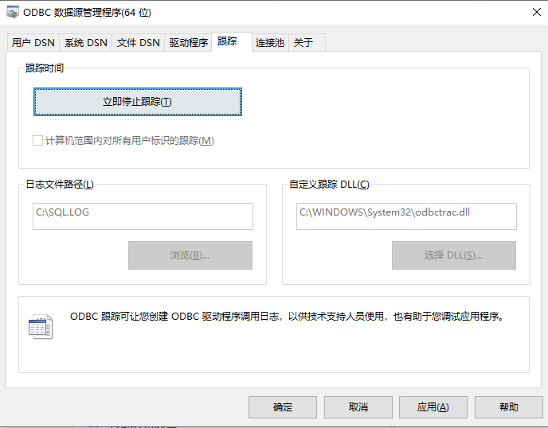

# ODBC 连接器-Function Spec

## 1. 修订记录

| 编写日期 | 发布日期 | 版本 | 修订人 | 主要修改内容 |
| --- | --- | --- | --- | --- |
| 2025-01-15 | 2025-01-15 | 1.0 | 裴亚明 | 创建文档 |
| 2025-12-15 | 2025-12-15 | 1.1 | 裴亚明 | 修改完善文档内容 |
| 2025-12-19 | 2025-12-19 | 1.2 | 霍琳贺 | 添加安全考虑 |

## 2. 背景

在当今物联网(IoT)与工业互联网蓬勃发展的时代，时序数据的高效存储和实时分析对于众多行业来说至关重要。TDengine 作为一款为物联网环境量身定制的开源时序数据库，以其高吞吐量、高压缩比以及强大的查询性能而著称，适用于各种需要处理大规模时间序列数据的应用场景。
为了使 TDengine 更好地融入广泛的企业级应用开发环境中，特别是那些依赖于开放数据库连接(ODBC)标准接口的系统，设计并实现一个兼容 ODBC 标准的连接器变得尤为关键。ODBC 是一种允许最大范围编程语言和操作系统访问不同数据库管理系统的应用程序编程接口(API)，它为 TDengine 提供了一个桥梁，能够无缝对接包括但不限于 Microsoft Windows 平台上的各类应用程序。
ODBC 连接器的设计目标是确保其严格遵守 ODBC 规范，提供对 TDengine 数据库操作的标准接口。我们致力于构建一个不仅功能全面、性能卓越而且易于使用的 ODBC 驱动程序，支持 TDengine 的核心特性，如高效的 SQL 执行、参数绑定、批量插入。此外，该连接器将附带详尽的技术文档和代码示例，以帮助开发者快速上手，并且经过严格的测试流程以保证其稳定性和可靠性，最终确保在实际生产环境中部署的成功率。
总之，本项目旨在开发出一个符合 ODBC 标准的 TDengine 连接器，从而增强 TDengine 在企业级应用中的适用性，促进时序数据分析技术的发展，并为用户提供更加灵活多样的数据访问方式。
请注意：除非另有特别说明，本文中提及的ODBC连接器将统一视为ODBC驱动，这是遵循ODBC标准中的术语（即Driver）。例如，DM代表驱动管理器。然而，在涛思内部，我们更倾向于使用“连接器”这一称呼。

## 3. 定义

1. **ODBC (Open Database Connectivity)：** 是一种开放式的标准应用程序编程接口（API），它为程序、脚本和商务智能工具提供了一种访问各种数据库管理系统（DBMS）的方法。ODBC 的设计是为了让 SQL 语句可以通过几乎任何编程语言在多个平台上执行，从而使得开发者可以编写不依赖于特定数据库的应用程序。
2. **DSN (Data Source Name)：**数据源名称是一个标识符，用来指代一个特定的数据库配置，其中包括了连接到该数据库所需的全部信息，例如服务器地址、数据库名称、认证凭据等。DSN 可以是系统 DSN（供所有用户使用）或用户 DSN（仅限当前用户），或者是文件 DSN（保存在文件中）。
3. **ARD (Application Row Description)：**是 ODBC 中描述应用程序绑定缓冲区中行的数据类型和其他属性的信息集合。当应用程序使用列绑定来检索数据时，ARD 包含了关于每一列的信息，例如数据类型、大小和精度等。这些信息帮助应用程序正确地解释从数据库返回的数据。
4. **IRD (Implementation Row Description)：** 包含了由驱动程序提供的关于结果集中每一列的元数据信息。与 ARD 相比，IRD 更侧重于反映实际数据库中的数据格式和结构。
5. **APD (Application Parameter Description)：**描述了应用程序用于准备和执行 SQL 语句时所使用的参数。APD 包含了每个参数的数据类型、大小和其他相关信息，这对于确保 SQL 语句正确地传递给数据库是必要的。
6. **IPD (Implementation Parameter Description)：**提供了由驱动程序定义的有关 SQL 语句参数的信息。它包含了关于如何将应用程序提供的参数值转换为适合数据库的形式的细节。IPD 对于支持预编译 SQL 语句和参数化查询非常重要。
7. **参数绑定(Parameter Binding)：**在 SQL 语句中使用占位符替代具体值的技术，以防止 SQL 注入并提升查询性能。通过将参数值与 SQL 代码分离，确保安全性，并允许数据库预编译语句，减少执行时间。
8. **Native：**指的是直接利用TDengine提供的C语言客户端库进行数据库交互。这种方式提供最底层、最高效的API调用，支持所有TDengine特性，适合追求性能和灵活性的应用开发，允许开发者直接在应用中嵌入TDengine功能，实现数据的快速读写与处理。
9. **WebSocket：**是一种基于 TCP 的全双工通信协议，支持服务器与客户端之间实时、双向的数据传输。它提供了一个持久连接，使得数据可以即时推送，而无需像 HTTP 那样每次交互都建立新连接。
10. **VQT：**指的是 变量值（Value）、质量戳（Quality Timestamp）、时间戳（Time Timestamp） 的组合。这种形式常用于工业自动化、过程控制、数据采集系统和监控系统中，以确保记录的数据不仅包含数值本身，还包括其质量和采集时间的信息。

## 4. 行为说明

### 4.1 功能分类

本节按功能分类汇总了 ODBC API，关于完整的 ODBC API 参考，请访问 [http://msdn.microsoft.com/en-us/library/ms714177.aspx](http://msdn.microsoft.com/en-us/library/ms714177.aspx) 的 ODBC 程序员参考页面。

#### 4.1.1 数据源管理

##### 4.1.1.1 API: ConfigDSN

- **是否支持**: 支持
- **标准**: ODBC 1.0
- **作用**: 配置数据源
- **语法：**
```c
BOOL ConfigDSN(  
     HWND     hwndParent,  
     WORD     fRequest,  
     LPCSTR   lpszDriver,  
     LPCSTR   lpszAttributes); 
```

- 参数：
  - hwndParent
    [输入] 父窗口句柄。如果句柄为 null，函数将不会显示任何对话框。
  - *fRequest*
    [输入] 请求的类型。*fRequest* 参数必须包含以下值之一：
    ODBC_ADD_DSN：添加新数据源。
    ODBC_CONFIG_DSN：配置 (修改现有数据源) 。
    ODBC_REMOVE_DSN：删除现有数据源。
  - lpszDriver
    [输入] 驱动程序说明的名称，而不是物理驱动程序名称。
  - lpszAttributes
    [输入] 以关键字-值对的形式以 null 结尾的属性列表。有关详细信息，请参阅“注释”。
- **返回：**如果成功，函数将返回 TRUE；如果失败，则返回 FALSE。

##### 4.1.1.2 API: ConfigDriver

- **是否支持**: 支持，桩实现
- **标准**: ODBC 2.5
- **作用**: 用于执行与特定驱动程序相关的安装和配置任务
- **语法：**
```c
BOOL ConfigDriver(  
      HWND    hwndParent,  
      WORD    fRequest,  
      LPCSTR  lpszDriver,  
      LPCSTR  lpszArgs,  
      LPSTR   lpszMsg,  
      WORD    cbMsgMax,  
      WORD *  pcbMsgOut);  
```

- 参数：
  - hwndParent
    [输入] 父窗口句柄。如果句柄为 null，函数将不会显示任何对话框。
  - *fRequest*
    [输入] 请求的类型。*fRequest* 参数必须包含以下值之一：
    ODBC_INSTALL_DRIVER：安装新驱动程序。
    ODBC_REMOVE_DRIVER：删除驱动程序。
    此选项也可以特定于驱动程序，在这种情况下，第一个选项的 *fRequest* 参数必须从 ODBC_CONFIG_DRIVER_MAX+1 开始。任何其他选项的 *fRequest* 参数也必须从大于 ODBC_CONFIG_DRIVER_MAX+1 的值开始。
  - lpszDriver
    [输入] 在系统信息的Odbcinst.ini键中注册的驱动程序的名称。
  - *lpszArgs*
    [输入] 一个以 null 结尾的字符串，其中包含特定于驱动程序的 *fRequest* 的参数。
  - *lpszMsg*
[输出] 一个以 null 结尾的字符串，其中包含来自驱动程序设置的输出消息。
  - *cbMsgMax*
[输入] *lpszMsg 的*长度。
  - *pcbMsgOut*
[输出] *lpszMsg* 中可返回的字节总数。
  如果可返回的字节数大于或等于 *cbMsgMax*， *则 lpszMsg* 中的输出消息将被截断为 *cbMsgMax* 减去 null 终止字符。*“pcbMsgOut*”参数可以是 null 指针。
- **返回：**如果成功，函数将返回 TRUE；如果失败，则返回 FALSE。

##### 4.1.1.3 API: ConfigTranslator

- **是否支持**: 支持，桩实现
- **标准**: ODBC 2.0
- **作用**: 用于解析DSN的配置，在DSN配置和实际数据库驱动程序配置之间进行翻译或转换
- **语法：**
```c
BOOL ConfigTranslator(  
     HWND     hwndParent,  
     DWORD *  pvOption);
```

- 参数：
  - hwndParent
    [输入] 父窗口句柄。如果句柄为 null，函数将不会显示任何对话框。
  - *pvOption*
[输出] 指向 DWORD 类型变量的指针，这个变量用来传递和接收翻译器配置的相关信息。
- **返回：**如果成功，函数将返回 TRUE；如果失败，则返回 FALSE。

#### 4.1.2 连接管理

##### 4.1.2.1 API: SQLConnect

- **是否支持**: 支持
- **标准**: ISO 92
- **作用**: 通过数据源名称、用户 ID 和密码连接到特定驱动程序
- **语法：**
```c
SQLRETURN SQLConnect(  
     SQLHDBC        ConnectionHandle,  
     SQLCHAR *      ServerName,  
     SQLSMALLINT    NameLength1,  
     SQLCHAR *      UserName,  
     SQLSMALLINT    NameLength2,  
     SQLCHAR *      Authentication,  
     SQLSMALLINT    NameLength3);
```

- 参数：
  - *ConnectionHandle*
[输入] 连接句柄。
  - *ServerName*
[输入] 数据源名称。
  - *NameLength1*
[输入] **ServerName* 的长度（以字符为单位）。
  - *UserName*
[输入]用户标识符。
  - *NameLength2*
[输入] **UserName* 的长度（以字符为单位）。
  - *Authentication*
[输入] 身份验证字符串 (例如：密码) 。
  - *NameLength3*
[输入] *身份验证字符串* 的长度（以字符为单位）。
- **返回：**SQL_SUCCESS、SQL_SUCCESS_WITH_INFO、SQL_ERROR、SQL_INVALID_HANDLE。

##### 4.1.2.2 API: SQLDriverConnect

- **是否支持**: 支持
- **标准**: ODBC 1.0
- **作用**: 通过连接字符串连接到特定驱动程序，支持更多连接信息
- **语法：**
```c
SQLRETURN SQLDriverConnect(  
     SQLHDBC         ConnectionHandle,  
     SQLHWND         WindowHandle,  
     SQLCHAR *       InConnectionString,  
     SQLSMALLINT     StringLength1,  
     SQLCHAR *       OutConnectionString,  
     SQLSMALLINT     BufferLength,  
     SQLSMALLINT *   StringLength2Ptr,  
     SQLUSMALLINT    DriverCompletion);
```

- 参数：
  - *ConnectionHandle*
[输入] 连接句柄。
  - *WindowHandle*
[输入] 窗口句柄。应用程序可以传递父窗口的句柄，如果窗口句柄不适用，或者 SQLDriverConnect 不会显示任何对话框，则传递 null 指针。
  - *InConnectionString*
[输入] 完整的连接字符串、部分连接字符串。
  - *StringLength1*
[输入] **InConnectionString* 的长度，以字节为单位。
  - *OutConnectionString*
[输出] 指向已完成连接字符串的缓冲区的指针。成功连接到目标数据源后，此缓冲区包含已完成的连接字符串。
    如果 *OutConnectionString* 为 NULL， *StringLength2Ptr* 仍将返回可用字符总数 (不包括字符数据的 null 终止字符) 。
  - *BufferLength*
[输入] **OutConnectionString 缓冲区的*长度（以字符为单位）。
  - *StringLength2Ptr*
[输出]指向缓冲区的指针，该缓冲区将返回可在 **OutConnectionString* 中返回总字符数 (不包括 null 终止字符) 。如果可返回的字符数大于或等于 *BufferLength*，则 **OutConnectionString* 中完成的连接字符串将被截断为 *BufferLength* 减去 null 终止字符的长度。
  - *DriverCompletion*
[输入] 指示驱动程序管理器还是驱动程序必须提示输入更多连接信息的标志：
    SQL_DRIVER_PROMPT、SQL_DRIVER_COMPLETE、SQL_DRIVER_COMPLETE_REQUIRED 或 SQL_DRIVER_NOPROMPT。
- **返回：**SQL_SUCCESS, SQL_SUCCESS_WITH_INFO, SQL_NEED_DATA, SQL_ERROR, SQL_INVALID_HANDLE.

##### 4.1.2.3 API: SQLDisconnect

- **是否支持**: 支持
- **标准**: ISO 92
- **作用**: 断开数据库连接
- **语法：**
```c
SQLRETURN SQLDisconnect(  
     SQLHDBC     ConnectionHandle);
```

- 参数：
  - *ConnectionHandle*
[输入] 连接句柄。
- **返回：**SQL_SUCCESS、SQL_SUCCESS_WITH_INFO、SQL_ERROR、SQL_INVALID_HANDLE。

#### 4.1.3 属性管理

##### 4.1.3.1 API: SQLSetConnectAttr

- **是否支持**: 支持
- **标准**: ISO 92
- **作用**: 设置连接属性，当设置SQL_ATTR_CURRENT_CATALOG属性时，用于设置当前的数据库
- **语法：**
```c
SQLRETURN SQLSetConnectAttr(  
     SQLHDBC       ConnectionHandle,  
     SQLINTEGER    Attribute,  
     SQLPOINTER    ValuePtr,  
     SQLINTEGER    StringLength);
```

- 参数：
  - *ConnectionHandle*
[输入] 连接句柄。
  - *Attribute*
[输入] 要设置的属性。
  - *ValuePtr*
[输入] 指向要与 *Attribute* 关联的值的指针。 根据 *属性值*， *ValuePtr* 是一个无符号整数值，或者将指向以 null 结尾的字符串。
  - *StringLength*
[输入] 如果 *Attribute* 是 ODBC 定义的属性，ValuePtr 指向字符串或二进制缓冲区，则此参数应为 **ValuePtr* 的长度。 对于字符串数据，此参数应包含字符串中的字节数。
  如果 *Attribute* 是 ODBC 定义的属性，并且 *ValuePtr* 是整数， *则忽略 StringLength* 。
  如果 *Attribute* 是驱动程序定义的属性，则应用程序通过设置 *StringLength* 参数来指示该属性对驱动程序管理器的性质。 
- **返回：**SQL_SUCCESS, SQL_SUCCESS_WITH_INFO, SQL_ERROR, SQL_INVALID_HANDLE。

##### 4.1.3.2 API: SQLGetConnectAttr

- **是否支持**: 支持
- **标准**: ISO 92
- **作用**: 返回连接属性的值
- **语法：**
```c
SQLRETURN SQLGetConnectAttr(  
     SQLHDBC        ConnectionHandle,  
     SQLINTEGER     Attribute,  
     SQLPOINTER     ValuePtr,  
     SQLINTEGER     BufferLength,  
     SQLINTEGER *   StringLengthPtr);
```

- 参数：
  - *ConnectionHandle*
[输入] 连接句柄。
  - *Attribute*
[输入] 要检索的属性。
  - *ValuePtr*
[输出] 指向*由 Attribute* 指定的特性的当前值的内存的指针。
    如果 *ValuePtr* 为 NULL， *则 StringLengthPtr* 仍将返回总字节数 (不包括 null 终止字符) 。
  - *BufferLength*
[输入] 如果 *Attribute* 是 ODBC 定义的属性，并且 *ValuePtr* 指向字符串或二进制缓冲区，则此参数应为 **ValuePtr* 的长度。 如果 *Attribute* 是 ODBC 定义的属性， *并且 *ValuePtr* 是整数，则忽略 *BufferLength* 。
    如果 *Attribute* 是驱动程序定义的属性，则应用程序通过设置 *BufferLength* 参数向驱动程序管理器指示属性的性质。
  - *StringLengthPtr*
[输出] 指向缓冲区的指针，在该缓冲区中返回的总字节数 (不包括 null 终止字符) 。 如果属性值是字符串，并且可返回的字节数大于 *BufferLength* 减去 null 终止字符的长度，则 **ValuePtr* 中的数据将被截断为 *BufferLength* 减去 null 终止字符的长度，并由驱动程序以 null 结尾。
- **返回：**SQL_SUCCESS, SQL_SUCCESS_WITH_INFO, SQL_NO_DATA, SQL_ERROR,SQL_INVALID_HANDLE。

##### 4.1.3.3 API: SQLSetEnvAttr

- **是否支持**: 支持
- **标准**: ISO 92
- **作用**: 设置控制环境的属性
- **语法：**
```c
SQLRETURN SQLSetEnvAttr(  
     SQLHENV      EnvironmentHandle,  
     SQLINTEGER   Attribute,  
     SQLPOINTER   ValuePtr,  
     SQLINTEGER   StringLength);
```

- 参数：
  - *EnvironmentHandle*
[输入] 环境句柄。
  - *Attribute*
[输入] 要设置的属性。
  - *ValuePtr*
[输入] 指向要与 *Attribute* 关联的值的指针。 根据 *Attribute* 的值， *ValuePtr* 将是一个 32 位整数值或指向以 null 结尾的字符串。
  - *StringLength*
[输入] 如果 *ValuePtr* 指向字符串或二进制缓冲区，则此参数应为 **ValuePtr* 的长度。 对于字符串数据，此参数应包含字符串中的字节数。
    如果 *ValuePtr* 是整数，则忽略 *StringLength* 。
- **返回：**SQL_SUCCESS, SQL_SUCCESS_WITH_INFO, SQL_ERROR, or SQL_INVALID_HANDLE。

##### 4.1.3.4 API: SQLGetEnvAttr

- **是否支持**: 支持
- **标准**: ISO 92
- **作用**: 返回环境属性的当前设置
- **语法：**
```c
SQLRETURN SQLGetEnvAttr(  
     SQLHENV        EnvironmentHandle,  
     SQLINTEGER     Attribute,  
     SQLPOINTER     ValuePtr,  
     SQLINTEGER     BufferLength,  
     SQLINTEGER *   StringLengthPtr);
```

- 参数：
  - *EnvironmentHandle*
[输入] 环境句柄。
  - *Attribute*
[输入] 要检索的属性。
  - *ValuePtr*
[输出] 指向缓冲区的指针，在该缓冲区中返回由 *Attribute* 指定的特性的当前值。
    如果 *ValuePtr* 为 NULL，*StringLengthPtr* 仍将返回总字节数 (不包括字符数据的 null 终止字符数)。
  - *BufferLength*
[输入] 如果 *ValuePtr* 指向字符串，则此参数应为 **ValuePtr* 的长度。 如果 **ValuePtr* 是整数，则忽略 *BufferLength* 。如果属性值不是字符串，*则未使用 BufferLength* 。
  - *StringLengthPtr*
[输出] 指向缓冲区的指针，用于返回 **ValuePtr* 中可返回的总字节数 (不包括 null 终止字符) 。 如果属性值是字符串，并且可返回的字节数大于或等于 *BufferLength*，则 **ValuePtr* 中的数据将被截断为 *BufferLength* 减去 null 终止字符的长度，并由驱动程序以 null 结尾。
- **返回：**SQL_SUCCESS, SQL_SUCCESS_WITH_INFO, SQL_NO_DATA, SQL_ERROR, SQL_INVALID_HANDLE。

##### 4.1.3.5 API: SQLSetStmtAttr

- **是否支持**: 支持
- **标准**: ISO 92
- **作用**: 设置与语句相关的属性
- **语法：**
```c
SQLRETURN SQLSetStmtAttr(  
     SQLHSTMT      StatementHandle,  
     SQLINTEGER    Attribute,  
     SQLPOINTER    ValuePtr,  
     SQLINTEGER    StringLength);
```

- 参数：
  - *StatementHandle*
[输入] 语句句柄。
  - *Attribute*
[输入] 要设置的属性。
  - *ValuePtr*
[输入] 与 *Attribute* 关联的值。 根据属性值*，ValuePtr* 将是下列值之一：
    - ODBC 描述符句柄。
    - SQLUINTEGER 值。
    - SQLULEN 值。
    - 指向以下项之一的指针：
      - 以 null 结尾的字符串。
      - 二进制缓冲区。
      - SQLLEN、SQLULEN 或 SQLUSMALLINT 类型的值或数组。
      - 驱动程序定义的值。
  - *StringLength*
[输入] 如果 *Attribute* 是 ODBC 定义的属性，ValuePtr 指向字符串或二进制缓冲区，则此参数应为 **ValuePtr* 的长度。 如果 *Attribute* 是 ODBC 定义的属性，并且 *ValuePtr* 是整数， *则忽略 StringLength* 。如果 *Attribute* 是驱动程序定义的属性，则应用程序通过设置 *StringLength* 参数来指示该属性对驱动程序管理器的性质。 
- **返回：**SQL_SUCCESS、SQL_SUCCESS_WITH_INFO、SQL_ERROR 或SQL_INVALID_HANDLE。

##### 4.1.3.6 API: SQLGetStmtAttr

- **是否支持**: 支持
- **标准**: ISO 92
- **作用**: 返回语句属性的当前设置
- **语法：**
```c
SQLRETURN SQLGetStmtAttr(  
     SQLHSTMT        StatementHandle,  
     SQLINTEGER      Attribute,  
     SQLPOINTER      ValuePtr,  
     SQLINTEGER      BufferLength,  
     SQLINTEGER *    StringLengthPtr);
```

- 参数：
  - *StatementHandle*
[输入] 语句句柄。
  - *Attribute*
[输入] 要检索的属性。
  - *ValuePtr*
[输出] 指向缓冲区的指针，该缓冲区将返回特性中指定的属性值。
    如果 *ValuePtr* 为 NULL， *StringLengthPtr* 仍将返回总字节数 (不包括字符数据的 null 终止字符数)。 
  - *BufferLength*
[输入] 如果 *Attribute* 是 ODBC 定义的属性，并且 *ValuePtr* 指向字符串或二进制缓冲区，则此参数的长度应为 **ValuePtr*。 如果 *Attribute* 是 ODBC 定义的属性，并且 **ValuePtr* 是整数，则忽略 *BufferLength* 。如果 *Attribute* 是驱动程序定义的属性，则应用程序通过设置 *BufferLength* 参数向驱动程序管理器指示属性的性质。
  - *StringLengthPtr*
[输出] 指向缓冲区的指针，该缓冲区返回**ValuePtr* 中的总字节数 (不包括 null 终止字符) 。如果属性值是字符串，并且可返回的字节数大于或等于 *BufferLength*，则 **ValuePtr* 中的数据将被截断为 *BufferLength* 减去 null 终止字符的长度，并由驱动程序以 null 结尾。 
- **返回：**SQL_SUCCESS、SQL_SUCCESS_WITH_INFO、SQL_ERROR 或 SQL_INVALID_HANDLE。

#### 4.1.4 环境资源管理

##### 4.1.4.1 API: SQLAllocHandle

- **是否支持**: 支持
- **标准**: ISO 92
- **作用**: 分配环境、连接、语句或描述符句柄
- **语法：**
```c
SQLRETURN SQLAllocHandle(  
      SQLSMALLINT   HandleType,  
      SQLHANDLE     InputHandle,  
      SQLHANDLE *   OutputHandlePtr);
```

- 参数：
  - *HandleType*
[输入] 要由 SQLAllocHandle 分配的句柄的类型。必须是以下值之一：
    SQL_HANDLE_DBC
    SQL_HANDLE_DESC
    SQL_HANDLE_ENV
    SQL_HANDLE_STMT
  - *InputHandle*
[输入] 要在其上下文中分配新句柄的输入句柄。如果 *HandleType* 是SQL_HANDLE_ENV，则是SQL_NULL_HANDLE。如果 *HandleType* 是SQL_HANDLE_DBC，则它必须是环境句柄，如果SQL_HANDLE_STMT或SQL_HANDLE_DESC，则它必须是连接句柄。
  - *OutputHandlePtr*
[输出] 指向将句柄返回到新分配的数据结构的缓冲区的指针。
- **返回：**SQL_SUCCESS、SQL_SUCCESS_WITH_INFO、SQL_INVALID_HANDLE或SQL_ERROR。
分配环境句柄以外的句柄时，如果 SQLAllocHandle 返回SQL_ERROR，则它将 OutputHandlePtr* 设置为*SQL_NULL_HDBC、SQL_NULL_HSTMT或SQL_NULL_HDESC，具体取决于 HandleType* 的值*，除非输出参数为 null 指针。然后，应用程序可以从与 InputHandle* 参数中的*句柄关联的诊断数据结构获取其他信息。

##### 4.1.4.2 API: SQLFreeHandle

- **是否支持**: 支持
- **标准**: ISO 92
- **作用**: 释放与特定环境、连接、语句或描述符句柄关联的资源
- **语法：**
```c
SQLRETURN SQLFreeHandle(  
     SQLSMALLINT   HandleType,  
     SQLHANDLE     Handle);
```

- 参数：
  - *HandleType*
[输入] SQLFreeHandle释放的句柄类型。 必须是以下值之一：
    - SQL_HANDLE_DBC
    - SQL_HANDLE_DESC
    - SQL_HANDLE_ENV
    - SQL_HANDLE_STMT
  如果 *HandleType* 不是这些值之一，SQLFreeHandle 将返回SQL_INVALID_HANDLE。
  - *Handle*
[输入] 要释放的句柄。
- **返回：**SQL_SUCCESS、SQL_ERROR或SQL_INVALID_HANDLE。

##### 4.1.4.3 API: SQLFreeStmt

- **是否支持**: 支持
- **标准**: ODBC
- **作用**: 结束语句处理，丢弃挂起的结果，并且可以选择释放与语句句柄关联的所有资源
- **语法：**
```c
SQLRETURN SQLFreeStmt(  
     SQLHSTMT       StatementHandle,  
     SQLUSMALLINT   Option);
```

- 参数：
  - *StatementHandle*
[输入] 语句句柄
  - *Option*
[输入] 以下选项之一：
    SQL_ CLOSE：关闭与 *StatementHandle* （如果定义了）关联的游标，并放弃所有挂起的结果。 应用程序稍后可以通过使用相同或不同的参数值再次执行 SELECT 语句来重新打开此游标。如果未打开游标，则此选项对应用程序不起作用。还可以调用 SQLCloseCursor 来关闭游标。
    SQL_DROP：此选项已弃用。 SQL_DROP *选项*对 SQLFreeStmt 的调用在驱动程序管理器中映射到 SQLFreeHandle。
    SQL_UNBIND：将 ARD 的 SQL_DESC_COUNT字段设置为 0，释放给定* StatementHandle* 的所有由SQLBindCol 绑定的列缓冲区。请注意，如果在由多个语句共享的显式分配的描述符上执行此操作，该操作将影响共享该描述符的所有语句的绑定。 
    SQL_RESET_PARAMS：设置 APD 的 SQL_DESC_COUNT 字段为 0，释放由 SQLBindParameter 为给定 *StatementHandle* 设置的所有参数缓冲区。如果在显式分配的描述符上执行此操作，且该描述符由多个语句共享，则此操作将影响共享该描述符的所有语句的绑定。
- **返回：**SQL_SUCCESS、SQL_SUCCESS_WITH_INFO、SQL_ERROR或SQL_INVALID_HANDLE。

#### 4.1.5 元数据查询

##### 4.1.5.1 API: SQLColumns

- **是否支持**: 支持
- **标准**: X/Open
- **作用**: 返回指定表中的列名列表
- **语法：**
```c
SQLRETURN SQLColumns(  
     SQLHSTMT       StatementHandle,  
     SQLCHAR *      CatalogName,  
     SQLSMALLINT    NameLength1,  
     SQLCHAR *      SchemaName,  
     SQLSMALLINT    NameLength2,  
     SQLCHAR *      TableName,  
     SQLSMALLINT    NameLength3,  
     SQLCHAR *      ColumnName,  
     SQLSMALLINT    NameLength4);
```

- 参数：
  - *StatementHandle*
[输入] 语句句柄。
  - *CatalogName*
[输入] 目录名称。
  - *NameLength1*
[输入] **CatalogName* 的长度（以字符为单位）。
  - *SchemaName*
[输入] 模式名称的字符串搜索模式。
  - *NameLength2*
[输入] **SchemaName* 的长度（以字符为单位）。
  - *TableName*
[输入] 表或视图名称的字符串搜索模式。
  - *NameLength3*
[输入] **TableName* 的长度（以字符为单位）。
  - *ColumnName*
[输入] 列名的字符串搜索模式。
  - *NameLength4*
[输入] **ColumnName* 的长度（以字符为单位）。
- **返回：**SQL_SUCCESS、SQL_SUCCESS_WITH_INFO、SQL_ERROR或SQL_INVALID_HANDLE。

##### 4.1.5.2 API: SQLPrimaryKeys

- **是否支持**: 支持
- **标准**: ODBC 1.0
- **作用**: 返回构成表主键的列名列表
- **语法：**
```c
SQLRETURN SQLPrimaryKeys(  
     SQLHSTMT       StatementHandle,  
     SQLCHAR *      CatalogName,  
     SQLSMALLINT    NameLength1,  
     SQLCHAR *      SchemaName,  
     SQLSMALLINT    NameLength2,  
     SQLCHAR *      TableName,  
     SQLSMALLINT    NameLength3);
```

- 参数：
  - *StatementHandle*
[输入] 语句句柄。
  - *CatalogName*
[输入] 目录名称。
  - *NameLength1*
[输入] **CatalogName* 的长度（以字符为单位）。
  - *SchemaName*
[输入] 模式名称。*SchemaName* 不能包含字符串搜索模式。
  - *NameLength2*
[输入] **SchemaName* 的长度（以字符为单位）。
  - *TableName*
[输入] 表名称。 此参数不能为 null 指针。 *TableName* 不能包含字符串搜索模式。
  - *NameLength3*
[输入] **TableName* 的长度（以字符为单位）。
- **返回：**SQL_SUCCESS、SQL_SUCCESS_WITH_INFO、SQL_ERROR或SQL_INVALID_HANDLE。

##### 4.1.5.3 API: SQLTables

- **是否支持**: 支持
- **标准**: X/Open
- **作用**: 返回存储在数据源的当前数据库中的表信息
- **语法：**
```c
SQLRETURN SQLTables(  
     SQLHSTMT       StatementHandle,  
     SQLCHAR *      CatalogName,  
     SQLSMALLINT    NameLength1,  
     SQLCHAR *      SchemaName,  
     SQLSMALLINT    NameLength2,  
     SQLCHAR *      TableName,  
     SQLSMALLINT    NameLength3,  
     SQLCHAR *      TableType,  
     SQLSMALLINT    NameLength4);
```

- 参数：
  - *StatementHandle*
[输入] 检索结果的语句句柄。
  - *CatalogName*
[输入] 目录名称。
  - *NameLength1*
[输入] **CatalogName* 的长度（以字符为单位）。
  - *SchemaName*
[输入] 模式名称的字符串搜索模式。
  - *NameLength2*
[输入] **SchemaName* 的长度（以字符为单位）。
  - *TableName*
[输入] 表名的字符串搜索模式。
  - *NameLength3*
[输入] **TableName* 的长度（以字符为单位）。
  - *TableType*
[输入] 要匹配的表类型的列表。
  - *NameLength4*
[输入] **TableType* 的长度（以字符为单位）。
- **返回：**SQL_SUCCESS、SQL_SUCCESS_WITH_INFO、SQL_ERROR或SQL_INVALID_HANDLE。

##### 4.1.5.4 API: SQLNumResultCols

- **是否支持**: 支持
- **标准**: ISO 92
- **作用**: 返回结果集中的列数
- **语法：**
```c
SQLRETURN SQLNumResultCols(  
     SQLHSTMT        StatementHandle,  
     SQLSMALLINT *   ColumnCountPtr);
```

- 参数：
  - *StatementHandle*
[输入] 语句句柄。
  - *ColumnCountPtr*
[输出] 指向要返回结果集中列数的缓冲区的指针。
- **返回：**SQL_SUCCESS、SQL_SUCCESS_WITH_INFO、SQL_ERROR或SQL_INVALID_HANDLE。

#### 4.1.6 数据获取

##### 4.1.6.1 API: SQLFetch

- **是否支持**: 支持
- **标准**: ISO 92
- **作用**: 用于从结果集中提取下一行数据，并返回所有绑定列的数据
- **语法：**
```c
SQLRETURN SQLFetch(  
     SQLHSTMT     StatementHandle);
```

- 参数：
  - *StatementHandle*
[输入] 语句句柄。

- **返回：**SQL_SUCCESS、SQL_SUCCESS_WITH_INFO、SQL_NO_DATA、SQL_ERROR或SQL_INVALID_HANDLE。

##### 4.1.6.2 API: SQLFetchScroll

- **是否支持**: 支持
- **标准**: ISO 92
- **作用**: 用于从结果集中提取指定的数据行集，并返回所有绑定列的数据
- **语法：**
```c
SQLRETURN SQLFetchScroll(  
      SQLHSTMT      StatementHandle,  
      SQLSMALLINT   FetchOrientation,  
      SQLLEN        FetchOffset);
```

- 参数：
  - *StatementHandle*
[输入] 语句句柄。
  - *FetchOrientation*
[输入] 提取类型，TDengine 暂时只支持 SQL_FETCH_NEXT，即顺序读取数据，不支持随机游标。
  - *FetchOffset*
[输入] 要提取的行数。 此参数的解释取决于 FetchOrientation* 参数的值*。
- **返回：**SQL_SUCCESS、SQL_SUCCESS_WITH_INFO、SQL_NO_DATA、SQL_ERROR或SQL_INVALID_HANDLE。

##### 4.1.6.3 API: SQLGetData

- **是否支持**: 支持
- **标准**: ODBC
- **作用**: 用于从结果集中的当前行获取特定列的数据
- **语法：**
```c
SQLRETURN SQLGetData(  
      SQLHSTMT       StatementHandle,  
      SQLUSMALLINT   Col_or_Param_Num,  
      SQLSMALLINT    TargetType,  
      SQLPOINTER     TargetValuePtr,  
      SQLLEN         BufferLength,  
      SQLLEN *       StrLen_or_IndPtr);
```

- 参数：
  - *StatementHandle*
[输入] 语句句柄。
  - *Col_or_Param_Num*
[输入] 对于检索列数据，它是要为其返回数据的列数。 从 1 开始，结果集按列以递增顺序进行编号。 对于检索参数数据，它是从 1 开始的参数序号。
  - *TargetType*
[输入] **TargetValuePtr* 缓冲区的 C 数据类型的类型标识符。
  - *TargetValuePtr*
[输出] 指向要在其中返回数据的缓冲区的指针。
  *TargetValuePtr* 不能为 NULL。
  - *BufferLength*
[输入] **TargetValuePtr* 缓冲区的长度（以字节为单位）。
    驱动程序使用 *BufferLength* 来避免在返回可变长度数据（如字符或二进制数据）时写入 **TargetValuePtr* 缓冲区的末尾。 请注意，当将字符数据返回到 **TargetValuePtr* 时，驱动程序会将 null 终止字符计数。 * *因此，TargetValuePtr* 必须包含 null 终止字符的空间，否则驱动程序将截断数据。
    当驱动程序返回固定长度的数据（如整数或日期结构）时，驱动程序会忽略 *BufferLength* ，并假定缓冲区足够大，足以保存数据。 因此，应用程序必须为固定长度的数据分配足够大的缓冲区，否则驱动程序将写穿缓冲区末尾。
  - *StrLen_or_IndPtr*
[输出] 指向要返回长度或指示器值的缓冲区的指针。如果这是空指针，则不返回长度或指示器值。 当提取的数据为 NULL 时，这将返回错误。
    SQLGetData 可以在长度/指示器缓冲区中返回以下值：
    - 可用于返回的数据的长度
    - SQL_NO_TOTAL
    - SQL_NULL_DATA
- **返回：**SQL_SUCCESS、SQL_SUCCESS_WITH_INFO、SQL_NO_DATA、SQL_ERROR或SQL_INVALID_HANDLE。

#### 4.1.7 列操作

##### 4.1.7.1 API: SQLDescribeCol

- **是否支持**: 支持
- **标准**: ISO 92
- **作用**: 用于描述结果集中列的属性。它提供了关于列的数据类型、列名、列的最大宽度、小数位数和是否可为空等信息
- **语法：**
```c
SQLRETURN SQLDescribeCol(  
      SQLHSTMT       StatementHandle,  
      SQLUSMALLINT   ColumnNumber,  
      SQLCHAR *      ColumnName,  
      SQLSMALLINT    BufferLength,  
      SQLSMALLINT *  NameLengthPtr,  
      SQLSMALLINT *  DataTypePtr,  
      SQLULEN *      ColumnSizePtr,  
      SQLSMALLINT *  DecimalDigitsPtr,  
      SQLSMALLINT *  NullablePtr);
```

- 参数：
  - *StatementHandle*
[输入] 语句句柄。
  - ColumnNumber
[输入] 结果数据的列数，按顺序递增列顺序排序，从 1 开始。
  - *ColumnName*
[输出] 指向以 null 结尾的缓冲区的指针，该缓冲区将返回列名。 此值从 IRD 的“SQL_DESC_NAME”字段读取。 如果列未命名或无法确定列名，驱动程序将返回一个空字符串。
    如果 *ColumnName* 为 NULL， *则 NameLengthPtr* 仍将返回总字符数 (不包括字符数据的 null 终止字符数)。
  - *BufferLength*
[输入] **ColumnName* 缓冲区的长度（以字符为单位）。
  - *NameLengthPtr*
[输出] 指向缓冲区的指针，该缓冲区将返回可在 **ColumnName* 中返回的字符总数(排除 null 终止字符数)。如果可返回的字符数大于或等于 *BufferLength*，则**ColumnName* 中的列名将被截断为 *BufferLength* 减去 null 终止字符的长度。
  - *DataTypePtr*
[输出] 指向要在其中返回列的 SQL 数据类型的缓冲区的指针。 此值从 IRD 的“SQL_DESC_CONCISE_TYPE”字段读取。 这是 [SQL 数据类型](https://learn.microsoft.com/zh-cn/sql/odbc/reference/appendixes/sql-data-types?view=sql-server-ver16)中的值之一，或特定于驱动程序的 SQL 数据类型。 如果无法确定数据类型，驱动程序将返回SQL_UNKNOWN_TYPE。
  - *ColumnSizePtr*
[输出] 指向缓冲区的指针，其中返回数据源上列的大小（以字符为单位）。如果无法确定列大小，驱动程序将返回 0。
  - *DecimalDigitsPtr*
[输出] 指向缓冲区的指针，该缓冲区将返回数据源上列的十进制位数。 如果无法确定或不适用小数位数，驱动程序将返回 0。
  - *NullablePtr*
[输出] 指向缓冲区的指针，该缓冲区将返回一个值，该值指示列是否允许 NULL 值。 此值从 IRD 的“SQL_DESC_NULLABLE”字段中读取。 值为以下值之一：
    SQL_NO_NULLS：列不允许 NULL 值。
    SQL_NULLABLE：列允许 NULL 值。
    SQL_NULLABLE_UNKNOWN：驱动程序无法确定列是否允许 NULL 值。
- **返回：**SQL_SUCCESS、SQL_SUCCESS_WITH_INFO、SQL_ERROR或SQL_INVALID_HANDLE。

##### 4.1.7.2 API: SQLColAttribute

- **是否支持**: 支持
- **标准**: ISO 92
- **作用**: 用于获取指定列的各种属性信息，例如列的数据类型、列名、显示大小、精度等
- **语法：**
```c
SQLRETURN SQLColAttribute (  
      SQLHSTMT        StatementHandle,  
      SQLUSMALLINT    ColumnNumber,  
      SQLUSMALLINT    FieldIdentifier,  
      SQLPOINTER      CharacterAttributePtr,  
      SQLSMALLINT     BufferLength,  
      SQLSMALLINT *   StringLengthPtr,  
      SQLLEN *        NumericAttributePtr);
```

- 参数：
  - *StatementHandle*
[输入] 语句句柄。
  - ColumnNumber
    [输入] 要从中检索字段值的 IRD 中的记录数。 此参数对应于结果数据的列号，从 1 开始，按列递增顺序排序。
  - *FieldIdentifier*
[输入] 描述符句柄。此句柄定义应查询 IRD 中的哪些字段（例如 SQL_COLUMN_TABLE_NAME）。
  - *CharacterAttributePtr*
[输出] 指向缓冲区的指针，如果字段是字符串，则返回 IRD ColumnNumber* 行的 FieldIdentifier 字段中的值*。 否则，该字段未使用。
    如果 *CharacterAttributePtr* 为 NULL，StringLengthPtr仍将返回可用于在 *CharacterAttributePtr* 指向的缓冲区中返回的字节总数（不包括字符数据的 null 终止字符）。
  - *BufferLength*
[输入] 如果 *FieldIdentifier* 是 ODBC 定义的字段，并且 *CharacterAttributePtr* 指向字符串或二进制缓冲区，则此参数应为 **CharacterAttributePtr* 的长度。 如果 *FieldIdentifier* 是 ODBC 定义的字段，并且 **CharacterAttribute*Ptr 是整数，则忽略此字段。如果 *FieldIdentifier* 是驱动程序定义的字段，则应用程序通过设置 *BufferLength* 参数来指示字段的性质。
  - *StringLengthPtr*
[输出] 指向可在 **CharacterAttributePtr* 中返回的可用字节总数（不包括字符数据的 null 终止字节）的缓冲区的指针。
    对于字符数据，如果可返回的字节数大于或等于 *BufferLength，则 *CharacterAttributePtr 中的描述符信息将被截断为 BufferLength* 减去 null 终止字符的长度，并由驱动程序以 null 结尾。
    对于所有其他类型的数据，忽略 BufferLength* 的值*，驱动程序假定 **CharacterAttributePtr* 的大小为 32 位。
  - *NumericAttributePtr*
[输出] 指向整数缓冲区的指针，如果字段是数字描述符类型，例如SQL_DESC_COLUMN_LENGTH，则返回 IRD ColumnNumber* 行的 FieldIdentifier 字段中的值*。 否则，该字段未使用。
- **返回：**SQL_SUCCESS、SQL_SUCCESS_WITH_INFO、SQL_ERROR或SQL_INVALID_HANDLE。

#### 4.1.8 信息获取

##### 4.1.8.1 API: SQLGetInfo

- **是否支持**: 支持
- **标准**: ISO 92
- **作用**: 返回有关数据库环境的详细信息，如数据库产品名称、驱动程序名、数据库的SQL语法特性、连接能力等等
- **语法：**
```c
SQLRETURN SQLGetInfo(  
     SQLHDBC         ConnectionHandle,  
     SQLUSMALLINT    InfoType,  
     SQLPOINTER      InfoValuePtr,  
     SQLSMALLINT     BufferLength,  
     SQLSMALLINT *   StringLengthPtr);
```

- 参数：
  - *ConnectionHandle*
[输入] 连接句柄。
  - *InfoType*
[输入] 信息类型。
  - *InfoValuePtr*
[输出] 指向要在其中返回信息的缓冲区的指针。 *根据所请求的 InfoType*，返回的信息将是以下值之一：以 null 结尾的字符串、SQLUSMALLINT 值、SQLUINTEGER 位掩码、SQLUINTEGER 标志、SQLUINTEGER 二进制值或 SQLULEN 值。
    *如果 InfoType* 参数SQL_DRIVER_HDESC或SQL_DRIVER_HSTMT，*则 InfoValuePtr* 参数既是输入也是输出。
    如果 *InfoValuePtr* 为 NULL，StringLengthPtr* *仍将返回可用于在 InfoValuePtr* 指向*的缓冲区中返回的字节总数（不包括字符数据的 null 终止字符）。
  - *BufferLength*
[输入] **InfoValuePtr* 缓冲区的长度。 如果 *InfoValuePtr 是空指针，则忽略 BufferLength* 参数。 驱动程序假定 *InfoValuePtr* 的大小是基于 InfoType 的 *SQLUSMALLINT 或 SQLUINTEGER。
  - *StringLengthPtr*
[输出] 指向缓冲区的指针，在该缓冲区中返回**InfoValuePtr*  中可返回的总字节数（不包括字符数据的null终止字符）。
    对于字符数据，如果可返回的字节数大于或等于 *BufferLength*，则 **InfoValuePtr* 中的信息将被截断为 *BufferLength* 字节减去 null 终止字符的长度，并且由驱动程序以 null 结尾。
    对于所有其他类型的数据，将忽略 BufferLength 的值*，驱动程序假定 *InfoValuePtr 的大小是 SQLUSMALLINT 或 SQLUINTEGER，具体取决于 InfoType。*
- **返回：**SQL_SUCCESS, SQL_SUCCESS_WITH_INFO, SQL_ERROR, or SQL_INVALID_HANDLE.

##### 4.1.8.2 API: SQLGetTypeInfo

- **是否支持**: 支持
- **标准**: ISO 92
- **作用**: 返回有关支持的数据类型的信息
- **语法：**
```c
SQLRETURN SQLGetTypeInfo(  
     SQLHSTMT      StatementHandle,  
     SQLSMALLINT   DataType);
```

- 参数：
  - *StatementHandle*
[输入] 结果集的语句句柄。
  - *DataType*
[输入] SQL 数据类型。详细数据类型信息请参考： [SQL Data Types](https://learn.microsoft.com/en-us/sql/odbc/reference/appendixes/sql-data-types?view=sql-server-ver16)
- **返回：**SQL_SUCCESS、SQL_SUCCESS_WITH_INFO、SQL_ERROR或SQL_INVALID_HANDLE。

#### 4.1.9 参数操作

##### 4.1.9.1 API: SQLBindParameter

- **是否支持**: 支持
- **标准**: ODBC
- **作用**: 用于将SQL语句的参数绑定到应用程序缓冲区
- **语法：**
```c
SQLRETURN SQLBindParameter(  
      SQLHSTMT        StatementHandle,  
      SQLUSMALLINT    ParameterNumber,  
      SQLSMALLINT     InputOutputType,  
      SQLSMALLINT     ValueType,  
      SQLSMALLINT     ParameterType,  
      SQLULEN         ColumnSize,  
      SQLSMALLINT     DecimalDigits,  
      SQLPOINTER      ParameterValuePtr,  
      SQLLEN          BufferLength,  
      SQLLEN *        StrLen_or_IndPtr);
```

- 参数：
  - *StatementHandle*
[输入] 语句句柄。
  - *ParameterNumber*
[输入] 参数编号，按递增参数顺序排序，从 1 开始。
  - InputOutputType
[输入] 参数的类型。
  - *ValueType*
[输入] 参数的 C 数据类型。
  - *ParameterType*
[输入] 参数的 SQL 数据类型。
  - ColumnSize
[输入] 相应参数标记的列或表达式的大小。
  - DecimalDigits
[输入] 相应参数标记的列或表达式的十进制数字。 
  - *ParameterValuePtr*
[延迟输入] 指向参数数据的缓冲区的指针。
  - *BufferLength*
[输入/输出] ParameterValuePtr* 缓冲区的*长度（以字节为单位）。
  - *StrLen_or_IndPtr*
[延迟输入] 指向参数长度缓冲区的指针。
- **返回：**SQL_SUCCESS、SQL_SUCCESS_WITH_INFO、SQL_ERROR 或 SQL_INVALID_HANDLE。

##### 4.1.9.2 API: SQLDescribeParam

- **是否支持**: 支持
- **标准**: ODBC 1.0
- **作用**: 返回语句中特定参数的描述。具体来说，它允许应用程序在执行带有参数的 SQL 语句之前，查询这些参数的数据类型、大小、小数位数和是否允许 NULL 值等属性。
- **语法：**
```c
SQLRETURN SQLDescribeParam(  
      SQLHSTMT        StatementHandle,  
      SQLUSMALLINT    ParameterNumber,  
      SQLSMALLINT *   DataTypePtr,  
      SQLULEN *       ParameterSizePtr,  
      SQLSMALLINT *   DecimalDigitsPtr,  
      SQLSMALLINT *   NullablePtr);
```

- 参数：
  - *StatementHandle*
[输入] 语句句柄。
  - *ParameterNumber*
[输入] 参数标记编号按顺序排序，从 1 开始。
  - *DataTypePtr*
[输出] 指向要返回参数的 SQL 数据类型的缓冲区的指针。此值从 IPD 的SQL_DESC_CONCISE_TYPE记录字段读取。
  - *ParameterSizePtr*
[输出] 指向缓冲区的指针，该缓冲区返回数据源定义的相应参数标记的列或表达式的大小（以字符为单位）。
  - *DecimalDigitsPtr*
[输出] 指向缓冲区的指针，该缓冲区返回数据源定义的相应参数的列或表达式的小数位数。
  - *NullablePtr*
[输出] 指向缓冲区的指针，该缓冲区返回一个值，该值指示参数是否允许 NULL 值。 此值从 IPD 的SQL_DESC_NULLABLE字段中读取。 下列类型作之一：
    - SQL_NO_NULLS：参数不允许 NULL 值（这是默认值）。
    - SQL_NULLABLE：参数允许 NULL 值。
    - SQL_NULLABLE_UNKNOWN：驱动程序无法确定参数是否允许 NULL 值。
- **返回：**SQL_SUCCESS、SQL_SUCCESS_WITH_INFO、SQL_ERROR或SQL_INVALID_HANDLE。

##### 4.1.9.3 API: SQLNumParams

- **是否支持**: 支持
- **标准**: ISO 92
- **作用**: 用于查询预编译SQL语句中的参数数量
- **语法：**
```c
SQLRETURN SQLNumParams(  
     SQLHSTMT        StatementHandle,  
     SQLSMALLINT *   ParameterCountPtr);
```

- 参数：
  - *StatementHandle*
[输入] 语句句柄。
  - *ParameterCountPtr*
[输出] 指向一个缓冲区的指针，在该缓冲区中返回语句中的参数的数量。
- **返回：**SQL_SUCCESS、SQL_SUCCESS_WITH_INFO、SQL_ERROR或SQL_INVALID_HANDLE。

#### 4.1.10 结果集操作

##### 4.1.10.1 API: SQLBindCol

- **是否支持**: 支持
- **标准**: ODBC
- **作用**: 用于将结果集中的列绑定到应用程序缓冲区
- **语法：**
```c
SQLRETURN SQLBindCol(  
      SQLHSTMT       StatementHandle,  
      SQLUSMALLINT   ColumnNumber,  
      SQLSMALLINT    TargetType,  
      SQLPOINTER     TargetValuePtr,  
      SQLLEN         BufferLength,  
      SQLLEN *       StrLen_or_IndPtr);
```

- 参数：
  - *StatementHandle*
[输入] 语句句柄。
  - ColumnNumber
    [输入] 要绑定的结果集列的数目。 列按从 0 开始的递增列顺序进行编号，其中列 0 是书签列。如果未使用书签（即，SQL_ATTR_USE_BOOKMARKS 语句属性设置为 SQL_UB_OFF），则列号从 1 开始。TDengine数据库不支持书签。
  - *TargetType*
[输入] **TargetValuePtr* 缓冲区的 C 数据类型的标识符。 当它使用 SQLFetch、 SQLFetchScroll、 SQLSetPos 从数据源中检索数据时，驱动程序会将数据转换为此类型;当它使用 SQLSetPos 将数据发送到数据源时，驱动程序会从此类型转换数据。
  - *TargetValuePtr*
[延迟输入/输出] 指向要绑定到列的数据缓冲区的指针。SQLFetch 和 SQLFetchScroll 在此缓冲区中返回数据。
  - *BufferLength*
[输入] **TargetValuePtr* 缓冲区的长度（以字节为单位）。
    驱动程序使用 *BufferLength* 避免在返回可变长度数据（如字符或二进制数据）时写入 **TargetValuePtr* 缓冲区的末尾。 请注意，驱动程序在将字符数据返回到 **TargetValuePtr* 时对 null 终止字符进行计数。 因此*，TargetValuePtr* 必须包含 null 终止字符的空间，否则驱动程序将截断数据。
    当驱动程序返回固定长度的数据（如整数或日期结构）时，驱动程序将忽略 *BufferLength* 并假定缓冲区足够大，足以保存数据。 因此，应用程序必须为固定长度的数据分配足够大的缓冲区，否则驱动程序将写穿缓冲区末尾。
  - *StrLen_or_IndPtr*
[延迟输入/输出] 指向要绑定到列的长度/指示器缓冲区的指针。 SQLFetch 和 SQLFetchScroll 在此缓冲区中返回一个值。 
  SQLFetch、 SQLFetchScroll 和 SQLSetPos 可以在长度/指示器缓冲区中返回以下值：
  - 可返回的数据的长度
  - SQL_NO_TOTAL
  - SQL_NULL_DATA
  如果 *StrLen_or_IndPtr* 为 null 指针，则不使用长度或指示器值。提取数据时出错，数据为 NULL。
- **返回：**SQL_SUCCESS、SQL_SUCCESS_WITH_INFO、SQL_ERROR或SQL_INVALID_HANDLE。

##### 4.1.10.2 API: SQLMoreResults

- **是否支持**: 支持
- **标准**: ODBC
- **作用**: 多个结果集的 SQL 语句执行后（例如：一个批处理），移动到下一个结果集
- **语法：**
```c
SQLRETURN SQLMoreResults(  
     SQLHSTMT     StatementHandle);
```

- 参数：
  - *StatementHandle*
[输入] 语句句柄。
- **返回：**SQL_SUCCESS、SQL_SUCCESS_WITH_INFO、SQL_NO_DATA、SQL_ERROR、SQL_INVALID_HANDLE。

##### 4.1.10.3 API: SQLRowCount

- **是否支持**: 支持
- **标准**: ISO 92
- **作用**: 用于获取最近执行的语句所影响的行数
- **语法：**
```c
SQLRETURN SQLRowCount(  
      SQLHSTMT   StatementHandle,  
      SQLLEN *   RowCountPtr);
```

- 参数：
  - *StatementHandle*
[输入] 语句句柄。
  - *RowCountPtr*
[输出] 指向要在其中返回行计数的缓冲区。 
- **返回：**SQL_SUCCESS、SQL_SUCCESS_WITH_INFO、SQL_ERROR 或SQL_INVALID_HANDLE。

##### 4.1.10.4 API: SQLCloseCursor

- **是否支持**: 支持
- **标准**: ODBC
- **作用**: 关闭与当前语句句柄关联的游标，并释放游标所使用的所有资源
- **语法：**
```c
SQLRETURN SQLCloseCursor(  
     SQLHSTMT     StatementHandle);
```

- 参数：
  - *StatementHandle*
[输入] 语句句柄。
- **返回：**SQL_SUCCESS、SQL_SUCCESS_WITH_INFO、SQL_ERROR 或 SQL_INVALID_HANDLE。

#### 4.1.11 执行语句

##### 4.1.11.1 API: SQLPrepare

- **是否支持**: 支持
- **标准**: ISO 92
- **作用**: 用于预处理SQL语句，这通常是SQLExecute之前的一个步骤
- **语法：**
```c
SQLRETURN SQLPrepare(  
     SQLHSTMT      StatementHandle,  
     SQLCHAR *     StatementText,  
     SQLINTEGER    TextLength);
```

- 参数：
  - *StatementHandle*
[输入] 语句句柄。
  - *StatementText*
[输入] SQL 文本字符串。
  - *TextLength*
[输入] 字符形式的 **StatementText* 的长度。
- **返回：**SQL_SUCCESS、SQL_SUCCESS_WITH_INFO、SQL_ERROR或SQL_INVALID_HANDLE。

##### 4.1.11.2 API: SQLExecute

- **是否支持**: 支持
- **标准**: ISO 92
- **作用**: 用于执行之前通过 SQLPrepare 准备好的SQL语句
- **语法：**
```c
SQLRETURN SQLExecute(  
     SQLHSTMT     StatementHandle);
```

- 参数：
  - *StatementHandle*
[输入] 语句句柄。
- **返回：**SQL_SUCCESS、SQL_SUCCESS_WITH_INFO、SQL_ERROR、SQL_NO_DATA、SQL_INVALID_HANDLE。

##### 4.1.11.3 API: SQLExecDirect

- **是否支持**: 支持
- **标准**: ISO 92
- **作用**: 用于执行包含SQL语句的字符串
- **语法：**
```c
SQLRETURN SQLExecDirect(  
     SQLHSTMT     StatementHandle,  
     SQLCHAR *    StatementText,  
     SQLINTEGER   TextLength);
```

- 参数：
  - *StatementHandle*
[输入] 语句句柄。
  - *StatementText*
[输入] 要执行的 SQL 语句。
  - *TextLength*
[输入] 字符形式的 **StatementText* 的长度。
- **返回：**SQL_SUCCESS、SQL_SUCCESS_WITH_INFO、SQL_ERROR、SQL_NO_DATA、SQL_INVALID_HANDLE。

##### 4.1.11.4 API: SQLEndTran

- **是否支持**: 支持，桩实现
- **标准**: ISO 92
- **作用**: 用于提交或回滚事务，TDengine 不支持事务，因此不支持回滚操作，仅是模拟。
- **语法：**
```c
SQLRETURN SQLEndTran(  
     SQLSMALLINT   HandleType,  
     SQLHANDLE     Handle,  
     SQLSMALLINT   CompletionType);
```

- 参数：
  - *HandleType*
[输入] 句柄类型标识符。 包含 SQL_HANDLE_ENV（如果 *Handle 是环境句柄* ）或 SQL_HANDLE_DBC（如果 *Handle* 是连接句柄）。
  - *Handle*
[输入] 由 HandleType* *指示类型的句柄。
  - *CompletionType*
[输入] 以下两个值之一：
    SQL_COMMIT SQL_ROLLBACK
- **返回：**SQL_SUCCESS、SQL_SUCCESS_WITH_INFO、SQL_ERROR、SQL_INVALID_HANDLE。

#### 4.1.12 错误诊断

##### 4.1.12.1 API: SQLGetDiagField

- **是否支持**: 支持
- **标准**: ISO 92
- **作用**: 返回附加诊断信息（单条诊断结果）
- **语法：**
```c
SQLRETURN SQLGetDiagField(  
     SQLSMALLINT     HandleType,  
     SQLHANDLE       Handle,  
     SQLSMALLINT     RecNumber,  
     SQLSMALLINT     DiagIdentifier,  
     SQLPOINTER      DiagInfoPtr,  
     SQLSMALLINT     BufferLength,  
     SQLSMALLINT *   StringLengthPtr);
```

- 参数：
  - *HandleType*
[输入] 描述需要诊断的句柄类型。 必须是下列项之一：
    - SQL_HANDLE_DBC
    - SQL_HANDLE_DESC
    - SQL_HANDLE_ENV
    - SQL_HANDLE_STMT
  - *Handle*
[输入] 诊断数据结构的句柄，其类型由 *HandleType *指示。
  - *RecNumber*
[输入] 指示应用程序从中查找信息的状态记录。 状态记录从 1 开始编号。
  - *DiagIdentifier*
[输入] 指示要返回其值的诊断字段。
  - *DiagInfoPtr*
[输出] 指向要在其中返回诊断信息的缓冲区的指针。 数据类型取决于 *DiagIdentifier *的值。 如果 *DiagInfoPtr* 是整数类型，则应用程序应使用 SQLULEN 的缓冲区，并在调用此函数之前将值初始化为 0。
    如果 *DiagInfoPtr* 为 NULL，则 *StringLengthPtr* 仍将返回可用于 *DiagInfoPtr *指向的缓冲区中返回的字节总数（不包括字符数据的 null 终止字符）。
  - *BufferLength*
[输入] 如果 *DiagIdentifier* 是 ODBC 定义的诊断，*DiagInfoPtr* 指向字符串或二进制缓冲区，则此参数应为 **DiagInfoPtr*的长度。 如果 diagIdentifier 为 ODBC 定义的字段，并且 *DiagInfoPtr 为整数，则忽略 BufferLength。 如果 **DiagInfoPtr* 中的值是 Unicode 字符串（在调用 SQLGetDiagFieldW时），则 *BufferLength* 参数必须是偶数。
  - *StringLengthPtr*
[输出] 指向缓冲区的指针，用于返回字符数据的 **DiagInfoPtr *中返回的可用字节总数（不包括 null 终止字符所需的字节数）。如果可用于返回的字节数大于或等于 *BufferLength*，则 **DiagInfoPtr* 中的文本将被截断为 *BufferLength* 减去 null 终止字符的长度。
- **返回：**SQL_SUCCESS、SQL_SUCCESS_WITH_INFO、SQL_ERROR、SQL_INVALID_HANDLE或SQL_NO_DATA。

##### 4.1.12.2 API: SQLGetDiagRec

- **是否支持**: 支持
- **标准**: ISO 92
- **作用**: 返回附加诊断信息（多条诊断结果）
- **语法：**
```c
SQLRETURN SQLGetDiagRec(  
     SQLSMALLINT     HandleType,  
     SQLHANDLE       Handle,  
     SQLSMALLINT     RecNumber,  
     SQLCHAR *       SQLState,  
     SQLINTEGER *    NativeErrorPtr,  
     SQLCHAR *       MessageText,  
     SQLSMALLINT     BufferLength,  
     SQLSMALLINT *   TextLengthPtr);
```

- 参数：
  - *HandleType*
[输入] 描述需要诊断的句柄类型。 必须是下列项之一：
    - SQL_HANDLE_DBC
    - SQL_HANDLE_DESC
    - SQL_HANDLE_ENV
    - SQL_HANDLE_STMT
  - *Handle*
[输入] 诊断数据结构的句柄，其类型由 *HandleType *指示。
  - *RecNumber*
[输入] 指示应用程序从中查找信息的状态记录。 状态记录从 1 开始编号。
  - *DiagIdentifier*
[输入] 指示要返回其值的诊断字段。
  - *SQLState*
[输出] 指向缓冲区的指针，该缓冲区用于返回诊断记录 *RecNumber*  的5个字符的 SQLSTATE 代码 (以 NULL 结束) 。前两个字符表示类别；接下来的三个字符表示子类。此信息包含在“SQL_DIAG_SQLSTATE”诊断字段中。
  - *NativeErrorPtr*
[输出] 指向缓冲区的指针，该缓冲区将返回特定于数据源的本机错误代码。 此信息包含在“SQL_DIAG_NATIVE”诊断字段中。
  - *MessageText*
[输出] 指向要在其中返回诊断消息文本字符串的缓冲区的指针。 此信息包含在“SQL_DIAG_MESSAGE_TEXT”诊断字段中。
    如果 *MessageText* 为 NULL， *则 TextLengthPtr* 仍将返回字符总数， (不包括 null 终止字符) 。
  - *BufferLength*
[输入] **MessageText* 缓冲区的长度（以字符为单位）。诊断消息文本没有最大长度。
  - *TextLengthPtr*
[输出] 指向缓冲区的指针，该缓冲区返回 **MessageText*  中可返回的总字符数 (不包括 null 终止字符)。 如果可返回的字符数大于 *BufferLength*，则 **MessageText* 中的诊断消息文本将被截断为 *BufferLength* 减去 null 终止字符的长度。
- **返回：**SQL_SUCCESS、SQL_SUCCESS_WITH_INFO、SQL_ERROR、SQL_NO_DATA或SQL_INVALID_HANDLE。

### 4.2 数据类型映射

下表说明了 ODBC 连接器如何将服务器数据类型映射到默认的 SQL 和 C 数据类型。
| TDengine Type | SQL Type | C Type |
| --- | --- | --- |
| TIMESTAMP | SQL_TYPE_TIMESTAMP | SQL_C_TIMESTAMP |
| INT | SQL_INTEGER | SQL_C_SLONG |
| INT UNSIGNED | SQL_INTEGER | SQL_C_ULONG |
| BIGINT | SQL_BIGINT | SQL_C_SBIGINT |
| BIGINT UNSIGNED | SQL_BIGINT | SQL_C_UBIGINT |
| FLOAT | SQL_REAL | SQL_C_FLOAT |
| DOUBLE | SQL_DOUBLE | SQL_C_DOUBLE |
| BINARY | SQL_BINARY | SQL_C_BINARY |
| SMALLINT | SQL_SMALLINT | SQL_C_SSHORT |
| SMALLINT UNSIGNED | SQL_SMALLINT | SQL_C_USHORT |
| TINYINT | SQL_TINYINT | SQL_C_STINYINT |
| TINYINT UNSIGNED | SQL_TINYINT | SQL_C_UTINYINT |
| BOOL | SQL_BIT | SQL_C_BIT |
| NCHAR | SQL_VARCHAR | SQL_C_CHAR |
| VARCHAR | SQL_VARCHAR | SQL_C_CHAR |
| JSON | SQL_WVARCHAR | SQL_C_WCHAR |
| GEOMETRY | SQL_VARBINARY | SQL_C_BINARY |
| VARBINARY | SQL_VARBINARY | SQL_C_BINARY |

### 4.3 ODBC 示例

#### 4.3.1 C 语言使用 TDengine ODBC 示例

以下C语言代码展示了如何使用ODBC接口与TDengine数据库进行交互。该示例的主要流程：
1. 初始化环境：
  - 分配一个环境句柄 (henv)。
  - 设置ODBC版本属性为3，同时开启每个驱动程序对应一个连接池。
1. 创建数据库连接：
  - 分配一个数据库连接句柄 (hdbc)。
  - 使用SQLDriverConnectA函数通过DSN（数据源名称）以及用户名和密码建立到TDengine的连接。
1. 分配语句句柄：
  - 分配一个语句句柄 (hstmt) 用于执行SQL命令。
1. 执行DDL操作：
  - 执行SQL命令删除已存在的超级表 meters（如果存在）。
  - 创建一个新的超级表 meters，它包含时间戳、电流、电压和相位四个字段，并带有两个标签：groupid 和 location。
  - 删除测试用的普通表 d0（如果存在）。
  - 使用超级表 meters 创建一个测试表 d0，并为其指定标签值。
1. 插入数据：
  - 构建一个插入语句，向测试表 d0 中插入一行数据。
  - 执行插入操作，并获取受影响的行数以确认插入是否成功。
1. 读取数据：
  - 构建选择查询语句，从测试表 d0 中选取特定列的数据。
  - 执行查询后，遍历结果集，逐行读取每一列的数据，并打印出来。
1. 清理资源：
  - 关闭游标。
  - 释放语句句柄。
  - 断开数据库连接。
  - 释放连接句柄和环境句柄。
```c
#include <stdio.h>
#include <string.h>
#include <stdlib.h>
#include <windows.h>
#include <sql.h>
#include <sqlext.h>

int main() {
    SQLHANDLE henv = SQL_NULL_HANDLE;
    SQLHANDLE hdbc = SQL_NULL_HANDLE;
    SQLHANDLE hstmt = SQL_NULL_HANDLE;

    SQLAllocHandle(SQL_HANDLE_ENV, SQL_NULL_HANDLE, &henv);
    SQLSetEnvAttr(henv, SQL_ATTR_ODBC_VERSION, (SQLPOINTER)SQL_OV_ODBC3, 0);

    SQLAllocHandle(SQL_HANDLE_DBC, henv, &hdbc);

    // create a connection to tdengine data source
    SQLCHAR OutConnectionString[1024] = { 0 };
    SQLSMALLINT StringLength2 = 0;

    const char* conn_str = "DSN=TAOS_ODBC_WS_DSN; UID=root; PWD=taosdata; DB=meter";
    printf(conn_str);
    SQLDriverConnect(hdbc,
        NULL,
        (SQLCHAR*)conn_str,
        (SQLSMALLINT)strlen(conn_str),
        OutConnectionString,
        sizeof(OutConnectionString),
        &StringLength2,
        SQL_DRIVER_NOPROMPT);

    SQLAllocHandle(SQL_HANDLE_STMT, hdbc, &hstmt);

    const char* drop_stable = "DROP STABLE if exists meters";
    SQLExecDirect(hstmt, (SQLCHAR*)drop_stable, SQL_NTS);

    const char* create_stable = "CREATE TABLE `meters` (`ts` TIMESTAMP, `current` FLOAT, `voltage` INT, `phase` FLOAT) \
         TAGS (`groupid` INT, `location` BINARY(24))";
    SQLExecDirect(hstmt, (SQLCHAR*)create_stable, SQL_NTS);

    const char* drop_table = "DROP TABLE if exists d0";
    SQLExecDirect(hstmt, (SQLCHAR*)drop_table, SQL_NTS);

    // create test table
    const char* create_table_sql = "CREATE TABLE `d0` USING `meters` TAGS(0, 'California.LosAngles')";
    SQLExecDirect(hstmt, (SQLCHAR*)create_table_sql, SQL_NTS);

    // write data into test table
    char insert_sql[256];
    snprintf(insert_sql, sizeof(insert_sql)/sizeof(insert_sql[0]), "INSERT INTO `d0` values(now - 10s, 10, 116, 0.32)");
    SQLExecDirect(hstmt, (SQLCHAR*)insert_sql, SQL_NTS);
    SQLLEN numberOfrows;
    SQLRowCount(hstmt, &numberOfrows);
    printf("insert count: %lld\n", numberOfrows);

    // reset cursor
    SQLCloseCursor(hstmt);

    // read data from table
    char select_sql[256];
    snprintf(select_sql, sizeof(select_sql) / sizeof(select_sql[0]), "select ts, current, voltage from d0");
    SQLExecDirect(hstmt, (SQLCHAR*)select_sql, SQL_NTS);

    int row = 0;
    SQLSMALLINT numberOfColumns;
    SQLNumResultCols(hstmt, &numberOfColumns);

    while (SQLFetch(hstmt) == SQL_SUCCESS) {
        row++;
        for (int i = 1; i <= numberOfColumns; i++) {
            SQLCHAR columnData[256];
            SQLLEN indicator;
            SQLGetData(hstmt, i, SQL_C_CHAR, columnData, sizeof(columnData), &indicator);
            if (indicator != SQL_NULL_DATA) {
                printf("Row:%d Column %d: %s \n", row, i, columnData);
            }
        }
    }

    // close handle
    SQLFreeHandle(SQL_HANDLE_STMT, hstmt);
    SQLDisconnect(hdbc);
    SQLFreeHandle(SQL_HANDLE_DBC, hdbc);
    SQLFreeHandle(SQL_HANDLE_ENV, henv);

    return 0;
}
```

#### 4.3.2 python 使用 TDengine ODBC 示例

以下Python代码展示了如何使用pyodbc库与TDengine数据库进行交互。该示例的主要流程：
1. 连接到数据库：
  - 使用DSN（数据源名称）和密码创建一个数据库连接 (cnxn)。
1. 创建游标对象：
  - 从连接中创建一个游标对象 (cursor)，用于执行SQL命令。
1. 数据库操作：
  - 删除名为 meter 的数据库（如果存在），然后创建它，并切换到这个数据库上下文。
1. 表操作：
  - 删除普通表 d0（如果存在）并重新创建它，包含时间戳、电流和电压三个字段。
  - 向表 d0 插入两条记录，其中一条使用参数化查询以防止SQL注入。
1. 查询和打印结果：
  - 执行选择查询语句，从 d0 表中选取电流和电压的数据，并将所有匹配行作为列表返回。
  - 打印查询结果。
1. 超级表操作：
  - 删除超级表 meters（如果存在）。
  - 创建一个新的超级表 meters，它包含四个字段（时间戳、电流、电压和相位），并且有两个标签：groupid 和 location。
  - 向超级表插入一行数据，并指定标签值。
  - 再次查询 meters 超级表中的数据，并打印出来。
1. 使用参数化查询向超级表插入多条记录：
  - 尝试使用参数化查询向超级表插入多条记录。
  - 使用executemany方法批量插入多条记录。
1. 清理资源：
  - 关闭游标。
  - 断开数据库连接。
```python
import pyodbc
import os
import sys

if __name__ == "__main__":
    # Using a DSN, but providing a password as well
    cnxn = pyodbc.connect('DSN=TAOS_ODBC_WS_DSN;PWD=taosdata')

    # Create a cursor from the connection
    cursor = cnxn.cursor()

    cursor.execute("drop database if exists meter")
    cursor.execute("create database if not exists meter")
    cursor.execute("use meter")

    cursor.execute("drop table if exists d0")
    cursor.execute("create table d0 (ts timestamp, current FLOAT, voltage INT)")
    cursor.execute("insert into d0(ts, current, voltage) values (now(), 1.5, 220)")
    cursor.execute("insert into d0(ts, current, voltage) values (?, ?, ?)", 1682565350033, 1.52, 221)

    data = cursor.execute("select current,voltage from d0").fetchall()
    print(data, "\n")

    cursor.execute("drop stable if exists meters")
    cursor.execute(
        "create stable meters (ts timestamp, current FLOAT, voltage INT, phase FLOAT) tags (groupid INT, location BINARY(24))")
    cursor.execute(
        "insert into 'd000' using meters tags (0, 'California.SanFrancisco') values (1665226861289, 2, 200, 1.3)")
    data = cursor.execute("select ts, current, voltage, phase from meters").fetchall()
    print(data, "\n")

    cursor.execute("insert into ? using meters tags (?, ?) values (?, ?, ?, ?)", 'd001', 1, 'California.LosAngles',
                   1665226861289, 2.1, 201, 1.2)
    data = cursor.execute("select ts, current, voltage, phase from meters").fetchall()
    print(data, "\n")

    params = [('d002', 2, 'California.SanFrancisco', 1665226861289, 1.21, 202, 1.2),
              ('d003', 3, 'California.LosAngles', 1665226861299, 1.22, 203, 1.3)]

    cursor.executemany("insert into ? using meters tags (?, ?) values (?, ?, ?, ?)", params)

    data = cursor.execute("select ts, current, voltage, phase from meters").fetchall()
    print(data, "\n")

    cursor.close()
    cnxn.close()
```

### 4.4 暂不支持的 API

#### 4.4.1 API: SQLBrowseConnect

- **是否支持**: 不支持
- **标准**: ODBC 1.0
- **作用**: 用于逐步建立与数据源的连接。它允许应用程序通过一系列交互式步骤（而不是一次性提供所有连接信息）来完成连接过程。这种方式特别适用于需要动态获取连接参数的场景，例如让用户逐步输入用户名、密码或其他连接属性。
- **语法：**
```c
SQLRETURN SQLBrowseConnect(  
     SQLHDBC         ConnectionHandle,  
     SQLCHAR *       InConnectionString,  
     SQLSMALLINT     StringLength1,  
     SQLCHAR *       OutConnectionString,  
     SQLSMALLINT     BufferLength,  
     SQLSMALLINT *   StringLength2Ptr);
```

- 参数：
  - *ConnectionHandle*
[输入] 连接句柄。
  - *InConnectionString*
[输入] 浏览请求连接字符串。
  - *StringLength1*
[输入] 字符中 **InConnectionString* 的长度。
  - *OutConnectionString*
[输出] 指向要返回浏览结果的字符缓冲区的指针连接字符串。
    如果 *OutConnectionString* 为 NULL， *StringLength2Ptr* 仍将返回可用字符总数 (不包括字符数据的 null 终止字符) 。
  - *BufferLength*
[输入] **OutConnectionString* 缓冲区的长度（以字符为单位）。
  - *StringLength2Ptr*
[输出] 可用于在 **OutConnectionString* 中返回的字符总数（不包括 null 终止符号）。如果可用于返回的字符数大于或等于 *BufferLength，则 *OutConnectionString 中的连接字符串将被截断为 BufferLength* 减去 null 终止字符的长度。
- **返回：**SQL_SUCCESS、SQL_SUCCESS_WITH_INFO、SQL_NEED_DATA、SQL_ERROR、SQL_INVALID_HANDLE。

#### 4.4.2 API: SQLDataSources

- **是否支持**: 不支持
- **标准**: ISO 92
- **作用**: 返回可用数据源的列表，由驱动程序管理器处理
- **语法：**
```c
SQLRETURN SQLDataSources(  
     SQLHENV          EnvironmentHandle,  
     SQLUSMALLINT     Direction,  
     SQLCHAR *        ServerName,  
     SQLSMALLINT      BufferLength1,  
     SQLSMALLINT *    NameLength1Ptr,  
     SQLCHAR *        Description,  
     SQLSMALLINT      BufferLength2,  
     SQLSMALLINT *    NameLength2Ptr);
```

- 参数：
  - *EnvironmentHandle*
[输入] 环境句柄。
  - *Direction*
[输入] 确定驱动程序管理器返回有关哪个数据源的信息。 可以是：
    SQL_FETCH_NEXT (提取列表中) 的下一个数据源名称，SQL_FETCH_FIRST (从列表) 的开头提取，SQL_FETCH_FIRST_USER (提取第一个用户 DSN) ，或SQL_FETCH_FIRST_SYSTEM (提取第一个系统 DSN) 。
  - *ServerName*
[输出] 指向要在其中返回数据源名称的缓冲区的指针。
  如果 *ServerName* 为 NULL， *则 NameLength1Ptr* 仍将返回总字符数(不包括null 终止字符) 。
  - *BufferLength1*
[输入] **ServerName* 缓冲区的长度（以字符为单位），不可以超过 SQL_MAX_DSN_LENGTH 加上 null 终止字符。
  - *NameLength1Ptr*
[输出] 指向缓冲区的指针，该缓冲区将返回总字符数， (不包括可在 **ServerName* 中返回的 null 终止字符) 。 如果可返回的字符数大于或等于 *BufferLength1*，则 **ServerName* 中的数据源名称将被截断为 *BufferLength1* 减去 null 终止字符的长度。
  - *Description*
[输出] 指向缓冲区的指针，该缓冲区将返回与数据源关联的驱动程序的说明。 
    如果 *Description* 为 NULL，*NameLength2Ptr* 仍将返回字符总数 (不包括 null 终止字符数) *。*
  - *BufferLength2*
[输入] **Description* 缓冲区的长度（以字符为单位）。
  - *NameLength2Ptr*
[输出] 指向缓冲区的指针，该缓冲区要返回驱动程序说明的总字符数 (不包括 null 终止字符) 。 如果可返回的字符数大于或等于 *BufferLength2*，则驱动程序需要将**Description* 中截断到 *BufferLength2* 减去 null 终止字符的长度。
- **返回：**SQL_SUCCESS、SQL_SUCCESS_WITH_INFO、SQL_NO_DATA、SQL_ERROR或SQL_INVALID_HANDLE。

#### 4.4.3 API: SQLDrivers

- **是否支持**: 不支持
- **标准**: ODBC 2.0
- **作用**: 返回由驱动程序管理器处理的已安装驱动程序及其属性的列表
- **语法：**
```c
SQLRETURN SQLDrivers(  
     SQLHENV         EnvironmentHandle,  
     SQLUSMALLINT    Direction,  
     SQLCHAR *       DriverDescription,  
     SQLSMALLINT     BufferLength1,  
     SQLSMALLINT *   DescriptionLengthPtr,  
     SQLCHAR *       DriverAttributes,  
     SQLSMALLINT     BufferLength2,  
     SQLSMALLINT *   AttributesLengthPtr);
```

- 参数：
  - *EnvironmentHandle*
[输入] 环境句柄。
  - *Direction*
[输入] 确定驱动程序管理器是否提取列表中的下一个驱动程序说明 (SQL_FETCH_NEXT) ，或者是从列表的开头开始搜索 (SQL_FETCH_FIRST) 。
  - *DriverDescription*
[输出] 指向要在其中返回驱动程序说明的缓冲区的指针。
    如果 *DriverDescription* 为 NULL， *DescriptionLengthPtr* 仍将返回字符总数 (不包括 null 终止字符) 。
  - *BufferLength1*
[输入] **DriverDescription* 缓冲区的长度（以字符为单位）。
  - *DescriptionLengthPtr*
[输出] 指向缓冲区的指针，该缓冲区将返回总字符数 (不包括 null 终止字符) 。 如果可返回的字符数大于或等于 *BufferLength1*，则**DriverDescription* 中的驱动程序说明将截断为 *BufferLength1* 减去 null 终止字符的长度。
  - *DriverAttributes*
[输出] 指向要在其中返回驱动程序属性值对的列表的缓冲区的指针 。
    如果 *DriverAttributes* 为 NULL， *则 AttributesLengthPtr* 仍将返回字节总数 (不包括 null 终止字符) 。
  - *BufferLength2*
[输入] **DriverAttributes* 缓冲区的长度（以字符为单位）。
  - *AttributesLengthPtr*
[输出] 指向缓冲区的指针，该缓冲区将返回驱动程序属性值对列表的总字节数 (不包括 null 终止字节) 。 如果可返回的字节数大于或等于 *BufferLength2*，则 **DriverAttributes* 中的属性值对列表将被截断为 *BufferLength2* 减去 null 终止字符的长度。
- **返回：**SQL_SUCCESS, SQL_SUCCESS_WITH_INFO, SQL_NO_DATA, SQL_ERROR, or SQL_INVALID_HANDLE。

#### 4.4.4 API: SQLGetFunctions

- **是否支持**: 不支持
- **标准**: ISO 92
- **作用**: 用于查询驱动程序支持的函数
- **语法：**
```c
SQLRETURN SQLGetFunctions(  
     SQLHDBC           ConnectionHandle,  
     SQLUSMALLINT      FunctionId,  
     SQLUSMALLINT *    SupportedPtr);
```

- 参数：
  - *ConnectionHandle*
[输入] 连接句柄。
  - *FunctionId*
[输入] 标识感兴趣的 ODBC 函数的 #define 值; SQL_API_ODBC3_ALL_FUNCTIONS 或者SQL_API_ALL_FUNCTIONS。ODBC 3.* 应用程序使用SQL_API_ODBC3_ALL_FUNCTIONS来确定对 ODBC 3.* 和早期函数的支持。ODBC 2.* 应用程序使用SQL_API_ALL_FUNCTIONS来确定对 ODBC 2.* 和早期函数的支持。
  - *SupportedPtr*
[输出] 如果 *FunctionId* 标识单个 ODBC 函数，*则 SupportedPtr* 指向一个 SQLUSMALLINT 值，如果驱动程序支持指定函数，则 SQL_TRUE；如果不支持，则 SQL_FALSE。
    如果 *functionId* 是 SQL_API_ODBC3_ALL_FUNCTIONS，则 *SupportedPtr*  指向一个 SQLSMALLINT 数组。 该数组可用于确定是否支持 ODBC 3.* 或更早版本的函数。 
    如果 *FunctionId* 是 SQL_API_ALL_FUNCTIONS， *则 SupportedPtr* 指向一个 SQLUSMALLINT 数组，该数组的元素用于标识驱动程序是否支持的 ODBC 2.* 或更早的函数，如果支持则 SQL_TRUE；如果不支持，则SQL_FALSE。
  **SupportedPtr* 中返回的数组使用从零开始的索引。
- **返回：**SQL_SUCCESS, SQL_SUCCESS_WITH_INFO, SQL_ERROR, or SQL_INVALID_HANDLE.

#### 4.4.5 API: SQLGetCursorName

- **是否支持**: 不支持
- **标准**: ISO 92
- **作用**: 返回与指定语句关联的游标名称
- **语法：**
```c
SQLRETURN SQLGetCursorName(  
     SQLHSTMT        StatementHandle,  
     SQLCHAR *       CursorName,  
     SQLSMALLINT     BufferLength,  
     SQLSMALLINT *   NameLengthPtr);
```

- 参数：
  - *StatementHandle*
[输入] 语句句柄。
  - *CursorName*
[输出] 指向要在其中返回游标名称的缓冲区的指针。
    如果 *CursorName* 为 NULL，NameLengthPtr* *仍将返回可用于在 CursorName* 指向*的缓冲区中返回的字符总数（不包括字符数据的 null 终止字符）。
  - *BufferLength*
[输入] **CursorName* 的长度（以字符为单位）。
  - *NameLengthPtr*
[输出] 指向内存的指针，用于返回可用于在 **CursorName* 中返回的字符总数（不包括 null 终止字符）。 如果可用于返回的字符数大于或等于 *BufferLength，则 *CursorName 中的游标名称将被截断为 BufferLength* 减去 null 终止字符的长度。
- **返回：**SQL_SUCCESS、SQL_SUCCESS_WITH_INFO、SQL_ERROR 或SQL_INVALID_HANDLE。

#### 4.4.6 API: SQLSetCursorName

- **是否支持**: 不支持
- **标准**: ISO 92
- **作用**: 设置游标名称，允许在查询中使用命名游标
- **语法：**
```c
SQLRETURN SQLSetCursorName(  
     SQLHSTMT      StatementHandle,  
     SQLCHAR *     CursorName,  
     SQLSMALLINT   NameLength);
```

- 参数：
  - *StatementHandle*
[输入] 语句句柄。
  - *CursorName*
[输入] 游标名称。 为了有效处理，游标名称不应在游标名称中包含任何前导空格或尾随空格，如果游标名称包含带分隔符的标识符，则分隔符应定位为游标名称中的第一个字符。
  - *NameLength*
[输入] **CursorName* 的长度（以字符为单位）。
- **返回：**SQL_SUCCESS、SQL_SUCCESS_WITH_INFO、SQL_ERROR 或SQL_INVALID_HANDLE。

#### 4.4.7 API: SQLNativeSql

- **是否支持**: 不支持
- **标准**: ODBC
- **作用**: 用于将应用程序提供的SQL语句转换为数据库驱动程序的SQL语法
- **语法：**
```c
SQLRETURN SQLNativeSql(  
     SQLHDBC        ConnectionHandle,  
     SQLCHAR *      InStatementText,  
     SQLINTEGER     TextLength1,  
     SQLCHAR *      OutStatementText,  
     SQLINTEGER     BufferLength,  
     SQLINTEGER *   TextLength2Ptr);
```

- 参数：
  - *ConnectionHandle*
[输入] 连接句柄。
  - *InStatementText*
[输入] 要转换的 SQL 文本字符串。
  - *TextLength1*
[输入] **InStatementText* 文本字符串的长度（以字符为单位）。
  - *OutStatementText*
[输出] 指向要在其中返回已转换 SQL 字符串的缓冲区的指针。
    如果 *OutStatementText* 为 NULL，*TextLength2Ptr* 仍将返回可用于在 OutStatementText* 指向*的缓冲区中返回的字符总数（不包括字符数据的 null 终止字符）。
  - *BufferLength*
[输入] **OutStatementText* 缓冲区中的字符数。
  - *TextLength2Ptr*
[输出] 指向可在 **OutStatementText* 中返回的字符总数（不包括 null 终止）的缓冲区的指针。 如果可返回的字符数大于或等于 *BufferLength*，则 **OutStatementText* 中的已转换 SQL 字符串将被截断为 *BufferLength* 减去 null 终止字符的长度。
- **返回：**SQL_SUCCESS、SQL_SUCCESS_WITH_INFO、SQL_ERROR 或SQL_INVALID_HANDLE。

#### 4.4.8 API: SQLParamData

- **是否支持**: 不支持
- **标准**: ISO 92
- **作用**: 用于从参数数据流中获取下一个参数值
- **语法：**
```c
SQLRETURN SQLParamData(  
     SQLHSTMT       StatementHandle,  
     SQLPOINTER *   ValuePtrPtr);
```

- 参数：
  - *StatementHandle*
[输入] 语句句柄。
  - *ValuePtrPtr*
[输出] 指向缓冲区的指针，该缓冲区返回 SQLBindParameter 中指定的 ParameterValuePtr* 缓冲区的*地址（用于参数数据）或 SQLBindCol 中指定的 TargetValuePtr* 缓冲区的地址*（用于列数据），包含在SQL_DESC_DATA_PTR描述符记录字段中。
- **返回：**SQL_SUCCESS、SQL_SUCCESS_WITH_INFO、SQL_NEED_DATA、SQL_NO_DATA、SQL_ERROR、SQL_INVALID_HANDLE。

#### 4.4.9 API: SQLPutData

- **是否支持**: 不支持
- **标准**: ISO 92
- **作用**: 当使用流输入方式时，可以用于向输出参数发送数据块
- **语法：**
```c
SQLRETURN SQLPutData(  
      SQLHSTMT     StatementHandle,  
      SQLPOINTER   DataPtr,  
      SQLLEN       StrLen_or_Ind);
```

- 参数：
  - *StatementHandle*
[输入] 语句句柄。
  - *DataPtr*
[输入] 指向包含参数或列的实际数据的缓冲区的指针。 数据必须位于 SQLBindParameter 的 ValueType* 参数*（对于参数数据）或 *SQLBindCol 的 TargetType* 参数（对于列数据）*中指定的 *C 数据类型。
  - StrLen_or_Ind
[输入] **DataPtr* 的长度。指定在调用 SQLPutData 时发送的数据量。 对于给定参数或列的每个调用，数据量可能会有所不同。 
- **返回：**SQL_SUCCESS、SQL_SUCCESS_WITH_INFO、SQL_ERROR或SQL_INVALID_HANDLE。

#### 4.4.10 API: SQLExtendedFetch

- **是否支持**: 不支持
- **标准**: 弃用
- **作用**: 在 ODBC 3.x 中，SQLExtendedFetch 已替换为 SQLFetchScroll
- **语法：**
```c
SQLRETURN SQLExtendedFetch(  
      SQLHSTMT         StatementHandle,  
      SQLUSMALLINT     FetchOrientation,  
      SQLLEN           FetchOffset,  
      SQLULEN *        RowCountPtr,  
      SQLUSMALLINT *   RowStatusArray);
```

- 参数：
  - *StatementHandle*
[输入] 语句句柄。
  - *FetchOrientation*
[输入] 提取的类型。 这与 *SQLFetchScroll 中的 FetchOrientation* 相同。
  - *FetchOffset*
[输入] 要提取的行数。 这与 *SQLFetchScroll 中的 FetchOffset* 基本相同。
  - *RowCountPtr*
[输出] 指向要返回实际提取的行数的缓冲区的指针。此缓冲区的使用方式与SQL_ATTR_ROWS_FETCHED_PTR语句属性指定的缓冲区相同。 此缓冲区仅由 SQLExtendedFetch 使用。 SQLFetch 或 SQLFetchScroll 不使用它。
  - *RowStatusArray*
[输出] 指向要返回每行状态的数组的指针。此数组的使用方式与 SQL_ATTR_ROW_STATUS_PTR 语句属性指定的数组相同。
- **返回：**SQL_SUCCESS、SQL_SUCCESS_WITH_INFO、SQL_NO_DATA、SQL_ERROR或SQL_INVALID_HANDLE。

#### 4.4.11 API: SQLSetPos

- **是否支持**: 不支持
- **标准**: ODBC 1.0
- **作用**: 设置行集中的游标位置，并允许应用程序更新数据集中的行
- **语法：**
```c
SQLRETURN SQLSetPos(  
      SQLHSTMT        StatementHandle,  
      SQLSETPOSIROW   RowNumber,  
      SQLUSMALLINT    Operation,  
      SQLUSMALLINT    LockType);
```

- 参数：
  - *StatementHandle*
[输入] 语句句柄。
  - *RowNumber*
[输入] 要在其上执行 Operation* 参数指定的*操作的行集中的行的位置。如果 RowNumber 为 0，将对行集中的所有行应用操作。
  - *Operation*
[输入] 要执行的操作：SQL_POSITION SQL_REFRESH SQL_UPDATE SQL_DELETE
- *LockType*
[输入] 指定在执行 Operation* 参数中指定的*操作后如何锁定行。
SQL_LOCK_NO_CHANGE SQL_LOCK_EXCLUSIVE SQL_LOCK_UNLOCK
- **返回：**SQL_SUCCESS、SQL_SUCCESS_WITH_INFO、SQL_NEED_DATA、SQL_ERROR或SQL_INVALID_HANDLE。

#### 4.4.12 API: SQLBulkOperations

- **是否支持**: 不支持
- **标准**: ODBC 3.0
- **作用**: 执行批量插入和批量书签操作，包括更新、删除和按书签提取
- **语法：**
```c
SQLRETURN SQLBulkOperations(  
     SQLHSTMT       StatementHandle,  
     SQLUSMALLINT   Operation);
```

- 参数：
  - *StatementHandle*
[输入] 语句句柄。
  *Operation*
[输入] 要执行的操作：
  SQL_ADD SQL_UPDATE_BY_BOOKMARK SQL_DELETE_BY_BOOKMARK SQL_FETCH_BY_BOOKMARK
- **返回：**SQL_SUCCESS、SQL_SUCCESS_WITH_INFO、SQL_NEED_DATA、SQL_ERROR或SQL_INVALID_HANDLE。

#### 4.4.13 API: SQLColumnPrivileges

- **是否支持**: 不支持
- **标准**: ODBC 1.0
- **作用**: 用于检索指定表中列的权限信息，如哪些用户或角色拥有对特定列的读取、插入、更新或删除权限
- **语法：**
```c
SQLRETURN SQLColumnPrivileges(  
     SQLHSTMT      StatementHandle,  
     SQLCHAR *     CatalogName,  
     SQLSMALLINT   NameLength1,  
     SQLCHAR *     SchemaName,  
     SQLSMALLINT   NameLength2,  
     SQLCHAR *     TableName,  
     SQLSMALLINT   NameLength3,  
     SQLCHAR *     ColumnName,  
     SQLSMALLINT   NameLength4);
```

- 参数：
  - *StatementHandle*
[输入] 语句句柄。
  - *CatalogName*
[输入] 目录名称。
  - *NameLength1*
[输入] **CatalogName* 的长度（以字符为单位）。
  - *SchemaName*
[输入] 模式名称。
  - *NameLength2*
[输入] **SchemaName* 的长度（以字符为单位）。
  - *TableName*
[输入] 表名称。 此参数不能为 null 指针。
  - *NameLength3*
[输入] **TableName* 的长度（以字符为单位）。
  - *ColumnName*
[输入] 列名的字符串搜索模式。
  - *NameLength4*
[输入] **ColumnName* 的长度（以字符为单位）。
- **返回：**SQL_SUCCESS、SQL_SUCCESS_WITH_INFO、SQL_ERROR或SQL_INVALID_HANDLE。

#### 4.4.14 API: SQLForeignKeys

- **是否支持**: 不支持
- **标准**: ODBC 1.0
- **作用**: 检索外键关系的详细信息
- **语法：**
```c
SQLRETURN SQLForeignKeys(  
     SQLHSTMT       StatementHandle,  
     SQLCHAR *      PKCatalogName,  
     SQLSMALLINT    NameLength1,  
     SQLCHAR *      PKSchemaName,  
     SQLSMALLINT    NameLength2,  
     SQLCHAR *      PKTableName,  
     SQLSMALLINT    NameLength3,  
     SQLCHAR *      FKCatalogName,  
     SQLSMALLINT    NameLength4,  
     SQLCHAR *      FKSchemaName,  
     SQLSMALLINT    NameLength5,  
     SQLCHAR *      FKTableName,  
     SQLSMALLINT    NameLength6);
```

- 参数：
  - *StatementHandle*
[输入] 语句句柄。
  - *PKCatalogName*
[输入] 主键表目录名称。*PKCatalogName *不能包含字符串搜索模式。
  - *NameLength1*
[输入] **PKCatalogName* 的长度（以字符为单位）。
  - *PKSchemaName*
[输入] 主键表模式名称。
  - *NameLength2*
[输入] **PKSchemaName* 的长度（以字符为单位）。
  - *PKTableName*
[输入] 主键表名称。*PKTableName* 不能包含字符串搜索模式。
  - *NameLength3*
[输入] **PKTableName* 的长度（以字符为单位）。
  - *FKCatalogName*
[输入] 外键表目录名称。*FKCatalogName* 不能包含字符串搜索模式。
  - *NameLength4*
[输入] **FKCatalogName* 的长度（以字符为单位）。
  - *FKSchemaName*
[输入] 外键表模式名称。*FKSchemaName* 不能包含字符串搜索模式。
  - *NameLength5*
[输入] **FKSchemaName* 的长度（以字符为单位）。
  - *FKTableName*
[输入] 外键表名称。*FKTableName* 不能包含字符串搜索模式。
  - *NameLength6*
[输入] **FKTableName* 的长度（以字符为单位）。
- **返回：**SQL_SUCCESS、SQL_SUCCESS_WITH_INFO、SQL_ERROR或SQL_INVALID_HANDLE。

#### 4.4.15 API: SQLSpecialColumns

- **是否支持**: 不支持
- **标准**: X/Open
- **作用**: 返回数据库中特殊列的信息，如唯一键或索引列
- **语法：**
```c
SQLRETURN SQLSpecialColumns(  
     SQLHSTMT      StatementHandle,  
     SQLSMALLINT   IdentifierType,  
     SQLCHAR *     CatalogName,  
     SQLSMALLINT   NameLength1,  
     SQLCHAR *     SchemaName,  
     SQLSMALLINT   NameLength2,  
     SQLCHAR *     TableName,  
     SQLSMALLINT   NameLength3,  
     SQLSMALLINT   Scope,  
     SQLSMALLINT   Nullable);
```

- 参数：
  - *StatementHandle*
[输入] 语句句柄。
  - *IdentifierType*
[输入] 要返回的列的类型。
  - *CatalogName*
[输入] 表的目录名称。 *CatalogName* 不能包含字符串搜索模式。
  - *NameLength1*
[输入] **CatalogName* 的长度（以字符为单位）。
  - *SchemaName*
[输入] 表的模式名称。*SchemaName* 不能包含字符串搜索模式。
  - *NameLength2*
[输入] **SchemaName* 的长度（以字符为单位）。
  - *TableName*
[输入] 表名。 此参数不能为 null 指针。 *TableName* 不能包含字符串搜索模式。
  - *NameLength3*
[输入] **TableName* 的长度（以字符为单位）。
  - *Scope*
[输入] rowid 的最小所需范围。
  - *Nullable*
[输入] 确定是否返回具有 NULL 值的特殊列。
- **返回：**SQL_SUCCESS、SQL_SUCCESS_WITH_INFO、SQL_ERROR或SQL_INVALID_HANDLE。

#### 4.4.16 API: SQLStatistics

- **是否支持**: 不支持
- **标准**: ISO 92
- **作用**: 返回关于表的统计信息，如行数、列数、平均行宽等
- **语法：**
```c
SQLRETURN SQLStatistics(  
     SQLHSTMT        StatementHandle,  
     SQLCHAR *       CatalogName,  
     SQLSMALLINT     NameLength1,  
     SQLCHAR *       SchemaName,  
     SQLSMALLINT     NameLength2,  
     SQLCHAR *       TableName,  
     SQLSMALLINT     NameLength3,  
     SQLUSMALLINT    Unique,  
     SQLUSMALLINT    Reserved);
```

- 参数：
  - *StatementHandle*
[输入] 语句句柄。
  - *CatalogName*
[输入] 目录名称。*CatalogName* 不能包含字符串搜索模式。
  - *NameLength1*
[输入] **CatalogName* 的长度（以字符为单位）。
  - *SchemaName*
[输入] 模式名称。*SchemaName* 不能包含字符串搜索模式。
  - *NameLength2*
[输入] **SchemaName* 的长度（以字符为单位）。
  - *TableName*
[输入] 表名。此参数不能为 null 指针。*SchemaName* 不能包含字符串搜索模式。
  - *NameLength3*
[输入] **TableName* 的长度（以字符为单位）。
  - *Unique*
[输入] 索引类型：SQL_INDEX_UNIQUE或SQL_INDEX_ALL。
  - Reserved
    [输入] 指示结果集中 CARDINALITY 和 PAGES 列的重要性。 以下选项仅影响 CARDINALITY 和 PAGES 列的返回;即使不返回 CARDINALITY 和 PAGES，也会返回索引信息。
    SQL_ENSURE请求驱动程序无条件地检索统计信息。（仅符合开放组标准且不支持 ODBC 扩展的驱动程序将无法支持 SQL_ENSURE）。
- **返回：**SQL_SUCCESS、SQL_SUCCESS_WITH_INFO、SQL_ERROR或SQL_INVALID_HANDLE。

#### 4.4.17 API: SQLTablePrivileges

- **是否支持**: 不支持
- **标准**: ODBC
- **作用**: 返回用户在特定表上的权限，如SELECT、INSERT、UPDATE等
- **语法：**
```c
SQLRETURN SQLTablePrivileges(  
     SQLHSTMT      StatementHandle,  
     SQLCHAR *     CatalogName,  
     SQLSMALLINT   NameLength1,  
     SQLCHAR *     SchemaName,  
     SQLSMALLINT   NameLength2,  
     SQLCHAR *     TableName,  
     SQLSMALLINT   NameLength3);
```

- 参数：
  - *StatementHandle*
[输入] 语句句柄。
  - *CatalogName*
[输入] 表目录。*CatalogName* 不能包含字符串搜索模式。
  - *NameLength1*
[输入] **CatalogName* 的长度（以字符为单位）。
  - *SchemaName*
[输入] 模式名称的字符串搜索模式。
  - *NameLength2*
[输入] **SchemaName* 的长度（以字符为单位）。
  - *TableName*
[输入] 表名的字符串搜索模式。
  - *NameLength3*
[输入] **TableName* 的长度（以字符为单位）。
- **返回：**SQL_SUCCESS、SQL_SUCCESS_WITH_INFO、SQL_ERROR或SQL_INVALID_HANDLE。

#### 4.4.18 API: SQLProcedures

- **是否支持**: 不支持
- **标准**: ODBC 1.0
- **作用**: 返回数据库中可用的存储过程信息，包括名称和类型
- **语法：**
```c
SQLRETURN SQLProcedures(  
     SQLHSTMT       StatementHandle,  
     SQLCHAR *      CatalogName,  
     SQLSMALLINT    NameLength1,  
     SQLCHAR *      SchemaName,  
     SQLSMALLINT    NameLength2,  
     SQLCHAR *      ProcName,  
     SQLSMALLINT    NameLength3);
```

- 参数：
  - *StatementHandle*
[输入] 语句句柄。
  - *CatalogName*
[输入] 过程目录。*CatalogName* 不能包含字符串搜索模式。
  - *NameLength1*
[输入] **CatalogName* 的长度（以字符为单位）。
  - *SchemaName*
[输入] 过程模式名称的字符串搜索模式。
  - *NameLength2*
[输入] **SchemaName* 的长度（以字符为单位）。
  - *ProcName*
[输入] 过程名称的字符串搜索模式。
  - *NameLength3*
[输入] **ProcName* 的长度（以字符为单位）。
- **返回：**SQL_SUCCESS、SQL_SUCCESS_WITH_INFO、SQL_ERROR或SQL_INVALID_HANDLE。

#### 4.4.19 API: SQLProcedureColumns

- **是否支持**: 不支持
- **标准**: ODBC
- **作用**: 返回存储过程的列信息，包括输入输出参数的详细信息
- **语法：**
```c
SQLRETURN SQLProcedureColumns(  
     SQLHSTMT      StatementHandle,  
     SQLCHAR *     CatalogName,  
     SQLSMALLINT   NameLength1,  
     SQLCHAR *     SchemaName,  
     SQLSMALLINT   NameLength2,  
     SQLCHAR *     ProcName,  
     SQLSMALLINT   NameLength3,  
     SQLCHAR *     ColumnName,  
     SQLSMALLINT   NameLength4);
```

- 参数：
  - *StatementHandle*
[输入] 语句句柄。
  - *CatalogName*
[输入] 过程目录名称。*CatalogName* 不能包含字符串搜索模式。
  - *NameLength1*
[输入] **CatalogName*的长度（以字符为单位）。
  - *SchemaName*
[输入] 过程模式名称的字符串搜索模式。
  - *NameLength2*
[输入] **SchemaName*的长度。
  - *ProcName*
[输入] 过程名称的字符串搜索模式。
  - *NameLength3*
[输入] **ProcName*字符的长度。
  - *ColumnName*
[输入] 列名的字符串搜索模式。
  - *NameLength4*
[输入] **ColumnName*字符的长度。
- **返回：**SQL_SUCCESS、SQL_SUCCESS_WITH_INFO、SQL_ERROR或SQL_INVALID_HANDLE。

## 5. 安全

本节基于威胁建模报告（TM-TSDB-ODBC-001）提供 ODBC 连接器的安全设计考虑和使用指南。

### 5.1 安全连接配置

DSN 配置中的密码将使用操作系统（Windows）安全存储机制或加密算法保护，不会以明文形式存储，由 Windows 统一管理。

### 5.2 连接字符串安全

推荐使用 SQLConnect：
```c
// 推荐：使用 SQLConnect，密码从安全存储的 DSN 读取
SQLCHAR dsn[] = "TDengine_DSN";
SQLCHAR uid[] = "username";
SQLCHAR pwd[] = "password";  // 仅在内存中短暂存在

ret = SQLConnect(hdbc, dsn, SQL_NTS, uid, SQL_NTS, pwd, SQL_NTS);

// 立即清除内存中的密码
memset(pwd, 0, sizeof(pwd));
```

对于连接器使用用户，连接前：
1. 不要将连接字符串硬编码在源代码中
2. 建议从环境变量或安全配置读取
3. 不要记录到日志文件
4. 使用后立即清除

### 5.3 TLS/SSL 加密连接

1. 原生连接使用客户端 tls 配置启用加密连接
2. WebSocket 支持配置 TLS 加密连接

### 5.4 SQL 注入防护

在文档中提示用户使用参数化查询，避免使用直接 SQL 字符串格式化。
**正确示例**：使用 SQLPrepare + SQLBindParameter
```c {wrap}
// 正确：使用参数化查询防止 SQL 注入
SQLCHAR sql[] = "INSERT INTO sensors (ts, temperature, humidity) VALUES (?, ?, ?)";
SQLPrepare(hstmt, sql, SQL_NTS);

// 绑定参数
TIMESTAMP_STRUCT ts;
SQLDOUBLE temperature;
SQLDOUBLE humidity;

SQLBindParameter(hstmt, 1, SQL_PARAM_INPUT, SQL_C_TYPE_TIMESTAMP, 
                 SQL_TYPE_TIMESTAMP, 0, 0, &ts, 0, NULL);
SQLBindParameter(hstmt, 2, SQL_PARAM_INPUT, SQL_C_DOUBLE, 
                 SQL_DOUBLE, 0, 0, &temperature, 0, NULL);
SQLBindParameter(hstmt, 3, SQL_PARAM_INPUT, SQL_C_DOUBLE, 
                 SQL_DOUBLE, 0, 0, &humidity, 0, NULL);

// 设置参数值并执行
ts = getCurrentTimestamp();
temperature = 25.5;
humidity = 60.0;
SQLExecute(hstmt);
```

**错误示例**：直接拼接用户输入（SQL 注入风险）
```cpp
// 危险！不要这样做！
char userInput[256];
getUserInput(userInput);  // 用户可能输入：'; DROP TABLE sensors; --

char sql[512];
// SQL 注入漏洞！
sprintf(sql, "SELECT * FROM sensors WHERE name = '%s'", userInput);
SQLExecDirect(hstmt, (SQLCHAR*)sql, SQL_NTS);
```

**攻击示例**：
- 用户输入：`' OR '1'='1`
- 生成 SQL：`SELECT * FROM sensors WHERE name = '' OR '1'='1'`
- 结果：返回所有数据
**正确做法**：
```c {wrap}
// 正确：使用参数化查询
SQLCHAR sql[] = "SELECT * FROM sensors WHERE name = ?";
SQLPrepare(hstmt, sql, SQL_NTS);

char userInput[256];
getUserInput(userInput);
SQLLEN inputLen = strlen(userInput);

SQLBindParameter(hstmt, 1, SQL_PARAM_INPUT, SQL_C_CHAR, 
                 SQL_VARCHAR, 255, 0, userInput, 256, &inputLen);
SQLExecute(hstmt);
```

### 5.5 输入验证

即使使用参数化查询，仍应验证输入。

### 5.6 内存安全编程

需要符合 C 内存安全编程规范：
1. 使用安全字符串函数
2. 进行边界检查
3. 确保资源正确清理

### 5.7 大结果集处理

对于大结果集，必须分块处理。

### 5.8 查询超时

建议增加查询超时参数，对于超时请求返回超时错误。

### 5.9 错误安全处理

返回的错误信息不包含具体的 SQL 语句或其他敏感信息。

### 5.10 日志

在日志中记录关键操作，包括：连接建立/断开（包括源 IP、用户名、时间）、SQL 语句执行（语句类型、执行时间、影响行数）、认证失败、错误和异常。
日志应包含足够信息用于安全分析和事件追溯。

## 6. 性能

| 使用场景 | 类别 | 要求 |
| --- | --- | --- |
| 支持10个子表并发查询，每个查询5000条记录 | 查询 | 2秒内完成查询 |
| 支持10000个子表同时查询最新数据 | 查询 | 1秒内完成查询 |
| 支持10000个子表同时写入最新数据 | 写入 | 1秒内完成写入 |
| 支持写入事件记录数据，30个字段左右 | 写入 | 每秒数据写入1000条 |
| 支持20个客户端并发执行，查询10000个子表的最新数据和写入10000个子表的最新数据 | 稳定性 | 持续3*24小时压测，无异常 |

在工业互联网中，建立的模型是通常是VQT形式，就是变量值，质量戳、时间戳，标签可以设置为：factory、area、equipment、tagName、datasource、unit 等6-10个字段。

## 7. 兼容性

- ODBC兼容：ODBC 3.5 及以前所有版本。
- 操作系统：支持windows server 2016及其以上，支持windows7、10、11 桌面操作系统
- 应用兼容：任何使用ODBC接口的应用程序都应能够无缝使用此驱动程序连接到配套的 TDengine 数据库。

## 8. 运维

- 日志记录：记录关键事件和错误，便于问题追踪。

## 9. 使用场景

### 9.1 Windows 配置数据源

1. 【开始】菜单搜索打开【ODBC 数据源管理程序】
2. 选中【用户 DSN】标签页，点击【添加(D)】按钮弹出"创建数据源"窗口
3. 选择想要添加的数据源，如选择【TAOS_ODBC_DRIVER】
4. 点击完成，进入 TDengine ODBC 数据源配置页面，填写如下必要信息
   - 【DSN】 :  Data Source Name 必填，为新添加的 ODBC 数据源命名
   - 【连接类型】 : 必选，选择 TDengine ODBC 的实现，支持Native和WebSocket两种方式
   - 【URL】必填，ODBC 数据源 URL，例如: http://localhost:6041， 云服务的 url 示例：https://gw.cloud.taosdata.com?token=your_token
   - 【数据库】选填，需要连接的默认数据库
5. 点击【测试连接】测试连接情况，如果成功，提示“成功连接到......"
6. 点确定，即可保存配置并退出

### 9.2 连接参数

API SQLDriverConnect 用于建立应用程序与数据源之间的连接。该函数接受一个连接字符串作为参数，这个字符串包含了多个字段（键值对），每个字段指示了连接的特定属性或设置。以下是常用的字段及其说明：
- DSN (Data Source Name):
指定要连接的数据源名称。如果提供了DSN，则其他连接信息可以省略，因为它们通常在ODBC管理器中配置。
- UID (User ID):
  - 用户名，用于认证访问数据库的用户身份。
- PWD (Password):
  - 密码，与用户名一起用于认证。
- SERVER:
  - 数据库服务器的主机名或IP地址。
- PORT:
  - 服务器监听的端口号，如：TDengine默认端口为6030。
- URL:
  - 使用统一资源定位符格式指定的ODBC数据源的服务器地址，如 http://localhost:6041。
- DB|DATABASE:
  - 要连接的具体数据库名称。
- DRIVER:
  - 指定使用的ODBC驱动程序，例如 {TDengine}。
Native方式连接字符串示例：
```plaintext
Driver={TDengine};Server=localhost:6030;UID=root;PWD=taosdata;DB=test;
```

WebSocket方式连接字符串示例：
```plaintext
Driver={TDengine};URL=http://127.0.0.1:6041;UID=root;PWD=taosdata;DB=test;
```

### 9.3 数据查询

以下是一个使用ODBC API在C语言中执行数据查询的完整代码示例。此代码演示了如何建立连接、准备和执行SQL语句、获取结果集，并最终释放资源。
```c
#include <stdio.h>
#include <sql.h>
#include <sqlext.h>

// 错误处理函数
void checkError(SQLRETURN ret, SQLHANDLE handle, SQLSMALLINT type) {
    if (ret != SQL_SUCCESS && ret != SQL_SUCCESS_WITH_INFO) {
        SQLCHAR sqlState[1024];
        SQLCHAR message[1024];
        SQLINTEGER nativeError;
        SQLGetDiagRec(type, handle, 1, sqlState, &nativeError, message, sizeof(message), NULL);
        printf("Error: %s\nMessage: %s\n", sqlState, message);
    }
}

int main() {
    // 定义句柄
    SQLHENV env = SQL_NULL_HENV;
    SQLHDBC dbc = SQL_NULL_HDBC;
    SQLHSTMT stmt = SQL_NULL_HSTMT;
    SQLRETURN ret;

    // 分配环境句柄并设置版本
    ret = SQLAllocHandle(SQL_HANDLE_ENV, SQL_NULL_HANDLE, &env);
    checkError(ret, env, SQL_HANDLE_ENV);

    ret = SQLSetEnvAttr(env, SQL_ATTR_ODBC_VERSION, (void *)SQL_OV_ODBC3, 0);
    checkError(ret, env, SQL_HANDLE_ENV);

    // 分配连接句柄
    ret = SQLAllocHandle(SQL_HANDLE_DBC, env, &dbc);
    checkError(ret, dbc, SQL_HANDLE_DBC);

    // 连接字符串
    SQLCHAR connStrIn[] = 
        "DRIVER={TDengine};"
        "SERVER=localhost;"
        "PORT=6030;"
        "DATABASE=test;"
        "UID=root;"
        "PWD=taosdata;";
    SQLCHAR connStrOut[1024];
    SQLSMALLINT connStrOutLen;

    // 建立连接
    ret = SQLDriverConnect(dbc, NULL, connStrIn, SQL_NTS, connStrOut, sizeof(connStrOut), &connStrOutLen, SQL_DRIVER_COMPLETE);
    checkError(ret, dbc, SQL_HANDLE_DBC);

    if (ret == SQL_SUCCESS || ret == SQL_SUCCESS_WITH_INFO) {
        printf("Connected to the database successfully.\n");

        // 分配语句句柄
        ret = SQLAllocHandle(SQL_HANDLE_STMT, dbc, &stmt);
        checkError(ret, dbc, SQL_HANDLE_DBC);

        // 准备SQL语句
        const char *query = "SELECT * FROM my_table LIMIT 5"; // 替换为实际的表名和查询条件
        ret = SQLExecDirect(stmt, (SQLCHAR*)query, SQL_NTS);
        checkError(ret, stmt, SQL_HANDLE_STMT);

        // 获取列信息
        SQLSMALLINT colCount;
        SQLNumResultCols(stmt, &colCount);
        printf("Column count: %d\n", colCount);

        // 遍历结果集
        while (SQLFetch(stmt) == SQL_SUCCESS) {
            for (int i = 1; i <= colCount; ++i) {
                SQLCHAR buffer[256];
                SQLLEN indicator;
                ret = SQLGetData(stmt, i, SQL_C_CHAR, buffer, sizeof(buffer), &indicator);
                if (ret == SQL_SUCCESS || ret == SQL_SUCCESS_WITH_INFO) {
                    if (indicator == SQL_NULL_DATA)
                        printf("NULL");
                    else
                        printf("%s\t", buffer);
                } else {
                    printf("Error fetching data from column %d\n", i);
                }
            }
            printf("\n");
        }

        // 断开连接
        SQLDisconnect(dbc);
        printf("Disconnected from the database.\n");

        // 释放语句句柄
        if (stmt != SQL_NULL_HSTMT) SQLFreeHandle(SQL_HANDLE_STMT, stmt);
    }

    // 释放连接和环境句柄
    if (dbc != SQL_NULL_HDBC) SQLFreeHandle(SQL_HANDLE_DBC, dbc);
    if (env != SQL_NULL_HENV) SQLFreeHandle(SQL_HANDLE_ENV, env);

    return 0;
}
```

数据查询流程说明：
- 初始化环境:
  - 使用 SQLAllocHandle 函数分配一个环境句柄 (SQL_HANDLE_ENV)。
  - 使用 SQLSetEnvAttr 函数设置环境属性，指定使用ODBC 3.x版本。
- 分配连接句柄:
  - 再次使用 SQLAllocHandle 函数，这次是分配一个数据库连接句柄 (SQL_HANDLE_DBC)。
- 构建连接字符串:
  - 构建一个包含所有必要信息的连接字符串，例如驱动程序名称、服务器地址、端口号、数据库名、用户名和密码。
- 建立连接:
  - 调用 SQLDriverConnect 函数，传入连接句柄和连接字符串。这个函数会尝试根据提供的信息建立到数据库的连接。
- 分配语句句柄:
  - 使用 SQLAllocHandle 函数分配一个语句句柄 (SQL_HANDLE_STMT)，这是用于执行SQL命令和处理结果集的关键。
- 准备SQL语句:
  - 使用 SQLExecDirect 函数直接执行一条SQL语句。这里我们假设有一个名为 my_table 的表，并且只查询前五行的数据。请根据实际情况修改表名和查询条件。
- 获取列信息:
  - 使用 SQLNumResultCols 函数来获取结果集中列的数量。这一步是可选的，但有助于动态处理不同结构的结果集。
- 遍历结果集:
  - 使用 SQLFetch 函数逐行读取结果集中的数据。
  - 对每一行，使用 SQLGetData 函数按列顺序获取各列的数据。注意处理可能存在的NULL值。
  - 每次成功读取一行后打印该行的数据。
- 断开连接:
  - 使用 SQLDisconnect 函数断开与数据库的连接。
- 释放资源:
  - 使用 SQLFreeHandle 函数释放所有分配的句柄以清理资源。

### 9.4 数据写入

下面是一个使用ODBC API在C语言中执行数据写入操作的完整代码示例。此代码演示了如何建立连接、准备SQL插入语句、绑定参数、执行插入操作，并最终释放资源。
```c
#include <stdio.h>
#include <sql.h>
#include <sqlext.h>

// 错误处理函数
void checkError(SQLRETURN ret, SQLHANDLE handle, SQLSMALLINT type) {
    if (ret != SQL_SUCCESS && ret != SQL_SUCCESS_WITH_INFO) {
        SQLCHAR sqlState[1024];
        SQLCHAR message[1024];
        SQLINTEGER nativeError;
        SQLGetDiagRec(type, handle, 1, sqlState, &nativeError, message, sizeof(message), NULL);
        printf("Error: %s\nMessage: %s\n", sqlState, message);
    }
}

int main() {
    // 定义句柄
    SQLHENV env = SQL_NULL_HENV;
    SQLHDBC dbc = SQL_NULL_HDBC;
    SQLHSTMT stmt = SQL_NULL_HSTMT;
    SQLRETURN ret;

    // 分配环境句柄并设置版本
    ret = SQLAllocHandle(SQL_HANDLE_ENV, SQL_NULL_HANDLE, &env);
    checkError(ret, env, SQL_HANDLE_ENV);

    ret = SQLSetEnvAttr(env, SQL_ATTR_ODBC_VERSION, (void *)SQL_OV_ODBC3, 0);
    checkError(ret, env, SQL_HANDLE_ENV);

    // 分配连接句柄
    ret = SQLAllocHandle(SQL_HANDLE_DBC, env, &dbc);
    checkError(ret, dbc, SQL_HANDLE_DBC);

    // 连接字符串
    SQLCHAR connStrIn[] = 
        "DRIVER={TDengine};"
        "SERVER=localhost;"
        "PORT=6030;"
        "DATABASE=test;"
        "UID=root;"
        "PWD=taosdata;";
    SQLCHAR connStrOut[1024];
    SQLSMALLINT connStrOutLen;

    // 建立连接
    ret = SQLDriverConnect(dbc, NULL, connStrIn, SQL_NTS, connStrOut, sizeof(connStrOut), &connStrOutLen, SQL_DRIVER_COMPLETE);
    checkError(ret, dbc, SQL_HANDLE_DBC);

    if (ret == SQL_SUCCESS || ret == SQL_SUCCESS_WITH_INFO) {
        printf("Connected to the database successfully.\n");

        // 分配语句句柄
        ret = SQLAllocHandle(SQL_HANDLE_STMT, dbc, &stmt);
        checkError(ret, dbc, SQL_HANDLE_DBC);

        // 准备SQL插入语句，这里假设表名为my_table且有三列：id (INT)，name (VARCHAR)，value (FLOAT)
        const char *insertQuery = "INSERT INTO my_table (id, name, value) VALUES (?, ?, ?)";
        ret = SQLPrepare(stmt, (SQLCHAR*)insertQuery, SQL_NTS);
        checkError(ret, stmt, SQL_HANDLE_STMT);

        // 绑定参数
        int id = 1;           // 示例ID
        char name[] = "Test"; // 示例名称
        float value = 3.14f;  // 示例值

        // 将参数绑定到SQL语句中的问号占位符
        ret = SQLBindParameter(stmt, 1, SQL_PARAM_INPUT, SQL_C_LONG, SQL_INTEGER, 0, 0, &id, 0, NULL);
        checkError(ret, stmt, SQL_HANDLE_STMT);

        ret = SQLBindParameter(stmt, 2, SQL_PARAM_INPUT, SQL_C_CHAR, SQL_VARCHAR, sizeof(name), 0, name, sizeof(name), NULL);
        checkError(ret, stmt, SQL_HANDLE_STMT);

        ret = SQLBindParameter(stmt, 3, SQL_PARAM_INPUT, SQL_C_FLOAT, SQL_REAL, 0, 0, &value, 0, NULL);
        checkError(ret, stmt, SQL_HANDLE_STMT);

        // 执行插入操作
        ret = SQLExecute(stmt);
        checkError(ret, stmt, SQL_HANDLE_STMT);

        if (ret == SQL_SUCCESS || ret == SQL_SUCCESS_WITH_INFO) {
            printf("Data inserted successfully.\n");
        }

        // 断开连接
        SQLDisconnect(dbc);
        printf("Disconnected from the database.\n");

        // 释放语句句柄
        if (stmt != SQL_NULL_HSTMT) SQLFreeHandle(SQL_HANDLE_STMT, stmt);
    }

    // 释放连接和环境句柄
    if (dbc != SQL_NULL_HDBC) SQLFreeHandle(SQL_HANDLE_DBC, dbc);
    if (env != SQL_NULL_HENV) SQLFreeHandle(SQL_HANDLE_ENV, env);

    return 0;
}
```

数据写入流程说明：
- 初始化环境:
  - 使用 SQLAllocHandle 函数分配一个环境句柄 (SQL_HANDLE_ENV)。
  - 使用 SQLSetEnvAttr 函数设置环境属性，指定使用ODBC 3.x版本。
- 分配连接句柄:
  - 再次使用 SQLAllocHandle 函数，这次是分配一个数据库连接句柄 (SQL_HANDLE_DBC)。
- 构建连接字符串:
  - 构建一个包含所有必要信息的连接字符串，例如驱动程序名称、服务器地址、端口号、数据库名、用户名和密码。
- 建立连接:
  - 调用 SQLDriverConnect 函数，传入连接句柄和连接字符串。这个函数会尝试根据提供的信息建立到数据库的连接。
- 分配语句句柄:
  - 使用 SQLAllocHandle 函数分配一个语句句柄 (SQL_HANDLE_STMT)，这是用于执行SQL命令和处理结果集的关键。
- 准备SQL插入语句:
  - 使用 SQLPrepare 函数准备一条带有参数占位符（?）的SQL插入语句。这里的语句假设有三个字段：id、name 和 value，请根据实际情况调整表名和字段。
- 绑定参数:
  - 使用 SQLBindParameter 函数将变量绑定到SQL语句中的参数占位符。对于每个参数，您需要指定其类型、大小以及指向实际数据的指针。
  - 在这个例子中，我们绑定了三个参数：一个整数类型的ID，一个字符数组类型的名称，以及一个浮点数类型的值。
- 执行插入操作:
  - 使用 SQLExecute 函数执行已准备好的SQL插入语句。如果执行成功，则表示数据已经成功插入到数据库中。
- 断开连接:
  - 使用 SQLDisconnect 函数断开与数据库的连接。
- 释放资源:
  - 使用 SQLFreeHandle 函数释放所有分配的句柄以清理资源。

## 10. 约束和限制

约束：ODBC连接器目前仅支持Windows平台。
限制：原生连接方式，必须保证 taosc 驱动与 TDengine 版本一致性。

## 11. 常见错误和排查

**ODBC 连接器API的通用错误码如下：**

| 错误码 | 描述 |
| --- | --- |
| SQL_SUCCESS | 这个返回值表示API调用成功完成，没有额外的信息。 |
| SQL_SUCCESS_WITH_INFO | 表示API调用虽然成功，但有一些需要注意的信息。例如，可能只有一部分数据被处理或者有某些非致命警告。应用程序可以调用SQLGetDiagRec来获取更多关于这个信息的具体详情。 |
| SQL_NO_DATA | 当请求的数据不存在时返回，比如尝试从结果集中获取下一行数据而结果集已经结束。这通常不是错误，而是正常的程序流程的一部分。 |
| SQL_INVALID_HANDLE | 表示提供的句柄无效。可能是由于句柄已经被释放，或者是非法构造的句柄。这意味着在调用API之前，必须确保使用有效的环境、连接或语句句柄。 |
| SQL_ERROR | 表示API调用失败，并且发生了一个错误。应用程序应当调用SQLGetDiagRec来获取详细的错误信息。 |

想要查看更详细的信息，可以打开ODBC数据源管理器的跟踪功能或使能ODBC连接器的日志开关。

## 12. 可观测性

对 taos shell， taos Explorer， TDinsight 等基于 UI 或用户交互界面的产品组件没有影响
**通过Windows系统自带的ODBC数据源管理程序开启日志跟踪：  **
- 在Windows系统搜索框中输入：ODBC数据源，打开ODBC数据源管理程序
- 切换到【跟踪】Tab页，在【日志文件路径】中设置ODBC日志文件保存的路径
- 点击跟踪时间区域的【立即启动跟踪】



**通过环境变量，可以配置ODBC连接器的日志设置：**  
- **设置日志等级**：利用`TAOS_ODBC_LOG_LEVEL`环境变量，可以指定日志的详细程度。该变量可设置为以下任一值：`VERBOSE`、`DEBUG`、`INFO`、`WARN`、`ERROR`、`FATAL`，这些值代表日志信息的详细程度由高到低。值越低，意味着输出的调试信息越详细。  
- **设置日志输出位置**：通过`TAOS_ODBC_LOGGER`环境变量，可以控制日志的输出位置。该变量支持两种设置：  
  - `stderr`：选择此选项，日志信息将被输出到标准错误窗口。  
  - `temp`：选择此选项，日志信息将被写入到临时目录中。在Windows系统上，这通常指的是`%temp%`目录。

## 13. 安装和卸载

在Windows平台上，安装TDengine的客户端或服务端时，系统会包含ODBC连接器作为一部分。此外，在卸载TDengine客户端或服务端时，ODBC驱动也会被一并移除，确保了TDengine与其ODBC驱动的无缝集成与同步管理。

## 14. 文档

需要在官方文档中修改章节【10.参考手册->10.4 连接器->10.4.10 ODBC】

## 15. 参考文档

- Microsoft Open Database Connectivity (ODBC)：[https://learn.microsoft.com/en-us/sql/odbc/microsoft-open-database-connectivity-odbc](https://learn.microsoft.com/en-us/sql/odbc/microsoft-open-database-connectivity-odbc)

## 16. 附录

无
