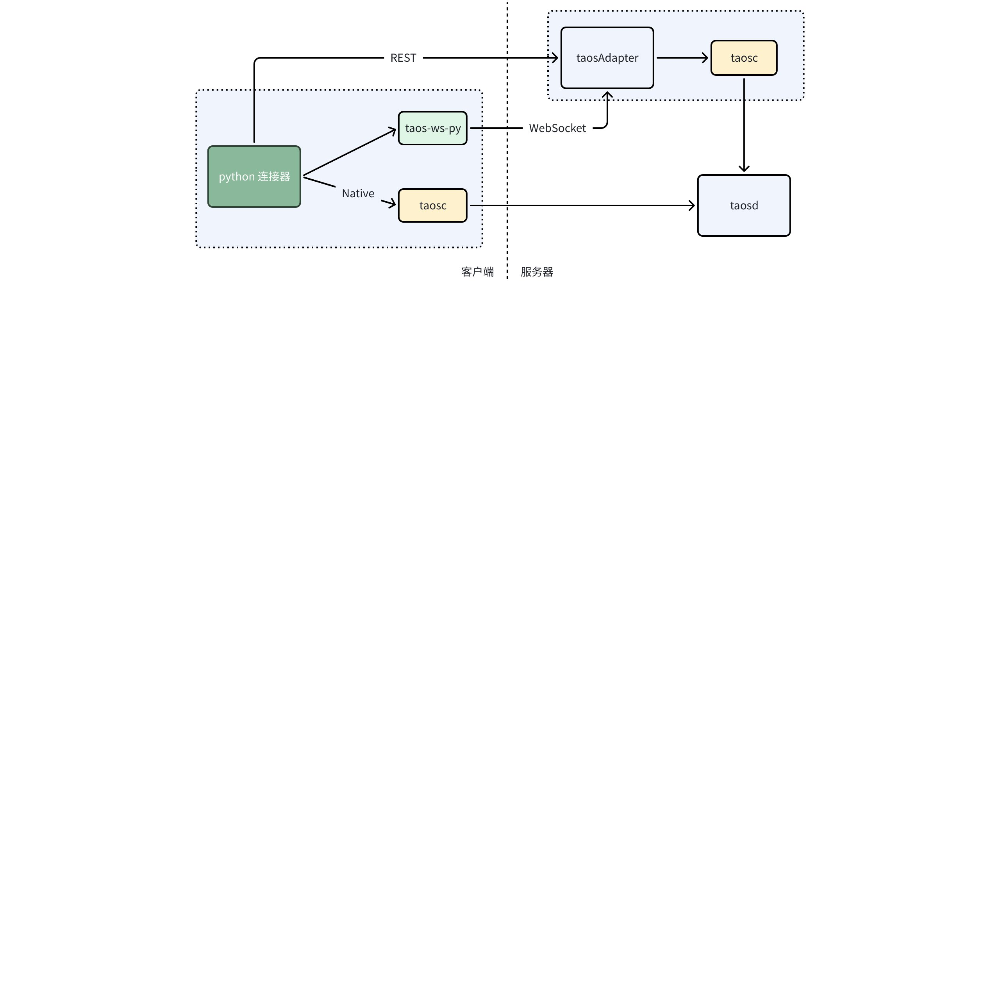
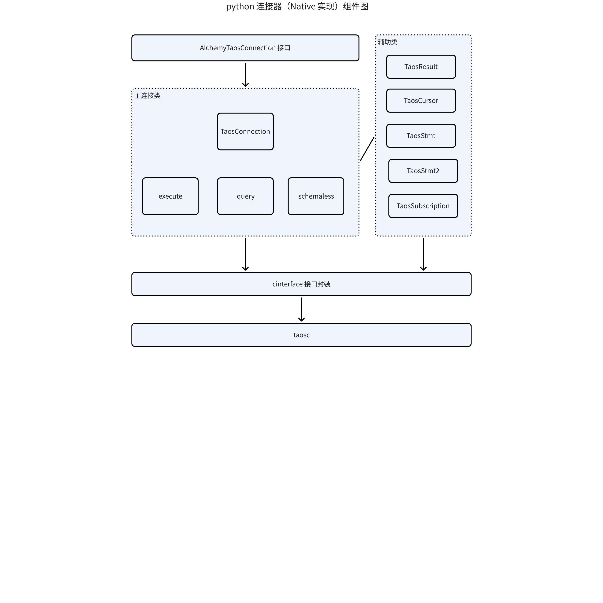
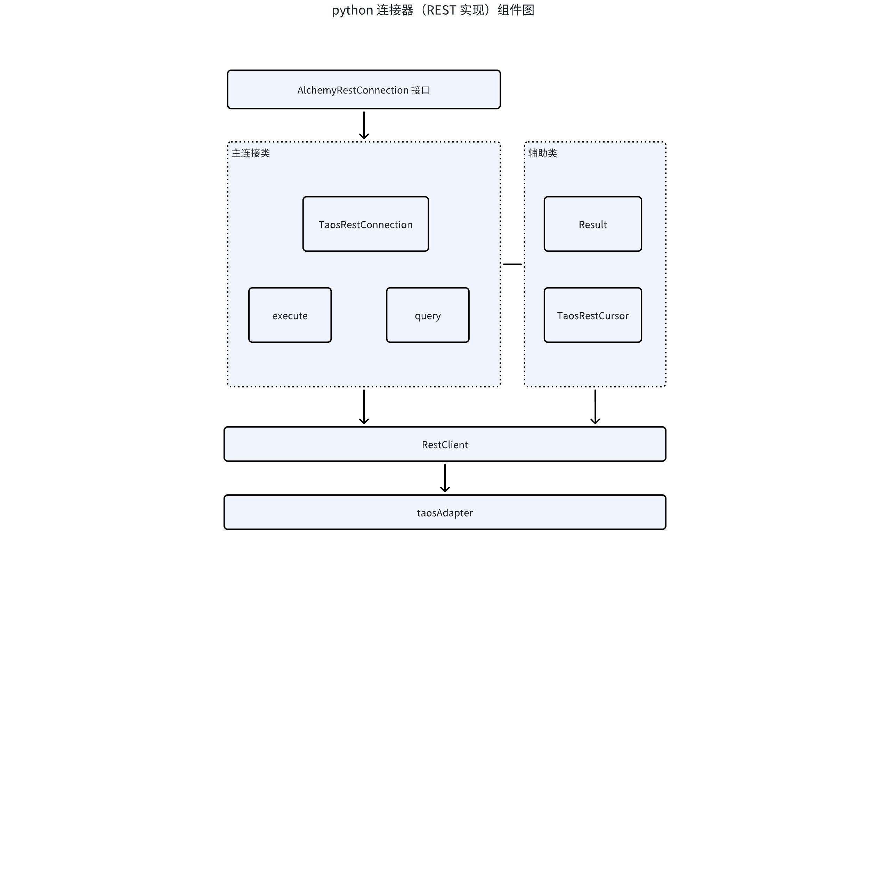
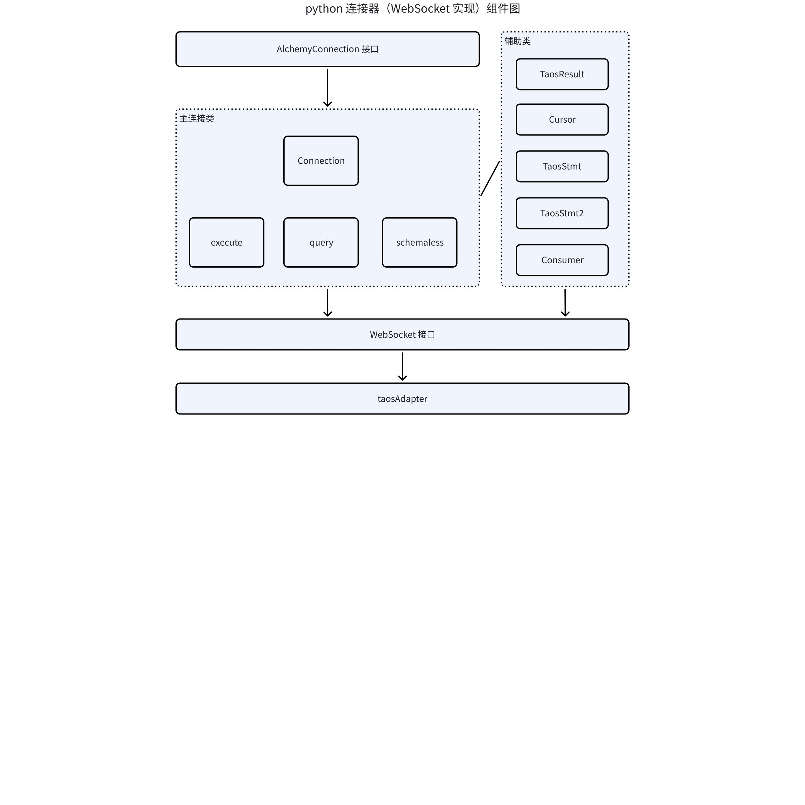
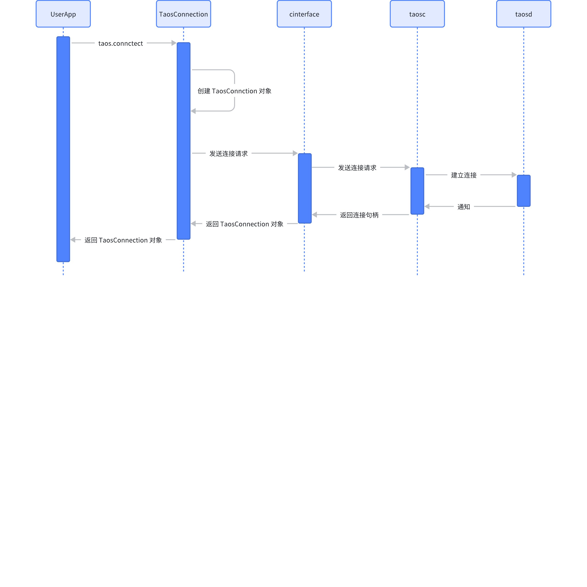
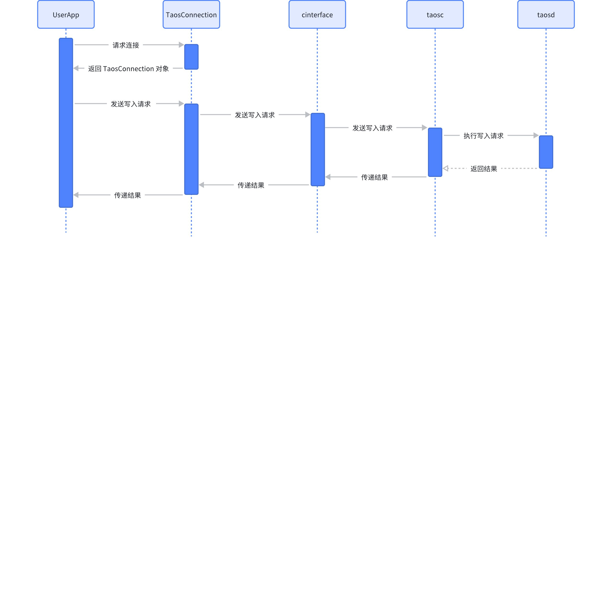

# Python 连接器-Design Spec

## 1. 修订记录

| 日期 | 版本 | 负责人 | 主要修改内容 |
| --- | --- | --- | --- |
| 2025/1/20 | 1.0 | 段宽军 | 创建 |
| 2025/12/8 | 1.1 | 郭振伟 | 更新到 TDengine 3.4.0.0 变更 |

## 2. 引言

1. 目的
  TDengine Python 连接器为 Python 开发者提供了一个高效、标准化的接口来访问 TDengine 数据库，支持高性能的数据写入和查询，充分利用 TDengine 的时序数据特性，并且能够与广泛的工具和框架集成，极大地提升了开发效率和应用性能。
1. 范围
  Python 连接器是一个为 Python 开发者轻松与 TDengine 进行交互的桥接工具，主要用于：
  - 提供通过 SQL 写入和查询相关接口
  - 提供无模式写入相关接口
  - 提供参数绑定写入和查询相关接口
  - 提供数据订阅功能相关接口
1. 受众
需要使用 Python 程序来访问 TDengine 数据库的开发者。

## 3. 术语

1. **无模式写入：**是指在写入数据时无需预先定义表结构，系统会根据数据自动创建或调整表结构的特性。
2. **数据订阅：**允许客户端实时接收数据库中的数据变化，适用于实时监控场景。
3. **参数绑定：**是在 SQL 语句中使用占位符替代具体值的技术，可以防止 SQL 注入并提高性能。
4. **WebSocket：** 是一种在单个 TCP 连接上提供全双工通信的协议。它允许客户端和服务器之间的双向实时通信，避免了 HTTP 请求-响应模型的限制。WebSocket 协议的定义和规范是由 IETF（Internet Engineering Task Force）标准化的，其主要文档是 [RFC 6455](https://datatracker.ietf.org/doc/html/rfc6455)。
5. **FQDN：**全限定域名是互联网域名系统（DNS）中的一种完整的、唯一的域名表示形式，用于明确标识互联网上的特定主机或服务器。
6. **RFC3339：**RFC 3339 是一种时间和日期格式的标准，旨在规范化地表示时间和日期，以便在计算机系统之间传递和处理。
7. **taosd：**TDengine 数据库引擎的核心服务，提供数据访问，多副本，高可用，数据压缩等功能。
8. **taosAdapter：**一个 TDengine 的配套工具，是 TDengine 集群和应用程序之间的桥梁和适配器。提供了 WebSocket 接口来访问 TDengine。
9. **taosc：**taosc（应用驱动）是 TDengine 为应用程序提供的驱动程序，负责处理应用程序与集群之间的接口交互。taosc 提供了 C/C++ 语言的原生接口，并被内嵌于 JDBC、C#、Python、Go 等多种编程语言的连接库中，从而支持这些编程语言与数据库交互。

## 4. 概述

1. 整体架构：


1. 技术：
  - 开发语言：Python
  - WebSocket 框架：https://github.com/TooTallNate/Java-WebSocket
  - sqlAlchemy 技术：https://www.sqlalchemy.org/
  - Python 调用 C & C++ 库 ctypes 技术：https://www.python.org/
  - Python 封装 RUST 类库 pyo3 技术：https://github.com/PyO3/pyo3
1. 依赖项：列出所有依赖项
  - RUST 连接器
  - C & C++ 连接器

## 5. 设计考虑

### 5.1 假设和限制

- 假设
  - 开发者对数据库产品有一些使用经验
  - 大部分情况下网络环境稳定
- 限制
  - TDengine 3.0 及以上版本
  - 创建数据库及表的规模受内存大小直接影响限制

### 5.2 设计模式和原则

模式：
- 单例模式
- 构建器模式
- 工厂方法
原则：
- 简单性原则：力求软件结构简单，避免不必要的复杂化
- 灵活性和适应性原则：所设计的系统应具有对外界环境条件变化的适应性，保证软件良好的生存力
- 模块化原则：将软件划分为独立的模块，每个模块完成特定的功能，模块之间的耦合度最小化，便于软件的开发、维护和扩展

### 5.3 风险和缓解措施

- 风险一：
  - 风险内容：连接器接口被高频调用引擎接口导致性能不足
  - 缓解措施：尽量一次多取，减少 python 连接器调用引擎接口次数

## 6. 详细设计

### 6.1 组件设计

#### 6.1.1 Native 实现组件图





#### 6.1.2 WebSocket 实现组件图



### 6.2 基础场景时序图  

#### 6.2.1 建立连接




#### 6.2.2 执行 SQL 写入




#### 6.2.3 执行 SQL 查询


#### 6.2.4 查看结果


### 6.3 组件详细设计

#### 6.3.1 Native 实现方式组件

##### 6.3.1.1 TaosConnection 类

- 作用
是对外提供接口服务的主要承载者及代理转发者，由对外接口 connect 方法返回类对象，开发者即可通过此类对象实现所有功能的访问 
- 对外主要接口设计
直接对外提供写入执行(execute) 及 SQL 查询（query）及无模式写入(schemaless) 三个主要功能
间接通过不同方法创建 参数绑定对象 (TaosStmt) 及订阅对象（TaosSubscription）等，实现批量写入数据及订阅消费的功能
```python

## 7. connect interfacle return TaosConnection class

def connect(*args, **kwargs):
    # type: (..., ...) -> TaosConnection
    """Function to return a TDengine connector object

    Current supporting keyword parameters:
    @dsn: Data source name as string
    @user: Username as string(optional)
    @password: Password as string(optional)
    @host: Hostname(optional)
    @database: Database name(optional)

    @rtype: TDengineConnector
    """
    return TaosConnection(*args, **kwargs)


## 8. design main method

class TaosConnection(object):
    # execute
    def execute(self, sql, req_id: Optional[int] = None):
    # query
    def query(self, sql: str, req_id: Optional[int] = None) -> TaosResult:
    # schemaless
    def schemaless_insert(
            self,
            lines: List[str],
            protocol: SmlProtocol,
            precision: SmlPrecision,
            req_id: Optional[int] = None,
            ttl: Optional[int] = None,
    ) -> int:
```

##### 8.0.0.1 TaosResult 类

- 作用
由 TaosConnection 类的 query 方法返回此对象类，用于 fetch 查询结果集数据，此类同时也会直接调用 cinterface 中的 C 接口函数 
- 对外主要接口设计
```python

## 9. query result

class TaosResult(object):
    @property
    def field_count(self):
    @property
    def precision(self):
    @property
    def affected_rows(self):
    
    # fetch next row, return tuple
    def next(self):
    # fetch all rows  return list 
    def fetch_all(self):
    # stop and close current query
    def stop_query(self):
    # async fetch rows
    def fetch_rows_a(self, callback, param):
    # fetch with block
    def fetch_block(self):    
```

##### 9.0.0.1 TaosCursor 类

- 作用
由 TaosConnection 类的 cursor 方法返回此对象类，此类是按 sqlachemy 规范实现，提供标准数据库访问方法的实现。此类通过 cinterface 封装直接调用底层 C 方法
- 对外主要接口设计
根据 sqlachemy 规范提供标准对外数据访问接口：
```python
class TaosCursor(object):
    def __init__(self, connection=None, decode_binary=True):
    def __iter__(self):
        return self
    def __next__(self):
        return self._taos_next()
    def next(self):
        return self._taos_next()
    def _taos_next(self):
    @property
    def description(self):
    @property
    def rowcount(self):
    @property
    def affected_rows(self):
    def close(self):
    def execute(self, operation, params=None, req_id: Optional[int] = None):
    def execute_many(self, operation, data_list, req_id: Optional[int] = None):
    def fetchall_row(self):
    def fetchall(self):
    def stop_query(self):
    def __del__(self):
        self.close()
```

##### 9.0.0.2 TaosStmt 类

- 作用
由 TaosConnection 类的 statement 方法返回此对象类，用于 STMT 参数绑定方式快速写入数据，此类同时也会直接调用 cinterface 中的 C 接口函数 
- 对外主要接口设计
```python

## 10. stmt insert class

class TaosStmt(object):
    # stmt prepare 
    def prepare(self, sql):
    # taos_stmt_set_tbname
    def set_tbname(self, name):
    # taos_stmt_set_tbname_tags
    def set_tbname_tags(self, name, tags):
    # bind param with stmt
    def bind_param(self, params, add_batch=True):
    # taos_stmt_bind_param_batch
    def bind_param_batch(self, binds, add_batch=True):
    # taos_stmt_add_batch
    def add_batch(self):
    # taos_stmt_execute
    def execute(self):

```

##### 10.0.0.1 TaosStmt2 类

- 作用
由 TaosConnection 类的 statement2 方法返回此对象类，用于 STMT2 参数绑定方式快速写入数据，此类同时也会直接调用 cinterface 中的 C 接口函数 
- 对外主要接口设计
```python

## 11. stmt2 insert class

class TaosStmt2(object):
    # stmt2 prepare 
    def prepare(self, sql):
    # bind data using independent arrays
    def bind_param(self, tbnames, tags, datas):
    # data is bound using independent tables
    def bind_param_with_tables(self, tables):
    # taos_stmt2_execute
    def execute(self) -> int:
    # retrieve parameter binding query result set
    def result(self):
    # close stmt2
    def close(self):

class TaosStmt(object):
    # stmt prepare 
    def prepare(self, sql):
    # taos_stmt_set_tbname
    def set_tbname(self, name):
    # taos_stmt_set_tbname_tags
    def set_tbname_tags(self, name, tags):
    # bind param with stmt
    def bind_param(self, params, add_batch=True):
    # taos_stmt_bind_param_batch
    def bind_param_batch(self, binds, add_batch=True):
    # taos_stmt_add_batch
    def add_batch(self):
    # taos_stmt_execute
    def execute(self):

```

##### 11.0.0.1 TaosSubscription 类

- 作用
由 TaosConnection 类的 subscribe 方法返回此对象类，用于订阅消息指定主题数据，此类会直接调用 cinterface 中的 C 接口函数 
- 对外主要接口设计
```python
class TaosSubscription(object):
    """TDengine subscription object"""
    def __init__(self, sub, with_callback=False):
    # consumer data and return TaosResult
    def consume(self):
        """Consume rows of a subscription"""

    # taos_unsubscribe 
    def close(self, keepProgress=True):
        """Close the Subscription."""
        return True

    def __del__(self):
        self.close()

```

##### 11.0.0.2 cinterface 接口封装 

- 作用
cinterface 是一个模块，不是一个类，所有对 taosc 库的操作都通过此模块来完成，包括加载库、映射接口及、调用接口及卸载库的所有操作
- 对外主要接口设计
```python
##

## 12. Part 1  load library

##

## 13. load taosc libraray on linux window or macos platform

def _load_taos():

## 14. linux

def _load_taos_linux():

## 15. macos

def _load_taos_darwin():

## 16. windows

def _load_taos_windows():


##

## 17. Part 2 map interface

##

## 18. open connection 

def taos_connect(host=None, user="root", password="taosdata", db=None, port=0):

## 19. close connection

def taos_close(connection):

## 20. query

def taos_query(connection, sql):

## 21. fetch

def taos_fetch_rows_a(result, callback, param):
def taos_fetch_row(result, fields, decode_binary=True):
def taos_fetch_row_raw(result):

## 22. free result

def taos_free_result(result):


## 23. subscribe

def taos_subscribe(connection, restart, topic, sql, interval, callback=None, param=None):

## 24. consumer

def taos_consume(sub):

## 25. unsubscribe

def taos_unsubscribe(sub, keep_progress):


## 26. stmt

def taos_stmt_init(connection):
def taos_stmt_prepare(stmt, sql):
def taos_stmt_close(stmt):
def taos_stmt_set_tbname(stmt, name):
def taos_stmt_set_tbname_tags(stmt, name, tags):
def taos_stmt_bind_param(stmt, bind):
def taos_stmt_bind_param_batch(stmt, bind):
def taos_stmt_bind_single_param_batch(stmt, bind, col):
def taos_stmt_add_batch(stmt):
def taos_stmt_execute(stmt):


```

##### 26.0.0.1 AlchemyTaosConnection 类

- 作用
是 TaosConnection 接口代理类， 由 TaosDialect 类的 doapi() 方法返回此对象类，调用此对象的 connect 方法即会返回要代理的类  TaosConnection  的实例
TaosDialect 支持对 alchemy 类协议的标准访问，如 Apache 的 Superset  产品数据源
- 对外主要接口设计
```python

## 27. only one method

class AlchemyTaosConnection:
paramstyle = "pyformat"

## 28. connect

def connect(self, **kwargs):
    host = kwargs.get("host", "localhost")
    port = kwargs.get("port", "6030")
    user = kwargs.get("username", "root")
    password = kwargs.get("password", "taosdata")
    database = kwargs.get("database", None)
    return taos.connect(host=host, user=user, 
               password=password, port=int(port), database=database)


## 29. parent class

class TaosDialect(BaseDialect):
    name = "taos"
    driver = "taos"

    @classmethod
    def dbapi(cls):
        return AlchemyTaosConnection()

    @classmethod
    def import_dbapi(cls):
        return AlchemyTaosConnection()

        
```

#### 29.0.1 WebSocket 实现方式组件

python 连接器的 websocket 实现实质是由 Rust 连接器实现的，python 起了 proxy 的作用，封装了对外使用接口，同时 websocket 的使用方法基本与native 的大体相同，只不过类名有些小变化。

##### 29.0.1.1 Connection 类

- 作用
是对外提供接口服务的主要承载者及接口转发者，由对外接口 connect 方法返回类对象，开发者即可通过此类对象实现所有功能的访问，具体实现由 rust 连接器完成
- 对外主要接口设计
直接对外提供写入执行(execute) 及 SQL 查询（query）及无模式写入(schemaless) 三个主要功能
间接通过不同方法创建 参数绑定对象 (TaosStmt) 及订阅对象（Consumer）等，实现批量写入数据及订阅消费的功能
```rust
#[pymethods]
impl Connection {
    /// Create new connection
    ///
    /// @dsn: Data Source Name string, optional.
    /// @args:
    #[new]
    pub fn new(_dsn: Option<&str>, _args: Option<&PyDict>) -> PyResult<Self> {
        todo!()
    }
    pub fn query(&self, sql: &str) -> PyResult<TaosResult> {
        match self.current_cursor()?.query(sql) {
            Ok(rs) => {
                let cols = rs.num_of_fields();
                Ok(TaosResult {
                    _inner: rs,
                    _block: None,
                    _current: 0,
                    _num_of_fields: cols as _,
                })
            }
            Err(err) => Err(QueryError::new_err(err.to_string())),
        }
    }

    pub fn query_with_req_id(&self, sql: &str, req_id: u64) -> PyResult<TaosResult> {
        match self.current_cursor()?.query_with_req_id(sql, req_id) {
            Ok(rs) => {
                let cols = rs.num_of_fields();
                Ok(TaosResult {
                    _inner: rs,
                    _block: None,
                    _current: 0,
                    _num_of_fields: cols as _,
                })
            }
            Err(err) => Err(QueryError::new_err(err.to_string())),
        }
    }

    pub fn execute(&self, sql: &str) -> PyResult<i32> {
        match self.current_cursor()?.query(sql) {
            Ok(rs) => Ok(rs.affected_rows()),
            Err(err) => Err(QueryError::new_err(err.to_string())),
        }
    }

    pub fn execute_with_req_id(&self, sql: &str, req_id: u64) -> PyResult<i32> {
        match self.current_cursor()?.query_with_req_id(sql, req_id) {
            Ok(rs) => Ok(rs.affected_rows()),
            Err(err) => Err(QueryError::new_err(err.to_string())),
        }
    }

    /// PEP249 close() method.
    pub fn close(&mut self) {
        self._inner.take();
        self._builder.take();
    }

    /// PEP249 commit() method, do nothing here.
    pub fn commit(&self) {}

    /// PEP249 commit() method, do nothing here.
    pub fn rollback(&self) {}

    ///
    /// PEP249 cursor() method.
    pub fn cursor(&self) -> PyResult<Cursor> {
        Ok(Cursor::new(self.builder()?.build().map_err(|err| {
            ConnectionError::new_err(err.to_string())
        })?))
    }

    /// schemaless data to taos
    pub fn schemaless_insert(
        &self,
        lines: Vec<String>,
        protocol: PySchemalessProtocol,
        precision: PySchemalessPrecision,
        ttl: i32,
        req_id: u64,
    ) -> PyResult<()> {
        let protocol: SchemalessProtocol = protocol.into();
        let precision: SchemalessPrecision = precision.into();

        let data = SmlDataBuilder::default()
            .protocol(protocol)
            .precision(precision)
            .data(lines)
            .ttl(ttl)
            .req_id(req_id)
            .build()
            .map_err(|err| DataError::new_err(err.to_string()))?;

        self.current_cursor()?
            .put(&data)
            .map_err(|err| OperationalError::new_err(err.to_string()))?;

        Ok(())
    }

    pub fn statement(&self) -> PyResult<TaosStmt> {
        let stmt = TaosStmt::init(self)?;
        Ok(stmt)
    }
}


```

##### 29.0.1.2 TaosResult 类

- 作用
由 Connection 类的 query 方法返回此对象类，用于 fetch 查询结果集数据，具体实现由 rust 连接器完成
- 对外主要接口设计
```rust
#[pymethods]
impl TaosResult {
    fn __iter__(slf: PyRef<Self>) -> PyRef<Self> {
        slf
    }
    fn __next__(mut slf: PyRefMut<Self>) -> PyResult<Option<PyObject>> {
        if let Some(block) = slf._block.as_ref() {
            if slf._current >= block.nrows() {
                slf._block = slf
                    ._inner
                    .fetch_raw_block()
                    .map_err(|err| FetchError::new_err(err.to_string()))?;

                slf._current = 0;
            }
        } else {
            slf._block = slf
                ._inner
                .fetch_raw_block()
                .map_err(|err| FetchError::new_err(err.to_string()))?;
        }
        Ok(Python::with_gil(|py| -> Option<PyObject> {
            if let Some(block) = slf._block.as_ref() {
                let mut vec = Vec::new();
                for col in 0..block.ncols() {
                    if let Some(value) = block.get_ref(slf._current, col) {
                        let value = match value {
                            BorrowedValue::Null(_) => Option::<()>::None.into_py(py),
                            BorrowedValue::Bool(v) => v.into_py(py),
                            BorrowedValue::TinyInt(v) => v.into_py(py),
                            BorrowedValue::SmallInt(v) => v.into_py(py),
                            BorrowedValue::Int(v) => v.into_py(py),
                            BorrowedValue::BigInt(v) => v.into_py(py),
                            BorrowedValue::UTinyInt(v) => v.into_py(py),
                            BorrowedValue::USmallInt(v) => v.into_py(py),
                            BorrowedValue::UInt(v) => v.into_py(py),
                            BorrowedValue::UBigInt(v) => v.into_py(py),
                            BorrowedValue::Float(v) => v.into_py(py),
                            BorrowedValue::Double(v) => v.into_py(py),
                            BorrowedValue::Timestamp(ts) => {
                                ts.to_datetime_with_tz().to_string().into_py(py)
                            }
                            BorrowedValue::VarChar(s) => s.into_py(py),
                            BorrowedValue::NChar(v) => v.as_ref().into_py(py),
                            BorrowedValue::Json(j) => std::str::from_utf8(&j).unwrap().into_py(py),
                            BorrowedValue::VarBinary(v) => v.as_ref().into_py(py),
                            BorrowedValue::Geometry(v) => v.as_ref().into_py(py),
                            _ => Option::<()>::None.into_py(py),
                        };
                        vec.push(value);
                    }
                }
                slf._current += 1;
                return Some(PyTuple::new(py, vec).to_object(py));
            }
            None
        }))
    }


```

##### 29.0.1.3 Cursor 类

- 作用
由 onnection 类的 cursor 方法返回此对象类，此类是按 sqlachemy 规范实现，提供标准数据库访问方法的实现。此为 python 接口代理类，具体实现由 rust 连接器完成
- 对外主要接口设计
根据 sqlachemy 规范提供标准对外数据访问接口：
```rust
#[pymethods]
impl Cursor {
    /// This read-only attribute is a sequence of 7-item sequences.
    ///
    /// Each of these sequences contains information describing one result column:
    ///
    /// - name
    /// - type_code
    /// - display_size
    /// - internal_size
    /// - precision
    /// - scale
    /// - null_ok
    ///
    /// The first two items (name and type_code) are mandatory, the other five are optional and are set to None if no meaningful values can be provided.
    ///
    /// This attribute will be None for operations that do not return rows or if the cursor has not had an operation invoked via the .execute*() method yet.
    ///
    /// The type_code can be interpreted by comparing it to the Type Objects specified in the section below.
    #[getter]
    pub fn description(&mut self) -> PyResult<Vec<PyObject>> {
        Python::with_gil(|py| {
            Ok(self
                .current_result_set()?
                .fields()
                .iter()
                .map(|field| {
                    PyTuple::new(
                        py,
                        [
                            field.name().to_object(py),
                            (field.ty() as u8).to_object(py),
                            field.bytes().to_object(py),
                        ],
                    )
                    .to_object(py)
                })
                .collect())
        })
    }

    /// This read-only attribute specifies the number of rows that the last .execute*() produced
    ///  (for DQL statements like SELECT) or affected (for DML statements like UPDATE or INSERT).
    #[getter]
    pub fn row_count(&self) -> usize {
        self.row_count
    }

    /// PEP249 void method
    pub fn call_proc(&self) -> PyResult<()> {
        Err(NotSupportedError::new_err(
            "Cursor.call_proc() method is not supported",
        ))
    }

    /// Close the cursor now (rather than whenever `__del__` is called).
    pub fn close(&mut self) {
        self.inner.take();
    }

    #[args(py_args = "*", parameters = "**")]
    pub fn execute(
        &mut self,
        operation: &PyString,
        py_args: &PyTuple,
        parameters: Option<&PyDict>,
    ) -> PyResult<usize> {
        let sql = Python::with_gil(|py| {
            let sql: String = if let Some(parameters) = parameters {
                let local = PyDict::new(py);
                local.set_item("parameters", parameters)?;
                local.set_item("operation", operation)?;
                local.set_item("args", py_args)?;
                let sql = py.eval("operation.format(*args, **parameters)", None, Some(local))?;
                sql.extract()?
            } else {
                let local = PyDict::new(py);
                local.set_item("operation", operation)?;
                local.set_item("args", py_args)?;
                let sql = py.eval("operation.format(*args)", None, Some(local))?;
                sql.extract()?
            };
            Ok::<_, PyErr>(sql)
        })?;
        let result_set = self
            .inner()?
            .query(sql)
            .map_err(|err| OperationalError::new_err(err.to_string()))?;
        let affected_rows = result_set.affected_rows();
        self.result_set.replace(result_set);
        self.row_count = affected_rows as _;
        Ok(affected_rows as _)
    }

    #[args(py_args = "*", parameters = "**")]
    pub fn execute_with_req_id(
        &mut self,
        operation: &PyString,
        py_args: &PyTuple,
        parameters: Option<&PyDict>,
        req_id: u64,
    ) -> PyResult<usize> {
        let sql = Python::with_gil(|py| {
            let sql: String = if let Some(parameters) = parameters {
                let local = PyDict::new(py);
                local.set_item("parameters", parameters)?;
                local.set_item("operation", operation)?;
                local.set_item("args", py_args)?;
                let sql = py.eval("operation.format(*args, **parameters)", None, Some(local))?;
                sql.extract()?
            } else {
                let local = PyDict::new(py);
                local.set_item("operation", operation)?;
                local.set_item("args", py_args)?;
                let sql = py.eval("operation.format(*args)", None, Some(local))?;
                sql.extract()?
            };
            Ok::<_, PyErr>(sql)
        })?;
        let result_set = self
            .inner()?
            .query_with_req_id(sql, req_id)
            .map_err(|err| OperationalError::new_err(err.to_string()))?;
        let affected_rows = result_set.affected_rows();
        self.result_set.replace(result_set);
        self.row_count = affected_rows as _;
        Ok(affected_rows as _)
    }

    #[args(py_args = "*", parameters = "**")]
    pub fn execute_many(
        &mut self,
        operation: &PyString,
        seq_of_parameters: &PySequence,
    ) -> PyResult<usize> {
        let sql = Python::with_gil(|py| {
            let vec: Vec<_> = seq_of_parameters
                .iter()?
                .map(|row| -> PyResult<String> {
                    // let params = row.extract().unwrap();
                    let row = row?;
                    if row.is_instance_of::<PyDict>()? {
                        let local = PyDict::new(py);
                        local.set_item("args", row)?;
                        local.set_item("operation", operation)?;
                        let sql = py.eval("operation.format(**args)", None, Some(local))?;
                        sql.extract()
                    } else {
                        let local = PyDict::new(py);
                        local.set_item("args", row)?;
                        local.set_item("operation", operation)?;
                        let sql = py.eval("operation.format(*args)", None, Some(local))?;
                        sql.extract()
                    }
                })
                .try_collect()?;
            Ok::<_, PyErr>(vec)
        })?;
        let affected_rows = self
            .inner()?
            .exec_many(sql)
            .map_err(|err| OperationalError::new_err(err.to_string()))?;
        self.row_count = affected_rows;
        Ok(affected_rows)
    }

    #[args(py_args = "*", parameters = "**")]
    pub fn execute_many_with_req_id(
        &mut self,
        operation: &PyString,
        seq_of_parameters: &PySequence,
        req_id: u64,
    ) -> PyResult<usize> {
        let sql = Python::with_gil(|py| {
            let vec: Vec<_> = seq_of_parameters
                .iter()?
                .map(|row| -> PyResult<String> {
                    // let params = row.extract().unwrap();
                    let row = row?;
                    if row.is_instance_of::<PyDict>()? {
                        let local = PyDict::new(py);
                        local.set_item("args", row)?;
                        local.set_item("operation", operation)?;
                        let sql = py.eval("operation.format(**args)", None, Some(local))?;
                        sql.extract()
                    } else {
                        let local = PyDict::new(py);
                        local.set_item("args", row)?;
                        local.set_item("operation", operation)?;
                        let sql = py.eval("operation.format(*args)", None, Some(local))?;
                        sql.extract()
                    }
                })
                .try_collect()?;
            Ok::<_, PyErr>(vec)
        })?;
        let affected_rows = sql
            .into_iter()
            .map(|sql| {
                self.inner()?
                    .query_with_req_id(sql, req_id)
                    .map_err(|err| OperationalError::new_err(err.to_string()))
            })
            .try_fold(0, |mut acc, aff| {
                acc += aff?.affected_rows() as usize;
                Ok::<usize, PyErr>(acc)
            })?;
        self.row_count = affected_rows;
        Ok(affected_rows)
    }

    /// PEP249 void method
    pub fn fetchone(&mut self) -> PyResult<Option<PyObject>> {
        self.assert_block()?;

        Ok(Python::with_gil(|py| -> Option<PyObject> {
            if let Some(block) = self.block.as_ref() {
                let row = get_row_of_block(py, block, self.row_in_block).unwrap();
                self.row_in_block += 1;
                return Some(row);
            }
            None
        }))
    }
    /// PEP249 void method
    pub fn fetchmany(&mut self, size: Option<usize>) -> PyResult<Option<Vec<PyObject>>> {
        self.assert_block()?;

        if let Some(size) = size {
            Python::with_gil(|py| {
                let mut range = self.row_in_block..size;
                let mut all = Vec::new();
                loop {
                    if let Some(block) = self.block.take() {
                        let (slice, remain) = get_slice_of_block(py, &block, range.clone());
                        all.extend(slice);
                        if remain.is_none() {
                            self.row_in_block += range.end - range.start;
                            break;
                        } else {
                            let remain = remain.unwrap();
                            self.row_in_block = block.nrows();
                            self.row_count += block.nrows() - range.start;
                            self.assert_block()?;
                            range = 0..remain;
                        }
                    } else {
                        break;
                    }
                }
                Ok(Some(all))
            })
        } else {
            self.row_in_block = 0;
            if let Some(block) = self.block.take() {
                self.row_count += block.nrows();
                return Ok(Some(Python::with_gil(|py| get_all_of_block(py, &block))));
            } else {
                return Ok(None);
            }
        }
    }
    /// Fetch all rows into a sequence of tuple.
    pub fn fetchall(&mut self) -> PyResult<Option<Vec<PyObject>>> {
        self.fetchmany(Some(usize::MAX))
    }

    /// Fetch all rows in the current result set into a sequence of dict.
    ///
    /// Just an alias of `fetch_all_into_dict()`.
    pub fn fetchallintodict(&mut self) -> PyResult<Option<Vec<PyObject>>> {
        if let Some(all) = self.fetchall()? {
            let names: Vec<_> = self
                .current_result_set()?
                .fields()
                .iter()
                .map(|f| f.name())
                .collect();
            let list = all
                .into_iter()
                .map(|tuple| {
                    Python::with_gil(|py| -> PyResult<_> {
                        let tuple: Vec<PyObject> = tuple.extract(py)?;
                        let dict = PyDict::new(py);
                        for (key, value) in names.iter().zip(tuple) {
                            dict.set_item(key, value)?;
                        }
                        Ok(dict.to_object(py))
                    })
                })
                .try_collect()?;
            Ok(Some(list))
        } else {
            Ok(None)
        }
    }

    /// Fetch all rows in the current result set into a sequence of dict.
    pub fn fetch_all_into_dict(&mut self) -> PyResult<Option<Vec<PyObject>>> {
        self.fetchallintodict()
    }
    /// PEP249 void method, underline interface does not support multiple result sets.
    pub fn nextset(&self) -> PyResult<()> {
        Err(NotSupportedError::new_err(
            "Cursor.nextset() method is not supported, because it does not support multiple result sets",
        ))
    }

    /// Returns none by default.
    #[getter]
    pub fn arraysize(&self) -> Option<usize> {
        None
    }

    /// PEP249 void method
    #[getter]
    pub fn setinputsizes(&self) {}
    /// PEP249 void method
    #[getter]
    pub fn setoutputsizes(&self) {}
}


```

##### 29.0.1.4 TaosStmt 类

- 作用
由 Connection 类的 statement 方法返回此对象类，用于参数绑定方式快速写入数据，此为 python 接口代理类，具体实现由 rust 连接器完成
- 对外主要接口设计
```rust
#[pymethods]
impl TaosStmt {
    #[new]
    fn init(conn: &Connection) -> PyResult<TaosStmt> {
        let stmt = Stmt::init(conn.current_cursor()?)
            .map_err(|err| ConnectionError::new_err(err.to_string()))?;
        let stmt = TaosStmt { _inner: stmt };
        return Ok(stmt);
    }

    fn prepare(&mut self, sql: &str) -> PyResult<()> {
        self._inner
            .prepare(sql)
            .map_err(|err| ProgrammingError::new_err(err.to_string()))?;
        Ok(())
    }

    fn set_tbname(&mut self, table_name: &str) -> PyResult<()> {
        self._inner
            .set_tbname(table_name)
            .map_err(|err| ProgrammingError::new_err(err.to_string()))?;
        Ok(())
    }

    fn set_tags(&mut self, tags: Vec<PyTagView>) -> PyResult<()> {
        let tags = tags.into_iter().map(|tag| tag._inner).collect_vec();
        self._inner
            .set_tags(&*tags)
            .map_err(|err| ProgrammingError::new_err(err.to_string()))?;
        Ok(())
    }

    fn set_tbname_tags(&mut self, table_name: &str, tags: Vec<PyTagView>) -> PyResult<()> {
        let tags = tags.into_iter().map(|tag| tag._inner).collect_vec();
        self._inner
            .set_tbname(table_name)
            .map_err(|err| ProgrammingError::new_err(err.to_string()))?
            .set_tags(&*tags)
            .map_err(|err| ProgrammingError::new_err(err.to_string()))?;
        Ok(())
    }

    fn bind_param(&mut self, params: Vec<PyColumnView>) -> PyResult<()> {
        let params = params.into_iter().map(|tag| tag._inner).collect_vec();
        self._inner
            .bind(&*params)
            .map_err(|err| ProgrammingError::new_err(err.to_string()))?;
        Ok(())
    }

    fn add_batch(&mut self) -> PyResult<()> {
        self._inner
            .add_batch()
            .map_err(|err| ProgrammingError::new_err(err.to_string()))?;
        Ok(())
    }

    fn execute(&mut self) -> PyResult<usize> {
        let rows = self
            ._inner
            .execute()
            .map_err(|err| QueryError::new_err(err.to_string()))?;
        Ok(rows)
    }

    fn affect_rows(&mut self) -> PyResult<usize> {
        let rows = self._inner.affected_rows();
        Ok(rows)
    }

    fn close(&self) -> PyResult<()> {
        Ok(())
    }
}
```

##### 29.0.1.5 TaosStmt2 类

- 作用
由 Connection 类的 stmt2_statement 方法返回此对象类，用于参数绑定方式快速写入数据，此为 python 接口代理类，具体实现由 rust 连接器完成
- 对外主要接口设计
```rust {wrap}
#[pymethods]
impl TaosStmt2 {
    #[new]
    fn init(conn: &Connection) -> PyResult<TaosStmt2> {
        let stmt = Stmt2::init(conn.current_cursor()?)
            .map_err(|err| ConnectionError::new_err(err.to_string()))?;
        Ok(TaosStmt2 {
            _inner: stmt,
            _tz: conn._tz,
        })
    }

    fn prepare(&mut self, sql: &str) -> PyResult<()> {
        self._inner
            .prepare(sql)
            .map_err(|err| ProgrammingError::new_err(err.to_string()))?;
        Ok(())
    }

    fn bind(&mut self, params: Vec<PyStmt2BindParam>) -> PyResult<()> {
        let params = params.into_iter().map(|param| param._inner).collect_vec();
        self._inner
            .bind(&params)
            .map_err(|err| ProgrammingError::new_err(err.to_string()))?;
        Ok(())
    }

    fn execute(&mut self) -> PyResult<usize> {
        let rows = self
            ._inner
            .exec()
            .map_err(|err| QueryError::new_err(err.to_string()))?;
        Ok(rows)
    }

    fn affect_rows(&mut self) -> PyResult<usize> {
        let rows = self._inner.affected_rows();
        Ok(rows)
    }

    fn result_set(&mut self) -> PyResult<TaosResult> {
        match self._inner.result_set() {
            Ok(rs) => {
                let cols = rs.num_of_fields();
                Ok(TaosResult {
                    _inner: rs,
                    _block: None,
                    _current: 0,
                    _num_of_fields: cols as _,
                    _tz: self._tz,
                })
            }
            Err(err) => Err(QueryError::new_err(err.to_string())),
        }
    }

    fn close(&self) -> PyResult<()> {
        Ok(())
    }
}
```

##### 29.0.1.6 Consumer 类

- 作用
由 Connection 类的 subscribe 方法返回此对象类，用于订阅消息指定主题数据，此为 python 接口代理类，具体实现由 rust 连接器完成
- 对外主要接口设计
```rust
#[pymethods]
impl Consumer {
    #[new]
    pub fn new(conf: Option<&PyDict>, dsn: Option<&str>) -> PyResult<Self> {
        let mut builder = Dsn::default();
        builder.driver = "taos".to_string();
        if let Some(value) = dsn {
            builder = value.parse().map_err(|err| {
                ConsumerException::new_err(format!("Parse dsn(`{value}`) error: {err}"))
            })?;
        }
        if let Some(args) = conf {
            let mut addr = Address::default();

            if let Some(scheme) = args
                .get_item("td.connect.websocket.scheme")
                .or(args.get_item("protocol"))
                .or(args.get_item("driver"))
            {
                let scheme = scheme.downcast::<PyString>().map_err(|_err| {
                    ConsumerException::new_err(format!("Invalid td.connect.websocket.scheme value type: {}, only `'ws'|'wss'` is supported", scheme.get_type().to_string()))
                })?;
                builder.protocol = Some(scheme.to_string())
            }
            match (
                args.get_item("td.connect.ip").or(args.get_item("host")),
                args.get_item("td.connect.port").or(args.get_item("port")),
            ) {
                (Some(host), Some(port)) => {
                    addr.host.replace(host.extract::<String>()?);
                    if port.is_instance_of::<pyo3::types::PyInt>()? {
                        addr.port.replace(port.extract()?);
                    } else if port.is_instance_of::<PyString>()? {
                        addr.port.replace(port.extract::<String>()?.parse()?);
                    } else {
                        Err(ConsumerException::new_err(format!("Invalid port: {port}")))?;
                    }
                }
                (Some(host), None) => {
                    addr.host.replace(host.extract::<String>()?);
                }
                (_, Some(port)) => {
                    if port.is_instance_of::<pyo3::types::PyInt>()? {
                        addr.port.replace(port.extract()?);
                    } else if port.is_instance_of::<PyString>()? {
                        addr.port.replace(port.extract::<String>()?.parse()?);
                    } else {
                        Err(ConsumerException::new_err(format!("Invalid port: {port}")))?;
                    }
                }
                _ => {
                    addr.host.replace("localhost".to_string());
                }
            }
            builder.addresses.push(addr);

            if let Some(value) = args
                .get_item("td.connect.user")
                .or(args.get_item("username"))
                .or(args.get_item("user"))
            {
                builder.username.replace(value.extract()?);
            }
            if let Some(value) = args
                .get_item("td.connect.pass")
                .or(args.get_item("password"))
            {
                builder.password.replace(value.extract()?);
            }
            if let Some(value) = args.get_item("td.connect.token").or(args.get_item("token")) {
                builder.set("token", value.extract::<String>()?);
            }

            if let Some(value) = args.get_item("group.id") {
                builder.set("group.id", value.extract::<String>()?);
            } else {
                Err(ConsumerException::new_err(
                    "group.id must be set in configurations",
                ))?;
            }

            builder.set("enable.auto.commit", "true");
            builder.set("experimental.snapshot.enable", "false");
            const KEYS: &[&str] = &[
                "client.id",
                "auto.offset.reset",
                "enable.auto.commit",
                "auto.commit.interval.ms",
                "enable.heartbeat.background",
                "experimental.snapshot.enable",
                "session.timeout.ms",
                "max.poll.interval.ms",
            ];
            for key in KEYS {
                if let Some(value) = args.get_item(key) {
                    builder.set(*key, value.extract::<String>()?);
                }
            }
        }
        let builder = TmqBuilder::from_dsn(builder)
            .map_err(|err| ConsumerException::new_err(err.to_string()))?;
        Ok(Consumer(Some(builder.build().map_err(|err| {
            ConsumerException::new_err(err.to_string())
        })?)))
    }

    pub fn subscribe(&mut self, topics: &PyList) -> PyResult<()> {
        self.inner()?
            .subscribe(topics.extract::<Vec<String>>()?)
            .map_err(|err| ConsumerException::new_err(format!("{err}")))
    }

    pub fn unsubscribe(&mut self) {
        if let Some(consumer) = self.0.take() {
            consumer.unsubscribe();
        }
    }

    /// return list of topics
    pub fn list_topics(&mut self) -> PyResult<Vec<String>> {
        let topics = self.inner()?.list_topics().unwrap();
        Ok(topics)
    }

    ///
    pub fn poll(&mut self, timeout: Option<f64>) -> PyResult<Option<Message>> {
        let timeout = if let Some(timeout) = timeout {
            Timeout::Duration(Duration::from_secs_f64(timeout))
        } else {
            Timeout::Never
        };
        let message = self
            .inner()?
            .recv_timeout(timeout)
            .map_err(|err| ConsumerException::new_err(format!("{err}")))?;

        if let Some((offset, message)) = message {
            Ok(Some(Message {
                _offset: Some(offset),
                _msg: message,
            }))
        } else {
            Ok(None)
        }
    }

    /// Commit a `message`.
    pub fn commit(&mut self, message: &mut Message) -> PyResult<()> {
        self.inner()?
            .commit(message._offset.take().unwrap())
            .unwrap();
        Ok(())
    }

    /// Commit a offset
    pub fn commit_offset(&mut self, topic: &str, vg_id: i32, offset: i64) -> PyResult<()> {
        self.inner()?.commit_offset(topic, vg_id, offset).unwrap();
        Ok(())
    }

    /// get topics assignment
    pub fn assignment(&mut self) -> PyResult<Option<Vec<TopicAssignment>>> {
        if let Some(assignments) = self.inner()?.assignments() {
            let result = assignments
                .into_iter()
                .map(|(topic, topic_assignments)| {
                    let py_assignments = topic_assignments
                        .into_iter()
                        .map(|item| Assignment {
                            _vg_id: item.vgroup_id(),
                            _offset: item.current_offset(),
                            _begin: item.begin(),
                            _end: item.end(),
                        })
                        .collect();
                    TopicAssignment {
                        _topic: topic,
                        _assignment: py_assignments,
                    }
                })
                .collect();
            Ok(Some(result))
        } else {
            Ok(None)
        }
    }

    /// seek topic to offset
    pub fn seek(&mut self, topic: &str, vg_id: i32, offset: i64) -> PyResult<()> {
        self.inner()?.offset_seek(topic, vg_id, offset).unwrap();
        Ok(())
    }

    /// return committed
    pub fn committed(&mut self, topic: &str, vg_id: i32) -> PyResult<i64> {
        let offset = self.inner()?.committed(topic, vg_id).unwrap();
        Ok(offset)
    }

    /// return position
    pub fn position(&mut self, topic: &str, vg_id: i32) -> PyResult<i64> {
        let offset = self.inner()?.position(topic, vg_id).unwrap();
        Ok(offset)
    }

    /// Unsubscribe and close the consumer.
    pub fn close(&mut self) {
        if let Some(consumer) = self.0.take() {
            consumer.unsubscribe();
        }
    }
}


```


##### 29.0.1.7 TaosWsDialect 类

- 作用
是 Connection 接口代理类，  TaosDialect 类的 doapi() 方法返回连接对象代理类，
TaosWsDialect 支持对 alchemy 类协议的标准访问，如 Apache 的 Superset  产品数据源
- 对外主要接口设计
```python

## 30. ws dailet

class TaosWsDialect(BaseDialect):
    # set taosws
    name = "taosws"
    driver = "taosws"

    # doapi
    @classmethod
    def dbapi(cls):
        import taosws
        return taosws

    # import dbapi
    @classmethod
    def import_dbapi(cls):
        import taosws
        return taosws

        
```

## 31. 接口规范

请参考 [Python 连接器-Function Spec - 门世斌](https://taosdata.feishu.cn/wiki/M2TPwtCypi4vMBkCC7hcPunUnAg)

## 32. 安全考虑

- 凭据保护（T-PYCONN-01/02/03）：禁止在代码中硬编码用户名、密码或 Token，推荐通过环境变量、密钥管理服务或加密配置文件读取凭据。连接器日志输出默认对密码、Token 等敏感信息进行脱敏处理，日志中不记录完整凭据或连接字符串。生产环境下，凭据不应以明文形式存储或长时间保留在内存中，示例代码和文档均展示安全凭据管理方式。
- 传输加固（T-PYCONN-05/06/07）：WebSocket 连接默认使用 wss://，原生连接加密能力在文档中明确说明。所有加密连接默认启用 SSL/TLS 证书验证，禁用验证时需显示配置并警告风险。数据传输通过加密通道保障机密性与完整性。
- 输入校验与注入防护（T-PYCONN-04）：所有 SQL 执行接口均支持参数绑定（Prepared Statement），防止 SQL 注入。文档和示例代码强调参数绑定为推荐实践；对于不支持参数绑定的场景，提供输入校验和转义指导，拒绝危险输入。
- 日志脱敏与最小化（T-PYCONN-03/09）：日志输出默认脱敏密码、Token、个人身份信息，SQL 语句日志输出可配置开关。生产环境错误信息简化，避免暴露内部实现细节，详细错误仅记录到安全日志系统。日志文件权限建议为 0600，防止未授权访问。
- 审计与可追溯（T-PYCONN-15）：连接器支持可选审计日志功能，记录关键操作（如连接建立/断开、SQL 执行、数据修改），日志包含时间戳、用户标识、操作类型等，便于安全事件追溯。审计日志不包含敏感数据内容。
- 资源与速率保护（T-PYCONN-10/11/12）：支持连接池配置，包括最大连接数、超时、空闲回收等，防止连接耗尽。查询接口支持超时配置，防止慢查询占用资源。文档建议应用层实现写入速率限制，参数绑定和无模式写入接口对单次数据量设有合理上限。
- 依赖与供应链安全（T-PYCONN-13/14）：客户端库文件通过官方 PyPI 仓库分发，提供哈希值或数字签名供用户校验完整性。CI/CD 流程集成依赖安全扫描工具，定期检查并修复第三方依赖漏洞。
- 合规与隐私（T-PYCONN-08）：遵循 GDPR、CCPA 等数据保护法规，文档提供数据最小化和匿名化指导。开发与实现参考 OWASP 安全编码标准，适用场景下参考 PCI DSS 等行业标准。
- 错误处理（T-PYCONN-09）：生产环境下错误信息简化，避免返回堆栈、SQL 语句等内部细节，详细错误仅记录于安全日志。提供调试模式开关，便于开发环境排查问题。
- 文档与示例安全（全局）：所有用户文档和示例代码均展示安全最佳实践，包括凭据管理、加密连接、参数绑定等，避免误导用户采用不安全用法。

## 33. 性能和可扩展性

性能要求，在 vm98（16核心 Intel(R) Core(TM) i7-10700 CPU @ 2.90GHz， 64G内存）机器上测试：
- 查询：单线程拉取 meters 表，Native 连接性能不低于 100W/s
- SQL 写入：单线程写入 meters 表，Native 连接性能不低于10 W/s
- 参数绑定写入：单线程写入 meters 表，Native 连接性能不低于100 W/s
- 数据订阅：单线程拉取数据，Native 连接不低于  10W/s

## 34. 部署和配置

1. 部署
  ```java
  pip3 install taospy
  pip3 install taos-ws-py
  ```

1. 配置使用
  ```python
  # native
  import taos
  
  # webscoket
  import taosws
  ```

## 35. 监控和维护

1. 监控： 在仓库的 github workflow 中持续集成了功能正确性验证的 case,  代码更新时这些 CASE 会触发检测运行，保证功能的持续正确性
2. 维护：版本维护使用 pip3 包管理器，定期通过  pip3 install  ... 可拉取到最新版本

## 36. 参考资料

1. [Python 连接器-Requirement Spec - 门世斌](https://taosdata.feishu.cn/wiki/TFhkwReG2ixpfNkqiE1ciByqnUh)
2. [Python 连接器-Function Spec - 门世斌](https://taosdata.feishu.cn/wiki/M2TPwtCypi4vMBkCC7hcPunUnAg)
