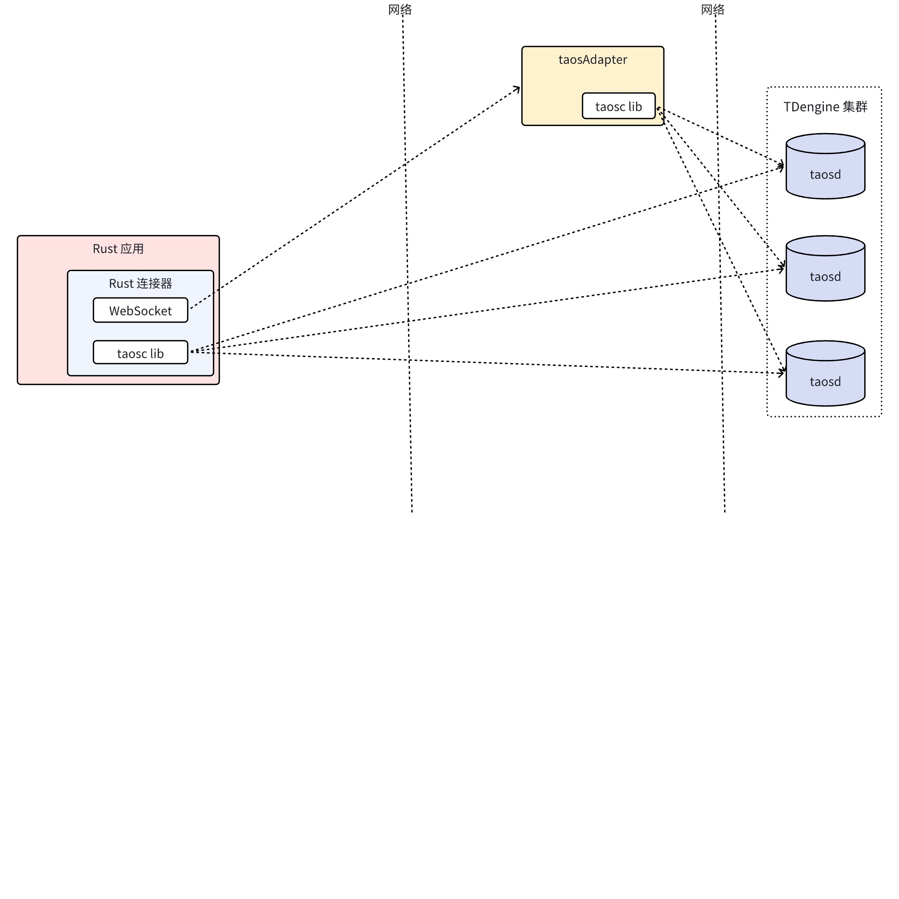
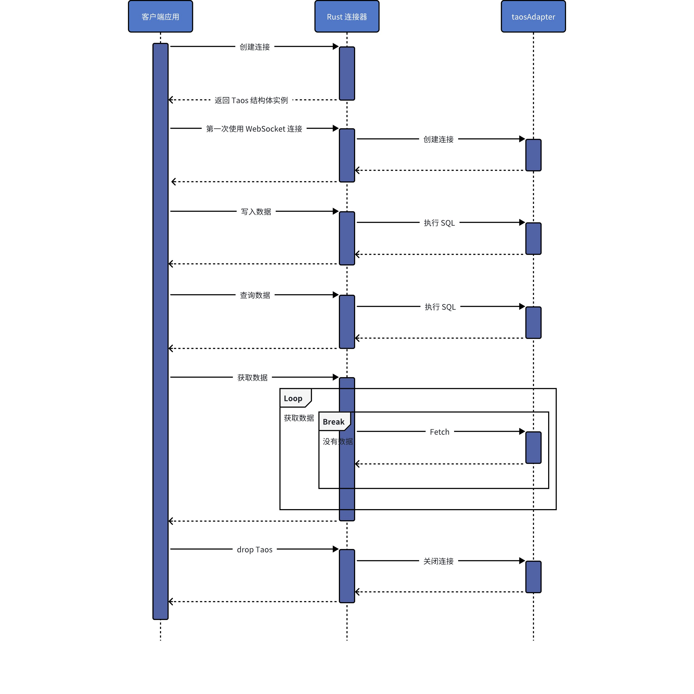
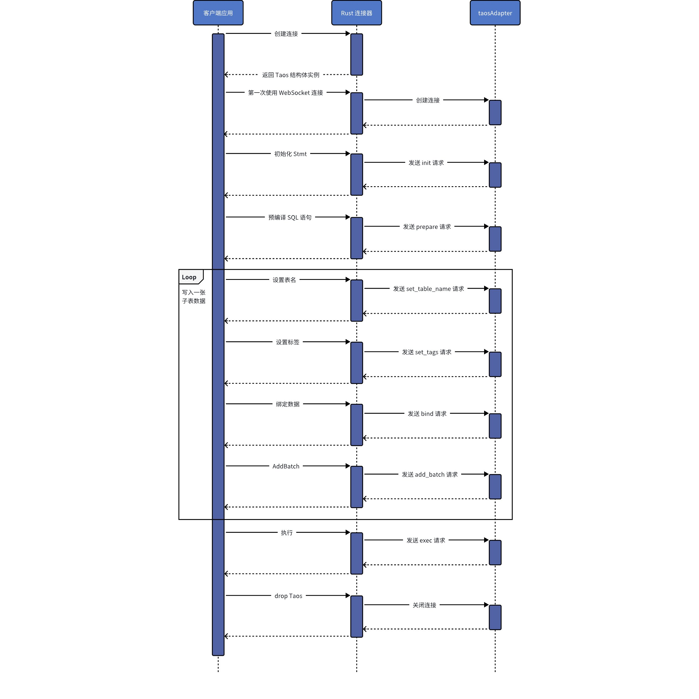

# Rust 连接器-Design Spec

## 1. 修订记录

| 日期 | 版本 | 负责人 | 主要修改内容 |
| --- | --- | --- | --- |
| 2025/01/10 | 1.0 | 郭振伟 | 编写文档。 |
| 2026/01/19 | 1.1 | 郭振伟 | 更新文档至 TDengine v3.4.0.0 版本。 |

## 2. 引言

1. 目的
  本文旨在详细阐述 TDengine 数据库 Rust 连接器的设计理念、技术架构和实现细节，确保开发团队在实现过程中能够遵循统一的指导方针。作为一款专为 Rust 开发者设计的连接器，它将充分利用 TDengine 的时序数据特性，为开发者提供高效、可靠且灵活的接口，支持高性能的数据写入与查询，同时与 Rust 的生态系统高度兼容。
1. 范围
  Rust 连接器是为 Rust 开发者设计的 TDengine 数据库连接工具，旨在充分发挥 Rust 的语言特性和 TDengine 的时序数据优势。其主要功能包括：
  - 写入和查询：支持数据的写入和查询操作。
  - 无模式写入：支持无需预先定义表结构的快速数据写入，适用于动态数据场景。
  - 参数绑定：提供参数化接口，支持高效、安全的数据操作。
  - 数据订阅：提供数据订阅接口，允许开发者实时监听和处理数据流。
1. 受众
  该文档将作为开发人员、测试人员和维护团队的技术参考手册，帮助他们理解如何构建一个既符合 Rust 开发最佳实践，又能充分发挥 TDengine 性能优势的连接器。

## 3. 术语

1. **taosAdapter**：一个 TDengine 的配套工具，是 TDengine 集群和应用程序之间的桥梁和适配器。提供了 REST/WebSocket 连接来访问 TDengine 数据库。
2. **taosd**：TDengine 数据库引擎的核心服务，提供数据访问、多副本、高可用和数据压缩等功能。
3. **taosc**：TDengine 为应用程序提供的客户端驱动程序，负责处理应用程序与集群之间的接口交互。taosc 提供了 C/C++ 语言的原生接口，并被集成到 JDBC、C#、Python、Go 等多种编程语言的连接库中，从而支持这些语言与数据库的交互。
4. **参数绑定**：是在 SQL 语句中使用占位符替代具体值的技术，可以防止 SQL 注入并提高性能。
5. **数据订阅**：允许客户端实时接收数据库中的数据变化，适用于实时监控场景。
6. **无模式写入**：是指在写入数据时无需预先定义表结构，系统会根据数据自动创建或调整表结构的特性。

## 4. 概述

1. 架构
  Rust 连接器在应用中的位置，以及如何与其它组件进行交互：
  

  Rust 连接器支持两种连接方式：WebSocket 和 Naive。两者的区别如下：
   - Native 连接：使用原生连接方式时，需要保证客户端的驱动程序 taosc 与服务端的 TDengine 版本保持一致。
   - WebSocket 连接：使用 WebSocket 连接方式时，用户无需安装客户端驱动程序 taosc。此外，连接云服务实例时，必须使用 WebSocket 连接。
1. 技术
  - 开发语言：Rust
  - WebSocket 框架：tokio-tungstenite（https://docs.rs/tokio-tungstenite/0.23.0/tokio_tungstenite/）
  - 日志库：tracing（https://docs.rs/tracing/0.1.40/tracing/）
  - 序列化和反序列化库：serde（https://docs.rs/serde/1.0.201/serde/）
  - JSON 库：serde_json（https://docs.rs/serde_json/1.0.118/serde_json/）
1. 依赖项
  - Rust 版本 1.90 及以上。
  - 原生连接需要安装 TDengine 客户端动态库。

## 5. 设计考虑

1. 假设和限制
  - 假设：
      - 在使用原生连接时，要求 TDengine 已成功部署并处于可以正常连接的状态。
      - 在使用 WebSocket 连接时，要求 TDengine 和 taosAdapter 已成功部署，并且可以正常连接到 taosAdapter。
  - 限制：
      - taosAdapter 版本需要与 TDengine 版本兼容。
      - Rust 连接器版本需要与 TDengine 版本兼容。
1. 设计模式和原则
   - 建造者模式：在创建复 SmlData 结构体实例时，采用建造者模式提供了一个灵活、可控的构建过程。
   - 外观模式：通过统一的接口，为 Native 连接和 WebSocket 连接提供一致的操作方式，简化了客户端的使用逻辑。
   - 单一职责原则：每个模块仅负责单一职责，专注于一个功能点，从而提高代码的可读性、可测试性和维护性。

## 6. 安全设计

### 6.1 凭证保护设计

#### 6.1.1 敏感信息脱敏

为防止密码在日志、错误消息、调试输出中泄露，需要为敏感类型实现自定义 Debug trait。
**当前设计缺陷：**
```rust
// taos-ws/src/lib.rs:71-74
pub enum WsAuth {
    Token(String),
    Plain(String, String),  // username, password
}
// 没有自定义 Debug 实现，使用默认派生，会暴露密码
```

**建议改进设计：**
```rust
pub enum WsAuth {
    Token(String),
    Plain(String, String),
}

impl std::fmt::Debug for WsAuth {
    fn fmt(&self, f: &mut std::fmt::Formatter<'_>) -> std::fmt::Result {
        match self {
            WsAuth::Token(_) => write!(f, "Token(***)"),
            WsAuth::Plain(user, _) => write!(f, "Plain({}, ***)", user),
        }
    }
}

impl std::fmt::Display for WsAuth {
    fn fmt(&self, f: &mut std::fmt::Formatter<'_>) -> std::fmt::Result {
        match self {
            WsAuth::Token(_) => write!(f, "Token authentication"),
            WsAuth::Plain(user, _) => write!(f, "Plain authentication for user: {}", user),
        }
    }
}
```

#### 6.1.2 DSN 安全序列化

**当前 Display 实现存在安全隐患：**
```rust
// mdsn/src/lib.rs:837-839
match (&self.username, &self.password) {
    (Some(username), Some(password)) => {
        write!(f, "{}:{}@", encode(username), encode(password))?;  // ⚠️ 暴露密码
    }
}
```

**建议增加脱敏方法：**
```rust
impl Dsn {
    /// 返回脱敏的连接字符串，用于日志记录
    pub fn to_safe_string(&self) -> String {
        let mut safe = self.clone();
        if safe.password.is_some() {
            safe.password = Some("***".to_string());
        }
        // 同时脱敏 params 中的敏感参数
        for key in ["token", "totp_code", "bearer_token"] {
            if safe.params.contains_key(key) {
                safe.params.insert(key.to_string(), "***".to_string());
            }
        }
        safe.to_string()
    }
    
    /// 仅用于测试环境，生产环境禁止使用
    #[cfg(test)]
    pub fn to_string_with_password(&self) -> String {
        self.to_string()
    }
}

// 使用示例
// 日志记录时
tracing::info!("Connecting to: {}", dsn.to_safe_string());

// 实际连接时使用原始 DSN
let taos = TaosBuilder::from_dsn(dsn)?.build().await?;
```

### 6.2 TLS/SSL 加密设计

#### 6.2.1 架构设计

```plaintext
┌───────────┐      wss://      ┌────────────┐      encrypted    ┌────────┐
│   Client    │ ←───────────→ │ taosAdapter │ ←────────────→ │  taosd   │
│ (Rust App)  │   TLS 1.2/1.3    │              │    TLS 1.2/1.3    │          │
└───────────┘                  └────────────┘                   └────────┘
      ↓                                   ↓
 rustls/native-tls              webserver.cert.pem
 + CA certificate               + webserver.key.pem
```

#### 6.2.2 TLS 配置流程

```rust
// taos-ws/src/lib.rs 简化流程

pub struct TlsConfig {
    mode: Option<TlsMode>,           // verify_ca | verify_identity
    versions: Option<Vec<TlsVersion>>, // TLSv1.2 | TLSv1.3
    certs: Option<Vec<CertificateDer<'static>>>,
}

// 1. DSN 解析阶段
fn from_dsn(dsn: Dsn) -> RawResult<TaosBuilder> {
    let tls_config = if is_https {
        let mode = dsn.remove("tls_mode")...;
        let versions = dsn.remove("tls_version")...;
        let certs = parse_ca_to_certs(dsn.remove("tls_ca")?)?;
        Some(TlsConfig { mode, versions, certs })
    } else {
        None
    };
}

// 2. 构建 TLS Connector
fn build_tls_connector(&self) -> RawResult<Option<Connector>> {
    if let Some(config) = &self.tls_config {
        #[cfg(feature = "rustls-ring-crypto-provider")]
        return build_rustls_connector(config);
        
        #[cfg(feature = "native-tls")]
        return build_native_tls_connector(config);
    }
    Ok(None)
}

// 3. 连接时应用配置
async fn connect_with_tls() {
    let connector = self.build_tls_connector()?;
    let ws_stream = connect_async_tls_with_config(
        &url, config, tcp_nodelay, connector
    ).await?;
}
```

#### 6.2.3 证书验证模式

**verify_ca 模式：**
- 仅验证服务器证书是否由信任的 CA 签发
- 不验证主机名/IP 是否匹配
- 适用于内部环境、自签名证书
**verify_identity 模式：**
- 完整的证书链验证
- 验证 Subject Alternative Name (SAN)
- 验证证书有效期
- 推荐用于生产环境

#### 6.2.4 错误处理设计

```rust
pub enum TlsError {
    CertificateNotValidForName(String),
    VersionMismatch { expected: Vec<TlsVersion>, negotiated: TlsVersion },
    CertificateExpired,
    InvalidCertificateChain,
    HandshakeFailed(String),
}

// 错误消息不应包含敏感信息
impl std::fmt::Display for TlsError {
    fn fmt(&self, f: &mut std::fmt::Formatter<'_>) -> std::fmt::Result {
        match self {
            Self::CertificateNotValidForName(name) => {
                write!(f, "证书对主机名 {} 无效", name)
            }
            Self::VersionMismatch { expected, .. } => {
                write!(f, "TLS 版本不匹配，期望: {:?}", expected)
            }
            Self::CertificateExpired => write!(f, "证书已过期"),
            Self::InvalidCertificateChain => write!(f, "证书链无效"),
            Self::HandshakeFailed(msg) => write!(f, "TLS 握手失败: {}", msg),
        }
    }
}
```

### 6.3 超时与重试机制设计

#### 6.3.1 超时分层设计

```plaintext
连接建立超时 (conn_timeout: 10s)
    ↓
TCP 握手 → TLS 握手 → WebSocket 握手 → 认证
    ↓
读写操作超时 (read_timeout: 300s)
    ↓
SQL 查询 / 数据写入 / 数据订阅
```

#### 6.3.2 指数退避重试算法

```rust
pub struct RetryPolicy {
    retries: u32,           // 最大重试次数
    backoff_ms: u64,        // 初始退避时间
    backoff_max_ms: u64,    // 最大退避时间
}

impl RetryPolicy {
    fn next_backoff(&self, attempt: u32) -> Duration {
        let backoff = self.backoff_ms * 2u64.pow(attempt);
        let backoff = backoff.min(self.backoff_max_ms);
        // 加入拖动，避免雷鸣群效应
        let jitter = rand::thread_rng().gen_range(0..backoff/10);
        Duration::from_millis(backoff + jitter)
    }
}

// 重试示例
for attempt in 0..=policy.retries {
    match connect().await {
        Ok(conn) => return Ok(conn),
        Err(e) if attempt < policy.retries => {
            let backoff = policy.next_backoff(attempt);
            tracing::warn!("Connection failed, retrying in {:?}", backoff);
            tokio::time::sleep(backoff).await;
        }
        Err(e) => return Err(e),
    }
}
```

#### 6.3.3 连接池生命周期管理

```rust
// r2d2 连接池配置
r2d2::Builder::new()
    .max_lifetime(Some(Duration::from_secs(12 * 60 * 60))) // 12 小时强制回收
    .idle_timeout(Some(Duration::from_secs(10 * 60)))       // 10 分钟空闲超时
    .connection_timeout(Duration::from_secs(60))            // 获取连接超时
    .max_size(200)                                          // 最大连接数
    .min_idle(Some(0))                                      // 最小空闲连接
```

**安全考虑：**
- 定期回收长期连接，防止连接劫持
- 空闲超时避免资源泄露
- 限制最大连接数防止资源耗尽

### 6.4 认证失败处理设计

#### 6.4.1 认证流程

```rust
async fn authenticate(auth: &WsAuth, conn: &mut WsStream) -> RawResult<()> {
    match auth {
        WsAuth::Token(token) => {
            send_token_auth(conn, token).await?;
        }
        WsAuth::Plain(user, pass) => {
            send_basic_auth(conn, user, pass).await?;
        }
    }
    
    let response = receive_auth_response(conn).await?;
    
    match response.code {
        0 => Ok(()),
        _ => {
            // 记录认证失败，但不记录密码
            tracing::warn!(
                "Authentication failed: code={}, user={}",
                response.code,
                auth.username_safe()  // 仅返回用户名
            );
            Err(RawError::new(Code::UNAUTHORIZED, response.message))
        }
    }
}

// 为 WsAuth 添加安全方法
impl WsAuth {
    fn username_safe(&self) -> &str {
        match self {
            WsAuth::Token(_) => "<token-auth>",
            WsAuth::Plain(user, _) => user.as_str(),
        }
    }
}
```

#### 6.4.2 安全日志设计

**日志分级策略：**
- **ERROR**: 认证失败、TLS 错误、连接被拒绝
- **WARN**: 重试、超时、证书即将过期
- INFO: 连接建立、连接关闭、版本信息
- **DEBUG**: 数据请求与交互
- **TRACE**: 底层协议交互(不含密码)
**敏感字段过滤：**
```rust
// 在所有日志输出前自动过滤敏感字段
fn sanitize_for_logging(msg: &str) -> String {
    let mut sanitized = msg.to_string();
    
    // 过滤密码模式
    let patterns = vec![
        (r"password=([^&\s]+)", "password=***"),
        (r"token=([^&\s]+)", "token=***"),
        (r"totp_code=([^&\s]+)", "totp_code=***"),
        (r"bearer_token=([^&\s]+)", "bearer_token=***"),
        (r":([^@:]{6,})@", ":***@"),  // 匹配 DSN 中的密码
    ];
    
    for (pattern, replacement) in patterns {
        let re = Regex::new(pattern).unwrap();
        sanitized = re.replace_all(&sanitized, replacement).to_string();
    }
    
    sanitized
}

// 使用示例
tracing::info!("{}", sanitize_for_logging(&format!("Connecting to {}", dsn)));
```

### 6.5 安全性测试设计

#### 6.5.1 TLS 测试矩阵

| 测试场景 | 配置 | 预期结果 |
| --- | --- | --- |
| TLS 1.2 only server | tls_version=tlsv1.3 | 连接失败,版本不匹配 |
| TLS 1.3 only server | tls_version=tlsv1.2 | 连接失败,版本不匹配 |
| Self-signed cert | tls_mode=verify_identity | 连接成功 |
| Hostname mismatch | tls_mode=verify_identity + IP连接 | 连接失败,SAN不匹配 |
| Expired certificate | any | 连接失败,证书过期 |

#### 6.5.2 凭证泄露测试

```rust
#[test]
fn test_no_password_in_debug_output() {
    let auth = WsAuth::Plain("user".into(), "secret_password".into());
    let debug_str = format!("{:?}", auth);
    assert!(!debug_str.contains("secret_password"));
    assert!(debug_str.contains("***"));
}

#[test]
fn test_no_password_in_dsn_display() {
    let dsn = Dsn::from_str("ws://user:secret@localhost:6041").unwrap();
    let safe_str = dsn.to_safe_string();
    assert!(!safe_str.contains("secret"));
    assert!(safe_str.contains("***"));
}

#[test]
fn test_log_sanitization() {
    let msg = "Connecting to ws://root:my_password@localhost:6041?token=abc123";
    let sanitized = sanitize_for_logging(msg);
    assert!(!sanitized.contains("my_password"));
    assert!(!sanitized.contains("abc123"));
    assert!(sanitized.contains("***"));
}
```

#### 6.5.3 认证失败重试测试

```rust
#[tokio::test]
async fn test_auth_failure_with_exponential_backoff() {
    let start = Instant::now();
    let result = connect_with_retries(
        "ws://root:wrong_password@localhost:6041",
        3  // 3 次重试
    ).await;
    
    assert!(result.is_err());
    let elapsed = start.elapsed();
    
    // 验证指数退避: 200ms + 400ms + 800ms ≈ 1.4s (允许误差)
    assert!(elapsed >= Duration::from_millis(1400));
    assert!(elapsed < Duration::from_millis(2000));
}
```

### 6.6 已知安全限制

| 限制项 | 描述 | 缓解措施 |
| --- | --- | --- |
| 无客户端证书支持 | 不支持 mTLS (双向 TLS) | 使用强密码 + TOTP |
| 无连接速率限制 | 客户端无法限制暴力破解尝试 | 依赖服务端 taosAdapter 限制 |
| 密码存储在内存 | 连接期间密码以明文存储在内存 | 使用进程内存保护、启用 ASLR |
| 日志可能泄露部分信息 | 错误堆栈可能包含部分 DSN | 生产环境使用 INFO 级别日志 |
| 无内建秘密轮换 | 需要手动或外部工具轮换秘密 | 集成到 CI/CD 流程中 |
| DSN 字符串长度限制 | 过长的 DSN 可能引起问题 | 使用环境变量或配置文件 |

**错误信息安全注意事项：**
```rust
// ⚠️ 不安全：直接返回 DSN 错误
Err(format!("Failed to connect: {}", dsn))  // 可能泄露密码

// ✅ 安全：返回通用错误信息
Err("Failed to connect to database".to_string())

// ✅ 安全：返回脱敏后的信息
Err(format!("Failed to connect: {}", dsn.to_safe_string()))
```

## 7. 详细设计

### 7.1 组件设计

#### 7.1.1 mdsn crate

M-DSN 是一个功能强大的多地址 DSN（Data Source Name）解析器，支持以下两种 DSN 格式：
1. <driver>[+<protocol>]://<username>:<password>@<addresses>/<database>?<params>
2. <driver>://<username>:<password>@<protocol>(<addresses>)/<database>?<params>
这两种格式经过解析后，都会统一转换为一个标准化的结构体。

M-DSN 提供了两种 DSN 解析方式：
1. 正则表达式解析
  使用 lazy_static 缓存编译后的正则表达式，通过命名捕获组提取各个组成部分。
  解析流程：
   - 驱动和协议匹配：识别 DSN 中的驱动和协议。
   - 认证信息解析：提取用户名和密码。
   - 地址解析：支持逗号分隔的多个地址、主机名:端口 格式，并处理 URL 编码的路径。
   - 数据库路径解析：提取数据库或路径相关信息。
   - 参数解析：能够解析查询字符串，将 URL 解码后的键值对存储在 BTreeMap 中。
1. pest Parser 解析
  提供基于 pest 的语法规则文件，逐步解析 DSN 各个部分。
  解析流程：
   - Scheme 解析：识别驱动和协议。
   - 认证信息解析：提取用户名和密码。
   - 协议与地址解析：准确解析协议类型及多个地址的定义。
   - 数据库路径解析：提取数据库或路径相关信息。
   - 参数解析：处理查询参数，解码后存储在 BTreeMap 中。

#### 7.1.2 taos crate

taos crate 是 TDengine 的主要 Rust 客户端库，整合了 Native 和 WebSocket 两种连接方式，旨在为开发者提供一致性强、功能完善的数据库操作接口。
定义了一套统一的对外数据结构，对 Native 和 WebSocket 两种连接方式的内部实现进行了封装。
实现 Native 和 WebSocket 两种连接方式实现的公共接口。通过接口抽象，屏蔽底层实现细节，让开发者无需关心底层连接方式的差异。

#### 7.1.3 taos-error crate

taos-error crate 旨在为 TDengine 的 Rust 客户端提供统一、高效的错误处理机制。通过灵活的错误构造、详细的上下文信息和错误链追踪能力，简化开发者定位和解决问题的流程。

定义一个错误类型 Error：
- 对原始 libtaos.so 客户端错误的兼容性：能够有效地捕获底层错误信息。
- 与 anyhow::Error 集成：支持兼容可集成到 anyhow::Error 中的动态错误类型。
- 错误码支持：具有明确的错误码字段，可用于精确标识具体的错误类型及其产生的原因。
- 上下文记录：提供详细的上下文字段，用以描述错误发生时的关键信息。
- 错误源追踪：通过在错误中设置错误源字段，采用链式记录的方式保留错误传播路径，方便开发者清晰地了解错误的历史情况。
- 外部错误包装：支持将外部模块的错误转换为 Error 类型，同时保留原始错误信息，利于错误的传播和后续处理。
- 错误描述：提供清晰的错误描述，并支持格式化输出。

#### 7.1.4 taos-macros crate

taos-macros crate 提供两个过程宏，旨在简化 TDengine 的 Rust 开发：
1. c_cfg 宏：用于处理 C FFI 接口的条件编译。
  根据特性标记生成条件编译代码，在特性不可用时提供 panic 实现，简化 C 接口的特性开关管理。
1. test 宏：用于在 taos 测试用例中替换标准的 #[test] 宏。
  提供自定义的测试框架，支持 TDengine 特定的测试需求。包括基础测试、数据库连接测试和多数据库测试等测试场景。
通过这两个过程宏，taos-macros crate 提供了更灵活和高效的开发工具，提升了与 TDengine 交互的 Rust 代码的可维护性和可读性。

#### 7.1.5 taos-query crate

taos-query crate 定义了 Rust 连接器在 Native 连接和 WebSocket 连接中都会使用的接口和数据结构，主要包括：
- 连接器构建接口
- 参数绑定接口
- SQL 执行接口
- 数据订阅接口及数据结构
- 公共数据结构和类型
同时，该 crate 提供了一系列辅助功能，有助于简化开发流程。
通过 taos-query crate，开发者可以使用统一的接口和类型，简化与 TDengine 的交互，提升代码的可维护性和可读性。

#### 7.1.6 taos-optin crate

taos-optin crate 通过 Rust 的 FFI（Foreign Function Interface）调用 libtaos.so 动态库，在 C API 的基础上提供了 Rust 风格的结构体，并实现了 taos-query crate 所定义的公共接口，涵盖原生连接的核心功能。
- Rust 封装：在 C API 之上，taos-optin 提供了符合 Rust 习惯的接口，提升代码的安全性和可读性。
- FFI 调用：利用 Rust 的 FFI 功能与 libtaos.so 动态库交互，实现高性能的数据操作。
- 接口统一：实现了 taos-query crate 定义的公共接口，确保与 WebSocket 连接方式的一致性，方便开发者在不同连接方式之间切换和集成。
通过上述设计，taos-optin crate 为开发者提供了一种与 TDengine 进行高效、可靠的原生连接方式，满足多样化的应用需求。

#### 7.1.7 taos-ws crate

taos-ws crate 通过 Rust 的异步编程模型，实现了与 taosAdapter 的高效通信。 它将请求放入通道（channel），然后从通道中获取 WebSocket 请求，发送给 taosAdapter，获取响应后进行解析，并将结果返回给调用者。 
此外，taos-ws crate 实现了 taos-query 中定义的公共接口，确保与原生连接方式的一致性，方便开发者在不同连接方式之间进行切换和集成。

### 7.2 列出系统中的关键接口和数据结构

#### 7.2.1 mdsn crate 关键数据结构

```rust
// A DSN(Data Source Name) parser.
#[derive(Debug, Default, PartialEq, Eq, Clone)]
pub struct Dsn {
    pub driver: String,
    pub protocol: Option<String>,
    pub username: Option<String>,
    pub password: Option<String>,
    pub addresses: Vec<Address>,
    pub path: Option<String>,
    pub subject: Option<String>,
    pub params: BTreeMap<String, String>,
}

// A simple struct to represent a server address, with host:port or socket path.
#[derive(Debug, Default, PartialEq, Eq, Clone)]
pub struct Address {
    // Host or ip address of the server.
    pub host: Option<String>,
    // Port to connect to the server.
    pub port: Option<u16>,
    // Use unix socket path to connect.
    pub path: Option<String>,
}
```

#### 7.2.2 taos crate 关键数据结构

```rust
#[derive(Debug)]
pub struct TaosBuilder(TaosBuilderInner);

#[derive(Debug)]
enum TaosBuilderInner {
    Native(crate::sys::TaosBuilder),
    Ws(taos_ws::TaosBuilder),
}

#[derive(Debug)]
pub struct Taos(pub(super) TaosInner);

#[derive(Debug)]
pub(super) enum TaosInner {
    Native(crate::sys::Taos),
    Ws(taos_ws::Taos),
}

pub struct ResultSet(ResultSetInner);

enum ResultSetInner {
    Native(crate::sys::ResultSet),
    Ws(taos_ws::ResultSet),
}

#[derive(Debug)]
pub struct Stmt(StmtInner);

#[derive(Debug)]
enum StmtInner {
    Native(NativeStmt),
    Ws(WsStmt),
}

#[derive(Debug)]
pub struct TmqBuilder(TmqBuilderInner);

#[derive(Debug)]
enum TmqBuilderInner {
    Native(crate::sys::TmqBuilder),
    Ws(taos_ws::consumer::TmqBuilder),
}

#[derive(Debug)]
pub struct Consumer(ConsumerInner);

#[derive(Debug)]
enum ConsumerInner {
    Native(crate::sys::Consumer),
    Ws(taos_ws::consumer::Consumer),
}

#[derive(Debug)]
pub struct Offset(OffsetInner);

#[derive(Debug)]
enum OffsetInner {
    Native(crate::sys::tmq::Offset),
    Ws(taos_ws::consumer::Offset),
}

#[derive(Debug)]
pub struct Meta(MetaInner);

#[derive(Debug)]
enum MetaInner {
    Native(crate::sys::tmq::Meta),
    Ws(taos_ws::consumer::Meta),
}

#[derive(Debug)]
pub struct Data(DataInner);

#[derive(Debug)]
enum DataInner {
    Native(crate::sys::tmq::Data),
    Ws(taos_ws::consumer::Data),
}
```

#### 7.2.3 taos-error crate 关键数据结构

```rust
#[derive(Error)]
#[must_use]
pub struct Error {
    // Error code, will be displayed when code is not 0xFFFF.
    code: Code,
    // Error context, use this along with `.msg` or `.source`.
    context: Option<String>,
    // Error source, from raw or other error type.
    #[cfg_attr(nightly, backtrace)]
    source: Inner,
}

// Inner error source.
#[derive(Error)]
pub(super) enum Inner {
    // Raw error message from taos C library.
    #[error("")]
    Empty {
        #[cfg(nightly)]
        backtrace: Backtrace,
    },
    // Raw error message from taos C library.
    #[error("Internal error: `{}`", .raw)]
    Raw {
        raw: Cow<'static, str>,
        #[cfg(nightly)]
        backtrace: Backtrace,
    },
    // Source error from other kinds of errors.
    // All `std::error::Error`s will be stored as an [anyhow::Error].
    #[error(transparent)]
    Any(#[from] anyhow::Error),
}

// The error code.
#[derive(Clone, Copy, Eq, PartialEq, Hash, Default, Deref, DerefMut)]
#[cfg_attr(feature = "serde", derive(serde::Serialize, serde::Deserialize))]
#[repr(transparent)]
pub struct Code(i32);
```

#### 7.2.4 taos-macros crate 关键函数

```rust
#[proc_macro_attribute]
pub fn c_cfg(
    attr: proc_macro::TokenStream,
    item: proc_macro::TokenStream,
) -> proc_macro::TokenStream {
    cfg::cfg(attr, item).into()
}

#[proc_macro_attribute]
pub fn test(
    attr: proc_macro::TokenStream,
    item: proc_macro::TokenStream,
) -> proc_macro::TokenStream {
    test::test(attr, item)
}
```

#### 7.2.5 taos-query crate 关键接口和数据结构

##### 7.2.5.1 连接器构建接口

```rust
// A struct is `Connectable` when it can be build from a `Dsn`.
pub trait TBuilder: Sized + Send + Sync + 'static {
    type Target: Send + Sync + 'static;

    // A list of parameters available in DSN.
    fn available_params() -> &'static [&'static str];

    // Connect with dsn without connection checking.
    fn from_dsn<D: IntoDsn>(dsn: D) -> RawResult<Self>;

    // Get client version.
    fn client_version() -> &'static str;

    // Get server version.
    #[doc(hidden)]
    fn server_version(&self) -> RawResult<&str>;

    // Check if the server is an enterprise edition.
    #[doc(hidden)]
    fn is_enterprise_edition(&self) -> RawResult<bool> {
        Ok(false)
    }

    // Get the edition.
    #[doc(hidden)]
    fn get_edition(&self) -> RawResult<Edition>;

    // Assert the server is an enterprise edition.
    #[doc(hidden)]
    fn assert_enterprise_edition(&self) -> RawResult<()> {
        if let Ok(edition) = self.get_edition() {
            edition.assert_enterprise_edition()
        } else {
            Err(RawError::from_string("get edition failed"))
        }
    }

    // Check a connection is still alive.
    fn ping(&self, _: &mut Self::Target) -> RawResult<()>;

    // Check if it's ready to connect.
    //
    // In most cases, just return true. `r2d2` will use this method to check if it's valid to create a connection.
    // Just check the address is ready to connect.
    fn ready(&self) -> bool;

    // Create a new connection from this struct.
    fn build(&self) -> RawResult<Self::Target>;

    // Build connection pool with [r2d2::Pool]
    //
    // Here we will use some default options with [r2d2::Builder]
    //
    // - max_lifetime: 12h,
    // - max_size: 500,
    // - min_idle: 2.
    // - connection_timeout: 60s.
    #[cfg(feature = "r2d2")]
    fn pool(self) -> RawResult<r2d2::Pool<Manager<Self>>, r2d2::Error> {
        self.pool_builder().build(Manager::new(self))
    }

    // [r2d2::Builder] generation from config.
    #[cfg(feature = "r2d2")]
    #[inline]
    fn pool_builder(&self) -> r2d2::Builder<Manager<Self>> {
        r2d2::Builder::new()
            .max_lifetime(Some(std::time::Duration::from_secs(12 * 60 * 60)))
            .min_idle(Some(0))
            .max_size(200)
            .connection_timeout(std::time::Duration::from_secs(60))
    }

    // Build connection pool with [r2d2::Builder]
    #[cfg(feature = "r2d2")]
    #[inline]
    fn with_pool_builder(
        self,
        builder: r2d2::Builder<Manager<Self>>,
    ) -> RawResult<r2d2::Pool<Manager<Self>>, r2d2::Error> {
        builder.build(Manager::new(self))
    }
}

// A struct is `Connectable` when it can be build from a `Dsn`.
#[async_trait]
pub trait AsyncTBuilder: Sized + Send + Sync + 'static {
    type Target: Send + Sync + 'static;

    // Connect with dsn without connection checking.
    fn from_dsn<D: IntoDsn>(dsn: D) -> RawResult<Self>;

    // Get client version.
    fn client_version() -> &'static str;

    // Get server version.
    #[doc(hidden)]
    async fn server_version(&self) -> RawResult<&str>;

    // Check if the server is an enterprise edition.
    #[doc(hidden)]
    async fn is_enterprise_edition(&self) -> RawResult<bool> {
        Ok(false)
    }

    // Get the edition.
    #[doc(hidden)]
    async fn get_edition(&self) -> RawResult<Edition>;

    // Assert the server is an enterprise edition.
    #[doc(hidden)]
    async fn assert_enterprise_edition(&self) -> RawResult<()> {
        if let Ok(edition) = self.get_edition().await {
            edition.assert_enterprise_edition()
        } else {
            Err(RawError::from_string("get edition failed"))
        }
    }

    // Check a connection is still alive.
    async fn ping(&self, _: &mut Self::Target) -> RawResult<()>;

    // Check if it's ready to connect.
    //
    // In most cases, just return true. `r2d2` will use this method to check if it's valid to create a connection.
    // Just check the address is ready to connect.
    async fn ready(&self) -> bool;

    // Create a new connection from this struct.
    async fn build(&self) -> RawResult<Self::Target>;

    // Build connection pool with [deadpool::managed::Pool].
    //
    // Default:
    // - max_size: 500
    #[cfg(feature = "deadpool")]
    fn pool(self) -> RawResult<deadpool::managed::Pool<Manager<Self>>> {
        let config = self.default_pool_config();
        self.pool_builder()
            .config(config)
            .runtime(deadpool::Runtime::Tokio1)
            .build()
            .map_err(RawError::from_any)
    }

    // [deadpool::managed::PoolBuilder] generation from config.
    #[cfg(feature = "deadpool")]
    #[inline]
    fn pool_builder(self) -> deadpool::managed::PoolBuilder<Manager<Self>> {
        deadpool::managed::Pool::builder(Manager { manager: self })
    }

    #[cfg(feature = "deadpool")]
    #[inline]
    fn default_pool_config(&self) -> deadpool::managed::PoolConfig {
        deadpool::managed::PoolConfig {
            max_size: 500,
            timeouts: deadpool::managed::Timeouts::default(),
            queue_mode: deadpool::managed::QueueMode::Fifo,
        }
    }

    // Build connection pool with [deadpool::managed::PoolBuilder]
    #[cfg(feature = "deadpool")]
    #[inline]
    fn with_pool_config(
        self,
        config: deadpool::managed::PoolConfig,
    ) -> RawResult<deadpool::managed::Pool<Manager<Self>>> {
        deadpool::managed::Pool::builder(Manager { manager: self })
            .config(config)
            .runtime(deadpool::Runtime::Tokio1)
            .build()
            .map_err(RawError::from_any)
    }
}
```

##### 7.2.5.2 参数绑定接口

```rust
pub trait Bindable<Q>
where
    Q: Queryable,
    Self: Sized,
{
    fn init(taos: &Q) -> RawResult<Self>;

    fn init_with_req_id(taos: &Q, req_id: u64) -> RawResult<Self>;

    fn prepare<S: AsRef<str>>(&mut self, sql: S) -> RawResult<&mut Self>;

    fn set_tbname<S: AsRef<str>>(&mut self, name: S) -> RawResult<&mut Self>;

    fn set_tags(&mut self, tags: &[Value]) -> RawResult<&mut Self>;

    fn set_tbname_tags<S: AsRef<str>>(&mut self, name: S, tags: &[Value]) -> RawResult<&mut Self> {
        self.set_tbname(name)?.set_tags(tags)
    }

    fn bind(&mut self, params: &[ColumnView]) -> RawResult<&mut Self>;

    fn add_batch(&mut self) -> RawResult<&mut Self>;

    fn execute(&mut self) -> RawResult<usize>;

    fn affected_rows(&self) -> usize;

    fn result_set(&mut self) -> RawResult<Q::ResultSet> {
        todo!()
    }
}

#[async_trait::async_trait]
pub trait AsyncBindable<Q>
where
    Q: AsyncQueryable,
    Self: Sized,
{
    async fn init(taos: &Q) -> RawResult<Self>;

    async fn init_with_req_id(taos: &Q, req_id: u64) -> RawResult<Self>;

    async fn prepare(&mut self, sql: &str) -> RawResult<&mut Self>;

    async fn set_tbname(&mut self, name: &str) -> RawResult<&mut Self>;

    async fn set_tags(&mut self, tags: &[Value]) -> RawResult<&mut Self>;

    async fn set_tbname_tags(&mut self, name: &str, tags: &[Value]) -> RawResult<&mut Self> {
        self.set_tbname(name).await?.set_tags(tags).await
    }

    async fn bind(&mut self, params: &[ColumnView]) -> RawResult<&mut Self>;

    async fn add_batch(&mut self) -> RawResult<&mut Self>;

    async fn execute(&mut self) -> RawResult<usize>;

    async fn affected_rows(&self) -> usize;

    async fn result_set(&mut self) -> RawResult<Q::AsyncResultSet> {
        todo!()
    }
}
```

##### 7.2.5.3 参数绑定v2 接口

```rust
pub trait Stmt2Bindable<Q>
where
    Q: Queryable,
    Self: Sized,
{
    fn init(taos: &Q) -> RawResult<Self>;

    fn prepare(&mut self, sql: &str) -> RawResult<&mut Self>;

    fn bind(&mut self, params: &[Stmt2BindParam]) -> RawResult<&mut Self>;

    fn exec(&mut self) -> RawResult<usize>;

    fn affected_rows(&self) -> usize;

    fn result_set(&self) -> RawResult<Q::ResultSet>;
}

#[async_trait::async_trait]
pub trait Stmt2AsyncBindable<Q>
where
    Q: AsyncQueryable,
    Self: Sized,
{
    async fn init(taos: &Q) -> RawResult<Self>;

    async fn prepare(&mut self, sql: &str) -> RawResult<&mut Self>;

    async fn bind(&mut self, params: &[Stmt2BindParam]) -> RawResult<&mut Self>;

    async fn exec(&mut self) -> RawResult<usize>;

    async fn affected_rows(&self) -> usize;

    async fn result_set(&self) -> RawResult<Q::AsyncResultSet>;
}

#[derive(Clone, Debug)]
pub struct Stmt2BindParam {
    table_name: Option<String>,
    tags: Option<Vec<Value>>,
    columns: Option<Vec<ColumnView>>,
}

impl Stmt2BindParam {
    pub fn new(
        table_name: Option<String>,
        tags: Option<Vec<Value>>,
        columns: Option<Vec<ColumnView>>,
    ) -> Self {
        Self {
            table_name,
            tags,
            columns,
        }
    }

    pub fn with_table_name(&mut self, table_name: String) {
        self.table_name = Some(table_name);
    }

    pub fn table_name(&self) -> Option<&String> {
        self.table_name.as_ref()
    }

    pub fn with_tags(&mut self, tags: Vec<Value>) {
        self.tags = Some(tags);
    }

    pub fn tags(&self) -> Option<&Vec<Value>> {
        self.tags.as_ref()
    }

    pub fn with_columns(&mut self, columns: Vec<ColumnView>) {
        self.columns = Some(columns);
    }

    pub fn columns(&self) -> Option<&Vec<ColumnView>> {
        self.columns.as_ref()
    }
}

```

##### 7.2.5.4 SQL 执行接口

```rust
// The synchronous query trait for TDengine connection.
pub trait Queryable {
    type ResultSet: Fetchable;

    fn query<T: AsRef<str>>(&self, sql: T) -> RawResult<Self::ResultSet>;

    fn query_with_req_id<T: AsRef<str>>(&self, sql: T, req_id: u64) -> RawResult<Self::ResultSet>;

    fn exec<T: AsRef<str>>(&self, sql: T) -> RawResult<usize> {
        self.query(sql).map(|res| res.affected_rows() as _)
    }

    fn write_raw_meta(&self, _: &RawMeta) -> RawResult<()>;

    fn write_raw_block(&self, _: &RawBlock) -> RawResult<()>;

    fn write_raw_block_with_req_id(&self, _: &RawBlock, _: u64) -> RawResult<()>;

    fn exec_many<T: AsRef<str>, I: IntoIterator<Item = T>>(&self, input: I) -> RawResult<usize> {
        input
            .into_iter()
            .map(|sql| self.exec(sql))
            .try_fold(0, |mut acc, aff| {
                acc += aff?;
                Ok(acc)
            })
    }

    fn query_one<T: AsRef<str>, O: DeserializeOwned>(&self, sql: T) -> RawResult<Option<O>> {
        self.query(sql)?
            .deserialize::<O>()
            .next()
            .map_or(Ok(None), |v| v.map(Some).map_err(Into::into))
    }

    // Short for `SELECT server_version()` as [String].
    fn server_version(&self) -> RawResult<Cow<str>> {
        Ok(self
            .query_one::<_, String>("SELECT server_version()")?
            .expect("should always has result")
            .into())
    }

    fn create_topic(&self, name: impl AsRef<str>, sql: impl AsRef<str>) -> RawResult<()> {
        let (name, sql) = (name.as_ref(), sql.as_ref());
        let query = format!("create topic if not exists `{name}` as {sql}");

        self.query(query)?;
        Ok(())
    }

    fn create_topic_as_database(
        &self,
        name: impl AsRef<str>,
        db: impl std::fmt::Display,
    ) -> RawResult<()> {
        let name = name.as_ref();
        let query = format!("create topic if not exists `{name}` as database `{db}`");

        self.exec(query)?;
        Ok(())
    }

    fn databases(&self) -> RawResult<Vec<ShowDatabase>> {
        self.query("show databases")?
            .deserialize()
            .try_collect()
            .map_err(Into::into)
    }

    // Topics information by `SELECT * FROM information_schema.ins_topics` sql.
    fn topics(&self) -> RawResult<Vec<Topic>> {
        self.query("SELECT * FROM information_schema.ins_topics")?
            .deserialize()
            .try_collect()
            .map_err(Into::into)
    }

    fn describe(&self, table: &str) -> RawResult<Describe> {
        Ok(Describe(
            self.query(format!("describe `{table}`"))?
                .deserialize()
                .try_collect()?,
        ))
    }

    // Check if database exists
    fn database_exists(&self, name: &str) -> RawResult<bool> {
        Ok(self.exec(format!("show `{name}`.stables")).is_ok())
    }

    fn put(&self, data: &SmlData) -> RawResult<()>;

    fn table_vgroup_id(&self, _db: &str, _table: &str) -> Option<i32> {
        None
    }

    fn tables_vgroup_ids<T: AsRef<str>>(&self, _db: &str, _tables: &[T]) -> Option<Vec<i32>> {
        None
    }
}

pub trait Fetchable: Sized {
    fn affected_rows(&self) -> i32;

    fn precision(&self) -> Precision;

    fn fields(&self) -> &[Field];

    fn num_of_fields(&self) -> usize {
        self.fields().len()
    }

    fn summary(&self) -> (usize, usize);

    #[doc(hidden)]
    fn update_summary(&mut self, nrows: usize);

    #[doc(hidden)]
    fn fetch_raw_block(&mut self) -> RawResult<Option<RawBlock>>;

    // Iterator for raw data blocks.
    fn blocks(&mut self) -> IBlockIter<'_, Self> {
        IBlockIter { query: self }
    }

    // Iterator for querying by rows.
    fn rows(&mut self) -> IRowsIter<'_, Self> {
        IRowsIter {
            iter: self.blocks(),
            block: None,
            // row: 0,
            rows: None,
        }
    }

    fn deserialize<T: DeserializeOwned>(
        &mut self,
    ) -> std::iter::Map<IRowsIter<'_, Self>, fn(RawResult<RowView>) -> RawResult<T>> {
        self.rows().map(|row| T::deserialize(&mut row?))
    }

    fn to_rows_vec(&mut self) -> RawResult<Vec<Vec<Value>>> {
        self.blocks()
            .map_ok(|raw| raw.to_values())
            .flatten_ok()
            .try_collect()
    }
}


// The synchronous query trait for TDengine connection.
#[async_trait]
pub trait AsyncQueryable: Send + Sync + Sized {
    type AsyncResultSet: AsyncFetchable;

    async fn query<T: AsRef<str> + Send + Sync>(&self, sql: T) -> RawResult<Self::AsyncResultSet>;

    async fn put(&self, schemaless_data: &SmlData) -> RawResult<()>;

    async fn query_with_req_id<T: AsRef<str> + Send + Sync>(
        &self,
        sql: T,
        req_id: u64,
    ) -> RawResult<Self::AsyncResultSet>;

    async fn exec<T: AsRef<str> + Send + Sync>(&self, sql: T) -> RawResult<usize> {
        let sql = sql.as_ref();
        self.query(sql).await.map(|res| res.affected_rows() as _)
    }

    async fn exec_with_req_id<T: AsRef<str> + Send + Sync>(
        &self,
        sql: T,
        req_id: u64,
    ) -> RawResult<usize> {
        let sql = sql.as_ref();
        self.query_with_req_id(sql, req_id)
            .await
            .map(|res| res.affected_rows() as _)
    }

    async fn write_raw_meta(&self, meta: &RawMeta) -> RawResult<()>;

    async fn write_raw_block(&self, block: &RawBlock) -> RawResult<()>;

    async fn write_raw_block_with_req_id(&self, block: &RawBlock, req_id: u64) -> RawResult<()>;

    async fn exec_many<T, I>(&self, input: I) -> RawResult<usize>
    where
        T: AsRef<str> + Send + Sync,
        I::IntoIter: Send,
        I: IntoIterator<Item = T> + Send,
    {
        let mut aff = 0;
        for sql in input {
            aff += self.exec(sql).await?;
        }
        Ok(aff)
    }

    // To conveniently get first row of the result, useful for queries like
    async fn query_one<T: AsRef<str> + Send + Sync, O: DeserializeOwned + Send>(
        &self,
        sql: T,
    ) -> RawResult<Option<O>> {
        use futures::StreamExt;
        self.query(sql)
            .await?
            .deserialize::<O>()
            .take(1)
            .collect::<Vec<_>>()
            .await
            .into_iter()
            .next()
            .map_or(Ok(None), |v| v.map(Some).map_err(Into::into))
    }

    // Short for `SELECT server_version()` as [String].
    async fn server_version(&self) -> RawResult<Cow<str>> {
        Ok(self
            .query_one::<_, String>("SELECT server_version()")
            .await?
            .expect("should always has result")
            .into())
    }

    // Short for `CREATE DATABASE IF NOT EXISTS {name}`.
    async fn create_database<N: AsRef<str> + Send>(&self, name: N) -> RawResult<()> {
        let query = format!("CREATE DATABASE IF NOT EXISTS {}", name.as_ref());

        self.query(query).await?;
        Ok(())
    }

    // Short for `USE {name}`.
    async fn use_database<N: AsRef<str> + Send>(&self, name: N) -> RawResult<()> {
        let query = format!("USE `{}`", name.as_ref());

        self.query(query).await?;
        Ok(())
    }

    // Short for `CREATE TOPIC IF NOT EXISTS {name} AS {sql}`.
    async fn create_topic<N: AsRef<str> + Send + Sync, S: AsRef<str> + Send>(
        &self,
        name: N,
        sql: S,
    ) -> RawResult<()> {
        let (name, sql) = (name.as_ref(), sql.as_ref());
        let query = format!("CREATE TOPIC IF NOT EXISTS `{name}` AS {sql}");

        self.query(query).await?;
        Ok(())
    }

    // Short for `CREATE TOPIC IF NOT EXISTS {name} WITH META AS DATABASE {db}`.
    async fn create_topic_as_database(
        &self,
        name: impl AsRef<str> + Send + Sync + 'async_trait,
        db: impl std::fmt::Display + Send + 'async_trait,
    ) -> RawResult<()> {
        let name = name.as_ref();
        let query = format!("create topic if not exists `{name}` with meta as database `{db}`");
        self.exec(&query).await?;
        Ok(())
    }

    // Short for `SHOW DATABASES`.
    async fn databases(&self) -> RawResult<Vec<ShowDatabase>> {
        use futures::stream::TryStreamExt;
        Ok(self
            .query("SHOW DATABASES")
            .await?
            .deserialize()
            .try_collect()
            .await?)
    }

    // Topics information by `SELECT * FROM information_schema.ins_topics` sql.
    async fn topics(&self) -> RawResult<Vec<Topic>> {
        let sql = "SELECT * FROM information_schema.ins_topics";
        log::trace!("query one with sql: {sql}");
        Ok(self.query(sql).await?.deserialize().try_collect().await?)
    }

    // Get table meta information.
    async fn describe(&self, table: &str) -> RawResult<Describe> {
        Ok(Describe(
            self.query(format!("DESCRIBE `{table}`"))
                .await?
                .deserialize()
                .try_collect()
                .await?,
        ))
    }

    // Check if database exists
    async fn database_exists(&self, name: &str) -> RawResult<bool> {
        Ok(self.exec(format!("show `{name}`.stables")).await.is_ok())
    }

    // Sync version of `exec`.
    fn exec_sync<T: AsRef<str> + Send + Sync>(&self, sql: T) -> RawResult<usize> {
        crate::block_in_place_or_global(self.exec(sql))
    }

    // Sync version of `query`.
    fn query_sync<T: AsRef<str> + Send + Sync>(&self, sql: T) -> RawResult<Self::AsyncResultSet> {
        crate::block_in_place_or_global(self.query(sql))
    }

    async fn table_vgroup_id(&self, _db: &str, _table: &str) -> Option<i32> {
        None
    }

    async fn tables_vgroup_ids<T: AsRef<str> + Sync>(
        &self,
        _db: &str,
        _tables: &[T],
    ) -> Option<Vec<i32>> {
        None
    }
}

#[async_trait]
pub trait AsyncFetchable: Sized + Send + Sync {
    fn affected_rows(&self) -> i32;

    fn precision(&self) -> Precision;

    fn fields(&self) -> &[Field];

    fn filed_names(&self) -> Vec<&str> {
        self.fields().iter().map(|f| f.name()).collect_vec()
    }

    fn num_of_fields(&self) -> usize {
        self.fields().len()
    }

    fn summary(&self) -> (usize, usize);

    #[doc(hidden)]
    fn update_summary(&mut self, nrows: usize);

    #[doc(hidden)]
    fn fetch_raw_block(&mut self, cx: &mut Context<'_>) -> Poll<RawResult<Option<RawBlock>>>;

    fn blocks(&mut self) -> AsyncBlocks<'_, Self> {
        AsyncBlocks { query: self }
    }

    fn rows(&mut self) -> AsyncRows<'_, Self> {
        AsyncRows {
            blocks: self.blocks(),
            block: None,
            rows: None,
        }
    }

    // Records is a row-based 2-dimension matrix of values.
    async fn to_records(&mut self) -> RawResult<Vec<Vec<Value>>> {
        let future = self.rows().map_ok(RowView::into_values).try_collect();
        future.await
    }

    fn deserialize<R>(&mut self) -> AsyncDeserialized<'_, Self, R>
    where
        R: serde::de::DeserializeOwned,
    {
        AsyncDeserialized {
            rows: self.rows(),
            _marker: PhantomData,
        }
    }
}
```

##### 7.2.5.5 数据订阅接口及数据结构

```rust
pub trait AsConsumer: Sized {
    type Offset: IsOffset;
    type Meta: IsMeta;
    type Data: IntoIterator<Item = RawResult<RawBlock>>;

    // Default timeout getter for message stream.
    fn default_timeout(&self) -> Timeout {
        Timeout::Never
    }

    fn subscribe<T: Into<String>, I: IntoIterator<Item = T> + Send>(
        &mut self,
        topics: I,
    ) -> RawResult<()>;

    // None means wait until next message come.
    fn recv_timeout(
        &self,
        timeout: Timeout,
    ) -> RawResult<Option<(Self::Offset, MessageSet<Self::Meta, Self::Data>)>>;

    fn recv(&self) -> RawResult<Option<(Self::Offset, MessageSet<Self::Meta, Self::Data>)>> {
        self.recv_timeout(self.default_timeout())
    }

    fn iter_data_only(
        &self,
        timeout: Timeout,
    ) -> Box<dyn '_ + Iterator<Item = RawResult<(Self::Offset, Self::Data)>>> {
        Box::new(
            self.iter_with_timeout(timeout)
                .filter_map_ok(|m| m.1.into_data().map(|data| (m.0, data))),
        )
    }

    fn iter_with_timeout(&self, timeout: Timeout) -> MessageSetsIter<'_, Self> {
        MessageSetsIter {
            consumer: self,
            timeout,
        }
    }

    fn iter(&self) -> MessageSetsIter<'_, Self> {
        self.iter_with_timeout(self.default_timeout())
    }

    fn commit(&self, offset: Self::Offset) -> RawResult<()>;

    fn commit_offset(&self, topic_name: &str, vgroup_id: VGroupId, offset: i64) -> RawResult<()>;

    fn unsubscribe(self) {
        drop(self)
    }

    fn list_topics(&self) -> RawResult<Vec<String>>;

    fn assignments(&self) -> Option<Vec<(String, Vec<Assignment>)>>;

    fn offset_seek(&mut self, topic: &str, vg_id: VGroupId, offset: i64) -> RawResult<()>;

    fn committed(&self, topic: &str, vgroup_id: VGroupId) -> RawResult<i64>;

    fn position(&self, topic: &str, vgroup_id: VGroupId) -> RawResult<i64>;
}

#[async_trait::async_trait]
pub trait AsAsyncConsumer: Sized + Send + Sync {
    type Offset: IsOffset;
    type Meta: IsAsyncMeta;
    type Data: IsAsyncData;

    fn default_timeout(&self) -> Timeout;

    async fn subscribe<T: Into<String>, I: IntoIterator<Item = T> + Send>(
        &mut self,
        topics: I,
    ) -> RawResult<()>;

    // None means wait until next message come.
    async fn recv_timeout(
        &self,
        timeout: Timeout,
    ) -> RawResult<Option<(Self::Offset, MessageSet<Self::Meta, Self::Data>)>>;

    fn stream_with_timeout(
        &self,
        timeout: Timeout,
    ) -> Pin<
        Box<
            dyn '_
                + Send
                + futures::Stream<
                    Item = RawResult<(Self::Offset, MessageSet<Self::Meta, Self::Data>)>,
                >,
        >,
    > {
        Box::pin(futures::stream::unfold((), move |_| async move {
            let weather = self.recv_timeout(timeout).await.transpose();
            weather.map(|res| (res, ()))
        }))
    }

    fn stream(
        &self,
    ) -> Pin<
        Box<
            dyn '_
                + Send
                + futures::Stream<
                    Item = RawResult<(Self::Offset, MessageSet<Self::Meta, Self::Data>)>,
                >,
        >,
    > {
        self.stream_with_timeout(self.default_timeout())
    }

    async fn commit(&self, offset: Self::Offset) -> RawResult<()>;

    async fn commit_offset(
        &self,
        topic_name: &str,
        vgroup_id: VGroupId,
        offset: i64,
    ) -> RawResult<()>;

    async fn unsubscribe(self) {
        drop(self)
    }

    async fn list_topics(&self) -> RawResult<Vec<String>>;

    async fn assignments(&self) -> Option<Vec<(String, Vec<Assignment>)>>;

    async fn topic_assignment(&self, topic: &str) -> Vec<Assignment>;

    async fn offset_seek(&mut self, topic: &str, vgroup_id: VGroupId, offset: i64)
        -> RawResult<()>;

    async fn committed(&self, topic: &str, vgroup_id: VGroupId) -> RawResult<i64>;

    async fn position(&self, topic: &str, vgroup_id: VGroupId) -> RawResult<i64>;
}

#[derive(Debug, Clone, Copy)]
pub enum Timeout {
    // Wait forever.
    Never,
    // Try not block, will directly return when set timeout as `None`.
    None,
    // Wait for a duration of time.
    Duration(Duration),
}

pub enum MessageSet<M, D> {
    Meta(M),
    Data(D),
    MetaData(M, D),
}

#[repr(C)]
#[derive(Debug, Default, Copy, Clone, Deserialize, Serialize)]
pub struct Assignment {
    vgroup_id: VGroupId,
    offset: i64,
    begin: i64,
    end: i64,
}

```

##### 7.2.5.6 公共数据结构和类型

```rust
#[derive(Debug, Clone)]
pub struct BigIntView {
    pub(crate) nulls: NullBits,
    pub(crate) data: Bytes,
}

#[derive(Debug, Clone)]
pub struct BigIntView {
    pub(crate) nulls: NullBits,
    pub(crate) data: Bytes,
}

#[derive(Debug, Clone)]
pub struct BoolView {
    pub(crate) nulls: NullBits,
    pub(crate) data: Bytes,
}

#[derive(Debug, Clone)]
pub struct DoubleView {
    pub(crate) nulls: NullBits,
    pub(crate) data: Bytes,
}

#[derive(Debug, Clone)]
pub struct FloatView {
    pub(crate) nulls: NullBits,
    pub(crate) data: Bytes,
}

#[derive(Debug, Clone)]
pub struct GeometryView {
    pub(crate) offsets: Offsets,
    pub(crate) data: Bytes,
}

#[derive(Debug, Clone)]
pub struct UIntView {
    pub(crate) nulls: NullBits,
    pub(crate) data: Bytes,
}

#[derive(Debug, Clone)]
pub struct IntView {
    pub(crate) nulls: NullBits,
    pub(crate) data: Bytes,
}

#[derive(Debug, Clone)]
pub struct JsonView {
    pub offsets: Offsets,
    pub data: Bytes,
}

#[derive(Debug)]
pub struct NCharView {
    pub(crate) offsets: Offsets,
    pub(crate) data: Bytes,
    // TDengine v3 raw block use [char] for NChar data type, it's [str] in v2 websocket block.
    pub is_chars: UnsafeCell<bool>,
    pub(crate) version: Version,
    // Layout should set as NCHAR_DECODED when raw data decoded.
    pub(crate) layout: Rc<RefCell<Layout>>,
}

#[derive(Debug, Clone)]
pub struct NullBits(pub(crate) Bytes);

#[derive(Debug, Clone)]
pub struct USmallIntView {
    pub(crate) nulls: NullBits,
    pub(crate) data: Bytes,
}

#[derive(Debug, Clone)]
pub struct SmallIntView {
    pub(crate) nulls: NullBits,
    pub(crate) data: Bytes,
}

#[derive(Debug, Clone)]
pub struct TimestampView {
    pub(crate) nulls: NullBits,
    pub(crate) data: Bytes,
    pub(crate) precision: Precision,
}

#[derive(Debug, Clone)]
pub struct UTinyIntView {
    pub(crate) nulls: NullBits,
    pub(crate) data: Bytes,
}

#[derive(Debug, Clone)]
pub struct TinyIntView {
    pub(crate) nulls: NullBits,
    pub(crate) data: Bytes,
}

#[derive(Debug, Clone)]
pub struct VarCharView {
    pub(crate) offsets: Offsets,
    pub(crate) data: Bytes,
}

#[derive(Debug, Clone)]
pub struct VarBinaryView {
    pub(crate) offsets: Offsets,
    pub(crate) data: Bytes,
}

#[derive(Debug, Clone, Copy, Hash, PartialEq, Eq, serde_repr::Serialize_repr)]
#[repr(u8)]
#[non_exhaustive]
#[derive(Default)]
pub enum Ty {
    // Null is only a value, not a *real* type, a nullable data type could be represented as [`Option<T>`] in Rust.
    // A data type should never be Null.
    #[doc(hidden)]
    #[default]
    Null = 0,
    // The `BOOL` type in sql, will be represented as [bool] in Rust.
    Bool = 1,
    // `TINYINT` type in sql, will be represented in Rust as [i8].
    TinyInt = 2,
    // `SMALLINT` type in sql, will be represented in Rust as [i16].
    SmallInt = 3,
    // `INT` type in sql, will be represented in Rust as [i32].
    Int = 4,
    // `BIGINT` type in sql, will be represented in Rust as [i64].
    BigInt = 5, // 5
    // UTinyInt, `tinyint unsigned` in sql, [u8] in Rust.
    UTinyInt = 11, // 11
    // 12: USmallInt, `smallint unsigned` in sql, [u16] in Rust.
    USmallInt = 12, // 12
    // 13: UInt, `int unsigned` in sql, [u32] in Rust.
    UInt = 13, // 13
    // 14: UBigInt, `bigint unsigned` in sql, [u64] in Rust.
    UBigInt = 14, // 14
    // 6: Float, `float` type in sql, will be represented in Rust as [f32].
    Float = 6, // 6
    // 7: Double, `tinyint` type in sql, will be represented in Rust as [f64].
    Double = 7, // 7
    // 9: Timestamp, `timestamp` type in sql, will be represented as [i64] in Rust.
    // But can be deserialized to [chrono::naive::NaiveDateTime] or [String].
    Timestamp = 9, // 9
    // 8: VarChar, `binary` type in sql for TDengine 2.x, `varchar` for TDengine 3.x,
    //  will be represented in Rust as [&str] or [String]. This type of data be deserialized to [`Vec<u8>`].
    VarChar = 8,
    // 10: NChar, `nchar` type in sql, the recommended way in TDengine to store utf-8 [String].
    NChar = 10, // 10
    // 15: Json, `json` tag in sql, will be represented as [serde_json::value::Value] in Rust.
    Json = 15, // 15

    // 16, VarBinary, `varbinary` in sql, [`Vec<u8>`] in Rust.
    VarBinary = 16, // 16
    // 17, Not supported now.
    #[doc(hidden)]
    Decimal,
    // 18, Not supported now.
    #[doc(hidden)]
    Blob,
    // 19, Not supported now.
    #[doc(hidden)]
    MediumBlob,

    // 20, Geometry, `geometry` in sql, [`Vec<u8>`] in Rust.
    Geometry,
}

#[derive(Debug, Clone)]
pub enum BorrowedValue<'b> {
    Null(Ty),    // 0
    Bool(bool),  // 1
    TinyInt(i8), // 2
    SmallInt(i16),
    Int(i32),
    BigInt(i64),
    Float(f32),
    Double(f64),
    VarChar(&'b str),
    Timestamp(Timestamp),
    NChar(Cow<'b, str>),
    UTinyInt(u8),
    USmallInt(u16),
    UInt(u32),
    UBigInt(u64), // 14
    Json(Cow<'b, [u8]>),
    VarBinary(Cow<'b, [u8]>),
    Decimal(Decimal),
    Blob(&'b [u8]),
    MediumBlob(&'b [u8]),
    Geometry(Cow<'b, [u8]>),
}

#[derive(Debug, Clone, Deserialize, Serialize, PartialEq)]
pub enum Value {
    Null(Ty),    // 0
    Bool(bool),  // 1
    TinyInt(i8), // 2
    SmallInt(i16),
    Int(i32),
    BigInt(i64),
    Float(f32),
    Double(f64),
    VarChar(String),
    Timestamp(Timestamp),
    NChar(String),
    UTinyInt(u8),
    USmallInt(u16),
    UInt(u32),
    UBigInt(u64), // 14
    Json(serde_json::Value),
    VarBinary(Bytes),
    Decimal(Decimal),
    Blob(Vec<u8>),
    MediumBlob(Vec<u8>),
    Geometry(Bytes),
}
```

#### 7.2.6 taos-optin crate 关键数据结构

##### 7.2.6.1 封装 C API 关键数据结构

```rust
#[derive(Debug)]
#[allow(dead_code, non_snake_case)]
pub struct ApiEntry {
    lib: Arc<Library>,
    version: String,
    taos_cleanup: unsafe extern "C" fn(),
    taos_get_client_info: unsafe extern "C" fn() -> *const c_char,
    taos_options: unsafe extern "C" fn(option: TSDB_OPTION, arg: *const c_void, ...) -> c_int,
    taos_connect: unsafe extern "C" fn(
        ip: *const c_char,
        user: *const c_char,
        pass: *const c_char,
        db: *const c_char,
        port: u16,
    ) -> *mut TAOS,
    taos_close: unsafe extern "C" fn(taos: *mut TAOS),

    // error handler
    taos_errno: unsafe extern "C" fn(taos: *const TAOS) -> c_int,
    taos_errstr: unsafe extern "C" fn(taos: *const TAOS) -> *const c_char,

    // async query
    taos_fetch_rows_a:
        unsafe extern "C" fn(res: *mut TAOS_RES, fp: taos_async_fetch_cb, param: *mut c_void),
    taos_query_a: unsafe extern "C" fn(
        taos: *mut TAOS,
        sql: *const c_char,
        fp: taos_async_query_cb,
        param: *mut c_void,
    ),
    taos_result_block: Option<unsafe extern "C" fn(taos: *mut TAOS_RES) -> *mut *mut c_void>,
    taos_get_raw_block: Option<unsafe extern "C" fn(taos: *mut TAOS_RES) -> *mut c_void>,
    taos_fetch_raw_block_a: Option<
        unsafe extern "C" fn(res: *mut TAOS_RES, fp: taos_async_fetch_cb, param: *mut c_void),
    >,
    tmq_write_raw: Option<unsafe extern "C" fn(taos: *mut TAOS, meta: raw_data_t) -> i32>,
    taos_write_raw_block: Option<
        unsafe extern "C" fn(
            taos: *mut TAOS,
            nrows: i32,
            ptr: *const c_char,
            tbname: *const c_char,
        ) -> i32,
    >,
    taos_write_raw_block_with_reqid: Option<
        unsafe extern "C" fn(
            taos: *mut TAOS,
            nrows: i32,
            ptr: *const c_char,
            tbname: *const c_char,
            req_id: u64,
        ) -> i32,
    >,
    taos_write_raw_block_with_fields: Option<
        unsafe extern "C" fn(
            taos: *mut TAOS,
            nrows: i32,
            ptr: *const c_char,
            tbname: *const c_char,
            fields: *const c_field_t,
            fields_count: i32,
        ) -> i32,
    >,
    taos_write_raw_block_with_fields_with_reqid: Option<
        unsafe extern "C" fn(
            taos: *mut TAOS,
            nrows: i32,
            ptr: *const c_char,
            tbname: *const c_char,
            fields: *const c_field_t,
            fields_count: i32,
            req_id: u64,
        ) -> i32,
    >,

    // query
    taos_query: unsafe extern "C" fn(taos: *mut TAOS, sql: *const c_char) -> *mut TAOS_RES,
    taos_query_with_reqid: Option<
        unsafe extern "C" fn(taos: *mut TAOS, sql: *const c_char, req_id: u64) -> *mut TAOS_RES,
    >,
    taos_free_result: unsafe extern "C" fn(res: *mut TAOS_RES),
    taos_result_precision: unsafe extern "C" fn(res: *mut TAOS_RES) -> c_int,
    taos_field_count: unsafe extern "C" fn(res: *mut TAOS_RES) -> c_int,
    taos_affected_rows: unsafe extern "C" fn(res: *mut TAOS_RES) -> c_int,
    taos_fetch_fields: unsafe extern "C" fn(res: *mut TAOS_RES) -> *mut c_void,
    taos_fetch_lengths: unsafe extern "C" fn(res: *mut TAOS_RES) -> *mut c_int,
    taos_fetch_block: unsafe extern "C" fn(res: *mut TAOS_RES, rows: *mut TAOS_ROW) -> c_int,
    taos_fetch_block_s: Option<
        unsafe extern "C" fn(
            res: *mut TAOS_RES,
            num_of_rows: *mut c_int,
            rows: *mut TAOS_ROW,
        ) -> c_int,
    >,
    taos_fetch_raw_block: Option<
        unsafe extern "C" fn(res: *mut TAOS_RES, num: *mut i32, data: *mut *mut c_void) -> c_int,
    >,

    #[allow(non_snake_case)]
    taos_get_table_vgId: Option<
        unsafe extern "C" fn(
            taos: *mut TAOS,
            db: *const c_char,
            table: *const c_char,
            vgId: *mut i32,
        ) -> c_int,
    >,

    #[allow(non_snake_case)]
    taos_get_tables_vgId: Option<
        unsafe extern "C" fn(
            taos: *mut TAOS,
            db: *const c_char,
            table: *const *const c_char,
            tableNum: c_int,
            vgId: *mut i32,
        ) -> c_int,
    >,
    // stmt
    pub(crate) stmt: StmtApi,
    //  tmq
    pub(crate) tmq: Option<TmqApi>,

    // sml
    taos_schemaless_insert_raw: Option<
        unsafe extern "C" fn(
            taos: *mut TAOS,
            lines: *const c_char,
            len: c_int,
            totalRows: *mut i32,
            protocol: c_int,
            precision: c_int,
        ) -> *mut TAOS_RES,
    >,

    taos_schemaless_insert_raw_with_reqid: Option<
        unsafe extern "C" fn(
            taos: *mut TAOS,
            lines: *const c_char,
            len: c_int,
            totalRows: *mut i32,
            protocol: c_int,
            precision: c_int,
            req_id: u64,
        ) -> *mut TAOS_RES,
    >,

    taos_schemaless_insert_raw_ttl: Option<
        unsafe extern "C" fn(
            taos: *mut TAOS,
            lines: *const c_char,
            len: c_int,
            totalRows: *mut i32,
            protocol: c_int,
            precision: c_int,
            ttl: i32,
        ) -> *mut TAOS_RES,
    >,

    taos_schemaless_insert_raw_ttl_with_reqid: Option<
        unsafe extern "C" fn(
            taos: *mut TAOS,
            lines: *const c_char,
            len: c_int,
            totalRows: *mut i32,
            protocol: c_int,
            precision: c_int,
            ttl: i32,
            req_id: u64,
        ) -> *mut TAOS_RES,
    >,
}

#[derive(Debug, Clone, Copy)]
#[allow(dead_code)]
pub(crate) struct StmtApi {
    pub(crate) taos_stmt_init: unsafe extern "C" fn(taos: *mut TAOS) -> *mut TAOS_STMT,

    pub(crate) taos_stmt_init_with_reqid:
        Option<unsafe extern "C" fn(taos: *mut TAOS, req_id: u64) -> *mut TAOS_STMT>,

    pub(crate) taos_stmt_prepare:
        unsafe extern "C" fn(stmt: *mut TAOS_STMT, sql: *const c_char, length: c_ulong) -> c_int,

    pub(crate) taos_stmt_set_tbname_tags:
        unsafe extern "C" fn(stmt: *mut TAOS_STMT, name: *const c_char, tags: *mut c_void) -> c_int,

    pub(crate) taos_stmt_set_tbname:
        unsafe extern "C" fn(stmt: *mut TAOS_STMT, name: *const c_char) -> c_int,

    pub(crate) taos_stmt_set_tags:
        Option<unsafe extern "C" fn(stmt: *mut TAOS_STMT, tags: *mut c_void) -> c_int>,

    pub(crate) taos_stmt_set_sub_tbname:
        unsafe extern "C" fn(stmt: *mut TAOS_STMT, name: *const c_char) -> c_int,

    pub(crate) taos_stmt_is_insert:
        unsafe extern "C" fn(stmt: *mut TAOS_STMT, insert: *mut c_int) -> c_int,

    pub(crate) taos_stmt_num_params:
        unsafe extern "C" fn(stmt: *mut TAOS_STMT, nums: *mut c_int) -> c_int,

    pub(crate) taos_stmt_get_param: unsafe extern "C" fn(
        stmt: *mut TAOS_STMT,
        idx: c_int,
        type_: *mut c_int,
        bytes: *mut c_int,
    ) -> c_int,

    pub(crate) taos_stmt_bind_param:
        unsafe extern "C" fn(stmt: *mut TAOS_STMT, bind: *const c_void) -> c_int,

    pub(crate) taos_stmt_bind_param_batch:
        unsafe extern "C" fn(stmt: *mut TAOS_STMT, bind: *const TaosMultiBind) -> c_int,

    pub(crate) taos_stmt_bind_single_param_batch: unsafe extern "C" fn(
        stmt: *mut TAOS_STMT,
        bind: *const TaosMultiBind,
        colIdx: c_int,
    ) -> c_int,

    pub(crate) taos_stmt_add_batch: unsafe extern "C" fn(stmt: *mut TAOS_STMT) -> c_int,

    pub(crate) taos_stmt_execute: unsafe extern "C" fn(stmt: *mut TAOS_STMT) -> c_int,

    pub(crate) taos_stmt_affected_rows: unsafe extern "C" fn(stmt: *mut TAOS_STMT) -> c_int,

    pub(crate) taos_stmt_use_result: unsafe extern "C" fn(stmt: *mut TAOS_STMT) -> *mut TAOS_RES,

    pub(crate) taos_stmt_close: unsafe extern "C" fn(stmt: *mut TAOS_STMT) -> c_int,

    pub(crate) taos_stmt_errstr: unsafe extern "C" fn(stmt: *mut TAOS_STMT) -> *const c_char,
}

#[derive(Debug, Clone, Copy)]
pub(crate) struct TmqApi {
    tmq_get_res_type: unsafe extern "C" fn(res: *mut TAOS_RES) -> tmq_res_t,
    tmq_get_table_name: unsafe extern "C" fn(res: *mut TAOS_RES) -> *const c_char,
    tmq_get_db_name: unsafe extern "C" fn(res: *mut TAOS_RES) -> *const c_char,
    tmq_get_json_meta: unsafe extern "C" fn(res: *mut TAOS_RES) -> *mut c_char,
    tmq_free_json_meta: unsafe extern "C" fn(json: *mut c_char),
    tmq_get_topic_name: unsafe extern "C" fn(res: *mut TAOS_RES) -> *const c_char,
    tmq_get_vgroup_id: unsafe extern "C" fn(res: *mut TAOS_RES) -> i32,
    tmq_get_raw: unsafe extern "C" fn(res: *mut TAOS_RES, raw: *mut raw_data_t) -> i32,
    tmq_free_raw: unsafe extern "C" fn(raw: raw_data_t) -> i32,

    pub(crate) tmq_subscribe:
        unsafe extern "C" fn(tmq: *mut tmq_t, topics: *mut tmq_list_t) -> tmq_resp_err_t,
    pub(crate) tmq_unsubscribe: unsafe extern "C" fn(tmq: *mut tmq_t) -> tmq_resp_err_t,
    #[allow(dead_code)]
    pub(crate) tmq_subscription:
        unsafe extern "C" fn(tmq: *mut tmq_t, topic_list: *mut *mut tmq_list_t) -> tmq_resp_err_t,
    pub(crate) tmq_consumer_poll:
        unsafe extern "C" fn(tmq: *mut tmq_t, blocking_time: i64) -> *mut TAOS_RES,
    pub(crate) tmq_consumer_close: unsafe extern "C" fn(tmq: *mut tmq_t) -> tmq_resp_err_t,
    pub(crate) tmq_commit_sync:
        unsafe extern "C" fn(tmq: *mut tmq_t, msg: *const TAOS_RES) -> tmq_resp_err_t,
    pub(crate) tmq_commit_async: unsafe extern "C" fn(
        tmq: *mut tmq_t,
        msg: *const TAOS_RES,
        cb: tmq_commit_cb,
        param: *mut c_void,
    ),

    pub(crate) tmq_commit_offset_sync: Option<
        unsafe extern "C" fn(
            tmq: *mut tmq_t,
            topic_name: *const c_char,
            vgroup_id: i32,
            offset: i64,
        ) -> tmq_resp_err_t,
    >,

    pub(crate) tmq_commit_offset_async: Option<
        unsafe extern "C" fn(
            tmq: *mut tmq_t,
            topic_name: *const c_char,
            vgroup_id: i32,
            offset: i64,
            cb: tmq_commit_cb,
            param: *mut c_void,
        ),
    >,

    pub(crate) tmq_get_topic_assignment: Option<
        unsafe extern "C" fn(
            tmq: *mut tmq_t,
            topic_name: *const c_char,
            tmq_topic_assignment: *mut *mut Assignment,
            num_of_assignment: *mut i32,
        ) -> tmq_resp_err_t,
    >,

    pub(crate) tmq_offset_seek: Option<
        unsafe extern "C" fn(
            tmq: *mut tmq_t,
            topic_name: *const c_char,
            vgroup_id: i32,
            offset: i64,
        ) -> tmq_resp_err_t,
    >,

    pub(crate) tmq_committed: Option<
        unsafe extern "C" fn(
            tmq: *mut tmq_t,
            topic_name: *const c_char,
            vgroup_id: i32,
        ) -> tmq_resp_err_t,
    >,

    pub(crate) tmq_position: Option<
        unsafe extern "C" fn(
            tmq: *mut tmq_t,
            topic_name: *const c_char,
            vgroup_id: i32,
        ) -> tmq_resp_err_t,
    >,

    pub(crate) tmq_err2str: unsafe extern "C" fn(err: tmq_resp_err_t) -> *const c_char,

    pub(crate) conf_api: TmqConfApi,
    pub(crate) list_api: TmqListApi,
}

#[derive(Debug, Clone, Copy)]
pub(crate) struct TmqConfApi {
    tmq_conf_new: unsafe extern "C" fn() -> *mut tmq_conf_t,

    tmq_conf_destroy: unsafe extern "C" fn(conf: *mut tmq_conf_t),

    tmq_conf_set: unsafe extern "C" fn(
        conf: *mut tmq_conf_t,
        key: *const c_char,
        value: *const c_char,
    ) -> tmq_conf_res_t,

    #[allow(dead_code)]
    tmq_conf_set_auto_commit_cb:
        unsafe extern "C" fn(conf: *mut tmq_conf_t, cb: tmq_commit_cb, param: *mut c_void),

    tmq_consumer_new: unsafe extern "C" fn(
        conf: *mut tmq_conf_t,
        errstr: *mut c_char,
        errstr_len: i32,
    ) -> *mut tmq_t,
}

#[derive(Debug, Clone, Copy)]
pub(crate) struct TmqListApi {
    pub tmq_list_new: unsafe extern "C" fn() -> *mut tmq_list_t,
    tmq_list_append: unsafe extern "C" fn(arg1: *mut tmq_list_t, arg2: *const c_char) -> i32,
    tmq_list_destroy: unsafe extern "C" fn(list: *mut tmq_list_t),
    tmq_list_get_size: unsafe extern "C" fn(list: *const tmq_list_t) -> i32,
    tmq_list_to_c_array: unsafe extern "C" fn(list: *const tmq_list_t) -> *const *mut c_char,
}
```

##### 7.2.6.2 其它关键数据结构

```rust
#[derive(Debug)]
pub struct TaosBuilder {
    auth: Auth,
    lib: Arc<ApiEntry>,
    inner_conn: OnceCell<Taos>,
    server_version: OnceCell<String>,
}

#[derive(Debug)]
pub struct Taos {
    raw: RawTaos,
}

#[derive(Debug, Clone)]
pub struct RawTaos {
    pub(crate) c: Arc<ApiEntry>,
    ptr: *mut TAOS,
}

#[derive(Debug, Clone)]
pub(crate) struct RawTmq {
    pub(crate) c: Arc<ApiEntry>,
    pub(crate) tmq: TmqApi,
    pub(crate) ptr: *mut tmq_t,
}

#[derive(Debug)]
pub struct Conf {
    api: TmqConfApi,
    ptr: *mut tmq_conf_t,
}

#[derive(Debug)]
pub(crate) struct Topics {
    api: TmqListApi,
    ptr: *mut tmq_list_t,
}

#[derive(Debug)]
pub struct Stmt {
    raw: RawStmt,
}

#[derive(Debug)]
pub(crate) struct RawStmt {
    c: Arc<ApiEntry>,
    api: StmtApi,
    ptr: *mut TAOS_STMT,
    tbname: Option<CString>,
}
```

#### 7.2.7 taos-ws crate 关键数据结构

##### 7.2.7.1 连接建立关键数据结构

```rust
 #[derive(Debug, Clone)]
pub struct TaosBuilder {
    scheme: &'static str,
    addr: String,
    auth: WsAuth,
    database: Option<String>,
    server_version: OnceCell<String>,
    conn_mode: Option<u32>,
}

#[derive(Debug)]
pub struct Taos {
    pub(crate) dsn: TaosBuilder,
    pub(crate) async_client: OnceCell<WsTaos>,
    pub(crate) async_sml: OnceCell<crate::schemaless::WsTaos>,
}

#[derive(Debug)]
pub(crate) struct WsTaos {
    close_signal: watch::Sender<bool>,
    sender: WsQuerySender,
}
```

##### 7.2.7.2 SQL 执行关键数据结构

```rust
#[derive(Debug, Serialize)]
#[serde(tag = "action", content = "args")]
#[serde(rename_all = "snake_case")]
pub enum WsSend {
    Version,
    Conn {
        req_id: ReqId,
        #[serde(flatten)]
        req: WsConnReq,
    },
    Query {
        req_id: ReqId,
        sql: String,
    },
    Fetch(WsResArgs),
    FetchBlock(WsResArgs),
    Binary(Vec<u8>),
    FreeResult(WsResArgs),
}

#[serde_as]
#[derive(Debug, Deserialize)]
pub struct WsRecv {
    pub code: i32,
    #[serde_as(as = "NoneAsEmptyString")]
    pub message: Option<String>,
    #[serde(default)]
    pub req_id: ReqId,
    #[serde(flatten)]
    pub data: WsRecvData,
}

#[derive(Debug, Deserialize, Clone)]
#[serde_as]
#[serde(tag = "action")]
#[serde(rename_all = "snake_case")]
pub enum WsRecvData {
    Conn,
    Version {
        version: String,
    },
    #[serde(alias = "binary_query")]
    Query(WsQueryResp),
    Fetch(WsFetchResp),
    // Will only produced by error
    FetchBlock,
    Block {
        #[serde(default)]
        #[serde_as(as = "serde_with::DurationNanoSeconds")]
        timing: Duration,
        raw: Vec<u8>,
    },
    BlockNew {
        #[allow(dead_code)]
        block_version: u16,
        #[serde(default)]
        #[serde_as(as = "serde_with::DurationNanoSeconds")]
        timing: Duration,
        #[allow(dead_code)]
        block_req_id: ReqId,
        block_code: u32,
        block_message: String,
        finished: bool,
        raw: Vec<u8>,
    },
    BlockV2 {
        #[serde(default)]
        #[serde_as(as = "serde_with::DurationNanoSeconds")]
        timing: Duration,
        raw: Vec<u8>,
    },
    WriteMeta,
    WriteRaw,
    WriteRawBlock,
    WriteRawBlockWithFields,
}

pub struct ResultSet {
    sender: WsQuerySender,
    args: WsResArgs,
    fields: Option<Vec<Field>>,
    fields_count: usize,
    affected_rows: usize,
    precision: Precision,
    summary: (usize, usize),
    timing: Duration,
    block_future: Option<Pin<Box<dyn Future<Output = RawResult<Option<RawBlock>>> + Send>>>,
    closer: Option<oneshot::Sender<()>>,
    completed: bool,
}
```

##### 7.2.7.3 参数绑定关键数据结构

```rust
pub struct Stmt {
    req_id: Arc<AtomicU64>,
    timeout: Duration,
    ws: WsSender,
    close_signal: watch::Sender<bool>,
    queries: Arc<HashMap<ReqId, oneshot::Sender<RawResult<StmtId>>>>,
    fetches: Arc<HashMap<StmtId, StmtSender>>,
    receiver: Option<StmtReceiver>,
    args: Option<StmtArgs>,
    affected_rows: usize,
    affected_rows_once: usize,
    fields_fetches: Arc<HashMap<StmtId, StmtFieldSender>>,
    fields_receiver: Option<StmtFieldReceiver>,
    param_fetches: Arc<HashMap<StmtId, StmtParamSender>>,
    param_receiver: Option<StmtParamReceiver>,
    use_result_fetches: Arc<HashMap<StmtId, StmtUseSender>>,
    use_result_receiver: Option<StmtUseReceiver>,
    prepare_result_fetches: Arc<HashMap<StmtId, StmtPrepareResultSender>>,
    prepare_result_receiver: Option<StmtPrepareResultReceiver>,
    is_insert: Option<bool>,
}

#[derive(Debug, Serialize)]
#[serde(tag = "action", content = "args")]
#[serde(rename_all = "snake_case")]
pub enum StmtSend {
    Conn {
        req_id: ReqId,
        #[serde(flatten)]
        req: WsConnReq,
    },
    Init {
        req_id: ReqId,
    },
    Prepare {
        #[serde(flatten)]
        args: StmtArgs,
        sql: String,
    },
    SetTableName {
        #[serde(flatten)]
        args: StmtArgs,
        name: String,
    },
    SetTags {
        #[serde(flatten)]
        args: StmtArgs,
        tags: Vec<Value>,
    },
    Bind {
        #[serde(flatten)]
        args: StmtArgs,
        columns: Vec<Value>,
    },
    AddBatch(StmtArgs),
    Exec(StmtArgs),
    GetTagFields(StmtArgs),
    GetColFields(StmtArgs),
    UseResult(StmtArgs),
    StmtNumParams(StmtArgs),
    StmtGetParam {
        #[serde(flatten)]
        args: StmtArgs,
        index: i64,
    },
}

#[serde_as]
#[derive(Debug, Deserialize)]
pub struct StmtRecv {
    pub code: i32,
    #[serde_as(as = "NoneAsEmptyString")]
    pub message: Option<String>,
    pub req_id: ReqId,
    #[serde(flatten)]
    pub data: StmtRecvData,
}

#[derive(Debug, Deserialize, Clone)]
#[serde(tag = "action")]
#[serde(rename_all = "snake_case")]
pub enum StmtRecvData {
    Conn,
    Init {
        #[serde(default)]
        stmt_id: StmtId,
    },
    Prepare {
        #[serde(default)]
        stmt_id: StmtId,
        is_insert: bool,
    },
    SetTableName {
        #[serde(default)]
        stmt_id: StmtId,
    },
    SetTags {
        #[serde(default)]
        stmt_id: StmtId,
    },
    Bind {
        #[serde(default)]
        stmt_id: StmtId,
    },
    AddBatch {
        #[serde(default)]
        stmt_id: StmtId,
    },
    Exec {
        #[serde(default)]
        stmt_id: StmtId,
        #[serde(default)]
        affected: usize,
    },
    GetTagFields {
        #[serde(default)]
        stmt_id: StmtId,
        #[serde(default)]
        fields: Vec<StmtField>,
    },
    GetColFields {
        #[serde(default)]
        stmt_id: StmtId,
        #[serde(default)]
        fields: Vec<StmtField>,
    },
    UseResult {
        #[serde(default)]
        stmt_id: StmtId,
        #[serde(default)]
        result_id: u64,
        #[serde(default)]
        fields_count: i64,
        #[serde(default)]
        fields_names: Option<Vec<String>>,
        #[serde(default)]
        fields_types: Option<Vec<u8>>,
        #[serde(default)]
        fields_lengths: Option<Vec<u32>>,
        #[serde(default)]
        precision: i64,
    },
    StmtNumParams {
        #[serde(default)]
        stmt_id: StmtId,
        #[serde(default)]
        num_params: usize,
    },
    StmtGetParam {
        #[serde(default)]
        stmt_id: StmtId,
        #[serde(default)]
        index: i64,
        #[serde(default)]
        data_type: i64,
        #[serde(default)]
        length: i64,
    },
}
```

##### 7.2.7.4 参数绑定v2 关键数据结构

```rust
#[derive(Debug, Clone)]
pub struct Stmt2 {
    inner: Arc<Stmt2Inner>,
}

#[derive(Debug)]
pub(super) struct Stmt2Inner {
    id: u64,
    client: Arc<WsTaos>,
    stmt_id: Arc<AtomicU64>,
    is_insert: Arc<AtomicBool>,
    fields: Arc<RwLock<Option<Vec<Stmt2Field>>>>,
    fields_count: Arc<AtomicUsize>,
    affected_rows: Arc<AtomicUsize>,
    affected_rows_once: Arc<AtomicUsize>,
    cache: Arc<Mutex<Stmt2Cache>>,
    is_complete: Arc<AtomicBool>,
}

#[derive(Debug, Serialize)]
#[serde(tag = "action", content = "args")]
#[serde(rename_all = "snake_case")]
pub enum WsSend {
    Stmt2Init {
        req_id: ReqId,
        single_stb_insert: bool,
        single_table_bind_once: bool,
    },
    Stmt2Prepare {
        req_id: ReqId,
        stmt_id: StmtId,
        sql: String,
        get_fields: bool,
    },
    Stmt2Exec {
        req_id: ReqId,
        stmt_id: StmtId,
    },
    Stmt2Result {
        req_id: ReqId,
        stmt_id: StmtId,
    },
    Stmt2Close {
        req_id: ReqId,
        stmt_id: StmtId,
    },
}

#[derive(Debug, Deserialize, Clone)]
#[serde_as]
#[serde(tag = "action")]
#[serde(rename_all = "snake_case")]
pub enum WsRecvData {
    Stmt2Init {
        #[serde(default)]
        stmt_id: StmtId,
        #[serde(default)]
        timing: u64,
    },
    Stmt2Prepare {
        #[serde(default)]
        stmt_id: StmtId,
        #[serde(default)]
        is_insert: bool,
        #[serde(default)]
        fields: Option<Vec<Stmt2Field>>,
        #[serde(default)]
        fields_count: usize,
        #[serde(default)]
        timing: u64,
    },
    Stmt2Bind {
        #[serde(default)]
        stmt_id: StmtId,
        #[serde(default)]
        timing: u64,
    },
    Stmt2Exec {
        #[serde(default)]
        stmt_id: StmtId,
        #[serde(default)]
        affected: usize,
        #[serde(default)]
        timing: u64,
    },
    Stmt2Result {
        #[serde(default)]
        stmt_id: StmtId,
        #[serde(default)]
        id: u64,
        #[serde(default)]
        fields_count: u64,
        #[serde(default)]
        fields_names: Vec<String>,
        #[serde(default)]
        fields_types: Vec<Ty>,
        #[serde(default)]
        fields_lengths: Vec<u64>,
        #[serde(default)]
        precision: Precision,
        #[serde(default)]
        timing: u64,
        #[serde(default)]
        fields_precisions: Option<Vec<i64>>,
        #[serde(default)]
        fields_scales: Option<Vec<i64>>,
    },
    Stmt2Close {
        #[serde(default)]
        stmt_id: StmtId,
        #[serde(default)]
        timing: u64,
    },
}
```

##### 7.2.7.5 无模式写入关键数据结构

```rust
#[derive(Debug, Serialize)]
#[serde(tag = "action", content = "args")]
#[serde(rename_all = "snake_case")]
pub enum WsSend {
    Version,
    Conn {
        req_id: ReqId,
        #[serde(flatten)]
        req: WsConnReq,
    },
    Insert {
        protocol: u8,
        precision: String,
        data: String,
        ttl: Option<i32>,
        req_id: Option<ReqId>,
    },
}

#[serde_as]
#[derive(Debug, Deserialize)]
pub struct WsRecv {
    #[serde(default)]
    pub code: i32,
    #[serde_as(as = "NoneAsEmptyString")]
    #[serde(default)]
    pub message: Option<String>,
    #[serde(default)]
    pub req_id: ReqId,
    #[serde(flatten)]
    pub data: WsRecvData,
}

#[derive(Debug, Deserialize, Clone)]
#[serde_as]
#[serde(tag = "action")]
#[serde(rename_all = "snake_case")]
#[allow(dead_code)]
pub enum WsRecvData {
    Conn,
    Version {
        version: String,
    },
    Insert(InsertResp),
    FetchBlock,
    Block {
        #[serde(default)]
        #[serde_as(as = "serde_with::DurationNanoSeconds")]
        timing: Duration,
        raw: Vec<u8>,
    },
    BlockV2 {
        #[serde(default)]
        #[serde_as(as = "serde_with::DurationNanoSeconds")]
        timing: Duration,
        raw: Vec<u8>,
    },
}
```

##### 7.2.7.6 数据订阅关键数据结构

```rust
#[derive(Debug)]
pub struct TmqBuilder {
    info: TaosBuilder,
    conf: TmqInit,
    timeout: Timeout,
}

#[derive(Debug)]
pub struct Consumer {
    conn: WsConnReq,
    tmq_conf: TmqInit,
    sender: WsTmqSender,
    close_signal: watch::Sender<bool>,
    timeout: Timeout,
    topics: Vec<String>,
}

#[derive(Debug)]
pub struct Offset {
    message_id: MessageId,
    database: String,
    topic: String,
    vgroup_id: i32,
}

#[derive(Debug, Serialize)]
#[serde(tag = "action", content = "args")]
#[serde(rename_all = "snake_case")]
pub enum TmqSend {
    Subscribe {
        req_id: ReqId,
        #[serde(flatten)]
        conn: WsConnReq,
        #[serde(flatten)]
        req: TmqInit,
        topics: Vec<String>,
    },
    Unsubscribe {
        req_id: ReqId,
    },
    Poll {
        req_id: ReqId,
        blocking_time: i64,
    },
    FetchJsonMeta(MessageArgs),
    FetchRaw(MessageArgs),
    Fetch(MessageArgs),
    FetchBlock(MessageArgs),
    Commit(MessageArgs),
    Assignment(TopicAssignmentArgs),
    Seek(OffsetSeekArgs),
    Committed(OffsetArgs),
    Position(OffsetArgs),
    CommitOffset(OffsetSeekArgs),
}

#[serde_as]
#[derive(Debug, Deserialize)]
pub struct TmqRecv {
    pub code: i32,
    #[serde_as(as = "NoneAsEmptyString")]
    pub message: Option<String>,
    pub req_id: ReqId,
    #[serde(flatten)]
    pub data: TmqRecvData,
}

#[derive(Debug, Deserialize, Clone)]
#[serde(tag = "action")]
#[serde(rename_all = "snake_case")]
#[allow(dead_code)]
pub enum TmqRecvData {
    Subscribe,
    Unsubscribe,
    Poll(TmqPoll),
    Fetch(TmqFetch),
    FetchJsonMeta {
        data: Value,
    },
    #[serde(skip)]
    Bytes(Bytes),
    FetchRaw {
        #[serde(skip)]
        meta: Bytes,
    },
    FetchBlock {
        #[serde(skip)]
        data: Bytes,
    },
    Block(Vec<u32>),
    Commit,
    Close,
    Assignment(TopicAssignment),
    Seek {
        timing: i64,
    },
    Committed {
        committed: Vec<i64>,
    },
    Position {
        position: Vec<i64>,
    },
    CommitOffset {
        timing: i64,
    },
}
```

### 7.3 使用几种类型的图表来解释设计

#### 7.3.1 WebSocket 连接 SQL 执行时序图



#### 7.3.2 WebSocket 连接参数绑定时序图



## 8. 接口规范

请参考 Rust 连接器-Function Spec。

## 9. 安全考虑

在客户端与数据库进行交互时，需要确保用户名和密码准确无误。

## 10. 性能和可扩展性

无。

## 11. 部署和配置

1. 部署流程
  在项目目录下运行以下 Cargo 命令：
  ```bash
  cargo add taos
  ```

  或者，手动在 Cargo.toml 文件的 [dependencies] 部分添加以下内容：
  ```toml
  taos = "0.12.3"
  ```

1. 配置管理
  - RUST_LOG：此环境变量用于设置日志的全局级别，包括 error、warn、info、debug 和 trace。
  - RUST_BACKTRACE：此环境变量用于控制在程序发生 panic（运行时错误）时，是否显示调用堆栈（backtrace）。将其设置为 1，当程序出现 panic 时，Rust 会打印详细的调用堆栈信息，帮助开发者定位问题的根源。
1. 版本控制
  保持对外接口的兼容性。在引入破坏性更改时，通过新增接口的方式实现，确保原有接口功能正常运行，不影响现有用户。

## 12. 监控和维护

1. 日志记录和诊断：提供日志功能。当用户配置了环境变量 RUST_LOG 后，Rust 连接器的日志便会记录到应用日志中，方便问题的定位与排查工作。
2. 维护：持续对 Rust 连接器进行维护。当有功能需求或问题需要修复时，便会及时发布新版本。

## 13. 参考资料

1. [Rust 连接器-Function Spec](https://taosdata.feishu.cn/wiki/BeDBw73sWiHhDykZpNCcC1Nynmf) 4. 行为说明
