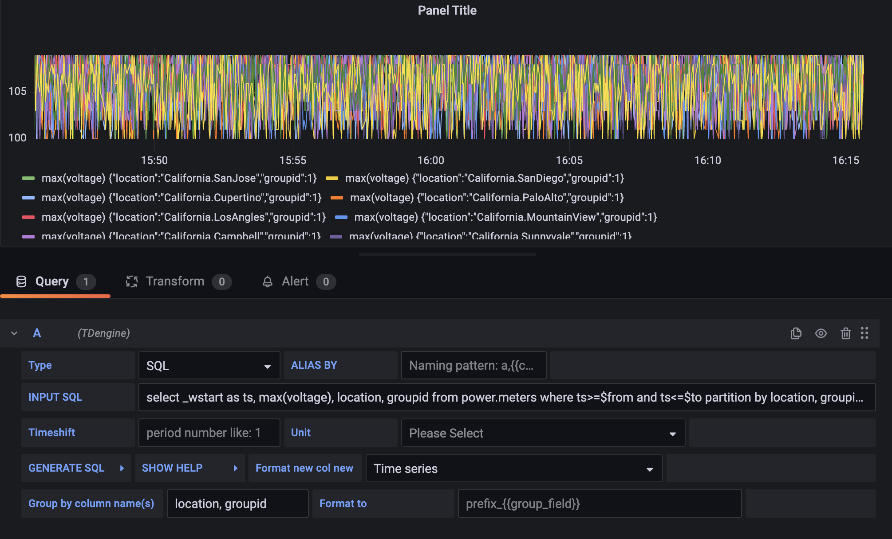
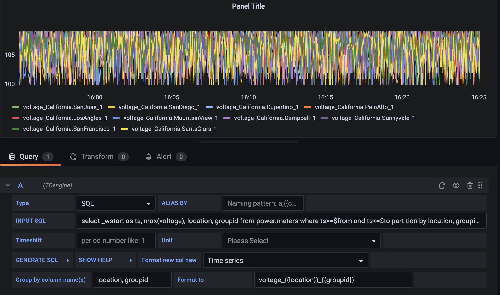
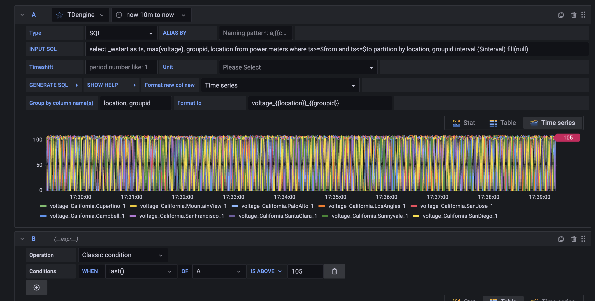
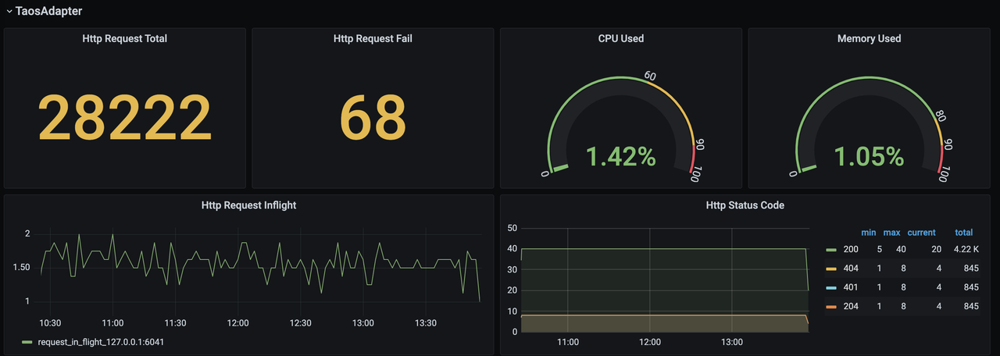

# Grafana Plugin

## 1. New feature

1. Support setting legend alias for multi-dimension
2. Unified alert supports multi-dimension data
3. Http Status Code dashboard

## 2. Set legend alias for multi-dimension

多维数据示例：

Grafana plugin v3.2.9 支持为 `group by` 或 `partition by` 产生的多维数据设置 legend 别名，设置 `format to` 之后，多维数据的 legend 会按 format string 做格式化。format string 格式定义为 `prefix_{{group_field}}_suffix`，插件会替换 `{{group_field}}`为具体值。示例如下：

## 3. Unified alert supports multi-dimension data

Grafana 8.x 之后的版本添加 unified alert， TDengine Grafana plugin v3.2.9 添加了对多维数据场景下 unified alert 支持。在 add query 面板设置 "INPUT SQL"、 "Group by column name(s)" 即可展示多维数据，然后添加 expression 设置数据的阈值，即可配置 unified alert。

## 4. Http Status Code

TDinsight 添加 http status code dashboard

