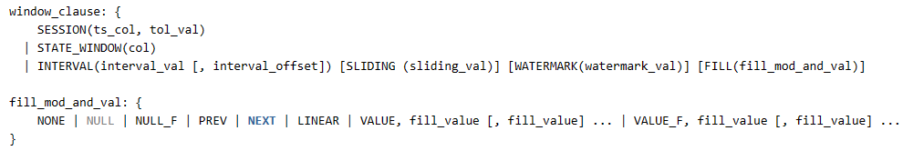

# 强制Fill

## 1. 背景

### 1.1 INTERVAL 子句

现状 INTERVAL 子句中 FILL 子句支持多种模式：NONE、NULL、VALUE、PREV、NEXT、LINEAR，除了 NONE 模式默认不填充值之外，其他模式在查询的整个时间范围内如果没有数据 FILL 子句将被忽略，即不产生填充数据，查询结果为空。在部分模式（PREV、NEXT、LINEAR）下具有合理性，因为在这些模式下没有数据意味着无法产生填充数值。而对另外一些模式（NULL、VALUE）来说，理论上是可以产生填充数值的，至于需不需要输出填充数值，取决于应用的需求。
强制 FILL 功能的目的就是用户可以指定是否强制FILL输出填充数值（仅适用于可以产生填充数值的场景）。

### 1.2 INTERP 子句

INTERP 子句目前也有相同语法形式的 FILL 子句，但是 FILL 模式中的 NULL 和 VALUE 已经是强制 FILL 的语义。

### 1.3 流计算

流计算目前只支持 INTERVAL 子句，不支持 INTERP 子句，对流计算 INTERVAL 子句来说 FILL 的条件是产生第一条查询记录，因此强制 FILL 功能不适用。

## 2. 功能

- 增加两种指定强制 FILL 的模式：NULL_F（强制 FILL NULL 值）、VALUE_F（强制 FILL 指定 VALUE 值），在这两种模式下无论查询时间范围内是否有结果都将产生填充记录。针对不同场景区别如下：
  - INTERVAL 子句：NULL_F、VALUE_F 为强制模式，VALUE、NULL 为非强制模式；
  - 流计算 INTERVAL 子句：NULL_F 、NULL 含义一致（不强制 FILL），VALUE、VALUE_F 含义一致（不强制 FILL）；
  - INTERP 子句：NULL_F 、NULL含义一致（强制 FILL），VALUE、VALUE_F含义一致（强制 FILL）；
- 除这两种新增模式外，其他既有模式行为不变。

## 3. 语法

扩展现有FILL子句，增加NULL_F、VALUE_F模式：

## 4. 示例
