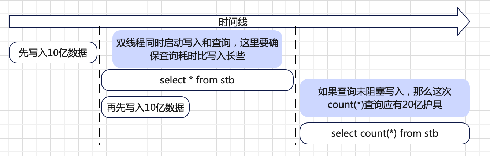

# TD-21960 长查询不能阻塞写入

## 一、测试概述

分别在单机/集群环境进行大数据量写入，同时并发长查询，确保写入不被阻塞；
[TD-21960 完成长查询不能阻塞写入的测试](https://jira.taosdata.com:18080/browse/TD-21960)

## 二、测试环境

### **2.1 硬件环境**

| **硬件环境** | **IP** | 用途 | **CPU** | **内存** | **硬盘** |
| --- | --- | --- | --- | --- | --- |
| **测试服务器** | 192.168.1.53 | taostest、taosBenchmark、mnode |
|  | 192.168.1.55 | vnode |
|  | 192.168.1.56 | vnode |
|  | 192.168.1.57 | vnode |

### **2.2 软件环境**

| **软件环境(3.0分支)** | **IP** | **运行目录** | **脚本及配置** | **commitID** |
| --- | --- | --- | --- | --- |
| **TDengine** | 192.168.1.53、55、56、57 | /root/TDengine | 默认 | 703c4066eb18b87200f920f8782e4c5b9fc3d12d |

## 三、测试方案

### 3.1 测试工具

| **测试工具** | **描述** | **脚本/配置文件** |
| --- | --- | --- |
| **taostest** | **测试主程序，部署测试环境，启动taosBenchmark，并发查询，统计结果** | **taostest --setup=query_block_insert.yaml --case=stability/insert/scenario_test/query_block_insert.py --keep** |
| **taosBenchmark** | **写入** | **taostest脚本生成** |

### 3.2 写入schema

| **Type** | **Tag_count** | **Column_count** |
| --- | --- | --- |
| **int** | **0** | **3** |
| **tinyint** | **1** | **0** |

### 3.3 查询语句

| **select * from {stbname}** |
| --- |

### 3.4 测试关键参数

| **vgroups** | **batch** | **ctb_count** | **rows_count** | **thread_count** | **insert_mode** |
| --- | --- | --- | --- | --- | --- |
| **和cpu核数相等** | **1000** | **10000** | **100000** | **和cpu核数相等** | **progressive** |

### 3.5 测试场景

| **场景** | **预期结果** |
| --- | --- |
| **单机环境读写并发** |
| **3节点1副本读写并发** |
| **3节点3副本读写并发** |
| **3节点3副本读写并发，重启选主** |

### 3.6 测试脚本说明

taostest启动 -> 初始化参数 -> 建库 -> 远端启动 taosBenchmark 进行写入，先写入一定量数据，比如20亿 -> 再同时开双线程，一个进行 select * 查询，一个启动 taosBenchmark 继续写入，确保写入完成后，第一次查询还在进行，如果写入未被阻塞的话，在 select * 查询结束后立即进行一次 select count(*) 查询，应该就是最终的数据量；
**简图：**

## 四、相关问题

| **Jira** | **状态** |
| --- | --- |
| [TD-22143](https://jira.taosdata.com:18080/browse/TD-22143) [一定量数据规模读写并发taosd crash（taosMemoryFree）](https://jira.taosdata.com:18080/browse/TD-22143) | 已修复 |
| [TD-22174](https://jira.taosdata.com:18080/browse/TD-22174) [一定量数据规模读写并发，一段时间后tcp连接耗尽，taos无法连接](https://jira.taosdata.com:18080/browse/TD-22174) | 已修复 |
| [TD-22211](https://jira.taosdata.com:18080/browse/TD-22211) [读写同步进行时，select * 长查询时间过长](https://jira.taosdata.com:18080/browse/TD-22211) | 已修复 |
| [TD-22041](https://jira.taosdata.com:18080/browse/TD-22041) [一定量数据规模读写并发taosd crash（tsdbTbDataIterGet）](https://jira.taosdata.com:18080/browse/TD-22041) | 已修复 |
| [TD-22030 一定量数据规模读写并发taosd crash（getValidMemRow）](https://jira.taosdata.com:18080/browse/TD-22030) | 已修复 |

## 四、测试结论

相关测试已完成，无遗留问题
