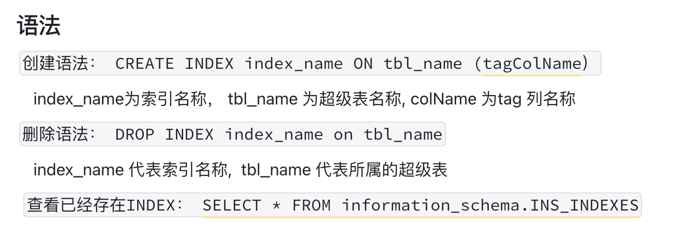
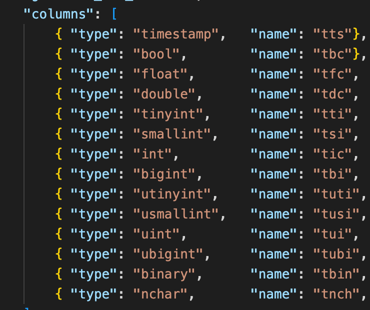
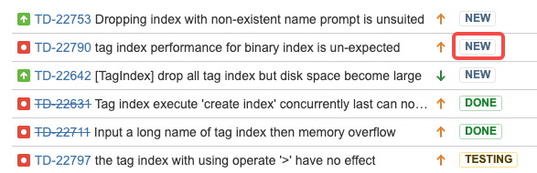
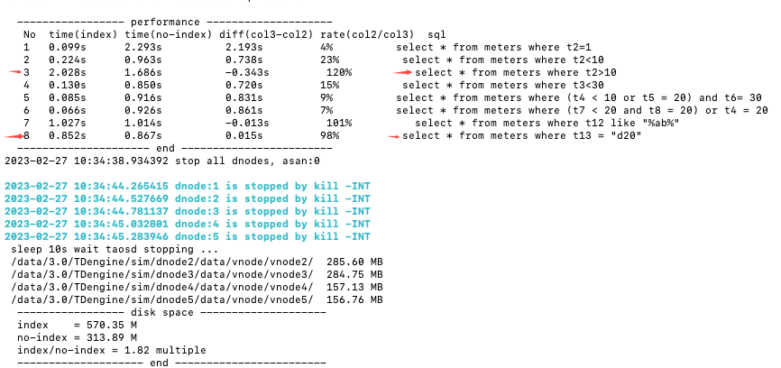
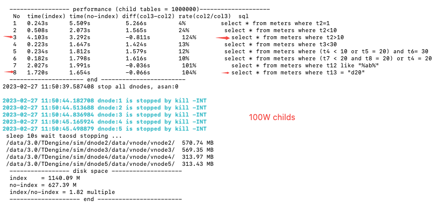

# TD-21965 Tag 列索引测试报告

功能： [Tag Index](https://taosdata.feishu.cn/wiki/wikcn9NP290i7pXGocUSCnVAQlh) 

## 一、功能对外接口

       对外接口比较简单，就是三个创建、删除、查询 接口

## 二、功能验证

### 1、管理接口全覆盖验证

         关联操作主要有 8 个：
           创建超级表（固定开始）
           创建子表
           创建索引
            删除子表
            删除索引
            写入数据
            查询子表
            最后状态正确性验证（固定结束）
         组合的情形可能是：
              1）建超级表 -> 创建索引 -> 创建子表 -> 写入数据->删除索引->查询子表
              2）建超级表 -> 创建子表 -> 创建索引 ->>删除索引 写入数据->查询子表
              3）建超级表 -> 创建子表 -> 写入数据 -> 创建索引->查询子表->删除索引
        4）（混合类型）建表 -> 创建部分子表 -> 创建部分索引 -> 删除部分索引->写入数据 -> 创建部分子表 ->  删除部分索引-> 写入数据 -> 创建部分索引-> 删除部分索引   
    实际上面的排列组合还是比较多的，除创建超级表外，其它几种都可以做排列组合，所以最大的可能性是 6*5*4*3*2*1 = 720 种，除去有些不可能的排列，如删除索引在创建索引前，打个半，也不少，不可能手工遍历出来。
           这种排列组合最好的覆盖方式就是随机覆盖。

###        2、操作步骤

   1）创建一个 14 个数据类型都有的 TAG 全类型超级表meters：

 2）索引名创建规则为 idx_TAG名
         3）随机选取覆盖
            把 6 种操作放 1 个桶中，复制出6个相同的桶出来
            每一轮分别从6个桶中抽取一个操作出来执行，直到6个桶抽完并执行完为一轮
      即抽即执行，所以抽取时可以看条件，如索引为空时就不抽取删除索引的操作
   4）可配置参数
             创建子表数量
             执行多少轮操作
             写入数据的数量
         4）通过查询系统索引表验证预期创建的索引名及数量符合预期
         5）通过 select 语句加子表 TAG 过滤条件 选取出预期范围内的子表进行验证

##  三、特殊覆盖

###            1、相同名称的索引名删除再建

                   同一个索引名，连续多次创建后删除再创建后删除，验证重名有没有问题

###            2、 删除一个不存在的索引名      

                   查看是否程序会崩溃或有异常，预期是返回索引名不存在错误

###            3、 并发能力操作验证      

       相同的一个操作由多个线程或进程同时发起，验证服务器端对并发访问的排队能力
         - create index  的并发
             2  drop index 的并发
             3  create index drop index 的并发
       4  create index drop index query index 的并发
       5  create index drop index query index select 的并发

### 4、 修改 SCHEMA 操作

       对已经建立索引的 TAG 列进行改名及修改类型，并在系统表中查询是否列 名及时刷新生效

### 5、 可变数据类型的超大长度测试

       建立 binary 及 nchar 类型数据，长度设定为最大支持长度，写入数据也顶满写，测试验证建立索引后的情况。

##  四、目的验证

      创建Tag列索引的目的是加快子表检索性能，所以除以上功能验证外，还需要对我们做这件事的目的进行验证，是否达到了做此事的目的。
      预期：建立索引比不建索引性能大幅提开，但meta 数据磁盘占用也会增多，预期相应建立索引的磁盘占用增加部分不超过原来的一倍。
      方法： 程序同时把一份数据写入两个配置完全相同的数据库中，同时在一个数据库中建立索引，另一个不建立，比较查询索引在两个数据库中的性能差异
      如果在不建立索引中的查询性能高于建立索引的数据库中的为不符合预期。

## 五、功能测试报告

####     1、新增基本功能 CASE 

  位置： system-test\0-other\tag_index_basic.py 
    1）全部 14 种数据类型建立索引已覆盖
  2）全部 14 种数据类型删除索引已覆盖
          3）建立索引后删除子表操作已覆盖
          4）建立索引后写入数据操作已覆盖
          5）建立索引后通过系统表查询索引信息正确已覆盖
          6）建立索引后删除子表操作已覆盖
          7）建立索引后在查询中使用索引及验证结果正确性已覆盖
          8）删除索引后与建立索引时相同查询验证结果，保证索引删除后对查询无影响已覆盖

####      2、特殊场景覆盖

          1）重名索引多次删建已验证
    2）删除不存在索引名已验证
    3）并发操作能力已验证，发现一个问题，已解决，验证中
    4）对已经建立索引tag的 schema 修改已验证

#### 3、发现问题

          未解决3个问题，两个问题修改成了改进类型，暂不解决，还需要解决 TD-22790 问题
    JIRA 详细：
  https://jira.taosdata.com:18080/browse/TD-21965

## 六 性能测试报告 

性能测试由程序生成两个完全相同的数据库，一个建立索引，一个不建立索引，对比两数据库的性能指标
由执行程序  tests\system-test\0-other\ tag_index_advance.py 完成性能测试
**性能指标：**
    time(index) :  在有索引数据库上执行查询后面的 SQL 语句所消耗的时间
    time(no-index): 同上，没有索引的数据库上
    diff(col3-col2):  第三列 减去 第二列的值
    rate(col2/col3):  比率，第二列 比 第三列 * 100 ，表示加了索引用时是原来不加索引的占比的多少 
       如4%即表示加索引后用时只占原来不加索引的 4%，说明加了索引后加速非常明显
**磁盘占用：**
     index : 有索引的磁盘占用空间
    no-index: 没有索引的磁盘占用空间
    index/no-index: 即有索引比没有索引的比值 
        如 1.82  即表示加了索引后磁盘占用空间比没加膨胀了 1.82 倍

### 1、50W 子表情况

### 2、100W 子表情况

### 3、主要存在的问题

  1） NO-8 的 SQL 查询， 字符串索引，预期至少有很多倍提升，这个加索引是非常明显的，结果是差不多
  2）NO-3 的 SQL 查询， 为什么大于索引不起作用，比原来的还要慢，需要查一下
   问题已建立JIRA TD-22790 TD-22791

## 七、测试结论

    还有一个问题TD-22790 未解决
