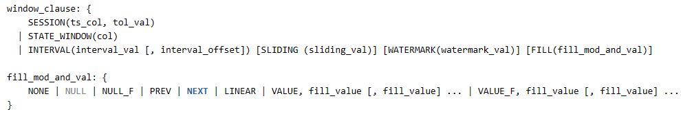

# TD-22213 强制fill的功能测试

## 一、测试概述

任务来源：
TD-22213

用户手册：[强制Fill](https://taosdata.feishu.cn/wiki/wikcn6wSajdH3LUrNkz2zHht4jb) 
- 增加两种指定强制 FILL 的模式：NULL_F（强制 FILL NULL 值）、VALUE_F（强制 FILL 指定 VALUE 值），在这两种模式下无论查询时间范围内是否有结果都将产生填充记录。针对不同场景区别如下：
  - INTERVAL 子句：NULL_F、VALUE_F 为强制模式，VALUE、NULL 为非强制模式；
  - 流计算 INTERVAL 子句：NULL_F 、NULL 含义一致（不强制 FILL），VALUE、VALUE_F 含义一致（不强制 FILL）；
  - INTERP 子句：NULL_F 、NULL含义一致（强制 FILL），VALUE、VALUE_F含义一致（强制 FILL）；
- 除这两种新增模式外，其他既有模式行为不变。

## 二、测试结论

测试正常，可以发布。

## 三、测试方案

### 1.测试准备

a、修改以前fill插值的封装，新增NULL_F、VALUE_F。
b、因为语法上新增了event_window，所以也要配合这部分新增验证语句是否会core掉。
c、要验证QueryPolicy = 1、2、3、4的情况组合。

### 2.测试环境

（1）单机

| 软件项 | IP |
| --- | --- |
| TDengine | 192.168.1.44：6030 |
| taostest测试框架 | 192.168.1.44 |

（2）3节点集群

| 软件项 | IP |
| --- | --- |
| 192.168.0.203:ceph01 |
| 192.168.0.203:node221 |
| 192.168.0.203:node222 |
| taostest测试框架 | 192.168.0.203 |

### 3.测试用例

#### （1）单机场景

前置条件
FirstEP：u1-44：6030
fqdn：u1-44
serverport：6030

| 编号 | 测试内容 | 预期结果 | 是否符合预期 |  |
| --- | --- | --- | --- | --- |
| 1(重点***) | 调试时以count函数进行调试和验证 | 脚本通过，数据检查通过 | 符合 | 0228版本完成 |
| 1(重点***) | 重点interp函数进行调试和验证 | 脚本通过，数据检查通过 | 符合 | 0228版本完成 |
| 1(重点***) | 流计算interval进行调试和验证 | 脚本通过，数据检查通过 | 符合 | 靖斌覆盖 |
| 2(重点**) | 用max、min、last、last_row、first、avg、sum函数进行同步验证 | 同上，为了检测重点函数的计算正确性 | 符合 | 0228版本完成 |
| 3(重点*) | 其余剩余函数进行同步验证 | 同上，优先级会低一些 |  | 0228后才能完成 |

#### （2）三节点三副本3mnode场景

前置条件
dnode1（mnode）
FirstEP：SingleQueryExt3.0_203.common_cluster_30.yamlnet_ceph01
dnode2（mnode）
FirstEP：SingleQueryExt3.0_203.common_cluster_30.yamlnet_node221
dnode3（mnode）
FirstEP：SingleQueryExt3.0_203.common_cluster_30.yamlnet_node222

client
FirstEP：SingleQueryExt3.0_203.common_cluster_30.yamlnet_taostest

脚本会复用单机场景的，直接在全量上进行多副本的验证。
