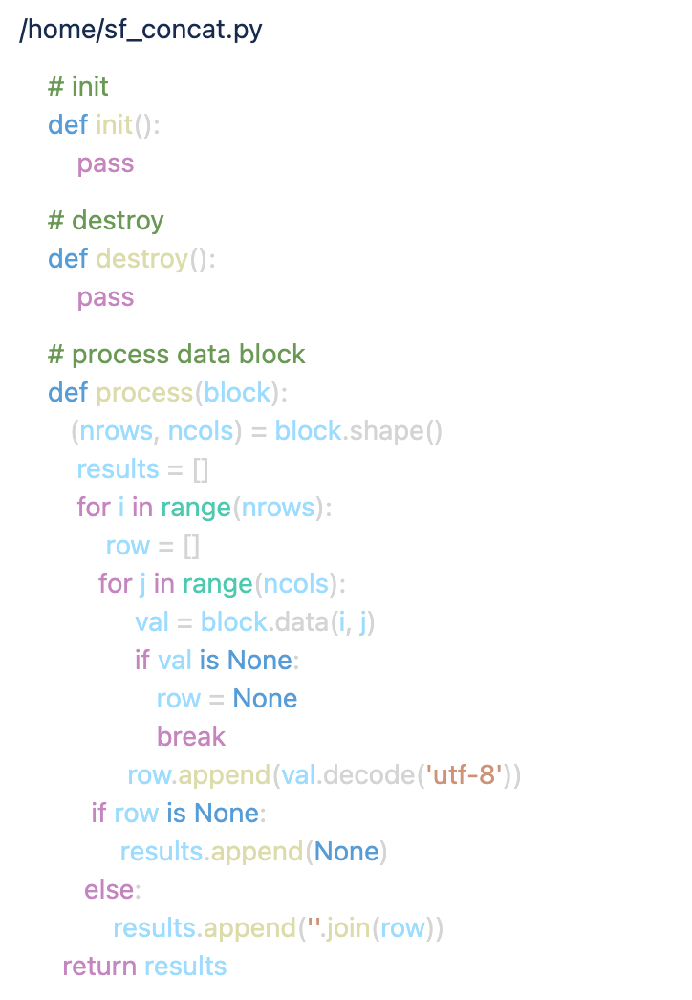
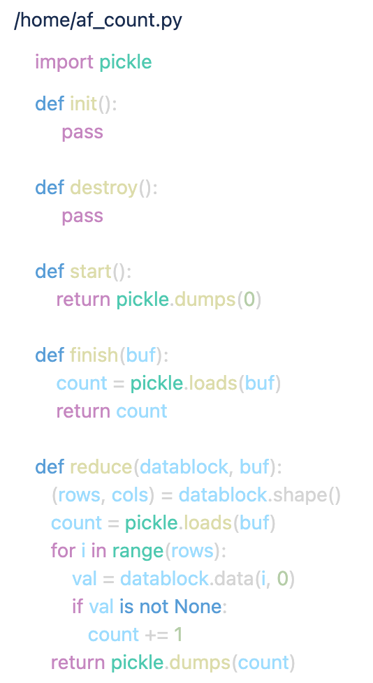
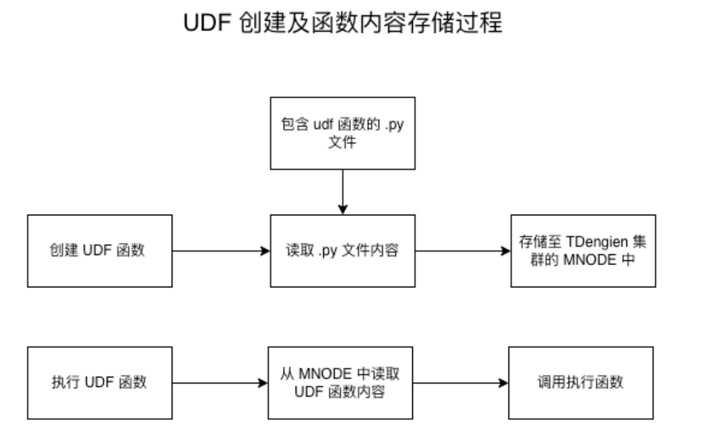
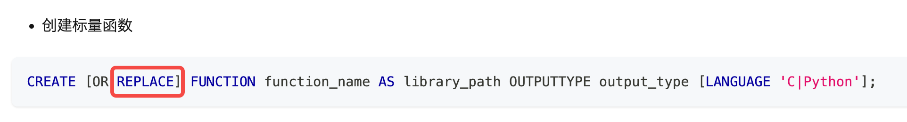
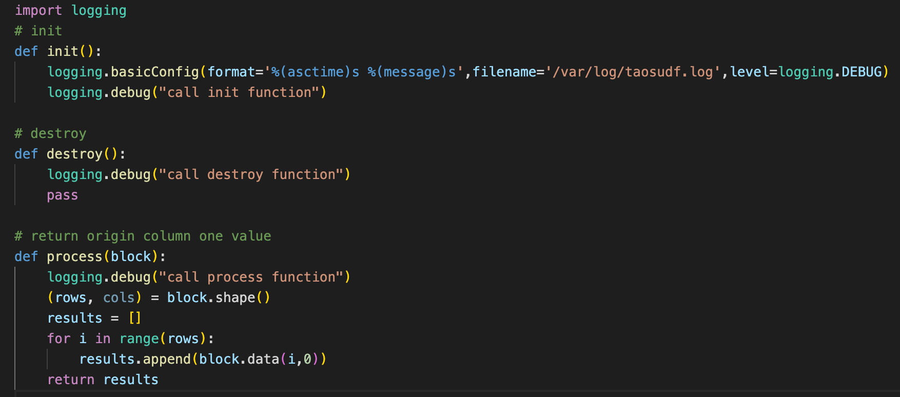
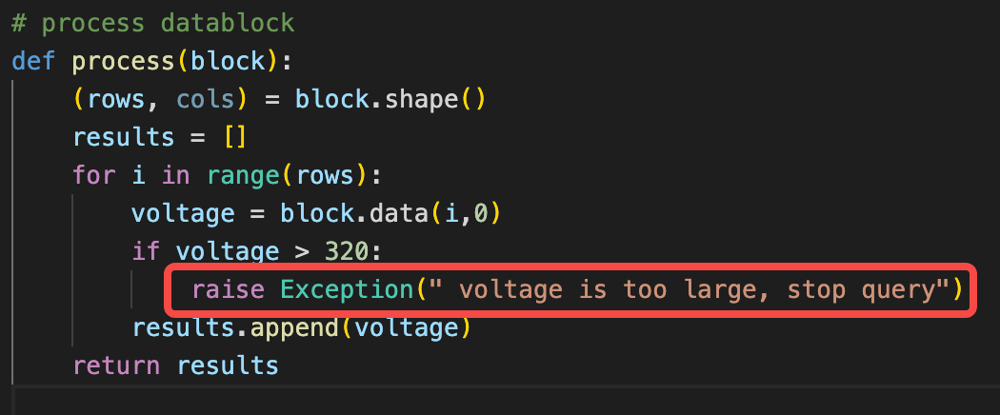
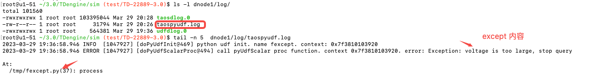
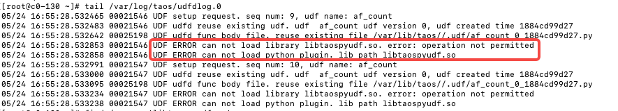
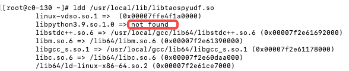

# 快速上手 UDF for Python 全攻略

使用 python 语言编写 UDF 函数是 TDengine 3.0.4.0 安装包中推出的一个重磅新功能，让稍懂一些开发的小白也能够使用 python 语言任意操纵数据库引擎，DIY 数据库，输出自己想要的结果， 这里向大家隆重介绍下如何来使用这个非常有特色的功能。

## 一、功能介绍

UDF for python 功能是使用 Python 语言编写 UDF 自定义函数，自定义函数像内置函数一样，在 SQL 语句中可以任意使用，方便使用者输出自己所需的特殊定制数据。
       我们先来看下如何创建 Python 的 UDF 函数：

###  1、创建 UDF 

       CREATE  [OR REPLACE] [AGGREGATE] FUNCTION function_name
                        as library_path  OUTPUTTYPE output_type  [BUFSIZE buffer_size] [LANGUAGE 'C‘ | ’Python']
       选项说明：
           1)   CREATE [OR REPLACE]:   第一次全新创建使用 CREATE , 已经创建要更新代码可以加上 REPLACE
           2）AGGREGATE : 可选项 加上此选项表示创建的是聚合函数，不加是投影函数
           3）function_name: 自定义函数名称，创建完后在 sql 语句中使用的名称，最大为 64 字节，超出部分会截断
           4）OUTPUTTYPE:  自定义函数输出数据类型，支持类型如下： 

| **序号** | **支持数据类型** | **序号** | **支持数据类型** |
| --- | --- | --- | --- |
| 1 | TIMESTAMP | 8 | BINARY |
| 2 | INT | 9 | SMALLINT |
| 3 | INT UNSIGNED | 10 | SMALLINT UNSIGNED |
| 4 | BIGINT | 11 | TINYINT |
| 5 | BIGINT UNSIGNED | 12 | TINYINT UNSIGNED |
| 6 | FLOAT | 13 | BOOL |
| 7 | DOUBLE | 14 | NCHAR |

5）BUFSIZE:  设置自定义函数可以使用的内存缓存大小 ，此选项仅当使用 AGGREGATE 方有效，也就是说只有创建聚合函数才能使用此选项。最大为 256k，计数单位为 byte。
     分配的缓存是留给 python 自定义函数使用的，缓存生命周期是从调用聚合函数 start 开始到调用 finish() 结束的整个聚合计算过程，所以可以当做全局变量来使用。
6）LANGUAGE 创建自定义函数的语言，目前 TDengine 支持 Python 和 C 两种

### 2、删除 UDF

        DROP FUNCTION function_name;   删除指定名称的 UDF 函数
                 function_name：此参数的含义与 CREATE 指令中的 function_name 参数一致，也即要删除的函数的名字

### 3、查看 UDF

   1)  SHOW FUNCTIONS;  可以简单查看下 UDF 创建的函数名
   2）select * from information_schema.ins_functions; 
       可以详细查看 UDF 创建时候的各个参数，加 \G 可以以竖列查看到完整内容如： select * from information_schema.ins_functions\G;

## 二、安装环境

接下来带你安装 Python UDF 的开发环境，安装过程是比较简单的
首先，准备安装环境
     1） CMAKE 
         最低版本要求 3.0.2 
      2） GCC
        因为需要在本机编译支持 Python UDF 函数的 so 文件，所以需要安装 GCC 环境，GCC 版本最低要求 7.5 以上。
      3) PYTHON
         Python 要求是3.7 及以上的版本才可以
 然后，开始安装插件
         python3 -m pip install taospyudf
        上面插件安装成功后，执行
        ldconfig 
这样，开发环境就已经安装就绪了

## 三、编写 UDF 函数

按上面步骤环境准备好后，我们便可以开始编写自己的 UDF 函数了。UDF 函数分两大类，一类是投影函数，另一类是聚合函数。这两类函数创建及编写都是完全不相同的，所以这里分开介绍：
在介绍函数前，我们先来了解下自定义函数的调用流程，如下图：
首先 UDF 处理框架是以数据块为处理单位，每次调用到自定义函数中时输入数据都是一个数据块，通过调用数据块对象的 data(row,col) 方法输入行号和列号可以取到数据块中任何一个位置上的数据。这样做的目的是减少 C 框架与 PYTHON 语言之间的调用次数，提升性能。
返回数据时，投影函数原来有多少行，就需要返回相同的行数，聚合函数只需要返回一行即可。下面详细进行介绍：

### 1、投影函数

   投影函数就像它的名字一样，像是一个投影，输出数据的行数与输入数据的行数需保持相同，如果不相同会报错。
   我们这里用一个完整的例子来说明，这里实现了一个 TDengine 内置的 concat 字符串连接函数，如下：
**   1） 编写函数**

 函数说明：
   init         - 在 UDF 模块初始化的时候调用一次，可以做一些初始化的工作
   destroy - 在 UDF 模块退出的时候调用一次，可以做一些退出的工作
   process - 每个数据块到来后要调用的数据处理函数, 调用 shape() 方法返回数据块行及列数
        nrows 返回数据块拥有的行数
        ncols  返回数据块拥有的列数，列数实际是 concat() 函数的参数个数
 返回值：
        投影函数的返回对象必须是一个列表，非列表对象会直接报错
        列表对象中元素的个数应该与块行数 nrows 相同，否则也会报错
**2） 创建函数**
      编写好自定义函数后，我们就可以直接在 taos - shell 中创建了，输入如下：
          create function py_concat as '/home/py_concat.py' outputtype varchar(256) language 'Python';
      创建函数名 py_concat ，创建 python 文件位置在 /home/py_concat.py, 输出数据类型为 varchar，长度 256 字节，语言为 Python。
**3）执行函数  **
  上步操作成功后，即可像内置函数一样在 SQL 中任意使用，如 taos-shell 中输入
      select sf_concat(factory_name,room_name), concat(factory_name,room_name) from devices; 
      grade_name class_name 均为 varchar 数据类型
      把工厂和车间名连接成一个字符串返回，可以对比 UDF 输出和 内置函数输出结果，预期是相同的

### 2、聚合函数

   聚合函数是把数据进行聚合计算，最后只输出一行聚合结果即可。
   这里我们用一个大家最熟悉的统计个数 count 实例来讲解：
**   1） 编写函数**

实现原理：
    计数的累加值在 start 初始化回调的时候把 0 值保存进 buf 中做为初始值
    在 reduct 函数中如果不为 None 就不断累加，在 reduce 返回值会被存储在 buf 中，下次回调 reduce 时再做为参数 buf 传过来，这样可以反复使用buf.
    最后在 finish 函数中，buf 也会通过参数传进来，把自己前面存储在 buf 中的值取出来，做为返回值返回，即为最终 count 结果。
函数说明：
   init         - 在 UDF 模块初始化的时候调用一次，可以做一些初始化的工作
   destroy - 在 UDF 模块退出的时候调用一次，可以做一些退出的工作
   start.     - 开始进行聚合函数计算时调用一次，主要完成对聚合函数使用的缓存进行初始化
   reduce - 每个数据块到来后要调用的数据处理函数, 调用 shape() 方法返回数据块行及列数
         rows 返回数据块拥有的行数
         cols  返回数据块拥有的列数，列数是传入 UDF 函数的参数个数
                 此函数会被循环调用
   finish -  计算最终聚合结果，此函数只在最后调用一次，在此函数中返回最终结果
  返回值：
        返回的数据类型为创建 UDF 函数时指定的 OUTPUTTYPE 数据类型，返回类型不正确会报错， 允许 None 对象返回
**2） 创建函数**
  编写好自定义函数后，我们就可以直接在 taos - shell 中创建了，输入如下：
     create aggregate function af_count as ''/home/af_count.py'' outputtype bigint bufsize 4096 language 'Python';
  创建函数名 af_count ，创建 python 文件位置在 /home/af_count.py, 输出数据类型为 bigint，语言为 Python
**3）执行函数  **
  上步操作成功后，即可像内置函数一样在 SQL 中任意使用，如 taos-shell 中输入
       select af_count(col1) from devices; 
  这样你就拥有了自己的 count 统计函数，想要统计什么，完全由你自己来决定。

### 3、数据类型映射关系

  python 语言与 C 语言交互，最重要的就是数据类型如何转化的问题。也是 Python UDF 函数编写最容易出错的地方，所要这里要重点介绍下：
  首先我们看下映射关系表：

| **TDengine 数据类型** | **映射为 python 对象** |
| --- | --- |
| TINYINT/TINYINT UNSIGNED/ SMALLINT/SMALLINT UNSIGNED/ INT/INT UNSIGNED/ BIGINT/BIGINT UNSIGNED | int |
| FLOAT/DOUBLE | float |
| BOOL | bool |
| BINARY/NCHAR/VARCHAR | bytes |
| TIMESTAMP | int |
| JSON | Not supported |

   1) int 类型在 python3 中是没有大小限制的
   2) binary / nchar / varchar 类型都映射为了 python 的 bytes 对象，所以在使用的时候要加以区别
      varchar 数据类型是 binary 的别名
      因为 binary 和 nchar 都映射为了相同的  bytes 数据类型，所以自定义函数的开发者自己约定输入自定义函数参数的类型，不同数据类型需要不同的转化方式：
           binary 类型转 str 对象， 使用 bytes.decode('utf-8')
           nchar 类型转 str 对象，  使用 bytes.decode('utf_32_le')
      当把 str 对象内容输出为 OUTPUTTYPE 指定的不同类型时，也需要进行区分：
          str 对象当 binary 类型返回，str.encode('utf-8')    
          str 对象当 nchar  类型返回，str.encode('utf_32_le')

## 四、开发技巧

### 1、更新函数代码

   我们在开发 UDF 函数的时候，需要频繁修改代码再调试运行，所以需要知道如何让新修改的代码生效

从上面流程图中我们可以看到，在创建 udf 函数时指定的 .py 文件路径，只在创建的那一时刻使用，把文件内容读取出来存放到 mnode 中，便于在集群的任何节点上都可以使用。
所以 .py 文件创建完 UDF 后就不再使用了，我们更新了 .py 文件中的代码后，需要再把 .py文件中的代码更新到 MNODE 中才可以起作用。
目前更新 PYTHON 自定义函数的代码提供了直接更新的命令：

 增加 OR REPLACE  即可直接把 library_path 指向的 PYTHON 自定义函数的内容更新到 MNODE 中，再次调用就会使用更新后的代码了。

### 2、输出日志

   TDengine 的 python UDF 不支持 python 代码的调试，但支持了日志输出，如大家常用的 logging 库，都可以在 UDF 函数中使用，建议日志输出到文件中查看。
   print 函数打印的信息是看不到的，所以就不要用此函数输出信息了。
   如:

     
### 3、抛出异常

     如果开发者在 UDF 函数在检测到异常数据后，需要终止查询，可以通过 raise 方式抛出异常，同时要保证自己 raise 的异常不会被自己捕获，自己捕获了框架就捕不到了，所以要位于最上层抛出异常。
     抛出的异常会被 UDF 框架捕获到并终止当前查询，同时在应用端调用的查询接口中会相应的返回专属的 UDF 函数抛出异常错误码： 0x8000290D ，应用程序可根据此错误码做应用层的相应处理。

    抛出的错误可以在 taos.cfg 中配置的日志文件的目录下找到，异常日志输出到了 taosudfpy.log 中了，如下是一实例输出的异常日志：

    异常日志的内容及发生异常的文件名及行号都在此日志文件中

### 4、查看 UDF 框架生成的日志

   udf 框架返回错误描述时只按大数返回，所以详细的错误原因还需要开发者通过日志来查看。
   相关日志这里主要有两个，都在 TDengine 日志目录下存放，分别介绍下：
       **1）taospyudf.log **  UDF for Python 的日志文件
日志文件中记录的是进程  udfd 加载 python UDF 函数，执行 UDF 函数过程中发生的异常、错误及调用过程等的记录。我们开发 pythyon udf 函数主要看这个日志文件就可以了。
     **  2）udfdlog.0 **
这个是 udfd 进程的框架日志，里面包括调用 C 及 PYTHON 等多种语言的UDF 函数在框架中出的错的日志，都会记录在此文件中，所以这个日志文件如果整个大框架出问题了，日志会记录在这里，一般情况下不用看。

### 5、常见错误码说明

   以下错误码及错误描述是在开发 UDF 函数时经常会遇到的，这里做下说明：

| **序号** | **错误码** | **错误描述** | **说明** |
| --- | --- | --- | --- |
| 1 | 0x80002901 | udf is stopping | udf 框架下在停止进程中，对外不能提供服务 |
| 2 | 0x80002902 | udf pipe read error | taosd 和 udfd 进程间使用管道通信时读数据失败 |
| 3 | 0x80002903 | udf pipe connect error | taosd 和 udfd 进程间使用管道通信时连接失败 |
| 4 | 0x80002904 | udf no pipe | taosd 和 udfd 进程间通信时创建管道失败 |
| 5 | 0x80002905 | udf load failure | 加载 UDF 模块失败 |
| 6 | 0x80002906 | udf invalid state | UDF 框架的状态不正确，如正在初始化等，对外不能提供服务 |
| 7 | 0x80002907 | udf invalid function input | 指输入 udf 函数的参数无效错误 |
| 8 | 0x80002908 | udf no function handle | 内部错误，没有函数句柄 |
| 9 | 0x80002909 | udf invalid bufsize | 使用聚合函数时分配的 BUFSIZE 不足，使用超限了 |
| 10 | 0x8000290A | udf invalid output type | 实际返回的数据类型与创建UDF 函数时指定的 OUTPUTTYPE 不匹配，可通过查看日志了解详细 |
| 11 | 0x8000290B | udf program language not supported | 指定的开发语言还未支持 |
| 12 | 0x8000290C | udf function execution failure | 执行 UDF 函数时出错，这是一个大类，里面可能包括各种出错原因，可通过查看日志了解详细 |
| 13 | 0x8000290D | udf raise exception | UDF 函数内部发生异常或主动抛出异常，查询终止 |

     其中 10 和 12 是开发 PYTHON UDF 最容易遇到的错误，详细的原因需要查看日志 taospyudf.log 。

### 6、参考实例

 在 TDengine 的开源仓库中有几个 UDF for python 的测试实例，可供大家参考：
   [https://github.com/taosdata/TDengine/tree/3.0/tests/system-test/0-others/udfpy](https://github.com/taosdata/TDengine/tree/3.0/tests/system-test/0-others/udfpy)
实例被如下 CI 测试用例使用：
[https://github.com/taosdata/TDengine/blob/3.0/tests/system-test/0-others/udfpy_main.py](https://github.com/taosdata/TDengine/blob/3.0/tests/system-test/0-others/udfpy_main.py)
运行测试用例： 
     1）正确安装 python3
     2)  拉 TDengine 社区版代码下来
     3）进入 TDengine/tests/system-test/ 目录
     4）运行 python3 test.py -f others/udfpy_main.py 

## 五、注意事项

### 1、UDF 投影函数最容易在返回行数上出错

    UDF 投影函数要求返回行数与输入行数相同，在处理时如果程序稍复杂一些就容易犯这个错，开发过程中一定要小心，不要漏行了。

### 2、OUTPUTTYPE 输出类型不匹配错

    UDF 函数要求最终返回的数据类型一定要和创建函数的时候指定的 OUTPUTTYPE 的类型一致，如果不一致就会报错。所以这个地方也是j非常容易出错的地方。
    投影函数的返回值在 process 函数中，必须要求是 list 对象， list对象中放的一定都是 OUTPUTTYP 映射匹配的类型对象
    聚合函数的最后返回值在 finish 函数中，聚合函数中返回一个值，这个值一定是创建函数时指定的 OUTPUTTYPE 映射匹配的 PYTHON 类型值

### 3、一直报无法加载 libtaospyudf.so 文件

    按照上面安装步骤已经安装了 taospyudf 插件，但还是报 libtaospyudf.so 无法加载的错，如下:

     这个库一般会安装在  /usr/local/lib/[libtaospyudf.so](http://libtaospyudf.so/) 目录下及 python 的插件目录下，lib 目录是正式使用的，插件目录是安装时产生的，或者使用  find / -name '[libtaospyudf.so](http://libtaospyudf.so/)' 查询在本地的具体位置。
     如果文件没有或不存在，那可能插件安装有问题，需要重新卸载安装插件如果文件存在，还是报这个错，那使用  ldd 查看 so 文件依赖的python 库文件是否能够找到，如下是典型的 python 安装的有问题：

      如上错误，重新正确安装 python3.9 可解决此问题。

## 六、未来

    目前推出的是 UDF FOR Python 的第一个 1.0 版，一些功能还有待逐渐完善，欢迎大家使用 UDF 功能，定义完全属于自己的数据库，也希望大家在使用过程中多提宝贵意见，让我们共同把这个能解决特殊需求的实用功能做的越来越方便，功能越来越强大。
