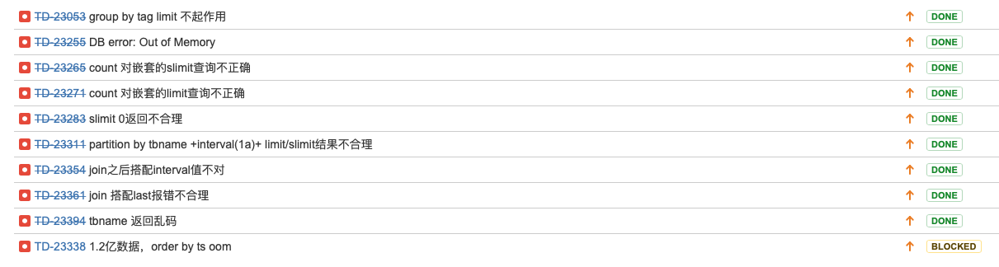

# TD-23142 limit,slimit方案梳理及测试报告

## 1. 测试来源

最终修改为slimit限制组个数，limit限制组内个数，与2.x语义保持一致。slimt/limit可以与group by公用。
一个限制是如果有order by子句，则结果只有一个分组，slimit/limit在这种限制条件下起作用。
问题还比较复杂，project operator在实现Limit/Slimit时是按照slimit限制组个数，Limit限制组内个数来实现的，对于group by tag来说，project输入是按tag划分的多个分组，因此对于目前group by tag+limit的组合来说是无法限制组个数的，这是目前group by tag +limit无法工作的原因。
对于group by column来说，hash agg operator的输入只有一个分组，内部计算是按照这个分组+column value组合来进行分组计算，但是输出时仍然保持跟输入一致的一个分组（不合理），因此对于后续的project operator来说目前看上去结果是对的。
因此在[TD-23058](https://jira.taosdata.com:18080/browse/TD-23058)改进完成后group by tag + slimit应该是可以工作的，而group by column+slimit将无法工作。

## 2. 测试目标

本文档主要是梳理测试场景和测试结果，目前以条数为主要校验目标，数据结果为辅助校验目标。
先列举场景放CI，然后在考虑移植到新框架。
建议针对slimit/limit对各种语句进行一个系统测试，包括普通查询、group by、partition by、interval、嵌套查询、Join查询、union all查询，带不带order by。

## 3. 测试结论

目前针对select * \ select count(*) \ select last(*) \ 进行了测试，一共发现了9个bug，部分和limit关系不大，因为还未到limit就开始错了。


        单个函数，大概成功执行的sql约1500个，执行时间30min，等join优化之后会有提升。
        因为时间过长，只能挑选部分用例进CI，其余的进全量。
        这次是基于taosBenchmark建表建库进行测试的，方便快速调整数据量进行大数据量的语句测试，其中的一个OOM的bug就是在1.2亿数据量时发现的。
        后面要增加其他函数的用例，但是时间紧，不在0331提交的脚本范围内。

## 4. 测试数据

电表100表，每表200记录，共2w数据。
taosBenchmark -t 100 -n 200 -y
```sql
taos> describe meters;
             field              |         type         |   length    |   note   |
=================================================================================
 ts                             | TIMESTAMP            |           8 |          |
 current                        | FLOAT                |           4 |          |
 voltage                        | INT                  |           4 |          |
 phase                          | FLOAT                |           4 |          |
 groupid                        | INT                  |           4 | TAG      |
 location                       | VARCHAR              |          16 | TAG      |
Query OK, 6 rows in database (0.001105s)
```


## 5. 测试方案

下例中：
n>1
先只举count函数，其他的类似，方便扩展。

| 测试sql | 返回条数 | 备注 |
| --- | --- | --- |
| Select * from meters limit n; | n | Slimit n ;报错 |
| Select * from meters where *** limit n; | n | Slimit n ;报错 |
| Select * from meters order by *** [asc|desc] limit n; | n | Slimit n ;报错 |
| Select * from meters where *** order by *** [asc|desc] limit n; | n | Slimit n ;报错 |
| select count(*) from meters limit n; [limit 0时 返回0条] | 1 | Slimit n ;报错 |
| Select count(*) from meters where *** order by *** [asc|desc] limit n; | 报错 | Slimit n ;报错 |
| select count(*) from meters group by tbname limit n; [limit 0时 返回0条] | 100 | Slimit n ;返回n [slimit 0时 返回0条] |
| select count(*) from meters partition by tbname limit n; [limit 0时 返回0条] | 100 | Slimit n ;返回n [slimit 0时 返回0条] |
| select count(*) cc from meters group by tbname order by cc limit n; [limit 0时 返回0条] | n | Slimit n ;返回100 [slimit 0时 返回0条] |
| select count(*) cc from meters partition by tbname order by cc limit n; [limit 0时 返回0条] | n | Slimit n ;返回100 [slimit 0时 返回0条] |
| Select count(*) cc from meters interval(1a) limit n; [limit 0时 返回0条] | n | Slimit n ;报错 |
| Select count(*) cc from meters interval(1a) order by *** [asc|desc] limit n; | n | Slimit n ;报错 |
| Select tbname,count(*) cc from meters interval(1a) group by tbname limit n | 报错 | Slimit n ;报错 |
| Select tbname,count(*) cc from meters interval(1a) partition by tbname limit n | 报错 | Slimit n ;报错 |
| Select tbname,count(*) cc from meters partition by tbname interval(1a) limit n | 100*n | Slimit n ;返回200*n [slimit 0时 返回0条] |
| Select tbname,count(*) cc from meters partition by tbname interval(1a) order by cc [asc|desc] limit n | n | Slimit n ;返回200*100 [slimit 0时 返回0条] |
| Select tbname,count(*) cc from meters partition by tbname interval(1a) slimit n |  | Slimit n ;返回200*n [slimit 0时 返回0条] |
| Select tbname,count(*) cc from meters partition by tbname interval(1a) order by cc [asc|desc] slimit n |  | Slimit n ;返回200*100 [slimit 0时 返回0条] |
| Select tbname,count(*) cc from meters partition by tbname interval(1a) slimit n limit n1 | n*n1 | [slimit 0时 返回0条] |
| Select tbname,count(*) cc from meters partition by tbname interval(1a) order by cc [asc|desc] slimit n limit n1 | 100*n | [slimit 0时 返回0条] |
|  |  |  |
| 针对上面的sql语句为基准，增加了union、union all、join、嵌套 |  |  |
| （sql） union (sql) |  |  |
| （sql） union all (sql) |  |  |
| Select count(*) from (sql) |  |  |
| Select count(*) from (（sql） union (sql)) |  |  |
| join的查询语句和上面单表查询都一一对应。是基于两个库的查询，表结构一致，只是表的数量和每个表的数据有区别。不在列举。 |  |  |
|  |  |  |
