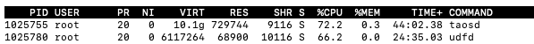

# Udf For Python 功能测试报告

## 一、背景介绍

使用 PYTHON 语言编写 UDF 自定义函数是 0331 版本发布中最重要的新增功能及本轮安装包重点推广宣传的重要功能，所以在测试环节给予了高投入、高标准、高规格的测试。
       测试计划：[TD-19076  UDF For Python Test](https://taosdata.feishu.cn/wiki/wikcnlXrOfgAubxFi5zIFnKRYEg)

## 二、整体评价

    本轮对功能进行详细验证后，给到的整体评价是功能整体稳定，未发生一起 CRASH , 但在功能易用性及完整性方面不足，有待改进提升。

## 三、发现的问题

## 1、BUG 类问题

BUG 类问题共发现 5 个，修复 4个，剩 1 个待解决

 **1）基本功能缺失 ****：不能查看已创建的**** ****Python ****UDF****函数内容（待解决）**  [ TD_23298](https://jira.taosdata.com:18080/browse/TD-23298) 
 在创建自定义函数时，开发者指定的自定义函数的内容会导入到 mnode 中存储起来，由 TDengine 代为保管维护，并应开发者提供“增删改查”的基本管理接口，但目前产品只对开发者提供了增和删的管理接口，改接口可以通过删后再增变向实现，未提供“查”的接口，属于基本功能缺失。
    因为 udf  函数内容可能是 C 接口的 so 文件，也可能是 python 代码，所以建议查看的接口可以设计为一个导出函数，把 so 文件或 python 代码 导出到指定的文件中。
     这个功能同时也可解决系统迁移的问题，当把包含自定义函数的系统从一个系统迁移到另一个的时候，如果没有导出功能，并在原始文件也已找不到或对不上号的情况下，这个是唯一能解决问题的方法。
** 2）输入检查不严格 2 个**  
    [TD-23266 ](https://jira.taosdata.com:18080/browse/TD-23266)和 [TD-23284 ](https://jira.taosdata.com:18080/browse/TD-23284)2个均属于 SQL 输入入口检查不是很严格的，已修补。
**3）功能故障类2 个**
    另两个[ TD-23289](https://jira.taosdata.com:18080/browse/TD-23289) 和 [TD-23269](https://jira.taosdata.com:18080/browse/TD-23269) 属于功能故障类问题，现也已修复。

## 2、改进类问题

  本次测试标准是高标准，高品质，所以一些地方要求的比较苛刻，提出的改进类问题比较多。
    咱们已提供了高性能的 C 语言自定义函数功能，为什么还要推 python 的呢？因为 python 开发门槛，方便，开发者更容易使用，所以我们要提供给开发者一个更简单易用的开发接口。所以我们设计的功能的方便性及易用性是本次测试重点，在完成基本功能的基础上，功能越方便越好。
**    1）修改后代码生效需重启服务太重** [TD-23254](https://jira.taosdata.com:18080/browse/TD-23254)
    python 自定义函数在每次修改内容后，都需要重新启动服务才能应用新的代码。这个对开发者不太友好，重启的范围过大。python 自定义函数的内容实际是加载在 udfd 进程中的，只需要重新启动这个进程应该就可以了，缩小需要重启的范围。
**    2）提供独立更新接口 **
     目前对于存储在 MNODE 中的自定义函数的内容没有直接提供改的接口，改实际是通过先删再增的方式实现的，所以对于开发者来说比较不方便，操作起来也啰嗦，建议可以提供直改接口，内部实现是先删后增都无所谓，提供给使用者的是改的接口即可。如开发者可以调用类似  update function fun_name; 命令后，自动把在原来 python 文件中的内容更新到 mnode 中。
**    3）易于理解使用的类型映射  **[TD-23302](https://jira.taosdata.com:18080/browse/TD-23302)
    目前对于 TDengine 中的 varchar  和 nchar  数据类型都映射到 python 中的 bytes 类型，在 python 自定义函数中编程时这种两种数据类型无法区分开， 很不方便。
    同时这两种数据类型在 python 中使用的方法是不一样的，有区别的，varchar 映射在 python 中是可以直接当 str 类型来使用的，但 nchar 类型在 python 中必须要先使用 utf_32_le 来转码后方可正确使用，两者不可混淆，否则就会出错。
    两者映射为不同数据类型天然存在差别感，开发者也不会搞混，可降低开发都的学习理解成本及出错成本，对开发来说是非常友好的设计。
**     4）友好的错误返回码 **[TD-23286](https://jira.taosdata.com:18080/browse/TD-23286)
 作为开发语言的定义者，你是无法预测开发者是在什么需求下去使用你的开发语言的，定义者能做的就是尽可能提供能够灵活控制程序的机制，方便开发者控制自己的程序行为。
函数返回码是所有程序编写中都要用的个基本概念，在自定义函数中就给吃掉了，建议能够让 python 自定义函数有能力返回自己的错误码，方便开发者控制程序流程，处理异常情况。
  **   5）友好调试输出信息 **[TD-23264](https://jira.taosdata.com:18080/browse/TD-23264)
作为一个开发者，假设给你一种开发语言，只能输出最终的一个结果，无法输出看到任何中间信息，这个开发语言你在调试功能的时候使用的累不累。如果函数的功能稍复杂一些，那调试起来就像恶梦一样，仅看最终结果猜测中间结果的可能性，效率极低。
所以为了提高开发者的开发效率，建议能够让开发者能够看到 python 原来输出到控制台的信息的功能，这个对于开发者是非常实用的个功能。

## 四、性能

虽然性能不是python udf 强项，但在保证稳定性，易用性的基础上，性能越快越好。
性能亮点：标量函数块操作，减少了 c 与python的调用次数。
经过测试，**python 实现要比内置函数实现慢 5 ~ 30 倍的范围****内**（内置函数不使用预计算）

### 1、性能对比

1000W 数据量测试结果（3个子表）：

| 类型 | 函数名 | Python 用时(s) | 内置函数用时(s) | 相差倍数 |
| --- | --- | --- | --- | --- |
| 标量函数 | concat | 23.81 | 4.205 | 5.6 |
| count | 8.05 | 0.298 | 27 |
| sum | 7.69 | 0.31 | 24.5 |
| min | 8.16 | 0.34 | 24 |

5000W 数据量测试结果（10个子表）：

| 类型 | 函数名 | Python 用时(s) | 内置函数用时(s) | 相差倍数 |
| --- | --- | --- | --- | --- |
| 标量函数 | concat | 106 | 20 | 5 |
| count | 31.8 | 1.26 | 25.2 |
| sum | 39.5 | 1.32 | 29.9 |
| min | 35.9 | 1.29 | 27.8 |

## 2、CPU 占用

  执行查询语句：
      select count(*),af_count_bigint(col1) from meters interval(1s);
      af_count_bigint 为 python udf 函数，输出数据类型为 bigint
  查看 CPU 占用情况如下：
  UDFD 进程占用 CPU 略低，可能和执行时间长，压力分散开了有关。
  同时udfd 进程仅做 一件事儿，所以内存资源占用并不多。  

## 五、限定内容

**1、自定义聚合函数最大处理行数约为 2.5 亿行**
      自定义聚合函数目前的中间缓存大小定义为了 256k ， 所以按 count 函数的计算能处理的最大聚合行数约为 2.5亿行。
     影响这个行数还取决于 BLOCK 块中数据的大小及放入中间缓存中数据的多少，BLOCK 块中数据越多，能处理的行数也越多，若BLOCK 都是小块儿，能处理的最大行数也将缩小；同时放入中间结果的内容越多，能处理的行数就会变少，反之亦然。

## 六、测试内容

**UDF**** 函数分两类：**
   第一类是用于投影查询的标量函数，此类函数输入多少行，就要返回多少行
   第二类为聚合函数，此类函数输入多行，最后只输出一行聚合结果
**UDF**** 功能的验证方法：**
   UDF 功能的正确性主要通过使用 UDF 功能实现的 python 计算函数与内置函数结果进行互验。
   这种方式可以保证对于输入及输出参数处理的正确性，UDF 框架是否存在数据丢失、输入输出有没有问题等，是一种高效的系统验证方法。
目前已验证过的内置函数：
         标量函数： concat 
         聚合函数： count  min  sum 

**验证内容一览表：**

| 分类 | 序号 | 内容 | 验证状态 | 说明 |
| --- | --- | --- | --- | --- |
|  | 1 | 内置函数 concat count min sum 与相同 python 自定义函数结果互验 | 通过 | 内置函数与 udf 函数返回结果一致 |
|  | 2 | 标量函数返回 14 种数据类型全验证 | 通过 |  |
|  | 3 | 聚合函数返回 14 种数据类型全验证 | 通过 |  |
|  | 4 | SQL 输入异常测试 | 通过 |  |
|  | 5 | 自定义函数输入混有 null 值验证 | 通过 |  |
|  | 6 | 自定义函数返回内容混有 null 值验证 | 通过 |  |
|  | 7 | 大数据量场景验证 | 通过 |  |
|  | 8 | 集群多副本场景下的测试 | 通过 | 无异常，都在预期内 |
|  | 9 | getData 接口输入超大行列值验证 | 通过 |  |
|  | 10 | UDF在子查询中的使用验证 | 通过 |  |
|  | 11 | UDF在GROUP BY 中的使用 | 通过 |  |
|  | 12 | UDF 在 interval 中的使用 | 通过 |  |
|  | 13 | UDF 在 order by 中的使用 | 通过 |  |
|  | 14 | UDF 函数中带表达式的使用 | 通过 |  |
|  | 15 | UDF 在流计算中的使用 | 部分支持 | 有 parition by 的可以支持 |
|  | 16 | 查询 UDF 过程中 KILL udfd 进程 | 通过 | udfd 进程重启，查询报 pipe 连接失败，符合预期 |
|  | 17 | 最大值、最小值等的边界测试 | 通过 |  |
|  | 18 | UDF 在 订阅 SQL 中的支持 | 通过 |  |
|  | 19 | 多 VNODE 并发同时连接 UDFD 进程的并发能力 | 不支持 | 在不断增加 VNODE 查询线程数时，查询的时间反而开始下降。和开发确认在 PYTHON 执行UDF 函数时是串行的，一个UDFD 进程同时只能执行一个UDF 函数，没有并行处理能力。 |
|  | 20 | 多 VNODE 并发同时连接 UDFD 稳定性测试 | 未通过 | 在手工 KILL UDFD进程多次后 导致 TAOSD 崩溃，已建立 JIRA TD-23570 |

## 五、测试结论

     本次 0331 版本安装包期望能够把 BUG 类全部解决，改进类争取能把 [TD-23254](https://jira.taosdata.com:18080/browse/TD-23254)（代码生效要重启服务太重 ）能够解决，重启服务太重了，理论上是可以避免的。 
     其它改进项可以在今后的版本中逐渐完善，打造出非常简单好用的 UDF 自定义函数功能。

抄送：
 @李珲 @Shenglian @潘魏  @张玮绚  @Tao
