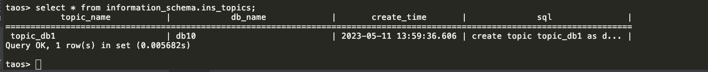
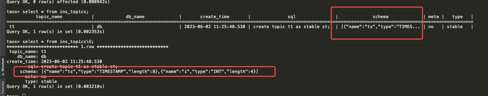

# TMQ 行为优化

背景

TD-23660


TD-23653

#### 1. 概述

taos.h 中增加了两个 API 提供针对特定的 topic 的消费信息功能。为此，在 taos.h 文件中增加了两个API 和一个结构体。
```c
typedef struct tmq_topic_assignment {
  int32_t vgId;
  int64_t currentOffset;
  int64_t begin;
  int64_t end;
} tmq_topic_assignment;

DLL_EXPORT int32_t   tmq_get_topic_assignment(tmq_t *tmq, const char *pTopicName, tmq_topic_assignment **assignment,
                                              int32_t *numOfAssignment);

DLL_EXPORT void      tmq_free_assignment(tmq_topic_assignment* pAssignment);

DLL_EXPORT int32_t   tmq_offset_seek(tmq_t *tmq, const char *pTopicName, int32_t vgId, int64_t offset);
```

1. tmq_get_topic_assignment 接口
   - 用于获取当前consumer在每个vnode上的消费进度，其中numOfAssignment是vnode个数，assignment是每个vnode的消费进度以及wal范围。
   - 最后需要通过tmq_free_assignment释放获取的tmq_topic_assignment指针。
2. tmq_offset_seek 接口
   - 用于根据设置当前消费进度，设置成功后，将从该进度继续消费。该接口需要先调用tmq_get_topic_assignment接口获取合法的vgId 和 wal范围，然后根据vgId 和范围设置合理的offset，否则会报错。
   - 如果tmq_offset_seek中使用的offset 超过了wal的范围，会报错。
   - seek接口 和 commit接口是相互独立的。seek只会更改当前consumer的消费进度，不会commit这个进度。

特别说明：
experimental.snapshot.enable 参数官网已移除，只有taosX做数据迁移会用到，如果在消费tsdb数据时候，调用这两个接口都会返回 `TSDB_CODE_TMQ_SNAPSHOT_ERROR` 错误码。

| 行号 | auto.offset.reset 参数 | experimental.snapshot.enable参数 | 首次启动消费 | 是否poll过数据 | tmq_get_topic_assignment | tmq_offset_seek |
| --- | --- | --- | --- | --- | --- | --- |
| 1 | earliest/latest | true | Y | N | 报错 | 报错 |
| 2 | earliest/latest | true | Y | Y | 两种情况 如果消费到tsdb，报错 如果消费到wal，正常返回 | 两种情况 如果消费到tsdb，报错 如果消费到wal，正常seek |
| 3 | earliest/latest | true | N | N | 报错 | 报错 |
| 4 | earliest/latest | true | N | Y | 两种情况 如果消费到tsdb，报错 如果消费到wal，正常返回 | 两种情况 如果消费到tsdb，报错 如果消费到wal，正常seek |
| 5 | earliest/latest | false | Y | N | earliest时：currentOffset = wal开始版本 latest时：currentOffset = wal结束版本 | 正常seek |
| 6 | earliest/latest | false | Y | Y | 消费到wal，返回当前进度 | 消费到wal，正常seek |
| 7 | earliest/latest | false | N | N | 两种情况 如果存储了commit进度，返回进度 如果没有存储commit 进度，wal开始版本/wal结束版本 | 正常seek |
| 8 | earliest/latest | false | N | Y | 消费到wal，返回当前进度 | 正常seek |

#### 2. 示例代码

```c
//Sample code

  int32_t numOfAssignment = 0;
  tmq_topic_assignment* pAssign = NULL;
   
  // get the assignment for topic_name 
  int32_t code = tmq_get_topic_assignment(tmq, topic_name, &pAssign, &numOfAssignment);
  if (code != 0) {
    fprintf(stderr, "failed to get assignment, reason:%s", tmq_err2str(code));
    return；
  }

  // seek to the earliest offset for this topic
  for(int32_t i = 0; i < numOfAssignment; ++i) {
    tmq_topic_assignment* p = &pAssign[i];
   
    code = tmq_offset_seek(tmq, topic_name, p->vgId, p->begin);
    if (code != 0) {
      fprintf(stderr, "failed to seek to %ld, reason:%s", p->begin, tmq_err2str(code));
    }
  }

  // free the assignment
  free(pAssign);
  
  while(1) { // poll the data from the beginning.
    TAOS_RES* tmqmsg = tmq_consumer_poll(tmq, timeout);
    if (tmqmsg == NULL) {
      break;
     }
  }

```


TD-23117

旧的结果：


新的结果：


注意：**列订阅返回所有订阅的列（包括普通列和标签列）。超级表订阅只返回普通列。库订阅返回NULL**。
其中schema 信息，通过json串的形式返回，如下：
```sql
[
{
    "name":"ts",
    "type":"TIMESTAMP",
    "length":8
},
{
    "name":"c1",
    "type":"NCHAR",
    "length":8
},
{
    "name":"t1",
    "type":"INT",
    "length":4
}
]
```


TD-19042

语法为：
create topic t1 [with meta] as stable where t1 > 1;
描述：增加where过滤条件，用来过滤符合条件的子表，订阅这些子表。
限制：where 条件里不能有普通列，只能是tag或tbname，where条件里可以用函数，用来过滤tag，但是不能是聚合函数，因为子表tag值无法做聚合。也可以是常量表达式，比如 2 > 1（订阅全部子表），或者 false（订阅0个子表）。
