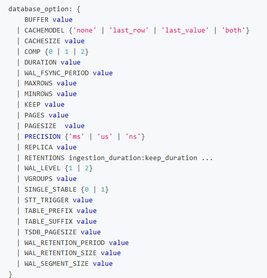

# 表名前后缀控制表分布

TS-3249

## 1. 功能

3.0版本通过表的哈希值来决定表在Vnode的分布，之前的版本已经支持在创建数据库时通过指定TABLE_PREFIX/TABLE_SUFFIX来排除表名中的部分前缀和/或后缀来控制表的分布，这里提出了一种新的只使用表名中的部分前缀和/或后缀来控制表的分布的需求。
通过指定TABLE_PREFIX/TABLE_SUFFIX为正值来表示排除的字符长度，负值来表示使用的字符长度；

## 2. 语法

与之前保持一致，只是允许输入负值。

## 3. 边界与限制

TABLE_PREFIX/TABLE_SUFFIX默认值是0，即使用全表名；
TABLE_PREFIX/TABLE_SUFFIX可以同时或单独指定；
TABLE_PREFIX/TABLE_SUFFIX只能用一种模式，即不能同时有正值和负值；
TABLE_PREFIX/TABLE_SUFFIX允许的值域范围为[-191,191];
TABLE_PREFIX/TABLE_SUFFIX同为正值时，和不能大于等于表名最大长度192，当和大于等于实际某个表名长度时TABLE_PREFIX/TABLE_SUFFIX无效，即视为0处理；
TABLE_PREFIX/TABLE_SUFFIX同为负值时，和的绝对值可以大于等于表名最大长度192或具体表名长度，在这种场景使用全表名处理；
