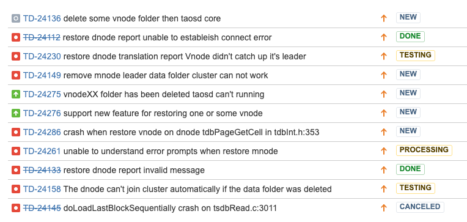

# TS-2780 集群数据自动恢复功能测试报告

## 一、测试概述

     集群数据自动恢复功能是指集群在多副本的情况下，当一个节点的数据损坏或丢失后，通过其它节点上的副本数据恢复还原此节点上数据的功能。目的是自动完成多副本的作用，增强集群自恢复能力及健壮能力。
     功能手册：[Restore dnode用户手册 （企业版）](https://taosdata.feishu.cn/wiki/wikcnFHgxQ2YpxwdzCWfpb8en4i) 
     本测试对以上约定的行为进行验证，符合预期为通过。

## 二、测试环境

### **2.1 硬件环境**

| **IP** | **用途** | **CPU** | **内存** | **硬盘** |
| --- | --- | --- | --- | --- |
| 192.168.1.176 | 集群节点 | 8u | 8G | 200G |
| 192.168.1.51 | 集群主节点 | 40u | 256G | 874G |
| 192.168.0.214 | 集群节点 | 24u | 64G | 383G |

### **2.2 软件环境**

| ** TDengine分支** | **运行目录** | **commitID** |
| --- | --- | --- |
| 3.0 | /root/3.0/ |  |

## 三、测试内容

### 3.1 测试工具

| ** 工具名称** | **来源** | **作用** |
| --- | --- | --- |
| TestNG | 自研 | 全量测试框架 |
| CI 测试框架 | 自研 | 框架类 |

### 3.2  损坏场景验证

   根据损坏的实际场景分为以下几类：

####   1、1个 DNODE节点上磁盘全部损坏

  一个节点上可能为一块或多块磁盘，都已损坏，如机器着火了。

####   2、1个 DNODE 节点上磁盘部分损坏

  一个节点上挂载着多块磁盘，其中一块或多块磁盘损坏了需要更换

####   3、多个 DNODE 上磁盘全部损坏

  多个节点都着火了，上面磁盘都损坏了

####   4、多个 DNODE 上部分磁盘损坏

  多个节点上部分磁盘坏了，需要更换

####   5、带有多级存储节点上的磁盘损坏

  配置有多级存储的节点部分或全部磁盘损坏了

### 3.3  恢复过程验证

####    1、恢复过程中断电

  在恢复过程中一个或多个节点断电了

####    2、恢复过程中集群节点频繁重启

在恢复过程中某些节点不稳定，频繁重启

####    3、恢复过程中网络故障

恢复过程中网络时断是连

####    4、恢复过程中使用查询

        恢复过程中查询服务应该是可以正常使用的，有大量查询业务的情况下

####    5、恢复过程中又有部分节点磁盘损坏

        恢复过程中原来好的磁盘也突然又坏了

### 3.4  恢复后验证

####    1、校验恢复后数据正确及完整性

   恢复后的数据和恢复前的数据内容及数量进行对比，预期是一致的

####    2、恢复成功后写入服务接入验证

  恢复成功后立即接入写入服务，预期是可以正常接入，不需要任何操作

####    3、恢复成功后数据文件大小无异常

   恢复成功后数据文件大小与损坏前相当

####    4、恢复成功后功能都正常

   恢复成功后写入功能、查询功能、流计算及订阅功能都能正常工作

####    5、恢复成功后重启服务后无异常

    恢复成功后服务重启后无异常情况

#### 3.5  恢复成功后的性能验证

####    1、写入性能验证

预期为写入性能不低于损坏前

####    2、查询性能验证

        预期为查询性能不低于损坏前

## 四、测试报告

#### **1、验证功能**

| 类型 | 内容 | 结果 |
| --- | --- | --- |
| mnode 非 LEADER 节点出问题 | 1个节点上磁盘全部损坏，预期是更换磁盘后，配置好正确的 taos.cfg 后重新启动节点 taosd ，节点会自动加入集群，使用 restore dnode 可恢复此节点所有数据 | 恢复报 vnode didn't catch up leader 错误 |
|  | 非 LEADER 的MNODE 所在节点停止 TAOSD, 删除 mnode 文件夹，重启节点，使用 restore mnode on dnode x. 预期是 MNDOE 文件夹恢复出来，SHOW VGROUPS 正常。 | 通过 |
|  | 非 LEADER 的MNODE 所在节点停止 TAOSD, 删除 qnode 文件夹，重启节点，使用 restore qnode on dnode x. 预期是 QNDOE 文件夹恢复出来，qnode.json 也能恢复出来。 | 通过 |
|  | 非 LEADER 的VNODE 所在节点停止 TAOSD, 删除 vnode 文件夹，重启节点，使用 restore vnode on dnode x. 预期是 VNDOE 文件夹恢复出来，SHOW VGROUPS 显示正常状态。 | 恢复报 vnode didn't catch up leader 错误 |
| mnode-leader 节点出问题 | MNODE LEADER 节点上，停止 taosd, 删除 data 目录，修改 taos.cfg 中 firstEp 为集群新选出的 leader 的地址，重新启动 taosd, 预期为 show dnode 显示出此节点已经 online. 使用 RESTONE dnode x， 能够把此节点的所有数据都同步过来 | 第一步 自动加入集群功能符合预期
第二步 恢复目前还无法恢复出来，报vnode didn't catch up leader 错误 |
|  | MNODE LEADER 节点上，停止 taosd, 删除 mnode 目录，修改 taos.cfg 中 firstEp 为集群新选出的 leader 的地址，重新启动 taosd, 预期为 
（1） show dnode 显示出此节点已经 online. 
（2） show vgroups 应显示正常。
（3） 使用 RESTONE mnode on dnode x， 能够把此节点的所有数据都同步过来。 | 通过 |
|  | LEADER 的MNODE 所在节点停止 TAOSD, 删除 qnode 文件夹，重启节点，使用 restore qnode on dnode x. 预期是 QNDOE 文件夹恢复出来，qnode.json 也能恢复出来。 | 通过 |
|  | mnode -leader 节点出问题，如果不修改 firstEP , firstEP 会指向自己，删除 DATA 目录重新启动后 自己会成为一个新的集群，与原来的集群脱勾了，这个是预期内的。 | 不修改 firstEp 重启后确实会成为一个新集群 |
| 正常状态下 | 集群在正常状态下，不需要修复，执行几个修复命令，预期是修复动作。 | restore mnode qnode 如果此 DNODE 上没有会报 Transaction commitlog is null， 看不懂的个奇怪的错误 |
| 多级存储 | 5节点集群，配置一个节点为多级存储，停止此节点，删除此此节点下所有多级存储目录，重新启动，使用  restore dnode x 恢复此节点，预期为所有多级存储目录及数据都可恢复出来 | 数据文件都已恢复，但所有数据都恢复到了LEVEL 0 级目录下了，每天会定时转到 LEVEL 1 和 2 ，不影响数据正确性，通过 |
|  | 删除多级存储中LEVEL 0 级中非主挂载点磁盘数据 | TAOSD 无法启动，报VNODE 无法加载 |
|  | 删除多级存储中 LEVEL 0 级中的主挂载点磁盘数据，预期为等同于删除所有数据恢复的场景 | 通过，部分VNODE 恢复下一版中解决 |
|  | 删除多级存储中非 LEVEL 0 级中某一挂载磁盘的数据，预期为 TAOSD 无法启动 | 通过，部分VNODE 恢复下一版中解决 |
| 异常场景 | restore 过程中要修复的节点 发生 DOWN 机行为，预期是重新启动后可继续修复 | 通过 |
|  | 5节点3mnode 集群，restore 过程中其它某个节点发生 DOWN 机行为（包括mnode 的 leader 节点），预期是不影响恢复过程，恢复可继续完成 | 通过 |
| 恢复后验证 | 验证原数据没有丢失、缺少或增加 | 通过 |
|  | 验证恢复后的集群写入、查询都可以正常进行 | 通过 |
|  | 验证恢复后的集群写入及查询性能与原来相当，无大变化 | 通过 |

#### **2、发现问题列表：**

#### **3、JIRA 详细：**

     https://jira.taosdata.com:18080/browse/TS-3333

## 五、测试结论
