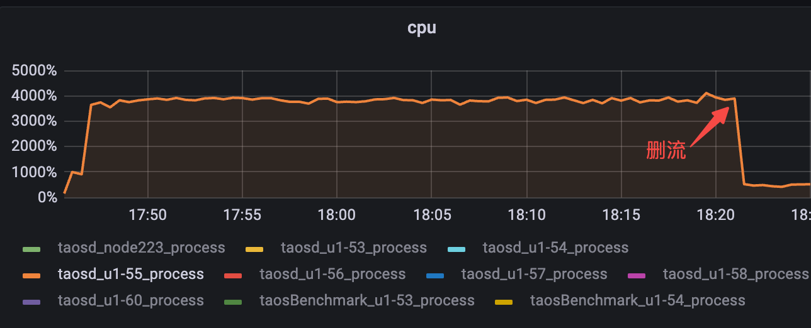
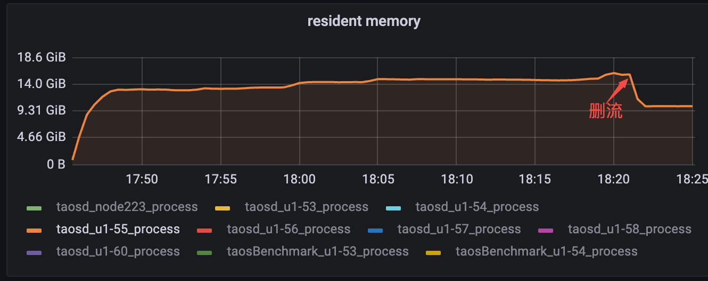

# 流计算建流/删流性能测试报告

## 一、测试概述

[TD-23672](https://jira.taosdata.com:18080/browse/TD-23672)测试创建删除流的性能
建流：在0数据写入情况下不断建流，评估不同参数对建流性能的影响，如fill_history、childtable_count、vgroups、stream_sub_query等；
删流：在写入速度远大于流计算速度的情况下删流，保证不会长时间阻塞，资源可以快速释放；
- 

## 二、测试环境

### **2.1 硬件环境**

| **硬件环境** | **IP** | 用途 | **CPU** | **内存** | **硬盘** |
| --- | --- | --- | --- | --- | --- |
| **测试服务器** | 192.168.1.53 | taostest、taosBenchmark | Intel(R) Xeon(R) CPU E5-2650 v3 @ 2.30GHz 40核 | 251G | PERC H730 Mini 446G*2 |

### **2.2 软件环境**

| **软件环境(3.0分支)** | **IP** | **运行目录** | **脚本及配置** | **commitID** |
| --- | --- | --- | --- | --- |
| **TDengine** | 192.168.1.53 | /root/TDengine | 默认 | eff162d1858f75b9b0b0e15ae2a6bf570cf19a5b |

## 三、测试方案

### 3.1 测试工具

| **测试工具** | **描述** | **脚本/配置文件** |
| --- | --- | --- |
| **taostest** | **测试主程序，部署测试环境，启动taosBenchmark，并发查询，统计结果** | **taostest --setup=Performance/max_stream.yaml --case=Performance/stream_computing/create_stream_perftest.py --keep** |
| **taosBenchmark** | **写入** | **taostest脚本生成** |

### 3.2 写入schema(建流)

| **Type** | **Tag_count** | **Column_count** |
| --- | --- | --- |
| **int** | 1 | 1 |
| **float** | 0 | 2 |
| **varchar(64)** | 1 | 0 |

### 3.3 建流语句

create stream if not exists stream_max_test0 trigger at_once ignore expired 0 fill_history 0 into stream_db.output_stream_tb0   as select _wstart as wstart, _wend as wend, max(current) as max_current from db.stb where voltage <= 220 interval (5s); 
create stream if not exists stream_max_test0 trigger at_once ignore expired 0 fill_history 0 into stream_db.output_stream_tb0   as select _wstart as wstart, _wend as wend, max(current) as max_current from db.stb where voltage <= 220 partition by tbname interval (5s); 

### 3.4 测试关键参数(建流)

| thread_count | childtable_count | vgroups | insert_rows | fill_history |
| --- | --- | --- | --- | --- |
| 1（不支持多线程） | 10000（非关键参数） | 40（非关键参数） | 0 | 0/1 |

### 3.5 测试场景

| 场景 | 描述 |
| --- | --- |
| 最大流数量 | 最大可建多少个，是否可配置 |
| partition/no_partition场景建流时间 | 1-最大建流数量分别消耗的时间 |
| partition/no_partition场景建流资源消耗 | 1-最大建流数量整体的资源消耗（只观察CPU，其它不作为主要影响指标） |
| 建流覆盖fill_history/不同子查询语句/不同子表数量/不同vgroups数量 | 排查可能影响结果的参数 |
| 写入速度大于计算速度时删流 | 在一定数据规模下持续写入，且写入速度大于流计算速度，删流记录时间 |

## 四、测试结果

### 4.1 建流最大数量 60 个，不可修改；

### 4.2 随机取一组结果，1-60个流的建立时间是递增的；

### 注：以下结果中 create_use_time 是每一个流的建立时间，60 个流总耗时 47s 左右；

```sql
{'stream_no': '0', 'create_use_time': '0.1s'}
{'stream_no': '1', 'create_use_time': '0.1s'}
{'stream_no': '2', 'create_use_time': '0.1s'}
{'stream_no': '3', 'create_use_time': '0.2s'}
{'stream_no': '4', 'create_use_time': '0.2s'}
{'stream_no': '5', 'create_use_time': '0.2s'}
{'stream_no': '6', 'create_use_time': '0.3s'}
{'stream_no': '7', 'create_use_time': '0.2s'}
{'stream_no': '8', 'create_use_time': '0.3s'}
{'stream_no': '9', 'create_use_time': '0.3s'}
{'stream_no': '10', 'create_use_time': '0.3s'}
{'stream_no': '11', 'create_use_time': '0.3s'}
{'stream_no': '12', 'create_use_time': '0.4s'}
{'stream_no': '13', 'create_use_time': '0.4s'}
{'stream_no': '14', 'create_use_time': '0.4s'}
{'stream_no': '15', 'create_use_time': '0.4s'}
{'stream_no': '16', 'create_use_time': '0.4s'}
{'stream_no': '17', 'create_use_time': '0.5s'}
{'stream_no': '18', 'create_use_time': '0.5s'}
{'stream_no': '19', 'create_use_time': '0.5s'}
{'stream_no': '20', 'create_use_time': '0.5s'}
{'stream_no': '21', 'create_use_time': '0.6s'}
{'stream_no': '22', 'create_use_time': '0.6s'}
{'stream_no': '23', 'create_use_time': '0.6s'}
{'stream_no': '24', 'create_use_time': '0.6s'}
{'stream_no': '25', 'create_use_time': '0.6s'}
{'stream_no': '26', 'create_use_time': '0.7s'}
{'stream_no': '27', 'create_use_time': '0.7s'}
{'stream_no': '28', 'create_use_time': '0.7s'}
{'stream_no': '29', 'create_use_time': '0.8s'}
{'stream_no': '30', 'create_use_time': '0.8s'}
{'stream_no': '31', 'create_use_time': '0.8s'}
{'stream_no': '32', 'create_use_time': '0.8s'}
{'stream_no': '33', 'create_use_time': '0.8s'}
{'stream_no': '34', 'create_use_time': '1.0s'}
{'stream_no': '35', 'create_use_time': '0.9s'}
{'stream_no': '36', 'create_use_time': '0.9s'}
{'stream_no': '37', 'create_use_time': '1.1s'}
{'stream_no': '38', 'create_use_time': '1.1s'}
{'stream_no': '39', 'create_use_time': '1.0s'}
{'stream_no': '40', 'create_use_time': '1.1s'}
{'stream_no': '41', 'create_use_time': '1.1s'}
{'stream_no': '42', 'create_use_time': '1.0s'}
{'stream_no': '43', 'create_use_time': '1.1s'}
{'stream_no': '44', 'create_use_time': '1.1s'}
{'stream_no': '45', 'create_use_time': '1.2s'}
{'stream_no': '46', 'create_use_time': '1.1s'}
{'stream_no': '47', 'create_use_time': '1.2s'}
{'stream_no': '48', 'create_use_time': '1.2s'}
{'stream_no': '49', 'create_use_time': '1.2s'}
{'stream_no': '50', 'create_use_time': '1.2s'}
{'stream_no': '51', 'create_use_time': '1.2s'}
{'stream_no': '52', 'create_use_time': '1.3s'}
{'stream_no': '53', 'create_use_time': '1.3s'}
{'stream_no': '54', 'create_use_time': '1.3s'}
{'stream_no': '55', 'create_use_time': '1.5s'}
{'stream_no': '56', 'create_use_time': '1.4s'}
{'stream_no': '57', 'create_use_time': '1.6s'}
{'stream_no': '58', 'create_use_time': '1.4s'}
{'stream_no': '59', 'create_use_time': '1.6s'}
total: 46.8s
```

### 4.3 fill_history/vgroups/childtable_count/sub_sql 等参数对建流性能的影响；

**表一：所有结果：(历史结果，因vgroups/childtable对结果无影响，该表作废)**

| ~~**sql**~~ | ~~**fill_history**~~ | ~~**vgroups**~~ | ~~**childtable_count**~~ | ~~**60th stream_spent(s)**~~ | ~~**cpu_p90(%)**~~ |
| --- | --- | --- | --- | --- | --- |
| ~~1000~~ | ~~15.4~~ | ~~265~~ |
| ~~10000~~ | ~~15.3~~ | ~~226~~ |
| ~~1000~~ | ~~15.3~~ | ~~264~~ |
| ~~10000~~ | ~~15.3~~ | ~~291~~ |
| ~~1000~~ | ~~4.2~~ | ~~971~~ |
| ~~10000~~ | ~~4.2~~ | ~~974~~ |
| ~~1000~~ | ~~4.2~~ | ~~974~~ |
| ~~10000~~ | ~~4.2~~ | ~~975~~ |
| ~~1000~~ | ~~16.6~~ | ~~1755~~ |
| ~~10000~~ | ~~16.6~~ | ~~1669~~ |
| ~~1000~~ | ~~16.8~~ | ~~1671~~ |
| ~~10000~~ | ~~16.7~~ | ~~1670~~ |
| ~~1000~~ | ~~4.2~~ | ~~976~~ |
| ~~10000~~ | ~~4.3~~ | ~~979~~ |
| ~~1000~~ | ~~4.2~~ | ~~977~~ |
| ~~10000~~ | ~~4.2~~ | ~~976~~ |

**表二：删除不影响结果的列： vgroups 和 childtable_count：**

| **sql** | **fill_history** | **60 stream_spent(s)** | **cpu_p90(%)** | **mem_p90(M)** |
| --- | --- | --- | --- | --- |
| select _wstart as wstart, _wend as wend, max(current) as max_current from db.stb where voltage <= 220 interval (5s); | 46.8 | 2454 | 7619 |
| select _wstart as wstart, _wend as wend, max(current) as max_current from db.stb where voltage <= 220 partition by tbname interval (5s) | 47.1 | 2388 | 8109 |
| select _wstart as wstart, _wend as wend, max(current) as max_current from db.stb where voltage <= 220 interval (5s); | 72.5 | 1706 | 8976 |
| select _wstart as wstart, _wend as wend, max(current) as max_current from db.stb where voltage <= 220 partition by tbname interval (5s) | 47.3 | 2404 | 9200 |

**小结：**
**表一结果为历史数据，仅为了排查 vgroups/childtable 的影响，可以看出，无论是 partition by tbname 或者 no_partition 场景，子表数和 vgroups 数量对结果的影响很小；**
**从表二结果可以看出，fill_history 关闭时建流，partition 和 no_partition 场景建流耗时和资源消耗都相近，fill_history 开启时建流，no_partition 的场景 cpu 占用相对较低，但建流时间也有所增加。**

### **4.4 删流**

<view type="1">

  > ⚠ 嵌入文件，需在飞书中查看 (token: KDfhb6fbzoLCR2xDfkacm5wLnnh)

</view>


使用该 json 测试，含10%乱序，可将 40 核 CPU 打满，属于计算密集跟不上写入速度的情况，在一定数据规模下删流，可发现流可以很快删除，且 CPU 和内存在删流后可以很快释放，并不会阻塞；
```sql
taos> select count(*) from stb;
       count(*)        |
========================
            2475799185 |
Query OK, 1 row(s) in set (12.598478s)

taos> select count(*) from ctb0_0;
       count(*)        |
========================
                 24305 |
Query OK, 1 row(s) in set (0.004405s)

## 流的数量远跟不上批的数量

taos> select count(*) from output_streamtb;
       count(*)        |
========================
                  2001 |
Query OK, 1 row(s) in set (1.285964s)

taos> show streams;
          stream_name           |
=================================
 stream_stability               |
Query OK, 1 row(s) in set (0.004382s)

taos> drop stream stream_stability;
Drop OK, 0 row(s) affected (2.068267s)
```





## 五、测试结论

相关测试已完成，无遗留问题
1. 无论是 partition by tbname 或者 no_partition 场景，子表数和 vgroups 数量对结果的影响很小；
2. 1-60个流的建立时间是递增的，总耗时最多需72.5s；
3. fill_history 关闭时建流，partition 和 no_partition 场景建流耗时和资源消耗都相近，fill_history 开启时建流，no_partition 的场景 cpu 占用相对较低，但建流时间也有所增加；
4. 计算速度远低于写入速度情况下删流，不会阻塞；
