# 流计算测试方案（rocksdb+外存版本）（draft）

[流计算优化](https://taosdata.feishu.cn/wiki/wikcnS6me1Vb3B98ByJF3HWztZb) 

## 一.测试背景

为了解决内存及 IO 引起的一系列流计算问题，开发基于外存和 rocksdb 进行了一系列优化或替换，需基于功能/性能/稳定性等对流计算进行新一轮的测试，一方面保证功能的兼容性，一方面确认新版本的流计算是否修复了历史问题；

## 二.功能测试 

覆盖下表中的所有功能，测试方法是跑历史用例，历史用例兼容了各种场景的交叉组合，同时对过程及最终结果进行校验，功能测试通过后，可初步认为兼容性是没问题的；

| trigger_mode | at_once | pass |
| --- | --- | --- |
|  | window_close | pass |
|  | max_delay | pass |
| Watermark | 搭配 trigger_mode 测试 | pass |
| window | interval | pass |
|  | session_window | pass |
|  | state_window | pass |
| udf | 标量 | pass |
|  | 聚合 | pass |
| 标量函数 | abs, acos, asin, atan, ceil等 | pass |
| Partition by | tbname，column，tag，expression，constant | pass |
| fill_history | 0/1 | pass |
| ignore_expired | 0/1 | pass |
| ignore_update | 0/1 | pass |
| 已存在超级表 | 组合 | pass |
| 自定义子表 | 组合 | pass |
| 自定义tag | 组合 | pass |
| Fill | NULL，PREV，NEXT，LINEAR、VALUE | pass |
| case_when | 组合 | pass |
|  |  |  |
|  |  |  |
|  |  |  |
|  |  |  |


## 三.性能测试

基于历史场景测试并对比结果，看本次优化的效果

### **无跨时间线窗口聚合**

建流语句的子查询使用 partition by tbname，每个子表会在各自的时间线分别做聚合，以不同的 vgroups 和 interval测试性能；
暂不测试，受[TD-24008流计算优化性能测试，partition by tbname场景，cpu资源占用和QPS需优化](https://jira.taosdata.com:18080/browse/TD-24008)影响

### **跨时间线窗口聚合**

建流语句的子查询不带 partition，则所有子表的数据会聚合到一条时间线，以不同的 vgroups 和 interval测试性能；
建流语句：create stream if not exists perf_stream trigger at_once/window_close ignore expired 0  into perf_db1.output_streamtb   as select _wstart as wstart, min(c1),max(c2), sum(c3), avg(c0), count(c3), first(c0), last(c1), now  from perf_db1.stb interval($interval) ;


**尝试调整参数，将网卡打满成为瓶颈，但流的延迟也随写入延迟升高，故负载不打太高，以下为一组网卡瓶颈时的结果：**

| Trigger_mode | Interval(s) | QPS(rows/s) | Insert_Latency(ms) | Stream_latency(ms) | CPU(%) | MEM(M) | Net(Kb/s) |
| --- | --- | --- | --- | --- | --- | --- | --- |
| at_once | 10 | 2262847 | 338 | 323 | 1060 | 559 | 924662 |


**固定参数（该组参数在无流时网卡70%左右）：**

| threads | batch | interlace | table_count | rows/table | timestamp_step |  |
| --- | --- | --- | --- | --- | --- | --- |
| 40 | 1000 | 4 | 10000 | 10000 | 1.1s |  |

测试结果(enh/rocksdbSstate)(aca5760ceb65e11f691ab686f8b644cdfd67718e)（CPU/MEM/NET资源消耗选用P90）：

| Vgroups | Trigger_mode | Interval(s) | window_count | QPS(rows/s) | Insert_Latency(ms) | Stream_latency(ms) | CPU(avg)(%) | MEM(M) | Net(Kb/s) |
| --- | --- | --- | --- | --- | --- | --- | --- | --- | --- |
| no_stream | - | - | 1391096 | 27 | - | 471 | 1800 | 637766 |
| 10 | 1100 | 1399578 | 27 | 21 | 1014 | 1834 | 642135 |
| 60 | 184 | 1428840 | 26 | 21 | 1033 | 1834 | 655627 |
| 10 | 1099 | 1440468 | 26 | 20 | 1056 | 1836 | 659673 |
| 60 | 183 | 1422255 | 26 | 20 | 1011 | 1837 | 648880 |
| no_stream | - | - | 1388418 | 27 | - | 860 | 4439 | 703191 |
| 10 | 1100 | 1379652 | 27 | 16 | 1758 | 4379 | 694571 |
| 60 | 184 | 1371383 | 27 | 15 | 1746 | 4524 | 688488 |
| 10 | 1099 | 1381884 | 27 | 16 | 1769 | 4626 | 692894 |
| 60 | 183 | 1422762 | 26 | 15 | 1765 | 4584 | 713436 |

### 建流/删流性能测试

[TD-23672](https://jira.taosdata.com:18080/browse/TD-23672) [测试创建删除流的性能](https://jira.taosdata.com:18080/browse/TD-23672)

### 最大流数量测试

在一台常用的服务器上（如40核256G），建库建超级表建子表，并插入数据，然后一直建流，直到某个系统资源到达瓶颈。看看能够支持最大的流的数量；
暂时无法测试，目前日志占用磁盘较多：[TD-23874](https://jira.taosdata.com:18080/browse/TD-23874)

### 历史 jira 专项测试

回归历史 jira，确认相关问题是否已优化；

| **Jira** | **修复状态** |
| --- | --- |
| [stream 磁盘占用过高](https://jira.taosdata.com:18080/browse/TD-22834?src=confmacro) | 已修复 |
| [流计算多副本跨时间线窗口聚合推送结果较慢](https://jira.taosdata.com:18080/browse/TD-21133?src=confmacro) | 单副本已测试通过，多副本暂不支持 |
| [fill_history 加入重启taosd操作后，流结果丢失](https://jira.taosdata.com:18080/browse/TD-21908?src=confmacro) | 已修复 |
| ...... |  |

## 四.稳定性测试

1. 组合功能测试中的各种场景进行大数据量稳定性测试；
场景一：(无partition，stream中数据太少了 重测)
建流语句：
CREATE STREAM IF NOT EXISTS stream_stability TRIGGER at_once WATERMARK 30s IGNORE UPDATE 0 IGNORE EXPIRED 0 FILL_HISTORY 1 INTO stream_test.output_streamtb (ts,c1,c2,c3) TAGS(t1) SUBTABLE(concat("sub_tb1_", "suffix")) as select _wstart as wstart, min(c1),max(c2), count(c3)  from stream_test.stb interval(1s)；
覆盖功能：

| fill_history | custom_tag | existed_stable |
| --- | --- | --- |
| interval | watermark | at_once |
| ignore_expired | ignore_update | subtable |


| schema |
| --- |
| type | int | float | timestamp | tinyint | varchar(16) |
| count | 1 | 2 | 2 | 1 | 1 |

结果数据：

| table_count | rows_count | stream_rows | QPS（rows/s） | latency(ms) | 磁盘占用 |
| --- | --- | --- | --- | --- | --- |
| 1000000 | 69388943000 | 3096 | 2713100.91 | 14 | 805G |

cpu:   fill_history时基本打满，然后恢复常态，但流中数据很少，不正常，推测后面在没有stream参与计算
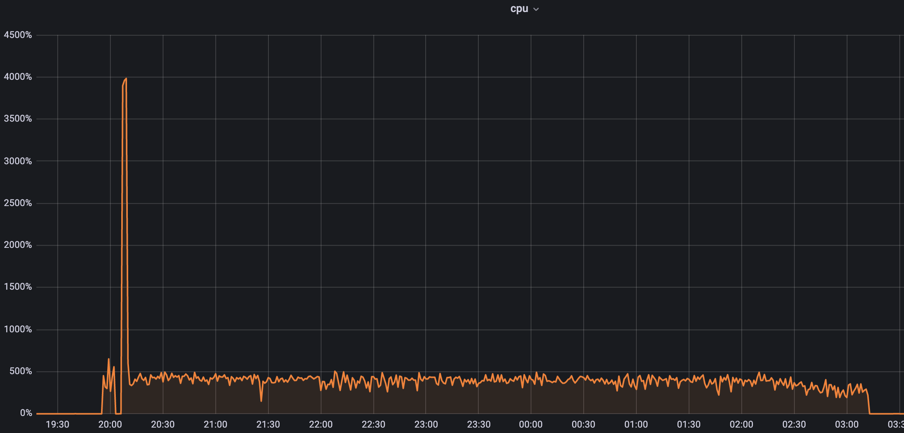

内存：
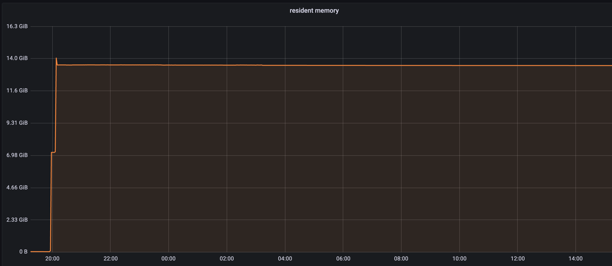

场景一：(去掉FILL_HISTORY，调整interval)
建流语句：
create stream if not exists stream_stability trigger window_close watermark 30s ignore update 0 ignore expired 0 fill_history 0 into stream_test.output_streamtb (ts,c1,c2,c3) tags(t1) subtable(concat("sub_tb1_", "suffix")) as select _wstart as wstart, min(c1),max(c2), count(c3)  from stream_test.stb interval(10s)
覆盖功能：

| fill_history | custom_tag | existed_stable |
| --- | --- | --- |
| interval | watermark | at_once |
| ignore_expired | ignore_update | subtable |


| schema |
| --- |
| type | int | float | timestamp | tinyint | varchar(16) |
| count | 1 | 2 | 2 | 1 | 1 |

结果数据：

| table_count | rows_count | stream_rows | QPS（rows/s） | latency(ms) | 磁盘占用 |
| --- | --- | --- | --- | --- | --- |
| 1000000 | 50100000000 | 5496 | 357723.70 | 2477 | 278G |

cpu:   最高1100左右，超过max的剧烈上涨
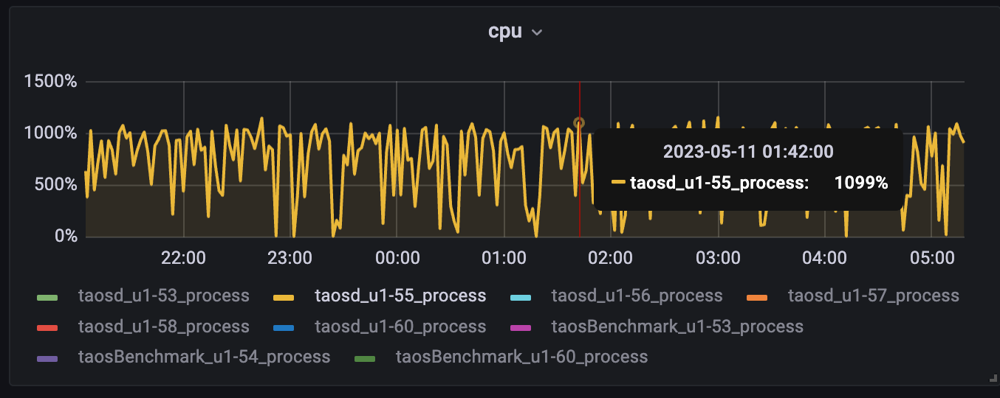

内存：较为平稳
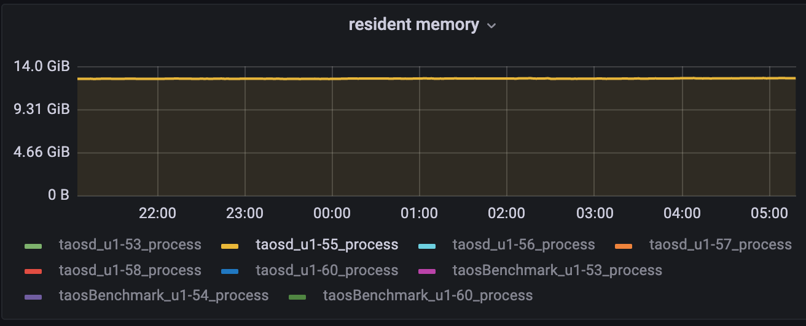

磁盘：tq目录占用较少
```sql
root@u1-55 /var/lib/taos/vnode/vnode121 $ du -sh *
7.0M        meta
12K        sync
4.0M        tq
6.8G        tsdb
4.0K        vnode.json
43M        wal
```

场景二：(partition by tbname 10W子表)
建流语句：
create stream if not exists stream_stability trigger window_close watermark 30s into stream_test.output_streamtb (ts,c1,c2,c3) tags(t1) subtable(concat(tbname, "suffix")) as select _wstart as wstart, min(c1),max(c2), count(c3)  from stream_test.stb partition by cast(t1 as int) t1,tbname interval(10s);
覆盖功能：

| fill_history | custom_tag | existed_stable |
| --- | --- | --- |
| interval | watermark | at_once |
| ignore_expired | ignore_update | subtable |


| schema |
| --- |
| type | int | float | timestamp | tinyint | varchar(16) |
| count | 1 | 2 | 2 | 1 | 1 |

结果数据：

| table_count | rows_count | stream_rows | QPS（rows/s） | latency(ms) | 磁盘占用 |
| --- | --- | --- | --- | --- | --- |
| 100000 | 50000000000 | 13618224 | 2623212.98 | 375 | 572G |

Cpu:
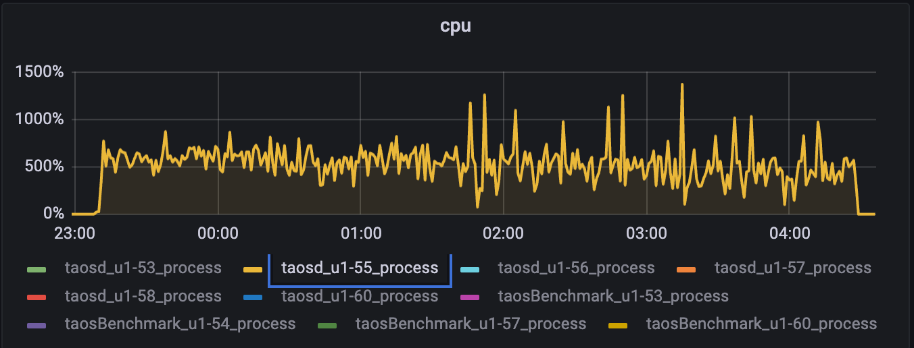

内存：
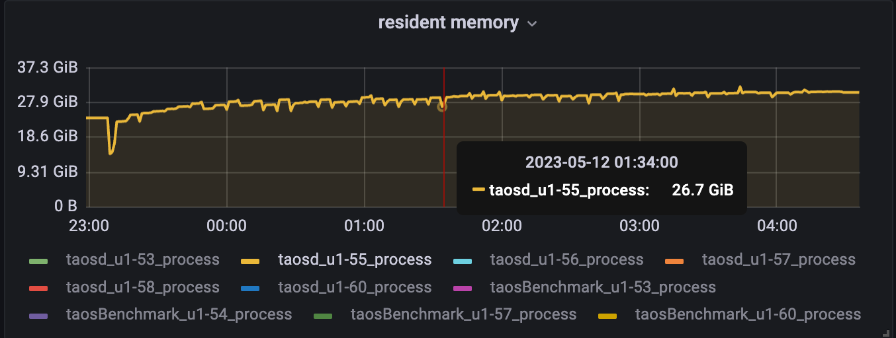

磁盘IO：(有些高)
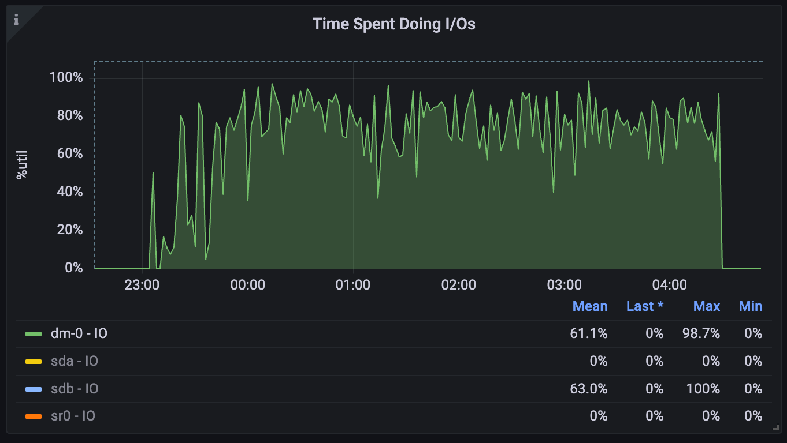

磁盘占用：
```sql
root@u1-55 ~/TDengine (enh/rocksdbSstate)$ du -sh /var/lib/taos
572G        /var/lib/taos
root@u1-55 ~/TDengine (enh/rocksdbSstate)$ cd /var/lib/taos/vnode/vnode45
root@u1-55 /var/lib/taos/vnode/vnode45 $ du -sh *
1.4M        meta
12K        sync
146M        tq
15G        tsdb
4.0K        vnode.json
22M        wal
```

1. 进行用户场景 （nevados） 的长稳测试；
建流语句：
CREATE STREAM IF NOT EXISTS trackers_hourly_stream IGNORE UPDATE 0 IGNORE EXPIRED 0 FILL_HISTORY 1 INTO dev.trackers_hourly as select _wstart as window_start, site, zone, tracker, max( case when abs(reg_pitch - reg_move_pitch) <= 2 then 1 when reg_temp_therm2 < -20 then 1 else 0 end ) as on_target, case when max(abs(reg_pitch - reg_move_pitch)) <= 2 then "on_target" when min(reg_temp_therm2) < -20 then "cold_limit" else "off_target" end as on_target_status, avg(reg_pitch) as avg_pitch, last(reg_pitch) as last_pitch, avg(reg_move_pitch) as avg_move_pitch, last(reg_move_pitch) as last_move_pitch from prod.trackers where _ts >= "2023-01-01" and _ts < now() + 1h partition by site, zone, tracker interval(1h) sliding(1h) fill(null)
覆盖功能：

| window_close | ignore_update | ignore_expired | fill_history |
| --- | --- | --- | --- |
| case_when | partition interval | sliding | fill(null) |

schema较复杂，参考json
结果数据：

| table_count | rows_count | stream_rows | QPS（rows/s） | latency(ms) | 磁盘占用 |
| --- | --- | --- | --- | --- | --- |
| 1000G | 13860382270 | 2605596 | 540000 | 70 | 32G |

cpu:   
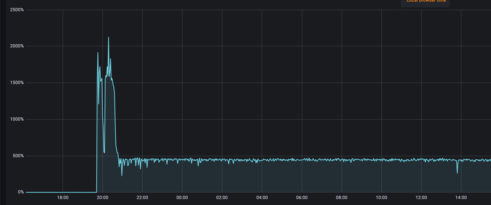

内存：
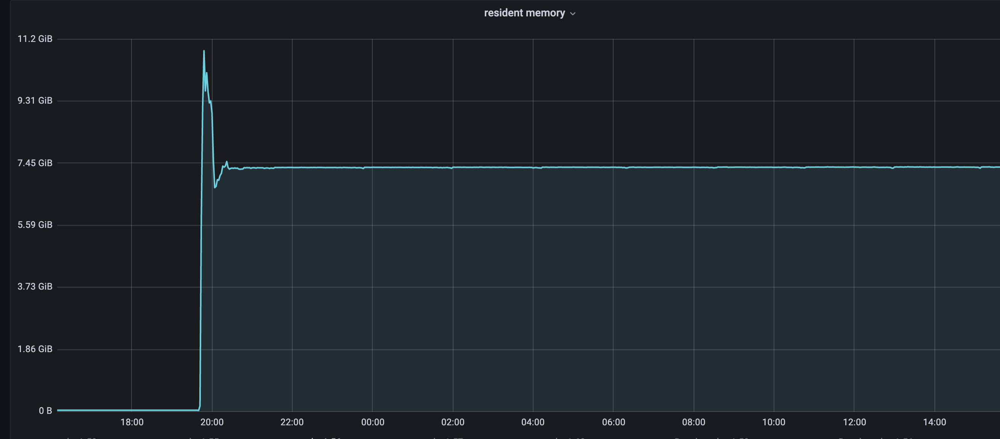

1. 组合部分场景写入大量数据后进行compact测试（"disorder_ratio": 20, "disorder_range": 1000）；
场景1（compact时写入停止）：
建流语句：
create stream if not exists stream_stability trigger at_once watermark 30s into stream_test.output_streamtb (ts,c1,c2,c3) tags(t1) as select _wstart as wstart, min(c1),max(c2), count(c3)  from stream_test.stb interval(1s)
覆盖功能：

| subtable | custom_tag | existed_stable |
| --- | --- | --- |
| interval | watermark | at_once |


| schema |
| --- |
| type | int | float | timestamp | tinyint | varchar(16) |
| count | 1 | 2 | 2 | 1 | 1 |

结果数据：

| table_count | rows_count | stream_rows | QPS（rows/s） | latency(ms) | 磁盘占用 |
| --- | --- | --- | --- | --- | --- |
| 10000 | 8004461709 | 802370 | 1823667.92 | 11 | 153G |

**compact前：**
```sql
root@u1-56 ~/TDengine (enh/rocksdbSstate)$ du -sh /var/lib/taos/vnode
153G        /var/lib/taos/vnode
root@u1-56 ~/TDengine (enh/rocksdbSstate)$ du -sh /var/lib/taos/vnode/vnode13/*
144K        /var/lib/taos/vnode/vnode13/meta
12K        /var/lib/taos/vnode/vnode13/sync
1.4M        /var/lib/taos/vnode/vnode13/tq
3.8G        /var/lib/taos/vnode/vnode13/tsdb
4.0K        /var/lib/taos/vnode/vnode13/vnode.json
57M        /var/lib/taos/vnode/vnode13/wal
taos> select count(*) from stb;
       count(*)        |
========================
            8004461709 |
Query OK, 1 row(s) in set (11.843977s)

taos> select count(*) from output_streamtb;
       count(*)        |
========================
                802370 |
Query OK, 1 row(s) in set (0.074052s)
```

compact后：
```sql
root@u1-56 ~/TDengine (enh/rocksdbSstate)$ du -sh /var/lib/taos
96G        /var/lib/taos
root@u1-56 ~/TDengine (enh/rocksdbSstate)$ du -sh /var/lib/taos/vnode/vnode13/*
144K        /var/lib/taos/vnode/vnode13/meta
12K        /var/lib/taos/vnode/vnode13/sync
1.7M        /var/lib/taos/vnode/vnode13/tq
2.4G        /var/lib/taos/vnode/vnode13/tsdb
4.0K        /var/lib/taos/vnode/vnode13/vnode.json
16K        /var/lib/taos/vnode/vnode13/wal
taos> select count(*) from stream_test.stb;
       count(*)        |
========================
            8004461709 |
Query OK, 1 row(s) in set (0.172405s)
taos> select count(*) from output_streamtb;
       count(*)        |
========================
                802370 |
Query OK, 1 row(s) in set (0.007434s)
```

场景2 (compact时持续写入)：
建流语句：
create stream if not exists stream_stability trigger at_once watermark 30s into stream_test.output_streamtb (ts,c1,c2,c3) tags(t1) as select _wstart as wstart, min(c1),max(c2), count(c3)  from stream_test.stb interval(1s)
覆盖功能：

| subtable | custom_tag | existed_stable |
| --- | --- | --- |
| interval | watermark | at_once |


| schema |
| --- |
| type | int | float | timestamp | tinyint | varchar(16) |
| count | 1 | 2 | 2 | 1 | 1 |

结果数据：

| table_count | rows_count | stream_rows | QPS（rows/s） | latency(ms) | 磁盘占用 |
| --- | --- | --- | --- | --- | --- |
| 500000 | 11740033930 | 24127 | - | - | - |

**compact前：**
```sql
root@u1-56 ~ $ du -sh /var/lib/taos/
190G        /var/lib/taos/
root@u1-56 ~ $ du -sh /var/lib/taos/vnode/vnode10/*
3.6M        /var/lib/taos/vnode/vnode10/meta
12K        /var/lib/taos/vnode/vnode10/sync
512K        /var/lib/taos/vnode/vnode10/tq
4.7G        /var/lib/taos/vnode/vnode10/tsdb
4.0K        /var/lib/taos/vnode/vnode10/vnode.json
38M        /var/lib/taos/vnode/vnode10/wal
taos> select count(*) from stb;
       count(*)        |
========================
           11740033930 |
Query OK, 1 row(s) in set (21.496973s)

taos> select count(*) from output_streamtb;
       count(*)        |
========================
                 24127 |
Query OK, 1 row(s) in set (1.973283s)
```

compact后：
```sql
taos> compact database stream_test;
Query OK, 0 row(s) affected (1243.173217s)

root@u1-56 ~ $ du -sh /var/lib/taos/
153G        /var/lib/taos/
root@u1-56 ~ $ du -sh /var/lib/taos/vnode/vnode10/*
3.6M        /var/lib/taos/vnode/vnode10/meta
12K        /var/lib/taos/vnode/vnode10/sync
588K        /var/lib/taos/vnode/vnode10/tq
4.0G        /var/lib/taos/vnode/vnode10/tsdb
4.0K        /var/lib/taos/vnode/vnode10/vnode.json
27M        /var/lib/taos/vnode/vnode10/wal

compact过程中有一定程度阻塞，写入变慢
taos> select count(*) from stb;
       count(*)        |
========================
           12238508696 |
Query OK, 1 row(s) in set (4.829839s)

taos> select count(*) from output_streamtb;
       count(*)        |
========================
                 28132 |
Query OK, 1 row(s) in set (0.395737s)
```


**测试小结：**
**无论写入过程中还是停止后 compact，磁盘空间大幅压缩，查询性能提升明显，compact会有一定程度的阻塞写入，但无论写入还是流计算，都会在compact结束后恢复，且内存和CPU较稳定；**

## 五. 异常场景测试（基于无FILL_HISTORY测试[TD-24155](https://jira.taosdata.com:18080/browse/TD-24155)）


| 场景 | 场景描述 | 测试结果 |
| --- | --- | --- |
| 写入过程中kill taosd | 写入过程中kill taosd，重启taosd后持续写入，流可以恢复计算，不应有丢数据情况 | 完成 |
| 写入过程中断电 | 写入过程中服务器断电，重启taosd后持续写入，流可以恢复计算，不应有丢数据情况 | 完成 |
| 写入过程中reboot | 写入过程中服务器reboot，重启taosd后持续写入，流可以恢复计算，不应有丢数据情况 | 完成 |
| 重启测试 | 写入过程中重启流计算，重启后持续写入，看流计算是否能恢复，并校验数据完整性 | [TD-24167](https://jira.taosdata.com:18080/browse/TD-24167) |
| 计算任务很多的情况下删流 | 调整trigger_mode等参数，使写入时产生大量流计算窗口，看流是否能正常删除 |  |
| 大量历史数据含fill_history建流，在fill过程中删流 | 写入大量历史数据，然后含fill_history建流，并触发大量计算，fill_histrory过程中删流，看能否正常删除 |  |
| 不断建流、写入、删流 | 不断重复建库建表建流写入删流的步骤，看系统是否会出问题 |  |
|  |  |  |
|  |  |  |
|  |  |  |

## 六.升级测试

测试版本兼容性，基于官网最新版本（如3.0.4.0）建库建表建流并写入一定量数据后升级到该优化版本，重启 taosd 后看流计算是否能继续工作，然后继续进行写入、删流、重建流等操作，看是否会有问题。
**步骤1（3.0.4.0版本）:**
**ignore_update和ignore_expired设置为0，使用stream_exist_stb_tag_prepare.json和stream_exist_stb_tag_insert.json，数据量1000W**
create stream if not exists stream_stability trigger at_once watermark 30s ignore update 0 ignore expired 0 fill_history 1 into stream_test.output_streamtb (ts,c1,c2,c3) tags(t1) subtable(concat("sub_tb1_", "suffix")) as select _wstart as wstart, min(c1),max(c2), count(c3)  from stream_test.stb interval(1s)
```sql
taos> select count(*) from stb;
       count(*)        |
========================
              10000000 |
Query OK, 1 row(s) in set (0.104557s)

taos> select count(*) from output_streamtb;
       count(*)        |
========================
                  1000 |
Query OK, 1 row(s) in set (0.006817s)
```

**步骤2（优化版本）:**
升级到优化版本，分两步测试：
A.删掉旧的流，其它不变，该场景下最终结果应不变；
```sql
drop stream stream_stability;
create stream if not exists stream_stability trigger at_once watermark 30s ignore update 0 ignore expired 0 fill_history 1 into stream_test.output_streamtb (ts,c1,c2,c3) tags(t1) subtable(concat("sub_tb1_", "suffix")) as select _wstart as wstart, min(c1),max(c2), count(c3)  from stream_test.stb interval(1s)；
taos> select count(*) from stream_test.output_streamtb;
       count(*)        |
========================
                  1000 |
Query OK, 1 row(s) in set (0.010215s)
```

B. 旧的流不删，新建一个流，新建一个target超级表，subtable需要改个名字，否则报错;
```sql
create table stream_test.output_streamtb1 (ts timestamp, c0 int, c1 float, c2 float, c3 timestamp) tags (t0 tinyint, t1 varchar(16));
create stream if not exists stream_stability1 trigger at_once watermark 30s ignore update 0 ignore expired 0 fill_history 1 into stream_test.output_streamtb1 (ts,c1,c2,c3) tags(t1) subtable(concat("sub_tb2_", "suffix")) as select _wstart as wstart, min(c1),max(c2), count(c3)  from stream_test.stb interval(1s);

taos> select count(*) from stream_test.output_streamtb1;
       count(*)        |
========================
                  1000 |
Query OK, 1 row(s) in set (0.007484s)
```

小结：
1. 针对不同的建流语句，升级后删流，想要1:1重建需要对流计算语法较为熟悉，否则可能会达不到预期的恢复；
2. 如数据量较大，还想保留历史结果，删流后建流就要增加"fill_history 1"选项，那么就面临较长的耗时和较大的资源消耗；
3. 如历史数据设置了忽略过期数据（ignore expired 0），那么删流再重建时如指定"fill_history 1"，那么结果会比历史多，无法确认流数据一致性；
1. 


## 测试结果记录：

**场景1. 有乱序，ignore_update和ignore_expired设置为0，使用json:stream_exist_stb_tag_prepare.json stream_exist_stb_tag_insert.json**
3.0.4.0版本：
1000子表先写入10000数据（无流），建流后继续写入总数据量100亿：
```sql
taos> select count(*) from stb;

DB error: No available disk (0.011405s)
taos> select count(*) from output_streamtb;

DB error: No available disk (0.005572s)

root@u1-57 /var/lib/taos/vnode $ du -sh .
813G        .
```

内存：


磁盘：
```sql
root@u1-57 /var/lib/taos/vnode/vnode10 $ du -sh *
140K        meta
12K        sync
21G        tq
1.2G        tsdb
4.0K        vnode.json
35M        wal

root@u1-55 /var/lib/taos/vnode $ du -sh .
126G        .
```

```sql
3.0.4.0版本：
taos> select count(*) from stb;

DB error: No available disk (0.011405s)
taos> select count(*) from output_streamtb;

DB error: No available disk (0.005572s)

root@u1-57 /var/lib/taos/vnode $ du -sh .
813G        .

优化后版本：
root@u1-57 /var/lib/taos/vnode/vnode10 $ du -sh *
140K        meta
12K        sync
21G        tq
1.2G        tsdb
4.0K        vnode.json
35M        wal

root@u1-55 /var/lib/taos/vnode $ du -sh .
126G        .
```


优化版本：
1000子表先写入10000数据（无流），建流后继续写入总数据量100亿：
```sql
taos> select count(*) from stb;
       count(*)        |
========================
           10000000000 |
Query OK, 1 row(s) in set (0.991170s)

taos> select count(*) from output_streamtb;
       count(*)        |
========================
               4411328 |
Query OK, 1 row(s) in set (0.328906s)
```

内存：
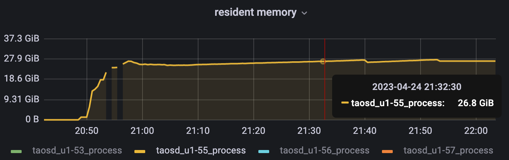

磁盘：
```sql
root@u1-55 /var/lib/taos/vnode/vnode10 $ du -sh *
140K        meta
12K        sync
146M        tq
2.8G        tsdb
4.0K        vnode.json
11M        wal
```

**场景2: ignore_update和ignore_expired未指定，默认忽略，使用nevados_prepare_data.json和nevados_stream_insert.json**
3.0.4.0版本：
1000子表先写入100数据（无流），建流后继续写入总数据量10亿：

```sql
root@u1-56 ~/taos-test-framework (master)$ taos
taos> select count(*) from prod.trackers;
       count(*)        |
========================
             972097300 |
Query OK, 1 row(s) in set (27.047415s)
taos> select count(*) from dev.trackers_hourly;
       count(*)        |
========================
                208758 |
Query OK, 1 row(s) in set (0.019645s)

升级后：
taos> select count(*) from dev.trackers_hourly;
       count(*)        |
========================
                749758 |
Query OK, 1 row(s) in set (0.025992s)
```


内存：
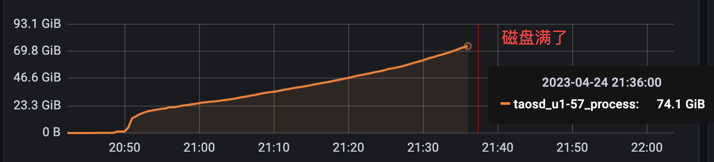

磁盘：
```sql
root@u1-56 /var/lib/taos/vnode/vnode10 $ du -sh *
88K        meta
12K        sync
192K        tq
63M        tsdb
4.0K        vnode.json
7.1M        wal
```

优化版本：
1000子表先写入10000数据（无流），建流后继续写入总数据量100亿：
```sql
taos> select count(*) from prod.trackers;
       count(*)        |
========================
             959096900 |
Query OK, 1 row(s) in set (27.789880s)

taos> select count(*) from dev.trackers_hourly;
       count(*)        |
========================
                318962 |
Query OK, 1 row(s) in set (0.022270s)
```

```sql
root@u1-56 /var/lib/taos/vnode/vnode10 $ tree -h .
.
├── [4.0K]  meta
│   ├── [4.0K]  invert
│   ├── [ 76K]  main.tdb
│   └── [   0]  main.tdb-journal.509
├── [4.0K]  sync
│   ├── [ 372]  raft_config.json
│   └── [  68]  raft_store.json
├── [4.0K]  tq
│   ├── [ 48K]  main.tdb
│   └── [4.0K]  stream
│       ├── [4.0K]  1103316898
│       │   ├── [   9]  cfg
│       │   ├── [ 28K]  main.tdb
│       │   └── [8.0K]  main.tdb-journal.8
│       ├── [4.0K]  checkpoints
│       ├── [ 80K]  main.tdb
│       └── [   0]  main.tdb-journal.499
├── [ 28K]  tsdb
│   ├── [3.6K]  CURRENT
│   ├── [136K]  v10f387ver1.data
│   ├── [4.0K]  v10f387ver1.sma
│   ├── [8.0K]  v10f387ver1.stt
│   ├── [ 92K]  v10f387ver2.stt
│   ├── [ 92K]  v10f387ver3.stt
│   ├── [ 92K]  v10f387ver4.stt
│   ├── [ 92K]  v10f387ver5.stt
│   ├── [4.0K]  v10f387ver6.head
│   ├── [ 48K]  v10f387ver6.stt
│   ├── [ 12K]  v10f388ver14.head
│   ├── [4.0K]  v10f388ver14.stt
│   ├── [756K]  v10f388ver6.data
│   ├── [4.0K]  v10f388ver6.sma
│   ├── [1.0M]  v10f389ver12.data
│   ├── [4.0K]  v10f389ver12.sma
│   ├── [4.0K]  v10f389ver20.stt
│   ├── [ 16K]  v10f389ver21.head
│   ├── [4.0K]  v10f389ver21.stt
│   ├── [696K]  v10f390ver19.data
│   ├── [4.0K]  v10f390ver19.sma
│   ├── [4.0K]  v10f390ver27.stt
│   ├── [ 28K]  v10f390ver28.stt
│   ├── [8.0K]  v10f390ver29.head
│   ├── [4.0K]  v10f390ver29.stt
│   ├── [588K]  v10f391ver25.data
│   ├── [4.0K]  v10f391ver25.sma
│   ├── [4.0K]  v10f391ver33.stt
│   ├── [ 72K]  v10f391ver34.stt
│   ├── [ 32K]  v10f391ver35.stt
│   ├── [8.0K]  v10f391ver36.head
│   ├── [8.0K]  v10f391ver36.stt
│   ├── [964K]  v10f392ver32.data
│   ├── [4.0K]  v10f392ver32.sma
│   ├── [4.0K]  v10f392ver40.stt
│   ├── [4.0K]  v10f392ver41.stt
│   ├── [ 40K]  v10f392ver42.stt
│   ├── [ 12K]  v10f392ver43.stt
│   ├── [ 12K]  v10f392ver44.head
│   ├── [4.0K]  v10f392ver44.stt
│   ├── [1008K]  v10f393ver39.data
│   ├── [4.0K]  v10f393ver39.sma
│   ├── [4.0K]  v10f393ver47.stt
│   ├── [4.0K]  v10f393ver48.stt
│   ├── [4.0K]  v10f393ver49.stt
│   ├── [ 20K]  v10f393ver50.stt
│   ├── [ 12K]  v10f393ver51.head
│   ├── [4.0K]  v10f393ver51.stt
│   ├── [1004K]  v10f394ver45.data
│   ├── [4.0K]  v10f394ver45.sma
│   ├── [4.0K]  v10f394ver53.stt
│   ├── [4.0K]  v10f394ver54.stt
│   ├── [4.0K]  v10f394ver55.stt
│   ├── [4.0K]  v10f394ver56.stt
│   ├── [ 24K]  v10f394ver57.stt
│   ├── [ 12K]  v10f394ver58.head
│   ├── [8.0K]  v10f394ver58.stt
│   ├── [796K]  v10f395ver52.data
│   ├── [4.0K]  v10f395ver52.sma
│   ├── [4.0K]  v10f395ver60.stt
│   ├── [4.0K]  v10f395ver61.stt
│   ├── [4.0K]  v10f395ver62.stt
│   ├── [4.0K]  v10f395ver63.stt
│   ├── [ 28K]  v10f395ver64.stt
│   ├── [ 12K]  v10f395ver65.head
│   ├── [ 12K]  v10f395ver65.stt
│   ├── [872K]  v10f396ver59.data
│   ├── [4.0K]  v10f396ver59.sma
│   ├── [4.0K]  v10f396ver67.stt
│   ├── [4.0K]  v10f396ver68.stt
│   ├── [4.0K]  v10f396ver69.stt
│   ├── [4.0K]  v10f396ver70.stt
│   ├── [ 28K]  v10f396ver71.stt
│   ├── [ 16K]  v10f396ver72.stt
│   ├── [ 12K]  v10f396ver73.head
│   ├── [4.0K]  v10f396ver73.stt
│   ├── [776K]  v10f397ver66.data
│   ├── [4.0K]  v10f397ver66.sma
│   ├── [4.0K]  v10f397ver74.stt
│   ├── [4.0K]  v10f397ver75.stt
│   ├── [4.0K]  v10f397ver76.stt
│   ├── [4.0K]  v10f397ver77.stt
│   ├── [ 32K]  v10f397ver78.stt
│   ├── [ 16K]  v10f397ver79.stt
│   ├── [ 12K]  v10f397ver80.head
│   ├── [4.0K]  v10f397ver80.stt
│   ├── [964K]  v10f398ver73.data
│   ├── [4.0K]  v10f398ver73.sma
│   ├── [4.0K]  v10f398ver81.stt
│   ├── [4.0K]  v10f398ver82.stt
│   ├── [4.0K]  v10f398ver83.stt
│   ├── [4.0K]  v10f398ver84.stt
│   ├── [ 36K]  v10f398ver85.stt
│   ├── [ 20K]  v10f398ver86.stt
│   ├── [ 12K]  v10f398ver87.head
│   ├── [8.0K]  v10f398ver87.stt
│   ├── [412K]  v10f399ver80.data
│   ├── [4.0K]  v10f399ver80.sma
│   ├── [4.0K]  v10f399ver88.stt
│   ├── [ 84K]  v10f399ver89.stt
│   ├── [ 84K]  v10f399ver90.stt
│   ├── [ 64K]  v10f399ver91.stt
│   ├── [ 36K]  v10f399ver92.stt
│   ├── [ 24K]  v10f399ver93.stt
│   ├── [ 12K]  v10f399ver94.stt
│   ├── [8.0K]  v10f399ver95.head
│   ├── [4.0K]  v10f399ver95.stt
│   ├── [ 28K]  v10f400ver100.stt
│   ├── [ 12K]  v10f400ver101.stt
│   ├── [ 12K]  v10f400ver102.head
│   ├── [4.0K]  v10f400ver102.stt
│   ├── [928K]  v10f400ver87.data
│   ├── [4.0K]  v10f400ver87.sma
│   ├── [4.0K]  v10f400ver95.stt
│   ├── [4.0K]  v10f400ver96.stt
│   ├── [4.0K]  v10f400ver97.stt
│   ├── [4.0K]  v10f400ver98.stt
│   ├── [ 40K]  v10f400ver99.stt
│   ├── [4.0K]  v10f401ver102.stt
│   ├── [ 84K]  v10f401ver103.stt
│   ├── [ 84K]  v10f401ver104.stt
│   ├── [ 68K]  v10f401ver105.stt
│   ├── [ 44K]  v10f401ver106.stt
│   ├── [ 32K]  v10f401ver107.stt
│   ├── [ 16K]  v10f401ver108.stt
│   ├── [8.0K]  v10f401ver109.head
│   ├── [4.0K]  v10f401ver109.stt
│   ├── [464K]  v10f401ver94.data
│   ├── [4.0K]  v10f401ver94.sma
│   ├── [692K]  v10f402ver100.data
│   ├── [4.0K]  v10f402ver100.sma
│   ├── [4.0K]  v10f402ver116.stt
│   ├── [8.0K]  v10f402ver117.head
│   ├── [4.0K]  v10f402ver117.stt
│   ├── [996K]  v10f403ver107.data
│   ├── [4.0K]  v10f403ver107.sma
│   ├── [4.0K]  v10f403ver123.stt
│   ├── [ 12K]  v10f403ver124.head
│   ├── [4.0K]  v10f403ver124.stt
│   ├── [1000K]  v10f404ver114.data
│   ├── [4.0K]  v10f404ver114.sma
│   ├── [4.0K]  v10f404ver130.stt
│   ├── [ 12K]  v10f404ver131.head
│   ├── [4.0K]  v10f404ver131.stt
│   ├── [804K]  v10f405ver121.data
│   ├── [4.0K]  v10f405ver121.sma
│   ├── [4.0K]  v10f405ver137.stt
│   ├── [ 12K]  v10f405ver138.head
│   ├── [8.0K]  v10f405ver138.stt
│   ├── [712K]  v10f406ver128.data
│   ├── [4.0K]  v10f406ver128.sma
│   ├── [4.0K]  v10f406ver144.stt
│   ├── [8.0K]  v10f406ver145.stt
│   ├── [8.0K]  v10f406ver146.head
│   ├── [4.0K]  v10f406ver146.stt
│   ├── [1000K]  v10f407ver135.data
│   ├── [4.0K]  v10f407ver135.sma
│   ├── [4.0K]  v10f407ver151.stt
│   ├── [ 12K]  v10f407ver152.stt
│   ├── [ 12K]  v10f407ver153.head
│   ├── [4.0K]  v10f407ver153.stt
│   ├── [916K]  v10f408ver142.data
│   ├── [4.0K]  v10f408ver142.sma
│   ├── [4.0K]  v10f408ver158.stt
│   ├── [ 12K]  v10f408ver159.stt
│   ├── [ 12K]  v10f408ver160.head
│   ├── [4.0K]  v10f408ver160.stt
│   ├── [988K]  v10f409ver149.data
│   ├── [4.0K]  v10f409ver149.sma
│   ├── [4.0K]  v10f409ver165.stt
│   ├── [ 16K]  v10f409ver166.stt
│   ├── [ 12K]  v10f409ver167.head
│   ├── [8.0K]  v10f409ver167.stt
│   ├── [980K]  v10f410ver156.data
│   ├── [4.0K]  v10f410ver156.sma
│   ├── [4.0K]  v10f410ver172.stt
│   ├── [ 16K]  v10f410ver173.stt
│   ├── [ 12K]  v10f410ver174.head
│   ├── [8.0K]  v10f410ver174.stt
│   ├── [956K]  v10f411ver163.data
│   ├── [4.0K]  v10f411ver163.sma
│   ├── [4.0K]  v10f411ver179.stt
│   ├── [ 20K]  v10f411ver180.stt
│   ├── [ 12K]  v10f411ver181.stt
│   ├── [ 12K]  v10f411ver182.head
│   ├── [4.0K]  v10f411ver182.stt
│   ├── [708K]  v10f412ver170.data
│   ├── [4.0K]  v10f412ver170.sma
│   ├── [4.0K]  v10f412ver186.stt
│   ├── [ 24K]  v10f412ver187.stt
│   ├── [ 12K]  v10f412ver188.stt
│   ├── [8.0K]  v10f412ver189.head
│   ├── [4.0K]  v10f412ver189.stt
│   ├── [692K]  v10f413ver177.data
│   ├── [4.0K]  v10f413ver177.sma
│   ├── [4.0K]  v10f413ver193.stt
│   ├── [ 24K]  v10f413ver194.stt
│   ├── [ 12K]  v10f413ver195.stt
│   ├── [8.0K]  v10f413ver196.head
│   ├── [4.0K]  v10f413ver196.stt
│   ├── [880K]  v10f414ver184.data
│   ├── [4.0K]  v10f414ver184.sma
│   ├── [4.0K]  v10f414ver200.stt
│   ├── [ 28K]  v10f414ver201.stt
│   ├── [ 16K]  v10f414ver202.stt
│   ├── [ 12K]  v10f414ver203.head
│   ├── [8.0K]  v10f414ver203.stt
│   ├── [960K]  v10f415ver191.data
│   ├── [4.0K]  v10f415ver191.sma
│   ├── [4.0K]  v10f415ver207.stt
│   ├── [ 28K]  v10f415ver208.stt
│   ├── [ 20K]  v10f415ver209.stt
│   ├── [ 12K]  v10f415ver210.head
│   ├── [8.0K]  v10f415ver210.stt
│   ├── [836K]  v10f416ver197.data
│   ├── [4.0K]  v10f416ver197.sma
│   ├── [4.0K]  v10f416ver213.stt
│   ├── [4.0K]  v10f416ver214.stt
│   ├── [4.0K]  v10f416ver215.stt
│   ├── [4.0K]  v10f416ver216.stt
│   ├── [ 12K]  v10f416ver217.head
│   ├── [4.0K]  v10f416ver217.stt
│   ├── [940K]  v10f417ver204.data
│   ├── [4.0K]  v10f417ver204.sma
│   ├── [4.0K]  v10f417ver220.stt
│   ├── [ 36K]  v10f417ver221.stt
│   ├── [ 28K]  v10f417ver222.stt
│   ├── [ 24K]  v10f417ver223.stt
│   ├── [ 12K]  v10f417ver224.head
│   ├── [ 12K]  v10f417ver224.stt
│   ├── [716K]  v10f418ver211.data
│   ├── [4.0K]  v10f418ver211.sma
│   ├── [4.0K]  v10f418ver227.stt
│   ├── [ 40K]  v10f418ver228.stt
│   ├── [ 28K]  v10f418ver229.stt
│   ├── [ 24K]  v10f418ver230.stt
│   ├── [ 12K]  v10f418ver231.stt
│   ├── [ 12K]  v10f418ver232.head
│   ├── [4.0K]  v10f418ver232.stt
│   ├── [812K]  v10f419ver218.data
│   ├── [4.0K]  v10f419ver218.sma
│   ├── [4.0K]  v10f419ver234.stt
│   ├── [4.0K]  v10f419ver235.stt
│   ├── [4.0K]  v10f419ver236.stt
│   ├── [4.0K]  v10f419ver237.stt
│   ├── [4.0K]  v10f419ver238.stt
│   ├── [ 12K]  v10f419ver239.head
│   ├── [4.0K]  v10f419ver239.stt
│   ├── [952K]  v10f420ver225.data
│   ├── [4.0K]  v10f420ver225.sma
│   ├── [4.0K]  v10f420ver241.stt
│   ├── [4.0K]  v10f420ver242.stt
│   ├── [4.0K]  v10f420ver243.stt
│   ├── [4.0K]  v10f420ver244.stt
│   ├── [4.0K]  v10f420ver245.stt
│   ├── [ 12K]  v10f420ver246.head
│   ├── [4.0K]  v10f420ver246.stt
│   ├── [668K]  v10f421ver232.data
│   ├── [4.0K]  v10f421ver232.sma
│   ├── [4.0K]  v10f421ver248.stt
│   ├── [ 44K]  v10f421ver249.stt
│   ├── [ 36K]  v10f421ver250.stt
│   ├── [ 28K]  v10f421ver251.stt
│   ├── [ 20K]  v10f421ver252.stt
│   ├── [8.0K]  v10f421ver253.head
│   ├── [8.0K]  v10f421ver253.stt
│   ├── [652K]  v10f422ver239.data
│   ├── [4.0K]  v10f422ver239.sma
│   ├── [4.0K]  v10f422ver255.stt
│   ├── [ 44K]  v10f422ver256.stt
│   ├── [ 36K]  v10f422ver257.stt
│   ├── [ 28K]  v10f422ver258.stt
│   ├── [ 24K]  v10f422ver259.stt
│   ├── [8.0K]  v10f422ver260.stt
│   ├── [8.0K]  v10f422ver261.head
│   ├── [4.0K]  v10f422ver261.stt
│   ├── [864K]  v10f423ver246.data
│   ├── [4.0K]  v10f423ver246.sma
│   ├── [4.0K]  v10f423ver262.stt
│   ├── [ 44K]  v10f423ver263.stt
│   ├── [ 36K]  v10f423ver264.stt
│   ├── [ 28K]  v10f423ver265.stt
│   ├── [ 24K]  v10f423ver266.stt
│   ├── [ 12K]  v10f423ver267.stt
│   ├── [ 12K]  v10f423ver268.head
│   ├── [4.0K]  v10f423ver268.stt
│   ├── [856K]  v10f424ver253.data
│   ├── [4.0K]  v10f424ver253.sma
│   ├── [4.0K]  v10f424ver269.stt
│   ├── [ 44K]  v10f424ver270.stt
│   ├── [ 40K]  v10f424ver271.stt
│   ├── [ 28K]  v10f424ver272.stt
│   ├── [ 24K]  v10f424ver273.stt
│   ├── [ 12K]  v10f424ver274.stt
│   ├── [ 12K]  v10f424ver275.head
│   ├── [4.0K]  v10f424ver275.stt
│   ├── [816K]  v10f425ver260.data
│   ├── [4.0K]  v10f425ver260.sma
│   ├── [4.0K]  v10f425ver276.stt
│   ├── [4.0K]  v10f425ver277.stt
│   ├── [4.0K]  v10f425ver278.stt
│   ├── [4.0K]  v10f425ver279.stt
│   ├── [4.0K]  v10f425ver280.stt
│   ├── [4.0K]  v10f425ver281.stt
│   ├── [ 12K]  v10f425ver282.head
│   ├── [4.0K]  v10f425ver282.stt
│   ├── [564K]  v10f426ver267.data
│   ├── [4.0K]  v10f426ver267.sma
│   ├── [4.0K]  v10f426ver283.stt
│   ├── [ 48K]  v10f426ver284.stt
│   ├── [ 40K]  v10f426ver285.stt
│   ├── [ 32K]  v10f426ver286.stt
│   ├── [ 28K]  v10f426ver287.stt
│   ├── [ 16K]  v10f426ver288.stt
│   ├── [8.0K]  v10f426ver289.head
│   ├── [8.0K]  v10f426ver289.stt
│   ├── [784K]  v10f427ver275.data
│   ├── [4.0K]  v10f427ver275.sma
│   ├── [4.0K]  v10f427ver291.stt
│   ├── [4.0K]  v10f427ver292.stt
│   ├── [ 32K]  v10f427ver293.stt
│   ├── [ 28K]  v10f427ver294.stt
│   ├── [ 20K]  v10f427ver295.stt
│   ├── [8.0K]  v10f427ver296.stt
│   ├── [ 12K]  v10f427ver297.head
│   ├── [4.0K]  v10f427ver297.stt
│   ├── [872K]  v10f428ver282.data
│   ├── [4.0K]  v10f428ver282.sma
│   ├── [4.0K]  v10f428ver298.stt
│   ├── [ 44K]  v10f428ver299.stt
│   ├── [ 36K]  v10f428ver300.stt
│   ├── [ 28K]  v10f428ver301.stt
│   ├── [ 24K]  v10f428ver302.stt
│   ├── [8.0K]  v10f428ver303.stt
│   ├── [ 12K]  v10f428ver304.head
│   ├── [4.0K]  v10f428ver304.stt
│   ├── [860K]  v10f429ver289.data
│   ├── [4.0K]  v10f429ver289.sma
│   ├── [4.0K]  v10f429ver305.stt
│   ├── [ 44K]  v10f429ver306.stt
│   ├── [ 36K]  v10f429ver307.stt
│   ├── [ 28K]  v10f429ver308.stt
│   ├── [ 24K]  v10f429ver309.stt
│   ├── [ 12K]  v10f429ver310.stt
│   ├── [ 12K]  v10f429ver311.head
│   ├── [4.0K]  v10f429ver311.stt
│   ├── [840K]  v10f430ver296.data
│   ├── [4.0K]  v10f430ver296.sma
│   ├── [4.0K]  v10f430ver312.stt
│   ├── [ 48K]  v10f430ver313.stt
│   ├── [ 40K]  v10f430ver314.stt
│   ├── [ 28K]  v10f430ver315.stt
│   ├── [ 24K]  v10f430ver316.stt
│   ├── [ 12K]  v10f430ver317.stt
│   ├── [8.0K]  v10f430ver318.stt
│   ├── [ 12K]  v10f430ver319.head
│   ├── [4.0K]  v10f430ver319.stt
│   ├── [872K]  v10f431ver303.data
│   ├── [4.0K]  v10f431ver303.sma
│   ├── [4.0K]  v10f431ver319.stt
│   ├── [4.0K]  v10f431ver320.stt
│   ├── [4.0K]  v10f431ver321.stt
│   ├── [4.0K]  v10f431ver322.stt
│   ├── [ 24K]  v10f431ver323.stt
│   ├── [ 16K]  v10f431ver324.stt
│   ├── [8.0K]  v10f431ver325.stt
│   ├── [ 12K]  v10f431ver326.head
│   ├── [4.0K]  v10f431ver326.stt
│   ├── [628K]  v10f432ver310.data
│   ├── [4.0K]  v10f432ver310.sma
│   ├── [4.0K]  v10f432ver326.stt
│   ├── [ 52K]  v10f432ver327.stt
│   ├── [ 40K]  v10f432ver328.stt
│   ├── [ 32K]  v10f432ver329.stt
│   ├── [ 28K]  v10f432ver330.stt
│   ├── [ 20K]  v10f432ver331.stt
│   ├── [8.0K]  v10f432ver332.stt
│   ├── [8.0K]  v10f432ver333.head
│   ├── [4.0K]  v10f432ver333.stt
│   ├── [808K]  v10f433ver317.data
│   ├── [4.0K]  v10f433ver317.sma
│   ├── [4.0K]  v10f433ver333.stt
│   ├── [ 52K]  v10f433ver334.stt
│   ├── [ 44K]  v10f433ver335.stt
│   ├── [ 32K]  v10f433ver336.stt
│   ├── [ 28K]  v10f433ver337.stt
│   ├── [ 20K]  v10f433ver338.stt
│   ├── [8.0K]  v10f433ver339.stt
│   ├── [ 12K]  v10f433ver340.head
│   ├── [4.0K]  v10f433ver340.stt
│   ├── [804K]  v10f434ver324.data
│   ├── [4.0K]  v10f434ver324.sma
│   ├── [4.0K]  v10f434ver340.stt
│   ├── [ 52K]  v10f434ver341.stt
│   ├── [ 44K]  v10f434ver342.stt
│   ├── [ 32K]  v10f434ver343.stt
│   ├── [ 28K]  v10f434ver344.stt
│   ├── [ 24K]  v10f434ver345.stt
│   ├── [ 12K]  v10f434ver346.stt
│   ├── [ 12K]  v10f434ver347.head
│   ├── [8.0K]  v10f434ver347.stt
│   ├── [988K]  v10f435ver331.data
│   ├── [4.0K]  v10f435ver331.sma
│   ├── [ 12K]  v10f435ver355.head
│   ├── [4.0K]  v10f435ver355.stt
│   ├── [976K]  v10f436ver338.data
│   ├── [4.0K]  v10f436ver338.sma
│   ├── [ 12K]  v10f436ver362.head
│   ├── [4.0K]  v10f436ver362.stt
│   ├── [972K]  v10f437ver345.data
│   ├── [4.0K]  v10f437ver345.sma
│   ├── [ 12K]  v10f437ver369.head
│   ├── [4.0K]  v10f437ver369.stt
│   ├── [804K]  v10f438ver352.data
│   ├── [4.0K]  v10f438ver352.sma
│   ├── [4.0K]  v10f438ver376.stt
│   ├── [ 12K]  v10f438ver377.head
│   ├── [4.0K]  v10f438ver377.stt
│   ├── [960K]  v10f439ver359.data
│   ├── [4.0K]  v10f439ver359.sma
│   ├── [4.0K]  v10f439ver383.stt
│   ├── [ 12K]  v10f439ver384.head
│   ├── [4.0K]  v10f439ver384.stt
│   ├── [836K]  v10f440ver366.data
│   ├── [4.0K]  v10f440ver366.sma
│   ├── [4.0K]  v10f440ver390.stt
│   ├── [ 12K]  v10f440ver391.head
│   ├── [4.0K]  v10f440ver391.stt
│   ├── [944K]  v10f441ver372.data
│   ├── [4.0K]  v10f441ver372.sma
│   ├── [4.0K]  v10f441ver396.stt
│   ├── [8.0K]  v10f441ver397.stt
│   ├── [8.0K]  v10f441ver398.stt
│   ├── [ 12K]  v10f441ver399.head
│   ├── [4.0K]  v10f441ver399.stt
│   ├── [944K]  v10f442ver379.data
│   ├── [4.0K]  v10f442ver379.sma
│   ├── [4.0K]  v10f442ver403.stt
│   ├── [8.0K]  v10f442ver404.stt
│   ├── [8.0K]  v10f442ver405.stt
│   ├── [ 12K]  v10f442ver406.head
│   ├── [4.0K]  v10f442ver406.stt
│   ├── [948K]  v10f443ver386.data
│   ├── [4.0K]  v10f443ver386.sma
│   ├── [4.0K]  v10f443ver410.stt
│   ├── [8.0K]  v10f443ver411.stt
│   ├── [8.0K]  v10f443ver412.stt
│   ├── [ 12K]  v10f443ver413.head
│   ├── [4.0K]  v10f443ver413.stt
│   ├── [880K]  v10f444ver393.data
│   ├── [4.0K]  v10f444ver393.sma
│   ├── [4.0K]  v10f444ver417.stt
│   ├── [ 12K]  v10f444ver418.stt
│   ├── [8.0K]  v10f444ver419.stt
│   ├── [ 12K]  v10f444ver420.head
│   ├── [4.0K]  v10f444ver420.stt
│   ├── [784K]  v10f445ver400.data
│   ├── [4.0K]  v10f445ver400.sma
│   ├── [4.0K]  v10f445ver424.stt
│   ├── [ 12K]  v10f445ver425.stt
│   ├── [8.0K]  v10f445ver426.stt
│   ├── [ 12K]  v10f445ver427.head
│   ├── [8.0K]  v10f445ver427.stt
│   ├── [764K]  v10f446ver407.data
│   ├── [4.0K]  v10f446ver407.sma
│   ├── [4.0K]  v10f446ver431.stt
│   ├── [ 12K]  v10f446ver432.stt
│   ├── [8.0K]  v10f446ver433.stt
│   ├── [8.0K]  v10f446ver434.stt
│   ├── [ 12K]  v10f446ver435.head
│   ├── [4.0K]  v10f446ver435.stt
│   ├── [904K]  v10f447ver414.data
│   ├── [4.0K]  v10f447ver414.sma
│   ├── [4.0K]  v10f447ver438.stt
│   ├── [ 12K]  v10f447ver439.stt
│   ├── [8.0K]  v10f447ver440.stt
│   ├── [8.0K]  v10f447ver441.stt
│   ├── [ 12K]  v10f447ver442.head
│   ├── [4.0K]  v10f447ver442.stt
│   ├── [900K]  v10f448ver421.data
│   ├── [4.0K]  v10f448ver421.sma
│   ├── [4.0K]  v10f448ver445.stt
│   ├── [ 16K]  v10f448ver446.stt
│   ├── [8.0K]  v10f448ver447.stt
│   ├── [8.0K]  v10f448ver448.stt
│   ├── [ 12K]  v10f448ver449.head
│   ├── [4.0K]  v10f448ver449.stt
│   ├── [888K]  v10f449ver428.data
│   ├── [4.0K]  v10f449ver428.sma
│   ├── [4.0K]  v10f449ver452.stt
│   ├── [ 16K]  v10f449ver453.stt
│   ├── [8.0K]  v10f449ver454.stt
│   ├── [8.0K]  v10f449ver455.stt
│   ├── [ 12K]  v10f449ver456.head
│   ├── [4.0K]  v10f449ver456.stt
│   ├── [700K]  v10f450ver435.data
│   ├── [4.0K]  v10f450ver435.sma
│   ├── [4.0K]  v10f450ver459.stt
│   ├── [ 16K]  v10f450ver460.stt
│   ├── [ 12K]  v10f450ver461.stt
│   ├── [8.0K]  v10f450ver462.stt
│   ├── [8.0K]  v10f450ver463.head
│   ├── [4.0K]  v10f450ver463.stt
│   ├── [880K]  v10f451ver443.data
│   ├── [4.0K]  v10f451ver443.sma
│   ├── [4.0K]  v10f451ver467.stt
│   ├── [ 12K]  v10f451ver468.stt
│   ├── [8.0K]  v10f451ver469.stt
│   ├── [ 12K]  v10f451ver470.head
│   ├── [4.0K]  v10f451ver470.stt
│   ├── [920K]  v10f452ver450.data
│   ├── [4.0K]  v10f452ver450.sma
│   ├── [4.0K]  v10f452ver474.stt
│   ├── [ 12K]  v10f452ver475.stt
│   ├── [8.0K]  v10f452ver476.stt
│   ├── [ 12K]  v10f452ver477.head
│   ├── [8.0K]  v10f452ver477.stt
│   ├── [884K]  v10f453ver456.data
│   ├── [4.0K]  v10f453ver456.sma
│   ├── [4.0K]  v10f453ver480.stt
│   ├── [ 20K]  v10f453ver481.stt
│   ├── [ 16K]  v10f453ver482.stt
│   ├── [8.0K]  v10f453ver483.stt
│   ├── [ 12K]  v10f453ver484.head
│   ├── [8.0K]  v10f453ver484.stt
│   ├── [732K]  v10f454ver464.data
│   ├── [4.0K]  v10f454ver464.sma
│   ├── [4.0K]  v10f454ver488.stt
│   ├── [ 12K]  v10f454ver489.stt
│   ├── [8.0K]  v10f454ver490.stt
│   ├── [8.0K]  v10f454ver491.head
│   ├── [4.0K]  v10f454ver491.stt
│   ├── [900K]  v10f455ver471.data
│   ├── [4.0K]  v10f455ver471.sma
│   ├── [ 12K]  v10f455ver495.head
│   ├── [4.0K]  v10f455ver495.stt
│   ├── [544K]  v10f456ver478.data
│   ├── [4.0K]  v10f456ver478.sma
│   ├── [4.0K]  v10f456ver494.stt
│   ├── [8.0K]  v10f456ver495.head
│   └── [4.0K]  v10f456ver495.stt
├── [1.2K]  vnode.json
└── [4.0K]  wal
    ├── [6.0K]  00000000000000675346.idx
    ├── [7.0M]  00000000000000675346.log
    └── [ 257]  meta-ver1485

9 directories, 555 files
```

内存：


磁盘：
```sql
root@u1-53 /var/lib/taos/vnode/vnode10 $ du -sh *
116K        meta
12K        sync
206M        tq
112M        tsdb
4.0K        vnode.json
22M        wal
```

```sql
root@u1-53 /var/lib/taos/vnode/vnode10 $ tree -h .
.
├── [4.0K]  meta
│   ├── [4.0K]  invert
│   ├── [104K]  main.tdb
│   └── [   0]  main.tdb-journal.717
├── [4.0K]  sync
│   ├── [ 372]  raft_config.json
│   └── [  68]  raft_store.json
├── [4.0K]  tq
│   ├── [ 48K]  main.tdb
│   └── [4.0K]  stream
│       ├── [4.0K]  703109788
│       │   ├── [7.1M]  000005.log
│       │   ├── [  16]  CURRENT
│       │   ├── [  37]  IDENTITY
│       │   ├── [   0]  LOCK
│       │   ├── [329K]  LOG
│       │   ├── [ 224]  MANIFEST-000004
│       │   ├── [ 27K]  OPTIONS-000017
│       │   └── [ 27K]  OPTIONS-000019
│       ├── [4.0K]  checkpoints
│       ├── [ 60M]  main.tdb
│       └── [   0]  main.tdb-journal.1921
├── [ 28K]  tsdb
│   ├── [3.8K]  CURRENT
│   ├── [856K]  v10f387ver1.data
│   ├── [4.0K]  v10f387ver1.sma
│   ├── [ 12K]  v10f387ver9.head
│   ├── [ 12K]  v10f387ver9.stt
│   ├── [4.0K]  v10f388ver16.stt
│   ├── [4.0K]  v10f388ver17.stt
│   ├── [4.0K]  v10f388ver18.stt
│   ├── [ 16K]  v10f388ver19.head
│   ├── [4.0K]  v10f388ver19.stt
│   ├── [1.2M]  v10f388ver8.data
│   ├── [4.0K]  v10f388ver8.sma
│   ├── [2.0M]  v10f389ver17.data
│   ├── [4.0K]  v10f389ver17.sma
│   ├── [4.0K]  v10f389ver25.stt
│   ├── [4.0K]  v10f389ver26.stt
│   ├── [4.0K]  v10f389ver27.stt
│   ├── [4.0K]  v10f389ver28.stt
│   ├── [4.0K]  v10f389ver29.stt
│   ├── [ 28K]  v10f389ver30.head
│   ├── [ 12K]  v10f389ver30.stt
│   ├── [720K]  v10f390ver27.data
│   ├── [4.0K]  v10f390ver27.sma
│   ├── [4.0K]  v10f390ver35.stt
│   ├── [ 92K]  v10f390ver36.stt
│   ├── [ 88K]  v10f390ver37.stt
│   ├── [ 72K]  v10f390ver38.stt
│   ├── [ 40K]  v10f390ver39.stt
│   ├── [ 12K]  v10f390ver40.stt
│   ├── [8.0K]  v10f390ver41.head
│   ├── [4.0K]  v10f390ver41.stt
│   ├── [1.8M]  v10f391ver36.data
│   ├── [4.0K]  v10f391ver36.sma
│   ├── [4.0K]  v10f391ver44.stt
│   ├── [4.0K]  v10f391ver45.stt
│   ├── [4.0K]  v10f391ver46.stt
│   ├── [4.0K]  v10f391ver47.stt
│   ├── [4.0K]  v10f391ver48.stt
│   ├── [ 44K]  v10f391ver49.stt
│   ├── [ 16K]  v10f391ver50.stt
│   ├── [ 24K]  v10f391ver51.head
│   ├── [8.0K]  v10f391ver51.stt
│   ├── [1.5M]  v10f392ver46.data
│   ├── [4.0K]  v10f392ver46.sma
│   ├── [ 20K]  v10f392ver62.head
│   ├── [4.0K]  v10f392ver62.stt
│   ├── [1.3M]  v10f393ver56.data
│   ├── [4.0K]  v10f393ver56.sma
│   ├── [4.0K]  v10f393ver72.stt
│   ├── [ 16K]  v10f393ver73.head
│   ├── [4.0K]  v10f393ver73.stt
│   ├── [1.5M]  v10f394ver66.data
│   ├── [4.0K]  v10f394ver66.sma
│   ├── [4.0K]  v10f394ver82.stt
│   ├── [ 20K]  v10f394ver83.head
│   ├── [4.0K]  v10f394ver83.stt
│   ├── [1.9M]  v10f395ver75.data
│   ├── [4.0K]  v10f395ver75.sma
│   ├── [4.0K]  v10f395ver91.stt
│   ├── [ 12K]  v10f395ver92.stt
│   ├── [ 24K]  v10f395ver93.head
│   ├── [4.0K]  v10f395ver93.stt
│   ├── [4.0K]  v10f396ver101.stt
│   ├── [ 12K]  v10f396ver102.stt
│   ├── [8.0K]  v10f396ver103.stt
│   ├── [ 20K]  v10f396ver104.head
│   ├── [4.0K]  v10f396ver104.stt
│   ├── [1.6M]  v10f396ver85.data
│   ├── [4.0K]  v10f396ver85.sma
│   ├── [4.0K]  v10f397ver111.stt
│   ├── [ 16K]  v10f397ver112.stt
│   ├── [ 12K]  v10f397ver113.stt
│   ├── [ 24K]  v10f397ver114.head
│   ├── [4.0K]  v10f397ver114.stt
│   ├── [1.7M]  v10f397ver95.data
│   ├── [4.0K]  v10f397ver95.sma
│   ├── [1.6M]  v10f398ver104.data
│   ├── [4.0K]  v10f398ver104.sma
│   ├── [4.0K]  v10f398ver120.stt
│   ├── [ 32K]  v10f398ver121.stt
│   ├── [ 16K]  v10f398ver122.stt
│   ├── [ 12K]  v10f398ver123.stt
│   ├── [4.0K]  v10f398ver124.stt
│   ├── [ 20K]  v10f398ver125.head
│   ├── [4.0K]  v10f398ver125.stt
│   ├── [1.1M]  v10f399ver113.data
│   ├── [4.0K]  v10f399ver113.sma
│   ├── [4.0K]  v10f399ver129.stt
│   ├── [4.0K]  v10f399ver130.stt
│   ├── [4.0K]  v10f399ver131.stt
│   ├── [ 20K]  v10f399ver132.stt
│   ├── [ 12K]  v10f399ver133.stt
│   ├── [8.0K]  v10f399ver134.stt
│   ├── [ 12K]  v10f399ver135.head
│   ├── [4.0K]  v10f399ver135.stt
│   ├── [1.4M]  v10f400ver123.data
│   ├── [4.0K]  v10f400ver123.sma
│   ├── [4.0K]  v10f400ver139.stt
│   ├── [4.0K]  v10f400ver140.stt
│   ├── [4.0K]  v10f400ver141.stt
│   ├── [ 20K]  v10f400ver142.stt
│   ├── [ 16K]  v10f400ver143.stt
│   ├── [ 12K]  v10f400ver144.stt
│   ├── [ 16K]  v10f400ver145.head
│   ├── [4.0K]  v10f400ver145.stt
│   ├── [1.9M]  v10f401ver133.data
│   ├── [4.0K]  v10f401ver133.sma
│   ├── [4.0K]  v10f401ver149.stt
│   ├── [4.0K]  v10f401ver150.stt
│   ├── [4.0K]  v10f401ver151.stt
│   ├── [4.0K]  v10f401ver152.stt
│   ├── [ 16K]  v10f401ver153.stt
│   ├── [ 12K]  v10f401ver154.stt
│   ├── [8.0K]  v10f401ver155.stt
│   ├── [ 24K]  v10f401ver156.head
│   ├── [4.0K]  v10f401ver156.stt
│   ├── [1.2M]  v10f402ver142.data
│   ├── [4.0K]  v10f402ver142.sma
│   ├── [ 16K]  v10f402ver166.head
│   ├── [4.0K]  v10f402ver166.stt
│   ├── [1.7M]  v10f403ver152.data
│   ├── [4.0K]  v10f403ver152.sma
│   ├── [4.0K]  v10f403ver176.stt
│   ├── [ 20K]  v10f403ver177.head
│   ├── [4.0K]  v10f403ver177.stt
│   ├── [1.9M]  v10f404ver162.data
│   ├── [4.0K]  v10f404ver162.sma
│   ├── [4.0K]  v10f404ver186.stt
│   ├── [ 24K]  v10f404ver187.head
│   ├── [4.0K]  v10f404ver187.stt
│   ├── [1.4M]  v10f405ver172.data
│   ├── [4.0K]  v10f405ver172.sma
│   ├── [4.0K]  v10f405ver196.stt
│   ├── [4.0K]  v10f405ver197.stt
│   ├── [ 16K]  v10f405ver198.head
│   ├── [4.0K]  v10f405ver198.stt
│   ├── [1.4M]  v10f406ver181.data
│   ├── [4.0K]  v10f406ver181.sma
│   ├── [4.0K]  v10f406ver205.stt
│   ├── [4.0K]  v10f406ver206.stt
│   ├── [4.0K]  v10f406ver207.stt
│   ├── [ 16K]  v10f406ver208.head
│   ├── [4.0K]  v10f406ver208.stt
│   ├── [2.0M]  v10f407ver191.data
│   ├── [4.0K]  v10f407ver191.sma
│   ├── [4.0K]  v10f407ver215.stt
│   ├── [ 12K]  v10f407ver216.stt
│   ├── [8.0K]  v10f407ver217.stt
│   ├── [4.0K]  v10f407ver218.stt
│   ├── [ 24K]  v10f407ver219.head
│   ├── [4.0K]  v10f407ver219.stt
│   ├── [1.2M]  v10f408ver201.data
│   ├── [4.0K]  v10f408ver201.sma
│   ├── [4.0K]  v10f408ver225.stt
│   ├── [ 12K]  v10f408ver226.stt
│   ├── [8.0K]  v10f408ver227.stt
│   ├── [4.0K]  v10f408ver228.stt
│   ├── [ 16K]  v10f408ver229.head
│   ├── [4.0K]  v10f408ver229.stt
│   ├── [1.2M]  v10f409ver210.data
│   ├── [4.0K]  v10f409ver210.sma
│   ├── [4.0K]  v10f409ver234.stt
│   ├── [4.0K]  v10f409ver235.stt
│   ├── [ 12K]  v10f409ver236.stt
│   ├── [ 12K]  v10f409ver237.stt
│   ├── [4.0K]  v10f409ver238.stt
│   ├── [ 16K]  v10f409ver239.head
│   ├── [4.0K]  v10f409ver239.stt
│   ├── [1.2M]  v10f410ver220.data
│   ├── [4.0K]  v10f410ver220.sma
│   ├── [4.0K]  v10f410ver244.stt
│   ├── [ 16K]  v10f410ver245.stt
│   ├── [ 16K]  v10f410ver246.stt
│   ├── [ 12K]  v10f410ver247.stt
│   ├── [8.0K]  v10f410ver248.stt
│   ├── [ 16K]  v10f410ver249.head
│   ├── [4.0K]  v10f410ver249.stt
│   ├── [1.7M]  v10f411ver230.data
│   ├── [4.0K]  v10f411ver230.sma
│   ├── [4.0K]  v10f411ver254.stt
│   ├── [ 16K]  v10f411ver255.stt
│   ├── [ 16K]  v10f411ver256.stt
│   ├── [ 12K]  v10f411ver257.stt
│   ├── [8.0K]  v10f411ver258.stt
│   ├── [4.0K]  v10f411ver259.stt
│   ├── [ 20K]  v10f411ver260.head
│   ├── [4.0K]  v10f411ver260.stt
│   ├── [1.7M]  v10f412ver240.data
│   ├── [4.0K]  v10f412ver240.sma
│   ├── [4.0K]  v10f412ver264.stt
│   ├── [ 16K]  v10f412ver265.stt
│   ├── [ 16K]  v10f412ver266.stt
│   ├── [ 16K]  v10f412ver267.stt
│   ├── [8.0K]  v10f412ver268.stt
│   ├── [4.0K]  v10f412ver269.stt
│   ├── [ 24K]  v10f412ver270.head
│   ├── [4.0K]  v10f412ver270.stt
│   ├── [1.2M]  v10f413ver250.data
│   ├── [4.0K]  v10f413ver250.sma
│   ├── [4.0K]  v10f413ver274.stt
│   ├── [4.0K]  v10f413ver275.stt
│   ├── [4.0K]  v10f413ver276.stt
│   ├── [ 16K]  v10f413ver277.stt
│   ├── [ 12K]  v10f413ver278.stt
│   ├── [8.0K]  v10f413ver279.stt
│   ├── [4.0K]  v10f413ver280.stt
│   ├── [ 16K]  v10f413ver281.head
│   ├── [4.0K]  v10f413ver281.stt
│   ├── [1.5M]  v10f414ver260.data
│   ├── [4.0K]  v10f414ver260.sma
│   ├── [4.0K]  v10f414ver284.stt
│   ├── [4.0K]  v10f414ver285.stt
│   ├── [4.0K]  v10f414ver286.stt
│   ├── [4.0K]  v10f414ver287.stt
│   ├── [ 12K]  v10f414ver288.stt
│   ├── [8.0K]  v10f414ver289.stt
│   ├── [4.0K]  v10f414ver290.stt
│   ├── [ 20K]  v10f414ver291.head
│   ├── [4.0K]  v10f414ver291.stt
│   ├── [1.4M]  v10f415ver270.data
│   ├── [4.0K]  v10f415ver270.sma
│   ├── [4.0K]  v10f415ver294.stt
│   ├── [ 20K]  v10f415ver295.stt
│   ├── [ 16K]  v10f415ver296.stt
│   ├── [ 16K]  v10f415ver297.stt
│   ├── [ 12K]  v10f415ver298.stt
│   ├── [8.0K]  v10f415ver299.stt
│   ├── [4.0K]  v10f415ver300.stt
│   ├── [ 16K]  v10f415ver301.head
│   ├── [4.0K]  v10f415ver301.stt
│   ├── [1.8M]  v10f416ver279.data
│   ├── [4.0K]  v10f416ver279.sma
│   ├── [4.0K]  v10f416ver311.stt
│   ├── [ 24K]  v10f416ver312.head
│   ├── [4.0K]  v10f416ver312.stt
│   ├── [1.8M]  v10f417ver289.data
│   ├── [4.0K]  v10f417ver289.sma
│   ├── [4.0K]  v10f417ver321.stt
│   ├── [ 24K]  v10f417ver322.head
│   ├── [4.0K]  v10f417ver322.stt
│   ├── [1.2M]  v10f418ver299.data
│   ├── [4.0K]  v10f418ver299.sma
│   ├── [4.0K]  v10f418ver331.stt
│   ├── [4.0K]  v10f418ver332.stt
│   ├── [ 16K]  v10f418ver333.head
│   ├── [4.0K]  v10f418ver333.stt
│   ├── [1.7M]  v10f419ver309.data
│   ├── [4.0K]  v10f419ver309.sma
│   ├── [4.0K]  v10f419ver341.stt
│   ├── [4.0K]  v10f419ver342.stt
│   ├── [ 20K]  v10f419ver343.head
│   ├── [4.0K]  v10f419ver343.stt
│   ├── [1.3M]  v10f420ver319.data
│   ├── [4.0K]  v10f420ver319.sma
│   ├── [4.0K]  v10f420ver351.stt
│   ├── [4.0K]  v10f420ver352.stt
│   ├── [ 16K]  v10f420ver353.head
│   ├── [4.0K]  v10f420ver353.stt
│   ├── [1.3M]  v10f421ver329.data
│   ├── [4.0K]  v10f421ver329.sma
│   ├── [4.0K]  v10f421ver361.stt
│   ├── [4.0K]  v10f421ver362.stt
│   ├── [ 16K]  v10f421ver363.head
│   ├── [4.0K]  v10f421ver363.stt
│   ├── [1.9M]  v10f422ver339.data
│   ├── [4.0K]  v10f422ver339.sma
│   ├── [4.0K]  v10f422ver371.stt
│   ├── [4.0K]  v10f422ver372.stt
│   ├── [4.0K]  v10f422ver373.stt
│   ├── [ 24K]  v10f422ver374.head
│   ├── [4.0K]  v10f422ver374.stt
│   ├── [1.4M]  v10f423ver349.data
│   ├── [4.0K]  v10f423ver349.sma
│   ├── [4.0K]  v10f423ver381.stt
│   ├── [4.0K]  v10f423ver382.stt
│   ├── [4.0K]  v10f423ver383.stt
│   ├── [ 16K]  v10f423ver384.head
│   ├── [4.0K]  v10f423ver384.stt
│   ├── [1.5M]  v10f424ver359.data
│   ├── [4.0K]  v10f424ver359.sma
│   ├── [4.0K]  v10f424ver391.stt
│   ├── [4.0K]  v10f424ver392.stt
│   ├── [8.0K]  v10f424ver393.stt
│   ├── [ 20K]  v10f424ver394.head
│   ├── [4.0K]  v10f424ver394.stt
│   ├── [1.4M]  v10f425ver369.data
│   ├── [4.0K]  v10f425ver369.sma
│   ├── [4.0K]  v10f425ver401.stt
│   ├── [8.0K]  v10f425ver402.stt
│   ├── [8.0K]  v10f425ver403.stt
│   ├── [ 16K]  v10f425ver404.head
│   ├── [4.0K]  v10f425ver404.stt
│   ├── [1.2M]  v10f426ver379.data
│   ├── [4.0K]  v10f426ver379.sma
│   ├── [4.0K]  v10f426ver411.stt
│   ├── [8.0K]  v10f426ver412.stt
│   ├── [4.0K]  v10f426ver413.stt
│   ├── [4.0K]  v10f426ver414.stt
│   ├── [ 16K]  v10f426ver415.head
│   ├── [4.0K]  v10f426ver415.stt
│   ├── [1.5M]  v10f427ver389.data
│   ├── [4.0K]  v10f427ver389.sma
│   ├── [4.0K]  v10f427ver421.stt
│   ├── [8.0K]  v10f427ver422.stt
│   ├── [4.0K]  v10f427ver423.stt
│   ├── [4.0K]  v10f427ver424.stt
│   ├── [ 16K]  v10f427ver425.head
│   ├── [4.0K]  v10f427ver425.stt
│   ├── [1.3M]  v10f428ver399.data
│   ├── [4.0K]  v10f428ver399.sma
│   ├── [4.0K]  v10f428ver431.stt
│   ├── [8.0K]  v10f428ver432.stt
│   ├── [4.0K]  v10f428ver433.stt
│   ├── [4.0K]  v10f428ver434.stt
│   ├── [ 16K]  v10f428ver435.head
│   ├── [4.0K]  v10f428ver435.stt
│   ├── [1.9M]  v10f429ver409.data
│   ├── [4.0K]  v10f429ver409.sma
│   ├── [4.0K]  v10f429ver441.stt
│   ├── [8.0K]  v10f429ver442.stt
│   ├── [4.0K]  v10f429ver443.stt
│   ├── [4.0K]  v10f429ver444.stt
│   ├── [ 24K]  v10f429ver445.head
│   ├── [4.0K]  v10f429ver445.stt
│   ├── [1.2M]  v10f430ver419.data
│   ├── [4.0K]  v10f430ver419.sma
│   ├── [4.0K]  v10f430ver451.stt
│   ├── [ 12K]  v10f430ver452.stt
│   ├── [4.0K]  v10f430ver453.stt
│   ├── [4.0K]  v10f430ver454.stt
│   ├── [ 16K]  v10f430ver455.head
│   ├── [4.0K]  v10f430ver455.stt
│   ├── [1.9M]  v10f431ver429.data
│   ├── [4.0K]  v10f431ver429.sma
│   ├── [4.0K]  v10f431ver461.stt
│   ├── [ 12K]  v10f431ver462.stt
│   ├── [8.0K]  v10f431ver463.stt
│   ├── [4.0K]  v10f431ver464.stt
│   ├── [ 24K]  v10f431ver465.head
│   ├── [4.0K]  v10f431ver465.stt
│   ├── [1.6M]  v10f432ver439.data
│   ├── [4.0K]  v10f432ver439.sma
│   ├── [4.0K]  v10f432ver471.stt
│   ├── [ 12K]  v10f432ver472.stt
│   ├── [8.0K]  v10f432ver473.stt
│   ├── [4.0K]  v10f432ver474.stt
│   ├── [4.0K]  v10f432ver475.stt
│   ├── [ 20K]  v10f432ver476.head
│   ├── [4.0K]  v10f432ver476.stt
│   ├── [1.3M]  v10f433ver449.data
│   ├── [4.0K]  v10f433ver449.sma
│   ├── [4.0K]  v10f433ver481.stt
│   ├── [ 12K]  v10f433ver482.stt
│   ├── [8.0K]  v10f433ver483.stt
│   ├── [4.0K]  v10f433ver484.stt
│   ├── [4.0K]  v10f433ver485.stt
│   ├── [ 16K]  v10f433ver486.head
│   ├── [4.0K]  v10f433ver486.stt
│   ├── [1.8M]  v10f434ver459.data
│   ├── [4.0K]  v10f434ver459.sma
│   ├── [4.0K]  v10f434ver491.stt
│   ├── [ 12K]  v10f434ver492.stt
│   ├── [8.0K]  v10f434ver493.stt
│   ├── [4.0K]  v10f434ver494.stt
│   ├── [4.0K]  v10f434ver495.stt
│   ├── [ 24K]  v10f434ver496.head
│   ├── [4.0K]  v10f434ver496.stt
│   ├── [1.6M]  v10f435ver469.data
│   ├── [4.0K]  v10f435ver469.sma
│   ├── [4.0K]  v10f435ver501.stt
│   ├── [ 12K]  v10f435ver502.stt
│   ├── [8.0K]  v10f435ver503.stt
│   ├── [4.0K]  v10f435ver504.stt
│   ├── [4.0K]  v10f435ver505.stt
│   ├── [ 20K]  v10f435ver506.head
│   ├── [4.0K]  v10f435ver506.stt
│   ├── [1.2M]  v10f436ver480.data
│   ├── [4.0K]  v10f436ver480.sma
│   ├── [4.0K]  v10f436ver512.stt
│   ├── [8.0K]  v10f436ver513.stt
│   ├── [4.0K]  v10f436ver514.stt
│   ├── [4.0K]  v10f436ver515.stt
│   ├── [4.0K]  v10f436ver516.stt
│   ├── [ 16K]  v10f436ver517.head
│   ├── [4.0K]  v10f436ver517.stt
│   ├── [1.7M]  v10f437ver490.data
│   ├── [4.0K]  v10f437ver490.sma
│   ├── [4.0K]  v10f437ver522.stt
│   ├── [ 12K]  v10f437ver523.stt
│   ├── [4.0K]  v10f437ver524.stt
│   ├── [4.0K]  v10f437ver525.stt
│   ├── [4.0K]  v10f437ver526.stt
│   ├── [ 20K]  v10f437ver527.head
│   ├── [4.0K]  v10f437ver527.stt
│   ├── [1.8M]  v10f438ver500.data
│   ├── [4.0K]  v10f438ver500.sma
│   ├── [4.0K]  v10f438ver532.stt
│   ├── [ 12K]  v10f438ver533.stt
│   ├── [8.0K]  v10f438ver534.stt
│   ├── [4.0K]  v10f438ver535.stt
│   ├── [4.0K]  v10f438ver536.stt
│   ├── [ 24K]  v10f438ver537.head
│   ├── [4.0K]  v10f438ver537.stt
│   ├── [1.9M]  v10f439ver510.data
│   ├── [4.0K]  v10f439ver510.sma
│   ├── [4.0K]  v10f439ver542.stt
│   ├── [ 12K]  v10f439ver543.stt
│   ├── [8.0K]  v10f439ver544.stt
│   ├── [4.0K]  v10f439ver545.stt
│   ├── [4.0K]  v10f439ver546.stt
│   ├── [ 24K]  v10f439ver547.head
│   ├── [4.0K]  v10f439ver547.stt
│   ├── [1.9M]  v10f440ver520.data
│   ├── [4.0K]  v10f440ver520.sma
│   ├── [4.0K]  v10f440ver552.stt
│   ├── [ 12K]  v10f440ver553.stt
│   ├── [8.0K]  v10f440ver554.stt
│   ├── [4.0K]  v10f440ver555.stt
│   ├── [4.0K]  v10f440ver556.stt
│   ├── [ 24K]  v10f440ver557.head
│   ├── [4.0K]  v10f440ver557.stt
│   ├── [1.5M]  v10f441ver530.data
│   ├── [4.0K]  v10f441ver530.sma
│   ├── [4.0K]  v10f441ver562.stt
│   ├── [ 12K]  v10f441ver563.stt
│   ├── [8.0K]  v10f441ver564.stt
│   ├── [4.0K]  v10f441ver565.stt
│   ├── [4.0K]  v10f441ver566.stt
│   ├── [ 16K]  v10f441ver567.head
│   ├── [4.0K]  v10f441ver567.stt
│   ├── [1.5M]  v10f442ver540.data
│   ├── [4.0K]  v10f442ver540.sma
│   ├── [4.0K]  v10f442ver572.stt
│   ├── [ 12K]  v10f442ver573.stt
│   ├── [8.0K]  v10f442ver574.stt
│   ├── [4.0K]  v10f442ver575.stt
│   ├── [4.0K]  v10f442ver576.stt
│   ├── [4.0K]  v10f442ver577.stt
│   ├── [ 20K]  v10f442ver578.head
│   ├── [4.0K]  v10f442ver578.stt
│   ├── [1.8M]  v10f443ver550.data
│   ├── [4.0K]  v10f443ver550.sma
│   ├── [4.0K]  v10f443ver582.stt
│   ├── [ 16K]  v10f443ver583.stt
│   ├── [ 12K]  v10f443ver584.stt
│   ├── [4.0K]  v10f443ver585.stt
│   ├── [4.0K]  v10f443ver586.stt
│   ├── [4.0K]  v10f443ver587.stt
│   ├── [ 24K]  v10f443ver588.head
│   ├── [4.0K]  v10f443ver588.stt
│   ├── [1.7M]  v10f444ver560.data
│   ├── [4.0K]  v10f444ver560.sma
│   ├── [4.0K]  v10f444ver592.stt
│   ├── [ 16K]  v10f444ver593.stt
│   ├── [ 12K]  v10f444ver594.stt
│   ├── [4.0K]  v10f444ver595.stt
│   ├── [4.0K]  v10f444ver596.stt
│   ├── [4.0K]  v10f444ver597.stt
│   ├── [ 24K]  v10f444ver598.head
│   ├── [4.0K]  v10f444ver598.stt
│   ├── [1.9M]  v10f445ver570.data
│   ├── [4.0K]  v10f445ver570.sma
│   ├── [4.0K]  v10f445ver602.stt
│   ├── [ 16K]  v10f445ver603.stt
│   ├── [ 12K]  v10f445ver604.stt
│   ├── [8.0K]  v10f445ver605.stt
│   ├── [4.0K]  v10f445ver606.stt
│   ├── [4.0K]  v10f445ver607.stt
│   ├── [ 24K]  v10f445ver608.head
│   ├── [4.0K]  v10f445ver608.stt
│   ├── [1.5M]  v10f446ver580.data
│   ├── [4.0K]  v10f446ver580.sma
│   ├── [4.0K]  v10f446ver612.stt
│   ├── [ 16K]  v10f446ver613.stt
│   ├── [ 12K]  v10f446ver614.stt
│   ├── [8.0K]  v10f446ver615.stt
│   ├── [4.0K]  v10f446ver616.stt
│   ├── [4.0K]  v10f446ver617.stt
│   ├── [ 20K]  v10f446ver618.head
│   ├── [4.0K]  v10f446ver618.stt
│   ├── [1.9M]  v10f447ver590.data
│   ├── [4.0K]  v10f447ver590.sma
│   ├── [4.0K]  v10f447ver622.stt
│   ├── [ 16K]  v10f447ver623.stt
│   ├── [ 12K]  v10f447ver624.stt
│   ├── [8.0K]  v10f447ver625.stt
│   ├── [4.0K]  v10f447ver626.stt
│   ├── [4.0K]  v10f447ver627.stt
│   ├── [ 24K]  v10f447ver628.head
│   ├── [4.0K]  v10f447ver628.stt
│   ├── [1.5M]  v10f448ver600.data
│   ├── [4.0K]  v10f448ver600.sma
│   ├── [4.0K]  v10f448ver632.stt
│   ├── [4.0K]  v10f448ver633.stt
│   ├── [4.0K]  v10f448ver634.stt
│   ├── [4.0K]  v10f448ver635.stt
│   ├── [4.0K]  v10f448ver636.stt
│   ├── [4.0K]  v10f448ver637.stt
│   ├── [ 20K]  v10f448ver638.head
│   ├── [4.0K]  v10f448ver638.stt
│   ├── [1.9M]  v10f449ver610.data
│   ├── [4.0K]  v10f449ver610.sma
│   ├── [4.0K]  v10f449ver642.stt
│   ├── [ 16K]  v10f449ver643.stt
│   ├── [ 12K]  v10f449ver644.stt
│   ├── [8.0K]  v10f449ver645.stt
│   ├── [4.0K]  v10f449ver646.stt
│   ├── [4.0K]  v10f449ver647.stt
│   ├── [4.0K]  v10f449ver648.stt
│   ├── [ 24K]  v10f449ver649.head
│   ├── [4.0K]  v10f449ver649.stt
│   ├── [1.4M]  v10f450ver620.data
│   ├── [4.0K]  v10f450ver620.sma
│   ├── [4.0K]  v10f450ver652.stt
│   ├── [ 16K]  v10f450ver653.stt
│   ├── [ 16K]  v10f450ver654.stt
│   ├── [8.0K]  v10f450ver655.stt
│   ├── [4.0K]  v10f450ver656.stt
│   ├── [4.0K]  v10f450ver657.stt
│   ├── [4.0K]  v10f450ver658.stt
│   ├── [ 16K]  v10f450ver659.head
│   ├── [4.0K]  v10f450ver659.stt
│   ├── [1.8M]  v10f451ver630.data
│   ├── [4.0K]  v10f451ver630.sma
│   ├── [4.0K]  v10f451ver662.stt
│   ├── [ 16K]  v10f451ver663.stt
│   ├── [ 16K]  v10f451ver664.stt
│   ├── [ 12K]  v10f451ver665.stt
│   ├── [4.0K]  v10f451ver666.stt
│   ├── [4.0K]  v10f451ver667.stt
│   ├── [4.0K]  v10f451ver668.stt
│   ├── [ 24K]  v10f451ver669.head
│   ├── [4.0K]  v10f451ver669.stt
│   ├── [1.2M]  v10f452ver640.data
│   ├── [4.0K]  v10f452ver640.sma
│   ├── [4.0K]  v10f452ver672.stt
│   ├── [ 16K]  v10f452ver673.stt
│   ├── [ 16K]  v10f452ver674.stt
│   ├── [ 12K]  v10f452ver675.stt
│   ├── [4.0K]  v10f452ver676.stt
│   ├── [4.0K]  v10f452ver677.stt
│   ├── [4.0K]  v10f452ver678.stt
│   ├── [ 12K]  v10f452ver679.head
│   ├── [4.0K]  v10f452ver679.stt
│   ├── [1.8M]  v10f453ver651.data
│   ├── [4.0K]  v10f453ver651.sma
│   ├── [4.0K]  v10f453ver683.stt
│   ├── [ 16K]  v10f453ver684.stt
│   ├── [ 12K]  v10f453ver685.stt
│   ├── [4.0K]  v10f453ver686.stt
│   ├── [4.0K]  v10f453ver687.stt
│   ├── [4.0K]  v10f453ver688.stt
│   ├── [ 24K]  v10f453ver689.head
│   ├── [4.0K]  v10f453ver689.stt
│   ├── [1.7M]  v10f454ver660.data
│   ├── [4.0K]  v10f454ver660.sma
│   ├── [4.0K]  v10f454ver692.stt
│   ├── [ 16K]  v10f454ver693.stt
│   ├── [ 16K]  v10f454ver694.stt
│   ├── [ 12K]  v10f454ver695.stt
│   ├── [4.0K]  v10f454ver696.stt
│   ├── [4.0K]  v10f454ver697.stt
│   ├── [4.0K]  v10f454ver698.stt
│   ├── [ 20K]  v10f454ver699.head
│   ├── [4.0K]  v10f454ver699.stt
│   ├── [1.3M]  v10f455ver671.data
│   ├── [4.0K]  v10f455ver671.sma
│   ├── [ 16K]  v10f455ver703.head
│   ├── [4.0K]  v10f455ver703.stt
│   ├── [860K]  v10f456ver680.data
│   ├── [4.0K]  v10f456ver680.sma
│   ├── [4.0K]  v10f456ver696.stt
│   ├── [4.0K]  v10f456ver697.stt
│   ├── [4.0K]  v10f456ver698.stt
│   ├── [4.0K]  v10f456ver699.stt
│   ├── [4.0K]  v10f456ver700.stt
│   ├── [4.0K]  v10f456ver701.stt
│   ├── [ 68K]  v10f456ver702.stt
│   ├── [ 12K]  v10f456ver703.head
│   └── [ 76K]  v10f456ver703.stt
├── [1.2K]  vnode.json
└── [4.0K]  wal
    ├── [ 16K]  00000000000000775064.idx
    ├── [ 21M]  00000000000000775064.log
    └── [ 257]  meta-ver2109

9 directories, 599 files
```


**场景3: ignore_update和ignore_expired设置为0，使用nevados_prepare_data.json和nevados_stream_insert.json**
建流语句：create stream if not exists trackers_hourly_stream ignore update 0 ignore expired 0 fill_history 1 into dev.trackers_hourly as select _wstart as window_start, site, zone, tracker, max( case when abs(reg_pitch - reg_move_pitch) <= 2 then 1 when reg_temp_therm2 < -20 then 1 else 0 end ) as on_target, case when max(abs(reg_pitch - reg_move_pitch)) <= 2 then "on_target" when min(reg_temp_therm2) < -20 then "cold_limit" else "off_target" end as on_target_status, avg(reg_pitch) as avg_pitch, last(reg_pitch) as last_pitch, avg(reg_move_pitch) as avg_move_pitch, last(reg_move_pitch) as last_move_pitch from prod.trackers where _ts >= "2023-01-01" and _ts < now() + 1h partition by site, zone, tracker interval(1h) sliding(1h) fill(null)
```sql
taos> select count(*) from prod.trackers;
       count(*)        |
========================
             967097500 |
Query OK, 1 row(s) in set (32.773117s)

taos> select count(*) from dev.trackers_hourly;
       count(*)        |
========================
               2577522 |
Query OK, 1 row(s) in set (0.232052s)
```

升级，删流，删target_stb，使用上述语句重建流
```sql
taos> select count(*) from dev.trackers_hourly;
       count(*)        |
========================
               2579456 |
Query OK, 1 row(s) in set (0.057169s)
```


CPU占用跟踪（40C）

| CommitID | PR | Date | CPU(AVG) | CPU(P90) | submitter |
| --- | --- | --- | --- | --- | --- |
| **fb32ffd96029006653ce0e44f7c3e8ef5d91700d** | [https://github.com/taosdata/TDengine/pull/20947/files](https://github.com/taosdata/TDengine/pull/20947/files) | 4.18 | 2908.68 | 3108.33 | liao |
| 2af63992ea151b71633658e31a3c09ba6811a067 | crash | 4.18 |  |  |  |
| 1771a5425668bc34001fe8b2d07e4ebe0443198e |  | 4.17 | 2164.75 | 2617.0 |  |
| **a9b6d564257a27f79ad7c100ed97568fd1aa994b** | [https://github.com/taosdata/TDengine/pull/19992](https://github.com/taosdata/TDengine/pull/19992) | 2.18 | 2075.67 | 2500.33 | yihao |
| **d51c3c36fb505b95f262875eeec71c304c2abe93** | [https://github.com/taosdata/TDengine/pull/20031/commits](https://github.com/taosdata/TDengine/pull/20031/commits) | 2.17 | 1865.69 | 2223.33 |  |
|  |  |  |  |  |  |
| fb32ffd96029006653ce0e44f7c3e8ef5d91700d |  | Apr 18 18:06:03 | 2946.03 | 3136.17 |  |
| 2af63992ea151b71633658e31a3c09ba6811a067 |  | Apr 18 17:50:45 | 2338.66 | 2570.0 |  |
| 0822e82d6402552d74bc45a1dbcb717c4983fdf0 |  | Apr 18 17:12:04 | 2435.33 | 2649.67 |  |
| efb9ebe875d56cec8489c193b5b6f66608fc5137 |  | Apr 15 09:34:34 | 2314.81 | 2516.67 |  |

优化记录：


| **Branch** | **Mode** | **CommitID** | **Date** | **QPS(Rows/s)** | **CPU(AVG)** | **CPU(P90)** | **M****EM(AVG)** | **M****EM(P90)** |
| --- | --- | --- | --- | --- | --- | --- | --- | --- |
| 无流 | 1296067 | 743 | 850 | **1306** | 1317 |
| 有流 | 693577 | 2848 | 3120 | 4971 | 5255 |
| 有流 | 31a75f837bfb962ee3ad58431825fff85ed233d7 | 2.13 | **1108482** | **1320** | 2193 | 6801 | 7197 |
| 无流 | 1372873 | 781 | 869 | **2209** | 2066 |
| 有流（本次优化） | **1269545** | **1499** | 1848 | 2378 | 2549 |
