# 测试结果记录

2023.5.17测试结果：
测试场景一(partition by tbname 10W子表，"disorder_ratio": 20, "disorder_range": 1000):
commitID:e37772eb40b77a42ec55aa903ee1de1f5752d80a
建流语句：
create stream if not exists stream_stability trigger at_once watermark 30s into stream_test.output_streamtb (ts,c1,c2,c3) tags(t1) subtable(concat(tbname, "suffix")) as select _wstart as wstart, min(c1),max(c2), count(c3)  from stream_test.stb partition by cast(t1 as int) t1,tbname interval(1s)
覆盖功能：

|  | custom_tag | existed_stable |
| --- | --- | --- |
| interval | watermark | at_once |
| ignore_expired | ignore_update | subtable |


| schema |
| --- |
| type | int | float | timestamp | tinyint | varchar(16) |
| count | 1 | 2 | 2 | 1 | 1 |

结果数据：

| table_count | rows_count | stream_rows | QPS（rows/s） | latency(ms) | 磁盘占用 |
| --- | --- | --- | --- | --- | --- |
| 100000 | 22676532186 | 51561461 | 2513350.23 | 3.9 | 781G |

cpu:   
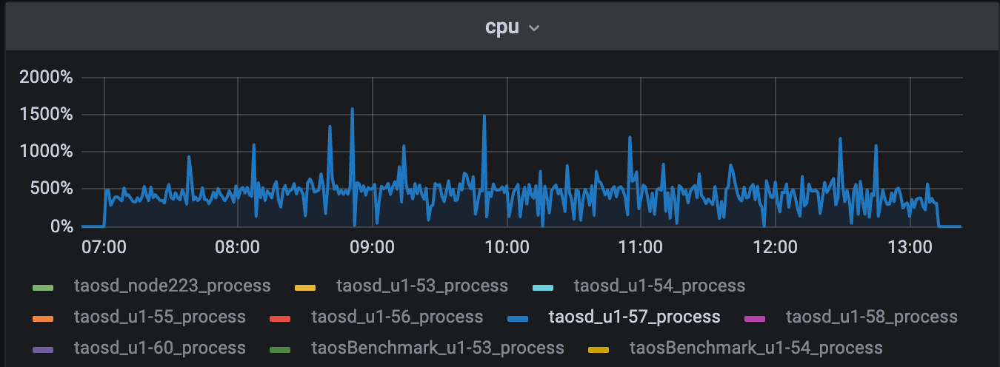

Mem:
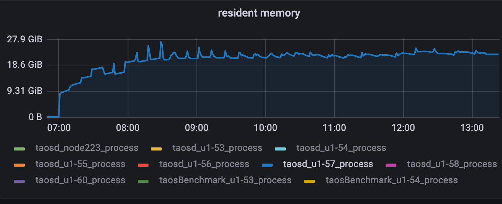

Disk:
```sql
root@u1-57 /var/lib/taos $ du -sh *
8.0K        dnode
9.4M        mnode
781G        vnode
root@u1-57 /var/lib/taos $ du -sh vnode/vnode22/*
1.4M        vnode/vnode22/meta
12K        vnode/vnode22/sync
587M        vnode/vnode22/tq
19G        vnode/vnode22/tsdb
4.0K        vnode/vnode22/vnode.json
35M        vnode/vnode22/wal
```

DiskIO(不低):
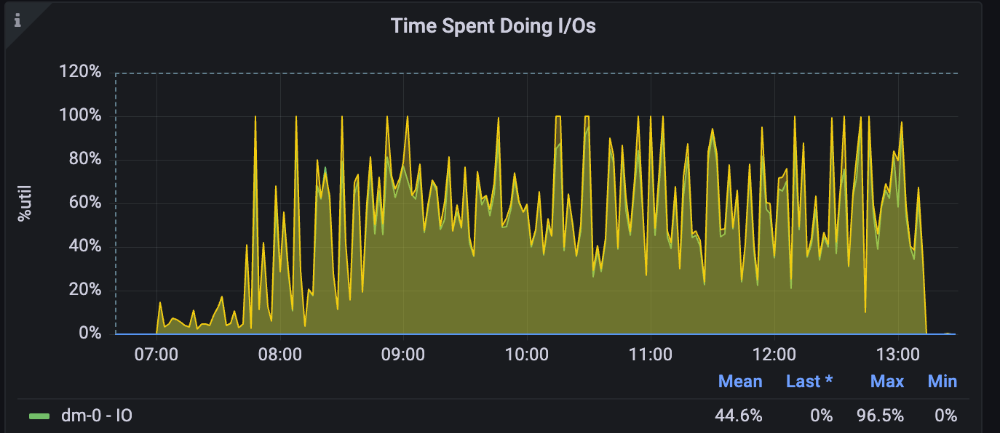

Json:
<view type="1">

  > ⚠ 嵌入文件，需在飞书中查看 (token: QWvMboKFHomxouxx7ftcCojpncg)

</view>

<view type="1">

  > ⚠ 嵌入文件，需在飞书中查看 (token: HvsvbZWd2ooMA4xCcnucwQ02nze)

</view>

场景二：(无partition)(今日结果有问题，需进一步排查)
建流语句：
create stream if not exists stream_stability trigger at_once watermark 30s ignore update 0 ignore expired 0 fill_history 0 into stream_test.output_streamtb (ts,c1,c2,c3) tags(t1) subtable(concat("sub_tb1_", "suffix")) as select _wstart as wstart, min(c1),max(c2), count(c3)  from stream_test.stb interval(10s)
覆盖功能：

|  | custom_tag | existed_stable |
| --- | --- | --- |
| interval | watermark | at_once |
| ignore_expired | ignore_update | subtable |


| schema |
| --- |
| type | int | float | timestamp | tinyint | varchar(16) |
| count | 1 | 2 | 2 | 1 | 1 |

结果数据：

| table_count | rows_count | stream_rows | QPS（rows/s） | latency(ms) | 磁盘占用 |
| --- | --- | --- | --- | --- | --- |
| 100000 | 1762135590？ | 2？ | 2623212.98 | 375 |  |

场景三：进行用户场景 （nevados） 的长稳测试；
建流语句：
CREATE STREAM IF NOT EXISTS trackers_hourly_stream IGNORE UPDATE 0 IGNORE EXPIRED 0 FILL_HISTORY 1 INTO dev.trackers_hourly as select _wstart as window_start, site, zone, tracker, max( case when abs(reg_pitch - reg_move_pitch) <= 2 then 1 when reg_temp_therm2 < -20 then 1 else 0 end ) as on_target, case when max(abs(reg_pitch - reg_move_pitch)) <= 2 then "on_target" when min(reg_temp_therm2) < -20 then "cold_limit" else "off_target" end as on_target_status, avg(reg_pitch) as avg_pitch, last(reg_pitch) as last_pitch, avg(reg_move_pitch) as avg_move_pitch, last(reg_move_pitch) as last_move_pitch from prod.trackers where _ts >= "2023-01-01" and _ts < now() + 1h partition by site, zone, tracker interval(1h) sliding(1h) fill(null)
覆盖功能：

| window_close | ignore_update | ignore_expired | fill_history |
| --- | --- | --- | --- |
| case_when | partition interval | sliding | fill(null) |

schema较复杂，参考json
结果数据：

| table_count | rows_count | stream_rows | QPS（rows/s） | latency(ms) | 磁盘占用 |
| --- | --- | --- | --- | --- | --- |
| 1000 | 2081350000 | 3159048 |  |  |  |

cpu:   
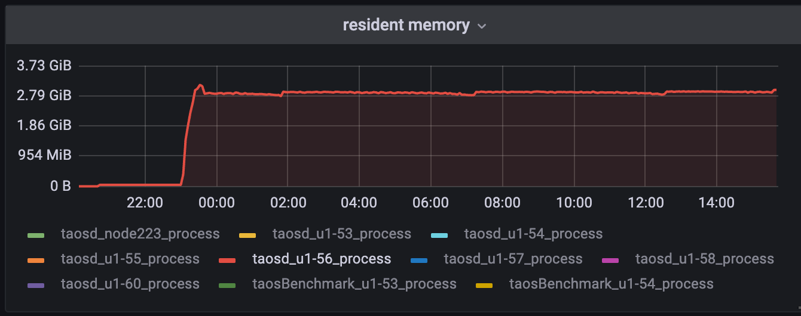

Mem:
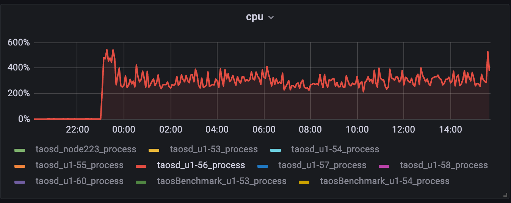

Disk（需要看一下vnode2分布及state为什么没compaction）:
```sql
root@u1-56 /var/lib/taos $ du -sh *
8.0K        dnode
1.3M        mnode
12G        vnode
root@u1-56 /var/lib/taos/vnode/vnode2 $ du -sh *
488K        meta
12K        sync
3.4G        tq
4.1G        tsdb
4.0K        vnode.json
15M        wal
root@u1-56 /var/lib/taos/vnode/vnode2/tq/stream $ du -sh *
4.0K        checkpoints
144K        main.tdb
20K        main.tdb-journal.6
3.4G        state
root@u1-56 /var/lib/taos/vnode/vnode5 $ du -sh *
364K        meta
12K        sync
448K        tq
24M        tsdb
4.0K        vnode.json
19M        wal
```


2023.5.22测试结果：
场景一：无partition by tbname
乱序20%，interval 从1s改为10s，child_table 10W，CPU打满，内存缓慢上涨
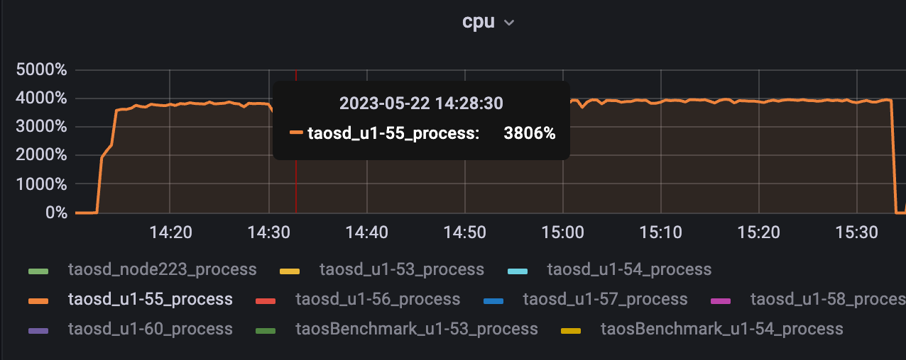


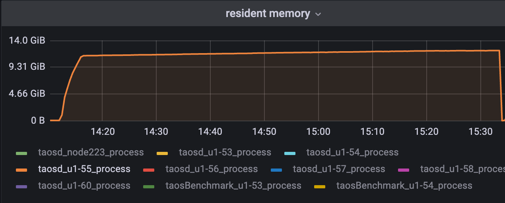


删掉20%乱序场景尝试
持续运行一小时，基本稳定
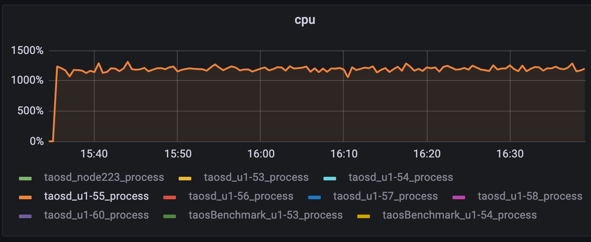


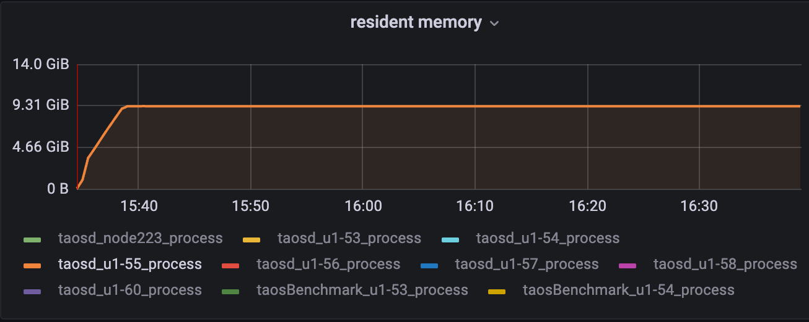

小结：增加20%乱序，taosd所在服务器cpu基本打满，会影响计算速度（agg），agg的反压还没做，故引起内存上涨

场景二：partition by tbname
乱序20%，interval 从1s改为10s，child_table 10W
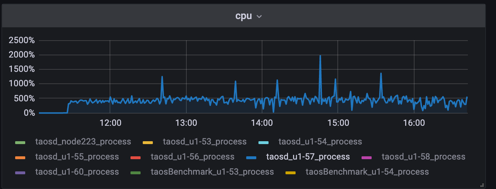

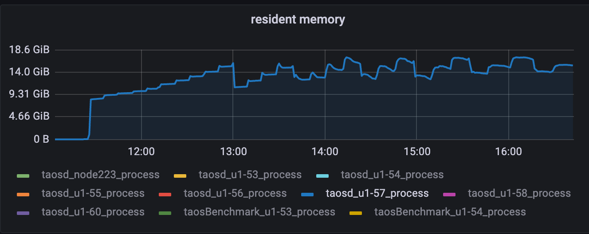

小结：cpu基本稳定，内存上限控制住了，但仍在一定区间内波动，需优化
删除乱序尝试：
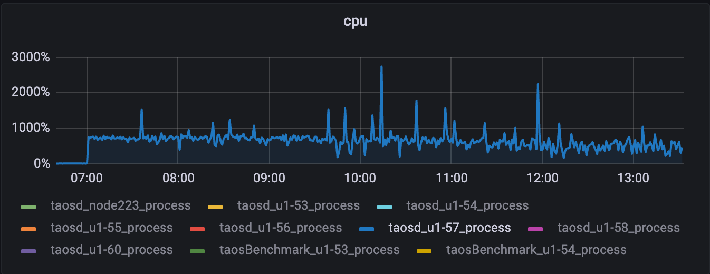

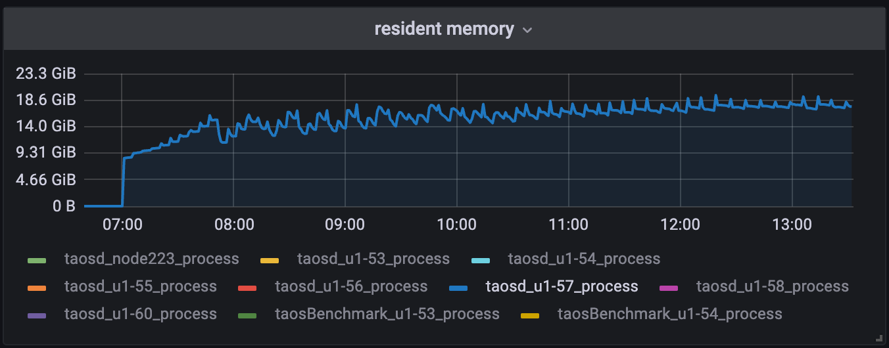

小结：和乱序无关，需优化

场景三：nevados
有fill_history
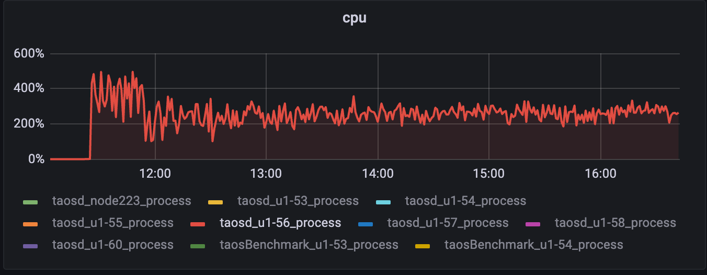

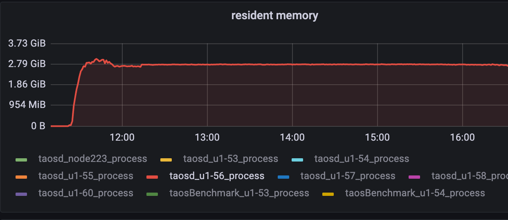

小结：基本符合预期，开始阶段fill_history占用资源稍高，后恢复正常
