# 流计算重构版本测试报告

[流计算优化](https://taosdata.feishu.cn/wiki/wikcnS6me1Vb3B98ByJF3HWztZb) 

## 一.测试背景

为了解决内存及 IO 引起的一系列流计算问题，开发基于外存和 rocksdb 进行了一系列优化或替换，需基于功能/性能/稳定性等对流计算进行新一轮的测试，一方面保证功能的兼容性，一方面确认新版本的流计算是否修复了历史问题；

## 二、测试环境

### **2.1 硬件环境**

| **硬件环境** | **IP** | 用途 | **CPU** | **内存** | **硬盘** |
| --- | --- | --- | --- | --- | --- |
| **测试服务器** | 192.168.1.53 | taostest、taosBenchmark | PERC H730 Mini 446G*2 |
|  | 192.168.1.55 | taosd |
|  | 192.168.1.56 | taosd |
|  | 192.168.1.57 | taosd |
|  | 192.168.1.54 | taosBenchmark |
|  | 192.168.1.58 | taosBenchmark |
|  | 192.168.1.60 | taosBenchmark |

### **2.2 软件环境**

| **软件环境(3.0分支)** | **IP** | **运行目录** | **脚本及配置** | **commitID** |
| --- | --- | --- | --- | --- |
| **TDengine** | 192.168.1.53-60 | /root/TDengine | 默认 | 003e8d3fa7ed6e5c3c1dea4e998eb1597ee233c2 |

## 三.功能测试 

覆盖下表中的所有功能，测试方法是跑历史用例，历史用例兼容了各种场景的交叉组合，同时对过程及最终结果进行校验，功能测试通过后，可初步认为兼容性是没问题的；

| trigger_mode | at_once | pass |
| --- | --- | --- |
|  | window_close | pass |
|  | max_delay | pass |
| Watermark | 搭配 trigger_mode 测试 | pass |
| window | interval | pass |
|  | session_window | pass |
|  | state_window | pass |
| udf | 标量 | pass |
|  | 聚合 | pass |
| 标量函数 | abs, acos, asin, atan, ceil等 | pass |
| partition by | tbname，column，tag，expression，constant | pass |
| fill_history | 0/1 | pass |
| ignore_expired | 0/1 | pass |
| ignore_update | 0/1 | pass |
| 已存在超级表 | 组合 | pass |
| 自定义子表 | 组合 | pass |
| 自定义tag | 组合 | pass |
| Fill | NULL，PREV，NEXT，LINEAR、VALUE | pass |
| case_when | 组合 | pass |

## 四.性能测试

基于历史场景测试并对比结果，看本次优化的效果

### **无跨时间线窗口聚合**

建流语句的子查询使用 partition by tbname，每个子表会在各自的时间线分别做聚合，以不同的 vgroups 和 trigger_mode 测试性能；
暂不测试，受[TD-24008流计算优化性能测试，partition by tbname场景，cpu资源占用和QPS需优化](https://jira.taosdata.com:18080/browse/TD-24008)影响

### **跨时间线窗口聚合**

建流语句的子查询不带 partition，则所有子表的数据会聚合到一条时间线，以不同的 vgroups  和 trigger_mode 测试性能；
建流语句：create stream if not exists perf_stream trigger at_once/window_close ignore expired 0  into perf_db1.output_streamtb   as select _wstart as wstart, min(c1),max(c2), sum(c3), avg(c0), count(c3), first(c0), last(c1), now  from perf_db1.stb interval($interval) ;


**尝试调整参数，将网卡打满成为瓶颈，但流的延迟也随写入延迟升高，故负载不打太高，以下为一组网卡瓶颈时的结果：**

| Trigger_mode | Interval(s) | QPS(rows/s) | Insert_Latency(ms) | Stream_latency(ms) | CPU(%) | MEM(M) | Net(Kb/s) |
| --- | --- | --- | --- | --- | --- | --- | --- |
| at_once | 10 | 2262847 | 338 | 323 | 1060 | 559 | 924662 |


**固定参数（该组参数在无流时网卡70%左右）：**

| threads | batch | interlace | table_count | rows/table | timestamp_step |  |
| --- | --- | --- | --- | --- | --- | --- |
| 40 | 1000 | 4 | 10000 | 10000 | 1.1s |  |

测试结果(enh/rocksdbSstate)(aca5760ceb65e11f691ab686f8b644cdfd67718e)（CPU/MEM/NET资源消耗选用P90）：

| Vgroups | Trigger_mode | Interval(s) | window_count | QPS(rows/s) | Insert_Latency(ms) | Stream_latency(ms) | CPU(avg)(%) | MEM(M) | Net(Kb/s) |
| --- | --- | --- | --- | --- | --- | --- | --- | --- | --- |
| no_stream | - | - | 1391096 | 27 | - | 471 | 1800 | 637766 |
| 10 | 1100 | 1399578 | 27 | 21 | 1014 | 1834 | 642135 |
| 60 | 184 | 1428840 | 26 | 21 | 1033 | 1834 | 655627 |
| 10 | 1099 | 1440468 | 26 | 20 | 1056 | 1836 | 659673 |
| 60 | 183 | 1422255 | 26 | 20 | 1011 | 1837 | 648880 |
| no_stream | - | - | 1388418 | 27 | - | 860 | 4439 | 703191 |
| 10 | 1100 | 1379652 | 27 | 16 | 1758 | 4379 | 694571 |
| 60 | 184 | 1371383 | 27 | 15 | 1746 | 4524 | 688488 |
| 10 | 1099 | 1381884 | 27 | 16 | 1769 | 4626 | 692894 |
| 60 | 183 | 1422762 | 26 | 15 | 1765 | 4584 | 713436 |

**小结：上表的场景中有流和无流的写入 QPS 是相近的，at_once/window_close消耗的内存interval 在计算速度跟得上写入速度的情况下，仅影响窗口数量，不影响 QPS、CPU、MEM 等结果****，**

### 建流/删流性能测试

[TD-23672](https://jira.taosdata.com:18080/browse/TD-23672) [测试创建删除流的性能](https://jira.taosdata.com:18080/browse/TD-23672)
[流计算建流/删流性能测试](https://taosdata.feishu.cn/wiki/PKCUwpChCiiQYOk5yXUcqGwknje) 

### 最大流数量测试

最大支持 60 个，不可配置，参考[流计算建流/删流性能测试报告](https://taosdata.feishu.cn/wiki/PKCUwpChCiiQYOk5yXUcqGwknje) 

### 历史 jira 专项测试

回归历史 jira，确认相关问题是否已优化；

| **Jira** | **修复状态** |
| --- | --- |
| [stream 磁盘占用过高](https://jira.taosdata.com:18080/browse/TD-22834?src=confmacro) | 已修复 |
| [流计算多副本跨时间线窗口聚合推送结果较慢](https://jira.taosdata.com:18080/browse/TD-21133?src=confmacro) | 单副本已测试通过，多副本暂不支持 |
| [fill_history 加入重启taosd操作后，流结果丢失](https://jira.taosdata.com:18080/browse/TD-21908?src=confmacro) | 已修复 |
|  |  |

## 五.稳定性测试

### 5.1 **场景一：(无partition)**

Json:

> ⚠ 嵌入文件，需在飞书中查看 (token: L9xmb32fxoT0EAxBx94cESzfnWd)


> ⚠ 嵌入文件，需在飞书中查看 (token: EQ9CbfWxCoHXOaxL99UcTLInnve)


建流语句：
CREATE STREAM IF NOT EXISTS stream_stability TRIGGER at_once WATERMARK 30s IGNORE UPDATE 0 IGNORE EXPIRED 0 FILL_HISTORY 1 INTO stream_test.output_streamtb (ts,c1,c2,c3) TAGS(t1) SUBTABLE(concat("sub_tb1_", "suffix")) as select _wstart as wstart, min(c1),max(c2), count(c3)  from stream_test.stb interval(10s)；
覆盖功能：

|  | custom_tag | existed_stable |
| --- | --- | --- |
| interval | watermark | at_once |
| ignore_expired | ignore_update | subtable |


| schema |
| --- |
| type | int | float | timestamp | tinyint | varchar(16) |
| count | 1 | 2 | 2 | 1 | 1 |

结果数据：

| table_count | rows_count | stream_rows | 磁盘占用 |
| --- | --- | --- | --- |
| 100000 | 50000000000 | 55000 | 117G |

CPU:
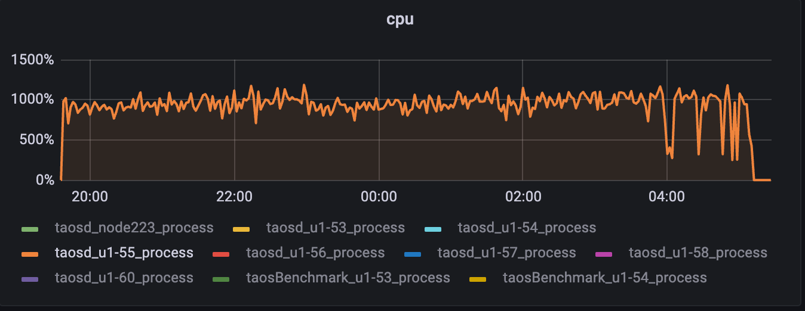

内存：
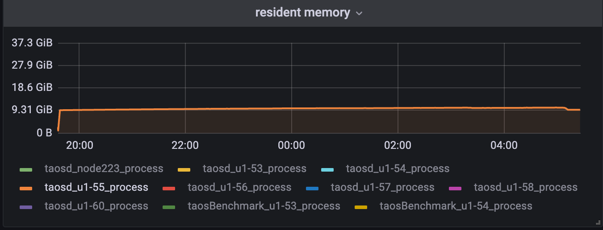

磁盘IO:
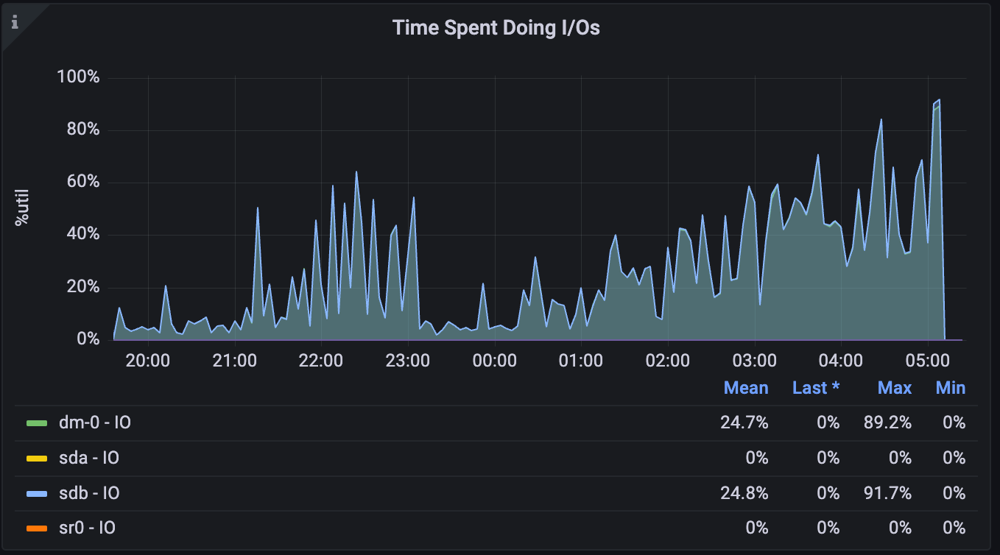

磁盘占用：
```sql
root@u1-55 ~ $ du -sh /var/lib/taos
117G        /var/lib/taos

root@u1-55 ~ $ du -sh /var/lib/taos/vnode/vnode10/*
768K        /var/lib/taos/vnode/vnode10/meta
12K        /var/lib/taos/vnode/vnode10/sync
676K        /var/lib/taos/vnode/vnode10/tq
2.8G        /var/lib/taos/vnode/vnode10/tsdb
4.0K        /var/lib/taos/vnode/vnode10/vnode.json
25M        /var/lib/taos/vnode/vnode10/wal
```

**小结：cpu、内存、磁盘占用、磁盘****IO****基本符合预期**

### 5.2 场景二：(partition by tbname 10W子表)

Json:

> ⚠ 嵌入文件，需在飞书中查看 (token: R1qkbWjWXobZT4xTwvncr06YnOq)


> ⚠ 嵌入文件，需在飞书中查看 (token: YBIZbqjGeoqyjpxxRFYcIYzQnNp)

建流语句：
create stream if not exists stream_stability trigger at_once watermark 30s into stream_test.output_streamtb (ts,c1,c2,c3) tags(t1) subtable(concat(tbname, "suffix")) as select _wstart as wstart, min(c1),max(c2), count(c3)  from stream_test.stb partition by cast(t1 as int) t1,tbname interval(10s);
覆盖功能：

|  | custom_tag | existed_stable |
| --- | --- | --- |
| interval | watermark | at_once |
| ignore_expired | ignore_update | subtable |


| schema |
| --- |
| type | int | float | timestamp | tinyint | varchar(16) |
| count | 1 | 2 | 2 | 1 | 1 |

结果数据：

| table_count | rows_count | stream_rows | QPS（rows/s） | latency(ms) | 磁盘占用 |
| --- | --- | --- | --- | --- | --- |
| 100000 | 50010000000 | 12401204 | - | - | 574G |

CPU:
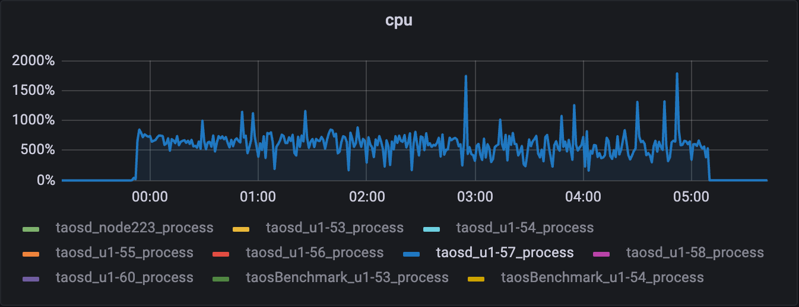

MEM：
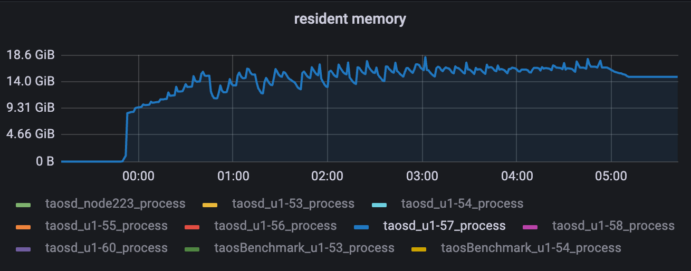

磁盘IO：(有些高)
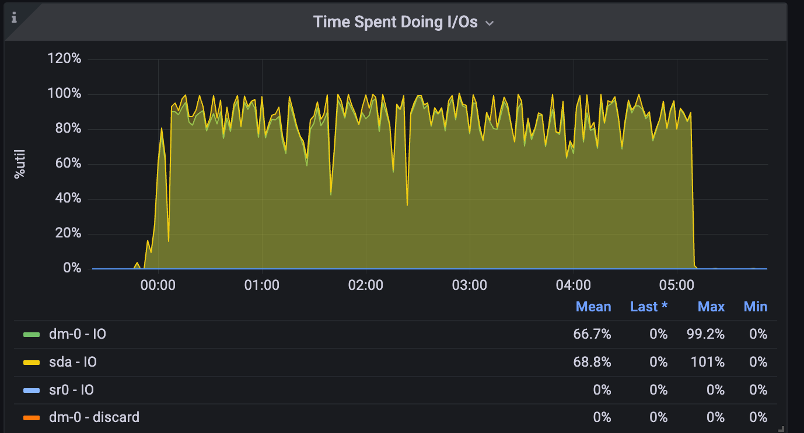

磁盘占用：
```sql
root@u1-57 ~ $ du -sh /var/lib/taos/*
8.0K        /var/lib/taos/dnode
9.3M        /var/lib/taos/mnode
574G        /var/lib/taos/vnode
root@u1-57 ~ $ du -sh /var/lib/taos/vnode/vnode10/*
1.4M        /var/lib/taos/vnode/vnode10/meta
12K        /var/lib/taos/vnode/vnode10/sync
212M        /var/lib/taos/vnode/vnode10/tq
15G        /var/lib/taos/vnode/vnode10/tsdb
4.0K        /var/lib/taos/vnode/vnode10/vnode.json
44M        /var/lib/taos/vnode/vnode10/wal
```

**小结：内存震荡上涨，但增幅不高，磁盘****IO****不算低，其它正常；**

### 5.3 场景三：进行用户场景 （nevados） 的长稳测试；

Json:

> ⚠ 嵌入文件，需在飞书中查看 (token: TJo7bPIdwojanBxtgcLciSwDnof)


> ⚠ 嵌入文件，需在飞书中查看 (token: AhMTbx5kRoEIWzxdQ2lch6URnCc)

建流语句：
CREATE STREAM IF NOT EXISTS trackers_hourly_stream IGNORE UPDATE 0 IGNORE EXPIRED 0 FILL_HISTORY 1 INTO dev.trackers_hourly as select _wstart as window_start, site, zone, tracker, max( case when abs(reg_pitch - reg_move_pitch) <= 2 then 1 when reg_temp_therm2 < -20 then 1 else 0 end ) as on_target, case when max(abs(reg_pitch - reg_move_pitch)) <= 2 then "on_target" when min(reg_temp_therm2) < -20 then "cold_limit" else "off_target" end as on_target_status, avg(reg_pitch) as avg_pitch, last(reg_pitch) as last_pitch, avg(reg_move_pitch) as avg_move_pitch, last(reg_move_pitch) as last_move_pitch from prod.trackers where _ts >= "2023-01-01" and _ts < now() + 1h partition by site, zone, tracker interval(1h) sliding(1h) fill(null)
覆盖功能：

| window_close | ignore_update | ignore_expired | fill_history |
| --- | --- | --- | --- |
| case_when | partition interval | sliding | fill(null) |

schema较复杂，参考json
结果数据：

| table_count | rows_count | stream_rows | 磁盘占用 |
| --- | --- | --- | --- |
| 1000G | 9660973000 | 3245760 | 32G |

CPU:   
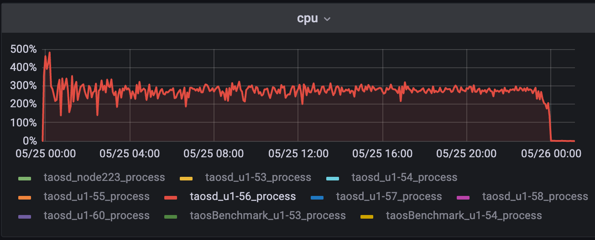

MEM：
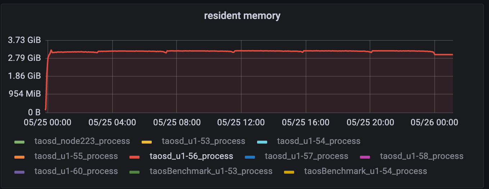

磁盘IO：
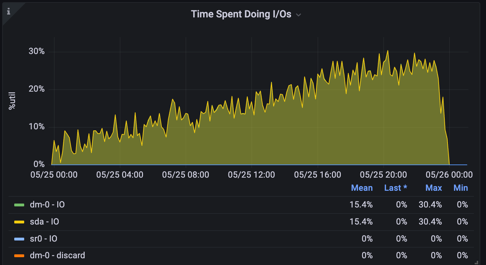

磁盘占用：
```sql
root@u1-56 / $ du -sh /var/lib/taos/
37G        /var/lib/taos/
root@u1-56 / $ du -sh /var/lib/taos/vnode/vnode2/*
516K        /var/lib/taos/vnode/vnode2/meta
12K        /var/lib/taos/vnode/vnode2/sync
2.4G        /var/lib/taos/vnode/vnode2/tq
18G        /var/lib/taos/vnode/vnode2/tsdb
4.0K        /var/lib/taos/vnode/vnode2/vnode.json
20M        /var/lib/taos/vnode/vnode2/wal
```

**小结：磁盘****IO****不算高，但整体是一个上涨趋势，需要进一步排查下原因，其它指标正常****；**

### 5.4 场景四：组合部分场景写入大量数据后进行compact测试（"disorder_ratio": 20, "disorder_range": 1000）；

#### 5.4.1 compact时写入停止：

建流语句：
create stream if not exists stream_stability trigger at_once watermark 30s into stream_test.output_streamtb (ts,c1,c2,c3) tags(t1) as select _wstart as wstart, min(c1),max(c2), count(c3)  from stream_test.stb interval(1s)
覆盖功能：

| subtable | custom_tag | existed_stable |
| --- | --- | --- |
| interval | watermark | at_once |


| schema |
| --- |
| type | int | float | timestamp | tinyint | varchar(16) |
| count | 1 | 2 | 2 | 1 | 1 |

结果数据：

| table_count | rows_count | stream_rows |
| --- | --- | --- |
| 10000 | 8004461709 | 802370 |

**compact前：**
```sql
root@u1-56 ~/TDengine (enh/rocksdbSstate)$ du -sh /var/lib/taos/vnode
153G        /var/lib/taos/vnode
root@u1-56 ~/TDengine (enh/rocksdbSstate)$ du -sh /var/lib/taos/vnode/vnode13/*
144K        /var/lib/taos/vnode/vnode13/meta
12K        /var/lib/taos/vnode/vnode13/sync
1.4M        /var/lib/taos/vnode/vnode13/tq
3.8G        /var/lib/taos/vnode/vnode13/tsdb
4.0K        /var/lib/taos/vnode/vnode13/vnode.json
57M        /var/lib/taos/vnode/vnode13/wal
taos> select count(*) from stb;
       count(*)        |
========================
            8004461709 |
Query OK, 1 row(s) in set (11.843977s)

taos> select count(*) from output_streamtb;
       count(*)        |
========================
                802370 |
Query OK, 1 row(s) in set (0.074052s)
```

compact后：
```sql
root@u1-56 ~/TDengine (enh/rocksdbSstate)$ du -sh /var/lib/taos
96G        /var/lib/taos
root@u1-56 ~/TDengine (enh/rocksdbSstate)$ du -sh /var/lib/taos/vnode/vnode13/*
144K        /var/lib/taos/vnode/vnode13/meta
12K        /var/lib/taos/vnode/vnode13/sync
1.7M        /var/lib/taos/vnode/vnode13/tq
2.4G        /var/lib/taos/vnode/vnode13/tsdb
4.0K        /var/lib/taos/vnode/vnode13/vnode.json
16K        /var/lib/taos/vnode/vnode13/wal
taos> select count(*) from stream_test.stb;
       count(*)        |
========================
            8004461709 |
Query OK, 1 row(s) in set (0.172405s)
taos> select count(*) from output_streamtb;
       count(*)        |
========================
                802370 |
Query OK, 1 row(s) in set (0.007434s)
```

#### 5.4.2 compact时持续写入：

建流语句：
create stream if not exists stream_stability trigger at_once watermark 30s into stream_test.output_streamtb (ts,c1,c2,c3) tags(t1) as select _wstart as wstart, min(c1),max(c2), count(c3)  from stream_test.stb interval(1s)
覆盖功能：

| subtable | custom_tag | existed_stable |
| --- | --- | --- |
| interval | watermark | at_once |


| schema |
| --- |
| type | int | float | timestamp | tinyint | varchar(16) |
| count | 1 | 2 | 2 | 1 | 1 |

结果数据：

| table_count | rows_count | stream_rows |
| --- | --- | --- |
| 500000 | 11740033930 | 24127 |

**compact前：**
```sql
root@u1-56 ~ $ du -sh /var/lib/taos/
190G        /var/lib/taos/
root@u1-56 ~ $ du -sh /var/lib/taos/vnode/vnode10/*
3.6M        /var/lib/taos/vnode/vnode10/meta
12K        /var/lib/taos/vnode/vnode10/sync
512K        /var/lib/taos/vnode/vnode10/tq
4.7G        /var/lib/taos/vnode/vnode10/tsdb
4.0K        /var/lib/taos/vnode/vnode10/vnode.json
38M        /var/lib/taos/vnode/vnode10/wal
taos> select count(*) from stb;
       count(*)        |
========================
           11740033930 |
Query OK, 1 row(s) in set (21.496973s)

taos> select count(*) from output_streamtb;
       count(*)        |
========================
                 24127 |
Query OK, 1 row(s) in set (1.973283s)
```

compact后：
```sql
taos> compact database stream_test;
Query OK, 0 row(s) affected (1243.173217s)

root@u1-56 ~ $ du -sh /var/lib/taos/
153G        /var/lib/taos/
root@u1-56 ~ $ du -sh /var/lib/taos/vnode/vnode10/*
3.6M        /var/lib/taos/vnode/vnode10/meta
12K        /var/lib/taos/vnode/vnode10/sync
588K        /var/lib/taos/vnode/vnode10/tq
4.0G        /var/lib/taos/vnode/vnode10/tsdb
4.0K        /var/lib/taos/vnode/vnode10/vnode.json
27M        /var/lib/taos/vnode/vnode10/wal

compact过程中有一定程度阻塞，写入变慢
taos> select count(*) from stb;
       count(*)        |
========================
           12238508696 |
Query OK, 1 row(s) in set (4.829839s)

taos> select count(*) from output_streamtb;
       count(*)        |
========================
                 28132 |
Query OK, 1 row(s) in set (0.395737s)
```


**测试小结：**
**原则上来说，测试 compact 时是要删掉流再进行 compact，否则可能会影响流的部分算子状态，导致结果不正确，但那样测试 compact 对流的影响是没什么实质意义的，故以上的测试，仅是为了验证 compact 的效果并不会像以前一样引起 crash，****可以得到结论：无论写入过程中还是停止后 compact，磁盘空间大幅压缩，查询性能提升明显，compact会有一定程度的阻塞写入，但无论写入还是流计算，都会在compact结束后恢复；**

## 六. 异常场景测试（基于无FILL_HISTORY测试[TD-24155](https://jira.taosdata.com:18080/browse/TD-24155)）

| 场景 | 场景描述 | 测试结果 |
| --- | --- | --- |
| 写入过程中kill taosd | 写入过程中kill taosd，重启taosd后持续写入，流可以恢复计算，不应有丢数据情况 | 完成 |
| 写入过程中断电 | 写入过程中服务器断电，重启taosd后持续写入，流可以恢复计算，不应有丢数据情况 | 完成 |
| 写入过程中reboot | 写入过程中服务器reboot，重启taosd后持续写入，流可以恢复计算，不应有丢数据情况 | 完成 |
| 重启测试 | 写入过程中重启流计算，重启后持续写入，看流计算是否能恢复，并校验数据完整性 | 完成 |
| 计算任务很多的情况下删流 | 调整trigger_mode等参数，使写入时产生大量流计算窗口，看流是否能正常删除 | 完成 |
| 大量历史数据含fill_history建流，在fill过程中删流 | 写入大量历史数据，然后含fill_history建流，并触发大量计算，fill_histrory过程中删流，看能否正常删除 | 暂不测试fill_history |
| 不断建流、写入、删流 | 不断重复建库建表建流写入删流的步骤，看系统是否会出问题 | 完成 |

## 六.升级测试

测试版本兼容性，基于官网最新版本（如3.0.4.0）建库建表建流并写入一定量数据后升级到该优化版本，重启 taosd 后看流计算是否能继续工作，然后继续进行写入、删流、重建流等操作，看是否会有问题。
**步骤1（3.0.4.0版本）:**
**ignore_update和ignore_expired设置为0，使用stream_exist_stb_tag_prepare.json和stream_exist_stb_tag_insert.json，数据量1000W**
create stream if not exists stream_stability trigger at_once watermark 30s ignore update 0 ignore expired 0 fill_history 1 into stream_test.output_streamtb (ts,c1,c2,c3) tags(t1) subtable(concat("sub_tb1_", "suffix")) as select _wstart as wstart, min(c1),max(c2), count(c3)  from stream_test.stb interval(1s)
```sql
taos> select count(*) from stb;
       count(*)        |
========================
              10000000 |
Query OK, 1 row(s) in set (0.104557s)

taos> select count(*) from output_streamtb;
       count(*)        |
========================
                  1000 |
Query OK, 1 row(s) in set (0.006817s)
```

**步骤2（优化版本）:**
升级到优化版本，分两步测试：
A.删掉旧的流，其它不变，该场景下最终结果应不变；
```sql
drop stream stream_stability;
create stream if not exists stream_stability trigger at_once watermark 30s ignore update 0 ignore expired 0 fill_history 1 into stream_test.output_streamtb (ts,c1,c2,c3) tags(t1) subtable(concat("sub_tb1_", "suffix")) as select _wstart as wstart, min(c1),max(c2), count(c3)  from stream_test.stb interval(1s)；
taos> select count(*) from stream_test.output_streamtb;
       count(*)        |
========================
                  1000 |
Query OK, 1 row(s) in set (0.010215s)
```

B. 旧的流不删，新建一个流，新建一个target超级表，subtable需要改个名字，否则报错;
```sql
create table stream_test.output_streamtb1 (ts timestamp, c0 int, c1 float, c2 float, c3 timestamp) tags (t0 tinyint, t1 varchar(16));
create stream if not exists stream_stability1 trigger at_once watermark 30s ignore update 0 ignore expired 0 fill_history 1 into stream_test.output_streamtb1 (ts,c1,c2,c3) tags(t1) subtable(concat("sub_tb2_", "suffix")) as select _wstart as wstart, min(c1),max(c2), count(c3)  from stream_test.stb interval(1s);

taos> select count(*) from stream_test.output_streamtb1;
       count(*)        |
========================
                  1000 |
Query OK, 1 row(s) in set (0.007484s)
```

小结：
1. 针对不同的建流语句，升级后删流，想要1:1重建需要对流计算语法较为熟悉，否则可能会达不到预期的恢复；
2. 如数据量较大，还想保留历史结果，删流后建流就要增加"fill_history 1"选项，那么就面临较长的耗时和较大的资源消耗，且目前 fill_history 正在重构，重构完成前可能会有问题；
3. 如历史数据设置了忽略过期数据（ignore expired 0），那么删流再重建时如指定"fill_history 1"，那么结果会比历史多，无法确认流数据一致性；

## 七.遗留问题和待优化项

| Jira | 描述 |
| --- | --- |
| [TD-24162](https://jira.taosdata.com:18080/browse/TD-24162) | （无partition场景）目前反压仅做了 source 的反压，对于流计算速度跟不上写入速度的场景或者cpu/磁盘IO等负载过高影响计算速度的场景，agg/sink 未做反压，依然会有内存上涨的情况 |
| [TD-23922](https://jira.taosdata.com:18080/browse/TD-23922) | (partition by tbname场景) 内存一定范围内波动，不稳定 |
| [TD-24008](https://jira.taosdata.com:18080/browse/TD-24008) | (partition by tbname场景) cpu占用过高 |
| [TD-24396](https://jira.taosdata.com:18080/browse/TD-24396) | 单线程串行建流 1-60 个，耗时越来越长 |
| [TD-24155](https://jira.taosdata.com:18080/browse/TD-24155) | fill_history 重构后再继续测试 |

## 八.测试结论

1. 功能测试全部通过；
2. 性能测试 partition by tbname 场景正在优化中，建流性能也需优化；
3. 删流后可以快速停机，不会出现 stream 线程长时间占用资源情况；
4. 稳定性场景在一些极端测试场景中（如 1s 一个窗口、cpu/磁盘io打很高导致流计算速度跟不上写入速度）有内存控制不住的情况；
5. fill_history 测试较少，重构后继续测试；
6. 选择部分场景对比内存和磁盘占用优化效果，优化还是很大的：

|  | 版本 | 测试结果 |
| --- | --- | --- |
| 3.0.4.0 | ```sql root@u1-57 /var/lib/taos/vnode $ du -sh . 813G . ``` |
| 优化版本 | ```sql root@u1-55 /var/lib/taos/vnode $ du -sh . 126G . ``` |
| 3.0.4.0 | 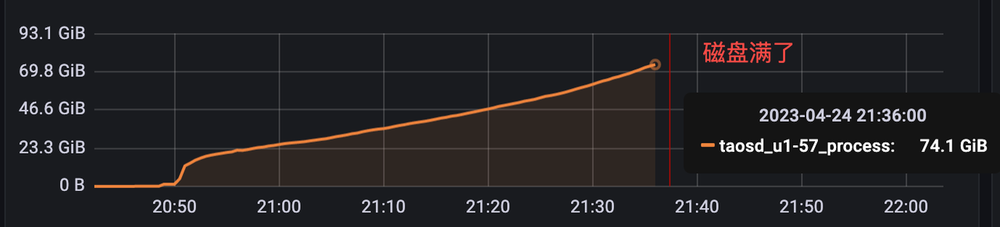 |
| 优化版本 | 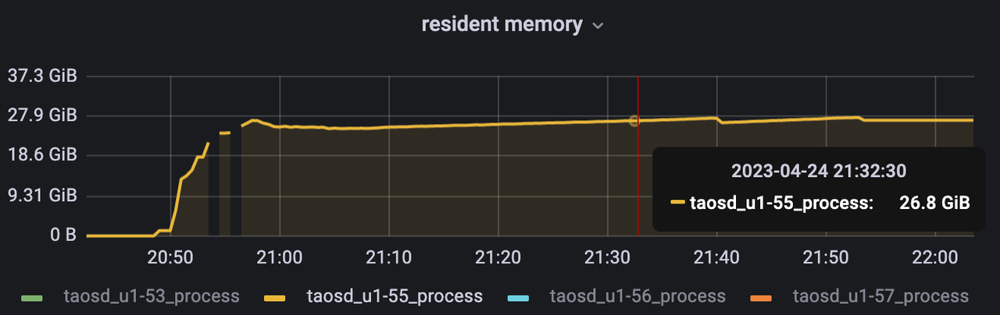 |

1. 

##
