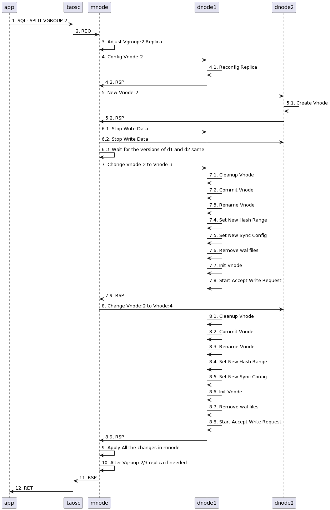

# SPLIT VGROUP （企业版功能）

## 1. 行为说明

拆分 VGroup （称为 2）时，TDengine 会创建两个新的 VGroup（称为 3 和 4），随后 VGroup 2 中的数据，一部分迁移到新的 VGroup 3 中，一部分迁移到 VGroup 4 中。在 TD 中，数据表是按照一致性哈希算法分配的，如果拆分前 VGroup 2 负责的哈希范围为 [a, b]，那么拆分后，VGroup 3 负责的哈希范围为 [a, (a+b)/2)，VGroup 4 负责的哈希范围为 [(a+b)/2, b]。
```sql
SPLIT VGroup <Vgroup_No>
```

问题：
1. vgroup 3/4 的 vnode 所在 node 此时是否会考虑在dnode中智能选择负载较低的dnode？还是会保持和 vgroup 2 所在的 dnode 一致？假如是后者，则需要额外的 rebalance 步骤来使集群负载再平衡。
A: vnode3/4, 各自有一个副本与vgroup2所在dnode保持一致; 多副本场景下，vnode 3/4  的另外两个副本会选择相对空闲的dnode，。如果要调整vnode在dnode中，可以通过redistribute vgroup功能实现。
1. split 过程中是否阻塞对 vgroup 2 所涉及的子表的写入？是否会阻塞其它子表的写入？show
A：分裂过程中，会阻塞vgroup2所有涉及的子表写入，而且目前，在副本数1到2副本变更阶段，会长时间阻塞。但不会阻塞仅涉及其它虚拟组的子表写入。
1. split 过程中是否会阻塞查询？如果查询不涉及 vgroup 2 所负责的子表是否会被阻塞？
A：分裂过程，会阻塞vgroup2所涉及的子表查询，而且目前，在副本数1到2副本变更阶段，meta重整过程中，会长时间阻塞。但不会阻塞仅涉及其它虚拟组的子表查询。

@Benguang Please convert the above questions to a part of the user manual. If there is any other impact, please also add them in.

## 2. 具体实现

- 修改 VGroup 2 的副本数目为 2，假设两个副本分布在 dnode 1 和 dnode 2 上
- 调整 dnode 1 上的 Vnode 2
  - 关闭 Vnode 对象
  - 修改 Vnode 2 文件夹，调整为 Vnode 3，
  - 修改其配置文件中的哈希范围为 [a, (a+b)/2)
  - 修改副本数目为 1
  - 清理 wal 文件，因为这些数据已经落盘
  - 重新整理 tsdb 和 tdb 文件，清理不在最新哈希范围的数据
  - 重新载入
- 调整 dnode 2 上的 Vnode 2
  - 关闭 Vnode 对象
  - 修改 Vnode 2 文件夹，调整为 Vnode 4，
  - 修改其配置文件中的哈希范围为  [(a+b)/2, b]
  - 修改副本数目为 1
  - 清理 wal 文件，因为这些数据已经落盘
  - 重新整理 tsdb 和 tdb 文件，清理不在最新哈希范围的数据
  - 重新载入
- 在 Mnode 中删除 VGroup 2，增加 VGroup 3 和 VGroup 4
- 如果 VGroup 2 的副本数目为 3， 还需要调整 VGroup 3 和 4 的副本数目也为 3
流程图如下


按如上描述，其他模块可能的调整
- 客户端访问 VGroup 失败后，会到 Mnode 更新路由信息，需要正确处理返回的错误码
- 流计算的目标 VGroup 发生变化，同样需要在失败后，到 Mnode 更新路由信息，可能涉及到持久化
一些后续工作
- 如果因为清理 wal 导致 split 操作之前的 wal 数据无法订阅，可以开发 wal compact 接口
- 按如上的 split 流程，merge vgroup 的开发也相对容易
阻塞写入的时间
- 修改副本的时间 
  - 在后续多副本优化中想办法调整
- compact 数据的时间 
  - 数据订阅、数据查询、流计算等，在读取存量数据时，如果未进行 Compact，会读到无效的表数据，需要额外处理或者校验
