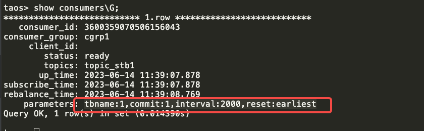
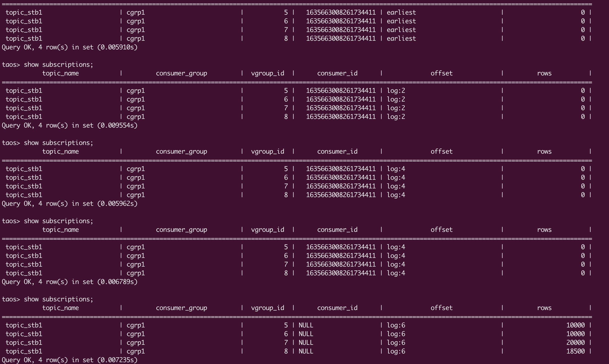

# TMQ 优化

@王明明 请尽早完成本文档，把 TMQ 在 3.0.6.0 中用户可见的功能（包括日志），以及性能优化（目标）， CLI 中的新功能等 描述清楚

TS-3497

show consumers 中增加用户订阅时的参数，包括：是否获取table name，是否自动提交，自动提交的时间间隔，以及初始消费位置。

TS-3495

如上图，show subscriptions 增加显示每个订阅在每个vnode上的消费进度 offset 和 消费数据量rows。
当consumer_id不为NULL时，显示的rows为该consumer消费的数据量。如果切换consumer(group 和 topic没换)，那么当消费者退出时（consumer_id会变为NULL）此时显示的rows为总的消费数据量。

TD-24532

TD-24749

TS-3586

建 topic 和 consumer group加上限限制，防止内存OOM。
topic最多可建立个数通过参数 tmqMaxTopicNum 配置，默认20个，每个topic最多可建立100个consumer group
