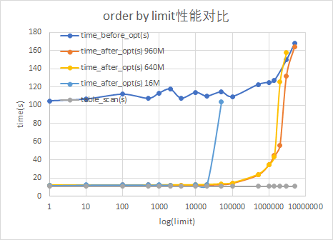
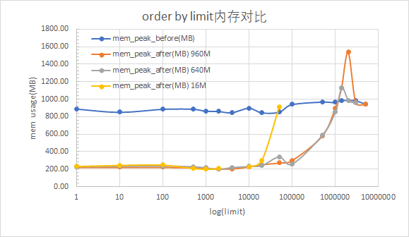
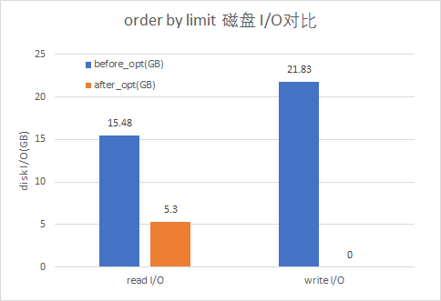

# 查询性能优化

@潘魏 @Shenglian @王加明请尽早完成本文档 请尽早完成本文档
具体的查询场景，优化目标（或优化效果）

### 1. Order by limit 场景的优化 [Order by Limit性能优化.pptx](https://taosdata.feishu.cn/docx/UqRubJK2oo2ZzXxGEFucWp4rnpd) 

#### 1.1 场景说明

表结构
```sql
taos> desc meters;
             field              |         type         |   length    |   note   |
=================================================================================
 ts                             | TIMESTAMP            |           8 |          |
 c0                             | INT                  |           4 |          |
 c1                             | TINYINT              |           1 |          |
 c2                             | DOUBLE               |           8 |          |
 c3                             | VARCHAR              |         100 |          |
 c4                             | NCHAR                |         100 |          |
 cc                             | VARCHAR              |          16 | TAG      |
```

对于SQL查询子表:
```sql
select * from d1 order by c0 desc, c2, c4 limit 200;
```

从超级表或者子表查询, order 列包含除ts列之外的其他列, 并且带limit信息. 
执行计划:
```sql
taos> explain verbose true select * from d1 order by c0 desc, c2, c4 limit 20000\G;
*************************** 1.row ***************************
QUERY_PLAN: -> Projection (columns=6 width=525 input_order=unknown )
*************************** 2.row ***************************
QUERY_PLAN:       Output: columns=6 width=525 limit=20000
*************************** 3.row ***************************
QUERY_PLAN:       Output: Ignore Group Id: true
*************************** 4.row ***************************
QUERY_PLAN:       Merge ResBlocks: True
*************************** 5.row ***************************
QUERY_PLAN:    -> Sort input_order=asc output_order=unknown  (columns=6 width=525)
*************************** 6.row ***************************
QUERY_PLAN:          Output: columns=6 width=525
*************************** 7.row ***************************
QUERY_PLAN:       -> Table Scan on d1 (columns=6 width=525 order=[asc|1 desc|0])
*************************** 8.row ***************************
QUERY_PLAN:             Output: columns=6 width=525
*************************** 9.row ***************************
QUERY_PLAN:             Time Range: [-9223372036854775808, 9223372036854775807]
```

此计划需要将d1表全表扫描, 并且排序之后输出limit行.

#### 1.2 优化前后逻辑

##### 1.2.1 优化前

由于sort列包括非时序列, 此处需要全表扫描, 全量数据排完序之后在ProjectNode进行limit操作.
SortNode每从TableScan中获取Block中数据达到一定阈值(如1024 * 4096字节, pageSize * numOfPages)之后会进行排序操作, 之后添加到DiskBasedBuf中, 此过程直到tableScan结束.
当数据量较多时, 大部分都被写入了磁盘, 数据量较小时, 其实也是在内存中排序完成.
接下来从每个排好序的page中读出数据, 进行多路归并排序.

##### 1.2.2 优化后

在全表扫描基础上, 将limit下推到SortNode, 计算出maxRows存放在Sort Node中. 若limit信息较小时, 可以直接全部在内存中进行排序操作.
通过配置参数pqSortMemThreshold和TableScan返回的block中tuple长度估算当前配置下最多可以在内存中存放多少行数据. 若不满足条件还是使用原来的逻辑使用DiskBasedBuf进行排序.
若满足条件, 则创建优先级队列, 当从TableScan中获取到Block之后, 解析出每行数据, 创建tuple结构, push到优先级队列中.
当优先级队列中tuple多于maxRows时, 将最小值pop. 直到tableScan结束.
最终通过连续pop, 将有序数据输出.

#### 1.3 性能对比

分别进行了`Table Scan`, `优化前`, `优化后`测试, 其中优化后测试中分别设置了参数`pqSortMemThreshold`为`默认值16MB`, `640MB` 以及`960MB`. 环境信息见: [Order by limit 性能测试](https://taosdata.feishu.cn/docx/IQG2d9YW6o9LroxXrdzclZxXnOb) .
Table Scan的用时获取方式是select * from d1; 
**严格意义上说, select全表不是table scan的时间, 其中包括了客户端收包的时间(select全表数据量较大), 只能算是用户使用客户端在执行对应sql时的感知时间.**
**通过explain analyze可以看到table scan的用时.**
table scan用时: 11.017504s

##### 1.3.1 查询用时对比



可以看出优化后在limit值达到一定大小之后性能和优化前一致, 配置参数的增大可以延缓性能回退. 和简单表结构的查询时间对比时, 随着表结构复杂化, 列长度增大, 触发退化的limit行数明显变小, 并且在都没有触发退化的情况下, 后者(行长度大)的排序时间明显多于前者(行长度小).([Order by limit 性能测试](https://taosdata.feishu.cn/docx/IQG2d9YW6o9LroxXrdzclZxXnOb) )

##### 1.3.2 内存使用对比



优化前的内存使用稳定在900MB左右, 与limit值关系不大.
优化后随着limit值增大, 内存占用明显增大. 配置参数过大, 存在并发情况下, 可能会导致OOM, 配置参数较小时, 行长度较长可能触发退化导致性能下降, 使用内存增多.

##### 1.3.3 磁盘I/O对比



磁盘I/O在优化前后与limit信息都无关, 基本保持稳定.
磁盘读在优化后只存在Table Scan时的磁盘读, 并且不再有写磁盘操作.
