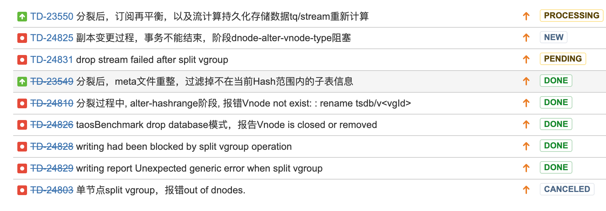

# TD-18702 3.0 支持 split vgroup 测试报告

## 一、测试概述

     split vgroup  功能是对已有的一个VNODE 拆分成两个 VNODE 来减小在一个 VNODE 上子表及数据过多的问题
     功能描述的JIRA 见 : [3.0 支持 split vgroup](https://jira.taosdata.com:18080/browse/TD-18702)
     功能手册：[SPLIT VGROUP （企业版功能）](https://taosdata.feishu.cn/wiki/wikcnepXSiXYDfZoLx2UUMkRurb) 
      实现原理：[管理事务执行机制与分裂](https://taosdata.feishu.cn/docx/Z70udnhmzoiWDoxC4yYcB9jrnif) 
     本测试对以上约定的行为进行验证，符合预期为通过。

## 二、测试环境

### **2.1 硬件环境**

| **IP** | **用途** | **CPU** | **内存** | **硬盘** |
| --- | --- | --- | --- | --- |
| 192.168.1.176 | 集群节点 | 8u | 8G | 200G |
| 192.168.1.53 | 集群主节点 | 40u | 256G | 874G |
| 192.168.0.214 | 集群节点 | 24u | 64G | 383G |

### **2.2 软件环境**

| ** TDengine分支** | **运行目录** | **commitID** |
| --- | --- | --- |
| 3.0 | /root/3.0/ |  |

## 三、测试内容

### 3.1 测试工具

| ** 工具名称** | **来源** | **作用** |
| --- | --- | --- |
| TestNG | 自研 | 全量测试框架 |
| CI 测试框架 | 自研 | 框架类 |

### 3.2  基本信息一致性验证

   基本功能即分裂前和分裂后的信息要保持一致，不能多也不能少。
   验证过程分成以下几步：
       1） 使用各种工具生成数据环境
       2） 程序统计记录数据的各种信息
       3） 开始分裂数据库中的 VNODE
       4)    分裂后再查询以上各信息与记录信息是否一致

####   1、分裂前后子表 schema 信息一致(done)

  验证分裂前后子表的 schema 信息没有发生变化，使用 describe 命令获取 schema 信息

####   2、分裂前后子表 TAG 信息一致(done)

  通过超级表使用 select taglist,tbname from stable group by tbname,taglist 获取每个子表的 tag 信息

####   3、分裂前后子表数量一致(done)

  通过查系统表 ins_tables 与 select tbname from stb group by tbname 来相互验证

####   4、 分裂前后子表数据一致(done)

         使用子表投影查询得到所有数据，与原来保存的进行比较，确认分裂后没有丢失数据及多出数据。

####   5、 分裂前后普通表 schema 及数据一致(done)

   使用投影查询获取所有数据进行前后比较一致性 

####   6、 分裂前后基本聚合查询数据一致(done)

   基本聚合包括 count min max avg first last last_row 

####   7、 单副本分裂后成功验证(done)

VNODE 分裂后，由一个分裂为两个，对VNODE 分裂后数量进行验证
使用 show vgroups 来验证分裂后的 VNODE 数量及名称

####   8、 分裂完成基础上进行副本转化后验证查询结果的一致性(done)

        两个场景验证：
               1）单副本 -> 分裂 -> 转为三副本  -> 验证查询结果正确性
               2）多副本 -> 分裂 -> 转为单副本  -> 验证查询结果正确性

####   9、 分裂后的两节点承载子表数均衡（DONE）

    分裂后的两VNODE中拥有的子表数预期是对半分的，通过查询系统表 ins_tables 统计分裂在两个VNODE 上的表个数大体均衡

### 3.3  分裂后写入验证

####    1、原有子表、普通表可以正确写入（done）

  分裂后在所有子表及普通表中写入数据，验证可正确写入及查询到   

####    2、新建子表、普通表可以正确写入（done）

分裂后的环境中新建子表及普通表也可正确写入数据 

####    3、新建超级表可以正确写入(done)

        新建的超级表，再新建子表可以正确写入

####    4、分裂过程中大部分时间写入可用(done)

        分裂过程中除了进行变更 vgid 等修改 meta 信息的关键操作期间写入不可用外，其它阶段写入是可以正常进行的，验证在此期间可以进入写入操作。

### 3.4  单副本与多副本场景(done)

       单副本上与多副本在分裂的实现流程上差异比较大，所以需要单独分开场景进行测试验证

####      1、单副本

    单副本会先变成两副本，变更成两副本后分别修改vgid 为新的 vgid。在变更期间中有在修改 vgid 时写入查询不可用，其它阶段都能正常写入及查询。副本变更期间禁止所有事务提交。
    需要验证在分裂期间并发进行写入及查询，同时进行事务提交，预期是写入查询大部分时间为可用，事务提交为提交不成功。

####      2、多副本

    多副本会先变更为两副本，然后再修改此两副本的 vgid 为新id, 修改了新的 vgroup 均为单版本，再变更为多副本。
    此过程比单副本要复杂，流程上要多一些，验证在分裂期间并发进行写入及查询，同时进行事务提交，预期是写入查询大部分时间为可用，事务提交为提交不成功。

### 3.5  COMPACT 功能验证

####    1、数据 DOUBLE 膨胀后恢复正常(done)

  在分裂后，数据会 DOUBLE 膨胀，进行 COMPACT 后预期为数据大小应恢复正常

### 3.6  分裂过程中的基本及异常验证 

####    1、分裂在多个数据库中同时进行 (done)

 在多个数据库中同时执行分裂操作、预期是数据库之间的分裂操作相互独立，功能不受任何影响。

####    2、分裂在拥有非常多的 vnode的数据库上进行 (done)

在数据库上有非常多的 vnode 的场景下进行分裂操作，预期是功能正常，可以正常进行。

####    3、无子表情况（done）

 所分裂的 VGROUP 上为空

####    4、子表中无数据的情况(done)

当子表中没有数据时，验证分裂后子表也能够给正确分配，所以需要在前期数据准备阶段增加此类场景   

####    5、在分裂过程中断电(done)

在分裂过程中某些节点突然断电或taosd 中断重启，预期是不管发生什么情况，重启后仍然可以继续

####    6、VNODE 状态在异常情况下验证(done)

 VNODE 节点在OFFLINE 状态 ，预期是执行 SPLIT 可以执行，但会一直阻塞直到 vnode 状态变成 ONLINE 后可执行分裂操作。
         VNODE 节点在同步状态， 预期是执行SPLIT 可以执行，但会一直阻塞在同步状态，直到同步状态完成后可执行分裂操作。

####   7、SPLIT 过程失败(done)

 在分裂过程中任何的失败后，是不支持回滚操作的，一直到成功为止。验证分裂过程中失败后是重启服务继续，是否可以最终成功。 

####   8、分裂基础上继续分裂(done)

在已分裂的VNODE 上继续进行 SPLIT 分裂，预期是可以继续分裂下去，和在未分裂过的 VNODE 上表现是一致的。 

####   8、单节点和多节点集群场景验证（DONE）

集群为单节点和多节点的两个不同场景下验证分裂 

####   9、订阅场景下的验证(done)

 预期为数据库上创建订阅后不支持进行分裂

####   10、流计算场景下的验证（done）

 预期为数据库上创建流后不支持进行分裂
         流计算目前分裂后还有不少问题，如在分裂期间可能会写入卡住、写入报错及分裂后无法删除流等严重的问题，还需要进一步改进完善。

####    11、其它异常情况：

1）空db （DONE）
2）db里面只有超级表；（DONE）
3）db里面有超级表、子表，并插入数据，然后将超级表全部drop；（DONE）
4）split 过程中，启停源vg节点；(done)
5）split 过程中，启停 目的vg 节点；(done)
6）split过程继续向该vg 上的表写入记录，不能crash，正常返回写入失败；（DONE）
7）split过程继续向涉及该vg上的表的查询，不能crash，正常返回查询失败；(DONE)
8）split 过程中进行drop 涉及该vg上的子表、普通表、超级表，不能crash，正常返回 失败；(DONE)
9）split过程中进行drop 该vg所属的db，不能crash，正常返回失败；（DONE）

### 3.7  分裂后的性能验证(done)

####    1、写入性能验证

预期写入性能不低于分裂前的

####    2、查询性能验证

       预期查询性能不低于分裂前的

### 3.8  分裂后的磁盘占用空间验证

####    1、VNODE上的 META 占用空间（done）

 分裂后的VNODE 上的 META 数据预期占用空间与原来相当或减半

####    2、VNODE上的数据占用空间（done）

        预期是分裂后的VNODE 上的数据占用空间会 DOUBLE 或更多一些

####    3、VNODE上的 WAL 占用空间(done)

        分裂后VNODE上的 WAL 目录会被清空，预期是空，无数据。

## 四、case 规划 (done)

      以上功能验证共分布在两个 case 中
      1） CI 自动化验证 CASE
           0-other\splitVGroup.py  用于最基本的分裂功能验证，时间控制在 5 分钟内执行完成
     2）TestNG 全量测试 CASE
           TestNG/case/spliteVGroupFull.py  大数据量，大流量对功能的验证，包括异常场景，如断电等，运行时间长，控制在 1 小时内完成 
     case  已提交至相应的工程中了

## 五、测试报告

#### **1、验证项详细**

**分裂过程中的验证项**
| 序号 | 内容 | 预期 | 结果 |
| --- | --- | --- | --- |
| 1 | 单节点集群进行分裂 | 预期是不支持 | 提示 out of dnodes , 存在提示不正确的问题 |
| 2 | 分裂过程在此数据库上创建表等提交事务 | 预期是提交事务被拒绝 | 符合预期 |
| 3 | 多个数据库之间同时进行分裂 | 相互不影响，可正常分裂 | 符合预期 |
| 4 | 分裂过程中写入数据及查询数据 | 大部分时间可用 | 符合预期 |
| 5 | 在有大量表的 schema 被修改的基础上分裂 | 可正常分裂 | 符合预期 |
| 6 | 在分裂过的VNODE 上继续分裂 | 可正常分裂 | 符合预期 |
| 7 | 分裂过程中创建及删除子表 | 与写入数据行为一致 | 符合预期 |
| 8 | 空库状态下进行分裂 | 可正常分裂 | 符合预期 |
| 9 | 只有超级表的场景 | 可正常分裂 | 符合预期 |
| 10 | VNODE上无子表下分裂 | 可正常分裂 | 符合预期 |
| 11 | VNODE 上删除子表及超级表后分裂 | 可正常分裂 | 符合预期 |
| 12 | db里面有超级表、子表，并插入数据，然后将超级表全部drop | 可正常分裂 | 符合预期 |
| 13 | 在分裂过的VNODE上继续分裂 | 行为正常 | 符合预期 |
| 14 | 创建测试机能支持的最大VGROUP 数量的DB, 验证分裂功能 | 行为正常 | 符合预期 |
| 15 | 分裂不存在的 VGROUPID, 应提示不存在 | 行为正常 | 符合预期 |
| 16 | 在 alter database replica 1 过程中做分裂，预期是提示事务冲突 | 行为正常 | 符合预期 |
| 17 | 在分裂过程中故意随机启停一些节点，当有节点被停止后，分裂过程无法继续，启动被停止的节点后，分裂过程会继续 | 启动节点后分裂能继续执行 | 符合预期 |
| 18 | 发起分裂事务后，集群全部DOWN机，重启集群可以继续执行事务 | 可继续执行 | 符合预期 |

  
     分裂完成后验证：
| 序号 | 内容 | 预期 | 结果 |
| --- | --- | --- | --- |
| 1 | 新分裂 VNODE 上创建子表 | 行为正常 | 符合预期 |
| 2 | 新分裂 VNODE 上写入数据 | 行为正常 | 符合预期 |
| 3 | 新分裂 VNODE 上删除子表 | 行为正常 | 符合预期 |
| 4 | 新分裂 VNODE 上删除子表数据 | 行为正常 | 符合预期 |
| 5 | 分裂前后子表数量一致 | 数据一致 | 符合预期 |
| 6 | 分裂前后子表数据一致 | 数据一致 | 符合预期 |
| 7 | 分裂前后 schema  信息一致 | 数据一致 | 符合预期 |
| 8 | 分裂前后普通表的数据一致 | 数据一致 | 符合预期 |
| 9 | 分裂后的数据库上做COMPACT, 数据大小减半 | 减半 | 符合预期 |

#### **2、发现问题列表：**

    共报告 9 个问题，大部分已经解决

#### **3、JIRA 详细：**

    https://jira.taosdata.com:18080/browse/TD-23689

## 五、测试结论

     测试出的问题集中在分裂过程中节点的同步状态上，测试出的问题大部分都已解决，还有两三个遗留问题，还在跟进。
     流和订阅预期是不支持的，所以建立了禁止在有流及订阅的数据库上做 split ，防止用户操作后进入一半能工作一半不能工作的半状态，等待后面支持后再放开禁止。
