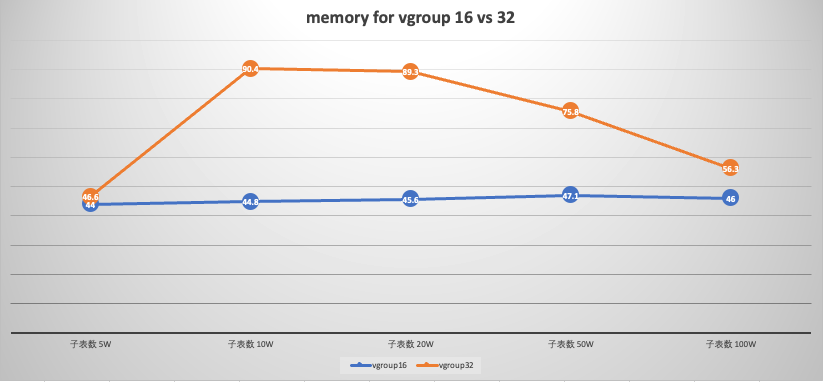
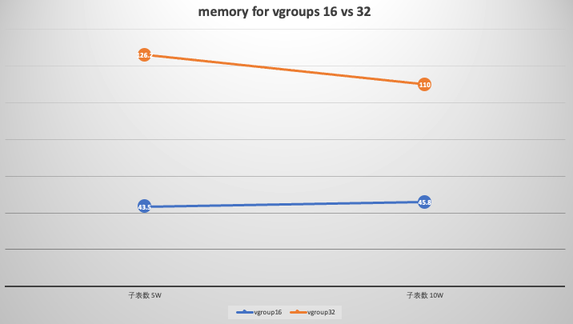

# Test report - TD 22559 优化 select * limit order by的内存使用

### 1. **概述**：

客户问题是在超级表有大量子表（>96000）的情况下，进行时间排序的查询导致的OOM问题，目的是经过对内存的优化减少排序查询中的内存消耗。

### 2. 测试环境：

192.168.1.61：
CPU: Intel(R) Xeon(R) CPU E5-2650 v3 @ 2.30GHz （2）10核
Mem：DDR4 16GB * 16
Disk:  893GB
102.168.1.63：
CPU: Intel(R) Xeon(R) CPU E5-2650 v3 @ 2.30GHz（2）10核
Mem: DDR4 16GB* 16
Disk: 895GB

### 3. 测试用例：

通过改变vgroups，minRows，maxRows以及表中行数据的宽度，执行相同的按时间排序的查询语句，对比3.0.5.0与3.0.5.2 最新代码的内存占用
| 测试条件 | 测试用例 |
| --- | --- |
| 100万子表
 子表包含100条数据
vgroup数量为16
 行数据 2k
 minRows 100
 maxRows 4096 | 对比3.0.5.0、3.0 main latest 中select * from xxx limit yy order by查询语句（5万子表）的内存使用
 select * from st order by ts desc limit 10; |
|  | 对比3.0.5.0、3.0 main latest 中select * from xxx limit yy order by查询语句（10万子表）的内存使用
 select * from st order by ts desc limit 10; |
|  | 对比3.0.5.0、3.0 main latest 中select * from xxx limit yy order by查询语句（20万子表）的内存使用
 select * from st order by ts desc limit 10; |
|  | 对比3.0.5.0、3.0 main latest 中select * from xxx limit yy order by查询语句（50万子表）的内存使用
 select * from st order by ts desc limit 10; |
|  | 对比3.0.5.0、3.0 main latest 中select * from xxx limit yy order by查询语句（100万子表）的内存使用
 select * from st order by ts desc limit 10; |
| 100万子表
 子表包含100条数据
vgroup数量为16
 行数据 30k
 minRows 200
 maxRows 8192 | 对比3.0.5.0、3.0 main latest 中select * from xxx limit yy order by查询语句（5万子表）的内存使用
 select * from st order by ts desc limit 10; |
|  | 对比3.0.5.0、3.0 main latest 中select * from xxx limit yy order by查询语句（10万子表）的内存使用 |
|  | 对比3.0.5.0、3.0 main latest 中select * from xxx limit yy order by查询语句（20万子表）的内存使用 |
|  | 对比3.0.5.0、3.0 main latest 中select * from xxx limit yy order by查询语句（50万子表）的内存使用 |
|  | 对比3.0.5.0、3.0 main latest 中select * from xxx limit yy order by查询语句（100万子表）的内存使用 |
| 100万子表
 子表包含100条数据
vgroup数量为32
 行数据 2k
 minRows 100
 maxRows 4096 | 对比3.0.5.0、3.0 main latest 中select * from xxx limit yy order by查询语句（5万子表）的内存使用
 select * from st order by ts desc limit 10; |
|  | 对比3.0.5.0、3.0 main latest 中select * from xxx limit yy order by查询语句（10万子表）的内存使用
 select * from st order by ts desc limit 10; |
|  | 对比3.0.5.0、3.0 main latest 中select * from xxx limit yy order by查询语句（20万子表）的内存使用
 select * from st order by ts desc limit 10; |
|  | 对比3.0.5.0、3.0 main latest 中select * from xxx limit yy order by查询语句（50万子表）的内存使用
 select * from st order by ts desc limit 10; |
|  | 对比3.0.5.0、3.0 main latest 中select * from xxx limit yy order by查询语句（100万子表）的内存使用
 select * from st order by ts desc limit 10; |
| 100万子表
 子表包含100条数据
vgroup数量为32
 行数据 30k
 minRows 200
 maxRows 8192 | 对比3.0.5.0、3.0 main latest 中select * from xxx limit yy order by查询语句（5万子表）的内存使用
 select * from st order by ts desc limit 10; |
|  | 对比3.0.5.0、3.0 main latest 中select * from xxx limit yy order by查询语句（10万子表）的内存使用
 select * from st order by ts desc limit 10; |
|  | 对比3.0.5.0、3.0 main latest 中select * from xxx limit yy order by查询语句（20万子表）的内存使用 |
|  | 对比3.0.5.0、3.0 main latest 中select * from xxx limit yy order by查询语句（50万子表）的内存使用 |
|  | 对比3.0.5.0、3.0 main latest 中select * from xxx limit yy order by查询语句（100万子表）的内存使用 |

### 4. 测试结果：

3.0.5.0在所有用例中的内存会持续上涨至100%，导致db connection断开，taosd被kill退出
经过优化后的3.0.5.2能够完成查询，在不同条件下内存占用如下图（单位：GB）：
minRows：100；maxRows：4096；行数据宽度：2k

在相同vgroups的情况下，相同的按时间排序的查询语句，内存占用随子表数的增加而增加，到达一定程度后减小
增加vgroups的大小，相同的按时间排序查询，内存占用会增大，到达一定程度后出现减小，且vgroups数越大，子表数越多，内存减小越多

minRows：200；maxRows：8192；行数据宽度：30k

与上图对比，不改变vgroups数与子表数，改变minRows与maxRows数，同时增加表中行数据宽度，内存占用影响不大
改变minRows与maxRows数，增加vgroups数，同时增加表中行数据宽度，内存占用增长明显；由于行数据宽度较大的场景下，20w/50w/100w子表数据预埋时间较长，暂时没有进行测试。

### 5. 结论：

与3.0.5.0对比，当前的内存优化方案生效，能够减少在多子表条件下基于时间排序的查询内存占用；增加列宽度和minRows、maxRows与内存占用关系不大；增加vgroups数会增加内存占用。
