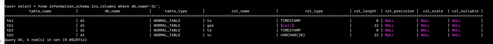

# GEOMETRY 类型支持

## 1. 背景

- 初始提交由社区 @[**dinglezhang**](https://github.com/dinglezhang)** **贡献
  Commit-ID: 984211f3b49aef880d51c1cdab4bb6a65e2804a0
  <!-- Unsupported block type: 999 -->
- 引入 **Libgeos **作为 GEOMETRY 逻辑处理库：[GEOS](https://taosdata.feishu.cn/wiki/PlyawzOebikcF8kHjdLcbw9En8d) 
  <quote-container>
  GEOS is a C++ library for performing operations on two-dimensional vector geometries. It is primarily a port of the JTS Topology Suite Java library. It provides many of the algorithms used by PostGIS, the Shapely package for Python, the sf package for R, and others.
  </quote-container>

- 其他数据库的 GEOMETRY 支持：
  - [第 19 章：MySQL 中的空间扩展](https://www.mysqlzh.com/doc/172.html)
  - [GEOMETRY SQL 参考_云原生数据库 PolarDB-阿里云帮助中心](https://help.aliyun.com/document_detail/408206.html?spm=a2c4g.408206.0.0.1d6b4c2fMZhZMs)

## 2. 数据格式（WKT）

支持的子类型及示例如下表：

| **子类型** | **示例** |
| --- | --- |
| POINT | POINT(1.0 1.0) |
| LINESTRING | LINESTRING(1.0 1.0, 2.0 2.0) |
| POLYGON | POLYGON ((0 0, 4 0, 4 4, 0 4, 0 0)) |
| MULTIPOINT | MULTIPOINT(1.0 1.0, 2.0 2.0) |
| MULTILINESTRING | MULTILINESTRING((1.0 1.0, 2.0 2.0), (3.0 3.0, 4.0 4.0)) |
| MULTIPOLYGON | MULTIPOLYGON(((1.0 1.0, 2.0 2.0, 1.0 1.0)), ((3.0 3.0, 4.0 4.0, 3.0 3.0))) |
| GEOMETRYCOLLECTION | GEOMETRYCOLLECTION(POINT(1.0 1.0), LINESTRING(1.0 1.0, 2.0 2.0)) |

数据格式的 bnf 可参考：https://libgeos.org/specifications/wkt/#wkt-bnf

## 3. SQL

```c
// ntb
CREATE TABLE ntb1 (ts TIMESTAMP, geo GEOMETRY(21));
INSERT INTO ntb1 VALUES(now, 'POINT(1234567000.1234123 12345670.120)');

// stb ctb
CREATE STABLE stb1 (ts TIMESTAMP, geo GEOMETRY(21)) TAGS(geot GEOMETRY(21));
INSERT INTO ctb1_1 USING stb1 TAGS('POINT(200 100)') VALUES(now, 'POINT(100 100)');

// INSERT
INSERT INTO ntb1 VALUES (now, "POINT(10 20)");
INSERT INTO ntb1 VALUES (now, 'LINESTRING(1.0 1.0, 2.0 2.0, 5.0 5.0)');
INSERT INTO ntb1 VALUES (now, 'POLYGON((1.0 1.0, 2.0 2.0, 5.0 5.0, 1.0 1.0))');

// SELECT
SELECT * FROM ntb1 where geo='POINT(10 20)';
```

## 4. 类型隐式转换

在查询时可使用如下语句，其中 'point（1 1）' 可被隐式转换为 GEOMETRY 类型
```sql
SELECT * FROM ntb1 WHERE geo='POINT(1 1)';
```

<callout emoji="pushpin" background-color="light-orange" border-color="light-orange">
@李顺纲 ：本特性可能不应保留
可使用 'POINT(1 1)' 代表一个 GEOMETRY 值，如：SELECT * FROM ntb1 WHERE g1='POINT(1 1)'；
实际上'POINT(1 1)' 被解析为 VARCHAR 类型，在比较时会自动**隐式**转换为 GEOMETRY 类型，然后与 g1 的值进行比较。

可能表现为：SELECT * FROM ntb1 WHERE g1=ST_GeomFromText('POINT(1 1)')；
即需要**显式**转换为 GEOMETRY 类型，更合理些。
目前两种格式都支持
</callout>

## 5. 谓词

GEOMETRY 类型支持以下通用谓词：

| Super Table | = | != | is null | is not null | in | not in |
| --- | --- | --- | --- | --- | --- | --- |
| where column | ok | ok | ok | ok | ok | ok |
| where tag | ok | ok | ok | ok | ok | ok |


| Normal Table | = | != | is null | is not null | in | not in |
| --- | --- | --- | --- | --- | --- | --- |
| where column | ok | ok | ok | ok | ok | ok |

## 6. builtin

GEOMETRY 提供了以下 builtin 函数。

| 名称 | 功能 | 语法 |
| --- | --- | --- |
| **ST_GeomFromText** | 返回一个与给定的 WKT 字符串相对应的 GEOMETRY 对象。 | GEOMETRY **ST_GeomFromText**(text WKT); |
| **ST_AsText** | 返回给定 GEOMETRY 对象的 WKT 表示。 | text **ST_AsText**(GEOMETRY geomA); |
| **ST_MakePoint** | 构造一个 2D 点。 | GEOMETRY **ST_MakePoint**(double precision x , double precision y); |
| **ST_Intersects** | 判断两个 GEOMETRY 对象是否相交。如果 GEOMETRY 对象有任意共享空间的部分，则它们相交。 | boolean **ST_Intersects**(GEOMETRY geomA , GEOMETRY geomB); |
| **ST_Equals** | 如果给定的两个 GEOMETRY 对象在空间上相等，那么返回 True。 | boolean **ST_Equals**(GEOMETRY geomA , GEOMETRY geomB); |
| **ST_Touches** | 返回给定的两个 GEOMETRY 对象间的相接情况。 | boolean **ST_Touches**(GEOMETRY geomA , GEOMETRY geomB); |
| **ST_Covers** | 如果 GEOMETRY 对象 B 没有任何坐标点在对象 A 之外，则返回 True。 | boolean **ST_Covers**(GEOMETRY geomA , GEOMETRY geomB); |
| **ST_Contains** | 如果 GEOMETRY 对象 A 包含 GEOMETRY 对象 B，则返回 True。 | boolean **ST_Contains**(GEOMETRY geomA , GEOMETRY geomB); |
| **ST_ContainsProperly** | 如果 GEOMETRY 对象 B 完全在 GEOMETRY 对象 A 的内部，则返回 True。 | boolean **ST_ContainsProperly**(GEOMETRY geomA , GEOMETRY geomB); |

## 7. 长度

GEOMETRY 类型数据所在 COLUMN/TAG 的设置长度 应 不小于 待插入的 GEOMETRY 类型数据长度。

### 7.1 COLUMN/TAG 设置长度与实际长度

- 设置长度 为用户通过 CREATE/ALTER 指定的长度，可通过 ALTER 变大不可变小。COLUMN 设置长度最大为 65517 字节，TAG 设置长度最大为 16382 字节
- 与 VARCHAR 一致，实际长度 = 设置长度 + 2 字节，额外的 2 字节用于存放 size 字段
  

### 7.2 数据长度

- GEOMETRY 类型数据在数据库中以 WKB （二进制） 格式存储，WKB 数据占用空间随 **坐标对数量 **线性增加。对于一个 GEOMETRY 对象，每组二维坐标将额外占用 16 字节。

## 8. 可能的方向

- [x] 更多维度支持。当前使用 Standard WKB 作为数据存储格式。该格式不支持更多维度。考虑使用 Extended WKB 或 ISO WKB
- [ ] WKB 格式支持。支持直接写入 raw WKB 数据
- [ ] 更多 builtin。可参考 PolarDB 的接口
- [ ] 拆分子几何类型。是否应将 POINT/LINESTRING 等作为独立类型
- [x] 更多几何类型
