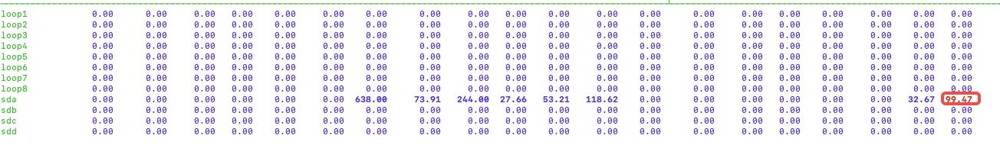
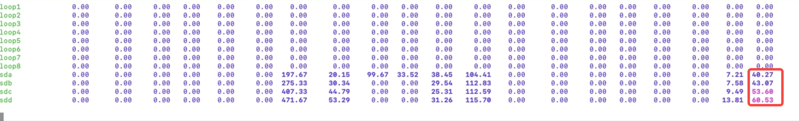

# TS-2699 多级存储并列磁盘写入性能测试报告

## 一、改进原理

      因为原来WAL 数据是只能写入挂载点磁盘，一台机器只能配置一个主挂载点，所以一个 taosd 写入的所有 wal 只能写到一块磁盘上，这就成了瓶颈，即使有很多磁盘也无法分担。
      改进原理是让 WAL 可以写入到多个磁盘中，分担压力。

## 二、测试方案

     **1）对照测试**
           使用 3.0 和 main 做为对照测试对象
            3.0 分支： 改进后的分支
            main 分支：原来的
 **     2）挂载磁盘 **
           使用 192.168.1.35 机器，上面挂载着四块磁盘
           一块做主挂载盘，其它三块做 level 0 上的副挂载盘，配置如下：
                                      目录                           挂载磁盘     
                dataDir /root/alexduan/data 0 1   /dev/sda
                dataDir /mnt/disk1 0 0                  /dev/sdb
                dataDir /mnt/disk2 0 0                  /dev/sdc
                dataDir /mnt/disk3 0 0                 /dev/sdd
      **3） 数据写入**
            使用 taosBenchmark 写入数据
            写入数据规模： 100个子表，每个子表写入 500W行，共计 5亿数据量
     4) 集群
            为了减少其它因素的影响，选择单节点单副本来测试验证

## 三、测试结果

      机器： 24C 64G 硬件  写入 5亿行数据量，
在调整各配置参数后让写入性能达到最佳状态下的数据如下：
**整体情况：**

| **分支** | **写入耗时** | **吞吐量** | **单个写入** **P99 延时** | **单个写入** **最大延时** |
| --- | --- | --- | --- | --- |
| main(原) | 187s | 267W行/秒 | 2538ms | 3386ms |
| 3.0(新) | 104s | 480W行/秒 | 821ms | 1151ms |
|  | 减小 80% | 提升80% | 约3倍 | 约3倍 |

     **说明：**
       改进后，写入耗时明显减小，整体写入数据的吞吐量提升近80%
       提升的主要原因是单个写入请求的 P99 延时和最大延时都有近三倍多的缩短，这个是符合预期的，因为 IO 写入压力被从一个盘分散到四个盘了，压力下来了，单个请求就不会出现太长时间的耗时了。 

     **各磁盘 ****IO**** 使用情况分析：**
      优化前： 主挂载磁盘IO 使用近 100%，而其它副挂载盘由于主盘瓶颈，导致写入各盘的数据量很小，无法利用起来空闲 IO

      优化后： WAL 可以落到任意盘上，不再是瓶颈，各副盘的 IO 马上就被利用起来，效果很不错

     以上两张图的对比效果，即是这次要改造的目标， 改造后吞吐量提升 80%，效果很好。    

## 三、结论

      写入 WAL由一块磁盘分散到四块磁盘 ，整体写入吞吐量比原来可提升 80%，达到了这次优化的目标。
      这次改进也是 TDengine 在充分利用多块磁盘的并发能力上达到了一个新的高度，建立了一个新的里程碑。
      也要感谢交付部门根据用户的真实使用情况，向研发建言献策，为产品提出了宝贵的改进建议。
