# [Test report] 限制开源版只支持有限的操作系统和 CPU 架构 阶段一

### 1. 测试目的

TDengine 的开源策略是支持主流的 Linux 操作系统，对于有国产化、或者特定需求的企业，希望能够产生企业版合作。开源版支持的操作系统，可以列出如下规则：
- 支持主流的 Linux 操作系统，不支持主流操作系统的较老版本
- 不支持非主流的操作系统
- 不支持信创背景的操作系统
- 不支持 Windows 系列操作系统
- 支持 MacOS 操作系统
本次测试的目的是根据TDengine建立的白/黑名单机制，验证在不同操作系统和CPU架构的环境下，对不在白名单内的操作系统环境，TDengine开源版对安装、运行进行限制（不包括源码编译）

### 2. 测试环境

腾讯云环境：119.45.201.132 （root/tbase125!）
软件版本：基于2023-07-20代码打包

### 3. 测试用例

| ###### 操作系统 | ###### 版本 | 白/黑名单 | 环境是否具备 | ###### 编译 | ###### 安装 | ###### 运行 | ###### 测试结果 | ###### 备注 |
| --- | --- | --- | --- | --- | --- | --- | --- | --- |
| CentOS | 7及以上 | 白名单 | 是 | N/A | Yes | Yes | Pass | 版本信息： 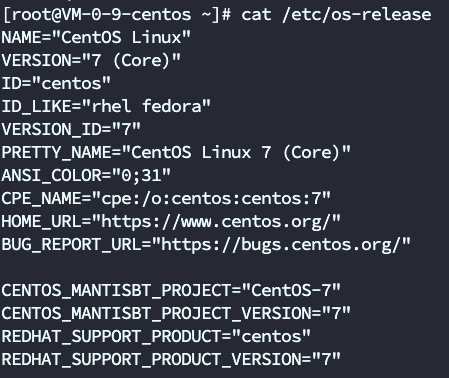 |
| Ubuntu | 18 | 白名单 | 是 | N/A | Yes | Yes | Pass | 版本信息： 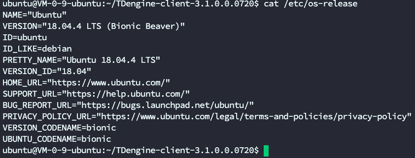 |
| RedHat | all | 白名单 |  | N/A |  |  |  |  |
| Debian | all | 白名单 | 是 | N/A | Yes | Yes | Pass | 版本信息： 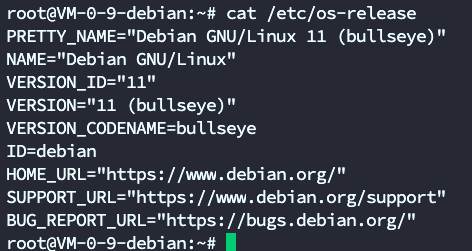 |
| CoreOS | all | 白名单 | 是 | N/A | 安装出现/usr/local的权限问题 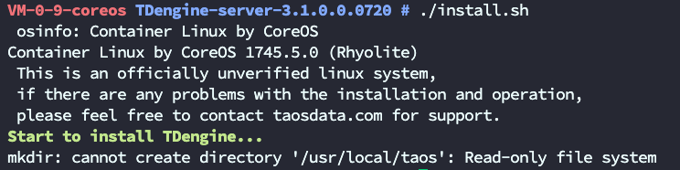 | No | Fail | 版本信息： 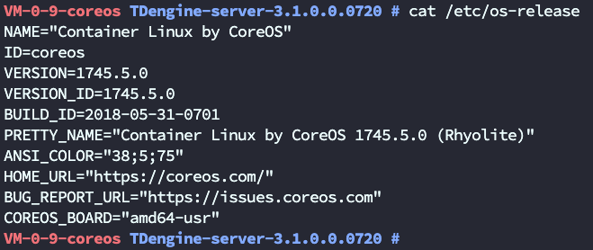 |
| FreeBSD | all | 白名单 | 是 | N/A | Yes | /usr/bin/taosd 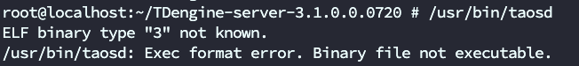 service start taosd 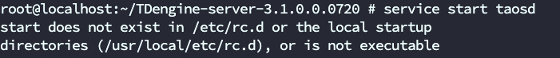 | Fail | 版本信息： 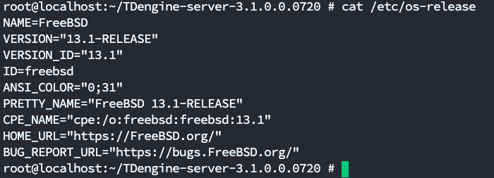 |
| OpenSUSE | all | 白名单 | 是 | N/A | Yes | Yes | Pass | 版本信息： 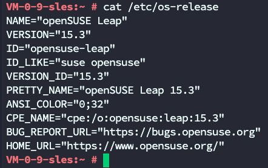 |
| SUSE Linux | all | 白名单 |  | N/A |  |  |  |  |
| Fedora | all | 白名单 | 是 | N/A | Yes | Yes | Pass | 版本信息： 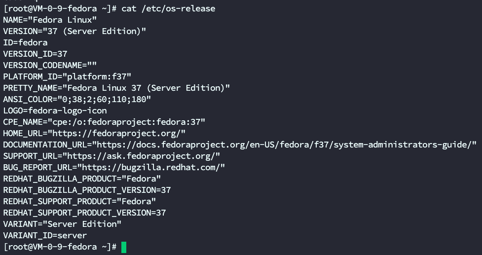 |
| Windows | all | 白名单 |  | N/A |  |  |  | 支持客户端 不支持服务端 暂时没有安装包 |
| MacOS | all | 白名单 |  | N/A |  |  |  | 暂时没有安装包 |
| CentOS | 6 | 黑名单 | 是(腾讯云虚拟机) | N/A | Yes 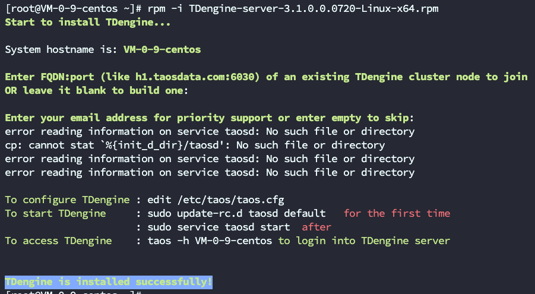 | No 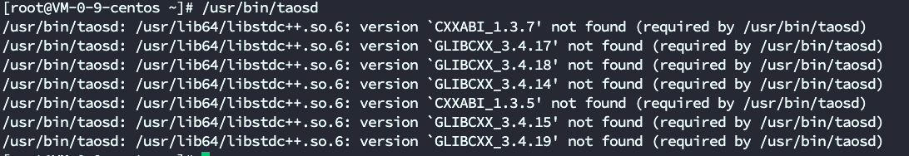 | N/A | 重点 CentOS release 6.10 (Final) Linux VM-0-9-centos 2.6.32-754.35.1.el6.x86_64 |
| Ubuntu | 17 | 黑名单 | 是 | N/A | Yes | No 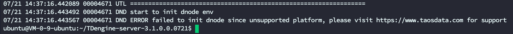 | Pass | 重点 版本信息： 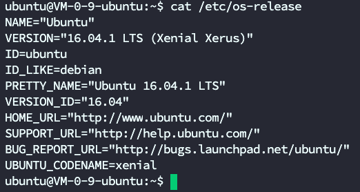 |
| 麒麟 | V10 | 黑名单 | 是 | N/A | Yes | No 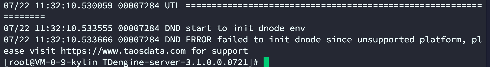 | Pass | 重点 版本信息： 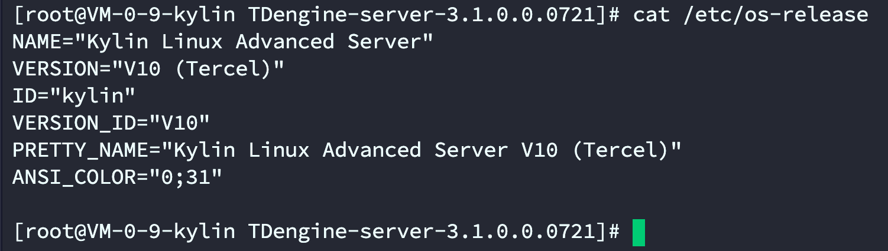 |
| Alibaba Cloud Linux 2/3 | all | 黑名单 |  |  | No | No |  | 重点 |
| Anolis OS | all | 黑名单 |  |  | No | No |  | 重点 |
| TencentOS | all | 黑名单 | 是 | N/A | Yes | No 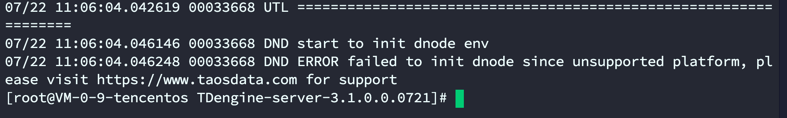 | Pass | 重点 版本信息: 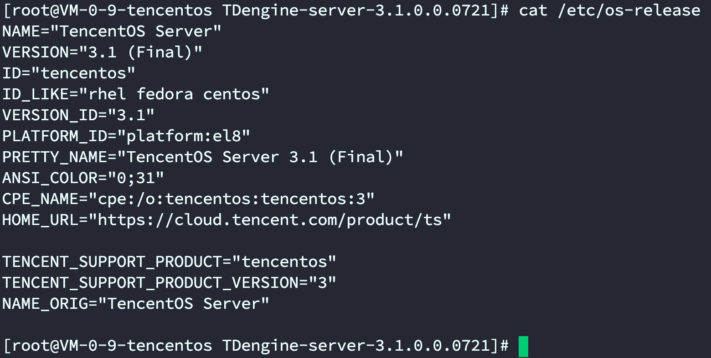 |
| EulerOS | all | 黑名单 |  |  | No | No |  | 重点 |
| OpenCloudOS | all | 黑名单 | 是 | N/A | Yes | No 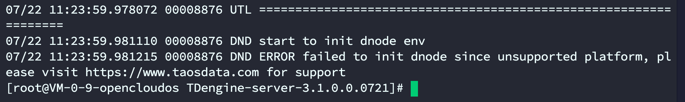 | Pass | 重点 版本信息： 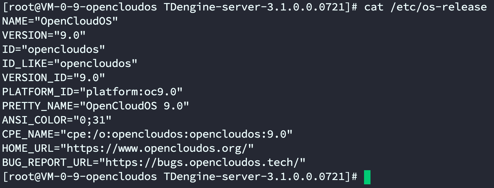 |
| 欧拉操作系统 openEuler / EulerOS | all | 黑名单 |  |  | No | No |  | 华为 |
| 龙蜥操作系统 Anolis OS | all | 黑名单 |  |  | No | No |  | 阿里云 |
| 中标麒麟操作系统 NeoKylin | all | 黑名单 |  |  | No | No |  |  |
| 银河麒麟操作系统 Kylin | all | 黑名单 |  |  | No | No |  |  |
| 普华操作系统iSoft | all | 黑名单 |  |  | No | No |  |  |
| 傲来操作系统 EulixOS 1.0 | all | 黑名单 |  |  | No | No |  |  |
| 拓林思 TurboLinux | all | 黑名单 |  |  | No | No |  |  |
| 深度 Linux Deepin | all | 黑名单 |  |  | No | No |  |  |
| 中科方德桌面操作系统 | all | 黑名单 |  |  | No | No |  |  |
| 中兴新支点操作系统 | all | 黑名单 |  |  | No | No |  |  |
| 一铭操作系统 | all | 黑名单 |  |  | No | No |  |  |
| 优麒麟操作系统 UbuntuKylin | all | 黑名单 |  |  | No | No |  |  |
| 湖南麒麟操作系统 Kylinsec | all | 黑名单 |  |  | No | No |  |  |
| 起点操作系统 startOS | all | 黑名单 |  |  | No | No |  |  |
| 共创 Linux 桌面操作系统 | all | 黑名单 |  |  | No | No |  |  |
| 威科乐恩 Linux WiOS | all | 黑名单 |  |  | No | No |  |  |
| 思普操作系统 SPGnux | all | 黑名单 |  |  | No | No |  |  |
| 统信操作系统 UOS | all | 黑名单 |  |  | No | No |  |  |
| 中科红旗 | all | 黑名单 |  |  | No | No |  |  |
| 中兴新支点 | all | 黑名单 |  |  | No | No |  |  |
| 麒麟信安操作系统 | all | 黑名单 |  |  | No | No |  |  |
| 秦简-DJYOS | all | 黑名单 |  |  | No | No |  |  |
| 华为-lite OS | all | 黑名单 |  |  | No | No |  |  |
| 阿里- AliOS Things | all | 黑名单 |  |  | No | No |  |  |
| 翼辉-sylixos | all | 黑名单 |  |  | No | No |  |  |
| 赛睿德rt-thread | all | 黑名单 |  |  | No | No |  |  |
| 科银京成-Deltaos（道系统） | all | 黑名单 |  |  | No | No |  |  |
| 致远电子-AworksOSsOS | all | 黑名单 |  |  | No | No |  |  |
| 中航计算所-AcoreOS（天脉） | all | 黑名单 |  |  | No | No |  |  |
| 凯思昊鹏-HopenOS | all | 黑名单 |  |  | No | No |  |  |
| VxWorks | all | 黑名单 |  |  | No | No |  |  |
| FreeRTOS | all | 黑名单 |  |  | No | No |  |  |
| 嵌入式Linux | all | 黑名单 |  |  | No | No |  |  |
| UCOS-II | all | 黑名单 |  |  | No | No |  |  |
| RTX | all | 黑名单 |  |  | No | No |  |  |
| Nucleus | all | 黑名单 |  |  | No | No |  |  |
| QNX | all | 黑名单 |  |  | No | No |  |  |

### 4. 测试总结

1. 白名单中Red hat和SUSE Linux在腾讯云环境中没有；CoreOS在安装过程中出现权限问题，FreeBSD在运行过程中出现错误；其他环境没有问题
2. 黑名单中CentOS 6会有依赖包版本问题，Unbuntu 17、麒麟 V10、Tecent OS、OpenCloud OS运行报错，符合预期。
