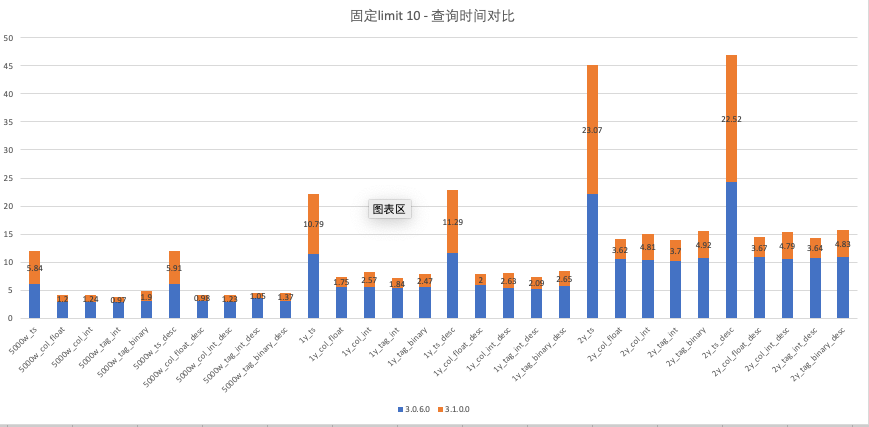
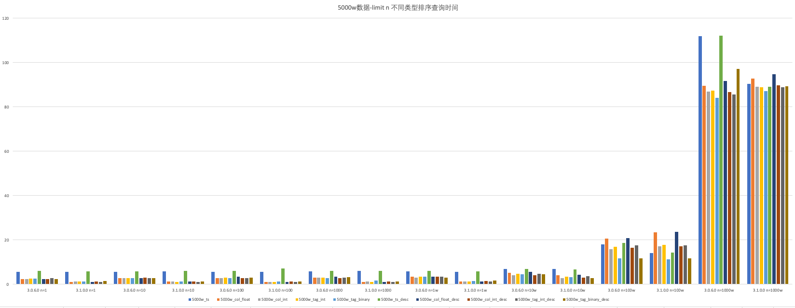
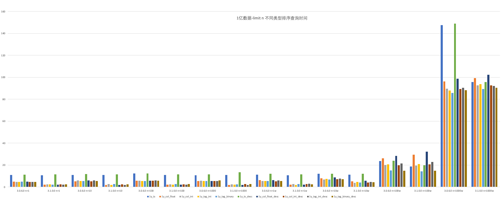
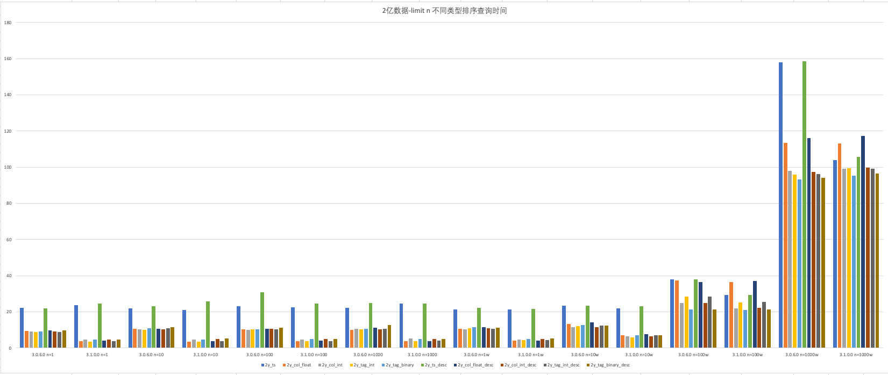

# 【Test report】对order by limit的查询时间性能再次优化

### 1. **概述**：

优化点：
1. 增加原本排序逻辑中在写入diskBasedBuf时的limit逻辑
2. 在pq sort中逻辑切换为先进行pq 排序, 然后考虑是否添加到pq中
3. 将SortNode中maxRows替换为limitinfo.
4. 使用sma信息在table scan时过滤掉不需要读取的block.
经过与jiaming讨论，本次优化主要影响查询时间性能，对查询cpu、内存、网络的占用无影响，不在本次测试范围内。

### 2. 测试环境：

102.168.1.63：
CPU: Intel(R) Xeon(R) CPU E5-2650 v3 @ 2.30GHz（2）40核
Mem: DDR4 16GB* 16
Disk: 895GB

### 3. 测试用例：

对比版本：3.0.6.0  vs  3.1.0.0 最新代码
用例一：分别创建5000w/1亿/2亿的超级表（子表数据为10000，增加子表数量增加总的数据条数），包含类型为int，float类型的列和int, binary标签列；对不同超级表执行查询语句（固定limit 后的值为10），并记录查询语句执行时间

| Dataset | SQL | 3.0.6.0 | 3.1.0.0 | Comments |
| --- | --- | --- | --- | --- |
| select * from td25006_5000w.meters order by ts limit 10; | 6.08s | 5.84s |  |
| select * from td25006_5000w.meters order by current limit 10; | 2.93s | 1.2s |  |
| select * from td25006_5000w.meters order by voltage limit 10; | 2.87s | 1.24s |  |
| select * from td25006_5000w.meters order by groupid limit 10; | 2.8s | 0.97s |  |
| select * from td25006_5000w.meters order by location limit 10; | 2.97s | 1.19s |  |
| select * from td25006_5000w.meters order by ts desc limit 10; | 6.09s | 5.91s |  |
| select * from td25006_5000w.meters order by current desc limit 10; | 3.11s | 0.98s |  |
| select * from td25006_5000w.meters order by voltage desc limit 10; | 2.87s | 1.23s |  |
| select * from td25006_5000w.meters order by groupid desc limit 10; | 3.49s | 1.05s |  |
| select * from td25006_5000w.meters order by location desc limit 10; | 3.08s | 1.37s |  |
| select * from td25006_1y.meters order by ts limit 10; | 11.4s | 10.79s |  |
| select * from td25006_1y.meters order by current limit 10; | 5.62s | 1.75s |  |
| select * from td25006_1y.meters order by voltage limit 10; | 5.61s | 2.57s |  |
| select * from td25006_1y.meters order by groupid limit 10; | 5.29s | 1.84s |  |
| select * from td25006_1y.meters order by location limit 10; | 5.48s | 2.47s |  |
| select * from td25006_1y.meters order by ts desc limit 10; | 11.53s | 11.29s |  |
| select * from td25006_1y.meters order by current desc limit 10; | 5.92s | 2s |  |
| select * from td25006_1y.meters order by voltage desc limit 10; | 5.34s | 2.63s |  |
| select * from td25006_1y.meters order by groupid desc limit 10; | 5.27s | 2.09s |  |
| select * from td25006_1y.meters order by location desc limit 10; | 5.79s | 2.65s |  |
| select * from td25006_2y.meters order by ts limit 10; | 22.07s | 23.07s |  |
| select * from td25006_2y.meters order by current limit 10; | 10.47s | 3.62s |  |
| select * from td25006_2y.meters order by voltage limit 10; | 10.28s | 4.81s |  |
| select * from td25006_2y.meters order by groupid limit 10; | 10.19 | 3.7s |  |
| select * from td25006_2y.meters order by location limit 10; | 10.64s | 4.92s |  |
| select * from td25006_2y.meters order by ts desc limit 10; | 24.37s | 22.52s |  |
| select * from td25006_2y.meters order by current desc limit 10; | 10.82s | 3.67s |  |
| select * from td25006_2y.meters order by voltage desc limit 10; | 10.61s | 4.79s |  |
| select * from td25006_2y.meters order by groupid desc limit 10; | 10.72s | 3.64s |  |
| select * from td25006_2y.meters order by location desc limit 10; | 10.84s | 4.83s |  |

用例二：对5000w/1亿/2亿数据的超级表执行查询，修改limit 后的值分别为1、10、100、1000、1w、10w、100w、1000w并记录查询语句执行时间

| Dataset | SQL | 3.0.6.0 | 3.1.0.0 | Comments |
| --- | --- | --- | --- | --- |
| select * from td25006_5000w.meters order by ts limit n; | n=1, 5.74s n=10, 5.65s n=100, 5.74s n=1000, 5.8s n=1w, 5.87s n=10w, 6.84s n=100w, 18.04s n=1000w, 111.87s | n=1, 5.66s n=10, 5.96s n=100, 5.66s n=1000, 6.1s n=1w, 5.69s n=10w, 6.84s n=100w, 14.1s n=1000w, 90.46s |  |
| select * from td25006_5000w.meters order by current limit n; | n=1, 2.38s n=10, 2.76s n=100, 2.8s n=1000, 3.06s n=1w, 3.37s n=10w, 5.25s n=100w, 20.65s n=1000w, 89.56s | n=1, 1.14s n=10, 1.13s n=100, 1.01s n=1000, 1.12s n=1w, 1.34s n=10w, 4.02s n=100w, 23.36s n=1000w, 92.89s |  |
| select * from td25006_5000w.meters order by voltage limit n; | n=1, 2.43s n=10, 2.77s n=100, 2.79s n=1000, 2.96s n=1w, 3.09s n=10w, 4.12s n=100w, 15.87s n=1000w, 86.96s | n=1, 1.23s n=10, 1.26s n=100, 1.17s n=1000, 1.27s n=1w, 1.35s n=10w, 2.81s n=100w, 17.23s n=1000w, 89.11s |  |
| select * from td25006_5000w.meters order by groupid limit n; | n=1, 2.56s n=10, 2.87s n=100, 2.93s n=1000, 3.05s n=1w, 3.41s n=10w, 4.73s n=100w, 16.93s n=1000w, 87.48s | n=1, 1.19s n=10, 0.97s n=100, 1.17s n=1000, 1s n=1w, 1.21s n=10w, 3.5s n=100w, 17.86s n=1000w, 88.95s |  |
| select * from td25006_5000w.meters order by location limit n; | n=1, 2.58s n=10, 2.81s n=100, 2.83s n=1000, 2.82s n=1w, 3.37s n=10w, 4.53s n=100w, 11.62s n=1000w, 84.06s | n=1, 1.2s n=10, 1.38s n=100, 1.3s n=1000, 1.68s n=1w, 1.57s n=10w, 3.25s n=100w, 11.29s n=1000w, 87.18s |  |
| select * from td25006_5000w.meters order by ts desc limit n; | n=1, 6.03s n=10, 5.91s n=100, 6.13s n=1000, 6.01s n=1w, 6.04s n=10w, 6.87s n=100w, 18.63s n=1000w, 112.17s | n=1, 5.79s n=10, 6.03s n=100, 7.2s n=1000, 6.05s n=1w, 5.93s n=10w, 6.79s n=100w, 14.34s n=1000w, 89.2s |  |
| select * from td25006_5000w.meters order by current desc limit n; | n=1, 2.43s n=10, 2.85s n=100, 3.36s n=1000, 3.47s n=1w, 3.43s n=10w, 5.58s n=100w, 20.92s n=1000w, 91.78s | n=1, 1.01s n=10, 1.19s n=100, 1.07s n=1000, 1s n=1w, 1.26s n=10w, 4.34s n=100w, 23.65s n=1000w, 94.7s |  |
| select * from td25006_5000w.meters order by voltage desc limit n; | n=1, 2.46s n=10, 3s n=100, 2.75s n=1000, 2.8s n=1w, 3.53s n=10w, 4.14s n=100w, 16.54s n=1000w, 86.72s | n=1, 1.2s n=10, 1.22s n=100, 1.34s n=1000, 1.21s n=1w, 1.5s n=10w, 2.99s n=100w, 17.19s n=1000w, 89.83s |  |
| select * from td25006_5000w.meters order by groupid desc limit n; | n=1, 2.75s n=10, 2.73s n=100, 2.86s n=1000, 2.99s n=1w, 3.48s n=10w, 4.8s n=100w, 17.53s n=1000w, 85.67s | n=1, 1s n=10, 1.03s n=100, 1.08s n=1000, 1.13s n=1w, 1.29s n=10w, 3.58s n=100w, 17.49s n=1000w, 89s |  |
| select * from td25006_5000w.meters order by location desc limit n; | n=1, 2.42s n=10, 2.89s n=100, 3s n=1000, 3.15s n=1w, 2.99s n=10w, 4.46s n=100w, 11.8s n=1000w, 97.2s | n=1, 1.58s n=10, 1.31s n=100, 1.3s n=1000, 1.29s n=1w, 1.65s n=10w, 2.91s n=100w, 11.83s n=1000w, 89.29s |  |
| select * from td25006_1y.meters order by ts limit n; | n=1, 10.92s n=10, 11.05s n=100, 12.36s n=1000, 10.75s n=1w, 11.17s n=10w, 12.12s n=100w, 23.59s n=1000w, 147.64s | n=1, 10.83s n=10, 10.96s n=100, 11.08s n=1000, 10.95s n=1w, 10.8s n=10w, 11.33s n=100w, 18.71s n=1000w, 95.8s |  |
| select * from td25006_1y.meters order by current limit n; | n=1, 4.92s n=10, 5.2s n=100, 5.75s n=1000, 5.53s n=1w, 6.39s n=10w, 8.12s n=100w, 26.32s n=1000w, 96.23s | n=1, 2.16s n=10, 1.83s n=100, 2.13s n=1000, 1.93s n=1w, 2.07s n=10w, 5.3s n=100w, 29.6s n=1000w, 99.21s |  |
| select * from td25006_1y.meters order by voltage limit n; | n=1, 4.56s n=10, 6.06s n=100, 5.73s n=1000, 5.64s n=1w, 5.5s n=10w, 7s n=100w, 20.01s n=1000w, 89.69s | n=1, 2.58s n=10, 2.7s n=100, 2.46s n=1000, 2.57s n=1w, 2.69s n=10w, 3.97s n=100w, 19.53s n=1000w, 92.78s |  |
| select * from td25006_1y.meters order by groupid limit n; | n=1, 4.61s n=10, 5.54s n=100, 5.53s n=1000, 5.46s n=1w, 5.57s n=10w, 7.46s n=100w, 20.66s n=1000w, 88.04s | n=1, 2.37s n=10, 1.83s n=100, 2.08s n=1000, 2.1s n=1w, 2.03s n=10w, 4.77s n=100w, 20.97s n=1000w, 93.75s |  |
| select * from td25006_1y.meters order by location limit n; | n=1, 4.85s n=10, 5.46s n=100, 5.58s n=1000, 5.37s n=1w, 5.6s n=10w, 6.8s n=100w, 15.28s n=1000w, 85.84s | n=1, 2.32s n=10, 2.8s n=100, 2.86s n=1000, 2.5s n=1w, 2.73s n=10w, 4.05s n=100w, 14.26s n=1000w, 89.26s |  |
| select * from td25006_1y.meters order by ts desc limit n; | n=1, 11.19s n=10, 11.9s n=100, 12.28s n=1000, 11.66s n=1w, 12.06s n=10w, 12.15s n=100w, 24.12s n=1000w, 149.08s | n=1, 11.63s n=10, 11.58s n=100, 11.63s n=1000, 13.41s n=1w, 11.52s n=10w, 12.21s n=100w, 19.81s n=1000w, 95.83s |  |
| select * from td25006_1y.meters order by current desc limit n; | n=1, 4.85s n=10, 5.97s n=100, 5.65s n=1000, 5.63s n=1w, 6.25s n=10w, 8.73s n=100w, 28.3s n=1000w, 98.82s | n=1, 2.07s n=10, 2.02s n=100, 2.08s n=1000, 2.03s n=1w, 2.29s n=10w, 5.65s n=100w, 32.19s n=1000w, 102.42s |  |
| select * from td25006_1y.meters order by voltage desc limit n; | n=1, 4.78s n=10, 5.3s n=100, 5.86s n=1000, 5.47s n=1w, 5.36s n=10w, 7.13s n=100w, 19.72s n=1000w, 89.38s | n=1, 2.53s n=10, 2.51s n=100, 2.44s n=1000, 2.87s n=1w, 2.72s n=10w, 4.04s n=100w, 20.71s n=1000w, 92.68s |  |
| select * from td25006_1y.meters order by groupid desc limit n; | n=1, 4.63s n=10, 6.02s n=100, 5.93s n=1000, 5.51s n=1w, 5.95s n=10w, 7.66s n=100w, 21.54s n=1000w, 90.35s | n=1, 2.11s n=10, 2.05s n=100, 2.14s n=1000, 1.98s n=1w, 2.91s n=10w, 4.55s n=100w, 22.77s n=1000w, 92.09s |  |
| select * from td25006_1y.meters order by location desc limit n; | n=1, 4.74s n=10, 5.49s n=100, 5.73s n=1000, 5.93s n=1w, 5.51s n=10w, 7.11s n=100w, 14.96s n=1000w, 88.23s | =1, 2.39s n=10, 2.43s n=100, 2.81s n=1000, 2.74s n=1w, 2.6s n=10w, 4.27s n=100w, 14.97s n=1000w, 90.36s |  |
| select * from td25006_2y.meters order by ts limit n; | n=1, 22.33s n=10, 22.09s n=100, 23.08s n=1000, 22.18s n=1w, 21.51s n=10w, 23.54s n=100w, 38.1s n=1000w, 158.08s | n=1, 23.81s n=10, 21.06s n=100, 22.51s n=1000, 24.6s n=1w, 21.29s n=10w, 21.88s n=100w, 29.32s n=1000w, 103.88s |  |
| select * from td25006_2y.meters order by current limit n; | n=1, 9.56s n=10, 10.78s n=100, 10.34s n=1000, 10.18s n=1w, 10.82s n=10w, 13.28s n=100w, 37.29s n=1000w, 113.55s | n=1, 3.7s n=10, 3.68s n=100, 3.97s n=1000, 3.86s n=1w, 4.11s n=10w, 7.04s n=100w, 36.4s n=1000w, 113.2s |  |
| select * from td25006_2y.meters order by voltage limit n; | n=1, 9.22s n=10, 10.52s n=100, 10.11s n=1000, 10.76s n=1w, 10.39s n=10w, 11.58s n=100w, 24.98s n=1000w, 98.08s | n=1, 4.63s n=10, 4.78s n=100, 4.82s n=1000, 5.2s n=1w, 4.87s n=10w, 6.65s n=100w, 22.09s n=1000w, 99.32s |  |
| select * from td25006_2y.meters order by groupid limit n; | n=1, 9.02s n=10, 9.98s n=100, 10.26s n=1000, 10.47s n=1w, 10.83s n=10w, 12.17s n=100w, 28.46s n=1000w, 96.06s | n=1, 3.57s n=10, 3.6s n=100, 3.86s n=1000, 3.87s n=1w, 4.53s n=10w, 5.98s n=100w, 25.34s n=1000w, 99.5s |  |
| select * from td25006_2y.meters order by location limit n; | n=1, 9.17s n=10, 10.87s n=100, 10.44s n=1000, 10.7s n=1w, 11.71s n=10w, 12.63s n=100w, 21.26s n=1000w, 93.33s | n=1, 4.81s n=10, 4.7s n=100, 4.99s n=1000, 5s n=1w, 4.96s n=10w, 7.04s n=100w, 21.1s n=1000w, 95.46s |  |
| select * from td25006_2y.meters order by ts desc limit n; | n=1, 22.07s n=10, 23.09s n=100, 30.76s n=1000, 24.86s n=1w, 22.3s n=10w, 23.46s n=100w, 37.94s n=1000w, 158.57s | n=1, 24.7s n=10, 25.68s n=100, 24.55s n=1000, 24.49s n=1w, 21.79s n=10w, 23.26s n=100w, 29.41s n=1000w, 105.79s |  |
| select * from td25006_2y.meters order by current desc limit n; | n=1, 9.68s n=10, 10.65s n=100, 10.8s n=1000, 11.33s n=1w, 11.52s n=10w, 14.38s n=100w, 36.62s n=1000w, 116.15s | n=1, 4.03s n=10, 3.78s n=100, 4.13s n=1000, 3.9s n=1w, 4.02s n=10w, 7.68s n=100w, 37.1s n=1000w, 117.43s |  |
| select * from td25006_2y.meters order by voltage desc limit n; | n=1, 9.25s n=10, 10.41s n=100, 10.56s n=1000, 10.45s n=1w, 10.85s n=10w, 11.56s n=100w, 24.85s n=1000w, 97.36s | n=1, 4.71s n=10, 5.05s n=100, 4.95s n=1000, 4.97s n=1w, 4.97s n=10w, 6.56s n=100w, 22.3s n=1000w, 99.9s |  |
| select * from td25006_2y.meters order by groupid desc limit n; | n=1, 8.79s n=10, 10.9s n=100, 10.32s n=1000, 10.63s n=1w, 10.54s n=10w, 12.53s n=100w, 28.44s n=1000w, 96.22s | n=1, 3.76s n=10, 3.8s n=100, 3.73s n=1000, 4.19s n=1w, 4.41s n=10w, 7s n=100w, 25.44s n=1000w, 99.21s |  |
| select * from td25006_2y.meters order by location desc limit n; | n=1, 9.74s n=10, 11.6s n=100, 11.39s n=1000, 12.74s n=1w, 11.18s n=10w, 12.49s n=100w, 21.3s n=1000w, 94.26s | n=1, 4.8s n=10, 5.3s n=100, 4.96s n=1000, 5.11s n=1w, 5.25s n=10w, 6.99s n=100w, 21.29s n=1000w, 96.43s |  |

### 4. 结论：

用例一：

1. 在固定limit 10的情况下，增加子表数（5000/10000/20000的情况下，单表10000数据），按相同数值列或标签列排序查询时间呈线性增长
2. 在相同子表数下，3.0.6.0与3.1.0.0对比，按照ts排序的查询时间变化不大，按int/float的数据列排序和int/binary标签列排序查询时间优化明显
用例二：

1. 在相同数据集下，limit n在10w或以下的值时，数据列按ts、int、float类型、标签列按int、binary排序查询时间优化明显；limit n在大于10w时，按ts列排序查询时间有较小优化，数据列按int、float，标签列按int、binary排序查询时间有较小幅度增长
2. 随子表数增大，在limit n大于10w时，按ts列排序查询时间优化明显，其他与以上结论保持一致
